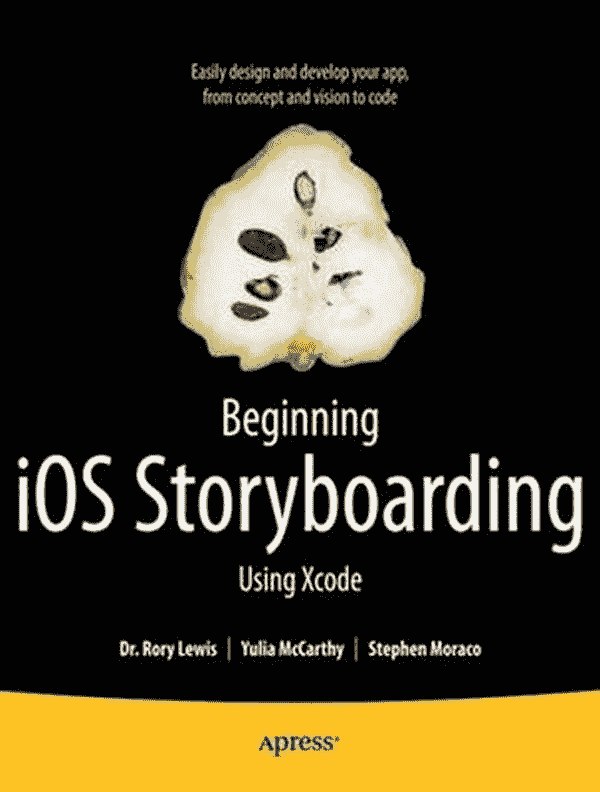
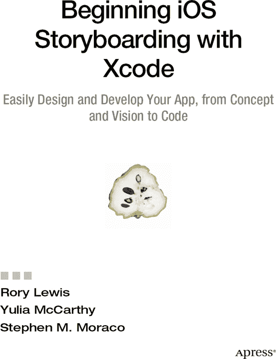

```





**使用 Xcode 开始 iOS 故事板开发**

版权所有 © 2012 由 Rory Lewis、Yulia McCarthy 和 Stephen M. Moraco 所有。

保留所有权利。未经版权所有者及出版商的书面许可，本书任何部分不得以任何形式或任何方式（电子或机械，包括影印、录音或任何信息存储或检索系统）进行复制或传播。

ISBN-13（平装版）：978-1-4302-4272-7

ISBN-13（电子版）：978-1-4302-4273-4

本书中可能出现商标名称、标识和图像。我们并未在每次出现商标名称、标识或图像时都使用商标符号，而是仅以编辑方式使用这些名称、标识和图像，以维护商标所有者的权益，无意侵犯其商标。

本书中使用的商品名称、商标、服务标志及类似术语，即使未明确标识，也不应被视为对其是否受所有权保护的意见表达。

总裁兼出版商：Paul Manning
      主编辑：Matthew Moodie
      技术审校：Matthew Knott
      编辑委员会：Steve Anglin、Mark Beckner、Ewan Buckingham、Gary Cornell、Morgan Ertel、
            Jonathan Gennick、Jonathan Hassell、Robert Hutchinson、Michelle Lowman、Matthew Moodie、
            Jeff Olson、Jeffrey Pepper、Douglas Pundick、Ben Renow-Clarke、Dominic Shakeshaft、Gwenan
            Spearing、Matt Wade、Tom Welsh
      协调编辑：Brigid Duffy
      文字编辑：Corbin Collins
      排版：Bytheway Publishing Services
      索引编制：SPi Global
      美术设计：SPi Global
      封面设计：Anna Ishchenko

全球图书贸易由 Springer Science+Business Media, LLC. 发行，地址：233 Spring Street, 6th Floor, New York, NY 10013。电话：1-800-SPRINGER，传真：(201) 348-4505，电子邮件：`orders-ny@springer-sbm.com`，或访问 [`www.springeronline.com`](http://www.springeronline.com)。

如需了解翻译授权，请发送电子邮件至 `rights@apress.com`，或访问 [`www.apress.com`](http://www.apress.com)。

Apress 和 friends of ED 的图书可批量购买用于学术、企业或促销用途。大多数图书也提供电子版和许可证。如需更多信息，请参考我们的特殊批量销售–电子书授权网页：[`www.apress.com/info/bulksales`](http://www.apress.com/info/bulksales)。

本书中的信息按“原样”分发，不含任何担保。尽管在准备本书时已采取一切预防措施，但作者和 Apress 均不对因本书所含信息直接或间接造成的任何损失或损害对任何个人或实体承担责任。

本书的源代码可向读者提供，网址为 [`www.apress.com`](http://www.apress.com)。

*献给我的母亲 Adeline。感谢你给予的那 13 个小时！爱你。——Rory*

*献给我了不起的母亲——我所认识的最体贴、最支持我的人。感谢你无尽的爱！——Yulia*

*献给我的妻子 Donna，我们已携手走过 31 年，你是我此生与在这个美丽星球上旅行的最佳伴侣。没有你的支持和鼓励，我们共度的时光里我的许多努力都将无法实现，也会失去很多乐趣。期待我们未来的岁月。*

*献给我的儿子 Steve，感谢你与我们共同分享许多努力，感谢你为我们首个联合 iOS 应用（App Store 中的 9CardGolf）所做的图形贡献，但最重要的是，你始终如一的自我激励和不断学习是我（也希望能成为他人）的光辉榜样，并且你保持着对了解我们所处宇宙的年轻热情。我期待看到你的摄影热情带你走向何方，也期待你未来的生活。——Stephen*

## 内容概要

 前言：关于作者

 关于合著作者

 关于技术审校

 引言

 第 1 章：预备知识

 第 2 章：基础

 第 3 章：使用 MapView 进行故事板开发

 第 4 章：构建实用工具应用

 第 5 章：为基于页面的应用构建故事板

 第 6 章：使用故事板掌握表视图：Core Data 设置

 第 7 章：使用故事板掌握表视图：设计流程

 第 8 章：使用故事板掌握表视图：编写后端代码

 第 9 章：单一视图 #3：wanderBoard 第一部分

 第 10 章：单一视图 #3：wanderBoard 第二部分

 第 11 章：单一视图 #3：wanderBoard 第三部分

 第 12 章：你已走了多远

 索引
```


