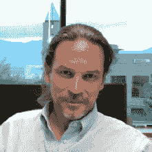
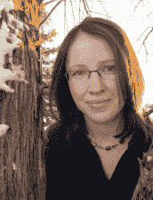

# 目录

 前言：关于作者
 关于合著者
 关于技术审校者
 引言
 第 1 章：预备知识
必备条件与附件
获取 Mac
获取 OS X
成为开发者
为你的第一个 iPhone/iPad 项目做好准备
安装 DemoMonkey
 第 2 章：基础知识
helloAlien：一个快速示例应用
预备知识
步骤 1：创建按钮，跳转到辅助视图
步骤 2：将信息从辅助视图（Alien 视图）传回主视图
步骤 3：将信息发送到辅助视图（Alien 视图）
步骤 4：自定义转场
 第 3 章：使用 MapView 进行故事板设计
flickrPhotoMap：一个单视图应用
预备知识
步骤 1：建立数据连接并在地图上显示带地理标签的照片
步骤 2：从标注弹窗跳转到辅助场景
步骤 3：创建模态场景，让用户为你的照片评分
 第 4 章：构建实用工具应用
utilityScales：一个实用工具应用
预备知识
步骤 1：设置
步骤 2：准备故事板
步骤 3：编码翻转面视图控制器
 第 5 章：为基于页面的应用进行故事板设计
futureTravel：一个基于页面的应用
预备知识
步骤 1：从模板创建
步骤 2：准备故事板
步骤 3：代码编写——ModelController
步骤 4：代码编写——DataViewController
步骤 5：代码编写——RootViewController
 第 6 章：结合故事板掌握表格视图：Core Data 设置
bookManager：一个主从应用
预备知识
3 步中的第 1 步：设置文件、图像、Core Data 和数据模型
 第 7 章：结合故事板掌握表格视图：设计流程
步骤 2：为应用进行故事板设计
配置主场景
设计顶层视图：类别场景
设计顶层视图：作者场景
布局主要书籍列表视图：书籍场景
故事板设计详情视图：书籍详情场景
创建输入和保存新数据的 UI：添加书籍场景
最后调整
 第 8 章：结合故事板掌握表格视图：编码后端
步骤 3：在故事板元素背后插入代码，并微调几处故事板必备项
创建自定义 UITableViewCell 子类
修改详情视图控制器
创建 SelectionViewController
编码添加书籍视图控制器
连接书籍场景
为类别场景添加代码
实现作者场景
收尾并加载测试数据
 第 9 章：单视图 #3：wanderBoard 第一部分
wanderBoard：一个单视图应用
预备知识
我们如何创建 3D 景观
步骤 1：设置文件、项目设置和资源
步骤 2：准备故事板
 第 10 章：单视图 #3：wanderBoard 第二部分
步骤 3：完成视图控制器的头文件和实现文件
步骤 4a：在辅助下创建接下来的八个场景
场景 2
场景 3
场景 4
场景 5
场景 6
场景 7
场景 8
场景 9
 第 11 章：单视图 #3：wanderBoard 第三部分
步骤 4b：创建最后的九个场景
 第 12 章：你已经走了多远
最后的思考
一个应用中的多个故事板文件
将所有.xib 文件放入一个故事板篮子
你说“并非所有场景都恰当地放置在故事板文件中”是什么意思？
嘿，我有问题！
 索引

## 前言：关于作者

三位作者找到了一种绝妙的方式，既能引导初学者入门 Storyboarding，又能向使用 Objective-C 的老派程序员展示一种学习与调试这一神奇工具的新颖方法。本质上，你拥有一位向初学者解释复杂 Objective-C 的专家、一位前苹果 iOS 实习生，以及一位极为成功的老派程序员，他们共同引导来自不同背景的众多人士，全面掌握 Storyboard 从创建、调试到优化的全过程。

Rory Lewis 博士

Stephen M. Moraco

Yulia McCarthy

### Rory Lewis 博士

Rory 和我于 1983 年在洛杉矶相识。他让我想起我最喜欢的电影角色之一：Buckaroo Banzai——总是同时向六个方向前进。如果你拦住他问他正在做什么，他会给出全面且细节惊人的回答。他自律、风趣且友好，拥有一种不可思议的能力，能用简单且生动的方式解释高度抽象的概念。他总是能完成自己设定的目标，并且也会帮助你实现同样的目标。

### 为何你会与刘易斯博士产生共鸣

在雪城大学攻读计算机工程专业期间，罗里挣扎着通过课程并赚取足够的钱来养活妻子和两个年幼的女儿。1990 年，他在 L.C.史密斯工程学院的计算机实验室获得了一份理想的校内勤工俭学岗位——担任监考员。尽管他当时在电气工程专业的课程上也很吃力，但他始终坚守在服务台前。这对罗里来说是一次令人望而生畏的经历，因为他原本的职责只是协助同学们解决计算机实验室的*设备*问题，但他发现同学们总会提出更深更难的问题：“哥们，你搞懂微积分作业了吗？能教教我吗？！”

这些学生认为，既然罗里是监考员，他自然知道答案。内心充满恐惧和自我怀疑的他，寻找着既能帮助同学又不暴露自身不足的方法。罗里学会了这样开场：“我们回到基础来回顾一下。还记得上周教授给我们展示的那个方程吗……？”通过回溯基本原理，重新阐述并重塑这些概念，罗里开始掌握一种技巧，这种方法十有八九能引导出可行的解决方案。到了大四那年，罗里值班的夜晚，服务台前常常排起等候的学生长队。

### 跨越 17 年后

想象一下，一位长发、古怪的教授走进科罗拉多大学斯普林斯分校的校园，他身穿一种老派与不羁的惊人混搭装束。当他步入工程学院大楼时，迎接他的是学生和教职员工的笑脸和热情的问候，而他们或许都在心里对他的花呢夹克、感恩而死乐队的 T 恤、卡其裤和人字拖摇头不已。当他走进计算机科学系的走廊时，办公室外已经站着一排学生。这让人回想起早年他在计算机实验室担任监考员时，在服务台前等待他的那排学生。他们转身向他打招呼：“早上好，刘易斯博士！”这些 UCCS 的学生中，许多人甚至不是他班上的，但他们知道刘易斯博士无论如何都会见他们并给予帮助。

### 过去——现在——未来

刘易斯博士拥有三个学位。他在雪城大学获得了计算机工程理学学士学位。雪城大学的 L.C.史密斯工程学院是全美顶尖的学院之一。英特尔、AMD 和微软都会将他们的顶尖员工送到那里攻读博士学位。

完成学士学位（专注于微处理器中电子电路的数学）后，他穿过校园广场，进入了雪城大学法学院。在法学院的第一年暑假，全美业务最繁忙的律师事务所 Fulbright & Jaworski 招募罗里去其奥斯汀办公室工作，那里的一些律师专攻高科技知识产权专利诉讼。作为其书记员工作的一部分，刘易斯参与了著名的 *AMD 诉 Intel* 案；他负责帮助高级合伙人评估微处理器电路数学的算法。

在法学院的第二年暑假，另一家共同参与 *AMD 诉 Intel* 案工作的律师事务所——Skjerven, Morrill, MacPherson, Franklin, & Friel——招募罗里去其硅谷分部（圣何塞和旧金山）工作。在沉浸法律领域数年后，刘易斯在雪城大学获得了法学博士学位，他意识到自己的热情在于计算机的*数学*，而非硬件和软件的法律后果。他更偏爱一个培育性和创造性的环境，而不是法律本身固有的争斗和辩论。

离开学术界三年后，罗里·刘易斯南下前往北卡罗来纳大学夏洛特分校攻读计算机科学博士学位。在那里，他师从兹比格涅夫·W·拉斯博士，后者因其在数据挖掘算法与方法、分布式数据挖掘、本体论以及多媒体数据库方面的创新而享誉全球。在攻读博士学位期间，刘易斯为计算机工程专业的本科生讲授计算机科学课程，并为 MBA 学生讲授电子商务和编程课程。

获得计算机科学博士学位后，罗里接受了科罗拉多大学斯普林斯分校计算机科学系的终身教职，他的研究方向是神经科学的计算数学。最近，他合著了一份关于癫痫起源（涉及下丘脑）数学分析的资助申请书。然而，随着苹果革命性的 iPhone 及其独特灵活的平台——*以及市场*——对于迷你应用、游戏和个人计算工具的出现，他变得兴奋起来，开始为了个人乐趣而进行实验和编程。在自己熟练掌握之后，刘易斯认为他可以开设一门包含*非*工程师也能参与的 iPhone 应用课程。凭借作为 iPhone beta 测试者的内部知识，甚至在 2010 年 4 月正式发布之前，他就开始将拟议的 iPad 平台参数整合到他的教学计划中。

这门课程获得了巨大成功，来自学生和同事的反馈都是压倒性的积极。当有人提出将他的课程改编成一本由 Apress 出版社出版的书籍时，刘易斯博士欣然抓住了这个机会。他高兴地接受了邀请，将他的课程大纲、课堂笔记和视频转化成了您现在手中的这本书。

### 为何撰写本书？

刘易斯博士撰写本书的原因，与他最初决定为工程专业与非工程专业学生开设课程的原因如出一辙：挑战与乐趣并存！刘易斯认为，iPhone 和 iPad 是“……有史以来最酷、最强大、技术最先进的工具之一——毫无疑问！”

令他着迷的是，在炫丽的高清图像和有趣的小图标构成的触摸屏之下，iPhone 和 iPad 是用`Objective-C`（一门极其复杂且高级的语言）进行编程的。越来越多的学生和同事找到刘易斯，想为 iPhone 开发应用程序，并向他请教其想法的可行性。似乎每一次 iPhone 系统更新（更不用说 iPad 扩展界面的问世），都使得人们对编程应用程序的兴趣之潮愈发汹涌。那些绝妙而富有创意的想法，只需找到合适的渠道，就能转化为恰当的格式，继而推向世界。

然而，一般而言，撰写`Objective-C`书籍的作者，其目标读者是那些精通`Java`、`C#`或`C++`的高级开发者。因此，对于那些没有此类知识背景、却对 iPhone/iPad 应用程序有绝妙想法、但似乎无从求助的普通人，刘易斯博士决定开设这样一门课程。他意识到，明智的做法是：课程前半部分使用自己的笔记，而后半部分则去探索他能找到的最佳现有资源。

在按此计划推进的过程中，刘易斯对《Beginning iPhone 3 Development: Exploring the iPhone SDK》一书印象最为深刻。这本由 Apress 出版的畅销教学书籍，作者是 Dave Mark 和 Jeff Lamarche。刘易斯断定，他们的书为他的课程提供了一个极佳的高级目标，是一种“踏脚石”式的方法，旨在帮助学习者全面、流畅地为苹果所有多点触控设备进行编程。

在刘易斯博士的课程成功授课后，一次与 Apress 代表的交谈中，他偶然提到自己直到学期中期才开始使用那本书，因为他必须首先让非工程专业的学生跟上进度。编辑建议将他的笔记和提纲改编成一本入门指南——一本面向技术水平较低的编程人群的入门书籍。此后，剩下的就只是时间和细节问题了——比如整理和修订刘易斯博士广受欢迎的教学视频，使其能够提供给其他那些渴望为自己编程 iPhone 和/或 iPad 应用程序的非工程专业学习者。

于是，这便是这位古怪教授撰写本书的缘由。我们希望你能受到鼓舞，将此书带回家中，开始学习。用这些知识武装自己，现在就开始改变你的人生吧！

本·伊斯顿  
作者、教师、编辑

### 斯蒂芬·M·莫拉科

斯蒂芬拥有超过 30 年的软件工程经验。他参与过使用高级语言（如`PL/I`、`RPG`、`ANSI C`、`C++`、`C#`、`Objective-C`）以及他两只手都数不过来的多种微处理器的汇编语言进行开发的项目。在 1989 年加入惠普/安捷伦科技之前，他曾是一名嵌入式系统设计师/开发者。斯蒂芬曾是大型逻辑分析仪团队的成员，负责构建系统恢复介质，并为多通道定制数据采集`ASIC`编写触发/捕获驱动程序。作为一名软件过程工程师，他曾与中型研发团队合作，开发提高软件产品发布速度和初始发布质量的技术。斯蒂芬还设计并为惠普生产的光盘驱动器编写了一个操作系统。

斯蒂芬的职业同时也是他的爱好。他坚信要不断学习，并不断实践所学。在他的整个职业生涯中，他都将参与非工作相关的项目开发作为自我培训的一种方式。他喜欢为自己设计并构建家庭控制和通用实验用的软硬件系统。斯蒂芬还为搭载在业余无线电卫星上的关键集成系统开发了固件，并为测试这些系统开发了硬件和软件。

斯蒂芬和他的儿子史蒂夫都喜欢搭建大型乐高模型，并研究乐高 Mindstorms 机器人。儿子史蒂夫正在学习摄影，过去五年里，他们一起为科罗拉多州第一届乐高联盟做志愿者。史蒂芬爸爸在科罗拉多州各地为 9 至 14 岁的孩子举办的 Mindstorms 机器人锦标赛中担任裁判，而儿子史蒂夫则通过摄影记录下这些赛事的激动瞬间。

2009 年秋天，父亲斯蒂芬和儿子史蒂夫一起在科罗拉多大学斯普林斯分校参加了一门`Objective-C`和 iOS 编程课程。此后不久，斯蒂芬创办了自己的公司 Iron Sheep Productions LLC，并以该公司名义销售他开发的硬件和软件。在惠普/安捷伦科技度过了成功的 22 年职业生涯后，斯蒂芬现已退休，是一名专业的软件工程师，同时也是一位成功的 iPhone 和 iPad 应用程序开发者，在 iTunes 商店销售他的应用。

### 尤莉娅·麦卡锡

尤莉娅是 InspireSmart Solutions, Inc.公司的一名高级 iOS 开发者，这家公司位于丹佛本地，专注于创新的移动商业解决方案。她从俄罗斯一所顶尖的古典大学获得数学学士学位后，前往科罗拉多州征服白雪皑皑的山峰，追寻她滑雪和冒险的梦想。不久后，她决定在科罗拉多大学丹佛分校攻读计算机科学研究生学位。在那里，选修了刘易斯博士的 iPhone 开发课程后，她很快转投 Mac 用户阵营，并将自己所有的热情以及在编程和解决复杂问题方面的惊人能力，都倾注到了 iPhone 和 iPad 应用的开发中，这自此成为了她新的激情所在。她惊人的天赋很快吸引了苹果公司的 iOS 招聘人员。在 2011 年夏季于加州库比蒂诺的苹果总部担任 iOS 应用与框架实习生，这段宝贵的经历之后，尤莉娅对 Cocoa Touch 编程的热情更加高涨，也愈发投入。她相信，人生就是不断追求新的地平线并挑战自我。作为一名程序员，这一理念与尤莉娅的内心非常契合。

从俄罗斯到科罗拉多大学丹佛分校，再到苹果公司位于库比蒂诺的 iOS 部门，尤莉娅相信，只要我们追随梦想，一切皆有可能。

## 关于合作作者

 **本·伊斯顿** 毕业于华盛顿与李大学，拥有哲学学士学位。他多元的背景涵盖音乐、银行业、航海、悬挂式滑翔和零售业。他的大部分工作都以某种形式与教育相关。本曾在学校任教 17 年，主要教授初中数学。最近，他作为软件培训师和实施顾问的经历，重新唤醒了他长久以来对技术领域的热情。作为一名自由撰稿人，他撰写过多篇科幻故事和剧本，以及为杂志和通讯供稿专题文章。本现居德克萨斯州奥斯汀，目前正在创作他的第一部小说。

## 关于技术审校

 **马修·诺特** 是一名学习平台开发者和 SharePoint 专家。他从小就学习编程，并从未停止过学习。作为一名经验丰富的`C`和`C#`开发者，马修最近开始开发 iOS 应用，以实现学习平台的移动化。他与妻子和两个孩子住在英国威尔士，并时常在自己的博客（`mattknott.com`）上撰写文章。

