# 第 1 章

### 准备工作

本章作为引言，将确保你拥有所有必要的工具和配件，以便能够充满信心地全面展开。阅读本书的可能有三类读者。第一类读者可以立即跳到第 2 章，无需阅读第 1 章。第二类读者可能只需要阅读第 1 章中的一个小节，然后继续。第三类读者在继续之前应该非常仔细地阅读第 1 章。

- *第一组*：你拥有一台 Mac。你有在 Mac 上使用 Xcode 编码的经验。你拥有最新的 iOS SDK 和最新版本的 Xcode。你还有使用 DemoMonkey 的经验，并且它已安装在你的机器上。如果上述条件都满足，我们第 2 章见。
- *第二组*：你拥有一台 Mac。你有在 Mac 上使用 Xcode 编码的经验。你拥有最新的 iOS SDK 和最新版本的 Xcode。但是，你没有使用 DemoMonkey 的经验，或者它没有安装在你的机器上。请查看本章中的“安装 DemoMonkey”一节，然后我们第 2 章见。
- *第三组*：你是一位知识探索者，已经开始踏上一条奇妙的道路。我们需要检查你的“背包”，确保你拥有旅途中所需的所有工具。那么，让我们从这开始吧。

## 必需品与配件

为了给 iPhone 和/或 iPad 编写程序，并跟随本书中的练习、教程和示例进行操作，你需要满足 6 个最低要求。你现在可能不完全理解这些要求，但没关系，请暂时跟着我的节奏，我将在逐步讲解中解释所有内容。

**注意：** 每当提到 *iPhone* 或 *iPad* 时，我们都指的是任何 iPhone 或 iPad OS 设备，包括 iPod touch。此外，当我们提到 *Macintosh HD* 时，你的设备可能名称不同。

简而言之，你需要六样东西：

- 一台基于 Intel 的 Macintosh
- 适合你的 Mac 的正确操作系统（OS X 10.7.4 Lion 或更高版本）
- 成为注册开发者或使用模拟器（本章后面将详细讨论）
- 适合你的 iPhone 的正确操作系统（iOS 5 或更高版本）
- 适合你的 iPhone 的正确软件开发工具包（SDK），用于运行名为 Xcode 的程序（4.3 及以上版本）
- 安装并运行 `DemoMonkey`

我们来逐一详细说明这些内容。

### 获取 Mac

如果你的 Mac 是 2006 年之后制造的，那就没问题。作者之一特意用一台 2008 年购买的 MacBook 编写所有程序。网上的所有视频都是从刘易斯博士 2006 年的 MacBook 上录制的；如果他从 2010 年的 iMac 播送，也会先在他 2006 年购买的 MacBook 上运行。

- 你不需要最新款的 Mac。如果你还没买，我们建议你买一台基础配置、无多余功能的 MacBook Air。
- 如果你确实有一台较旧的 Mac，也许可以增加一些内存。在 Apple Store 的 Genius Bar 预约一次免费咨询，询问他们是否能为你旧型号的 Mac 增加内存，如果可以，再询问最大可增加多少内存。然后明确地问：“这台旧电脑能运行 Lion（*至少* 10.7.1）和 Xcode 4.3 或更高版本吗？”请注意，本书中的某些应用程序可以在 Snow Leopard 系统上使用 Xcode 4.3 运行。但如果可能，尽量使用 Lion（至少 Mac OS X 10.7.4）和 iOS SDK 4.3。
- 如果你没有 Mac，又想跟着本书学习或编写 Objective-C 来制作 iPhone 应用程序，就需要买一台。请记住，如前所述，我们特意选择在 Apple 最小、最便宜的机型 MacBook 上编写和运行本书中的每一个程序。Apple 已停产 MacBook；目前销售 MacBook Air，售价 999 美元，比作者的 MacBook 更先进。你可以在 eBay 和其他类似网站上购买 MacBook。请参见图 1-1。

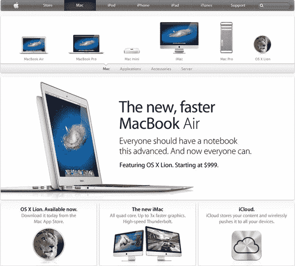

**图 1-1.** *作者使用市场上最便宜的 2006 年 Mac——MacBook 来完成本书中的所有编码和编译工作。作者的许多学生购买了图中所示的 999 美元 MacBook Air。*

### 获取 OS X

你需要正确版本的 OS X。在撰写本文时，该版本是 OS X 10.7.4。我们需要确保你的 Mac 内安装了最新最好的操作系统。我们收到很多电子邮件和论坛提问，发现你们很多人会想：“*啊，我的代码可能编译不正确，因为刘易斯博士的机器上有不同版本的 OS X 或 iOS……*”

**注意：** 即使你认为所有内容都是最新的，我们也建议你按照本节中的步骤操作，确保你的系统安装了最新的 OS X 和最新的 iOS。我们这么说是因为，随着你跟随本书学习并处理所有程序，有时你的代码在首次运行时可能无法正常工作。

为了确保你的系统足够新以配合本书内容，请执行以下操作：

1. 关闭 Mac 上所有正在运行的程序，只保留访达运行。
2. 点击屏幕左上角的小苹果图标，选择“关于本机”。你将看到图 1-2 所示的窗口。请确认显示的是 OS X 10.7.4。

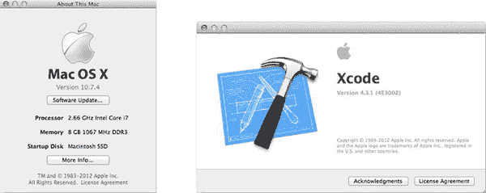

**图 1-2.** *这里可以看到刘易斯博士的 MacBook 使用的是 OS X 10.7.4。*

现在，确保你的 Mac 上安装了最新软件：

1. 关闭除访达之外的所有程序，再次点击左上角的苹果图标，选择“软件更新……”，如图 1-3 所示。
2. 如果有可用更新，点击“继续”并按照说明和四个屏幕提示进行操作，如图 1-3 所示。

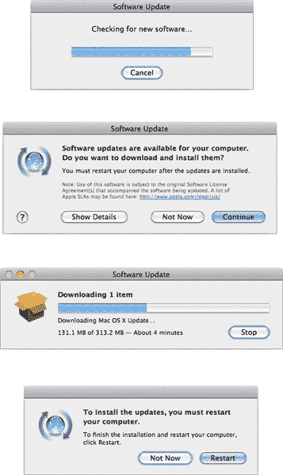

**图 1-3.** *顶部：检查新软件。从上数第二：下载新软件。从下数第二：等待软件下载。底部：点击“重新启动”让 Mac 正确安装新软件。*

如果你在阅读本书时发现你的 OS X 或 iOS 版本使得我的图片看起来过时了，请不要惊慌。我们有一个在线论坛，我和志愿者们乐于帮助他人。我们经常更新论坛，发布关于 OS X 和 iOS 最新更新的消息。你可以在这里访问论坛：

`www.rorylewis.com/ipad_forum/`
`http://bit.ly/oLVwpY`

### 成为开发者

你需要通过 iPhone/iPad 软件开发工具包（SDK）注册成为开发者，费用为 99 美元。或者，你可以支付 0 美元获得入门级的简单功能。

#### 做出选择

如果你是学生，很可能你的教授已经处理了这件事，你可能已经注册在你的教授名下。如果你不是学生，你需要决定你想成为哪种类型的开发者。以下是你的选择：

- *0 美元选项*：你可以前往 App Store 免费下载 Xcode。这没问题，但请记住，除非你成为开发者（支付 99 美元），否则你只能在 iPhone 或 iPad *模拟器*上看到你在本书中编写和编程的应用程序。这意味着你无法在真实的物理 iPad 或 iPhone 上运行它们。你也不能在 iTunes Store 上销售你的应用程序。最后，你将无法登录开发者网站查看代码片段和更新、测试新产品，或加入 Apple 在线社区。对于不确定是否要继续使用 Xcode 和编程的人来说，这可能是一个非常好的选择。如果是这种情况，请从 [`https://developer.apple.com/xcode/`](https://developer.apple.com/xcode/) 下载最新版本的 Xcode，然后在图 1-13 处与我相见。
- *99 美元选项*：如果你确实想在实际的物理设备（如真实的 iPad 或 iPhone）上运行你的应用程序，在 iTunes Store 上销售应用程序，并成为 Apple 开发者群体的一员——请继续阅读。

#### 安装 Xcode

让我们开始安装 Xcode。

1.  访问 [`http://developer.apple.com/programs/ios/`](http://developer.apple.com/programs/ios/) 或 [`http://bit.ly/rrrdjc`](http://bit.ly/rrrdjc)。您将看到一个与图 1-4 类似的页面。点击“立即注册”按钮。

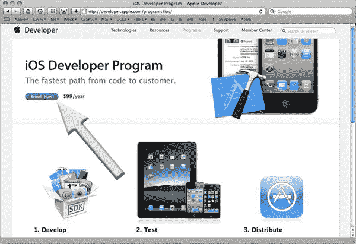

**图 1-4.** *点击“立即注册”按钮。*

2.  如图 图 1-5 所示，点击“继续”按钮。

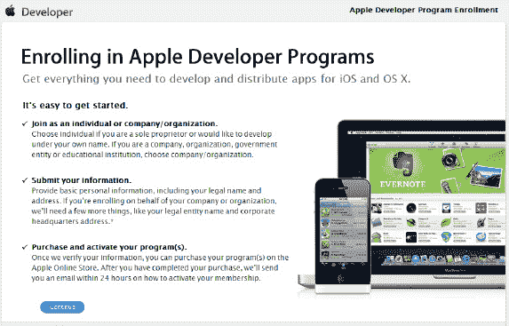

**图 1-5.** *点击“继续”按钮。*

3.  阅读本书的多数人会选择“我需要为……创建一个新账户”选项（图 1-6 中的箭头 1）。接着，点击“继续”按钮（箭头 2）。（如果您已有账户，说明您已经经历过此流程；请从“我目前拥有一个 Apple ID……”选项开始操作，我将在步骤 6 等您，届时您将登录 iPhone/iPad 开发页面并下载 SDK。）

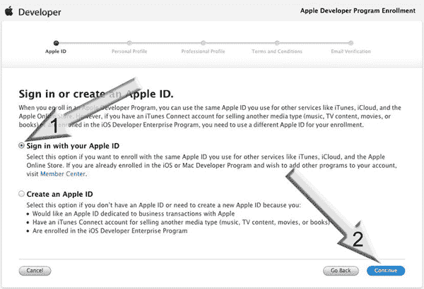

**图 1-6.** *点击“我需要为……创建一个新账户”选项以继续。*

4.  您很可能以个人身份注册，因此请点击 图 1-7 中所示的“个人”链接。如果您是以公司身份注册，请点击右侧的“公司”选项并按照相应步骤操作；然后跳到步骤 6。

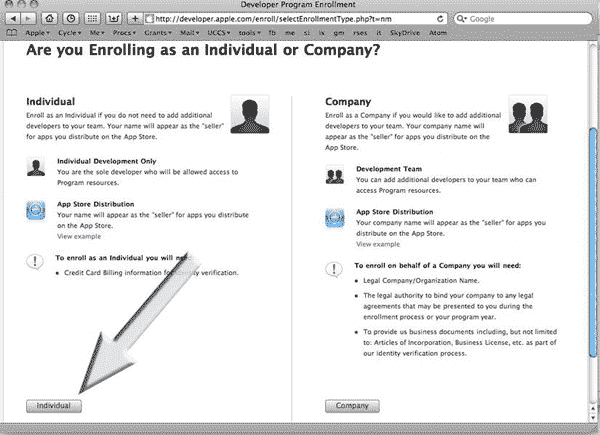

**图 1-7.** *点击“个人”选项。*

5.  如 图 1-8 所示输入您的所有信息，并支付标准计划 $99 的费用。这将提供您需要的所有工具、资源和技术支持。（如果您正在阅读本书，您其实不需要购买 $299 的企业计划——它适用于商业内部应用程序。）付款后，请妥善保存您的 Apple ID 和用户名；然后接收并适当处理您的确认邮件。

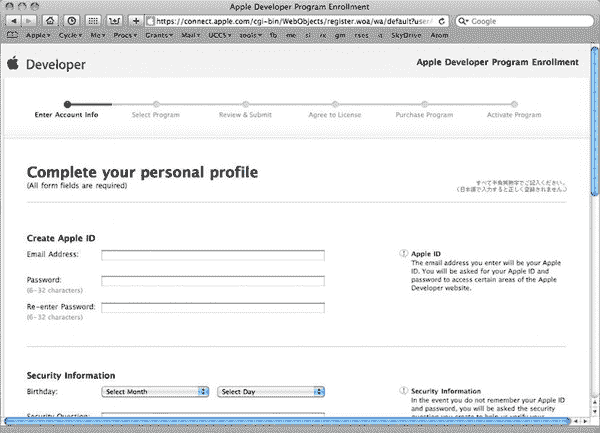

**图 1-8.** *相应地输入您的所有信息。*

**注意：** 在进入步骤 6 之前，请确保您已收到确认邮件并选择了一个密码，以完成成为一位真实的、已注册 Apple 开发者的最后一步。恭喜！

6.  使用您的 Apple ID 登录主 iOS 开发页面 [`http://developer.apple.com`](http://developer.apple.com)。该页面有三种类型的 Apple 开发人员图标。如 图 1-9 所示，点击 iOS 开发中心图标，该图标将引导您进入 iOS 开发软件下载页面。

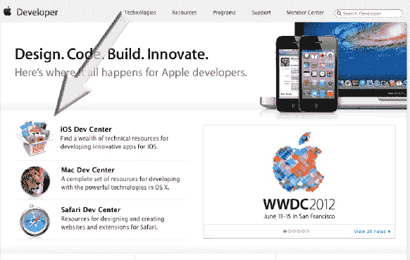

**图 1-9.** *现在请按箭头所示点击 iOS 开发中心图标。稍后您可能还需要为 Mac 电脑或 Safari 浏览器编写应用程序。*

7.  按照步骤 6 的描述使用您的用户名和密码登录后，您将看到一个类似于 图 1-10 的屏幕。iOS 开发中心包含构建 iOS 应用程序所需的所有工具。稍后您会在此处停留，但现在只需前往最新版 iOS SDK 的开发者页面。点击箭头指示的图标。

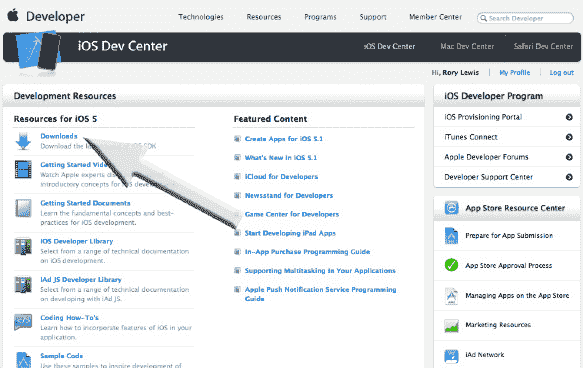

**图 1-10.** *“下载”链接将带您到页面底部，如 图 1-11 所示。*

**注意：** 在编写本书时，Xcode 4.3 和 iOS SDK 5 是最新的环境。当您阅读本书时，这些版本号很可能会更高。这不成问题——只需继续执行步骤 8。如果万一遇到了我们未曾预料的情况，这些问题将在我们的论坛中为您讨论和解决，论坛地址是 [`www.rorylewis.com/ipad_forum/`](http://www.rorylewis.com/ipad_forum/) 或 [`http://bit.ly/oLVwpY`](http://bit.ly/oLVwpY)。

8.  现在我们希望您点击最新版本。本节中的图示展示了印刷时的最新版本。当您阅读本书时，这些*肯定*会有所不同。目前最新版本是适用于 Lion 的 Xcode 4.3，因此请点击 图 1-11 中箭头指示的链接。

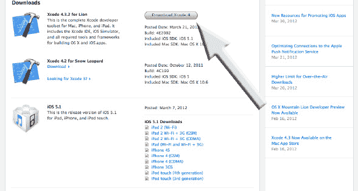

**图 1-11.** *点击“下载 Xcode 4”按钮将带您进入 Xcode 4 开发者页面。*

9.  点击“在 Mac App Store 中查看”按钮。请记住，如果版本高于 图 1-12 所示，界面可能略有不同，但我们相信您能应对。

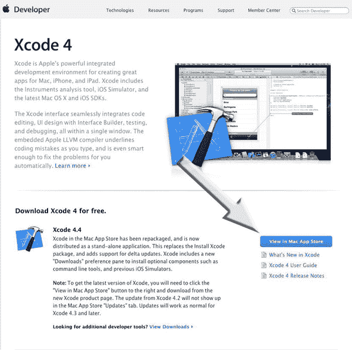

**图 1-12.** *点击“在 Mac App Store 中查看”链接。*

10. 如 图 1-13 所示，点击“安装”按钮。在下载过程中，“安装”按钮会变为“正在安装”。当 Xcode 和 iOS SDK 下载完成后，它会变为“已安装”。`Xcode` 的 iOS SDK 中包含 Apple 的集成开发环境 (IDE)。这是一个编程平台，包含一套工具、子应用程序和样板代码，使程序员能更轻松地完成工作。

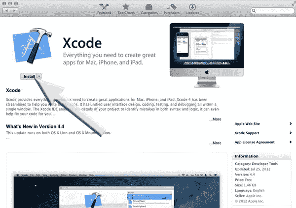

**图 1-13.** *点击“安装”，然后等待下载完成。*

安装好 `Xcode` 和 iPhone/iPad 模拟器工具并确保它们易于访问后，您就差不多可以开始行动了。

##### 关于 DemoMonkey

在加载最后一个名为 `DemoMonkey` 的工具之前，让我们先退一步，看看我们的目标。

多年来，我们发现教授学生代码最有效的方法是采用我们所谓的子系统方法，即教您哪些代码片段或部分适用在哪些情境下。在本书中，我们将使用一个很酷的程序，如果您看过最近的 WWDC，可能见过它：它叫做 `DemoMonkey`。本质上，您从 `DemoMonkey` 面板中拖出一个说明需要完成内容的标题，然后将其放入 Xcode 文件中相应部分的代码中，它就会神奇地转换为 `DemoMonkey` 文件的作者编写的代码。在您下载并编译创建 `DemoMonkey` 的 Xcode 项目之前，您需要确保 `Xcode` 能正常工作。因此，在下一节中，您将首先运行一个简单的应用程序，以确保 Xcode 环境一切正常。

## 准备你的首个 iPhone/iPad 项目

在开始你的第一个故事板应用之前，需要确保一切运行正常。假设你已经下载并安装了 `Xcode`，现在打开 `Xcode`。

1. 同时按下 `Command + Shift + N` (N)。这将打开一个新窗口，展示 `Xcode` 中不同类型的项目模板。
2. 图 1-14 展示了项目模板：主从应用、OpenGL 游戏、基于页面的应用、单视图应用、选项卡应用、工具应用和空应用。如 图 1-14 所示，点击单视图应用，然后点击下一步。

   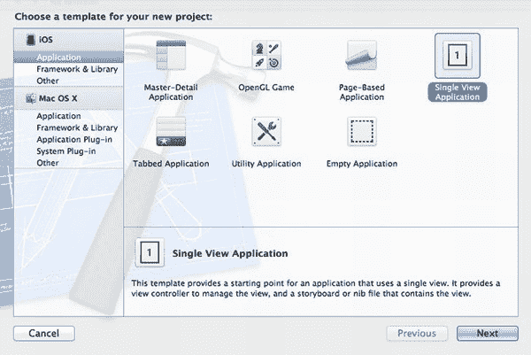

   **图 1-14.** *选择单视图应用，然后点击下一步。*

3. 屏幕上应该会显示与 图 1-15 非常相似的内容。首先，按照箭头 1 的指示，将你的项目命名为 `test`。选择 iPhone（箭头 2），然后点击下一步（箭头 3）。

   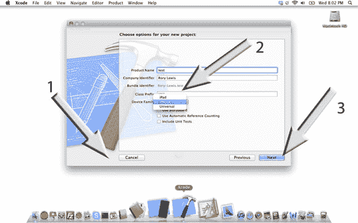

   **图 1-15.** *我们来试驾一下。*

   **注意：** 本次测试我们不使用故事板；我们只是想确认 `Xcode` 能构建一个简单的应用。因此，保持所有选项未选中——是的，包括暂时不要勾选“使用故事板”（如 图 1-15 所示）。

4. 图 1-16 显示了 `Xcode` 集成开发环境的初始视图。按照箭头指示，点击 `ViewController.h` 文件。

   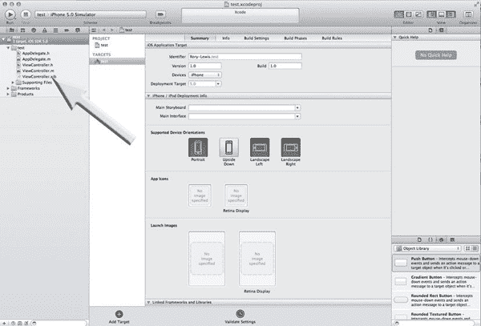

   **图 1-16.** *初始的集成开发环境（IDE）屏幕。*

5. 这将调出 图 1-17 所示的屏幕，我们希望你现在点击“运行”按钮（如箭头所示）来运行你的空白应用。哦耶！

   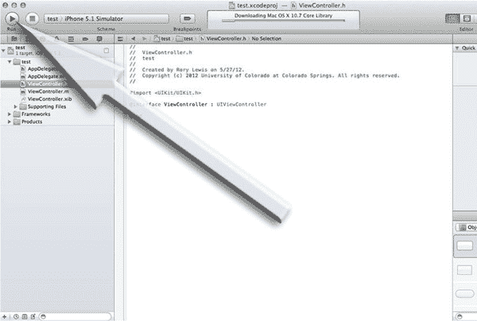

   **图 1-17.** *运行它！*

6. 如 图 1-18 所示，iPhone 模拟器会弹出。

   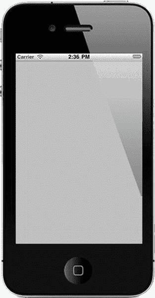

   **图 1-18.** *你的第一次试驾。*

恭喜！你已经加载了 `Xcode` 并进行了试驾。现在，让我们运行 DemoMonkey 并开始故事板开发。

### 安装 DemoMonkey

`DemoMonkey` 是一个可选工具，旨在帮助你跟随书中的项目进行学习。仅当你选择使用我们为每一章提供的 `.demoMonkey` 文件时才需要它，这些文件允许你将现成的代码片段拖放到 `Xcode` 中，以实现大部分步骤。否则，你仍然可以自己输入代码，如果你选择不为这本书使用 `DemoMonkey`，可以跳过本章剩余部分。

`DemoMonkey` 将使你的生活更轻松，让你更专注于你正在使用的代码——但你在本书中仍将面临挑战，这本身就是我们教学法的一部分。问题实际上在于当你遇到挑战时如何处理。

**注意：** 当你发现自己确实陷入困境时，你总可以重读相关章节，回放视频示例，或者——最重要的是——访问论坛，那里通常有很多人在线，包括我们，随时准备立即帮助你。我们可能会将你引荐给别人的解决方案，或者直接帮助你。所以，请前往论坛，向大家问好，沉浸其中：先向他人寻求帮助，然后再回到论坛帮助他人。论坛地址为 [`www.rorylewis.com/ipad_forum/`](http://www.rorylewis.com/ipad_forum/) 或 [`http://bit.ly/oLVwpY`](http://bit.ly/oLVwpY)。

现在 `Xcode` 已运行并能构建应用，你可以开始安装 `DemoMonkey` 了。

1. Apple 将 `DemoMonkey` 作为一个 OS X 示例代码项目提供，任何人都可以下载。请访问 [`http://developer.apple.com/library/mac/#samplecode/DemoMonkey/Introduction/Intro.html`](http://developer.apple.com/library/mac/#samplecode/DemoMonkey/Introduction/Intro.html) 或 [`http://bit.ly/v3BuKI`](http://bit.ly/v3BuKI)，如 图 1-19 所示。点击箭头所指的“下载示例代码”，并将 zip 文件保存到你机器上的所需位置。

   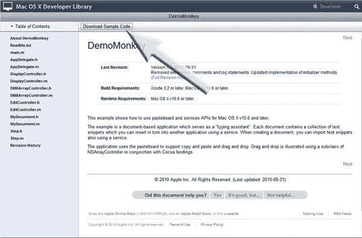

   **图 1-19.** *下载示例代码*

2. 双击 zip 文件解压，打开文件夹，然后双击 `DemoMonkey.xcodeproj` 文件，如 图 1-20 中箭头所示。Xcode 项目打开后，同时按下 `Command + B` (B) 来编译项目。

   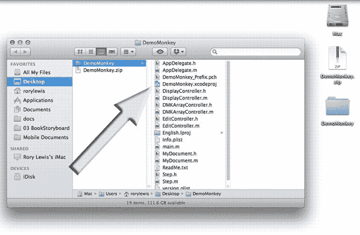

   **图 1-20.** *在你的 `DemoMonkey` 文件夹中打开 `DemoMonkey.xcodeproj` 文件。*

3. 在“构建成功”消息出现后，展开项目导航器，右键点击 `DemoMonkey.app` 图标，然后从上下文菜单中选择“在 Finder 中显示”，如 图 1-21 所示。

   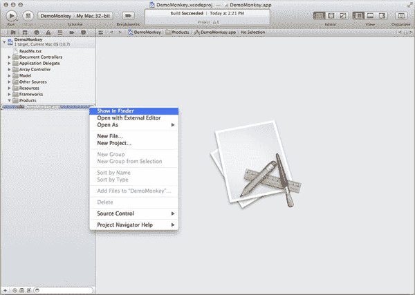

   **图 1-21.** *展开项目导航器，并从上下文菜单中选择“在 Finder 中显示”。*

4. 最后，当 Finder 打开包含你刚构建的应用的文件夹时，将 `DemoMonkey.app` 拖到你的“应用程序”文件夹中，如 图 1-22 所示。

   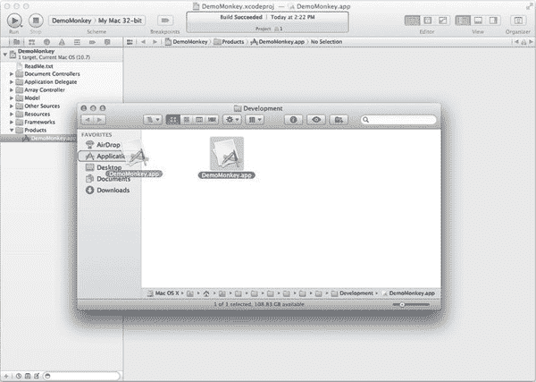

   **图 1-22.** *将 `DemoMonkey.app` 拖到你的“应用程序”文件夹中。*

**注意：** 如果出于某种原因你无法重现本节中的步骤，你可以通过此链接从我们的网站下载编译好的 `DemoMonkey.app`： [`www.rorylewis.com/docs/02_iPad_iPhone/Storyboarding%20Book/Storyboarding%20Video%20Tutorials.html`](http://www.rorylewis.com/docs/02_iPad_iPhone/Storyboarding%20Book/Storyboarding%20Video%20Tutorials.html)。然后简单地将其拖到你的“应用程序”文件夹即可。

现在，你准备好开始行动了！

