# 第 2 章


## 基础

随着 iOS 5 的发布，苹果为 iOS 开发者提供了包含超过 1500 个 API 的更新版 SDK，其中**故事板（Storyboarding）** 是最引人入胜的功能之一。

那么，什么是故事板？它又如何让 iOS 开发者的工作变得更加轻松呢？

在介绍故事板时，我们将一步步探索这个出色的新工具。故事板允许你利用 Xcode 设计工具中内置的新故事板功能来布局应用的工作流程。故事板专为使用导航栏和标签栏在视图之间进行切换的应用而设计，通过为你管理视图控制器来简化开发过程。你可以指定在视图间切换时使用的转场和连线（segues），而无需手动编写代码。通过故事板，你可以无缝交互并连接应用中的所有屏幕，免去了在屏幕间转场以及触发转场的控件所需编写的繁琐代码。这让你能以图形化方式查看应用中所有可能的路径，极大地减少了为复杂的多视图应用编写代码的工作量。

在深入探讨使用故事板创建应用的所有细节之前，让我们先快速了解一下这个新开发者工具背后的原理。

你可能已经知道，自 Xcode 4 发布以来，界面构建器（IB）已完全集成到 Xcode IDE 中，因此不再需要单独的应用程序来构建用户界面（UI）。在项目中选择一个界面文件（`.nib`/`.xib`）即可在 Xcode 中打开 IB 编辑器，在那里你可以随心所欲地调整 UI。

故事板是 Xcode 4.2 中引入的一种新的 IB 文件，它允许你在一个地方查看应用的整个 UI，包括应用各部分之间的转场以及触发这些转场的控件，因此你可以非常方便地概览整个应用。它类似于 `.nib`/`.xib` 文件，区别在于它为你管理多个视图控制器，并允许你指定从一个视图切换到另一个视图时使用的转场，而无需手动编码。你可以将故事板视为一组迷你 `.xib` 文件及其之间的转场和/或关系的集合。

借助内置的故事板功能，你现在可以在编写任何代码之前，以可视化的方式布局应用的工作流程！它还能减少为复杂的多屏幕应用编写代码的工作量。

是否曾好奇神秘的 `.storyboard` 文件背后是什么？答案可能会让你惊讶：它是 XML（可扩展标记语言）——没错，就是那个在 Web 服务器通信和各种 Web 应用中广泛使用的老牌 XML。因此，在底层，故事板只是一个以特殊方式格式化的文本文档，它定义了应用 UI 的对象图，iOS 在运行时根据文档中指定的规则解释并渲染 UI 元素。这个 XML 文件记录了故事板中每个 UI 元素的所有属性，以及它们之间的转场和/或关系。

事实上，你可以亲自验证这一点。打开 Xcode 并创建一个新项目。在第一个对话框屏幕中选择“单视图应用”模板。点击“下一步”。为你喜欢的项目命名，但确保勾选了“使用故事板”选项。将其保存到你喜欢的位置。打开新项目后，你会看到 Xcode 为你创建了一个名为 `MainStoryboard.storyboard` 的文件。在项目导航器中选择该文件，如图 2.0A 所示。现在，点击主工具栏右上角的“版本编辑器”图标，然后点击右下角的“日志模式”图标，如图 2-0B 所示。你现在可以看到故事板文件背后的 XML 了。是不是不太美观？想象一下，当你向其中添加大量 UI 元素后，它会变得多么复杂和难以阅读？幸运的是，界面构建器会以图形元素的形式为你优雅地渲染它，与原始 XML 相比，交互体验要愉悦得多。

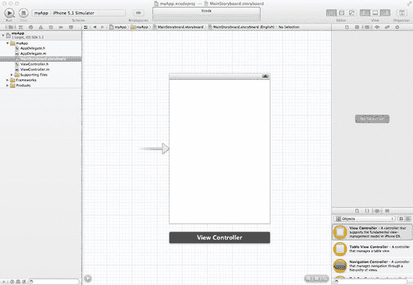

**图 2-0A.** *单视图应用模板的标准故事板文件*

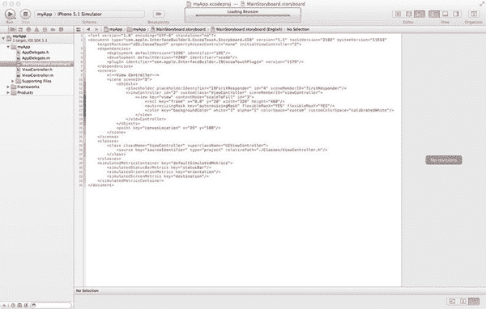

**图 2-0B.** *以 XML 文档形式查看的故事板文件*

现在你已了解故事板实现背后的秘密，让我们快速一瞥它初看起来的样子。

你可能已经注意到，Xcode 为单视图应用模板创建的基本故事板与你之前见过的任何常规 `.xib` 文件几乎相同，只有少数例外：有一个指向主视图的传入箭头，并且在主视图下方有一个写着“视图控制器”的黑色容器。这两个元素都有非常明确的用途。由于故事板可以包含多个视图控制器，你需要一种方法来指定应用启动时应加载哪一个；箭头指向的视图控制器将是应用启动时呈现给用户的第一个视图。要更改应用的初始视图控制器，请将箭头拖放到故事板中你想要首先呈现的任何视图控制器上。

那么黑色容器呢？它是每个视图控制器场景所谓的“停靠栏”。如前所述，故事板可以被视为一组 nib 文件，每个 nib 文件都由一个视图控制器类（默认或自定义）和一个第一响应者控制。

**注意：** 第一响应者是一个占位符对象，代表响应者链中的第一个对象，由 UIKit 框架在运行时动态确定。该对象首先接收多种事件，例如触摸、按键事件、动作消息等。在 iOS 应用中，没有单一的第一响应者对象——第一响应者始终是触摸目标所在的视图，通常是当前选中的对象或最前面窗口中具有当前焦点的对象。

停靠栏让你可以轻松访问刚才描述的两个对象，在常规的 nib 文件中，你通常会在文档大纲的顶部看到它们。通过点击停靠栏，你可以看到代表视图控制器和第一响应者占位符对象的图标，如图 2-0C 所示。你可以使用这些引用图标快速连接 `IBOutlet` 并为你的 UI 元素指定 `IBAction`。故事板中的每个视图控制器都有一组这两个对象，因此你可以通过每次只专注于一个特定屏幕，方便地编辑每个故事板场景的所有必要细节。此外，停靠栏可能包含添加到场景中的其他对象，例如手势识别器、导航项等。当你进行实际编码时，你会更好地理解如何使用它们。

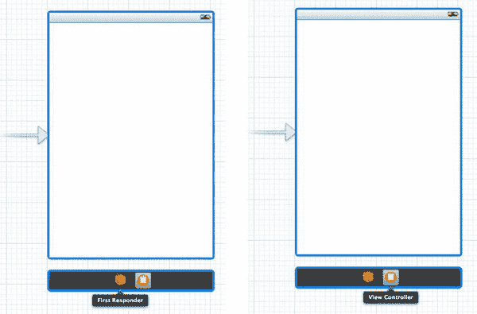

**图 2-0C.** *带有第一响应者和视图控制器对象的场景停靠栏*


我们将为你简要概述在开始为 App 制作故事板之前需要了解的主要高级概念。

图 2-0D 展示了一个标准故事板文件的主要组件，当你在项目中选用“主-从应用程序”模板时，Xcode 会为你创建该文件。现在，我们将解释这些关键组件的作用以及它们是如何协同工作的。

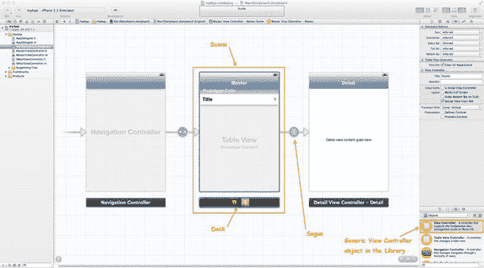

**图 2-0D.** *故事板的主-从应用程序模板*

故事板中有两个主要概念：场景（Scene）和转场（Segue）。

*场景*是一个视图控制器，它可以表示 App 中的一个屏幕，也可以仅仅表示一个主要的组件区域（例如分割视图控制器中的一个分割视图面板）。你可以在这里进行所有之前在 nib 文件中操作过的事情：拖放并重新排列 UI 元素（如标签、文本字段和图片），调整它们的大小，在属性检查器中设置它们的属性，等等。

*转场*定义了故事板中的导航。它指示如何从点 A 到达点 B。你通常通过选择一个事件源（例如按钮或表格视图单元格）并选择一个要过渡到的场景来创建转场。你还可以选择想要使用的动画类型。只需进行简单的选择，即可使用所有 Apple 内置的动画。此外，你甚至可以为自定义转场创建自己的自定义动画。

因此，你将使用场景和转场来构建你的应用程序 UI。

**注意：** 你的 App 中可以有多个故事板。你只需要在 `[appName]-Info.plist` 文件中，于“Main storyboard file base name”（主故事板文件基本名称）键下指定主故事板的名称即可，该键的默认值是 `MainStoryboard`。

你从一个代表第一个场景（初始视图控制器）的视图控制器对象开始。要为你的故事板获取视图控制器，你需要从对象库中选择“对象和控制器”（就像你对 nib 文件中所有其他 UI 元素所做的那样），然后将你需要的视图控制器拖放到故事板画布上。每个视图控制器始终管理着你的 App 中的一个场景。

**注意：** 在 iPhone 上，每个场景代表单个屏幕的内容。对于 iPad 应用程序，一个屏幕可以由多个场景的内容组成（例如在分割视图控制器的情况下）。

其中最重要的概念之一是数据如何传递。这里有一个非常经典的场景：一个主-从应用程序，你在表格视图中显示一些数据，当用户点击某个单元格时，会显示一个详细视图，展示关于所选内容的附加信息。在这种情况下，你必须将对所选对象的引用发送给详细视图，以便它确切知道要显示什么。

故事板为此提供了相应的 API。每个 `UIViewController` 都有一个名为 `prepareForSegue:sender:` 的方法，该方法旨在被重写。你可以在这里编写代码，这些代码将在每次触发转场时生效。

转场和标签、图像视图一样，都是 UI 元素。你可以在故事板中选择一个转场并检查其属性。你可以通过检查每个转场的标识符属性来区分它们，该属性可以在属性检查器中设置。在本章中，我们将向你展示如何执行此操作，并涵盖其他几个主要的故事板方面。

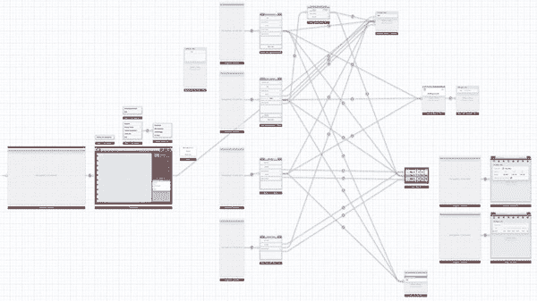

**图 2-0E.** *故事板在专业环境中的应用*

为了说明故事板确实被广泛使用，即使是在大型项目中，图 2-0E 展示了在作者的一位客户那里正在使用的九个基于故事板的项目之一。此图表明，即使在专业层面，故事板也已站稳脚跟。

那么，闲话少说，让我们开始吧。

### helloAlien：一个快速示例应用程序

首先，我们将向你介绍故事板的四个基本概念：

*   用很少甚至不用代码即可轻松创建视图间的过渡。
*   将信息从次级视图传回主视图。
*   将信息从主视图发送到次级视图。
*   使用用户创建的视觉效果在视图之间进行过渡。

在我们的示例应用程序中，我们通过以下方式演示这四个概念：

*   创建一个按钮，用于触发从主视图到次级视图的过渡。
*   将一个“是/否”值从次级视图（外星人视图）传递到主视图。
*   将用户输入的文本从主视图发送到次级视图（外星人视图）。
*   创建一个自定义的转场（读作“segway”），用于在两个视图之间实现淡出/淡入效果。

为此，我们将编写一个简单的 App，询问外星人是否存在。转到次级视图，你会看到一个开关，外星人可以将其打开——当然，前提是外星人存在。如果外星人将开关拨到“开”的位置，那么当你返回主视图时，会出现一条消息，表示他确实存在。然后，你可以对外星人说些什么，你会在次级视图的外太空空间中看到这条消息。最后，你将创建一个自定义转场，以一种美观的方式将你从主视图带到次级视图。那么，让我们开始吧！

### 准备工作

与所有章节一样，我们为你提供了 Dr. Lewis 完全按照本书所述编写和运行代码的视频。你也可以下载视频中的代码，并直接“按原样”在本书中使用。你还可以下载每章中使用的 DemoMonkey 文件和图像。

这些下载文件位于 [`http://bit.ly/sMRvAP`](http://bit.ly/sMRvAP)，如 图 2-1 所示。

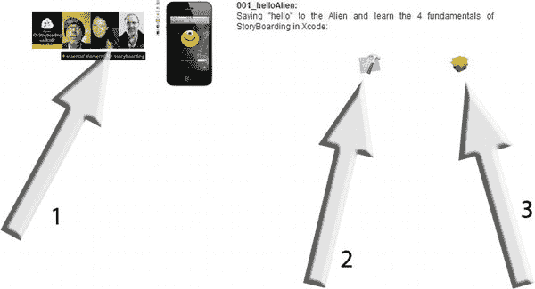

**图 2-1.** *本章的视频、代码和文件*

在 图 2-1 中，箭头 1 指向本章视频的一张图片，位于 [`http://bit.ly/tNKUij`](http://bit.ly/tNKUij)。箭头 2 指向一个 Xcode 图标，链接到本章的 Xcode 项目，位于 [`http://bit.ly/QSYAV6`](http://bit.ly/QSYAV6)。箭头 3 指向一个图标，链接到本章所需的所有文件，包括位于 [`http://bit.ly/Qxr16s`](http://bit.ly/Qxr16s) 的图像和 DemoMonkey 文件。如果你需要更多帮助，请访问论坛 [`http://bit.ly/oLVwpY`](http://bit.ly/oLVwpY)。

在开始之前，请确保你已经下载了位于 [`http://bit.ly/Qxr16s`](http://bit.ly/Qxr16s) 的图像和 DemoMonkey 文件，并在桌面上打开了它们。


#### 第 1 步：创建一个能跳转到次级视图的按钮

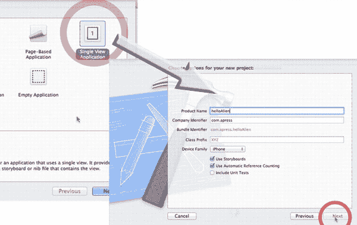  
**图 2-2.** *启动一个单视图应用程序。*

1. 打开 Xcode，点击 `+``+N`（文件  新建  项目），如图 2-2 所示。选择“单视图应用程序”并按回车键。将其命名为 `helloAlien`。我们使用了公司标识符 `com.apress`。你可以随意命名，但如果你觉得有可能需要随时将你的代码与我们的进行比较，请像我们一样将其命名为 `com.apress`，以减少混淆的可能性。我们不会使用类前缀。确保选择 iPhone，并勾选“使用 Storyboard”和“使用自动引用计数”。点击“下一步”，系统会提示你选择保存项目的位置。选择一个位置并点击“创建”。

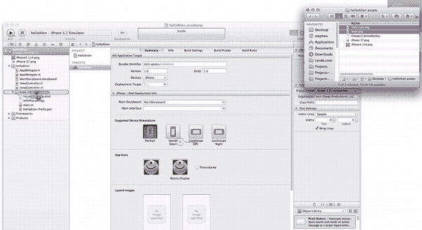  
**图 2-3.** *拖入图片。*

2. 点击导航树根部的项目图标，导航到你的目标设置，并将两个名为 `iPhone 57.png` 和 `iPhone4 114.png` 的外星人图标文件拖入图标框（如图 2-3 所示）。`iPhone57` 图片放入常规图标框，`iPhone4 114` 图片放入 Retina 图标框。同时将 `Alien.png` 和 `Alien Face.png` 图片文件拖入你的 `Supporting Files` 文件夹。确保勾选“将项目复制到目标组的文件夹中”。

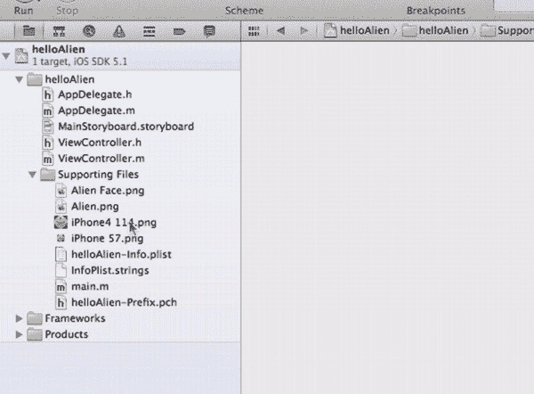  
**图 2-4.** *同时将根文件夹中的图标拖入 Supporting Files 文件夹。*

3. 一旦这些文件被复制到你的 `Supporting Files` 文件夹中，再将图标图片文件拖入 `Supporting Files` 文件夹，如图 2-4 所示。在“支持的设备方向”部分，取消勾选“横向（左）”和“横向（右）”，因为此应用仅支持纵向方向。

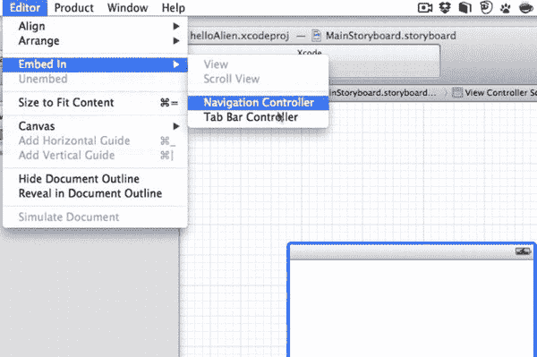  
**图 2-5.** *添加一个导航控制器。*

4. 为了简化视图切换的处理，我们将让导航控制器来协调切换。通过左侧的“项目导航器”窗格，点击 `MainStoryboard.storyboard` 将其打开。在这个新的 Storyboard 文件中，你将定义应用中大多数（如果不是全部）视图（在 Storyboarding 中称为*场景*），并指定它们之间的切换。现在选择视图控制器（单击其下方的黑色条）。选中视图控制器后，点击“编辑器”  “嵌入”  “导航控制器”，如图 2-5 所示。这将在现有视图控制器场景的左侧放置一个导航控制器，并用箭头连接两者，指示它们之间的关系。它还会为现有视图控制器添加一个导航栏。导航控制器会在导航栏上放置按钮，以指示如何以及何时可以返回到你离开的视图。当你稍后运行新创建的应用程序时，就会看到这一效果。

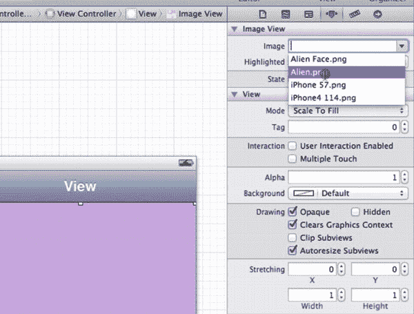  
**图 2-6.** *将 `Alien.png` 分配给主视图。*

5. 你将把当前视图命名为 *View*。双击视图控制器导航栏的中央，输入名称 *View*。（你会在导航控制器创建的按钮中看到这个名称——运行此应用时，你需要从另一个视图返回到此视图。）现在，通过将一个图像视图拖到现有视图控制器场景的画布上，为你的视图添加一张图片。拖动图像视图到视图上时，让它自动调整为视图的完整大小，并居中。进入“属性检查器”，选择 `Alien.png` 作为要显示的图片。图片将出现，显示场景现在的样子。参见图 2-6。

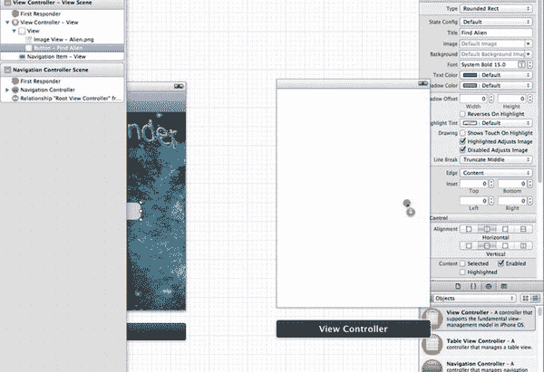  
**图 2-7.** *添加一个按钮和视图控制器。*

6. 接下来你需要在当前场景中添加一个按钮，并添加一个新的视图控制器场景，这将作为第二个“外星人”视图。首先，将一个圆角矩形按钮拖到画布上，双击它并将其命名为 *Find Alien*。拉伸按钮以使文本显示出来，然后将按钮居中放置在视图内。要添加新场景，请从对象库中拖动一个视图控制器到现有视图控制器的右侧。按住它一会儿，现有场景会向左移动。移动后，将新的视图控制器放置到已向左移动的主视图控制器场景的右侧。如图 2-7 所示。

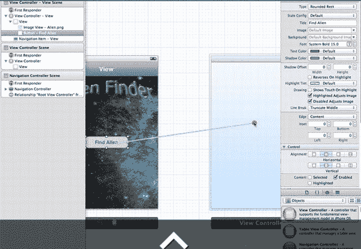  
**图 2-8.** *将按钮连接到新的视图控制器。*

7. 现在你需要执行 Storyboarding 最酷的功能之一——无缝连接从一个视图到下一个视图的转场。在这里，你要将刚创建的按钮连接起来，使其转场到已添加的新场景。在过去，这需要大量的代码。现在你只需 Control-拖拽。要将 Find Alien 按钮连接到新的视图控制器，请从 Find Alien 按钮 Control-拖拽到新的视图控制器，如图 2-8 所示。

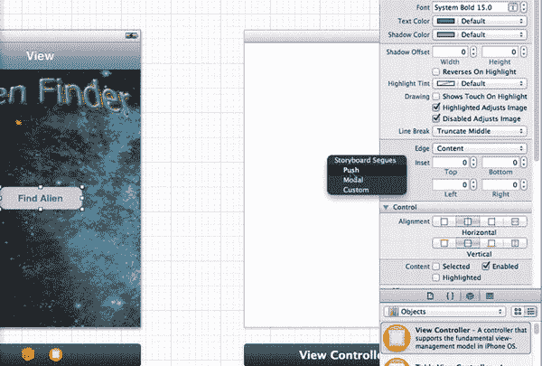  
**图 2-9.** *选择 Push。*

8. 一旦你 Control-拖拽到新的视图控制器上，松开鼠标，你会看到一个菜单，如图 2-9 所示，你可以在此设置 Storyboard 转场过渡样式。现在先使用 Push 样式。从 Storyboard 转场弹出菜单中选择 Push 过渡样式。

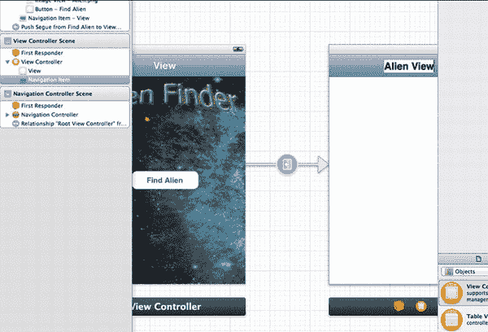  
**图 2-10.** *命名新的视图控制器并设置图片。*

9. 将第二个视图控制器命名为 *Alien View*。与第一个视图的操作一样，双击新视图控制器的导航栏，将其命名为 *Alien View*。趁此机会，我们来创建外星人的图像视图。将一个图像视图拖到视图控制器的画布上。保持图像视图为选中状态，在属性检查器中，选择 `Alien Face.png` 作为其图片。如图 2-10 所示。

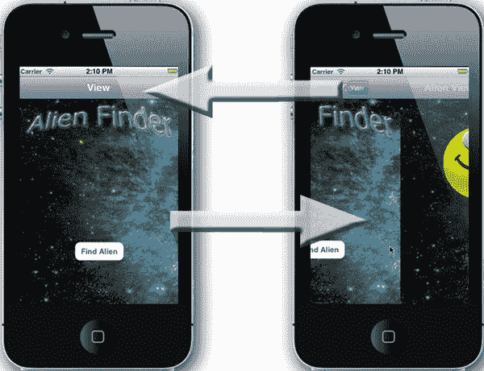  
**图 2-11.** *转场生效了！无需代码！*

10. 信不信由你，你已经拥有一个可运行的应用程序了！点击 Xcode 左上角的“运行”按钮来运行它，如图 2-11 所示，它完美运行。点击按钮，你会跳转到外星人视图。点击外星人视图导航栏左侧名为 View 的返回按钮，你就会回到主视图。完美！


#### 第 2 步：将信息从辅助视图（外星视图）传回主视图

在这一步中，我们将展示将信息从辅助视图传回主视图的典型模式。最常见的做法是将通信描述为一个协议，并让主视图设置为辅助视图的委托。我们来看看具体如何实现。

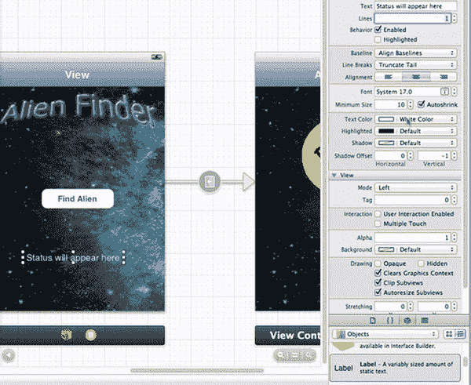

**图 2-12.** *将一个标签拖到主视图上。*

1. 当从外星视图传回结果时，你需要某种方式来显示结果已返回。你将在主视图上显示文本，并根据返回的值进行更改。添加一个标签，用于指示外星人是否存在。将一个标签拖到按钮下方的主视图上。将其居中，将文本颜色设置为白色，并在文本框内输入`Status will appear here`，如图 2-12 所示。

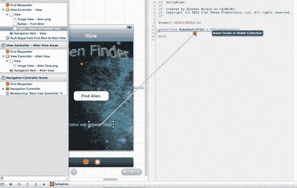

**图 2-13.** *从标签按住 Control 键拖到 `ViewController.h`。*

2. 为了能够通过代码设置标签文本，你需要与此新标签建立连接。让我们创建标签的 `IBOutlet`（你的连接）。打开助理编辑器（其图标位于图 2-13 的白色圆圈内），并确保它将`ViewController.h`文件关联到了分屏视图的右侧窗格。从标签按住 Control 键拖到`ViewController.h`文件，直接放置在`@interface ViewController`行下方，如图 2-13 所示。

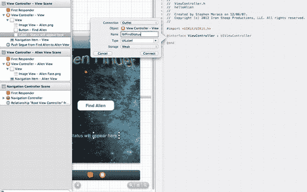

**图 2-14.** *从标签按住 Control 键拖到 `ViewController.h`。*

3. 将连接器放入`ViewController.h`文件后，会出现一个连接对话框。保持此连接类型为 Outlet，并将其命名为`lblFindStatus`。（`lbl`前缀提醒你有一个标签连接到了此输出口。）此对话框如图 2-14 所示。

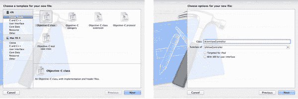

**图 2-15.** *添加一个新的视图控制器子类。*

4. 现在你需要为外星视图的视图控制器添加自定义代码。通过创建一个新的派生视图控制器类来实现这一点。在项目导航器中选择`helloAlien`组（这样新文件就会放置在此组内）。按`+N`键并选择 Objective-C 类选项，如图 2-15 左侧所示。点击“下一步”后，将新类命名为`AlienViewController`，选择`UIViewController`子类选项，如图 2-15 右侧所示，然后点击“下一步”。不要更改任何选项——直接保存。注意，这两个新文件（`AlienViewController.h`和`.m`）被放置在`Supporting Files`组下方。将它们拖回到该组上方，使其与其他文件显示在一起。

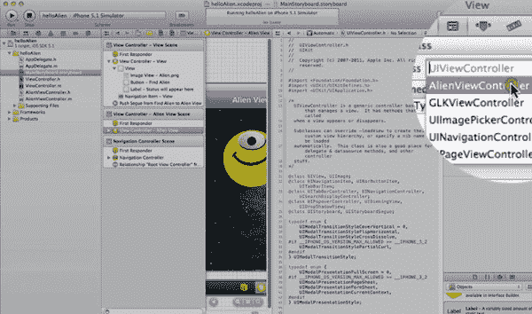

**图 2-16.** *分配新的详细视图。*

5. 你需要将刚创建的`AlienViewController`类分配给你的外星视图。返回到 Storyboard 文件并选择外星视图——但这里需要精确操作。在文档大纲导航器中，找到“视图控制器 – 外星视图场景 视图控制器 – 外星视图”并点击选择它。正确选中后，在实用工具区域的标识检查器中，在“自定义类”区域选择类`AlienViewController`，如图 2-16 所示。

**注意：** 在本章的剩余部分，你将像苹果开发者在 WWDC 等会议的舞台上那样操作。我们将一边描述你在做什么，一边将代码片段拖入你的项目中。这样做旨在为你节省大量时间（因为你无需手动输入代码），同时让你有机会在每次拖放操作中学习代码。首先，打开你随已放入项目的图片一起下载的 DemoMonkey 文件。找到名为`Chapter2.demoMonkey`的文件，然后继续下一页。

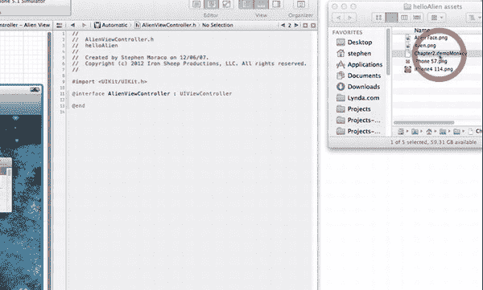

**图 2-17.** *打开 DemoMonkey。*

6. 打开`Chapter2.demoMonkey`文件。窗口初始时非常小，如图 2-17 所示。只需抓住一角并拉伸窗口，使各行代码可见。

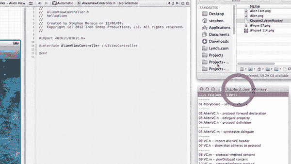

**图 2-18.** *展开 DemoMonkey 窗口并将其放置在侧面。*

7. 在图 2-18 中，你可以看到我们将 DemoMonkey 文件放置在 Xcode 窗口的右侧，并拉伸了它，以便可以看到各行代码。根据你的显示分辨率，有些代码行可能位于屏幕底部之外。如果是这样，当你需要查看这些屏幕外的行时，请滚动 DemoMonkey 窗口。

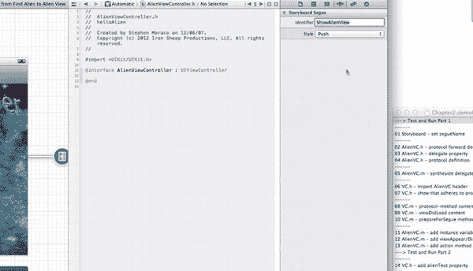

**图 2-19.** *将转场命名为 `ShowAlienView`。*

8. 为了让代码知道正在发生哪个转场，请为每个转场命名。代码随后可以根据此名称判断发生了哪个转场，并针对该命名转场执行相应的操作。要命名转场，请点击转场箭头中间的圆圈图标来选择它，然后在实用工具区域中选择属性检查器，如图 2-19 所示。点击标识符文本框，然后将“01 segueName” DemoMonkey 代码片段拖到标识符文本框中并放下。名称`ShowAlienView`会出现在标识符框中。

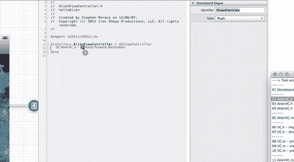

**图 2-20.** *创建委托协议的前向声明。*

9. 你将使用委托协议来与主视图的控制器进行通信。那么，现在我们来创建它：

   1. 打开`AlienViewController.h`文件，通过将“02 AlienVC.h - protocol forward declaration”代码片段拖到`#import <UIKit/UIKit.h>`行下方，插入新协议的名称声明。
   2. 通过将“03 AlienVC.h - delegate property”代码片段拖到`@interface AlienViewController : UIViewController`行下方，添加你的委托属性。
   3. 为你的`AlienViewControllerDelegate`协议创建一个定义。通过将“04 AlienVC.h - protocol definition”拖放到接口的`@end`行之后（文件末尾），如图 2-20 所示。

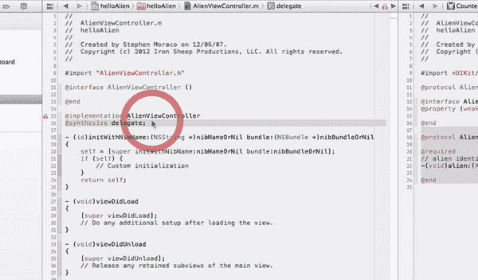

**图 2-21.** *合成 AlienViewController 的委托属性。*

10. 快速回顾：你已经声明了协议，并声明了引用必须符合此协议对象的委托属性。现在你需要合成委托属性。为此，首先打开`AlienViewController.m`文件，然后将“05 AlienVC.m - synthesize delegate”拖放到`@implementation AlienViewController`行下方，如图 2-21 所示。

**注意：** 在 Xcode 中，*合成*意味着生成代码。在这里，你正在为你的委托属性生成设置器和获取器。`@synthesize`指令的目的是为编码人员节省工作，因为我们不再需要为我们创建的每个属性编写设置器和获取器方法。

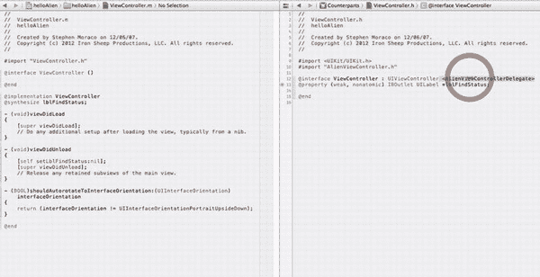

**图 2-22.** *使主视图控制器遵循 `AlienViewControllerDelegate` 协议。*


11.  现在确保`ViewController`遵循你刚创建的`AlienViewControllerDelegate`协议。为此，首先打开`ViewController.h`文件，将“06 VC.h - 导入 AlienVC 头文件”拖放到`#import <UIKit/UIKit.h>`这一行下方。接下来，通过拖放“07 VC.h - 显示遵循协议”内容，将`@interface ViewController : UIViewController`添加到协议一致性声明中，如图 2-22 所示。

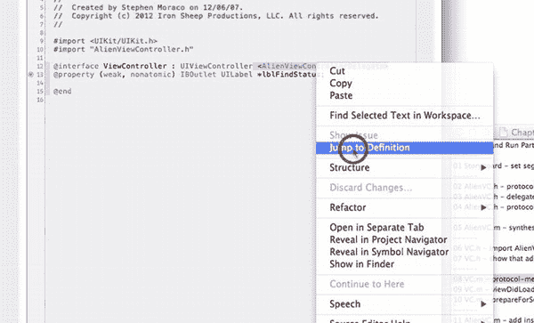

**图 2-23.** *选择“跳转到定义”。*

12.  接下来，将新的协议方法添加到代码中。直接从协议声明中复制方法签名，以确保完全正确。点击协议名称（位于`< >`括号内），然后选择右键菜单项“跳转到定义”，直接跳转到你的新协议。（注意，你可能需要先构建（按下`+B`）代码一次，让这个名称被识别。）

**注意：** 为什么我们要使用“跳转到定义”这个技巧？因为在为 iOS 编写代码时，你需要了解大量的协议和对象接口。最佳的学习方式是在每次使用协议或接口时，刷新你对它的了解。通过直接跳转到协议声明，你有机会提醒自己该协议中声明的其他方法。看到了吗？这就是在工作中的持续学习！

如果你在代码行业有一定经验，你是否注意到你不需要知道协议在哪个文件中声明？Xcode 会自动为你找到它。谢谢你，Xcode（以及构建它的开发者们！）

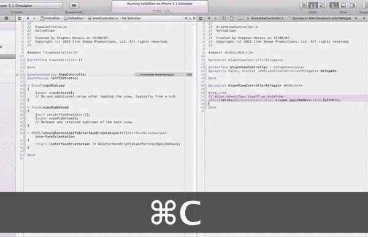

**图 2-24.** *从协议中获取方法。*

13.  现在，选择并复制`alien:saysIAmHere:`方法的签名，如图 2-24 所示（你正在抓取的代码已高亮显示）。

**注意：** 你是否注意到你复制的方法行上方的`@required`指令？这意味着任何声明遵循你的委托协议的对象（在这个例子中是`ViewController`）*必须*已经实现了`alien:saysIAmHere:`方法。当你在协议定义中声明`@required`，并且在另一个类中声明遵循该协议时，如果你尚未实现协议的一个或多个`@required`方法，编译器将生成错误。这有助于确保你已经编写了处理该协议所需的最少代码。

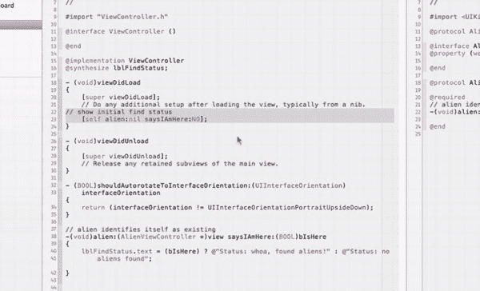

**图 2-25.** *粘贴委托方法。*

14.  继续创建委托协议方法：回到`ViewController.m`文件。将你刚复制的方法粘贴到`@end`前面，如图 2-25 所示。将分号替换为花括号，并在这些花括号内添加来自“08 VC.m - 协议方法内容”的代码，该代码会在发现外星人时向你发送一条消息（将文本写入你的新标签）。我们碰巧使用了`Status: whoa, found aliens!`作为文本，但你当然可以插入任何你想要的内容。现在，这个新方法看起来像这样：

```
-(void)alien:(AlienViewController *)view saysIAmHere:(BOOL)bIsHere
{
    self.lblFindStatus.text = (bIsHere) ? @"Status: whoa, found aliens!" :
    @"Status: no aliens found";
}
```

**注意** 这段代码根据参数`bIsHere`的状态，将两条消息之一放入屏幕上的标签中。还要注意，你将这段消息文本写入用户界面对象的`.text`属性，根据名称的`lbl`前缀，你知道这应该是一个标签。

15.  你已经有了 segue 名称`ShowAlienView`，并将委托协议方法添加到了`ViewController`，这样当外星人视图告诉它是否存在外星人时，它就知道该怎么做。但现在你需要在应用程序首次启动时初始化显示的文本，表明你尚未发现外星人。因此，留在`ViewController.m`文件中，找到`viewDidLoad`方法，并拖入另一行代码“09 VC.m - ViewDidLoad 内容”，使该方法现在看起来如下：

```
- (void)viewDidLoad
{
    [super viewDidLoad];
    [self alien:nil saysIAmHere:NO];
}
```

**注意** 这段代码调用了相同的协议方法，但这是在`ViewController`内部，而不是从`AlienViewController`调用的。你不是`AlienViewController`，所以第一个参数传入`nil`，而你最初希望的状态是“没有发现外星人”，所以第二个参数传入`NO`。方便的是，`viewDidLoad`方法在你首次启动应用程序时只执行一次，因此当你第一次看到屏幕标签时，它已经按你的需要设置好了。

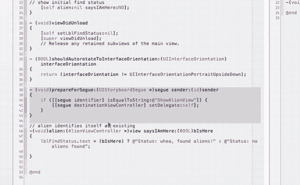

**图 2-26.** *添加 prepareForSegue 方法。*

16.  现在你需要告诉`AlienViewController`，`ViewController`可以处理它发送给委托的数据。通过告知`AlienViewController`，`ViewController`就是委托来实现这一点。`prepareForSegue`方法的存在正是为了让你做这类事情。让我们添加一个`prepareForSegue`方法，并设置`AlienViewController`的委托属性。将“10 VC.m - prepareForSegue 方法”拖放到`shouldAutorotateTo`... 下方，最终结果如下：

```
- (void)prepareForSegue:(UIStoryboardSegue *)segue sender:(id)sender
{
    if ([[segue identifier] isEqualToString:@"ShowAlienView"]) {
        [[segue destinationViewController] setDelegate:self];
    }
}
```

**注意：** 此方法首先检查 segue 是否是你想要的那个（`ShowAlienView`）。如果是，则将目标视图控制器的委托属性设置为`self`（这个`ViewController`实例）。现在，当目标视图出现并希望通过调用`alien:saysIAmHere:`方法将信息传递给委托时，`ViewController`中匹配的方法将被调用，从而设置你的标签文本。

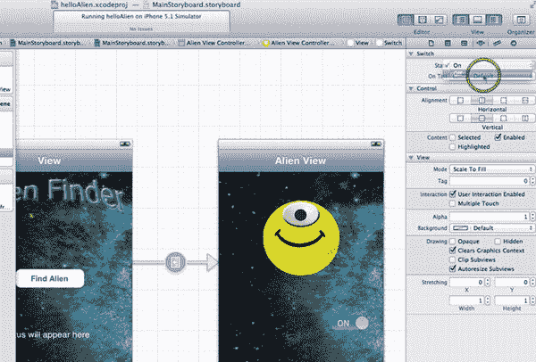

**图 2-27.** *将开关的初始状态设置为“关”。*

17.  现在，你已经在名为`ShowAlienView`的 segue 中，将委托属性设置为`ViewController`实例，以便它能显示外星人存在状态。但我们的外星人需要能够告诉你它的存在！那么，加一个简单的“存在”开关如何？去给外星人视图添加一个开关和描述标签。打开 Storyboard 文件，选择外星人视图控制器场景，将一个开关拖到外星人视图上。将开关状态设置为关，如图 2-27 所示。

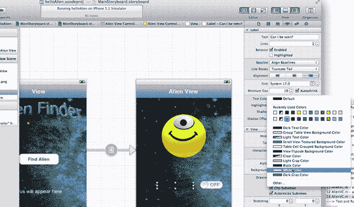

**图 2-28.** *左对齐，白色文字*

18.  你还需要说明文字，所以将一个标签拖到画布上，放在开关的左侧。将其设置为左对齐，文字颜色设置为白色，并将文字设置为*Can I be seen?*，如图 2-28 所示。

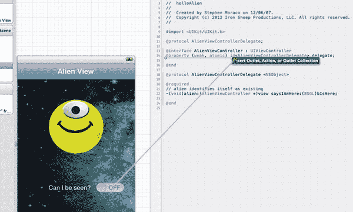

**图 2-29.** *为开关添加 IBAction。*

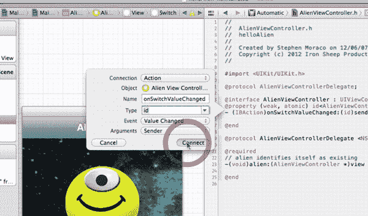

**图 2-30.** *将 IBAction 方法命名为 onSwitchValueChanged。*

19.  现在你需要为开关添加一个`IBAction`方法。打开助理编辑器，确保`AlienViewController.h`文件位于外星人视图的右侧。按住 Control 键从开关拖拽到委托属性下方的空行，如图 2-29 所示。从“连接”下拉菜单中选择“操作”，并输入名称 *onSwitchValueChanged*，如图 2-30 所示。

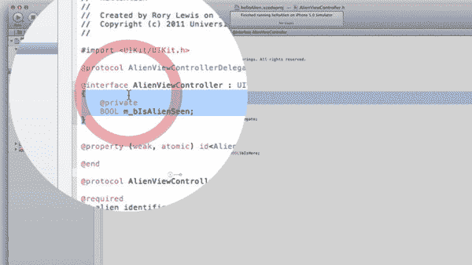

**图 2-31.** *创建一个变量来保存开关的值。*


20.  Xcode 已为此在实现文件中生成了一个方法框架，你现在需要编写代码以从开关中获取值。但在执行此操作之前，你首先需要创建一个用于保存开关状态的变量。那么，我们先声明这个变量。前往 `AlienViewController.m` 文件，将“11 AlienVC.m - 添加实例变量”拖放到 `@interface AlienViewController ()` 行的右端，这样你就获得了如图 2-31 所示的代码：`@interface AlienViewController () {`
    `@private   // 非必需，但能提醒我们！`
    `    BOOL m_bIsAlienSeen;`
    `}`

21.  你需要设置此变量的初始状态，并将此变量的状态返回给你的委托。方便的做法是，你可以使用 `viewWillAppear` 来设置初始状态，并使用 `viewWillDisappear` 在你离开时报告开关值。要添加这两个方法，请将“12 AlienVC.m - 添加 viewWillAppear/Disappear 方法”拖放到 `viewDidLoad` 方法之后，这样我们就有了如图 2-32 所示的代码。

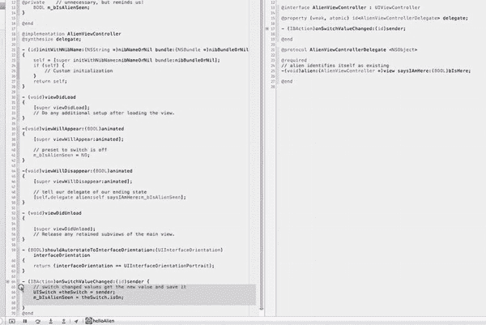

**图 2-32.** *添加 `viewWillAppear` 和 `viewWillDisappear` 这两个方法。*

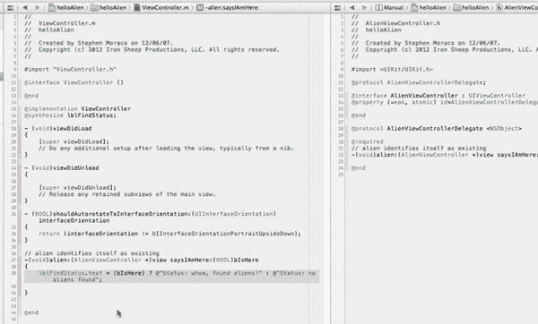

**图 2-33.** *添加代码以在开关值改变时捕获当前值。*

22.  最后，你可以在开关值发生改变时捕获它了。将“13 AlienVC.m - 添加操作方法的代码内容”拖放到 `onSwitchValueChanged:` 方法的花括号内，使代码如图 2-33 所示。

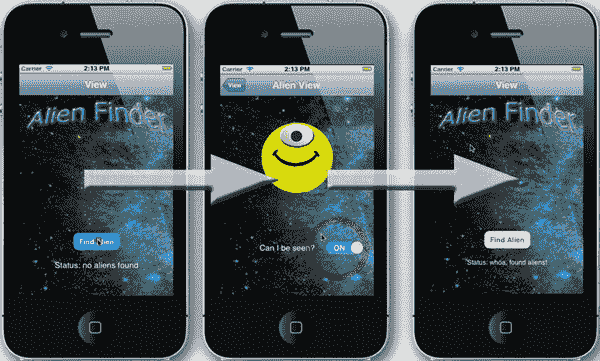

**图 2-34.** *哇！找到外星人了！*

23.  你已经完成了步骤 2 的代码修改。现在在 iPhone 模拟器中运行代码，看看是否一切正常！点击 Xcode 窗口左上角的“运行”按钮。当模拟器启动后，点击“寻找外星人”进入外星人视图。新的开关应该在那里。将开关切换到“开”，然后点击返回按钮（导航栏的左上角）返回主视图。你的“状态：”文本改变了吗？你找到外星人了吗？图 2-34 展示了这个测试流程。

#### 步骤 3：将信息发送到二级视图（外星人视图）

在本节中，我们将演示一种向目标视图传递信息的常用技术。在这个案例中，你将向外星人查找器主屏幕添加一个文本字段，并将文本传递到外星人的宇宙中！让我们开始吧。

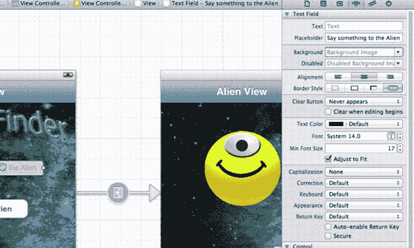

**图 2-35.** *对外星人说点什么。*

1.  现在，一旦外星人告知我们他的存在，你就想向他发送一条消息。将一个文本字段拖放到主视图中“寻找外星人”按钮的上方。将文本居中对齐，并输入*对外星人说点什么*作为占位符文本（此文本告知用户文本字段的用途），如图 2-35 所示。

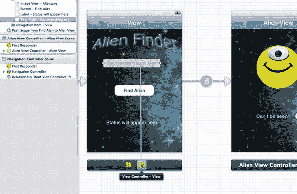

**图 2-36.** *从文本字段按住 Control 键拖放到视图控制器图标上。*

2.  现在你需要将视图控制器指定为文本字段的委托，以便它能在编辑完成时得知——这样你就可以关闭键盘。从“对外星人说点什么！”文本字段按住 Control 键向下拖放到下方的视图控制器图标上，如图 2-36 所示。

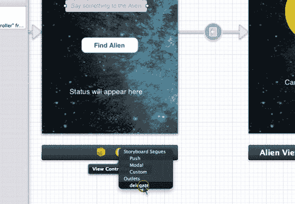

**图 2-37.** *连接到“delegate”输出口。*

3.  在下拉菜单中，将其连接到“delegate”输出口，如图 2-37 所示。

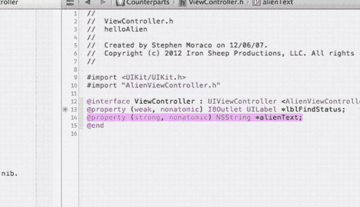

**图 2-38.** *为发送给外星人的字符串消息创建属性。*

4.  接下来，为发送给外星人的消息字符串创建并合成一个属性。前往 `ViewController.h` 文件，在 `lblFindStatus` 属性下方，通过拖放“14 VC.h - 添加 alienText 属性”来添加一个新属性，如图 2-38 所示。为了合成它，回到 `ViewController.m` 文件，在 `lblFindStatus` 的合成代码下方，通过拖放“15 VC.m - 合成 AlienText 属性”来添加新的属性合成代码。


**图 2-39.** *控制发送给外星人的文本编辑。*

5.  在输入文本时，你需要两组代码——一个方法用于关闭键盘，另一个方法用于捕获在文本字段中输入的文本。你将通过 `UITextFieldDelegate` 协议提供的 `textFieldDidEndEditing` 和 `textFieldShouldReturn` 委托方法来实现。你只需为这两个方法添加实现。停留在 `ViewController.m` 文件中，拖放“16 VC.m - 添加文本编辑支持方法”，如图 2-39 所示。

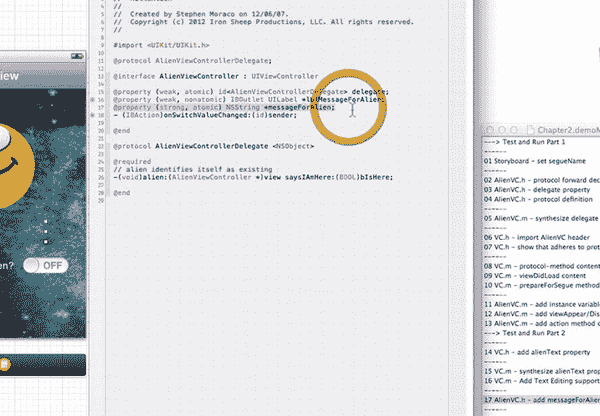

**图 2-40.** *用于发送给外星人消息的属性。*

6.  你需要创建并合成一个属性，但这次是为了捕获你要发送给外星人的文本。在 `AlienViewController.h` 文件中，通过拖放“17 AlienVC.h - 添加 messageForAlien 属性”来添加一个属性，如图 2-40 所示。

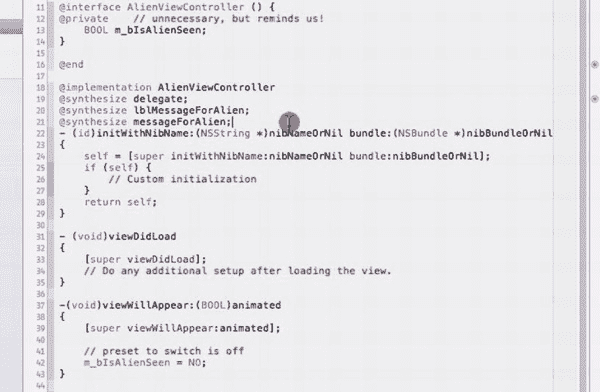

**图 2-41.** *合成发送给外星人的消息属性。*

7.  在 `AlienViewController.m` 文件中，在 `lblFindStatus` 合成代码下方，使用“18 AVC.m 合成 messageForAlien 属性”添加新的属性合成代码，如图 2-41 所示。

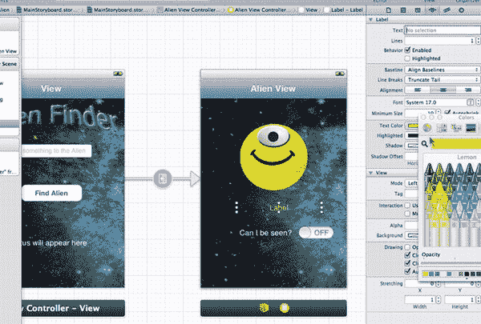

**图 2-42.** *为外星人创建一个接收文本的方法。*

8.  现在，你需要创建一种方法，让外星人能接收到写入给他的文本。前往故事板，将一个标签拖放到外星人视图上。将其居中对齐，背景设为黄色，并清空其文本，如图 2-42 所示。

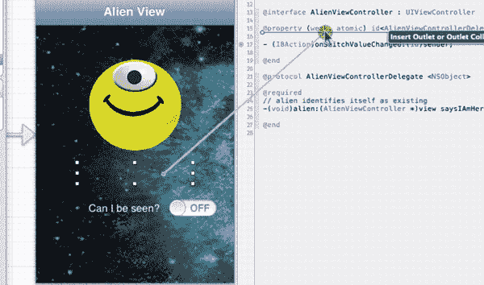

**图 2-43.** *创建新的标签 IBOutlet。*


