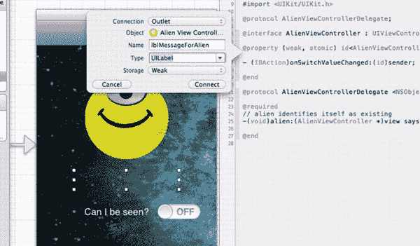
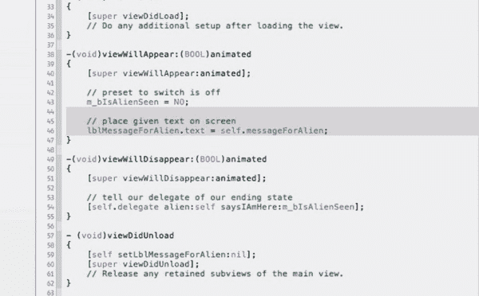
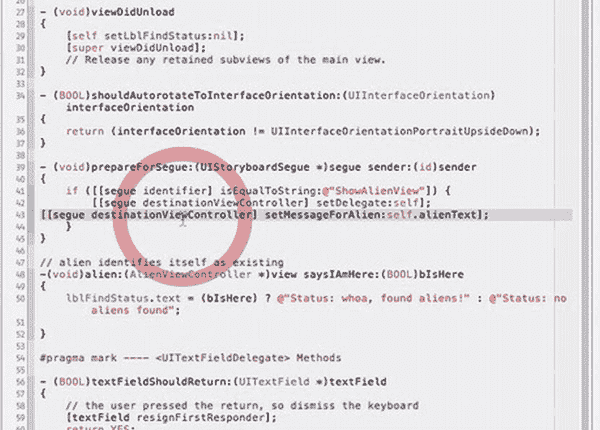
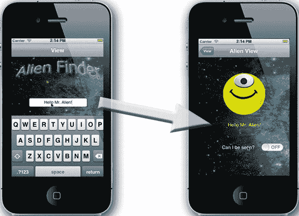
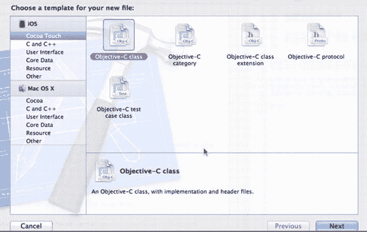
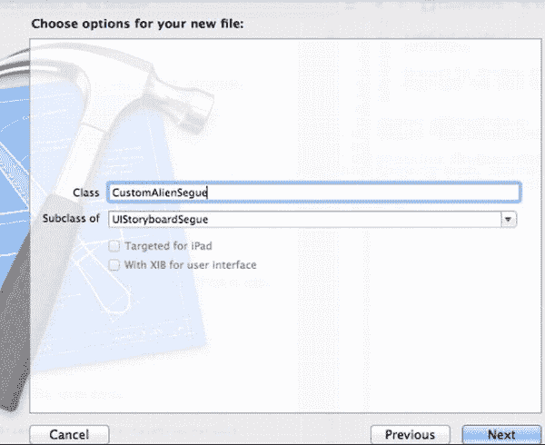
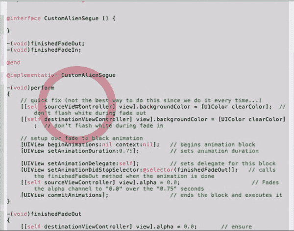
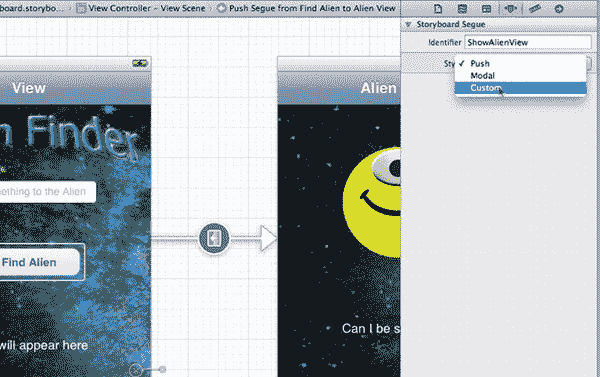
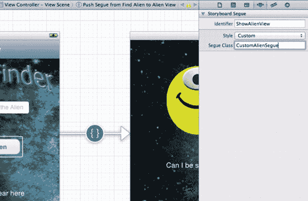
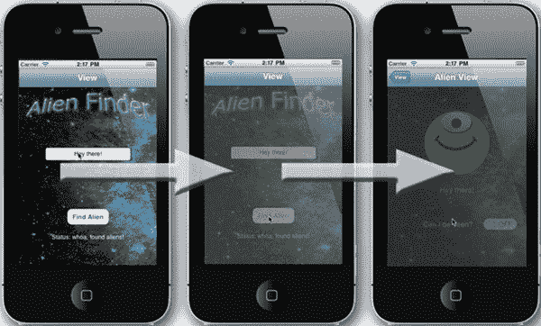

# 排版后内容

9.  你需要为步骤 41 中创建的标签提供一个输出口，因此打开助理编辑器，按住 Control 键从标签拖拽到头文件中，将其放置在`messageForAlien`属性下方，如图 2-43 所示。



**图 2-44.** *将其命名为`lblMessageForAlien`。*

10. 保持其为输出口并命名为`lblMessageForAlien`，如图 2-44 所示。



**图 2-45.** *添加代码以将文本赋值给屏幕上的标签。*

11. 你需要确保`viewWillAppear`方法能显示标签的文本。前往`AlienViewController.m`文件，拖拽"19 AlienVC.m - 添加`viewWillAppear`内容"至文件中，如图 2-45 所示，代码如下：

```
-(void)viewWillAppear:(BOOL)animated
{
    [super viewWillAppear:animated];
    // 预设开关为关闭状态
    m_bIsAlienSeen = NO;

    // 在屏幕上显示给定文本
    lblMessageToAlien.text = self.messageForAlien
}
```



**图 2-46.** *调整`prepareForSegue`方法。*

12. 最后，这一步你应该很熟悉：通过将 Alien 视图的属性设置为主视图属性的值，将文本传递给 Alien 视图。打开`ViewController.m`，滚动到`prepareForSegue:`方法处。将"20 VC.m - 添加`prepareForSegue`内容"拖拽到`setDelegate:`调用后的`if`语句内，如图 2-46 所示。



**图 2-47.** *你好，外星人先生！*

13. 你已经完成了代码修改。再次在 iPhone 模拟器上运行代码，验证你的改动是否按预期工作。当主视图出现时，在新的文本字段中输入文本。点击"寻找外星人"，当新视图出现时，你的信息就出现在外星宇宙中了！图 2-47 显示了你应看到的结果。

恭喜你。你刚刚完成了添加代码以接收用户文本、将其作为字符串从源视图传递到目标视图，并在视图出现时显示在目标视图上的全过程。很简单，对吧？

#### 步骤 4：自定义 Segue

本部分演示了如何轻松地将你之前使用的默认 Segue 替换为你创建的自定义 Segue。



**图 2-48.** *用于覆盖 Segue 的新类*

1.  要创建用于 Segue 的新视图过渡，你现在只需创建一个`UIStoryboardSegue`的特化类，并覆盖默认的`perform`方法。让我们通过点击项目导航器中的`helloAlien`组并按下`+N` () 来创建这个新的派生类，如图 2-48 所示。此时会出现新对话框，选择"Objective-C Class"并点击 Next。

    

    **图 2-49.** *将其命名为`CustomAlienSegue`。*

2.  在"为你的新文件选择选项"对话框中，将类名设为`CustomAlienSegue`。使其成为`UIStoryboardSegue`的子类，如图 2-49 所示。点击 Next 以创建类文件。

    

    **图 2-50.** *粘贴新的`CustomAlienSegue`代码。*

3.  在`CustomAlienSegue.m`文件中，删除所有代码，仅保留文件顶部的注释。然后通过拖拽"21 `CustomAlienSegue.m` - 替换实现"来添加你的自定义实现，如图 2-50 所示。

    

    **图 2-51.** *选择自定义 Segue 类型。*

4.  你需要告诉 Storyboard 使用自定义 Segue。因此前往 Storyboard 文件，选择 Segue（点击两个视图控制器之间 Segue 箭头中间的圆圈）。在工具区的属性检查器中，将 Storyboard Segue 样式从 Push 更改为下拉菜单中的 Custom，如图 2-51 所示。

    

    **图 2-52.** *输入你的新类名`CustomAlienSegue`。*

5.  此时会出现 Segue Class 选项。输入自定义 Segue 的名称`CustomAlienSegue`，如图 2-52 所示。

    

    **图 2-53.** *自定义 Segue 淡入淡出效果。*

6.  你已经完成了本章四个步骤中步骤 4 的修改。在 iPhone 模拟器中运行应用程序，查看你最新工作的成果。应用程序启动后，点击"寻找外星人"，观察新的自定义 Segue 效果（如图 2-53 所示）。如果主视图淡出为黑色，而外星人视图从黑色淡入，则说明你已正确激活了自定义 Segue。恭喜你！

**注意：** 你想知道自定义 Segue 做了什么吗？我们利用了几个关键事实来快速实现一个简单的效果。我们的自定义类基于的`UIStoryboardSegue`对象，它知道哪个`viewController`即将消失，哪个`viewController`即将显示。此外，要显示或隐藏用户界面对象（我们的视图），可以调整其 alpha 设置。alpha 值为 1.0 时显示，值为 0.0 时隐藏。这种 alpha 变化是可以动画化的。利用这些事实，我们创建了以下三个方法：

我们覆盖了`UIStoryboardSegue`唯一的`perform`方法。在`perform`方法中，我们让离开的视图动画化淡出（通过随时间将其 alpha 从 1.0 调整为 0.0）。但我们也希望让出现的视图淡入，因此我们让动画在淡出完成后调用我们的`finishedFadeOut`方法。在这个`finishedFadeOut`方法中，我们让即将显示的视图执行淡入动画（同样，这次通过随时间将其 alpha 从 0.0 调整为 1.0），并在完成后调用我们的最终`finishedFadeIn`方法。在最后一个方法中，我们简单地将第一个已不再显示的视图重置回淡入状态。看到了吗？很简单！

