# 第 3 章


## 使用 MapView 进行故事板设计

在构建第二个故事板应用时，你将开发一个非常有趣的基于导航的应用程序，它使用了 `MapKit` 和 `CoreLocation` 框架。你将利用 `Flickr` 作为数据源，检索在特定位置拍摄的照片，并将它们标注在 `MapView` 上。故事板的主题包括：为转场设置不同的过渡类型、使用 `MapView` 和静态 `TableView` 构建故事板场景，以及从 `MapView` 的标注气泡初始化到其他视图的转场。我们还将演示一些实用的编程技巧，例如处理 `NSURL` 和解析从远程服务器接收的基本 JavaScript 对象表示法（JSON）数据——随着 iOS 5 的发布，这些操作已变得简单得多。

图 3-1 是最终应用的截图。左侧图片显示了地图放大到我们在科罗拉多州科罗拉多斯普林斯的位置。你会看到许多蓝色图钉，它们标示了在指定位置附近拍摄、已上传到与此应用关联的 Flickr 账户，并现在显示在 `MapView` 上的图片。选择最南边的图钉，你会看到标题为“Great Sand Dunes”的图片（该信息已从 Flickr 服务器解析而来）。点击蓝色 V 形展开按钮（根据应用故事板的设定），你会跳转到该图片的详细视图，并带有一个返回按钮让用户回到主视图。显示的图片是我们露营时在科罗拉多著名的沙丘附近拍摄的，其地理位置正好与地图上标示的一致。拍照时，我的 iPhone 自动捕获了照片的 GPS 位置。之后我们将这张图片上传到了 Flickr 网站。

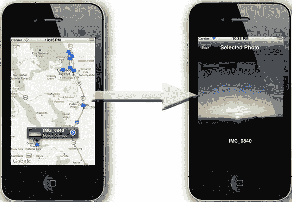

**图 3-1.** *这是本章应用的最终版本。*

对于这个练习，你将重点关注故事板设计方面，因此，我们建议你暂时直接使用我们的 Flickr 账户来掌握故事板设计的要领。一旦你掌握了，设置你自己的 Flickr 账户就会变得轻而易举。我们这么说是因为这个应用的学习曲线相当陡峭，你可能不希望因为关注使用了哪些图片、哪个 Flickr 账户等问题而分心。当你沉浸在这个非常有趣和酷炫的应用中时，已经足够让你全神贯注了。

### `flickrPhotoMap`：一个单视图应用

我们将这个项目分为三个阶段：

*   创建一个简单的 `MapView` 场景，建立数据连接，并在地图上显示带有地理标签的照片
*   在故事板中创建第二个场景，并通过点击每个标注气泡的展开按钮使应用跳转到该场景
*   创建到另一个场景的模态转场，让用户点击标注的缩略图后能为照片评分

在每一步中，我们都会将第 2 章的基本故事板设计技巧应用到实际场景中，并演示 iOS 5 的故事板如何让处理像 `MapView` 和 `TableView` 这样更复杂的 UI 元素变得不再令人生畏。

### 准备工作

与所有章节一样，我们在此为你提供本项目所需的所有文件和代码。不过，我们不会展示具体去哪里获取图片，因为它们都存放在 [`http://bit.ly/sMRvAP`](http://bit.ly/sMRvAP)，如图 3-2 所示。

查看图 3-2，箭头 1 显示了本章视频中的一张图片，该图片链接到视频；箭头 2 和 3 指向 Xcode 项目以及本章所需所有文件（包括图片和 DemoMonkey 文件）的下载图标。如果你需要更多帮助，请访问论坛 [`http://bit.ly/oLVwpY`](http://bit.ly/oLVwpY)。开始之前，请确保你已从 [`http://bit.ly/sMRvAP`](http://bit.ly/sMRvAP) 下载了图片和 DemoMonkey 文件，并将它们在桌面上打开。

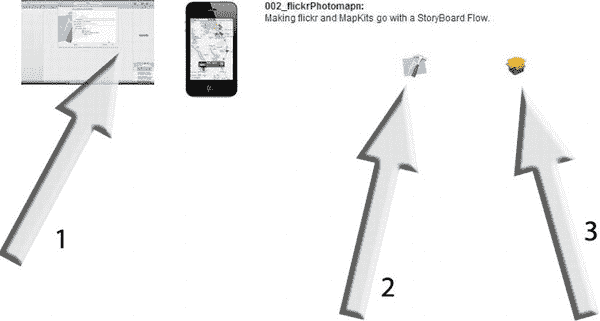

**图 3-2.** *本章的视频、代码和文件*

在开始这三个步骤之前，请记住以下几点：

*   在步骤 1 中，你将设置步骤 2 中将要实现的故事板功能背后的代码。
*   步骤 2 将是故事板设计本身。
*   步骤 3 将结合代码和故事板设计，对我们这个非常酷的应用进行微调。


#### 第一步：建立数据连接并在地图上显示地理标记照片

在第一步中，你将创建一个单视图场景，应用启动后会从我们的 Flickr 账户下载地理标记照片的信息，并在地图上显示代表照片拍摄位置的大头针标注。请注意，此应用需要连接互联网才能正常运行。你可以使用我们为本书设置的 API 密钥继续操作，但如果要在*你自己的项目*中使用 Flickr 服务，则需申请自己专属的 API 密钥。你可以通过以下网址在线申请 API 密钥：[`www.flickr.com/services/api/misc.api_keys.html`](http://www.flickr.com/services/api/misc.api_keys.html)。

1.  打开 Xcode，按下`N`，然后选择“Single View Application”。将其命名为`FlickrPhotoMap`。公司标识符设为`com.storyboarding`。我们不会使用类前缀。确保在“设备系列”下拉菜单中选择 iPhone，并勾选“使用故事板”和“使用自动引用计数”，如图 3-3 所示。创建完成后，将其保存到桌面。

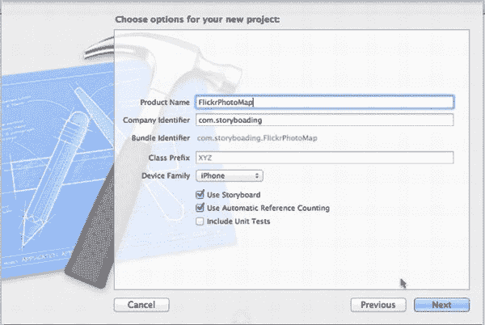

**图 3-3.** *从单视图应用模板开始。*

**注意：** 此应用将使用`MapView`和反向地理编码。要使用这些功能，你必须将所需的框架链接到项目中。点击导航树顶部的项目标题，在右侧的目标设置中选择“Build Phases”标签页，展开“Link Binary With Libraries”部分，点击底部的加号按钮。然后在弹出的窗口中搜索`MapKit`，如图 3-4 所示，在列表中选中它，并点击“Add”按钮。重复上述步骤，添加`CoreLocation`框架。

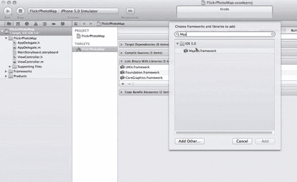

**图 3-4.** *将 MapKit 和 CoreLocation 框架添加到项目中。*

2.  如果新添加的框架文件出现在项目导航树外部，请将它们拖入“Frameworks”组中，如图 3-5 所示。你还需要将`Images`文件夹拖入 Xcode 项目。该文件夹位于从作者网站下载的压缩包中。导航到`Images`文件夹，将整个文件夹拖入，如图 3-6 所示。同时确保勾选了“将项目复制到目标组文件夹中（如果需要）”，如图 3-7 所示。

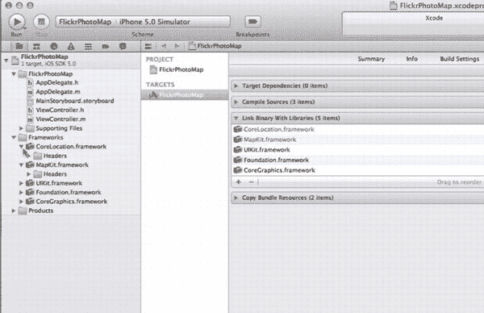

**图 3-5.** *将新添加的文件移动到 Frameworks 文件夹。*

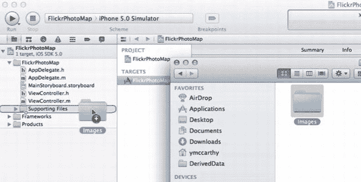

**图 3-6.** *将此应用的图片拖入 Supporting Files 组。*

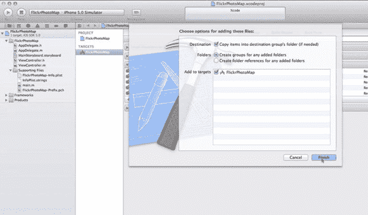

**图 3-7.** *必须勾选“将图片复制到目标组文件夹中...”*

3.  现在选择`ViewController.h`和`ViewController.m`文件，按下 Delete 键。在确认对话框中，点击“移到废纸篓”，而不是“移除引用”。
4.  现在你将创建自己的主视图控制器。按下`N`，选择 Objective-C 类选项，如图 3-8 所示。点击“Next”，选择`UIViewController`子类，并将其命名为`MapViewController`，如图 3-9 所示。不要更改任何选项。保存它。

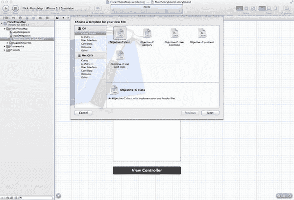

**图 3-8.** *创建一个新的 Objective-C 类。*

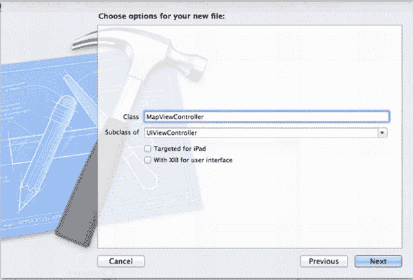

**图 3-9.** *将新类命名为 MapViewController。*

5.  现在转到`MainStoryboard.storyboard`文件，选择主场景底部的视图控制器图标，如图 3-10 所示，打开工具面板，选择标识检查器，将自定义类改为`MapViewController`。保存更改。

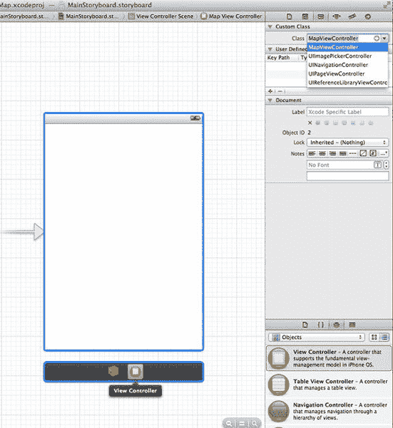

**图 3-10.** *选择主场景底部的视图控制器图标。*

6.  在对象库中找到`MapView`，将其拖到视图控制器画布上，如图 3-11 所示。

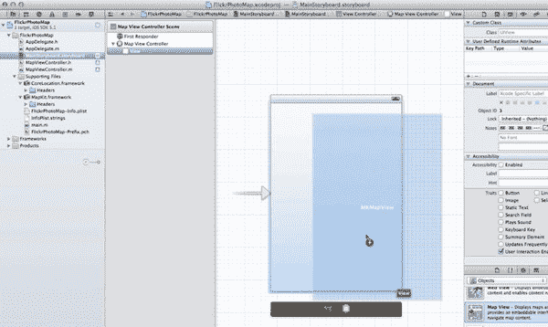

**图 3-11.** *在主视图上放置一个 MapView。*

7.  同时在`MapView`顶部放置一个活动指示器，如图 3-12 所示，因为从互联网下载数据可能需要时间，查看进度会很有帮助。将其居中放置在顶部。然后，在它仍处于选中状态时，转到属性检查器，勾选“Hides When Stopped”选项。

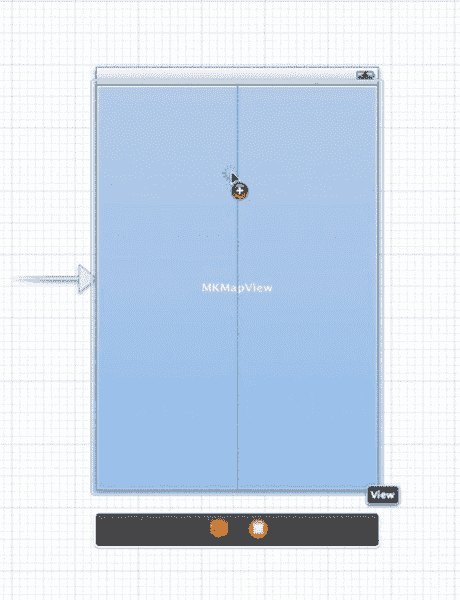

**图 3-12.** *将一个活动指示器拖到视图上。*

8.  点击助理图标。如果助理没有自动显示`MapViewController.h`文件，你可以从“相关文件选项”菜单（位于屏幕分隔栏顶部，如图 3-13 中圈出的位置）的“最近文件”子菜单中选择。现在你将创建并连接`MapViewController`类的`IBOutlet`。按住 Control 键从`MapView`拖到`MapViewController.h`文件中，放到`@end`之前，如图 3-13 所示。将其命名为`mapView`。

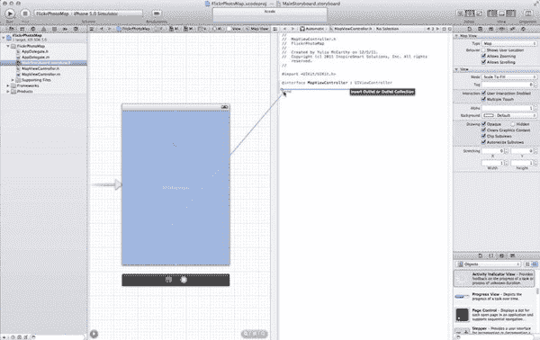

**图 3-13.** *从 MapView 按住 Control 键拖到 MapViewController.h 文件以创建 IBOutlet。*

9.  重复此过程，为活动指示器创建一个`IBOutlet`，并将其命名为`activityIndicator`，如图 3-14 所示。

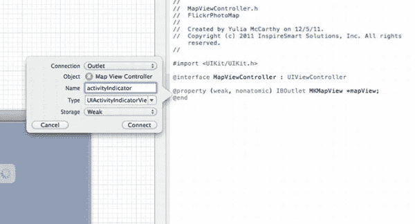

**图 3-14.** *为活动指示器创建 IBOutlet。*

10. 为了能够使用`MapKit`功能，你必须导入框架的头文件。添加`#import <MapKit/MapKit.h>`，并指定你的`MapViewController`类将实现`MKMapViewDelegate`协议：在类名声明行的末尾添加`<MKMapViewDelegate>`，如图 3-15 所示。

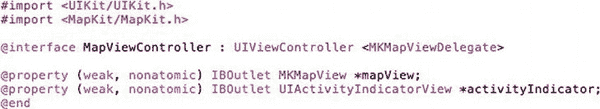

**图 3-15.** *导入 MapKit 头文件。*

11. 关闭助理。打开`MapViewController.m`文件。如果 Xcode 已经创建了一个空的私有声明部分（如图 3-16 中高亮显示的部分），请将其删除，并替换为图 3-17 所示的代码（你也可以通过将 DemoMonkey 步骤“01 MapViewController.m Private Declarations + API Constants”拖放到`@implementation`之前来实现）。这里你只需声明此视图控制器所需的常量、变量和方法签名。你将使用这些变量和方法来请求和处理来自 Flickr 服务的数据。在后续步骤中，你将发现每个数据成员的作用。如前所述，要访问 Flickr API，你必须在 Web 请求中提供唯一的 API 密钥。在这种情况下，我们还需要提供用户 ID，因为我们只想从自己的 Flickr 账户下载照片。这两个常量都在这里定义。

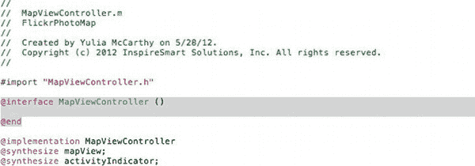

**图 3-16.** *Xcode 创建的默认私有声明部分*

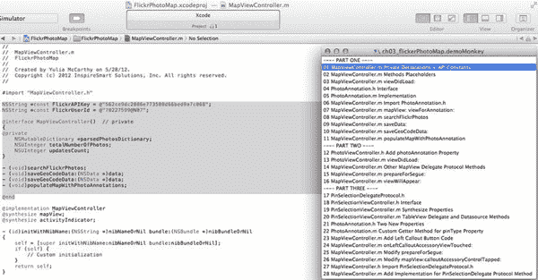

**图 3-17.** *添加私有声明部分。*

12. 为了避免任何意外问题，为你刚声明的方法添加占位符。在文件底部`@end`之前插入图 3-18 所示的代码（DemoMonkey 步骤“02 MapViewController.m Methods Placeholders”）。在后续推进项目时，你将逐步为这些方法添加实现代码。

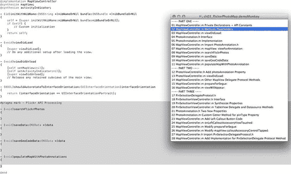

**图 3-18.** *添加方法占位符。*


13. 如果`viewDidLoad`方法被注释掉了，请取消注释，并在方法实现底部，`[super viewDidLoad];`一行之后，插入图 3-19 所示的代码（DemoMonkey 步骤“03 MapViewController.m viewDidLoad”）。这将使你的`MapView`缩放到指定的区域并设置其`delegate`属性，从而允许你的`MapViewController`在其运行期间接收来自`MapView`的标准消息（代理回调）。最后，在`viewDidLoad`中，你还需要通过调用`[self searchFlickrPhotos]`方法来发起在 Flickr 上搜索地理标记照片的操作，你将很快实现该方法。

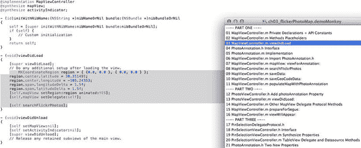

**图 3-19.** *在`MapViewController.m`中添加`viewDidLoad`代码。*

14. 如果你没有遗漏任何步骤，现在可以运行应用程序，它将会显示一张放大地图到科罗拉多斯普林斯地区的视图，如图 3-20 所示。

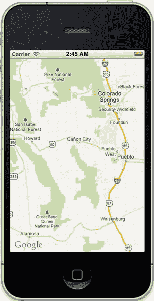

**图 3-20.** *运行应用程序，确保`MapView`已正确连接。*

15. 现在，你将创建一个`NSObject<MKAnnotation>`子类，以便在`MapView`上显示自定义的照片标注。按下`N`并选择 Objective-C 类选项。在下一个界面上，确保在“Subclass of”部分选择了`NSObject`，并将其命名为`PhotoAnnotation`。保存它。然后，将`PhotoAnnotation.h`文件中的所有代码替换为图 3-21 所示的代码（你可以从 DemoMonkey 步骤“04 PhotoAnnotation.h Interface”拖放代码）。在这里，你声明了几个属性——三个标准属性（`coordinate`、`title`和`subtitle`）以及四个自定义属性，你将专门使用它们来存储由标注表示的照片信息（`image`、`thumbnail`、`imageURL`和`thumbnailURL`）。你还声明了两个方法：一个用于创建`PhotoAnnotation`对象的自定义初始化方法（用于在创建标注时初始化自定义属性），以及`updateSubtitle`方法，我们将在下一步中更详细地讨论它。

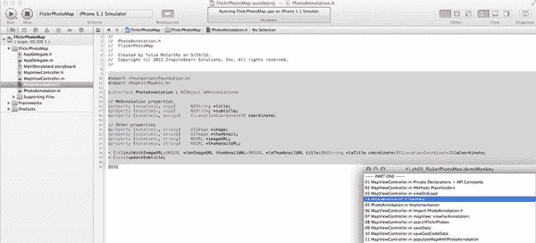

**图 3-21.** *选择你将在`PhotoAnnotation.h`中替换的代码。*

16. 在项目导航器中选择`PhotoAnnotation.m`文件，并将其中的代码替换为图 3-22 所示的内容（DemoMonkey 步骤“05 PhotoAnnotation.m Implementation”）。这里的大部分代码都是不言自明的，或者附有描述性注释。当用户点击地图上的标注时，将调用`updateSubtitle`方法。它将更新标注气泡的副标题，以显示照片拍摄地点的名称。它使用了最新的 iOS 5 功能——反向地理编码器，这是`CoreLocation`框架的一部分。它提供了反向地理编码位置并获取与之关联信息（称为地标）的最简单方法。你创建一个`CLGeocoder`实例，并调用`reverseGeocodeLocation:completionHandler:`方法，从该方法中你得到一个地标数组，其中最相关的地标位于索引 0。然后，你使用`placemarkToString:`辅助方法从`CLPlacemark`对象中提取所需的信息，并更新该标注的副标题。

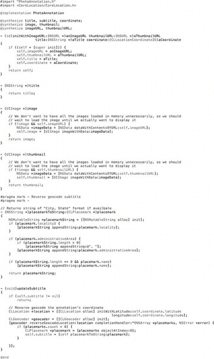

**图 3-22.** *替换`PhotoAnnotation.m`中的代码。*

17. 一旦你完成了`PhotoAnnotation`类的创建，就可以开始向`MapView`添加标注了。首先，让主视图控制器能够看到新创建的类。转到`MapViewController.m`文件，在顶部的导入部分添加`#import "PhotoAnnotation.h"`（DemoMonkey 步骤“06 MapViewController.m Import PhotoAnnotation.h”）。现在，你可以实现`MKMapViewDelegate`协议方法，在其中告诉`MapView`当你将标注添加到地图后它们应该是什么样子。将`mapView:viewForAnnotation:`方法的实现添加到文件的末尾，`@end`之前，如图 3-23 所示（或者你也可以拖放 DemoMonkey 步骤“07 MapViewController.m mapView: viewForAnnotation:”）。

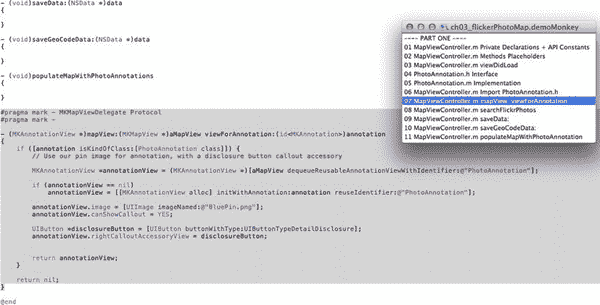

**图 3-23.** *添加`mapView:viewForAnnotation:`方法的实现。*

18. 在这一步中，你将添加`searchFlickrPhotos`方法的实现。找到在第 12 步中添加的空方法占位符，并将代码插入其中，如图 3-24 所示（DemoMonkey 步骤“08 MapViewController.m searchFlickrPhotos”）。在此方法中，你构造一个 URL 字符串，该字符串将向 Flickr 服务器发起搜索请求（URL 请求的格式和可用参数在 Flickr 文档中提供，位于[`http://flickr.com/services/api/`](http://flickr.com/services/api/)）；在我们的例子中，我们指定了 API 密钥、用户 ID、地理标签选项和响应格式）。请注意，为了测试目的，你将刚刚构建的 URL 输出到控制台。在接下来的几行中，你使用构建的字符串创建一个`NSURL`对象，并通过调用`NSData`上的`dataWithContentsOfURL:`静态方法来发起对该 URL 内容的同步下载请求。请注意，下载请求是在后台线程中执行的——否则 UI 可能会变得对用户无响应。就在请求发送之前，启动你的活动指示器，这样你就可以看到进度。（数据传输完成后，你将调用`saveData:`选择器，在其中解析 JSON 数据，将其保存为可用格式，并对获取的数据执行其他必要操作。此步骤即将进行。）

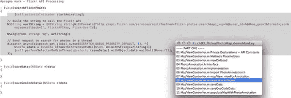

**图 3-24.** *添加`searchFlickrPhotos`方法实现。*

19. 因此，Flickr 服务器将返回一个 JSON 字符串，其中包含指定用户 ID 的所有照片的列表，这些照片都关联了位置信息。
20. 现在，你应该能够运行应用程序，并在控制台窗口中看到打印出的 URL 字符串，如图 3-25 所示。

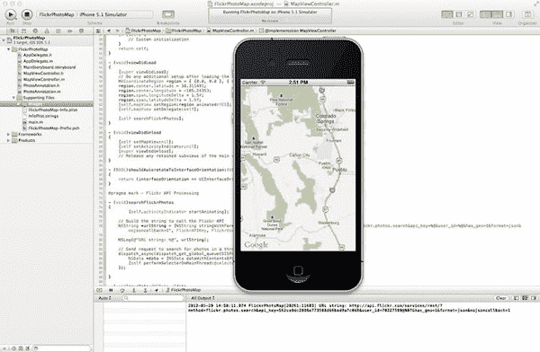

**图 3-25.** *运行应用程序，检查你构建的 URL 字符串。*

21. 此步骤是可选的。选中应用程序打印出的 URL，如图 3-26 所示，将其粘贴到你的 Web 浏览器的地址栏中，然后按 Enter 键。如果 URL 字符串中没有错误，你应该会收到来自 Flickr 的响应，类似于图 3-27 所示（左侧：标准的未格式化响应，右侧：由 JSONView 插件为你格式化的用户友好格式响应）。你从 Flickr 下载的是 JSON 数据。为了能够使用其中存储的信息，你必须对其进行解析。

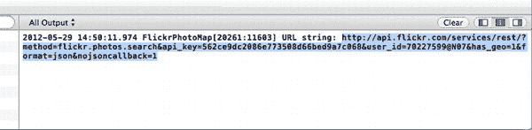

**图 3-26.** *复制 URL 并粘贴到 Web 浏览器的地址栏中。*


22. 在 图 3-27 的 JSON 示例中，你可以看到 Flickr 的响应并不包含实际的图像数据。要下载图像并获取其地理空间数据，你需要提取“photo”集合中每张图片的信息，并执行几个额外的步骤。在这种情况下，最便捷的方式是利用 iOS 5 的新特性：`NSJSONSerialization` 类。它是一个原生 JSON 解析器，可以将 JSON 转换为 Foundation 对象（通常根据 JSON 文档结构转换为 `NSDictionary` 或 `NSArray`），反之亦然。`NSJSONSerialization` 类有一个名为 `JSONObjectWithData:options:error` 的静态方法。你将用它把 Flickr JSON 数据转换成 `NSDictionary`。

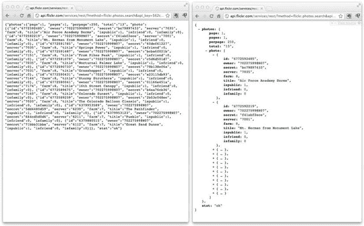

**图 3-27.** *在 Chrome 浏览器中显示的 Flickr JSON 响应*

23. 让我们为步骤 18 中提到的 `saveData:` 方法添加实现。在 `MapViewController.m` 文件中找到它的占位符，并插入 图 3-28 所示的代码（DemoMonkey 步骤“[09 MapViewController.m saveData:]”）。

这个方法初看可能有点复杂，但实际上非常简单。因为你在步骤 19 中看到了 JSON 响应的层级结构，所以你知道结果字典中的哪个键能让你访问到你感兴趣的照片数组。以下代码将 JSON 数据解析为 `NSDictionary`，并将存储在 `photo` 键下的照片信息项数组保存到 `NSArray` 中以便进一步处理：

```
NSError *error = nil;
NSMutableDictionary *response = [NSJSONSerialization JSONObjectWithData:data
options:NSJSONReadingMutableContainers error:&error];
NSArray *photos = [[response objectForKey:@"photos"] objectForKey:@"photo"];
```

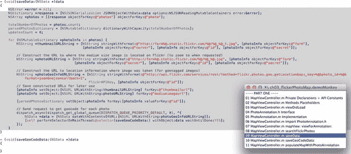

**图 3-28.** *添加 saveData: 方法实现。*

24. 在这个例子中，`photos` 数组是一个 `NSDictionary` 对象的数组。每个字典都包含照片的信息，例如 ID、农场、服务器、标题等，你可以根据这些信息构建 URL，以便从 Flickr 获取实际的图像数据和图像地理位置。

请注意，我们使用 `NSJSONReadingMutableContainers` 选项来解析 JSON 数据。这样做是为了能够向解析后的对象追加额外信息（如缩略图 URL、图像 URL 和地理编码）。

25. 回到 `saveData:` 方法的其余代码：解析 JSON 数据之后，初始化步骤 11 中声明的变量，并开始枚举数组。在这个 `for` 循环中，你只需根据每张照片信息字典中存储的属性，构造三种类型的 URL 字符串。稍后你将使用这些 URL 来加载每张照片的缩略图、中等尺寸图像和图像地理空间数据。构造上述 URL 的规则可在 Flickr API 文档 [`www.flickr.com/services/api/misc.urls.html`](http://www.flickr.com/services/api/misc.urls.html) 中找到。最后，将包含每张照片数据的字典保存到 `parsedDataDictionary` 变量中。使用照片 ID 字符串作为键，以便稍后可以通过照片 ID 直接检索并更新每张照片字典的地理空间数据。方法中的最后一个代码块与步骤 18 中的几乎相同。由于照片的地理位置数据单独存储在 Flickr 上，你需要使用刚为每张照片构建的 `photoGeoInfoURLString` 再次调用 API 来获取其位置数据：

```
dispatch_async(dispatch_get_global_queue(DISPATCH_QUEUE_PRIORITY_DEFAULT, 0), ^{
    NSData *data = [NSData dataWithContentsOfURL:[NSURL
    URLWithString:photoGeoInfoURLString]];
    [self performSelectorOnMainThread:@selector(saveGeoCodeData:) withObject:data
    waitUntilDone:YES];
    });
```

一旦数据完全获取，将调用 `saveGeoCodeData:` 方法进行解析和保存，接下来你将实现这个方法。

26. 找到 `saveGeoCodeData:` 的占位符，并插入 图 3-29 所示的代码（如果你使用 DemoMonkey，将步骤“[10 MapViewController.m saveGeoCodeData:]”拖放到方法占位符中）。这个方法与上一步讨论的 `saveData:` 方法非常相似，不同之处在于这里你只需要从 JSON 响应中检索两个值（照片拍摄地点的纬度和经度）。因此，你使用相同的 `NSJSONSerialization` 类解析 JSON 数据，如果没有错误，则将地理编码值保存到通过照片 ID 键从 `parsedPhotosDictionary` 变量中检索到的对应照片信息字典中。请注意，这次解析选项设置为 `kNilOptions` 常量，因为你在此情况下不需要解析后的对象是可修改的。

当所有对象都更新完毕后，停止进度指示器并调用将在 `MapView` 上标注照片的方法：

```
  if (updatesCount == totalNumberOfPhotos) {
           [self.activityIndicator stopAnimating];
           [self populateMapWithPhotoAnnotations];
      }
```

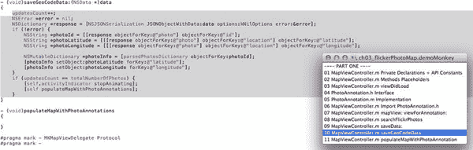

**图 3-29.** *添加 saveGeoCodeData: 方法实现。*

27. 找到 `populateMapWithPhotoAnnotation` 方法的占位符，并插入 图 3-30 所示的代码（DemoMonkey 步骤“11 MapViewController.m populateMapWithPhotoAnnotation”）。在这一步中，你将添加代码以在 `MapView` 上标注具有地理标签的照片。为此，遍历你保存在 `parsedPhotosDictionary` 中的对象。如果 `latitude` 和 `longitude` 值不为空，则为该照片创建一个 `PhotoAnnotation` 对象，使用照片信息字典中的必要数据（标题、地理编码、URL 等）对其进行初始化，并将其保存到一个临时的 `NSArray` 中。最后，将所有创建的标注添加到 `MapView`。此时，你不再需要 `parsedPhotosDictionary` 变量中存储的数据，因此只需将其值设置为 nil 即可释放它所占用的内存。

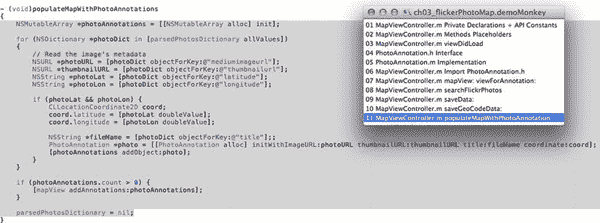

**图 3-30.** *添加 populateMapWithPhotoAnnotation 方法实现。*

28. 现在你应该能够看到你的工作成果，如 图 3-31 所示。如果你点击任意标注，将会弹出一个标注气泡，显示该标注所代表的照片名称。

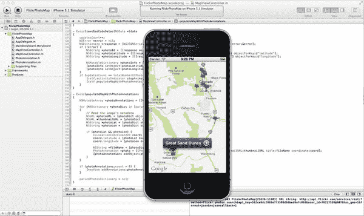

**图 3-31.** *构建并运行 App。*


#### 步骤 2：通过标注气泡跳转到辅助场景

在这三个步骤中的第二步，你将在 Storyboard 中创建一个辅助场景，用于显示所选 `MapView` 标注所代表的中等尺寸图像以及完整的图像名称。每当用户点击所选标注的气泡展开按钮时，应用将跳转至该场景。

1.  第 2 章介绍了如何使用 Xcode 菜单将视图控制器嵌入导航控制器。本步骤将展示另一种实现相同任务的方法。你可以根据个人偏好选择其中一种。打开 Storyboard 文件，从对象库中拖一个导航控制器到画布上。将其放置在 `MapViewController` 的左侧，如图 3-32 所示。

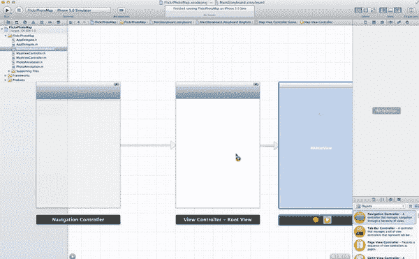

**图 3-32.** *将导航控制器拖到 Storyboard 中。*

2.  你可以删除默认自动添加到场景中的根视图控制器：选中它并按 Delete 键。此外，抓住指向 `MapView` 控制器的初始视图控制器箭头，将其拖到新添加的导航控制器上，如图 3-33 所示。

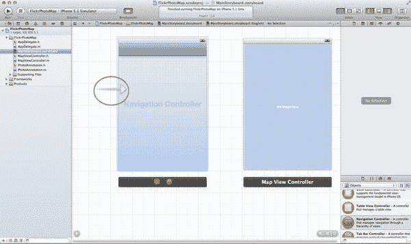

**图 3-33.** *将导航控制器设置为初始视图控制器。*

3.  通过按住 Control 键从导航控制器拖到 `MapView` 控制器来创建两者之间的 `rootViewController` 关联关系，如图 3-34 所示。松开鼠标，然后从菜单中选择关联关系 – `rootViewController`，如图 3-35 所示。

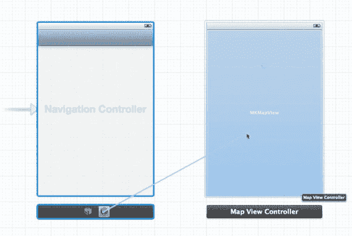

**图 3-34.** *按住 Control 键从导航控制器拖到 MapView 控制器。*

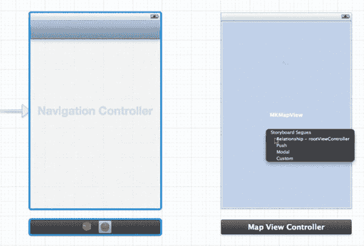

**图 3-35.** *创建 rootViewController 关联关系。*

4.  选中导航控制器，在属性检查器中将其顶部栏设置为“半透明黑色导航栏”，如图 3-36 所示。

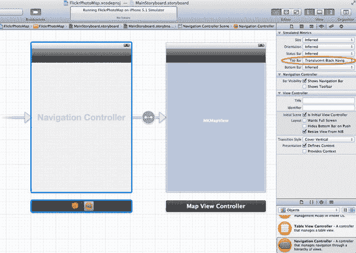

**图 3-36.** *将导航控制器的顶部栏属性设置为半透明黑色导航栏。*

5.  从对象库中再拖一个视图控制器到画布上。将其放置在 `MapView` 控制器的右侧，如图 3-37 所示。

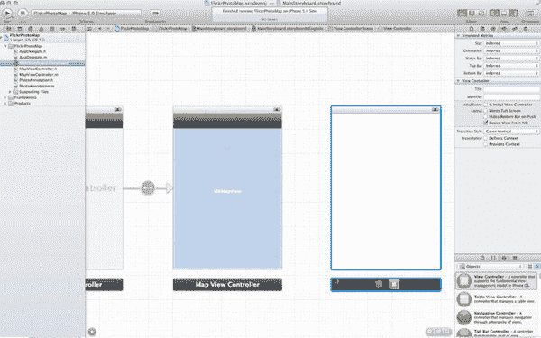

**图 3-37.** *在 Storyboard 中添加一个新的视图控制器。*

6.  通过按住 Control 键从 `MapView` 控制器图标拖到视图控制器来创建一个 Storyboard Segue，如图 3-38 所示。松开鼠标，然后从菜单中选择“Push”作为转场类型，如图 3-39 所示。选中新创建的 Segue，并在属性检查器中将其 `Identifier` 属性设置为 `ShowFullSizeImageSegue`，如图 3-40 所示。最后，双击视图控制器的导航栏，将其标题设置为“已选照片”，如图 3-41 所示。

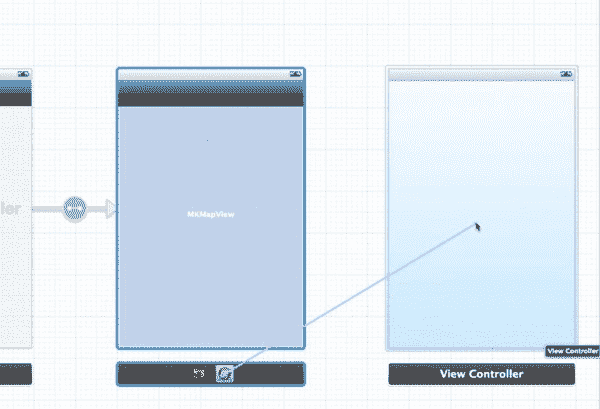

**图 3-38.** *按住 Control 键从 MapView 控制器拖到新的视图控制器。*

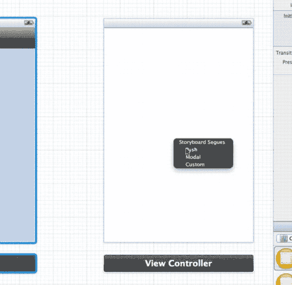

**图 3-39.** *创建 Push 转场。*

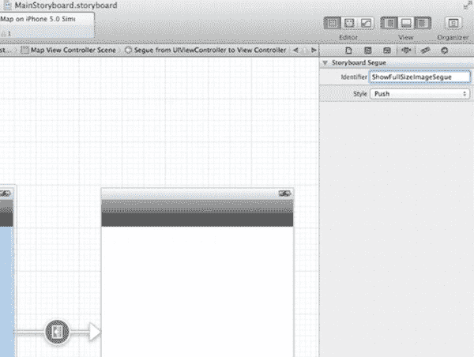

**图 3-40.** *设置转场的标识符。*

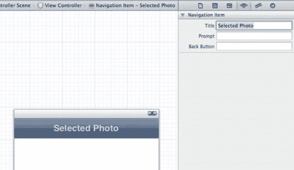

**图 3-41.** *设置视图控制器的标题。*

7.  现在，你可以向新场景添加其余元素了。你将需要一个 `UIImageView` 来显示下载的 Flickr 图像，以及一个 `UILabel` 来显示其标题。继续操作，将一个图像视图拖到视图控制器的视图上，使其高度约为 230 点，宽度约为 320 点，并将其定位在靠近顶部的位置，如图 3-42 所示。

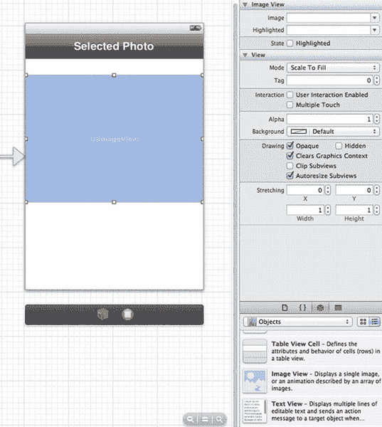

**图 3-42.** *向场景添加一个图像视图。*

8.  现在，在对象库中找到标签，也将其拖到视图上。调整其宽度并将其放置在图像视图下方，如图 3-43 所示。为了保持条理，可以先将其标题设置为“照片标题”。运行时，该标题将被替换为实际照片的标题。同时，在属性检查器中设置标签的属性如下：字体：系统粗体 18 号，文本颜色：白色，对齐方式：居中。你可能注意到，标签在屏幕上不再可见了。单击主视图内的任意位置以选中它，然后在属性检查器中将背景颜色更改为黑色，如图 3-44 所示。

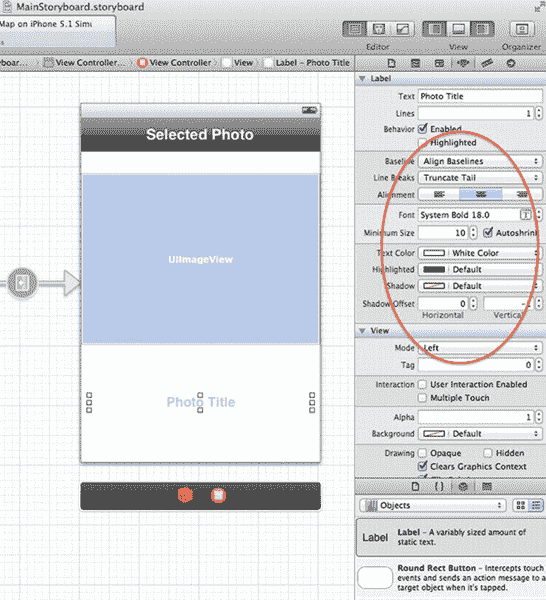

**图 3-43.** *向场景添加标签并调整其属性。*

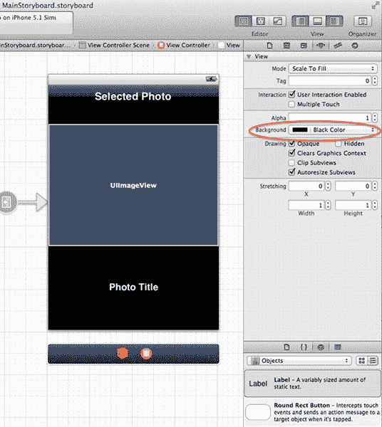

**图 3-44.** *更改主视图的背景颜色。*

9.  在这一步中，你将创建一个新的 `UIViewController` 子类，用于控制你的辅助场景。按下 `N` 键，选择 Objective-C 类选项，然后点击“下一步”。确保在“Subclass of”部分选中了 `UIViewController`，如图 3-45 所示。将类命名为 `PhotoViewController` 并保存。

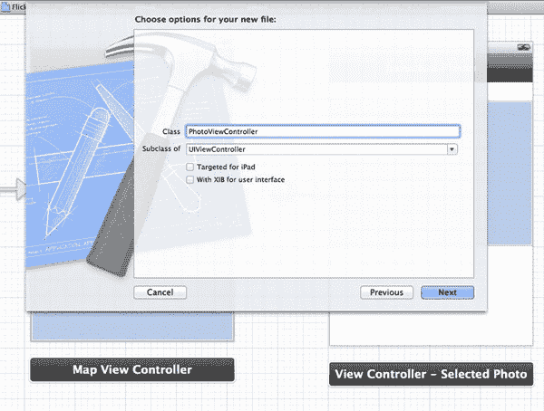

**图 3-45.** *创建一个新的 UIViewController 子类。*

10. 在 Storyboard 中选中第二个视图控制器，然后在身份检查器中将其类设置为新创建的 `PhotoViewController` 类，如图 3-46 所示。

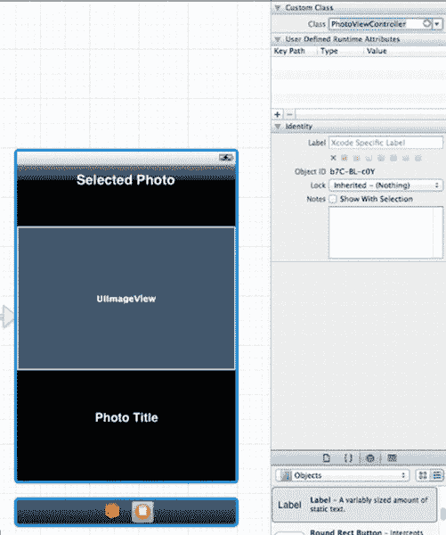

**图 3-46.** *将辅助视图控制器的类设置为 PhotoViewController。*

11. 点击助手图标。如果助手没有自动显示 `PhotoViewController.h` 文件，你可以从“相关文件选项”菜单（位于屏幕分隔线顶部）下的“最近文件”子菜单中选择它。现在，你将创建并连接 `PhotoViewController` 类的 `IBOutlet`。按住 Control 键从 `UIImageView` 拖到 `PhotoViewController.h` 文件中，放在 `@end` 之前，松开鼠标，如图 3-47 所示。将其命名为 `photoImageView`。类似地，按住 Control 键从标签拖出，并将属性命名为 `photoTitleLabel`。

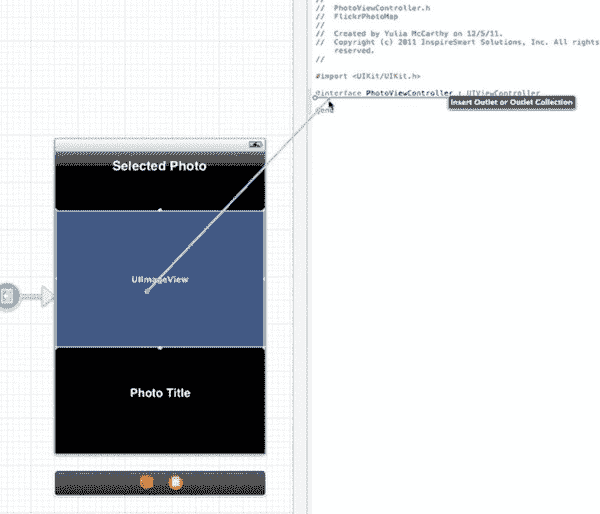

**图 3-47.** *为 PhotoViewController 创建 IBOutlets。*

12. 至此，Storyboard 部分就完成了。现在需要添加几行代码来让一切正常运行。关闭助手，导航到 `PhotoViewController.h` 文件。在 `@interface` 之前添加 `PhotoAnnotation` 类的前向声明 `"@class PhotoAnnotation;"`，并创建另一个名为 `photoAnnotation` 的属性，如图 3-48 所示（DemoMonkey 步骤“12 `PhotoViewController.h` 添加 `photoAnnotation` 属性”）。这个新属性将存储一个对所选标注的引用，以便你可以访问下载和显示实际照片所需的数据。不要忘记在 `PhotoViewController.m` 中合成这个新属性，并通过在文件顶部添加以下代码使 `PhotoAnnotation` 类对 `PhotoViewController` 可见：

```
import "PhotoAnnotation.h"
```


`#import "PhotoViewController.h"`
`#import "PhotoAnnotation.h"`
`@interface PhotoViewController ()`
`@end`
`@implementation PhotoViewController`
`@synthesize photoImageView;`
`@synthesize photoTitleLabel;`
`@synthesize photoAnnotation;`
`…`
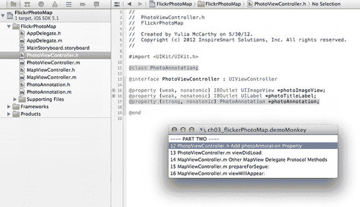

**图 3-48.** *添加 photoAnnotation 属性。*

13.  接下来，你将添加 `viewDidLoad` 方法的实现。在 `PhotoViewController.m` 文件中找到 `viewDidLoad` 方法，并插入 图 3-49 中所示的代码。这段代码将更新 UI，使其显示由 `MapViewController` 在转场执行前传递过来的注释所对应的适当图像和标题。

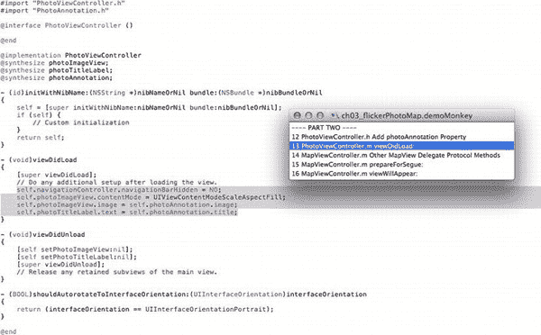

**图 3-49.** *在 PhotoViewController.m 中添加 viewDidLoad 实现。*

14.  在这一步中，你将实现另外两个 `MKMapViewDelegate` 协议方法，这是显示第二场景所必需的。首先，切换到 `MapViewController.m` 并导入 `PhotoViewController.h`，使其对此类可见。然后，导航至 `MKMapViewDelegate` 协议标注部分，如 图 3-50 所示。

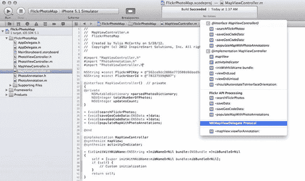

**图 3-50.** *导航至 MKMapViewDelegate 协议标注部分。*

15.  在 `@end` 之前添加以下两个方法的实现，如 图 3-51 所示（DemoMonkey 步骤 “[14 MapViewController.m 其他 MapView 委托协议方法]”）：

`- (void)mapView:(MKMapView *)aMapView annotationView:(MKAnnotationView *)view`
`calloutAccessoryControlTapped:(UIControl *)control`
`{ … }`
`以及`
`- (void)mapView:(MKMapView *)MapView didSelectAnnotationView:(MKAnnotationView`
`*)view`
`{ … }`

这两个 MapView 回调方法中的第一个会在用户点击标注气泡的附属按钮时被调用。在这种情况下，你在 `MapViewController` 上调用：

`[self performSegueWithIdentifier:@"ShowFullSizeImageSegue"`
`sender:photoAnnotation];`

这将执行在第 31 步创建的 Storyboard 转场。只需这一小行代码，就能从 MapView 标注气泡启动一个第二场景的过渡。在第二个委托回调中（当用户在地图上选择一个注释时发生），你只需在选中的注释上调用 `updateSubtitle` 方法，以便对坐标进行反向地理编码，并在标注气泡的子标题中显示位置名称。

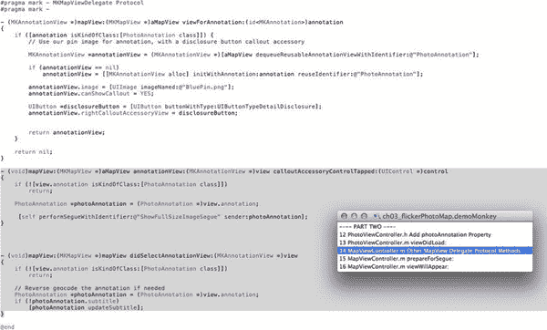

**图 3-51.** *实现其余的 MKMapViewDelegate 协议方法。*

最后，你必须在转场发生之前，将选中的注释从 `MapViewController` 传递给目标 `PhotoViewController`。在 `prepareForSegue:` 方法中完成此操作。滚动到 `#pragma mark - Flickr API 处理` 部分，并在其前面插入 图 3-52 中所示的代码（DemoMonkey 步骤 “15 MapViewController.m prepareForSegue:”）。这里你检查发起转场的标识符，如果它与目标转场匹配，你只需将 `PhotoViewController`（即目标视图控制器）的 `photoAnnotation` 属性设置为发送者对象，而该对象，正如你在上一步中记得的，就是你传递的选中 `PhotoAnnotation` 对象。作为一个小小的清理工作，你应该实现 `viewWillAppear` 方法（DemoMonkey 步骤 “16 MapViewController.m viewWillAppear:]”）。在 `viewDidUnload` 之前添加以下代码：

```
- (void)viewWillAppear:(BOOL)animated {
    [super viewWillAppear:animated];
    self.navigationController.navigationBarHidden = YES;
}
```
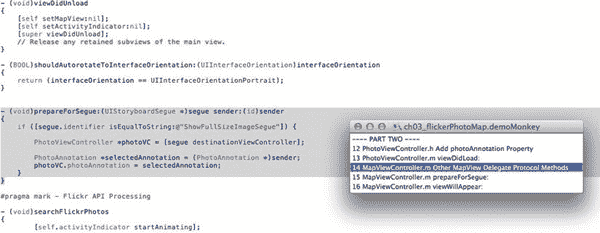

**图 3-52.** *为 MapViewController 实现 prepareForSegue: 方法。*

在此方法中，你将导航控制器的 `navigationBarHidden` 属性设置为 `YES`，这确保了当你从第二场景返回时，导航栏不会覆盖 MapView。

16.  构建并运行应用程序。现在你应该能够点击注释，看到显示照片标题和拍摄地点名称的标注气泡。如果你点击蓝色的详情按钮，显示实际照片的第二视图将出现，如 图 3-53 所示。

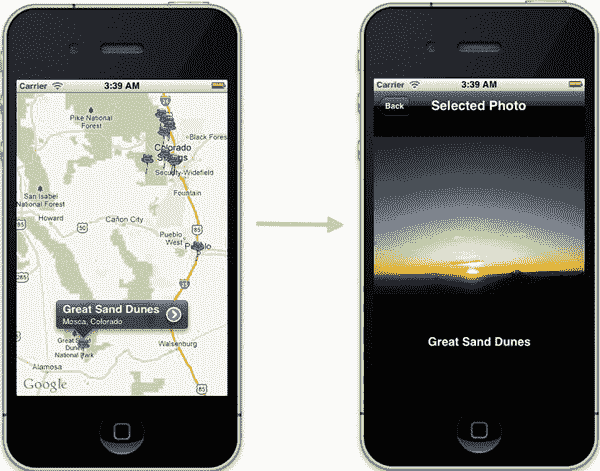

**图 3-53.** *为 MapViewController 实现 prepareForSegue: 方法。*


#### 步骤 3：创建一个允许用户为照片打分的模态场景

在这一步中，你将为应用增加一些趣味性，并让用户与之进行更多交互。你将创建一个额外的 Storyboarding 场景，其中包含一个在 Storyboard 中完全创建的、非常简单的静态 `TableView`。一旦用户点击了你将添加到标注标注气泡的左侧呼出辅助视图（Left Callout Accessory View）中的缩略图，你将以模态场景的形式呈现一个带有基本 `TableView` 的评分选择界面。当用户在此 `TableView` 中选择某个单元格时，模态视图控制器将被关闭，并且受影响的标注的大头针颜色将根据所选的评分发生变化。

1.  打开 Storyboard。在对象库中找到 Table View Controller，将其拖拽到 Storyboard 画布上，位于 Photo View Controller 的正上方，如图 3-54 所示。

    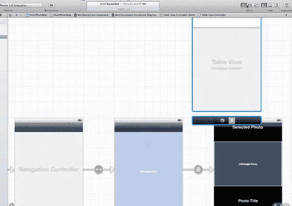

    **图 3-54.** *在 Storyboard 中添加一个 Table View Controller。*

2.  现在你将使用 Storyboarding 最强大的功能之一——Cell 原型化。它能让自定义你的 `TableView` 单元格变得轻松自如。

    首先，选择 `TableView`，并在 Size Inspector 中将其行高（Row Height）修改为 64。然后，将一个 `ImageView` 和一个标签拖入单元格中，如图 3-55 所示。

    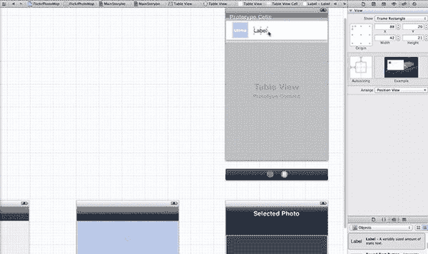

    **图 3-55.** *创建原型单元格。*

3.  选择 `UIImageView`，在 Attributes Inspector 中将其 `Image` 属性设置为 `BluePin.png`，然后切换到 Size Inspector，调整 Image View 的宽度和高度，如图 3-56 所示。同时将标签加宽，并将文本设置为“稍后决定。”如有必要，重新对齐元素以便它们居中于单元格内。你可以将所有其他属性保留为默认值。

    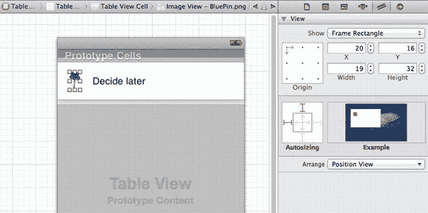

    **图 3-56.** *调整并定位单元格元素。*

4.  选择 `TableView`，将其内容类型（Content）更改为静态单元格（Static Cells），样式（Style）更改为分组（Grouped），如图 3-57 所示（如果单元格高度缩回为 44，请切换到 Size Inspector 并将其重新设置为 64）。通过点击 Table View 最顶部的条纹背景来选择该 Table View 的节（section）（你也可以通过展开位于 Storyboard 画布左侧的文档大纲面板来导航到它）。更改 Table View 节的“行数”和“页眉”属性，如图 3-58 所示。最后，使用 Attributes Inspector，将每个单元格的标签文本和图像修改为与图 3-59 中所示匹配（分别使用 `RedPin.png`、`GreenPin.png` 和 `YellowPin.png` 图像）。

    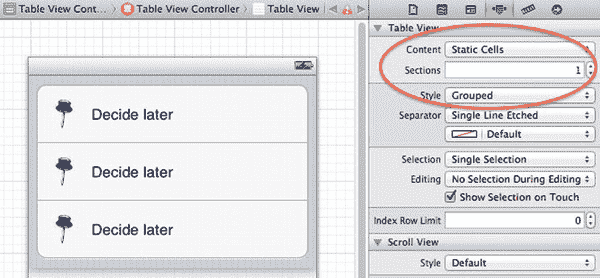

    **图 3-57.** *更改 Table View 的属性。*

    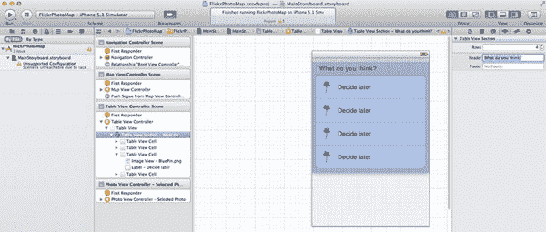

    **图 3-58.** *更改 Table View 节的属性。*

    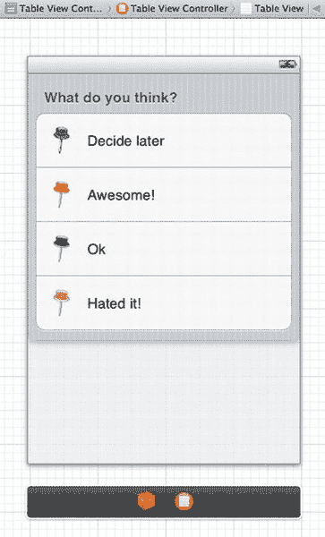

    **图 3-59.** *为其余的静态 Table View 单元格更改图像和文本。*

5.  通过从 MapView Controller 图标按住 Control 键拖拽到 Table View Controller 来创建一个新的 Segue，如图 3-60 所示。松开鼠标，并从菜单中选择“模态”（Modal）作为 Segue 类型。选择这个新 Segue，在 Attributes Inspector 中将其 `Identifier` 属性设置为 `ShowPinChoicesSegue`，并将其过渡（Transition）类型更改为“水平翻转”（Flip Horizontal），如图 3-61 所示。

    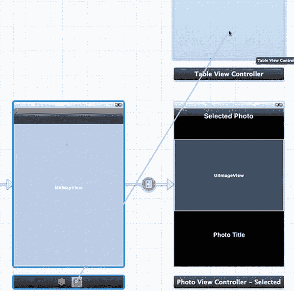

    **图 3-60.** *从 MapView Controller 按住 Control 键拖拽到 Table View Controller。*

    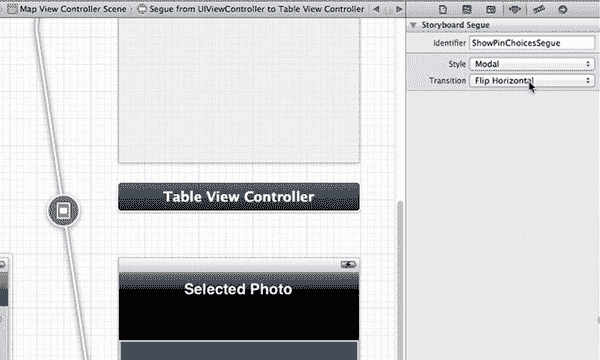

    **图 3-61.** *设置 Segue 属性。*

6.  在此步骤中，你将创建一个新的 `UIViewController` 子类，它将控制你的 Table View 场景。按下 N，选择 Objective-C 类选项，然后点击“下一步”。确保在“子类”（Subclass）选项中选择了 `UITableViewController`。将该类命名为 `PinSelectionViewController` 并保存。

    **注意：** 在 Storyboard 中设计的静态 `TableView` 只能与 `UITableViewController` 子类一起使用。

7.  在 Storyboard 中，选择 Table View Controller，并在 Identity Inspector 中将其类设置为你新创建的 `PinSelectionViewController` 类，如图 3-62 所示。

    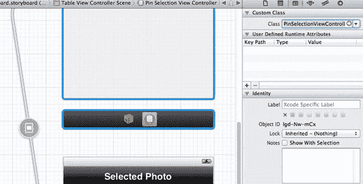

    **图 3-62.** *将 Table View Controller 的类设置为 PinSelectionViewController。*

8.  按下 N，并选择 Objective-C 协议选项，如图 3-63 所示。点击“下一步”，将文件命名为 `PinSelectionDelegateProtocol` 并保存。

    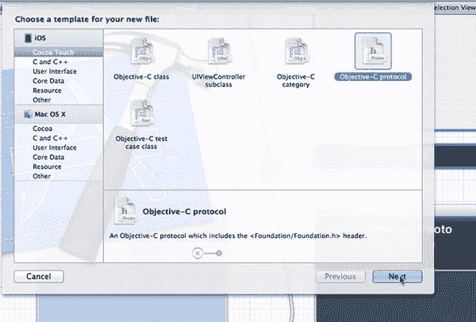

    **图 3-63.** *创建一个 Objective-C 协议。*

9.  打开新添加的 `PinSelectionDelegateProtocol.h` 文件，并将其中的代码替换为图 3-64 所示的代码（DemoMonkey 步骤“17 PinSelectionDelegateProtocol.h”）。这里为了方便起见定义了一个 `AnnotationPinType` 枚举以及一个方法，该方法将由你的 `MapViewController` 类实现（当用户在 Table View 场景中选择评分单元格时，将调用此方法）。

    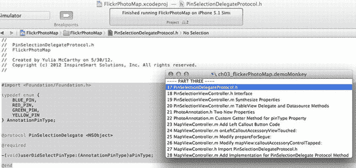

    **图 3-64.** *在 PinSelectionDelegateProtocol.h 中添加代码。*

10. 转到 `PinSelectionViewController.h` 文件，将其中的代码替换为图 3-65 所示的代码（请参考 DemoMonkey 步骤“18 PinSelectionViewController.h Interface”）。这里你创建了两个属性：`delegate` 和 `currentPinType`。第一个属性将用于通知你的 `MapViewController` 用户的选择并更新其 UI。第二个属性将用于显示当前照片的评分。和往常一样，转到 `PinSelectionViewController.m`，并在 `@implementation` 正下方为这两个属性添加 `@synthesize` 语句（DemoMonkey 步骤“19 PinSelectionViewController.m Synthesize Properties”）：

    ```
    #import " PinSelectionViewController.h"
    @interface PinSelectionViewController ()
    @end
    @implementation PinSelectionViewController
    @synthesize delegate;
    @synthesize currentPinType;
    …
    ```

    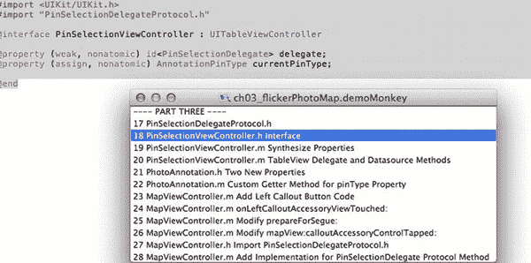

    **图 3-65.** *更改 PinSelectionViewController 类的接口。*

11. 滚动到代码的 `#pragma mark - Table view data source` 部分，选择从那里一直到 `@end` 的所有内容，并将所选代码替换为图 3-66 中所示的代码（DemoMonkey 步骤“20 PinSelectionViewController.m TableView Delegate and Datasource Methods”）。请注意，因为你使用的是一个静态的 Table View，所以无需实现任何标准的 Table View 数据源方法。我们选择实现的唯一数据源方法是 `tableView:willDisplayCell:forRowAtIndexPath:`。在此方法中，我们只需将 `indexPath.row` 与 `currentPinType` 匹配的单元格的 `accessoryType` 属性设置为复选标记，从而指示所选照片的当前评分。在 `tableView:didSelectRowAtIndexPath:` 方法中，通过调用你在 `PinSelectionDelegateProtocol` 中定义的方法，将选中的行号通知给委托。这里使用的编程技术是 iOS 开发中最常见、应用最广泛的设计模式之一（委托模式）。

    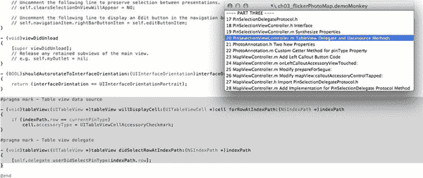

    **图 3-66.** *替换 TableViewDelegate 和 TableViewDataSource 方法。*

12. 转到 `PhotoAnnotation.h` 文件。首先在 `@interface` 正上方添加 `#import PinSelectionDelegateProtocol.h`。然后创建两个新的属性，如图 3-67 所示（DemoMonkey 步骤“21 PhotoAnnotation.h Two New Properties”）。在 `PhotoAnnotation.m` 中，仅添加 `@synthesize` `pinType` 属性。这里不需要为 `annotationViewImageName` 属性生成 getter 方法，因为它是 `readonly` 的，你将在下一步为其指定一个自定义 getter 方法。

    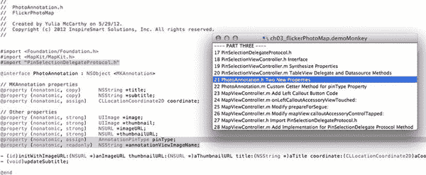

    **图 3-67.** *修改 PhotoAnnotation.h 文件。*

13. 为 `annotationViewImageName` 属性添加 getter 方法，如图 3-68 所示（请参考 DemoMonkey 步骤“22 PhotoAnnotation.m Custom Getter Method for pinType Property”）。在此方法中，你根据标注的类型（该类型将在用户对标注所代表的照片进行评分时被设置）为标注视图定义图像名称。未评分照片的默认图像将是 `BluePin.png`。

    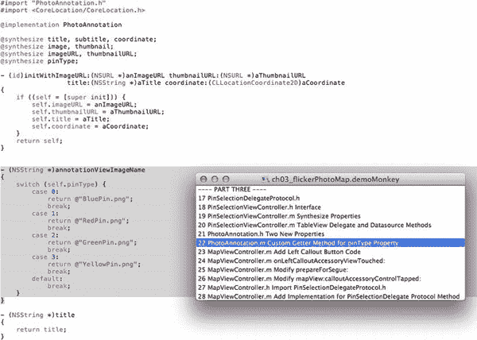

    **图 3-68.** *为 annotationViewImageName 属性添加 getter 方法。*

14. 你需要在 `MapViewController` 类中修改一些内容。首先转到 `MapViewController.m`，并在文件顶部导入 `PinSelectionViewController.h`。
15. 要添加一个带有照片缩略图的按钮，请在 `mapView:didSelectAnnotationView:` 方法实现的末尾添加图 3-69 中所示的代码（使用 DemoMonkey 步骤“23 MapViewController.m Add Left Callout Button Code”中的代码）。

    ![images    **图 3-69.** *修改 mapView:didSelectAnnotationView: 方法。*16. 当缩略图被触摸时，将调用 `onLeftCalloutAccessoryViewTouched:` 方法。为该方法添加实现，如图 3-70 所示（DemoMonkey 步骤“24 MapViewController.m onLeftCalloutAccessoryViewTouched:”）。在此方法中，你使用 `ShowPinChoicesSegue` 标识符调用你的第二个 Storyboard Segue，这将呈现一个在 Storyboard 中设计的模态 Table View Controller。    ![images    **图 3-70.** *为 onLeftCalloutAccessoryViewTouched: 方法添加实现。*17. 通过在方法实现的末尾插入额外的代码来修改 `prepareForSegue:` 方法，如图 3-71 所示（使用 DemoMonkey 步骤“25 MapViewController.m Modify prepareForSegue:”）。这里你为第二个 Segue 添加了一个条件，在其中设置 `PinSelectionViewController` 的委托并传递所选标注的当前大头针类型，以便正确的 Table View 单元格被标记出来。    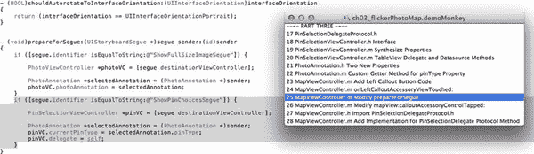

    **图 3-71.** *修改 prepareForSegue: 方法。*

18. 滚动到 `mapView:viewForAnnotation:`，并将每个出现的字符串 `@"PhotoAnnotation"` 和 `@"BluePin.png"` 替换为以下表达式（如图 3-72 所示）：

    `((PhotoAnnotation *)annotation).annotationViewImageName`

    总共应该有三处替换。你这样做是为了区分具有不同评分的标注。由于标注视图会被 MapView 不断地重复使用，你必须为每一种大头针颜色指定一个唯一的 `reuseIdentifier`。在这种情况下，大头针图像的名称非常适合用作 `reuseIdentifier`。因为默认的大头针类型是 `BLUE_PIN = 0`，所以每个标注默认将显示蓝色。

    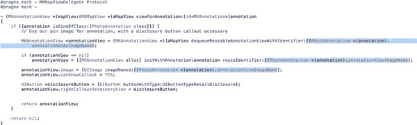

    **图 3-72.** *修改 mapView:viewForAnnotation: 方法。*

19. 为确保在触摸一个或另一个呼出辅助视图时执行正确的 Segue，请将 `mapView:calloutAccessoryControlTapped:` 方法中的最后一行代码替换为图 3-73 中所示代码（DemoMonkey 步骤“26 MapViewController.m Modify mapView:calloutAccessoryControlTapped:”）。

    ![images    **图 3-73.** *修改 mapView:calloutAccessoryControlTapped: 方法。*20. 现在转到 `MapViewController.h` 文件，并添加一条 `import` 语句，如图 3-74 所示。同时在类声明的尖括号中添加一个逗号并添加 `PinSelectionDelegate`。    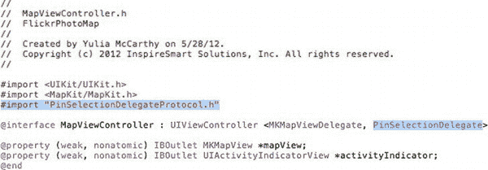

    **图 3-74.** *在 MapViewController.h 中导入 PinSelectionDelegateProtocol.h。*

21. 最后，实现 `PinSelectionDelegate` 协议方法，如图 3-75 所示（拖入 DemoMonkey 步骤“28 MapViewController.m Add Implementation for PinSelectionDelegate Protocol Method”）。当用户在 `PinSelectionViewController` 的 Table View 中选择某个单元格时，会调用此方法。在这里，你根据接收到的评分更改大头针类型，从 MapView 中移除选中的标注，然后将其重新添加回来，以强制重新加载其标注视图。最后，关闭模态的 `PinSelectionViewController`。

    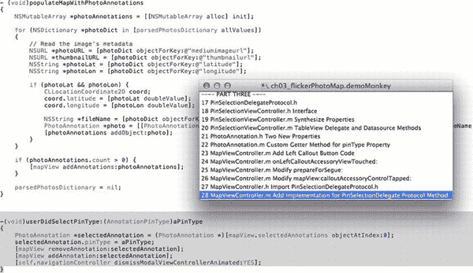

    **图 3-75.** *为 PinSelectionDelegate 协议方法添加实现。*

22. 构建并运行。恭喜！当您点击左侧或右侧的呼出辅助视图时，现在应该能够看到如图 3-76 所示的界面。

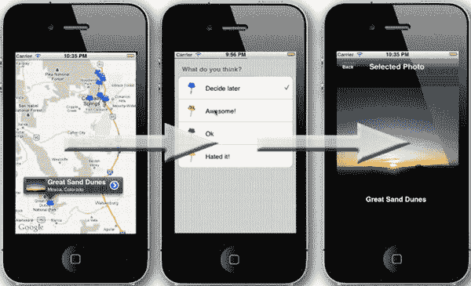

**图 3-76.** *应用的最终外观。*


