# 第四章

## 构建一个工具型应用

到目前为止，在本书中，你已经使用 Storyboard 构建了两个单视图应用。在第二章中你构建了 AlienView，在第三章中你构建了 FlickrPhotoMap。现在我们继续前进，你将要使用 Storyboard 构建一个工具型应用。当你想要创建易于使用、由两个页面组成的应用时——一个是主视图页面，另一个是带有翻转动画过渡效果的视图页面——通常会用到工具型应用。工具型应用会为这两个页面设置两个关键按钮：一个信息按钮和一个完成按钮。信息按钮会将用户从主视图翻转到翻转视图，而完成按钮则会将用户翻转回主视图。

你可能没有意识到，但你很可能非常熟悉 iPhone 自带的一个工具型应用，那就是天气应用，如图 4-1 所示。天气应用是工具型应用的完美范例，因为它优化了一个只需最少用户交互的简单任务。

工具型应用也是三个特殊模板之一，它与基于导航的应用和基于窗口的应用一样，是唯一三个提供自动包含 Core Data 支持选项的项目模板。此外，工具型应用是 Xcode 中最全面的模板之一——它从一开始就实现了一个功能完整的工具型应用。

我们将通过编码一个非常酷的应用来介绍使用 Storyboard 的工具型应用，这个应用教会音乐人何时为特定的流派或情绪选择特定的音阶。它在原声吉他和电吉他的指板上显示指法标记，并为每个音阶附带相应的声音。

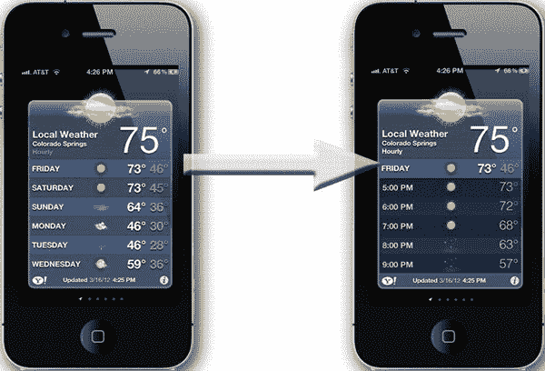

**图 4-1.** *iPhone 自带的天气应用可能是最著名且最常用的工具型应用。*

### utilityScales：一个工具型应用

首先，我们来谈谈我们的 utilityScales 设计决策：我们选择通过创建一个让你能听到原声吉他和电吉他上各种音阶的应用，来演示工具型应用模板的使用。我们选择了八种音乐音阶来展示这个概念。

我们需要显示一个音阶列表，以及每个音阶所关联的流派和情绪。考虑到这一点，我们决定使用翻转视图控制器中已有的表视图来列出音阶。我们还为表格单元格选择了副标题布局，以便同时显示每个音阶的类别及其名称。我们选择 iPad 布局，因为它为音阶指法图片提供了更多空间。我们为程序创建了资源，包括两种吉他的各 8 种音阶、16 个相关的音阶指法图、每个吉他用于播放按钮的小图片、一个加载（或默认）屏幕、一个应用图标等等。这意味着总共需要 16 个音频文件和 23 个图形文件。

我们决定让用户界面有些非标准，因为希望为每种吉他类型都设置播放/停止按钮。它们需要具有相同的功能，因此我们将功能封装在一个专用的 `PlayButton` 类中。为了整合音频播放功能——包括加载文件、启动和停止播放等所需的特殊配置和方法——我们选择将这些功能封装在它自己的类中（一个拥有自己 `.h`/`.m` 文件的对象）。

最后，我们有八种音阶，每种都有两个音频文件、两张图片、一个标题和一个描述——所有这些我们都选择存储在名为 `Scale` 的新类（也是一个拥有自己 `.h`/`.m` 文件的对象）的实例中。这让我们可以编写八个初始化语句，而不是必须用所有这些属性来初始化许多不同的数组。

在 Storyboard 文件中，我们设置了主显示的初始背景、具有自定义颜色的导航栏，以及一个半透明的“面板”，我们在上面通过编程方式放置了两个播放按钮。在 Storyboard 的翻转部分，我们配置并命名了单个动态单元格模板，并配置了标题栏的颜色和文本。

我们将此项目分为不同阶段：一个用于在 Xcode 中设置项目，一个用于设置 Storyboard，两个用于编码。具体如下：

*   **设置**：使用模板进行设置、调整项目设置、拖入资源并添加框架。
*   **准备 Storyboard**：在主页视图和第二个视图中，你将调整导航栏、颜色和按钮等，并添加 `UIImagesViews`、`UITableViews` 和着陆视图。
*   **编码主视图控制器**：编码和连接。

### 预备知识

与第二章和第三章类似，我们在 [`http://bit.ly/sMRvAP`](http://bit.ly/sMRvAP) 提供了本章所需的所有文件和代码，如图 4-2 所示。和往常一样，请花时间清理你的桌面，并将所有图片和音频文件下载到桌面上，然后你就可以开始了。如果需要更多帮助，请访问 [`http://bit.ly/oLVwpY`](http://bit.ly/oLVwpY) 上的论坛。特别要确保在开始之前，你已经从 [`http://bit.ly/sMRvAP`](http://bit.ly/sMRvAP) 下载了 DemoMonkey 文件，并将其解压到桌面上。

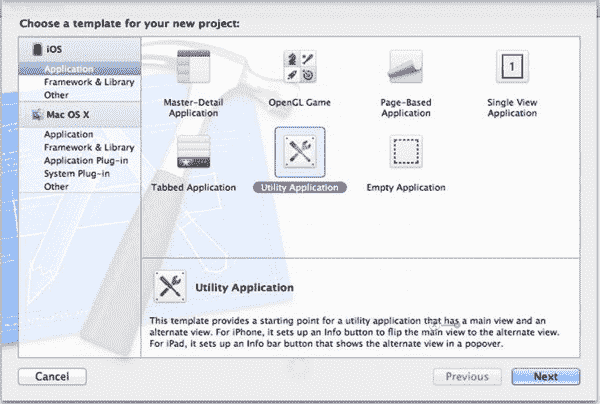

**图 4-2.** *选择工具型应用。*


### 步骤 1：项目设置

项目设置是本项目四个步骤中的第一步。你需要创建一个新的 iPad 实用工具应用项目，将其命名为 `utilityScales`，并通过取消选中竖屏和上下颠倒选项来调整项目设置。接着，你需要将图片、类和音频资源拖入项目中。最后，你需要添加必要的框架。完成这些操作后，你的项目设置就完成了，可以准备在第二步中编辑故事板。

1.  打开 Xcode，按下 `N`（`文件 新建 项目`），选中“实用工具应用”模板，然后点击“下一步”。
2.  将应用命名为 `utilityScales`。我们使用的公司标识符是 `com.apress`。你可以随意命名，但如果你觉得可能需要随时与我们的代码进行对比，那么也请像我们一样将其命名为 `com.apress`，这样可以减少混淆的可能性。我们不会使用类前缀。确保选中“iPad”，并勾选“使用故事板”和“使用 ARC”，如图 4-3 所示。创建完成后，将其保存到你的桌面上。

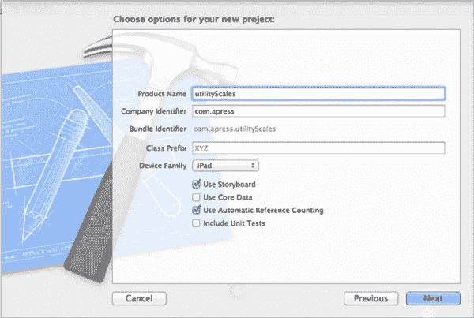

**图 4-3.** *将新项目命名为 `utilityScales`。*

3.  将其保存到桌面后，`Project` 文件夹就会打开。你只会使用横屏方向，因为这更有利于显示吉他的琴颈。这意味着你需要取消选中默认的竖屏和上下颠倒方向。接下来，打开你从 [`http://bit.ly/sMRvAP`](http://bit.ly/sMRvAP) 下载并解压到桌面上的 `utilityScales Assets` 文件夹。首先选中 `Default-Landscape~ipad.png` 文件，并将其拖入“横屏”插槽中，如图 4-4 所示。

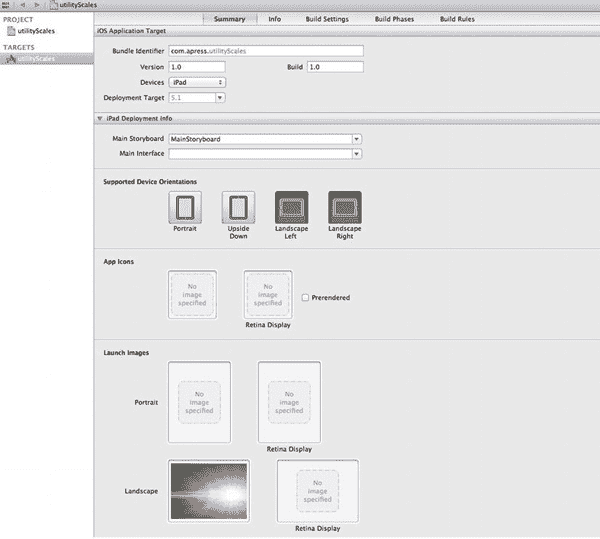

**图 4-4.** *取消选中竖屏和上下颠倒选项，并拖入 `Default-Landscape~ipad.png`。*

4.  在这一步中，你需要执行两个任务。首先，将 `Default-Landscape~ipad.png` 从 `utilityScales` 目标 iOS SDK 5.0 的根目录（右上角的蓝色文件夹）移动到 `Supporting Files` 文件夹中。然后，将 `Images` 和 `Audio Files` 文件夹添加到 `Supporting Files` 文件夹中。为此，从桌面上的 `UtilityScales Assets` 文件夹中同时选中 `Audio Files` 文件夹和 `Images` 文件夹，然后将它们拖放到 `Supporting Files` 文件夹中，如图 4-5 所示。

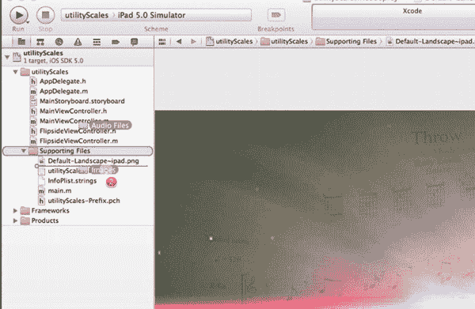

**图 4-5.** *将所有图片放入 `Supporting Files` 文件夹。*

5.  会弹出“选择添加这些文件的选项”对话框。确保你选中了“将项目复制到目标组的文件夹中（如果需要）”选项。同时选中“为添加的文件夹创建组”选项。最后，确保你添加了目标，如图 4-6 所示。这样做的目的是确保应用能在其他设备上运行。只有将这些图片、添加的文件夹和目标都内嵌并封装到你的应用中时，才能执行此操作。有时，学生在提交作业时没有选中这些选项，这会导致在提交评分时，应用丢失所有图片、文件夹、音频文件以及目标——当然，由于缺少这些内容，他们的项目也无法构建。

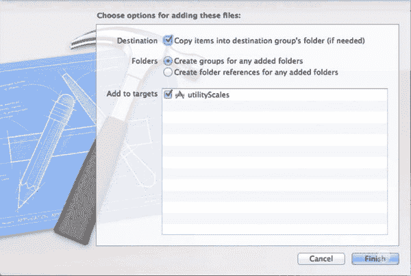

**图 4-6.** *确保你选中了“复制项目”和“创建组”到 `utilityScales` 目标。*

6.  确保你的 `Supporting Files` 文件夹看起来与图 4-7 中所示一致。由于我们选中了“组”选项，`Audio Files` 和 `Images` 文件夹被完美地实例化在 `Supporting Files` 文件夹中。这是良好的编码习惯，并且能向查看你代码的人表明你具有良好的实践。

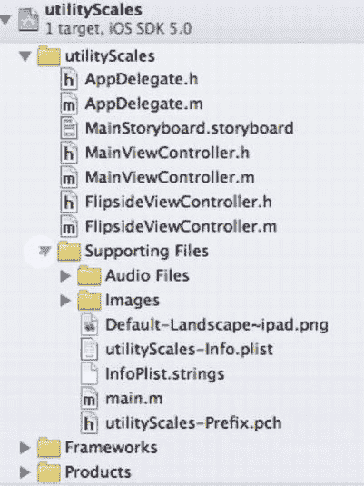

**图 4-7.** *一个美观的文件结构。*

7.  为了方便你操作，我们创建了三个类文件（因为我们希望你将重点放在故事板编辑上，而不是创建文件上）：一个 `AudioPlayer` 类（`AudioPlayer.h` 和 `AudioPlayer.m`）、一个 `PlayButton` 类（`PlayButton.h` 和 `PlayButton.m`）和一个 `Scale` 类（`Scale.h` 和 `Scale.m`）。你也需要将这些代码添加到你的应用中。从 `utilityScales Assets` 文件夹中获取这六个文件，并将其拖到你的 `utilityScales` 文件夹中，如图 4-8 左上角图片所示。当“选择选项”对话框出现时，选中“将项目复制到目标”并勾选“创建组”复选框。完成此操作后，点击“下一步”，如图 4-8 右上角图片所示。最后，进入“构建阶段”，点击添加按钮，并选中三个实现文件，如图 4-8 下方中央图片所示。

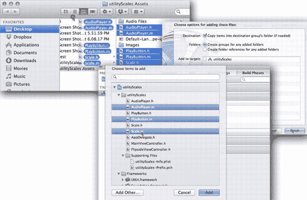

**图 4-8.** *导入我们为你创建的类文件。*

8.  确保你的 `utilityScales` 文件夹看起来与图 4-9 中所示一致。如果出于某种原因，它没有包含相同的文件和文件夹，请返回并重做之前的步骤，确保你的 `utilityScales` 文件夹最终状态与我们的一致。

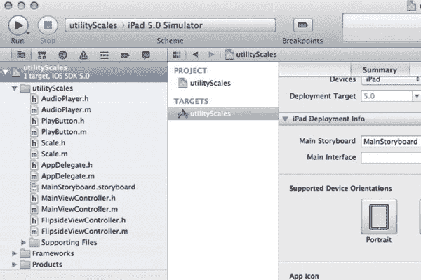

**图 4-9.** *你的 `utilityScales` 文件夹已准备就绪。*

9.  正如你已经知道的，你将在此应用中播放音频文件。现在，如果你尝试构建此应用（如果你愿意，可以试试，你会看到很多错误），你会遇到问题，因为你没有任何播放音频文件的手段——即使你已经定义了类并导入了音频文件。你需要添加音频框架。点击编辑器顶部的“摘要”按钮，在摘要页面的底部附近找到“链接的框架和库”部分（你可能需要滚动页面才能看到）。在此部分的底部，点击 `[+]` 按钮。现在，选择 `AudioToolbox.framework`，如图 4-10 所示。

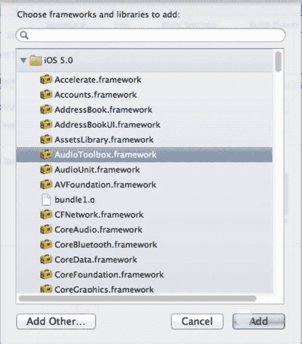

**图 4-10.** *添加两个必要框架中的第一个。选择 `AudioToolbox.framework`。*

10. 在离开框架和库添加对话框之前，你需要添加另一个框架。你刚刚添加了音频框架，但看起来你还需要一个 Objective-C 接口，以便从我们的代码中与刚刚包含的这个底层框架进行交互。因此，还要添加 `AVFoundation` 框架，你会从代码中调用它来播放音频文件。它进而调用更低层的 `AudioToolbox` 框架来执行实际的播放操作。因此，除了 `AudioToolbox.framework` 之外，还要选择 `AVFoundation.framework`（通过按住 Command 键点击 `AVFoundation.framework`，使两者都被选中），如图 4-11 所示。最后，点击“添加”按钮，将这两个框架都添加到项目的 `utilityScales` 目标中。

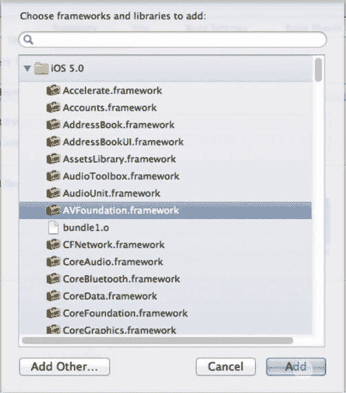

**图 4-11.** *同时添加 `AVFoundation.framework`。*

11. 添加完这两个框架后，你会看到它们位于 `utilityScales` 文件夹的根目录中。将它们拖入你的 `Frameworks` 文件夹。现在，你应该拥有实用工具应用的三个核心框架，以及新增的 `AVFoundation` 和 `AudioToolbox` 框架，如图 4-12 所示。

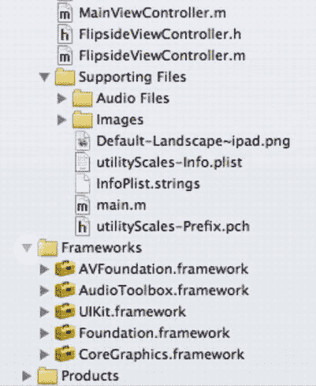

**图 4-12.** *将新框架移至 `Frameworks` 文件夹。*


#### 步骤 2：准备故事板

首先，通过给导航栏着色并将“信息”按钮改为“音阶”来准备主视图。接下来，你将添加一个不包含任何用户交互的 `UIImageView` 图像。然后，你将添加一个播放按钮的放置区域，同样也不会有任何用户交互。完成这些后，你将把这个放置区域标记为“视图 - 播放按钮区域”。至此，第一个视图就完成了。

第二个视图也需要准备——首先，为导航栏着色并添加标题。接下来，你将添加一个 `UITableView`，它使用动态单元格并采用分组样式。你还需要将它的数据源和代理设置为你的 `ViewController`。

1.  如前所述，实用工具应用包含两个视图：主视图和翻转视图。用户通过点击主视图导航栏右侧的信息按钮进入翻转视图。让我们看看这个，并开始设置故事板。打开故事板，你确实会看到主视图和翻转视图，如图 4-13 所示。你可以看到 segue 已经构建好了，一切就绪。请注意，在 iPad 上，翻转视图显示为弹出视图。

   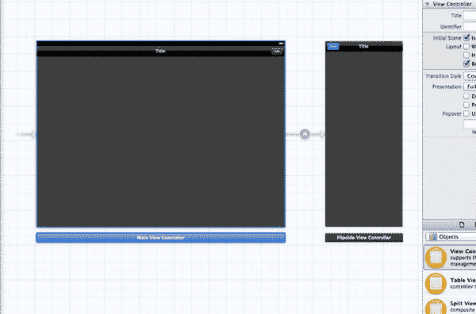

   **图 4-13.** *打开故事板文件，查看主视图和翻转视图。*

2.  点击选中标题栏（导航控制器），然后使用属性检查器找到色调选择器。选择青色，如图 4-14 所示。

   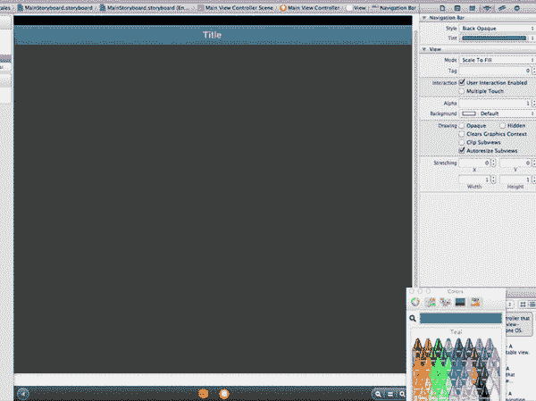

   **图 4-14.** *首先为标题栏着色。*

3.  现在你想要自定义信息按钮。首先点击信息按钮（点击两次，确保选中按钮本身，而非栏目标题），然后在属性检查器的“栏项目”部分找到“标题”框，将名称改为“音阶”。你希望它和导航栏颜色相同，所以继续将颜色改为青色，如图 4-15 所示。请注意，你可能编程过其他应用，重置了“样式”和“标识符”的默认值；如果是这种情况，请确保你的选择和我们的图 4-15 一致。

   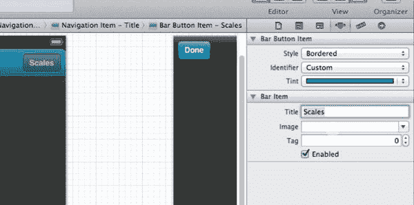

   **图 4-15.** *自定义信息按钮。*

4.  主屏幕将放置一张带有指法的吉他指板图像。这意味着你需要将一个“图像视图”拖到画布上，并让它自动调整大小，如图 4-16 所示。根据你的显示器分辨率，你可能需要先缩小视图才能正确操作。

   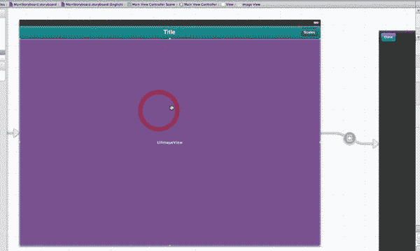

   **图 4-16.** *拖入一个图像视图。*

5.  你需要在画布上找一个地方放置播放按钮。（你可以先偷瞄一眼，在图 4-59 和 4-60 中看看播放按钮的样子。）为此，在现有“图像视图”的左上角附近拖入另一个视图，如图 4-17 所示。请注意，该视图在库的底部以浅灰色高亮显示。

   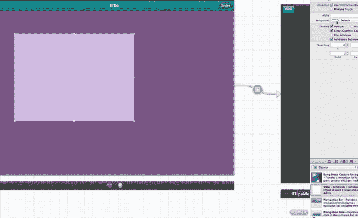

   **图 4-17.** *为播放按钮创建一个空间。*

6.  选中这个新的小视图后，在属性检查器中将颜色改为青色。接下来，转到身份检查器，将其标签设置为“视图 - 播放按钮区域”（这允许你在文档大纲中清晰识别这个新的小视图）。最后，保持新的小视图仍被选中（现在已是青色），转到尺寸检查器，将视图放置为距左 20 像素、距顶 64 像素。然后，将视图的宽度设为 190 像素，高度设为 110 像素，如图 4-18 所示。

   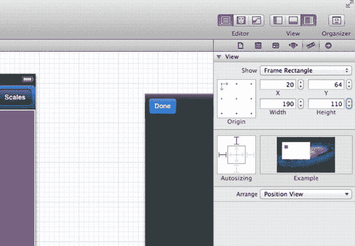

   **图 4-18.** *自定义“播放按钮区域”视图。*

7.  要显示你放入 `Supporting Files` 文件夹中的默认图像，请在“主视图控制器场景”中点击 `UIImageView`，然后在属性检查器中，从下拉菜单中选择 `Default-Landscape-ipad.png`，如图 4-19 所示。

   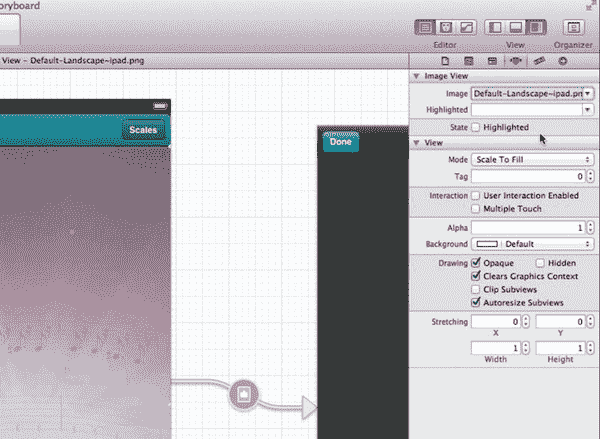

   **图 4-19.** *将默认图像设置为主视图中的初始图像。*

8.  现在转到“翻转视图控制器场景”，选择导航栏标题（在翻转视图控制器场景的文档大纲中，点击“导航项 - 标题”这一行）。然后在属性检查器中将标题重命名为“音阶”，如图 4-20 所示。

   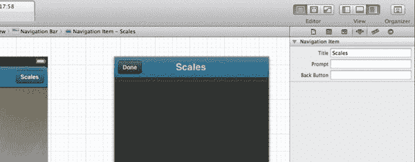

   **图 4-20.** *自定义翻转视图控制器。*

9.  你可能希望主视图的导航栏和翻转视图的导航栏颜色相同，所以点击翻转视图的导航栏（在文档大纲中），然后在属性检查器的色调选择器中再次选择青色。现在你想将“完成”按钮改为青色，所以点击它并在属性检查器中选择青色。最后，考虑一下你希望翻转视图这里是什么样。你希望这是一个音阶列表，供用户选择（参考图 4-58）。这意味着你需要拖入一个表格视图。拖入表格视图并让它自动调整大小后，你的翻转视图应该看起来像我们图 4-21 中的样子。

   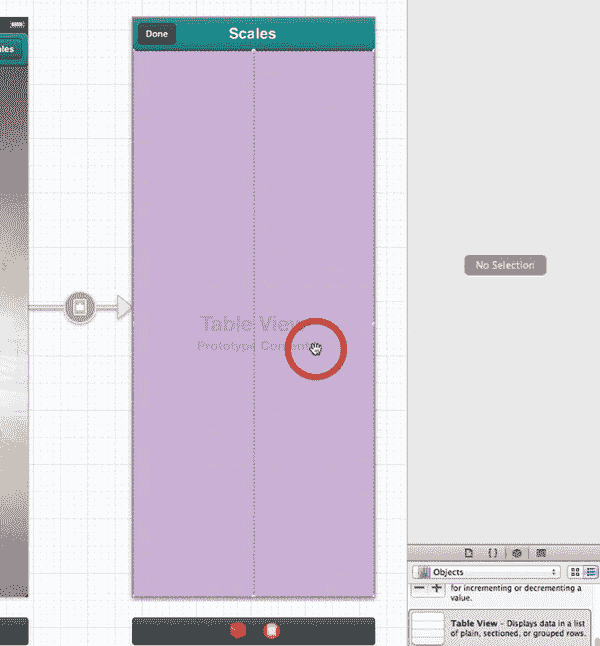

   **图 4-21.** *将导航栏和“完成”按钮设为青色，然后更改标题并引入一个表格视图。*

10. 当你的表格视图在翻转视图中大小调整好后，保持它被选中，转到属性检查器，在“内容”下拉菜单的“内容结构”类型中选择“动态原型”。你这样做是因为你不仅想要表格中的标题，还想要副标题。动态原型让你可以调整单元格样式，而无需提供单元格内容。将原型单元格的数量设置为 1（从 0 开始）。你还希望为你的表格选择分组样式，这样你就可以为表格中的音阶条目组设置一个头部（参考图 4-58），所以在“样式”下拉菜单中，选择“分组”。此时，你的表格视图应该看起来像我们的图 4-22 中的样子。

    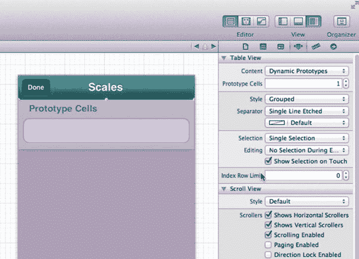

    **图 4-22.** *自定义表格视图。*

11. 你会希望每个单元格都有副标题。为此，点击单元格本身将其选中，然后在属性检查器的“样式”下拉菜单中选择“副标题”。同时在“选择”下拉菜单中，将默认的蓝色改为灰色。最后，你需要通过代码构建这些单元格，因此你需要给它们命名，以便你可以在故事板文件中定位它们，并在需要时将其加载到你的代码中。为此，在属性检查器中将标识符命名为 `ScaleCell`，如图 4-23 所示。

    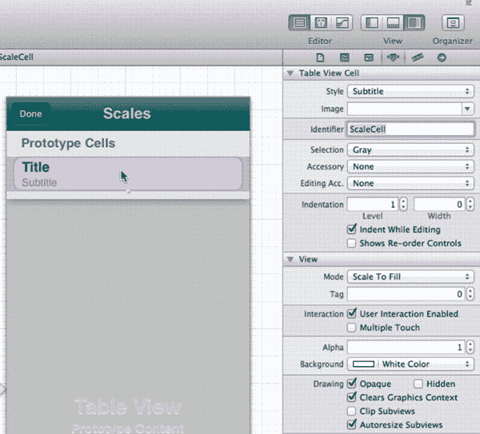

    **图 4-23.** *自定义单元格。*


#### 第三步：编写翻转视图控制器

为了保持极简风格，首先设置头文件和实现文件，然后添加 `ImageView` 和 `NavTitle` 的 `IBOutlet`。

1.  首先编写向用户显示音阶的代码——如你所见，这些音阶显示在翻转视图中。为此，请前往你的桌面，打开 `demoMonkey` 文件，并将其放置在屏幕的右侧。你可能希望调整 Xcode 窗口的大小，以便能在屏幕右侧看到打开的 `demoMonkey` 文件（Xcode 在左侧）。现在，在 Xcode 中，单击项目导航窗格（位于 Xcode 窗口左侧）中的文件，打开 `FlipsideViewController` 的实现文件（`.m`），如图 4-24 所示。

    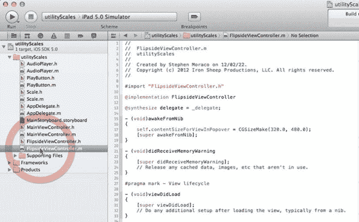

    **图 4-24.** *打开 FlipsideViewController 实现文件。*

2.  你将希望使用代码和 Storyboard 双屏进行编码。为此，请单击助理编辑器，如图 4-25 所示。这会将你主要关注的文件放置在 Xcode 窗口编辑器区域的左侧，将相关文件放置在右侧。（例如，当选中一个实现文件时，左侧显示该实现文件，右侧显示与该实现文件关联的头文件。）

    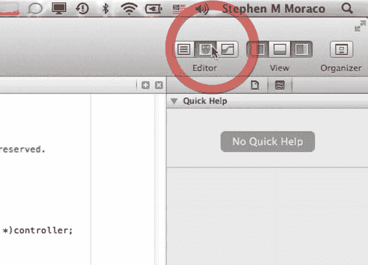

    **图 4-25.** *单击助理编辑器。*

3.  如前所述，你正在构建你的翻转视图控制器。为此，从 DemoMonkey 拖入“01 FlipView.h – add include”代码片段，该片段包含 `#import "Scale.h"` 的包含语句，因为这会引入我们为你构建的 `Scale` 类的头文件。接下来，拖入“02 FlipView.h – add protocol message signature”文件，该文件在你已有的协议基础上添加了更多内容以及注释。然后引入“03 FlipView.h – add protocol adheres to”，它表明翻转视图遵循表视图的数据源和委托协议。最后，拖入“04 FlipView.h – add scaleType property”，该属性记录/指示用户从表视图中选择了哪个音阶。现在，按如下代码所示进行拖拽，然后查看 图 4-26，确保你最终得到的文件内容与图中的代码一致。

    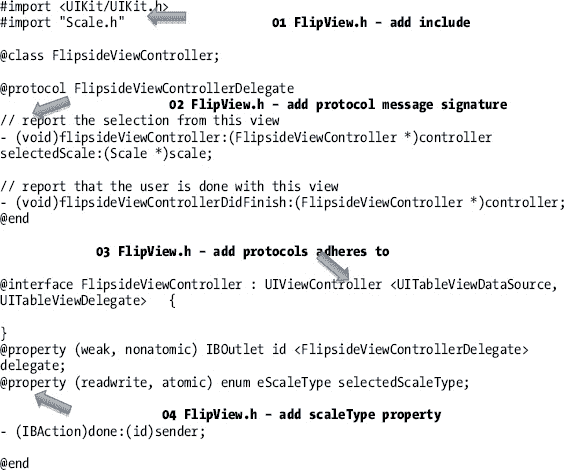

    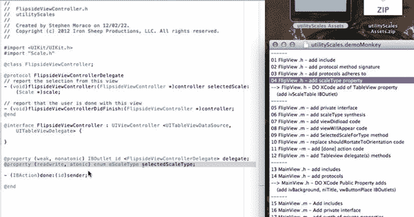

    **图 4-26.** *将前四个 DemoMonkey 代码片段拖入 FlipsideViewController.h 文件中。*

4.  现在，回到你的 Storyboard 文件并连接表视图。因此，在保持双屏助理模式的同时，打开 Storyboard，如图 4-27 所示。

    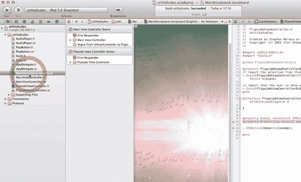

    **图 4-27.** *重新打开 Storyboard。*

5.  你需要添加一个 `IBOutlet` 来连接 `TableView` 和 `FlipsideViewController`。如图 4-28 左侧所示，首先在文档大纲中找到翻转视图控制器场景。接着打开 `FlipsideViewController`，然后打开视图，最后当找到表视图时，单击选中它，然后按住 Control 键从中拖拽到 `FlipsideViewController.h` 文件中第二个 `@property` 的正下方，如图 4.28 所示。拖到目标位置后，松开鼠标。

    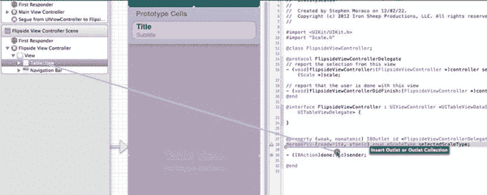

    **图 4-28.** *将表视图连接到 FlipsideViewController。*

6.  我们将其命名为表视图 (`tv`) 音阶表 (`tvScaleTable`)。命名后，单击“连接”按钮，如图 4-29 所示。通过使用 Control-拖拽技术，正如你所知，Xcode 现已为你创建了属性声明，以及属性合成和在对象释放时清除属性的代码，后两项是它在类实现文件中进行的修改。

    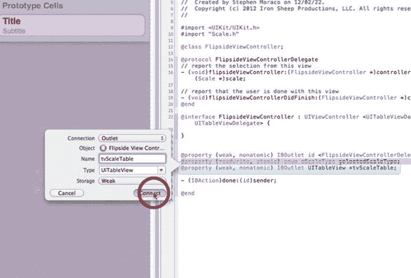

    **图 4-29.** *为 IBOutlet 命名为 tvScaleTable。*

7.  养成一个好习惯：当你使用 Control-拖拽到代码中时，务必检查连接是否正确建立。寻找连接标记即可轻松验证。查看 图 4-30，你会看到两个圆点，一个表示 `@property` 已与 Storyboard 对象建立连接，另一个表示 `IBAction` 已建立连接。现在，如果将鼠标指针移到新 `@property` 旁边的圆点上，你会看到 Storyboard 视图中的表视图高亮显示，表明连接已建立。很棒，对吧？现在，将鼠标悬停在 `IBAction` 的圆点上，看看哪个对象连接到了该操作！（提示：应该是“完成”按钮。）至此，你已完成了向 `FlipsideViewController.h`（头文件）添加代码的工作。接下来，转到它的实现文件。

    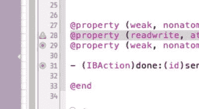

    **图 4-30.** *确保 IBOutlet 已连接。*

8.  打开的实现文件应如图 4-31 所示。

    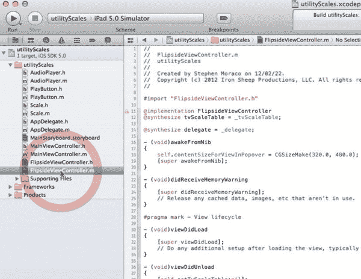

    **图 4-31.** *打开 FlipsideViewController 实现文件。*

9.  `FlipsideViewController` 有一个方法和一个实例变量，它们不需要公开引用（即，从类本身外部访问）。因此，我们选择在实现文件的顶部将它们声明为私有。我们有一个可变数组来存储音阶，并且将设置一个属性来记录用户选择的音阶。从 DemoMonkey 中将“05 FlipView.m – add private interface”代码片段拖入你的实现文件中，紧跟在 `@interface FlipsideViewController ()` 代码行的右侧。你最后得到的代码应如图 4-32 所示。

    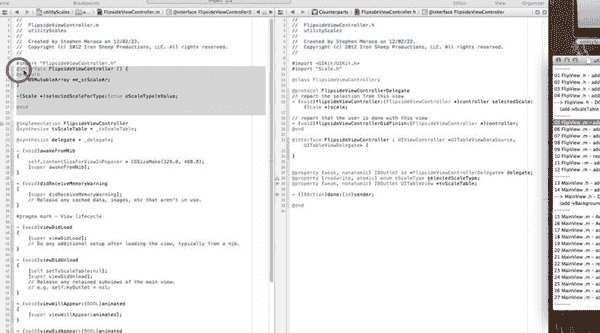

    **图 4-32.** *创建私有接口。*

    **注意：** 私有实例变量、方法和属性通常通过将它们放置在实现文件顶部的未命名类别中来声明。你会注意到，Xcode 生成的最新模板已在你生成的实现文件顶部为你声明了此私有接口。这旨在提醒你在向这些生成的文件添加代码时，应将此类项放置在哪里。

    现在，你需要合成你所创建的 scaleType，因此从 DemoMonkey 中拖入“06 FlipView.m – add scaleType synthesis”，并将其放置在 `@synthesize tvScaleTable = _tvScaleTable;` 行下方，如下列代码所示：

    ```
    @implementation FlipsideViewController
    
    @synthesize delegate = _delegate;
    @synthesize tvScaleTable = _tvScaleTable;
    @synthesize selectedScaleType;  
    ```

     **06FlipView.m – add scaleType synthesis**

10. 现在你已经合成了 scaleType 属性的 setter/getter 方法，需要在应用首次加载时将音阶数据加载到内存中。从 DemoMonkey 中拖入“07 FlipView.m – add viewDidload code”，并将其放置在 `viewDidLoad` 方法内部的 `[super viewDidLoad];` 正下方。这里可以看到，我们创建了八个 `Scale` 对象并将其添加到数组中，如图 4-33 所示。

    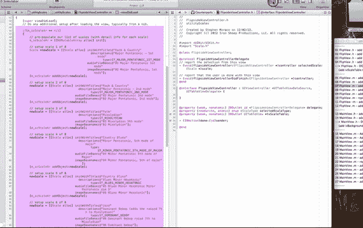

    **图 4-33.** *添加到数组中的八个音阶对象。*

11. 当视图首次出现时，你有责任显示上次查看过的音阶。或者，如果尚未选择任何音阶——例如在应用首次使用时——则显示第一个音阶。为此，从 DemoMonkey 中拖入“08 FlipView.m – add viewWillAppear code”中的代码，并将其直接放置在 `viewDidLoad` 方法的结束大括号之后，如图 4-34 所示。

    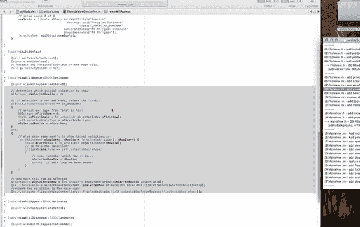

    **图 4-34.** *添加 viewWillAppear 方法。*

12. 在此步骤中，你将拖入来自 DemoMonkey 的四个代码片段。首先，在 `-(BOOL)shouldAutorotateToInterfaceOrientation` 行之前，通过拖入“09 FlipView.m – add SelectedScaleforType method”来设置一个用于按类型设置音阶的方法。接下来，替换 `- (BOOL)shouldAutorotateToInterfaceOrientation:` 方法内部的代码，该方法通常会决定视图的旋转方向。在此情况下，你只需使用横屏模式（以显示吉他琴颈）。选中 `return YES;` 语句并删除它。通过拖入“10 FlipView.m – replace shouldRotateOrientation code”将新代码放在花括号内，该代码会调用一个宏，用于确定传入的旋转方向是否为两个可接受的横屏方向之一，如果是则返回 yes。现在，*如果用户按下了“完成”按钮*，你需要获取音阶数据，告知主视图选择了哪个音阶，然后让主视图销毁此视图。因此，拖入“11 FlipView.m – add [done] action code”并将其放置在 `- (IBAction)done:(id)sender` 花括号内已有代码行的前面。四个片段中的最后一个，如图 4-35 所示，包含了“12 FlipView.m – add Tableview delegate(s) methods”中的代码。将其放置在代码的 `@end` 之前。这是 `UITableView` 的委托代码，它实际上响应用户对音阶的选择。在此，你会看到我们添加了 `UITableViewDataSource` 协议方法和 `UITableViewDelegate` 协议方法。

    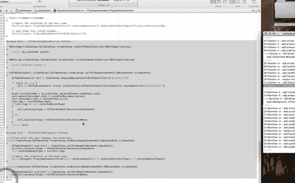

    **图 4-35.** *添加第四个片段后的实现文件。*

13. 现在你已经处理完了翻转视图，让我们继续处理控制器！打开 `MainViewController` 的头文件，如图 4-36 所示。同时，让我们暂时退出助理编辑器，在标准编辑器中工作。单击助理编辑器左侧的按钮（如 图 4-25 所示），将 Xcode 窗口的编辑器部分恢复为单个编辑器窗格。

    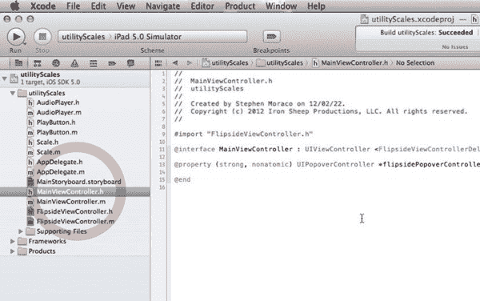

    **图 4-36.** *打开 MainViewController。*

14. 首先，通过“13 MainView.h – add includes”添加两个包含语句（`#import "AudioPlayer.h"` 和 `#import "PlayButton.h"`）。这样做是因为你需要从音频和播放按钮的头文件中获取信息。接下来，确保此对象支持 `FlipsideViewControllerDelegate`、`UIPopoverControllerDelegate` 和 `AudioPlayer` 协议。如图 4-37 所示，通过拖入“14 MainView.h – add protocols”来完成。

    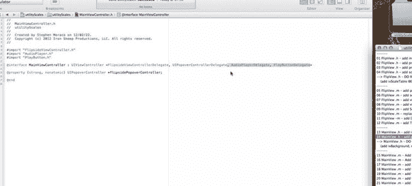

    **图 4-37.** *开始定制 mainView 的接口文件。*

15. 现在，你需要为主视图中的一些对象添加属性，这意味着你需要回到 Storyboard 文件中。同时，选择助理编辑器，以便在一个屏幕中看到接口代码，另一个屏幕中看到 Storyboard。重新打开 Storyboard 文件，如图 4-38 所示。

    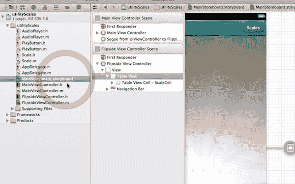

    **图 4-38.** *回到 Storyboard。*

16. 你将再次创建 `IBOutlet`，但在从 Storyboard 对象 Control-拖拽到 `MainViewController.h` 之前，你需要确保第二个屏幕确实显示的是 `MainViewController.h` 文件。在文档大纲中，单击 `MainViewController` 场景中的 `MainViewController`。如果右侧配置正确，它现在应显示 `MainViewController.h`。如果它没有显示你的 `.h` 文件，你需要如图 4-39 所示重新选择自动选项。如果选择了自动，那么接口文件将针对当前选中的场景显示。

    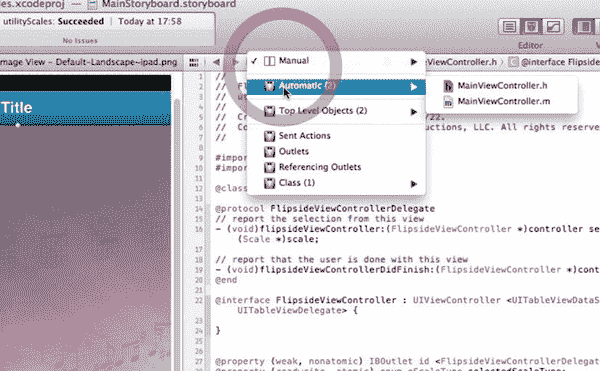

    **图 4-39.** *确保第二个屏幕显示的是 MainViewController.h 文件。*

17. 从文档大纲中的图像视图 Control-拖拽到 `MainViewController.h` 文件中，放置在 `@property` 下方，如图 4-40 所示。

    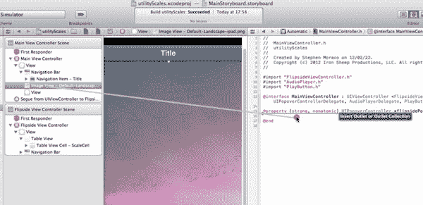

    **图 4-40.** *将图像视图连接到 MainViewController。*

18. 这是一个图像视图 (`iv`)，你希望它显示你的背景图像，因此将其命名为 `ivBackground`，如图 4-41 所示。输入名称后，单击“连接”。

    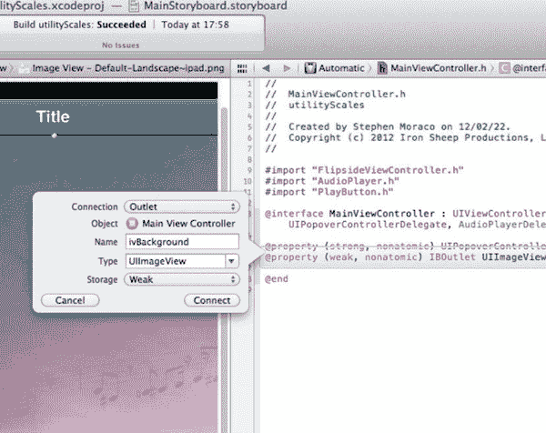

    **图 4-41.** *将属性命名为 ivBackground。*

19. 现在，我们来连接“播放按钮区域”视图。在文档大纲中选中它，然后 Control-拖拽到你在上一步中添加的 `@property` 下方。如图 4-42 所示。

    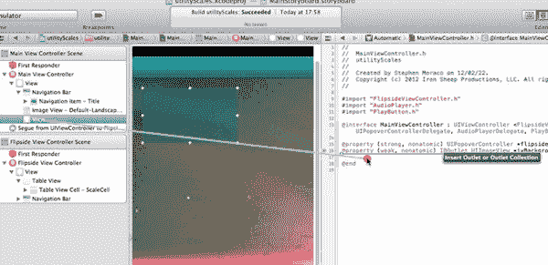

    **图 4-42.** *现在连接按钮。*

20. 这只是一个视图 (`vw`)，是按钮的占位区域，因此将其命名为 `vwButtonPlace`。输入名称后，如图 4-43 所示单击“连接”。

    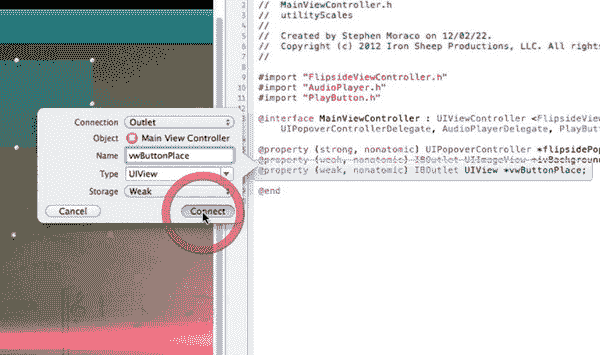

    **图 4-43.** *将属性命名为 vwButtonPlace。*

21. 因为你想要通过代码设置标题，所以还需要将导航栏标题连接到 `MainViewController`。因此，从导航项-标题 Control-拖拽到之前的 `@properties` 下方，如图 4-44 所示。

    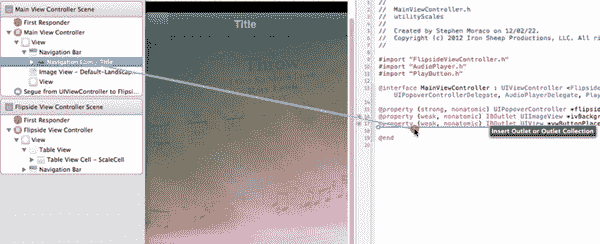

    **图 4-44.** *连接导航栏标题。*

22. 这是一个导航项 (`ni`)，并且是标题，因此将其命名为 `niTitle`，如图 4-45 所示。

    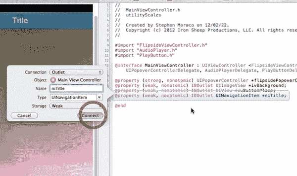

    **图 4-45.** *将属性命名为 niTitle。*

23. 在此处，你需要为表视图设置数据源和委托，使其指向 `FlipsideViewController`。我们在视频中忘记了这个步骤，而本书直接沿用了视频生成的代码。右键单击 `表视图` 单元格，并将数据源连接到 `FlipsideViewController`，如图 4-46 所示。

    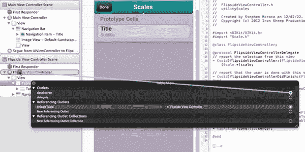

    **图 4-46.** *开始为翻转侧设置数据源和委托。*

24. 连接委托，如图 4-47 所示。

    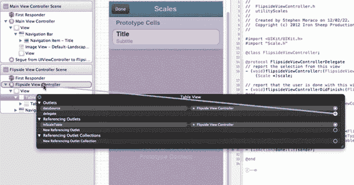

    **图 4-47.** *现在连接委托。*

25. 打开 `MainViewController` 的实现文件，如图 4-48 所示。

    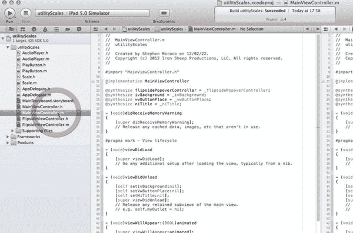

    **图 4-48.** *打开 MainViewController 的实现文件。*

26. 退出助理编辑器模式，回到标准编辑器模式（单个屏幕），拖入两个 DemoMonkey 代码片段。首先，通过“15 MainView.m – add includes”添加包含语句：`#import "Scale.h"` 和 `#import "PlayButton.h"`。`MainView` 也有一个私有接口，因此也拖入“16 MainView.m – add private interface”。在此例中，你拥有用于所选音阶、音频播放器以及最后按下的播放按钮引用的实例变量。你还有两个私有属性，包含对你两个播放按钮的引用，最后，还有一些方法在按下电吉他或原声吉他播放按钮时被调用。如图 4-49 所示。

    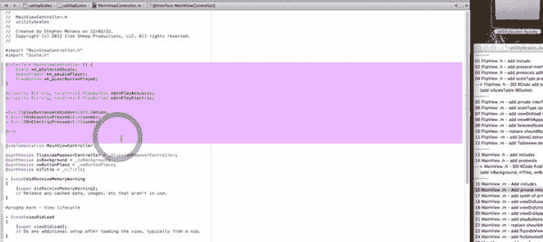

    **图 4-49.** *进行两次代码添加后的实现文件。*

27. 现在你需要合成私有属性，因此如图 4-50 所示，拖入“17 MainView.m – add synth of private buttons”。

    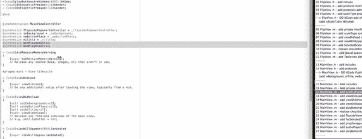

    **图 4-50.** *需要为原声吉他和电吉他播放按钮进行更多合成。*

28. 请记住，当视图首次加载时，你想继续设置应用程序，因此在 `viewDidLoad` 方法中设置音频播放器的细节，并跟踪最后播放的按钮。同时，对按钮本身以及你刚添加的按钮占位视图的边角进行圆角处理。你还需要在启动时隐藏按钮。拖入“18 MainView.m – add viewDidLoad code”，并将其放置在父类 `viewDidLoad` 的注释下方（`// Do any additional setup after loading the view, typically from a nib`），如图 4-51 所示。

    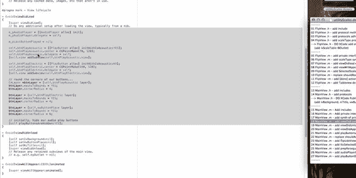

    **图 4-51.** *定制 viewDidLoad 方法。*

29. 在 `viewDidUnload` 方法中，你需要从视图中移除你的两个私有按钮，并移除对它们的引用。此处，你需要拖入“19 MainView.m – add viewDidUnload code”，并将其放置在 `viewDidUnload` 方法中，如图 4-52 所示。

    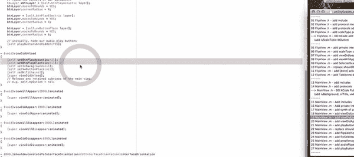

    **图 4-52.** *定制 viewDidUnload 方法。*

30. 当视图首次出现时，你将设置标题，以提示用户首次选择音阶。拖入“20 add viewWillAppear code”，将其紧接在你刚刚修改的 `viewDidUnload` 方法之后。拖入“21 MainView.m – add playButtonsAreHidden method”，将其放置在 `- (void)viewWillAppear` 的结束大括号之后，如图 4-53 所示。对左右横屏方向也进行同样的操作。拖入“22 MainView.m – replace shouldAutoRotate code”，在删除现有的自动旋转代码（`return YES;`）后，将其放在该位置。你还希望在启动时隐藏按钮，以便提示用户首先选择一个音阶。拖入“23 MainView.m – add flipsideViewControllerDidFinish”代码，作为该方法的新的第一行。

    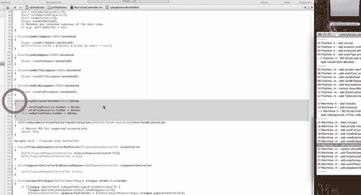

    **图 4-53.** *四次代码添加中的第二次之后。*

31. 你还需要设置一个方法，用于识别视图控制器选择的音阶。拖入“24 MainView.m – add fccSelctedScalemethod”，并将其放置在 `flipsideViewControllerDidFinish` 之后，如图 4-54 所示。并且你需要告诉视图选定了哪个音阶，以便它能够正确显示。拖入“25 MainView.m – add prepforsegue code”。

    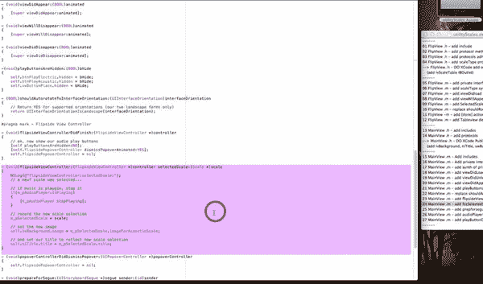

    **图 4-54.** *识别音阶。*

32. 你需要添加一个音频播放器委托。拖入“26 MainView.m – add audioPlayerDelegate methods”，并将其放置在 `@end` 之前，如图 4-55 所示。

    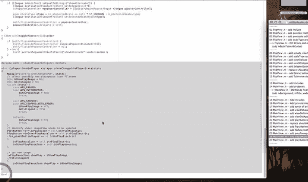

    **图 4-55.** *添加音频播放器委托方法。*

33. 最后，你需要添加支持播放按钮委托协议的方法。拖入“27 MainView.m – add playButtonDelegate methods”，并将其放置在 `@end` 之前，如图 4-56 所示。这样就完成了！单击“运行”，查看你漂亮的应用程序运行。

    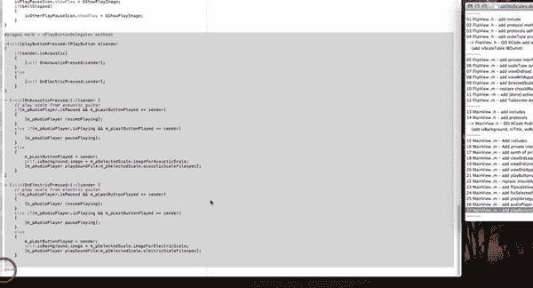

    **图 4-56.** *添加 PlayButtonDelegate 方法。*

34. 应用程序启动后，会要求你选择一个音阶；当你选择一个音阶时，第一张图像出现。在此例中，我们首先选择了“Major Pentatonic”（大调五声音阶），然后，如图 4-57 所示，我们即将选择一个新的音阶。当选择新音阶时，图像会动态变化。图 4-58 展示了当你点击“完成”时按钮是如何出现的。图 4-59 展示了如何在原声吉他和电吉他之间切换查看音阶。

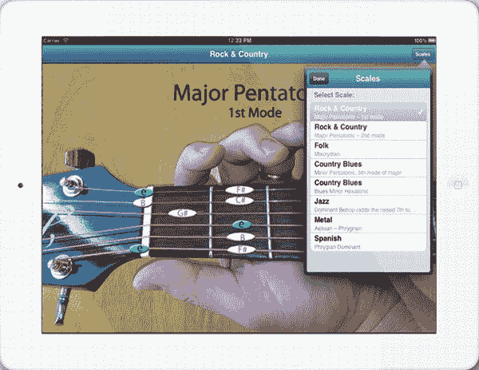

**图 4-57.** *运行成功！*

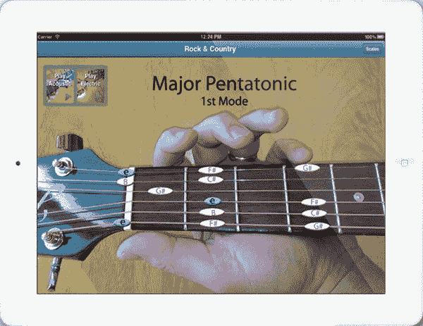

**图 4-58.** *现在，当我们点击“完成”……按钮出现了。*

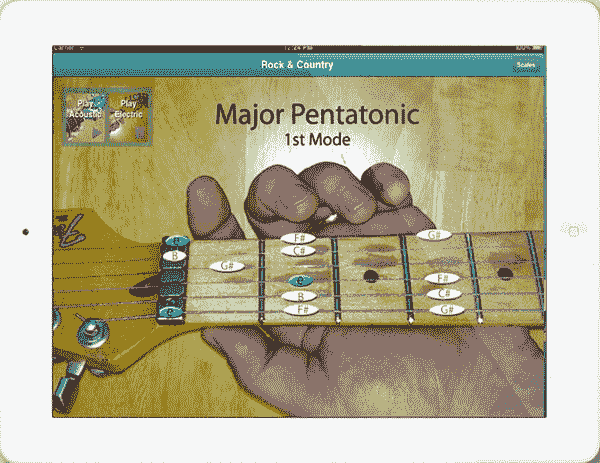

**图 4-59.** *你可以通过按下播放按钮来更改吉他类型。*


## 为基于页面的应用编排故事板

我们的第四个故事板应用，可以说是一个相当离奇的尝试。你将构建一个基于页面的应用程序，它包含一个动态的电子手册，而这份手册实际上由 4 个微型手册组成。有趣的是，你的“客户”是一家能够穿越过去和未来的时间旅行机构！我们将这个应用命名为`futureTravel`。当你使用它来提升你的故事板技巧时，你将学到许多酷炫的工具和方法。

请注意，应用 1 到 3 侧重于标准的故事板技能和代码。应用 4 到 7 将专注于更高级的故事板功能和方法，这些功能和方法建立在前几节讨论的理论代码基础之上。

`FutureTravel`将四个手册合而为一。这意味着，当用户进入四页中的第二页时，用户可以从四个可能的目的地中选择一个。做出选择后，剩余的两页会自动根据用户选择的目的地进行定制。如果用户决定探索其他三个目的地，`futureTravel`允许她简单地往回翻页并选择另一个目的地，然后再次向前翻页，页面会动态更新，关联到新选择的目的地。

使用基于页面的应用模板，关键在于用你自己的数据模型替换内置的数据模型。页面导航只是让你能够查看由这个底层模型生成的页面。你将使用 iPad 布局，因为它为你的旅行宣传单页面提供了更大的文本空间。你将用自己的一组页面替换内置模型，每个页面包含一张图片和页码。你将把这些页面数据封装到自己的类中（包含`.h`/`.m`文件的对象）。在`ModelController`的启动方法中，你将在运行时构建页面数据的数组。在故事板文件中，你可以根据需要调整 UI。

### futureTravel：一个基于页面的应用

我们将这个项目分为五个步骤。首先，从模板创建项目，然后准备故事板。步骤 3 到 5 包括编写`ModelController`、`DataViewController`和`RootViewController`的代码。这个项目本质上会变得相当有层次结构，因此你可能需要留意我们编码策略的总体大纲：

1.  *从模板创建*：首先，我们启动一个新的基于页面的应用，命名为`futureTravel`，使用`com.apress`作为标识符，选择 iPad，并启用 ARC。然后，我们通过取消选中竖屏和倒置功能来调整项目设置。接下来，我们将资源文件（如`Default-Lanscape*~ipad.png`和`ModelPageData`类文件（`.h`和`.m`））拖入`futureTravel`组。为了测试一切正常，我们构建项目。
2.  *准备故事板*：这里需要考虑两部分：根视图和数据视图。对于根视图，我们为视图背景着色：`RGB(254,196,37)`，即 Apress 的黄色。数据视图稍微复杂一些。这里我们也为视图背景着色：`RGB(253,224,145)`，这是我们之前使用的 Apress 黄色的较浅版本，但我们需要做更多工作。我们移除从属视图，并在其位置添加一个`UIImageView`，它将与我们的加载图片一致（`20,20 984x679`）。这不会有任何用户交互。完成后，我们调整所有四个边缘，并启用两个方向的自动调整大小。我们还调整了标签的位置和配置，并正确定位它。最后，我们将文本改为右对齐，并将其颜色改为深灰色。
3.  `编写 ModelController`。
4.  `编写 DataViewController`。
5.  `编写 RootViewController`。

### 准备工作

我们为程序创建了资源，包括一个启动画面和最初的两张图片（旅行介绍和目的地选择），然后为四个目的地各创建了两张图片。我们为所有这些文件生成了`@2x`版本，如果我们在新的 iPad（Retina 显示屏版本）上运行此应用，这些版本将自动被使用。我们还创建了一张特殊图片，用于标记客户的目的地选择。这样，我们为该项目总共生成了 23 张图片。你可以在此处下载图片、资源、附加文件和 DemoMonkey 文件：[`http://www.rorylewis.com/xCode/StoryBoarding%20in%20Xcode/Chapter05_futureTravel%20Assets.zip`](http://www.rorylewis.com/xCode/StoryBoarding%20in%20Xcode/Chapter05_futureTravel%20Assets.zip)。你可以在此处下载我们拍摄视频时编写的源代码：[`http://www.rorylewis.com/xCode/StoryBoarding%20in%20Xcode/Chapter05_futureTravel.zip`](http://www.rorylewis.com/xCode/StoryBoarding%20in%20Xcode/Chapter05_futureTravel.zip)。和往常一样，我们建议你开始之前清理桌面，下载所有图片，并打开你的 DemoMonkey 文件。


#### 步骤 1：从模板创建

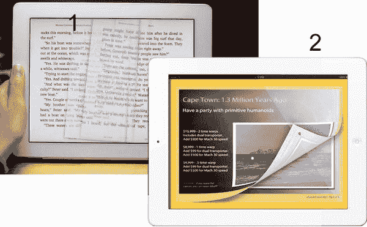

**图 5-1.** *iBooks 与我们的应用——基于页面的应用。*

1. 在深入探讨之前，我们先确保你理解了何时需要使用基于页面的应用。苹果在 App Store 发布 iBook 应用后，市场立刻出现了对实现炫酷翻页效果代码的需求。作为回应，苹果在 Xcode 4 中引入了一个名为“基于页面的应用”的新模板。该模板使用单个视图控制器，根据用户导航到的每个页面动态替换内容。苹果提供这样一个模板，其复杂度远超其通常提供的精简基础框架，这多少有些不同寻常。通过这个模板，苹果实际上提供了一个示例应用。不过，在本章中，我们将非常仔细地讲解一些巧妙的技巧和隐藏的陷阱。

**注意：** 当你想要创建一个旨在为每个新视图展示一个页面的应用项目时，建议使用“基于页面的应用”模板。

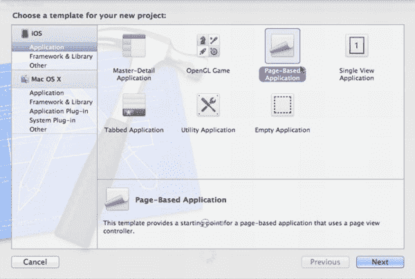

**图 5-2.** *在 Xcode 中新建一个基于页面的应用项目。*

2. 打开 Xcode，按 `+N`，选择“基于页面的应用”，然后点击“下一步”，如图 5-2 所示。

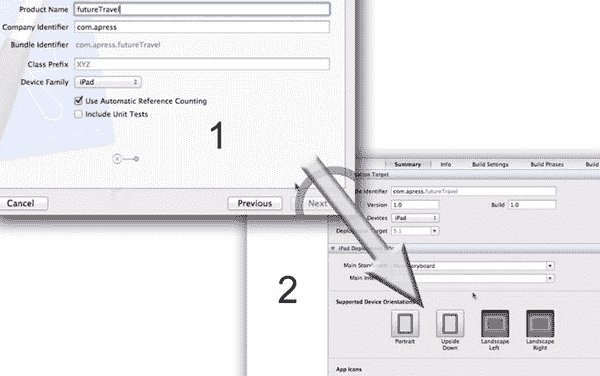

**图 5-3.** *将应用命名为 futureTravel，然后取消勾选“竖屏”和“倒置竖屏”。*

3. 输入 `com.apress` 作为公司标识符。我们不使用类前缀。确保选择 iPad，并勾选“使用自动引用计数”。不要勾选“包含单元测试”（图 5-2）。创建完成后，将其保存到桌面。你会看到新的 `futureTravel` 项目被打开。如前所述，我们只为 iPad 制作这个应用——而且为了兼容我们将要使用的文本图片，我们还会将其设置为仅横屏模式。这些图片中的文本是横向排列的，因此请取消勾选“竖屏”和“倒置竖屏”，如图 5-3 所示。有趣的是，看看这里少了什么……你注意到了吗？注意，这个基于页面的应用没有提供不使用 Storyboard 的选项。

**注意：** 在使用“基于页面的模型”模板时，你的目标只有一个：进入代码，将页面内容的模型替换为你自己的页面内容模型。接下来，你将通过添加自己的数据对象并改造现有对象以使用新数据对象来开始这项工作。

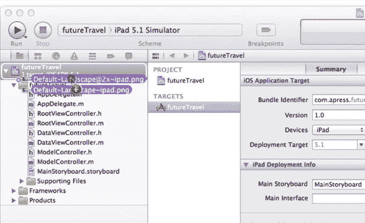

**图 5-4.** *将启动图片拖入你的根目录。*

1. 打开你从 `http://www.rorylewis.com/xCode/StoryBoarding%20in%20Xcode/Chapter05_futureTravel%20Assets.zip` 下载的 `futureTravel` 资源文件夹，并将其解压到桌面。选中两个启动图片文件 `Default-Landscape@2x~ipad.png` 和 `Default-Landscape~ipad.png`，然后将它们拖拽到根目录。请注意，你还可以看到适用于新 iPad（Retina iPad）的图片，如果你打算将应用直接编译到 Retina iPad 上，则可以使用它们，如图 5-4 所示。

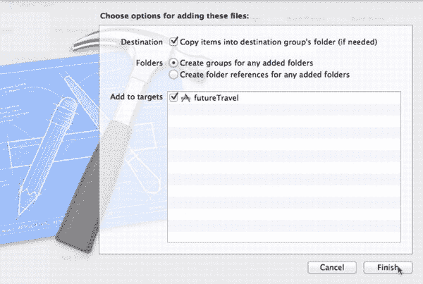

**图 5-5.** *确保将启动图片复制到你的项目中。*

2. 当弹出“选择添加这些文件的选项”对话框时，勾选“将项目复制到目标组的文件夹中”。同时勾选“为添加的文件夹创建组”。确保你的目标项目是 `futureTravel` 并且已被勾选（图 5-5）。

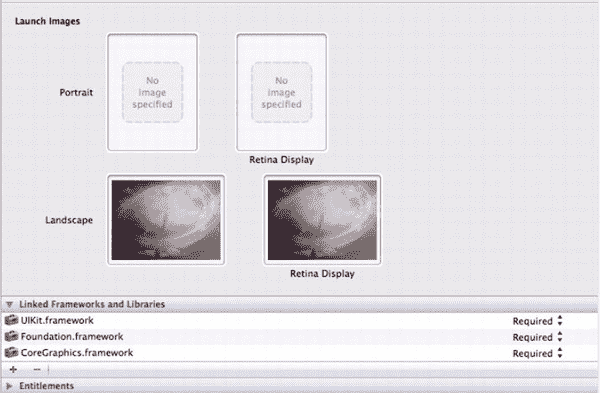

**图 5-6.** *Xcode 自动引入这些图片。*

3. 注意，Xcode 会检测到这些图片是用于横屏和 Retina 显示屏的，并自动将它们放入相应的启动图片框中，如图 5-6 所示。

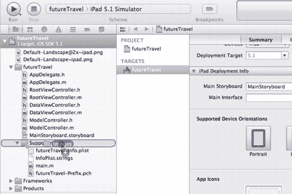

**图 5-7.** *将 Images 文件夹拖入 Supporting Files 文件夹。*

4. 现在，选中整个 `Images` 文件夹，将其拖入 `Supporting Files` 文件夹中，如图 5-7 所示。

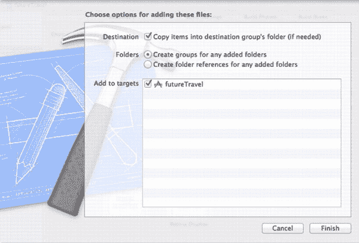

**图 5-8.** *将启动图片文件夹复制到你的项目中。*

5. 与步骤 5 类似，当弹出“选择添加这些文件的选项”对话框时，勾选“将项目复制到目标组的文件夹中”和“为添加的文件夹创建组”。确保你的目标项目是 `futureTravel` 并且已被勾选，如图 5-8 所示。

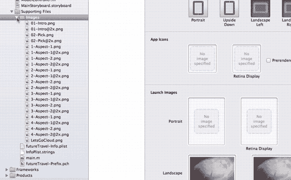

**图 5-9.** *注意 Xcode 为你创建的新组。*

6. Xcode 会在 `Supporting Files` 文件夹内实例化一个全新的组，如图 5-9 所示。

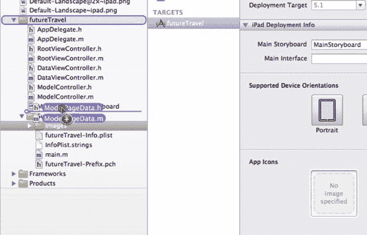

**图 5-10.** *拖入 Data 类。*

7. 因为我们将重点放在 Storyboard 方面，所以我们决定为你创建数据模型代码。我们将在本章后面部分详细描述这些代码，但现在只需选择 `ModelPageData.h` 和 `ModelPageData.m` 这两个文件，然后将它们拖入你的项目，如图 5-10 所示。如果你使用的是旧版 Xcode，可能需要指示 Xcode 编译这些新文件。（到本书出版时，这个问题可能已经修复。）步骤 12 展示了如何告诉 Xcode 编译这些新文件。

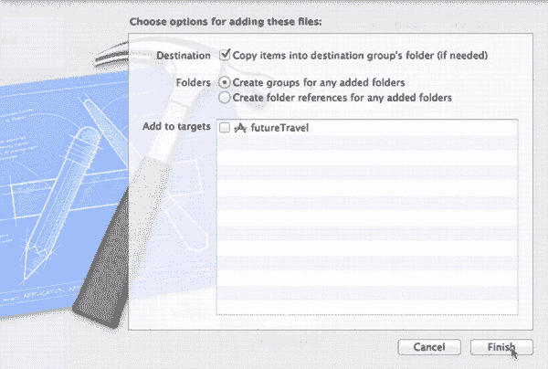

**图 5-11.** *复制文件。*

8. 再次勾选所有合适的选项，如图 5-11 所示。

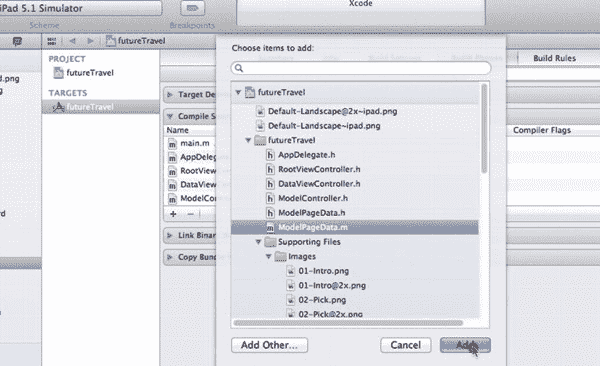

**图 5-12.** *如果新文件尚未被编译，手动添加它。*

9. 点击导航树根部的 `futureTravel`。在左侧的目标设置中，选择顶部的“构建阶段”标签。然后展开“编译源代码”部分。如果你在此列表中未看到 `ModelPageData.m` 文件，请点击 +（加号）按钮，选择 `ModelPageData.m` 实现文件，然后点击“添加”，如图 5-12 所示。这会将 `ModelPageData.m` 添加到项目中。如果在“选择要添加的项目”列表中未显示所需文件，请点击“添加其他”按钮，然后在你的目录结构中查找想要添加的文件。

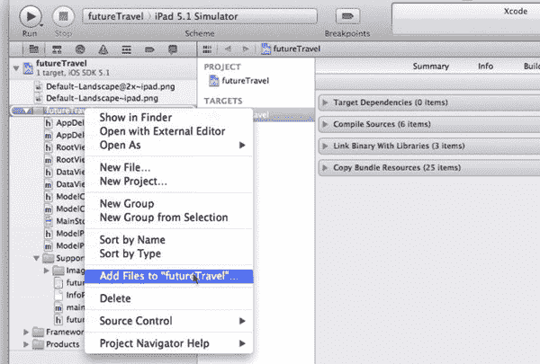

**图 5-13.** *另一种操作方法……*

10. 如果到你阅读本书时苹果仍未修复此问题，这并不是唯一的解决方法。你可以转到你的 `futureTravel` 文件夹，右键单击它，选择“将文件添加到 `futureTravel`”，如图 5-13 所示，然后导航到桌面上的文件夹并选择文件，它便会自动将源文件添加到编译列表中。这样，你就有两种不同的方法来解决新版 Xcode 在 Lion 系统下存在的这个小问题。


#### 第 2 步：准备故事板

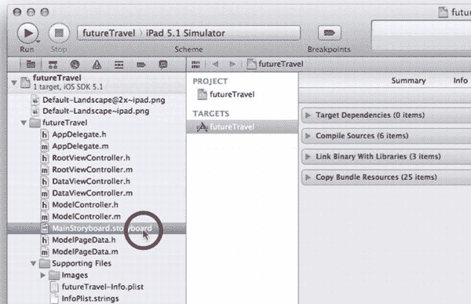

**图 5-14.** *打开故事板。*

1.  现在我们要处理正题了：故事板。我们来打开您的故事板吧！前往项目导航器，点击您的故事板文件，如图 5-14 所示。

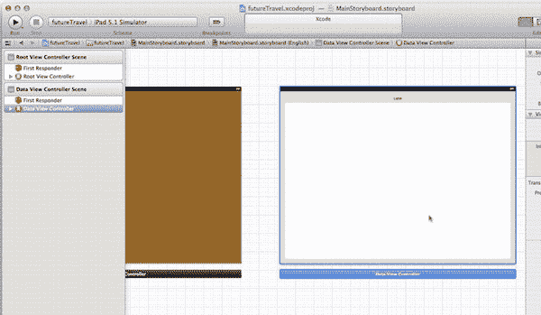

**图 5-15.** *哇！故事板本身已经设置好了！*

2.  打开故事板时，您可能会惊讶地发现，基于页面的应用程序模板已经实例化了一个功能完整的翻页应用！您会看到两个场景：根视图控制器和数据视图控制器，如图 5-15 所示。请记住，根视图控制器是显示页面的框架。数据视图控制器则显示一个页面实例。对于学生们来说，有时很难理解所有页面都将通过数据视图控制器的每个实例来获取。您不能在此添加大量其他 UI 元素，但可以进行微调。

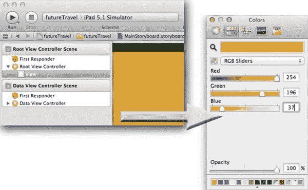

**图 5-16.** *将根视图控制器的颜色更改为 Apress 黄色*

3.  您要将根视图控制器的背景颜色从默认的棕色更改为 Apress 黄色。首先点击根视图控制器。您可以在图 5-16 左侧看到视图被高亮显示。Apress 的颜色值为红@254、绿@196、蓝@37。如图 5-16 右侧所示，在颜色对话框中更改这三种基色。

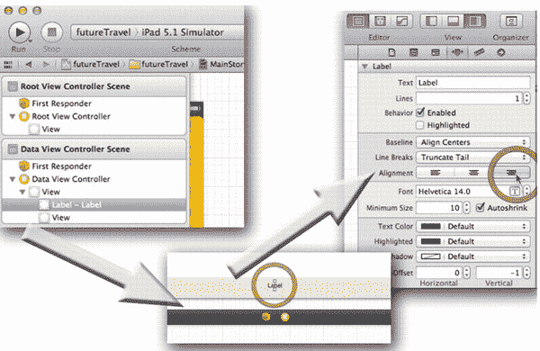

**图 5-17.** *调整数据视图控制器。*

4.  我们确实喜欢苹果提供的这个框架，但我们将按如下方式调整一些其他默认属性。我们希望保留标签，但将其放置到底部。只需选中它并将其向下移动到底部，如图 5-17 左侧所示，在文档大纲中选择它即可。或者直接点击标签本身并将其拖拽到底部。使用参考线根据需要将其居中。打开属性检查器选项卡，将文本对齐方式设置为右对齐，如图 5-17 右侧所示。最后，将文本颜色属性更改为深灰色，如图 5-18 所示。同时，将内部内容视图稍微上移一点，使其不与标签相交——您可以用鼠标将其拖拽上去，或者选中它，转到右侧的尺寸检查器面板，将框架矩形的 Y 属性更改为 20。

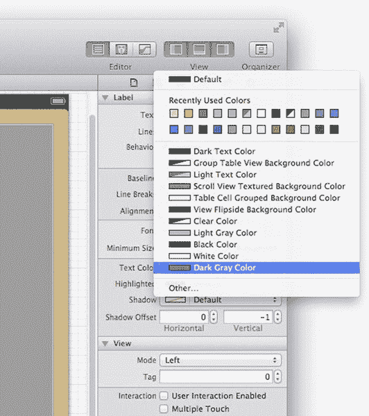

**图 5-18.** *设置字体颜色。*

5.  您需要在场景中放置图片，所以从库中拖拽一个图像视图，并将其放置在场景中心的当前视图内部。

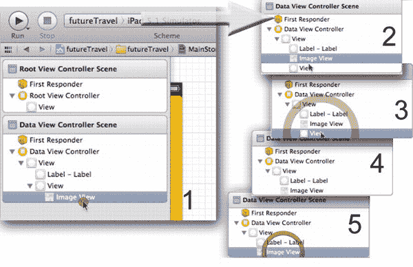

**图 5-19.** *替换并删除旧视图。*

6.  如果您不关心对象的数量，那么可以保持现有的图层嵌套——但这里有个经验教训。您要做的是培养良好的习惯，所以我们希望您用图像视图替换视图。看看图 5-19：在步骤 1 中，选中图像视图。在步骤 2 中，将其拖拽到视图上方、标签下方。在步骤 3 中，选中旧视图。在步骤 4 中，删除刚刚选中的旧视图。在步骤 5 中，选中图像视图，以便在下一步中将其重新定位到故事板上。

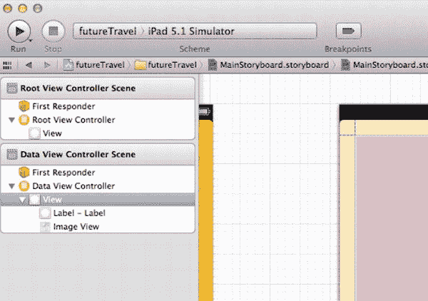

**图 5-20.** *将视图移动到正确位置。*

7.  移动主视图，直到看到数据视图控制器的左右两侧出现正方形虚线，如图 5-20 所示。

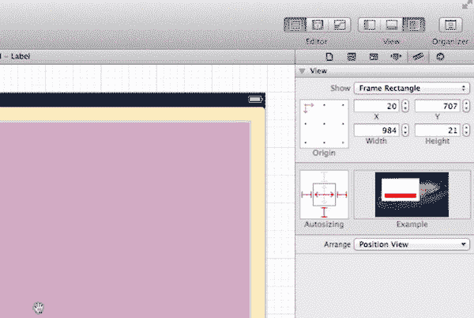

**图 5-21.** *确保图像视图正确缩放。*

8.  点击图像视图，然后转到尺寸检查器中的视图选项，确保示例中的红色矩形正确缩放。它看起来会随着窗口伸展，这是正确的。但标签需要固定位置，所以点击标签，在自动调整大小框中选中底部、左侧和水平居中的红色锚点。取消选中顶部锚点。您的标签应该被固定，如图 5-21 所示。这意味着，当包含标签的视图改变大小时，标签能保持其正确的位置和大小。您通过选择适当锚点来直观设置的属性称为`autoResizingMask`。每个`UIView`子类都有这个属性。事实上，这是一个非常便利的属性，尤其是在开发支持多种设备方向的应用时。

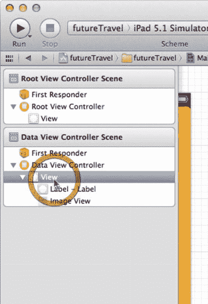

**图 5-22.** *选中包含标签和图像视图的视图进行最终编辑。*

9.  我们还需要对主视图进行一项调整。选中包含标签和图像视图的主视图，如图 5-22 所示。

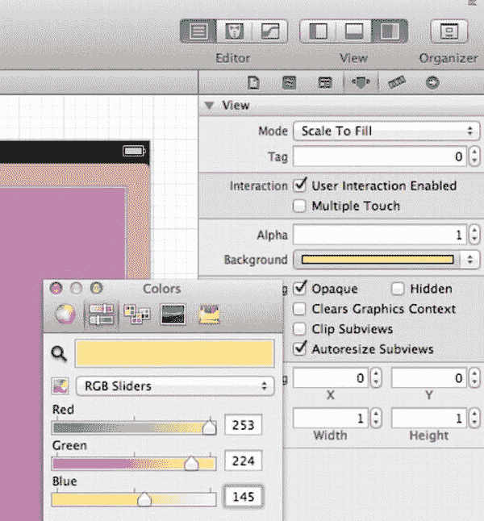

**图 5-23.** *将视图的颜色更改为 Apress 黄色。*

10. 选中视图后，在属性检查器中，通过点击背景色色板打开颜色对话框。从下拉菜单中选择 RGB 选择方式，设置红@253、绿@224、蓝@145，如图 5-23 所示。关闭对话框。现在您可以运行应用，看看效果了。

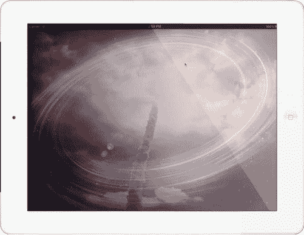

**图 5-24.** *一个漂亮的启动画面启动了应用。*

11. 果然，一旦应用构建并运行，它就会以您插入的漂亮启动画面开始，在应用程序完成启动期间显示。请注意，无论您如何手持设备，它都会自动以横屏模式启动。图片也完美地适配页面，如图 5-24 所示。

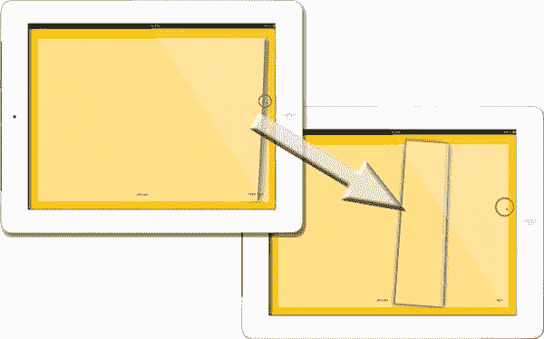

**图 5-25.** *精美的翻页效果全部自动完成。*

12. 正如本章开头所述，苹果能提供如此即开即用的 Xcode 框架是前所未有的。启动画面完成后，您立即进入第一页，看到 Apress 黄色背景、灰色字体以及标签的放置位置——所有这些都是您在故事板中处理好的。然后，选择页面最右侧进行翻页，如图 5-25 所示，您会看到精美的翻页效果出现，而无需编写一行代码。哇！现在唯一缺少的就是您的页面内容，这正是我们在五步中的第三步要做的。那么，让我们开始吧！


#### 步骤三：编码：`ModelController`

在开始编码之前，我们先花一分钟回顾一下，环顾四周，既见树木也见森林。你还有三个步骤要完成。第一步是设置项目。第二步是调整你的 Storyboard。现在你将编码步骤三的`ModelController`、步骤四的`DataViewController`和步骤五的`RootViewController`。这三个步骤的安排是有充分理由的，因为基于页面的应用程序（Page-Based Application）正好提供了这三个类：`RootViewController`、`ModelController`和`DataViewController`。本章接下来的部分，你将花时间来编写这三个类的代码。

**注意：** 我们强烈建议你在为自己的项目使用基于页面的应用程序模板时，*也*将项目分为五个步骤：首先，初步分配文件；其次，调整 Storyboard；最后，编写所提供三个类的代码。

在基于页面的应用中，记住这些类的一个简单方法如下：

- `DataViewController` 管理你希望用户看到的实际数据和视图。
- `RootViewController` 跟踪用户请求的当前视图和新视图（页面）。
- `ModelController` 接收并创建从`RootViewController`请求的新视图（页面）。

好了，重新回顾了我们之前的位置、现在的位置以及未来的方向之后，让我们开始编码吧。

**注意：** 我们会稍微打乱顺序，先从`ModelController`开始。原因在于，如果按顺序构建代码（从`DataViewController`到`RootViewController`再到`ModelController`），那么很难测试代码是否构建正确。相反，按照我们现在的逆序构建，你可以在每一部分结束时直接按下 `⌘+B`，如果没有编译错误或警告，你就知道做对了。本质上，我们采用反向顺序，是为了能够边构建边测试。

**图 5-26.** *打开`ModelController.m`并搭建环境。*

1. 首先，你需要重新组织 Xcode 窗口以便编码。先选择`ModelController.m`实现文件，然后参考图 5-26 右侧的图像，如果你的标准编辑器（Standard editor）处于开启状态，请通过选择助理编辑器（Assistant editor）来关闭它。保持导航器（Navigator）开启，关闭调试区（Debug area），并取消选中工具面板（Utilities pane），如图 5-26 所示。

**图 5-27.** *你的 Xcode 编码画布，便于跟随我们一起编码。*

2. 当你用`ModelController`实现文件（位于左侧窗格）及其头文件（位于右侧窗格）搭建好 Xcode 环境后，打开`DemoMonkey`，根据你的屏幕尺寸，将其放置在与图 5-27 所示大致相同的位置。

**图 5-28.** *从`DemoMonkey`中拖入第一个代码片段。*

3. 我们需要添加一个名为`destinationNumber`的新属性，因为在你制作的旅行宣传册中，有四个可能的目的地，你希望在翻阅宣传册时看到它们。随着我们继续，我们将深入探讨这个属性。现在，首先将“01 ModelController.h – add new property”代码片段从`demoMonkey`拖到头文件中，置于 `@interface ModelController` 代码行下方，如图 5-28 所示。

**图 5-29.** *关于如何布置文件的一般性回顾。*

4. 在深入拖拽代码片段到`ModelController.h`文件之前，让我们快速回顾一下我们用于设置每个页面的格式，这也是我们强烈建议你遵循的格式。从上到下依次是：我们的公共接口（public interface）、实例变量（instance variables）部分、属性（properties）部分，最后是实例方法（instance methods）部分。在我们指导你放置`DemoMonkey`代码片段时，会引用这些部分，如图 5-29 所示。但此视图是使用助理编辑器（Assistant editor）显示的。我们会在助理编辑器和标准编辑器之间来回切换，如图 5-30 所示。

**图 5-30.** *同一个头文件，但这次在标准编辑器中查看。*

5. 我们之所以详细讲解这些，是因为正如你所知，这些截图直接来自视频，并且由于我们不断在助理编辑器和标准编辑器之间切换，你需要能够识别它们。例如，图 5-30 显示了与图 5-29 相同的头文件，只是我们关闭了助理编辑器并点击了标准编辑器。

**图 5-31.** *打开 ModelController 实现文件，并将三个代码片段中的第一个拖入实现文件。*

6. 打开`ModelController.m`。你需要拖入三个代码片段。

   - 首先拖入“02 ModelController.m – add import of pageData object”代码片段，它将实现文件与你之前在（图 5-10 中）引入项目的类连接起来。我们将深入探讨为何要连接它以及该类的作用，但目前只需像图 5-31 中第 12 行所示那样导入即可。
     - 现在看第 14 行，紧跟在`/*`之后，删除第一行文本，并将其替换为“03 ModelController.m – replace one-liner description”，以提醒自己这是一个管理数组或数据对象集合的控制器对象。
     - 这个模型最初是为支持数组中的元素数量而编写的，但对我们来说情况已不再如此。我们有固定的最大页数值，因此你要做的是，在为新添加的属性添加属性合成（property synthesis）之后，直接添加一个页面数量的定义。

**注意：** 另一种实现方式是，通过属性重写 getter 方法，让页面数量属性始终返回相同的值。

我们之所以选择用 `destinationNumber = m_nDestinationNumber;` 来修改数组，而不是采用旁边灰框中描述的选项，是因为我们的方法很有趣，并且能教你几个在 Storyboarding 中使用的超酷技巧：

- 我们有一个未命名的匿名枚举 `enum`。
  ```
  enum {
      MAX_PAGES = 4
  };
  ```
- 我们也没有使用与此枚举绑定的实例变量。我们的方法严格遵守我们现在可以通过名称使用的值。
- 这在某种程度上类似于创建`#define`指令，但编译器不会将其视为文本替换。相反，这种机制为`enum`中的每个名称创建了一个常量整数值，这意味着我们正在向你展示一种创建多个不相关的命名整数常量的酷炫方法，而无需使用数组，从而在你的应用程序需要时使用它们。在我们的案例中，我们只会用到`MAX_PAGES`。但对你而言，这种方法为你解放了思路，并为你在未来其他应用程序中根据特定目的使用此方法打开了大门。

现在返回并按照项目符号列出的内容进行操作。从添加属性合成开始。将“04 ModelController.m – add property synthesis”代码片段拖入，并放置在 `@synthesize pageData = _pageData;` 的正下方，如图 5-31 所示。


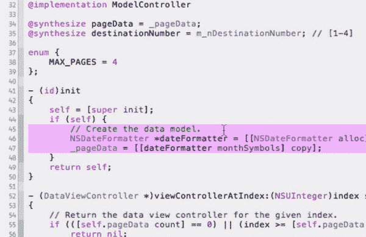

**图 5-32.** *为页数添加定义，然后删除旧数据模型的日期格式。*

7. 你需要为数组将要处理的页数提供一个定义。将“05 ModelController.m – add anonymous enum”代码段拖入，并放置在刚刚放置的合成语句下方，如图 5-32 所示。现在需要移除旧模型的生成代码，因为如前所述，你将不再使用日期，并用自定义数据来替代它。因此，选中图 5-32 中显示的三行代码，将其删除。

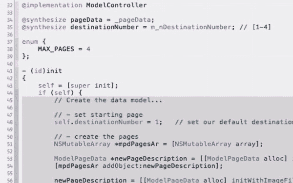

**图 5-33.** *用你的数据模型替换旧数据模型。*

8. 将“06 ModelController.m – replace init code (within if {})”代码段拖入，并精确放置在图 5-33 中已删除代码的位置，位于 `if` 语句内部，如图 5-34 所示。你可以看到，我们通过 `self.destinationNumber = 1;` 预置了目标页面 1。你还需要设置一个页面数组，但由于我们的宣传册并非只有 4 页，而是将 4 本宣传册整合为一本，因此最终你会得到一个 8 页的包加上 2 个封面页，总共 10 页——而每次遍历宣传册时，最大页数仅为 4 页。接下来我们要这样处理：

* 始终将 `"01-Intro.png"` 保留给数组中的槽位 1
    * 始终将 `"02-Pick.png"` 保留给数组中的槽位 2

现在数组中只剩下 2 个槽位，而我们需要填入 8 页。解决方案：

* `newPageDescription` `"n-Aspect-ni.png"` 用于数组中的槽位 3
    * `newPageDescription` `"n-Aspect-ni+1.png"` 用于数组中的槽位 4

进一步展开如下：

```
ModelPageData …."01-Intro.png" andPageNbr:1 ofMax:MAX_PAGES];…;
    newPageDescription …"02-Pick.png" andPageNbr:2 ofMax:MAX_PAGES];…;
    newPageDescription …"1-Aspect-1.png" andPageNbr:3 ofMax:MAX_PAGES];…;
    newPageDescription …"1-Aspect -2.png" andPageNbr:4 ofMax:MAX_PAGES];…;
```

```
newPageDescription …"4-Aspect-1.png" andPageNbr:3 ofMax:MAX_PAGES];…;
    newPageDescription …"4-Aspect-2.png" andPageNbr:4 ofMax:MAX_PAGES];…;
```

我们这样做克服了用 4 槽位数组处理 10 页内容的障碍。但你需要调整 `DataViewController` 才能使此方案生效。如果对此理解充分，请直接进入第 35 步和图 5-35。若仍不太清楚，请参阅图 5-34。

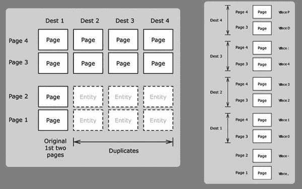

**图 5-34.** *两张示意图，帮助说明页面如何存储在 10 位置数组中。*

9. 图 5-34 包含两张图片，用于阐释我们组织数组所采用的非平凡方法。该图的左侧展示了我们的 Storyboard 页面，作为四组目标页面，其中包含最初的两个页面，但排列方式会导致重复。为了解决这个问题，我们将非重复页面排列成一个包含 10 个元素的列表，如图 5-34 右侧所示，并在第 34 步中详细描述。

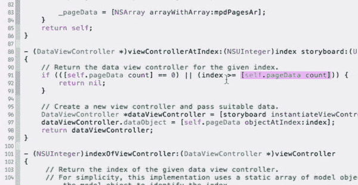

**图 5-35.** *移除指向原始数组的代码。*

10. 如前所述，你需要调整 `DataViewController` 才能使这种数组组织方法生效。找到 `viewControllerAtIndex:storyboard:` 方法。请注意，如图 5-34 所示，你不能像图 5-35 第 90 行中已经为你实现的那样使用数组计数 `[self.pageData count]`。你需要按如下方式更改：

```
… if (([self.pageData count] == 0) || (index >= [self.pageData count])) {
        return nil;…
```

我们将其更改为：


`… if (([self.pageData count] == 0) || (index >=` `MAX_PAGES` `)) {`  
`    return nil;…`

因此，选中这 4 行代码，并按图 5-35 所示将其删除。

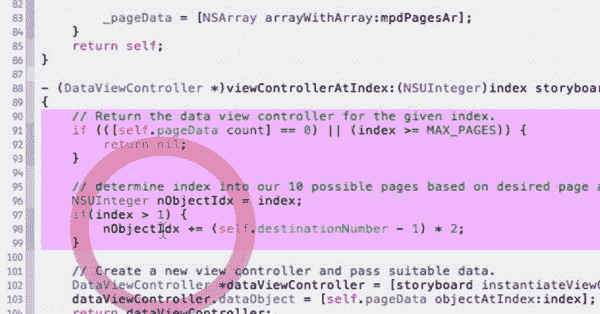

**图 5-36.** *插入与数组交互的新代码。*

11. 拖入“07 ModelController.m – 在“ViewControllerAtIndex: Storyboard:”中，用新代码替换索引检查代码”代码片段，并将其放到您在图 5-35 中删除代码的精确位置，如图 5-36 所示。请注意，`nObjectIdx += (self.destinationNumber - 1) * 2;` 这一行代码用于处理新索引，该索引会根据目的地返回一个 0 到 9 之间的值。但这里有一个问题，因为代码仍然基于旧索引来获取对象（图 5-36 的第 103 行）。您需要在下一步中更改这一点。

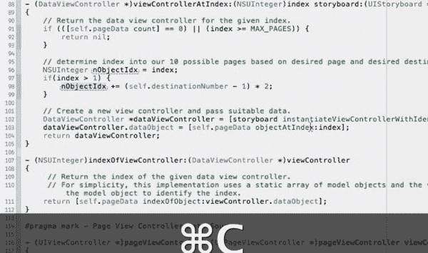

**图 5-37.** *复制新的 `nObjectIdx`。*

12. 您在这里需要做的就是用新索引 `nObjectIdx` 替换旧索引 `index`。

```
dataViewController.dataObject = [self.pageData objectAtIndex:index];
```

替换为：

```
if(index > 1) {
    nObjectIdx += (self.destinationNumber - 1) * 2;
}
```

按图 5-37 所示选中它并复制。

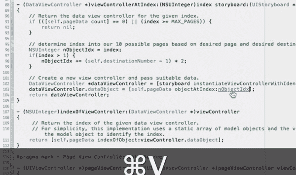

**图 5-38.** *粘贴新的 `nObjectIdx`。*

13. 如图 5-38 所示粘贴新索引。这便完成了对此方法的修改。现在，您正在为给定的页面索引获取 `DataViewController`，以便转到下一页，再下一页，最多翻到第 4 页。这将计算出该数组中的正确位置。

**注意：** 您本可以使用“08 ModelController.m – 在同一方法中，用...替换 'index'”代码片段，但大多数人会像我们一样进行复制粘贴。

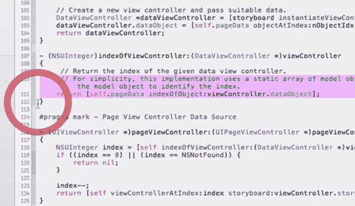

**图 5-39.** *查看反向计算。*

14. 到这一步为止，您一直在处理数组位置的正向计算。现在，您需要处理反向计算。您需要替换 `indexOfViewController` 中的三行代码，如图 5-39 所示。选中并删除它们。

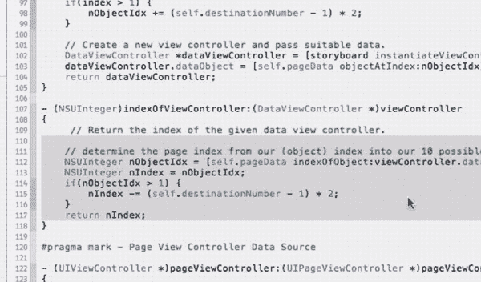

**图 5-40.** *插入新的反向计算代码。*

15. 拖入“09 ModelController.m – 在“indexOfViewController”中，替换 // 用于返回...代码片段，并将其放到您在图 5-39 中删除代码的位置。如图 5-40 所示。

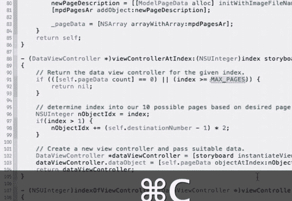

**图 5-41.** *选中 `MAX_PAGES`。*

16. 您需要确保将 `MAX_PAGES` 用作数组计数的想法是可行的，因此需要将其与 `pageViewController` 关联起来。按图 5-41 所示复制它。

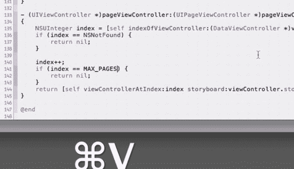

**图 5-42.** *粘贴 `MAX_PAGES`。*

17. 复制好 `MAX_PAGES` 后，向下滚动到 `if (index == [self.pageData count])` 这一行，并将其粘贴覆盖 `[self.pageData count]`，如下所示：

```
index++;
    if (index == [self.pageData count]) {
         return nil;
    }
```

将 `self.pageData.count` 替换为：

```
index++;
    if (index == MAX_PAGES) {
        return nil;
    }
```

这在图 5-42 中已演示。

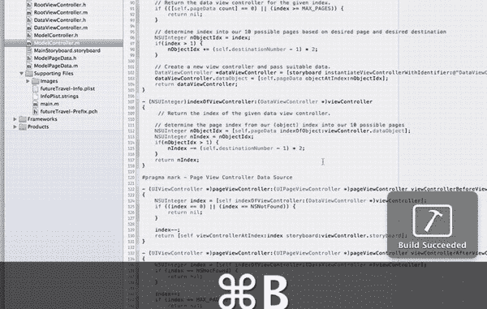

**图 5-43.** *继续之前，确保构建成功。*

18. 在继续执行 5 个步骤中的第 4 步之前，让我们确保所有内容都能按预期构建。按下 `⌘+B` 组合键，确保所有内容都能正确构建，如图 5-43 所示。

**注意：** 您本可以使用“10 ModelController.m – 在 viewControllerAfterViewController: 中，用...替换最终等号右侧的内容”代码片段，但大多数人会像我们一样复制粘贴 `MAX_PAGES`。

#### 第 4 步：代码：DataViewController

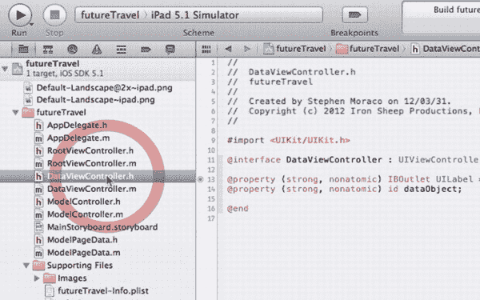

**图 5-44.** *打开 `DataViewController`。*

1. 首先，请记住，`DataViewController` 是一个负责管理您希望用户查看和交互的视图的类，它与负责呈现页面的 `RootViewController` 和 `ModelController` 协同工作。因此，按图 5-44 所示打开 `DataViewController`。

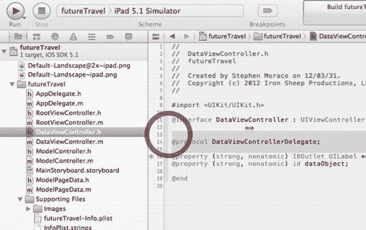

**图 5-45.** *为我们的前向声明添加协议委托。*

2. 您首先需要添加一个协议前向声明。拖入“11 DataViewController.h – 添加协议前向声明”代码片段，并将其放在 `@interface` 之前，如图 5-45 所示。您需要 `@protocol DataViewControllerDelegate`；前向声明的原因是您需要声明一个遵循此协议的委托属性（这意味着协议定义的方法将由委托类实现）。然后，当您的用户选择一个目的地时，这个 `DataViewController` 将通过此协议中的某个方法，通知正在监听的对象（即委托）所选目的地的编号。您将在后续步骤中看到这一点。

接下来，`DataViewController` 需要一个新属性。您已经有了数据标签 `*dataLabel`，但您在 Storyboard 中创建了一个新的图像视图，而目前您*没有*办法在其中显示图像。因此，您需要跳回 Storyboard 并添加它。让我们快速处理一下。

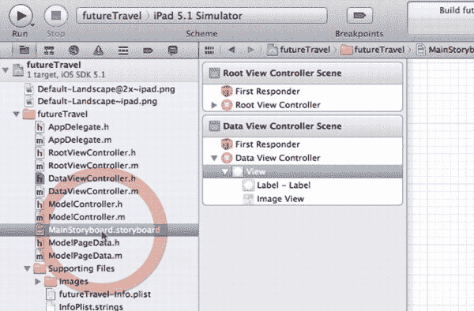

**图 5-46.** *打开 Storyboard。*

3. 按图 5-46 所示打开 Storyboard，但确保同时点击助理编辑器，这在图 5-46 中没有显示。

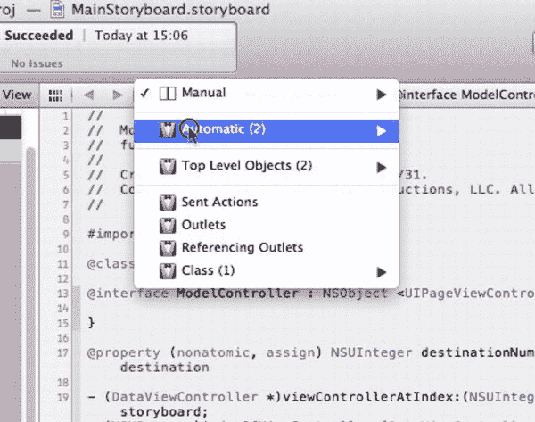

**图 5-47.** *确保助理编辑器的默认设置设为“自动”。*

4. 确保助理编辑器的默认设置设为“自动”。我们之前设置的是“手动”，您的可能也是如此。点击“前向”和“后向”两个箭头右侧的标签，该标签可能显示“自动”或“手动”，如图 5-47 所示。

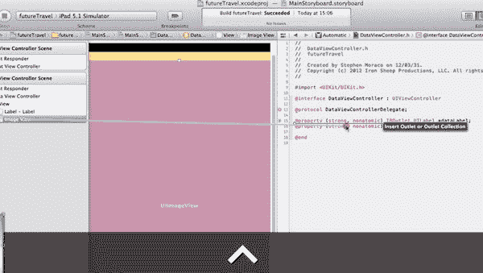

**图 5-48.** *按住 Control 键拖拽到头文件。*

5. 选择助理编辑器并将其设为“自动”后，按住 Control 键从 `UIImageView` 拖拽到您现有属性旁边的 `DataViewController.h` 文件中，如图 5-48 所示。

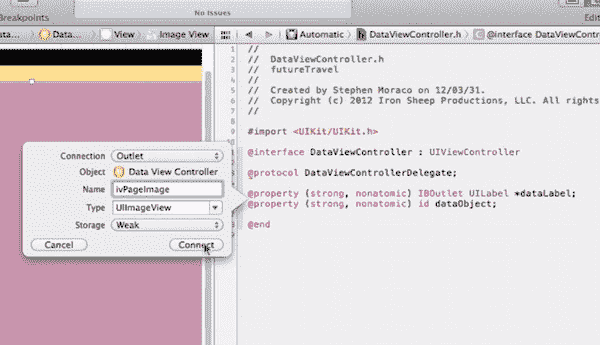

**图 5-49.** *命名 `UIImageView` 数据类型。*

6. Xcode 知道这是一个 `UIImageView` 数据类型，因此对话框弹出后您无需更改。不过，您确实需要给它起个名字。这是您的页面图像变量，所以在名字“`PageImage`”前面加上“`iv`”（我们使用数据类型名称以便记住每个变量引用的类型）。如图 5-49 所示，将其命名为 `ivPageImage`。好了，我们已经完成了最初在 Storyboard 中忘记做的事情，因此让我们回到 `DataViewController` 的头文件（您可以关闭助理编辑器，切换回标准编辑器）。

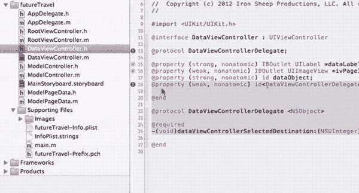

**图 5-50.** *将新的委托属性添加到头文件中。*

7. 拖入“12 DataViewController.h – 插入两个属性和协议 - 就在 @end 之前”代码片段，并将其插入到 `@end` 之前。这里我们插入了新的委托属性以及我们在第 44 步中前向声明的协议定义。如图 5-50 所示，您会看到几个警告，这是因为您尚未完成实现，这属于正常情况。让我们转到实现文件，让一切正常运行起来！

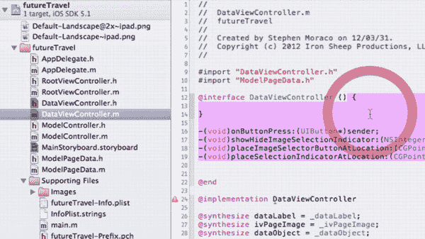


##### 图 5-51. *打开实现文件并导入页面数据对象。*

8.  请注意，因为你是通过 Storyboard 对 `ivPageImage` 进行拖放操作的，所以 Xcode 也为你添加了必要的实现代码：`@synthesis` 以及 `viewDidUnload` 中设置为 `nil` 的 `ivPageImage`。现在你需要导入 `pageData` 对象的接口。将 “13 DataViewController.m – add import and pageData object (`#import "ModelPageData.h"`)” 代码片段拖入，并插入到 `#import "DataViewController.h"` 下方。

你还需要向私有接口添加一些方法。将 “14 DataViewController.m – add methods to private interface” 代码片段拖入，并与 `@interface DataViewController` 并列放置（而非其下方），如图 图 5-51 所示。

添加到 `DataViewController.m` 文件中的私有方法声明如下：

```
-(void)onButtonPress:(UIButton*)sender;
-(void)showHideImageSelectionIndicator:(NSInteger)imageNbr;
-(void)placeImageSelectorButtonAtLocation:(CGPoint)location tag:(NSInteger)tag;
-(void)placeSelectionIndicatorAtLocation:(CGPoint)location label:(NSString*)text;
```

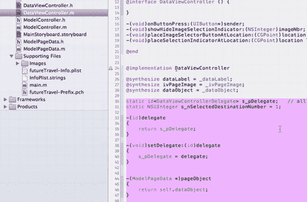

##### 图 5-52. *引入 setter 覆盖方法。*

请注意，到目前为止，你还没有合成委托属性。这是有原因的，你马上就会看到。你*不会*合成委托的 setter 和 getter。相反，你将添加一个显式的 setter 和 getter 对。这有点巧妙，因为你要通过引用此类所有实例中的单个变量来与委托和所选页面通信。为此，你使用静态类变量（`s_pDelegate` 和 `s_nSelectedDestinationNumber`）而不是实例变量。这样一来，一旦设置，每个实例的这些变量都具有相同的值。（实例变量对于类的每个实例都有单独的值。类变量对于类的所有实例都有一个共享值。）

将 “15 DataViewController.m – add static variables and their getters/setters” 代码片段拖入，并放到 `@synthesize dataObject = _dataObject;` 下方，如图 图 5-52 所示。

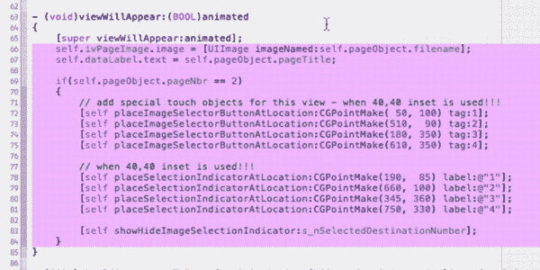

##### 图 5-53. *让 `viewWillAppear` 遵循我们自己的文本。*

9.  你可能会注意到，在 `viewWillAppear` 中，它实际上是在用数据对象 `[self.dataObject description]` 的描述来设置标签文本 `self.dataLabel.text`，而该描述结果就是月份对象。

```
- (void)viewWillAppear:(BOOL)animated
{
    [super viewWillAppear:animated];
    self.datalabel.text = [self.dataObject description];
}
```

如你所知，这是 Apple 为了方便而随机选择用于通用基于页面的应用示例的默认“应用”。然而，你正在制作一份旅行宣传册，因此需要更改它：将 “16 DataViewController.m – in viewWill Appear: replace datalabel assignment code with …” 拖入，并插入到 `[super viewWillAppear:animated];` 下方（确保删除它当前下方的代码行）。

这现在设定了你希望在视图出现之前执行的任务。具体来说，你想将图像和新的标签文本设置为当前 `pageObject` 中存储的内容：

```
self.ivPageImage.image = [UIImage imageNamed:self.pageObject.filename];
self.dataLabel.text = self.pageObject.pageTitle;
```

现在，一旦你打开手册并进入第二页，你会在图像上放置透明按钮：

```
[self placeImageSelectorButtonAtLocation:CGPointMake( 50, 100) tag:1];
[self placeImageSelectorButtonAtLocation:CGPointMake(510,  90) tag:2];
[self placeImageSelectorButtonAtLocation:CGPointMake(180, 350) tag:3];
[self placeImageSelectorButtonAtLocation:CGPointMake(610, 350) tag:4];
```

然后在图像上放置一组标记以指示用户选择（这些标记将一次显示一个）：

```
[self placeSelectionIndicatorAtLocation:CGPointMake(190,  85) label:@"1"];
[self placeSelectionIndicatorAtLocation:CGPointMake(660, 100) label:@"2"];
[self placeSelectionIndicatorAtLocation:CGPointMake(345, 360) label:@"3"];
[self placeSelectionIndicatorAtLocation:CGPointMake(750, 330) label:@"4"];
```

你在这里还可以选择显示和隐藏标记：

```
[self showHideImageSelectionIndicator:s_nSelectedDestinationNumber];
```

这显示在 图 5-53 中。

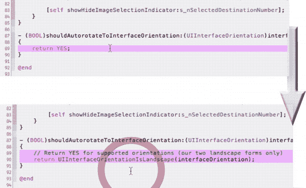

##### 图 5-54. *仅更改为横向。*

10. 默认的模板应用同时支持横向和纵向，但你的应用仅支持横向。你需要通过修改 `shouldAutorotateToInterfaceOrientation:` 使其仅对横向返回 `true` 来更改这一点。将 “17 DataViewController.m –replace rotation ok code” 拖入，并替换 `return YES;` 代码，如图 图 5-54 所示。

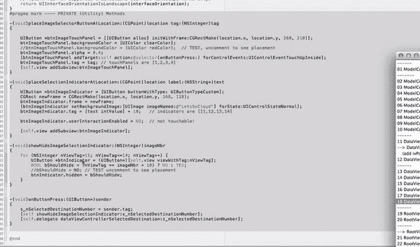

##### 图 5-55. *添加我们的私有方法。*

11. 现在你需要实现我们一直在讨论的所有私有方法。将 “18 DataViewController.m – insert utility methods - just before @end” 拖入，并插入到 `@end` 之前。

在这里，你实现了创建和定位隐藏按钮与标记的私有方法（参见 图 5-54）：

`placeImageSelectorButtonAtLocation` 和 `placeSelectionIndicatorAtLocation`

查看 `placeSelectionIndicatorAtLocation:` 方法的实现，请注意它只是创建一个 `UIButton` 实例，设置其位置和背景图像，并将标记按钮添加到视图中：

```
[btnImageIndicator setBackgroundImage:[UIImage imageNamed:@"LetsGoCloud"]
                             forState:UIControlStateNormal];
```

你还为每个按钮定义了一个标签，以便稍后仅显示用户当前选中的那个，并使其不可触摸：

```
btnImageIndicator.tag = [text intValue] + 10;
btnImageIndicator.userInteractionEnabled = NO;  // 不可触摸！
```

我们还编写了按钮代码，以便如果用户点击四个隐藏按钮中的任何一个，会调用一个操作方法：

```
-(void)onButtonPress:(UIButton*)sender
{
    s_nSelectedDestinationNumber = sender.tag;
    [self showHideImageSelectionIndicator:s_nSelectedDestinationNumber];
    [self.delegate dataViewControllerSelectedDestination:s_nSelectedDestinationNumber];
}
```

当它被调用时，会调用委托方法 `[self.delegate dataViewControllerSelectedDestination:s_nSelectedDestinationNumber];`，该方法进而告诉你的 `RootViewController` 要加载哪个页面集。

这显示在 图 5-55 中。

12. 现在你可以构建并查看一切是否正常工作。如果你没有遗漏任何内容，应该会看到“构建成功”的消息。


#### 步骤 5：代码：`RootViewController`

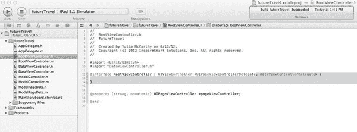

**图 5-56.** *让我们编写`RootViewController`的代码，以处理它将接收的通信。*

1.  打开 `RootViewController.h` 文件。拖入“19 `RootViewController.h` – 添加包含”并将其插入到 `#import <UIKit/UIKit.h>` 之后，如图 5-56 所示。这样做是因为你需要使`DataViewControllerDelegate`协议对`RootViewController`可见，因为你将使其遵循这个新协议。但目前它还不存在，所以让我们添加它。删除`@interface`行末尾的右尖括号，拖入“20 `RootViewController.h` – 添加协议”，并将其与`UIPageViewControllerDelegate`并列插入，如下所示：

```
#import <UIKit/UIKit.h>
#import "DataViewController.h"

@interface RootViewController : UIViewController <UIPageViewControllerDelegate,
DataViewControllerDelegate> {
}

@property (strong, nonatomic) UIPageViewController *pageViewController;
@end
```

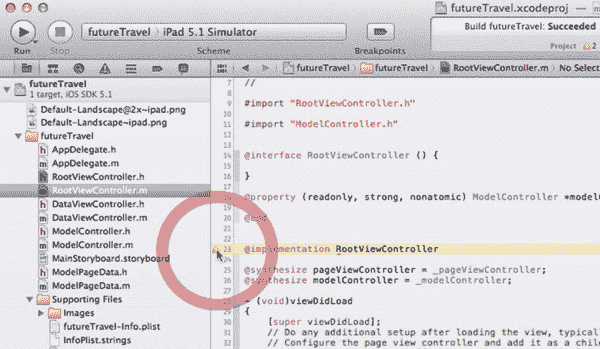

**图 5-57.** *完成实现。*

2.  头文件部分已经完成，现在来完成实现。导航到 `RootViewController.m`。首先要注意的是，你不再需要 `#import "DataViewController.h"`，因为它已经在头文件中了，所以请删除它。注意图 5-57 中第 23 行的警告。这是因为你的协议方法尚未实现。所以首先设置委托。找到 `viewDidLoad` 方法的实现，拖入“21 `RootViewController.m` – 设置委托（`startingViewController.delegate = self;`）”，并将其插入到 `DataViewController *startingViewController` 实例化之后、`NSArray *viewControllers` 之前，如下所示：

```
DataViewController *startingViewController = [self.modelController
viewControllerAtIndex:0 storyboard:self.storyboard];
startingViewController.delegate = self;  // 告诉对象我们想接收其消息
    NSArray *viewControllers = [NSArray arrayWithObject:startingViewController];
```

你必须这样做，因为这个委托是由你（而非 Apple）支持的，所以你需要插入代码来实际设置委托。现在 `RootViewController` 将接收来自 `DataViewController` 的消息。

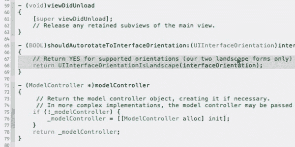

**图 5-58.** *仅支持横屏。*

3.  再次需要声明你仅支持横屏。转到 `shouldAutorotateToInterfaceOrientation:`，删除 `return YES;` 这行代码，拖入“22 `RootViewController.m` – 替换旋转确认代码”，并将其插入，如图 5-58 所示。

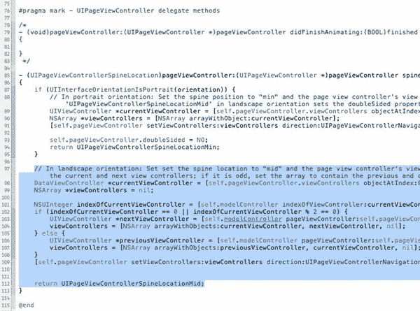

**图 5-59.** *调整 `PageViewController`。*

4.  现在你需要调整 `PageViewController`，考虑到在 iPad 上，如果是竖屏模式，它将显示单页；如果是横屏模式，默认会显示双页（左右两页）。但我们不会这样做。我们将使用仅竖屏选项（尽管应用在横屏模式下显示）。所以找到 `pageViewController:spineLocationForInterfaceOrientation:` 方法，选中其代码中与横屏选项相关的底部部分（以 `// In landscape orientation…` 注释开头），并将其删除，如图 5-59 所示。最后，移除外层的 `if (UIInterfaceOrientationIsPortrait(orientation)) {}` 语句，只保留 `if` 语句内部的代码在实现中。

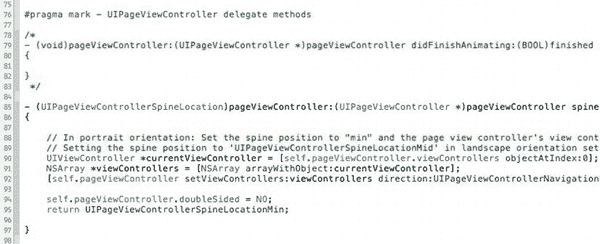

**图 5-60.** `pageViewController` 的最终视图。

5.  图 5-60 是我们上一步删除操作后的最终视图。由于它无法在图中完整显示，我们将其以小字体放在这里供您参考：

```
- (void)pageViewController:(UIPageViewController *)pageViewController
didFinishAnimating:(BOOL)finished previousViewControllers:(NSArray
*)previousViewControllers transitionCompleted:(BOOL)completed
{}
 */
- (UIPageViewControllerSpineLocation)pageViewController:(UIPageViewController
*)pageViewController
spineLocationForInterfaceOrientation:(UIInterfaceOrientation)orientation
{
  // 竖屏方向：将脊柱位置设置为"min"，页面视图控制器的视图控制器数组仅包含一个视图控制器。
在横屏方向将脊柱位置设置为'UIPageViewControllerSpineLocationMid'会将 doubleSided 属性设置为 YES，因此在这里将其设置为 NO。
  UIViewController *currentViewController =
[self.pageViewController.viewControllers objectAtIndex:0];
  NSArray *viewControllers = [NSArray arrayWithObject:currentViewController];
  [self.pageViewController setViewControllers:viewControllers
direction:UIPageViewControllerNavigationDirectionForward animated:YES
completion:NULL];
  self.pageViewController.doubleSided = NO;
  return UIPageViewControllerSpineLocationMin;
}
@end
```

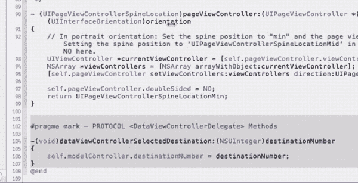

**图 5-61.** *插入委托响应方法并运行。*

6.  通过拖入“23 `RootViewController.m` – 添加 DVC 委托方法”来插入委托响应方法，并将其插入到 `@end` 之前，如图 5-61 所示。我们知道你已经等这一刻很久了。继续运行它吧！


**图 5-62.** *初始启动画面*

7.  四页传单的初始启动画面如图 5-62 所示，红色圆圈标明了从哪里滑动（或点击）来翻页。


**图 5-63.** *页面导航*

8.  用户进入传单后，会看到我们有四个目的地。当用户点击它们时，会发现它们是可点击的。“我们去吧”指示器会出现在用户点击的目的地上，并立即在上一次点击的目的地上隐藏。你需要确保用户选择的任何图片，在点击“下一页”时都能正确地显示出预期的下一页，如图 5-63 右侧图片所示。果然，前往 200 万年前的洛杉矶之旅出现了。同样，图 5-64 显示了 130 万年前的开普敦。哇！

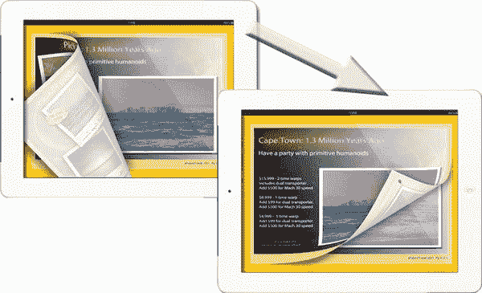

**图 5-64.** *更多视图*

