# 第 6 章


## 精通表格视图与故事板：Core Data 设置

本书中你将要完成的最后两个应用会更为复杂和专业。因此，我们将每个应用都分为三章来讲解。主从应用：`bookManager` 应用在第 6 章、第 7 章和第 8 章中介绍。最后一个应用，单一视图 #3：`wanderBoard`，则在第 9 章、第 10 章和第 11 章中介绍。

在本章中，你将开始开发一个相当复杂的图书管理应用，它会演示故事板如何简化大量使用表格视图的应用构建过程。在深入了解这个项目之前，先简单了解一些主从应用背后的 iOS 历史，将有助于你决定将来是否使用这个模板。还记得在第 4 章中，你如何使用工具应用模板来创建 iPad 的分割视图吗（参见该章的图 4-57）？你通过编写 `MainViewController` 创建了一个主视图，然后通过编写 `FlipSideViewController` 创建了一个次要视图。

嗯，这在过去并不总是那么容易。当我们在 iOS SDK 3.2 中首次开始为 iPad 编写代码时，创建分割视图需要大量的工作。现在，在 iOS 5 中，苹果公司将基于分割视图的应用模板集成到了基于导航的应用模板中，并将其称为主从应用模板。简单来说，当你使用主从应用模板，并且用户在 iPhone 上运行你的应用时，它的表现就像是用基于导航的应用模板编程的一样。当用户在 iPad 上运行你的应用时，它的表现就像是用基于分割视图的应用模板编程的一样。

在互联网上，大多数主从应用“教程”展示的是编写分割视图控制器的说明，*并未*使用故事板，而是仍然沿用老方法——通过回到 `xibs` 来实现。这种方法忽略了苹果创建主从应用模板的初衷。当你确定要处理列表、数据库和表格时，尤其是当你希望允许用户以层次结构的方式深入浏览数据时，请记得使用主从应用模板。

在这个应用中，你将学习如何使用主从应用模板为列表和表格构建故事板。你还将学习如何将这些数据动态连接到 SQLite 数据库。我们包含了数据库组件，因为当你能说出如何将数据连接到数据库时，这无疑会是一个重要的加分项。对于雇主来说，很难找到有任何 SQL 经验的 Xcode 开发者。似乎这还不够，我们还将向你介绍 `MagicalRecord`，这是一个在 GitHub 上可用的开源库，并被许多开发者使用。`MagicalRecord` 是由 MagicalPanda Software 创建的一个非常高效且极其易用的框架，专门用于与 Core Data 交互。

我们会在本章后面解释所有这些。现在，请为你即将踏上学习如何封装以下内容之旅而感到高兴：

* SQLite
* GitHub（一个使用 git 版本控制系统的软件开发项目仓库）
* 将 Core Data 集成到一个主从应用模板中！

太棒了！

### bookManager：一个主从应用

`bookManager` 应用用于追踪一组精选的 Apress 图书，包括它们的类别、标题和作者。它还提供了在 SQLite 数据库中添加、编辑和删除图书的功能。

层次树结构的顶部是“我的图书馆”节点，它有两个类别：“图书”和“作者”，如图 6-0A 左侧图片所示。点击“图书”会向下钻取到“类别”节点，用户可以在其中选择 Apress 图书的类别、进行编辑，或返回到“我的图书馆”，如图 6-0A 中间图片所示。点击左侧图片中的“作者”会进入“作者”节点，用户可以在其中选择一位 Apress 作者、编辑作者，或返回到“我的图书馆”，如图 6-0A 右侧图片所示。

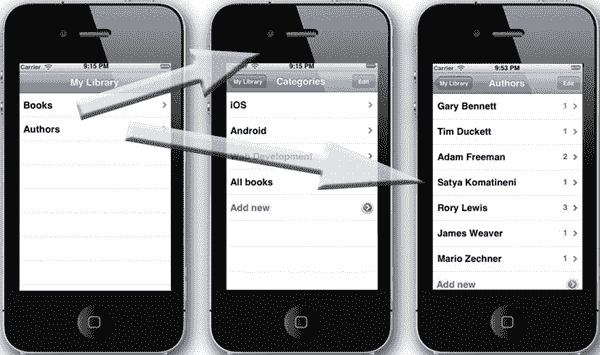

**图 6-0A.** *`bookManager` 应用的根级“我的图书馆”。*

`bookManager` 应用有三个视图可以查看 Apress 图书。首先，如图 6-0B 所示，当用户从作者选择中点击“图书”时；其次，当用户从类别选择中点击“图书”时；第三，当用户想要编辑、删除或添加图书时。`bookManager` 应用还提供了两个不同的对话框用于添加新类别或新作者，如图 6-0C 所示。

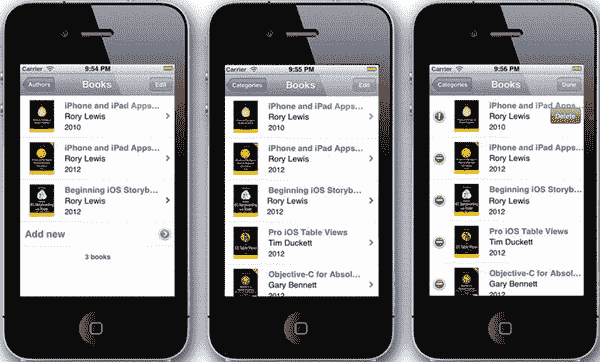

**图 6-0B.** *来自作者的图书、来自类别的图书以及从类别中进行编辑*


**图 6-0C.** *添加类别和添加作者*

该项目分为三个章节。在本章中，你将设置文件、图片、Core Data 和数据模型。在第 7 章中，你将仅使用故事板来设计整个应用。在第 8 章中，你将插入故事板元素背后的代码，并调整一些故事板的必要设置。

### 准备工作

本章是最具挑战性的一章。我们提供了大量的资源来帮助你在遇到困难时继续前进。再次强调，与所有章节一样，我们在 [`http://bit.ly/sMRvAP`](http://bit.ly/sMRvAP) 以及本书在 `apress.com` 的页面上提供了所有必要的文件和代码。你也可以在 [`http://www.rorylewis.com/xCode/StoryBoarding%20in%20Xcode/Chapter06_bookManager.zip`](http://www.rorylewis.com/xCode/StoryBoarding%20in%20Xcode/Chapter06_bookManager.zip) 下载应用的最终版本，但仅仅下载最终版本并不能真正帮助你学习如何使用 GitHub、`MagicalRecord` 或 SQLite，因此我们建议你现在就下载 `assets` 文件夹，并注意以下事项：当你从 [`http://www.rorylewis.com/xCode/StoryBoarding%20in%20Xcode/Chapter06_bookManager%20Assets.zip`](http://www.rorylewis.com/xCode/StoryBoarding%20in%20Xcode/Chapter06_bookManager%20Assets.zip) 下载 `assets` 压缩包时，你会看到两个文件 `bookdata.plist` 和 `chapter6.demoMonkey`，以及两个文件夹 `images` 和 `MagicalRecord`。

你将使用 plist 文件进行数据库创建，使用 `DemoMonkey` 文件获取代码，以及使用 `images` 文件夹获取图片。如果你无法理解 GitHub 和 `MagicalRecord`，不用担心。我们还提供了完整的 `MagicalRecord` 文件夹，这就是你在完成 GitHub 练习后最终得到的内容，因此你可以将其直接拖入你的项目并继续操作。我们建议使用 `MagicalRecord` 并探索 GitHub。如果你能声称自己有 GitHub 和 Core Data 的经验，这无疑会让你跻身精英开发者之列。

清理你的桌面，下载 [`http://www.rorylewis.com/xCode/StoryBoarding%20in%20Xcode/Chapter06_bookManager%20Assets.zip`](http://www.rorylewis.com/xCode/StoryBoarding%20in%20Xcode/Chapter06_bookManager%20Assets.zip)，解压文件夹，然后让我们开始吧。


#### 步骤 1/3：设置文件、图片、Core Data 和数据模型

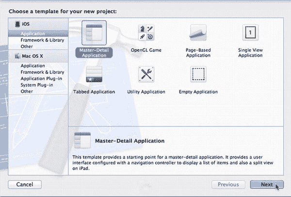
**图 6-1.** *创建一个 Master-Detail 应用程序。*

1. 打开 Xcode，按下 ++`N`，然后选择 Master-Detail Application，如图 6-1 所示。

   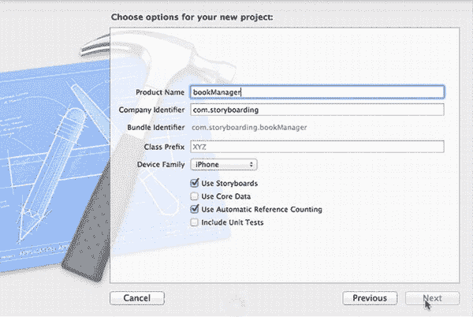
   **图 6-2.** *为 bookManager 应用选择选项。*

2. 在 Product Name 中输入 `bookManager`，在 Company Identifier 中输入 `com.storyboarding`。我们不使用类前缀。确保选择 iPhone 并勾选 Use Storyboards 和 Use Automatic Reference Counting，如图 6-2 所示。保持 Use Core Data 和 Include Unit Tests 为未选中状态。将项目保存到你的桌面。

   **注意：** 我们在此项目模板中仅为了不让 Xcode 为我们生成 CoreData 设置代码而取消了 Use Core Data 选项。由于我们将在此应用中使用 MagicalRecord，因此上述代码已集成到其中。

   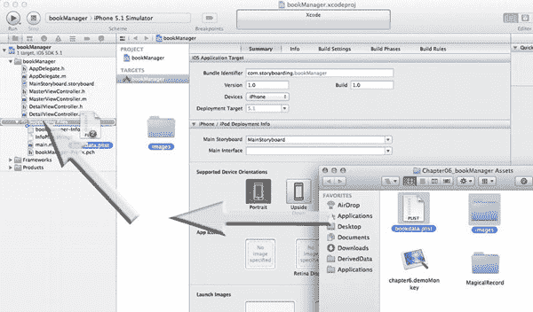
   **图 6-3.** *打开你的资源文件夹。*

3. 现在，你将把资源拖入到项目中。如果你还没有从 [`http://www.rorylewis.com/xCode/StoryBoarding%20in%20Xcode/Chapter06_bookManager%20Assets.zip`](http://www.rorylewis.com/xCode/StoryBoarding%20in%20Xcode/Chapter06_bookManager%20Assets.zip) 下载 `assets` 文件夹，请立即下载。将其保存到桌面后，解压缩。选择 `images` 文件夹和 `bookdata.plist`，如图 6-3 所示。将这两项拖到 `bookManager` 文件夹内的 `Supporting Files` 文件夹中，如图 6-3 中的箭头所示。你的 `Supporting Files` 文件夹应该看起来类似于图 6-3 中显示的我们的 `Supporting Files` 文件夹。

   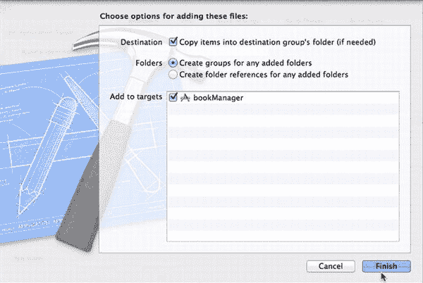
   **图 6-4.** *将项目复制到目标组的文件夹中。*

4. 你需要确保文件和 plist 的实际内容内置于应用中，因此请确保选择“Copy items into destination group’s folder (if needed)”（将项目复制到目标组的文件夹（如果需要））和“Create groups for any added folders”（为任何添加的文件夹创建组），并且你的目标将是此应用 `bookManager`。这在图 6-4 中进行了说明。

   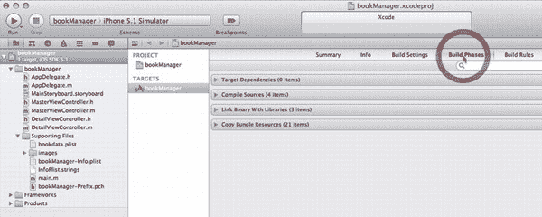
   **图 6-5.** *将 CoreData 框架添加到项目中。*

5. 你将在此应用中大量使用数据库——这是 Core Data 框架的一部分。从头开始编写数据库将耗费大量资源、时间和精力。Core Data 提供了用于数据管理的预构建类和工具，并且它以这样一种方式完成：你只需在 Core Data 提供的基本功能之上构建自定义代码即可。要进行设置，请在项目导航器中选择主项目文件，在 Targets 下选择 `bookManager`，然后点击 Build Phases 选项卡，如图 6-5 所示。

   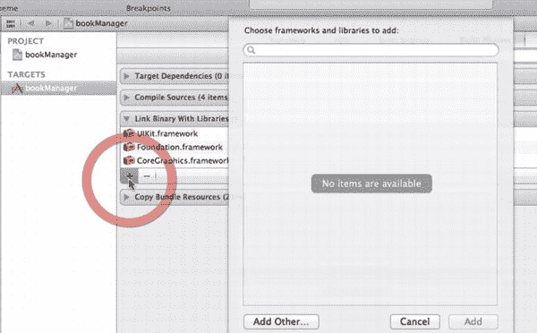
   **图 6-6.** *点击添加按钮。*

6. 打开 Build Phases 选项卡后，转到 Link Binary with Libraries 部分并将其展开。要将 Core Data 框架添加到此列表中，请点击添加 (+) 按钮，如图 6-6 所示。

   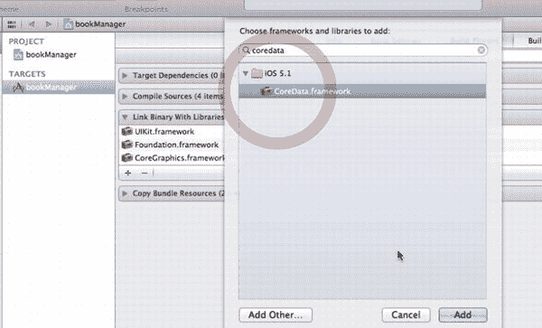
   **图 6-7.** *搜索并选择 CoreData 框架。*

7. 点击 + 后，在搜索字段中输入 *coredata*。这将产生 `CoreData.framework` 图标。选择它，如图 6-7 所示，然后点击 Add。

   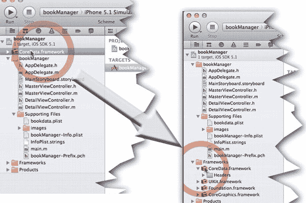
   **图 6-8.** *CoreData.framework 现在位于你的 bookManager 目标内部。*

8. 添加 `CoreData.framework` 后，它将出现在你的 `bookManager` 目标内部，如图 6-8 左侧图像所示。将其移动到 `Frameworks` 文件夹中，如图 6-8 右侧图像所示。

   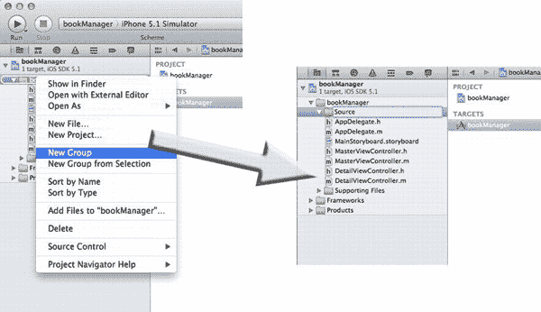
   **图 6-9.** *在项目导航器中创建一个名为 Source 的新组。*

9. 在项目导航器中，继续在 `bookManager` 组内创建一个名为 `Source` 的新子组，如图 6-9 所示。稍后你将用到它。

**MAGICALRECORD**

Core Data 并非本书的重点，因此我们不会深入探讨其所有细节。不过，为了简化工作，我们将引入一个开源的辅助库，它被许多备受尊敬的 Xcode 开发者广泛使用——包括我们那些现在正在苹果工作的学生。这个开源框架使 Core Data 的使用变得异常简单。它叫做 MagicalRecord，可以在 GitHub 上的 [`https://github.com/magicalpanda/MagicalRecord`](https://github.com/magicalpanda/MagicalRecord) 获取。要直接下载 zip 文件，你可以使用 [`https://github.com/magicalpanda/MagicalRecord/zipball/master`](https://github.com/magicalpanda/MagicalRecord/zipball/master)，或者你也可以从之前为本章节下载的 `assets` 文件夹中获取。不过，请听从我们的建议，去探索一下 GitHub。如果你还没有 GitHub 账号，可以去申请一个。它是免费的！

**注意：** 这里有一份资源可以帮助你熟悉 MagicalRecord 的设置：[`http://yannickloriot.com/2012/03/magicalrecord-how-to-make-programming-with-core-data-pleasant/`](http://yannickloriot.com/2012/03/magicalrecord-how-to-make-programming-with-core-data-pleasant/)。

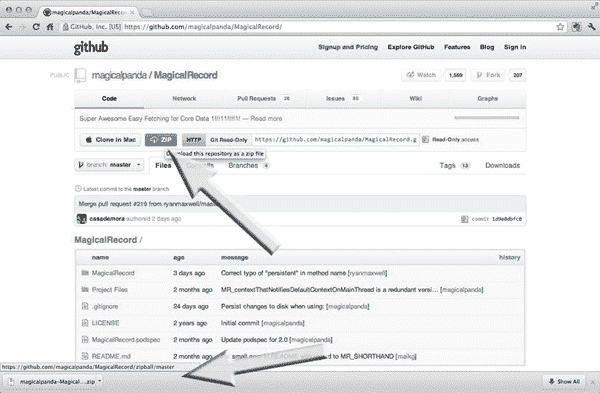
**图 6-10.** *下载 MagicalRecord。*

10. 进入 GitHub 后，你可以搜索 *MagicalRecord* 或 *MagicalPanda*，你应该会到达 [`https://github.com/magicalpanda/MagicalRecord`](https://github.com/magicalpanda/MagicalRecord)。点击 Zip 按钮，下载将开始，如图 6-10 中的箭头所示。

    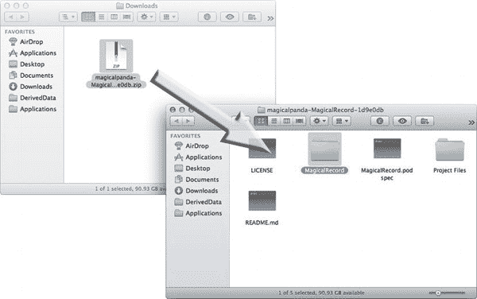
    **图 6-11.** *解压缩并导航到 MagicalRecord 文件夹。*

11. 成功将 `magicalpanda-MagicalRecord` zip 文件下载到桌面后，将其解压缩并导航到 `MagicalRecord` 文件夹。选择该文件夹，如图 6-11 所示。

    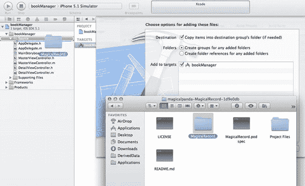
    **图 6-12.** *将 MagicalRecord 文件夹拖入你的项目。*

12. 将 `MagicalRecord` 文件夹拖入你在第 9 步创建的 `Source` 文件夹内的项目中，如图 6-12 所示，并选择与你在先前图 6-2 中执行过的相同的保存协议。

    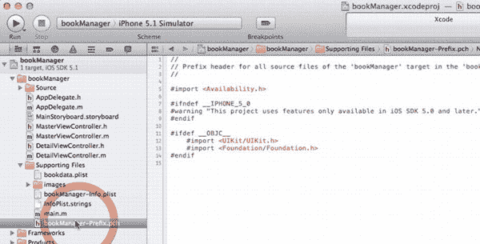
    **图 6-13.** *打开项目的 .pch 文件。*

13. 现在你已经将 MagicalRecord 源代码添加到项目中，你需要让其对项目可见，以便你可以享受它所提供的对 Core Data 的各种扩展。本质上，MagicalRecord 是扩展主要 Core Data 功能并简化其使用的类别集合。所有使其正常运行所需的重要头文件都列在 `CoreData+MagicalRecord.h` 文件中。你可以通过简单地将此头文件放入 `bookManager-Prefix.pch` 文件中，使 MagicalRecord 对整个项目可见。导航到 `Supporting Files` 文件夹，点击 `.pch`（预编译头）文件将其打开，如图 6-13 所示。

    **注意：** Xcode 有一个名为 ProcessPCH 的高级命令，它根据 `.pch` 文件中的信息，告知编译器需要预编译并包含到项目中的头文件。这些预编译头文件保存在 `/Library/Caches` 的子目录中，然后在编译期间自动包含在每个文件中。包含在预编译头中的文件通常是不怎么变化的文件，这可以加快编译过程。这让你无需在每一个使用某个文件的文件中添加 `import` 语句，即可包含该文件，从而使其在整个项目中全局“可见”。

    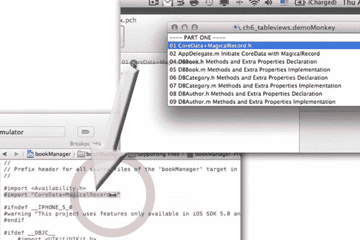
    **图 6-14.** *打开 DemoMonkey 文件，并将第一步拖入项目的 .pch 文件中。*

14. 打开本章提供的 `.demoMonkey` 文件，并将其放在桌面上一个方便的位置。首先，将 DemoMonkey 中的“01 CoreData + MagicalRecord.h”代码片段拖入 `bookManager - Prefix.pch` 文件中，紧跟在 `#import <Availability.h>` 代码行下方，如图 6-14 所示，如下所示：

    ```
    #import <Availability.h>
    #import "CoreData+MagicalRecord.h
    ```

    现在，这个头文件使 MagicalRecord 框架在整个项目中可用，而无需导入任何其他文件。

15. 向项目添加新库/框架时，最佳实践是立即运行或至少构建它以检查你的工作，因为这是一个关键时刻，在继续编码之前需要立即纠正错误。点击 Run 并确保你的项目编译成功。有时开源社区的事情变化很快，这当然超出了我们的控制范围。在本书中，我们使用的是 MagicalRecord-2.0.3-12-g1d9e0db。如果你仔细遵循了所有步骤，但此时项目无法编译，请检查你的 MagicalRecord 版本——如果与我们的版本不匹配，请将你的 MagicalRecord 源文件夹替换为本章 Assets 包中提供的文件夹，然后重试。

    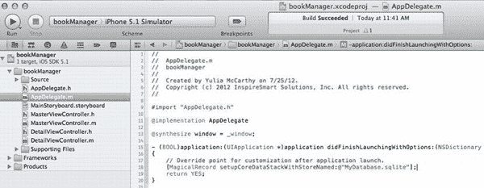
    **图 6-15.** *初始化 SQLite 数据库。*

16. 现在，你将开始一项让许多计算机科学学生感到沮丧，并且是许多 Xcode 开发者的巨大障碍的任务：将数据库连接到 Xcode。在这里，你将使用 MagicalRecord API 设置一个 SQLite 数据库，并且你会爱上它！打开 `AppDelegate.m` 文件，并将 DemoMonkey 中的“02 AppDelegate.m initiate CoreData with MagicalRecord 1”代码片段拖到 `return YES` 之前，如图 6-15 所示，如下所示：

    ```
    #import "AppDelegate.h"
    @implementation AppDelegate
    @synthesize window = _window;
    - (BOOL)application:(UIApplication *)application didFinishLaunching
    ...*)launchOptions
    {
      // Override point for customization after application launch.
      [MagicalRecord setupCoreDataStackWithStoreNamed:@"MyDatabase.sqlite"];
      return YES; ...
    ```

    **注意：** 使用 MagicalRecord，你可以用一行代码初始化整个 SQLite 数据库！这并不困难——它只需要你专注于你正在做什么以及为什么这样做。那么，让我们开始吧！

    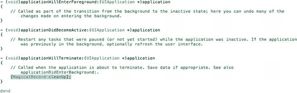
    **图 6-16.** *清理持久化存储。*

17. 你还需要在 `applicationWillTerminate` 方法中清理持久化存储。通过将 DemoMonkey 中的“03 AppDelegate.m initiate CoreData with Magic Record 2”代码片段拖入并放置在如图 6-16 所示的位置来执行此操作。

    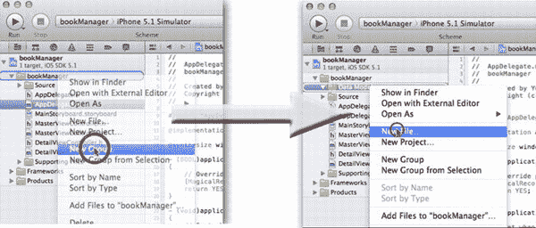
    **图 6-17.** *创建数据模型。*

18. 要创建你的数据模型，请在一个名为 `Data Model` 的新组内创建数据文件。首先创建组，右键点击 `bookManager` 文件夹并选择 New Group，如图 6-17 左侧所示。创建新组后，会出现一个名为 `New Group` 的文件夹。将其重命名为 `Data Model`。右键点击 `Data Model` 文件夹并选择 New File，如图 6-17 右侧所示。

    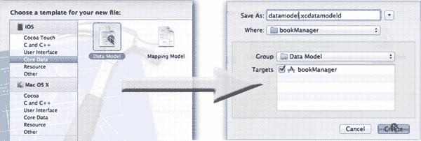
    **图 6-18.** *创建一个 Core Data 数据模型。*

19. 会弹出一个对话框，要求你为新文件选择一个模板。默认情况下，左侧窗格中 iOS 下的 Cocoa Touch 选项是被选中的。忽略此选项，选择 Core Data（数据模型模板，如图 6-18 左侧所示）。一个新的对话框询问你是否想要保存数据模型。将默认的 `Model.xcdatamodeld` 替换为 `datamodel.xcdatamodeld`，如图 6-18 右侧所示。

    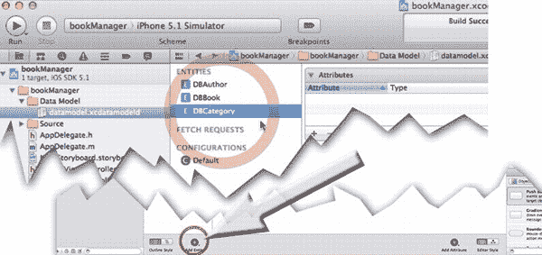
    **图 6-19.** *创建你的 SQLite 实体。*

20. 你的数据库将保存一组 Apress 图书，你将通过三个*表*（也称为*实体*）来定义这些图书：

    * 作者
    * 图书
    * 图书的类别（例如 iOS、Android、Web 等）

    你需要告知 SQLite 数据库相关信息。点击数据模型画布底部的 `+` 图标，并将第一个实体命名为 `DBAuthor`。再重复此操作两次，将两个新实体分别命名为 `DBBook` 和 `DBCategory`，如图 6-19 所示。

    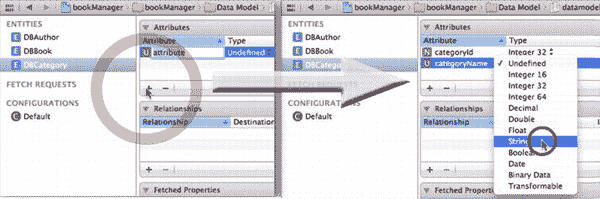
    **图 6-20.** *为 Category 记录创建属性。*

21. 创建完三个实体后，你需要为每个实体创建属性。我们将详细讲解 `Category` 实体的创建过程，然后剩下的两个实体将由你自己在较少帮助下完成。选中 `DBCategory` 实体，点击 `+` 按钮，如图 6-20 左侧所示。首次添加属性时，默认名称将为 `attribute`。你需要一种方法来为每个类别（例如 iOS、Android 或 Web）提供名称和 ID。因此，将第一个属性命名为 `categoryId`。再次点击 `+` 按钮，并将下一个属性命名为 `categoryName`。点击 `categoryId` 行上 `Type` 列右侧的选择按钮，选择 Integer 32。然后点击 `categoryName` 行上的选择按钮，选择 `String`，如图 6-20 右侧所示。

    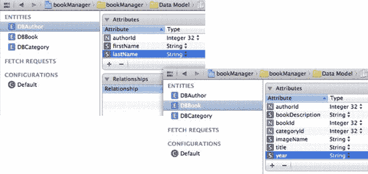
    **图 6-21.** *完成 DBAuthor 和 DBBook 的属性。*

22. 现在，你必须为作者和图书实体重复此过程。对于你的 `Author` 实体，你只需要 `authorId`、`firstName` 和 `lastName` 这组属性。将 `authorId` 设为 Integer 32，将名字和姓氏设为 `String`。对于 `Book` 实体，你需要七个属性（当然，你可以有更多，但对于本练习来说七个就足够了）。你将引入来自 `DBAuthor` 和 `DBCategory` 的 `authorId` 和 `categoryId` 作为外键，以便为每本图书找到对应的作者和类别。你还需要一个唯一的 `bookId`。并且你需要另外四个描述每本图书的属性：简短描述、与每本图书关联的图像名称（稍后你将链接到每本图书的封面图像）、图书标题以及图书的出版年份。就此而言，将 `authorId`、`bookId` 和 `categoryId` 都设为 Integer 32 类型。将 `bookDescription`、`imageName`、`title` 和 `year` 都设为 `String` 类型，如图 6-21 所示。

    **注意：** *外键* 指向数据库中的另一个实体，是将不同实体链接在一起的一种方式。例如，你使用外键将一本图书与其作者及其类别相关联。

    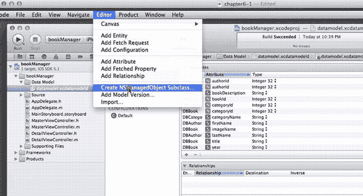
    **图 6-22.** *为所有实体生成类。*

23. 既然你已经定义了必要的表和字段，你需要为所有实体生成类，以便能够从代码中对它们进行操作。同时选中所有三个实体 `DBAuthor`、`DBBook` 和 `DBCategory`：先选中第一个，按住 Shift 键，再点击最后一个。点击 Editor 并选择 Create NSManagedObject Subclass，如图 6-22 所示。将出现一个选项对话框——按 Enter 键或点击 Create 按钮，保持默认设置。

    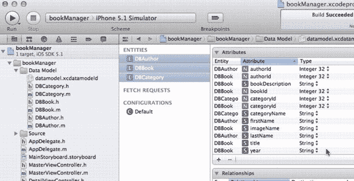
    **图 6-23.** *成功！*

24. 当你看到所有实体的头文件和实现文件整齐地排列在你的 `Data Model` 文件夹中时，你就知道你已经成功了。现在这可能看起来没什么大不了的，但当你的数据库中有几百个实体时，让 Xcode 自动创建这些文件可以说是一种奇迹。你现在可以向这些实体中的每一个添加自定义方法。在继续之前，请确保你的 `Data Model` 文件夹、实体和属性与我们 图 6-23 中的完全一致。

    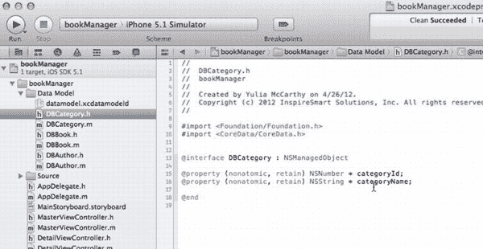
    **图 6-24.** *在继续之前……*

25. 同样在继续之前，你应该检查一些事项，以便了解到目前为止你创建了什么。点击 `DBCategory.h` 文件。正如你在图 6-24 中所见，Xcode 已经根据你在前面步骤中在数据模型中指定的数据字段为你生成了所有属性。在接下来的几个步骤中，你将添加方法来操作这些属性，以便能够检索数据。

    **注意：** 在接下来的六个步骤中，你将添加的所有方法基本上都做同样的事情：它们要么使用字典中提供的值创建或删除新实体，要么允许你基于外键关系检索其他数据，例如图书需要作者姓名，作者需要类别名称。

    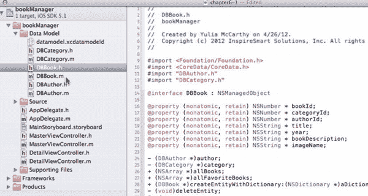
    **图 6-25.** *设置 DBBook.h 文件。*

26. 在项目导航器中选择 `DBBook.h`。将 DemoMonkey 中的“04 DBBook.h Methods and Extra Properties Declaration”代码片段拖入，并放置在 `@end` 之前。然后为 `DBAuthor.h` 和 `DBCategory.h` 输入两个 `#import` 语句，如图 6-25 所示，如下所示：

    ```
    #import <Foundation/Foundation.h>
    #import <CoreData/CoreData.h>
    #import "DBAuthor.h"
    #import "DBCategory.h"

    @interface DBBook : NSManagedObject
    ...
    @property (nonatomic, retain) NSString * imageName;
    - (DBAuthor *)author;
    - (DBCategory *)category;
    ...
    - (void)deleteEntity;
    @end
    ```

    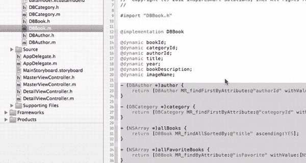
    **图 6-26.** *设置 DBBook.m 文件。*

27. 导航到 `DBBook.m`。将 DemoMonkey 中的“05 DBBook.m Methods and Extra Properties Implementation”代码片段拖入，并放置在 `@end` 之前，如图 6-26 所示。

    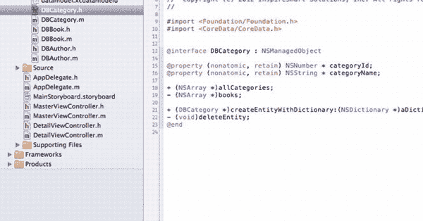
    **图 6-27.** *设置 DBCategory.h 文件。*

28. 打开 `DBCategory.h`，将 DemoMonkey 中的“06 DBCategory.h Methods and Extra Properties Declaration”代码片段拖入。将其放置在最后一个 `@property` 和 `@end` 之间，如图 6-27 所示。

    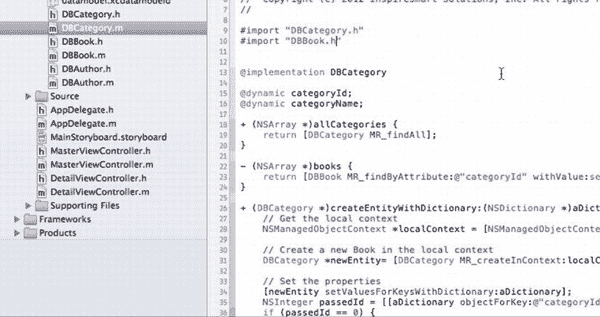
    **图 6-28.** *设置 DBCategory.m 文件。*

29. 现在转到 `DBCategory.m`，将 DemoMonkey 中的“07 DBCategory.m Methods and Extra Properties Implementation”代码片段拖入，并放置在最后一个 `@dynamic` 和 `@end` 之间。同时，在 `#import "DBCategory.h"` 之后立即添加 `#import "DBBook.h"`，如图 6-28 所示，如下所示：

    ```
    #import "DBCategory.h"
    #import "DBBook.h"
    ```

    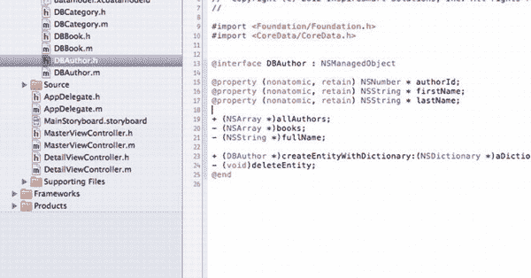
    **图 6-29.** *设置 DBAuthor.h 文件。*

30. 打开 `DBAuthor.h`，将 DemoMonkey 中的“08 DBAuthor.h Methods and Extra Properties Declaration”代码片段拖入。将其放置在最后一个 `@property` 和 `@end` 之间，如图 6-29 所示。

    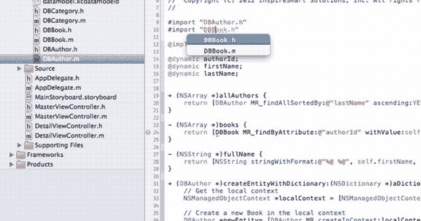
    **图 6-30.** *设置 DBAuthor.m 文件。*

31. 导航到 `DBAuthor.m`。将 DemoMonkey 中的“09 DBAuthor.m Methods and Extra Properties Implementation”代码片段拖入，并放置在最后一个 `@dynamic` 和 `@end` 之间。同时，在 `#import "DBAuthor.h"` 之后立即添加 `#import "DBBook.h"`，如图 6-30 所示，如下所示：

    ```
    #import "DBAuthor.h"
    #import "DBBook.h"
    ```

就是这样！你已经完成了设置，准备开始使用 Storyboarding 来设计应用，这将在第 7 章中进行。


