# 第 7 章

## 掌握故事板中的表格视图：设计流程

你已经完成了 `bookManager` 主从应用程序的基础搭建（在 3 步操作的第 1 步，第 6 章），现在可以开始学习本章应用程序的第 2 步了。你已经导入了所有图片和书籍信息，并设置了 SQLite 数据库。很酷吧！不过，如果你觉得这已经很酷了，那么等你看到我们在故事板中布局整个应用程序工作流程的精彩内容时，一定会更加惊叹。在第 7 章中，你将轻松自如地路由和连接各个元素——如果你曾尝试过不使用故事板来完成这些工作，一定会感到无比惊奇。

### 第 2 步：为应用程序制作故事板

好了——我们开始吧。

#### 配置主场景

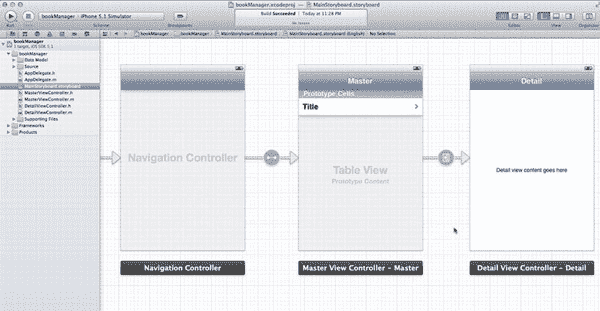

**图 7-1.** *打开故事板。*

1.  既然已经设置好了数据模型，现在就可以开始设计界面了。打开故事板。你会立刻看到 Xcode 已经为主从应用程序创建了一个基本的层级结构。一个基本的导航控制器连接到一个主视图控制器，该控制器通过 segue 连接到详细视图控制器，如图 7-1 所示。你将使用这个模板来满足需求。

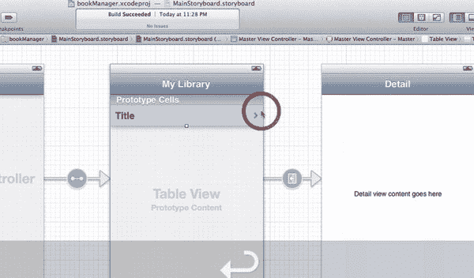

**图 7-2.** *将标题重命名为“我的图书馆”。*

2.  双击主视图控制器标题栏上的“Master”标题，将其重命名为“我的图书馆”，然后点击一次原型单元格以选中它，如图 7-2 所示。

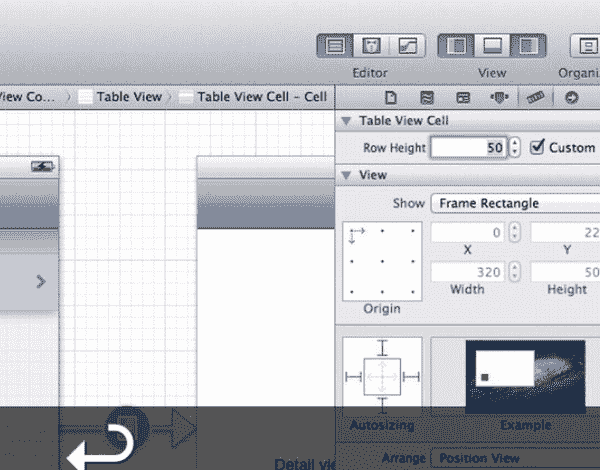

**图 7-3.** *将单元格的行高改为 50。*

3.  选择“实用工具”视图，然后点击“大小检查器”。在“行高”属性中输入 `50`，如图 7-3 所示，然后按回车键。

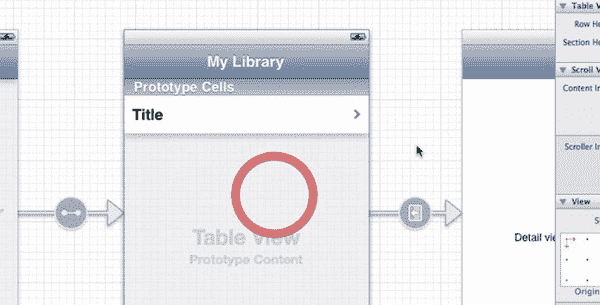

**图 7-4.** *选择表格视图。*

4.  你正在处理的场景将成为应用程序中的第一个视图。在这种情况下，它将允许用户在你的图书馆的两个顶级层级中选择：书籍和作者。因此，你很清楚要在表格视图中显示多少个单元格：两个单元格。这使得它非常适合作为静态表格视图——这是故事板独有的一项出色新功能，允许你在故事板中静态地布局表格视图的内容，在运行时显示它，甚至在用户选择某个单元格时切换到其他视图，而无需编写任何代码！让我们将表格视图转换为静态格式：点击原型单元格下方的位置来选择表格视图，如图 7-4 所示。

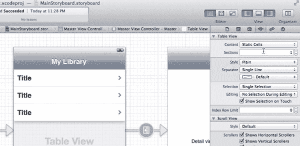

**图 7-5.** *更改表格视图内容类型。*

5.  选择“属性检查器”，将“内容”类型从“动态原型”改为“静态单元格”。你会看到三个相同的单元格出现，如图 7-5 所示。

**注意：** 动态表格视图显示动态内容，在这种情况下，表格视图行数较多（有时甚至不限量）。动态表格视图使用可重用的动态单元格原型来高效地显示非常大的数据集。静态表格视图本质上就是“所见即所得”。对于静态内容，表格视图的行数是已知且固定的，因此你可以在界面生成器中设计所有行。请注意，静态表格视图只能通过故事板创建，并且必须由表格视图控制器的子类来控制。

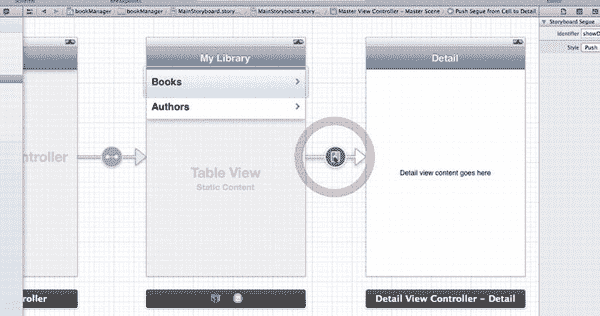

**图 7-6.** *命名层级树的根节点。*

6.  点击三个单元格中的一个并将其删除，这样只剩下两个单元格。现在让我们思考一下。你将拥有两个数据树：一个按书籍查看数据库，另一个按作者查看数据库。这意味着你的根节点有两个选择：书籍和作者。将这两个单元格的标签文本从“Title”分别改为“书籍”和“作者”，如图 7-6 所示。现在，你将删除连接主视图控制器到详细视图控制器的 segue：点击该 segue，如图 7-6 所示，将其选中，然后删除。

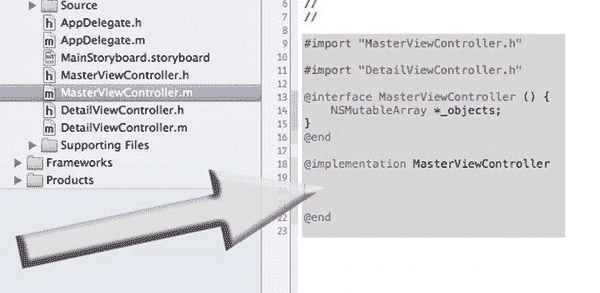

**图 7-7.** *删除 `MasterViewController.m` 中 `@end` 和 `@implementation` 之间的代码——箭头指示了原来代码所在的位置。*

7.  在进行下一步之前，还有一件最后的事情要做，以确保你的静态表格视图能正确显示。你需要删除主视图控制器的一些现有代码。Xcode 在主从应用程序模板中，为你在 `MasterViewController.m` 中创建了一些代码。这些代码实现了 `UITableViewDelegate` 和 `UITableViewDataSource` 协议方法，如果它们存在，将会覆盖你在故事板中定义的静态表格视图内容。因此，在项目导航器中点击 `MasterViewController.m` 文件，选中 `@implementation` 和 `@end` 之间的所有代码，并将其删除，如图 7-7 所示。

**注意：** 因为这是一个静态表格，所以不需要任何额外的代码。稍后，你将分别为“书籍”和“作者”这两个静态单元格创建 segue，连接到它们各自要跳转到的视图控制器。这就是为什么目前主视图控制器和详细视图控制器之间没有 segue 连接的原因。

#### 设计顶层视图：分类场景

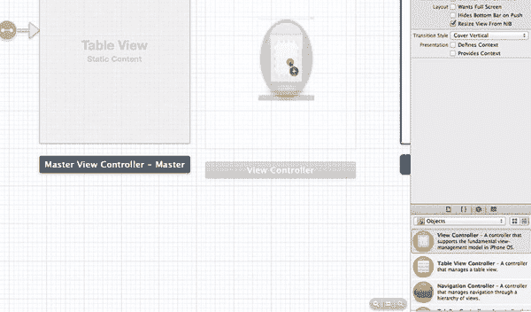

**图 7-8.** *拖入一个新的视图控制器。*

1. 根据应用流程，当用户点击`Books`单元格时，你需要显示一个可用分类列表。因此，你需要一个额外的`View Controller`来展示书籍的各种分类。现在，将之前从`Master View Controller`中断开连接的当前`Detail View Controller`移到右侧。你可以在图 7-8 右侧看到它的左侧部分。这样做是为了给即将拖入的新`View Controller`腾出空间。一旦空间足够，从你的`Object Library`中拖入一个新的`View Controller`，如图 7-8 所示。

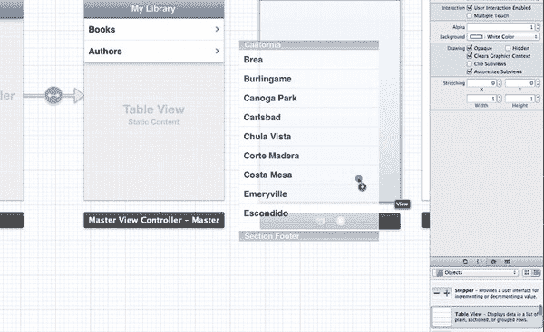

**图 7-9.** *拖入一个表格视图。*

2. 在`Object Library`中找到一个`Table View`，并将其拖到新的`View Controller`上，如图 7-9 所示。

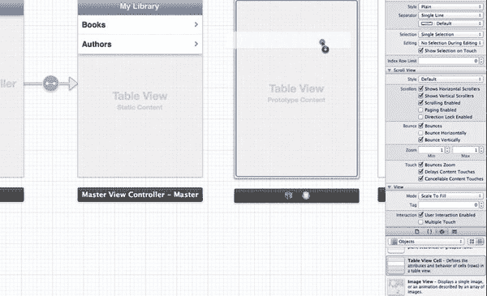

**图 7-10.** *拖入一个表格视图单元格。*

3. 现在，将一个`Table View cell`拖入新的`Table View`，如图 7-10 所示。

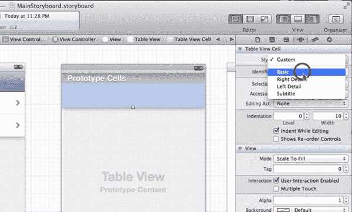

**图 7-11.** *将表格视图单元格样式更改为基本样式。*

4. 对于这个`Table View`，你将使用`Dynamic Prototypes`。实际上，你的`Table View`将显示三种不同类型的单元格。第一种是基本样式，仅显示一个标签，内容为数据库中每个分类的名称。这种单元格在`Table View`中的数量将与数据库中的分类数量相同。第二种单元格将显示“全部图书”标签，当用户点击该单元格时，会显示数据库中所有图书，无论分类如何。这个单元格将始终显示在分类列表的末尾。第三种单元格是“新增”单元格，让用户能够向数据库添加新的分类。这个单元格也会始终显示，并且总是`Table View`的最后一个单元格。修改你的`Table View Prototype`内容以实现此目的。首先，点击你已添加的单元格，并将其样式更改为`Basic`，如图 7-11 所示。

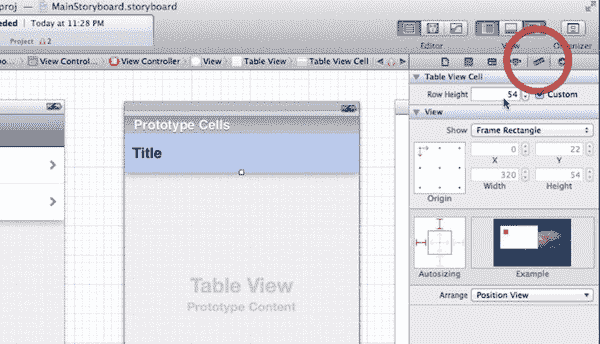

**图 7-12.** *更改单元格的行高。*

5. 点击`Size Inspector`，如图 7-12 所示，然后将`Row Height`从你当前的高度改为`50`（我们手动调整到了`54`，但请将你的高度改为`50`）。

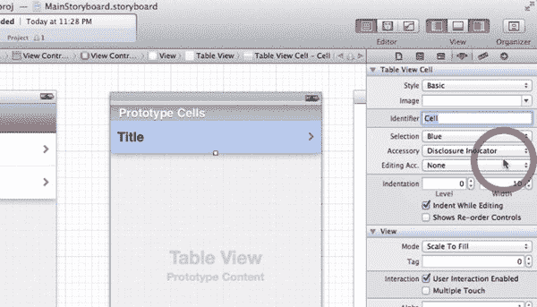

**图 7-13.** *更改标识符和辅助功能属性。*

6. 返回`Attributes Inspector`，将`Identifier`改为一个在代码中有意义的名称——我们称之为`Cell`，因为这是你将复用以显示分类的标准单元格原型。现在点击`Accessory`选项，从下拉菜单中选择`Disclosure Indicator`，如图 7-13 所示。双击`Table View Cell`原型中的`Title`标签，将其重命名为“分类名称”。然后确保你刚刚配置的单元格被选中（高亮为蓝色），并按  + `C` 复制它。

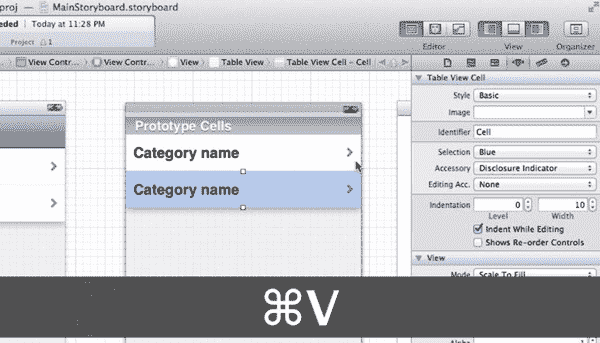

**图 7-14.** *复制第一个单元格。*

7. 按  + `V` 粘贴复制的“分类名称”单元格，如图 7-14 所示。双击你刚刚粘贴的新单元格，将其名称改为“全部图书”，因为该单元格将用户带到包含所有 Apress 图书的页面。而常规的“分类名称”单元格则会将用户带到属于 iOS、Android 或你选择的任何其他分类的图书。将名称改为“全部图书”后，将其`Identifier`（从第一个单元格粘贴过来后仍显示为`Cell`）改为`AllCell`。当标识符显示为`AllCell`后，继续下一步。

**注意：** 如你所见，`Storyboard`使得复制单元格并根据需要修改它们以创建原型变得异常简单。理解并充分利用这一概念至关重要。我们仍然看到有经验的程序员手工编写这些代码，仅仅是因为他们还没有“领悟”到——Storyboarding 如何让创建新原型变得如此简单。

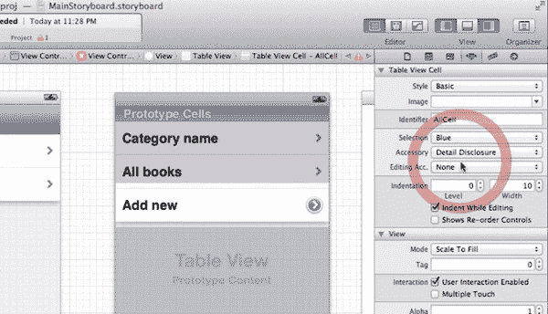

**图 7-15.** *创建“新增”单元格。*

8. 你需要再制作一个单元格。这个新单元格将允许用户添加任意名称的新分类。想一想：你将创建一个单元格，未来无需你或用户编写任何代码，它就可以被命名为“最佳 Apress 图书”、“Monkey”或其他任何名称——太棒了！按照你在图 7-14 中所做的操作：点击已有的两个单元格中的任意一个以选中它，按  + `C` 复制，再按  + `V` 粘贴，并将单元格的标签重命名为“新增”。为了使其外观不同，让我们找点乐子，更改几个属性。将`Accessory`类型设置为`Detail Disclosure`，如图 7-15 所示。你需要将`Identifier`重命名为唯一的名称，因为这是一个特殊单元格，因此将其改为`AddCell`。

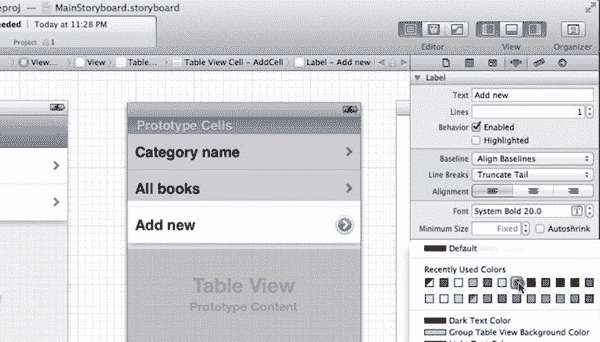

**图 7-16.** *更改文本颜色。*

9. 更改“新增”文本的颜色，以便用户可以轻松看出“新增”与其他选项不同。单击文本“新增”一次，将其颜色改为蓝色，如图 7-16 所示。

**注意：** 请确保在操作过程中随时保存你的工作！

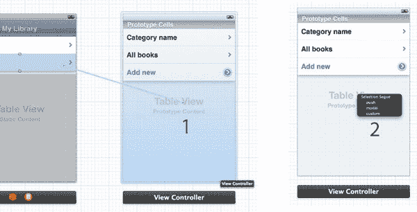

**图 7-17.** *从“图书”单元格到“分类”创建 Push 转场。*

10. 我们现在准备创建一个从`Master View Controller`的`Books`单元格到你刚刚设置的场景的`Push`转场。因为`Master`中有一个`Static Table View`，你可以直接从单元格本身发起转场。因此，点击`Master`中的`Books`单元格，按住 Control 键从它拖动到将要显示我们分类的`View Controller`（见图 7-17 中的 1），松开，然后从弹出菜单中选择`Push`（见图 7-17 中的 2）。

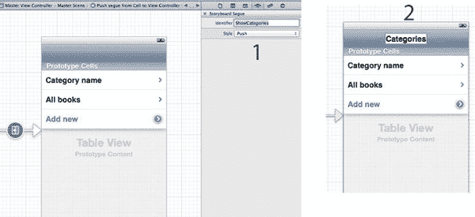

**图 7-18.** *设置转场标识符并更改目标视图的标题。*

11. 选择新的转场，在`Attributes Inspector`中将其`Identifier`选项设置为`ShowCategories`（见图 7-18 中的 1）。同时，双击目标`View Controller`的`Navigation Bar`，将其标题设置为`Categories`（见图 7-18 中的 2）。

**注意：** *标识符*是一个字符串，你的应用程序用它来区分不同的转场。你为每个转场分配不同的标识符，以便`Source View Controller`中的`prepareForSegue:sender:`方法能够区分它们，并为每个转场做好适当的准备。请始终为你的转场分配标识符。

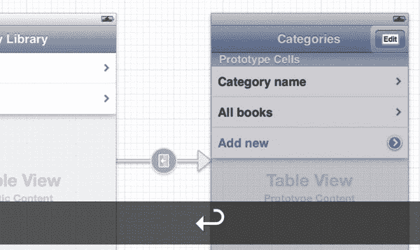

**图 7-19.** *创建编辑栏按钮项。*

12. 如前所述，你将允许用户编辑`Table View`并删除单元格。这意味着你需要在`Navigation Bar`上添加一个按钮，用于将`Table View`切换到编辑模式。从你的`Object Library`中拖一个`Bar button item`到`Navigation Bar`的右侧。双击其默认标题`Item`，将文本改为`Edit`，如图 7-19 所示。

#### 设计顶层视图：作者场景

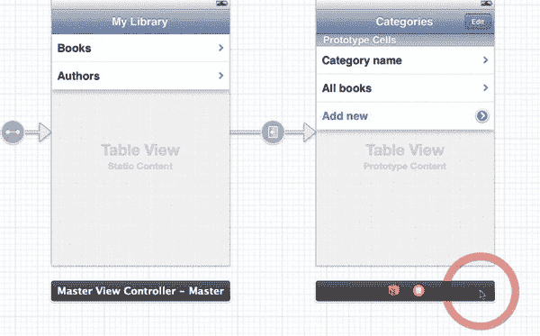

**图 7-20.** *选择“分类”场景并复制它。*

1.  你已经完成了第一个根视图“图书”的设计，它会导向分类。接下来需要的视图是“作者”。这个视图会与刚才制作的“分类”视图非常相似。为了节省时间，可以像图 7-20 所示，点击该场景，然后按下 +C 将其复制并粘贴到你的故事板中。

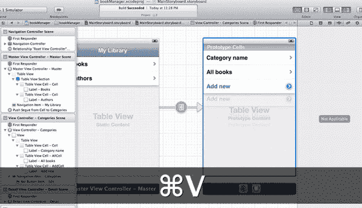

**图 7-21.** *粘贴新场景。*

2.  在故事板背景（蓝色方格纸外观）上单击一次，然后按 +V，如图 7-21 所示。

**注意：** 一开始看起来似乎什么都没发生，因为它被直接粘贴到了原始场景的上方。

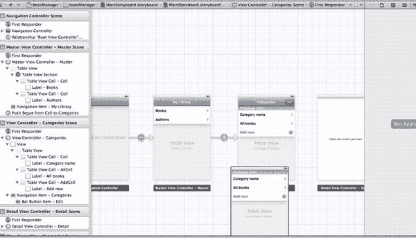

**图 7-22.** *缩小视图并重新排列。*

3.  你需要拖动刚才创建的新场景，它目前位于“分类”场景的上面。首先缩小视图，然后按照图 7-22 所示，将新场景拖动到“分类”场景正下方的位置。

**注意：** 严格来说，称其为 `[YourName] View Controller Scene` 是正确的。然而，在各个 Xcode 社区中，有些人选择将其简称为视图或场景。因此，即使在苹果内部，对此也存在争议。Xcode 书籍、博客和会议论文也未达成一致。我们使用这两个术语来帮助你习惯人们可能会用其中任何一种方式来指代。

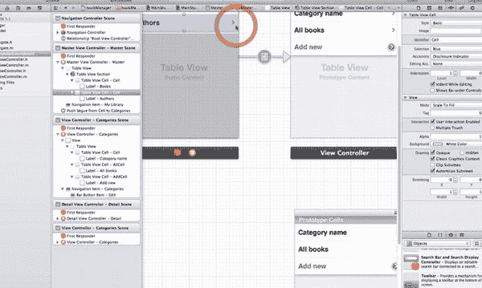

**图 7-23.** *在 Master 中选择“作者”静态单元格。*

4.  放大回来，如图 7-23 所示，点击主视图控制器中的“作者”单元格，然后开始按住 Control 键拖向新添加的场景。

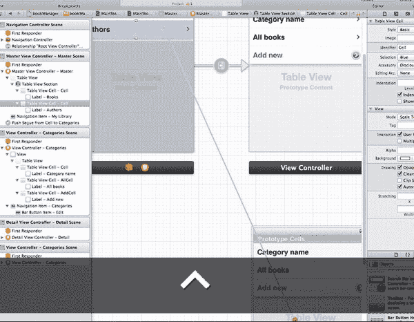

**图 7-24.** *将主视图控制器的“作者”单元格连接到“作者”场景。*

5.  继续从主视图控制器按住 Control 键拖动，当到达“作者”场景的表格视图时松开，如图 7-24 所示。

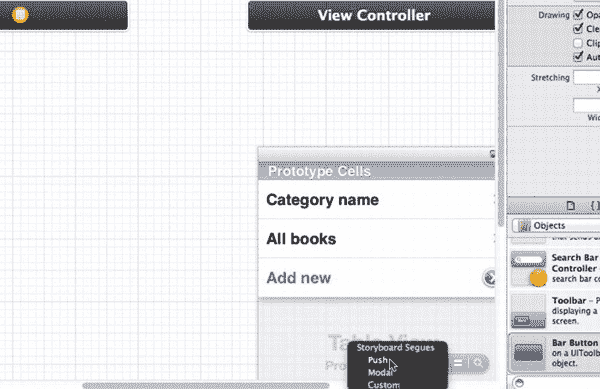

**图 7-25.** *创建 Push 转场。*

6.  松开后，从故事板转场菜单中选择 Push 选项，如图 7-25 所示。选择该转场，并在属性检查器中将其 `Identifier` 属性设置为 `ShowAuthors`，方法与你在步骤 17 中对 `ShowCategories` 转场所做的一样。

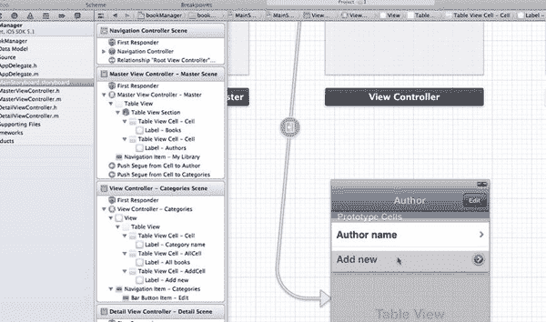

**图 7-26.** *一些修改*

7.  将导航栏上的“分类”标题改为“作者”，并将顶部原型单元格的“分类名称”标签改为“作者姓名”。此外，由于我们在这里不需要“所有图书”单元格，将其删除。现在你的“作者”场景应该看起来就像图 7-26 所示的那样。

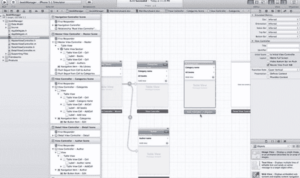

**图 7-27.** *创建另一个视图控制器。*

8.  下一个视图是用来显示图书列表的，这些图书属于用户选择的分类或作者。这意味着你必须创建另一个视图控制器。它与你刚才为“作者”场景复制的那个非常相似——你可以再次将其用作这个新视图控制器的基础。除非你之后复制了其他内容，否则剪贴板中应该还有“分类”场景的副本，所以只需点击蓝色故事板画布上的任意位置，然后按 +V 再次粘贴（否则，将“分类”场景再次复制到剪贴板并粘贴到故事板画布上）。缩小视图，将详细视图控制器移到右侧，留出足够空间，以便将新的视图控制器放置在其左侧，如图 7-27 所示。

#### 布局主图书列表视图：图书场景

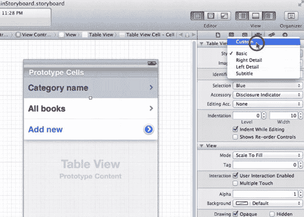

**图 7-28.** *创建自定义单元格。*

1.  在此视图中，用户会看到一个图书列表，每一行都显示书名和图书封面缩略图。你在第 6 章中拖入了一些图书图片。我们需要在这里做的，是将现在的 Basic 类型的“分类名称”单元格更改为自定义单元格，以便添加自定义 UI 元素。点击该单元格，然后在属性检查器中将样式从 Basic 改为 Custom，如图 7-28 所示。

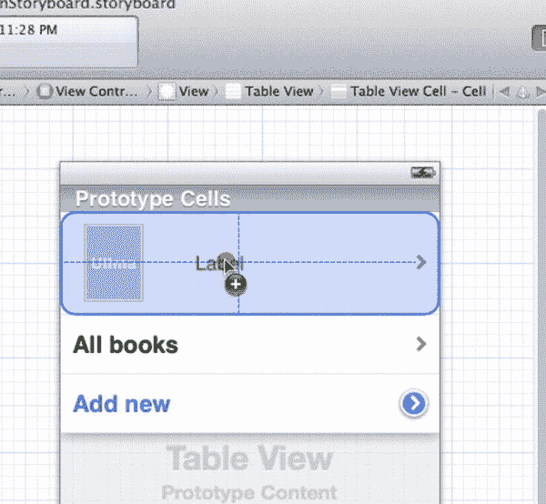

**图 7-29.** *向自定义单元格中拖入一个 UIImageView 和三个标签。*

2.  选中顶部单元格，打开尺寸检查器，将行高改为 87，以适应图书封面图片的高度。你还需要一个 `UIImageView` 来承载图书图片，因此将一个 `UIImageView` 拖入单元格。将图像视图的宽度设为 50，高度设为 66（可以使用尺寸检查器或鼠标）。你还需要显示三个关于图书的信息标签：标题、出版年份和作者。将一个标签拖到图像视图的右侧，配置好之后，将其复制并粘贴两次。图 7-29 显示了正在将第一个标签拖入单元格。

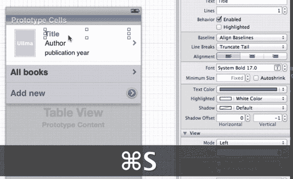

**图 7-30.** *复制并粘贴第一个标签。*

3.  将第一个标签复制并粘贴两次，然后将这些标签上下对齐排列好。拖动每个标签的右侧边缘，使其占据单元格的大部分区域——或者使用尺寸检查器将它们的宽度都设为 200 点。选中顶部标签，回到属性检查器，取消选中 Autoshrink 选项，将字体改为 System Bold 17.0，并将其颜色改为蓝色。然后，将每个标签的文本分别改为“标题”、“作者”和“出版年份”，如图 7-30 所示。我们还将*出版年份*的字体大小改为了 System 15.0，因为原来的字号看起来有点太大了。保存你的工作。

**注意：** 你在原型单元格中添加文本仅为了辅助设计过程。由于它是原型单元格，所有标签标题都将在运行时动态分配，但向我们的元素中添加占位符数据有助于指导你完成布局和自定义过程。

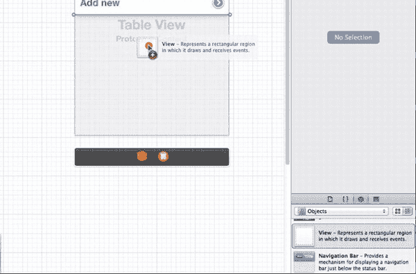

**图 7-31.** *添加子视图*

4.  你还希望能够随时显示任何分类中的图书总数。这可以通过在表格视图内容底部、原型单元格下方放置一个任意 `UIView` 来轻松实现。如图 7-31 所示，从对象库中拖一个基本的 `UIView` 到表格视图中。

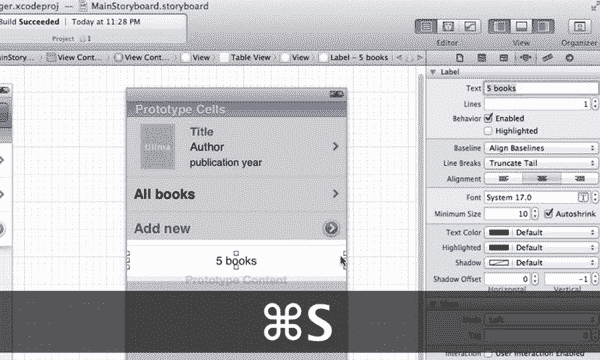

**图 7-32.** *在标签中输入临时文本。*

5.  你还需要添加一个文本标签来告知用户计数，所以从对象库中拖入一个 `UILabel`，并将其放置在你上一步添加的 `UIView` 内部。拖拽两侧的控点使其覆盖整个视图，将文本居中，然后输入临时文本“5 books”，如图 7-32 所示。（之后你可能还想将文本颜色改为深灰色，字体改为 System Bold 15。）

**注意：** 这个页脚视图可以包含任何内容，比如图像、按钮、文本视图、地图——只要是应用程序需要的都可以。使用故事板可以轻松布局多样化的应用 UI，而无需在故事板背后编写大量代码。

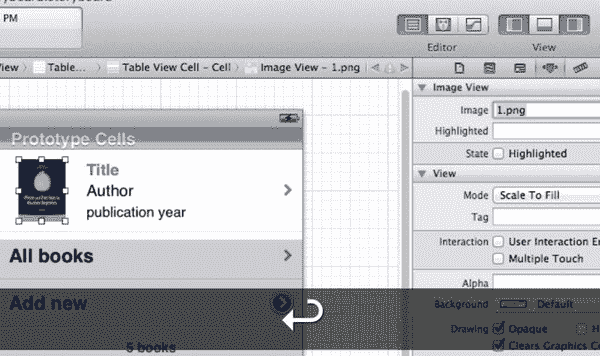

**图 7-33.** *查看图片的显示效果。*

6.  为了更好地预览自定义单元格在运行时的视觉效果，可以查看示例图书封面图片。当应用运行时，它会根据 SQLite 数据库中存储的数据为每本书检索图片。但目前，请点击空白的 Image View，在属性检查器中找到 `Image` 属性，输入 `1.png`，或从 `Supporting Files` 图片文件夹中选择任意其他图片文件名。如果你确实选择了 `1.png` 文件，那么它看起来应该与图 7-33 所示类似。在属性检查器中，同时将 Image View 的 `Background` 颜色更改为浅灰色，这样即使某些书籍没有图片显示，也能保持可见。

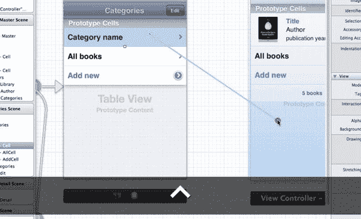

**图 7-34.** *将“分类名称”原型单元格连接到新创建的场景。*

7.  您希望当用户点击父视图控制器（“分类名称”、“全部图书”和“作者名称”单元格）中的一个单元格时，图书列表能显示特定的书籍列表。这意味着您仍然需要从三个父单元格分别连接到新创建的视图控制器场景。选择“分类名称”原型单元格，按住 Control 键并拖拽至新创建的视图控制器，如图 7-34 所示。释放连线连接器后，从 Storyboard Segues 菜单中选择 `Push`。

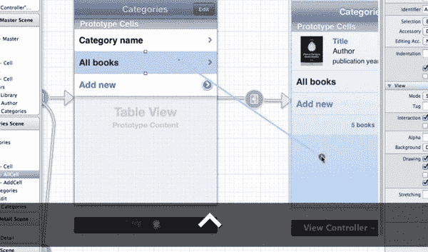

**图 7-35.** *将“全部图书”单元格连接到新创建的场景。*

8.  选择“全部图书”单元格，按住 Control 键并拖拽到与上一步相同的视图控制器，如图 7-35 所示。同样将其设置为 `Push` 类型的 Segue。

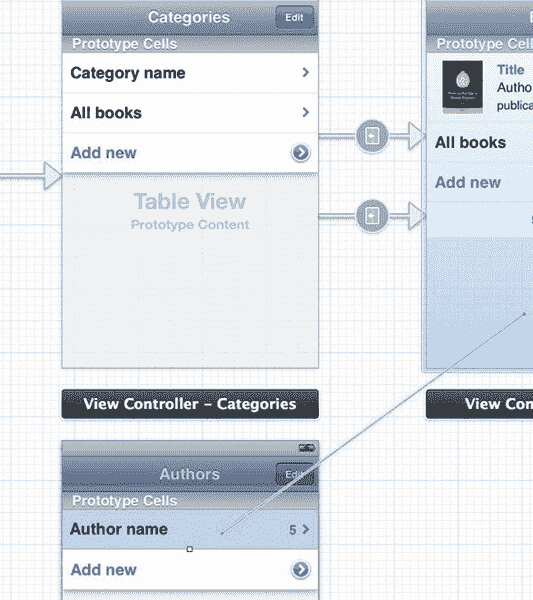

**图 7-36.** *将“作者名称”原型单元格连接到新创建的场景。*

9.  向下滚动到作者场景，选择“作者名称”单元格，然后按住 Control 键向上拖拽到新创建的视图控制器，如图 7-36 所示。释放连线连接器后，从 Storyboard Segues 菜单中选择 `Push` 选项。

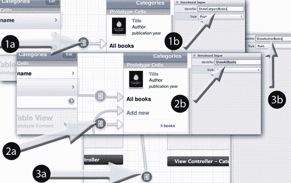

**图 7-37.** *为每个 Segue 指定唯一标识符。*

10. 既然已经连接好了 Segue，还需要再完成一步，因为您需要将额外的数据传递给图书列表视图控制器。您需要为每个 Segue 指定一个标识符，以便后续在编写代码时可以访问它们。选择“分类名称”单元格的 Segue（图 7-37 中的 1a），在属性检查器中，将其 `Identifier` 属性设置为 `ShowCategoryBooks`（图 7-37 中的 1b）。选择“全部图书”单元格的 Segue（图 7-37 中的 2a），并将其 `Identifier` 设置为 `ShowAllBooks`（图 7-37 中的 2b）。选择“作者名称”单元格的 Segue（图 7-37 中的 3a），并将 `Identifier` 属性设置为 `ShowAuthorBooks`（图 7-37 中的 3b）。

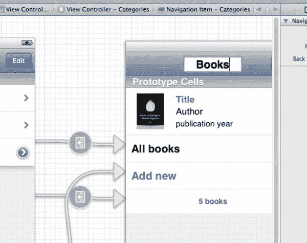

**图 7-38.** *将“分类”标题更改为“图书”。*

11. 您可能已经注意到，您的图书列表视图仍然显示标题“分类”，因为这是通过复制“分类”场景并修改而来的。让我们将其更改为与其内容匹配。双击文本并将其替换为 `Books`，如图 7-38 所示。您也可以删除“全部图书”单元格原型，因为它不适用于此视图控制器（尽管保留它不会造成任何问题；该单元格只是永远不会在这个表格视图中被使用）。

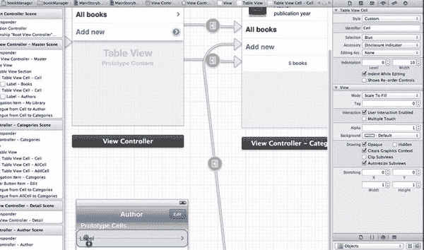

**图 7-39.** *修改“作者名称”单元格*

12. 让我们让作者场景更有趣一些，使每个作者的单元格在末尾显示该作者在数据库中的图书数量。（在现实中，例如，您可以创建一个库存应用，让客户能立即看到库存物品的数量。这些数据将在后端计算并在每个单元格内显示。这一步是一个完美的示例，教您如何实现这一点。）因此，修改“作者名称”单元格。选择它，然后在属性检查器中将 `Style` 属性从 `Basic` 更改为 `Custom`。同时将一个标签拖到单元格上，将其放置在左侧，如图 7-39 所示。

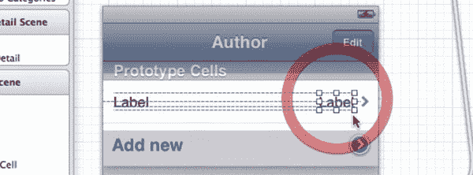

**图 7-40.** *调整两个标签。*

13. 将第二个标签（用于显示数量）拖到单元格的右侧，如图 7-40 所示。保持选中状态，在属性检查器中将其 `Text` 属性设置为任意数字，以便稍后记住其作用。我们将其设置为 `5`。此外，将文本右对齐，设置字体为 `System Bold 16.0`，并将字体颜色更改为蓝色。

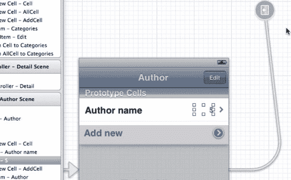

**图 7-41.** *将标签改为“作者”。*

14. 现在选择您添加的第一个标签，将其宽度调整到能占据数量标签开始之前的所有空间，设置其字体为 `System Bold 20`，并将其文本更改为 `Author name`，如图 7-41 所示。

#### 制作详情视图的故事板：图书详情场景

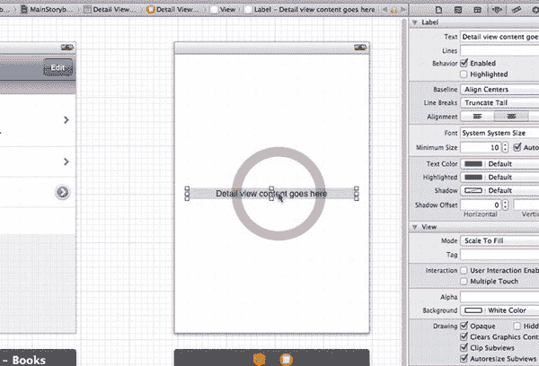

**图 7-42.** *开始编辑所选图书的详情场景。*

1.  现在开始设计你的详情视图控制器。首先需要导航到画布的最右侧。点击“详情视图内容显示在此处”标签，然后将其删除，如图 7-42 所示。

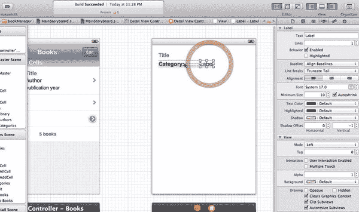

**图 7-43.** *开始引入标签。*

2.  先快速跳到 图 7-46——你会看到需要标题和三行文字，每行包含两个标签。你需要做的是：引入一个标题标签，将其拉伸至视图宽度，设置格式；然后为前三行中的第一行引入两个标签，同样设置格式；接着将这两个标签复制粘贴两次。因此，拖入第一个标签，将文本改为 *标题*。将其宽度调整为几乎与视图本身等宽，居中对齐，设置字体为 System Bold 16.0，并将文本颜色改为蓝色。拖入另一个标签，将其左对齐放置在标题正下方。将文本改为 *类别：*，设置字体为 System Bold 17.0。然后向右拖动，使其宽度刚好能容纳文本。接着，再拖入一个标签，放在刚添加的标签右侧，如图 7-43 所示。将此标签的右侧手柄拖至画布右边缘附近，并将其文本改为 *类别标签*。

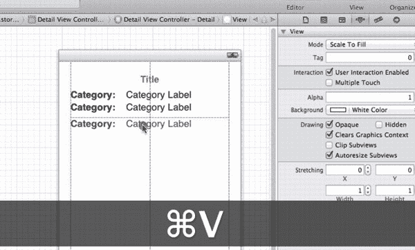

**图 7-44.** *粘贴并对齐另外两行。*

3.  选择标题标签，在属性检查器中将其对齐方式设置为居中。现在同时选中“类别：”和“类别标签”，按下 `Cmd+C` 复制它们，然后按两次 `Cmd+V` 进行粘贴。现在开始按照 图 7-44 所示对齐这些内容。将它们整齐对齐——完美地上下排列后——继续执行下一步。

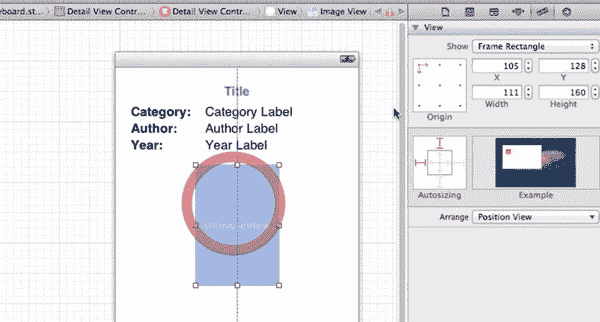

**图 7-45.** *重命名并拖入一个用于显示图书封面的 UIImageView。*

4.  将刚刚粘贴的两行分别重命名为“作者：”搭配“作者标签”，以及“年份：”搭配“年份标签”。现在从资源库中拖入一个 `UIImageView`，用于放置图书封面图片。前往尺寸检查器，将其尺寸设置为 111 × 160。然后将图像居中，如图 7-45 所示。

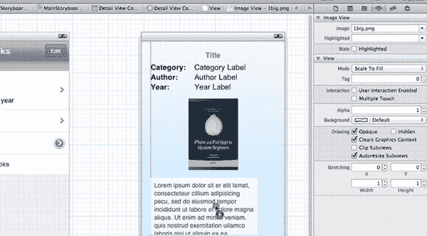

**图 7-46.** *完成视图设置。*

5.  最后要做的两件事是：将图像视图与临时的大图 `1big.png` 关联起来，并拖入一个文本视图，如图 7-46 所示，用于容纳我们为你提供的简短图书描述。文本视图中显示的文本以及相应的图片名称都将从数据库中选取。

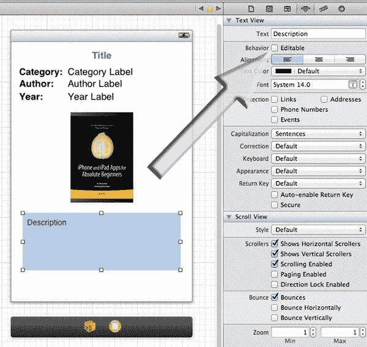

**图 7-47.** *对齐并重命名文本视图中的文本。*

6.  将文本视图放置到画布上后，将其居中对齐。在属性检查器中，取消勾选“可编辑”选项，然后在文本框中输入 *描述*，如图 7-47 所示。请记得在每一步操作后都保存进度。

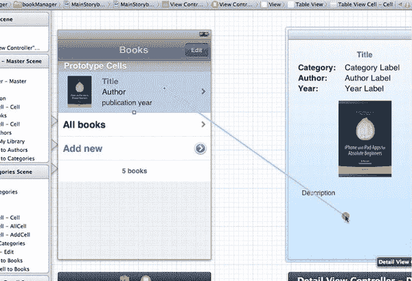

**图 7-48.** *将图书列表连接到详情视图控制器。*

7.  此视图在用户点击列表中的任何图书时都会出现，因此我们将在故事板中安排这个导航。选择“图书场景”中的顶部单元格，然后按住 Control 键拖拽到详情视图控制器，如图 7-48 所示。释放连接线后，从故事板转场菜单中选择“推送”选项。

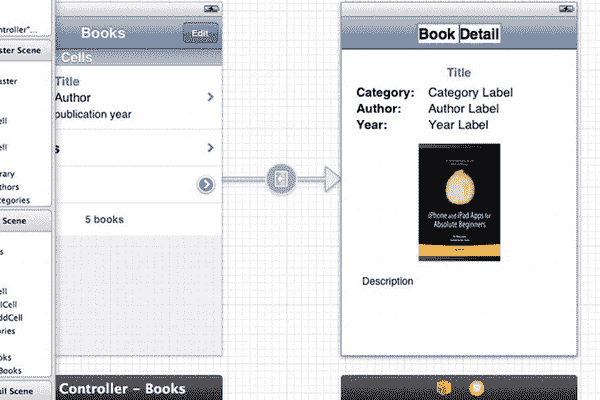

**图 7-49.** *将视图标题重命名为“图书详情”。*

8.  连接好转场后，你会看到导航栏出现在详情视图中。双击标题文本，将其重命名为 *图书详情*，如图 7-49 所示。

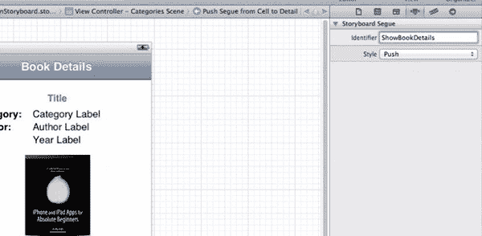

**图 7-50.** *指定标识符。*

9.  你需要为这个新转场分配一个唯一的标识符，因此请点击指向详情视图控制器的转场。选中后，切换到属性检查器，为此转场的标识符命名为 `ShowBookDetails`，如图 7-50 所示。

#### 创建输入和保存新数据的界面：添加图书场景

你的应用有一个很酷的功能，它将允许用户执行一项过去很难编程实现的操作：向应用中添加新内容并将其保存。故事板使这项任务变得容易得多——而且，这是一项非常宝贵的技能。

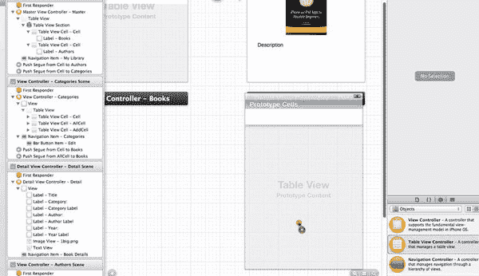

**图 7-51.** *创建添加图书场景*

1.  现在，你将开始设计一个新场景，该场景将显示一个简单的表单，用户可以在其中输入图书的基本信息并将其保存到数据库中。因为你已经知道需要为图书捕获哪些类型的数据，所以为其创建一个静态表视图是合理的。要在故事板中创建静态表，你必须使用表视图控制器。从对象库中拖出一个表视图控制器到你的故事板画布上，如图 7-51 所示。

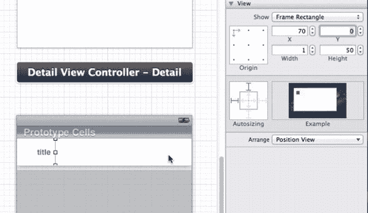

**图 7-52.** *编辑静态表视图的表视图单元格。*

2.  单击顶部单元格，在尺寸检查器中将行高设置为 50。因为不需要这个单元格在触摸时高亮显示，在保持单元格选中的状态下，切换到属性检查器，将选择属性从蓝色更改为无。拖出一个标签，并将其放置在单元格的左侧。然后，在属性检查器中将文本更改为*标题*，将字体设置为 System Bold 14.0，并选择你喜欢的任何颜色（我们从标准调色板中挑选了一种灰蓝色）。另外，将文本从左对齐改为右对齐。现在，有一个非常酷的技巧，使用图像视图作为分隔线，位于字段标题和用户将要输入的信息之间。拖入一个 UIImage 视图并将其放置在单元格中。在属性检查器中，将背景色设置为浅灰色。回到尺寸检查器，将宽度设置为 1，高度设置为 50，使其看起来像一条细灰线分隔符。最后，将 Y 值设置为 0，如图 7-52 所示。

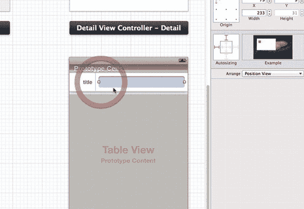

**图 7-53.** *拖入文本字段。*

3.  为了能够从应用向 SQLite 数据库添加新内容，你需要能够在应用中输入数据。为此，你需要使用文本字段。从对象库中拖出一个文本字段到你的单元格中，并将其展开至大约 233 点，如图 7-53 所示。在属性检查器中，将文本字段的边框样式设置为不可见，即最左边的第一个按钮。

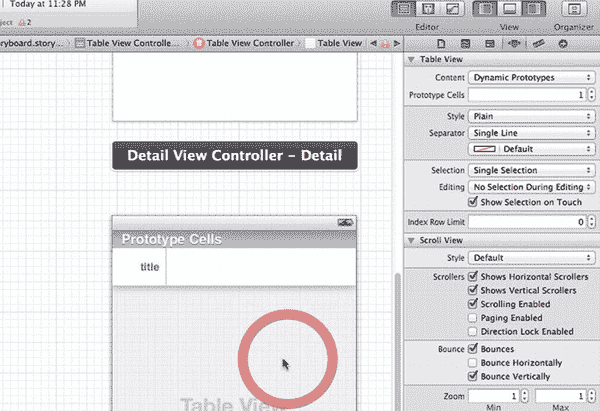

**图 7-54.** *选择表视图进行进一步编辑。*

4.  你想要将表视图设置为分组样式，以便为其提供分区。请确保在接下来的步骤中选择了表视图。你可以点击原型单元格下方表视图内的任意位置来选择它，如图 7-54 所示。

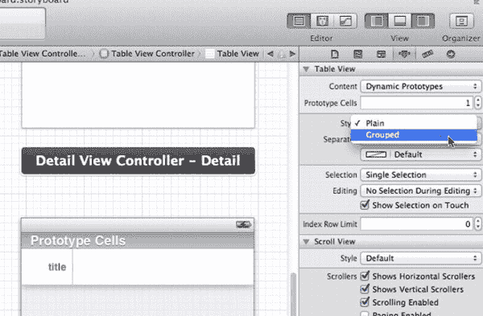

**图 7-55.** *将表视图分组。*

5.  选中表视图后，在属性检查器中将其样式从 Plain 更改为 Grouped，如图 7-55 所示。

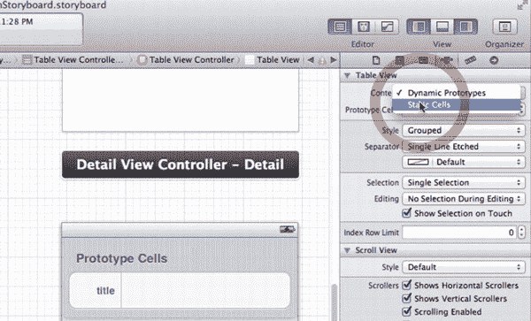

**图 7-56.** *更改表内容类型。*

6.  将内容类型从动态原型更改为静态单元格，如图 7-56 所示。之后，你会看到三个静态单元格出现。你只需要两个，选择一个并将其删除。

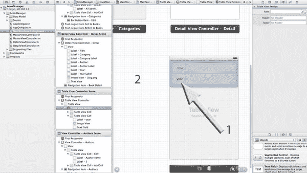

**图 7-57.** *在文档大纲中选择表视图分区。*

7.  将底部单元格左侧标签的文本更改为*年份*（参见图 7-57 中的 1）。现在，仔细点击条纹分组表视图背景的任意位置（参见图 7-57 中的 2），并确保没有选中某个单元格或表视图本身。你可以打开文档大纲窗格，选择表视图分区，如图 7-57 右侧所示。

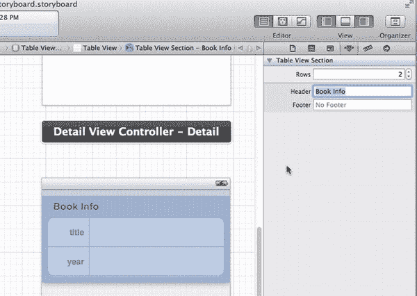

**图 7-58.** *将页眉设置为图书信息。*

8.  选中表视图分区后，在属性检查器中，将表视图分区的页眉属性设置为*图书信息*，如图 7-58 所示。

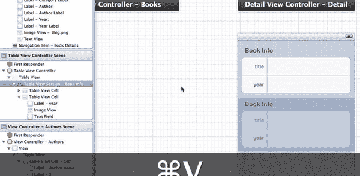

**图 7-59.** *创建另一个分区*

9.  现在，你可以简单地复制第一个分区并粘贴。确保再次在文档大纲中选择“表视图分区 – 图书信息”，否则这些说明可能无法产生预期结果。选中分区后，按 `+C`，然后立即按 `+V`，如图 7-59 所示。

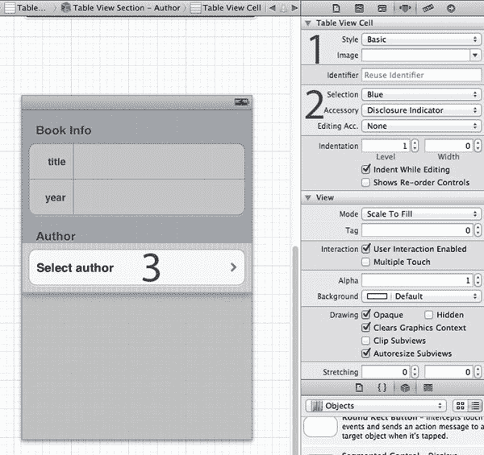

**图 7-60.** *修改新分区。*

10.  你将让用户执行一个非常酷的操作。与其让用户记住作者姓名，不如让他们从列表中选择一个姓名。双击你刚刚粘贴的新分区的页眉，将其文本从*图书信息*更改为*作者*。这个分区的单元格也太多了——删除一个单元格，只保留一个。选择该单元格，在属性检查器中更改以下属性：将样式设置为 Basic（参见图 7-60 中的 1），将选择设置为蓝色，将附件设置为展开指示器（参见图 7-60 中的 2）。双击更改单元格样式后出现的标题标签，将其文本更改为*选择作者*（参见图 7-60 中的 3），这样用户就知道他们将要选择 Apress 的一位作者。这个分区的最终外观如图 7-60 所示。

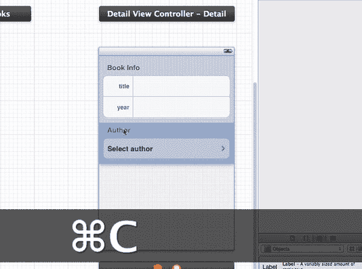

**图 7-61.** *单击一次作者页眉以选择分区，然后按 `+C`。*

11.  与复制第一个分区时使用文档大纲来帮助选择正确的分区对象不同，你现在的分区已通过页眉清晰标识。你可以直接在视图画布中轻松选择第二个分区进行复制和粘贴。单击作者页眉文本以高亮显示它，按 `+C` 复制它，如图 7-61 所示，然后立即按 `+V` 粘贴它。

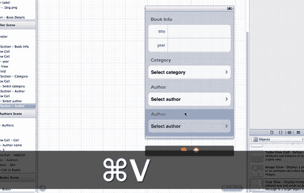

**图 7-62.** *制作另一个分区*

12.  现在，你应该看到第三个分区出现在表视图的底部，与它正上方的那个分区完全相同，如图 7-62 所示。双击页眉并将其文本更改为*类别*。

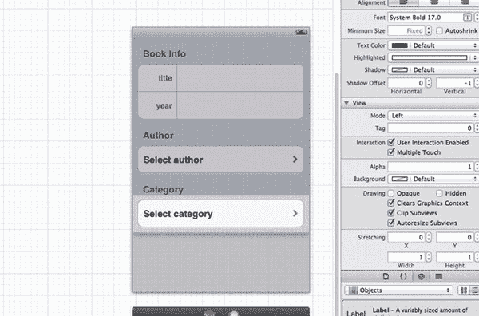

**图 7-63.** *编辑第三个分区。*

13.  同时将“选择作者”标签的文本更改为*选择类别*。该分区的最终外观如图 7-63 所示。

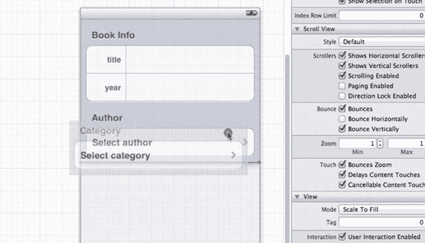

**图 7-64.** *调整分区顺序练习*

14.  了解在 Storyboard 中创建和重新排列分节是多么容易是很重要的，因为您或您的客户可能希望更改这些分节的顺序。假设您要将“Category”分节移到“Author”分节之上，只需单击一次并向上拖动，如图 7-64 所示。
15.  您希望允许用户为书籍添加“Book info”、“Category”、“Author”和“Description”数据，就像您在 SQLite 数据库中设计的那样。为此，您需要再添加一个分节。再次复制并粘贴“Author”分节，就像第 60 步一样。没错，一旦您完成了第一个分节，现在就这么简单了！

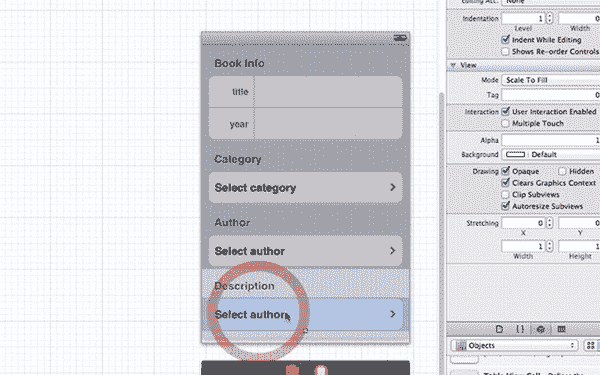

**图 7-65.** *选择新分节。*

16.  点击标题，将其从*Author*改为*Description*。然后单击一次以选中最后一个单元格，如图 7-65 所示。

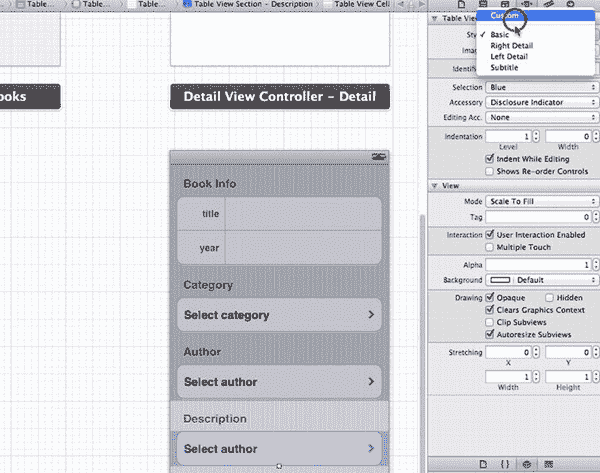

**图 7-66.** *更改单元格的样式*

17.  “Description”分节是用户添加其描述的地方。您需要修改刚刚粘贴的内容以满足这一基本需求。在属性检查器中，将样式从“Basic”改为“Custom”，如图 7-66 所示。同时将“Selection”从“Blue”改为“None”。这个单元格不需要展开指示器图标，因此也将“Accessory”从“Disclosure Indicator”改为“None”。

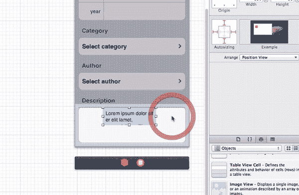

**图 7-67.** *向单元格添加文本视图*

18.  您需要让单元格具有足够的高度，以容纳用户输入描述所添加书籍的文本行数。您还需要一个文本视图。选中该单元格后，在大小检查器中将单元格高度改为 100。这将为用户提供足够的空间，让他们看到自己输入文本的几行内容（如果只能读一两行，输入文本会很困难）。接下来，您需要添加一个文本视图，如图 7-67 所示。拖动其控制手柄使其完美地填充单元格。我们将它设置为 281 点宽、88 点高。

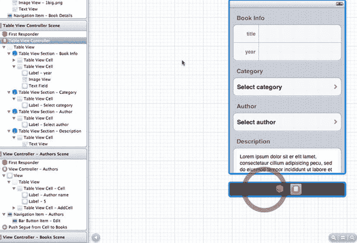

**图 7-68.** *选择表视图控制器以嵌入*

19.  这个场景将是一个模态场景，因此您需要将其嵌入到一个导航控制器中，以便在此视图中使用导航栏。为此，选择表视图控制器，如图 7-68 所示。请注意，图 7-68 左侧的文档大纲显示，表视图控制器在“Table View Controller Scene”内被选中。在开始嵌入之前，请确保您的项目中同样如此——如果不是的话，您可能会很不愉快，因为您必须从头开始。

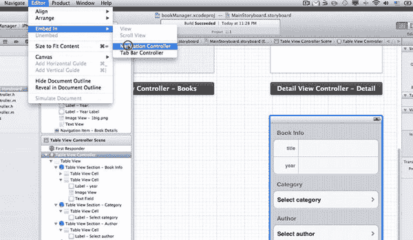

**图 7-69.** *将表视图控制器嵌入到导航控制器中*

20.  选中表视图控制器后，选择 Editor  Embed In  Navigation Controller，如图 7-69 所示。

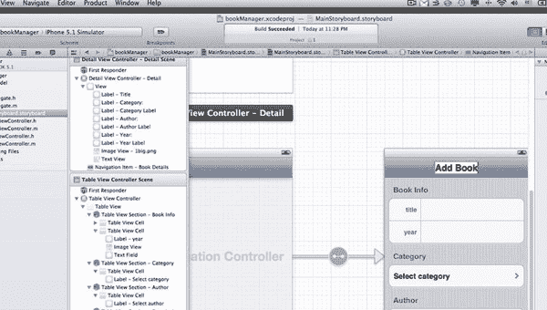

**图 7-70.** *创建新的导航控制器*

21.  一个崭新的导航控制器被创建了，它与你即将命名为“Add Book View”的视图形成了根视图控制器关系。双击视图标题并将其命名为*Add Book*，如图 7-70 所示。

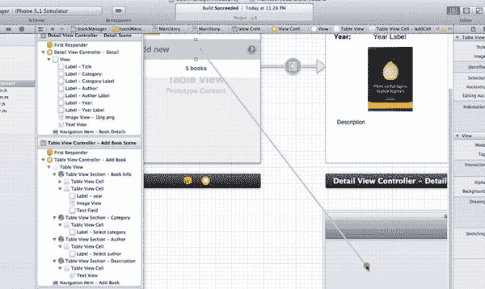

**图 7-71.** *创建一个跳转以进入“Add Book”场景*

22.  现在您需要稍微思考一下。为了进入这个场景，用户需要点击“Books View”中的“Add New”单元格。目前这些场景之间没有连接，因此您需要创建一个新的跳转。点击“Add New”单元格并按住 Control 键拖动到导航控制器上，如图 7-71 所示。由于这是一个模态场景——仅用于输入数据——这次，您不会使用让下一个视图滑入的 Push 跳转，而是使用让下一个视图翻转入场的 Flip 跳转。释放跳转连接器时，从 Storyboard Segues 菜单中选择“Modal”选项。

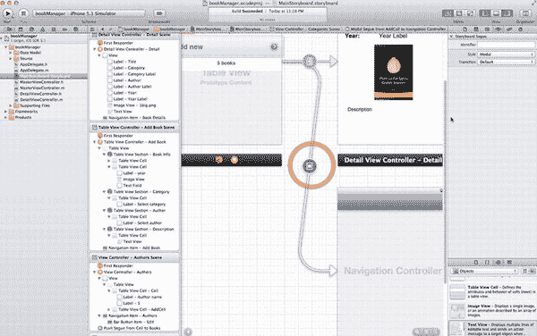

**图 7-72.** *选择新的跳转*

23.  嗯……一个漂亮的跳转被创建了。让我们稍微调整一下它。选中它，如图 7-72 所示。

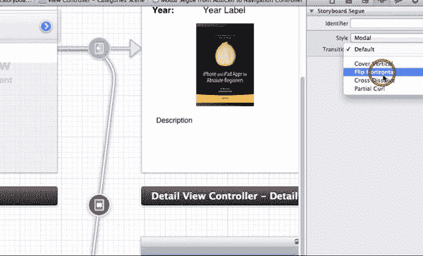

**图 7-73.** *更改跳转类型*

24.  选中新跳转后，使用属性检查器将其“Transition”类型更改为“Flip Transition”，如图 7-73 所示——因为如前所述，尝试不同的跳转类型有助于熟悉它们。同时将跳转的“Identifier”属性设置为*AddNewBook*。

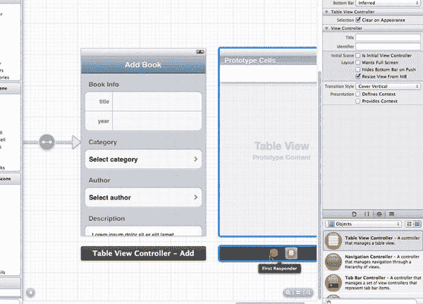

**图 7-74.** *最后一步：创建一个新的表视图控制器*

25.  您最后需要做的是允许用户选择一个可用的类别或作者。为此，创建一个非常基本的表视图控制器。但有趣的是：我们不会创建两个表视图控制器（一个用于作者，一个用于类别），而是向你展示 Storyboard 如何让你使用同一个表视图来满足这两种需求！拖出另一个表视图控制器，并将其放置在“Add Book Scene”的右侧，如图 7-74 所示。

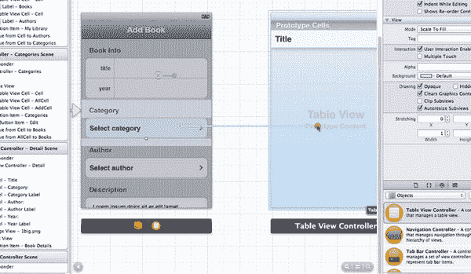

**图 7-75.** *修改表视图，然后从“Select category”单元格连接一个跳转*

26.  如前所述，这个新的表视图将非常基础——没有装饰。选择自动添加到表视图中的原型单元格，在属性检查器中将它的“Style”设置为“Basic”，并在“Identifier”属性中输入*Cell*。这个单元格最终将显示类别名称或 Apress 作者姓名。现在退一步思考一下用户将如何进入这个场景。你的用户必须选择“Select category”单元格或“Select author”单元格。这意味着你需要两个跳转，每个单元格各一个。首先选择“Select category”单元格，并按住 Control 键拖动到表视图控制器上，如图 7-75 所示。释放跳转连接器时，从 Storyboard Segues 菜单中选择“Push”选项。在属性检查器中将该跳转的“Identifier”设置为*SelectCategory*，就像你在本章中多次操作的那样。

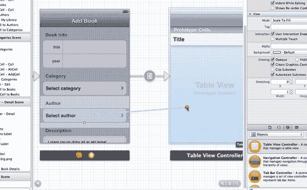

**图 7-76.** *以相同方式连接“Select author”单元格*

27.  现在选择“Select author”单元格，并按住 Control 键拖动到表视图控制器上，如图 7-76 所示。释放跳转连接器时，从 Storyboard Segues 菜单中选择“Push”。像往常一样，在属性检查器中将该跳转的“Identifier”设置为*SelectAuthor*。

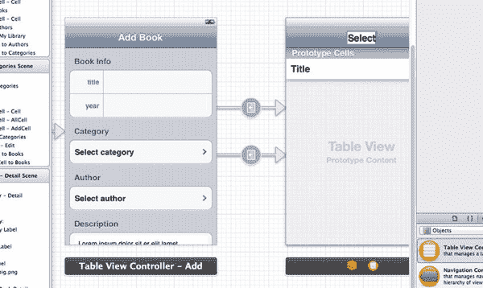

**图 7-77.** *修改视图标题*

28.  双击视图标题并将其改为*Select*，如图 7-77 所示。

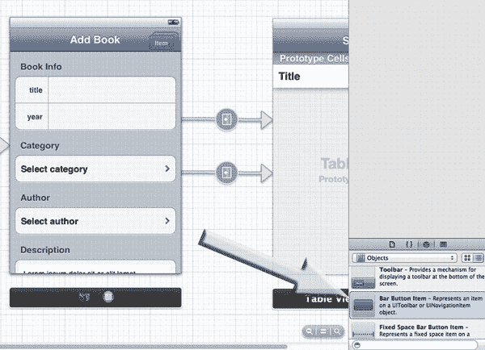

**图 7-78.** *将按钮添加到模态场景中*

29.  由于“添加图书”场景是一个模态场景，你需要添加两个栏按钮项。一个用于保存用户刚刚创建的条目，另一个用于让用户取消当前操作并返回到上一个视图控制器。从对象库中拖入第一个栏按钮项，如图 Figure 7-78 所示。

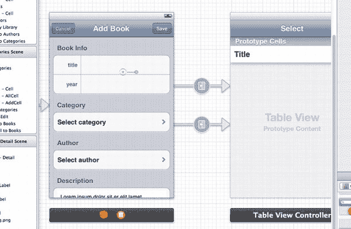

**图 7-79.** *添加两个栏按钮项。*

30.  将第一个 `Bar button item` 拖到标题的右侧，并将其命名为 `Save`。然后再拖一个到标题的右侧，命名为 `Cancel`，如图 Figure 7-79 所示。

##### 进行最终调整

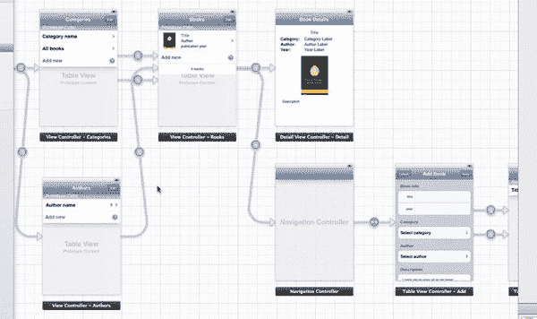

**图 7-80.** *应用到目前为止的故事流程。*

1.  图 7-80 展示了到目前为止的故事板。看起来相当不错！它展示了应用完整的故事情节和逻辑流程。你甚至无需考虑编写任何代码，就能看到应用各部分是如何结合在一起的。是不是很令人兴奋？最后，你可以对数据流再进行一次微小的改进。考虑一种情况：作者只有一本书，这意味着无需进入图书列表（图书场景）。在这种情况下，更合理的做法是直接跳转到图书详情场景（位于图书场景的右侧）。要实现这一点，你需要修改一些设置。

    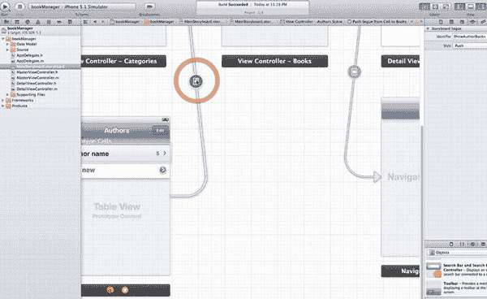

    **图 7-81.** *删除 `ShowAuthorBooks` 转场。*

2.  选中从作者场景到图书场景的转场（即分配了 `ShowAuthorBooks` 标识符的那条），如图 Figure 7-81 所示，然后将其删除。

    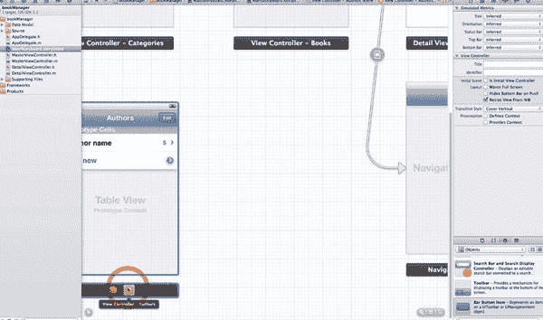

    **图 7-82.** *从实际的视图控制器创建一个新的转场。*

3.  现在，你将不再从“作者姓名”单元格跳转到图书列表，而是从视图控制器本身创建一个转场。点击作者场景的 Dock（底部的黑色条）选中它。然后选择视图控制器，如图 Figure 7-82 所示。

    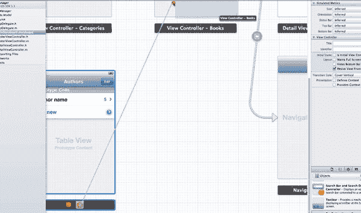

    **图 7-83.** *按住 Control 键拖拽到图书场景。*

4.  从视图控制器按住 Control 键拖拽到图书场景，如图 Figure 7-83 所示。松开转场连接器后，从故事板转场菜单中选择 `Push`。为其分配 `ShowAuthorBooks` 标识符，就像你之前设置的那样。

    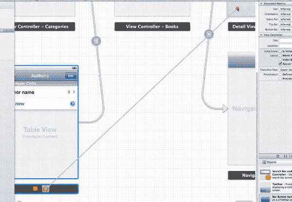

    **图 7-84.** *对图书详情场景重复相同操作。*

5.  对详情视图控制器执行完全相同的操作，如图 Figure 7-84 所示——区别在于创建转场时，需要为其分配一个不同的标识符。

    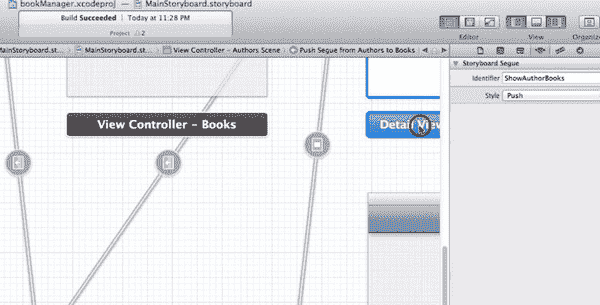

    **图 7-85.** *为新转场分配标识符。*

6.  将此转场命名为 `ShowAuthorBookDetail`（如图 Figure 7-85 所示）。从视图控制器创建转场的诀窍在于，你可以在满足特定条件时，通过代码手动执行这些转场。在这个例子中，当用户点击表视图单元格时，你将根据该作者拥有的图书数量来决定执行两个转场中的哪一个。

    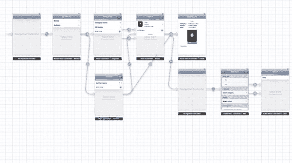

    **图 7-86.** *最终的故事板布局！*

7.  此时，你最终的故事板应该看起来像 Figure 7-86 所示。是时候运行你的应用，看看效果了！

    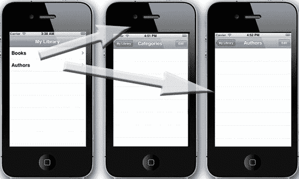

    **图 7-87.** *运行成功！*

8.  从 图 7-87 可以看出，应用确实可以工作，并从根视图导航到类别和作者场景——但是，当你将其与图 6-0A 和图 6-0B（应用的最终外观）比较时，你会发现列表中没有数据。这是因为尽管故事板功能正常，但底层缺少将视图和表格连接到 SQLite 数据库的代码。这部分内容你将在下一章中处理。

