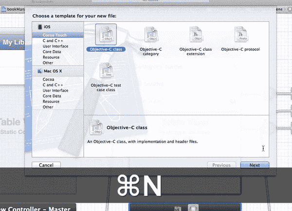
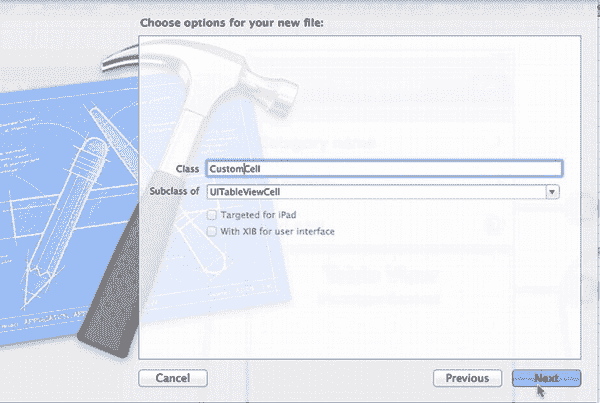
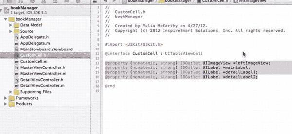
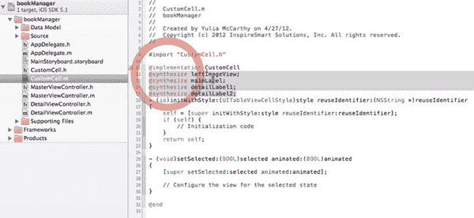
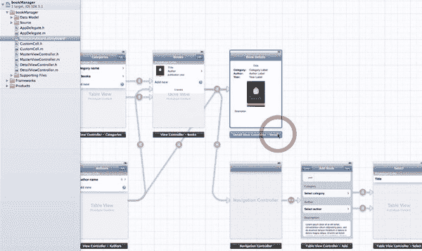
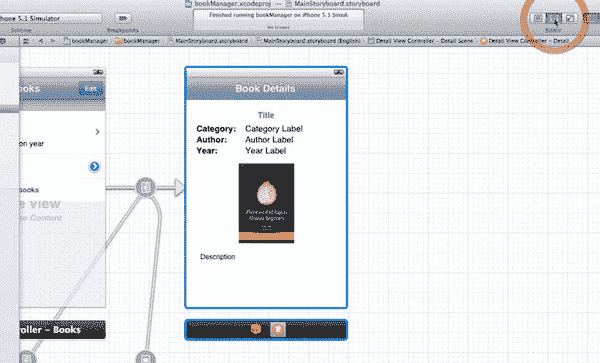
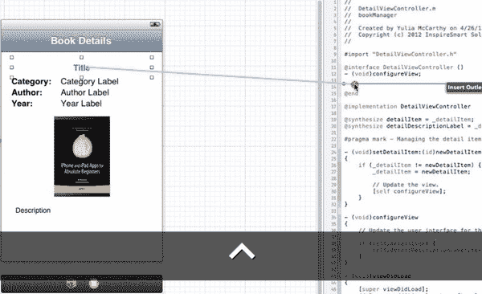
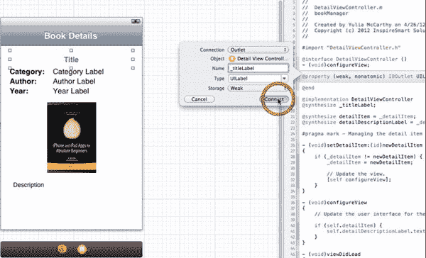
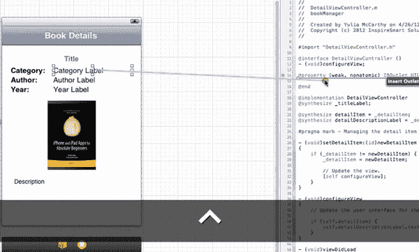
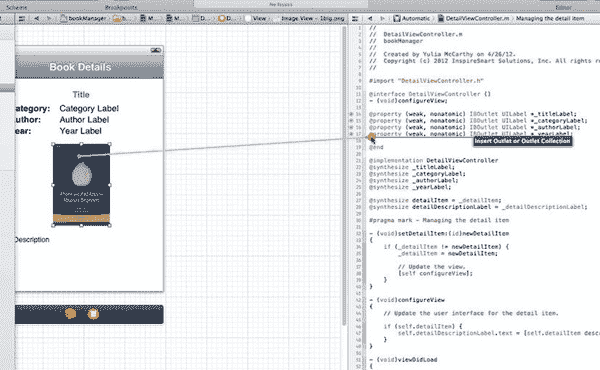

# 第 8 章

## 使用故事板掌握表视图：编写后端代码

到目前为止，在未编写任何代码的情况下，你已经设计了一个相当复杂的库存系统，该系统可以追踪项目（本例中为 Apress 图书），并允许从应用本身向数据库添加项目。正如你在第 7 章的图 7-87 中看到的，除应用未链接任何数据外，一切功能正常。

在第 8 章中，作为应用三步开发流程中的第三步，你将编写代码，将 SQLite 数据库连接到你在第 7 章中创建的每个视图控制器。

### 第 3 步：在故事板元素后面编写代码并调整一些故事板必要设置

让我们从创建自定义的 `UITableViewCell` 子类开始这第三步的工作。


#### 创建自定义 `UITableViewCell` 子类



**图 8-1.** *创建一个新类以连接到你的自定义单元格原型。*

1. 位于 图 7-29 中创建的 Storyboard 根部的 `UITableViewCell` 是一个很好的起点，因为大多数连接都从这里引出。但是，你首先需要创建一个 `UITableViewCell` 的子类，它将为你提供所有必要的输出口，以连接自定义单元格原型中的元素。按下 +N 创建一个新类，然后选择 Objective-C 类后，点击“Next”，如 图 8-1 所示。

   

   **图 8-2.** *确保它是 `UITableViewCell` 的子类。*

2. 通常，你会飞快地跳过这个对话框，但请放慢速度，确保这是一个 `UITableViewCell` 的子类。你将此类命名为 `CustomCell`。点击“Next”，如 图 8-2 所示。在下一个对话框中，使用默认的保存设置，点击“Create”。

   

   **图 8-3.** *定义输出口。*

3. 默认情况下，Xcode 会打开实现文件，但我们希望你首先打开头文件。转到项目导航器中的 `CustomCell.h` 并打开它。你要做的第一件事是定义你的界面所需的输出口。首先从 DemoMonkey 中拖入 `10 CustomCell.h IBOutlets` 代码片段，这是第三部分中的第一个片段。将其放置在你通常定义输出口的位置，即 `@end` 之前。在此你定义了四个输出口：`leftImageView`、`mainLabel`、`detailLabel1` 和 `detailLabel2`，如 图 8-3 和下文所示：

   ```
   #import <UIKit/UIKit.h>

   @interface CustomCell : UITableViewCell

   @property (nonatomic, strong) IBOutlet UIImageView *leftImageView;
   @property (nonatomic, strong) IBOutlet UILabel *mainLabel;
   @property (nonatomic, strong) IBOutlet UILabel *detailLabel1;
   @property (nonatomic, strong) IBOutlet UILabel *detailLabel2;

   @end
   ```

   这里的所有属性都相当直观。稍后在 Storyboard 中将它们连接到你的 UI 时，你将了解它们的作用。保存头文件，然后让我们在它的实现中添加一些东西。

   

   **图 8-4.** *合成四个输出口。*

4. 跳转到 `CustomCell.m` 实现文件，并合成刚才定义的四个 `IBOutlet`。从 DemoMonkey 中拖入 `11 CustomCell.m @synthesize` 代码片段，将其放在 `@implementation CustomCell` 之后，如 图 8-4 和下文所示：

   ```
   #import "CustomCell.h"

   @implementation CustomCell
   @synthesize leftImageView;
   @synthesize mainLabel;
   @synthesize detailLabel1;
   @synthesize detailLabel2;
   ```

#### 修改详细视图控制器



**图 8-5.** *选择“Book Details Scene”（书籍详情场景）。*

1. 在第 7 章中，你已经从 Storyboard 根部的 Table View 单元格创建了连接。现在，你将沿着 Storyboard 每个分支的叶子节点往回走向根部，并为所有这些场景添加代码。从详细视图控制器开始。点击 Storyboard 将其打开，然后选择“Book Details Scene”，如 图 8-5 所示。

   

   **图 8-6.** *打开 Assistant 编辑器。*

2. 你将把连接从 Storyboard 拖到代码上，因此正如你之前所做的那样，你需要让 Storyboard 在左侧打开，代码在右侧。打开 Assistant 编辑器，如 图 8-6 所示。

   

   **图 8-7.** *从“Title”（标题）标签 Control-拖动到 `DetailViewController.m`。*

3. 查看书籍详情，在深入代码之前，思考一下：你有一些 UI 元素需要连接到 SQLite 数据库，以便它们能够显示数据，对吗？你需要代码可以使用的输出口来实现这一点。因此，你需要为你这里拥有的每个元素创建输出口。你将更进一步，不仅仅是创建它们——你还会将它们设为私有接口，因为你不需要从此类外部访问它们。你已打开 Assistant，但要确保它打开的是 `DetailViewController.m` 文件。如果不是，请使用代码上方的下拉菜单切换到该文件。我们在 `-(void)configureView` 后面添加了几个空格，以便留出一些空间。现在从“Title”标签 Control-拖动到代码，如 图 8-7 所示。

   

   **图 8-8.** *创建输出口连接。*

4. 松开 Control-拖动，并在弹出的用于配置输出口连接的窗口中保留所有默认设置。你只需给它一个名称。我们将其命名为 `_titleLabel`，如 图 8-8 和下文所示：

   ```
   #import "DetailViewController.h"
   #import "DBBook.h"

   @interface DetailViewController ()
   - (void)configureView;

   @property (weak, nonatomic) IBOutlet UILabel *_titleLabel;

   @end
   ```

   

   **图 8-9.** *针对五个元素中的后三个重复操作。*

5. 现在，你需要将图 8-7 和图 8-8 的过程重复五次，针对右边的三个标签各一次：Category Label（分类标签）、Author Label（作者标签）和 Year Label（年份标签）。从“Category Label” Control-拖动到实现文件，如 图 8-9 所示，并将其命名为 `_categoryLabel`，就像你在图 8-8 中将 Title 命名为 `_titleLabel` 一样。再重复两次：从“Author Label” Control-拖动到实现文件，并将其命名为 `_authorLabel`；从“Year Label” Control-拖动到实现文件，并将其命名为 `_yearLabel`。

   这三个标签显示如下：

   ```
   #import "DetailViewController.h"
   #import "DBBook.h"

   @interface DetailViewController ()
   - (void)configureView;

   @property (weak, nonatomic) IBOutlet UILabel *_titleLabel;
   @property (weak, nonatomic) IBOutlet UILabel *_categoryLabel;
   @property (weak, nonatomic) IBOutlet UILabel *_authorLabel;
   @property (weak, nonatomic) IBOutlet UILabel *_yearLabel;

   @end
   ```

   

   **图 8-10.** *连接书籍图片。*

6. 点击书籍图片，如 图 8-10 所示，从中 Control-拖动到实现文件，并将输出口命名为 `_bookImage`，如下所示：

   ```
   #import "DetailViewController.h"
   #import "DBBook.h"

   @interface DetailViewController ()
   - (void)configureView;
```


