# 排版后的内容

`@property (weak, nonatomic) IBOutlet UILabel *_titleLabel;`
`@property (weak, nonatomic) IBOutlet UILabel *_categoryLabel;`
`@property (weak, nonatomic) IBOutlet UILabel *_authorLabel;`
`@property (weak, nonatomic) IBOutlet UILabel *_yearLabel;`
`@property (weak, nonatomic) IBOutlet UIImageView *_bookImage;`

`@end`

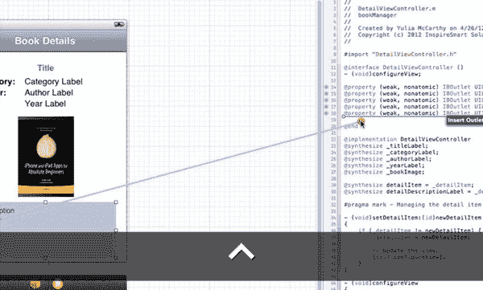

**图 8-11.** *连接“描述”字段。*

7.  最后，在“描述”字段的正下方单击一次，然后按住 Control 键，从高亮显示的框拖拽到实现文件中，如图 8-11 所示。将输出口命名为 `_descriptionTextView`，如下所示：

`#import "DetailViewController.h"`
`#import "DBBook.h"`

`@interface DetailViewController ()`
    `- (void)configureView;`

`@property (weak, nonatomic) IBOutlet UILabel *_titleLabel;`
`@property (weak, nonatomic) IBOutlet UILabel *_categoryLabel;`
`@property (weak, nonatomic) IBOutlet UILabel *_authorLabel;`
`@property (weak, nonatomic) IBOutlet UILabel *_yearLabel;`
`@property (weak, nonatomic) IBOutlet UIImageView *_bookImage;`
`@property (weak, nonatomic) IBOutlet UITextView *_descriptionTextView;`

`@end`

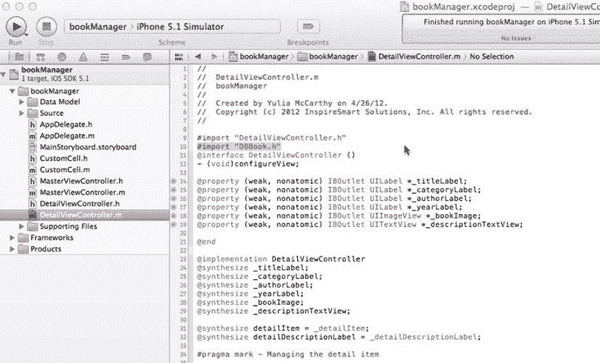

**图 8-12.** *编辑 DetailViewController.m 文件。*

8.  现在，你已经将 Storyboard 中的元素连接到了 `DetailViewController.m` 文件中，还需要添加一些额外的代码片段。具体来说，你需要导入 `DBBook.h` 文件，以便访问该类的接口。打开 `DetailViewController` 的实现文件，将 DemoMonkey 中的 "—— DetailViewController.m Imports" 代码片段拖入，并放置在 `#import "DetailViewController"` 之后，如图 8-12 和以下代码所示：

`#import "DetailViewController.h"`
`#import "DBBook.h"`

`@interface DetailViewController ()`
    `- (void)configureView;`

`@property (weak, nonatomic) IBOutlet UILabel *_titleLabel;`

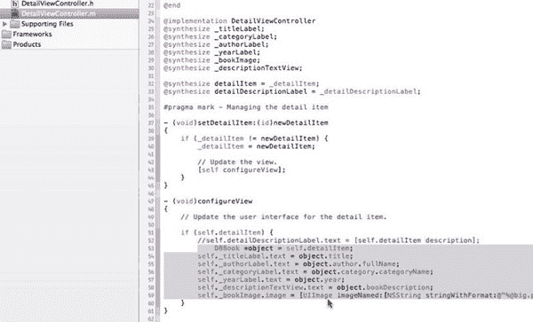

**图 8-13.** *为 configureView 方法添加代码。*

9.  你需要使用来自 SQLite 数据库的数据更新书籍详情场景的用户界面，该数据库包含了用户所选书籍的所有关键详细信息。为此，你需要编辑并调整 `configureView` 方法。我们已经为你编写好了 `configureView` 的额外元素，你可以始终将其作为模板使用。首先，注释掉当前存在的代码行：

`//self.detailDescriptionLabel.text = [self.detailItem description];`

将 DemoMonkey 中的 "12 DetailViewController.m configureView" 代码片段拖入，并放置在 `configureView` 方法实现中，紧跟在注释掉的代码行下方，如图 8-13 和以下代码所示：

```
- (void)configureView
{
    // 为用户界面的详情项进行更新。

    if (self.detailItem) {
        //self.detailDescriptionLabel.text = [self.detailItem description];
        DBBook *object = self.detailItem;
        self._titleLabel.text = object.title;
        self._authorLabel.text = object.author.fullName;
        self._categoryLabel.text = object.category.categoryName;
        self._yearLabel.text = object.year;
        self._descriptionTextView.text = object.bookDescription;
        self._bookImage.image = [UIImage imageNamed:[NSString
        stringWithFormat:@"%@big.png", object.imageName]];
    }
}
```

在 `DBBook object = self.detailItem` 这一行中，你获取到了在跳转过程中传递给你的 `detailItem`。然后，接下来的六行代码，从 `self.*` 开始，为你在图 8-7 至 8-11 中创建的文本和图片输出口分配了所有属性。

**注意：** 你可能需要导航到你的“数据模型”文件夹，并打开 `DBBook.h` 文件，以理解为什么在第 6 章中创建了 `bookId`、`categoryId`、`authorId`、`title`、`year` 和 `bookDescription`。你可以看到 `DetailViewController` 将如何使用这些属性来显示存储在数据库实体中的数据。

至此，`DetailViewController` 中需要添加的内容就结束了。接下来，你将开始创建另一个视图控制器类——`SelectionViewController`。


#### 创建 SelectionViewController

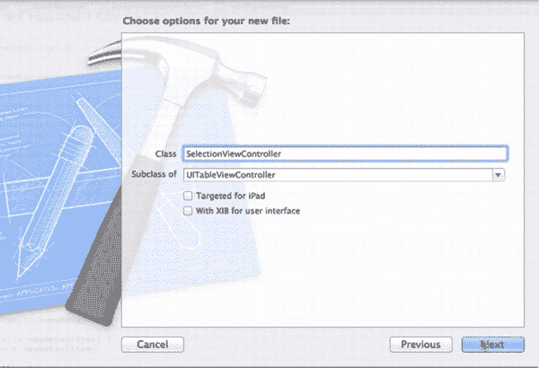

**图 8-14.** *创建 SelectionViewController。*

1. 故事板中的另一个“叶子”场景允许用户在创建新书时选择作者或类别。按下 +N 创建新的子类，选择 Objective-C 类后，点击“下一步”，步骤与 图 8-1 中相同。将这个类命名为 `SelectionViewController`，确保它是 `UITableViewController` 的子类，然后点击“下一步”，如 图 8-14 所示。

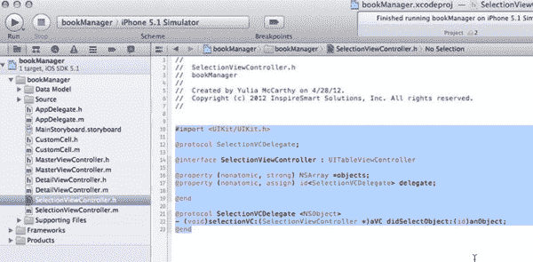

**图 8-15.** *替换 SelectionViewController.h 中的代码。*

2. 你将彻底修改 `SelectionViewController` 的头文件，因此为节省时间，你只需替换整个代码，原因会在后续步骤中解释。首先，选中 `SelectionViewController.h` 中的所有原始代码并删除。从 DemoMonkey 中拖入“13 SelectionViewController.h interface + Protocol”代码片段，并将其放置在文件底部，如 图 8-15 和本步骤后续内容所示。

首先，你定义了一个数组，该数组将在转场过程中传递给视图控制器。它将包含 `DBAuthor` 或 `DBCategory` 对象的集合，具体取决于用户点击的单元格。通过以下代码实现：

`@property (nonatomic, strong) NSArray *objects;`

然后，你需要返回用户所做的图书或类别选择。这意味着你需要一个委托对象，将选择结果传回给它。通过以下代码实现：

`@property (nonatomic, assign) id<SelectionVCDelegate> delegate;`

最后，你定义了一个包含 `selectionViewController:didSelectObject:` 方法的协议，用于将选择结果传回给委托：

`@protocol SelectionVCDelegate <NSObject>`
    `- (void)selectionVC:(SelectionViewController *)aVC didSelectObject:(id)anObject;`

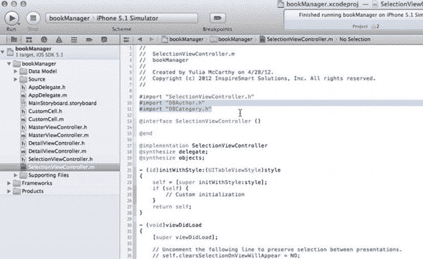

**图 8-16.** *合成并导入你在头文件中添加的内容。*

3. 现在，你需要合成在头文件中创建的 `delegate` 和 `objects` 属性。打开 `SelectionViewController.m` 文件。此处没有对应的 DemoMonkey 步骤，因此只需在 `@implementation SelectionViewController` 下方输入 `@synthesize delegate;` 和 `@synthesize objects;`。你还需要导入 Author 和 Category 数据库实体的头文件，因为你需要访问它们的属性。从 DemoMonkey 中拖入“--SelectionViewController.m imports”代码片段，并将其放置在 `#import "SelectionViewController.h"` 下方，如 图 8-16 和以下代码所示：

```
#import "SelectionViewController.h"
    #import "DBAuthor.h"
    #import "DBCategory.h"

@interface SelectionViewController ()

@end

@implementation SelectionViewController
    @synthesize delegate;
    @synthesize objects;

- (id)initWithStyle:(UITableViewStyle)style
```

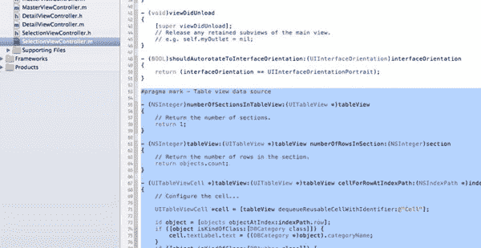

**图 8-17.** *替换 UITableViewDataSource 协议方法。*

4. 现在，你将添加表格视图的代码。你将替换 Xcode 已为你插入的 `TableViewDataSource` 协议方法，用自己的代码替换，以避免混淆。向下滚动到刚才操作的位置下方。转到 `shouldAutorotateToInterfaceOrientation` 方法的末尾，选中从那里到 `@end` 之前的所有内容并删除。从 DemoMonkey 中拖入“14 SelectionViewController.m TableView Datasource and Delegate”代码片段，并将其放置在 `@end` 之前，如 图 8-17 所示。

由于你将此表格视图控制器同时用于类别和作者，因此在 `cellForRowAtIndexPath:(NSIndexPath *)indexPath` 方法中检查数组中对象的类，如果是类别，则从数据库中显示类别名称。

```
if ([object isKindOfClass:[DBCategory class]]) {
        cell.textLabel.text = ((DBCategory *)object).categoryName;
    }
```

……如果是作者，则显示作者姓名：

```
if ([object isKindOfClass:[DBAuthor class]]) {
        cell.textLabel.text = ((DBAuthor *)object).fullName;
    }
```

然后，当用户做出选择时，回调委托，将用户选择的对象传递过去：

```
if ([self.delegate respondsToSelector:@selector(selectionVC:didSelectObject:)]) {
        [self.delegate selectionVC:self didSelectObject:[objects
        objectAtIndex:indexPath.row]];
    }
```

现在保存文件，因为你需要返回故事板，将此 `ViewController` 类分配给对应的场景。

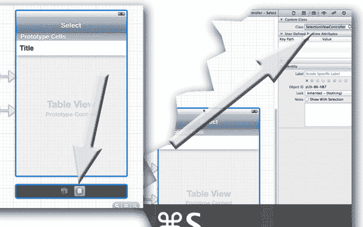

**图 8-18.** *点击“选择场景”并将其与 SelectionViewController 关联。*

5. 打开故事板，转到“添加图书场景”右侧的表格视图控制器（请参见 图 7-77）。单击一次表格视图控制器图标，如 图 8-18 中左侧箭头所示。选中视图控制器后，转到身份检查器，将其类设置为你刚刚编码的：`SelectionViewController`，如 图 8-18 中右侧箭头所示。选中原型单元格，切换到属性检查器，并确保其标识符属性设置为 `Cell`。


#### 编写“添加图书”视图控制器

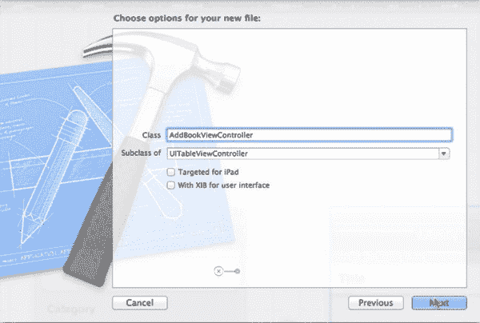

**图 8-19.** *创建下一个类 AddBookViewController。*

1. 按下 +N 创建一个新子类，选择 Objective-C 类后，点击“下一步”。将其命名为 `AddBookViewController`，并设为 `UITableViewController` 的子类，如图 8-19 所示。保存后，首先需要为其添加输出口，那么我们先回到 Storyboard。

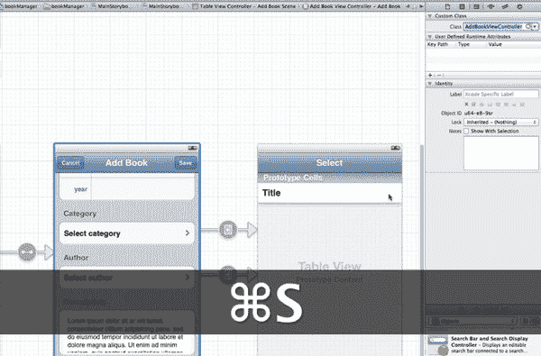

**图 8-20.** *为 AddBookViewController 添加输出口。*

2. 打开 Storyboard，选择“添加图书”表格视图控制器，操作方式与你在图 8-18 中选择 Selection 视图控制器相同。选中表格视图控制器后，前往标识检查器，将类设置为你刚创建的 `AddBookViewController`，如图 8-20 所示。

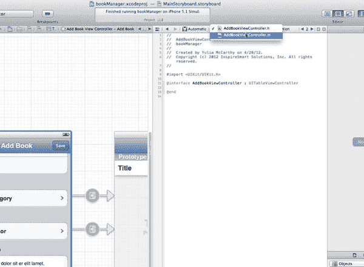

**图 8-21.** *选择 AddBookViewController 的实现文件。*

3. 切换到助理编辑器模式。在右侧窗格中，你会看到 Xcode 默认显示头文件。你需要操作的是实现文件，因此在头文件代码上方的选择栏中选择实现文件，如图 8-21 所示。

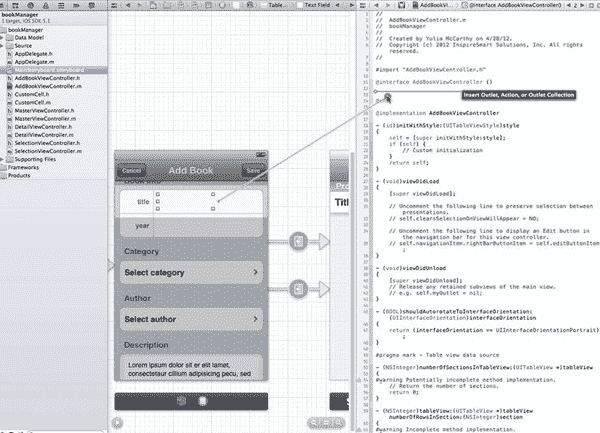

**图 8-22.** *为标题和年份属性创建输出口。*

4. 首先需要为图书的标题和年份创建输出口。点击标题标签右侧的标题文本字段区域一次，然后按住 Control 键拖拽到 `@interface` 下方的实现文件中，如图 8-22 所示。在弹出的对话框中命名为 `_titleTextField`。对年份文本字段重复相同操作，命名为 `_yearTextField`。现在你的输出口代码应该如下所示：

```
#import "AddBookViewController.h"

@interface AddBookViewController () {
    NSMutableDictionary *_bookDict;
}

@property (weak, nonatomic) IBOutlet UITextField *_titleTextField;
@property (weak, nonatomic) IBOutlet UITextField *_yearTextField;
...
```

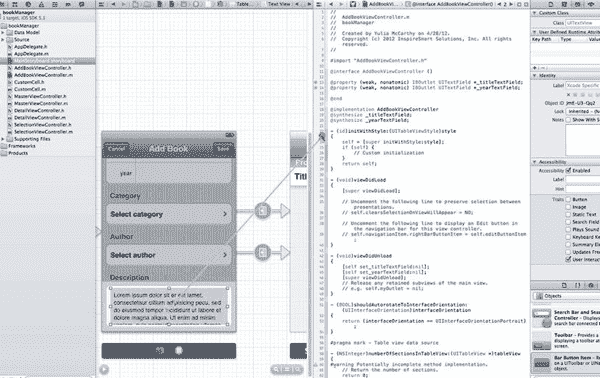

**图 8-23.** *为描述文本创建输出口。*

5. 这里你还需要再创建一个 `IBOutlet`。关键是要确保只点击文本字段（如图 8-23 所示），并且只点击一次。正确选中后，按住 Control 键拖拽到实现文件中，并将输出口命名为 `_descriptionTextView`，如下所示：

```
#import "AddBookViewController.h"

@interface AddBookViewController () {
    NSMutableDictionary *_bookDict;
}

@property (weak, nonatomic) IBOutlet UITextField *_titleTextField;
@property (weak, nonatomic) IBOutlet UITextField *_yearTextField;
@property (weak, nonatomic) IBOutlet UITextView *_descriptionTextView;
...
```

在此文本视图处于焦点时，你可以清空其中的文本内容，因为用户创建新书时会在其中输入数据。因此，仍在选中文本视图的状态下，前往属性检查器，删除文本框中的所有文本。

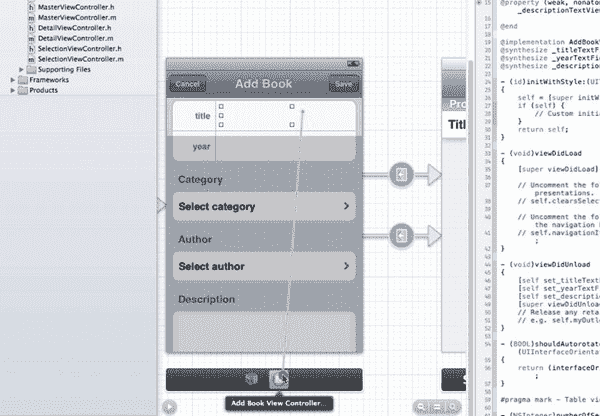

**图 8-24.** *为文本字段设置委托。*

6. 你需要将文本字段的委托设置为“添加图书”视图控制器，以便保存用户输入的数据。按住 Control 键，从标题文本字段拖拽到 Dock 中的表格视图控制器图标，如图 8-24 所示。会出现另一个连接对话框，包含分为两部分选项：Storyboard 转场和输出口。你需要将其设为输出口，因此选择嵌套在输出口选项下的“委托”。对年份文本字段重复完全相同的过程。

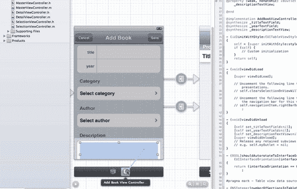

**图 8-25.** *为描述文本视图设置委托。*

7. 现在你需要为描述文本视图设置委托。按图 8-25 所示，从文本视图按住 Control 键拖拽。同样，你需要将其设为输出口，因此选择嵌套在输出口选项下的“委托”。

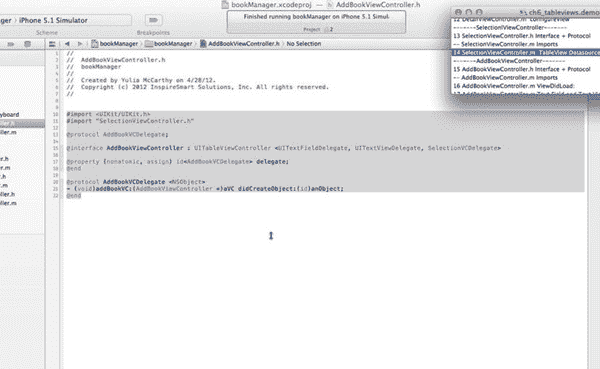

**图 8-26.** *编辑新的接口。*

8. 关闭助理编辑器，打开标准编辑器。打开 `AddBookViewController.h` 头文件，以便修改接口。删除默认出现的三行代码，替换为你在 DemoMonkey 中保存的下一个代码片段。从 DemoMonkey 中拖入“15 AddBookViewController.h 接口和协议”片段，放置在你刚删除原始头文件文本的位置。如图 8-26 所示。

你在头文件中包含的 `delegate` 属性和 `AddBookVCDelegate` 协议：

```
@property (nonatomic, assign) id<AddBookVCDelegate> delegate;
```

将用于在创建新的数据库实体时通知父视图控制器，该实体将被传递到实现文件以便显示，具体如下：

```
- (void)addBookVC:(AddBookViewController *)aVC didCreateObject:(id)anObject;
```

在忘记之前，我们来合成委托。

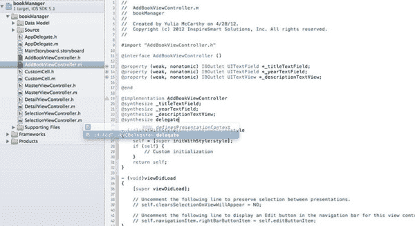

**图 8-27.** *合成委托。*

9. 打开 `AddBookViewController.m` 文件，按图 8-27 和以下代码所示，合成委托：

```
@interface AddBookViewController () {
    ...
    ...
    @end

@implementation AddBookViewController
    @synthesize _titleTextField;
    @synthesize _yearTextField;
    @synthesize _descriptionTextView;
    @synthesize delegate;
...
```

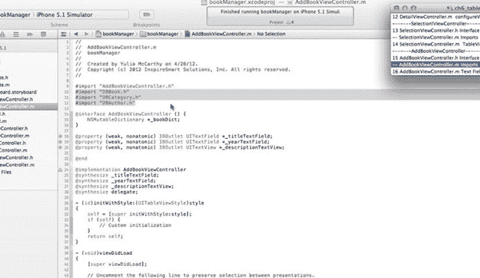

**图 8-28.** *添加可变字典并 #import 你的数据库实体。*

10. 当用户输入新图书的信息（如标题、年份和图书描述）时，你需要一个地方安全地临时存储这些数据，直到他们点击“保存”。实现方法有很多：其中一种是使用可变字典。这意味着你需要一个 `NSMutableDictionary` 实例变量，稍后你将从中创建新实体。将其命名为 `_bookDict`。在 `@interface` 下方的私有声明部分的一对花括号内声明它，如以下代码所示。你需要导入所有数据库实体。从 DemoMonkey 中拖入“-- AddBookViewController.m Imports”片段，放在 `#import` 下方，如图 8-28 和以下代码所示。

```
#import "AddBookViewController.h"
#import "DBBook.h"
#import "DBCategory.h"
#import "DBAuthor.h"

@interface AddBookViewController () {
    NSMutableDictionary *_bookDict;
}

@property (weak, nonatomic) IBOutlet UITextField *_titleTextField;
...
...
```

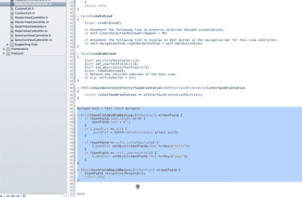

**图 8-29.** *引入文本字段委托方法。*

11. 由于这是一个静态表格视图，你无需实现 `dataSources` 或委托方法，因此删除从 `shouldAutorotateToInterface` 旋转方法结尾到 `@end` 之前的所有内容。在此位置引入你确实需要的内容，例如文本字段委托方法和文本视图委托方法，这将帮助你在用户输入信息时保存数据。从文本字段委托方法开始，从 DemoMonkey 中拖入“16 AddBookViewController.m Text Field Delegate Methods”片段，放在 `@end` 之前。它应该看起来像图 8-29 所示。

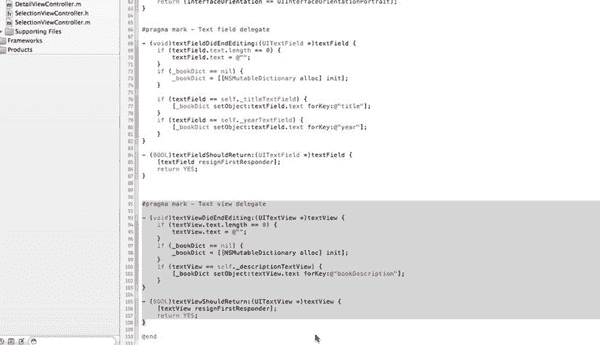

**图 8-30.** *引入文本视图委托方法。*


12. 继续处理文本视图的委托方法，从 DemoMonkey 中拖入“17 AddBookViewController.m Text View Delegate Methods”代码片段，并将其放置在 `@end` 与你在图 8-29 中放置的文本字段委托方法之间。如图图 8-30 所示。

**注意：** 你在上两步中添加的委托方法，是 UIKit 框架中声明的标准 `UITextFieldDelegate` 和 `UITextViewDelegate` 协议的一部分。这些方法是将文本字段和文本视图的编辑状态变更通知传递给你的最常见方式。在本例中，只需在每个 `UITextField`（或 `UITextView`）通知你指定为委托的 `AddBookViewController` 用户已完成编辑时，将用户输入的数据保存到 `_bookDict` 字典对象中即可。后者是通过 `textFieldDidEndEditing:`（`textViewDidEndEditing:`) 方法回调实现的，每当文本字段（文本视图）失去焦点，或按下 Return 键后以编程方式辞去第一响应者时，都会调用该方法。收集到 `_bookDict` 字典中的数据，最终会在编辑完成并按下“保存”按钮后保存到数据库中。

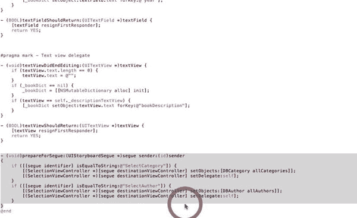

**图 8-31.** *实现 prepareForSegue: 方法。*

13. 仍然在 `AddBookViewController.m` 文件中，实现 `prepareForSegue:` 方法。从 DemoMonkey 中拖入“18 AddBookViewController.m prepareForSegue”代码片段，并将其放置在 `@end` 之前，如图图 8-31 所示。

在此方法中，你首先检查 segue 标识符：

```
if ([[segue identifier] isEqualToString:@"SelectCategory"]) {
    …
```

或

```
if ([[segue identifier] isEqualToString:@"SelectAuthor"]) {
    …
```

然后传递分类数组：

```
[(SelectionViewController *)[segue destinationViewController]
    setObjects:[DBCategory allCategories]];
```

或作者数组：

```
[(SelectionViewController *)[segue destinationViewController]
    setObjects:[DBAuthor allAuthors]];
```

给目标视图控制器，在此两种情况下目标视图控制器都是 `SelectionViewController`。

最后，你将 `SelectionViewController` 的委托设置为你的 `AddViewController`，以便一旦用户选择了作者或分类，你可以将该选择保存到你的 `_bookDict` 字典中：

```
[(SelectionViewController *)[segue destinationViewController]
    setDelegate:self];
```

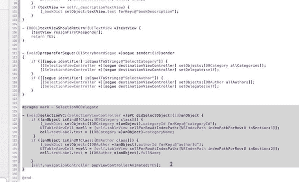

**图 8-32.** *实现用于选择分类或作者的委托方法。*

14. 继续关注用户在输入新书、作者和分类时需要用到的代码，你还有几个待办事项需要完成。一旦用户选择了分类或作者，你需要接收来自 `SelectionViewController` 的委托回调，因此需要实现这个委托方法。从 DemoMonkey 中拖入“19 AddBookViewController.m Choose Category of Author”代码片段，并将其放置在 `@end` 之前，如图图 8-32 所示。

你在 `SelectionViewController.h` 文件中定义了该委托方法：

```
- (void)selectionVC:(SelectionViewController *)aVC
    didSelectObject:(id)anObject;
```

此处，根据接收到的对象属于哪个类：

```
if ([anObject isKindOfClass:[DBCategory class]]) {
```

你将保存分类 ID：

```
[_bookDict setObject:((DBCategory *)anObject).categoryId forKey:@"categoryId"];
```

或保存作者 ID：

```
[_bookDict setObject:((DBAuthor *)anObject).authorId forKey:@"authorId"];
```

并显示分类名称：

```
cell.textLabel.text = ((DBCategory *)anObject).categoryName;
```

或显示作者名称：

```
cell.textLabel.text = ((DBAuthor *)anObject).fullName;
```

在相应的单元格中。完成所有操作后，你将视图控制器从栈中弹出：

```
[self.navigationController popViewControllerAnimated:YES];
```

以便用户可以返回到 `AddBookViewController` 并继续编辑书籍信息。

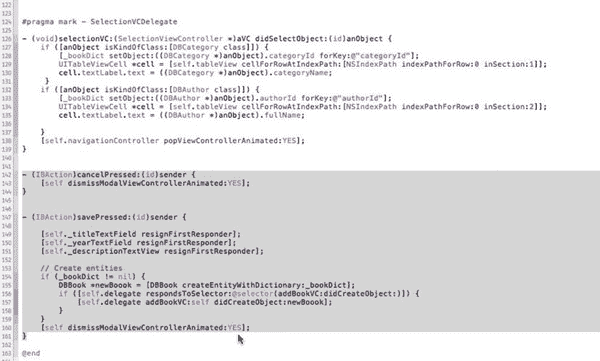

**图 8-33.** *为“保存”和“取消”按钮实现两个 IBAction。*

15. 在 `AddBookViewController.m` 中，你需要做的最后一件事是实现两个 IBAction，一个用于“保存”按钮，另一个用于“取消”按钮。从 DemoMonkey 中拖入“20 AddBookViewController.m IBAction”代码片段，并将其放置在 `@end` 之前，如图图 8-33 所示。

对于“取消”按钮，你有 `cancelPressed:` 方法：

```
- (IBAction)cancelPressed:(id)sender {
```

在此方法中，你将简单地关闭 `ModalViewController`，不保存任何更改：

```
[self dismissModalViewControllerAnimated:YES];
```

在 `savePressed:` 方法中：

```
- (IBAction)savePressed:(id)sender
```

如果有活动的第一响应者（标题、年份或描述文本字段），将辞去它们。这将关闭键盘（如果键盘仍显示）：

```
[self._titleTextField resignFirstResponder];
[self._yearTextField resignFirstResponder];
[self._descriptionTextView resignFirstResponder];
```

然后，你验证用户是否修改了任何字段，以确保书籍信息字典已创建且不为 nil。接着，你使用你在第 6 章中实现的 `DBBook` 辅助方法，根据 `_bookDict` 字典创建一个新实体：

```
if (_bookDict != nil) {
    DBBook *newBook = [DBBook createEntityWithDictionary:_bookDict];
```

最后，你通知委托该对象已创建，以便在需要时立即将其添加到书籍列表中：

```
if ([self.delegate respondsToSelector:@selector(addBookVC:didCreateObject:)]) {
    [self.delegate addBookVC:self didCreateObject:newBook];
```

然后关闭 `AddBookViewController`：

```
[self dismissModalViewControllerAnimated:YES];
```

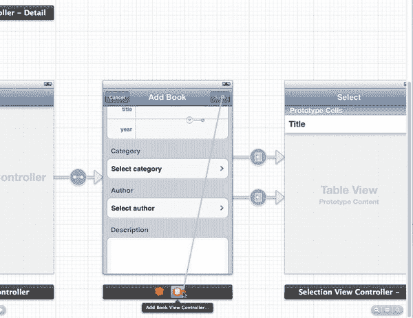

**图 8-34.** *连接你创建的两个 IBAction。*

16. 现在，你需要连接你为“编辑”和“取消”按钮创建的两个 IBAction。保存你的工作并打开故事板。转到“添加书籍”，按住 Control 键从“保存”按钮拖到“添加书籍视图控制器”，如图图 8-34 所示。

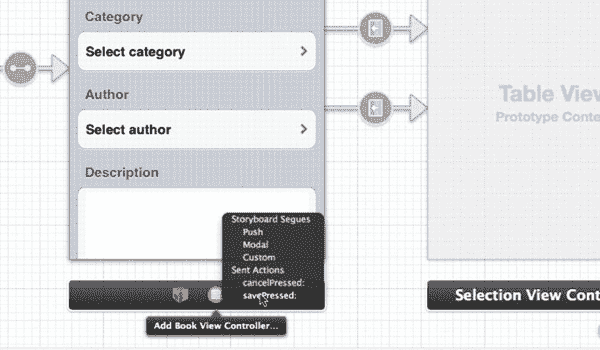

**图 8-35.** *选择 savePressed: 发送动作。*

17. 弹出窗口出现时，选择嵌套在“发送动作”部分内的 `savePressed:` 方法，如图图 8-35 所示。

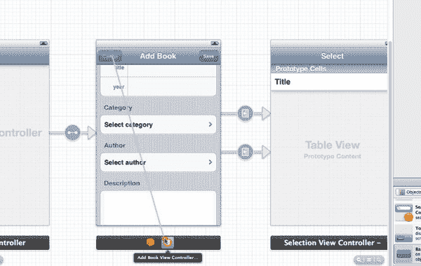

**图 8-36.** *对“取消”按钮重复此操作。*

18. 按住 Control 键从“取消”按钮拖到“添加书籍视图控制器”，如图图 8-36 所示。不过，这次弹出窗口出现时，选择嵌套在“发送动作”选项内的 `cancelPressed:` 选项，就像你在图 8-35 中所做的那样。


#### 连接图书场景

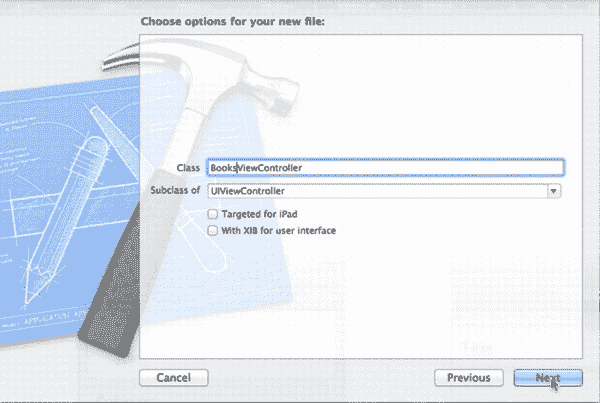

**图 8-37.** *创建 BookViewController。*

1. 现在让我们继续处理下一个视图控制器。按下 +N 创建一个新的子类，在选择 Objective-C 类后，点击“下一步”。将其命名为 `BooksViewController`，并将其设置为 `UIViewController` 的子类，如图 8-37 所示。按照本书一贯的做法，将其保存在默认位置。完成后，返回 Storyboard。

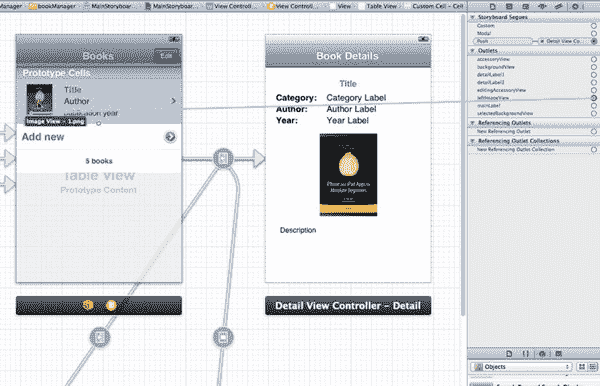

**图 8-38.** *将 leftImageView 输出口连接到图书封面图片。*

2. 打开 Storyboard 后，导航到“Books”场景。请记住，在图书表视图中，你使用的是自定义单元格，因此需要将输出口连接到先前在步骤 1-4 中创建的自定义单元格子类。选择包含图书图片、标题等内容的顶部单元格，然后打开标识检查器，在“Class”字段中点击“CustomCell”（如果需要回顾，请参考图 8-18 或 8-43）。在仍选中单元格原型的情况下，打开连接检查器以查看所有可用输出口的列表。从 `leftImageView` 输出口拖出，并将其连接到图书的封面图片，在本例中当前是 `1.png`。如图 8-38 所示。该输出口将使你能够连接到 SQLite 数据库，从而可以显示数据库中保存的任何关联图片，而不仅仅是静态的 `1.png`。

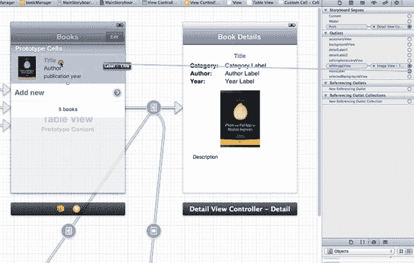

**图 8-39.** *将 mainLabel 输出口连接到标题。*

3. 从 `mainLabel` 输出口按住 Control 键拖出，并将其连接到“标题”，如图 8-39 所示。

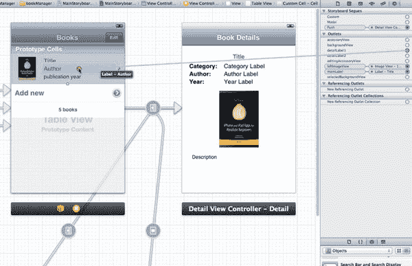

**图 8-40.** *将 detailLabel1 输出口连接到作者。*

4. 从 `detailLabel1` 输出口按住 Control 键拖出，并将其连接到“作者”，如图 8-40 所示。

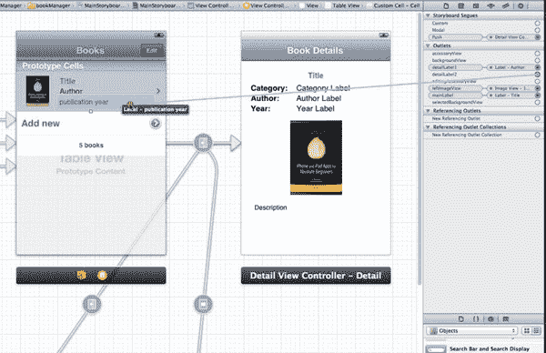

**图 8-41.** *将 detailLabel2 输出口连接到出版年份。*

5. 从 `detailLabel2` 输出口按住 Control 键拖出，并将其连接到“出版年份”，如图 8-41 所示。保存文件，然后继续。

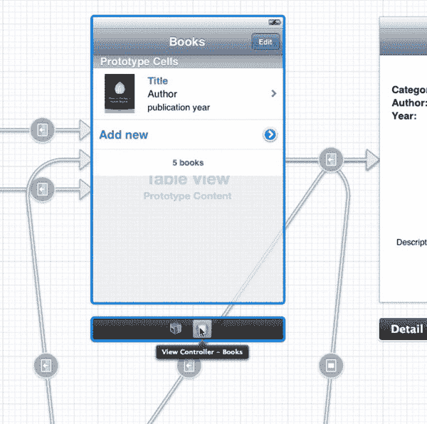

**图 8-42.** *选择视图控制器。*

6. 你还需要为表视图和图书计数标签创建 `IBOutlet`。因此，选择“视图控制器 - 图书”，如图 8-42 所示，以便为其分配一个类。

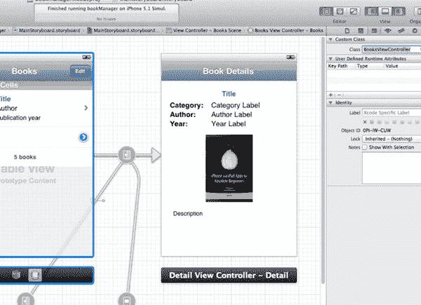

**图 8-43.** *将类命名为 BooksViewController。*

7. 在仍选中“视图控制器 - 图书”的情况下，在标识检查器中，点击“Class”字段中的 `BooksViewController`，如图 8-43 所示。

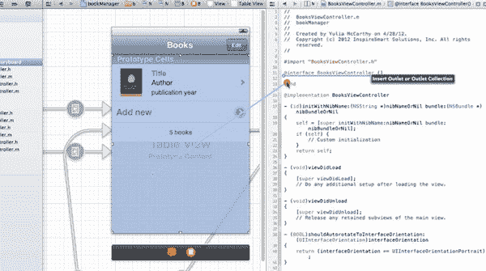

**图 8-44.** *连接到实现文件。*

8. 打开助理编辑器，并确保 `BooksViewController.m` 文件是显示在右侧面板中的 Xcode 文件。在图书部分点击一次表视图，然后按住 Control 键拖到实现文件中，在 `@interface` 下方释放，如图 8-44 所示。在弹出的对话框中，将其命名为 `_tableView`，并保持输出口的其他所有默认设置不变。

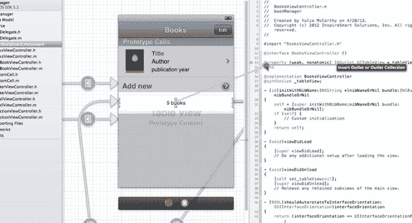

**图 8-45.** *连接 _countLabel 输出口。*

9. 现在选择图书计数器，按住 Control 键拖到实现文件中，将其放置在先前输出口的正下方，如图 8-45 所示。将其命名为 `_countLabel`，并再次保持默认设置不变。保存你的工作。

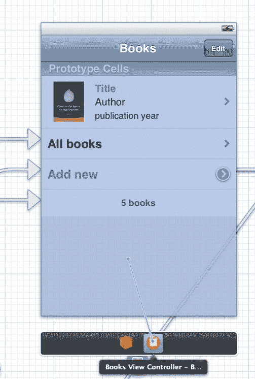

**图 8-46.** *按住 Control 键拖到 Dock 中的视图控制器图标。*

10. 最后，按住 Control 键从表视图拖到 Dock 中的视图控制器图标，如图 8-46 所示。


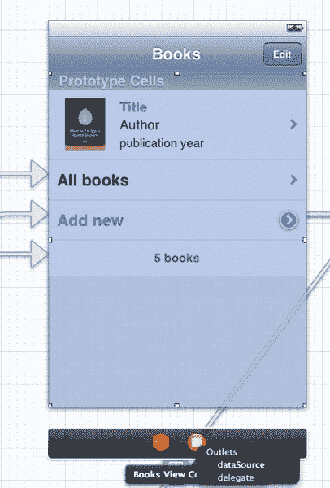

**图 8-47.** *连接 dataSource 输出口*

11. 在出现的对话框连接窗口中，选择嵌套在 Outlets 选项中的 `dataSource`，如图 8-47 所示。重复完全相同的步骤来连接 Table View 的 `delegate` 输出口。

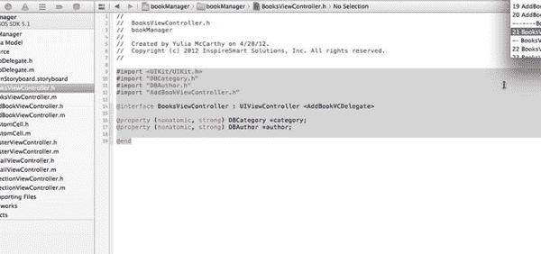

**图 8-48.** *添加 `DBCategory` 和 `DBAuthor` 类型的两个附加属性*

12. 打开 Standard 编辑器并打开 `BooksViewController.h` 文件。选中全部三行默认代码并将其删除。您需要向 `BooksViewController` 添加两个附加属性：categories 和 author。将 DemoMonkey 中的“21 BooksViewController.h Interface”代码片段拖入，并将其放置在视图主体中，如图 8-48 所示。

这两个新属性是 category 和 author：

```
@property (nonatomic, strong) DBCategory *category;
@property (nonatomic, strong) DBAuthor *author;
```

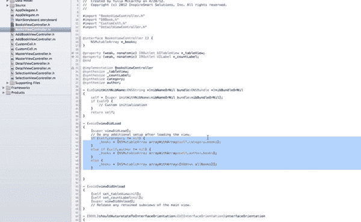

**图 8-49.** *合成、导入头文件及其他调整*

13. 保存您的工作，离开 `BooksViewController.h`，并打开其实现文件。为 `_tableView`、`_countLabel`、`category` 和 `author` 编写合成语句。此外，您需要一个变量来存储书籍。同样，使用可变数组并将其命名为 `_books`。为此，请将其声明添加到 `@interface` 下方的私有接口部分。确保将其括在花括号中：

```
@interface BooksViewController () {
    NSMutableArray *_books;
}
```

现在您需要导入必要的头文件。将 DemoMonkey 中的“-- BooksViewController.h Imports”代码片段拖入，并将其直接放置在唯一的现有头文件 `#import "BooksViewController.h"` 下方，如图 8-49 所示。

最后，在 `viewDidLoad` 中，您将用 `DBBook` 对象填充 books 数组。将 DemoMonkey 中的“22 BooksViewController.m ViewDidLoad”代码片段拖入，并将其放置在 `viewDidLoad` 方法中 `//Do any additional setup …` 注释的正下方，如图 8-49 和下文所示：

```
- (void)viewDidLoad
{
    [super viewDidLoad];
    // Do any additional setup after loading the view.

    if (self.category != nil) {
        _books = [NSMutableArray arrayWithArray:self.category.books];
    }
    else if (self.author != nil) {
        _books = [NSMutableArray arrayWithArray:self.author.books];
    }
    else {
        _books = [NSMutableArray arrayWithArray:[DBBook allBooks]];
    }
}
```

您可以看到，您正在使用 category 属性 `self.category` 和 author 属性 `self.author` 来决定需要显示哪些书籍：属于指定类别或选定作者的书籍。但是，如果用户未定义这些属性中的任何一个，您将显示 SQLite 数据库中已有的所有书籍：

```
else {
    _books = [NSMutableArray arrayWithArray:[DBBook allBooks]];
}
```

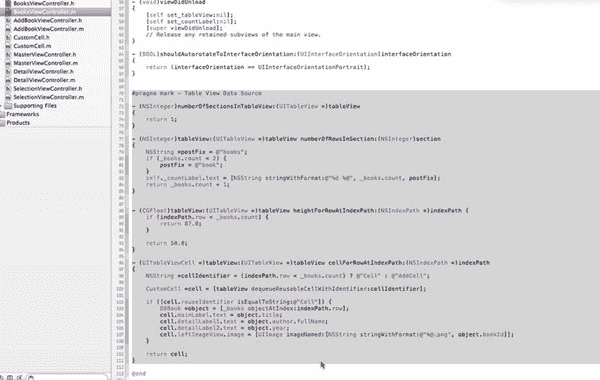

**图 8-50.** *设置 Table View 以显示书籍*

14. 要在 Table View 中显示书籍数据，您必须实现委托方法。将 DemoMonkey 中的“23 BooksViewController.m Display Books”代码片段拖入，并将其放置在 `@end` 之前，如图 8-50 所示。

您希望 Table View 的最底部单元格显示静态内容（“Add new”单元格），该内容将始终可见，并且点击此单元格将允许用户创建新的书籍记录。

为了实现这一点，您在以下方法中做了一个小技巧：

```
- (NSInteger)tableView:(UITableView *)tableView
numberOfRowsInSection:(NSInteger)section
```

方法是通过在 `_books` 数组中对象数量的基础上为 Table View 增加额外的一行：

```
return _books.count + 1;
```

这保证您在 Table View 中始终至少有一个单元格，因此您只需让 Table View 根据特定条件从 Storyboard 加载正确的原型单元格即可。

请注意，在此方法中您还会更新 `_countLabel` 的文本——这样它始终保持最新。

您通过其标识符 `"Cell"` 或 `"AddCell"`（您在设计时已指定）来出列相应的单元格：

```
NSString *cellIdentifier = (indexPath.row < _books.count) ? @"Cell" :
    @"AddCell";
    CustomCell *cell = [tableView
    dequeueReusableCellWithIdentifier:cellIdentifier];
```

根据重用标识符，相应地更新单元格的内容：

```
if ([cell.reuseIdentifier isEqualToString:@"Cell"]) {
    DBBook *object = [_books objectAtIndex:indexPath.row];
    cell.mainLabel.text = object.title;
    cell.detailLabel1.text = object.author.fullName;
    cell.detailLabel2.text = object.year;
    cell.leftImageView.image = [UIImage imageNamed:[NSString
    stringWithFormat:@"%@.png", object.bookId]];
}
```

**注意：** 单元格的重用标识符是您告诉 Table View 对于某一行要出列并显示哪种 Storyboard 原型单元格的方式。因此，正确设置标识符非常重要。如果标识符未设置或无效，`dequeueReusableCellWithIdentifier:cellIdentifier` 方法将返回 nil，并且应用程序会崩溃。这是在 Storyboard 中原型化 Table View 单元格时最常见的错误之一。

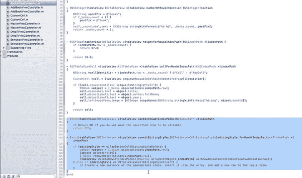

**图 8-51.** *设置编辑模式*

15. 添加允许用户编辑 Table View 和删除书籍记录的方法。将 DemoMonkey 中的“24 BooksViewController.m Delete Books”代码片段拖入，并将其放置在 `@end` 之前，如图 8-51 所示。此处您实现了负责 Table View 编辑的标准 `UITableViewDataSource` 方法。当用户在编辑模式下点击 Table View 的标准删除按钮时，他们将获得该行对应的 `DBBook` 对象。这允许用户从 `_books` 数组中移除该对象，然后使用 MagicalRecord API 从数据库中删除该实体。最后，通过动画移除该记录的 Table View 行，这一切都由 Table View 本身优雅地为您处理：

```
if (editingStyle == UITableViewCellEditingStyleDelete) {
    DBBook *object = [_books objectAtIndex:indexPath.row];
    [object deleteEntity];
    [_books removeObjectAtIndex:indexPath.row];
    [tableView deleteRowsAtIndexPaths:[NSArray arrayWithObject:indexPath]
    withRowAnimation:UITableViewRowAnimationFade];
}
```

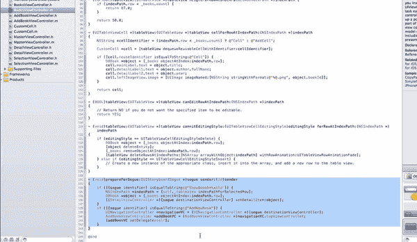

**图 8-52.** *实现 `prepareForSegue:` 方法*

16. 接下来，将 DemoMonkey 中的“25 BooksViewController.m prepareForSegue:”代码片段拖入，并将其放置在 `@end` 之前，如图 8-52 所示。在 `prepareForSegue:` 方法中，您查找两个不同的 Segue 标识符：ShowBookDetails 标识符和 AddNewBook 标识符。在第一种情况下，您只需要将选定的 `DBBook` 对象发送到目标视图控制器，即您的设置中的 `DetailViewController`：

```
NSIndexPath *indexPath = [self._tableView indexPathForSelectedRow];
DBBook *object = [_books objectAtIndex:indexPath.row];
[(DetailViewController *)[segue destinationViewController]
setDetailItem:object];
```

在第二种情况下，您需要设置一个代理，以便您可以从 `AddBookViewController` 获取新添加的对象：

```
AddBookViewController *addBookVC = (AddBookViewController
*)navigationVC.topViewController;
[addBookVC setDelegate:self];
```


当然，这是根据您的要求进行排版优化后的 Markdown 内容：

同时，请记住你的`AddBookViewController`是嵌入在导航控制器（Navigation Controller）中的。但这里有个问题：为了到达`AddBookViewController`，你必须遵循如下所示的导航控制层级结构：

```
AddBookViewController *addBookVC = (AddBookViewController
    *)navigationVC.topViewController;
```

**注意：** 这是一个非常常见的陷阱。请记住，每当你的 Segue 的主要目标视图控制器是一个导航控制器时，你必须访问它的`topViewController`并将其转换为正确的类，这样才能到达你原本打算为其准备 Segue 的视图控制器。

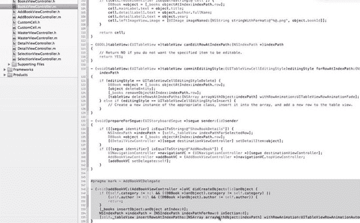

**图 8-53.** *实现代理方法以接收新增的图书对象。*

17.  接下来，你需要为`AddBooksViewController`实现代理方法，通过该方法可以访问用户创建的对象并将其添加到表格视图中。从 DemoMonkey 拖入“26 BooksViewController.m Add Books”代码片段，并将其放置在`@end`之前，如图 8-53 所示。在这个`addBookVC:didCreateObject:`方法中，你正在检查当前是否按特定类别或特定作者显示书籍，如果是，则检查即将添加到表格视图中的图书是否属于这些组之一：

```
self.category != nil && ((DBBook *)anObject).category != self.category) ||
    self.author != nil && ((DBBook *)anObject).author != self.author))
```

如果不是这种情况，则不更新当前图书列表；否则，如果对象通过了这些测试，则在表格视图的最顶部添加一个新行：

```
NSIndexPath *indexPath = [NSIndexPath indexPathForRow:0 inSection:0];
    [self._tableView insertRowsAtIndexPaths:[NSArray arrayWithObject:indexPath]
    withRowAnimation:UITableViewRowAnimationAutomatic];
```

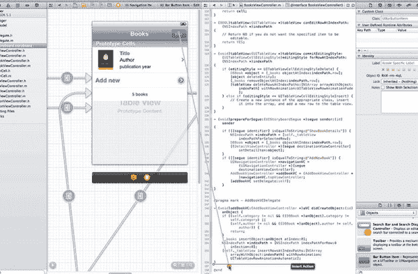

**图 8-54.** *从编辑按钮（Edit）拖拽连线以创建 IBAction。*

18.  最后，你需要为导航栏中的编辑按钮（Edit）指定一个`IBAction`。请记住，一旦用户点击此编辑按钮，表格视图将切换到编辑模式，用户将能够删除单元格。因此，打开 Storyboard 并导航到 Books Table View。然后打开 Assistant 编辑器，确保右侧面板是`BooksViewController`的实现文件。单击其内部并滚动到代码底部。现在，从编辑按钮（Edit）按住 Control 拖拽到`@end`之前，如图 8-54 所示。

在弹出的操作对话框中，将其命名为`editPressed`。现在，在单击 Connect 之前，请确保你从 Type 字段的下拉菜单中选择`UIBarButtonItem`（因为你之前一直保留所有默认设置）。在继续之前，请确保你的`IBAction`如下所示：

```
- (IBAction)editPressed:(UIBarButtonItem *)sender {
    }
    @end
```

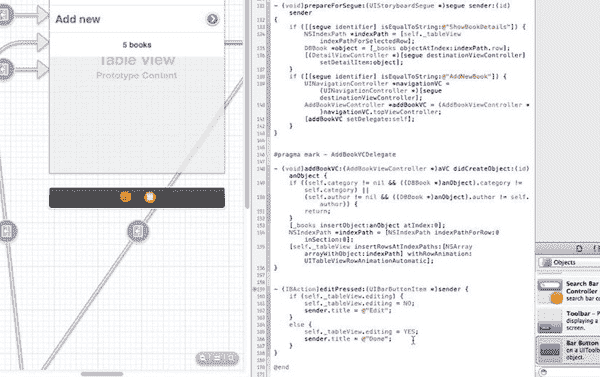

**图 8-55.** *使 IBAction 能够切换状态。*

19.  在`sender {`之后的第一个大括号处按回车，在开始和结束大括号之间创建一行，以便你可以在方法内部编写代码。你需要编写代码，以便可以切换表格视图的编辑模式。输入以下代码：

```
- (IBAction)editPressed:(UIBarButtonItem *)sender {
    if (self._tableView.editing) {
        self._tableView.editing = NO;
        sender.title = @"Edit";
    }
    else {
        self._tableView.editing = YES;
        sender.title = @"Done";
    }
}
```

详情请参考图 8-55。

##### 为分类场景添加代码

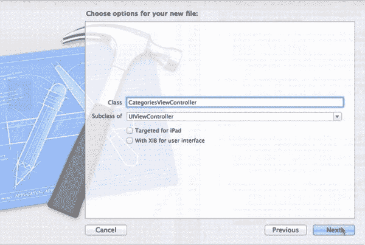

**图 8-56.** *创建 CategoriesViewController。*

1.  你将创建的下一个视图控制器是分类视图控制器。按 Command+N 创建一个新的子类，在选择 Objective-C 类后，点击 Next。将其命名为`CategoriesViewController`，并将其设为`UIViewController`的子类，如图 8-56 所示。将其保存在默认位置。

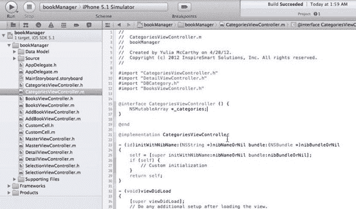

**图 8-57.** *导入头文件并创建一个数组来保存分类。*

2.  打开`CategoriesViewController.m`文件。从 DemoMonkey 拖入“-- CategoriesViewController.m Imports”代码片段，并将其放置在`#import "CategoriesViewController.h"`行的下方。

你还需要一个数组来存储数据库中的对象。你可以将其添加到私有的`@interface`部分。在一组花括号内输入`NSMutableArray *_categories;`，如图 8-57 和下文所示：

```
@interface CategoriesViewController () {
    NSMutableArray *_categories;
}
```

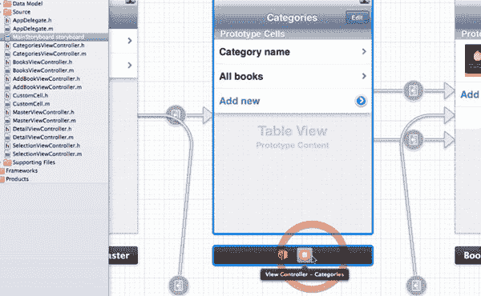

**图 8-58.** *选择 View Controller – Categories。*

3.  现在你需要在分类场景（Categories Scene）中为表格视图创建一个 Outlet。打开 Storyboard 并导航到 View Controller – Categories。单击它以将其选中，如图 8-58 所示。

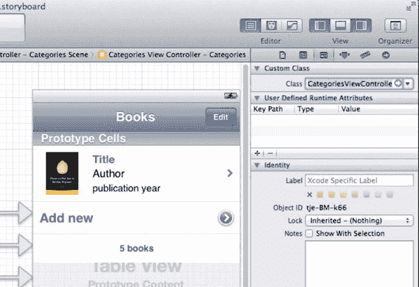

**图 8-59.** *为分类场景设置 Class。*

4.  选中 View Controller – Categories 后，打开 Identity Inspector 并将 Class 设置为`CategoriesViewController`，如图 8-59 所示。

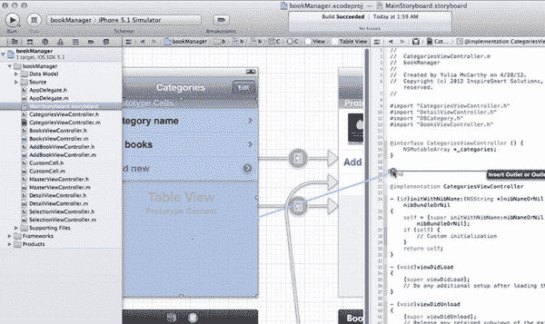

**图 8-60.** *创建 Table View 的 Outlet。*

5.  打开 Assistant 编辑器，确保在 Assistant 的右侧面板中显示的是`CategoriesViewController`实现文件。现在，从 Table View 按住 Control 拖拽到`@end`之前，如图 8-60 所示。

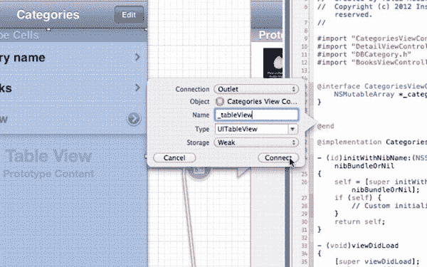

**图 8-61.** *将 Outlet 命名为 _tableView。*

6.  将 Outlet 命名为`_tableView`，如图 8-61 所示。点击 Connect 并保存所有内容。

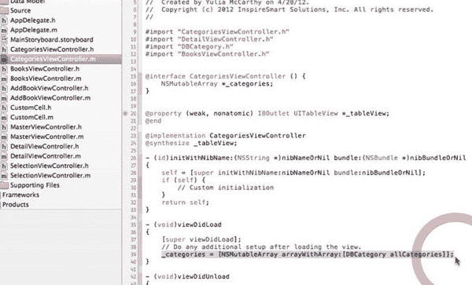

**图 8-62.** *用数据库中的对象填充 _categories 数组。*

7.  打开 Standard 编辑器，然后打开`CategoriesViewController.m`文件。你将在`viewDidLoad:`调用时用数据库中的对象填充`_categories`数组。从 DemoMonkey 拖入“27 CategoriesViewController.m ViewDidLoad”代码片段，并将其放置在`viewDidLoad:`方法内部，如图 8-62 和下文所示：

```
- (void)viewDidLoad
{
    [super viewDidLoad];
      // Do any additional setup after loading the view.
    _categories = [NSMutableArray arrayWithArray:[DBCategory allCategories]];
}
```

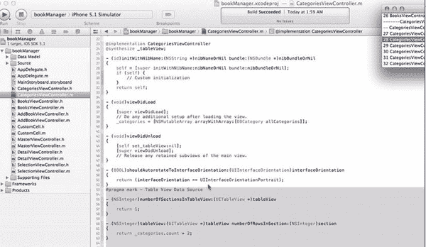

**图 8-63.** *在 Table View 中显示项目。*

8.  接下来，你需要在`CategoriesViewController`中显示项目。从 DemoMonkey 拖入“28 CategoriesViewController.m Display Categories”代码片段，并将其放置在`@end`之前，如图 8-63 所示。

在 Table View 中显示项目的方式与你之前在`BooksViewController`中所做的非常相似，唯一的区别在于，在`(NSInteger)tableView:(UITableView *)tableView numberOfRowsInSection:(NSInteger)section`方法中，除了数据库中拥有的图书分类数量之外，你还将在表格视图的末尾显示两个静态行：

```
return _categories.count + 2;
```

因此，在显示单元格时，你需要检查两个额外的单元格复用标识符——`AllCell`和`AddCell`——以便从 Storyboard 中加载正确的单元格。


```objc
- (UITableViewCell *)tableView:(UITableView *)tableView
    cellForRowAtIndexPath:(NSIndexPath *)indexPath
{
    static NSString *cellIdentifier = nil;
    if (indexPath.row < _categories.count) {
        cellIdentifier = @"Cell";
    }
    else if (indexPath.row == _categories.count) {
        cellIdentifier = @"AllCell";
    }
    else {
        cellIdentifier = @"AddCell";
    }
```
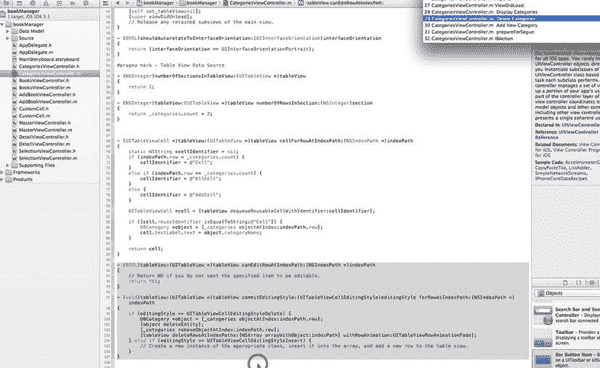

**图 8-64.** 引入用于删除类别的代码。

9.  现在，你需要引入用于删除类别的代码。将 DemoMonkey 中的“29 CategoriesViewController.m Delete Categories”代码片段拖入，并放置到 `@end` 之前，如图 8-64 所示。你可能会注意到，这与图 8-51 中的“Delete Books”几乎完全相同。

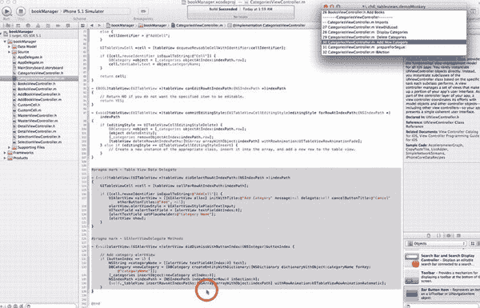

**图 8-65.** 添加一个新类别。

10. 不过，添加新类别稍有不同。由于你只需捕获类别名称，因此不需要一个全新的视图控制器——你可以使用 `UIAlertView` 来完成。将 DemoMonkey 中的“30 CategoriesViewController.m Add New Category”代码片段拖入，并放置到 `@end` 之前，如图 8-65 所示。

在这里，当用户点击“添加新”单元格时

```objc
if ([cell.reuseIdentifier isEqualToString:@"AddCell"]) {
```

你只需弹出一个标准的 `UIAlertView`，其中包含一个内置的 `UITextField`：

```objc
UIAlertView *alertView = [[UIAlertView alloc] initWithTitle:@"添加类别"
    message:nil delegate:self cancelButtonTitle:@"取消" otherButtonTitles:@"添加",
    nil];
alertView.alertViewStyle = UIAlertViewStylePlainTextInput;
UITextField *alertTextField = [alertView textFieldAtIndex:0];
```

然后，你需要实现 `UIAlertViewDelegate` 方法：

```objc
- (void)alertView:(UIAlertView *)alertView
    didDismissWithButtonIndex:(NSInteger)buttonIndex
```

将类别保存到数据库，并将其添加到 `_categories` 数组中：

```objc
DBCategory *newCategory = [DBCategory createEntityWithDictionary:[NSDictionary
    dictionaryWithObject:categoryName forKey:@"categoryName"]];
[_categories insertObject:newCategory atIndex:0];
```

在表视图中插入一个新行：

```objc
[self._tableView insertRowsAtIndexPaths:[NSArray arrayWithObject:indexPath]
    withRowAnimation:UITableViewRowAnimationAutomatic];
```
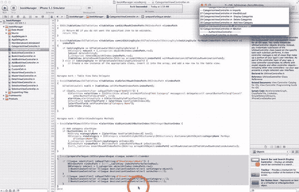

**图 8-66.** 实现 `prepareForSegue:` 方法。

11. 接下来，你将实现 `prepareForSegue:` 方法。将 DemoMonkey 中的“31 CategoriesViewController.m PrepareForSegue”代码片段拖入，并放置到 `@end` 之前，如图 8-66 所示。

在通过故事板设计 UI 时，你为类别场景指定了两个转场，你需要区分它们：

```objc
([[segue identifier] isEqualToString:@"ShowCategoryBooks"])
```

以及

```objc
if ([[segue identifier] isEqualToString:@"ShowAllBooks"])
```

在第一种情况下，你将目标视图控制器（即 `BooksViewController`）的 `Category` 属性设置为当前选中的类别，并将其 `Author` 属性重置为 `nil`，以防之前已经赋过值：

```objc
[(BooksViewController *)[segue destinationViewController] setCategory:object];
[(BooksViewController *)[segue destinationViewController] setAuthor:nil];
```

这样，你就能确保 `BooksViewController` 只显示属于所选类别的书籍。

在第二种情况下，你将 `Category` 和 `Author` 都设置为 `nil`：

```objc
[(BooksViewController *)[segue destinationViewController] setCategory:nil];
[(BooksViewController *)[segue destinationViewController] setAuthor:nil];
```

在这种情况下，你或许还记得，`BooksViewController` 的 `viewDidLoad` 将会加载你拥有的所有书籍。

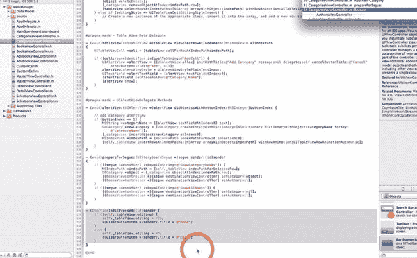

**图 8-67.** 为编辑按钮设置另一个 IBAction。

12. 最后，你将创建一个与之前为 `BooksViewController` 创建的完全相同的 `IBAction` 方法，该方法用于切换表视图的编辑模式。将 DemoMonkey 中的“32 CategoriesViewController.m IBAction”代码片段拖入，并放置到 `@end` 之前，如图 8-67 所示。

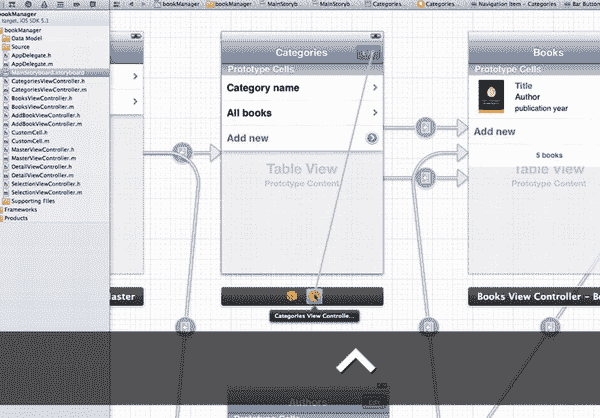

**图 8-68.** 将编辑按钮连接到类别视图控制器。

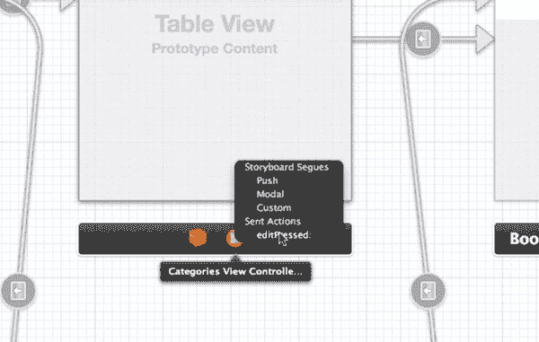

**图 8-69.** 从“已发送操作”中选择 `editPressed:`。

13. 你只需要将其连接到视图控制器上的编辑按钮即可。在故事板中，将编辑按钮连接到类别视图控制器，如图 8-68 和图 8-69 所示。


##### 实现作者场景

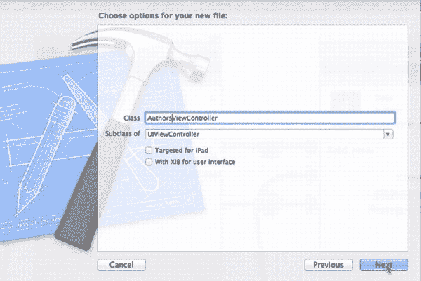

**图 8-70.** *创建最后一个视图控制器类！*

1.  你需要创建的最后一个视图控制器是作者视图控制器。按下 `⌘N` 创建一个新子类，在选择 Objective-C 类后，点击“下一步”。将其命名为 `AuthorsViewController`，并使其成为 `UIViewController` 的子类，如图 8-70 所示。

**注意：** 接下来关于作者场景的几个步骤与你在类别场景中所做的操作相同，因此这些说明将很简短。但我们会提供图片。

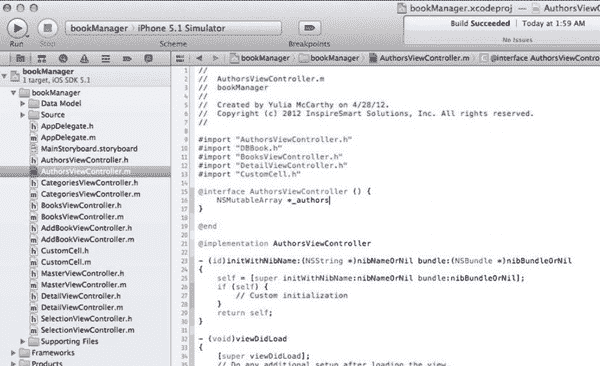

**图 8-71.** *拖入导入语句、类别和作者显示。*

2.  打开 `AuthorsViewController.m` 文件，从 DemoMonkey 拖入“-- AuthorsViewController.m Imports”代码片段，并将其放置在 `#import "AuthorsViewController.h"` 的正下方，如图 8-71 所示。这些导入语句是 `DBBook.h`、`BooksViewController.h`、`DetailViewController.h` 和 `CustomCell.h`。像处理类别时那样创建 `mutableArray`。

将 `@interface AuthorsViewController ()` 更改为：

```
@interface AuthorsViewController () {
    NSMutableArray *_authors;
}
```

从 DemoMonkey 拖入“33 AuthorsViewController.m ViewDidLoad”代码片段，并将其放置在 `viewDidLoad:` 方法内部，就像你在类别场景中所做的那样。

从 DemoMonkey 拖入“34 AuthorsViewController.m Display Authors”代码片段，并将其放置在 `@end` 之前。

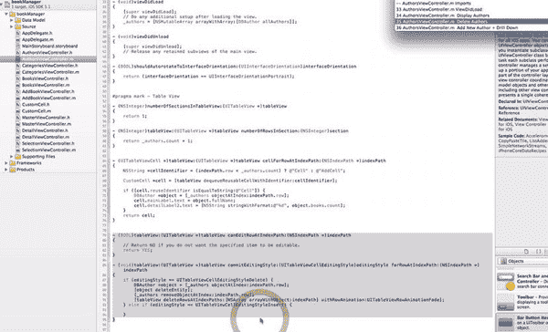

**图 8-72.** *拖入删除作者代码片段。*

3.  从 DemoMonkey 拖入“35 AuthorsViewController.m Delete Authors”代码片段，并将其放置在 `@end` 之前，如图 8-72 所示。

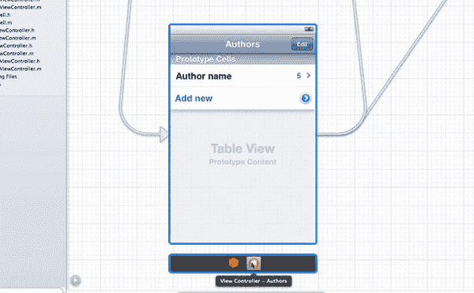

**图 8-73.** *为表格视图创建输出口。*

4.  你还需要为表格视图创建一个输出口。打开 Storyboard 并导航到作者场景。点击一次“View Controller – Authors”以选中它，如图 8-73 所示。

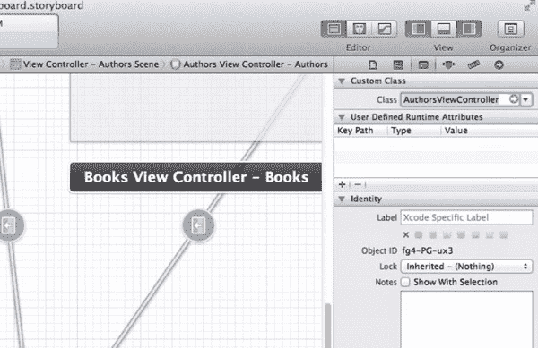

**图 8-74.** *设置作者场景的类。*

5.  选中“View Controller – Authors”后，将 Class 设置为 `AuthorsViewController`，如图 8-74 所示。

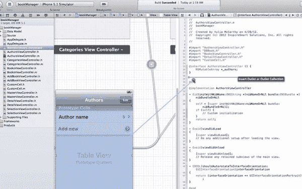

**图 8-75.** *打开助理编辑器并创建输出口。*

6.  打开助理编辑器，确保右侧窗格中打开的是 `AuthorsViewController.m`，然后从“Authors Table View”拖拽到 `AuthorsViewController.m` 以创建输出口，如图 8-75 所示。

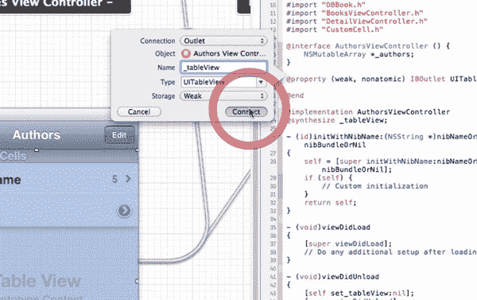

**图 8-76.** *将输出口命名为 `_tableView`。*

7.  一旦出现“连接”弹出窗口，将输出口命名为 `_tableView`，如图 8-76 所示。

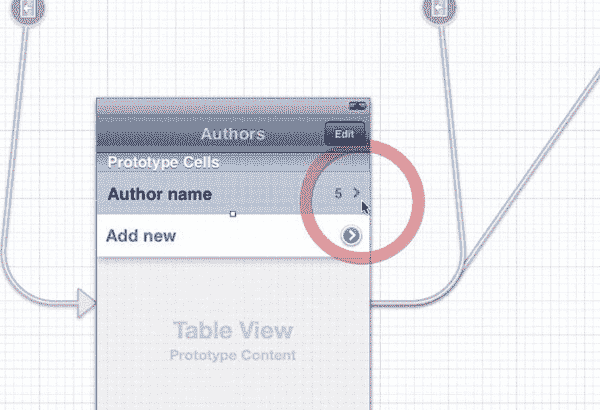

**图 8-77.** *将输出口连接到你的自定义表格视图单元格。*

8.  关闭助理编辑器，返回标准编辑器，并将输出口连接到你的自定义表格视图单元格。点击一次单元格，如图 8-77 所示。

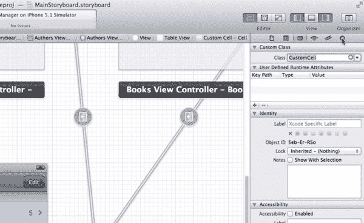

**图 8-78.** *将单元格的 Class 设置为 `CustomCell`。*

9.  将其 Class 设置为 `CustomCell`，如图 8-78 所示。

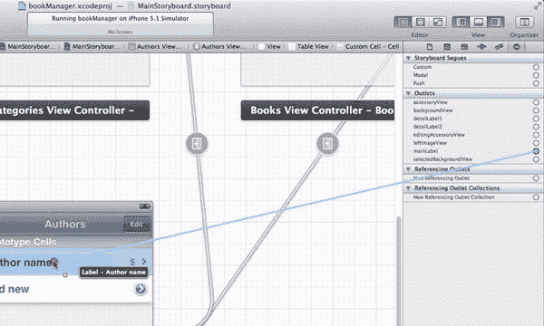

**图 8-79.** *将 `mainLabel` 连接到“作者姓名”。*

10.  在顶部单元格仍被选中的状态下，打开连接检查器，并将 `mainLabel` 输出口连接到“作者姓名”标签，如图 8-79 所示。

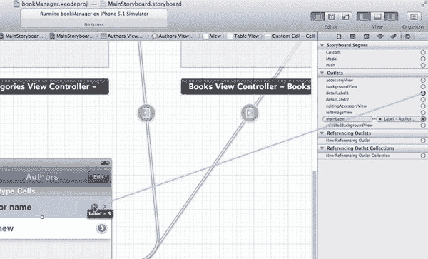

**图 8-80.** *连接 `detailLabel1`。*

11.  将 `detailLabel1` 连接到“Label – 5”，如图 8-80 所示。

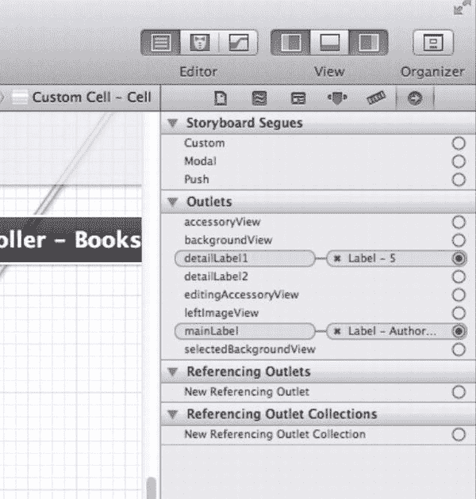

**图 8-81.** *最终连接*

12.  你的最终连接应该与我们的类似，如图 8-81 所示。

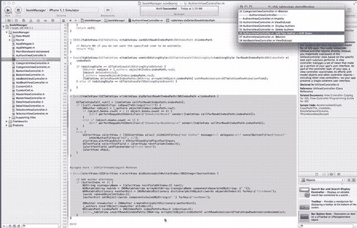

**图 8-82.** *添加新作者（略有变化）。*

13.  现在返回到 `AuthorsViewController.m`，从 DemoMonkey 拖入“36 AuthorsViewController.m Add NewAuthors + Drill Down”代码片段。将其放置在 `@end` 之前，如图 8-82 所示。你可能还记得，在设计此场景时，你创建了两个源自“作者视图控制器”本身（而非某个单元格或按钮）的 Segue。因此，当满足特定条件时，你必须在代码中手动执行这些 Segue。在本例中，当用户选择一个表格视图单元格时，你将执行这些 Segue。在 `tableView:didSelectRowAtIndexPath:` 方法中，根据所选作者拥有的书籍数量，手动执行带有特定标识符（`ShowAuthorBooks` 或 `ShowAuthorBookDetail`）的 Segue：

```
if (object.books.count > 1 || object.books.count == 0) {
    [self performSegueWithIdentifier:@"ShowAuthorBooks" sender:[tableView
    cellForRowAtIndexPath:indexPath]];
}
else if (object.books.count == 1) {
    [self performSegueWithIdentifier:@"ShowAuthorBookDetail" sender:[tableView
    cellForRowAtIndexPath:indexPath]];
}
```

如果恰好有一本书，你将执行 `ShowAuthorBookDetail` Segue 来显示该本书的书籍详情场景；如果作者有多本书或没有书，你将执行 `ShowAuthorBooks` Segue 来显示书籍场景，其中包含与此作者关联的书籍列表。

如果所选单元格的标识符不是 *Cell*（也就是说剩下 `AddCell` 这个选项），你将弹出一个带有文本字段和“添加”按钮的 `UIAlertView`，这与你在类别场景中所做的几乎相同。一旦用户点击警告视图的“添加”按钮，你将使用提供的名称创建一个新的作者实体。然后，将新作者添加到 `_authors` 数组，并在表格视图的顶部插入一个新行。

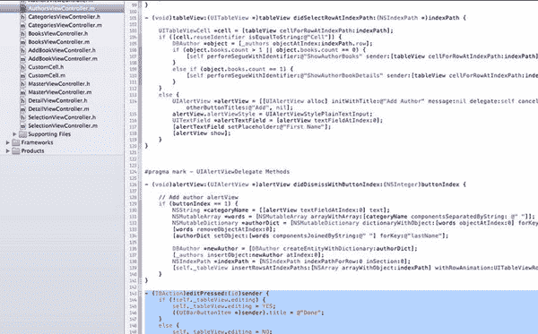

**图 8-83.** *IBAction 与类别场景相同*

14.  这里的“编辑”按钮的 `IBAction` 与类别场景中的相同。它以完全相同的方式切换作者表格视图的编辑模式。从 DemoMonkey 拖入“37 AuthorsViewController.m IBAction”代码片段，并将其放置在 `@end` 之前，如图 8-83 所示。

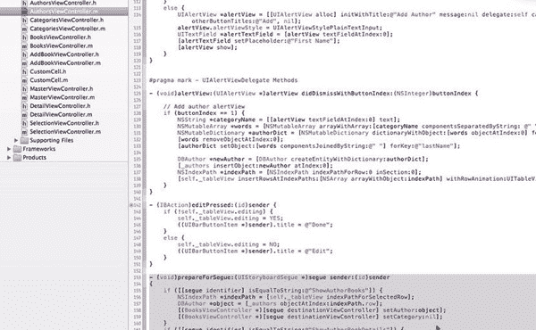

**图 8-84.** *添加 `prepareForSegue:` 方法的实现。*

15.  最后，你将实现 `prepareForSegue:` 方法。从 DemoMonkey 拖入“38 AuthorsViewController.m prepareForSegue:”代码片段，并将其放置在 `@end` 之前，如图 8-84 所示。这里的代码是你为 `CategoriesViewController` 和 `BooksViewController` 所写实现的一个混合体。

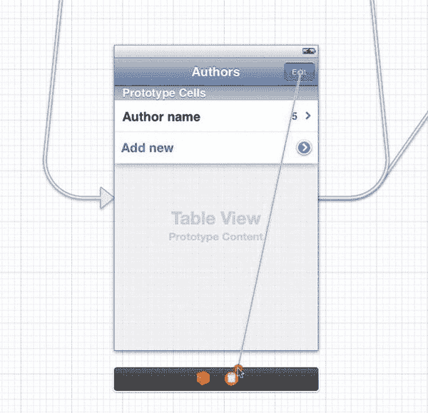

**图 8-85.** *连接“编辑”按钮。*

16.  回到 Storyboard，按住 Control 键从“编辑”按钮拖拽到 Dock 中的“作者视图控制器”图标，如图 8-85 所示。从弹出对话框中选择 `editPressed:`，然后保存文件。


##### 收尾与加载测试数据

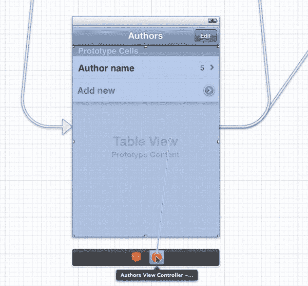

**图 8-86.** *连接第一个表格视图。*

1.  从表格视图按住 Control 键拖拽至 Dock 中的“作者视图控制器”图标，如图 8-86 所示。

    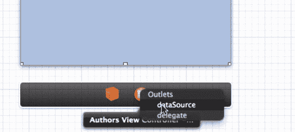

    **图 8-87.** *选择 dataSource。*

2.  在出现的连接对话框中，选择嵌套在“输出口”选项下的 `dataSource`，如图 8-87 所示。重复完全相同的过程，以连接表格视图的 `delegate` 输出口。

    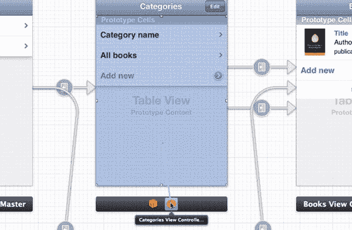

    **图 8-88.** *对“分类”重复相同操作。*

3.  现在，你需要针对“分类”重复你刚对“作者”所做的操作。将表格视图与“分类视图控制器”图标连接，如图 8-88 所示，并从选项对话框中选择 `dataSource`。再次重复，以类似方式连接 `delegate` 输出口。

    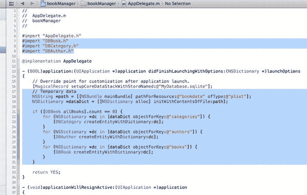

    **图 8-89.** *用测试数据填充数据库。*

4.  你几乎已经准备好运行应用了！尽管非必需，并且你本可以在数据库为空的情况下运行应用，但我们还是建议你添加最后一段代码。你已经为此应用准备了一个测试数据库，这样你无需自己创建大量记录即可测试其功能。让我们把它接入并看看应用是如何工作的。导航到 `AppDelegate.m`，并从 DemoMonkey 中拖入“-- AppDelegate.m Imports”代码片段。将其放在 `#import "AppDelegate.h"` 这一行下方。然后找到以下方法：

    ```
    - (BOOL)application:(UIApplication *)application
    didFinishLaunchingWithOptions:(NSDictionary *)launchOptions
    ```

    从 DemoMonkey 中拖入最后一条“-- AppDelegate.m Data for Testing”代码片段。将其插入到方法实现的末尾，紧接在以下代码的下方：

    ```
    [MagicalRecord setupCoreDataStackWithStoreNamed:@"MyDatabase.sqlite"];
    ```

    有关刚完成两次修改后 `AppDelegate.m` 的最终视图，请参见图 8-89。

    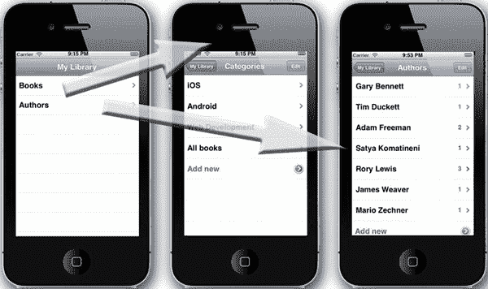

    **图 8-90.** *运行它！*

5.  运行它，并测试从“我的资料库”到“书籍”，再到从“我的资料库”到“作者”的路径，如图 8-90 所示。

    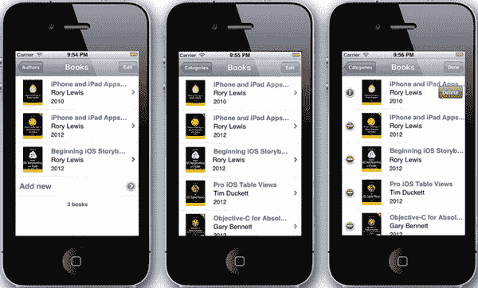

    **图 8-91.** *三个视图正常工作。*

6.  在图 8-91 中，第一张图片展示了从“作者”视图（选择表格视图中的作者罗里·刘易斯后）进入的“书籍”视图。中间图片展示了从“分类”视图进入的“书籍”视图。第三张图片展示了删除书籍的操作。所有功能均正常工作。

    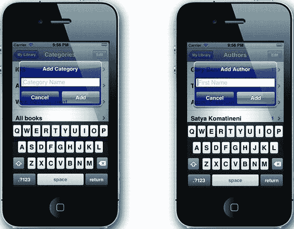

    **图 8-92.** *添加功能。*

7.  添加“分类”和添加“作者”的功能也完美运行。

现在你可以说，你已经详细体验了如何使用主从应用程序模板，让 iPhone 表现得像用导航应用程序模板编程一样——或者让 iPad 表现得像用拆分视图应用程序模板编程一样。这意义重大，因为现在你知道了，当你想处理列表、数据库和表格时，特别是当你希望让用户能够以层级方式深入浏览数据时，该如何使用主从应用程序模板。此外，你还获得了数据库组件的使用经验，并且如前所述，雇主很难找到对 SQL 有任何经验的 Xcode 开发者。

干得漂亮！现在准备好迎接你的最后一个应用吧。

