# 第 9 章

## 单视图 #3：wanderBoard 第一部分

在这个最终的故事板应用中，你将构建一个简单的迷宫漫游游戏，允许用户穿行于一个只有一个正确路径、其余都是死胡同的 3D 迷宫中。与上一个应用一样，这个应用也分为三章：第 9 章 至 第 11 章。

在这个应用中，你将包含一种方法，让用户通过图形方式在迷宫中导航，从而产生移动感。你将主要使用图形图像和故事板技术来开发这个应用，并尽可能少用代码。与第 2 章 的 AlienView 和第 3 章 的 FlickrPhotoMap 类似，这也是一个使用故事板的单视图应用程序——但它要复杂得多。完成这个应用后，你将主要使用故事板设计出一个严肃的图形游戏。

### wanderBoard：单视图应用

我们将视觉设计得仿佛你身处迷宫之中，可以向左看、向右看或向前看。当你启动应用时，会出现在迷宫入口处，如图 Figure 9-0A 所示，你点击墙壁上看似出口的开口，即可从一个位置导航到下一个位置。偶尔，你会走入一条死路，并看到一个红色箭头，表示你可以后退。点击箭头即可返回迷宫中的上一个位置，你可以继续点击箭头一直退出死路，直到箭头不再出现。然后，你可以朝另一个方向继续前进，探索迷宫，如图 Figure 9-0B 所示。

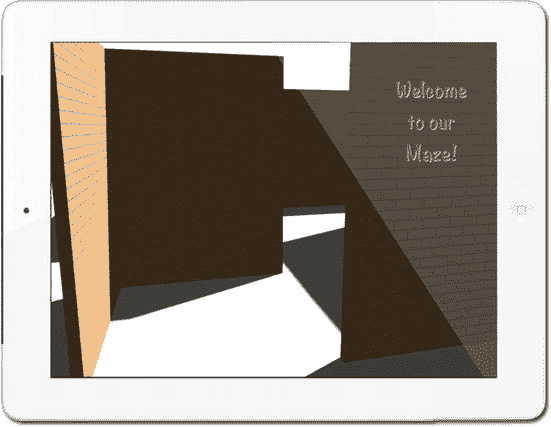

**图 9-0A.** *wanderBoard 的“欢迎来到我们的迷宫”起始画面：随着应用追踪你在虚拟 3D 空间中的位置，视图会相应改变。*

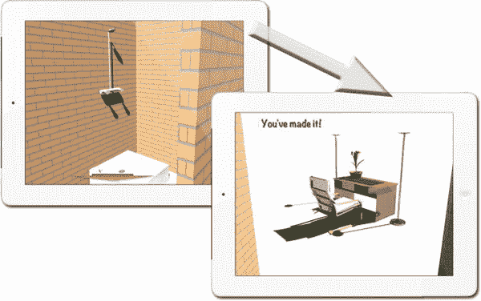

**图 9-0B.** *死路看起来像左图所示。“你成功了！”表示你走出了迷宫（右图）。*

我们选择了 iPad 横向布局，因为它能为迷宫展示和导航控件提供更多空间。视图控制器的行为是数据驱动的，这意味着我们通过屏幕对象中的编码信息，以如下两种方式控制应用的行为：

*   `object.tag` 属性指示迷宫的中段位置或死路终点。
*   Segue 标识符指示移动方向（左、右或向前），因此 segue 动画也能反映所采取的方向。这导致视图控制器模板中增加的代码非常少。

你将在所有 18 个迷宫视图后面使用一个单视图控制器对象。它被赋予了一项特殊能力：判断是否以及何时显示“返回”按钮（红色箭头），并通过查看 segue 标识符来决定传递给自定义 segue 的内容以影响其行为，从而传递导航方向。此视图控制器使用所有视图控制器的一个属性（`isMovingToParentViewController`）来判断你是进入死路还是离开死路。进入时，中间的“返回”按钮会被隐藏，因此你无法在到达死路终点之前返回。视图控制器代码通过检查“返回”按钮的 `.tag` 属性（可能存在也可能不存在）来识别哪些按钮是中间的。标签值如下：`tag=1` 表示中间位置，`tag=0` 表示路径终点。

我们还在本应用中引入了一些专业级架构设计：

*   一个自定义 segue 类处理迷宫移动过渡（`MovementSegue.m/.h`）。
*   Storyboard 文件将一个单视图控制器包裹在导航控制器内，这样进入新位置和需要时后退就只是简单的 push 和 pop 操作。我们将单视图配置为迷宫入口，并通过添加另外 17 个视图控制器（每个之间都有自定义 segue）来完成设置。

`wanderBoard` 应用会追踪你在一个伪地理空间中的移动方式。实际上，用户可能处于 18 个场景中。Segue 通过追踪用户当前所在的场景来记录用户的位置。

**注意：** Xcode v4.3.2（在我们的版本中是 4E2002）似乎存在一个 bug：从 Storyboard 中复制 `UIButton` 时，有时会无法拷贝“Shows Touch on Highlight”属性。即使按钮是复制出来的，你也可能需要手动设置此属性！我们将在后续步骤中解决这个问题。

构建 18 个场景时会有大量重复工作。不幸的是，正如旁边的注意中提到的，Xcode v4.3.2 似乎有一个 bug，后面你会看到，这个 bug 使我们无法完全自动化地重复这 18 个步骤。有鉴于此，我们将项目分为四个步骤。首先，你设置文件、调整项目设置并拖入资源。然后，你通过添加导航控制器、图像视图、欢迎标签和按钮来准备 Storyboard。接下来，你完成视图控制器的头文件和实现文件。最后，在 `MainStoryboard` 中，你创建剩余的 17 个场景（我们给出的是有辅助和无辅助两种方式）。本章涵盖前两个步骤。接下来的两个步骤（最后一个步骤有辅助）在第 10 章中。最后一个无辅助步骤在第 11 章中。

### 准备工作

像往常一样，我们在[`http://bit.ly/sMRvAP`](http://bit.ly/sMRvAP)为你提供了本章所需的所有文件和代码。你也可以在[`http://bit.ly/Od8IUE`](http://bit.ly/Od8IUE)下载应用的最终版本。对于这种规模的应用，你可能需要从[`http://bit.ly/Od9a5v`](http://bit.ly/Od9a5v)下载 `Assets` 文件夹，并注意以下事项：下载 `Assets.zip` 文件后，你会看到七个文件。它们是：`Default-Landscape@2x~ipad.png`、`Default-Landscape~ipad.png`、`icon72x72.png`、`icon144x144.png`、`MovementSegue.h`、`MovementSegue.m` 和 `wanderBoard.demoMonkey`，以及两个文件夹 `Images` 和 `Sources`。你将使用这四个 `.png` 文件作为图标和横向启动图像。（我们稍后会解释 `MovementSegue` 文件，当然你知道 `demoMonkey` 文件是干什么用的。）

`Images` 文件夹包含 19 张图片，其中 18 张将用于迷宫中。别担心，我们会详细解释如何生成你自己的 3D 场景。第 19 张图片是红色箭头图片，用于告诉用户需要开始回溯（如图 9-0B 左图所示）。`Sources` 文件夹包含我们用来制作 3D 图像的 OmniGraffle 和 Sweet Home 3D 文件。

**注意：** 你可能想了解，也可能不想了解我们是如何创建迷宫中使用的 3D 图像的。如果你对创建 3D 图像不感兴趣，请跳到“步骤 1：设置文件、项目设置和资源”一节。如果你感兴趣，请继续阅读。

#### 我们如何创建 3D 场景

因为我们的重点是 Storyboarding，所以不会花太多时间解释如何创建 3D 图像。（我们有一个长达 28 分钟的视频，斯蒂芬在其中详细解释了如何下载、创建并将 OmniGraffle 文件与 Sweet Home 3D 文件集成在一起，视频地址为 [`bit.ly/sMRvAP——请参见`](http://bit.ly/sMRvAP)页面底部的“第 9 章 _wanderBoard：我们如何为 Xcode 创建 3D 迷宫”。）

我们使用了一个名为 OmniGraffle 的简单工具来设计用户穿越迷宫时看到的平面图和相机视图（图 9-0C）。然后我们使用 OmniGraffle 图像来指导我们在 Sweet Home 3D 中输入数据，通过透视图、墙壁和砖块、光源、阴影、装饰物、书桌、书架以及我们拖入文件以创建场景的其他内容，让迷宫活灵活现（图 9-0D 和 0E）。我们确信这两个工具可以以更复杂的方式使用。我们见过其他人使用这些工具的例子，效果绝对令人惊叹。

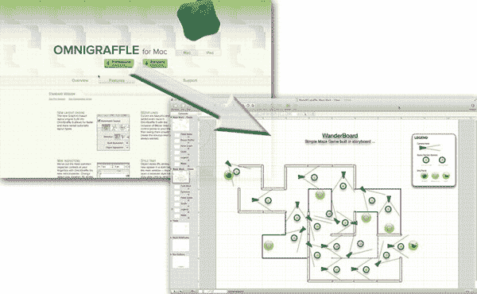

**图 9-0C.** *OmniGraffle 为我们提供了一种非常简单、直观的方式来设计迷宫。*

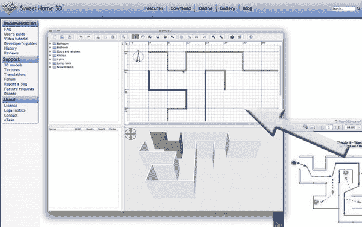

**图 9-0D.** *在此图中，我们将 OmniGraffle 和 Sweet Home 3D 文件叠加在 Sweet Home 3D 网站之上。我们按照绘图中的样式，在 Sweet Home 3D 中手动输入了墙壁。*

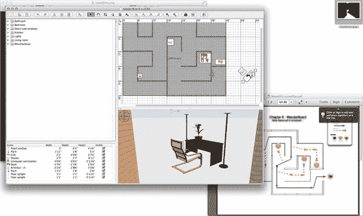

**图 9-0E.** *在 OmniGraffle 中，迷宫出口由图像右下角黄色圆圈内的鸟表示，而在 Sweet Home 3D 中，它被一张书桌替代。*

#### 步骤 1：设置文件、项目设置和资源

和往常一样，先清理你的桌面。然后访问 [`www.rorylewis.com/xCode/StoryBoarding%20in%20Xcode/Chapter07_WanderBoard-Assets.zipdownload`](http://www.rorylewis.com/xCode/StoryBoarding%20in%20Xcode/Chapter07_WanderBoard-Assets.zipdownload)，下载文件，并将文件夹解压到桌面。

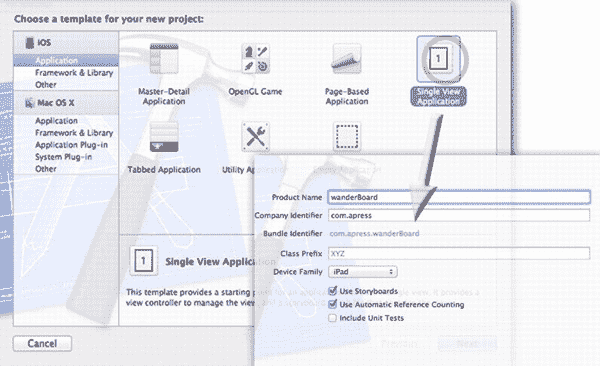

**图 9-1.** *创建一个单一视图应用，并将其保存为 `wanderBoard`。*

1. 打开 Xcode，按下 ++`N`，然后选择“单一视图应用”（Single View Application）。将其命名为 `wanderBoard`。在公司标识符（Company Identifier）中输入 `com.apress`，这样如果你需要将我们的一些代码与你自己的代码进行比较或替换，它们将完全匹配。选择 iPad，因为此应用仅适用于 iPad，你将使用自动引用计数（Automatic Reference Counting），当然还会使用 Storyboard，如 图 9-1 所示。将其保存到你的桌面。

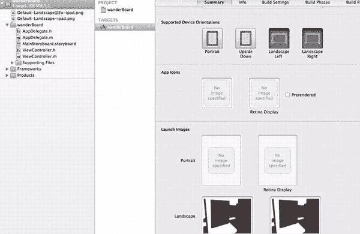

**图 9-2.** *将应用设置为仅横向模式。*

2. 现在你将设置我们的应用，然后从你从网上下载的 `WanderBoard - Assets` 文件夹中拖入一些资源。将应用设置为仅横向模式，这样你就不必为不同的方向创建大量额外的图片了（顺便提醒一下，如果你自己创建一个包含许多图片的游戏，请注意这一点——目前你已经有了 18 张图片）。在“摘要”（Summary）的“支持的设备方向”（Supported Device Orientations）部分，取消勾选“竖屏”（Portrait）和“倒置”（Upside Down）选项，如 图 9-2 所示。图 9-2 中显示了图底部“启动图像”（Launch Images）部分的两张横向图片——你要通过将从文件夹中找到的两张启动画面 `Default-Landscape@2x~ipad.png` 和 `Default-Landscape~ipad.png` 一起拖入根目录来实现，如 图 9-2 左上角所示。将文件拖入目录时，请务必像往常一样选择“将项目复制到项目文件夹中”（copy items into the project folder）。你会看到，当你拖入它们时，它们会自动出现在“启动图像”中，因为它们设置了正确的分辨率并具有正确的名称。

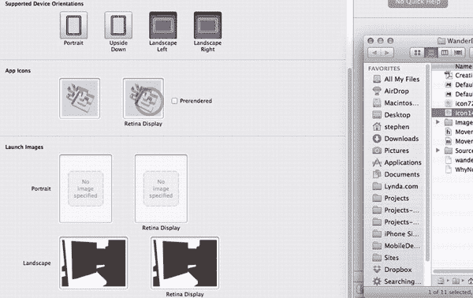

**图 9-3.** *拖入应用图标。*

3. 上一步已自动为“启动图像”找到了正确的分辨率并完成了工作。然而，对于图标来说，情况则有所不同。将 `icon72x72.png` 和 `icon144x144.png` 分别从你的文件夹拖入“应用图标”（App Icons）对应的插槽中，其中 `icon144x144.png` 图标放入“Retina 显示屏”（Retina Display）插槽，如 图 9-3 所示。稍后，你会将这些默认存储在项目根文件夹中的图标移动到 `Supporting Files` 文件夹中。

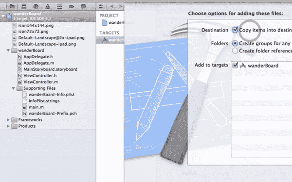

**图 9-4.** *确保正确设置拖入图片文件夹的选项。*

4. 现在选择你下载文件夹中的 `Images` 文件夹，并将其拖入你的 `Supporting Files` 文件夹。当“选择选项”（Choose Options）对话框出现时，选择“创建副本”和“分组”，如 图 9-4 所示。确保你的 `Supporting Files` 文件夹看起来与我们的一致。如果不一致，你可能不小心将它们放在了 `Supporting Files` 文件夹之外。

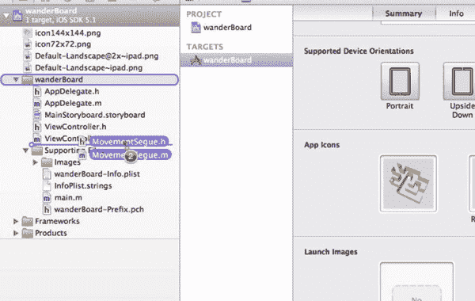

**图 9-5.** *引入转场代码。*

5. 现在将我们为你制作的转场代码文件 `MovementSegue.h` 和 `MovementSegue.m` 拖入 `wanderBoard` 文件夹中，如 图 9-5 所示。请记住，Xcode 不知道如何构建实现文件，因为这种框架设置方式并非预期的方式。所以你需要设置一个新的编译源。

**注意：** 你添加类文件的方式与以往不同。你不是选择分组然后选择“将文件添加到 {分组}”，而是直接从访达（Finder）将 `.m` 和 `.h` 文件拖拽到分组中。在撰写本文时，当你使用这种拖放方式添加类文件时，Xcode 不会添加编译 `.m` 文件的指令。这就是为什么你需要接下来的步骤。如果你使用了“添加文件...”方法，你会发现 `.m` 文件的编译指令已经被自动添加了。

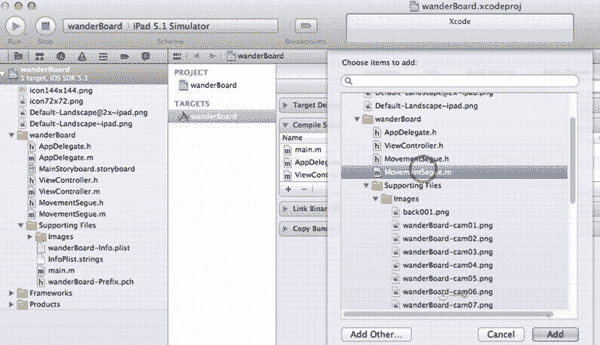

**图 9-6.** *设置一个新的编译源。*

6. 要为转场类创建新的编译源，请点击“构建阶段”（Build Phases）标签（如果你找不到，图 9-2 中有显示），然后选择“编译源”（Compile Sources）（3 项）。你需要添加一个将作为转场的新编译源。点击“源文件”（Sources）（3 项）下方的 `+` 按钮，然后从访达对话框中选择 `MovementSegue.m` 文件，如 图 9-6 所示。

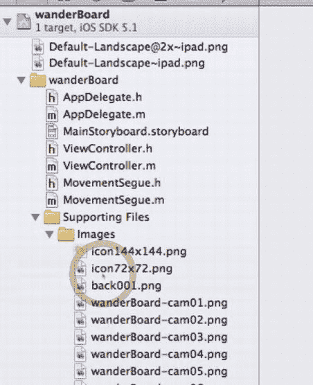

**图 9-7.** *将图标文件移动到 Images 文件夹中。*

7. 你差不多快拖完资源了。现在只需做一点整理工作。将两个图标文件 `icon72x72.png` 和 `icon144x144.png` 拖入位于内部的 `Images` 文件夹中，如 图 9-7 所示。

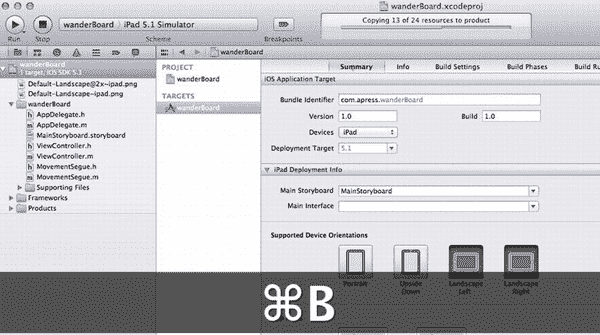

**图 9-8.** *通过构建代码来确保设置正确。*

8. 现在你已经将所有资源拖入了项目。在进入下一节开始编写应用代码之前，首先要确保你做的一切都正确。按下 +`B`，如 图 9-8 所示，并确保构建成功。请注意，在 图 9-8 中，我们关闭了 `Supporting Files` 文件夹。你的文件夹可能仍然处于打开状态。

好的，作为一名高级文档工程师和翻译员，我将严格遵循您的注意事项和示例格式，将给定的英文文本翻译成高质量的中文。

---

#### 第 2 步：准备故事板

在本节中，你将设置故事板。首先从处理第一个场景开始，添加你的`ViewController`、`UIImageViews`、欢迎标签和按钮。在下一节编写完代码后，请记住，你还需要为剩下的 17 个场景重复此操作。

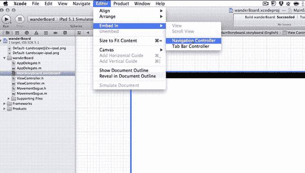

**图 9-9.** *创建导航控制器。*

1.  打开故事板，你会看到 iPad 的默认画布。我们先思考一下。为了让用户在迷宫中更容易地探索（用户通常会后退然后再前进），像你过去做的那样，在导航控制器内部再使用一个导航控制器会非常有用。记住，这样做可以让你实现视图的推入和弹出。选择故事板上的视图，然后选择 Editor 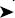 Embed In  Navigation Controller，如图 9-9 所示。现在，通过观察故事板，你会看到已经选中了你的单视图，并将其嵌入到导航控制器中，这样一切操作都从导航控制器开始。

    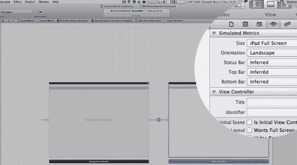

    **图 9-10.** *设置度量参数*

2.  要设置度量参数，点击你的`ViewController`（右侧的那个），然后打开属性检查器。导航到模拟度量部分，确保尺寸设置为 iPad 全屏，方向保持为横屏。其他所有选项保持为“推断”，如图 9-10 所示。

    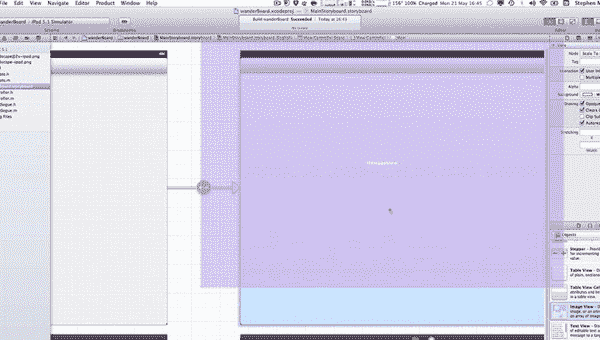

    **图 9-11.** *从库中拖入一个图像视图。*

3.  将你刚在第 10 步中设置好的视图控制器留在原地，因为你要添加标签、按钮以及任何图形密集型项目都会有的元素。首先从库中引入一个图像视图。它会自动调整到正确的尺寸，如图 9-11 所示。完成此操作后，将其拖放到你的视图中。

    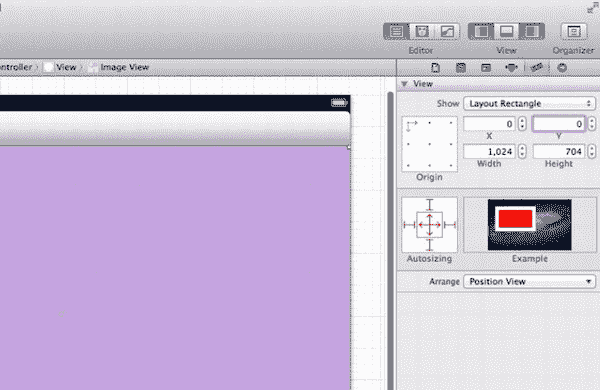

    **图 9-12.** *确保图像已配置为自动调整大小。*

4.  你很快就会移除导航栏，因为你希望用户在 iPad 上获得全屏体验。为了让我们的图像在插入或移除视图中的对象时能自动调整大小，我们需要在创建第一个场景的现在就确保图像视图已设置为自动调整大小。前往尺寸检查器，确保自动调整大小选项配置如图 9-12 所示。在这里你还可以注意到，界面生成器已根据导航栏的存在将图像视图调整到所需的大小。`x`和`y`坐标显示它位于左上角，这是正确的。

    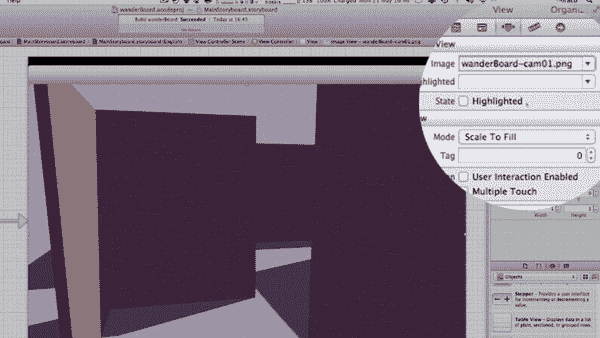

    **图 9-13.** *设置你的第一个图像。*

5.  现在你可以设置第一个图像了。保持图像视图处于选中状态，在属性检查器中，选择显示来自摄像机 1 的视图的图像。这一步是必要的，因为如果你设计一个带有 3D 场景的游戏，你可能需要确保在图像文件名中标识视图来自哪个摄像机编号。在这里，你从下拉菜单中选择摄像机视图编号 1，文件名为 `wanderBoard-cam01.png`，如图 9-13 所示。如果你想显示的图像文件名在图像列表中不可见，你可能需要向下滚动以查看更多名称。

    太棒了！你现在正站在迷宫的入口处。接下来，你将使用故事板和 Xcode 引导用户穿过这个迷宫，这是一个非常酷的概念。

    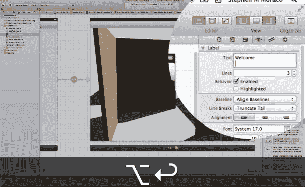

    **图 9-14.** *创建一个多行欢迎标签。*

6.  你需要一个欢迎标签，在用户进入迷宫时向他们致意。从库中抓取一个标签，拖到右侧墙壁的上部，并稍微放大一点。在属性检查器中，你将做一些你可能还没接触过的有趣操作：创建一个多行标签。你必须使用一个特殊的键来执行软回车：在标签文本框中，输入 *Welcome*，然后按 Option+Return 来创建新行，如图 9-14 所示。在新行上输入 *to our*，再创建另一个新行，然后输入 *Maze!*，如图 9-15 所示。接下来，你需要将“行数”从 1 调整为 3（如图所示），然后标签才能显示所有三行。通过在蜡笔盒颜色选择中选择 Mocha（Mocha 是顶部第二行最左边的蜡笔），以选择“摩卡”作为文本颜色。同时选择浅灰色作为阴影颜色，并将阴影偏移的水平距离和垂直距离都设置为 1。

    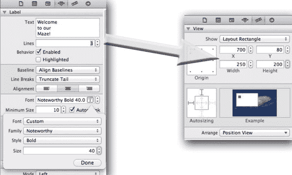

    **图 9-15.** *更改字体样式。*

7.  在属性检查器中，选中字体后，点击下拉菜单中的 `T` 图标并选择 Noteworthy，将字体更改为 Noteworthy Bold。将样式选择为 Bold，大小选择为 40（磅），如图 9-15 左侧图像所示。在尺寸检查器中，将`x`、`y`坐标设置为 700, 80。将文本框的宽度设置为 250，高度设置为 200，如图 9-15 右侧所示。

    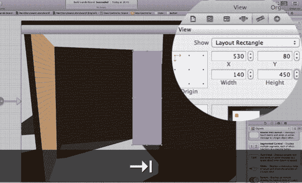

    **图 9-16.** *引入第一个按钮。*

8.  为了在屏幕之间导航，你可能想使用按钮，但你并不希望用户看到这些按钮，因为那会暴露前进的方向。你将使用尺寸检查器来正确设置按钮的大小和位置。然后在属性检查器中，通过将其类型更改为“自定义”，使其变为不可见（默认情况下自定义类型会使其透明）。

    从库中拖入一个按钮，并将其放置在我们图 9-16 所示的大致位置。在尺寸检查器中，将`x`坐标设置为 530，`y`坐标设置为 80，宽度设置为 140，高度设置为 450。

    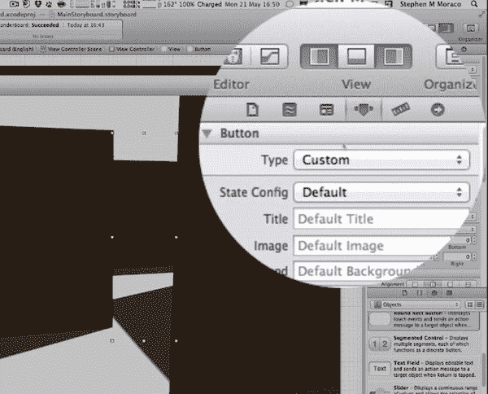

    **图 9-17.** *使按钮不可见。*

9.  要使按钮透明，在属性检查器中将“类型”选择为“自定义”。按钮将变为透明，如图 9-17 所示。

    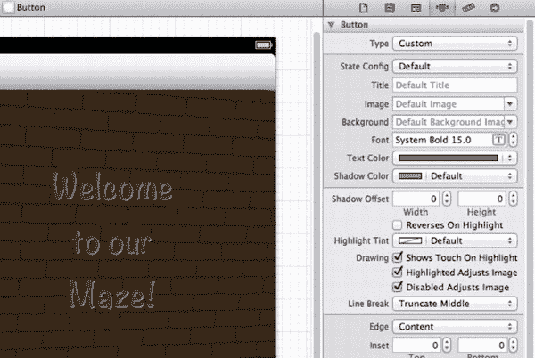

    **图 9-18.** *允许用户看到他们何时点击了按钮。*

10. 你已经让按钮变得透明，但你需要让用户知道他们何时点击了它。勾选“绘图”属性下的“触摸时显示高亮”复选框，这样当用户点击按钮时，会产生一个小闪光，告知用户按钮已被按下。如图 9-18 所示。

    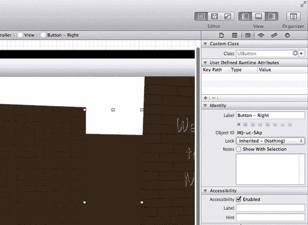

    **图 9-19.** *命名按钮*

11. 即使在这个只有 18 个场景的小迷宫中，每个场景也有两到三个前往下一处的选项，加起来可能有 40 个按钮。你需要一个命名系统，以便仅通过名称就能在文档大纲中轻松识别按钮。你选择的这个按钮允许用户向右走，因此保持按钮处于选中状态，在身份检查器中将其标记为 `Button - Right`，如图 9-19 所示。

    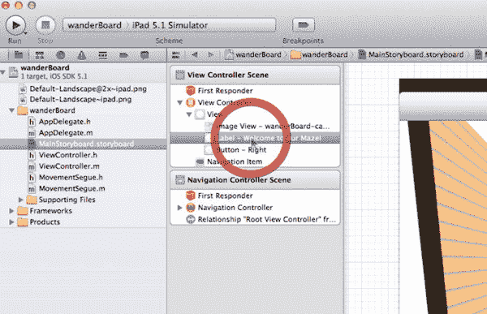

    **图 9-20.** *检查状态。*

12. 这是一个关键步骤，让我们在继续之前谨慎地确认项目的这一方面运行完美。首先在文档大纲中检查，然后运行它。如果故事板的文档大纲面板尚未打开，请将其打开，然后转到视图控制器场景。在“视图”下，如果展开它，你应该看到 Image View…、Label - Welcome to our Maze! 和 Button - Right，如图 9-20 所示。我们继续并构建它。如果构建成功，就运行它。

    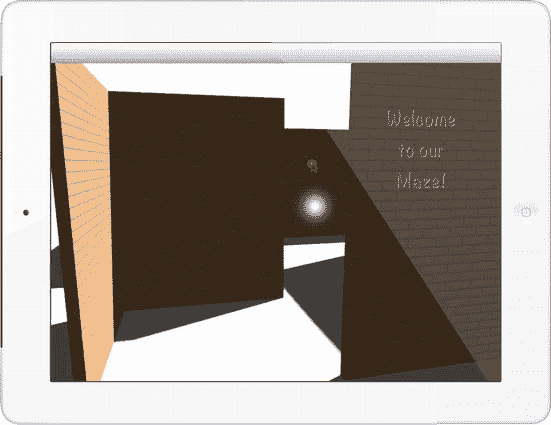

    **图 9-21.** *点击透明（不可见）按钮，看到闪光！*

13. 当 iPad 模拟器出现时，点击你知道透明按钮所在的位置。你应该会看到一个闪光指示器，如图 9-21 所示。请注意，无论你在哪里点击，它仍然会显示闪光。这一点很重要，因为不同的人可能会点击按钮的不同区域。你已经完成了创建这个应用的一个重要部分。干得好！

