# 第 10 章

## 单视图 #3：漫游板第二部分

你已经搭建好了第一个场景。在本章中，你将在第 3 步中向视图控制器的头文件和实现文件添加代码。这为你进入第 4 步做好了准备，在第 4 步中，你将高效地创建另外 17 个场景！第 4 步分为两个部分。第一部分即第 4a 步，将在本章结束，对于这一步，你仍将获得我们的协助和指导。然后在第 11 章中，你将完成第 4b 步，这一部分提供的指导会少很多。

### 第 3 步：完成 ViewController 头文件和实现文件

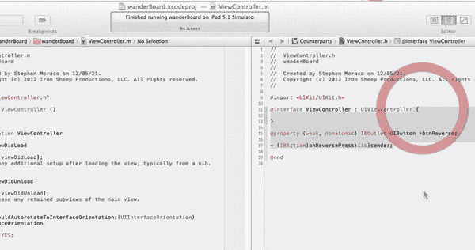

**图 10-1.** *拖入属性和操作方法签名。*

1. 确保你已经打开 DemoMonkey，并将其放在你最喜欢的位置，以便在编码时能够随时访问。打开 `ViewController.m` 文件，然后打开助理编辑器，使其在右侧窗格中显示头文件。从 DemoMonkey 中拖入第一个代码片段“01 ViewController.h – add new property and action signature”，并将其放在头文件中 `@interface` 代码行的末尾，如图 10-1 和以下代码所示：

```
#import <UIKit/UIKit.h>
@interface ViewController : UIViewController {
}

@property (weak, nonatomic) IBOutlet UIButton *btnReverse;

(IBAction)onReversePress:(id)sender;

@end
```

你对视图控制器所做的全部操作就是添加一个新的属性和一个操作方法签名。你正在为用户提供一种能力，让他们在迷宫遇到死胡同时能够表示需要后退。用户通过你的后退按钮（`*btnReverse`）实现这一点，点击该按钮后会调用这个 `IBAction` 方法。这就是你对头文件所做的全部工作，因此接下来可以处理实现文件了。

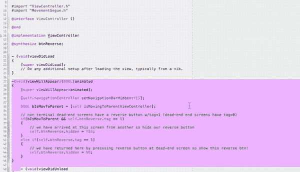

**图 10-2.** *导入 viewWillAppear 方法代码。*

2. 切换回标准编辑器（或者直接在左侧的实现文件中操作），你需要建立对自定义 Segue 对象的访问权限，因为如前所述，你不想使用自定义 Segues。正如你将看到的，自定义 Segues 完全是数据驱动的，这意味着数据驱动代码的行为。换句话说，代码会查看视图数据，并根据所看到的数据来决定如何行动。因此，回到 DemoMonkey，拖入“02 ViewController.m – add import of customSegue Object”，并将其放在 `#import ViewController.h` 之后。现在，既然你已经在公共接口中为后退按钮声明了一个属性，你还需要告诉编译器合成后退按钮属性的设置器和获取器代码。为此，拖入“03 ViewController.m – add property synthesis”，并将其放在 `@implementation` 行之后。

正如你在实现文件中所看到的，Xcode 默认实例化了`- (void)viewDidLoad` 和 `- (void)viewDidUnload` 方法。但当视图出现时，你想要隐藏导航栏。因此，添加一个 `-(void)viewWillAppear` 方法来实现这一点。拖入“04 ViewController.m – add viewWillAppear”，并将其放在 `- (void)viewDidLoad` 和 `- (void)viewDidUnload` 方法之间，如图 10-2 和以下代码所示：

```
#import "ViewController.h"
#import "MovementSegue.h"
@interface ViewController ()
@end
@implementation ViewController
@synthesize btnReverse;
- (void)viewDidLoad{ ... }
-(void)viewWillAppear:(BOOL)animated {
  [super viewWillAppear:animated];
  [self.navigationController setNavigationBarHidden:YES];
  BOOL bIsMovToParent = [self isMovingToParentViewController];

  if(bIsMovToParent && self.btnReverse.tag == 1)
        { self.btnReverse.hidden = YES;}
  else if(self.btnReverse.tag == 1)
{self.btnReverse.hidden = NO;} }
- (void)viewDidUnload { ...
```

**注意：** 为了节省空间，我们在上述代码中删除了注释。

从代码中可以看到，你使用 `[super viewWillAppear:animated];` 让父类执行其在视图将要出现时需要执行的操作。然后使用 `[self.navigationController setNavigationBarHidden:YES];` 隐藏导航栏，并处理你是如何到达这个视图的。你想知道自己是正在走向死胡同，还是正在从死胡同中退出。调用 `[self isMovingToParentViewController]` 会告诉你部分答案。你可以在代码注释中看到（上述代码未显示），对于非终点的死胡同屏幕，你给后退按钮设置了 `tag=1`。相反，终点死胡同屏幕被设置了 `tag=0`。但如果你是在走向死胡同的过程中到达这个屏幕，那么你使用 `self.btnReverse.hidden = YES` 隐藏后退按钮。最后，如果用户是通过点击后退按钮（从死胡同中退出）返回到这一点，那么你确实希望在这个场景中显示后退按钮，使用 `self.btnReverse.hidden = NO;`（如果这个场景中有后退按钮的话）。

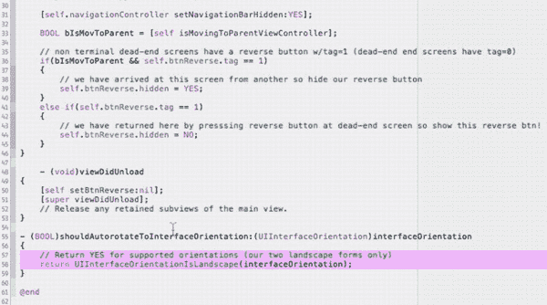

**图 10-3.** *用允许两种横向方向的代码替换现有代码。*

3. 现在你需要释放后退按钮，通过拖入“05 ViewController.m – add release button (inviewDidUnload)”，并将其放入 `ViewDidUnload` 中，位于 `[super viewDidUnload];` 之上，如图 10-3 和以下代码所示：

```
- (void)viewDidUnload
{
  [self setBtnReverse:nil];
  [super viewDidUnload];
}
(BOOL)shouldAutorotateToInterfaceOrientation:(UIInterfaceOrientation)interfaceOrientation
{
  return UIInterfaceOrientationIsLandscape(interfaceOrientation);
}
```

接下来要做的是将视图旋转限制为横向。而不是说你支持所有方向，你将使用一个宏来询问当前是否为横向方向。为此，拖入“06 ViewController.m – in ‘shouldAutorotate …’ replace”，并将其放入 `shouldAutorotateToInterfaceOrientation` 方法内部，如图 10-3 所示。它应该替换该方法中已存在的 `return YES;` 行。在插入新行后，你可能需要删除这一行。

现在不再是简单地返回 YES 以支持所有方向，而是使用宏 `UIInterfaceOrientationIsLandscape` 来判断当前是否为横向方向，并返回其结果。

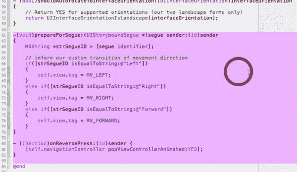

**图 10-4.** *引入 prepareForSegue:sender: 和 onReversePress: 方法。*

4. 你花了一些时间创建透明按钮，以便让用户通过自定义 Segues 在迷宫中导航。现在你需要引入响应这些按钮点击的代码。拖入“07 ViewController.m – add prepareForSegue sender and onReversePress methods”，并将其放在 `shouldAutorotateToInterfaceOrientation` 方法和 `@end` 语句之间，如图 10-4 所示。你可以看到，你正在检测用户是选择向左、向右还是向前，并将这个选择记录在视图的“tag”中。如果用户试图通过点击后退按钮从死胡同中退出，你则使用 `popViewControllerAnimated:YES` 执行弹出操作。现在进行构建，应该一切正常。

恭喜！你已经完成了这个应用的所有代码。是的，上述代码就是这个应用中你将使用的全部代码。现在运行一下，看看效果。你会注意到，现在你的起点看起来像第 9 章的图 9-0A，因为导航栏已经不再显示，而它在图 9-21 中还是存在的。

从这一点开始，你将着手创建迷宫路径。


### 步骤 4a：借助辅助创建后续八个场景

到目前为止，您已经为应用程序设置好了图像，创建了`Storyboard`，并编写了第一个场景的代码。在创建包含多个场景的游戏时，这通常是常见情况。在科罗拉多大学科罗拉多斯普林斯分校计算机科学系，我们提供了游戏学理学士学位。有趣的是，当学生们意识到学期过半却仍未完成第一个场景的代码及所有角色时，他们往往会惊慌失措。诀窍在于将第一个场景和角色设计得足够完善，使得创建游戏其余部分变得轻而易举。

现在，您已经完成了所有设置，因此可以在重复创建剩余 17 个场景的必要步骤时，尽可能高效地工作。

**注意：** 您将使用一个 4 步流程来创建每个新场景。我们首先解释每个步骤。随着我们逐步推进并不断重复，我们会适当放松指导，不再每次都详细解释每个步骤及其所有细节，而是仅提醒您像之前那样操作。

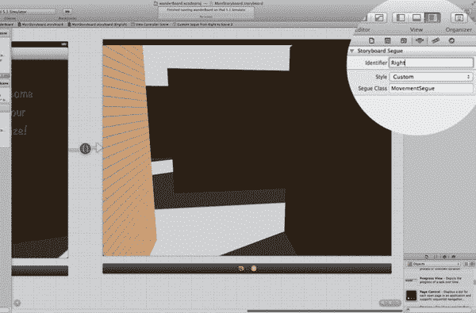

**图 10-5.** *设置第一个场景视图控制器的标题。*

1. 在开始使用重复方法高效创建其余 17 个场景之前，您需要做一些清理工作。场景和实体的命名至关重要。首先回到`Storyboard`。点击视图控制器的场景停靠区（画布上场景底部的栏），然后进入属性检查器，通过将`Title`设置为*Opening Scene*来为其命名，如图 10-5 所示。

   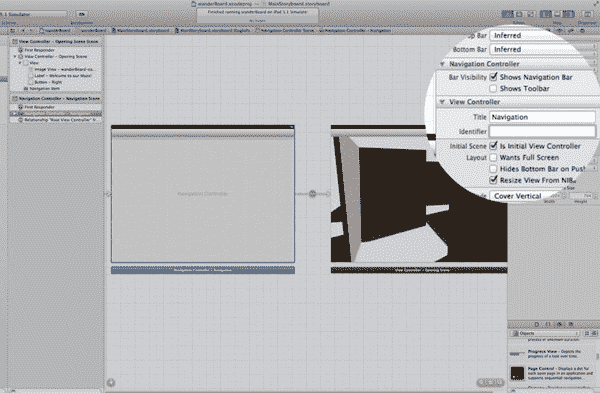

   **图 10-6.** *为导航器命名。*

2. 点击导航控制器的场景停靠区。您可以将其命名为*Navigation*，如图 10-6 所示。

#### 场景 2

您已经完成了收尾工作，现在可以专注于接下来要重复进行 17 次的步骤了。从宏观角度来看，您将重复以下四个步骤：

* 场景#：复制现有场景。
* 场景#：重命名。
* 场景#：整理图形。
* 场景#：建立连接。

**注意：** 我们将用粗体表示**当前步骤**或**子步骤**，以便您能立即了解当前在整体流程中的位置。

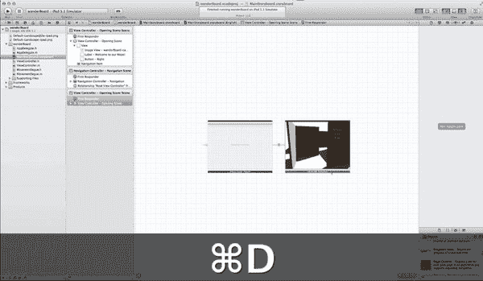

**图 10-7.** *开始第一次复制，点击 Opening Scene 的停靠区。*

1. 您将从*场景 2*的步骤 1 开始：复制现有场景。您目前只有一个现有场景可供选择，因此继续点击视图控制器的场景停靠区，并按`D`键进行复制，如图 10-7 所示。您会立刻发现它看起来厚了一点。这是因为复制的项目现在位于原始场景之上。

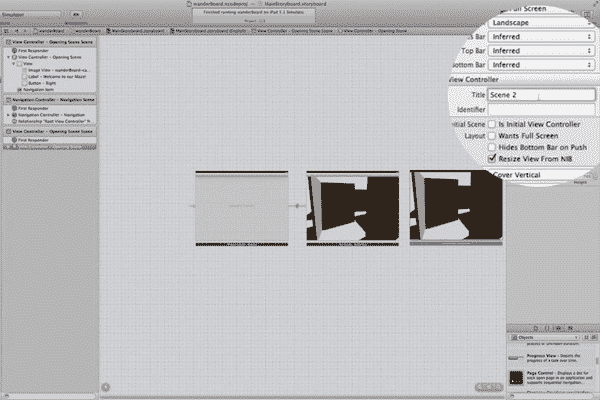

**图 10-8.** *更改新场景的标题。*

* 场景 2：复制现有场景。
  * 场景 2：重命名。
    * 场景 2：更改`Title`。
  * 场景 2：整理图形。
  * 场景 2：建立连接。

2. 选择复制的场景，并将其拖拽到原始场景的右侧。在属性检查器中，将`Title`更改为*Scene 2*，如图 10-8 所示。

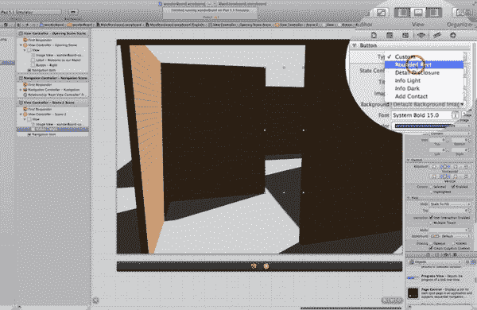

**图 10-9.** *使透明按钮可见。*

* 场景 2：复制现有场景。
  * 场景 2：重命名。
    * 场景 2：更改`Title`。
  * 场景 2：整理图形。
    * 场景 2：隐藏不适用的元素。
    * 场景 2：编辑按钮。
    * 场景 2：使按钮可见。
    * 场景 2：用新图像替换图像。
  * 场景 2：建立连接。

3. 场景 2 没有欢迎标签，因此选中它并删除。（请注意，在您创建的所有后续场景中，您将隐藏元素——但在此情况下，您删除了标签，因为它在任何后续场景中都不需要。）场景 2 中有按钮，因此您需要首先使透明按钮可见，以便进行编辑。选中场景 1 中仍存在的透明按钮，在属性检查器中通过选择圆角矩形使其可见，如图 10-9 所示。

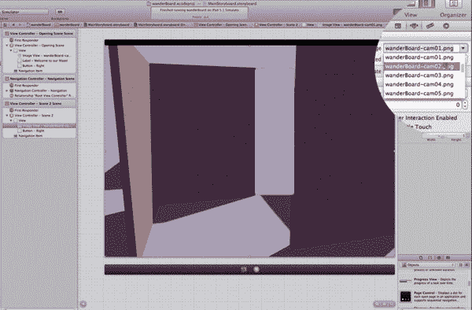

**图 10-10.** *将图像替换为场景 2 的正确图像。*

* 场景 2：复制现有场景。
  * 场景 2：重命名。
  * 场景 2：整理图形。
    * 场景 2：隐藏不适用的元素。
    * 场景 2：编辑按钮。
    * 场景 2：使按钮可见。
    * 场景 2：用新图像替换图像。
  * 场景 2：建立连接。

4. 现在您需要移除图像背景`wanderboard-cam01.png`，并将其替换为场景 2 的图像`wanderboard-cam02.png`。为此，选中视图，然后在属性检查器中，从下拉菜单中将图像名称更改为`wanderboard-cam02.png`，如图 10-10 所示。

**注意：** 看到图 10-10 中仍显示着场景 1 的现有按钮了吗？这是正确的。您需要保留它。编辑按钮是一个两步过程。

**第一步：** 确保您有正确的按钮可以转移到新场景。通过使原始场景中的现有按钮可见（整理图形 → 编辑按钮 → 使按钮可见）和/或隐藏按钮（隐藏不适用的元素）来完成。到目前为止，您还不需要隐藏按钮。

**第二步：** 更改按钮的尺寸和位置，使其正确放置并适应新场景。然后再次将它们设为不可见。

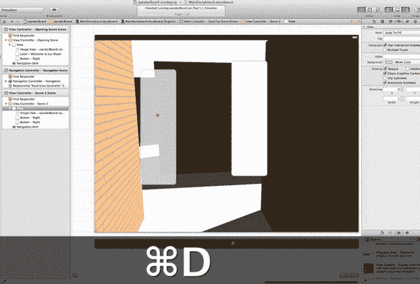


### 排版后的文本

**图 10-11.** 将复制的按钮移动到场景左侧。

- **场景 2:** 复制现有场景。
    - **场景 2:** 重命名。
    - **场景 2:** 整理图形。
    - **场景 2:** 隐藏不适用的元素。
        - **场景 2:** 编辑按钮。
        - **场景 2:** 用新图像替换图像。
        - **场景 2:** 配置新按钮。
        - **场景 2:** 复制按钮。
        - **场景 2:** 重置参数。
    - **场景 2:** 建立连接。

5.  在新场景中，你可以看到用户在此有两个选项：向左或向右。为了满足这一需求，你需要提供两个按钮，每个方向一个。点击右侧可见的按钮，然后按下 `` + `D` 进行复制。现在将其大致移动到场景的左侧，如图 10-11 所示。

``

**图 10-12.** 设置原始（最右侧）按钮的位置和尺寸。

- **场景 2:** 复制现有场景。
    - **场景 2:** 重命名。
    - **场景 2:** 整理图形。
        - **场景 2:** 隐藏不适用的元素。
        - **场景 2:** 编辑按钮。
        - **场景 2:** 用新图像替换图像。
        - **场景 2:** 配置新按钮。
        - **场景 2:** 复制按钮。
        - **场景 2:** 重置按钮参数。
        - **场景 2:** 右侧按钮。
        - **场景 2:** 左侧按钮。
    - **场景 2:** 建立连接。

6.  确保这两个按钮放置正确且尺寸合适，以便对用户而言合情合理。选中原始按钮后，在尺寸检查器中输入属性。你会经常执行此操作，因此我们将提供一组数字来指示按钮在场景中的 x 和 y 坐标，以及按钮的垂直和水平尺寸，使其完美契合在相应位置。我们会在一组数字中完成所有操作——我们只说明：590,90,80,450，这意味着 x 位置为 590，y 位置为 90，按钮的宽度为 80，高度为 450。我们不会每次都提醒你需要选中按钮并打开尺寸检查器。590, 90,80,450 意思是你要打开尺寸检查器，并输入如图 10-12 所示的值。

``

**图 10-13.** 设置新（最左侧）按钮的位置和尺寸。

- **场景 2:** 复制现有场景。
    - **场景 2:** 重命名。
    - **场景 2:** 整理图形。
        - **场景 2:** 隐藏不适用的元素。
        - **场景 2:** 编辑按钮。
        - **场景 2:** 用新图像替换图像。
        - **场景 2:** 配置新按钮。
        - **场景 2:** 复制按钮。
        - **场景 2:** 重置按钮参数。
            - **场景 2:** 按钮 – 右侧。
            - **场景 2:** 按钮 – 左侧。
    - **场景 2:** 建立连接。

7.  在设置新按钮的参数之前，你需要始终对其进行重命名，因为当前它仍沿用被复制按钮的名称。选中新按钮，在身份检查器的标签框中，将其名称从 *Button – Right* 重命名为 *Button – Left*。返回尺寸检查器，将参数设置为 150,85,100,600，如图 10-13 所示。

``

**图 10-14.** 再次将所有按钮设置为透明。

- **场景 2:** 复制现有场景。
    - **场景 2:** 重命名。
    - **场景 2:** 整理图形。
        - **场景 2:** 隐藏不适用的元素。
        - **场景 2:** 编辑按钮。
        - **场景 2:** 用新图像替换图像。
        - **场景 2:** 配置新按钮。
        - **场景 2:** 复制按钮。
        - **场景 2:** 重置按钮参数。
        - **场景 2:** 再次将所有按钮设置为透明。
    - **场景 2:** 建立连接。

8.  配置完新场景的按钮后，你始终要做的最后一件事是确保将它们设为透明。记住，你不想向用户透露任何线索。选择一个按钮，在属性检查器中选择“Custom”（自定义）。我们首先在新按钮上执行此操作，然后将第二个按钮也改为“Custom”，如图 10-14 所示。

``

**图 10-15.** 修正错误：确保设置“Shows Touch On Highlight”（触摸时高亮显示）。

- **场景 2:** 复制现有场景。
    - **场景 2:** 重命名。
    - **场景 2:** 整理图形。
    - **场景 2:** 隐藏不适用的元素。
    - **场景 2:** 编辑按钮。
    - **场景 2:** 用新图像替换图像。
    - **场景 2:** 配置新按钮。
        - **场景 2:** 复制按钮。
        - **场景 2:** 重置按钮参数。
        - **场景 2:** 再次将所有按钮设置为透明。
        - **场景 2:** 必要时修正错误。
    - **场景 2:** 建立连接。

**注意：** 到本书出版时，新版本的 Xcode 很可能会修正你即将读到的这个错误。我们已经提醒了苹果公司并引起了他们的注意。但这是目前存在的错误。

9.  请注意，你复制了一个每个按钮都设置了“Shows Touch On Highlight”（触摸时高亮显示）的视图。但复制的按钮并未正确设置此值。有时，出于不明显的原因，此属性的设置未能正确复制，并且由于不一致，这意味着此处存在一个错误。你需要做的是检查这些按钮是否会显示触摸高亮。选中每个按钮，并将其改为“Shows Touch On Highlight”（触摸时高亮显示）。我们首先修正了右侧按钮，然后修正了左侧按钮，如图 10-15 所示。

``

**图 10-16.** 连接“Opening Scene”（开场场景）：“Button – Right”（右侧按钮）到场景 2。

- **场景 2:** 复制现有场景。
    - **场景 2:** 重命名。
    - **场景 2:** 整理图形。
    - **场景 2:** 建立连接。
        - **场景 2:** 从按钮按住 Control 键拖拽到新场景。

10. 用户进入场景 2 的方式是点击右侧按钮——换句话说，就是选择迷宫中的右侧入口。你需要将右侧按钮通过一个 segue（转场）连接到场景 2。如果你的文档大纲未打开，请将其打开，在“View Controller – Opening Scene”（视图控制器 – 开场场景）中选择“Button – Right”（右侧按钮），然后按住 Control 键从它拖拽到“View Controller – Scene 2”（视图控制器 – 场景 2），如图 10-16 所示。

``

**图 10-17.** 选择“Custom”（自定义）segue 类型。

- **场景 2:** 复制现有场景。
    - **场景 2:** 重命名。
    - **场景 2:** 整理图形。
    - **场景 2:** 建立连接。
        - **场景 2:** 从按钮按住 Control 键拖拽到新场景。
        - **场景 2:** 选择“Custom”（自定义）segue。

11. 将 Control 拖拽释放到“View Controller – Opening Scene”（视图控制器 – 开场场景）上后，从样式菜单中选择“Custom”（自定义），如图 10-17 所示。

**注意：** 我们不会再重复 *Select custom segue*（选择自定义 segue）这一步，因为你将始终使用自定义 segue。从现在开始，我们只会简单地说 *Control-drag from button (name) to new scene (name)*（从按钮（名称）按住 Control 键拖拽到新场景（名称））。然后你将自动选择“Custom”（自定义）segue 选项。

``

**图 10-18.** 编辑新 segue 的属性。


