# 排版后的文本

- 场景 2：复制现有场景。
  - 场景 2：重命名。
  - 场景 2：整理图形。
  - 场景 2：建立连接。
    - 场景 2：从按钮按住 Control 键拖拽到新场景。
    - 场景 2：编辑转场属性。

12. 现在，你会看到一个新的自定义转场连接了两个视图。你可以看到它是自定义的，因为连接两个视图的转场内部包含了 `{}`，如图 10-39 所示。你需要将正确的类关联到新视图。为此，选择转场，在属性检查器中将转场类命名为 `MovementSegue`，保持样式为“自定义”，并将标识符更改为 `Right`，如图 10-18 所示。

**注意：** 关于标识符：你需要留意这是一个向右的转场。通过将标识符值设置为 `Right`，自定义转场类可以查看该标识符，知道它要向右、向左还是向前，并选择相应的动画来执行。还记得我们之前提到你的转场是数据驱动的吗？`Right` 值就是“驱动”正确动画选择的数据。

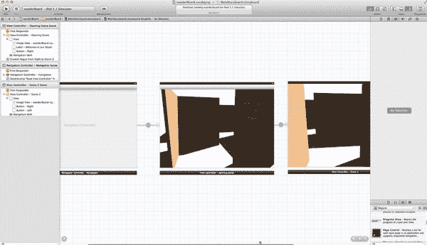

**图 10-19.** *你所完成操作的缩略图*

13. 在你彻底迷失之前，先缩小视图看个大概。如图 10-19 所示，你可以看到有一个开场场景和场景 2。场景 2 是迷宫中的下一个位置，你用了四个基本步骤来创建场景 2。现在，你将创建场景 3，但将减少手把手的指导和解释。

## 场景 3

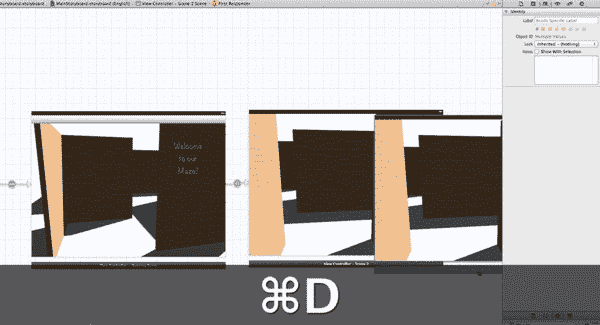

**图 10-20.** *复制场景 2 以创建场景 3。*

- 场景 3：复制现有场景。
- 场景 3：重命名。
- 场景 3：整理图形。
- 场景 3：建立连接。

1. 类似于你在 图 10-7 中所做的操作，点击场景 2 的停靠栏，按下 `+D` 键进行复制，然后将副本向右拖拽，如图 10-20 所示。

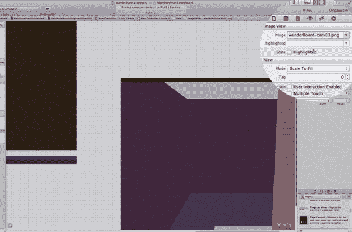

**图 10-21.** *场景 3：选择正确的图片。*

- 场景 3：复制现有场景。
  - 场景 3：放置在上一个场景的上方或下方。
- 场景 3：**重命名**。
  - 场景 3：更改标题。
  - 场景 3：更改图片。
- 场景 3：整理图形。
- 场景 3：建立连接。

2. 现在，你将开始一个新的约定。你可以向左或向右转。我们把向右的场景放在底部，向左的场景放在顶部（左侧目标场景位于右侧目标场景之上）。因此，从现在开始，将右转放在底部，左转放在顶部。这样，你只需看一眼故事板，就能知道你是要向右还是向左移动。如你在 图 10-8 中所做，你需要更改标题——将标题从 `Scene 2` 改为 `Scene 3`，以便记住它是什么。

在此处，将图片更改为 `wanderBoard-cam03.png`，就像你在 图 10-10 中所做的一样。这显示在 图 10-21 中。

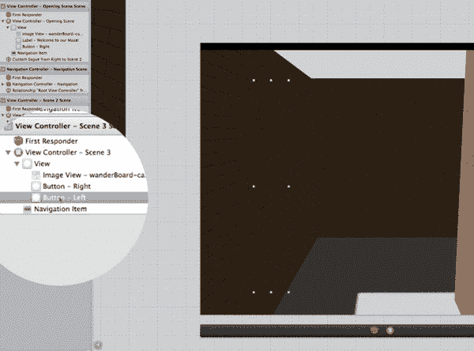

**图 10-22.** *场景 3：隐藏不适用的元素：选择“左侧按钮”。*

- 场景 3：复制现有场景。
  - 场景 3：重命名。
  - 场景 3：整理图形。
    - 场景 3：隐藏不适用的元素。
  - 场景 3：建立连接。

3. 选择“左侧按钮”，如图 10-22 所示，以便将其隐藏。

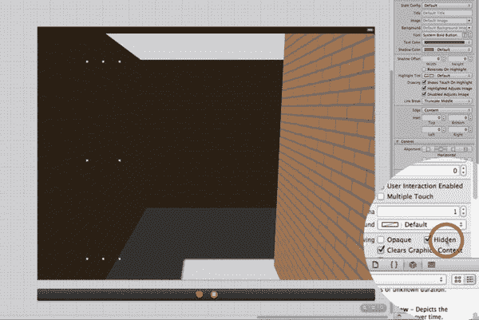

**图 10-23.** *场景 3：将选中的“左侧按钮”标记为“隐藏”。*

- 场景 3：复制现有场景。
  - 场景 3：重命名。
  - 场景 3：整理图形。
    - 场景 3：隐藏不适用的元素。
  - 场景 3：建立连接。

4. 选中“左侧按钮”后，勾选“隐藏”选项将其隐藏，如图 10-23 所示。

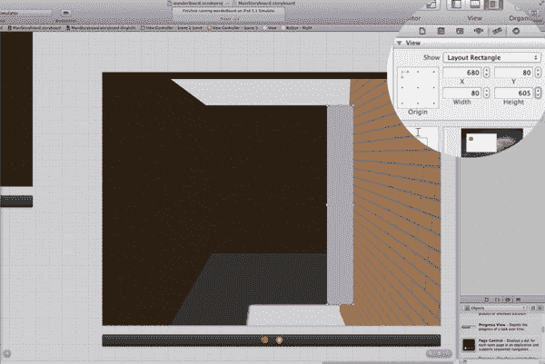

**图 10-24.** *场景 3：编辑右侧按钮的位置和大小。*

- 场景 3：复制现有场景。
  - 场景 3：重命名。
  - 场景 3：整理图形。
    - 场景 3：隐藏不适用的元素。
    - 场景 3：编辑按钮。
      - 场景 3：使按钮可见。
    - 场景 3：用新图片替换旧图片（已完成）。
    - 场景 3：配置新按钮。
      - 场景 3：复制按钮。
      - 场景 3：重置按钮参数。
      - 场景 3：右侧按钮。
    - 场景 3：再次设为透明。
      - 场景 3：修正 bug。
  - 场景 3：建立连接。

5. 现在选择“右侧按钮”，并按照你在 图 10-9 中的操作使其可见。下一步，你需要让右侧按钮在场景中适当匹配。选中它，并将其设置为 `680,80,80,605`，如图 10-24 所示。按照你在 图 10-35 中的操作，再次将其设为透明。最后，按照你在 图 10-15 中的操作，通过将其设置为“触摸时显示高亮”来修正 bug。

**注意：** 当某一步骤无需执行时，我 ~~会划掉它~~。

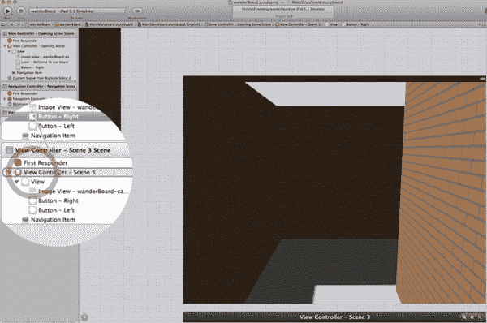

**图 10-25.** *连接场景 2：右侧按钮连接到场景 3。*

#### 场景 3：复制现有场景
- 场景 3：重命名。
- 场景 3：整理图形。
- 场景 3：建立连接。
  - 场景 3：按住 Control 键从按钮拖拽到新场景。

6. 如图图 10-25 所示，将**场景 2**中的“连接-向右”按钮连接到**视图控制器场景 3**。

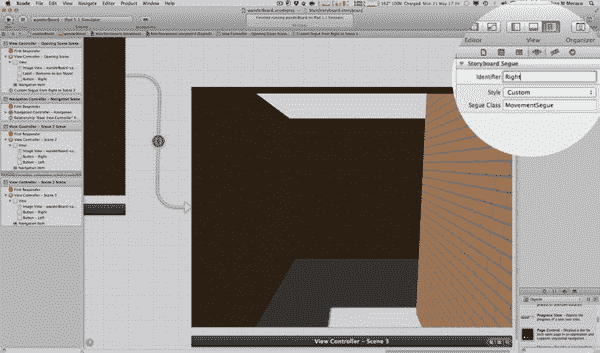

**图 10-26.** *编辑新转场的属性。*

- 场景 3：复制现有场景。
  - 场景 3：重命名。
  - 场景 3：整理图形。
  - 场景 3：建立连接。
    - 场景 3：按住 Control 键从按钮拖拽到新场景。
    - 场景 3：编辑转场的属性。

7. 类似图 10-18 的操作，选中该转场，在属性检查器中将转场类命名为`MovementSegue`，保持样式为 Custom，并将标识符改为*Right*，如图图 10-26 所示。

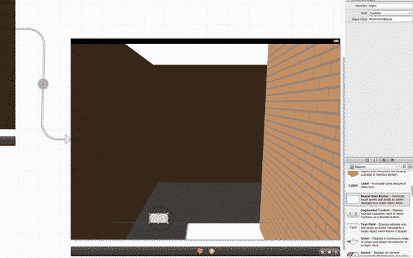

**图 10-27.** *场景 3：添加新的返回按钮：将圆角矩形按钮拖拽到视图上。*

- 场景 3：复制现有场景。
  - 场景 3：重命名。
  - 场景 3：整理图形。
  - 场景 3：建立连接。
    - 场景 3：按住 Control 键从按钮拖拽到新场景。
    - 场景 3：编辑转场的属性。
    - 场景 3：如果是死胡同，创建返回按钮。

8. 现在我们要做点新操作。你或许还没意识到，但你已经走到了一个死胡同。每次遇到死胡同，你都需要重复这些步骤。本质上，你需要处理返回按钮的显示逻辑，这样用户到达死胡同时就能原路返回。你肯定还记得为了实现这一点所写的所有代码。处理方法如下：首先，如图图 10-27 所示，将一个全新的圆角矩形按钮拖拽到画布上。

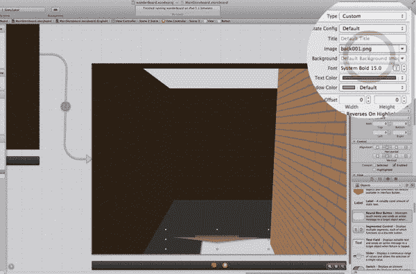

**图 10-28.** *场景 3：设置新的返回按钮的图像。*

- 场景 3：复制现有场景。
  - 场景 3：重命名。
  - 场景 3：整理图形。
  - 场景 3：建立连接。
    - 场景 3：按住 Control 键从按钮拖拽到新场景。
    - 场景 3：编辑转场的属性。
    - 场景 3：如果是死胡同，创建返回按钮。

9. 这个返回按钮是一个自定义按钮，你手头有它的图片。在属性检查器中，将其类型设为 Custom，并在 Image 中选择`back001.png`，如图图 10-28 所示。最后，将其尺寸设置为`295,680,389,68`。

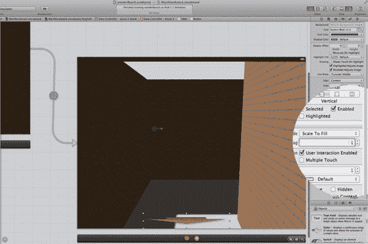

**图 10-29.** *场景 3：为新的返回按钮设置标签字段值为 1。*

- 场景 3：复制现有场景。
  - 场景 3：重命名。
  - 场景 3：整理图形。
  - 场景 3：建立连接。
    - 场景 3：按住 Control 键从按钮拖拽到新场景。
    - 场景 3：编辑转场的属性。
    - 场景 3：如果是死胡同，创建返回按钮。
    - 场景 3：编辑标签字段。
    - 场景 3：为按钮添加标题。

10. 你还需要利用第二种数据设置情况来配置返回按钮的标签。Storyboard 中几乎所有对象都有一个标签字段。如图图 10-29 所示，在属性检查器的视图部分，将标签字段设置为`1`。这里你将使用红色返回按钮的标签，这样当进入死胡同时，它的标签字段值为`0`。如代码所示，当标签为`0`时按钮隐藏，当标签为`1`时按钮可见。这样一来，用户在进入死胡同时不会看到返回按钮，但到达死胡同后就能看到按钮（因为此时标签已设为`1`），从而可以导航返回。

你还需要为按钮添加标题。在身份检查器的身份部分选中该按钮，在标签框中输入 *Button - Reverse*。至此，你就可以继续处理场景 4 了。

#### 场景 4

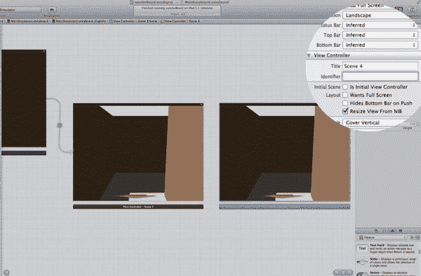

**图 10-30.** *复制场景 3 以创建场景 4，并将其拖拽到场景 3 的右侧。*

- 场景 4：复制现有场景。
  - 场景 4：放置到前一场景的上方或下方。
- 场景 4：**重命名**。
  - 场景 4：更改标题。
  - 场景 4：更改图像。
- 场景 4：整理图形。
- 场景 4：建立连接。

1. 这个操作与你之前在图 10-20 中所做的类似。点击场景 3 的停靠区，按`⌘`+D 复制，然后将新场景移动到场景 3 的右侧。同时，如图图 10-30 所示，将标题改为 *Scene 4*。选择图像，将其更改为`wanderBoard-cam04.png`，就像你在图 10-21 中所做的那样。

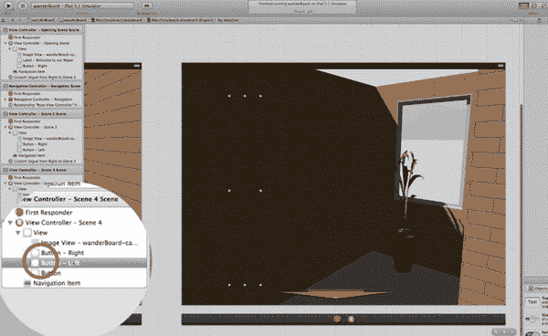

**图 10-31.** *隐藏不适用的元素：选择按钮 – 向左。*

- 场景 4：复制现有场景。
  - 场景 4：重命名。
  - 场景 4：整理图形。
    - 场景 4：隐藏不适用的元素。
  - 场景 4：建立连接。

2. 这是一个死胡同，所以你需要隐藏向右和向左的按钮，就像你在图 10-22 中所做的那样。参见图 10-31。

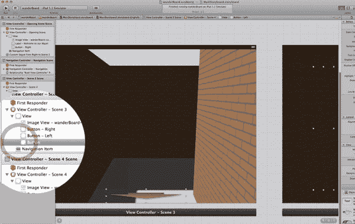

**图 10-32.** *连接场景 3：按钮 – 向右 到 场景 4。*

- 场景 4：复制现有场景。
  - 场景 4：重命名。
  - 场景 4：整理图形。
  - 场景 4：建立连接。
    - 场景 4：按住 Control 键从按钮拖拽到新场景。

3. 在视图控制器——场景 3 场景中，如图图 10-32 所示，将按钮 – 向右连接到视图控制器——场景 4 场景。

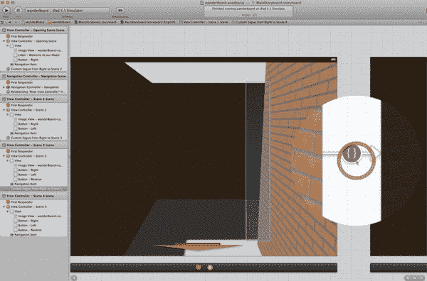

**图 10-33.** *点击两个场景之间的转场图标以选中该转场。*

- 场景 4：复制现有场景。
  - 场景 4：重命名。
  - 场景 4：整理图形。
  - 场景 4：建立连接。
    - 场景 4：按住 Control 键从按钮拖拽到新场景。
    - 场景 4：编辑转场的属性。

4. 根据按钮标签可知这是一个右转弯，因此如图图 10-33 所示选中该转场。在属性检查器中将转场类命名为`MovementSegue`，保持样式为 Custom，并将标识符改为 *Right*。没错，你会经常重复这个操作！注意，当你点击转场时，它会显示你选中的是哪个按钮！这在事情变得复杂时非常有用。

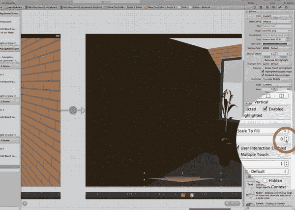

**图 10-34.** *场景 4：将返回按钮的标签字段设为 0（零）。*

- 场景 4：复制现有场景。
  - 场景 4：重命名。
  - 场景 4：整理图形。
  - 场景 4：建立连接。
    - 场景 4：按住 Control 键从按钮拖拽到新场景。
    - 场景 4：编辑转场的属性。
    - 场景 4：如果是死胡同：创建返回按钮。
    - 场景 4：编辑标签字段。

5. 你希望这个在死胡同中的返回按钮始终显示，因此如图图 10-34 所示，将其标签设为`0`。

构建并运行，看看效果。运行时，你会发现返回按钮似乎没有工作。此时能够调试至关重要，而这就是你在场景中命名按钮的原因。现在让我们开始调试。

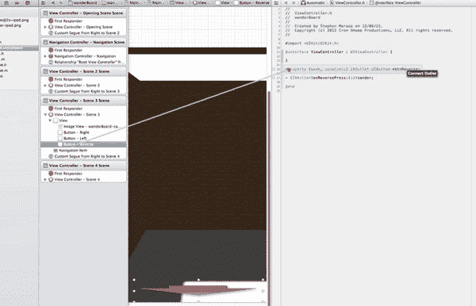

**图 10-35.** *调试场景 3：将返回按钮连接到它的属性。*

6.  返回 Storyboard，选择“返回”按钮，打开辅助编辑器，并确保右侧显示的是你的 `ViewController.h` 文件。你会发现你还没有设置按钮是什么，以及点击它时执行什么操作（没错，就是你在 `helloWorld` 中做过的那一套！）。因此，在你的第一个视图中，即 View Controller – Scene 3 场景，按住 Control 键从“返回”按钮拖拽到头文件中的 `btnReverse` 属性，如图 10-35 所示。

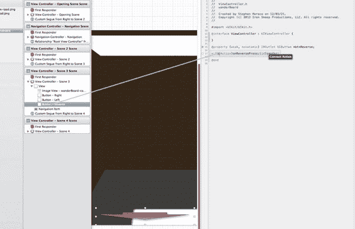

**图 10-36.** *调试场景 3：将“返回”按钮连接到操作方法。*

7.  你还需要设置将要执行的操作。再次选择“返回”按钮，按住 Control 键拖拽到头文件中的操作方法签名中。在图 10-36 中，该方法左侧原本为空的圆圈现在将被填充。

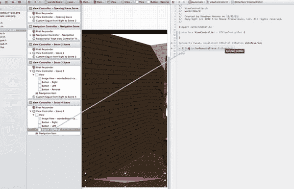

**图 10-37.** *调试场景 4：将“返回”按钮连接到操作方法。*

8.  在场景 4 中再次选择“返回”按钮，重复你在 图 10-35 中执行的步骤 1，然后执行 图 10-37 中显示的步骤 2。如你所见，你正在使用为每个视图实例化的同一个 `ViewController` 对象。因此，即使它显示已经连接过一次，你仍需要为每个视图重新连接。这就是我们“忘记”做的事情，以便能够切实强调这一点。

运行它，你会看到，当你进入死胡同时，“返回”按钮在你到达那里时才出现，并且现在它们能正常工作，帮助你离开。

非常棒。你在首次进入并走出死胡同上取得了很大进展。现在你已经掌握了构建迷宫其余部分所需的所有工具。

#### 场景 5

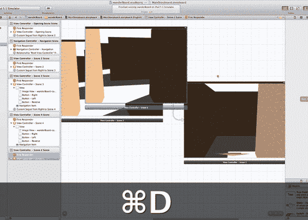

**图 10-38.** *复制场景 2 以创建场景 5。*

*   场景 5：复制现有场景。
    *   场景 5：将其放置到前一个场景的上方或下方。
*   场景 5：**重命名**。
    *   场景 5：更改标题。
    *   场景 5：更改图像。
*   场景 5：整理图形。
*   场景 5：建立连接。

1.  到目前为止，你一直从入口沿着迷宫的右手边路径前进。现在你需要处理左手边的路径。切换回标准编辑器模式。首先选择场景 2，然后按 `⌘`+D 键复制它，如图 10-38 所示。现在，将副本移动到场景 2 的上方和右侧，并将标题更改为*场景 5*，就像你在 图 10-8 中所做的那样。

    **注意：** 我们使用了场景 2，因为场景 3 和场景 4 包含“返回”按钮，而场景 5 并不需要这些按钮。

    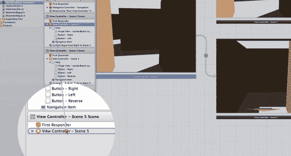

    **图 10-39.** *连接场景 2：按钮 – 左侧连接到场景 5。*

    *   场景 5：复制现有场景。
    *   场景 5：重命名。
    *   场景 5：整理图形。
    *   场景 5：建立连接。
        *   场景 5：按住 Control 键从按钮拖拽到新场景。
        *   场景 5：编辑转场的属性。
2.  按住 Control 键从场景 2 中的左侧按钮拖拽到场景 5 的 View Controller，如图 10-39 所示，就像你在 图 10-16 中所做的那样。选择创建的转场，在属性检查器中将转场类命名为 `MovementSegue`，保持样式为“自定义”，并将标识符更改为 *Left*。

    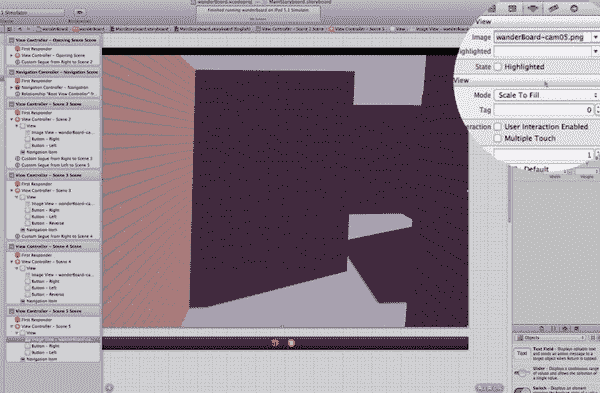

    **图 10-40.** *场景 5：更改图像。*

    *   场景 5：复制现有场景。
    *   场景 5：**重命名**。
        *   场景 5：更改标题。
        *   场景 5：更改图像。
    *   场景 5：整理图形。
    *   场景 5：建立连接。
3.  我们这里稍微打乱了顺序——将图像更改为 `wanderBoard-cam05.png`，如图 10-40 所示。

    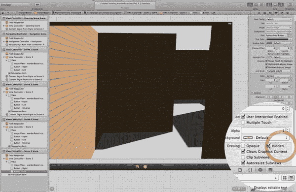

    **图 10-41.** *场景 5：隐藏左侧按钮。*

    *   场景 5：复制现有场景。
    *   场景 5：重命名。
    *   场景 5：整理图形。
        *   场景 5：隐藏不适用的元素。
    *   场景 5：建立连接。
4.  对于场景 5 的按钮，你并没有一个左侧出口，因此选择“按钮 – 左侧”并将其隐藏，如图 10-41 所示。

    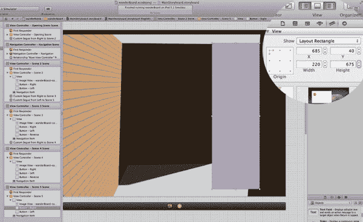

    **图 10-42.** *场景 5：编辑右侧按钮。*

    *   场景 5：复制现有场景。
    *   场景 5：重命名。
    *   场景 5：整理图形。
        *   场景 5：隐藏不适用的元素。
        *   场景 5：编辑按钮。
        *   场景 5：使按钮可见。
        *   场景 5：将图像替换为新图像（已完成）。
        *   场景 5：配置新按钮。
            *   场景 5：复制按钮。
            *   场景 5：重置按钮参数。
            *   场景 5：按钮 – 右侧。
            *   场景 5：再次设置为透明。
            *   场景 5：纠正错误。
    *   场景 5：建立连接。
5.  你确实有一个右侧按钮。你现在已经熟悉流程了。使其可见，并将其位置大小设置为(685, 40, 220, 675)，如图 10-42 所示。现在，通过将其设置为“显示触摸高亮”来纠正错误。然后我们继续处理场景 6。

#### 场景 6

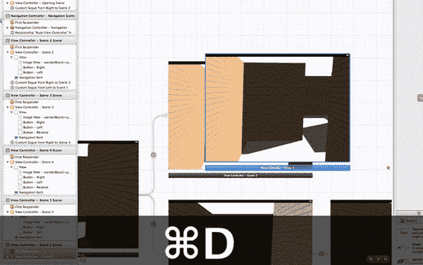

**图 10-43.** *复制场景 5 以创建场景 6。*

*   场景 6：复制现有场景。
    *   场景 6：将其放置到前一个场景的上方或下方。
*   场景 6：**重命名**。
    *   场景 6：更改标题。
    *   场景 6：更改图像。
*   场景 6：整理图形。
*   场景 6：建立连接。

1.  你知道这是一个右侧出口，并且没有特殊情况，所以只需复制你刚才创建的那个。点击场景 5 的停靠栏，然后按 `⌘`+D 键复制它，如图 10-43 所示。将标题更改为*场景 6*，并将图像更改为 `wanderBoard-cam06.png`。

    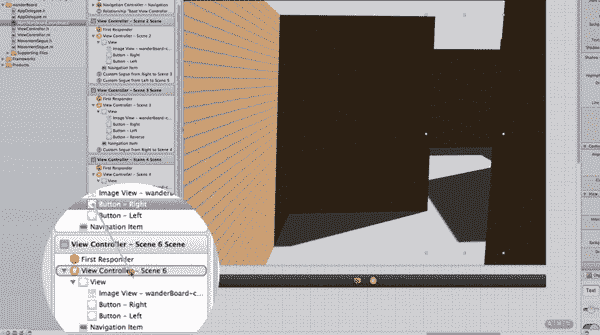

    **图 10-44.** *连接场景 5：按钮 – 右侧连接到场景 6。*

    *   场景 6：复制现有场景。
    *   场景 6：重命名。
    *   场景 6：整理图形。
    *   场景 6：建立连接。
        *   场景 6：按住 Control 键从按钮拖拽到新场景。
        *   场景 6：编辑转场的属性。
2.  你需要创建一个向右的转场以到达场景 6。按住 Control 键从场景 5 的 View Controller 中的右侧按钮拖拽到场景 6 的 View Controller，如图 10-44 所示。完成后，选择创建的转场，在属性检查器中将转场类命名为 `MovementSegue`，保持样式为“自定义”，并将标识符更改为 *Right*。

    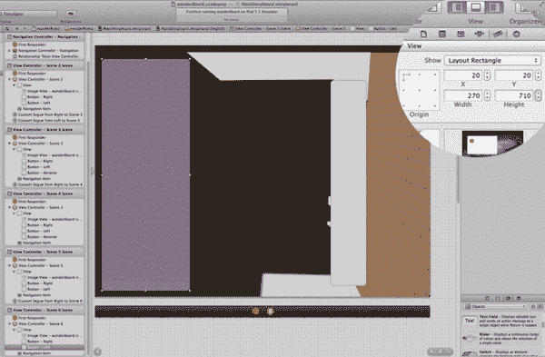

    **图 10-45.** *场景 6：编辑按钮 – 左侧。*

    *   场景 6：复制现有场景。
    *   场景 6：重命名。
    *   场景 6：整理图形。
        *   场景 6：隐藏不适用的元素。
        *   场景 6：编辑按钮。
            *   场景 6：使按钮可见。
        *   场景 6：将图像替换为新图像（已完成）。
        *   场景 6：配置新按钮。
            *   场景 6：复制按钮。
            *   场景 6：重置按钮参数。
                *   场景 6：按钮 – 右侧。
            *   场景 6：再次设置为透明。
            *   场景 6：纠正错误。
    *   场景 6：建立连接。
3.  在场景 6 中，选择右侧按钮，使其可见，并将其位置大小设置为(720, 85, 110, 630)。通过将其设置为“显示触摸高亮”来纠正错误。选择左侧按钮，使其可见，并将其位置大小设置为(20, 20, 270, 710)，如图 10-45 所示。同样通过将其设置为“显示触摸高亮”来纠正错误。将两个按钮都设置为透明，然后继续处理场景 7。

#### 场景 7

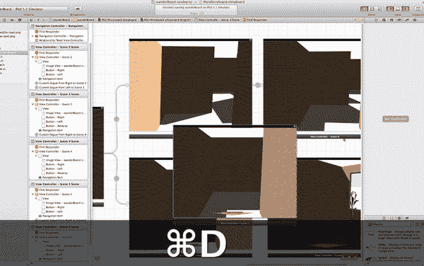

**图 10-46.** *复制场景 3 以创建场景 7。*

- 场景 7：复制一个现有的中间死路场景。
  - 场景 7：将其放置在前一个场景的上方或下方。
- 场景 7：**重命名**。
  - 场景 7：更改标题。
  - 场景 7：更改图片。
- 场景 7：整理图形元素。
- 场景 7：建立连接。

1. 左转通向另一条死路。下一个场景将是一个中间死路场景，意为通往死路的途中。你需要复制现有的唯一一个中间死路场景，即视图控制器 – 场景 3。选中场景 3，按 `+D` 组合键复制它，如图 10-46 所示。将其放置在场景 6 的右上方。将标题更改为 *场景 7*。

   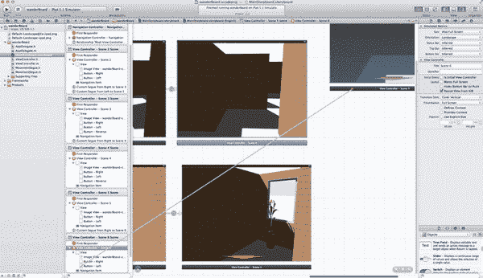

   **图 10-47.** *将场景 6 的“按钮 – 左”连接到场景 7。*

   - 场景 7：复制现有场景。
   - 场景 7：重命名。
   - 场景 7：整理图形元素。
   - 场景 7：建立连接。
     - 场景 7：从按钮按住 Control 键拖拽到新场景。
     - 场景 7：编辑转场的属性。

2. 你需要将场景 6 的左按钮连接到这个新视图。这次我们用一种略有不同的方式来做，只是为了好玩。从场景 6 的左按钮按住 Control 键拖拽到视图控制器 – 场景 7 的场景停靠区，如图 10-47 所示。选中创建的转场，在属性检查器中将转场类命名为 `MovementSegue`，保持样式为“自定义”，并将标识符更改为 *Left*。

   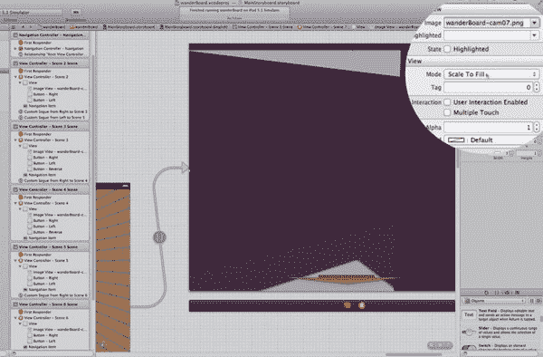

   **图 10-48.** *场景 7：更改图片。*

   - 场景 7：复制现有场景。
     - 场景 7：将其放置在前一个场景的上方或下方。
   - 场景 7：**重命名**。
     - 场景 7：更改标题。
     - 场景 7：更改图片。
   - 场景 7：整理图形元素。
   - 场景 7：建立连接。

3. 选中图片，在属性检查器中，将 Image 更改为 `wanderBoard-cam07.png`，如图 10-48 所示。

   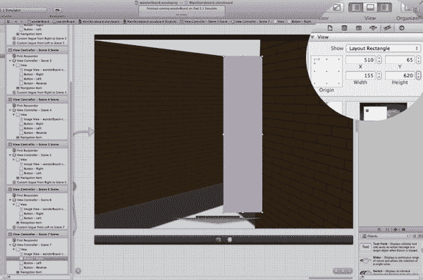

   **图 10-49.** *场景 7：编辑“按钮 – 右”。*

   - 场景 7：复制现有场景。
   - 场景 7：重命名。
   - 场景 7：整理图形元素。
     - 场景 7：隐藏不适用元素。
     - 场景 7：编辑按钮。
       - 场景 7：使按钮可见。
     - 场景 7：用新图片替换旧图片（已完成）。
     - 场景 7：配置新按钮。
       - 场景 7：复制按钮。
       - 场景 7：重置按钮参数。
         - 场景 7：按钮 – 右。
       - 场景 7：再次设为透明。
       - 场景 7：修正错误。
   - 场景 7：建立连接。
     - 场景 7：从按钮按住 Control 键拖拽到新场景。
     - 场景 7：编辑转场的属性。
     - 场景 7：如果是死路，创建返回按钮。
       - 场景 7：编辑“标签”字段。

4. 选中场景 7 中的右按钮并使其可见。然后选中左按钮，确保它被隐藏。当然，返回按钮将会显示出来。回到右按钮，选中它，并将其设置为 510,65,155,620，如图 10-49 所示。通过将其设置为“触摸时显示高亮”并使其透明来修正这个错误。同时不要忘记点击返回按钮，并记住这是一个中间返回按钮，将其 `Tag` 设置为 1。接下来该继续处理场景 8 了。

#### 场景 8

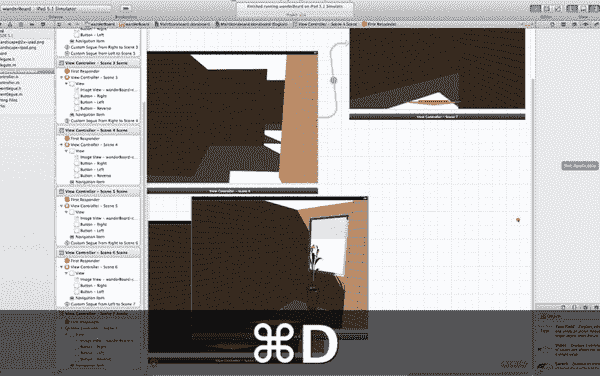

**图 10-50.** *复制场景 4 以创建场景 8。*

- 场景 8：复制一个现有的死路场景。
  - 场景 8：将其放置在前一个场景的上方或下方。
- 场景 8：重命名。
- 场景 8：整理图形元素。
- 场景 8：建立连接。

1. 这次你需要复制一个死路场景。选中视图控制器 – 场景 4 的场景停靠区，按 `+D` 组合键复制它，如图 10-50 所示。将其放置在场景 7 的右侧。

   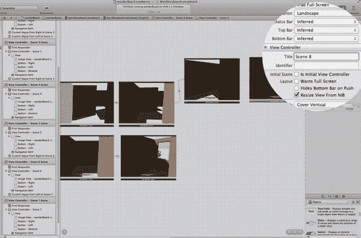

   **图 10-51.** *场景 8：更改标题。*

   - 场景 8：复制现有的死路场景。
   - 场景 8：**重命名**。
     - 场景 8：更改标题。
   - 场景 8：整理图形元素。
   - 场景 8：建立连接。

2. 将标题更改为 *场景 8*，如图 10-51 所示。

   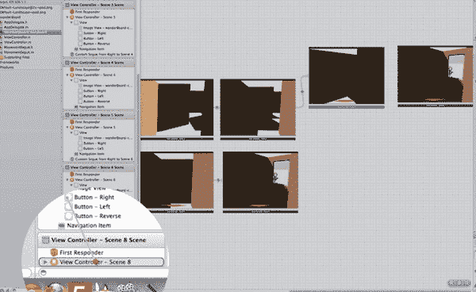

   **图 10-52.** *将场景 7 的“按钮 – 右”连接到场景 8。*

   - 场景 8：复制现有场景。
   - 场景 8：重命名。
     - 场景 8：更改标题。
     - 场景 8：更改图片。
   - 场景 8：整理图形元素。
   - 场景 8：建立连接。
     - 场景 8：从按钮按住 Control 键拖拽到新场景。
     - 场景 8：编辑转场的属性。

3. 场景 7 的右按钮是你的转场触发点，所以按住 Control 键从它拖拽到场景 8 的视图控制器，如图 10-52 所示。选中创建的转场，在属性检查器中将转场类命名为 `MovementSegue`，保持样式为“自定义”，并将标识符更改为 *Right*。选中图片，将其更改为 `wanderBoard-cam08.png`。现在我们可以继续处理场景 9 了。

#### 场景 9

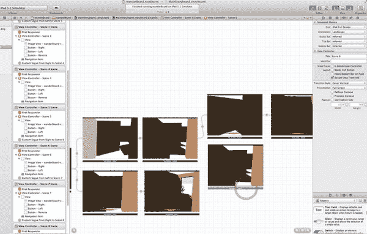

**图 10-53.** *复制场景 6 以创建场景 9，并将其放置在场景 7 的正下方。*

- 场景 9：复制一个现有场景。
  - 场景 9：将其放置在上一场景的上方或下方。
- 场景 9：重命名。
- 场景 9：整理图形。
- 场景 9：建立连接。

1. 要创建右侧部分，请复制场景 6，并将其拖到场景 6 的右侧并稍微偏下的位置，如图 10-53 所示。

   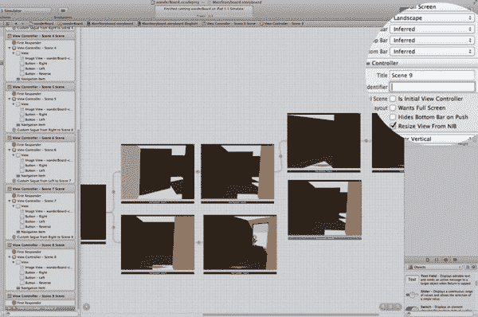

   **图 10-54.** *场景 9：更改标题。*

   - 场景 9：复制一个现有场景。
   - 场景 9：重命名。
     - 场景 9：更改标题。
   - 场景 9：整理图形。
   - 场景 9：建立连接。

2. 将标题更改为 *Scene 9*，如图 10-54 所示。

   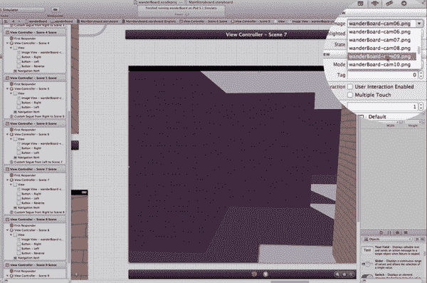

   **图 10-55.** *场景 9：更改图像。*

   - 场景 9：复制一个现有场景。
   - 场景 9：重命名。
     - 场景 9：更改标题。
     - 场景 9：更改图像。
   - 场景 9：整理图形。
   - 场景 9：建立连接。

3. 将图像更改为 `wanderBoard-cam09.png`，如图 10-55 所示。

   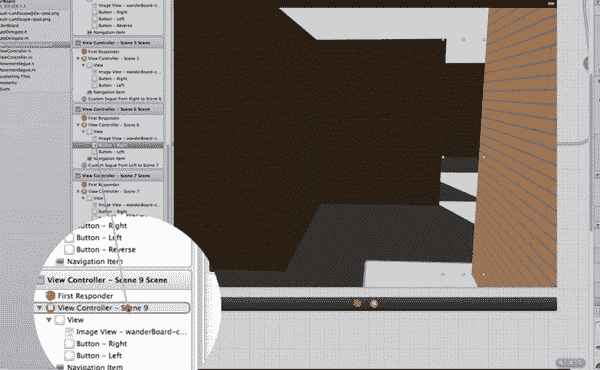

   **图 10-56.** *连接场景 6：右侧按钮到场景 9。*

   - 场景 9：复制一个现有场景。
   - 场景 9：重命名。
   - 场景 9：整理图形。
   - 场景 9：建立连接。
     - 场景 9：按住 Control 键从按钮拖拽到新场景。
     - 场景 9：编辑转场的属性。

4. 转向场景 9 的转场始于场景 6 的右侧按钮。按住 Control 键从它拖拽到场景 9，如图 10-56 所示。选中创建好的转场，在属性检查器中，将 Segue 类命名为 `MovementSegue`，保持样式为“自定义”，并将标识符更改为 *Right*。

   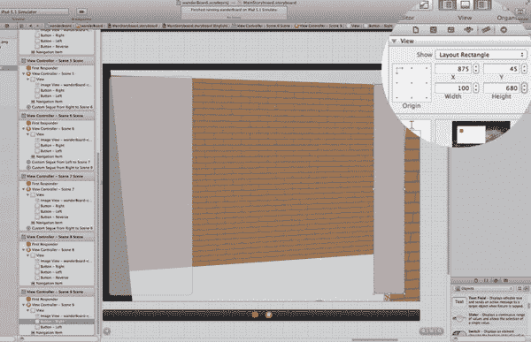

   **图 10-57.** *场景 9：编辑“右侧”按钮的大小和位置。*

   - 场景 9：复制一个现有场景。
   - 场景 9：重命名。
   - 场景 9：整理图形。
     - 场景 9：隐藏不适用的元素。
     - 场景 9：编辑按钮。
       - 场景 9：使按钮可见。
     - 场景 9：用新图像替换图像（已完成）。
     - 场景 9：配置新按钮。
       - 场景 9：复制按钮。
       - 场景 9：重置按钮参数。
         - 场景 9：“右侧”按钮。
       - 场景 9：再次设为透明。
       - 场景 9：修复错误。
   - 场景 9：建立连接。

5. 在这种情况下，你的方向确实有两个选项，因此请保留两个按钮。首先显示左侧按钮，然后显示右侧按钮，使它们都可见。将右侧按钮从 875,45,100,680（如图 10-57 所示）更改为 875,45,100,680，并将左侧按钮设为 20,20,100,710。将它们改回透明状态，并确保它们都启用了“显示触摸时高亮”。

至此，你已经完成了第 4a 步以及本章的全部内容。你已经完成了 wanderBoard 的所有代码，并完成了前九个场景的实现。干得好！

在下一章中，你将完成剩余的场景，并在此过程中进行一些修补。到下一章结束时，你将测试并运行完整的 wanderBoard 应用程序。准备好了吗？那就继续往下读吧！

