# 第 11 章

## 单一视图 #3：wanderBoard 第三部分

至此，你已经创建了九个场景并完成了代码。在这最后一章中，你将完成 wanderBoard 应用的剩余场景。

### 第 4b 步：创建最终的九个场景

我们认为你已经做得足够多了，现在只需要有限的一些指令，就像客户、老板或熟练的同事/导师可能会给你的那样。

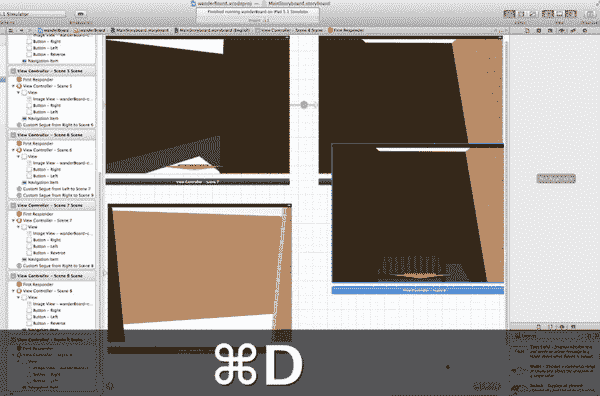

**图 11-1.** 复制场景 8 以创建场景 10。

- 场景 10：复制一个现有的死胡同场景。
- 场景 10：将其放置在上一场景的上方或下方。
- 场景 10：重命名。
- 场景 10：更改标题。
- 场景 10：整理图形。
- 场景 10：建立连接。

1. 这次你需要复制死胡同场景。选择视图控制器 – 场景 8 的场景停靠区，并按 `Command`+`D` 进行复制，如图 11-1 所示。将其放置在场景 9 的右下方，并将标题更改为“场景 10”。

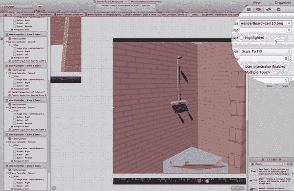

**图 11-2.** 场景 10：设置所需的图像。

- 场景 10：复制一个现有的死胡同场景。
- 场景 10：将其放置在上一场景的上方或下方。
- 场景 10：重命名。
- 场景 10：更改标题。
- 场景 10：更改图像。
- 场景 10：整理图形。
- 场景 10：建立连接。

2. 将图像更改为 `wanderBoard-cam10.png`，如图 11-2 所示。这里你正在创建另一个死胡同。你之前没有完成上一个死胡同的“后退”按钮的连线，所以让我们在完成场景 10 之前修复场景 7 和场景 8。

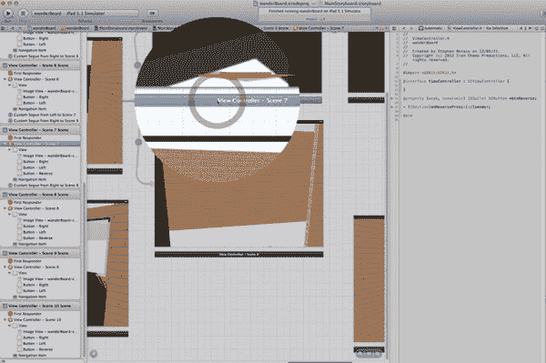

**图 11-3.** 选择场景 7，以便完成一些遗漏的步骤。

3. 还记得上次运行测试时，你不得不返回去将红色按钮连接到代码吗？我们不要再重复那个错误了。我们现在就来做这件事。选择场景 7，如图 11-3 所示。

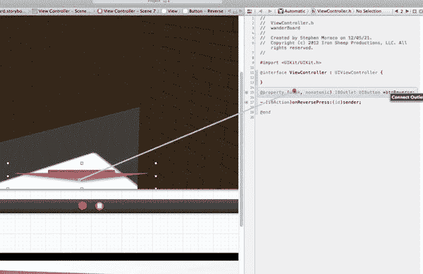

**图 11-4.** 将场景 7 的“后退”按钮连接到其属性。

4. 打开助理编辑器，并确保你的头文件在右侧。从按钮按住 Control 键拖拽到头文件，如图 11-4 所示，将按钮连接到其属性。

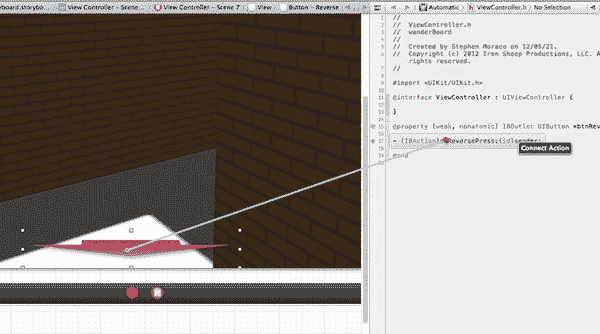

**图 11-5.** 将场景 7 的“后退”按钮连接到其操作方法。

5. 从场景 7 中的按钮按住 Control 键拖拽到头文件，将按钮连接到操作方法，如图 11-5 所示。

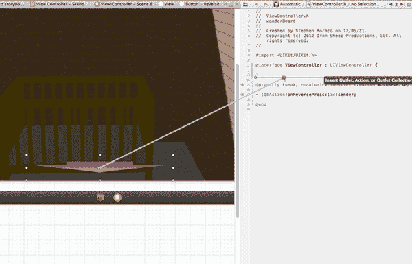

**图 11-6.** 将场景 8 的“后退”按钮连接到属性。

6. 现在对场景 8 执行相同操作。选择场景 8 后，从按钮按住 Control 键拖拽到头文件中的属性处，如图 11-6 所示。

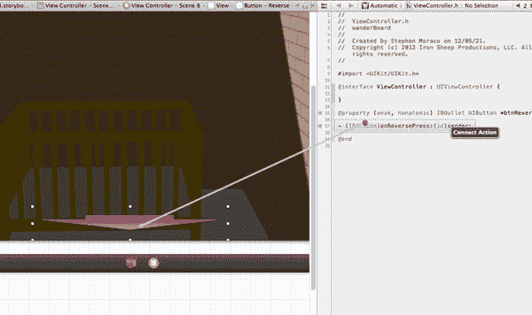

**图 11-7.** 将场景 8 的“后退”按钮连接到其操作方法。

7. 从场景 8 中的按钮按住 Control 键拖拽到头文件，连接到操作方法，如图 11-7 所示。

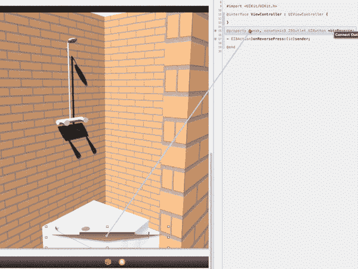

**图 11-8.** 将场景 10 的“后退”按钮连接到其属性。

8. 现在，回到场景 10。选择场景 10，并从按钮按住 Control 键拖拽到头文件，如图 11-8 所示，建立连接到属性的关系。

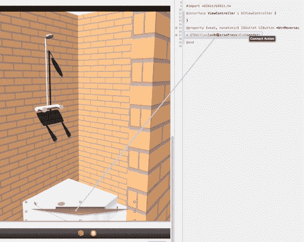

**图 11-9.** 将场景 10 的按钮连接到其操作方法。

9. 从场景 10 中的按钮按住 Control 键拖拽到头文件，连接操作方法，如图 11-9 所示。

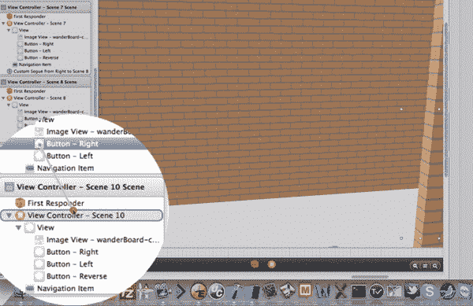

**图 11-10.** 创建从场景 9 的“右”按钮到场景 10 的转场。

- 场景 10：复制一个现有场景。
- 场景 10：重命名。
- 场景 10：整理图形。
- 场景 10：建立连接。
- 场景 10：从按钮按住 Control 键拖拽到新场景。
- 场景 10：编辑转场的属性。

10. 如前所述，你需要从场景 9 中的“右”按钮连接到场景 10，如图 11-10 所示。你可以关闭助理编辑器，选择已创建的转场，转到属性检查器，将转场类命名为 `MovementSegue`，保持样式为“自定义”，并将标识符更改为“Right”。

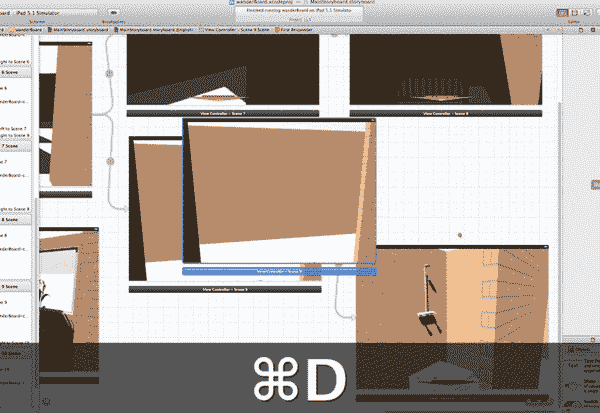

**图 11-11.** 复制场景 9 以创建场景 11。

- 场景 11：复制一个现有的死胡同场景。
- 场景 11：将其放置在上一场景的上方或下方。
- 场景 11：重命名。
- 场景 11：更改标题。
- 场景 11：整理图形。
- 场景 11：建立连接。

11. 场景 11 不会是一个死胡同，所以复制场景 9，如图 11-11 所示。将其拖拽到场景 9 的右上方——你会注意到它放不下。缩小视图，并将上方的视图行向上移动，以腾出一些空间。现在将标题更改为“场景 11”。

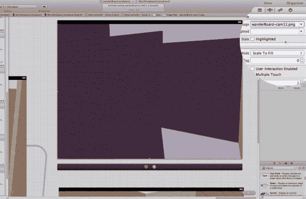

**图 11-12.** 更改场景 11 的图像。

- 场景 11：复制一个现有的死胡同场景。
- 场景 11：将其放置在上一场景的上方或下方。
- 场景 11：重命名。
- 场景 11：更改标题。
- 场景 11：更改图像。
- 场景 11：整理图形。
- 场景 11：建立连接。

12. 将场景 11 的图像更改为 `wanderBoard-cam11.png`，如图 11-12 所示。

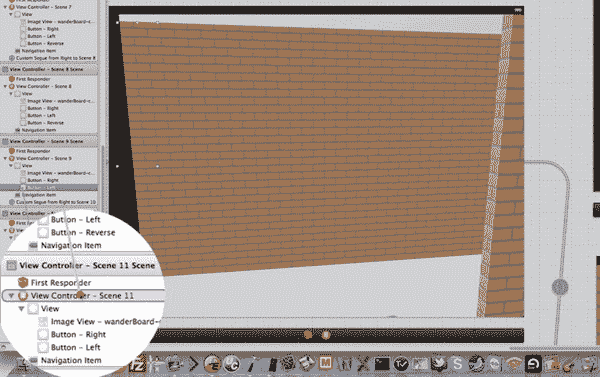

**图 11-13.** 创建从场景 10 的“左”按钮到场景 11 的转场。

- 场景 11：复制一个现有场景。
- 场景 11：重命名。
- 场景 11：整理图形。
- 场景 11：建立连接。
- 场景 11：从按钮按住 Control 键拖拽到新场景。
- 场景 11：编辑转场的属性。

13. 将场景 9 中的“左”按钮连接到场景 11，如图 11-13 所示。现在选择已创建的转场，在属性检查器中将转场类命名为 `MovementSegue`，保持样式为“自定义”，并将标识符更改为“Left”。

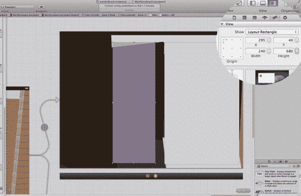

**图 11-14.** 场景 11：设置“左”按钮的大小和位置。

- 场景 11：复制一个现有场景。
- 场景 11：重命名。
- 场景 11：整理图形。
- 场景 11：删除不适用元素。
- 场景 11：编辑按钮。
- 场景 11：使按钮可见。
- 场景 11：用新图像替换图像（已完成）。
- 场景 11：配置新按钮。
- 场景 11：复制按钮（已完成）。
- 场景 11：重置按钮参数。
- 场景 11：“右”按钮。
- 场景 11：再次设置为透明。
- 场景 11：修正错误。
- 场景 11：建立连接。

14. 选择场景 11 的两个按钮并使它们可见。将“右”按钮设置为 `585,40,420,90`，将“左”按钮设置为 `295,40,240,680`，如图 11-14 所示。现在将它们改回透明，并确保它们都显示“触摸时高亮”。

**注意：** 当你继续处理场景 12-17 时，将不再使用这些分步骤。我们将简单地用叙述性文字与你交流，此时你应该能够跟上。

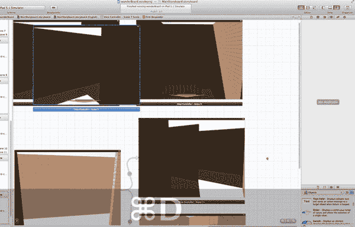

**图 11-15.** 复制场景 7 以创建场景 12。

15. 场景 12 将是另一个死胡同——具体来说，是一个中间死胡同。因此，复制场景 7，如图 11-15 所示，并将其放置在场景 11 的右上方。将标题更改为“场景 12”，并将图像更改为 `wanderBoard-cam12.png`。

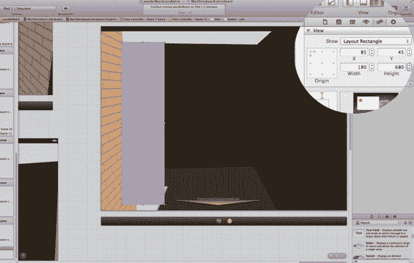

**图 11-16.** 场景 12：配置按钮。

16. 对于场景 12，你可以“后退”和“向左”，但不能“向右”。因此，隐藏“右”按钮，显示“左”按钮，并使其在 `85,45,180,680` 位置可见，如图 11-16 所示。现在再次将其设置为透明，并确保它显示“触摸时高亮”。将“后退”按钮的标签设置为中间级别——即设置为 1。记住要将“后退”按钮同时连接到属性和操作方法！

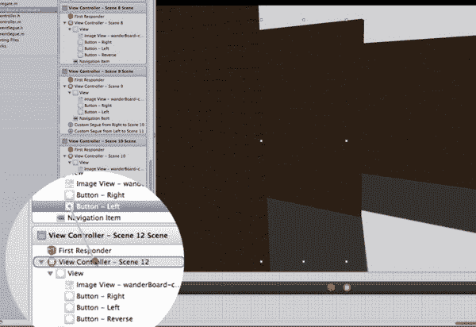

**图 11-17.** 将场景 11 的“左”按钮连接到场景 12。

17. 将场景 11 的“左”按钮连接到场景 12，如图 11-17 所示。现在选择已创建的转场，在属性检查器中将转场类命名为 `MovementSegue`，保持样式为“自定义”，并将标识符更改为“Left”。

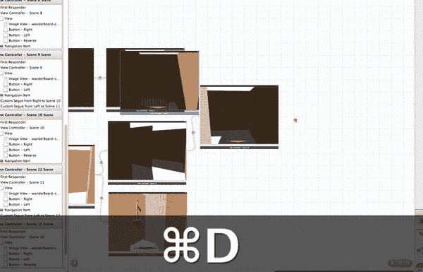

**图 11-18.** 复制场景 8 以创建场景 13。

18. 你知道，在场景 12 的中间死胡同之后，就是真正的死胡同，那就是场景 13。因此，复制场景 8，如图 11-18 所示。将其放置在场景 12 的右侧。将标题更改为“场景 13”。

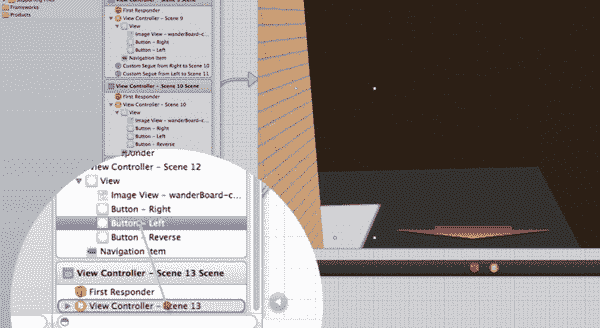

**图 11-19.** 将场景 12 的“左”按钮连接到场景 13。

19. 将场景 12 中的“左”按钮连接到场景 13，如图 11-19 所示。选择已创建的转场，在属性检查器中将转场类命名为 `MovementSegue`，保持样式为“自定义”，并将标识符更改为“Left”。将图像更改为 `wanderBoard-cam13.png`。

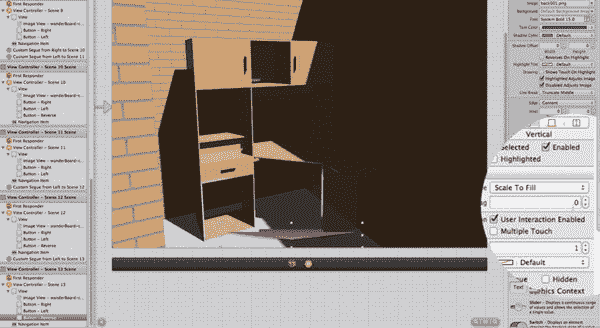

**图 11-20.** 场景 13：配置按钮。

20. 确保“右”按钮已隐藏，“左”按钮已隐藏，并且“后退”按钮的标签设置为 0，如图 11-20 所示。另外，别忘了将“后退”按钮连接到属性和操作方法！

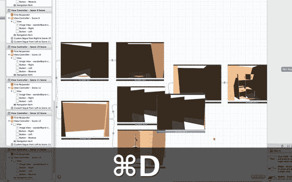

**图 11-21.** 复制场景 11 以创建场景 14。

21. 你不再需要进入死胡同，因此复制场景 11，如图 11-21 所示。将其放置在场景 11 的右下方。

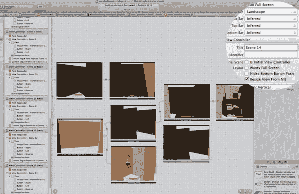

**图 11-22.** 设置场景 14 的标题。

22. 将标题设置为“场景 14”，如图 11-22 所示。

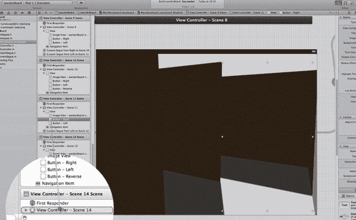

**图 11-23.** 将场景 11 的“右”按钮连接到场景 14。

23. 你需要一个从场景 11 的“右”按钮到场景 14 的转场，如图 11-23 所示。选择已创建的转场，在属性检查器中将转场类命名为 `MovementSegue`，保持样式为“自定义”，并将标识符更改为“Right”。将图像更改为 `wanderBoard-cam14.png`。

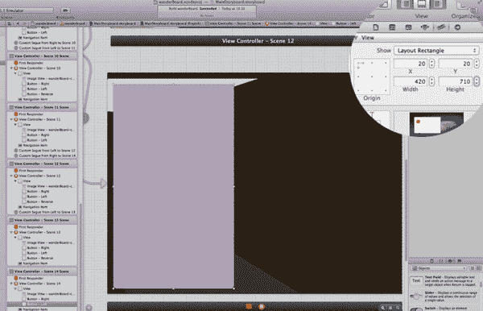

**图 11-24.** 配置场景 14 的按钮。

24. 你只有一个地方可以去，那就是“向左”。因此，隐藏“右”按钮。显示“左”按钮，然后将其设置为 `20,20,420,720`，如图 11-24 所示。然后将其设置为透明和“触摸时高亮”。

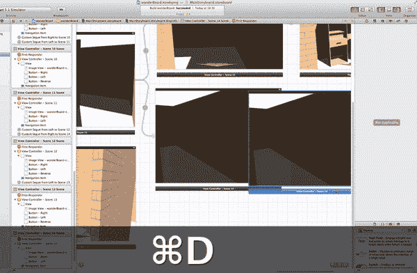

**图 11-25.** 复制场景 14 以创建场景 15。

25. 复制场景 14，如图 11-25 所示，并将其放置在场景 14 的左侧。

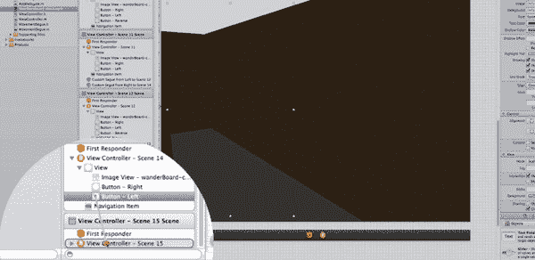

**图 11-26.** 将场景 14 的“左”按钮连接到场景 15。

26. 将标题更改为“场景 15”。因为它只能“向左”，所以将场景 14 的“左”按钮连接到场景 15，如图 11-26 所示。选择已创建的转场，在属性检查器中将转场类命名为 `MovementSegue`，保持样式为“自定义”，并将标识符更改为“Left”。将图像更改为 `wanderBoard-cam15.png`。

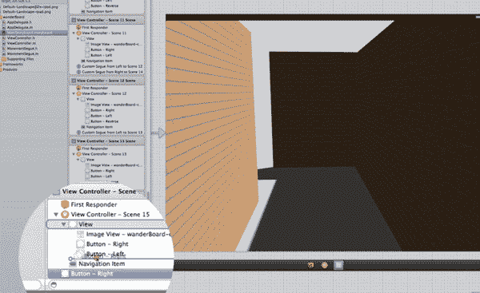

**图 11-27.** 场景 15：复制“右”按钮以创建一个新的“前进”按钮。

27. 你需要创建一个“前进”按钮。复制“右”按钮，然后将其向上移动，如图 11-27 所示。

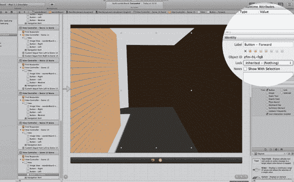

**图 11-28.** 场景 15：命名新的“前进”按钮。

28. 将“前进”按钮命名为 `Button-Forward`，如图 11-28 所示。

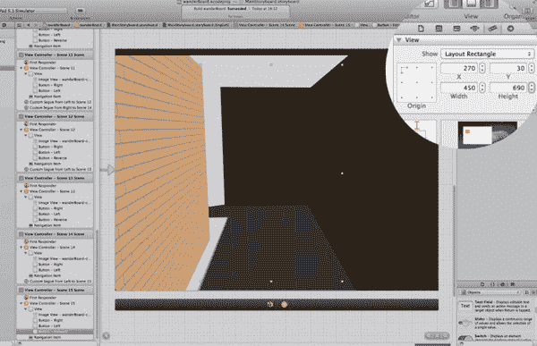

**图 11-29.** 配置场景 15 的“前进”按钮。

29. 确保“右”和“左”按钮都隐藏，并将“前进”按钮设置为 `270,30,450,690`，如图 11-29 所示。

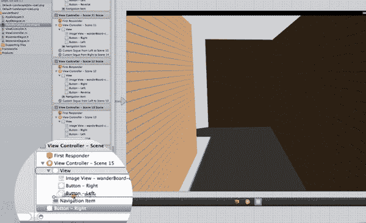

**图 11-30.** 复制场景 14 以创建场景 16。

30. 你不再需要“前进”按钮，因此只需复制场景 14，如图 11-30 所示。将其放置在场景 15 的右侧。将标题更改为“场景 16”。

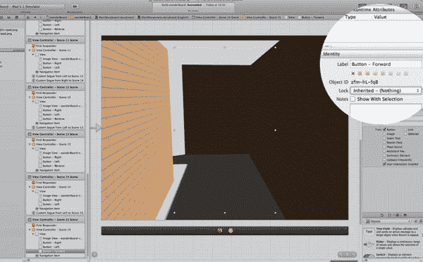

**图 11-31.** 场景 16：选择图像视图并更改名称。

31. 有时，在侧边栏中选择图像视图（如图 11-31 所示）比尝试在按钮周围点击要容易。因此，选择它并将图像更改为 `wanderBoard-cam16.png`。此外，因为你复制了这个场景，你的“左”按钮可能已经在正确的位置，但请检查它是否在 `20,20,420,710`，是否未隐藏，并且是否设置为显示“触摸时高亮”。

**图 11-32.** 将场景 15 的“前进”按钮连接到场景 16。

32. 你的转场从你刚刚制作的特殊“前进”按钮连接到这里的场景 16。因此，将它们连接起来，如图 11-32 所示。选择已创建的转场，在属性检查器中将转场类命名为 `MovementSegue`，保持样式为“自定义”，并将标识符更改为“Forward”。

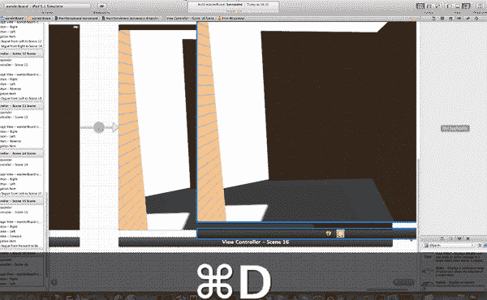

**图 11-33.** 复制场景 16 以创建场景 17。

33. 复制场景 16，如图 11-33 所示，并将其设为场景 17。将其放置在场景 16 的右侧。将标题设置为“场景 17”，并将图像设置为 `wanderBoard-cam17.png`。

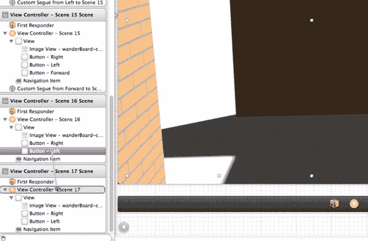

**图 11-34.** 将场景 16 的“左”按钮连接到场景 17。

34. 将场景 16 的“左”按钮连接到场景 17，如图 11-34 所示。选择已创建的转场，在属性检查器中将转场类命名为 `MovementSegue`，保持样式为“自定义”，并将标识符更改为“Left”。

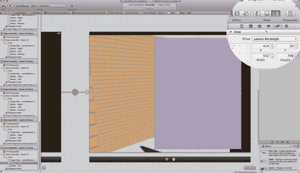

**图 11-35.** 配置场景 17 的按钮。

35. 回到新的场景 17，我们来配置按钮。确保你的“左”按钮已隐藏（因为你没有使用它）。确保“右”按钮可见，并将其位置从 `414,20,552,708` 更改，如图 11-35 所示。使其透明，并确保显示“触摸时高亮”。

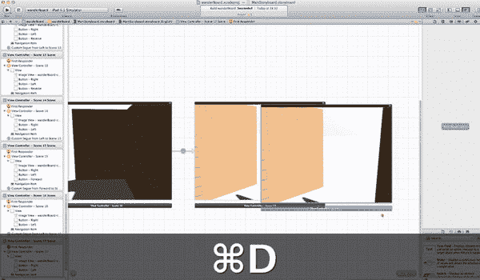

**图 11-36.** 复制场景 17 以创建最终场景（场景 18）。

36. 复制场景 17，如图 11-36 所示。将其放置在场景 17 的右侧。

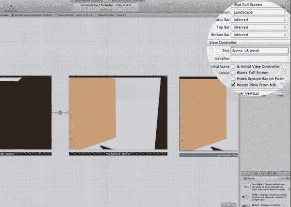

**图 11-37.** 场景 18：设置最终标题。

37. 将标题更改为“场景 18（终点）”，如图 11-37 所示。

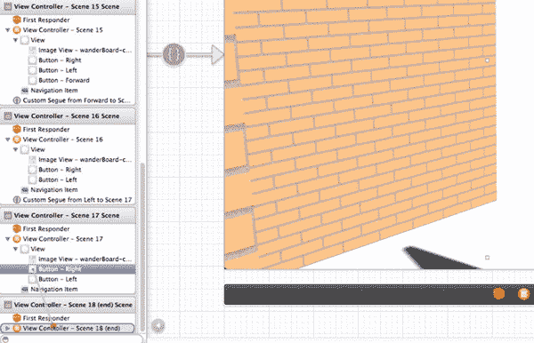

**图 11-38.** 将场景 17 的“右”按钮连接到场景 18。

38. 将场景 17 中的“右”按钮连接到最终场景，如图 11-38 所示。选择已创建的转场，在属性检查器中将转场类命名为 `MovementSegue`，保持样式为“自定义”，并将标识符更改为“Right”。这个场景上没有按钮，所以通过将所有按钮更改为隐藏来隐藏它们。

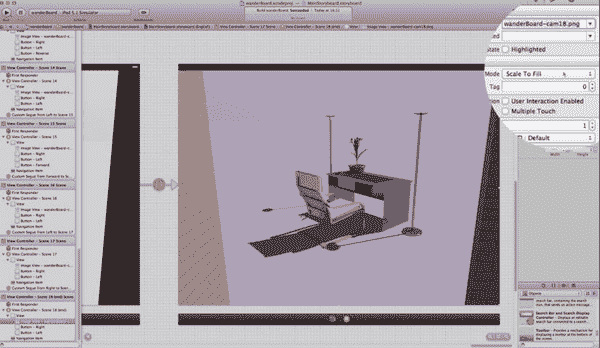

**图 11-39.** 场景 18：更改最后一张图像。

39. 你终于到达了迷宫的终点！将图像更改为 `wanderBoard-cam18.png`，如图 11-39 所示。让我们构建并运行它。哎呀，我们遇到了一些错误，按钮不工作了。

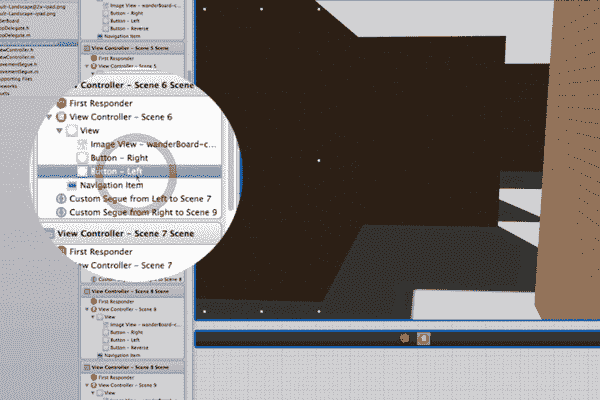

**图 11-40.** 调试：寻找并修复最后的问题（首先是场景 6）。

40. 场景 6 中的“左”按钮不工作，因此我们选择它，如图 11-40 所示，果然它还是隐藏的。取消选中“隐藏”复选框。
41. 对场景 9 中的“左”按钮重复相同步骤。
42. 对场景 11 中的“左”按钮重复相同步骤。

**图 11-41.** 它成功了！

43. 运行它……祝贺你！它成功了（图 11-41）！

恭喜你完成了 wanderBoard 应用！在这个应用中，你已经看到，只需很少的代码和一点故事板内容，你就可以创建一个相当有趣但又简单的应用。你体验到了在故事板画布上复制视图的强大功能，特别是当每个视图中都有通用的组件时。与从头开始逐个创建每个视图相比，复制真的节省了时间。我们创建这个应用的速度之快，确实让我们自己都感到惊讶。我们希望与你分享这份惊讶，以及创建这个应用的乐趣。

