# 第 3 章：介绍开发者与调试工具

开发 Web 应用需要专门的调试工具，或者甚至存在这样的工具，这并非显而易见。就在不久之前，前端开发还严重缺乏用于分析和调试页面组件的优秀工具。但 Web 已经发生了巨大的演变：前端调试工具如雨后春笋般涌现，如今大多数主流浏览器都内置了调试工具或可以轻松添加扩展。

此类解决方案的激增虽是近年之事，但绝不令人意外。构建一个网站通常意味着将标记语言、样式语言和脚本语言紧密结合起来。随着网站变得越来越复杂，跟踪这些构建块的所有元素也可能会变得更加复杂。

由于我们将专门使用基于 WebKit 的 Mobile Safari 浏览器，而且 WebKit 为 Desktop Safari 设计的调试工具非常出色，因此让我们从 Safari 的开发者工具开始。你现在距离处理真实代码只有一步之遥，我们向你保证，掌握这些工具将为你节省大量时间和麻烦。

在本章中，我们将讨论 Safari 中的开发者工具。我们介绍的功能大多可以在其他 WebKit 浏览器中使用，但我们无法保证所有功能都在相同位置或通过相同流程找到。

### 与 WebKit 的开发者工具交朋友

WebKit 不仅提供了对 Web 标准的出色支持，还提供了高级工具，例如强大的实时文档和样式编辑器以及功能齐全的 JavaScript 调试器，让前端开发者的生活更轻松。这些工具将帮助你显著加快开发过程中的各个阶段。从简单地控制你的 HTML 标记到遵循最新 HTML5 标准的数据库管理，我们将帮助你最大限度地激活和使用这些工具。

---

**注意：** 在撰写本文时，我们谈论的是最新的开发者工具每夜构建版。你可能会使用这些工具的较旧版本。如果你缺少某些功能，你始终可以从 WebKit 网站获取最新版本：[`nightly.webkit.org`](http://nightly.webkit.org/)。

### 启用开发菜单

自然，在 Safari 上使用这些工具的第一步是启动 Safari。从偏好设置窗口（**文件** ➤ **偏好设置...**）中，选择"**高级**"标签页。在此部分，你需要勾选"**在菜单栏中显示‘开发’菜单**"选项（见图 3–1）。现在，你的浏览器菜单栏中多了一个名为"**开发**"的菜单项。你也可以在工具栏中添加一个"i"按钮，还可以随时通过右键点击网页上的任何元素，并从上下文菜单中选择"**检查元素**"来访问这些工具。

---

**图 3–1.** 你可以从高级偏好设置中启用开发菜单

### 探秘开发菜单

现在让我们来探索"**开发**"菜单，如图 3–2 所示。第一个选项允许你在电脑上可用的其他浏览器中打开当前页面。由于我们的目标是 Safari，你可能不会经常使用这个选项。

---

**图 3–2.** 新的"开发"菜单直接提供了许多选项

然而，第二个选项可能会更常用。启用 WebKit 的开发者工具后，你可以更改 Safari 的用户代理，从技术上讲，这意味着更改浏览器发送给远程服务器以标识自身、引擎及其版本等的字符串。如果你在 Desktop Safari 上进行开发，但想实现浏览器或平台嗅探功能（而不是依赖特性检测）来为某些用户启用特定功能，或者你想访问一个除 Mobile Safari 之外的其他浏览器无法访问的站点，这个功能将会很有用。通过此菜单更改桌面浏览器发送的用户代理标头，将使网站将你的客户端识别为 iPhone、iPod touch 或 iPad 上的 Mobile Safari。

"**显示 Web 检查器**"和"**显示错误控制台**"项都将打开 Web 检查器，分别聚焦于"元素检查器"和"控制台"部分，我们将在后续内容中更详细地介绍它们。

"**代码片段编辑器**"菜单项将打开一个不同的窗口。代码片段编辑器背后的理念是，构建或调整网页可能是一个繁琐的过程。创建文件、修改、保存、在浏览器窗口中重新加载并重新开始，这可能是一个漫长的过程，并且需要在多个窗口和应用程序之间切换。代码片段编辑器在同一个双面板窗口中处理所有这些工作。我们广泛使用它来测试本书中的代码示例，因此我们相信它也能为你提供很大的帮助。

窗口的上半部分用于编写代码。它可以处理 HTML、CSS 和 JavaScript，并且能够管理大量的代码。下半部分会随着你的输入而更新，向你展示代码在合适的浏览器窗口中的显示效果。在原型设计阶段，这可以让你轻松测试代码并尝试多种替代方案。


以下条目让你能直接访问 Web Inspector 窗口中的高级 JavaScript 调试工具。这些工具能让你通过选择性研究代码行为和组件的功能，快速调试脚本。同样，我们很快会深入探讨这些内容。

最后一组选项允许你修改浏览器行为。显然，最终用户削弱浏览器能力的情况不太可能发生，因为所有这些特性，尤其是图形界面和 JavaScript 功能，都处于 Web 应用身份的核心位置。如今，在禁用 JavaScript 的情况下访问丰富的网络内容几乎是不可能的任务，而且你很可能也不希望开发一个没有客户端脚本的应用。

不过，你仍应考虑到部分用户可能未启用脚本执行，因此应确保无论如何都能提供可理解的内容。

尽管如此，`Disable Caches` 选项仍会派上用场，因为它不仅是测试首次访问加载时间的最佳方式，还能让你在高级 HTML5 缓存功能不可用时测试页面。

### 在 Mobile Safari 上开发

我们来花点时间谈谈 Mobile Safari。与我们将要介绍的功能相比，iPhoneOS 浏览器上可用的功能有限，因为你只能使用控制台。你可以通过依次点击 `设置` `Safari` `开发者`（最底部），并将 `调试控制台` 选项切换到 `开`（见图 3-3）来打开控制台。另请注意，你可以禁用 JavaScript 或 Cookie，并清空浏览器缓存以模拟特定的浏览条件。

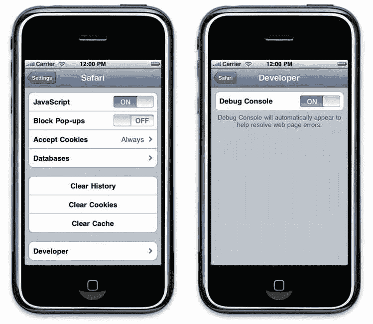


**图 3-3.** 你可以在 iPhone 设置中打开控制台

之后，`调试控制台` 将显示在 Mobile Safari 窗口的地址栏正下方，显示页面中 HTML、CSS 和 JavaScript 错误的数量，如果没有错误则显示 `无错误`（图 3-4）。提示和自定义消息也可以使用我们稍后将在本章中介绍的 Console API 来显示。

**图 3-4.** `调试控制台` 出现在地址栏下方

点击错误计数将打开一个错误列表，其中包含每个错误发生的行号，以及按类型（HTML、CSS、JavaScript 或所有）筛选的选项（参见图 3-5）。

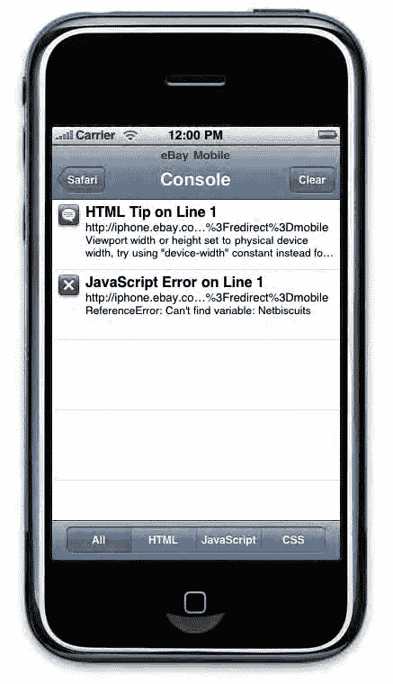

**图 3-5.** 控制台显示所有消息

不过要小心：当日志条目过长时，控制台会将其截断。尽量不生成超出两三行的日志，并始终专注于你需要的核心信息。为了减轻这种限制，你仍然可以旋转设备使行变长，这样你的两行日志就能容纳更多内容。

### Web Inspector 概览

在详细介绍 WebKit 的 Web Inspector 的每个单独功能之前，最好的方法是先整体了解这个工具。首次调用 `开发` 窗口时，默认会打开一个新窗口。使用过一次后，你上次的选择——是独立窗口还是停靠窗口——将自动生效。

**注意：** 从现在开始，无论 Web Inspector 是窗口状态还是停靠状态，我们都将其统称为窗口。同样，我们会将检查器关联到浏览器窗口，尽管显然你可以为任意浏览器标签页打开一个 Web Inspector 实例。

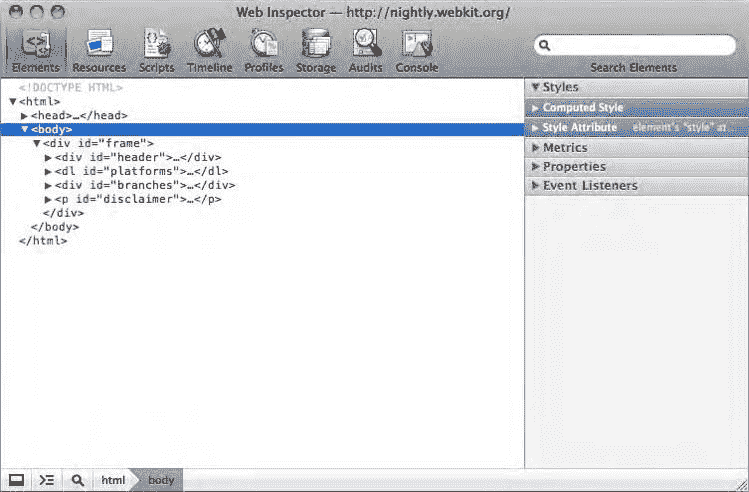

#### 开发者工具窗口

在窗口顶部（图 3-6），你将会看到一系列主要图标，它们充当标签页，让你能够访问各种调试工具。按出现顺序，它们分别代表：元素检查器、资源追踪器、脚本调试器、时间线检查器、脚本分析器、客户端存储管理器、审计和控制台。

仍在 Web Inspector 的上部，右侧是一个搜索字段。此字段是上下文相关的：它允许你在当前视图的主区域内执行高级搜索。例如，如果你正在处理 HTML 标记，在此字段中搜索将搜索文档内的元素；在 `Profiles` 标签页中运行查询，则会在所有性能分析数据中返回查询元素。

**图 3-6.** 聚焦于元素检查器的开发者工具窗口

在窗口底部，有几个图标，它们会根据你正在使用的工具而有所不同。不过，在调试工具的所有部分，你都会找到一个窗口图标和一个显示箭头前带有一条线的图标。第一个图标让你能将 Web Inspector 窗口停靠到其父窗口，这在同时处理多个页面且每个页面都有一个调试器实例时非常有用。它还可以防止你错误地从错误的窗口中查找和编辑代码！

第二个图标会启动一个控制台。无论你当前正在使用哪个工具，控制台都可用。可以通过按 `Esc` 键触发。在这些图标旁边，如果你正在检查页面中的 HTML 元素，该元素在文档树中的路径将以“面包屑”方式呈现（图 3-6 中的 `html > body`），以帮助你轻松浏览文档。

检查窗口的一个强大优势是它与你正在处理的页面紧密相关。此窗口中的数据会随着页面的修改而更新。如果你点击一个链接并跳转到另一个页面，检查器的内容也会完全改变。因此，一个调试器实例只能检查一个窗口。这应该不是问题，因为你可以根据需要打开任意数量的检查器窗口，无论你打开了多少页面。

### 错误通知

如果你的页面出现任何问题——检查代码的一个常见原因——你首先应该在 Web Inspector 窗口的右下角查看（图 3-7）。在那里，如果 WebKit 解释器识别到代码中有错误，你会看到一个红色数字，前面带有一个白底红叉的错误标记，以及警告标记旁边的一个黄色数字。

**图 3-7.** 两个图标指示当前页面抛出的错误和警告；这些将在控制台中描述

点击这些数字将打开一个控制台区域，其中会列出报告的错误和警告，以及 WebKit 为修复它们而执行的操作，以及它们在文件中发生的行号。

例如，在 XHTML 文档中，经常会将自关闭标签与需要完整关闭的标签混淆。如果你使用了一个 `<link>` 标签，并用对应的 `</link>` 关闭了它，你将收到以下消息：

```
未匹配的 </link> 已遇到。忽略标签。YourPage.html:14
```

这让你可以使用指示的行号在源代码中搜索该元素，该行号也是一个链接，可以直接带你到相关行，使用的是我们稍后将介绍的 `Resources` 查看器。

这里的“忽略标签”并不意味着你的链接会被完全丢弃；它仅仅意味着这个意外的关闭标签将被忽略，并且不会出现在 DOM 树中。这是 WebKit 解释你的代码以渲染页面的方式。要注意这些错误，因为它们可能会引起副作用；例如，未关闭像 `<script>` 或 `<canvas>` 这样的标签会导致它们之后的元素被视为脚本或画布内容——并且不会被显示。

### 掌控你的代码


### 开始使用元素检查器

开始使用 WebKit 的 Web 检查器最明显的方式可能是从 Web 应用程序的基础开始：HTML 标记。这也许也是最简单的方式。元素检查器可通过不同的操作访问。所有这些方式都有其优点，我们现在将介绍它们。

#### 让文档属于你

检查页面组件的主要方式是选择顶部栏的第一个标签，名为"元素"（`Elements`）。它将以语法着色、格式良好的树状结构显示你的页面，占据 Web 检查器的大部分窗口（见图 3-8）。在右侧，你可以看到一个侧边栏，包含几个可折叠的面板。默认情况下，`<body>`标签会被高亮，但你也可以随时通过右键单击页面中的任何区域并从上下文菜单中选择"检查元素"（`Inspect Element`）来调用元素标签。

**信息**：由于调试工具是用 HTML、CSS 和 JavaScript 构建的，你可能会误开始检查调试器窗口而不是你打算检查的代码。虽然这看起来像是检查器的一个限制，但对于那些希望扩展工具的人来说，这可能很有用。检查器的演进很大程度上是由社区驱动的。如果你有技能和时间，我们鼓励你加入并帮助改进它们。

这种方法的主要优点是，在调试页面时，你通常大致知道问题出在哪里。通过从页面中的特定区域调用检查器，文档树将会展开，直达你想要分析的节点。

此外，当鼠标悬停在页面中的某个元素上时，该元素会被高亮显示，半透明的浅蓝色表示其内部边界，深蓝色表示其内边距和边距。这意味着，即使你没有进入文档树，也能了解页面各组成部分的布局。

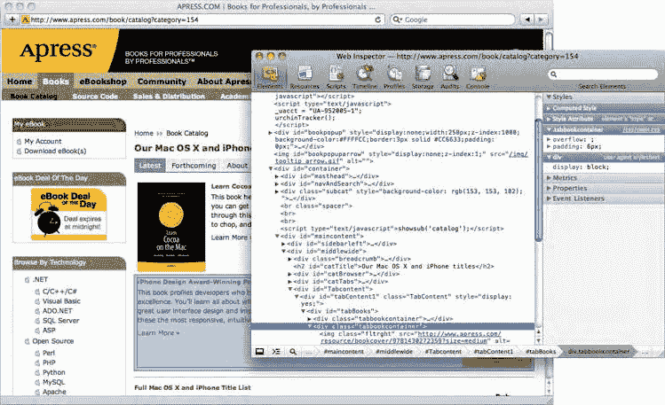

**第 3 章：介绍开发者与调试工具**

**图 3-8. 检查书籍封面图片下的代码的视觉反馈**

由于直观了解页面布局可能是一种吸引人的工具，你会很满意地了解到，后一种功能在调试工具的大多数部分中都可用，只需点击底部状态栏中的放大镜图标即可。

当然，仅仅获取元素布局的表示通常不足以深入分析代码中发生了什么。让我们更仔细地看看元素检查器。

无论你编写的代码如何呈现，检查器的文档树都会适当地缩进，每个新节点开始都会换行。此外，代码会被清晰地着色以使其更易读：标签为紫色，属性名称为橙色，属性值为蓝色。你甚至可以看到以绿色显示的內联注释。点击任何节点开始处的展开三角形可以切换其状态，这样你就不会面对无休止的需要滚动的换行。

#### 挖掘你的样式

在第一个面板中，你有几个类别，表示应用于你元素的所有样式，如图 3-9 所示。

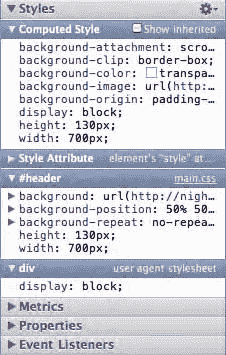

**第 3 章：介绍开发者与调试工具**

**图 3-9. 元素检查器侧边栏**

从顶部开始的第一个样式类别非常有用；“计算样式”（`Computed Style`）是 WebKit 渲染器考虑、计算并应用的样式。这很方便，因为它让你一眼就能看到元素实际拥有的所有样式。由于几个原因，计算样式在处理数值规则（例如图 3-9 中的 `width` 和 `height`）时也很有用。CSS 大量使用了相对值，例如 `em` 或百分比单位。因为所有计算后的大小都以像素表示，所以比较起来更容易。

但是，如果你无法确定样式是从哪里计算出来的，那么在调试页面时，计算样式就毫无意义。这就是后续子面板发挥作用的地方。每个子面板代表一种样式应用的独立方式，按从最新应用到最早应用的顺序排列。CSS 中的样式规则优先级按以下顺序考虑：使用 `style` 属性应用的样式（*内联*样式）首先应用；然后，来自 `<link>` 和 `<style>` 标签的 `id` 和 `class` 选择器；然后是文档树选择器（选择器特异性越高，优先级越高——注意父元素的“权重”，无论它是通过 `id`、`class` 还是标签名来引用的，都会计入权重）；最后是标签名。

**提示**：默认情况下，所有与颜色相关的规则都使用 RGB 或颜色名称（如果可用）表示。如果你希望在代码中使用其他颜色格式，可以通过单击规则旁边的彩色方块（这只会更改当前规则的格式）或通过单击侧边栏左上角的齿轮图标来更改格式，在十六进制、RGB 和 HSL 之间切换。

所有规则都会被列出。然而，由于并非所有规则都会被最终应用，你会注意到在侧边栏的其他部分，有些规则被划掉了，显示出该样式被另一条规则覆盖。同样，这种呈现方式让你精确地了解页面样式是如何工作的。

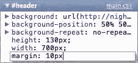

**第 3 章：介绍开发者与调试工具**

**图 3-9. 元素检查器侧边栏**

#### 编辑样式

理解固然好，但能够直接从侧边栏修改样式规则则更胜一筹。你可以通过三种方式做到这一点。首先，要停用一条规则，只需取消选中规则右侧的复选框即可。你的页面将立即表现为该规则从未存在过，样式的继承也会相应地更新。

更进一步，你可以通过双击任何值来编辑规则，如图 3-10 所示。这将使规则变为可编辑状态，并允许你输入任何内容。按 Return 键或点击编辑区域外部即可保存并应用新规则。

最后，在检查器的最新版本中，你可以从头创建新的选择器，一次将样式应用于多个元素。这可以通过选项菜单完成，该菜单由侧边栏右上角的齿轮图标表示。同样，会出现一个新字段，但你可以同时输入样式规则及其应用的选择器。如前所述，按 Return 键或点击编辑区域外部即可使更改生效。

**图 3-10. CSS 属性易于编辑**

Web 检查器不仅让你能够深入了解页面，还为你提供了工具来进行严肃的原型设计，而无需经历检查、修改文件、保存、重新加载页面等繁琐过程。

#### 度量（Metrics）

从顶部开始的第二个面板“度量”（`Metrics`）提供了一个可视化表示，显示应用于页面元素的大小相关规则，即外边距、内边距、边框、宽度和高度，所有这些都显示在图 3-11 中。这些规则一起被称为*盒模型*。

检查器的最新版本还添加了对于 `position` 属性设置为 `relative`、`absolute` 或 `fixed` 的元素的定位信息。这种表示方式使用起来当然比在“样式”（`Styles`）面板中找到的 CSS 规则列表要快得多，并且就像你可以修改后者中的规则一样，你也可以通过双击要更改的值来修改前者的尺寸。你可能会注意到，与计算样式类别中一样，此处的值都被处理成以像素为单位，而不管其初始定义如何。

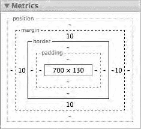

**第 3 章：介绍开发者与调试工具**

**图 3-11. 度量面板**

**提示**：在“样式”（`Styles`）和“度量”（`Metrics`）面板上，你可以通过双击数值并使用键盘上的上下箭头键来修改数值，以 1（默认）、10（结合 Shift 键）或 0.1（结合 Alt 键）为步长递增或递减。

元素检查器中较低的两个面板可能看起来有点神秘。但它们同样有用。

#### 属性（Properties）

页面中的每个元素都可以通过 DOM 对象的实例来访问，该


允许您在 JavaScript 代码中操作当前元素。因此，每个元素都拥有其自身以及继承的属性。例如，一个 `<h1>` 标签就是一个 DOM 的 `HTMLHeadingElement` 实例，它具备 `HTMLHeadingElement` 属性，同时还继承了 `HTMLElement` 对象的属性和方法，并以此类推，直至继承 `Object` 对象的属性。

在“属性”面板中，各个可折叠的分类以字母顺序列出了当前选中对象的所有属性和方法（如图 3–12 所示）。当然，DOM 元素并非只有固定的属性值。例如，`innerHTML` 属性会根据其所在的页面而变化；“属性”面板会列出检查时所有这些变量值。

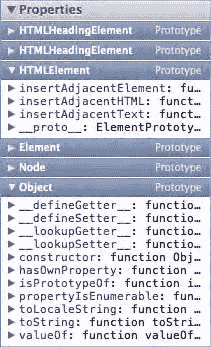
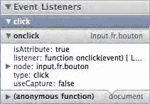

图 3–12. 属性面板

了解这些内容在编辑 HTML 或 CSS 时可能用处不大，但在编写 JavaScript 时却至关重要。它为您提供了丰富的信息，供您构建或在此基础上开发，充分展现 DOM 所拥有的动态潜力。我们之所以说“构建”和“在此基础上开发”，是因为在使用 JavaScript 编写脚本时，您很可能需要为元素添加属性。当您键入或执行脚本时，“属性”面板会随之更新，因此您始终可以获取文档和对象状态的实时快照。

#### 事件监听器

通过检查器完整洞察 DOM 的最后一个技巧，恰恰是查看页面中对象可能发生变化的位置。现在，切换到最后一个侧边面板“事件监听器”（如图 3–13 所示），您就能看到是否有任何 JavaScript 事件（如 `click` 或 `load` 事件）附加到了该元素上。


图 3–13. 事件监听器面板，显示监听器的层级结构

事件按类型分组，每个事件都可以展开，以查看按其调用顺序排列的相关函数。例如，这可以让您了解监听器为何可能从未被调用——因为有可能从某个监听器中停止了事件传播。它还能让您发现由于基于匿名函数的监听器意外堆叠而导致的内存泄漏，这类泄漏比常规监听器更难阻止。

当您想知道某个元素是否与脚本相关时，获取已附加事件的节点列表十分有用。但尤其有用的是，它提供了一份所有动态元素的列表，这是一种检查 DOM 的新方式，有助于排查 JavaScript 冲突等错误根源。

#### 高级搜索

除了文档树的可折叠表示以及允许您直接在元素显示位置进行选择的放大镜工具之外，在检查 HTML 文档时，您还可以使用另一个更高级的工具。

它就是 Web 检查器窗口右上角的搜索字段。我们现在才介绍这个工具，是因为它最巧妙的用途与 HTML 搜索相关；但搜索字段在调试工具中始终可用，并且会返回与您当前查看内容相关的结果。

您可以使用高级选项来搜索 HTML 标记。如果搜索返回任何结果，项目数量将显示在搜索字段的左侧，如图 3–14 所示。所有匹配项都会在文档树中高亮显示，并且第一个匹配项将被选中。


图 3–14. 匹配数量显示在搜索字段的左侧

最显而易见的搜索选项就是直接查找纯文本。搜索针对文档内容（区分大小写）以及标签和属性名称（不区分大小写）进行。虽然这对于大型或不熟悉的文档而言可能效率不高，但它至少易于理解和使用，并且由于结果清晰显示，总体而言应该会很有用。


你可以使用 CSS 语法和选择器来查找文档中的标签。选择器是一种模式匹配规则，既能用于简单的标签定位搜索，也能用于复杂的上下文选择。这对前端开发人员来说自然很有吸引力，因为这应该是你熟悉的语言。但请注意：搜索标签名称将触发不区分大小写的搜索，但 ID 和类名在搜索字段中与在 XHTML 文档中一样是区分大小写的。

尽管我们将在后续章节中更深入地介绍选择器，但这里先给出一个简单的例子以作说明：

**第 3 章：介绍开发者与调试工具**

```html
<h1>A Big Title</h1>
<p>
<span>The strong and quick brown <strong>fox</strong>
jumps over the lazy<strong>dog</strong>.</span>
</p>
```

如果你在此文档中对`*strong*`执行简单的文本搜索，将会找到三处匹配。当然，你可能预期找到五处，但搜索引擎识别出其中两处实际上是与开始标签对应的结束标签，因此只考虑了开始标签。这是最简单的情况。

如果这个文档更大，你可能希望找到所有第二个`<strong>`标签，这些标签的祖先是一个紧随`<h1>`标题之后的`<p>`标签。是不是变得有点复杂了？

这正是 CSS 选择器大显身手的地方。尝试在搜索字段中输入以下内容：

```
h1 + p strong:nth-child(2)
```

这对前端开发人员来说应该很熟悉。对于不太熟悉这类选择器的读者，需要记住的选择器并不多，因此绝对值得深入研究。

最后，你还可以对文档执行 XPath 搜索。XPath 语言是专为在 XML 上执行搜索而设计的。HTML 与 XML 有许多相似之处。XPath 语法允许进行高级的结构化查询。应用于前面的示例，你的搜索查询如下：

```
//h1/following-sibling::p//strong[2]
```

关于 XPath，我们不想深入过多细节，只希望强调这两种方法各有优劣。例如，在我们的例子中，你应该注意到 CSS 选择器通过`+`号表达了`<p>`标签紧随标题之后，这在 XPath 中无法翻译。另一方面，CSS 选择器无法执行反向搜索（查找以另一个元素为父元素的元素），而 XPath 则可以。

**资源查看器**

资源查看器以图形方式展示当前页面已下载的元素概览（见图 3-15）。你可以在左侧边栏的顶部区域选择两种图表之一：时间（Time）和大小（Size）。

第一种视图是时间（Time），它显示了所有需要下载的元素的时间线，以及总的检索时间。浅色区域表示延迟期，即从发出请求到服务器发送响应之间经过的时间。深色区域给出了实际的下载时间。每种元素类型用不同的颜色表示，因此通过读取顶部图表栏中的图例可以轻松识别。你可以根据需求，使用 Web Inspector 窗口顶部的按钮来筛选类别，并选择数据的排序标准。蓝色和红色的垂直线分别指示了`DOMContentLoaded`和`load`事件的触发时间，这有助于你理解页面的加载方式，并据此优化页面设计。

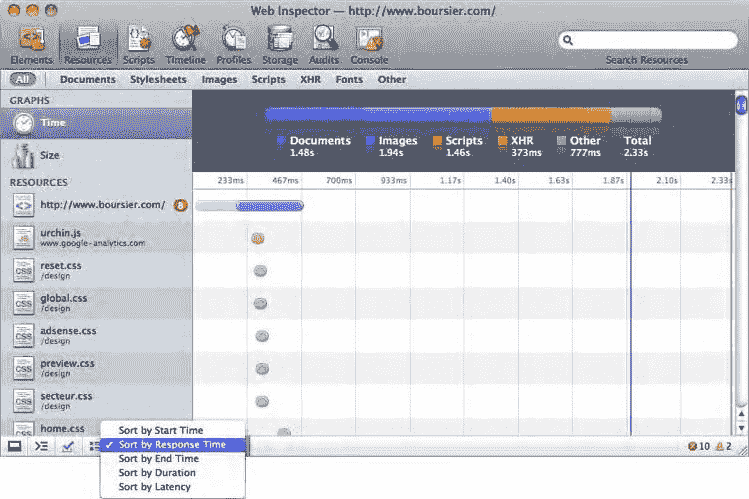

**第 3 章：介绍开发者与调试工具**

图 3-15. 资源查看器

第二种视图是大小（Size），它简单按重要性从大到小显示页面所有已下载元素的重量。带有两个区域的条形图仍然存在，以便于理解。在这里，第一个条表示实际传输文件的大小，而第二个条在使用 HTTP 压缩时表示实际下载文件的大小。


因此，图像将只显示为一条更暗的条。

你可以根据实际文件大小或传输大小来进行筛选。如果选择传输大小，则会考虑到某些元素可能已被缓存的情况，因此加载耗时最长的文件可能并非体积最大的文件。要了解某个资源是否可从缓存获取，只需将鼠标悬停在图表中的相关条柱上；如果文件已被缓存，会出现一个提示框，显示文件大小为 0 字节。

显然，由于缓存的元素不占任何大小，它们会默认被一同显示，通常位于列表末尾。

要获取关于某个资源的更多信息，你可以点击左侧边栏中的任意元素。

这将在主区域显示图像和文本文件，如图 3-16 所示，其中包含内容的详细信息，以及客户端和服务器发送的相关标头（使用主视图上方的标签页切换），这些信息会显示在主视图中。在侧边栏中双击某个资源，则会在新浏览器窗口中打开它。

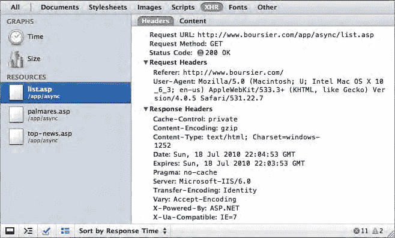

**第 3 章：介绍开发者与调试工具**

**图 3-16.** 某个资源的标头详情

当然，这可以通过检查缓存过程并查看哪些元素可能拖慢页面渲染，来帮助你优化网站设计；同时，它还非常有助于跟踪 Ajax 操作，让你能够查看加载的文件及其 HTTP 标头和内容。

### 调试 JavaScript

与大多数脚本语言一样，JavaScript 也有让人抓狂的一面，有时很难确切定位脚本为何无法正常工作。Web 检查器为此提供了几种非常方便的工具，从最直接的脚本执行时间线，到更复杂的观测辅助功能（如断点）。下面我们将介绍开发者工具如何帮助你更快、更少依赖猜测地摆脱脚本困境。

开始之前请注意，与元素检查器中 HTML 代码清晰显示为结构化树不同，JavaScript 代码将以其原始编写形式呈现。因此，我们显然不建议你在压缩后的代码（为减小文件大小而去掉多余空格和换行的代码）上使用这些工具。

#### 日志记录到控制台

如果你已经编写过 JavaScript，很可能在开发过程中的某个精确时刻使用过 `alert()` 方法来获取对象或变量的值。由于这种方法存在不少缺点（例如，不要试图在循环中使用它！），你可能已经更进一步，使用了一些跟踪选项，这通常更自然且更高效。好消息是，有一个完整的控制台 API 可供你在 Web 检查器中使用。

**表 3-1.** 日志记录函数

| 函数 | 描述 |
| :--- | :--- |
| `console.log(format, ...);` | 将消息或对象属性记录到控制台。这五个函数仅在消息左侧显示的图标上有所不同。在 Safari 移动版上，仅支持这些命令；此外，下表中列出的格式化选项不可用。 |
| `console.info(format, ...);` |  |
| `console.debug(format, ...);` |  |
| `console.warn(format, ...);` |  |
| `console.error(format, ...);` |  |
| `console.assert(condition, format, ...);` | 仅在条件不满足时记录到控制台。 |
| `console.group(format, ...);` | 开始和结束一个日志组。每个新组将相对于其他日志缩进显示。 |
| `console.groupEnd();` |  |
| `console.time(name);` | 分别启动和停止一个计时器，用于跟踪代码执行时间。`name` 用于标识计时器，以便停止它。 |
| `console.timeEnd(name);` |  |
| `console.count(name);` | 设置一个函数调用计数器。`name` 用于标识计数器。每次调用函数时，计数器会记录一个递增的数字。 |
| `console.dir(object);` | 将对象的所有属性记录到控制台。 |
| `console.dirxml(node);` | 将一个 HTML 节点及其所有子节点作为可折叠的树结构记录到控制台。在最新版本的 |


#### `inspector` 与 `console.log()` 对 HTML 元素的操作方式类似。

#### `console.trace()`

记录当前函数调用栈及传入参数的值。

#### `inspect(object)`

根据传入的对象打开相应的检查器标签页。可触发的标签页包括元素、数据库或存储检查器。

#### `console.profile(name)`

开始并结束对脚本执行的分析。

#### `console.profileEnd(name)`

## 第 3 章：开发者与调试工具简介

列出的几个表达式可以像 C 语言的 `printf()` 函数一样接收带有多个变量的模式。因此，你可以使用 `%s` 插入字符串，或使用 `%o` 添加可折叠的对象结构。这有助于在开发过程中保持日志的条理性和一致性。

### 表 3-2：格式化选项

**格式** | **描述**
--- | ---
`%s` | 字符串。
`%d` 或 `%i` | 整数。不支持像 `%02d` 这样的数字格式化。
`%f` | 浮点数。不支持像 `%4.2f` 这样的数字格式化。
`%o` | 对象。可通过展开三角形查看对象详情。

以下是两个使用控制台日志的示例：

```
console.log("My %s is great!", "iPhone");
console.log("My", "iPhone", "is great!");
```

为了便于阅读，控制台会在必要时自动添加空格，并以树形格式显示对象。这两条命令将输出相同的结果到控制台，并附带一个指向执行行的链接。点击该链接会聚焦并高亮显示相关行。

### 使用交互式 Shell

有时，通过重复的日志记录操作来查找对象或变量的值会非常繁琐。编辑文件、保存、重新加载页面等操作既耗时又低效。不过，借助检查器的交互特性，你可以直接在窗口底部的控制台提示符中输入命令，从而完成部分工作。命令的返回值会立即打印到控制台中。此功能可做的事情很多。

获取结果的最快方法是使用前面列出的日志记录命令，但您也可以运行页面中已有的脚本。这将允许您评估代码中的变量，观察它们的行为，并调整页面，因为您执行的所有更改（如果有）将直接应用于受影响的元素。

按向上箭头键将打开您已输入的命令历史记录，按时间从新到旧排列。

检查器的交互式控制台甚至支持代码补全：开始输入命令时，会弹出建议补全单词。按右箭头键或 Tab 键接受建议。此外，在终端中时，输入 `clear()` 将清除屏幕上的所有输出，不过此功能也可以通过点击窗口左下角最右侧的图标来实现。

### 让调试器来完成工作

到目前为止，我们介绍的所有内容中，都是您在输入命令，决定在哪里做什么，以及如何去做。如果这还不够，您还可以利用 Web 检查器中实现的高级调试器。我们将使用以下代码来说明调试器的各种工具：

```html
<html>
  <head>
    <title>测试脚本</title>
    <script>
      var counter = 0;
      var timerID = window.setInterval(myTimer, 10000);

      function myTimer() {
        var span = document.getElementById("count");
        span.textContent = incrementCounter();
        for (var n = 0; n < 100000; n++) {
          new Object().toString();
        }
        if (counter > 1) {
          errorGenerator();
        }
      }

      function incrementCounter() {
        return ++counter;
      }
    </script>
  </head>
  <body>
    定时器执行次数：<span id="count">0</span>
  </body>
</html>
```

这段代码的作用是启动一个定时器，每十秒钟调用另一个函数 `myTimer()`。该函数依次递增显示在浏览器中的计数器，然后运行一个重要的循环，最后通过调用一个未定义的函数来生成一个异常。

页面加载后，您可以从菜单中激活调试器，如果 Web 检查器窗口已打开，也可以直接点击“脚本(Scripts)”标签页。

您刚刚打开的窗口有两个主要部分，如图 3-17 所示。左侧是文件中的当前脚本，带有行号；如果脚本直接位于 HTML 文档的 `<script>` 标签中（如本例所示），您将看到此文件。右侧是有关当前脚本的各种信息。目前，这部分是空的。

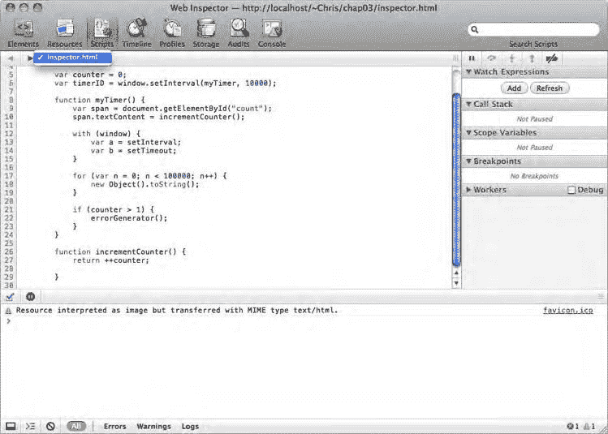

**图 3-17.** 脚本调试器

窗口的每个部分都有专门的按钮。在左上方，您可以从下拉菜单中选择所有可用的脚本。在右侧边栏的上方，您可以使用步进按钮来暂停脚本执行、单步执行到下一个函数调用、单步进入下一个函数调用或跳出当前函数，以及禁用断点。

#### 断点

即使您大致知道脚本在哪个阶段停止工作，找出问题所在也可能更棘手。这时，断点就可以帮到您。

**警告：** 您无法通过从控制台运行脚本来使用调试器。无论您设置了什么断点或生成了什么异常，在这种情况下执行都不会暂停。因此，您还必须考虑使用有用的日志函数来跟踪您的脚本。

点击窗口左侧的行槽会为该行上的脚本部分切换一个蓝色断点。使用之前的代码，例如，您可以在定义 `myTimer()` 函数的行上添加一个断点。当脚本运行时，它将在此处中断（图 3-18），并且所有变量和函数的当前状态将列在侧边栏中。

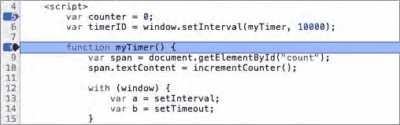
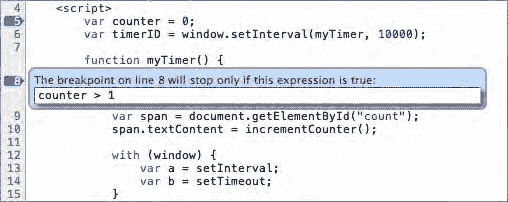

**图 3-18.** 行槽上放置了两个断点；调试器在第二个断点处停止

您还可以使用条件断点来精细化地监控脚本。如果您想知道某个变量值如果不是"foo"是什么，请右键单击任意一行，然后从上下文菜单中选择“编辑断点...”。将会弹出一个文本字段供您输入表达式，如图 3-19 所示。这种情况下，断点将变为橙色。如果表达式为真，脚本将停止；否则，将自动继续执行。

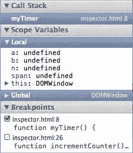

**图 3-19.** 设置条件断点

在调试过程中，设置断点、查看情况、移除断点、查找另一行、再回到前一行等操作可能会很繁琐。侧边栏底部的“断点(Breakpoints)”窗格是您的助手。它保存了所有断点的列表，您无需删除，只需单击它们各自的复选框即可停用。您也可以使用侧边栏右上角的断点图标一次性停用所有断点。

更改选项后，您需要重新加载页面。脚本将一直运行，直到遇到断点。然后，所有执行都会暂停，并在右侧显示有关执行的上下文信息，如图 3-20 所示。


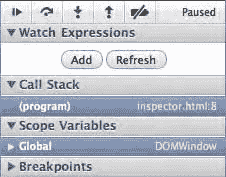

**图 3-20.** 当调试器在断点处停止时，侧边栏会更新为与当前执行上下文相关的信息

#### 单步执行

在完成整个流程之前，只观察脚本的一个部分并不是很高效或自然。为了解决这个问题，让我们仔细看看侧边栏顶部的步进按钮，如图 3-21 所示。

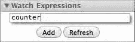

**图 3-21.** 带有步进按钮的脚本调试器

您可以使用第一个按钮在之前暂停当前脚本的执行。


