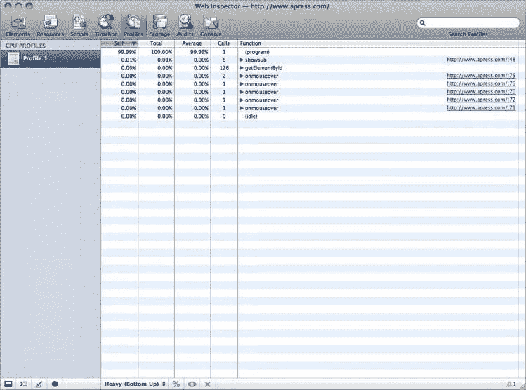
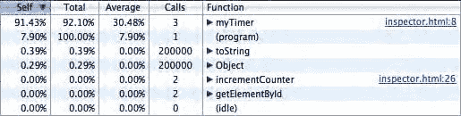

# 第 3 章：开发者与调试工具介绍

### 监视表达式

在侧边栏中，另一个面板可以帮助你检查脚本中的特定元素：**监视表达式**部分。你可以监视的表达式几乎可以是任何内容，例如变量、测试表达式、实例等等。你能收集到的信息可以是局部或全局的，并且会随着脚本的执行而更新。

继续使用同一个示例，点击**添加**按钮（图 3-22），然后输入 `counter` 来观察它的变化。刷新不是自动的，因此当到达断点时，你需要点击**刷新**按钮来更新数据。

> **图 3-22.** 要监视表达式，请点击**添加**按钮，然后输入要评估的表达式

### 调用栈

从上往下第二个面板标记为**调用栈**。这里列出了所有已被调用但尚未返回的函数，最近一次调用排在顶部。

你可以在 `incrementCounter()` 声明处添加第二个断点，并开始调试到此函数；这将得到如图 3-23 所示的结果。在面板中，你可以通过点击条目来向上移动调用栈。

> **图 3-23.** 调用栈显示在侧边栏的相应面板中

**提示：** 如果你希望函数名在调用栈中更具可读性，可以轻松地通过 `displayName` 属性在调试器中为其指定一个名称。例如，函数 `myTimer()` 若扩展了 `myTimer.displayName = "Main Loop"`，则会在调用栈中显示为 `"Main Loop"`。此功能在即将介绍的**分析器**中同样有效。

当然，这在观察连续执行的脚本或相互嵌套的脚本时，可以极大地节省时间。

### 作用域变量

脚本侧边栏中最后一个（也是内容最丰富的）部分是**作用域变量**面板下的区域。这里会随时列出当前执行上下文作用域内所有元素或当前脚本所使用元素的值。在我们的示例中，停在第一个断点处时，数据应如图 3-24 所示，显示 `myTimer()` 函数可用的所有变量，无论它们是否已被初始化。

> **图 3-24.** 当前作用域中的变量（无论是否已初始化），以及庞大的**全局**列表

为了便于阅读，这些元素根据其类型及在当前作用域中的用途进行了分类：**局部**、**全局**，以及（如果存在）**With 块**或**闭包**。这种视图不仅使查找和使用脚本可用的元素变得更加容易，还能帮助你理解当前状况并知道如何更改它。与 CSS 和 HTML 值一样，你可以通过双击来更改**作用域变量**面板中的值。**全局**面板会特别列出脚本引擎级别可用的类及其完整原型。

### 异常

你已经学会了如何查找错误以及如何观察脚本行为。然而，你可能已经注意到，无论是 JavaScript 控制台还是**脚本**部分，都只会通知异常——控制台中的日志、脚本中带颜色的行——它们不会停止执行。要使函数在出现异常时自动暂停执行（图 3-25），你可以点击 Web 检查器窗口左下角的**暂停**图标。

> **图 3-25.** 点击**暂停**按钮将使调试器在异常处暂停

点击一次会将图标变为蓝色，这意味着所有异常都将导致脚本暂停，以便你可以检查该阶段可用的信息，如图 3-25 所示。点击两次将使脚本仅在未捕获的异常上暂停——即那些未被 `try...catch` 语句捕获的异常。

这些工具汇集在一起，应该能让你的开发过程变得更加容易和快捷。JavaScript 调试器不仅有助于精确定位脚本可能出错的位置，而且随着你逐渐熟悉它，它还能帮助你在优化阶段构建整体更优秀的 Web 应用。

### 页面的生命周期

全面了解页面在其整个生命周期中发生的情况总是很有帮助的。哪些脚本被执行，它们需要多长时间完成，加载了多少代码、标记或图像及其加载顺序——这些信息在 Web 开发中非常重要。**时间线**标签页会清晰有序地显示所有这些信息（见图 3-26）。

通过点击 Web 检查器窗口左下角的圆形图标来触发记录。如果你点击此按钮并重新加载页面，你会看到所有内容都被记录下来，包括初始页面加载后发生的事情，并在绘图区域的顶部使用三个平行的时间线进行表示——**加载**，用于页面加载的元素；**脚本**，用于脚本评估以及在页面加载时触发的事件；以及**渲染**，用于所有绘制到屏幕的操作、哪些内容被重绘以及它如何影响性能。

> **图 3-26.** **时间线**部分及其底部的控制按钮

**警告：** 使用此检查工具时必须谨慎，并始终记住，目标设备与你的桌面系统和浏览器规格不同（尤其是在连接速度方面）。也就是说，要使用这个工具并从中获取信息，但最重要的是，在解读这些信息时，要牢记你并非为正在调试的设备进行开发。

为便于使用，尽管所有操作都会被记录，但你可以通过取消选择时间线左侧边栏中的类别，轻松地仅显示某些类型的事件。这将使时间线中的事件从蓝色（加载）、黄色（脚本）和紫色（渲染）变为灰色。

时间线的宽度受限于你的屏幕宽度，这意味着时间刻度会根据其内容而变化。你可以通过拖动顶部时间线区域左右边缘的控件来细化检查目标。这将突出显示事件树的相关部分。如果你的页面包含动画内容或 JavaScript 计时器，这一点尤其有用，因为在这种情况下，时间线会持续绘制屏幕上的变化，显示新渲染的浏览器区域和计时器迭代。

将鼠标悬停在时间线或树状视图中的某个事件上，会弹出一个包含事件信息的提示框，例如生效所需的时间、事件类型、或加载操作中请求的文件。点击此弹出窗口中的元素，会将你带到 Web 检查器的**资源**部分，以获取关于该事件的更多信息（见图 3-27）。

> **图 3-27.** 一个弹出窗口，显示鼠标悬停所在条形的相关信息

与 JavaScript 调试器一样，如果你希望在某个时候重新开始，可以点击窗口左下角附近带斜杠的圆形图标来清除视图。

### 分析脚本

除了显示页面中所有发生事件的时间线之外，你还可以获取正在运行的脚本的性能分析数据和 CPU 使用情况。此功能可通过点击**性能分析**图标来使用（见图 3-28）。

### 本节仅在您首次打开时显示操作说明

这些说明提示您点击窗口左下角区域的`Record`（录制）按钮（与时间线部分的操作类似），以显示随时间变化的脚本活动。点击一次即可开始录制，您需要再次点击以停止录制并查看写入屏幕的评估数据。

您也可以使用之前介绍的 `console.profile()` 和 `console.profileEnd()` 方法，从控制台启动性能分析。使用控制台而非`Record`按钮的一个优势是，您可以同时录制多个性能分析会话。

无论选择哪种方法，请记得**停用**您在脚本部分可能设置的断点，以免干扰性能分析。另请注意，与 Web 检查器中的其他工具不同，性能分析工具对所有浏览器窗口和标签页都是全局生效的，因此关闭除待研究窗口之外的所有窗口可能会有所帮助。

## 第 3 章：开发者与调试工具介绍

**图 3–28.** 性能分析器

每个新的性能分析会话都会在左侧边栏显示一个分析图标。如果一个分析会话在另一个分析会话内开始录制，则上层分析会话将显示一个可折叠的三角形展开符号。

### 了解性能分析

这里我们将使用与脚本调试器相同的例子来说明性能分析器的工作方式。打开 Web 检查器，点击`Record`图标，然后重新加载您的页面。

当计数器达到 2 时，点击同一图标停止录制，并查看您新获取的数据（图 3–29）。

**图 3–29.** 采集到的数据显示在性能分析器的结果表格中

性能分析数据以五列的形式显示在 Web 检查器窗口的右侧部分。它详细列出了所有函数调用及其执行时间，默认以列表形式展示，消耗最高的函数排在最前面。默认视图以总时间的百分比显示数值。您可以使用窗口底部的弹出菜单更改这些视图选项。这样，您就可以通过树状视图查看函数，突出调用堆栈而非资源消耗。

右侧的所有函数都可以展开以显示其调用堆栈。调用堆栈的基础始终是`"(program)"`。这个可折叠区域还会显示该函数被调用的次数。这就是为什么`myTimer()`会在同一组中出现两次。

同样，您可以使用弹出菜单旁边的`%`按钮，将整个视图的数值从百分比更改为以毫秒为单位的绝对值。如果您专注于某一特定列（表 3–3），您可能只想更改该列的数据视图。

这可以通过双击列标题来实现。

**表 3–3.** 数据列说明

| 列名         | 描述                                              |
|--------------|---------------------------------------------------|
| `Self`       | 函数自身的总执行时间。                            |
| `Total`      | 函数的全局执行时间，包括对外部函数的调用。        |
| `Average`    | 所有调用中的平均执行时长。                        |
| `Calls`      | 函数被调用的次数。                                |
| `Functions`  | 被调用的函数列表及其相关的调用堆栈。              |

此外，为了完美契合您的需求，您可以通过点击列标题来更改某列数据的排序顺序。

在函数列表中，如果某个函数不属于 WebKit 脚本引擎（如图 3–29 中带`getElementById()`的函数），其最右侧将出现一个链接，点击该链接将跳转到资源选项卡中相关文件的对应行，并高亮显示。

为了更方便地阅读大量数据，您可以使用状态栏中的眼睛图标聚焦于特定函数。当然，如果执行链比较复杂，这个功能会让操作更舒适。也可以点击相同位置的叉号图标将函数从视图中移除。使用这些选项中的任何一个，状态栏上都会自动出现一个`Reload`（重新加载）按钮，以便您可以无缝恢复视图的初始状态。

### 使用搜索字段进行过滤

