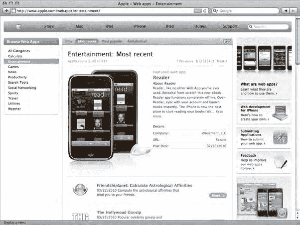
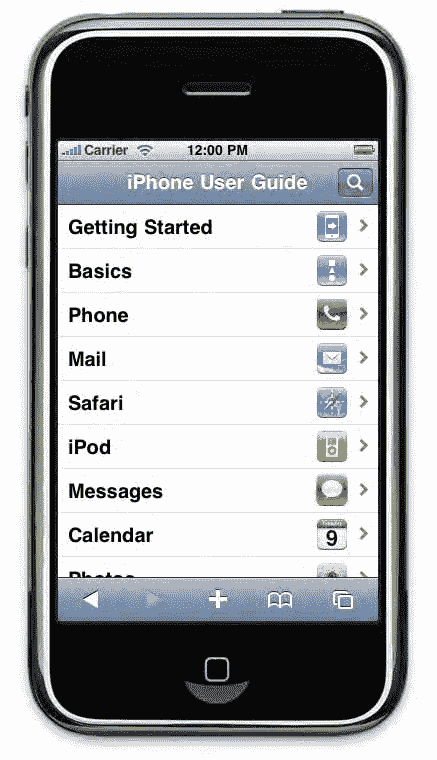
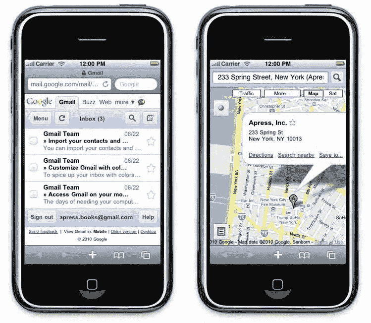

# Web 应用程序剖析

手机能够浏览网页已经有一段时间了。回到过去

### 移动互联网的早期发展

移动设备上的互联网接入开始时，与我们今天所知的完全不同。

网络速度极其有限且费用高昂，屏幕尺寸很小，设备通常只能显示黑白内容。一次只能阅读几行短文本，运气好时能看到一张缩略图大小的图片。当时，一个网页不能超过几千字节，部分原因是设备内存的限制，用户主要使用手机上的 0-9 键进行导航，非常繁琐。显然，即使这在当时是一种技术革命，在手机上浏览互联网对最终用户来说并不具有吸引力。

设备不断进化，屏幕变宽，触摸屏手机出现。手机引擎的整体性能有了提升，但网络连接仍然昂贵，而且网站布局最终并不值得。尽管自`WAP`（一种基于`XML`的轻量级`HTML`，是第一个标准）以来，技术已经有了很大改进，但大多数网站并未优化，导致页面布局以及更令人烦恼的导航成为突出问题。此外，由于浏览功能并非手机制造商的首要任务，仅仅访问在线服务通常意味着要在无数菜单和子菜单中翻找。

可以说，在很长一段时间里，移动互联网虽然存在，但对开发者来说肯定不是一个有吸引力的领域。

### iPhone 革命

当苹果公司发布`iPhone`时，用户发现了一种全新的移动体验，为开发者提供了全面的开发可能性。访问互联网突然变得无缝流畅，浏览页面也成了一种愉快、流畅的过程。依靠革命性的图形用户界面（`GUI`），`iPhone`在设备与最终用户之间建立了一种基于触摸的紧密关系。

在`iPhone`发布之前，用户——无论使用什么设备——都必须有某种配件来与内容交互并访问功能，无论是键盘、鼠标还是触控笔。`iPhone`发布后，人们似乎开始排斥使用这些便携式设备，设计师们也逐步放弃了小按钮，以模仿苹果`Multi-Touch`系统所提供的亲近感。

这种新的连接方式不仅具有革命性，苹果公司还将手机用户体验带到了真正的网络世界。通过发布一系列依赖网络的应用，以及最重要的，实现了一个名为`Mobile Safari`的真正、适配的浏览器，苹果公司提供了接近桌面浏览的即时感。

苹果公司还通过一个强有力的营销举措极大地促进了移动电话上网络服务的使用：在`iPhone`初次发布时，该公司成功让运营商销售的设备几乎都配有畅通无阻的网络接入，这在大多数情况下允许用户以完全满意且相对低廉的成本使用该设备的各种可能性。

### 对 Web 应用的信念

早在`iPhone SDK`发布之前，苹果公司就寄希望于网络应用来扩展其智能手机的可能性。其主要证据是，大多数网络应用都是通过苹果网站（[www.apple.com/webapps/](http://www.apple.com/webapps)）上的一个专门版块分发的，如图 4-1 所示。这个页面至今仍是`Mobile Safari`的默认书签之一。

**图 4-1\. 苹果公司的网络应用专用网站**

尽管苹果公司可能已经计划提供原生的`iPhone`应用，但相比于网络应用，这些原生应用更广泛的发展可能正是由开发者们自己推动的，他们敦促苹果公司提供一套完整的工具来专门构建这些应用。如今，从技术爱好者到国际公司，各类人群都开始开发原生的`iPhone`应用（迄今为止已超过 15 万个），这已不足为奇。网络应用曾一度被暂时搁置，而原生开发工具包却取得了巨大成功。然而，苹果公司一直支持着像`Dashcode`这样的项目。虽然`Dashcode`最初是为桌面`Widget`创作而设计的，但它很快也成为了一个构建网络应用的有趣工具，并新增了专用于`Mobile Safari`的功能，例如受 iPhone 启发的网络应用模板。

最近，人们开始质疑`PastryKit`和`AdLib`框架是否有可能分别公开发布，用于`iPhone`和`iPad`开发。这两个强大的框架专用于`iOS`集成的网络应用，并解决了诸如`CSS`中固定位置元素不可用等长期存在的问题。它们还带来了旨在提升用户体验的理想功能，例如一个固定顶部的页眉，允许用户无需平移即可浏览，并能像在原生应用中一样导航。

目前，`PastryKit`框架似乎只用于`iPhone`用户指南（[`help.apple.com/iphone/guide/`](http://help.apple.com/iphone/guide/)），如图 4-2 所示，也可能出现在你的`iPhone`书签中；然而，围绕它的热情和好奇心不仅表明苹果公司仍在致力于网络应用的未来，也表明开发者们希望在这一领域提供更高质量的服务。

**图 4\-2\. iPhone 上的 iPhone 用户指南**

其他类似的框架也由开源爱好者发布，这表明了在`iPhone`网络应用开发过程中寻找助手的迫切需求。你可以查看`iUI`（原`iPhoneNav`，由`Firebug`的作者`Joe Hewitt`开发），它在第一代 iPhone 发布后不久就出现了；`WebApp.Net`，一个轻量级、优化的框架；或者`jQTouch`，它基于`jQuery`库。

`iPhone`上的网络应用正变得越来越有吸引力。`Mobile Safari`的性能不断提升，对前沿网络标准的支持也在不断发展。最近，`iOS`的浏览器甚至获得了对核心工具（如地理定位功能）的访问权限。随着越来越多的公司提供可以集成到网络应用中的网络服务，并且`iPad`的发布受到了极大欢迎，网络应用领域的未来显得更加光明。

### 什么是 Web 应用？

为 iPhone 开发，你有三种可能性：制作原生应用，构建常规网页，或者构建网络应用（**这介于前两者之间**）。一个网络应用应该类似于原生的`iOS`应用，但可以像网页一样访问，并且基本使用相同的技术（例如`HTML`和`JavaScript`）。

苹果公司关于构建网络应用的指南强调了这方面的几个要点，这些要点都归结为非常精准的设备定位。根据苹果公司的说法，网络应用应该为用户的具体需求提供具体的答案。它应该模仿`iOS`界面的其余部分，因此在适当的地方使用特殊的`iOS`用户体验功能。其理念是尽量减少浏览器体验的感觉，而有利于与用户建立更紧密的关系，换句话说，就是让用户真正**使用**页面，而不是浏览它。为此，苹果公司强烈建议遵守网络标准，并使用`Ajax`来避免重新加载页面。

### 下载自 Wow! eBook <www.wowebook.com>

这一区别使差异更加清晰，但并非绝对。如果你想知道自己构思的项目究竟是真正的网络应用程序，而不仅仅是“单纯的”网页，请注意问题的关键在于用户导向：如果你构建的内容致力于服务最终用户，并且你认为它是一款网络应用，那么它很可能就是。在实际应用中，如果你的用户反复访问你的页面以实现同一目标，也可以认为你的页面是一款网络应用。因此，像针对 iPhone 优化的 Gmail 或谷歌地图这类产品，可被视为网络应用程序（见图 4-3）。

## 第 4 章：网络应用程序的架构

**图 4-3.** 两款针对 iPhone 优化的谷歌网络应用程序

### 应用星球：谁主沉浮

许多人通过广受欢迎的 App Store 迅速进军 iPhone 应用市场。

你可能会疑惑，既然原生应用程序得到了苹果公司的支持，并且已让许多人在短时间内致富，那为什么还要构建网络应用程序呢？这一点需要澄清：App Store 上的应用数量极其庞大，因此要想在那里获得关注度是一项艰巨的任务。要想脱颖而出，强势的营销变得越来越重要，但很少有人能真正取得成功。此外，要在 App Store 上架分发，需要获得苹果公司的批准，即便你认为应用已经开发完毕，审批过程也可能耗费时间和额外精力。当然，这场争论涉及的因素远不止这些。

### 跨平台大师

构建网络应用程序在多个方面可能优于构建原生 iPhone 应用程序，首先想到的便利之处便是跨平台兼容性——实际上，是双重跨平台兼容性。

确实，你无需依赖特定的操作系统或特定工具来构建网络应用。你基本上可以使用任何工具，从最简单的纯文本编辑器到复杂的所见即所得编辑器和集成开发环境（IDE），而在 Mac OS X 上构建原生应用程序如果没有 Xcode，效率往往很低。

此外，你的网络应用程序本身在某种程度上也应该是与平台无关的。谷歌的 Android 浏览器和 Palm 的 webOS 都基于 WebKit，因此它们渲染页面的方式与移动版 Safari 相似。WebKit 引擎正变得越来越流行，不仅用于桌面浏览器（Epiphany 最近已从 Gecko 转向 WebKit），也越来越多地用于移动设备，例如 RIM 的黑莓（BlackBerry）。无论 iOS 多么流行，针对它开发的应用程序都依赖于其底层平台和 API，很可能无法在任何其他设备上开箱即用。

### 硬件访问不再是禁区的武器

你可能听说过，原生应用程序与 iOS 本身紧密交织，能够访问更多的硬件性能、更多的平台资源，并且在无网络连接（或用户不希望联网）时拥有更多可能性。然而，这种说法已不完全正确。

首先，你的应用程序不太可能需要比移动版 Safari 提供的更强的处理能力——而原生应用程序也并非都能充分利用其所赋予的全部性能。至于存储，自 2.0 版本起，你可以直接在设备上使用 JavaScript 数据库，从而使你的应用程序数据在每次执行后都能持久可用。

此外，用户现在可以在离线模式下访问网络应用程序，这意味着即使没有网络连接，所有静态内容也依然可用。考虑到页面中的静态元素无需在每次浏览时重新加载，再加上 HTML5 新增的存储能力，你甚至可以在没有网络连接的情况下为用户提供大量可访问的内容。

最后，尽管原生应用程序确实能从操作系统获得更多可用的工具，但这种情况也在改变：在 3.0 版本中，iOS 允许浏览器访问地理位置信息。这或许是苹果公司押注于网络应用程序未来的另一个迹象。

### 解放你的内容

网络应用开发相比原生应用更具吸引力的第二点，在于你作为开发者对内容所拥有的自由度。

通过 App Store 分发应用需要经过苹果公司的验证，这确实会对你能展示的内容以及应用的主题造成一些限制。这个过程也可能很漫长，而一旦你设法通过了这个阶段，你仍然需要让用户从成千上万的其他应用中选中你的应用。

构建网络应用，你可以每天发布一个新应用，无需顾虑苹果公司，并且内容几乎可以随心所欲。你仍然需要吸引用户，但是，嘿！你正在为他们创造东西，所以，没有比这更自然的了。

## 第 4 章：网络应用的剖析

### 发布模式

在用户端，无论流程多么简单，原生应用都需要安装，并且可能需要更新。前者对于网络应用显然不成立，而后者则是自动发生的。对于原生应用，即使是更新也依赖于苹果公司的验证，这必然意味着延迟，即便很短暂。最后，只要用户有浏览器，网络应用就可以从任何设备被发现和访问，这看起来可能比受限于虽然很棒的 App Store 要好。

### 网络应用：不再是小朋友

与常听说的相反，网络应用并不比原生应用更容易构建。这就像比较苹果和橘子：它们都是水果，但截然不同。

自由度并不会让页面创建变得更容易。与原生应用开发者不同，网络应用开发者在着手一个新应用时，每次都会面对一张白页。虽然在浏览器中显示元素可能比为 Objective-C 应用排布元素更容易，但 CocoaTouch 框架在处理这类任务时非常高效。此外，我们已经解释了模拟 iPhone 图形用户界面的重要性，这可能会使网络应用开发在布局和外观方面变得棘手。为 iPhone 构建应用对网络开发者来说是一整套全新的约束。

开发者应始终牢记，网络应用专注于特定功能，并且一次只向用户展示少量功能。信息的使用和访问必须始终尽可能清晰。尽管如此，不必担心。有一些框架可以帮助你完成这个过程。而且更重要的是，我们也会提供帮助。

### 移动 Safari 上的网络应用

你将为运行在 iOS 上的 `Mobile Safari` 构建网络应用。虽然这比制作原生应用涉及的平台限制要少得多，但你必须充分了解目标设备的特性。特别是，你应该知道你的网络应用将如何被显示。到目前为止，目标设备 iPhone 和 iPod touch 具有完全相同的屏幕尺寸、视觉行为和图形用户界面重复模式。随着 iPad 的发布，你将需要考虑不同的屏幕尺寸和略有不同的图形用户界面组件。

### 掌握浏览器

如果有一个元素你需要彻底了解，那就是 `Mobile Safari`。正如苹果公司喜欢强调的那样，它并非一个缩微浏览器：与市场上的许多移动产品不同，它是一个成熟的网络解释器，全面支持 HTML、CSS 和 JavaScript——包括 Ajax 技术。这意味着，任何基于网络标准构建的网站，或多或少都能在 `Mobile Safari` 上正确显示。它不仅仅是一个合格的浏览器，还能支持 HTML5 和 CSS3 规范（尽管这些规范仍处于工作草案阶段）的前沿特性。这方面的一个小限制可能是，我们讨论的这三种设备都不使用鼠标。它们都通过触摸事件模拟鼠标事件，从而实现了比仅用鼠标更自然的交互。在大多数情况下，这种差异不会损害可用性。

我们只能再三建议你密切关注万维网联盟（W3C；[www.w3.org](http://www.w3.org)）和网络超文本应用技术工作组（WHATWG；[www.whatwg.org](http://www.whatwg.org)）发起的所有演进。你将在这里找到大部分未来的网络技术。

### 浏览器指标

`Mobile Safari` 的默认行为是缩放页面内容以适应屏幕。当然，这使得浏览体验不同于桌面浏览器或 `Opera Mini`，后者会重新排列和调整页面大小，以便在小屏幕上阅读。用户需要借助特定的手势，调整视图以阅读他们想要的内容。这是通过捏合展开（放大）、捏合关闭（缩小）和双击（聚焦特定页面元素）来实现的。此外，`Mobile Safari` 不存在桌面浏览器那样的“页面”概念。这意味着用户不会在屏幕侧面和底部有视觉辅助的情况下向上、向下、向左或向右滚动页面。他们会通过手指轻拂来平移视图的上、下或侧面，以揭示他们想在视口中看到的任何内容。

你页面的可见区域不仅受屏幕尺寸限制；你还必须应对分别位于屏幕顶部和底部的地址栏和导航栏。然而，当用户平移时，地址栏会向上移动，并且可以通过点击状态栏使其重新出现，以节省屏幕空间。iPad 的布局略有不同：由于屏幕更宽，地址区域和导航选项被组合在屏幕顶部的一个单独栏中。当用户平移时，此栏不会消失。

表 4-1 列出了你将使用的尺寸。请牢记在心。每次你为苹果设备设计网络应用时，都应考虑这些因素。

**表 4-1\. Safari 和全屏模式下的浏览器指标**

| **设备** | **竖屏模式** | **横屏模式** |
| :--- | :--- | :--- |
| iPhone, iPod touch | **320x460** | **480x300** |
| | 减去 44px 的导航栏 | 减去 32px 的导航栏 |
| | 减去 60px 的地址栏 | 减去 60px 的地址栏 |
| | 减去 50px 的控制台 | 减去 50px 的控制台 |
| iPad | **768x1004** | **1024x748** |
| | 减去 58px 的导航栏 | 减去 58px 的导航栏 |
| | 减去 50px 的控制台 | 减去 50px 的控制台 |

这些指标并非绝对限制，因为所有三种设备都允许网络应用以全屏模式运行。在这种情况下，只有状态栏可见，你的应用将在屏幕的其余部分自由运行。

### 思考“网络应用”

这种浏览模式的问题在于，它与网络应用体验的核心原则相冲突。网络应用的目标是无缝地提供服务。对于最终用户来说，必须缩放才能访问菜单或特定内容很容易造成体验不佳，从你的角度来看，访客忠诚度也会受到影响。你必须完全控制应用所属的空间。为此，你必须完美地了解它，并完全专注于你提供的核心功能。应移除默认的浏览器导航，让用户通过网络应用处理高效的内部导航。我们很快会解释如何让用户将你的应用添加到主屏幕，以及如何让用户以全屏模式启动它。这将使你的网络应用看起来更像一个原生应用。

`Ajax` 对于实现应用体验有很大帮助，但若完全取代整页刷新来独家使用时，它也会引发新的问题。注意不要破坏你的

