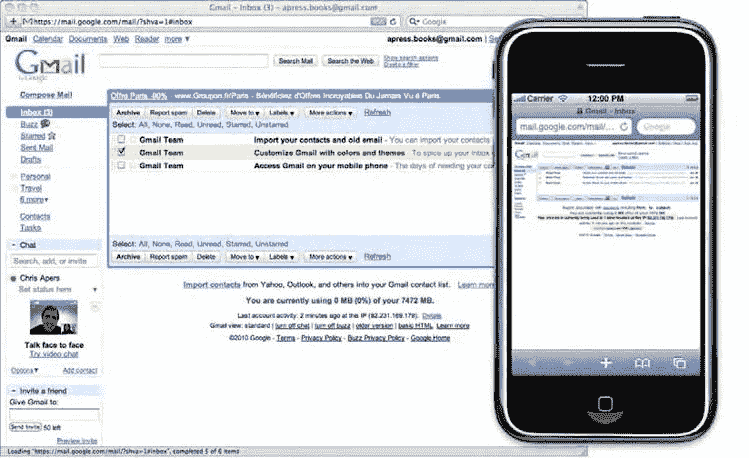

# Web 应用结构剖析

掌握了以上基础知识后，我们就可以开始构建 Web 应用了。为了条理清晰，我们将演示如何从零开始搭建一个基础项目。

这样能让本书各章节中的示例更易于理解，并且随着你对这个模板的扩展，它也能极大地提升你的工作效率。遵循本章前面提出的指南，并为了简化操作，我们将坚持使用 iOS 的默认颜色和尺寸标准。同时，我们也会借此机会介绍一些技巧，教你如何用 CSS 替代过去用图片来实现的效果（这些技巧将在后续相关章节中进行详细解释）。

### 在 Komodo Edit 中创建文档模板

要在 Komodo Edit 中创建新项目，请选择 **文件** > **新建** > **新建项目**。将新项目命名为 `Web App Template` 或你喜欢的任何名称，并选择保存文件的目录。如果项目侧边栏已激活，你将在其中看到你的新项目，显示为你指定的名称和 Komodo Edit 的项目扩展名 `.kpf`。如果侧边栏未打开，你可以从 **视图** 菜单中激活它，具体路径为 **视图** > **标签与侧边栏** > **项目**。

> **注意：** 此项目定义基于 Komodo Edit 5.x 版本。在编辑器的新版本中，菜单布局和选项可能会有所不同。

现在，我们来添加你的第一个 HTML 文件。你可以通过右键单击侧边栏中的项目名称，然后选择 **添加新文件**，或者选择菜单项 **项目** > **Web App Template.kpf** > **添加新文件** 来完成此操作。此时会弹出一个新窗口。从右侧列中选择适当的文件类型，这里选 HTML。在列下方的文本字段中，输入文件名 `index.html`；你会注意到保存文件的正确文件夹已被选中，因此只需单击 **打开**。你的新文件将显示在编辑区域中。

这个文件并非空白。由于你选择了 HTML 文件类型，Komodo Edit 已经为你完成了一些工作，基本结构已经存在。然而，为了完全满足我们的需求，我们需要更改或添加一些元素。你的文件在下一步骤中应如下所示：

```html
<!DOCTYPE html>
<html>
<head>
    <title>Web 应用模板</title>
    <meta name="apple-mobile-web-app-capable" content="yes">
    <meta name="apple-mobile-web-app-status-bar-style" content="default">
    <meta name="viewport" content="initial-scale=1.0;
    maximum-scale=1.0; user-scalable=no">
    <link rel="stylesheet" href="styles/main.css">
    <script src="scripts/main.js"></script>
</head>
<body>
    <div class="view">
        <div class="header-wrapper">
            <h1>Web 应用标题</h1>
        </div>
        <div class="group-wrapper">
            <h2>iPhone</h2>
            <p>你好，世界！</p>
        </div>
    </div>
</body>
</html>
```

你可以看到本章一直在讨论的特殊标签。当然，如果你希望它们都能按预期工作，你需要在根文件夹中创建一个 `images` 文件夹，并按照之前说明放入一个名为 `startup.png` 的文件。你应该注意到，我们更改了 Komodo Edit 默认 HTML 文件中的文档类型声明（DOCTYPE）。这是我们将在本书中使用的 HTML5 文档类型声明，目的是在创建有效文档的同时，展示 HTML5 的新特性。使用大写字母是前端开发者的老习惯；自 HTML5 起，文档类型声明不区分大小写。

如果你现在在浏览器中打开此文件（或通过菜单 **视图** > **在浏览器中预览** 直接在 Komodo Edit 中查看），你可能会觉得它平淡无奇。没有应用任何样式，也几乎没有什么内容。然而，你会注意到我们的模板骨架中包含了一些类和 ID。这些将帮助你定位元素，并将它们样式化为看起来像真正的应用。

在你的站点根目录下创建一个名为 `styles` 的新文件夹。然后，像几分钟前创建 HTML 文件那样，创建一个 CSS 文件，并将其命名为 `main.css`。此文件已在文档的 `<head>` 中被引用，因此你对它的任何更改都应立即生效。现在让我们添加一些样式。

根据我们之前讨论的建议，你添加到样式表中的第一条样式规则应规定文档占据整个屏幕高度。为了模拟 iOS 用户界面，你还需要将通用字体设置为 Helvetica。

后续章节将深入探讨 CSS 的各种可能性，因此我们在此不会解释全部内容。不过，你可能会对 `-webkit-` 前缀感到陌生。这是一个专有前缀（意味着只有基于 WebKit 的浏览器才能解释），用于那些特定于浏览器或被认为在 CSS3 规范或其实现方面不稳定的属性和值。

```css
html { height: 100%; }

body {
    height: 100%;
    margin: 0;
    font-family: helvetica, sans-serif;
    -webkit-text-size-adjust: none;
}
```

为了始终使文本尽可能易读，Mobile Safari 会在每次视口方向改变时自动更改文本大小。这并非总是理想的，因为如果你以特定方式设计页面，它可能会破坏布局或最终看起来很奇怪。为防止此行为并保持对页面外观的控制，我们将 `-webkit-text-size-adjust` 设置为 `none`，从而禁用自动文本大小调整。

接下来，使用 `-webkit-gradient()` 背景扩展，我们无需使用图片即可创建通用背景。构建此背景的方式是，你只需更改 `background-color` 属性，就能在不丢失 iOS 外观的情况下更改元素的颜色。至于 `.view` 规则，它应用于文档视图的主容器。

```css
body {
    -webkit-background-size: 100% 21px;
    background-color: #c5ccd3;
    background-image:
        -webkit-gradient(linear, left top, right top,
            color-stop(.75, transparent),
            color-stop(.75, rgba(255,255,255,.1)) );
    -webkit-background-size: 7px;
}

.view {
    min-height: 100%;
    overflow: auto;
}
```

然后，使用应用于 body 背景的相同规则添加标题样式。

```css
.header-wrapper {
    height: 44px;
    font-weight: bold;
    text-shadow: rgba(0,0,0,0.7) 0 -1px 0;
    border-top: solid 1px rgba(255,255,255,0.6);
    border-bottom: solid 1px rgba(0,0,0,0.6);
    color: #fff;
    background-color: #8195af;
    background-image:
        -webkit-gradient(linear, left top, left bottom,
            from(rgba(255,255,255,.4)),
            to(rgba(255,255,255,.05)) ),
        -webkit-gradient(linear, left top, left bottom,
            from(transparent),
            to(rgba(0,0,64,.1)) );
    background-repeat: no-repeat;
    background-position: top left, bottom left;
    -webkit-background-size: 100% 21px, 100% 22px;
    -webkit-box-sizing: border-box;
}

.header-wrapper h1 {
    text-align: center;
    font-size: 20px;
    line-height: 44px;
    margin: 0;
}
```

最后，以下代码将使我们可以用样式来展示内容：

```css
.group-wrapper {
    margin: 9px;
}

.group-wrapper h2 {
    color: #4c566c;
    font-size: 17px;
    line-height: 0.8;
    font-weight: bold;
    text-shadow: #fff 0 1px 0;
    margin: 20px 10px 12px;
}

.group-wrapper p {
    background-color: #fff;
    -webkit-border-radius: 10px;
    font-size: 17px;
    line-height: 20px;
    margin: 9px 0 20px;
    border: solid 1px #a9abae;
    padding: 11px 9px 12px;
}
```

这里介绍的最后一个令人兴奋的特性是 `border-radius` 属性，它让你可以为任何元素添加圆角边框。现在，在浏览器中重新加载你的页面（图 4-7）。是不是很眼熟？

**图 4-7.** 瞧，你的第一个 Web 应用！

### 隐藏 Mobile Safari 的地址栏

只要用户以全屏模式查看你的站点，这都没问题。然而，你无法完全确定你的最终用户会以那种方式使用它。一个理想的技巧是，当站点在没有全屏模式的浏览器中显示时，隐藏地址栏——以及错误控制台（如果需要的话）。


### Mobile Safari

观察一下这种情况。当用户平移视口时，这些页面元素会消失不见。页面将至少占据视口高度的 100%，这意味着如果页面部分元素移出焦点区域，其高度未必足以覆盖整个屏幕。因此，我们的目标是在必要时重新调整页面高度，使其始终占据视口的 100%，即便部分内容被隐藏。

我们直接来看代码。在你的项目中创建一个名为 `scripts` 的新目录。在 Komodo Edit 中，创建一个名为 `main.js` 的 JavaScript 文件，并将以下代码复制进去：

```
if (!window.navigator.standalone) {
   document.addEventListener("DOMContentLoaded", adjustHeight, false);
}

function adjustHeight() {
   var html = document.documentElement;
   var size = window.innerHeight;
   html.style.height = (size + size) + "px";
   window.setTimeout(function() {
      if (window.pageYOffset == 0) {
         window.scrollTo(0, 0);
      }
      html.style.height = window.innerHeight + "px";
   }, 0);
}
```

这段代码的作用是检查是否处于独立模式；如果用户没有全屏浏览你的页面，`adjustHeight()` 函数将会与 DOM 加载完成事件关联。该函数将页面高度设为屏幕高度的两倍，这在大多数情况下都足够，因为用户界面元素很少会占据那么多空间。

`window.setTimeout()` 为页面提供了足够的时间，以便在奇迹发生前完成修改。这个奇迹分两步完成：首先，我们使用 `scrollTop()` 方法将页面上移，使页面顶部与屏幕顶部对齐；然后，我们重新调整页面高度，使其再次恰好适应屏幕高度。

你可能会觉得奇怪，为什么只在垂直页面偏移量等于 0 时才重新调整页面位置。实际上，只要没有单个像素移出屏幕，`pageYOffset` 的值就为 0。即使用户平移了地址栏一半的高度，`pageYOffset` 的值仍然保持为 0。因此，我们可以一次又一次地保持页面位置不变。这样做的结果是，当用户加载页面时，页面几乎会以全屏模式显示，从而将最大的关注度集中到应用程序上。

### 处理屏幕方向变化

然而，由于页面高度已被动态修改，如果用户在非全屏模式下旋转屏幕，页面高度可能会超出屏幕范围。为此，我们也必须添加一个事件监听器。请注意，`pageYOffset` 测试在这里特别有用，因为页面位置不会随着每次旋转而重置。以下是处理旋转的代码行：

`window.addEventListener("orientationchange", adjustHeight, false);`

## 第 4 章：Web 应用的构成

这段代码能让我们知道用户何时旋转了设备。事件监听器必须设置在附加到当前窗口的 `DOMWindow` 对象上，而不是文档（document）上。你可以随时使用 `window.orientation` 属性来检查方向的值，如下例所示，例如为了适当地修改样式：

```
switch (window.orientation) {
   /* 正常方向，Home 键在底部 */
   case 0:
      document.body.className = "portrait";
      break;
   /* 向左旋转 90 度 */
   case 90:
      document.body.className = "landscape";
      break;
   /* 倒置 */
   case 180:
      document.body.className = "portrait";
      break;
   /* 向右旋转 90 度 */
   case -90:
      document.body.className = "portrait";
      break;
}
```

通过这种方式，我们避免了使用会消耗大量电量的定时器来定期检查窗口尺寸变化——通知是自动的。

请注意，在 iPad 上，你也可以使用 CSS 或带有 `media` 属性的 link 标签来锁定某个特定的方向。

```
<link rel="stylesheet" media="all and (orientation:portrait)" href="portrait.css">
<link rel="stylesheet" media="all and (orientation:landscape)" href="landscape.css">

<!-- 或者在 style 标签或样式表中使用 -->
<style>
@media all and (orientation:portrait) { /* 此处是你的样式 */ }
@media all and (orientation:landscape) { /* 此处是你的样式 */ }
</style>
```


### 此功能仅在 iPad 上可实现。对于其他设备，最佳实践是使用 JavaScript 在 `<body>` 标签上添加一个类或 ID，以便在屏幕方向改变时应用不同的样式。

### 最终润色

当用户在移动版 Safari 中打开你的应用时，之前的 JavaScript 代码负责处理视口（viewport）。如果用户并非通过移动版 Safari 打开，我们已知应该用 JavaScript 来处理链接；接下来，我们将向 `main.js` 中添加相关脚本，以阻止此情况下的默认行为。为此，请添加如下事件监听器，并将 `clickHandler()` 函数附加到你的*脚本*文件中：

```
if (!window.navigator.standalone) {
    document.addEventListener("DOMContentLoaded", adjustHeight, true);
    window.addEventListener("orientationchange", adjustHeight, true);
} else {
    /* 仅针对独立模式 */
    document.addEventListener("click", clickHandler, true);
}
```

### 准备就绪

你在此处构建的文件及文件结构，正是启动大多数 Web 应用项目所需的基础。如果你已安装 Komodo Edit，现在可以将此项目保存为模板，以便在日常工作流程中轻松复用。为此，请从“项目”菜单中选择你的项目名称，然后点击“从项目创建模板”。模板的默认存储位置是安装 Komodo Edit 时创建的用户文件夹下的 *Template* 文件夹。之后，你便可以通过“项目”菜单选择“从模板新建项目”，来基于此模板创建新项目。

如果你选择不安装 Komodo Edit，我们建议你寻找其他方法来轻松复用此代码和结构。通过本章，你已经了解到我们的模板框架所满足的需求对于用户满意度以及你 Web 应用的成功至关重要。使用模板作为辅助工具，能帮助你快速跨过项目中那些略显烦人的初始阶段。这也是让你的 Web 应用实现其首要目标——成为一个真正的应用——的第一步。

---

## 第 5 章：用户体验与界面设计指南

上一章的核心并非关于屏幕尺寸、技术可能性，甚至不是理解 iOS 在 iPhone、iPod touch 和 iPad 上的行为方式。当然，你必须掌握这些方面才能为这些设备构建高质量的 Web 应用，但这些技术只是实现成功过程的工具。本书中的建议最终都归结到用户身上。苹果便携式设备的触摸交互系统在设备与用户之间建立了一种特定的、绝对以用户为中心的关系。这意味着，作为开发者，你需要认真考虑你的应用设计。

应用于计算机开发领域的认知工效学是一门实践性科学，旨在让应用的功能易于用户理解和操作。

苹果工程师已经考虑了 iOS 的部分工效学特性。例如，多点触控交互模型允许用户轻松完成大多数网站上的常见任务，如缩放、聚焦或打开上下文菜单。

工效学在苹果产品中（尤其是在苹果便携设备上）的一个重要方面是美学吸引力。iOS 具有强烈的视觉识别性，而紧密集成到 iPhone GUI 中的原生应用的成功更是使其辨识度大增。因此，从用户角度评判一个应用的质量，往往取决于其视觉质量与 iOS GUI 的匹配程度。

当然，仅靠设计并不能保证你的 Web 应用成功。尽管漂亮的外观可以吸引用户进入应用，但如果他们在实际使用中找不到预期的品质，就会很快离开。这在应用开发这种竞争激烈的领域尤其如此。

在本章中，我们将介绍一系列规则和最佳实践，帮助你构建更好的 Web 应用——也就是说，让那些在移动设备上与桌面计算机上有着不同体验的用户体验达到最佳状态的应用。

---

### 从桌面网页到移动网页

一个常见但危险的错误是认为，无论通过何种平台访问，Web 都是相同的。尽管 Web 应用是使用 Web 技术构建的，但它们与经典网页完全不同。显然，设备能力是不同的。如果你在桌面版 Safari 或移动版 Safari 上查看 Gmail 之类的 Web 应用，你会发现它们的界面截然不同。

尽管如此，你仍然可以在 iPhone 上使用 Gmail，这是因为移动版 Safari 旨在适应有限的屏幕空间。然而，与使用 iMac 甚至 MacBook 相比，用户的体验感并不那么好。如图 5-1 所示，缩放会使内容更难以阅读和交互。因此，谷歌尝试为其移动设备上的 Web 应用提供适配版本——界面更简洁，功能通常更少，并且加载时间经过优化。



**图 5-1.** 尽管桌面版 Safari 和移动版 Safari 的渲染效果相同，但缩放确实会影响用户体验

不同的屏幕尺寸不仅仅意味着不同的视图：更换设备意味着完全不同的体验，伴随着不同的行为和期望。开发 Web 应用时，你应该将界面和交互模式与功能紧密关联，而不应受设备的制约。同样，诸如 CSS 或 JavaScript 等 Web 技术应始终被视为定义界面和交互可能性的工具，这些可能性是特定功能所固有的——但绝不应让它们决定界面和功能应该是什么样子。

---

### 忘掉桌面隐喻

通常，桌面隐喻是需要被忘记的，同时还有频繁多任务处理习惯。请接受这样一个事实：iOS 设备——更不用说所有移动设备——并非以那种方式工作。在使用桌面计算机时，最终用户可以在同一时间执行各种任务，处理多个窗口，并且如果愿意，可以随时将它们并排放置。对于所有这些任务，他享有充足的屏幕空间，最重要的是，会使用功能丰富的设备（即鼠标和键盘）与桌面进行交互。

计算机采纳了桌面隐喻，并且可以自豪地拥有生产力工具以及处理许多活动的实用或趣味性方法。而对于 iOS，虽然你可以进行多种后台任务，如播放音乐、下载应用或收取电子邮件，但并排运行多个原生应用是不可能的。iOS 旨在让最终用户高效地一次完成一项任务。小屏幕意味着用户需要依次专注于一个区域——从而专注于一系列操作。

---

### 改变导航习惯

在开发移动 Web 应用时，不能在整个 Web 应用体验的中途失去最终用户，这一点至关重要。传统的 Web 体验允许用户从站点的任何一个部分访问所有其他部分。这通常通过使用导航栏和大量内部链接来实现。作为 Web 用户，你可能已经遇到过一些怎么都搞不明白的网站。如果一切顺利，你会足够快地找到所需内容；否则，和大多数用户一样，你可能会转向下一个网站。

这种情况在移动 Web 上更为严峻。用户期望找到一条清晰、直接的路径从一个点到达另一个点。这里一个重要的概念是*流程*。


