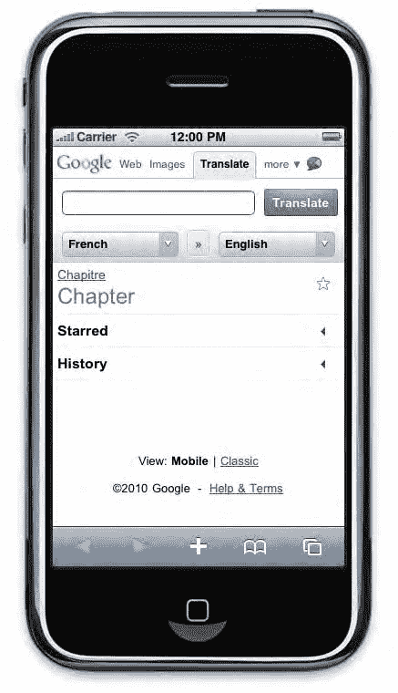
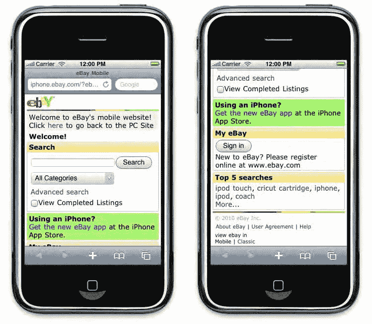
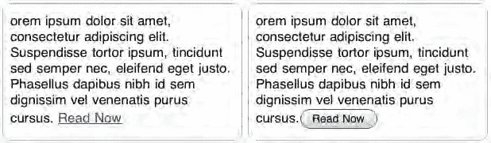
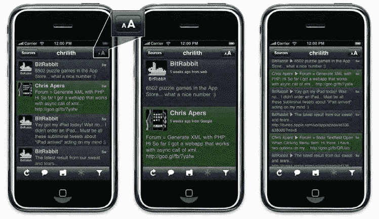

# 无缝用户体验与界面设计指南

提供无缝体验，让用户能从网络应用中自由选择所需内容而不受干预，这确实颇具挑战。但有些情况下，你必须明确地将决定权交给用户。虽然用户挫败感并非直接源于用户界面或设计问题，但它会严重影响用户对你应用质量的感知。例如，根据用户使用的设备进行过滤，并用"仅限 iPhone"的消息阻止访问，这是应该避免的做法。首先，针对功能而非用户代理进行优化更为高效。其次，如果你的网络应用能在 iPhone 上运行，那么在 iPad、安卓或 webOS 设备上通常也能正常运行。

同样，你不应强制 iPhone 用户访问特定于 iPhone 的网站。用户可能有理由更倾向于使用常规桌面版网站。移动版 Safari 渲染网站的方式与桌面版 Safari 类似，并提供了在最佳条件下查看页面的工具。请给用户选择权（如图 5-4 所示），记住用户的选择（通过 Cookie 或其他存储方式），并始终让用户有机会改变主意。

**图 5–4.** Google 翻译的移动版为用户提供了使用常规网页版本的选项。

### 简洁性与易用性

对于传统桌面和网络开发成立的准则，在移动网页领域更为关键。由于便携设备旨在移动场景中使用，用户可能同时专注于其他事情。因此，你必须让用户一目了然地知道如何通过你的应用实现目标。虽然反复平移页面会令人厌烦，但你不应将大部分内容都集中在页面顶部。相反，应对内容进行分类，并使分类清晰明确。即使用户同时关注其他事情，也应能立即识别出你的网络应用的主要功能及其整体运作方式。

### 避免杂乱

iOS 的整体用户界面简洁精致，采用微妙的渐变、有限的色彩和干净的线条。这是用户评判你网络应用的标准，而苹果的选择绝非偶然。杂乱始于刺眼的颜色、过多的色彩，以及使内容难以浏览的配色。同样的原则也适用于网络应用的各个元素。分散的内容难以理解，会分散用户对重要内容的注意力。图 5-5 展示了一个杂乱应用示例。

**图 5–5.** eBay 未针对 iPhone 进行优化，给人一种杂乱的感觉，但由于只有一个搜索框，依然保持着高效性。

这并不意味着你应该大量使用空白。在 iPhone 上过度使用空白会迫使用户频繁平移，导致整体内容可见性受限。而在 iPad 这样更大的屏幕上误用空白，则可能稀释内容，给人留下体验分散的印象。

如果你的网络应用本身包含许多不同的内容元素，实现满意用户体验的关键可能在于高效的菜单。你不能固守开发桌面网页时养成的习惯。你的菜单必须快速切入重点，将用户操作限制在最低限度，同时清晰展示不同的可用选项。应优先选择简短、表现力强的文本，而非冗长、描述性或下拉式菜单。如果你确信目标受众能理解技术词汇或缩写，而这些词汇能用更少的字符清晰表达选项，那就使用它们。所有与导航相关的内容都应便于快速浏览和使用，因此这些准则同样适用于按钮、链接以及偶尔出现的弹出窗口。

简而言之，不要忘记所有这些元素都是次要的，不应分散用户对你所提供主要服务的注意力。恰当平衡所有这些要素，将极大有助于吸引用户注意力，并最终提升用户忠诚度。

### 用户界面

在屏幕尺寸有限的移动场景中，应以好奇的心态来思考用户界面的概念。我们谈论的是那些经常在移动中，在比惯常更小的屏幕上，仅用手指手势与应用及设备进行交互的用户。

在开发桌面应用时，你可以放心地将按钮排列在全屏窗口的远边，以便轻松点击。开发网络应用时，你可以依赖鼠标悬停提示来引导用户。这些技术在开发 iOS 应用时并不适用。没有什么能阻止用户点不到屏幕边缘，也没有真正的鼠标悬停让用户可以快速"探索"页面。为了让用户界面保持其在桌面端的功能——一套作为一个整体使功能易于访问的图形元素——你必须重新考虑应该应用的关键规则。

#### 适应触控

你首先应考虑的参数是指点设备——用户的手指。苹果建议，大多数用户的手指需要一个大约 44 像素宽的区域，才能快速无误地点击某个项目。如果你希望使用更小的按钮或链接，请确保周围有足够的空间，避免多个活动区域被同时点击。

另一个关键点是操作应有明确的指示。如果没人想到要去点击，那么完美尺寸的点击区域就毫无意义。让你的元素看起来是可点击的。确保用户能识别出按钮的最佳方式是遵循主流的苹果用户界面。如果你偏离了它，请注意用户可能会误解你的元素。在 iPhone 上，创建可点击元素的一般建议是让它们"看起来真实"。苹果的按钮因其渐变和投影而在屏幕上脱颖而出（见图 5-6）。它们看起来像是你真的可以触摸到的按钮——这正是你需要传达的感觉。

**图 5–6.** 与普通链接相比，用户更可能点击按钮。

在为 iPad 开发时，这一点将更为重要：随着专门为 iPad 更大屏幕设计的应用和网站数量增加，类似真实世界的应用界面很可能会迈出重要的一步。

最后，不要忘记，与使用鼠标不同，用户无法激活悬停状态。如果你的应用依赖工具提示或复杂的悬停效果，很可能只会让失望的用户离开。

#### 适应尺寸

