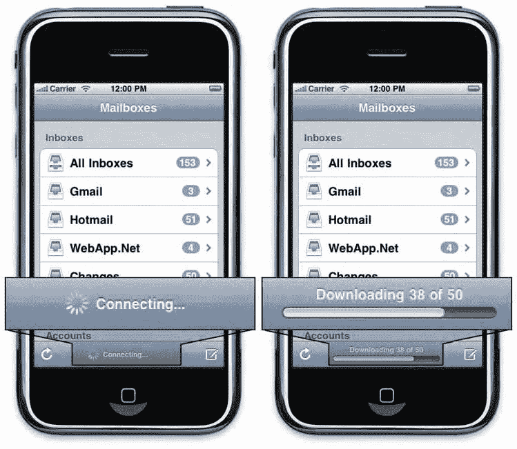
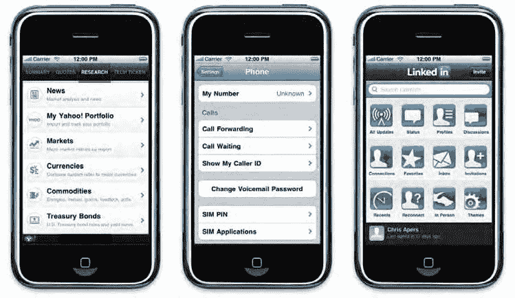
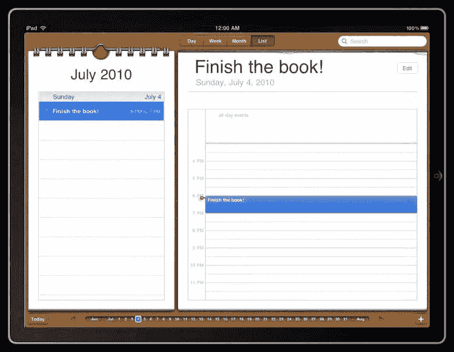
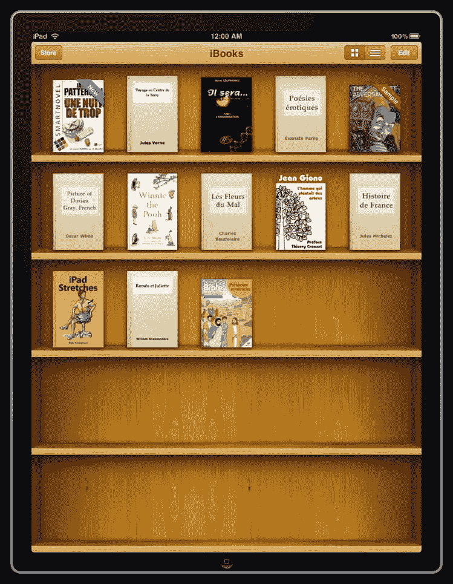
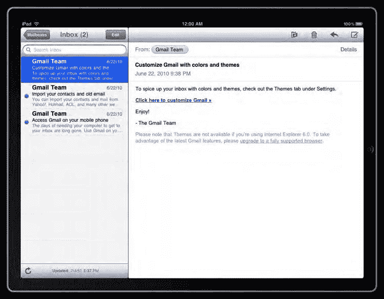

# 移动端用户体验与界面设计指南

移动设备用户期望操作能够快速响应。任何操作都应立即获得反馈。我们在前一章中已经说明，全屏模式 Web 应用的默认启动画面是上一个 Web 应用界面的状态快照，这可能会让用户误认为应用或设备已经无响应。这种情况至少会让用户感到沮丧。即使是短暂的等待也会驱赶部分用户，并且在任何情况下都会损害用户忠诚度。

### 让你的 Web 应用响应迅速

这一原则贯穿 Web 应用体验的始终。你应该避免使用过多处理器密集型操作、过多的`JavaScript`，以及耗时过长的操作（如重服务器端活动以显示结果）。这些不仅应该在开发优化阶段充分考虑，更应在头脑风暴和功能设计阶段就纳入考量。

为了在 Web 应用加载时最小化等待时间，应始终尽量限制图片的使用，注意文件大小，并避免页面过长导致需要大量滚动才能使用。关于图片，正如我们将在后续章节中看到的，你可以通过使用`CSS`渐变、画布（`canvas`）或网页字体（`web fonts`）来替代许多图片。需要注意的是，在文档未完全加载之前，页面的其余部分很可能无法进行用户交互——而用户却无法理解其中原因，因为尚未加载的页面部分在视窗之外。最后，虽然将标记、样式和功能（即`HTML`、`CSS`和`JavaScript`）分离并采用外部文件是一种良好实践，但你也应尽可能减少`HTTP`请求次数，因为你无法预测连接类型或质量，而且移动设备的服务器响应时间可能更长。

当然，在您提供的体验中出现明显的延迟步骤可能难以避免。如果在某个阶段，你必须启动一个需要较长时间的操作，请务必记得向用户反馈 Web 应用的活动状态（见图 5–11）。虽然每个操作都应快速给出答案，但如果无法做到，通过让用户了解当前进展，他们会更有耐心和容忍度。顺便说一句，这对于大多数用户交互来说都是如此。



**图 5–11.** 邮件应用在连接时使用旋转指示器，在可能较长的消息加载过程中则使用进度条

对于等待阶段，除非你绝对确定等待时间会很短（无论连接质量如何），否则进度条比旋转指示器更好，因为它能告知用户当前进程的进展情况。同样，如果多个操作同时进行，最好逐步告知用户正在发生的事情。屏幕上视觉元素的变化能让用户确信确实有事情正在发生——也就是说，Web 应用并没有卡在旋转指示器上——如果你做得好的话，甚至还能在一定程度上带来娱乐性。

### 让你的 Web 应用具有交互反馈

类似地，即使操作不需要时间完成，你也应该引导用户完成操作。`iOS`通过`-webkit-tap-highlight-color` `CSS`属性为点击按钮提供了内置反馈。你可以将此作为示例，来加强与用户及其设备（以及你的应用）之间的连接——因为屏幕会像真正的按钮一样对手指操作做出反应。在传统 Web 上，这通常通过悬停（`hover`）状态来实现：菜单项在悬停时改变颜色、出现工具提示、元素放大或不透明度切换。

但你应该知道，这在移动设备上并不可行，因为没有鼠标，也就不存在真正的悬停操作。相反，你需要额外关注用户点击时应该发生什么。另一个来自原生`iOS`功能的启发式示例是切换开关按钮。`Apple`的设计师没有使用普通的复选框，甚至不是按下时看起来被按下的按钮，而是采用了一种“开关”隐喻。这给用户带来了对`GUI`元素更强的真实感，同时状态的改变变成一种微妙的动画，告知用户操作已被采纳。尽管如此，在模仿原生`iOS`界面时一定要小心，因为用户会期望你的元素行为与它们模仿的对象完全一致。因此，不同的行为或结果会具有欺骗性，并对用户对你应用质量的感知产生负面影响。

作为`iOS`开发者，在许多情况下，通过创建自己的效果来超越`-webkit-tap-highlight-color`效果是很有趣的（但要记住，事情应该保持简单且易于理解），无论是通过管理你自己的自定义效果，还是例如模仿原生`iOS`的条目或菜单选择列表效果。

## `iOS`界面设计最佳实践

除了前面介绍的用户体验指南外，在开发 Web 应用时，还有若干用户界面设计准则需要考虑。这些准则源于设备的特殊性或原生`iOS`的`GUI`。遵循这些准则有助于提供用户期望的优质体验，也是应用成功的重要一步。

#### 适应性

`iOS`的一个棘手特性是，它允许用户随时在竖屏和横屏方向之间切换视口。这与传统 Web 开发者不同，他们可以轻松依赖最小屏幕尺寸，最终依靠滚动条。此外，用户在一次页面访问中反复更改浏览器窗口大小的可能性很小，这意味着不会出现不同显示方式的直接对比。随着屏幕尺寸是`iPhone`和`iPod touch`五倍大的`iPad`的发布，情况变得更加复杂。为了给用户提供令人满意的体验，你的 Web 应用必须完美适应这些情况。

因为按照本书的建议，你已阻止了 Web 应用的缩放，因此必须确保应用能够适应视口的宽度（设置为`device-width`）。如果你是前端 Web 开发者，你应该知道什么是流动布局（`fluid layout`）。基本思想是，无论屏幕尺寸如何，页面都占据屏幕的 100%，而不会破裂成一堆无序的元素。这意味着你应该禁止所有布局元素使用固定尺寸，并作为通用规则，完全避免使用它们。

本书中将有大量示例说明如何实现这一点。你已经在项目模板中看到，标题和段落会占据屏幕的全部宽度，无论方向如何。

另一种可用方法是根据视口方向应用`CSS`规则。使用时需谨慎，因为如果最终对每种配置应用完全不同的规则，文件大小很容易翻倍。最佳方法是始终记住你的页面将有两种可能的布局，并在每个开发阶段对两种布局都进行测试。如果你以这种方式构建了标记和样式，很可能就不需要使用特定样式。

#### 列表与图标方法


### 列表

为了以清晰明了的方式呈现数据，你会频繁使用列表。Apple 建议在为运行 iOS 的设备设计网页和应用时使用列表，事实上列表确实有很多优点。它们能让你通过减少完整句子的数量来使表达更加简洁，同时能让大量信息以清晰的数据分组形式呈现。此外，列表的形式与 iOS 和桌面应用的默认菜单相似，因此用户会感到熟悉。

不过要注意，不要让列表过于冗长。尽管前面提到的要点都与我们已阐述过的最佳实践相吻合，但列表——即使是网页上的列表——如果变得太长，会迫使用户进行平移，可能错过他们正在寻找的内容，或在信息中迷失方向。长列表的另一个严重问题是，它们通常会使浏览器变慢，这同样会让用户感到沮丧。为了避免列表过长，正如前面所述，你应该问自己哪些信息最重要，以及如何对它们进行分类。

由于列表存在于 iOS 的图形用户界面中，因此你可以模仿现有的样式，为你的网络应用打造吸引人的界面。有三种可用的列表类型，即：边到边列表、圆角边框列表和图标网格列表（见图 5-12）。



> **第 5 章：用户体验与界面指南**
> 
> 图 5-12\. 三个不同应用（雅虎财经、设置和领英）中的三种不同列表类型

如果你按照本书中的所有示例操作，并根据我们建议的文件和代码片段创建模板，你很快就能拥有一个坚实的基础，从中挑选素材来构建网络应用。

第一种列表类型特别适合长列表。它紧凑、简洁且易读。

#### 基本边到边列表

如果你已经开始构建项目模板和模板文件，你可以创建一个新的 HTML 文件，并将以下代码添加到 `.view` 容器中：

```html
<div class="list-wrapper">
  <h2>A</h2>
  <ul>
    <li>苹果</li>
    <li>应用程序</li>
  </ul>
</div>
```

接下来是让基本列表看起来像 iPhone 风格的 CSS。将其附加到你在网络应用模板中已创建的 `styles.css` 样式表中：

```css
.list-wrapper h2 {
  line-height: 1;
  font-size: 18px;
  padding: 1px 12px;
  font-weight: bold;
  text-shadow: rgba(0,0,0,0.5) 0 1px 0;
  background: left 1px -webkit-gradient(linear,
    left top, left bottom,
    from(rgba(0,0,0,0.18)), color-stop(0.65, transparent))
    rgba(178,187,194,0.89);
  -webkit-box-sizing: border-box;
  height: 22px;
  border-bottom: solid 1px rgba(0,0,0,0.18);
  overflow: hidden;
  white-space: nowrap;
  margin: 0;
  color: #fff;
}

.list-wrapper ul {
  padding: 0;
  background: #fff;
  font-size: 20px;
  line-height: 23px;
  margin: 0;
}

.list-wrapper ul li {
  border-bottom: 1px solid #dfdfdf;
  padding: 10px;
}
```

#### 圆角边框列表

第二种列表类型与边到边列表非常相似，但它在第一个和最后一个列表项上具有圆角边框。因此，它更适合用于不太长的列表，以便列表的顶部和底部边缘能同时被看到。HTML 结构与之前的标记非常相似，不过样式会将内边距直接转移到链接上，因此应用于焦点元素的效果会考虑到边框半径。要查看效果，只需将以下代码放在 `.group-wrapper` 内：

```html
<h2>分组列表</h2>
<ul>
  <li><a href="item1.html">项目 1</a></li>
  <li><a href="item2.html">项目 2</a></li>
  <li><a href="item3.html">项目 3</a></li>
</ul>
```

相关的样式放入同一个样式表：

```css
.group-wrapper ul {
  background-color: #fff;
  -webkit-border-radius: 10px;
  font-size: 17px;
  line-height: 20px;
  margin: 9px 0 10px;
}

.group-wrapper ul li {
  padding: 11px 9px 12px;
}

.group-wrapper ul {
  font-weight: bold;
  margin-bottom: 20px;
  list-style: none;
  padding: 0;
  border: solid 1px #a9abae;
}

.group-wrapper ul li:not(:last-child) {
  border-bottom: inherit;
}

.group-wrapper ul li a {
  padding: inherit;
  color: inherit;
  text-decoration: inherit;
  margin: -11px -9px -12px;
  display: block;
}

.group-wrapper ul li:first-child a {
  -webkit-border-top-right-radius: 10px;
  -webkit-border-top-left-radius: 10px;
}

.group-wrapper ul li:last-child a {
  -webkit-border-bottom-right-radius: 10px;
  -webkit-border-bottom-left-radius: 10px;
}
```

#### 图标网格显示

你的第三种列表选项——图标网格显示——适用于需要在最小区域内呈现大量选项的情况。它提供一种直观的显示方式，可用于向用户展示选项。你还可以使用这种显示方式来替换上下文菜单中的标签，例如当用户长按以使用复制粘贴功能时。只需记住，始终要使可点击区域足够大以便于使用。

### 考虑 UI 替代方案

在考虑可用性设计的同时，你还需要彻底重新思考网络应用的实际图形设计。这里你有几个选项，它们都是合理的。由于针对移动设备的界面设计有多种方向，你可以自行选择在多大程度上遵循这些指南。

### 模仿 iOS UI

在开发网络应用时，模仿目标设备的原生图形用户界面是一个相当稳妥的选择。使用用户已经熟悉的视觉和感觉，可以加快他们的导航体验，并有助于他们对你的应用产生良好印象。你的目标是提供流畅的体验，因此让你的应用模仿 Apple 的整体界面，并使用 Apple 提供的精心设计的元素，似乎是一个显而易见的主意。

模仿 iOS 的主要缺点是，如果在其他设备上查看，你的应用可能会显得格格不入。webOS 或 Android 用户看到的网络应用，跟它在 iPhone 上看到的一样——但周围环境、内置功能甚至设备本身都不是 iPhone。

最后，你完全有理由认为，即使 Apple 推荐模仿 iOS UI，但这并不十分个性化，最终可能会使你的应用不如那些功能相似但具有更易识别的身份的应用令人印象深刻。

在不实际模仿原生界面的情况下，有时你也应该依赖它。iOS 在表单 `<select>` 元素和弹出模式窗口方面具有特定的内置行为。如果偏离 Apple 的实现，这些通常很难以一种可用的方式呈现，尤其是因为用户应该清楚地在这些元素上执行操作时会发生什么。

有时你别无选择，只能依赖 iPhone UI。如果你想使用特殊的 URL 方案，如 `mailto:` 或 `tel:`，你将再次把控制权交给操作系统。当使用音频或视频播放器时也是如此，因为移动版 Safari 没有直接在 iPhone 和 iPod touch 上集成这些功能。

### 构建 iPad 体验

iPad 是开发市场上的新成员。虽然它因其同样运行 iOS 而与 iPhone 和 iPod touch 共享图形用户界面，但你应该针对这款设备重新思考你的设计原则。iPad 很可能作为一款设备为用户带来全新的体验——你需要负责构建一个新的、与之相关的应用体验。

iPad 的屏幕尺寸大致相当于上网本，并且分辨率高于 iPhone 和 iPod touch。然而，你不应该以笔记本电脑的思路来开发应用，或者简单地将 iPad 视为一个更大的 iPhone。iPad 带来的功能显然不同于电脑和智能手机。

#### 不是笔记本电脑，也不是 iPhone

*下载自 Wow! eBook <www.wowebook.com>*


iPad 的初始方向为竖屏模式，且没有滚动条。清晰体验的重要性与 iPhone 同样关键。仅仅因为你的应用程序拥有更多屏幕空间，绝不意味着你应该试图使用所有空间。始终将用户注意力集中在你的 Web 应用的一个目的上，并保持交互方式易于理解。通常情况下，遵循与 iPhone 开发相同的指南。

再次强调，iPad 并非放大版的 iPhone。如果遵循 iPhone 的 UI 指南，你应在可能或必要之处进行调整。你可以保留对列表的偏好，但可能需要考虑让每个条目的内容量更完整。此外，你可能需要考虑，在 iPhone 应用中使用两个视图的地方，你可以在 iPad 上将元素组合成一个视图（如果这样做是合适的），如图 5-13 所示。



一种为 iPad 设计内容布局的有趣方式称为*split view*。其理念是，由于 iPad 拥有更大的屏幕，开发者可以以主从（master-detail）风格将主要焦点与辅助内容和更高级的功能分离开来。

在竖屏方向下，详情视图会全屏显示，而主视图则浮动在其上方；用户通过点击一个按钮，可以在可见与隐藏状态之间切换。在横屏方向下，你可以将应用的浮动框转变为侧边栏。这样做有显著优势，但不要忘记始终让用户自行选择。如果你认为应该建议用户使用横屏视图，甚至强制使用，那么你很可能正在设计一个糟糕的应用，或者一个并非真正 iPad 风格的应用。

在 iPad 上，触摸依然是操作系统、应用及内容的理想交互方式。这一点非常重要，因为它强烈影响着用户如何使用和感知你的页面与应用程序。由于屏幕尺寸允许你以更高细节更轻松地模仿现实生活中的元素，你可以依靠全新的逼真度，使你的应用更易于理解和使用。看看`iBooks`（图 5-14），它充分利用了图书馆的隐喻。该应用程序非常直观，因为它能引导用户取阅一本书。



由于你拥有更多可用空间，空间内的交互不再局限于垂直移动，并且这类操作也变得更轻松，仅仅是因为用户对自己所做的事情将有更清晰的视野。首批在 iPad 上推出的应用包括阅读书籍、更新日历，甚至进行文字处理。这些都是桌面活动（我们说的是一个合适的、木质书桌的桌面），被移植到了一个更清洁、更移动化的生活中。这强烈暗示着，你应当允许用户在使用过程中获得类似的物理感受。



**为 iPad 创建界面**

如果你打算在应用设计中广泛使用*split view*（图 5-15），你应该再次认真考虑构建一个可复用的模板，以加快开发流程。构建*split view*在多个方面可能会有些棘手。

图 5-15. 邮件应用的经典*split view*视图

首先，你需要专门针对 iPad 进行目标适配——显然，*split view*在 320x480 像素的屏幕上会失效。这可以通过使用 CSS 的`@media`规则来实现，如下所示：

```css
@media only screen and (min-device-width:640px) { ... }
```

这意味着我们只针对最小宽度为 640px 的屏幕设备。这意味着你可以将以下代码放入你的主样式表中：

```css
@media only screen and (min-device-width:640px) {

body {

background: #e1e4e9;

}
```


```css
.header-wrapper {
  color: #727880;
  text-shadow: rgba(255,255,255,0.7) 0 1px 0;
  border-top-color: #fff;
  border-bottom-color: #3e4149;
  background: -webkit-gradient(linear, left top, left bottom, from(#f4f5f7), to(#a8adb8));
  -webkit-background-size: 100%;
}

.group-wrapper p,
.group-wrapper ul {
  -webkit-box-shadow: 0 1px 0 #fff;
  border-color: #b2b5b9;
}
```

