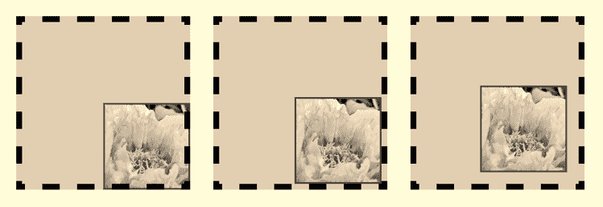

# 第 6 章：为 Web 应用用户界面设计的实用 CSS 特性

上述所有限制都在 CSS3 中得到了解决。不过，这些新选择器的语法需要一些说明。我们将要探讨的选择器包括那些涉及在 DOM 树中计数的元素：`:nth-child()`、`:nth-last-child()`、`:nth-of-type()`和`:nth-last-of-type()`。

所有这些选择器都共享一种特殊的语法，其中目标元素的计数可以用一个单独的数字来表示（仅选中第`n`个子元素），或者用符合`xn+y`模式的表达式来表示。如果`xn`和`y`等于 0，则可以省略，但两者中必须有一个不为 0。另外，`y`可以取负值。以下是一个应用示例：

```html
<style>
/* 这里不会有重复，等同于 nth-child(3) */
ul li:nth-child(0n+3) {
  font-weight: bolder;
}

ul li:nth-child(2n) {
  /* 每隔一行会被影响 */
  color: red;
}
</style>

<ul>
  <li>Item</li>
  <li>Red Item</li>
  <li>Bolder Item</li>
  <li>Red Item</li>
  <li>Item</li>
  <li>Red Item</li>
</ul>
```

`xn`始终代表表达式中的变量增量部分，而`+`号后面的数字则表示增量应该开始的起始位置。当变量设置为`0n`时，你只针对一个元素，正如我们第一个例子所示。

因此，表达式`ul li:nth-child(1n+3)`会选中所有从父元素的第三个子元素开始的`<li>`元素。使用`nth-child(4n+1)`则会选中从第一个子元素开始计数的每第四个元素（即第 1、5、9、13...个）。

对于`:nth-last-child()`，语法是相同的，不同之处在于`n`是一个递减因子。`:nth-last-child(2n+0)`会选中从结尾开始计数的所有偶数元素。还要注意，无论是正向计数还是反向计数，`+y`都可以是`-y`，例如`(3n-1)`。

理解这种语法为你提供了丰富的可能性，可以设计重复性的布局模式，或者在不借助额外标记的情况下定位特定元素。还要注意，所有这些选择器都可以将`odd`和`even`关键字作为参数。因此，以下两条规则是相同的：

```css
section div:nth-child(2n+0)::after { content: "even"; }
section div:nth-child(even)::after { content: "even"; }
```

以下两条规则也是相同的：

```css
section div:nth-child(2n+1)::after { content: "odd"; }
section div:nth-child(odd)::after { content: "odd"; }
```

另一方面，前面的例子可能不一定与下面的例子相同，因为起始点不同：

```css
section div:nth-last-child(2n+0)::after { content: "odd or even"; }
section div:nth-last-child(even)::after { content: "odd or even"; }
```

最后，请注意，这些选择器作为参数所接受的表达式不应包含空白字符。以下是无效的，会被忽略：

```css
ul li:nth-child(0n + 3) { font-weight: bolder; }
```

如我们所说，这些全局子元素选择器会搜索一个容器内的所有子元素，无论其类型如何。正如我们第一个例子所示，仅针对特定类型的子元素通常更可取。以下是修改后能按预期工作的版本：

```html
<style>
div p:first-of-type {
  font-weight: bolder;
}
</style>

<div>
  <h1>Some Title</h1>
  <p>First paragraph now bolder!</p>
  <p>Second paragraph.</p>
</div>
```

因此，你可以完全掌控元素的选中。

### 背景的高级处理

尽管以前的 CSS 版本所提供的可能性已经实现了许多令人鼓舞的设计，但它们通常使得设置背景的任务变得困难。


从设计师的角度来看，CSS2 的背景定义功能只能算是个粗略的方案。尽管如此，随着设计日趋复杂和丰富，并融入了更多页面元素，背景如今被广泛使用。

此外，背景被应用在比以往更错综复杂的结构上。因此，开发者需要更精确地显示背景。

CSS3 提供了一组新的背景属性，使得以往棘手且繁琐的任务变得更加简单高效。更好的定位方式以及多层背景都成为了可能。我们将介绍那些目前被 Mobile Safari 支持的属性。

## 第 6 章：面向 Web 应用用户界面的实用 CSS 特性

**注意：** 许多 CSS3 特性暂时需要 `-webkit-` 前缀。这允许你更早地实现新规范，但也意味着这些规则将来会被替换并消失。

因此，在你的样式表中，你应该始终先声明带 `-webkit-` 前缀的规则，紧接着声明应该使用的、不带前缀的标准规则，以避免在未来的版本不支持这个“草案”实现时出现意外。此外，因为最终实现可能会更好（无论是速度更快还是更简洁），你肯定希望一旦它准备就绪，就应用它而不是草案。因此，标准规则应该声明为第二个。

### 背景的原点

定义背景时，它通常应用于一个带有内边距、边框和外边距的盒子。背景颜色会从边框的外边缘延伸到盒子的中心，而背景图像则相对于边框的内边缘进行定位。

这可以通过 CSS3 的 `background-origin` 属性进行微调，该属性在某种程度上扩展了 `background-position`，允许你指定用于定位的原点。通过几个例子可以更清楚地理解这一点：

```css
<style>
div {
  float: left;
  border: dashed 10px #000;
  background-color: #ccc;
  padding: 20px;
  width: 240px;
  height: 240px;
  margin: 20px;
  background-position: bottom right;
  background-repeat: no-repeat;
  background-image: url(images/flower.jpg);
}
div:nth-of-type(1) {
  -webkit-background-origin: border-box;
}
div:nth-of-type(2) {
  -webkit-background-origin: padding-box; /* default */
}
div:nth-of-type(3) {
  -webkit-background-origin: content-box;
}
</style>
```

```html
<!-- Our 3 boxes -->
<div></div>
<div></div>
<div></div>
```



## 第 6 章：面向 Web 应用用户界面的实用 CSS 特性

在这个例子中，我们创建了三个尺寸相同、背景颜色和背景图像都相同的盒子。唯一的区别是 `background-origin` 属性的值。你可以在图 6-5 中查看它们的行为。

这些值决定了背景图像是相对于整个盒子（包含边框）、相对于带有内边距的盒子、还是仅相对于实际内容区域进行放置。该属性的默认值是 `padding-box`，也就是中间的图示。

**图 6-5.** 背景的三种可能原点，分别是边框、内边距（默认）以及盒子的内容区域

当然，你可能会认为这用 CSS 2.1 属性也能实现——你可以考虑边框和内边距的宽度来确定背景的位置。但这显然有严重的局限性。

例如，你无法让图像移动到边框区域内，即使设置负值使其从内边距区域移回边框也无法做到。此外，为 `background-position` 等样式定义固定值通常会导致代码的可重用性降低以及相似规则的数量倍增，因为必须根据每个独立块的大小来更新这些值。使用 `background-origin` 属性不仅能给你更多的可能性，还能让你编写更全局化的样式，从而写出更少但更高效的代码。

### 全局背景裁剪


#### 上一节中解释的设计优势同样适用于下一个属性 `background-clip`。虽然背景的“原点”仅影响背景图像，但 `background-clip` 属性允许你通过定义背景绘制区域，为所有背景元素（即图像和颜色）设定规则。

我们几乎可以直接沿用上一个示例，只需在样式中将 `origin` 替换为 `clip`——因为此属性与 `background-origin` 的属性值相同。

```css
<style>
div {
    ...
    background-position: bottom right;
    background-repeat: no-repeat;
    background-image: url(images/flower.jpg);
    -webkit-background-origin: border-box;
}
div:nth-of-type(1) {
    -webkit-background-clip: border-box; /* 默认值 */
}
div:nth-of-type(2) {
    -webkit-background-clip: padding-box;
}
div:nth-of-type(3) {
    -webkit-background-clip: content-box;
}
</style>
```

这会产生如图 6–6 所示的效果。

**图 6–6.** 背景剪裁的三种可能状态：从边框外边缘开始（默认），然后排除边框，再排除内边距（从内容区域内部开始）

默认行为是将背景颜色延伸到盒子的边框内部。其他值则表现为与背景原点类似，只是也包含了背景颜色。

然而，在使用 `background-clip` 属性的 `content-box` 值时需谨慎：WebKit 已按照 CSS3 规范的早期版本实现了该值。但由于此值已从规范中移除，你应尽可能优先将 `background-clip` 与其他两个值之一结合使用以达到预期效果，以防该值从浏览器中被移除。对于 `background-clip` 属性而言，`padding-box` 值可能最有价值，因为它允许使用图像或透明度来丰富边框的样式——我们很快会看到这一点。

### 基于文本的背景剪裁

WebKit 还提供了使用 `text` 值根据容器中的文本来剪裁背景的可能性，如图 6–7 所示。

```css
<style>
div {
    background-image:
    -webkit-gradient(linear,
    left top,
    left bottom,
    from(yellow), to(red));
    -webkit-background-clip: text;
    color: transparent;
}
</style>
<div>Background Clip</div>
```

**图 6–7.** 无图像文本以渐变形式呈现

如代码所示，文本颜色需要设置为 `transparent`，以便容器背景能够透显出来。这样做的问题是，不支持此背景值的浏览器版本将几乎不显示任何文本。幸运的是，你可以使用一个仅受支持该背景属性值的 WebKit 特定属性 `-webkit-text-fill-color` 来解决这个问题。

你可以这样使用它：

```css
-webkit-text-fill-color: transparent;
color: red;
```

这样一来，不支持这些新属性的浏览器将显示红色文本，而最新版本的 Mobile Safari 仍会以渐变形式呈现文本。

### 背景尺寸调整

你可能曾经诅咒过 CSS2 背景的另一个缺陷：背景图像无法像真正的 HTML 图像那样调整大小。CSS3 通过 `background-size` 属性（以 `-webkit-` 为前缀）为这个恼人的问题带来了一个易于使用的解决方案。

我们很快就会看到如何利用这一新功能，将 Photos 原生应用的吸引力带到你的 Web 应用中。Photos 应用在视觉上吸引人的一个方面是，所有图片都以相同格式和排列的缩略图规则网格呈现——大小相同的小方块，如图 6–8 所示。这产生了一致的布局，同时不会损害图片质量，因为所有图片都被缩放或裁剪以适应这种格式。


