# 第 6 章：为 Web 应用界面增色的 CSS 特性

现在，在你的 `styles` 文件夹中创建一个 `gallery.css` 文件，并在文档的 head 中链接它。你将使用以下样式：

```
.header-wrapper {

  background-color: #444;

}

.view {

  background-color: #fff;

}

div#gallery {

  padding: 2px;

  float: left;

}

#gallery > div {

  border: solid 1px rgba(0,0,0,0.1);

  width: 75px;

  height: 75px;

  margin: 2px;

  float: left;

  -webkit-box-sizing: border-box;

  -webkit-background-size: 100%;

  background-position: center top;

  background-repeat: no-repeat;

  -webkit-background-origin: border-box;

}

#gallery > div.portrait {

  -webkit-background-size: 100% auto;

}

#gallery > div.landscape {

  -webkit-background-size: auto 100%;

}
```

这些样式确保了每张图片都能延伸到其容器的边框之内，从而使所有图片都具有完全正确的尺寸。此外，半透明的边框确保了整体外观的一致性，即使图片颜色较浅也是如此。

你可能已经注意到，由于不支持 `contain` 和 `cover` 值，我们必须根据图片是纵向还是横向来应用不同的规则。

我们将使用以下 JavaScript 代码（放入新的 `scripts/gallery.js` 文件中）来判断每张图片应该添加哪个类：

```
function showImages() {

  var container = document.getElementById("gallery");

  container.innerHTML = "";

  for (var i = 0; i < images.length; i++) {

    loadImage(container, images[i]);

  }

}

function loadImage(container, src) {

  var img = new Image();
```

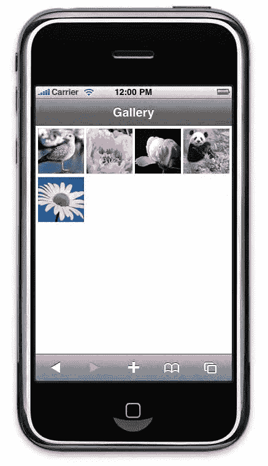

第 6 章：为 Web 应用界面增色的 CSS 特性

```
  img.src = src;

  var div = document.createElement("div");

  container.appendChild(div);

  img.onload = function() {

    div.className = (this.width < this.height) ? "portrait" : "landscape";    div.style.backgroundImage = "url(" + this.src + ")";

  }

}
```

`showImages()` 函数首先清空画廊容器，这样在加载新内容时就不会出现显示问题。然后，它使用全局的 `images` 数组来获取要显示的图片，并为每个新条目调用 `loadImage()` 函数。这个函数会为每个新条目创建一个带有正确类和图片背景的新的 `<div>` 容器。`Image` 对象仅用于在每张图片加载完成后确定其当前的朝向。

现在，如果在 Mobile Safari 中打开此页面的 URL，你应该会看到一个与本机“照片”应用相似的、外观一致的精美画廊，如图 6-10 所示。

**图 6-10.** 一个风格统一的图片画廊

为了让搜索引擎更友好，你也可以直接在服务器端将图片添加到标记中，并为每张图片应用 `onload` 属性。但是，这样你就需要将所有图片的 `src` 替换为一个空白像素图片，以便最终只显示背景。

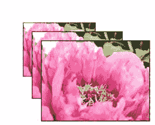

第 6 章：为 Web 应用界面增色的 CSS 特性

### 多层背景

如你所见，使用 CSS3 背景可以实现的视觉效果比 CSS2 丰富得多。然而，这还不是新规范为你准备的全部内容。

在处理背景图片时，你现在可以处理应用于单个元素的多个背景。通过为背景的 URL 使用逗号分隔的值列表，所有图片都会被考虑在内，并按照最先声明的图片位于最上层的顺序堆叠。这样做的主要限制是，你只能指定一种背景颜色，并且该颜色将仅位于最底层。

然而，WebKit 扩展了此功能，不仅允许对 `background-image` 属性使用多层背景，还允许对所有（除颜色之外的）背景属性使用。例如，这意味着“滑动门”技术的终结，或者为流式布局提供了更多可能性，因为使用 `-webkit-gradient()` 绘制的渐变背景将是可调整大小的。你可以不使用背景重复，而是使用以下代码实现类似图 6-11 所示的效果：

```
.multiple {

  width: 400px;

  height: 300px;

  background-repeat: no-repeat;

  background-image: url(flower.jpg);

  background-position:

    90px 90px,

    70px 70px,

    50px 50px;

  -webkit-background-size:

    60% auto,

    50% auto,

    40% auto,

    30% auto,

    20% auto;

}
```

**图 6-11.** 图片从底部第一张到顶部最后一张堆叠显示

在这个例子中，我们对所有背景层保持 `background-image` 属性不变，但逐步改变其位置和大小，以模拟缩放效果。

第 6 章：为 Web 应用界面增色的 CSS 特性

当某些属性的值个数少于层数时，理解解释器如何处理值非常重要。应用的规则是循环重复可用值列表，直到满足正确的数量。

但是，请小心：尽管规范指出层数应完全由 `background-image` 属性的数量决定，但如果其他背景属性有更多数量，WebKit 会复制此属性。因为根据规范，多余的值应该被忽略，我们建议你在设计中不要依赖此行为，因为 WebKit 的实现或规范都有可能演变。

例如，此属性将让你为被选中的元素设置不同的背景。我们将在下一章关于 canvas 和 SVG 的内容中使用它来为列表项添加箭头，并且它被用于我们的 Web 应用模板头部，结合了渐变和我们将要解释的新颜色定义可能性。

### 颜色

颜色对于设计至关重要，并且随着其渲染在设备上的改进，其使用变得越来越复杂。然而，构建具有复杂颜色关联的界面通常需要我们求助于图片（例如处理透明度）或第三方工具（典型的是构建配色方案）。CSS3 规范带来了一系列新选项，可以帮助你构建更复杂但更轻量级的无图片界面，同时提高你的工作效率。

#### Alpha 通道

使用 CSS2 定义颜色最常用的是 RGB 表示法，即 `#rrggbb`、`#rgb` 和 `rgb()` 函数。这在 CSS3 中得到了扩展，允许使用 `rgba()` 函数来使用 alpha 通道。Alpha 通道的值是一个介于 0 到 1 之间的浮点数。这在处理透明框背景时特别有用，因为传统使用 `opacity` 属性存在一个不便之处：其效果会被子元素继承。例如，要在一个框上设置半透明背景，同时保持内部文本完全可读，你通常需要求助于背景图片或复杂的定位。现在这不再是必需的，因为你可以简单地设置 `background-color` 属性的透明度。

以下代码展示了这将如何改变你的工作：

```
<style>

body { background-color: yellow; }

.main { position: relative; }

.opacity-layer {

  position: absolute;

  background-color: blue;

  opacity: 0.25;

  left: 0;

  right: 0;
```

第 6 章：为 Web 应用界面增色的 CSS 特性

```
  top: 0;

  bottom: 0;

}

.content-layer {

  position: relative;

  color: red;

}

</style>

<div class="main">

  <div class="opacity-layer"></div>

  <div class="content-layer">

    <h1>一些标题</h1>

    <p>一个不错的段落。</p>

  </div>

</div>
```

以下是使用新颜色函数的等效代码：

```
<style>

body { background-color: yellow; }

.content-layer {

  background-color: rgba(0,0,255,0.25);

  color: red;

}

</style>

<div class="content-layer">

  <h1>一些标题</h1>

  <p>一个不错的段落。</p>

</div>
```

当然，alpha 通道的另一个优点是，因为它只是一种颜色定义，你可以将其应用于任何接受颜色值的属性，包括文本或边框。你还会发现它可以用于创建复杂的 CSS 背景渐变。

#### 新的颜色定义

Alpha 通道也可以与一个新的 CSS3 颜色定义函数 `hsl()` 一起使用。尽管 RGB 被广泛使用，并且许多前端开发人员对它相当熟悉，但它通常被认为不够直观。实际上，在“日常生活中”，人们习惯于颜色的减色合成（例如混合颜料时），而 RGB 基于加色合成（例如“将所有颜色混合在一起会产生纯白色”，光的情况就是如此）。通常，RGB 用户实际上是通过潜意识地将其转换为色相、饱和度和亮度的变化来习惯它的。

色相（`hsl()` 和 `hsla()` 函数中的 *h*）是一个角度，以度为单位（不指定单位），取值范围是 0 到 360。它通常用一个圆来表示，其中每个度代表颜色的变化，从红色（0）到红色（360）。饱和度和亮度以百分比形式指定。

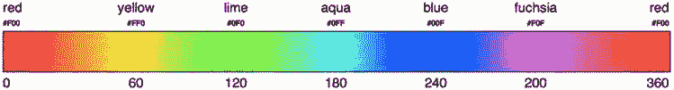

第 6 章：为 Web 应用界面增色的 CSS 特性

`hsl(*<色相>*, *<饱和度>*, *<亮度>*)`

`hsla(*<色相>*, *<饱和度>*, *<亮度>*, *<alpha>*)`

以下是一组等效的 CSS 规则：

```
.red { color: red; }

.red { color: #f00; }

.red { color: rgb(255, 0, 0); }

.red { color: hsl(0, 100%, 50%); }

.red { color: hsl(360, 100%, 50%); }

.red { color: hsla(0, 100%, 50%, 1.0); }
```

由于围绕色相“圆”的递进很容易理解，你可以相当轻松地在它周围移动，如图 6-12 所示，这是该圆的一个展开版本，带有用于定位基本颜色的停止点。

**图 6-12.** 基本颜色之间的转换表

HSL 使得以自然的方式移动颜色值变得更加容易。如果你想要橙色，只需在红色和黄色之间（0 到 60 度）选择一个值。想要更浅的橙色？只需增加一些亮度。需要一个不那么鲜艳的橙色？降低一些饱和度。使用 `rgb()` 表示法，你需要确定每种颜色的数量，而使用 `#rrggbb` 表示法，你还需要处理将每种颜色转换为十六进制值的额外困难。

#### 使用渐变

前面的属性允许对背景属性进行微调。然而，WebKit 引入了新的属性，允许你使用代码而不是图片来实现一个非常有趣的目的：渐变。这可以对你处理设计元素的方式产生巨大影响，因为它具有相当多的优点。

首先，CSS 渐变对最终用户来说更轻量级，因为不需要加载任何图片，当然，也不会有额外的 HTTP 请求——正如我们之前指出的，这在移动设备上可能相当慢。

其次，一旦你掌握了 CSS 渐变，在你的网站上修改它们会更快、更直接，因为你只需要一种工具（这通常也意味着只需要一个人），而且你不需要担心尺寸问题。

#### 基本语法

在撰写本文时，还没有关于 CSS 渐变实际语法的规范；每个浏览器厂商都以自己的方式实现了这个特性。以下是为 WebKit 浏览器创建渐变的最基本语法：

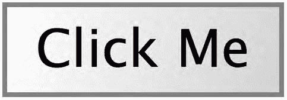

第 6 章：为 Web 应用界面增色的 CSS 特性

```
-webkit-gradient(

  linear,

  left top,

  right bottom,

  from(black),

  to(yellow)

)
```

例如，你可以使用以下代码将其应用到元素的背景上：

```
<style>

button {

  background-image:

    -webkit-gradient(

      linear,

      left top,

      right bottom,

      from(white),

      to(lightgrey)

    );

  border: 1px solid gray;

}

</style>

<button>点击我</button>
```

这个例子绘制了一个从框的左上角延伸到右下角的线性渐变，并会创建一个从白色到浅灰色的过渡，如图 6-13 所示。在我们的例子中，为了清晰起见，我们将使用命名颜色，但你可以使用 CSS3 支持的任何颜色命名约定，包括透明值。

**图 6-13.** 一个带有线性渐变的简单按钮

你可以使用命名位置、像素（隐含单位）或百分比来确定位置：例如，我们例子中的 `left top` 和 `right bottom` 值分别等同于 `0 0` 和 `100% 100%`。

渐变色值可以应用于支持图片的属性，即 `background-image`、`border-image`、`list-style-image`，甚至 `content`。但是，目前还不能将此值设置为颜色属性的值——这意味着你无法直接将渐变应用于文本。

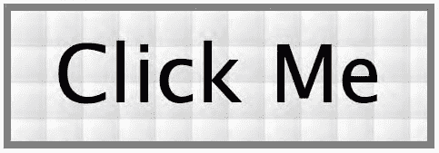

第 6 章：为 Web 应用界面增色的 CSS 特性

#### 改变渐变的尺寸

对于背景，渐变的默认行为是扩展到其所在框的尺寸。由于 `-webkit-gradient()` 函数被视为一张图片，你可以使用前面解释过的属性来调整此行为，特别是使用 `background-size`，它将改变渐变的绘制区域。

例如，将背景尺寸设置为 `5px`，会将渐变的跨度限制为一个边长为 5 像素的正方形。`background-repeat` 的默认值是 repeat，所以如果你没有设置值，渐变将作为一个图案重复以覆盖框的区域，如图 6-14 所示。

```
.gradient-box {

  ...

  -webkit-background-size: 5px;

}
```

**图 6-14.** 由于绘制区域被重新定义，渐变变成了一个重复的图案

当然，如果绘制区域不够大，无法容纳整个渐变，你的渐变可能会被截断。这通常在使用固定尺寸时发生（正如你必须使用径向渐变时那样）。

#### 完整的渐变语法

尽管渐变为 HTML 元素的样式提供了大量新的可能性，但 WebKit 对渐变的实现还有更多内容。以下是 WebKit 文档中描述的完整语法：

`-webkit-gradient(*<类型>*, *<点>* [, *<半径>*]?, *<点>* [, *<半径>*]? [, *<停止点>*]**)`

像正则表达式一样，问号表示该项可以出现零次或一次，星号表示它可以出现一次或多次，或者根本不出现。当然，指定一个没有颜色的渐变似乎是个奇怪的想法。

你可以使用 CSS 创建两种渐变：你已经见过的线性渐变和径向渐变。要定义径向渐变，你必须在我们已经介绍的元素之外指定一个半径。请注意，半径的值仅以像素表示，尽管不应指定单位。你不能使用相对单位来使渐变适应你的框的尺寸，因此你只能实现正圆，而不能实现更复杂的椭圆。你可以通过将第一个例子中的渐变代码替换为以下代码来查看径向渐变类型的效果（如图 6-15 所示）：

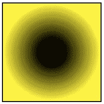

第 6 章：为 Web 应用界面增色的 CSS 特性

```
-webkit-gradient(

  radial,                    /* 渐变 <类型> */

  100 100, 25,               /* <点> 和 <半径> (仅用于径向渐变) */

  100 100, 100,

  from(black),               /* 2 个 <停止点> 值 */

  to(yellow)

);
```

**图 6-15.** 一个简单的径向渐变

这种语法可能看起来有点棘手或令人困惑。确切理解每个值代表什么很重要。在渐变类型之后，第一对值是渐变应该起始的位置。其后跟着第一个颜色停止点应该完全填充的区域半径。

第二对值再次指示渐变的终点圆，最后一个数字是颜色混合应该发生的半径。此最后一个圆之外的剩余空间将仅用最后一个颜色停止点填充。

从 Wow! eBook <www.wowebook.com> 下载

最后的数值决定了用于绘制渐变的颜色。如前所示，并且我们将在下一节解释，你可以为这些值设置任意数量的颜色。

#### 高级颜色处理

`from()` 和 `to()` 函数都是 `color-stop()` 函数的简写形式，其签名如下：

`color-stop(*<停止值>*, *<颜色>*)`

第一个参数可以定义为百分比，也可以定义为范围从 0 到 1 的浮点数。第二个参数接受任何有效的 CSS 颜色定义。因此，此函数允许你为渐变确定整个调色板，以及它们应该开始、停止和混合的步骤。因此 `from(*<颜色>*)` 和 `to(*<颜色>*)` 等同于 `color-stop(0, *<颜色>*)` 和 `color-stop(1, *<颜色>*)`。

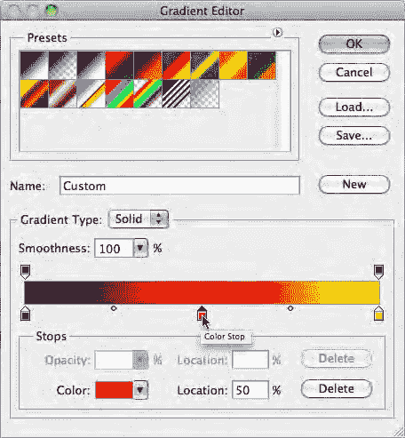

第 6 章：为 Web 应用界面增色的 CSS 特性

这为使用渐变开辟了新的途径，因为你可以为单个渐变多次使用 `color-stop()` 函数。以下是前面的例子，增加了一种颜色：

```
-webkit-gradient(

  radial,

  100 100, 25,

  100 100, 100,

  from(black),

  to(yellow),

  color-stop(50%, red)

);
```

如果你使用 Photoshop，这种逻辑应该感觉很熟悉，你会认出渐变编辑器，如图 6-16 所示。

**图 6-16.** Photoshop 渐变编辑器，带有颜色停止点及其之间的中点圆

然而，使用 CSS，要让一种颜色比另一种颜色更重要（就像在 Photoshop 中使用颜色中点那样）或构建不规则渐变的唯一方法是添加更多具有相同颜色的停止点。

在指定这些颜色停止点时顺序并不重要，除非有几个停止点出现在同一位置，例如在构建一个锐利的过渡时，如下例所示（图 6-17）：

```
-webkit-gradient(

  radial,

  50% 50%, 0,

  50% 50%, 100,

  from(red),

  color-stop(50%, red),
```

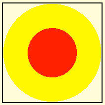

第 6 章：为 Web 应用界面增色的 CSS 特性

```
  color-stop(50%, yellow),

  color-stop(99%, yellow),

  color-stop(99%, transparent),

  to(transparent)

);
```

**图 6-17.** 使用多个 `color-stop()` 绘制的两个同心圆

使用这种技术，你可以绘制出边界清晰的圆，而无需担心渐变的结束颜色会填满整个框。在我们的 Web 应用模板中，我们使用了这种技术来添加一个斜线背景。它也将用于第 9 章，结合本章稍后将解释的弹性盒模型，创建一个吸引人的标签栏。

### 盒与边框

传统上，CSS 中的“盒”并没有提供太多的样式选项。除了少数支持不均衡的边框样式外，你不得不求助于背景图片，以及随之而来的所有重复样式和过程中的近似处理，才能为你的元素增添一些额外的光彩。

一个简单的网络搜索会得到数百个页面，承诺提供终极的斜面或圆角边框解决方案；这要么导致了多余的标记，要么带来了沉重的 JavaScript，要么增加了额外的图片。CSS3 几乎使这些做法过时了，因为新版本的浏览器（包括 Mobile Safari）支持几个非常有趣的特性。

#### 盒尺寸

在开始讨论盒的样式之前，让我们先看看一个关于盒尺寸的新特性。`box-sizing` 属性源于对不符合规范的 Internet Explorer 的观察，它没有按照 CSS2 规范描述的方式计算盒尺寸。尽管 HTML 渲染引擎应将盒尺寸计算为其宽度、内边距、边框和外边距的总和，但 Internet Explorer 将内边距视为内容宽度的一部分，而不是将其添加进去。

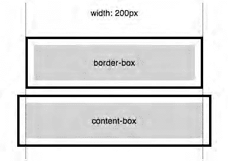

第 6 章：为 Web 应用界面增色的 CSS 特性

```
.box {

  -webkit-box-sizing: border-box;

}
```

`box-sizing` 属性的默认值是 `content-box`，这是 CSS2 中预期的行为。但是，将值设置为 `border-box` 将导致内边距和边框被计入内容区域内部，而不是其外部。图 6-18 显示了它们的区别。

**图 6-18.** 透明内边距和黑色边框显示了两种盒模型之间的差异

如果你已经使用 CSS2 盒模型一段时间了，这可能会让你觉得不寻常。尽管如此，使用这个属性值意味着你无需担心为盒赋予 100% 的宽度，或为容器添加边框。

通常情况下，你会设计一个具有全局容器、一个用于主内容的 680 像素宽的左列和一个 300 像素的侧栏的网站。更改盒的内边距或为侧栏添加边框可能是一项艰巨的任务。在这里，你无需担心这个，因为你的盒将保持其外部宽度。

#### 圆角盒角

为页面上的元素添加圆角已经流行了一段时间；然而，同样地，这很难以一种灵活的方式实现。此外，iPhone 用户界面广泛使用了圆角。要实现与此一致的设计，你可能希望模拟 iOS 的盒。

CSS3 通过 `border-radius` 属性带来了终极解决方案。通过一个简单的 CSS 声明，你应该能够实现设计师对圆角的大部分梦想，如图 6-19 所示。

请注意，WebKit（以及必然的 Mobile Safari）并未完全遵循规范。这只是一个限制，规范允许你通过一个声明生成

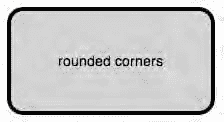

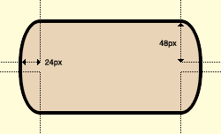

第 6 章：为 Web 应用界面增色的 CSS 特性

不同的边框。对于 WebKit 的语法，如果你想要不同的效果，你必须分别声明每个角。

然而，Mobile Safari 的语法可以说是更直观的。你在属性名称中引用目标边框，并将半径设置为值。因此，你的规则将如下所示：

```
/* 四个角使用相同值 */

-webkit-border-radius: 16px;

/* 与分别声明相同 */

-webkit-border-top-left-radius: 16px;

-webkit-border-top-right-radius: 16px;

-webkit-border-bottom-left-radius: 16px;

-webkit-border-bottom-right-radius: 16px;
```

**图 6-19.** 一个带有圆角的简单盒

当然，你并不局限于常规形状。尽管为每个角赋予相同的值会得到一个带有圆角的常规盒，最终形成一个完美的圆，但你可以通过为宽度和高度指定并列的值来创建更椭圆的形状，如图 6-20 所示：

```
/* 再次，四个角使用相同值 */

-webkit-border-radius: 24px 48px;

/* 再次，与分别声明相同 */

-webkit-border-top-left-radius: 24px 48px;

-webkit-border-top-right-radius: 24px 48px;

-webkit-border-bottom-left-radius: 24px 48px;

-webkit-border-bottom-right-radius: 24px 48px;
```

**图 6-20.** 一个带有扭曲角的盒

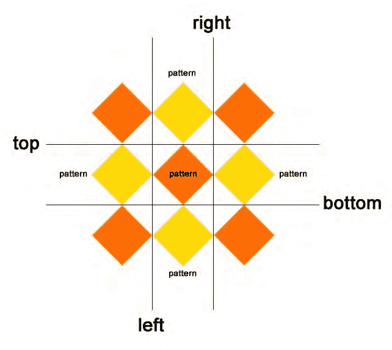

第 6 章：为 Web 应用界面增色的 CSS 特性

此属性适用于所有元素，就像 `border` 属性一样，但它不依赖于边框的实际使用。同样，你可以使用任何度量单位，无论是像像素这样的固定值，还是像 em 或百分比这样的相对值。

使用百分比时，半径的值将相对于盒的总宽度和高度（即使用 `border-box` 作为 `box-sizing` 值时考虑的尺寸）进行评估。还要注意，你无需担心背景溢出其容器，因为它们将被适当地裁剪。

#### 用图片绘制边框

无论 `border-radius` 这个 CSS3 特性多么令人惊叹，新规范中的边框远不止是边框线。实际上，你还可以通过 `border-image` 属性整合更复杂的边框样式。它会负责将图片调整到边框的尺寸，要么通过缩放，要么通过重复。

在以下示例中，我们将使用图 6-21 中的图片（宽高均为 300 像素）作为边框图案，该图案被分成九个不同的区域。这些区域将按照与 margin、padding 或 border 相同的顺序进行声明，有两种模式：拉伸和重复。此方法的主要限制是你无法为相对的边框指定不同的模式。

**图 6-21.** 用作边框图片的图案

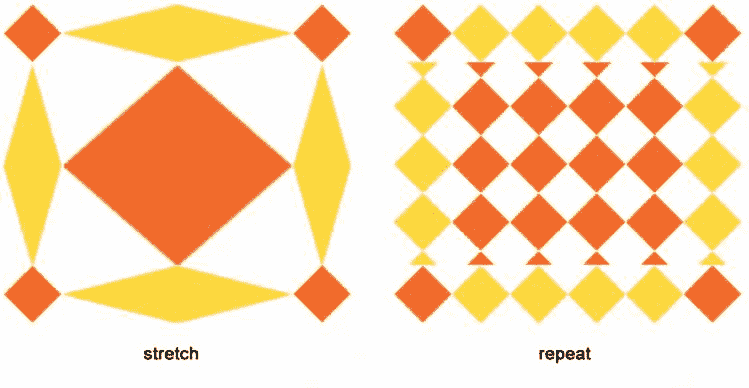

第 6 章：为 Web 应用界面增色的 CSS 特性

图 6-22 显示了仅更改模式后以下代码的结果：

```
.border {

  -webkit-border-image: url(diamonds.png) 100 100 100 100 stretch stretch;

  width: 400px;

  height: 350px;

  border-width: 100px;

}
```

**图 6-22.** 使用拉伸和重复模式的结果框

还有第三种模式，`round`，它会重复图案并对其进行缩放，使其不被截断。然而，Mobile Safari 尚不支持此模式。作为安慰，因为主要是边框的贴图边框，你可以直接在 `border-image` 声明中指定边框宽度，如下所示：

```
.border {

  -webkit-border-image: url(diamonds.png) 100 / 100px stretch stretch;

  width: 400px;

  height: 350px;

}
```

这是该属性的简写形式。因为所有边都具有相同的尺寸，我们将切片区域组合在一起。此值不带单位；对于图片的各个部分，像素是隐含的。斜线将切片区域与边框的尺寸分隔开，以避免混淆。

因为图片中的区域是 100 像素宽，并不意味着我们需要那么宽的边框：通过定义更薄的边框，图片区域将被缩放以适合边框宽度。因此，在以下示例中，我们的图片的上、右、下、左边框将分别被处理为 50px、25px、100px 和 25px 宽（图 6-23）。

```
.border {
```

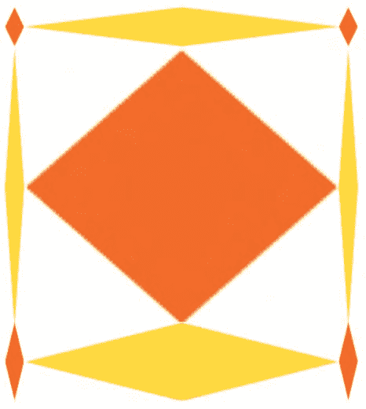

第 6 章：为 Web 应用界面增色的 CSS 特性

```
  -webkit-border-image: url(diamonds.png) 100 / 50px 25px 100px stretch;

  width: 400px;

  height: 350px;

}
```

**图 6-23.** 每个边框都有自己的厚度

在创建有吸引力的按钮以替换默认的操作系统按钮时，这条规则非常有用。

#### 阴影

在构建网页时，对边框有更多的控制是一个有趣的特性，因为识别块有助于提高可读性，并且可以成为一种使内容突出的方式。在这方面，CSS3 提供了另一个期待已久的特性，即通过 `box-shadow` 属性为块添加外部阴影。WebKit 浏览器也实现了 CSS2 的 `text-shadow` 属性。由于该属性是官方推荐标准的一部分，并且被认为是稳定的，你无需使用 `-webkit-` 前缀。

这两个特性不仅允许投影，还使得绘制发光效果成为可能，这对于创建按钮效果非常有用。除了视觉吸引力之外，此解决方案的一个优点是阴影不会扩展你块或文本的尺寸，这意味着你的布局不会受到影响。此外，你可以仅使用一个声明为同一个元素应用多个阴影。

第 6 章：为 Web 应用界面增色的 CSS 特性

#### 盒阴影

盒阴影的语法非常简单。`box-shadow` 属性接受四个参数：颜色、水平偏移、垂直偏移和模糊半径。将模糊设置为 0 会产生一个清晰锐利的阴影；值越大，阴影越模糊、越透明。

此属性最常见的用法可能是勾勒页面部分的轮廓，或者在按下按钮时提供用户反馈。尽管如此，在以下示例中，我们将使用它来创建一个类似 iOS 外观的图标，仅使用图标本身这一张图片。

```
<style>

.icon {

  display: inline-block;

  text-shadow: rgba(0,0,0,0.5) 2px 2px 2px;

  color: #000;

  font: bold 11px helvetica;

  text-align: center;

  margin: 8px;

}

.icon div {

  -webkit-border-radius: 8px;

  width: 57px;

  height: 57px;

  margin: 0 auto 4px;

  -webkit-box-shadow: 0 4px 4px rgba(0,0,0,0.5);

  -webkit-box-sizing: border-box;

  background-image:

    -webkit-gradient(radial,

      50% -40, 37,

      50% 0, 100,

      from(rgba(255,255,255, 0.75)),

      color-stop(30%, rgba(255,255,255, 0)),

      color-stop(30%, rgba(0,0,0, 0.25)),

      to(rgba(0,0,0, 0))

    ),

    url(flower.png);

  -webkit-background-size: auto auto, 100% 100%;

}

</style>

<div class="icon">

  <div></div>

  鲜花

</div>
```

在图 6-24 中你首先会注意到阴影跟随边框。因此，如果你为角应用了半径，阴影也会是圆角的。


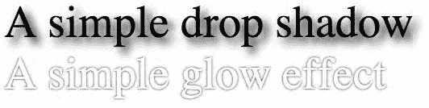

第 6 章：为 Web 应用界面增色的 CSS 特性

**图 6-24.** 一个 iOS 仪表盘样式的图标

**注意：** `zoom` 属性不是有效的 CSS。它最初由 Internet Explorer 实现，后来被其他浏览器实现，但从未成为任何规范的一部分。

使用这段代码的另一个有趣之处在于它是完全可调整大小的。例如，将 `zoom` 属性设置为 0.57 会将你的 57 像素图标更改为常规的 32 像素 iPhone 菜单图标；只需更改一个值，就会在保持整体尺寸和质量的同时改变图标大小。

#### 文本阴影

前面的示例使用了另一种应用于文本的阴影。`text-shadow` 属性的语法与 `box-shadow` 非常相似；唯一的区别是你应该先声明颜色值，而不是最后声明。以下两个类分别对其应用的文本应用投影和发光效果（图 6-25）：

```
.shadow {

  text-shadow: #000 2px 2px 5px;

}

.glow {

  text-shadow: #000 0 0 2px;

  color: #fff;

}
```

**图 6-25.** 阴影和发光效果

正如我们在 Web 应用模板中看到的，投影可以用于不仅仅是阴影。之前，我们使用投影来创建浮雕效果。


第 6 章：为 Web 应用界面增色的 CSS 特性

使用 JavaScript，你甚至还可以动态地扩展和减小文本阴影的模糊度，以创建生动的发光动画。

#### 带有阴影和轮廓的文本效果

通过 `text-shadow` 属性，你已经学会了创建逼真的发光效果，这非常类似于轮廓。为了探索 Mobile Safari 在此领域提供的丰富可能性，让我们使用一些属性来绘制一个更高级的标题，这些属性可以让你精细控制文本描边的渲染：

```
<style>

div {

  color: lightgrey;

  -webkit-text-stroke: 2px gray;

  font-size: 100px;

  text-shadow:

    gray 1px 1px 0,

    gray 2px 2px 0,

    gray 3px 3px 0,

    gray 4px 4px 0,

    gray 5px 5px 0,

    gray 6px 6px 0

}

</style>

<div>文本描边</div>
```

`text-stoke` 属性是 `text-stroke-width` 和 `text-stroke-color` 属性的简写形式。这使得定义轮廓变得极其简单，如图 6-26 所示。在此示例中，我们还添加了一个投影来增强标题的视觉效果。

从 Wow! eBook <www.wowebook.com> 下载

**图 6-26.** 使用 CSS 属性简单定义轮廓

这再次说明了新的 CSS 特性如何可以节省你的图片使用，并使你的开发和维护过程更快、更容易。在这种特定情况下，当处理不同语言时尤其如此。你会在下一章看到，结合可下载字体的使用，这种优化变得更加明显。

#### 为你的头部添加按钮

一下子要消化这么多内容。何不休息一下，为你的 Web 应用模板添加点什么？将以下代码添加到你的 `main.css` 样式表中，将让你能够在 Web 应用的头部使用一个时尚的按钮：

```
.view {

  ...

  position: relative;
```

第 6 章：为 Web 应用界面增色的 CSS 特性

```
}

.header-wrapper .header-button {

  /* 按钮大小和位置（靠右锚定） */

  position: absolute;

  top: 7px;

  right: 6px;

  width: auto;

  height: 29px;

  min-width: 44px; /* 可点击元素的最小尺寸 */

  margin: 0;

  padding: 0 10px;

  /* 圆角按钮的盒子样式 */

  -webkit-border-radius: 5px;

  border: solid 1px rgba(0,0,0,.25);

  border-top-color: rgba(0,0,0,.6);

  -webkit-box-sizing: border-box;

  -webkit-box-shadow: 0 1px 0 rgba(255,255,255,.3);

  /* 文本样式 */

  font-family: inherit;

  font-size: 12px;

  font-weight: bold;

  text-shadow: rgba(0,0,0,.4) 0 -1px 0;

  text-decoration: none;

  text-align: center;

  line-height: 29px;

  color: #fff;

  /* 背景的光泽效果 */

  background-color: rgba(0,0,0,.3);

  background-image:

    -webkit-gradient(linear, left top, left bottom,

      color-stop(0, rgba(255,255,255,0.25)),

      color-stop(0.1, rgba(255,255,255,.4)),

      color-stop(1, rgba(255,255,255,.1)) ),

    -webkit-gradient(linear, left top, left bottom,

      from(transparent),

      to(rgba(0,0,64,.05)) );

  background-repeat: no-repeat;

  background-position: top left, bottom left;

  -webkit-background-size: 100% 14px, 100%;

}

.header-wrapper .header-button:disabled {

  color: rgba(255,255,255,0.65)

}

.header-wrapper .header-button:active:not(:disabled) {

  background-color: rgba(0,0,64,.5);

}
```

所描述的按钮将绘制在头部的右侧。要将其移动到屏幕左侧，只需在你的样式中添加以下类：

```
.header-wrapper .header-button.left {
```


第 6 章：为 Web 应用界面增色的 CSS 特性

```
  left: 6px; right: auto;

}
```

这段代码易于使用和重用，无论是创建表单按钮还是简单链接。以下代码产生如图 6-27 所示的区域：

```
<div class="header-wrapper">

  <h1>Web 应用</h1>

  <a href="edit.php" class="header-button">编辑</a>

  <button class="header-button left">返回</button>

</div>
```

**图 6-27.** 头部中的两个按钮

`header-button` 类使用了称为*自适应样式*的方法，这意味着按钮的颜色会自动适应其父元素的背景颜色。这种方法已在头部本身中使用过


### 使用 cURL API 处理请求。

```
if ($curl = curl_init($url)) {
    curl_setopt($curl, CURLOPT_FOLLOWLOCATION, 1);
    curl_setopt($curl, CURLOPT_RETURNTRANSFER, 1);
    $data = curl_exec($curl);

    # 读取响应信息
    $code = curl_getinfo($curl, CURLINFO_HTTP_CODE);
    $type = curl_getinfo($curl, CURLINFO_CONTENT_TYPE);

    # 返回内容并退出。
    if ($code == 200) {
        header("Content-Type: $type", true, $code);
        exit($data);
    }
}
```

## 第 12 章：Ajax 与动态内容

```
### 如果没有有效内容，则发送 HTTP 500 错误响应。
header('Content-Type: text/plain', true, 500);
echo 'UNEXPECTED RESPONSE';
?>
```

我们的 PHP 脚本期望在查询字符串中传递一个 `url` 参数。如果找到该参数，则使用 `curl_init()` 函数初始化一个新的 cURL 会话，并设置请求选项。`CURLOPT_FOLLOWLOCATION` 将应用 HTTP 重定向（如果存在），而常量 `CURLOPT_RETURNTRANSFER` 则允许我们使用 `curl_exec()` 函数将请求的结果存储在 `$data` 变量中。

请求执行后，我们使用 `curl_getinfo()` 函数收集 HTTP 状态码以及内容类型，以便返回预期的标头。如果未发生错误，则使用原始内容类型发回内容；否则，返回 HTTP 500 错误代码。

我们在此对 API 的使用相当简单，但 cURL 提供的选项很多，可以根据您的需求进行精细调整。尽管过程非常直接，但在发送标头时应特别小心，因为客户端脚本可能会检查状态属性（PHP 文件中的 `$code`）的值以停止其执行。不过，结果是，您的 Ajax 请求可以在同一域上无缝完成，同时仍然从远程服务器收集数据。

由于服务器端脚本通常比客户端脚本更快（特别是因为客户端脚本的性能部分取决于设备），因此直接在服务器上运行所需的任何安全检查或初步处理是一个好主意。请记住，对于向任何非您维护的站点发出的请求，都存在返回数据不符合预期的风险。

### JSONP 方式

如果您更愿意不使用代理或 Ajax 请求，并且您期望从请求中获得的数据格式为 JSON，那么有一种更简单的方法——尽管这种方法意味着更高的安全风险——即 JSONP。JSONP 代表带填充的 JSON。此方法背后的想法是，以 JSON 格式返回的数据需要被评估，并旨在被处理和使用的，并且应该在不使代码混乱的情况下完成。

为了实现这一点，服务器不仅应以 JSON 格式返回请求的数据，还应返回将处理数据的函数调用。因此，当收到响应时，它将自动被适当地处理。

让我们从服务器端脚本开始。我们将使用 PHP 函数 `json_encode()` 从数组生成 JSON 格式的数据。以下是 `json.php` 文件的内容，您可以将其添加到您的服务器。

```
<?php
$json = json_encode(requestData());

#### 我们有回调，处理 JSONP 行为
if ($callback = $_GET['callback']) {
    header('Content-Type: text/javascript');
    echo "$callback($json);";
#### 没有回调，发送经典 JSON 内容
} else {
    header('Content-Type: application/json');
    echo $json;
}

#### 从数据库或其他地方请求数据...
function requestData() {
    return array(
        'firstname' => 'John',
        'lastname' => 'Doe'
    );
}
?>
```

该脚本期望传递一个 `callback` 作为参数，该参数将在客户端处理 JSON 数据。如果未设置该参数，脚本仅返回原始的 JSON 格式数据。这允许您将此文件用于使用 JSONP 和代理的请求。

在客户端，您将定义一个函数，其中包含需要在客户端文档中对数据执行的操作。这类似于我们在 Ajax 请求中使用的处理函数。当 `<script>` 标签被添加到文档时，该函数将被执行。

```
<script>
function useJSON(data) {
    /* 对数据进行一些操作 */
}
</script>
```

您需要通知服务器在发送数据时将执行此函数。为此，您可以像调用任何其他外部脚本一样，在调用远程文件时在查询字符串中传递相关函数。

`<script src="http://www.example2.com/json.php?callback=useJSON"></script>`

当评估此 `<script>` 标签时，会产生类似这样的结果：`useJSON({"firstname":"John","lastname":"Doe"});` 使用此方法，您无需定义复杂的方法来处理数据可用时的时刻：JSON 格式的数据可以在您的函数中评估，并且相关信息可以直接在您的页面中使用。当页面可能接收不同类型的信息，且每种信息需要不同的处理时，这显然很有用，因为您可以将特定函数与特定数据紧密关联。

### 跨域资源共享

如您所见，有几种有效的方法可以让您从远程页面收集数据，包括来自不同域的文档。然而，执行跨域请求的最有效方法是使用由 Web 应用工作组维护的新跨域资源共享（CORS）规范。该规范受 Mobile Safari 支持，允许您在服务器端定义一组 HTTP 标头，客户端应用程序将读取这些标头以检查请求是否被授权。我们将了解如何使用它来执行 GET 和 POST 请求。

**注意：** 对于更复杂的 HTTP 请求，例如 DELETE 或 PUT，您可以参考 [www.w3.org/TR/cors/](http://www.w3.org/TR/cors) 上的规范详情。

当然，此方法的缺点是需要您对服务器配置和将返回标头的服务器端脚本有一定的控制权，或者您希望从中检索信息的站点实现了此规范。

以下是使用 PHP 进行此类授权的最基本示例：

```
<?php
header("Access-Control-Allow-Origin: *");
?><xml>Data Sample</xml>
```

与我们的代理示例一样，如果此脚本托管在 `http://www.example1.local`，并且请求来自 `http://www.example2.local`，则请求将被正确执行，客户端将收到预期的数据。`Access-Control-Allow-Origin` 标头设置为 `*`，它充当所有来源的通配符。

当然，您可以通过显式设置 URL 将授权限制为选定的来源，在安全性方面，这是一种更好的做法。

`Access-Control-Allow-Origin: http://www.example2.local`

请注意，Mobile Safari 不允许您使用此标头设置多个 URL，但规范要求浏览器应发送一个指示请求来源的 `Origin` 标头。因此，服务器端脚本将能够保存授权域列表，并在请求来自其中之一时返回相关的标头。

```
<?php
$whitelist = Array('http://www.example2.local', 'http://www.domain.other');

foreach ($whitelist as $origin) {
    // 处理逻辑
}
```


```php
if ($_SERVER["HTTP_ORIGIN"] == $origin) {
    header("Access-Control-Allow-Origin: $origin");
    break;
}
```

## 第 12 章：Ajax 与动态内容

```xml
?>
<xml>Data Sample</xml>
```

在此示例中，我们读取了 PHP 中对应于客户端请求头 `Origin` 的 `HTTP_ORIGIN` 服务器变量。然后，如果该请求头值出现在授权来源数组中，则发送授权信息。否则，不添加额外的请求头，请求将会失败。

### 实际案例：显示 Twitter 趋势

如今，许多网站都提供可供使用的内容，用以丰富或点缀你的应用程序。远程数据甚至越来越频繁地附带了专门开发的 API，帮助开发者以多种方式将其集成到自己的网站中。

很自然地，这些信息通常以 XML 和 JSON 格式提供。

微博客服务 Twitter 就是这样的网站之一。越来越多的 API 可供开发者使用，以便追踪热门话题或针对用户帖子进行搜索。因此，构建一个能让用户随时了解 Twitter 上最热门话题的应用程序是相当容易的。

#### Twitter 趋势订阅源

在我们的示例中，由于要处理的数据量最小，我们将展示当前最热门的话题。对于这个特定的查询，唯一可用的格式是 JSON。

获取 JSON 数据的 URL 是 `http://api.twitter.com/1/trends.json`。

```json
{
    "as_of": "Tue, 07 Sep 2010 9:10:11 +0000",
    "trends":
    [
        {
            "url": "http://search.twitter.com/search?q=Apress",
            "name": "New Book!"
        }
    ]
}
```

查看该链接，你会发现它包含一个 JSON 对象，其中包含一个 `trends` 属性，以及一系列 `url`/`name` 键值对。以上示例仅展示了第一个趋势。

#### 获取并渲染数据

利用这些 JSON 数据，我们将主要使用前几章构建的 Web 应用程序模板中的元素，来构建一个可更新的热门话题列表。首先，让我们看一下标记：

```html
...
<div class="header-wrapper">
    ...
    <button class="header-button" onclick="init()">Get</button>
</div>
<div class="group-wrapper">
    <h2>Twitter 趋势</h2>
    <ul id="trends" class="template">
        <li><a href="#{url}">#{name}</a></li>
    </ul>
</div>
...
```

当然，我们不想显示这个没有内容的列表；因此，我们在文档头部添加了一条规则，默认隐藏该列表。

```css
<style>
.template { display: none; }
</style>
```

如你所见，按钮的 `onclick` 事件关联了一个函数调用。`init()` 函数创建一个新的 `XMLHttpRequest` 对象，并向 Twitter 网站发送一个请求。

这里，我们使用了本章前面解释过的代理；`proxy.php` 的代码与之前完全相同。

```javascript
function init() {
    var xml = new XMLHttpRequest();
    xml.onreadystatechange = showTrends;
    xml.open("get", "proxy.php?url=" +
        encodeURIComponent("http://api.twitter.com/1/trends.json"));
    xml.send();
}

function buttonState() {
    var but = document.querySelector("button.header-button");
    but.disabled = true;
}
```

同样，`showTrends()` 中使用的 `getJSON()` 函数也正是之前用来检查 JSON 对象是否安全的那个函数。

```javascript
function showTrends() {
    if (this.readyState == this.DONE && this.status == 200) {
        var txt = this.responseText;
        var json = getJSON(txt);
        if (json) {
            renderTrends(json);
            buttonState();
        }
    }
}
```

最后，一旦我们从 Twitter 网站收集并检查了 JSON 数据，就可以将数据插入到我们的模板中：

```javascript
function renderTrends(feed) {
    var list = document.getElementById("trends");
    var template = list.innerHTML;
    var trends = feed.trends;
    var html = "";
    for (var n = 0; n < trends.length; n++) {
        html += applyTemplate(template, trends[n]);
    }
    appendContent(list, html);
}

function appendContent(list, html) {
    var dummy = document.createElement("div");
    dummy.innerHTML = html;
}
```


```javascript
list.innerHTML = "";

while(dummy.hasChildNodes()) {

list.appendChild(dummy.firstChild);

}

list.className = null;
```

图 12-1 展示了从 JSON 源获取趋势数据后填充的页面结果。

图 12-1. 最新 Twitter 趋势

## 第 12 章：Ajax 与动态内容

你可能会认为直接运行 `list.innerHTML = html;` 会更简单，然而，如果这样做，一个渲染问题会导致 Mobile Safari 无法将样式正确应用到列表元素上。因此，我们将 `html` 变量的内容添加到一个虚拟元素中，然后将每个节点从虚拟元素移动到 `list` 中。令人惊讶的是，这种方法比最初预期的 `innerHTML` 方法快了两倍。

### 善待等待中的用户

如前所述，移动设备上的 HTTP 响应时间可能不稳定，加载时间取决于用户当前可用连接的质量。因此，特别是对于基于 Ajax 的 Web 应用，你应该始终在加载和处理期间向用户提供视觉反馈。

#### 添加视觉反馈

为此，你仍然可以依赖 `readyState` 属性，通过向之前使用的函数添加一个条件来实现。例如，你可以使用一个加载旋转图标作为应接收内容元素的背景。这样做的好处是轻量且灵活。这里，我们使用在第 7 章中创建的 `BigSpinner` 对象。

```javascript
var spinner = new BigSpinner();

function init() {

spinner.init("spinner", "white");

...

}

function showTrends() {

if (this.readyState == this.OPENED) {

buttonState(true);

} else if (this.readyState == this.DONE && this.status == 200) {

...

buttonState(false);

}

}

function buttonState(loading) {

var but = document.querySelector("button.header-button");

if (loading) {

but.disabled = true;

but.className += " spinning";

spinner.animate();

} else {

but.className = but.className.replace(" spinning", "");

spinner.stop();

}

}
```

新的 `buttonState()` 函数为按钮添加了一个 `.spinning` 类来显示旋转图标。为了让旋转图标显示在按钮中，你需要添加一个环绕按钮文本的 `<span>`。

```html
<button class="header-button" onclick="init()"> <span> 获取</span> </button>
```

最后一步是将相关样式添加到 `main.css` 文件中，以便能在其他项目中轻松使用。你可以在图 12-2 中看到最终的按钮效果。

```css
.header-wrapper .header-button.spinning span {

color: transparent;

text-shadow: none;

background: -webkit-canvas(spinner) center center no-repeat;

-webkit-background-size: auto 22px;

padding: 4px;

margin: -4px;

}
```

图 12-2. 旋转的按钮

CSS 类 `.spinning` 通过将按钮文本的颜色设置为透明来隐藏它，并使用 `-webkit-canvas()` 函数更改其背景。由于旋转图标有点大，我们使用 `background-size` 属性调整其大小，使其完美地适配在按钮内部。

### 处理过长的等待时间

此外，你应该为可能的错误或过长的等待时间做好准备。为此设置一个定时器是最直接的解决方案；根据你需要加载的内容类型，你可能需要调整一个“合理”等待时间的值。

```javascript
var timerID;

function checkTime(msecs, ajax) {

timerID = window.setTimeout(function() {

ajax.abort();

alert("服务器响应时间过长... \n

请尝试重新加载此页面。");

}, msecs);

}

function showTrends() {

if (this.readyState == this.OPENED) {

checkTime(1000, this);

...

} else if (this.readyState == this.DONE && this.status == 200) {

window.clearTimeout(timerID);

...

}

}
```

特别是当一切并非完全由你掌控时，你无法确保你的应用运行毫无问题。处理可能的错误是保证良好用户体验的额外保障。

## 小结

构建 Web 应用不应被视为一项孤立的任务。如今，Web 的丰富性部分依赖于网站之间的交互，你可以从外部资源以及众多的第三方数据源和 API 中获益匪浅，以构建更好的应用。现在，你拥有了充分利用那些促成了 Web 2.0 时代成功的元素的工具，而这些元素对于人们在消费 Web 内容方式上的未来变革也应是基础性的。

请深入掌握这些内容，并进一步探索。永远记住，在使用外部内容方面，没有绝对的最佳解决方案。一种格式或技术可能更适合某个项目，而另一种则可能更适合另一个项目——更不用说并非所有方案在所有情况下都一定可用。

