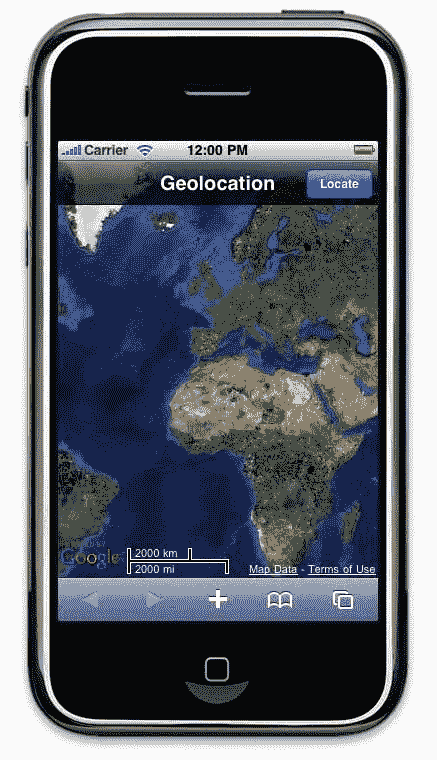
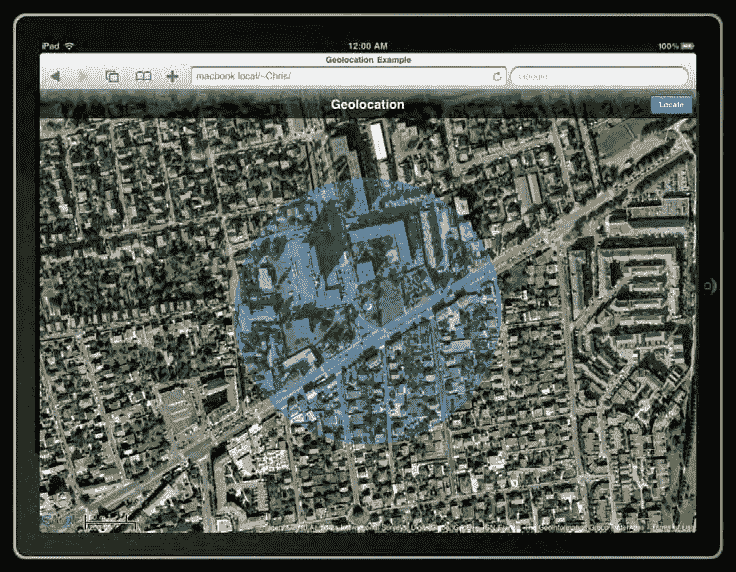
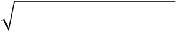
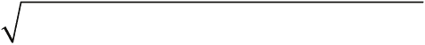
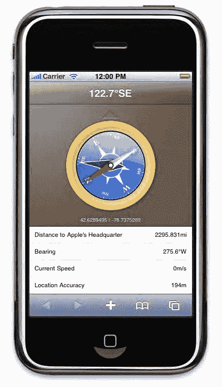
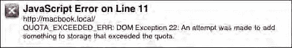
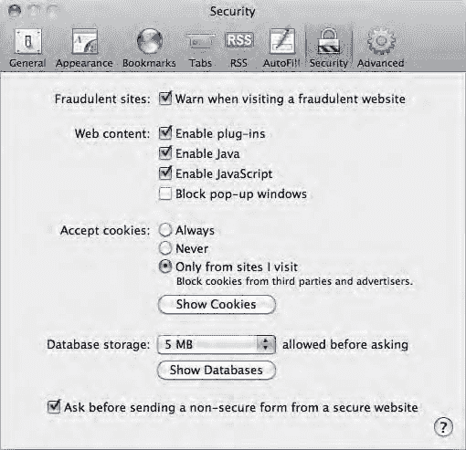

# 排版后的内容

`mapTypeId: ns.MapTypeId.SATELLITE`

`};`

`map = new ns.Map(document.getElementById("map"), options);`

`}`

`</script>`

</head>

<body `onload="init()"` >

由于我们将要使用`Map`对象的方法，因此将其存储在全局变量`map`中。页面加载完成后，我们会调用`init()`函数；该函数通过提供一个基础位置——赤道与本初子午线的交点（0,0）来初始化地图。

由于目前我们还无法获知用户的位置，因此将缩放系数设置为 2，这在 Google Maps API 中代表 2000 公里的比例尺。在卫星视图中，缩放级别范围为 0（10000 公里）到 22（2 米）。各数值之间没有特定的步进关系：每个数值都代表 API 中确定的某一比例尺。此外，并非所有缩放级别都始终可用，这取决于地图类型。

`center`属性将地图定位在参数中传入的位置，并使其位于区域中央。之后你可以使用`Map`对象的`setCenter()`方法来修改此位置。

为了不在地图上显示无用的控件，我们传入了设置为`true`的`disableDefaultUI`属性作为参数。这意味着更改地图类型或缩放滑块的控件将不会显示。不过，我们通过将`scaleControl`设置为`true`，来显示地图左下角区域当前的比例尺（该功能默认隐藏）。

接下来，我们实例化一个新的`Map`对象，向其传入将渲染卫星模式地图的 HTML 元素以及前面列出的参数。其他可用的显示模式列于表 14-3 中。



第 14 章：具备位置感知能力的 Web 应用

### 表 14-3. 可用的地图显示模式

| 常量 | 描述 |
|------|------|
| HYBRID | 在卫星视图上显示主要街道的透明图层。 |
| ROADMAP | 显示街道地图。 |
| SATELLITE | 显示卫星视图。 |
| TERRAIN | 显示带有山体阴影、地形以及道路的地图。 |

此参数是必需的，因为没有默认值。你现在就可以加载这段代码来查看中间结果，并更改地图类型的值，以测试可供你使用的选项。渲染出的地图如图 14-2 所示。

图 14-2. 世界全屏视图

由于 Google Maps 已完全适配 Mobile Safari，因此你可以使用与原生“地图”应用相同的触摸控制方式——双击、双指捏合缩放等。

### 将地图居中于用户位置

现在地图已正确显示，你可以使用 Geolocation API 将用户定位在地图上。为此，我们将在应用的标题栏中添加一个按钮，并添加一些代码以发起位置请求。

第 14 章：具备位置感知能力的 Web 应用

```
...
<style>
.header-wrapper .header-button {
background-color: #2070e9;
}
...
</style>
...
<div class="header-wrapper">
<h1>Geolocation</h1>
<button class="header-button" onclick="locate()" disabled>Locate</button>
</div>
```

默认情况下，我们添加的按钮是禁用的，这样用户就不能在地图初始化之前请求其位置。以下是用于为按钮添加功能的 JavaScript 代码：

```
function button(active) {
document.getElementsByTagName("button")[0].disabled = !active;
}

function locate() {
button(false);
window.navigator.geolocation.getCurrentPosition(successCallback, failureCallback);
}
```

然后我们修改`init()`函数以激活按钮：

```
function init() {
...
button(true);
}
```

最后，我们添加回调函数来处理`getCurrentLocation()`返回的数据，并处理可能出现的错误：

```
function successCallback(position) {
var latlng = new ns.LatLng(position.coords.latitude, position.coords.longitude);
map.setCenter(latlng);
map.setZoom(17);
button(true);
}

function failureCallback(error) {
switch (error.code) {
case error.PERMISSION_DENIED:
alert("定位失败。请检查定位服务是否已开启，以及您是否已授予应用定位权限。");
break;
case error.TIMEOUT:
case error.POSITION_UNAVAILABLE:
alert("定位失败。这通常发生在您处于室内环境时。");
break;
default:
}
}
```


```
alert("Unexpected error occurred.");

# 第 14 章：基于位置感知的 Web 应用

```
button(true);
```

如果请求成功，在使用设备获取到的坐标创建新的`LatLng`对象后，我们通过`setZoom()`调整地图的对齐方式，使其以用户位置为中心，并将缩放级别设为 17（卫星视图中约 50 米范围）。若发生错误，我们会尽可能准确地告知用户以帮助其找到解决方案，并重新激活按钮。

### 标记用户位置

现在地图已聚焦在用户所在区域，但这显然不够直观——用户更想确切知道自己的精确位置，而非仅仅一个区域。Google Maps API 允许在地图上添加多种类型的数据，例如标记。在我们的示例中，将使用画布创建自定义标记；以下函数可让我们无需借助任何图片就能生成不同颜色的圆点标记：

```
var bullet = document.createElement("canvas");

function createBullet(color) {
  /* 始终清空画布 */
  bullet.width = 16;
  bullet.height = 16;

  /* 获取绘图上下文 */
  var ctx = bullet.getContext("2d");

  /* 使用颜色参数创建渐变 */
  var main = ctx.createRadialGradient(5, 6, 1, 0.5, 6, 20);
  main.addColorStop(0, color);
  main.addColorStop(1, "white");

  /* 创建高光效果 */
  var shine = ctx.createRadialGradient(5, 6, 0.5, 5, 6, 40);
  shine.addColorStop(0, "white");
  shine.addColorStop(0.038, "black");
  shine.addColorStop(1, "white");

  /* 设置绘图样式 */
  ctx.strokeStyle = color;
  ctx.fillStyle = main;
  ctx.lineWidth = 2;

  /* 绘制圆点 */
  ctx.beginPath();
  ctx.arc(8, 8, 7, 0, Math.PI * 2, false);
  ctx.stroke();
  ctx.fill();

  /* 然后应用高光效果 */
  ctx.save();
  ctx.globalCompositeOperation = "lighter";
  ctx.fillStyle = shine;
  ctx.fill();
  ctx.restore();

  /* 加粗描边 */
  ctx.strokeStyle = "rgba(0,0,0,0.25)";
  ctx.stroke();

  return bullet.toDataURL();
}
```

顾名思义：`createBullet()`函数创建指定颜色的圆点，并通过`toDataURL()`方法返回画布内容。生成的图像可用于标记。

```
var markerBullet;

function drawMarker(latlng, color) {
  if (markerBullet) {
    markerBullet.setPosition(latlng);
  } else {
    markerBullet = new ns.Marker({
      position: latlng,
      map: map,
      icon: createBullet(color),
      zIndex: 1,
    });
  }
}
```

由于可能依次标记多个位置，且我们不想为每个位置都创建新画布，因此会保存第一个标记实例，并仅修改其位置。

`Marker`对象的构造函数接收`LatLng`对象作为位置参数、地图参数（用于绑定位置）以及通过`createBullet()`创建的图标参数。

```
function successCallback(position) {
  ...
  drawMarker(latlng, "#0072f9"); // 蓝色标记
}
```

此后，每当 Web 应用收到新位置时，都会用蓝色圆点进行标记。

### 显示精确度

还有一个我们希望显示的信息——精确度。由于位置 API 返回的位置精度可能因用户位置和内部定位方法（WPS、GPS 等）而异，用户或许需要了解所指示位置的准确程度。在我们的 Web 应用中，将使用 Google Maps API 的另一个对象——`Circle`来直观表示。由于它与位置密切相关，我们将修改`drawMarker()`函数：

```
var markerBullet, markerCircle;

function drawMarker(latlng, accuracy, color) {
  ...
  if (markerCircle) {
    markerCircle.setCenter(latlng);
  } else {
    markerCircle = new ns.Circle( {
      center: latlng,
      radius: accuracy,
      map: map,
      fillColor: color,
      fillOpacity: 0.25,
      strokeColor: color,
      strokeOpacity: 0.65,
      strokeWeight: 2,
      zIndex:0
    });
  }
}
```


#### 遵循与标记器相同的原则

遵循与标记器相同的原则，我们仅使用`Circle`对象的一个实例。它同样通过`LatLng`和`Map`对象进行初始化。半径以米为单位设置，并将由地理位置 API 返回的值设定。除了这些参数，你还可以为指示器的填充色和描边色以及其透明度定义颜色。与之前一样，你只需修改成功回调函数，将精度纳入考量。

```
function successCallback(position) {
    ...
    drawMarker(latlng, position.coords.accuracy, "#0072f9"); // 蓝色标记
}
```

这将为用户带来令人满意的定位服务，不仅显示他们的位置，还显示定位的精度，如图 14-3 所示。



**图 14-3.** 用户位置与定位精度一同显示在地图上

借助 Google Maps API，你可以走得更远，从使用 Google 服务器上定义的路线，到通过街景模式展示信息。由于有大量值得探索和用于构建令人印象深刻的应用的功能，我们建议你查阅在线文档 [`code.google.com/apis/maps`](http://code.google.com/apis/maps)/。

---

### 追踪用户位置

你已经学会了如何请求用户位置以及如何在地图上显示这些信息。现在，你应该非常清楚如何根据你计划如何利用这些数据来最高效地执行此操作。

现在让我们关注地理定位 API 的另一个特性：追踪设备位置变化的能力。通过持续跟踪用户的位置，你将能够在事件发生时做出响应，例如在路线规划应用或与某些地理标记工具结合使用时。

#### 注册更新

此功能通过 `watchPosition()` 方法访问。此方法的使用方式与 `getCurrentPosition()` 相同，参数也相同。然而，后者发送一个位置后就结束，而前者则会持续发送位置并反复运行。

`watchPosition()` 方法还会返回一个唯一标识符，之后可用于停止追踪。调用此函数的最简单方式如下：

```
var watchId = window.navigator.geolocation.watchPosition(successCallback);
```

当使用相关 ID 作为参数调用 `clearWatch()` 函数时，重复请求将终止：

```
window.navigator.geolocation.clearWatch(watchId);
```

始终将此选项提供给最终用户似乎是合理的选择，他们应该始终能够控制自己的设备，并且通常知道为何启动应用，从而知道何时停止它。

尽管如此，根据 `watchPosition()` 的用途，`clearWatch()` 也可以在特定事件触发时被调用，例如，在路线规划应用中，当用户到达请求的目的地时。

#### 观察者的特定行为

由于 `watchPosition()` 是一个迭代函数，了解当用户在不调用 `clearWatch()` 函数的情况下退出应用、设备电量耗尽或发生其他情况时会发生什么，是很有用的。

当用户返回启动器时，如果有足够的空间缓存应用状态，该函数将暂时挂起，并在浏览器再次启动时恢复。如果发生错误，更新尝试将继续，API 将调用失败回调函数。

你可以使用以下代码检查此行为：

```
window.navigator.geolocation.watchPosition(successCallback, failureCallback);

function successCallback(position) {
    var msg = '位置: ' +
        position.coords.longitude + ', ' +
        position.coords.latitude;
    console.info(msg + '\n 在 ' + (new Date()).toTimeString());
}

function failureCallback(error) {
    var err = error.message + ' (' + error.code + ')';
    console.error(err + '\n 在 ' + (new Date()).toTimeString());
}
```

加载一个运行此代码的页面，退出 Mobile Safari，然后激活或停用地理定位服务。你将看到位置更新仍在继续，这意味着错误或退出应用都不会停止 API 的运行。

如果用户拒绝访问地理定位服务，API 将继续发送错误消息，尽管用户不会有第二次机会更改其对请求的答复。但是，在这种情况下，当用户退出 Mobile Safari 并重新启动后，授权弹出窗口将再次出现；在这种情形下，API 以这种方式保持轮询活动是可以理解的。

认识到这种特殊行为后，开发人员应通过构建适当的回调函数来预见它，以通知用户追踪问题，或在达到一定尝试次数后使用 `clearWatch()` 方法停止追踪。

#### 在 Google 地图上观察位置

为了说明这种追踪可能性，我们将修改之前的 Google 地图示例以纳入追踪功能，首先将以下代码绑定到我们的按钮上：

```
var firstRun, trackerID, failedCount = 0;

function swapAction() {
    var button = document.getElementsByTagName("button")[0];
    if (trackerID == undefined) {
        trackerID = window.navigator.geolocation.watchPosition(
            successCallback, failureCallback);
        button.textContent = "停止";
        button.style.backgroundColor = "#c6323d"; // 变为红色
        firstRun = true;
    } else {
        window.navigator.geolocation.clearWatch(trackerID);
        trackerID = undefined;
        button.textContent = "追踪";
        button.style.backgroundColor = "";
    }
}
```

在这里，让用户随时停止追踪非常重要，因为追踪会消耗设备电量；当用户停止移动时，他会想要停止；此外，取决于所使用的定位方法，追踪返回的数据可能不尽如人意。为此，我们将在追踪发生时将“追踪”按钮改为“停止”按钮。`swapAction()` 函数将同时用于此目的、执行停止操作以及在发生错误时停止追踪。

然后，我们对 `successCallback()` 函数稍作修改。

```
function successCallback(position) {
    var latlng = new ns.LatLng(position.coords.latitude, position.coords.longitude);
    map.panTo(latlng);
    if (firstRun) {
        map.setZoom(17);
        firstRun = false;
    }
    ...
    failedCount = 0;
}
```

这里，我们用 `panTo()` 替换了 `setCenter()`。与 `setCenter()` 相比，`panTo()` 函数的优势在于它会滑动到新位置，而非直接跳转。此外，我们只在首次定位时缩放；这样，如果用户更改了缩放比例，他们的选择不会因为位置改变而被丢弃。

因为此请求成功，我们将错误计数器设置为 0。另一方面，失败回调函数需要稍多一些工作。

```
function failureCallback(error) {
    /* 发生 100 次错误后停止追踪 */
    if (error.code != error.PERMISSION_DENIED) {
        failedCount++;
        if (failedCount < 100) {
            return;
        }
    }
    failedCount = 0;
    swapAction();
    switch (error.code) {
        ...
    }
    button(true);
}
```

信号接收并非总是最佳，这意味着定位可能并非每次尝试都能成功，但很可能足以成功返回满意的数据。因此，我们不能在每次失败时都向用户抛出错误，也不能在第一次失败时就停止追踪。由于每秒可能进行多次调用，我们将失败次数限制设为 100，这大约意味着在向用户发送错误消息之前等待 30 到 60 秒。之后，该过程将停止。

---

### 从数据到数学


### 地理定位 API

`Geolocation API` 为你提供了获取静态数据的有用方法，但没有辅助函数来处理这些数据并真正将其“绘制”在空间中。以下是一些在你的工作流程中可能会用到的计算。我们将在一定程度上解释这些公式，以便你理解其原理；不过，只要你清楚它们能得出什么结果，就可以直接复制这些代码片段并在你的代码中使用。

#### 两点之间的距离

如果你要将用户从一个点带到另一个点，那么需要行进的距离很可能是有用的信息。由于你已经学会了如何找到用户当前位置和目标位置的坐标，这一点就很容易推导出来。




纬线和经线在整个地图上相互交叉，形成了一个大致规则的网格。目前我们将其视为规则网格，这样就能用一些初等数学规则来计算任意两点之间的距离。

假设一个纬度（`φ`）大约相当于 69 英里，一个经度（`λ`）大约相当于 53 英里，我们应用勾股定理：我们的距离是沿着纬度和经度“边”构成的假想三角形的斜边。以下公式返回给定两点之间的距离（以英里为单位）：

下面是将公式转换为 JavaScript 代码的方式：

```javascript
function computeDistance(p1, p2) {
  var lat1 = p1.coords.latitude;
  var lat2 = p2.coords.latitude;
  var lng1 = p1.coords.longitude;
  var lng2 = p2.coords.longitude;
  return Math.sqrt( Math.pow(69 * (lat2 - lat1), 2)
                    + Math.pow(53 * (lng2 - lng1), 2) );
}
```

这通常是你确定距离的最佳选择。然而，这只是一个近似值。实际上，由于地球是一个扁球体，纬度和经度是弧线而非直线，这意味着两点之间的距离会因你在地球上的位置而异，尤其是经度。经度一度的长度会随着你接近两极而变小。

#### 更精确的两点间距离

有几种使用球面几何的方法可以计算曲线上的精确距离。这里不多赘述，直接介绍如何使用哈弗辛公式来确定两点 `a` 和 `b` 之间的距离：

其中

这是该公式的 JavaScript 实现（`3959` 是地球的平均半径 `r`，单位为英里）：

```javascript
function computeDistance(p1, p2) {
  var lat1 = toRad(p1.coords.latitude);
  var lat2 = toRad(p2.coords.latitude);
  var lng1 = toRad(p1.coords.longitude);
  var lng2 = toRad(p2.coords.longitude);
  var deltaLat = (lat2 - lat1);
  var deltaLng = (lng2 - lng1);
  var calc = Math.pow(Math.sin(deltaLat / 2) , 2) +
             Math.cos(lat1) * Math.cos(lat2) * Math.pow(Math.sin(deltaLng / 2) , 2);
  return 3959 * 2 * Math.asin(Math.sqrt(calc));
}

/* 将角度转换为弧度 */
function toRad(deg) {
  return deg * Math.PI / 180;
}
```

尽管这个方法相当精确，但它更复杂，计算时间可能大约要长三倍。同样，当你不需要如此高的精度时，还是使用第一个公式。

#### 行进方向

利用两点，就像计算距离一样，也可以计算出需要行进的方向，称之为*方位角*。这很容易与航向角混淆，航向角是 API 提供的一个值，但它们是两个不同的概念。航向角是用户在移动时当前正行进的方向；方位角是需要行进的**方向**，与任何移动动作无关。换句话说，方位角是连接两点的线与经线之间的夹角，可以这样确定：

使用 JavaScript 转换如下：

```javascript
function computeBearing(p1, p2) {
  var lat1 = toRad(p1.coords.latitude);
  var lat2 = toRad(p2.coords.latitude);
  var lng1 = toRad(p1.coords.longitude);
  var lng2 = toRad(p2.coords.longitude);
  var deltaLng = (lng2 - lng1);
  var y = Math.cos(lat2) * Math.sin(deltaLng);
  var x = Math.cos(lat1) * Math.sin(lat2) -
```


`Math.sin(lat1) * Math.cos(lat2) * Math.cos(deltaLng)`;

`return (toDeg(Math.atan2(y, x)) + 360) % 360`;

}

/* 将弧度转换为角度 */
`function toDeg(rad)` {

`return rad * 180 / Math.PI`;

}

为了优化代码，我们使用 `Math.atan2()` 而非 `Math.atan()` 来简化公式；其优势在于能够兼顾两个值的符号，并将角度置于正确的象限中。然而，由于 `atan2()` 返回值的范围是 -180 到 +180，我们需要将角度归一化到 0 到 360 度之间。

# 第 14 章：位置感知型 Web 应用程序

### 构建指南针 Web 应用

在接下来的章节中，我们将利用本书介绍的一些元素，从头开始构建一个指南针 Web 应用。我们将使用 Canvas 绘制指南针的元素，同时使用更轻量级（从而更流畅）的 CSS 动画使其生动起来。

**注意：** 对于这个实际示例，我们建议您在室外进行测试，以提高收集到更精确坐标（利用 A-GPS）的概率。同时请注意，您的应用程序在模拟器上无法运行，因为该 API 只会返回苹果公司在加利福尼亚州的位置。但在 iPad 模式下，该 API 会利用网络信息，至少轮询功能是可用的。

该应用程序将使用我们之前介绍过的 Geolocation API 函数返回的数据；因此，构建它也可以作为一种便捷方式，实际测试不同情境下数据的准确性，以便后续构建更好的应用程序。

图 14-4 展示了我们将使用 Canvas API 构建的指南针的所有图形元素。这将使我们能够对渲染进行精细控制，同时保持所需文件的大小比常规图片更小。

**图 14-4.** 指南针的构成元素

由于 canvas 元素相当消耗 CPU 时间（它们并非在硬件上绘制），直接使用 API 绘制动画会过于繁重，尤其是在处理复杂元素时。因此，为了移动指南针的指针和刻度盘，我们将采用第 9 章中介绍的 CSS 过渡效果。

#### 创建移动元素

首先，我们将构建指南针中的所有移动元素。虽然这些元素将使用 Canvas API 绘制，但我们会将它们作为图像来使用以简化代码。首先是承载创建元素函数的对象。创建一个名为 `compass.js` 的新文件，并添加以下内容：

```javascript
var Compass = function(size) {
    this.dialGraduations = new Image();
    this.bearingNeedle = new Image();
    this.headingNeedle = new Image();
    this.dialShine = new Image();
    this.builder = document.createElement("canvas");
    this.setSize(size);
}
```

canvas 和图像是动态创建的，这样我们的对象就可以独立于使用它的代码。您只需指定需要添加指南针元素的节点即可。构造函数将预期的 canvas 尺寸作为参数。最初定义为 140x140 像素的框架，然后通过 `scale()` 方法进行缩放。由于我们只使用矢量图形进行渲染，因此质量损失不成问题。

```javascript
Compass.prototype.setSize = function(size) {
    /* Canvas 原始尺寸 = 140x140 */
    var scale = size / 140;
    this.builder.width = 140 * scale;
    this.builder.height = 140 * scale;
    this.context = this.builder.getContext("2d");
    this.context.scale(scale, scale);
    this.context.translate(70, 70);
}

Compass.prototype.clear = function() {
    this.context.clearRect(-70, -70, 140, 140);
}

Compass.prototype.render = function(node) {
    this.clear();
    this.drawDialGraduations();
    this.dialGraduations.src = this.builder.toDataURL();
    this.clear();
    this.drawBearingNeedle();
    this.bearingNeedle.src = this.builder.toDataURL();
    this.clear();
    this.drawHeadingNeedle();
    this.headingNeedle.src = this.builder.toDataURL();
    this.clear();
    this.drawDialShine();
```


`this.dialShine.src = this.builder.toDataURL();`

```javascript
/* 将节点附加到文档中 */
node.appendChild(this.dialGraduations);
node.appendChild(this.bearingNeedle);
node.appendChild(this.headingNeedle);
node.appendChild(this.dialShine);
```

# 第 14 章：位置感知 Web 应用

每个元素都有其自身的创建方法。在每个阶段，我们清空画布并调用相应的方法来创建一个元素。然后，画布会转换为数据 URL，以便传递给图像，并添加到作为参数传递给主函数的节点中。

### 刻度盘

所有元素均使用矢量图形绘制，而刻度盘是所需代码最多的部分，不过仍然相当简单。

> **注意：** 在此操作中，我们稍微取巧，因为文本 API 在 iOS 3.2 中尚不支持，但将在该操作系统下一个主要版本中支持。为了让我们的指南针更具风格并体现文本 API 的用法，我们仍然使用了它。

```javascript
Compass.prototype.drawDialGraduations = function() {
    var ctx = this.context;
    ctx.save();
    ctx.beginPath();
    ctx.strokeStyle = "white";
    ctx.arc(0, 0, 15, 0, Math.PI * 2, false);
    ctx.stroke();

    /* 绘制基本方位点 */
    ctx.fillStyle = "white";
    ctx.textAlign = "center";
    ctx.lineWidth = 0.75;

    for (var n = 0; n < 4; n++) {
        /* 字母占位符 */
        ctx.save();
        ctx.beginPath();
        ctx.arc(0, -34, 7, 0, Math.PI * 2, false);
        ctx.fillStyle = "rgba(0, 0, 128, 0.3)";
        ctx.fill();
        ctx.restore();

        /* 方位字母 */
        ctx.font = "bold 9px Georgia";
        ctx.fillText("NESW".substr(n, 1), 0, -31);

        /* 内部箭头 */
        ctx.beginPath();
        ctx.moveTo(-3, -15);
        ctx.lineTo(0, -30);
        ctx.lineTo(3, -15);
        ctx.fill();

        /* 刻度线 */
        ctx.beginPath();
        ctx.moveTo(0, -42);
        ctx.lineTo(0, -39);
        ctx.stroke();

        /* 下一个字母... */
        ctx.rotate(90 * Math.PI / 180);
    }

    ctx.rotate(45 * Math.PI / 180);

    for (var n = 0; n < 4; n++) {
        /* 较小的方位字母 */
        ctx.font = "bold 5px Georgia";
        ctx.fillText("NESESWNW".substr(n * 2, 2), 0, -34);

        /* 较小的内部箭头 */
        ctx.beginPath();
        ctx.moveTo(-2, -15);
        ctx.lineTo(0, -25);
        ctx.lineTo(2, -15);
        ctx.fill();

        /* 较小的刻度线 */
        ctx.beginPath();
        ctx.moveTo(0, 42);
        ctx.lineTo(0, 40);
        ctx.stroke();

        /* 下一组较小字母... */
        ctx.rotate(90 * Math.PI / 180);
    }

    /* 刻度线 */
    ctx.globalAlpha = 0.75;

    for (var n = 0; n < 360 / 5; n++) {
        ctx.beginPath();
        ctx.moveTo(0, 42);
        ctx.lineTo(0, 41);
        ctx.stroke();
        ctx.rotate(5 * Math.PI / 180);
    }

    ctx.restore();
}
```

首先，我们绘制中心圆，以及四个基本方位点及其指向外部的相应箭头。每次迭代时，我们进行 90 度旋转以绘制下一个点。绘制完四个基本方位点后，我们使用相同的过程添加次要刻度线。最后，我们每五度绘制一条刻度线。

使用 `save()` 和 `restore()` 方法可以防止后续绘图操作改变画布的状态。

# 第 14 章：位置感知 Web 应用

### 指针

方位指针的代码要简短得多。它略带透明，并在背景上投下阴影，使其可见的同时又不会太引人注意。

```javascript
Compass.prototype.drawBearingNeedle = function() {
    var ctx = this.context;
    ctx.save();
    ctx.shadowColor = "rgba(0, 0, 0, 0.3)";
    ctx.shadowOffsetX = 2;
    ctx.shadowOffsetY = 1;
    ctx.shadowBlur = 2;
    ctx.fillStyle = "rgba(0, 0, 128, 0.75)";
    ctx.strokeStyle = "white";
    ctx.beginPath();
    ctx.moveTo(-7, 0);
    ctx.lineTo(0, -38);
    ctx.lineTo(7, 0);
    ctx.lineTo(0, 18);
    ctx.closePath();
    ctx.fill();
    ctx.stroke();
    ctx.restore();
}
```

定义了阴影配置后，我们使用单个路径绘制指针的轮廓并填充内部。

航向指针稍微复杂一些。虽然它使用与方位指针相同的阴影配置，但其形状和细节需要多个元素来构建。

```javascript
Compass.prototype.drawHeadingNeedle = function() {
    var ctx = this.context;
    ctx.save();
    ctx.shadowColor = "rgba(0, 0, 0, 0.3)";
    ctx.shadowOffsetX = 2;
    ctx.shadowOffsetY = 1;
    ctx.shadowBlur = 2;

    /* 白色部分 */
```


# 第 14 章：位置感知 Web 应用

`ctx.beginPath();`
`ctx.moveTo(-5, 0);`
`ctx.lineTo(0, 40);`
`ctx.lineTo(5, 0);`
`ctx.fillStyle = "white";`
`ctx.fill();`

/* 红色部分 */
`ctx.beginPath();`
`ctx.moveTo(-5, 0);`
`ctx.lineTo(0, -40);`
`ctx.lineTo(5, 0);`
`ctx.fillStyle = "red";`
`ctx.fill();`

/* 浮雕效果 */
`ctx.beginPath();`
`ctx.moveTo(5, 0);`
`ctx.lineTo(0, -43);`
`ctx.lineTo(0, 43);`
`ctx.fillStyle = "rgba(0, 0, 0, 0.2)";`
`ctx.fill();`

/* 螺钉 */
`ctx.beginPath();`
`ctx.arc(0, 0, 3, 0 , Math.PI * 2, false);`
`ctx.fillStyle = "white";`
`ctx.fill();`
`ctx.stroke();`
`ctx.restore();`

指针的每个部分都使用独立的路径绘制，并通过一条半透明的黑色路径叠加来增加浮雕效果，该路径覆盖在白色和红色部分之上。最后，我们绘制用于将指针固定在罗盘刻度盘上的销钉。

### 刻度盘光泽

罗盘的最后一个部分虽然不可移动，但仍需绘制，因为它将显示在罗盘所有元素的上方。

```
Compass.prototype.drawDialShine = function() {
    var ctx = this.context;
    ctx.save();
    var shine = ctx.createLinearGradient(0, -60, 0, 20);
    shine.addColorStop(0, "white");
    shine.addColorStop(1, "rgba(255, 255, 255, 0)");
    ctx.lineWidth = 0.25;
    ctx.strokeStyle = "rgba(255,255,255,0.55)";
    ctx.fillStyle = shine;
    ctx.beginPath();
    ctx.arc(0, 0, 42, Math.PI, Math.PI * 2, false);
    ctx.quadraticCurveTo(0, -17, -43, 0);
    ctx.fill();
    ctx.stroke();
    ctx.restore();
}
```

我们再次使用路径来绘制半圆，并利用贝塞尔曲线绘制内侧曲线，如图 14–4 所示。二次曲线只有一个控制点，这大大简化了弧线的定位。填充则使用`shine`变量中定义的渐变。

### 渲染罗盘

现在，我们可以绘制罗盘缺失的部分，即外框。与其他元素不同，外框将直接作为 canvas 元素使用。为此，我们使用 `render()` 方法，该方法在移动部件创建完成后调用专门的绘制方法。

```
Compass.prototype.render = function(node) {
    ...
    this.dialShine.src = this.context.canvas.toDataURL();
    this.clear();
    this.drawCompassFrame();
    this.drawDialBackground();
    this.drawDirectionArrow();

    /* 将节点追加到文档中 */
    node.appendChild(this.builder);
    ...
}
```

第一个方法用于绘制罗盘外框。

```
Compass.prototype.drawCompassFrame = function() {
    var ctx = this.context;
    ctx.save();
    var frame = this.context.createRadialGradient(0, 0, 0, 0, 0, 56);
    frame.addColorStop(0.85, "#e7ba5a");
    frame.addColorStop(0.9, "#fcd97c");
    frame.addColorStop(1, "#e7ba5a");

    ctx.beginPath();
    ctx.arc(0, 0, 56, 0, Math.PI * 2, false);
    ctx.strokeStyle = "#444";
    ctx.save();
    ctx.shadowColor = "rgba(0, 0, 0, 0.75)";
    ctx.shadowOffsetX = 1;
    ctx.shadowOffsetY = 1;
    ctx.shadowBlur = 4;
    ctx.stroke();
    ctx.fillStyle = frame;
    ctx.fill();
    ctx.restore();

    /* 光泽效果 */
    ctx.beginPath();
    ctx.fillStyle = "rgba(255, 255, 255, 0.4)";
    ctx.arc(2, 2, 48, 0, Math.PI * 2, false);
    ctx.fill();

    ctx.beginPath();
    ctx.fillStyle = "rgba(0, 0, 0, 0.1)";
    ctx.arc(-2, -2, 48, 0, Math.PI * 2, false);
    ctx.fill();

    ctx.restore();
}
```

外框由一个圆盘构成，该圆盘使用了金色的径向渐变`frame`，从而产生深度感。为了增强真实效果，我们在其上方叠加了两个半透明的圆盘。

```
Compass.prototype.drawDialBackground = function() {
    var ctx = this.context;
    ctx.save();
    var back = this.context.createLinearGradient(-50, -50, 50, 50);
    back.addColorStop(0, "#122a91");
    back.addColorStop(1, "#61a1f4");

    ctx.beginPath();
    ctx.fillStyle = back;
    ctx.arc(0, 0, 43, 0, Math.PI * 2, false);
    ctx.fill();
    ctx.stroke();

    ctx.beginPath();
    ctx.fillStyle = "white";
    ctx.moveTo(-1, -38);
    ctx.lineTo(0, -41);
    ctx.lineTo(1, -38);
    ctx.fill();

    ctx.restore();
}
```

刻度盘背景仅使用一个填充了蓝色渐变的圆盘。在刻度盘的上部添加了一个小箭头，用于指示当前方向，这应当使刻度盘上的位置更易读。

```
Compass.prototype.drawDirectionArrow = function() {
    var ctx = this.context;
    ctx.save();
```


`ctx.translate(0, -59);`

`ctx.strokeStyle = "rgba(0, 0, 0, 0.25)";`

`ctx.beginPath();`

`ctx.moveTo(-10, 0);`

`ctx.lineTo(0, -10);`

`ctx.lineTo(10, 0);`

`ctx.stroke();`

`ctx.strokeStyle = "rgba(255, 255, 255, 0.25)";`

`ctx.beginPath();`

`ctx.moveTo(-10, 0);`

`ctx.lineTo(10, 0);`

`ctx.stroke();`

`ctx.restore();`

# 第 14 章：基于位置的 Web 应用

罗盘上最后要添加的元素是另一个箭头，它将指示用户的朝向。这个箭头不会移动：它只提供用户指向方向的恒定指示，使罗盘更易读。

### 向文档中添加元素

我们添加罗盘元素的文档基于第 4 章创建的 Web 应用模板。只需按如下方式修改`index.html`文件：

```html
<body onload="init()">
<div class="view">
  <div class="header-wrapper">
    <h1> 朝向</h1>
  </div>
  <div id="compass"><div></div></div>
</div>
</body>
```

为了使页面呈现更合适、更吸引人，请将以下样式添加到新的`compass.css`样式表中。它们会添加棕色渐变背景和半透明页眉。

```css
.view {
  background: -webkit-gradient(radial,
    0 0, 0, 0 0, 300,
    from(#a98), to(#654));
}
.header-wrapper { background-color: transparent; }
```

为了使所有元素在可用空间中恰当组合，还需要将以下规则添加到样式表中：

```css
#compass div {
  position: relative;
  margin: 0 auto;
  top: 10px;
}
#compass canvas {
  display: block;
  margin: 0 auto;
}
#compass img {
  position: absolute;
  top: 0;
  left: 0;
}
```

要完成罗盘构建的第一部分，你必须在`compass.js`文件中添加初始化罗盘的代码。

## 第 14 章：基于位置的 Web 应用

```javascript
const COMPASS_SIZE = 220;
var compass = new Compass(COMPASS_SIZE);

function init() {
  var target = document.querySelector("#compass div");
  target.style.width = COMPASS_SIZE + "px";
  compass.render(target);
}
```

接下来，我们需要添加必要的代码来收集、处理和显示定位数据。

### 准备文档以接收位置数据

为了解释计算距离和方位的方法，我们将计算用户到苹果总部的距离以及前往那里的方向。此外，我们还将显示用户的位置（经度和纬度）。以下元素被添加到 HTML 文档中：

```html
...
<div id="compass"><div></div></div>
<div class="list-wrapper">
  <div id="location">纬度 | 经度</div>
  <ul>
    <li><span>0</span>距苹果总部的距离</li>
    <li><span>0</span>方位</li>
    <li><span>0</span>当前速度</li>
    <li><span>0</span>定位精度</li>
  </ul>
</div>
...
```

以下样式规则将使我们的字段紧贴屏幕底部：

```css
.list-wrapper {
  position: absolute;
  width: 100%;
  bottom: 0;
  border-top: solid 1px black;
}
#location {
  position: absolute;
  bottom: 140px;
  font-size: 10px;
  color: white;
  text-shadow: rgba(0,0,0,0.7) 0 -1px 0;
  width: 100%;
  text-align: center;
}
.list-wrapper li {
  font-size: 12px;
  line-height: 1;
}
```

## 第 14 章：基于位置的 Web 应用

```css
.list-wrapper li span { float: right; }
```

页眉和列表项将通过`watchPosition()`方法的回调进行更新。

### 使用位置数据

朝向（用户行进的方向）仅在用户移动且设备收集的数据精度足够高时可用，因为我们需要两个点来确定这一信息。与之前一样，我们将使用跟踪功能。以下是初始化函数需要修改的方式：

```javascript
function init() {
  ...
  window.navigator.geolocation.watchPosition(successCallback,
    null, { enableHighAccuracy: true });
}
```

如前所述，所需数据需要足够精确，API 才能确定朝向。为此，我们将`enableHighAccuracy`参数强制设为`true`，以确保在可用的情况下激活 A-GPS。其他一切操作都在以下展示的`successCallback()`函数中完成：

```javascript
var appleLocation = {
  coords: {
    latitude : 37.331689,
```


`longitude: -122.030731`

```
function successCallback(position) {
  /* 追加位置信息 */
  var loc = document.getElementById("location");
  loc.textContent = position.coords.latitude + " | " + position.coords.longitude;

  /* 读取并计算数据 */
  var heading = position.coords.heading || 0;
  var accuracy = position.coords.accuracy;
  var speed = position.coords.speed;
  var bearing = computeBearing(position, appleLocation);
  var distance = computeDistance(position, appleLocation);

  /* 显示当前格式化的方向角 */
  var header = document.querySelector(".header-wrapper h1");
  header.innerHTML = getAngleString(heading);

  var list = document.querySelectorAll("li span");
  list[0].textContent = round(distance, 3) + "mi";
  list[1].innerHTML = getAngleString(bearing);
  list[2].textContent = round(speed, 2) + "m/s";
  list[3].textContent = round(accuracy, 2) + "m";
}
```

## 第 14 章：基于位置感知的网页应用程序

首先，我们在位置容器内显示用户的当前位置。然后，我们读取`heading`、`accuracy`和`speed`的值，并使用`appleLocation`位置计算`bearing`（方位角）和`distance`（距离）。随后，将这些数据添加到`header`（`heading`）和`list`（所有其他元素）中。

该回调函数使用了两个实用函数：一个用于格式化角度，通过指示其在罗盘玫瑰图上的位置（四个基本方位点以及四个中间方位点）；另一个用于将浮点数值四舍五入，精度作为参数传入。

```
function getAngleString(angle) {
  var position = ((angle + 45 / 2) / 45 | 0) % 8 * 2;
  return (angle * 10 | 0) / 10 + "&deg;" + ("N NEE SES SWW NW".substr(position, 2));
}

function round(value, prec) {
  prec = Math.pow(10, prec);
  return ((value || 0) * prec << 0) / prec;
}
```

在此阶段，如果启动网页应用程序，数据会出现在预期的位置，但罗盘的任何元素都不会移动。最后一步是将信息转化为罗盘的视觉变化。

### 为罗盘添加动画效果

为了在指针和刻度盘的不同状态之间实现动画过渡，我们将使用第 9 章介绍的 CSS 动画。在普通罗盘上，刻度盘本身不会移动：使用者拿起罗盘，等待指针指向北方，然后转动罗盘来确定自己要转向哪个方向。为了避免用户反复转动他们的设备，我们将让刻度盘转动——与方向指针稍有错时，以产生逼真的效果。同样，方位指针移动速度会更慢，使罗盘更易读。

为元素添加动画效果所需的代码并不多。只需将以下内容添加到您的`compass.css`文件中：

```
#compass img {
  ...
  -webkit-transform-origin: 50% 50%;
  -webkit-transform: rotate(0);
  -webkit-transition-property: -webkit-transform;
  -webkit-transition-timing-function: ease-out;
}
```

当然，这仅处理了动画本身。元素的状态由 JavaScript 控制。只有在方向数据可用时才能发生旋转，以下代码对此进行了检查：

```
function successCallback(position) {
  ...
  if (position.coords.heading != null) {
    compass.setHeading(heading);
    compass.setBearing(bearing - position.coords.heading);
  }
```

方位角应根据方向角进行调整，以便指针相对于用户的方向指向正确的方向。因此，我们从方位角的角度中减去方向角的角度。以下是相关的函数：

```
Compass.prototype.setBearing = function(deg) {
  this.rotate(this.bearingNeedle, deg);
}

Compass.prototype.setHeading = function(deg) {
  this.rotate(this.headingNeedle, -deg);
  this.rotate(this.dialGraduations, -deg);
}
```

我们的三个元素将错时移动。动画的持续时间通过以下代码定义，该代码应添加到`Compass`对象的构造函数中：

```
var Compass = function(size) {
  ...
  this.dialShine = new Image();
  this.dialGraduations.style.webkitTransitionDuration = "2s";
```


`this.bearingNeedle.style.webkitTransitionDuration = "5s";`

`this.headingNeedle.style.webkitTransitionDuration = "3s";`

...

}

`rotate()` 方法稍微复杂一些，因为在动画完成之前，有可能收到新的航向值。在这种情况下，有必要从动画的当前位置开始下一次旋转，这样元素就不会从一个位置跳到另一个位置。为此，我们求助于 `CSSMatrix` 对象。

```
Compass.prototype.rotate = function(item, deg) {
  var gs = window.getComputedStyle(item);
  var mx = new WebKitCSSMatrix(gs.webkitTransform);
  var current = toDeg(Math.acos(mx.a));
  /* 调整象限 */
  if (mx.b < 0) {
    current = 360 - current;
  }
  var delta = deg - current;
  item.style.webkitTransform = mx.rotate(delta);
}
```

首先，我们读取当前的矩阵，它反映了过渡的位置。这让我们可以推导出当前应用于元素的角度。然后，我们使用二维矩阵应用顺时针旋转。



## 第 14 章：位置感知的 Web 应用程序

利用这个矩阵和一点三角学，我们可以通过读取矩阵第一个元素（`mx.a`）的反余弦值来评估当前角度，并根据正弦值（`mx.b`）的符号将角度定位到正确的象限。然后，可以通过从所需角度中减去当前角度来计算要应用的新角度。`rotate()` 方法允许你简单地应用新角度，并将动画恢复到其新位置。图 14-5 显示了最终结果。

**图 14-5.** 指南针及与用户位置相关的数据

### 防止指针晃动

因为位置信息每秒会发送多次，所以在渲染引擎仍在处理旋转矩阵时，可能会发送新的航向值。在这种情况下，存在将当前位置视为初始位置（旋转前）的风险，这会导致指针从一个点跳到另一个点。为了防止这种行为，并且不让引擎进行无用的计算，我们将对接收数据的读取进行限时。

```
var prevTime = 0;
function successCallback(position) {
  if ((new Date() - prevTime) < 1500) {
    return;
  }
  prevTime = new Date().getTime();
  ...
}
```

这样，数据将仅每隔一秒半读取一次，给渲染引擎留出足够的时间，以便在过渡期间应用当前矩阵并实际产生预期效果。

## 总结

`Geolocation` API 允许你获取有用的数据并构建新型应用程序，为在现代设备上进行创新开发开辟了道路。由于该 API 是 W3C 规范的一种实现，为 iPhone、iPod touch 或 iPad 构建的应用程序可能很快就能在所有现代浏览器上使用。

实际上，Apple 在将桌面版 API 之前，就已经在 Mobile Safari 上提供了这个 API。同样，熟悉这个 API 是一个非常棒的举措，因为基于位置的服务很可能变得越来越流行，从而为用户带来新的期望。最明智的使用方式可能是利用这个 API 为不特定于位置的应用程序增加价值，作为用户的额外服务。因此，抓住这个机会，更进一步吧。

下载自 Wow! eBook <www.wowebook.com>

# 第 15 章  
更好地处理客户端数据存储

多年来，当需要在客户端存储数据以增强页面功能或使其正常工作，开发者只能依赖 Cookie。尽管这对各种应用来说运行良好，但 Cookie 存在局限性，使其不太适合开发复杂功能。在存储标识符或会话信息（如购物车数据）时，大小限制不是问题，但在处理更复杂的任务（例如日历同步）时，这些限制就变得难以应对了。

这并不意味着客户端存储不是一种有益的做法：限制客户端和服务器之间传输的数据量自然会提高页面的响应性，从而带来更好的用户体验。然而，在处理 Cookie 时，这只有部分是正确的，因为 Cookie 会随每个请求（无论是下载图像、样式表还是其他任何内容）一起发送，无谓地使每次传输的每个元素变得更重。

在本章中，你将深入了解通过 JavaScript API 提供给开发者的新的客户端存储选项，并学习如何使用 HTML5 的新功能正确处理离线模式。

### 不同的存储区域

为了使客户端存储的持久性更加灵活，并突破 Cookie 带来的限制，现在可以依赖由 WHATWG 维护的 Web Storage API。该规范定义了一个新的 `Storage` 接口，该接口由 `window` 对象的全新 `localStorage` 和 `sessionStorage` 属性实现。

与 Cookie 相比，这种存储模式的优势之一是大小限制为 5MB 而不是 4KB；此限制适用于完全限定域名 (FQDN)。一旦达到此配额，你将无法再向客户端存储数据，并会收到一个 `QUOTA_EXCEEDED_ERR`（图 15-1）。



**图 15-1.** 尝试存储超出最大限制的数据时会发送错误

可以说，`sessionStorage` 属性类似于会话 Cookie，它跨浏览上下文可用，并在用户退出浏览应用程序时被删除。然而，在讨论 Cookie 或 `sessionStorage` 属性时，*会话* 的含义略有不同。`localStorage` 属性的行为或多或少类似于永不过期的 Cookie，这意味着使用此属性存储的数据将持续存在，直到被脚本或用户操作删除。这两个属性的工作方式与 Cookie 非常相似，只是访问存储的数据不像 Cookie 那样受路径影响，而是基于方案/主机/端口的源规则。

### 如何使用新的存储能力

使用 Web Storage API 存储数据，如同创建 Cookie 一样，依赖于键/值对。键可以定义为任何有效的字符串——包括空字符串。在 Mobile Safari 中 API 的当前实现中，值也只能是有效的字符串。因此，如果你尝试存储一个对象，存储的数据将是调用了其 `toString()` 方法后的对象。根据规范，你应该能够以克隆（而非引用）的形式存储多种对象，因此存储对象的功能应该很快就能实现。

这种类型限制适用于所有对象，包括数值。例如，如果你想使用一个键来存储计数器，不要忘记在递增或递减之前，将检索到的数据转换回 `Number` 对象，否则字符串只会简单地与 1 拼接。另外，由于字符串使用 UTF-16 存储，一个字符占用两个字节，因此占用更多空间；因此，例如要存储 `Date` 对象，你应该存储 `getTime()` 方法的值，而不是 `toString()` 方法返回的值。

然而，与使用 Cookie 设置或获取值的过程相比，这些限制微不足道。使用 Web Storage API 进行这些基本操作非常简单。该 API 提供了专门的方法来插入、读取或删除值。

```
/* 写入数据 */
window.localStorage.setItem("myKey", "myValue");
window.localStorage.setItem("anotherKey", "myOtherValue");

/* 读取数据 */
var value1 = window.localStorage.getItem("myKey");
var value2 = window.localStorage.getItem("anotherKey");

/* 删除数据 */
window.localStorage.removeItem("myKey");
```


所有键都能轻松独立访问，因为你可以像浏览对象一样浏览存储的数据。以下代码与前面代码功能相同：

/* 写入数据 */
`window.localStorage.myKey = "myValue";`
`window.localStorage.anotherKey = "myOtherValue";`

/* 读取数据 */
`var value1 = window.localStorage.myKey; // "myValue"`
`var value2 = window.localStorage.anotherKey; // "myOtherValue"`

/* 删除数据 */
`delete window.localStorage.myKey;`

要整体操作`Storage`对象，你还可以依赖两个实用方法：`clear()`方法将删除所有键值对以重置对象，而`key()`方法允许你通过索引而非名称来定位键。

```
for (var i = 0; i < window.localStorage.length; i++) {
    console.log(i + ": " + window.localStorage.key(i));
}
```

--- 结果 ---
```
0: myKey
1: anotherKey
```

与大多数键值对集合一样，键的显示顺序不可预测；但只要没有修改过任何键，顺序应保持不变。

### `sessionStorage` 的特定行为

在用户退出浏览器之前，会话 cookie 在用户当前浏览的任何窗口或标签页中都有效。这意味着，例如，如果用户在当前窗口中打开新文档、在不同窗口中打开同一网站或关闭在线商店所在的标签页，用户放入在线购物车的任何商品都将保留在内存中。

这种方案的缺点在于，用户若想使用两个不同的购物车浏览同一购物网站（例如使用不同的信用卡、投递到不同地址等情况），则需要使用两个不同的浏览器（例如 Safari 和 Firefox），或者完成第一个会话后关闭浏览器，再开始第二个会话。

`sessionStorage`对象的工作方式不同。Cookie 与浏览器会话相关，而`localStorage`对象为同一源创建一个唯一的`Storage`对象实例，但`sessionStorage`会为每个浏览上下文创建一个`Storage`对象实例，并由初始上下文创建的任何浏览上下文继承。这意味着框架（子浏览上下文）可以访问与宿主文档相同的`sessionStorage`对象；然而，如果从父窗口打开一个新窗口（辅助浏览上下文），这个新浏览上下文将能访问初始`Storage`对象的副本，该副本随后将独立于第一个对象进行修改。

在移动版 Safari 中，这仅适用于通过脚本打开的窗口。实际上，由`target`属性打开的窗口将被视为用户主动操作后打开的。这意味着当用户打开新窗口或标签页时，系统会为其分配一个全新的空`sessionStorage`对象。当然，该对象的内容只能从同一源访问。关于浏览上下文的更多细节，可参考第 11 章。

### 监听存储区域修改通知

每次存储区域被修改时，都会触发一个`storage`事件，该事件无法取消且不会冒泡。它可以像`DOMWindow`对象的其他事件一样被捕获。

```
window.addEventListener("storage", function(event) {
    /* 对 StorageEvent 对象进行操作 */
}, false);
```

该事件会发送给所有使用被修改存储区域的文档，但修改该存储区域的文档除外。这意味着如果只有修改存储区域的文档本身在使用该存储区域，则不会触发任何事件。相反，如果该文档包含`<iframe>`，无论存储区域是从`<iframe>`还是主文档修改，另一个浏览上下文都会收到通知。

`storage`事件允许你控制修改行为，例如仅允许来自主文档的变更。但要注意避免引发无限的事件交换，例如设置每个浏览上下文拒绝其他上下文的修改。此外，`storage`事件不会发送给执行操作的文档，这也是防止这种情况的一项措施。

表 15–1 列出了传递给处理程序的`StorageEvent`对象的属性。注意，在工作草案指定`url`属性的地方，WebKit 实现使用了`uri`属性。

**表 15–1.** `StorageEvent`对象的属性

| 属性 | 描述 |
| :--- | :--- |
| `event.storageArea` | 已被修改的存储区域。 |
| `event.key` | 已从`Storage`对象中添加、修改或删除的键。 |
| `event.oldValue` | 修改前与键关联的值。 |
| `event.newValue` | 修改后与键关联的值。 |
| `event.uri` | 执行修改操作的文档地址。 |

使用`setItem()`和`removeItem()`方法时，`key`、`oldValue`和`newValue`属性值将按表 15–1 所示进行设置。另一方面，使用`clear()`时，这三个属性都将设置为`null`，便于识别何时调用该方法来更改项目值。在所有情况下，`storageArea`和`uri`属性都会被设置，以便识别事件来源。

### 安全与隐私考量

与处理 cookie 或跨文档通信时一样，你会遇到源于安全风险的限制。首先，尽管`Storage`对象的大小限制远没有 cookie 那么严格，但其设置是为了防止拒绝服务攻击。

对存储区域的访问仅限于协议/主机/端口三元组，且目前无法使用 DOM Level 1 可访问的`Document`对象的`domain`属性来放宽存储访问权限。与 cookie 相比这是一个限制，但也使这种存储方式更加安全，尤其是在使用共享主机名时。

最后，当存储的数据非常敏感时，应将存储区域的使用限制在依赖 SSL（或其继任者 TLS）的安全区域内，从而仅在提供有效证书、验证请求来源的情况下才能访问数据。这对保护用户隐私至关重要。

### 缓存 Ajax 请求

本地存储的一个有趣应用是缓存 Ajax 请求的数据。当然，你可以使用 HTTP 缓存，但这可靠性较低。

#### 基础文档

为了说明如何缓存 Ajax 请求的数据，我们将聚合 Apple 的 RSS 订阅源，并为用户适当地显示。我们再次基于 web 应用模板进行构建，对`body`应用以下更改：

```html
<body onload="init()">
    <div class="view">
        <div class="header-wrapper">
            <h1> Apple 的 RSS 订阅源</h1>
        </div>
        <div class="list-wrapper">
            <h2>最新新闻</h2>
            <ul id="feed" class="template">
                <li><a href="#{link}">
                    <span>#{title}</span><small>#{dateFormatted} #{contentFormatted}</small>
                </a></li>
            </ul>
        </div>
    </div>
</body>
```

如果你已阅读过第 12 章，你会注意到我们将使用客户端渲染方法来处理通过 Ajax 加载的内容。如需进一步了解此方法以及获取本示例所需的函数，可参考第 12 章。

我们需要初始化请求以获取订阅源内容。这通过以下代码实现：

```javascript
/* Apple 的新闻订阅源 */
var feedUrl = "http://images.apple.com/main/rss/hotnews/hotnews.rss";

function init() {
    refresh();
}

function refresh() {
    var xml = new XMLHttpRequest();
    xml.onreadystatechange = showFeed;
    xml.open("get", "proxy.php?url=" + encodeURIComponent(feedUrl));
    xml.send();
}

function showFeed() {
```


```javascript
if (this.readyState == this.DONE && this.status == 200) {
    processFeed(this.responseXML);
}
```

```javascript
function processFeed(xml) {
    var arr = [];
    var all = xml.getElementsByTagName("item");
    var list = document.getElementById("feed");
    /* 计算最终生成的 HTML */
    var html = "";
    for (var i = 0; i < all.length; i++) {
        var data = {
            title: getText(all[i], "title"),
            content: getText(all[i], "description"),
            date: new Date(getText(all[i], "pubDate")),
            link: getText(all[i], "link")
        };
        html += applyTemplate(list.innerHTML, data);
    }
    /* 将内容追加到文档中 */
    appendContent(list, html);
}
```

```javascript
function getText(node, name) {
    var item = node.getElementsByTagName(name);
    return item.length && item[0].hasChildNodes() ?
        item[0].firstChild.nodeValue : null;
}
```

由于我们获取的是 XML 数据，需要将其转换为可在模板中使用的对象。这个操作通过 `processFeed()` 方法完成。幸运的是，RSS 源足够简单，这个操作不需要太多代码。随后，我们使用 `getText()` 方法来简化文本节点的读取。

我们的模板包含两个格式化值，因此需要添加两个相应的格式化器，以便在模板中显示预期的值。

```javascript
var formatters = {
    "date": formatDate,
    "content": formatContent
};
```

```javascript
function formatDate(value, data) {
    if (typeof value == "string") {
        value = new Date(value);
    }
    return ("0" + value.getDate()).substr(-2) + "/" +
           ("0" + (value.getMonth() + 1)).substr(-2) + " -- ";
}
```

```javascript
function formatContent(value, data) {
    return value.replace(/<.+?>/g, "").substr(0, 200) + "...";
}
```

```javascript
function processFeed(xml) {
    ...
    html += applyTemplate(list.innerHTML, data, formatters);
    ...
}
```

我们的第一步将以在 `main.css` 文件中添加内容结束，这将为列表项赋予特定的样式。

```css
.group-wrapper ul li a,
.list-wrapper ul li a {
    ...
}

.group-wrapper ul li a:active,
.list-wrapper ul li a:active {
    ...
}

.group-wrapper ul li a:active *,
.list-wrapper ul li a:active * {
    ...
}

.list-wrapper ul li a {
    margin: -10px;
    text-decoration: none;
    color: inherit;
}

.list-wrapper ul li a span {
    display: block;
    margin-right: 24px;
    overflow: hidden;
    text-overflow: ellipsis;
    white-space: nowrap;
}

.list-wrapper ul li a small {
    display: block;
    margin-right: 24px;
    font-size: 13px;
    line-height: 15px;
    height: 30px;
    overflow: hidden;
    color: gray;
}
```

现在，如果你在浏览器中加载 HTML 文件，你会看到 feed 已被加载并正确显示，如图 15–2 所示。

**图 15–2.** Apple feed 通过 Ajax 加载并在客户端渲染

这是一种相当常见的 feed 展示方式。除非使用 HTTP 缓存，否则用户每次刷新页面时都会看到最新的 feed。接下来，我们将进一步优化，默认从缓存中加载 feed，并将刷新显示的选择权交给用户。通过这种方式，你的应用加载速度会更快，并让用户获得更强的控制权——这是一个双赢的方案。

#### 添加缓存功能

为了让用户决定何时刷新列表，我们首先需要创建相应的按钮。让我们在标题中添加一个“刷新”按钮，如下所示：

```html
...
<div class="header-wrapper">
    <h1>Apple 的 RSS 源</h1>
    <button class="header-button" onclick="refresh()">
        <span>刷新</span>
    </button>
</div>
...
```

如同第 12 章中所述，`<span>` 元素用于在内容加载时隐藏文本并显示旋转图标。用于刷新 feed 的函数与之前使用的函数相同。

然而，当 `processFeed()` 函数第二次被调用时，模板将无法再从标记中读取，因为 HTML 内容已经被修改：因此需要事先保存模板。最好使用 `sessionStorage` 来实现，因为模板不需要在会话结束后保留（模板将在


## 第 15 章：更优的客户端数据存储处理方案

### 修改函数

在新会话中再次可用，此外你可能需要在某个阶段修改模板——这可能导致错误。以下是函数的修改方式：

```javascript
function processFeed(xml) {
  // ...
  var list = document.getElementById("feed");
  if (window.sessionStorage.template == undefined) {
    window.sessionStorage.template = list.innerHTML;
  }
  // ...
  html += applyTemplate(window.sessionStorage.template, data, formatters);
  // ...
}
```

要激活加载动画，你需要使用第 7 章创建的`BigSpinner`对象。将其添加到你的代码中，并按如下方式使用：

```javascript
var spinner = new BigSpinner();

function init() {
  spinner.init("spinner", "white");
  // ...
}

function refresh() {
  // ...
  buttonState(true);
}

function showFeed() {
  if (this.readyState == this.DONE && this.status == 200) {
    processFeed(this.responseXML);
    buttonState(false);
  }
}

function buttonState(loading) {
  var but = document.querySelector("button.header-button");
  if (loading) {
    but.disabled = true;
    but.className += " spinning";
    spinner.animate();
  } else {
    but.disabled = false;
    but.className = but.className.replace(" spinning", "");
    spinner.stop();
  }
}
```

现在，当订阅源列表正在加载时，用户会得知应用程序正在活动中。

### 会话存储作为第一级缓存

第一级缓存依赖于`sessionStorage`。第二级缓存使用`localStorage`，将存储 XML 数据和加载时间，以决定是否发送 Ajax 请求。

```javascript
function showFeed() {
  if (this.readyState == this.DONE && this.status == 200) {
    /* 日期将被序列化为字符串 */
    window.localStorage.feedDate = new Date();
    window.localStorage.feedXML = this.responseText;
    processFeed(this.responseXML);
    buttonState(false);
  }
}
```

由于只能存储字符串，我们使用`responseText`将 XML 作为文本存储。之后将使用`DOMParser`对象将其转换为 XML。

我们还记录了日期，用于计算缓存的生存时间（TTL）。

### 使用缓存

我们的缓存现在已准备好使用。这由`refresh()`方法处理。

```javascript
function refresh() {
  var last = new Date(window.localStorage.feedDate || 0);
  var ttl = new Date() - 1000 * 60 * 60 * 1;
  if (last <= ttl) {
    // ...
    // 从 Wow! eBook <www.wowebook.com> 下载
  } else {
    var xml = (new DOMParser()).parseFromString(
      window.localStorage.feedXML, "text/xml");
    processFeed(xml);
  }
}
```

日期被序列化为字符串，通过将结果字符串传递给`Date`对象的构造函数，可以轻松地反转。这样，我们可以计算自上次缓存存储以来经过的时间，并且仅当该时间超过一小时时，才允许运行 Ajax 请求。否则，我们使用`DOMParser`对象的`parseFromString()`方法将文本转换为 XML 文档。

> **注意：** `DOMParser`对象实际上不属于任何标准，但在大多数浏览器（包括移动版 Safari）中以某种方式实现，因此你可以放心地依赖它。

目前，当用户点击“刷新”按钮时，脚本将在合理的情况下使用缓存，否则重新加载内容。

### 将客户端数据发送到服务器

Cookie 的一个问题是它们会随着每次请求自动发送到服务器——不必要地增加了数据传输量——这在使用不可靠的连接时尤其糟糕。

存储区域的数据不会这样发送。然而，你可能实际上需要将存储区域的数据发送到服务器，例如当用户验证购物车时。为此，你可以捕获结账表单的验证事件，并添加处理购物车所需的信息。假设我们的产品 ID 已存储在`products`键下，我们可以使用类似以下的代码：

```html
<script>
/* 示例内容 */
window.sessionStorage.products = "3,5,9,100";

function appendData(form) {
  var products = form.elements["products"];
  products.value = window.sessionStorage.products || "";
}
</script>

<form method="get" action="checkout.php" onsubmit="appendData(this)">
  <input type="hidden" name="products">
  <input type="submit" value="结账">
</form>
```

当表单提交时，`products`输入的值将使用`sessionStorage`中的值（如果有）更新，然后表单将携带相关数据提交。

当需要将存储区域的多个属性传递到表单时，可以遍历表单的元素，检查每个元素是否有可用属性。因此，通过使用与表单字段相同的存储区域属性名称，你可以轻松创建一个通用函数来促进数据交换。

```javascript
function exchangeData(form) {
  var all = form.elements;
  for (var i = 0; i < all.length; i++) {
    var data = window.sessionStorage.getItem(all[i].name);
    if (data) {
      all[i].value = data;
    }
  }
}
```

这个函数是基础版本。当然，要在实际场景中发挥作用，脚本应该处理不同的输入类型，例如复选框，其值不应更改，但应被选中或取消选中。

你也可以直接在经典链接上使用类似的方法：

```html
<script>
function appendData(link) {
  var url = link.href;
  link.search += (link.search ? "&" : "") + "products=" +
    encodeURIComponent(window.sessionStorage.products);
}
</script>

<a href="checkout.php" onclick="appendData(this)">结账</a>
```

这个方法产生与之前相同的结果。通过修改作为参数传递给`appendData()`函数的链接的`Location`对象，我们将数据添加到查询字符串中。服务器端脚本将拥有处理用户购物车所需的必要数据。

### SQL 本地数据库

存储 API 与 Cookie 类似，提供了一种处理相对简单数据的有用方式。然而，当需求更具体时，还有另一种在客户端存储数据的替代方案。由 W3C 实体维护的 Web 数据库规范将让你进一步拓展客户端存储。

尽管此 API 比存储 API 使用起来更复杂，但数据处理变得更加灵活，例如使用强大的排序功能、更高级的数据结构可能性以及更简单的更新流程。此外，更多数据类型可用于存储。

使用数据库 API 存储的数据可以使用结构化查询语言（SQL）进行查询，该语言被大多数关系数据库管理系统（RDBMS）使用，如 mySQL、SQL Server 或 Oracle。迄今为止所有浏览器实现的 SQL 方言基于 SQLite 3.6.19 的子集。

> **注意：** RDBMS 的工作原理以及如何使用 SQL 超出了本书的范围。在我们的示例中会使用并解释一些命令，但你可以在 [www.sqlite.org](http://www.sqlite.org) 的 SQLite 文档中找到详尽的信息。

此 API 可以用于你的 Web 应用程序，因为它已在 WebKit 浏览器中实现。然而，当前 API 函数的实现是同步和异步版本的混合。换句话说，目前打开数据库将是同步操作，而查询将是异步执行的。

### 打开数据库

使用传统的 DBMS，新数据库通常使用 SQL 命令 `CREATE DATABASE` 创建。对于 Web 数据库，为了在模式更改时保护数据完整性并限制错误，数据库创建是通过 `WindowDatabase` 接口的 `openDatabase()` 函数完成的。没有与数据库本身创建或修改相关的实际 SQL 命令可用。


```javascript
var db = window.openDatabase("Apress", "1.0", "Apress Storage Demo", 10 * 1024 * 1024);
```

第一个参数设置了数据库在磁盘上存储数据时使用的物理名称。第二个参数用于指定数据库的版本。这样做很有用，因为它可以防止客户端代码使用一个已演进的数据库，并防止其尝试添加可能导致错误的数据，从而使 Web 应用程序不稳定。如果版本号发生错误，将发送一个`INVALID_STATE_ERR`致命异常。第三个参数设置数据库的逻辑名称，浏览器将使用该名称来显示消息。

最后，数据库的大小以字节为单位给出，默认值为 5MB。设定一个低于默认值的值并不会实际减小数据库的最大大小；然而，像我们的示例中那样设定一个高于此默认值的限制时，会向用户发送一条消息，询问是否应分配当前操作所需的空间，如图 15-3 所示。

**图 15-3.** 当预估数据量超过默认最大值时，会发送一条消息

如果用户拒绝该请求，`openDatabase()`函数将返回`null`。如果操作成功，该函数将返回一个`Database`对象，允许您查询数据库中的数据。如果在执行该函数时数据库不存在，它将被创建。在这种情况下，在较新版本的 WebKit 中，您可以传递一个回调函数作为最后一个参数，该函数将允许您在创建后与数据库进行交互。然而，此功能在移动版 Safari 中尚未实现，因此您需要通过其他方式初始化数据库。

```javascript
var globalDB = window.openDatabase("Apress", "1.0",
    "Apress Storage Demo", 1 * 1024 * 1024);
checkDatabase(globalDB);

function checkDatabase(db) {
    /* 创建事务 */
    db.transaction(
        function(tran) {
            tran.executeSql("SELECT 1 FROM News LIMIT 1");
        },
        /* 失败？数据库尚未初始化 */
        function() {
            initDatabase(db);
        },
        /* 成功？数据库已初始化 */
        function() {
            /* 开始数据库任务 */
        }
    );
}

function initDatabase(db) {
    /* 使用 'db' 数据库对象创建数据库模式 */
}
```

`checkDatabase()`函数尝试使用`transaction()`方法（该方法接受三个参数）和`executeSql()`方法（我们稍后将看到）对预期的数据模型执行一个简单请求。我们有意将结果限制为一行，以便查询能快速执行，避免检索可能很重的结果集。如果查询成功，我们可以假设数据库模式已经创建。此时，由于我们请求了特定版本，任务可以开始，因为我们知道模式是正确的。否则，会引发一个错误，然后我们调用模式创建函数。

#### 创建表

一旦您拥有了一个可用的`Database`对象，您就可以像之前展示的那样，使用事务来修改数据库的内容。一个事务允许您将通常相互依赖的一个或多个查询分组。如果一个查询失败，所有查询都将被取消。就像您不能直接使用`CREATE DATABASE`命令创建数据库一样，您也不能使用`BEGIN TRANSACTION`、`ROLLBACK`或`COMMIT`命令，否则会抛出错误。这些操作被封装在 API 的方法内部，您应该使用`Database`对象的`transaction()`方法来执行读/写操作。该方法接受一个回调函数作为参数，当该回调函数被调用时，会传入一个`SQLTransaction`。

使用数据库的第一步是创建将保存数据的表。与之前一样，我们将存储来自 RSS 源的新闻，因此我们需要两个表：一个保存信息源，另一个保存来自每个源的新闻。

```javascript
function initDatabase(db) {
    db.transaction(function(transaction) {
```


# 排版后内容

### `createSchema(transaction);`

```
});

}

function createSchema(tran) {

var schema = [

"CREATE TABLE Source (" +

" SourceID INTEGER NOT NULL PRIMARY KEY AUTOINCREMENT," +

" Name VARCHAR(100) NOT NULL," +

" URL VARCHAR(100) NOT NULL," +

" LastUpdated DATETIME NULL" +

")",

"CREATE TABLE News (" +

" NewsID INTEGER NOT NULL PRIMARY KEY AUTOINCREMENT," +

" SourceID INTEGER NOT NULL," +

" GUID CHAR(32)," +

" Title VARCHAR(200) NOT NULL," +

" Content TEXT NOT NULL," +

" Date DATETIME NOT NULL," +

" TargetURL VARCHAR(100) NOT NULL," +

" FOREIGN KEY (SourceID) REFERENCES Source(SourceID)" +

")"

];

executeSequence(tran, schema);

}
```

**注意：** 尽管我们为 `CHAR` 或 `VARCHAR` 等字段指定了长度限制，但当前 Web SQL 的实现并不会考虑这些限制，这些类型仅被视为普通字符串。`DATETIME` 字段类型也是如此。不过，为了保证前向兼容性，这样做是必要的。

```
function executeSequence(tran, list) {

var i = -1;

/* 事务已创建 */
(function recursive(tran) {

if (++i < list.length) {
tran.executeSql(list[i], null, recursive);
}

})(tran);

}
```

## 第十五章：更好地处理客户端数据存储

事务的初始化是异步的，这意味着脚本引擎在调用 `transaction()` 后会立即执行下一条语句，而不会等待回调函数执行完毕。然而，由于事务会对数据库产生全局锁，事务很有可能会被逐一调用。从用户的角度来看，这种异步行为提供了更大的灵活性，因为在执行繁重操作期间，Web 应用程序不会被卡死。

毫不意外，`executeSql()` 方法允许你运行 SQL 语句。与 `transaction()` 方法一样，该函数也是异步执行的。但是，一个请求的处理时间可能比另一个请求长，这可能会在查询依赖于先前查询的成功结果时导致错误（例如在我们的示例中）。在我们的示例中，第二个查询引用了第一个查询创建的表，以保证数据的参照完整性。因此，我们没有循环执行查询，而是定义了一个递归函数，该函数将遍历请求列表，并且仅在前一个请求完成后才执行下一个请求。

如本例所示，`executeSql()` 函数接受多个参数。其签名如下：

`transaction.executeSql(command, parameters, successCallback, failureCallback);`

```
function successCallback(transaction, resultSet) { ... }

function failureCallback(transaction, error) { ... }
```

第一个参数是要执行的 SQL 查询。然后，应传递一个参数数组来保护查询安全——我们稍后将对此进行解释。最后两个参数是回调函数。在我们的示例中，每当一个查询成功时，我们使用第一个参数来执行下一个查询。它接收当前事务作为第一个参数，并将刚刚完成的查询结果（如果有）作为第二个参数。失败回调接收一个 `SQLError` 对象作为其第二个参数，这将使你能够处理问题。由于错误不一定是致命的，你也可以从失败回调中恢复事务。这种情况将在后续章节中单独讨论。

### 向表中添加数据

我们的数据库现在准备好保存数据了。首先，我们将使用 `INSERT` 指令填充 `Source` 表。这仍然发生在数据库初始化阶段。

```
function initFeedList(tran) {

var sql = ["INSERT INTO Source (Name, URL) VALUES(?, ?)"];

var data = [

[["New York Times", "http://www.nytimes.com/services/xml/rss/nyt/HomePage.xml"],](http://www.nytimes.com/services/xml/rss/nyt/HomePage.xml)

[["Financial Times", "http://www.ft.com/rss/world/us"]](http://www.ft.com/rss/world/us)

];

executeSequence(tran, sql, data);

}
```

## 第十五章：更好地处理客户端数据存储


这里我们使用了参数化查询。在查询中，参数用问号表示，每个问号都对应着作为参数传递给 `executeSql()` 的数组中的一个条目。这种技术不仅能省去你拼接长字符串的繁琐工作，更重要的是能有效防范 SQL 注入攻击。

关于这一点，我们将在后续关于安全性的章节中做更详细的介绍。

由于查询是异步执行的，我们需要使用回调函数来串联这些调用。

此外，由于创建表和插入初始数据是一个原子且顺序执行的操作，因此必须使用同一个事务，这样一旦发生错误，所有操作都会被撤销。因此，我们将对 `initFeedList()` 的引用传递给了 `createSchema()` 函数，该函数会在表创建完成后被调用。

```
function initDatabase(db) {
  db.transaction(function(transaction) {
    createSchema(transaction, initFeedList);
  });
}
```

为了让参数化查询可用，我们需要改进 `executeSequence()` 方法，以便传递参数。同时，由于同一查询可能对同一数据集使用多次，我们还增加了为给定的一组参数循环执行一组查询的功能。

```
function createSchema(tran, next) {
  ...
  executeSequence(tran, schema, null, next);
}

function executeSequence(tran, list, params, next) {
  params = params || [];
  var max = Math.max(list.length, params.length);
  var i = -1;
  (function recursive(tran) {
    if (++i < max) {
      tran.executeSql(list[i % list.length], params[i], recursive);
      /* 序列执行完成 */
    } else if (next) {
      next(tran);
    }
  })(tran);
}
```

我们计算 `list` 和 `params` 参数之间的最大值，以便进行足够次数的迭代来使用所有可用数据。然后，为执行后续的指令集合，我们会检查 `next` 参数，如果已设置，则执行其所引用的函数。这样，数据插入操作将在表创建完成后进行，而绝不会在创建过程中进行。

## 第 15 章：更好地处理客户端数据存储

### 从表中查询数据

我们的数据库现在已经完全初始化好了。为了填充 `News` 表，我们将从 `Source` 表中获取数据，并发送 Ajax 请求来收集数据。

```
function checkDatabase(db) {
  ...
  function() {
    /* 开始数据库任务 */
    refresh(db);
  });
  ...
}

function initDatabase(db) {
  db.transaction(function(transaction) {
    createSchema(transaction, initFeedList);
  }, null, function() {
    refresh(db);
  });
}

function refresh(db) {
  /* 总是先显示之前的内容 */
  processFeed(db);
  /* 然后尝试刷新 News 表 */
  db.transaction(function (tran) {
    tran.executeSql("SELECT SourceID, URL, LastUpdated FROM Source", null,
      function(tran, res) {
        for (var i = 0; i < res.rows.length; i++) {
          var row = res.rows.item(i);
          var last = row.LastUpdated || new Date(0);
          var ttl = new Date() - 1000 * 60 * 10;
          // 10 分钟
          /* 如果源需要更新 */
          if (last <= ttl) {
            loadFeed(row.URL, db, row.SourceID);
          }
        }
      }
    );
  });
}
```

首先，我们在检查事务的成功回调函数中添加了对 `refresh()` 函数的相关调用。然后，利用在 `refresh()` 中创建的新事务，我们通过 `SQLResultSet` 对象读取查询返回的数据，该对象的 `rows` 属性中保存了查询结果的所有行。这个属性是一个 `SQLResultSetRowList` 类型的列表，其元素只能通过 `item()` 方法访问。

表 15-2 详细说明了 `ResultSet` 对象的属性。

## 第 15 章：更好地处理客户端数据存储

#### 表 15-2.*SQLResultSet* 对象的属性

| 属性 | 描述 |
|----------|-------------|
| `result.insertId` | 当数据插入到包含 `AUTOINCREMENT` 类型字段的表中时，此属性保存最后生成的身份标识值。如果未设置此类字段，则保存插入行的行号。如果没有插入操作，尝试访问此属性将引发 `INVALID_ACCESS_ERR` 异常。 |
| `result.rowsAffected` | |


`result.rows.length`返回查询已修改的行数，如果未做任何更改（例如，查询是`SELECT`语句），则返回`0`。

`result.rows`：查询返回的行列表。

每列都可以通过名称访问，如同对象属性一样，名称与在表中创建时的大小写保持一致。`length`属性可让你了解结果集有多少行。

**更新数据**

一旦检查了最后更新时间（如果需要），我们就发起`Ajax`请求来检索数据，随后将从`RSS`提要中提取这些数据。

```javascript
function loadFeed(url, db, id) {
    var xml = new XMLHttpRequest();
    xml.onreadystatechange = function() {
        feedLoaded(this, db, id);
    }
    xml.open("get", "proxy.php?url=" + encodeURIComponent(url));
    xml.send();
}

function feedLoaded(xhr, db, id) {
    if (xhr.readyState == xhr.DONE && xhr.status == 200) {
        updateFeed(xhr.responseXML, db, id);
    }
}

function updateFeed(xml, db, id) {
    db.transaction(function (tran) {
        tran.executeSql("UPDATE Source SET LastUpdated = ? WHERE SourceID = ?",
                        [new Date(), id]);
        var all = xml.getElementsByTagName("item");
        for (var i = 0; i < all.length; i++) {
            var params = [];
            params.push(getText(all[i], "title"));
            params.push(getText(all[i], "description"));
            params.push(new Date(getText(all[i], "pubDate")));
            params.push(getText(all[i], "link"));
            params.push(id);
            params.push(getText(all[i], "guid"));
            upsertNews(tran, params);
        }
    });
}

function upsertNews(tran, params) {
    var len = params.length;
    var guid = params[len - 1];
    var id = params[len - 2];
    tran.executeSql(
        "SELECT NewsID FROM News WHERE SourceID = ? AND GUID = ?", [id, guid],
        function(tran, res) {
            var sql = (res.rows.length == 0) ?
                "INSERT INTO News (Title, Content, Date, TargetURL, SourceID, GUID) " +
                " VALUES(?, ?, ?, ?, ?, ?)"
                :
                "UPDATE News SET " +
                " Title = ?, Content = ?, Date = ?, TargetURL = ? " +
                "WHERE SourceID = ? AND GUID = ?";
            tran.executeSql(sql, params);
        }
    );
}
```

`loadFeed()`函数逐个发起`Ajax`请求，无需等待前一个请求完成。然后，在每次收到服务器响应后，我们立即使用`processFeed()`函数浏览`XML`。在此阶段，`Source`表中的`LastUpdated`字段会被更新，并且对于提要中的每条新闻条目，我们会在相关表中添加条目。这里无需同步行更新，因为执行此操作的顺序不重要。因此，批量插入就足够好了，稍后我们可以通过`SELECT...ORDER BY`这样的请求对新闻进行排序。

如果你熟悉`DBMS`，你可能习惯于运行某种自定义的`UPSERT`（`UPDATE`或`INSERT`）。在使用`Web Database API`时，没有存储过程来完成此操作，并且在`SQL`语言中也没有适用的条件语句。执行此类操作的唯一方法是链式调用一个`SELECT`命令来确定数据是否可用，然后进行`UPDATE`（如果数据可用）或`INSERT`（如果不可用）。我们这里用于选择的关键字是`SourceID`/`GUID`组合，因为尽管`GUID`被假定为全局唯一，但实际上它仅在源级别是唯一的。

**注意：** 对于`UPDATE`操作，我们本可以使用`SELECT`操作返回的`NewsID`。但是，使用相同的参数数组可以使代码更简单。

我们的`News`表现在保存了来自两个提要的信息。如果你在桌面版`Safari`上测试，则可以使用第 3 章介绍的`Web Inspector`的`Storage`部分来读取数据库中存储的数据，只需从左侧窗格中选择`Apress`数据库，然后从内置命令提示符运行一个查询，如图 15–4 所示。

```sql
> SELECT Title, Date, Name
FROM News
INNER JOIN Source
ON News.SourceID = Source.SourceID
ORDER BY Date DESC
```


#### 图 15–4：在桌面版 Safari 的 Web Inspector 中由 SQL 查询生成的新闻列表

现在，你可以修改 Web Storage 示例，使用数据库替代缓存。

### 使用数据库代替存储

要为我们这个示例应用使用 Web 数据库而非 Web 存储，你只需修改 `init()` 函数，并在 `updateFeed()` 函数中添加一个成功处理器，以便在每次资讯更新后收集数据。

```
function init() {
    spinner.init("spinner", "white");
    checkDatabase(globalDB);
}

function updateFeed(xml, db, id) {
    db.transaction(function (tran) {
        ...
    }, null, function() {
        processFeed(db);
    });
}
```

接着，你需要调整 `processFeed()`，使其不再从 `localStorage` 中收集数据，而是从客户端数据库中检索数据。

```
function processFeed(db) {
    db.transaction(function (tran) {
        tran.executeSql("\
            SELECT Title AS title, Content AS content, \
            Date AS date, TargetURL AS link \
            FROM News ORDER BY Date DESC \
            LIMIT 10", null, processFeedCallback
        );
    });
}

function processFeedCallback(tran, res) {
    var all = res.rows;
    var list = document.getElementById("feed");
    if (sessionStorage.template == undefined) {
        sessionStorage.template = list.innerHTML;
    }
    /* 计算生成的 HTML */
    var html = "";
    for (var i = 0; i < all.length; i++) {
        var data = all.item(i);
        html += applyTemplate(sessionStorage.template, data, formatters);
    }
    /* 将内容附加到文档中 */
    appendContent(list, html);
}
```

为了保持与直接从资讯读取数据时相同的渲染逻辑，我们对列使用了别名，以确保属性名称与模板一致。自然，我们保留了模板缓存，因为在每次资讯更新后可能会连续调用多次。你还可以向 Source 表中添加另一条资讯，并使用 Web Inspector 检查结果数据。

### 处理事务和查询错误

如前所述，`transaction()` 方法也可以接受失败和成功回调，就像 `executeSql()` 方法一样。以下是回调签名：

```
database.transaction(initCallback, errorCallback, successCallback);

function initCallback(transaction) { ... }

function failureCallback(error) { ... }

function successCallback() { ... }
```

第一个函数是失败回调，它将接收一个 `SQLError` 对象，该对象包含一个属性 `message`，用于保存失败原因（详细描述），以及一个属性 `code`，用于保存对应的错误码。表 15–3 列出了使用 `executeSql()` 进行的 SQL 事务和请求中常见的错误码及其含义。与 Mobile Safari 中实现的其他 API 不同，规范常量目前不可用，且错误码不完全匹配；因此，你只能使用数字代码。第二个函数是成功回调，它不接收任何参数。

#### 表 15–3：适用于事务和查询的错误码

| 常量 | 描述 |
|----------|-------------|
| `error.UNKNOWN_ERR (0)` | 发生了一个与数据库无关的未知错误。通常由回调中的错误引起。 |
| `error.DATABASE_ERR (1)` | 发生了与数据库相关的错误。例如，在语法错误或找不到表名/字段名时会发送此错误。 |
| `error.VERSION_ERR (2)` | 请求的版本号与数据库版本不一致。当数据库模式需要更新时会使用此错误。 |
| `error.TOO_LARGE_ERR (3)` | 查询的结果集过大，无法返回。为避免此错误，应使用 `LIMIT` 和 `OFFSET` 指令（例如）对结果进行分页。 |
| `error.QUOTA_ERR (4)` | 分配给数据库的空间已超出。当用户拒绝数据库扩容请求时也会发生此错误。 |
| `error.TIMEOUT_ERR (5)` | 未能在合理时间内获得事务锁。通常是在另一个事务耗时过长未完成时发送此错误。 |


# 排版后的文档

`execute`，阻止了数据库的正常行为。

`*error*.CONSTRAINT_ERR (6)`

发生了外键违规。例如，当尝试在`News`表中插入一条记录，但使用的`sourceID`不存在时，就会发生这种情况。

两者都可能有用，例如，用于追踪 API 的行为，并在发生错误时向用户提供相关信息，提示其重试。我们可以修改函数，以构建更精确的响应，反映初始化数据库的相关性。

```javascript
function checkDatabase(db) {
  ...
  /* 失败了？数据库不应该被初始化 */
  function(**error**) {
    **if (error.code == 1) { // 未知的表**
      initDatabase(db);
    **} else {**
      **alert("An error occurred:\n" + error.message);**
    **}**
  },
  ...
}
```

这两种方法都将在事务内容执行（此处为调用`executeSql()`）之后被调用。如果某个请求失败，执行将停止，整个事务将回滚，数据库将恢复到事务操作之前的状态。如果所有请求都成功，事务将被提交，数据库将被更新。

但是，在 SQL 命令发生错误后，仍然可以继续执行事务。`executeSql()`方法的失败回调可以返回一个值，指示错误是否致命，以及是否可能恢复事务。返回`false`允许继续执行事务，而返回`true`则会停止事务。如果没有返回值，则默认为`true`。`upsertNews()`函数可以修改为如下实现：

```javascript
function upsertNews(tran, params) {
  ...
  tran.executeSql(
    ...
    tran.executeSql(sql, params**, null, function() {**
      **/* 出错时不停止事务 */**
      **return false;**
    **}**);
  ...
  );
}
```

通过这种方式，如果插入或更新失败（无论原因如何），其他请求将不受影响，并继续更新表。

### 使用版本控制维护一致的数据访问

在数据库的生命周期中，总会有需要演进的时刻。当然，你可以应用与之前类似的测试，在初始化时检查表是否可用，如果不可用则尝试创建它，但这会将模式维护逻辑分散到整个代码中。此外，如果现有表的结构应该改变，最好在更高层次上控制数据库版本，并应用必要的修改。

我们已经看到，`openDatabase()`方法接受一个参数，允许你为数据库请求一个特定版本。如果在调用函数时，浏览器中存储的版本不匹配，则会引发`INVALID_STATE_ERR`异常。这个 DOM 异常并不十分明确，也无法让你确定错误是否是版本问题。要处理版本演进，你需要传递一个空字符串作为版本参数，并读取`Database`对象的`version`属性。

**警告：** 在移动版 Safari 中，只有在用户关闭所有持有该数据库域的浏览器窗口后，`version`属性的值才会被修改。因此，即使版本已更改，旧的模式版本仍会显示，从而再次执行迁移代码。对于这种情况，请记住添加一个验证查询，例如查询新模式。

使用此属性的值，你可以使用异步的`changeVersion()`方法来演进数据库模式。以下是其签名：

```javascript
database.changeVersion(oldVersion, newVersion,
                       changeCallback, errorCallback, successCallback);
```

每个回调接收的参数与`transaction()`方法的参数类似。因此，第一个回调将接收一个`SQLTransaction`对象，允许你执行修改查询；第二个回调将接收一个`SQLError`对象。你可以像下面这样使用它们：

```javascript
var globalDB = window.openDatabase("Apress", "",
                                   "Apress Storage Demo", 1 * 1024 * 1024);
if (globalDB.version == "1.0") {
```


```javascript
/* 执行数据库演进的作业以更新至新版本 */
`globalDB.changeVersion("1.0", "1.2", changeCallback, errorCallback, successCallback);`
} else if (`globalDB.version == "1.2"`) {
/* 始终检查模式以确保版本号正确 */
`checkDatabase(globalDB);`
} else {
`throw("Unexpected database version number.");`
}

`function changeCallback(tran)` {
`tran.executeSql("ALTER TABLE Source RENAME TO Feed");`
}

`function errorCallback(err)` {
`alert("An error occurred:\n" + err.message);`
}

`function successCallback()` {
`alert("Database successfully updated to version 1.2!");`
`refresh(globalDB);`
}

当然，更新完成后，你将无法再访问数据库的旧版本。对于脚本引擎而言，版本号不过是字符串；因此不存在实际的版本演进，仅仅是版本号的变更。如果`oldVersion`参数与当前数据库版本不匹配，将抛出`VERSION_ERR`异常。



