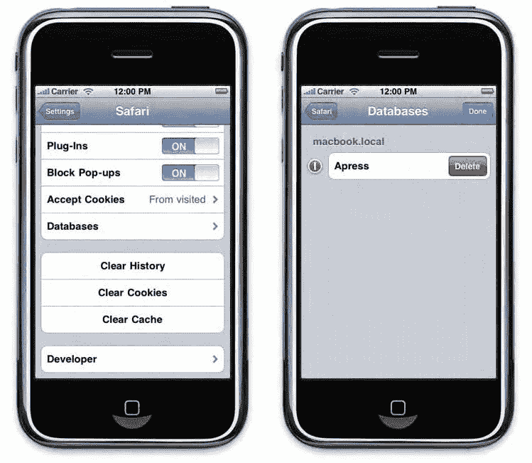

# 第 15 章：更好地处理客户端数据存储

### 删除数据库

创建数据库非常简单，但删除数据库却可能更加棘手。

无法通过 JavaScript 删除数据库，SQL 命令`DROP DATABASE`也不可用。幸运的是，删除数据库仍是可行的，但只能通过用户操作完成。这在开发阶段显然非常方便。

#### 在桌面版 Safari 中

在桌面版 Safari 及大多数基于 WebKit 的浏览器中，可通过偏好设置面板删除数据库。前往“Safari 偏好设置...”并选择“安全”选项卡，将出现如图 15-5 所示的窗口。

**图 15-5.** 桌面版 Safari 的安全面板

在此窗口中，点击屏幕底部的“显示数据库”按钮，即可触发数据库列表。你可以通过“移除”按钮删除任意数据库。这样，你便能基于干净环境，根据需要多次测试代码。

#### 在移动版 Safari 中

在移动版 Safari 中，一旦创建数据库，浏览器偏好设置中会出现新的菜单项，如图 15-6 所示。由此，可通过“设置”应用，在“Safari 数据库”选项下访问数据库列表。



**图 15-6.** 移动版 Safari 中的数据库偏好设置

只需点击屏幕右上角的“编辑”按钮，然后选择要删除的数据库即可。此处提供的选项不如桌面版丰富；例如，无法为数据库设置初始大小。

### 安全再探讨

出于安全原因，Web Storage 的相同限制同样适用于网络数据库，即对方案/主机/端口三元组的严格限制。不同子域间的数据访问可通过 HTML5 跨文档消息传递 API 实现，如第 11 章所述。

在存储关键数据（如用户密码或个人隐私信息）时，应谨慎使用 Web 数据库。建议采用不可逆加密方式（如 MD5），因为可逆加密意味着加密密钥将隐藏在代码某处。当然，由于移动版 Safari 没有 Web 检查器，你可能会合理认为数据库是安全的，但网页应用可在任意浏览器中查看，因此应采取更严格的安全措施以防范更大风险。

使用网络数据库时需特别警惕的安全风险是 SQL 注入，这在构建查询语句时应格外小心。此类攻击常见于拼接查询中，当变量中的单引号未被转义时，其他查询语句便可能被插入。由于请求可在客户端读取，这种攻击尤为容易实施。以下是用户输入名称并传入查询的示例：

```
var name = "'; DELETE FROM Source --";
var sql = "SELECT * FROM Source WHERE Name='" + name + "' AND URL IS NOT NULL";
```

分号是指令分隔符，双连字符（`--`）标记注释开始。因此，上述代码将被解释为清空`Source`表：

```
SELECT * FROM Source WHERE Name=''; DELETE FROM Source --' AND URL IS NOT NULL;
```

防范此问题的首要步骤当然是转义用户输入中的所有单引号（将其替换为两个单引号`''`），但更推荐使用安全的`executeSql()`方法，传入参数数组。

```
var sql = "SELECT * FROM Source WHERE Name=? AND URL IS NOT NULL";
transaction.executeSql(sql, [name]);
```

如前所述，这样脚本引擎将自动用表中的对应值替换每个问号，从而杜绝注入风险。在上线前，务必仔细检查代码，对查询语句及参数列表进行彻底审查。

### 离线网页应用缓存

除新增的存储功能外，借助 HTML5 带来的缓存能力，你还可以将全部或部分网页应用资源存储在用户设备上，实现离线访问。这能让你的网页应用更进一步接近原生应用体验——根据用户对应用的使用方式，他们或许感受不到在线与离线模式的区别。此外，这还能在任何情况下缩短加载时间。该规范在 iOS 2.1 及以上版本的移动版 Safari 中得到支持。

#### 工作原理是什么？

当页面首次在浏览器中加载时，会同时加载一个清单文件，其中包含处理应用资源的规则。这样，后续访问该应用时，相关文件将按预期缓存，而不会从服务器重新加载。

一旦清单文件被读取，除非清单文件本身发生变更，否则任何标记为缓存的文件都不会再向服务器检查或重新加载。清单文件是按字节精确比较的，这意味着修改日期变更不会强制重新评估。服务器上其他文件的变更，或指示文件更新版本的 HTTP 头信息，都不会触发浏览器重新下载。

但请始终牢记：缓存更新后，客户端不会立即使用新版本文件，而是需要刷新网页应用后才能生效——这与桌面计算机的更新机制类似。因此，最好能通知用户有新版本文件可用。这可通过特定 API 实现，该 API 允许你控制缓存并在文件更新期间接收通知。我们将在后续章节中介绍相关事件。

#### 清单文件

清单文件主要用于列出需要缓存的文件，以及处理网页应用元素的规则。它使用特殊的`.manifest`扩展名，是简单的 UTF-8 编码文件，必须通过`text/cache-manifest`内容类型提供，才能被浏览器正确解析。你可以使用字节顺序标记（BOM）对文件签名。需要注意的是，目前大多数服务器在默认配置下不会发送此 MIME 类型，而这对清单文件的正常工作至关重要。

**注意：** 自然，本地测试该文件并不容易，因为你无法断开与服务器的连接。运行本地测试的唯一方法是：加载应用、停止本地服务器，然后重新加载网页应用以观察显示内容。另外请注意，清单文件不会显示在 Safari Web 检查器的资源查看器部分，这不利于检查它是否已加载。
```


#### 使用缓存清单实现离线 Web 应用

通过使用以下 `cache.manifest` 文件，我们可以轻松缓存本章开发的 Web 应用示例，使其在离线或用户网速不佳时仍可使用。

```
CACHE MANIFEST

index.html
styles/main.css
scripts/main.js
```

`CACHE MANIFEST` 行必须作为文件的第一行，且不应包含多余的空格或换行。它作为文件签名，告诉浏览器这是一个缓存清单。URL 可以是绝对路径或相对路径，但需注意相对路径是相对于清单文件所在的目录而言的。因此，为保持一致性，最好将清单文件放在调用它的 HTML 文件所在的同一目录下。

> **注意：** 尽管调用清单的文件会被自动缓存，但根据规范，我们仍将其添加到清单中。

清单文件将用于包含它的文档中，并且必须通过 `<html>` 标签上的新 `manifest` 属性来调用。与其他允许拉取远程文件的属性一样，它可以接受相对路径和绝对路径。

```
<html manifest="cache.manifest">
...
```

## 第 15 章：更好地处理客户端数据存储

这是清单文件最简单的定义方式，它允许你将资源存储在设备上，而无需在每次加载页面时重新下载。你可以简单地列出要缓存的资源，但也可以更精确地控制缓存的处理方式。

### CACHE 部分

可以通过 `CACHE` 指令在清单文件的特定部分中定义要缓存的文件。你可以用类似的方式定义多个部分，这有助于组织文件指示。此外，通过添加注释可以使文件更易于阅读，如下所示：

```
CACHE MANIFEST

#### 我们的缓存资源

CACHE:
index.html
styles/main.css
scripts/main.js
```

任何类型的文件都可以注册为缓存资源，甚至包括图片或服务器端脚本。当然，服务器端脚本会在执行后被缓存，因此使用此功能时要小心。这是因为缓存应用不仅存储数据，还存储资源元数据（如 HTTP 标头）。

### NETWORK 部分

使用清单文件会使 Web 应用以离线模式运行，这意味着未在清单文件中列出的文件将不会被下载，即使设备已连接到网络。此行为可以通过 `NETWORK` 部分改变。在该部分中，你可以指定当网络可用时应从服务器下载的资源，这对于应用的动态元素特别有用。

该部分类似于 `CACHE` 部分，保存了一个在线白名单。然而，该部分的功能有所不同：每个 URL 都是一个前缀匹配模式。因此，你可以仅通过列出目录来定位该目录下的所有资源。注意不要多次无用地列出相同的前缀。

在我们的上一个示例中，如果清单文件中只包含 `CACHE` 部分，Web 应用将无法正常工作，因为用于获取 RSS 源的代理将无法访问。要解决此问题，我们只需在清单中添加以下内容：

```
NETWORK:
proxy.php
```

我们的代理使用查询字符串中的 `url` 参数来知道应该下载哪个 feed，但由于 `proxy.php` 是一个前缀，浏览器会授权访问完整的 URL。

你也可以使用 `*` 通配符来允许访问所有资源。对于未在 `CACHE` 部分（优先级高于其他部分）列出的资源，这一规则自然会被考虑。当然，这使编写清单文件变得更加容易，并降低了忘记文件导致应用功能不完整的风险。

### FALLBACK 部分


对于需要网络但未缓存资源的场景，如果网络不可用，可以定义一个或多个后备（fallback）部分。

在这些部分下，行由空格或制表符分隔的元素对组成。第一个元素是后备命名空间，定义了一个前缀匹配模式，用于定位来自某些 URL 的一组资源，这与 `NETWORK` 部分的做法相同。所有匹配此命名空间的资源都将被缓存，如果第二个元素列出的资源不可用，则将使用该缓存资源。

为了观察此部分的行为，我们将指定一个静态的 RSS 提要（`default.xml`）作为默认值，用于网络不可用的情况。

```
<?xml version="1.0" encoding="UTF-8" ?>

<rss version="2.0">

<channel>

<title>Offline Application Cache</title>

<description />

[<link>http://www.apress.com/</link>](http://www.apress.com/%3C/link)

<item>

<title>Fallback Element</title>

<description>This is a fallback resource cached to be used

when the network is not available.</description>

[<link>http://www.apress.com/</link>](http://www.apress.com/%3C/link)

[<guid>http://www.apress.com/guid/</guid>](http://www.apress.com/guid/%3C/guid)

<pubDate>Mon, 01 Aug 2011 00:00:00 +0000</pubDate>

</item>

</channel>

</rss>
```

相关文件将在清单中列出如下：

```
FALLBACK:
proxy.php default.xml
```

因此，当网络不可用时，将使用 RSS 文件来代替代理调用，并为将要收集的每个提要添加唯一可用的元素。此部分不仅可用于网络不可用的情况，还可用于处理任何其他丢失文件的问题，例如 HTTP 404 错误。

但请注意，浏览器不一定使用最具体的前缀来获取相关资源；因此，声明顺序很重要。在以下示例中，第一行将用于所有后备情况，因为它将匹配所有资源，包括那些会被第二行匹配的资源。

**第 15 章：更好地处理客户端数据存储**

```
FALLBACK:
./ any.html
proxy.php default.xml
```

在这种情况下，你应该首先指定最具体的前缀，然后依次是较不具体的前缀。同时，考虑规划一个组织良好的目录结构，以使该过程更简单。这无论如何都可能对你的目录结构有益。

### 使用 JavaScript 控制缓存

HTML5 允许通过附加到 `ApplicationCache` 对象的 JavaScript API 来控制缓存。每个拥有清单的页面都会自动附加一个 `ApplicationCache` 对象实例；它可以通过 `DOMWindow` 对象访问。

```
var cache = window.applicationCache;
```

通过此实例，你将能够检查缓存的状态，例如通过检查清单文件是否已被考虑，读取其 `status` 属性。

表 15-4 显示了当前页面缓存的所有可能状态。如果是 `UNCACHED` 状态，则表示你的清单文件尚未加载。在这种情况下，你通常应检查内容类型是否正确以及文件是否没有错误。

**表 15-4.** `applicationCache` 状态常量

**常量** | **描述**
--- | ---
`cache.UNCACHED` (0) | 文档未被缓存。
`cache.IDLE` (1) | 文档可从缓存获取且是最新版本。这是页面首次加载，或应用在更新后重新加载且所有资源已加载完毕时的状态。
`cache.CHECKING` (2) | 文档可从缓存获取，并且正在检查更新。
`cache.DOWNLOADING` (3) | 文档可从缓存获取，并且当前正在下载更新或新资源。
`cache.UPDATEREADY` (4) | 文档可从缓存获取，并且已完成下载更新或新资源。这些资源将在下次访问应用时可用。
`cache.OBSOLETE` (5) | 可从缓存获取的文档已过时，这意味着清单不再可用。浏览器收到 HTTP 404 错误。


好的，作为高级文档工程师和翻译员，我将遵循您的指示，完成英文文本的翻译工作。


# 第 15 章：更好地处理客户端数据存储

`(Not Found)` 状态或 `410` 状态 (`Gone`)。

这可以用于检查浏览器是否已下载了新版本并通知用户：

```
if (window.applicationCache.status == window.applicationCache.UPDATEREADY) {
  if (window.confirm("A new version is available.\nDo you want to use it now?")) {
    window.location.reload();
  }
}
```

此状态并不一定会立即可用。如果在资源加载时检查此状态，则会发送 `CHECKING` 状态。因此，为更新和下载过程添加监听器会很有用，我们很快就会看到这一点。

您还可以直接使用 JavaScript 控制缓存，使用表 15-5 中介绍的方法。

**表 15-5. 缓存相关方法**

| 方法 | 描述 |
|--------|-------------|
| `cache.update()` | 如果服务器上有资源可用，则强制验证并更新缓存。如果文档没有关联的缓存，则会发送一个 `INVALID_STATE_ERR` 异常。 |
| `cache.swapCache()` | 如果可用，则激活新的缓存资源 (`UPDATEREADY`)。否则会抛出一个 `INVALID_STATE_ERR` 异常。 |

例如，即使状态设置为 `IDLE` 且清单文件刚刚被修改，调用 `update()` 方法也会强制重新加载缓存。在新资源下载完成后，状态将变为 `UPDATEREADY`。调用 `swapCache()` 将强制使用新资源，并且状态将返回到 `IDLE`。

当然，当前页面不会自动更新，您必须等待下一次启动 Web 应用程序时用户才能看到更改。但是，您也可以使用 JavaScript 读取新资源。如果对 `update()` 的调用成功并且下载完成，您可以按如下方式调用更新后的资源：

```
/* 更新一个 iframe */
var iframe = document.getElementById("myIframe");
iframe.src = iframe.src;

/* 更新文档中的第一张图片 */
var image = document.images[0];
image.src = image.src;
```

您也可以关联一个新缓存的资源：

```
image.src = "newlyCachedImage.png";
```

在 Safari 中，令人惊讶的是，尽管 `swapCache()` 旨在切换应用程序缓存，但在调用 `swapCache()` 之前缓存就已经可用。因此，您应该仅在调用 `swapCache()` 之后才执行此类操作，而不是仅仅在调用 `update()` 之后。

# 第 15 章：更好地处理客户端数据存储

### 响应应用程序缓存发送的事件

在应用程序更新的执行周期中，会发送一系列事件，让应用程序了解正在发生的事情并做出相应反应。这些事件列在表 15-6 中。

**表 15-6. 缓存更新事件**

| 事件 | 描述 |
|-------|-------------|
| `checking` | 浏览器正在尝试首次下载清单，或正在检查是否有可用的更新。 |
| `noupdate` | 清单文件没有变化。 |
| `downloading` | 已开始下载清单中列出的资源，无论是为了首次获取资源还是更新缓存。 |
| `progress` | 浏览器正在下载清单中列出的资源。 |
| `cached` | 清单中列出的资源已全部下载完毕，应用程序现在可从缓存中使用。此事件仅在首次下载时发送。 |
| `updateready` | 缓存中的资源已全部重新下载完毕。 |
| `obsolete` | 清单不再可用，并且服务器已发送 `404` 或 `410` 状态。下次启动应用程序时，缓存将被删除。 |
| `error` | 未找到清单或清单包含错误。 |

可以使用常规的 DOM 方法或使用 `ApplicationCache` 对象属性来注册这些事件。

```
window.applicationCache.addEventListener("updateready", doSomethingHandler, false);
/* 或者... */
window.applicationCache.onupdateready = doSomethingHandler;
```

事件序列必然以 `checking` 事件开始，因为文档在 `<html>` 标签中持有对清单的引用。


然后，如果文档没有关联的应用程序缓存，且清单文件不包含错误，则会触发`downloading`事件，随后触发一系列`progress`事件，直至所有列出的资源都已获取完毕。该序列将以`cached`事件结束，表明应用程序缓存已创建且该 Web 应用程序现已被缓存。

如果文档已经关联了应用程序缓存，并且浏览器未检测到清单文件有任何变更，则会发送一个`noupdate`事件，序列将立即停止。否则，序列将与之前相同，但会以`updateready`事件而非`cached`事件结束。在这种情况下，您可以像之前展示的那样调用`swapCache()`方法。

如果清单文件无法访问，或清单文件包含错误（例如签名问题、资源不可用等），序列会被中断并触发`error`事件。此外，如果缓存已存在但清单文件未找到，则会发送一个`obsolete`事件，并且该缓存将从设备中删除。

规范计划将`progress`事件设为`ProgressEvent`类型，允许您跟踪下载进度。正如在讨论 Ajax 的第 12 章中所阐述的，这种类型将使您能够通过`lengthComputable`属性判断下载是否可计算，进而使用`loaded`和`total`属性来估算加载时间。

目前，`progress`事件类型在 iOS 上不受支持，在桌面版 Safari 中也未实现。它将返回一个常规的`Event`对象。不过，您仍然可以通过回调函数来利用该事件，因为无论如何，进度是否可计算都无法得到保证。

### 删除缓存

一旦 Web 应用被缓存，就无法再将其删除。实际上，用户清空浏览器缓存并不会影响离线应用缓存。因此，用户删除缓存的唯一方法是再次访问该站点，并希望能找到卸载该应用的选项。

如果您的清单文件是动态文件（例如 PHP 脚本），则可以通过设置 cookie 来提供此选项。该 cookie 将由清单脚本读取，以便在需要删除缓存时返回`404`错误。

```html
<script>
function switchMode(online) {
  var now = new Date().getTime();
  var tenYears = 1000 * 60 * 60 * 24 * 365 * 10;
  var expires = new Date(now + tenYears) * (online ? +1 : -1);
  document.cookie = "online=true; expires=" + expires;
}
</script>
...
<div class="header-wrapper">
  ...
  <button onclick="switchMode(true)">无缓存</button>
</div>
...
```

PHP 清单文件可能如下所示：

```php
<?php
$code = ($_COOKIE['online'] == 'true') ? 410 : 200;
header('Content-type: text/cache-manifest', true, $code);
?>CACHE MANIFEST
```

当用户点击**无缓存**按钮时，将创建一个值为布尔值`true`的新在线 cookie。其过期日期设置得足够久远，以确保不会过期。

再次访问清单文件时，脚本会使用`$_COOKIE`哈希表检查该 cookie，并根据`online`的值发送相应的响应。最终，Web 应用将收到一个`obsolete`事件，如前所述。

### 用户是否在线？

无论当前文档是否关联了离线应用缓存，您都可以轻松检查网络状态。该信息可以通过`navigator`对象的`onLine`属性获取。这样一来，如果网络不可用，就可以阻止从 JavaScript 下载某些元素（例如之前使用的 RSS 订阅源），从而避免访问回调内容。

```javascript
function refresh(db) {
  /* 始终显示先前的内容 */
  processFeed(db);
  /* 如果未在线，则不尝试下载订阅源 */
  if (!window.navigator.onLine) {
    return;
  }
  ...
}
```


#### 除了此属性外，移动版 Safari 还支持两个新事件：当网络状态发生变化时，会发送 `online` 事件（若 `onLine` 属性从 `false` 变为 `true`）或 `offline` 事件（用户断开连接）。这能让您精细调节应用的加载和行为，以实现最佳用户体验。

## 总结

当然，您可以像我们在第 6 章中为生成类似 Photos 相册的图片列表那样，使用 PHP 或任何其他服务器端脚本语言动态生成清单文件。这为开发复杂而灵活的应用开辟了无限可能。

让您的应用在在线和离线状态下都能令人满意地运行，是实现类原生应用体验的重要一步，而不同的存储 API 能让您将数据行为定制为满足应用的大部分需求。

将此与全屏模式、用户界面以及类似 iOS 的行为相结合，用户会怀疑自己当初为何要去 App Store。

``

467

# 索引

### 特殊字符

隐藏 Web 应用的地址栏，第 85–86 页

`adjust()` 方法，第 389 页

与数字

`adjustHeight()` 函数，第 86 页

`adjustVideo()` 函数，第 229 页

`!important` 声明，第 115 页

AdLib 框架，第 69 页

`#coverflow` 容器，第 276 页

广告，得体地展示，第 92–95 页

`$_COOKIE` 哈希表，第 466 页

高级音频编码 - 低复杂度

`$_SERVER['DOCUMENT_ROOT']` 变量，

(AAC-LC)，第 250 页

第 24 页

高级包装工具 (APT)，第 22 页

`$data` 变量，第 357 页

高级选项卡

`%` 按钮，第 59 页

HandBrake，第 253 页

`%d` 格式，第 48 页

Safari，第 30 页

`%f` 格式，第 48 页

Web 应用的优势，第 71–73 页

`%i` 格式，第 48 页

无需 App Store，第 72–73 页

`%o` 格式，第 48 页

跨平台，第 71–72 页

`%s` 格式，第 48 页

硬件访问，第 72 页

使用 CSS 保持 3D 效果，第 265–266 页

A-GPS（辅助全球定位

系统），第 397 页

## A

Ajax，第 343–365 页

`a` 命令，Vi 实用程序，第 16, 25 页

构建 HTTP 请求，第 343–348 页

AAC（MPEG-4 高级音频编码），

事件，第 346–347 页

第 250 页

GET 和 POST 请求，第 344–

AAC-LC（高级音频编码 - 低

345 页

复杂度），第 250 页

HTTP 状态码，第 347–348 页

`abort()` 方法，第 232, 346 页

`open()` 方法，第 344 页

`Access-Control-Allow-Origin` 标头，第 359 页

请求状态，第 345–346 页

精度，与手势，第 394–395 页

和 `XMLHttpRequest` 对象，第 344 页

`activate()` 方法，第 241 页

使用 JSON 进行客户端渲染，第 354–

自适应多速率 (AMR)，第 251 页

第 356 页

自适应样式方法，第 152 页

格式化变量，第 355–356 页

ADC（苹果开发者连接），第 10–11 页

使用模板变量，第 354–355 页


跨域通信，第 356–360 页

“添加为代码片段”上下文菜单选项，使用 CORS，第 359–360 页

Komodo Edit 工具，第 5 页 使用 JSONP，第 357–358 页

添加端口选项，第 20 页 使用代理，第 356–357 页

添加到主屏幕选项，第 77 页

处理过程中的反馈，第 363–365 页

添加网站上下文菜单选项，第 26 页 以及过长的等待时间，第 364–

`addColorStop()` 方法，第 174 页 第 365 页

`addEventListener()` 方法，第 285、310–311 页 视觉反馈，第 363–364 页

第 345、367–369、371、373 页

请求，缓存，第 435–440 页

添加缓存功能，第 438–440 页 第 467 页


第 468 页

# 索引

基本文档，第 435–438 页

应用标题栏，其中的按钮，第 150–152 页

返回格式，第 348–353 页

App Store，与 Web 应用，第 72–73 页 以及 JSON 安全注意事项，

`appendChild()` 方法，第 351 页 第 353 页

`appendData()` 函数，第 442 页 解析 JSON，第 352–353 页

Apple Developer Connection (ADC)，第 10–11 页 解析 XML，第 349–352 页

Apple Lossless Audio Codec (ALAC)，第 250 页

Twitter 趋势示例，第 360–363 页

`apply()` 方法，与 JavaScript 的执行上下文，第 308–310 页 Feed 源，第 360 页

`applySVGBackground()` 函数，第 204 页 渲染数据，第 360–363 页

`ajax.DONE (4)` 常量，第 345 页

APT (Advanced Packaging Tool)，第 22 页

`ajaxHandler()` 函数，第 345、347、350 页

`apt-get` 命令，第 22 页

`ajax.HEADERS_RECEIVED (2)` 常量，第 345 页

弧线，在 `<canvas>` 标签中，第 177–178 页

`ajax.LOADING (3)` 常量，第 345 页

`arcTo()` 方法，第 177 页

`ajax.OPENED (1)` 常量，第 345 页

`arguments` 属性，第 309 页

`ajax.UNSENT (0)` 常量，第 345 页

辅助全球定位系统 (A-GPS)，第 397 页

ALAC (Apple Lossless Audio Codec)，第 250 页

`async` 参数，第 344 页

`alert()` 方法，第 46 页

`atan2()` 方法，第 416 页

对齐，[CSS 盒子模型，第 161–162 页 文本对齐，在 `<canvas>` 标签中，第 186–187 页

`ATTACHED` 状态，第 380 页

音频，[在 Web 应用中嵌入，第 224–225 页

支持的格式，用于 Web 应用中的媒体内容，第 250–251 页

`audio codec` 选项，HandBrake，第 255 页

`Audio tab`，HandBrake，第 255 页

`<audio>` 标签，第 219、225、233、250 页

`apt-get` 命令，第 22 页

`arcTo()` 方法，第 177 页

`arguments` 属性，第 309 页

辅助全球定位系统 (A-GPS)，第 397 页

`async` 参数，第 344 页

`atan2()` 方法，第 416 页

`ATTACHED` 状态，第 380 页

在 Web 应用中嵌入音频，第 224–225 页

Web 应用中媒体内容支持的格式，第 250–251 页

`audio codec` 选项，HandBrake，第 255 页

`Audio tab`，HandBrake，第 255 页

`<audio>` 标签，第 219、225、233、250 页

`Audits pane`，在 Web Inspector 中，第 61–63 页

`<animateTransform>` 标签，第 209 页


 AUTOINCREMENT 字段类型，448 

动画指南针，在指南针 Web 应用中，

 autoplay 属性，224 

 427–429 

 平均比特率选项，HandBrake，254 

 animation-delay 属性，283 

 平均列，59 

 animation-duration 属性，283 

 animationend 事件，285 

 animationiteration 事件，285 

■ B

 animation-iteration-count 属性，283, 285 

 `<b>` 标签，290, 292, 294 

 animation-name 属性，282–283 

背面可见性，三维

 animationName 属性，285 

 CSS 效果，266–268 

 animation-name 属性，285 

 background-clip 属性，126–127 

 CSS 动画，282–285 

 background-color 属性，84 

 动画事件，285 

 background-image 属性，205, 286 

 动画演化曲线，284–285 

 background-origin 属性，125–126 

 动画关键帧，282–283 

 background-repeat 属性，175 

 动画属性，283–284 

 CSS 背景，124–135 

 动画启动与计时，283 

 animationstart 事件，285 

 background-clip 属性，126–127 

 background-origin 属性，125–126 

 背景裁剪，128 

Apache

 在 Mac OS 上，14–15 

 多层背景，134–135 

 使用 Apache 的照片画廊，130–133 

 为 Web 服务器配置 Apache 虚拟主机，24–25 

 背景尺寸，128–130 

 Apache 配置文件，25 

 background-size 属性，129–130, 202 

 apache2 配置文件，15 

 `_base` 属性，308 


索引

 469 

 `<canvas>` 标签中文本的基线，185–186 

 cached 事件，464 

 BEGIN TRANSACTION 命令，444 

缓存位置，在位置感知 Web

 beginPath( ) 方法，176 

 应用中，402 

 bezierCurveTo( ) 方法，178 

 cache.DOWNLOADING (3) 常量，462 

 big.css 文件，114 

 cache.IDLE (1) 常量，462 

 .bigSpinner 类，171 

 cache.manifest 文件，459 

 bind( ) 函数，317 

 cache.OBSOLETE (5) 常量，462 

 black 选项，content 属性，80 

 cache.swapCache( ) 方法，463 

black-translucent 选项，content 属性，

 cache.UNCACHED (0) 常量，462 

 80 

 cache.update( ) 方法，463 

 `<body>` 标签，37 

 cache.UPDATEREADY (4) 常量，462 

 BOM（字节顺序标记），459 

 calcMode 属性，209 

 border 属性，154 

 calcPosition( ) 方法，230 

 border-image 声明，146 

 calculator.html 文件，327, 339 

 border-image 属性，288 


# 索引条目排版

`call()`方法，以及执行上下文

`border-radius`属性, 85

JavaScript, 308–310

手势的边界框对象, 388–389

用于 JavaScript 调试的`Call Stack`面板，

CSS 的盒模型, 158–162

53

效率, 158–159

回调函数，以及执行上下文

灵活性, 160–161

JavaScript, 310–312

排序, 159–160

处理器的调用优先级, 367–368

填充与对齐, 161–162

使用 CSS 禁用`callout`, 120–121

CSS 的盒阴影, 148–149

`Calls`列, 59

`box-align`属性, 161–162

取消多点触控事件, 376

`box-direction`属性, 159–160

`canplay`事件, 232

`box-flex`属性, 161, 291

`canplaythrough`事件, 232

`box-ordinal-group`属性, 159

Canvas API, 171–175, 181, 189, 191, 201,

`box-orient`属性, 160

208

`box-pack`属性, 161–162

`<canvas>`标签, 165–195

`box-shadow`属性, 147–148

裁剪到绘图区域, 188–189

`box-sizing`属性, 143

颜色, 174

JavaScript 调试的断点, 50–

合成与透明度, 189–

51

190

浏览器, 6–7

`getContext()`方法, 167–172

Firefox, 7

渐变, 174–175

Internet Explorer, 7

操作像素, 191–195

Opera, 7

图案, 175

以及对 Web 标准的支持, 8

保存与恢复状态, 183

WebKit 引擎, 6–7

阴影, 187–188

`buffered`属性, 227

形状, 175–181

`buildList()`函数, 242, 246

弧线, 177–178

应用标题中的按钮, 150–152

基础知识, 172–173

`buttonState()`函数, 364

曲线, 178–179

字节顺序标记（BOM）, 459

线条样式, 179–180

`Inetpub\wwwroot`目录, 21

原生样式菜单, 180–181

`Windows\System32\drivers\`目录, 24

文本, 183–187

对齐, 186–187

基线, 185–186

章 C

绘制, 184–185

变换, 181–183

`CACHE`部分, 460–461

`captions`关键字, 240

`cache.CHECKING` (2) 常量, 462


470

索引

捕获阶段，以及触摸事件, 369–

安全与隐私考量,

370

435

`Cédil e`应用, 212

将客户端数据发送到服务器, 441–


`center` 属性，404  
442

`changedTarget` 属性，376  
`sessionStorage`，行为，433–  
`changedTouches` 属性，374–375  
434

`changeVersion()` 方法，455  
使用，432–433

章节类型，243

客户端渲染，使用 JSON，354–356

章节，用于 Web 应用中的媒体内容，  
格式化变量，355–356  
243–247  
使用模板变量，354–355

`chapters` 关键字，240

`clip()` 方法，188–189  
`CHAR` 字段类型，445

裁剪  
`<canvas>` 标签，到绘图区域，188–189  
`checkBuffered()` 函数，229  
使用 CSS 对背景进行裁剪，128  
`checkDatabase()` 函数，444

检查事件，464  
时钟应用，102–103  
`CHECKING` 状态，463  
`closePath()` 方法，176–177  
`checkPlayed()` 函数，229  
避免杂乱，96–97  
`childWin` 窗口，333  
CMS（内容管理系统），18

`chown` 命令，22  
Cocoa Touch 框架，129

`<circle>` 标签，197  
JavaScript 中的代码隔离，314–317  
类选择器，39  
代码属性，452

`clear()` 方法，48, 433–434  
颜色  
用于 `<canvas>` 标签，174  
`clearInterval()` 方法，311  
使用 CSS，135–137  
`clearWatch()` 函数，411–412  
颜色的 Alpha 通道，135–136

`clickHandler()` 函数，87  
客户端数据存储，431–466  
`hsl()` 定义，136–137  
离线 Web 应用缓存，458–466

`color-stop()` 函数，140–142  
检查网络状态，466  
`color-stop(0, <color>)` 函数，140  
使用 JavaScript 控制，462–463  
`color-stop(1, <color>)` 函数，140  
删除，465–466  
`column-gap` 属性，154  
工作原理，458–459  
`column-rule` 属性，154  
清单文件，459–462  
使用 CSS 进行列布局，152–157  
响应其发送的事件，464–465  
列流，152–155


# 索引

## A

- `Web Database API`, 442–458
- `magazine` 示例, 155–157
  - 向表格添加数据, 446–447
  - `column-width` 属性, 155
  - 创建表格, 444–446
  - `COMMIT` 命令, 444
  - 删除数据库, 455–457
- `Communication API`, 322
  - 处理事务和查询错误, 452–454
  - 通过版本控制维护连贯访问, 454–455
  - 打开数据库, 442–444
  - 从表格查询数据, 447–449
  - 安全问题, 457–458
  - 更新数据, 449–451
  - 使用数据库替代存储, 451–452
- `Web Storage API`, 431–442
  - 缓存 Ajax 请求, 435–440
  - 存储区域修改通知, 434

## C

- `compass web app`, 416–430
  - 向文档添加元素, 424–425
  - 制作指南针动画, 427–429
  - 创建移动端元素, 416–418
  - 表盘光泽效果, 421
  - 刻度, 418–419
  - 指针, 420–421
  - 准备文档以接收位置数据, 425–426
  - 防止指针抖动, 429–430
  - 渲染指南针, 422–424
  - 使用位置数据, 426–427
- `compass.css` 文件, 424, 427
- `compass.js` 文件, 417, 424
- `completed` 事件，用于 CSS 过渡, 274
- `<canvas>` 标签的`compositing`合成, 189–190
- `computed Style`（计算样式）, 39
- 控制面板中的`Computer Management`（计算机管理）选项, 26
- `conext.arc(x, y, radius, startAngle, endAngle, anticlockwise)` 方法, 176
- `CONNECT` 方法, 344
- 记录到`console`控制台, 46–48
- `console.assert(condition)` 函数, 47
- `console.count(name)` 函数, 47
- `console.debug(format, ...)` 函数, 47
- 使用 CSS 禁用 `copy/paste`（复制/粘贴）功能, 119–120
- `CORS`（跨域资源共享），使用该方式实现 Ajax 的跨域通信, 359–360
- `Cover Flow` 示例，使用 CSS, 274–282
  - 动画效果, 278–281
  - 翻转当前封面, 280
  - 主文档, 275–278
  - 防止意外行为, 281–282
- `coverflow.js` 文件, 276
- `CREATE DATABASE` 命令, 442, 444

---

471


console.dir(object); 函数, 47

从项目菜单创建模板选项，

console.dirxml(node); 函数, 47

Komodo Edit 实用工具, 88

console.error(format, .); 函数, 47

createBullet() 函数, 408

console.groupEnd(); 函数, 47

createElement() 方法, 206, 224

console.group(format, .); 函数, 47

createElementNS() 函数, 210

console.info(format, .); 函数, 47

createElements() 方法, 379–380

console.log() 函数, 47

createEvent() 方法, 383

console.log(format, .); 函数, 47

createIcons() 函数, 295

console.profile() 函数, 57

createImageData() 方法, 195

console.profileEnd() 函数, 57

createPattern() 方法, 175

console.profileEnd(name); 函数, 47

createSchema() 函数, 447

console.profile(name); 函数, 47

createShadows() 函数, 295

console.timeEnd(name); 函数, 47

跨文档通信, 321–341

console.time(name); 函数, 47

封装 API, 335–339

console.trace(); 函数, 47

实现脚本, 338–339

console.warn(format, .); 函数, 47

用于宿主文档的对象, 335–337

constructor 属性, 308

用于部件的对象, 337–338

构造函数，在 JavaScript 中, 303–304

示例, 325–330

content 属性, 76, 80

处理响应, 329–330

内容管理系统 (CMS), 18

托管文档, 327

content.html 文件, 333

主文档, 325–326

Content-Type 标头, 345

发送消息, 328–329

`context.arcTo(cpx1, cpy1, cpx2, cpy2,`

使用 HTML5, 323–325

`radius)` 方法, 176

API, 323–324

`context.beginPath()` 方法, 176

数据类型支持, 324

`context.bezierCurveTo(cp1x, cp1y, cp2x,`

与安全性, 325

`cp2y, x, y)` 方法, 176

局限性, 322–323

`context.closePath()` 方法, 176

Mobile Safari 行为, 330–331

`context.fill()` 方法, 176

用于子域, 340–341

`context.lineTo(x, y)` 方法, 176

更改域属性, 340–

`context.moveTo(x, y)` 方法, 176

341

`context.quadraticCurveTo(cpx, cpy, x, y)`

与安全性, 341

方法, 176

在窗口之间, 332–335

`context.rect(x, y, w, h)` 方法, 176

通知页面已加载, 333–334

`context.stroke()` 方法, 176

window 对象的属性, 334–


# 索引

- controls 属性，225 页
- 335 页
- Cookies 面板（存储检查器中），61 页
- 跨文档消息传递 API，324、340–
- 341 页
- 
- 472 页
- 跨域通信（Ajax 相关），356–
- 借助跨域通信实现复制/粘贴功能，119–
- 360 页
- 120 页
- 使用 CORS，359–360 页
- 使用 JSONP，357–358 页
- 渐变，137–142 页
- 渐变的颜色处理，140–142 页
- 使用代理，356–357 页
- 尺寸设置，139 页
- 跨域资源共享（CORS）
  - 359–360 页
- 选择器，121–124 页
- 跨平台 Web 应用，71–72 页
- 概述，121–122 页
- CSS，117–163、257–298 页
  - 动画，282–285 页
  - 动画事件，285 页
  - 动画演变曲线，284–285 页
  - 关键帧，282–283 页
  - 动画属性，283–284 页
  - 动画的启动与定时，283 页
  - 特殊效果应用，285–288 页
  - 背景，124–135 页
  - background-clip 属性，126–127 页
  - background-origin 属性，125–126 页
  - 背景裁剪，128 页
  - 多层背景，134–135 页
  - 照片画廊应用，130–133 页
  - 背景尺寸设置，128–130 页
  - 边框，142–147 页
  - 图片绘制边框，145–147 页
  - 圆角边框，143–145 页
  - 边框尺寸设置，142–143 页
  - 盒子模型，158–162 页
  - 盒子模型效率，158–159 页
  - 盒子模型灵活性，160–161 页
  - 盒子模型排序，159–160 页
  - 盒子模型的打包与对齐，161–162 页
  - 应用标题栏中的按钮，150–152 页
  - 颜色，135–137 页
  - 颜色的 Alpha 通道，135–136 页
  - hsl() 定义，136–137 页
  - 列布局，152–157 页
  - 列流，152–155 页
  - 重复布局模式，122–124 页
  - 阴影，147–150 页
  - 盒子阴影，148–149 页
  - 阴影示例，150 页
  - 文字阴影，149–150 页
  - 遮罩，287–288 页
  - 倒影，286–287 页
  - 遮罩示例：标签栏，288–298 页
  - 标签栏图标，292–296 页
  - 图片图标，297–298 页
  - 初始标签栏，289–291 页
  - 图标占位符，291–292 页
  - 专门针对 WebKit 的适配，162–163 页
  - 三维效果，262–268 页
  - 背面可见性，266–268 页
  - 三维变换函数，263 页
  - 保持 3D 效果，265–266 页
  - 设置透视，263–265 页
  - 元素变换，257–262 页
  - 使用矩阵自定义变换，261–262 页
  - 扭曲变形，261 页
  - 变换原点，262 页
  - 旋转，259–260 页
  - 缩放，260 页
  - 变换支持情况，258 页


# 索引

移动元素坐标, 260

杂志示例, 155–157

过渡效果, 270–274
- 与 JavaScript 结合使用, 268–270
- 完成事件, 274
- 访问当前样式, 268
- 启动, 271–272
- 用于计算矩阵的原生对象
- 属性, 271
- 268–270
- 时序函数曲线, 272–273

Cover Flow 示例, 274–282
- 用户反馈, 118–119
- 动画效果, 278–281
- 在 Web Inspector 中, 38–40
- 翻转当前封面, 280
- `cubic-bezier( )`函数, 273, 284
- 主文档, 275–278

cURL API, 356
- 防止意外行为
- `curl_exec( )`函数, 357
- 281–282
- `curl_getinfo( )`函数, 357
- 禁用
- `curl_init( )`函数, 357
- 标注, 120–121

当前位置，在位置感知网络应用中
- 399–402


# 索引

473

- 精确度, 402
- 调用堆栈面板, 53
- 缓存位置, 402
- 与异常处理, 54–55
- 处理请求错误, 401
- 交互式 Shell, 48
- 经度和纬度, 399–400
- 记录到控制台, 46–48
- 超时, 402
- 作用域变量面板, 54
- `currentTarget`属性, 369–370
- 步进按钮, 52
- `currentTime`属性, 227, 233, 245
- 监视表达式面板, 53
- Curtis, Nick, 216
- Linux, 22
- <canvas>标签中的曲线, 178–179
- Mac OS, 14–16
- `Cut( )`函数, 217
  - Apache, 14–15
  - PHP 脚本引擎, 15–16

## D

- Web Inspector, 34–44
  - 审计面板, 61–63
  - CSS, 38–40
- Dashcode, 5–6
  - 开发者工具窗口, 35–36
  - 数据处理器，在位置感知网络应用中
    - 元素检查器, 37–38
    - 错误通知, 36
    - 方向选择, 415–416
    - 度量面板, 40–43
    - 两点之间的距离, 413–414
    - 更精确的两点距离
      - 414–415
    - 性能分析面板, 57–60
    - `data`属性, 242
    - 资源查看器, 44–46
    - 数据类型支持，用于跨文档通信
      - 与 HTML5, 324
    - 搜索功能, 43–44
    - 存储检查器, 60–61
    - 时间线面板, 55–57
    - Web 应用服务器, 13–14
    - `DATETIME`字段类型, 445
    - 数据库面板，在存储检查器中, 61
    - 多主机, 23–24
    - 调试控制台, Safari, 32–33
    - 测试, 27–28
    - 默认行为，阻止事件
    - 虚拟主机, 24–27


# 索引

WebKit 开发者工具，29–34

触摸操作，370

开发菜单，30–32

默认选项，content 属性，80

与移动版 Safari，32–34

defaultPlaybackRate 属性，233

Windows，16–22

default.xml 文件，461

PHP 脚本引擎，17–20

`__defineGetter__` 方法，314

安全设置，20–22

`<defs>` 标签，208

开发工具，3–11

descriptions 关键字，240

ADC，10–11

用户体验设计指南，105–

浏览器，6–7

109

Firefox，7

适应性，105–106

Internet Explorer，7

使用列表，106–109

Opera，7

桌面版 Safari，使用其删除数据库，456

WebKit 引擎，6–7

DETACHING 状态，381

源代码编辑器

开发菜单，用于 WebKit 开发者工具，

Dashcode，5–6

30–32

Komodo Edit，3–5

Safari 开发选项，30

测试

Web Inspector 中的开发者工具窗口，

使用真机，10

35–36

使用 iPhone 和 iPad 模拟器，

`/Developer/Platforms/iPhoneSimulator.platfo`

9–10

`rm/Developer/Applications/` 文件夹，

与 Web 标准，8–9

9

device-height 常量，76

开发环境，13–63

device-width 常量，76, 106

JavaScript 调试，46–57

与断点，50–51


474

索引

DHCP（动态主机配置协议）

获取视频信息，221–222

28

占位符，222–223

dial shine，在指南针 Web 应用中，421

播放，222–223

禁用缓存选项，Safari 开发菜单

emptied 事件，232

32

启用 Vi 模拟选项，Komodo Edit

`disableDefaultUI` 属性，404

实用工具，16

display, table-cell 规则，115

`enableHighAccuracy` 选项，402

`displayName` 属性，53

编码媒体（用于 Web 应用），251–256

两点之间的距离，在基于位置的 Web 应用中，

[使用 HandBrake，253–256

413–415

使用 QuickTime Player，251–253

使用 CSS 扭曲元素，261

`end()` 方法，226

`<div>` 元素，133, 386

ended 事件，232–233

DocumentEvent 接口，DOM，383

error 事件，346, 464

`document.getElementById()` 方法，324

错误通知，在 Web Inspector 中，36

`dog.makeNoise()` 方法，307, 310

`error.code` 属性，401

DOM，使用 JavaScript 解析，350

`error.CONSTRAINT_ERR` (6) 常量，453

DOMContentLoaded 事件，45


error.DATABASE_ERR (1) 常量，453

`DOMWindow.navigator.platform` 属性

error.message 属性，401

225

error.QUOTA_ERR (4) 常量，453

`downloading` 事件，464

错误，在定位感知的 Web 应用中

`draw()` 方法，318

401

`drawImage()` 方法，192–193，295

error.TIMEOUT_ERR (5) 常量，453

绘制区域，裁剪 `<canvas>` 标签至

error.TOO_LARGE_ERR (3) 常量，453

188–189

error.UNKNOWN_ERR (0) 常量，453

`drawMarker()` 函数，409

error.VERSION_ERR (2) 常量，453

`DROP DATABASE` 命令，455

`esc` 命令，Vi 实用工具，16

占位元素，363](#index_split_000.html#385)

`/etc/` 目录，23–24

`duration` 属性，227，233

`eval()` 函数，352–353

`durationchange` 事件，232

事件监听器窗格，用于指标窗格，42–

动态主机配置协议

43

（DHCP），28](#index_split_000.html#50)

`event.AT_TARGET (2)` 常量，370

`event.BUBBLING_PHASE (3)` 常量，370

`event.CAPTURING_PHASE (1)` 常量，370

■ E

`event.data` 属性，323–324

`event.key` 属性，434

`ease` 关键字，273

`EventListener` 接口，371

`ease-in` 关键字，273

`event.newValue` 属性，434

`ease-in-our` 关键字，273

`event.oldValue` 属性，434

`ease-out` 关键字，273

`event.origin` 属性，323

编辑断点上下文菜单选项，51

`eventPhase` 属性，369

编辑按钮，457

事件

编辑模式，Vi 实用工具，25

用于 Ajax HTTP 请求，346–347

`elapsedTime` 属性，274，285

用于 CSS 动画，285

元素坐标，用于 CSS，260

用于 Web 应用中的媒体内容，232–233

元素检查器，在 Web 检查器中，37–

用于移动端 Safari，372

38

用于触摸事件，367–372

元素标签页，37

处理器的调用优先级，367–368

`email` 类型，100

以及捕获阶段，369–370

`<embed>` 标签，224

基于对象方法的处理器，

嵌入

371–372

Web 应用中的音频，224–225

阻止默认行为，370

Web 应用中的视频，220–224

![][image]

索引

475

事件的传播，370

解析 XML，349–352

`event.source` 属性，323

`formatTime()` 函数，230

`event.storageArea` 属性，434

FQDN（完全限定域名），431

`event.target` 属性，274

`<frame>` 标签，330

`event.uri` 属性，434

`<frameset>` 标签，330

[image]: index-497_1.png


# 动画曲线，用于 CSS 动画

# 框架

284–285

Cocoa Touch，129

异常，用于 JavaScript 调试，54–

MooTools，353

55

PastryKit，69

异常按钮，20

`from()` 函数，140

`exec()` 方法，354–355

`from(<color>)` 函数，140

执行脚本菜单选项，217

全屏，用于独立模式，79–81

`executeSequence()` 方法，447

完全限定域名 (FQDN)，431

`executeSql()` 方法，444, 446, 452–454,

`funcRef()` 方法，及其执行上下文 JavaScript，310

执行上下文，JavaScript，308–312

`function` 曲线，CSS 过渡的时间函数， 272–273

`apply()` 方法，308–310

`call()` 方法，308–310

以及 `funcRef()` 方法，310

`function` 关键字，302

函数，用于三维效果 CSS，263

处理程序与回调，310–312

导出对话框，214

函数列，59

`ext` 命令，22

`extract()` 方法，238

`eyeColor` 属性，307

## G

`<g>` 标签，208–209

## F

`gallery.css` 文件，132

通用子菜单，设置应用程序，398

后备部分，清单文件，461–462

`Generate()` 函数，217

处理过程中的反馈，使用 Ajax， 363–365

`geolocation` API，397–399

以及过长的等待时间，364–365

隐私考量，398

可视化反馈，363–364

设置考量，398–399

文件，`//` URL 方案，323

`gesturechange` 事件，385–386

`fill()` 方法，176

`gestureend` 事件，385

`fillStyle` 属性，175

手势

`finalizeStrokes()` 方法，391

创建，387–395

Firebug Lite 工具，63

以及准确性，394–395

Firebug 工具，63

边界框对象，用于，388–389

Firefox 浏览器，7

一段代码，用于，388–395

`fit()` 方法，389

注册用户笔划，389–392

`.flip` 类，280

使用识别器对象，392–393

字体窗口，214

预计算，384–386

`<font>` 标签，213–214

`gesturestart` 事件，385

FontForge 工具，213–214, 216

GET 请求，用于 Ajax HTTP 请求，344–

`FontMetrics` 属性，185

345

字体，预装与可下载，211–

`getComputedStyle()` 方法，268

218

`getContext()` 方法，用于 `<canvas>` 标签，

`for.in` 语句，313


167–172

用于 Ajax 返回数据的格式，348–353

`getCSSCanvasContext()` 方法，168

以及 JSON 的安全注意事项，353

`getCurrentLocation()` 方法，406

解析 JSON，352–353

`getCurrentPosition()` 方法，399, 401, 410


476

索引

`getElementById()` 函数，59

以及 JavaScript 的执行上下文，

`getFilteredIndex()` 方法，241

310–312

`getImageData()` 方法，194

`hash` 属性，206

`getJSON()` 函数，361

半正矢公式，414

`getMatrix()` 函数，279

HE-AAC（高效率高级音频编码），

`getResponseHeader()` 方法，346

250

`getSVG()` 函数，205

`<head>` 标签，75, 326

`getSVGDocument()` 方法，207

`header-button` 类，152

getters 和 setters，在 JavaScript 中，313–314

`height` 属性，196, 210, 221, 224, 260

`getText()` 方法，436

`height` 属性，76, 221, 318

`getTime()` 方法，432

Hewitt, Joe，70

`globalAlpha` 属性，190

`hide()` 函数，93

`globalCompositeOperation` 属性，189–

隐藏地址栏，Web 应用程序，85–86

191

高效率高级音频编码

Google 地图

(HE-AAC)，250

使用地图定位用户，403–410

`hosts.js` 文件，335

将地图中心对准用户位置，

`href` 属性，80, 210

405–407

使用 CSS 的 `hsl()` 定义颜色，136–137

标记用户位置，407–408

`hsl()` 函数，136, 384

显示精度，408–410

`html` 变量，350, 363

显示地图，403–405

`<html>` 标签，459, 464

在地图上观看用户位置，412–413

HTML5

Google Maps API，407

跨文档通信，

渐变编辑器工具，141

323–325

渐变

API 支持，323–324

用于 `<canvas>` 标签，174–175

数据类型支持，324

使用 CSS，137–142

及安全性，325

渐变的颜色处理，140–142

Web 标准，8

尺寸调整，139

`HTMLAudioElement` 接口，224

渐变的语法，137–140

`HTMLMediaElement` 接口，226–227

刻度标记，在罗盘 Web 应用中，418–419

用于 Ajax HTTP 请求的 HTTP 状态码，

涂鸦应用，387

347–348

图形用户界面（GUI），67

`HTTP_ORIGIN` 变量，360

`.group-wrapper`，108

`HYBRID` 常量，405

GUI（图形用户界面），67

■

■ I

H

i 按钮，Safari，30

`<h1>` 标题，44


# 索引

- <i> 标签, 290, 292, 294
- HandBrake，为 Web 应用编码媒体
- 图标，用于独立模式，77–78
- 使用, 253–256
- `id` 属性, 166
- `handleAsyncState()` 函数, 238
- `id` 选择器, 39
- `handleChapter()` 方法, 245
- IDE（集成开发环境）, 3
- `handleEvent()` 方法, 371, 379, 381
- <iframe> 标签, 196
- `handleFrameMessage()` 函数, 329, 333
- IIS（Internet 信息服务）, 16, 20
- `handleParentMessage()` 函数, 329, 338
- IIS 管理器视图, 26
- 处理程序
    - 触摸事件
    - 基于对象方法, 371–372
    - 调用优先级, 367–368
- iLBC（互联网低比特率编解码器）, 251
- `images` 目录, 130–131
-  标签, 167, 197–199, 205, 260
- 入站规则选项，控制面板, 21
- `incrementCounter()` 函数, 53


索引

477

- `index_code.php` 文件, 131
- 代码隔离, 314–317
- `INDEX_SIZE_ERR` 异常, 226–227, 245
- 与 CSS 结合, 268–270
- `index.html` 文件, 82, 130, 325, 332, 338, 403, 424
- 访问当前样式, 268
- 用于计算矩阵的原生对象, 268–270
- `index.php` 文件, 130
- 继承，在 JavaScript 中, 305–308
    - 原型链, 307–308
    - 基于原型, 305–306
    - 共享属性, 306–307
- 使用其控制离线 Web 应用缓存, 462–463
- 调试, 46–57
    - 和断点, 50–51
    - 调用堆栈面板, 53
    - 和异常, 54–55
    - 交互式 shell, 48
    - 记录到控制台, 46–48
    - 作用域变量面板, 54
    - 单步执行按钮, 52
    - 监视表达式面板, 53
- 其执行上下文, 308–312
    - `apply()` 方法, 308–310
    - `call()` 方法, 308–310
    - 和 `funcRef()` 方法, 310
    - 处理程序和回调, 310–312
    - 中的 getter 和 setter, 313–314
- `init()` 方法, 170, 277, 318, 404, 406, 451
- `initChevron()` 函数, 203
- `initEvent()` 方法, 383, 393
- `initFeedList()` 方法, 447
- `initialize()` 方法, 306
- Initial-scale 属性, 76
- `initTabBarIcons()` 函数, 294, 297
- `innerHTML` 方法, 363
- `innerHTML` 属性, 41, 329, 350
- 输入元素, 101
- 输入类型，与用户体验, 100–101
- `INSERT` 指令, 446
- 检查元素上下文菜单选项，Safari, 30, 37
- `inspect(object);` 函数, 47
- `install` 选项，`apt-get` 命令, 22


基于原型的，第 305–306 页

安装 PHP 按钮，第 17 页

共享属性，第 306–307 页

集成开发环境 (IDE)，第 3 页

库的创建，第 316–317 页

交互式 shell，用于 JavaScript 调试，

方法的访问，第 312–313 页

第 48 页

面向对象编程，第 302– 页

互联网与无线部分，苹果菜单，第 14 页

第 305 页

Internet Explorer，第 7 页

构造函数，第 303–304 页

Internet 信息服务管理器选项，

对象，第 302–303 页

第 26 页

原型，第 304–305 页

Internet 信息服务 (IIS)，第 16, 20 页

过程模型，第 301–302 页

Internet 信息服务管理器

属性的访问，第 312–313 页

管理工具，第 20 页

微调动画示例，第 317–319 页

互联网低比特率编解码器 (iLBC)，第 251 页

Web 标准，第 8–9 页

INVALID_ACCESS_ERR 异常，第 448 页

JavaScript API，第 166–167 页

INVALID_STATE_ERR 异常，第 245, 443 页

jQTouch 框架，第 70 页

第 454, 463 页

jQuery 库，第 70 页

iOS 仪表盘样式，第 149 页

JSON

ipconfig 命令，第 22 页

使用 JSON 的客户端渲染，第 354–356 页

iPhone & iPod Touch 配置文件选项，

格式化变量，第 355–356 页

HandBrake，第 253 页

使用模板变量，第 354–355 页

iPhoneOS，Web 应用界面，第 109–110 页

解析，第 352–353 页

item( ) 方法，第 448 页

安全考虑，第 353 页

iUI 框架，第 70 页

json_encode( ) 函数，第 357 页

JSONP，用于 Ajax 的跨源通信

使用，第 357–358 页

■ J

json.php 文件，第 357 页

JavaScript，第 301–319 页


第 478 页

索引

■ K

刻度，第 418–419 页

指针，第 420–421 页

key( ) 方法，第 433 页

准备文档以接收

带 CSS 动画的关键帧，第 282– 页

位置数据，第 425–426 页

第 283 页

防止指针抖动，第 429– 页

kind 属性，第 240 页

第 430 页

Komodo Edit，第 3–5, 16, 27 页

渲染指南针，第 422–424 页

使用位置数据，第 426–427 页

■

地理定位 API，第 397–399 页

L

隐私考虑，第 398 页

label 属性，第 233 页

设置考虑，第 398–399 页

语言自动选择，第 239–240 页

获取当前位置，第 399–402 页

lastIndex 属性，第 355 页

精度，第 402 页

纬度，第 399–400 页

缓存位置，第 402 页

length 属性，第 226, 449 页

处理请求错误，第 401 页

lengthComputable 属性，第 346, 465 页

经度和纬度，第 399–400 页


# 索引

- `<li>` 元素，123
- `timeout`，402
- `libraries`，用 JavaScript 创建，316–317
- `processing data`，413–416
- `/Library/Webserver/Documents/` 文件夹，15
- `direction to take`，415–416
- 跨文档的限制
- `distance between two points`，413–
- `communication`，322–323
- `414`
- `line styles`，在 `<canvas>` 标签中，179–180
- 更精确的 `distance between two`
- `linear keyword`，273
- `points`，414–415
- `Linear PCM`（线性脉冲编码调制），
- 使用 Google Maps 将用户定位到地图上，
- `250`
- `403–410`
- `<link>` 标签，36, 39, 78–79, 87, 114
- 将地图居中于用户位置，
- `Linux`，22
- `405–407`
- `lists`，和用户体验，106–109
- `marking position of user`，407–408
- `Live Preview` 选项，HandBrake，256
- `showing accuracy`，408–410
- `load()` 方法，247–248
- `showing map`，403–405
- `load event`，45, 346
- `tracking user's position`，410–413
- `loaded()` 方法，338
- `registering for updates`，410–411
- `loaded property`，346
- `specific behavior of watcher`，411–
- `loadeddata event`，232
- `412`
- `loadedmetadata event`，222, 232, 247
- 在 Google Maps 上观察位置，
- `loadFeed()` 函数，450
- `412–413`
- `loadImage()` 函数，133
- 记录到控制台，JavaScript 调试，
- `Loading timeline`，55
- `46–48`
- `loadResource()` 方法，238
- `longitude`，399–400
- `loadstart event`，346
- `loop attribute`，233
- `local()` 函数，214
- `Local Storage` 面板，在存储检查器中，
- `61`

## M

- `localStorage property`，431–432
- `Mac OS`，14–16
- `location-aware web applications`，397–430
- `Apache` 在 Mac OS 上，14–15
- `building compass web app`，416–430
- `PHP script engine` 用于 Mac OS，15–16
- `adding elements to document`，424–
- `magazine.html` 文件，155
- `425`
- `magnifying glass tool`，43
- `animating compass`，427–429
- `mailto`，URL 协议，110
- `creating mobile elements`，416–418
- `main view`，45
- `dial shine`，421
- `main.css` 文件，83, 118, 150, 180, 203, 290,
- `using QuickTime Player`，251–253
- `364`, 437
- `events supported for`，232–233
- `main.js` 文件，86–87, 118, 180
- `playing automatically`，247–248
- `makeNoise()` 方法，304, 306, 308, 310
- `ranges for`，227–232
- 管理安全设置，针对 Windows
- `reasonable amounts of`，225
- `firewall option`，20
- `subtitles for`，234–243
- `Manager administrative tool`，Internet


显示, 234–238

信息服务, 20

语言自动选择, 239–240

`Manager` 选项，Internet Information

方法，240–243

服务, 26

支持的视频格式, 248–250

`manifest` 属性，`<html>` 标签, 459

`media.HAVE_CURRENT_DATA` (2) 常量,

清单文件, 459–462

245

`CACHE` 部分，460](#index_split_000.html#482)

`media.HAVE_ENOUGH_DATA` (4) 常量,

`FALLBACK` 部分，461–462](#index_split_000.html#483)

245

`NETWORK` 部分，460–461](#index_split_000.html#482)

`media.HAVE_FUTURE_DATA` (3) 常量,

`map` 变量, 404

245

`MapKit` 框架，403](#index_split_000.html#425)

`media.HAVE_METADATA` (1) 常量, 245

蒙版，使用 CSS, 287–288

`media.HAVE_NOTHING` (0) 常量, 245

`Math.atan()` 方法, 415](#index_split_000.html#437)

`message` 参数，`postMessage()`

`Math.atan2()` 方法, 415](#index_split_000.html#437)

方法，324

矩阵

消息 API, 339

结合 CSS 与 JavaScript，原生

`metadata` 关键字, 240

使用 `object` 进行计算, 268–270

方法

自定义变换，261–262

在 JavaScript 中访问, 312–313

`matrix()` 函数，257, 261, 268–270](#index_split_000.html#279)

用于字幕，针对 Web 应用中的媒体内容

`matrix3d()` 函数，263, 268–270](#index_split_000.html#285)

240–243

`matrix.inverse()` 方法, 269](#index_split_000.html#291)

度量指标

`matrix.multiply(matrix)` 方法, 269](#index_split_000.html#291)

Mobile Safari 的度量指标, 74

`matrix.rotateAxisAngle(x, y, z, angle)`](#index_split_000.html#11)

视口的度量指标, 75–76

方法，270

度量指标面板，在 Web Inspector 中，40–43

`matrix.rotate(x, y, z)` 方法, 269](#index_split_000.html#291)

其事件监听器面板，42–43

`matrix.scale(x, y, z)` 方法, 269](#index_split_000.html#291)

其属性面板，41–42

`matrix.setMatrixValue(newMatrix)` 方法,

`minimum-scale` 属性, 76

269

MMS（多媒体信息服务）, 251

`matrix.toString()` 方法, 270](#index_split_000.html#292)

Mobile Safari

`matrix.translate(x, y, z)` 方法, 269](#index_split_000.html#291)

跨文档通信的行为

`maximumAge` 选项, 402

330–331

`maximum-scale` 属性, 76

使用其删除数据库，456–457

`maxWidth` 参数, 184

和 Web 应用，73–75

`measureText()` 方法, 184–186](#index_split_000.html#206)

以及其应用注意事项，75

`media` 属性, 87, 114

功能完备，73–74

Web 应用中的媒体内容，219–256

其度量指标，74

支持的音频格式，250–251

和 WebKit 开发者工具，32–34

章节标记，243–247

Mobile Safari 缩放算法, 129

嵌入音频，224–225

模型-视图-控制器（MVC），6

嵌入视频，220–224


### MooTools 框架

- MooTools 框架，353

### 获取视频信息

- 获取视频信息，221–222

### “更多”按钮

- “更多”按钮，309
- 占位符，222–223

### 鼠标事件

- 鼠标事件，用于移动版 Safari，372
- 播放，222–223

### moveNodes() 方法

- moveNodes() 方法，382–383
- 编码，251–256

### moveSlides() 函数

- moveSlides() 函数，279
- 使用 HandBrake，253–256

### moveTo() 方法

- moveTo() 方法，177

---


480

# 索引

## MP3

- MP3（MPEG-1 音频层 3）， 250
- 构造函数，303–304

## MPEG-4

- MPEG-4 高级音频编码（AAC），
- 对象，302–303
- 250
- 原型，304–305

## 多层

- 多层，CSS 背景，134–135
- 对象，在 JavaScript 中，302–303

## 多媒体

- 多媒体信息服务（MMS），251
- 已废弃事件，464, 466
- 多个主机，用于 Web 服务器，23–24
- 离线 Web 应用缓存，458–466
- Unix 系统，23
- 检查网络状态，466
- Windows 系统，24
- 使用 JavaScript 控制，462–463
- 多任务用户体验，91
- 删除，465–466

## 多点触控事件

- 多点触控事件，373–376
- 工作原理，458–459
- 取消，376
- 清单文件，459–462
- 处理，373
- CACHE 部分，460
- 概述，373
- FALLBACK 部分，461–462
- 无限触点，374–376
- NETWORK 部分，460–461

## MVC

- MVC（模型-视图-控制器），6
- 响应其发送的事件，464–465

## myTimer() 函数

- myTimer() 函数，49–50, 53–54, 59

## N

- DOM 的 offsetHeight 属性，221
- DOM 的 offsetWidth 属性，221
- onclick 属性，368

### N（续）

- onLine 属性，466
- onreadystatechange 事件，346

### 中野

- 中野友昭，212
- onreadystatechange 属性，345

### 原生风格特性

- Web 应用中的原生风格特性，菜单
- 使用 `<canvas>` 标签，180–181
- Ajax HTTP 请求的 `open()` 方法，344
- QuickTime Player 的“打开文件”菜单选项，
- 导航与用户体验，91–92
- 251
- `navigator.language` 属性，233
- `openDatabase()` 函数，442–443, 454


`navigator.userAgent` 属性，225

`OpenType Font` （OTF） 字体，213

指南针网页应用中的指针

`Opera` 浏览器，7

概览，420–421

选项菜单，40

防止指针抖动，429–430

CSS 的盒模型排序，159–160

清单文件中的 `NETWORK` 部分，460–461

`origin` 属性，380

`networkState` 属性，247–248

`_originalMatrix` 属性，386

`new _com` 属性，336

`OTF`（`OpenType Font`）字体，213

`new` 关键字，303–304, 306

`Output Settings`（输出设置），HandBrake，255

Download from Wow! eBook <www.wowebook.com>

`New Live Folder` 菜单选项，Komodo Edit

`overflow` 属性，276

实用工具，130

`New project from template` 菜单选项，Komodo Edit 实用工具，88

`New Project` 菜单选项，Komodo Edit

**■ P**

实用工具，82

`<p>` 标签，44, 122, 339

`New Rule` 选项，控制面板，21

CSS 盒模型的包裹，161–162

`No Cache` 按钮，466

页面视图状态，379

`<noframes>` 标签，330

`PageChanged` 事件，382–384

`no-repeat` 规则，202

`PageMovedLeft` 事件，382

`noupdate` 事件，464

`PageMovedRight` 事件，382

`number` 类型，100

`pageview-group` 容器，378

`pageview-wrapper` 类，378

`pageX` 属性，376

**■ O**

`pageY` 属性，376

`panTo()` 函数，413

`<object>` 标签，196–197, 199, 205–206

`parse()` 方法，238, 240, 242

面向对象编程（使用 JavaScript），302–305

`parseFromString()` 方法，440

`PastryKit` 框架，69


索引 481

`<canvas>` 标签的模式，175

打印函数，47

`pause()` 方法，245

隐私注意事项，地理位置 API，398

暂停事件，232

JavaScript 的过程模型，301–302

`paused` 属性，245

`processFeed()` 函数，436, 439, 450–451

使用 CSS 实现三维效果的透视，263–265

`products` 键，441

“性能”（Profiles）选项卡 开发者工具窗口，35
在 Web 检查器中，57–60

`Profiles` 图标，57

`PHP file` 模板，Komodo Edit 实用工具，27


进度事件，346，464–465

`PHP 脚本引擎`

ProgressEvent 类型，465

适用于 Mac OS，15–16

项目菜单，Komodo Edit 工具，88

适用于 Windows，17–20

事件传播，针对触摸事件，370

PHP5 模块，16

`属性`

图片设置按钮，HandBrake，254

使用 CSS 实现动画，283–284

图片选项卡，HandBrake，254

`在 JavaScript 中`

像素，与 <canvas> 标签，191–195

访问，312–313

占位符，用于 Web 应用中的视频，222–223

共享，306–307

play() 方法，223–225, 232, 246–247

属性窗格，用于 Metrics 窗格，41–42

playbackRate 属性，233

propertyName 属性，274

已播放容器，230

原型，在 JavaScript 中，304–305

已播放属性，227

原型链，307–308

`在 Web 应用中播放媒体内容`

基于原型的继承，305–306

自动播放，247–248

`代理，用于跨域通信`

<polygon> 元素，201

使用 Ajax，356–357

<polyline> 元素，201

proxy.php 脚本，356, 361

position, fixed 规则，372

push() 方法，309

position 属性，40, 258

putImageData() 方法，195

position.coords.accuracy 属性，400

position.coords.altitude 属性，400

`position.coords.altitudeAccuracy 属性`，

■ Q

400

quadraticCurveTo() 方法，178

position.coords.heading 属性，400

质量部分，HandBrake，254

position.coords.latitude 属性，400

querySelector() 方法，93

position.coords.longitude 属性，400

QuickTime Player，为 Web 应用编码媒体

position.coords.speed 属性，400

使用，251–253

position.timestamp 属性，400

POST 请求，用于 Ajax HTTP 请求，344–

345

poster 属性, <video> 标签, 222, 253

■ R

postMessage() 方法, 324, 334, 336

范围，用于 Web 应用中的媒体内容，227–

precomposed 选项, 78

232

偏好设置窗口, Safari, 30

ratechange 事件, 232–233

prepareFlipCurrent() 函数, 280

readyState 属性, 238, 245, 345–346

prepareFlipSide() 函数, 280

识别器对象，用于手势，392–393

preventDefault() 方法, 370, 372, 386

录制按钮, 57

`防止默认行为，事件`

<rect> 标签, 197

触摸，370

倒影，使用 CSS，286–287

在浏览器中预览菜单选项，Komodo

refresh() 函数, 440, 448

Edit 工具, 83

刷新按钮, 438, 440


# 索引

- `Preview Window button`（预览窗口按钮），`HandBrake`，256
- `rel attribute`（`rel`属性），78


- 482
- `Reload button`（重新加载按钮），59
- `Scope Variables`（范围变量）窗格，用于 JavaScript
- `removeEventListener()` 方法，311，368
- 调试，54
- 373
- `screen orientation`（屏幕方向），处理变化，86–87
- `removeItem()` 方法，434
- `render()` 方法，422
- `<script>` 标签，36，49，358
- `Rendering timeline`（渲染时间线），55
- `Scripting timeline`（脚本时间线），55
- `request` 方法，344
- `scripting window`（脚本窗口），217
- `resize algorithm`（调整大小算法），`Mobile Safari`，129
- `scripts directory`（脚本目录），86–87
- `Resources viewer`（资源查看器），在 Web 检查器中，44–46
- `Scripts tab`（脚本标签页），49
- `responseText` 属性，238，347–348
- `scripts/gallery.js` 文件，132
- `responseXML` 属性，347
- `scrolling events`（滚动事件），针对 Mobile Safari，372
- `responsiveness`（响应性），与用户体验，103–105
- `scrollTop()` 方法，86
- `SDK`（软件开发工具包），9
- 处理点击事件，105
- `search type`（搜索类型），100
- 处理等待时间，103–104
- `searching`（搜索功能），在 Web 检查器中，43–44
- `restore()` 方法，183，189，419

## 安全性

- 与跨文档通信
- 使用 HTML5，325
- 针对子域，341
- Windows，设置，20–22
- `Security Center`（安全中心）选项，控制面板窗口，20
- `Security tab`（安全标签页），456
- `SECURITY_ERR` 异常，191，344
- `restoring states`（恢复状态），针对`<canvas>`标签，183
- `result.insertId` 属性，448
- `result.rows` 属性，449
- `result.rowsAffected` 属性，448
- `return formats`（返回格式），用于 Ajax，348–353
- 与 JSON 安全考虑，353
- 解析 JSON，352–353
- 解析 XML，349–352
- `reveal()` 函数，93
- `seekable` 属性，227
- `rgb()` 函数，135，205
- `seeked` 事件，232–233
- `ROADMAP` 常量，405
- `seeking` 属性，232–233
- `ROLLBACK` 命令，444
- `Select()` 函数，217
- `SELECT` 命令，450
- `rotate()` 方法，182，257，259，386，428–429
- `SELECT` 语句，448
- `rotate3d()` 函数，263
- `<select>` 标签，110，242
- `rotateX()` 函数，263
- `selectors`（选择器），与 CSS，121–124
- `rotateY()` 函数，263
  - 概述，121–122
- `rotateZ()` 函数，263
  - 使用其进行重复布局模式，122–124
- `rotating elements`（旋转元素），使用 CSS，259–260
- `Self column`（自身列），59
- `send()` 方法，345，347
- `Run ActiveX Control`（运行 ActiveX 控件）选项，18
- `Run Add-on`（运行加载项）选项，18


`sendEvent()` 方法，第 382–383 页

`sendMessageToFrame()` 函数，第 329 页

`sensor` 参数，第 404 页

**S**

服务和应用程序部分，第 26 页

存储检查器（Safari 浏览器）中的会话存储窗格，使用它删除数据库，第 456–457 页

61

`SATELLITE` 常量，第 405 页

`sessionStorage`，其行为，第 433–434 页

`save()` 方法，第 183、189、419 页

`setAttribute()` 方法，第 208、312 页

Web 保存菜单选项（QuickTime Player），第 251 页

`setAttributeNS()` 函数，第 210 页

`setCenter()` 方法，第 404、413 页

保存`<canvas>`标签的状态，第 183 页

`setCharacteristic()` 方法，第 313 页

`scale()` 方法，第 257、260、386、417 页

`setColor()` 方法，第 309 页

`scaleX()` 方法，第 260 页

`setInterval()` 方法，第 310 页

`scaleY()` 方法，第 260 页

`setItem()` 方法，第 434 页

使用 CSS 缩放元素，第 260 页

JavaScript 中的设置器与获取器，第 313–314 页

索引 483

`setTimeout()` 方法，第 310 页

`skew()` 方法，第 257、261、270 页

设置应用程序，第 398、456 页

`skewX()` 方法，第 261 页

`setTitle()` 方法，第 336 页

`skewY()` 方法，第 261 页

`setTransformation()` 方法，第 270 页

`slide()` 函数，第 278–279、282 页

`setup()` 函数，第 238、242、247 页

`.slide` 类，第 279 页

`setZoom()` 方法，第 407 页

SMIL（同步多媒体集成语言），第 195、207 页

`shadowBlur` 属性，第 188 页

片段编辑器菜单（Safari 浏览器），第 31 页

`shadowColor` 属性，第 187 页

软件开发工具包 (SDK)，第 9 页

`shadowOffsetY` 属性，第 188 页

`someFunc()` 函数，第 316 页

`<canvas>` 标签中的阴影，第 187–188 页  
使用 CSS 设置阴影，第 147–150 页  
`box` 阴影，第 148–149 页  
阴影示例，第 150 页  
`text` 阴影，第 149–150 页

`<canvas>` 标签中的形状，第 175–181 页  
`arcs` 弧线，第 177–178 页  
基本形状，第 172–173 页  
`curves` 曲线，第 178–179 页  
`line` 样式，第 179–180 页  
使用形状创建原生风格菜单，第 180–181 页

共享属性，JavaScript 中的继承，第 306–307 页

`shine` 变量，第 421 页

`shouldDisplay()` 方法，第 238 页

`shouldStop` 属性，第 245 页

源代码编辑器  
Dashcode，第 5–6 页  
Komodo Edit，第 3–5 页

源表，第 446、458 页

为触控操作留出空间，第 98 页

使用 CSS 实现特殊效果，第 285–288 页  
`masks` 蒙版，第 287–288 页  
`reflections` 反射，第 286–287 页

加载动画示例（与 JavaScript 结合），第 317–319 页

`.spinning` 类，第 364 页

独立模式下的启动画面，第 79 页

`SQLResultSetRowList` 列表类型，第 448 页

`src` 属性，第 196 页

防止指针交错，第 429–430 页


独立模式，适用于 Web 应用，77–

显示数据库按钮，456

81

`在菜单栏中显示“开发”菜单`选项，

图标，77–78

Safari 浏览器，30

全屏运行应用，79–81

`显示错误控制台`选项，Safari 浏览器的`开发`菜单

启动画面，79

菜单，31

状态栏，80

`显示 Web 检查器`选项，Safari 浏览器的`开发`菜单

`start()` 方法，226

菜单，31

起始页，Komodo Edit 工具，4

`showImages()` 函数，133

`startHandler()` 函数，386

`showTrends()` 方法，361

使用 CSS 实现动画启动，283

用户体验的简洁性

`startTime` 属性，227

调整文本大小，99

`startup.png` 文件，83

为触摸操作预留空间，98

`<canvas>` 标签的状态，183

避免界面杂乱，96–97

状态栏与独立模式，80

避免步骤重复，102

`status` 属性，357

以及输入类型，100–101

单步执行按钮，用于 JavaScript 调试，

[限制用户提供的信息，101–

52

102

`stop()` 方法，172

用户界面相关事项，97–98

停止按钮，412

iPhone 和 iPad 模拟器

`stopPropagation()` 方法，370

使用模拟器进行测试，9–10

Web 检查器中的存储检查器，60–61

与实际设备对比，10

其中的 Cookie 窗格，61

大小视图，45

其中的数据库窗格，61

尺寸调整

其中的本地存储窗格，61

使用 CSS 调整背景大小，128–130

其中的会话存储窗格，61

使用 CSS 调整渐变大小，139

`Storage` 接口，431


484

索引

`storageArea` 属性，434

`标签与侧边栏`菜单，Komodo Edit 工具，

街景模式，410

4

`stroke()` 方法，176, 189

轻点操作

`strokes.js` 文件，392

为其预留空间，98

`strokeStyle` 属性，175

响应速度与用户体验，

`<strong>` 标签，44

105

`style` 属性，39

`:target` 伪类，289, 291–292

`style` 属性，268

`:target` 伪选择器，75

`<style>` 标签，39

`:target` 伪选择器，CSS，75

样式目录，114, 132

`targetOrigin` 参数，`postMessage()`

样式窗格，41

方法，324–325

`styles.css` 样式表，107

`targetTouches` 属性，374, 376

子域，跨文档通信

tel，URL 方案，110

用于跨文档通信，340–341

tel 类型，100

修改域名属性，340–341

模板文件夹，88


- `与安全性，341`
- `模板变量`，客户端渲染
- `字幕`，用于 Web 应用中的媒体内容
- `使用 JSON，354–355`
- `234–243`
- `终端窗口，15–16, 22, 24`
- `显示，234–238`
- `TERRAIN 常量，405`
- `语言自动选择，239–240`
- `test()` 方法，`353`
- `方法，240–243`

测试

- `字幕关键字，240`
- `使用真实设备，10`
- `successCallback()` 函数，`412, 426`
- `使用 iPhone 和 iPad 的模拟器，9–`
- `sudo` 命令，`22`
- `10`
- 支持的格式，用于 Web 应用中的媒体内容
- `应用的 Web 服务器，27–28`

应用

- `文本，位于 <canvas> 标签中，183–187`
- `音频，250–251`
- `对齐方式，186–187`
- `视频，248–250`
- `基线，185–186`
- `<svg> 标签，196, 214`
- `绘制，184–185`
- `svgLoaded()` 函数，`206`
- `文本 API，183, 418`
- `swapAction()` 函数，`412`
- `使用 CSS 实现的文本阴影，149–150`
- `swapCache()` 方法，`463, 465`
- `文本大小，自适应，99`
- 同步多媒体集成语言
- `textAlign 属性，186`
- `语言（SMIL），195, 207`
- `textBaseline 属性，185–186`
- `使用 CSS 的渐变的语法，137–140`
- `textContent 属性，329`
- `SYNTAX_ERR 异常，324`
- `text-shadow 属性，147, 149–150`
- `系统偏好设置，苹果菜单，14`
- `text-stroke-color 属性，150`
- `text-stroke-width 属性，150`

`this` 关键字，`303`

`使用 CSS 实现的三维效果，262–`

`268`

- 带蒙版的标签栏示例，使用 CSS，
- `背面可见性，266–268`
- `288–298`
- `图标，292–296`
- `函数，263`
- `保持 3D 效果，265–266`
- `作为图标的图片，297–298`
- `设置透视，263–265`
- `初始标签栏，289–291`
- `生存时间 (TTL)，440`
- `占位图标，291–292`
- `定时文本标记语言 (TTML)，234`
- `table 属性，114`
- `时间线标签，在 Web 检查器中，55–57`

表格

- `向表格添加数据，446–447`
- `创建表格，444–446`
- `从表格查询数据，447–449`

``

索引

`485`

- `timeupdate 事件，222, 232, 238, 245`
- `touch.target 属性，376`

时序

- `使用 CSS 的动画，283`
- `TRACE 方法，344`
- `CSS 过渡的函数曲线，272–`
- `轨道按钮，412`
- `TRACK 方法，344`
- `273`
- `<track> 标签，233–234, 237, 239`
- `标题链接，339`


追踪用户位置，与位置感知相关

- <title> 元素，第 329、339 页
- Web 应用程序，第 410–413 页
- TLD（顶级域名），第 23 页
- 注册更新，第 410–411 页
- `to( )` 函数，第 140 页
- 观察者的具体行为，第 411–412 页
- `to(<color>)` 函数，第 140 页
- 在谷歌地图上观察位置，第 412 页
- `toDataURL( )` 方法，第 172、408 页
- 第 413 页
- 顶级域名 (TLD)，第 23 页
- `transaction( )` 方法，第 444–446、452、455 页
- `toString( )` 方法，第 303、324、432 页
- `transform( )` 方法，第 182、270 页
- 总计列，第 59 页
- `transform` 属性，第 201 页
- `total` 属性，第 346 页
- `transform` 属性，第 257–258 页

触摸

- 为触摸预留空间，第 98 页
- 触摸事件，第 367–372 页

  - 处理器的调用优先级，第 367–368 页
  - 与捕获阶段，第 369–370 页
  - 基于对象方法的处理器，第 371–372 页
  - 阻止默认行为，第 370 页
  - 事件传播，第 370 页
  - 与 Mobile Safari 相关的事件，第 372 页
  - 鼠标事件，第 372 页
  - 滚动，第 372 页
  - 多点触控事件，第 373–376 页

    - 取消，第 376 页
    - 处理，第 373 页
    - 概述，第 373 页
    - 无限触摸点，第 374–376 页
    - 页面视图示例，第 377–384 页

      - 容器，第 378 页
      - 创建自定义事件，第 382–383 页
      - 元素，第 378–382 页
      - 处理自定义事件，第 384 页
      - 概述，第 377 页

- `touchcancel` 事件，第 376 页
- `touch.clientX` 属性，第 376 页
- `touch.clientY` 属性，第 376 页
- `touchend` 事件，第 373、376、381 页
- `touchendHandler( )` 方法，第 381 页
- `touches` 属性，第 374、376 页

变换，用于 `<canvas>` 标签，第 181–183 页

- 使用 CSS 变换元素，第 257–262 页

  - 使用矩阵进行自定义变换，第 261–262 页
  - 扭曲，第 261 页
  - 与变换原点，第 262 页
  - 旋转，第 259–260 页
  - 缩放，第 260 页
  - 支持情况，第 258 页
  - 平移元素坐标，第 260 页

- `transform-origin` 属性，第 262 页
- `transform-style` 属性，第 266 页
- `transform-timing-function` 关键字，第 273 页
- `transformToFragment( )` 方法，第 351 页
- `transition-delay` 属性，第 271 页
- `transitionend` 事件，第 274、381 页
- `TransitionEvent` 类型，第 274 页
- CSS 过渡，第 270–274 页

  - 完成事件，第 274 页
  - 触发过渡，第 271–272 页
  - 过渡属性，第 271 页
  - 计时函数曲线，第 272–273 页

- `translate( )` 方法，第 182、257、260、279 页
- `translate3d( )` 方法，第 272、380 页
- `translateX( )` 方法，第 260、380 页
- `translateY( )` 方法，第 260 页
- CSS 中元素的坐标平移，第 260 页


透明度和 `<canvas>` 标签, 189–190

`touch.identifier` 属性, 376

TrueType 字体 (TTF), 213

`touchmove` 事件, 373

`try.catch` 语句, 55

`touch.pageX` 属性, 376

TTF (TrueType 字体), 213

`touch.pageY` 属性, 376

TTL (生存时间), 440

`touch.screenX` 属性, 376

TTML (定时文本标记语言), 234

`touch.screenY` 属性, 376

Twitter 趋势示例，使用 Ajax, 360–363

`touchstart` 事件, 373–374, 385, 391

其订阅源, 360

# 索引

486

数据渲染, 360–363

Typefaces 应用, 212

## V

`v` 参数, 221

`var` 关键字, 315

## U

`VARCHAR` 字段类型, 445

矢量图形, 195–211

其动画, 207–210

Unix，用于 Web 服务器的多主机配置, 23

其错误, 210–211

`update()` 方法, 463

其坐标系, 196–199

`UPDATE` 操作, 450

用其绘制形状, 200–201

`updateFeed()` 函数, 451

其互操作性, 201–207

`updateready` 事件, 464

在文档中使用, 196

Web 应用的更新, 73

`version` 属性, 454

`updateTime()` 函数, 230

`VERSION_ERR` 异常, 455

`updatetime` 事件, 230

`Vi` 实用工具, 16, 23–25

`upsertNews()` 函数, 454

视频

在 Web 应用中嵌入, 220–224

`uri` 属性, 434

获取视频信息, 221–222

`url()` 函数, 214

其占位符, 222–223

`url` 参数, 344, 460

播放, 222–223

`url` 类型, 100

`<use>` 标签, 209–210

Web 应用中媒体内容支持的格式,

用户体验, 89–116

248–250

与应用焦点, 102

HandBrake 的视频编解码器选项, 255

其设计指南, 105–109

HandBrake 的视频标签页, 254–255

适应性, 105–106

`<video>` 标签, 219, 221, 223, 225, 233, 239,

253

使用列表, 106–109

video.css 样式表, 228

给予用户控制权, 95

video.js 文件, 229, 238

iPad 用户界面, 110–115

其注意事项, 110–112

“查看和创建防火墙规则”部分,

针对性的设计, 113–115

控制面板, 21

iPhoneOS 用户界面, 109–110

`.view` 容器, 107

与多任务处理, 91

Komodo Edit 实用工具的“查看”菜单, 82

与导航, 91–92

`.view` 规则, 84


# 索引

## R

- 响应性，103–105

## V

- viewBox 属性，198–199
- 处理点击操作，105
- 视口，度量指标，75–76
- 处理等待时间，103–104
- 视口 meta 标签，76
- 审慎地展示广告，92–95
- 虚拟主机，用于 Web 服务器，24–27

简洁性

- 使用 Apache，24–25
- 调整文字大小，99
- 在 Windows 上，26–27
- 为触摸留出空间，98
- 处理过程中的视觉反馈，363–364
- 避免杂乱，96–97
- volume 属性，233
- 避免增加步骤，102
- `volumechange` 事件，232–233
- 与输入类型，100–101

限制用户提供的信息，

- 101–102

■

- 用户界面注意事项，97–98

## W

- 用户反馈，使用 CSS，118–119
- W3C（万维网联盟），8，74
- 用户滑动，注册手势，389–
- W3C WebApps 工作组（WWAWG），392
- 61
- `user-scalable` 属性，76

等待时间

- `/Users/username/Sites/` 文件夹，14
- 处理过程中的反馈，使用 Ajax，
- `.useSpinner` 类，171
- 364–365
- 
- 487
- 与用户体验，103–104
- 审计面板，61–63
- `waiting` 事件，232
- CSS，38–40
- WAITING 状态，381–382
- 开发者工具窗口，35–36
- 用于 JavaScript 调试的监视表达式面板，53
- 元素检查器，37–38
- `watchPosition()` 方法，411，426
- 错误通知，36
- Web App 模板项目，82
- 度量面板，40–43
- Web 应用，67–88
- 优点，71–73
- 事件监听器面板，42–43
- App Store 非必需，72–73
- 属性面板，41–42
- 跨平台，71–72
- 分析选项卡，57–60
- 硬件访问，72
- 资源查看器，44–46
- 更新，73
- 搜索，43–44
- 示例项目，81–87
- 存储检查器，60–61
- 点击处理程序，87
- Cookie 面板，61
- 文档模板，82–85
- 数据库面板，61
- 处理屏幕方向变化，
- 本地存储面板，61
- 86–87
- 会话存储面板，61
- 时间线选项卡，55–57
- HandBrake 的 Web 优化选项，255
- 隐藏地址栏，85–86
- Web PI（Web 平台安装程序），17
- 与应用焦点，102
- 应用的 Web 服务器，13–14
- iPhone 革命，67–70
- 多主机，23–24
- 与 Mobile Safari，73–75
- 测试，27–28


# 文档内容

应用及注意事项，75

虚拟主机，24–27

功能齐全，73–74

配合 Apache 使用，24–25

指标，74

在 Windows 上，26–27

不如原生应用简单，73

Web Sharing 复选框，Apple 菜单，14

概述，70

Web Sharing 选项，系统偏好设置，

独立模式，77–81

16

图标，77–78

Web 标准，8–9

全屏运行应用，79–81

Web Storage API，431–442

启动画面，79

缓存 Ajax 请求，435–440

状态栏，80

添加缓存功能，438–440

视口指标，75–76

基准文档，435–438

Web Database API，442–458

存储区域修改通知，

向表中添加数据，446–447

434

创建表，444–446

安全与隐私考量，435

删除数据库，455–457

将客户端数据发送到服务器，441–442

在 Desktop Safari 上，456

sessionStorage，行为，433–434

在 Mobile Safari 上，456–457

使用方法，432–433

处理事务和查询错误，

WebKit 开发者工具，29–34

452–454

Develop 菜单，30–32

打开数据库，442–444

与 Mobile Safari 配合使用，32–34

从表中查询数据，447–449

WebKit 引擎，6–7, 162–163

安全问题，457–458

WebKit 解释器，Web Inspector 窗口，

更新数据，449–451

36

使用数据库替代存储，451–

webkit-canvas( ) 函数，287, 294, 364

452

webkit-gradient( ) 函数，84, 139

版本管理，454–455

webkit-mask-box-image 属性，288

Web 超文本应用技术

webkit-tap-highlight-color 属性，105,

工作组 (WHATWG)，74

118

Web Inspector，34–44

webkit-touch-callout 属性，121


488

索引

webkitTransform 属性，268

window 对象的属性，334–335

webkit-transform-3d 条件，263

window.setTimeout( ) 函数，86, 224

webkitTransitionEnd 事件，274

万维网联盟 (W3C)，8, 74

webkit-user-select 属性，119

WPS（Wi-Fi 定位系统），397

WHATWG (Web 超文本应用技术

:wq 命令，Vi 工具，16, 25

工作组)，74

WWAWG (W3C Web 应用工作组)，

widget.js 文件，337

61

width 属性，196, 210, 221, 224, 260

width 属性，76, 221, 318

Wi-Fi 定位系统 (WPS)，397

## X, Y

window 属性，302

xlink，href 属性，209

`window.location.hash` 方法，JavaScript，

XLST 与 Ajax 返回数据，350–352

75

XML，Ajax 返回格式，349–352

`window.navigator.language` 命令，240](#index_split_000.html#262)

使用 JavaScript 解析 DOM，350

`window.navigator.standalone` 属性，79](#index_split_000.html#101)

使用 XLST，350–352

`window.orientation` 属性，87](#index_split_000.html#109)

`XMLHttpRequest` 对象，用于 Ajax HTTP

Windows，16–22

请求，344

PHP 脚本引擎，17–20

`XMLHttpRequest` `readystate` 属性，345](#index_split_000.html#367)

安全设置，20–22

Web 服务器

多主机，24

虚拟主机，26–27

## Z

窗口，跨文档通信

zip 元素，101

之间的，332–335

zoom 属性，149, 260

通知页面已加载，333–334

索引

下载自 Wow! eBook <www.wowebook.com>


# 目录

*   预备知识
*   内容速览
*   目录
*   关于作者
*   关于技术审校者
*   致谢
*   引言
    *   本书面向的读者
    *   你需要具备的知识
    *   本书内容
    *   你准备好了吗？
*   Web 应用开发入门
    *   开发工具
        *   源代码编辑器
            *   Varanus Komodoensis
            *   让自己舒适起来
        *   Dashcode 怎么样？
        *   使用合适的浏览器
            *   WebKit
            *   Gecko 与 Firefox
            *   Opera
            *   Internet Explorer，迷失方向
        *   以 Web 标准开发
            *   Acid...Acid...Acid
            *   HTML5 合规性
            *   浏览器中的卫星
        *   为 iOS 开发
            *   使用 iPhone 和 iPad 模拟器
            *   使用真机设备
            *   ADC 是你的好帮手
        *   小结
    *   开发环境
        *   提供 Web 应用服务
        *   Mac OS，化繁为简
            *   Mac 中的 Apache
            *   脚本引擎
        *   Windows，选择你的武器
            *   一体化安装流程
            *   安全设置
        *   Linux，掌控全局
        *   处理多主机
            *   基于 Unix 的系统
            *   基于 Windows 的系统
        *   配置多网站
            *   Apache 2：尽情发挥
            *   Windows 的情况
        *   你搞定了吗？
        *   相信你搞定了！
    *   开发与调试工具介绍
        *   熟悉 WebKit 开发工具
            *   启用开发菜单
            *   开发菜单解析
            *   在 Mobile Safari 上开发
        *   Web Inspector 概览
            *   开发者工具窗口
            *   错误通知
        *   掌控你的代码
            *   掌控文档
            *   深挖样式
            *   编辑样式
            *   度量
            *   高级搜索
        *   资源查看器
        *   调试 JavaScript
            *   向控制台记录日志
            *   使用交互式 Shell
            *   让调试器来完成工作
        *   页面的生命周期
        *   分析脚本性能
            *   理解分析结果
            *   使用搜索字段进行过滤
        *   客户端数据存储
            *   数据库存储
            *   Cookies
            *   其他存储功能
        *   审计你的页面
        *   仍有疑问？
        *   小结
*   使用 HTML5 和 CSS3 设计 Web 应用
    *   Web 应用的剖析
        *   iPhone 革命
            *   相信 Web 应用
            *   但 Web 应用究竟是什么？
        *   应用星球：谁主沉浮
            *   跨平台大师
            *   硬件访问不再是禁忌武器
            *   释放你的内容
            *   发布模型
            *   Web 应用：不再是小弟
        *   Mobile Safari 上的 Web 应用
            *   掌控浏览器
            *   浏览器度量
            *   思考“Web 应用”
        *   配置视口
        *   严肃应用：使用独立模式
            *   展示合适的图标
            *   全屏运行你的应用
            *   精彩的启动画面
            *   调整状态栏
            *   保持在独立模式
        *   构建你的第一个 Web 应用基础项目
            *   在 Komodo Edit 中的文档模板
            *   隐藏 Mobile Safari 的地址栏
            *   处理屏幕方向变化
            *   最终润色
        *   准备就绪
    *   用户体验与界面指南
        *   从桌面 Web 到移动 Web
            *   忘掉桌面
            *   改变导航习惯
            *   深思熟虑地展示广告
            *   让用户自己做决定
        *   简洁易用
            *   避免杂乱
            *   用户界面
        *   避免不必要的交互
            *   利用新的输入类型功能
            *   斟酌用户提供的信息
            *   避免增加步骤
        *   精髓：聚焦
        *   让响应更快速
            *   让 Web 应用响应迅速
            *   让 Web 应用互动灵敏
        *   iOS 界面设计最佳实践
            *   适应性
            *   列表与图标方案的抉择
        *   考虑 UI 替代方案
            *   模仿 iOS UI
            *   构建 iPad 体验
        *   保持创意与创新
        *   小结
    *   适用于 Web 应用用户界面的有趣 CSS 特性
        *   使用 CSS 改善用户体验
            *   用户反馈
            *   禁用复制/粘贴功能
            *   控制弹出菜单
        *   选择器
            *   可用 CSS 选择器概览
            *   位置套选择器：结构伪类
        *   背景的高级处理
            *   背景的起始位置
            *   全局背景裁剪
            *   基于文本的背景裁剪
            *   背景尺寸调整
            *   开发类照片库
            *   多层背景
        *   颜色
            *   Alpha 通道
            *   新的颜色定义
        *   使用渐变
            *   基本语法
            *   改变渐变尺寸
            *   完整的渐变语法
            *   高级颜色处理
        *   盒模型与边框
            *   盒模型尺寸
            *   圆角盒角
            *   图片边框
        *   阴影
            *   盒阴影
            *   文本阴影
            *   带阴影与轮廓的文本效果
        *   为页眉添加按钮
        *   多列布局
            *   CSS 列属性
            *   将印刷内容移植到 Web
        *   弹性盒模型
            *   处理列布局的简洁灵活方式
            *   盒排列
            *   弹性
            *   填充与对齐
        *   专门针对 WebKit
        *   小结
    *   使用 Canvas 和 SVG 的位图、矢量图与可下载字体
        *   使用 Canvas 区域
            *   绘图上下文
            *   绘制简单形状
            *   颜色、渐变和图案
            *   使用路径绘制复杂形状
            *   应用变换
            *   简化绘图状态的修改
            *   使用文本
            *   阴影
            *   裁剪与合成
            *   处理 Canvas 像素
        *   使用矢量图形
            *   在文档中插入 SVG
            *   理解坐标系统
            *   绘制形状
            *   互操作性
            *   通信
            *   使用脚本和无需脚本的动画
            *   应对临时性错误
        *   预装字体与可下载字体
        *   小结
    *   在 Web 应用中嵌入音频和视频内容
        *   嵌入视频内容
            *   获取视频信息
            *   视频占位符
            *   播放视频
        *   嵌入音频内容
        *   保持合理
        *   掌控你的内容
            *   理解和使用范围
            *   支持的事件
        *   为媒体添加字幕和章节
            *   创建自定义字幕
            *   使用章节更便捷地浏览媒体
        *   变通方案... 我们开始吧
        *   iPhone 和 iPad 的媒体内容
            *   理解视频格式
            *   处理支持的音频格式
            *   为 Web 编码
        *   小结
    *   使用 CSS 处理变换、动画和特效
        *   变换你的元素
            *   检查变换支持
            *   应用旋转
            *   平移元素坐标
            *   缩放页面内容
            *   扭曲元素
            *   使用矩阵进行自定义变换
            *   变换的原点
        *   在三维环境中工作
            *   新的变换函数
            *   设置透视
            *   保持 3D 效果
            *   背面可见性
        *   结合样式与 JavaScript
            *   访问当前样式
            *   用于计算矩阵的原生对象
        *   过渡
            *   `transition` CSS 属性
            *   发起过渡
            *   时间函数曲线
            *   判断过渡何时完成
        *   准备实现类 Cover Flow 体验
            *   主文档
            *   Cover Flow 动画
            *   翻转当前封面
            *   动画最终润色
            *   双重检查：防止意外行为
        *   高级动画与关键帧
            *   关键帧
            *   启动与定时动画
            *   动画属性
            *   演变曲线
            *   处理事件
        *   CSS 特效
            *   创建倒影
            *   使用真实遮罩
        *   使用遮罩创建 iOS 风格标签栏
            *   准备初始标签栏
            *   图标占位符
            *   图标管理
            *   创建图标
            *   使用图像创建自定义图标
        *   小结
*   深入 JavaScript 与 Web 标准
    *   面向对象的 JavaScript 编程入门
        *   从过程式模型...
        *   ...到面向对象编程
            *   第一个自定义对象
            *   使用合适的构造函数
            *   使用 `prototype` 提升性能
        *   实现继承
            *   基于原型的继承
            *   共享属性
            *   原型链
        *   执行上下文
            *   使用 `call()` 和 `apply()` 方法
            *   注意执行上下文
            *   为处理程序和回调设置正确的上下文
        *   访问属性和方法
        *   定义 Getter 和 Setter
        *   代码隔离与库
            *   隔离你的代码
            *   创建库
        *   增强你的加载动画
        *   小结
    *   跨文档通信
        *   跨文档通信的限制
        *   HTML5 方式的通信
            *   跨文档消息 API
            *   数据类型支持与处理
            *   安全考虑
        *   案例研究
            *   主文档
            *   托管文档
            *   发送消息
            *   处理响应
        *   Mobile Safari 的特定行为
            *   处理恰当的窗口
                *   通知页面已加载
                *   `window` 对象的属性
            *   封装 API 以简化通信
                *   宿主文档的对象
                *   小部件的对象
                *   宿主文档与小部件
            *   放宽子域通信
                *   更改域
                *   安全性
            *   最后一条消息
    *   Ajax 与动态内容
        *   构建 HTTP 请求
            *   使用 `XMLHttpRequest` 对象的请求
            *   `open()` 方法
            *   使用 `GET` 或 `POST` 发送请求
            *   处理请求状态
            *   处理进度事件
            *   检查响应
        *   处理返回格式
            *   最常见的返回格式
            *   解析 XML 以用于 HTML 文档
            *   解析 JSON 时的特殊性
            *   JSON 安全考虑
        *   使用返回数据的客户端渲染
            *   处理模板变量
            *   格式化变量
        *   跨域通信
            *   使用代理
            *   JSONP 方式
            *   跨域资源共享
        *   实际案例：显示 Twitter 趋势
            *   Twitter 趋势 Feed
            *   获取和渲染数据
        *   善待等待的用户
            *   添加视觉反馈
            *   处理过长的等待时间
        *   小结
    *   使用触摸和手势事件
        *   如何处理事件
            *   处理程序的调用优先级
            *   捕获阶段
            *   控制事件传播
            *   阻止默认行为
            *   处理程序与对象方法
        *   Mobile Safari 的经典事件
            *   鼠标事件的行为
            *   滚动信息
        *   多点触摸事件
            *   新的交互过程
            *   处理多点触摸事件
            *   无限触摸点
            *   已取消的触摸事件
        *   结合触摸和变换构建页面视图
            *   我们将要做什么
            *   容器
            *   引入元素与交互
            *   创建自定义事件
            *   处理自定义事件
        *   使用预计算手势
        *   创建你自己的手势
            *   一个代码，多种笔划
            *   边界框对象
            *   注册用户笔划
            *   使用识别器对象
            *   提高准确度
        *   小结
    *   位置感知 Web 应用
        *   地理位置 API
            *   隐私考虑
            *   设置考虑
        *   获取当前位置
            *   经度、纬度及更多
            *   处理请求错误
            *   准确度、超时与缓存位置
        *   使用 Google Maps 将用户置于地图上
            *   显示地图
            *   将地图中心定位到用户位置
            *   标记用户位置
            *   显示准确度
        *   跟踪用户位置
            *   注册更新
            *   监视器的特定行为
            *   在 Google Maps 上观察位置
        *   从数据到数学
            *   两点之间的距离
            *   两点间的精确距离
            *   要去的方向
        *   构建指南针 Web 应用
            *   创建移动元素
            *   刻度
            *   指针
            *   表盘光泽
            *   渲染指南针
            *   向文档添加元素
            *   准备文档以接收位置数据
            *   使用位置数据
            *   为指南针添加动画
            *   防止指针抖动
        *   小结
    *   更好地处理客户端数据存储
        *   不同的存储区域
            *   如何使用新的存储功能
            *   `sessionStorage` 的特定行为
            *   接收存储区域修改通知
            *   安全与隐私考虑
            *   缓存 Ajax 请求
            *   向服务器发送客户端数据
        *   SQL 本地数据库
            *   打开数据库
            *   创建表
            *   向表添加数据
            *   从表中查询数据
            *   更新数据
            *   使用数据库替代存储
            *   处理事务与查询错误
            *   通过版本控制维护一致性访问
            *   删除数据库
            *   再次谈安全
        *   离线 Web 应用缓存
            *   它是如何工作的？
            *   清单文件
            *   使用 JavaScript 控制缓存
            *   响应应用缓存发送的事件
            *   删除缓存
            *   用户在线吗？
        *   小结
*   索引
    *   特殊字符
    *   与数字
    *   A
    *   B
    *   C
    *   D
    *   E
    *   G
    *   F
    *   H
    *   I
    *   J
    *   K
    *   L
    *   M
    *   N
    *   P
    *   O
    *   Q
    *   R
    *   S
    *   T
    *   V
    *   U
    *   W
    *   X, Y
    *   Z
