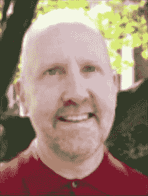
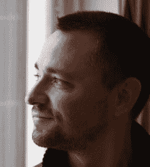
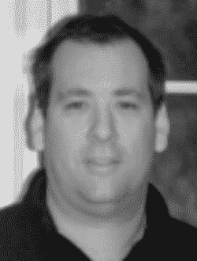

# 关于作者

**戴夫·马克** 是一位资深的 Mac 开发者和作家，撰写过多本关于 Mac 和 iOS 开发的书籍，包括《Beginning iOS 6 Development》（Apress，2013）、《More iOS 6 Development》（Apress，2013）、《Learn C on the Mac》（Apress，2013）、《Ultimate Mac Programming》（Wiley，1995）以及《Macintosh Programming Primer》系列（Addison-Wesley，1992）。戴夫是 MartianCraft（一家 iOS 和 Android 开发公司）的创始人之一。他热爱水，尽可能多地在水上、水中或水边度过时光。他与妻子和三个孩子居住在弗吉尼亚州。在 Twitter 上，他的账号是 `@davemark`。

**杰克·纳廷** 从很早以前就开始使用 Cocoa，甚至早在它被称为 Cocoa 之前。他利用 Cocoa 及其前身技术，为游戏、图形设计、在线数字发行、电信、金融、出版和旅游等多个行业开发过软件。杰克撰写过多本关于 iOS 和 Mac 开发的书籍，包括《Beginning iOS 6 Development》（Apress，2013）、《Learn Cocoa on the Mac》（Apress，2013）和《Beginning iPad Development for iPhone Developers》（Apress，2010）。除了编写软件和书籍，他还领导开发者培训，并偶尔在 `www.nuthole.com` 上写博客。他在 Twitter 上的账号是 `@jacknutting`。

**金·托普利** 是一位拥有超过 30 年经验的软件工程师，其工作范围涵盖大型机微码、UNIX 内核、图形用户界面以及移动应用。他是五本关于 Java 和 JavaFX 各方面书籍的作者，并且从阅读最早出版的 iOS 相关书籍之一——《Beginning iPhone Development》第一版——开始，就一直从事 iOS 开发工作。

**弗雷德里克·奥尔森** 从 Mac OS X 10.1 开始使用 Cocoa，并从非官方工具链时期就开始为 iPhone 进行开发。他拥有漫长而多样化的职业生涯，从实时汇编语言开发到企业级 Java 开发。他热衷于 Objective-C 的优雅、Cocoa 框架的清晰，以及两者结合后所产生的整体大于部分的效果。当离开键盘时，弗雷德里克曾在会议上发表演讲并领导开发者培训。你可以在 Twitter 上找到弗雷德里克，账号是 `@peylow.`。

**杰夫·拉马尔什** 是一位拥有超过 20 年编程经验的 Mac 和 iOS 开发者。杰夫撰写过多本 iOS 和 Mac 开发书籍，包括《Beginning iOS 6 Development》（Apress，2013）和《More iOS 6 Development》（Apress，2013）。杰夫是 MartianCraft（一家 iOS 和 Android 开发公司）的负责人。他曾为《MacTech》杂志撰写关于 Cocoa 和 Objective-C 的文章，也为苹果开发者网站撰写文章。杰夫还在他广受欢迎的博客 `www.iphonedevelopment.blogspot.com` 上撰写关于 iOS 开发的文章。你可以在 Twitter 上找到他，账号是 `@jeff_lamarche`。

