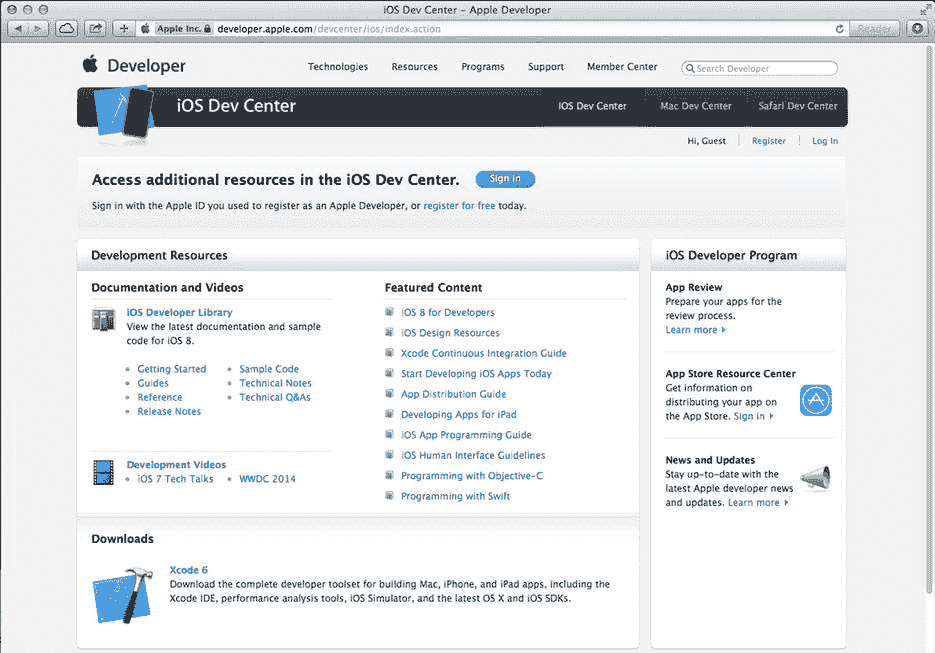
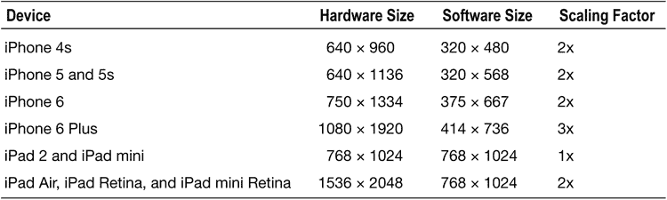

# 欢迎来到丛林

那么，你想编写 iPhone、iPod touch 和 iPad 应用程序吗？好吧，我们不能说这有什么不对。iOS——所有这些设备的核心软件——是一个令人兴奋的平台，自 2007 年首次推出以来，一直经历着爆炸式增长。移动软件平台的兴起意味着人们无论走到哪里都在使用软件。随着 iOS 8、Xcode 6 以及最新版 iOS 软件开发工具包（SDK）的发布，情况只会变得更好、更有趣。

### 本书内容

本书是一本指南，旨在帮助你踏上创建自己 iOS 应用的道路。我们的目标是帮助你克服最初的困难，理解 iOS 应用程序的工作方式以及它们是如何构建的。

在阅读本书的过程中，你将创建多个小型应用程序，每个应用都旨在突出 iOS 的特定功能，并向你展示如何控制或与这些功能进行交互。如果你能将通过本书获得的基础知识与自己的创造力和决心相结合，再加上苹果提供的内容详尽且编写精良的文档，你将拥有构建专业 iPhone 和 iPad 应用所需的一切。

**提示** Dave、Jack、Jeff 和 Fredrik 为本书设立了一个论坛。这是一个结识志同道合者的好地方，你可以提出疑问并获得解答，甚至还能回答其他人的问题。论坛地址为 `http://forum.learncocoa.org`。一定要去看看！

## 你需要准备什么

在开始编写 iOS 软件之前，你需要准备几样东西。首先，你需要一台基于 Intel 的 Macintosh 电脑，运行 Mavericks（OS X 10.9）或 Yosemite（OS X 10.10）及更高版本。任何近期的基于 Intel 的 Macintosh 电脑——无论是笔记本还是台式机——都应该可以正常工作。

为了获取苹果最新最强大的功能，你确实还需要注册成为一名注册 iOS 开发者。要创建你的开发者账户，只需导航到 `http://developer.apple.com/ios/`。这将带你进入一个类似于图 1-1 所示的页面。

图 1-1。苹果 iOS 开发者中心网站

首先，点击**登录**。系统会提示你输入 Apple ID。如果你没有 Apple ID，请点击**注册**，创建一个这样的 ID，然后登录。登录后，你将被带到主 iOS 开发页面。你会找到大量文档、视频、示例代码等的链接——所有这些都旨在向你传授 iOS 应用程序开发的精妙之处。

你将用来开发 iOS 应用程序的最重要工具叫做 `Xcode`。`Xcode` 是苹果的集成开发环境（IDE）。`Xcode` 包含用于创建和调试源代码、编译应用程序以及对你所编写的应用进行性能调优的工具。

你可以从 Mac App Store 下载 `Xcode`，通过 Mac 的苹果菜单即可访问该商店。

**SDK 版本与示例源代码**

随着 SDK 和 Xcode 版本的演进，它们的下载机制也在不断变化。过去几年里，苹果一直在 Mac App Store 上发布 `Xcode` 和 iOS SDK 的当前“稳定”版本，同时为开发者提供从其开发者网站下载未来版本预览版的能力。简而言之：你通常希望下载最新发布的（非测试版）`Xcode` 和 iOS SDK，所以请使用 Mac App Store。

本书是为兼容最新版本的 `Xcode` 和 SDK 而编写的。在某些地方，我们选择了使用 iOS 8 中引入的新函数或方法，这些在早期版本的 SDK 中不可用。我们会在本书中适时指出这些情况。

请务必从本书的页面 `http://apress.com` 下载最新最好的示例源代码归档文件。随着新版本 SDK 的发布，我们会更新代码，所以请定期查看该网站。

## 开发者选项

免费的 `Xcode` 下载包含一个模拟器，允许你在 Mac 上构建和运行 iPhone 及 iPad 应用。这对于学习如何为 iOS 编程来说非常理想。然而，模拟器并*不*支持许多依赖硬件的功能，例如加速度计和摄像头。此外，免费选项不允许你将应用安装到真实的 iPhone 或其他设备上，也不允许你在苹果的 App Store 上分发应用。要获得这些能力，你需要注册其他选项，这些选项并非免费：

*   *标准计划*费用为每年 $99。它提供大量的开发工具和资源、技术支持、通过苹果 App Store 分发应用，以及最重要的是，能够在 iOS 设备（而不仅仅是模拟器）上测试和调试你的代码。
*   *企业计划*费用为每年 $299。它专为开发专有内部 iOS 应用的公司而设计。

有关这些计划的更多详细信息，请访问 `http://developer.apple.com/programs/ios` 和 `http://developer.apple.com/programs/ios/enterprise` 比较两者。

由于 iOS 支持始终连接的移动设备，这些设备使用其他公司的无线基础设施，因此苹果需要对 iOS 开发者施加比 Mac 开发者（目前，Mac 开发者可以在完全无需苹果监督或批准的情况下编写和分发程序）更多的限制。即使 iPod touch 和仅支持 Wi-Fi 的 iPad 版本不使用他人的基础设施，它们仍然受到这些相同的限制。

苹果添加这些限制并非出于刻薄，而是为了尽量减少恶意或编写不良的程序被分发，从而可能降低共享网络性能的机会。为 iOS 开发看似需要跳过很多障碍，但苹果已付出相当多的努力，使这个过程尽可能轻松。而且，也要考虑到每年 $99 的费用仍然远低于购买例如微软软件开发 IDE Visual Studio 的任何付费版本。

这似乎显而易见，但你还需要一台 iPhone、iPod touch 或 iPad。虽然你的大部分代码可以使用 iOS 模拟器测试，但并非所有程序都能如此。即使是那些可以在模拟器上运行的程序，在考虑向公众发布应用之前，也真的需要在真实设备上进行彻底的测试。

**注意** 如果你打算注册标准计划或企业计划，应立即进行。审批过程可能需要一些时间，而你需要获得批准才能在真实设备上运行应用。不过，别担心，在等待期间，你可以在 iOS 模拟器上运行前几章中的所有项目以及本书中的大部分应用。

## 你需要掌握的知识

本书假定你已经具备一定的编程知识。它假定你理解编程的基本原理，特别是面向对象编程（例如，你知道类、对象、循环和变量是什么）。它还假定你熟悉 Objective-C 编程语言。Cocoa Touch——你在本书大部分内容中将打交道的 SDK 部分——使用了最新版本的 Objective-C，其中包含早期版本所不具备的若干新特性。但如果你不熟悉 Objective-C 语言较新的添加部分，也不用担心。我们会强调我们所利用的任何新语言特性，并解释它们是如何工作的以及我们为什么使用它们。

你还应该熟悉 iOS 本身，作为其用户。就像对待你想为之编写应用的任何平台一样，去了解 iPhone、iPad 或 iPod touch 的细微差别和特性。花些时间熟悉 iOS 界面以及苹果 iPhone 和/或 iPad 应用的外观和感觉。

**刚接触 Objective-C？**

如果你之前没有用 Objective-C 编程过，这里有一些资源可以帮助你入门：

### 学习 Objective-C 的资源

- *Learn Objective-C on the Mac: For OS X and iOS*(Apress, 2012)：这是一本由 Mac 编程专家 Scott Knaster、Waqar Malik 和 Mark Dalrymple 编写的优秀且通俗易懂的 Objective-C 入门书籍。你可以在`www.apress.com/book/view/9781430241881`找到更多信息。
- *Programming with Objective-C: A Primer*：这是苹果公司对该语言的介绍。你可以在`https://developer.apple.com/library/mac/documentation/cocoa/conceptual/ProgrammingWithObjectiveC`找到更多信息。

### 为 iOS 编码有何不同？

如果你从未使用过 Cocoa 或其前身 NeXTSTEP 或 OpenStep 进行编程，你可能会发现 Cocoa Touch——你将用来编写 iOS 应用程序的应用程序框架——有点陌生。它与其它常见的应用程序框架（例如构建.NET 或 Java 应用程序时使用的框架）有一些根本性的区别。如果你一开始感到有点迷茫，不必太担心。只要继续坚持练习，一切都会逐渐明朗。

如果你曾使用 Cocoa 或 NeXTSTEP 编写过程序，那么 iOS SDK 中的很多内容对你来说会很熟悉。许多类与用于开发 OS X 的版本相比没有变化。即使那些不同的类也往往遵循相同的基本原则和类似的设计模式。然而，Cocoa 和 Cocoa Touch 之间存在一些差异。

无论你的背景如何，你都需要记住 iOS 开发与桌面应用程序开发之间的一些关键差异。这些差异将在以下章节中讨论。

#### 只有一个活动应用程序

在 iOS 上，任何给定时间只能有一个应用程序被激活并显示在屏幕上。自 iOS 4 以来，应用程序在用户按下`Home`按钮后可以在后台运行，但即便如此，这也仅限于少数情况，并且你必须专门为此编写代码（你将在第 15 章中看到具体如何操作）。

当你的应用程序未激活或未在后台运行时，它不会从 CPU 获得任何关注，这会对打开的网络连接等造成严重影响。iOS 允许后台处理，但让你的应用在此情况下良好运行需要你付出一些努力。

#### 只有一个窗口

桌面和笔记本电脑操作系统允许多个运行的程序共存，每个程序都能够创建和控制多个窗口。但是，除非你连接外部屏幕或使用 AirPlay，并且你的应用程序被编码为支持多个屏幕，否则 iOS 只为你的应用程序提供一个“窗口”来使用。你的应用程序与用户的所有交互都发生在这个窗口内，其大小固定为屏幕大小。

#### 有限的访问权限

桌面或笔记本电脑上的程序几乎可以访问启动它们的用户所能访问的一切内容。然而，iOS 严格限制你的应用程序可以访问的内容。

你只能从 iOS 文件系统中为你的应用程序创建的部分读写文件。这个区域称为你的应用程序的`sandbox`。你的`sandbox`是你的应用程序存储文档、偏好设置以及它可能需要保留的所有其他类型数据的地方。

你的应用程序还受到其他一些限制。例如，你将无法访问 iOS 上的低编号网络端口，也无法执行任何通常需要桌面计算机上 root 或管理权限的操作。

#### 有限的响应时间

由于其使用方式，iOS 需要快速响应，并且它也期望你的应用程序同样如此。当你的程序启动时，你需要尽快打开应用程序、加载偏好设置和数据，并在屏幕上显示主视图——时间不超过几秒钟。

在你的程序运行期间的任何时候，它都可能被突然中断。如果用户按下`Home`按钮，iOS 会返回主屏幕，并且你必须快速保存所有内容，然后 iOS 才会将你的应用程序挂起到后台。如果你花费超过五秒钟来保存并放弃控制权，你的应用程序进程将被终止，无论你是否完成保存。有一个 API 允许你的应用在即将进入后台时请求额外的时间来工作，但你必须知道如何使用它。

#### 有限的屏幕尺寸

iPhone 的屏幕非常漂亮。在推出时，它是手持消费设备上分辨率最高的屏幕，远远超过其他设备。但即使到今天，iPhone 的显示屏也不是很大，因此，与现代计算机相比，你拥有的工作空间要小得多。在最初几代 iPhone 上，屏幕仅为 320 × 480，后来随着 iPhone 4 的 Retina 显示屏的推出，屏幕在两个方向上都翻倍，达到了 640 × 960。如今，最大尺寸 iPhone（iPhone 6 Plus）的屏幕尺寸为 1080 × 1920 像素。这听起来像素数量不少，但请记住，这些高密度显示屏（苹果称之为“Retina”）被塞进了相当小的机身中，这对你可以在 iPhone 甚至 iPad 上提供的应用程序类型和交互性产生了巨大影响。表 1-1 列出了在撰写本文时所有受 iOS 8 支持的设备屏幕尺寸。

表 1-1. iOS 设备屏幕尺寸

硬件尺寸是屏幕的实际物理像素尺寸。然而，在编写软件时，真正重要的尺寸是“软件尺寸”一列中的尺寸。如你所见，在大多数情况下，软件尺寸仅为实际硬件尺寸的一半。这种情况是苹果推出第一款 Retina 设备时出现的，该设备在每个方向上的像素数量是其前身的两倍。如果苹果没有采取任何特殊措施，那么所有现有应用程序在新型 Retina 屏幕上都会以一半的比例绘制，这将使其无法使用。因此，苹果选择在内部将应用程序绘制的所有内容缩放 2 倍，这样它们无需任何代码更改就能填满新屏幕。除了 iPhone 6 Plus（其具有更高密度的屏幕，需要 3 倍的缩放因子）之外，这种内部 2 倍缩放适用于所有具有 Retina 显示屏的设备。不过，在大多数情况下，你无需过分担心应用程序被缩放这一事实——你只需要在软件屏幕尺寸内工作，iOS 会处理其余的事情。

此规则的唯一例外是位图图像。由于位图图像本质上是固定大小的，为了获得最佳效果，你实际上不能在 Retina 屏幕上使用与非 Retina 屏幕上相同的图像。如果你尝试这样做，你会看到 iOS 会将你的图像放大以适应具有 Retina 屏幕的设备，这会导致图像模糊。你可以通过为 2x 和 3x Retina 屏幕分别包含每个图像的副本来解决此问题，iOS 将选择与你的应用程序所运行设备的屏幕相匹配的版本。

### iOS 开发笔记

**注意：** 如果你回头查看 表 1-1，会发现第四列的缩放因子似乎等于硬件尺寸与软件尺寸的比值。例如，在 iPhone 6 上，硬件宽度为 750，软件宽度为 375，比例为 2:1。但仔细一看，你会发现 iPhone 6 Plus 有所不同。硬件宽度与软件宽度的比值为 1080/414，即 2.608:1，高度比也是如此。因此从硬件角度来看，iPhone 6 Plus 并非真正的 3x Retina 显示屏。然而，从软件角度来看，系统使用的是 3x 缩放，这意味着使用 414 × 736 软件屏幕尺寸编写的应用程序会首先逻辑映射到 1242 × 2208 的虚拟屏幕尺寸，然后结果会被稍微缩小以匹配 1080 × 1920 的实际硬件尺寸。幸运的是，这不需要你做任何特殊处理，因为 iOS 会处理所有细节。

#### 有限的系统资源

任何阅读本文的老派程序员都可能嘲笑一台拥有至少 512MB 内存和 16GB 存储空间的机器会面临资源限制，但事实确实如此。为 iOS 开发或许并不完全等同于在一台仅有 48KB 内存的机器上编写复杂的电子表格应用程序。但考虑到 iOS 的图形化特性及其强大的功能，内存耗尽的情况非常容易发生。

目前可用的 iOS 设备要么配备 512MB 物理内存（iPhone 4S、iPad 2、初代 iPad mini、最新款 iPod touch），要么配备 1024MB 物理内存（iPhone 5c、iPhone 5s、iPhone 6、iPhone 6 Plus、iPad Air、iPad mini Retina），尽管这一数值未来可能会增加。其中部分内存用于屏幕缓冲区和其他系统进程。通常，留给应用程序使用的内存不超过总量的一半，而且实际可用量可能更少，尤其是在其他应用可以后台运行的情况下。

虽然这对于一台小型计算机来说听起来还剩下不少内存，但在 iOS 内存方面还有一个因素需要考虑。诸如 OS X 等现代计算机操作系统会将未使用的内存块写入磁盘上的交换文件。交换文件允许应用程序在请求的内存超过计算机实际可用内存时继续运行。然而，iOS 不会将易失性内存（如应用程序数据）写入交换文件。因此，你的应用程序可用的内存量受限于 iOS 设备中未使用的物理内存量。

Cocoa Touch 内置了让应用程序知道内存不足的机制。当这种情况发生时，你的应用程序必须释放不需要的内存，否则可能面临被强制退出的风险。

#### 没有垃圾回收，但是……

我们之前提到 Cocoa Touch 使用 Objective-C，但 iOS 并不支持 2000 年代初期 Objective-C 的关键特性之一：Cocoa Touch 不支持垃圾回收。在为 iOS 编程时需要进行手动内存管理，这对许多新接触该平台的程序员来说是一块绊脚石，尤其是那些来自具有垃圾回收功能的语言的程序员。

然而，随着最新版本的 iOS 所支持的 Objective-C 问世，这一特别的绊脚石基本上消失了。这要归功于一项名为自动引用计数（ARC）的功能，它消除了手动管理 Objective-C 对象内存的需要。ARC 不仅作为垃圾回收的可替代方案，而且在大多数方面实际上更胜一筹。从 OS X 10.8 开始，ARC 成为 Mac 应用的默认内存管理技术，而垃圾回收已被废弃，转而使用 ARC。当然，它也是 iOS 中的默认内存管理机制。我们将在 第 3 章 中讨论 ARC。

#### 一些新特性

既然我们提到 Cocoa Touch 缺少 Cocoa 的某些功能，公平起见，也应当提及 iOS SDK 包含了一些当前 Cocoa 中不存在（或者至少并非每台 Mac 都可用）的功能：

*   iOS SDK 提供了一种方法，让您的应用能够通过 Core Location 确定 iOS 设备的当前地理坐标。
*   大多数 iOS 设备都内置了摄像头和照片库，SDK 提供了允许您的应用访问这两者的机制。
*   iOS 设备内置了运动传感器，让您可以检测设备是如何被握持和移动的。

#### 不同的交互方式

iOS 设备缺少的两样东西是物理键盘和鼠标，这意味着您与用户的交互方式与为通用计算机编程时有着根本不同。幸运的是，大部分交互都由系统为您处理。例如，如果您在应用中添加一个文本字段，iOS 知道在用户触摸该字段时弹出键盘，而无需您编写任何额外的代码。

**注意：** 所有 iOS 设备都允许通过蓝牙连接外部键盘，这提供了良好的键盘体验并节省了一些屏幕空间。但连接鼠标不是一个可选功能。

### 本书内容

以下是本书剩余章节的简要概述。

* 在第二章中，你将学习如何使用 Xcode 的搭档：Interface Builder 来创建一个简单的界面，并在屏幕上放置一些文本。
* 在第三章中，你将开始与用户交互，构建一个简单的应用程序，该应用程序根据用户按下的按钮在运行时动态更新显示的文本。
* 第四章将在第三章的基础上，向你介绍更多 iOS 的标准用户界面控件。我们还将演示如何使用警告框和操作表来提示用户做出决定，或通知他们发生了异常情况。
* 在第五章中，我们将探讨屏幕旋转和 Auto Layout，这些机制允许 iOS 应用程序在竖屏和横屏模式下使用。
* 在第六章中，我们将进入更高级的用户界面，并探索创建支持多个视图的应用程序。我们将向你展示如何在运行时更改显示给用户的视图，这将大大增强应用程序的潜力。
* 标签栏和选择器是标准 iOS 用户界面的一部分。在第七章中，我们将讨论如何实现这些界面元素。
* 在第八章中，我们将介绍表视图，这是向用户提供数据列表的主要方式，也是基于层级导航的应用程序的基础。你还将看到如何让用户搜索你的应用程序数据。
* 最常见的 iOS 应用程序界面之一是层级列表，它允许用户深入查看更多数据或更多细节。在第九章中，你将了解实现这种标准界面类型所涉及的内容。
* 从一开始，各种 iOS 应用程序就使用表视图来显示动态的、垂直滚动的组件列表。最近，Apple 引入了一个名为`UICollectionView`的新类，它将这一概念向前推进了几步，为开发者在布局可视化组件方面提供了许多新的灵活性。第十章将帮助你快速上手集合视图。
* 在第十一章中，我们将向你展示如何构建主从（Master-Detail）应用程序，该应用会呈现一个项目列表（例如邮箱中的电子邮件），并允许用户一次查看每个单独项目的详细信息。你还将看到如何使用支持这种工作方式的 iOS 控件，这些控件最初是为 iPad 开发的，现在也适用于 iPhone。
* 在第十二章中，我们将探讨实现应用程序设置，这是 iOS 允许用户设置其应用程序级偏好的机制。
* 第十三章涵盖了 iOS 上的数据管理。我们将讨论创建用于保存应用程序数据的对象，并了解这些数据如何持久化到 iOS 的文件系统。我们还将讨论使用 Core Data 的基础知识，它允许你轻松地保存和检索数据。
* 在 iOS 5 中，Apple 引入了 iCloud，它允许你的文档在线存储数据，并在应用程序的不同实例之间同步数据。第十四章将向你展示如何开始使用 iCloud。
* iOS 开发者可以访问一个名为 Grand Central Dispatch（简称 GCD）的强大库，该库简化了多线程开发。在第十五章中，我们将向你介绍 Grand Central Dispatch，并展示如何利用某些 iOS 特性，让你在特定情况下能够在后台运行你的应用程序。
* 每个人都喜欢绘图，因此我们将在第十六章中探讨如何进行自定义绘图，届时我们将向你介绍 Core Graphics 系统。

* 在 iOS 7 中，Apple 引入了一个名为 Sprite Kit 的新框架，用于创建 2D 游戏。它包含一个物理引擎和动画系统，并且也适用于制作 OS X 游戏。你将在第十七章中看到如何使用 Sprite Kit 制作一个简单的游戏。
* 所有 iOS 设备通用的多点触控屏幕可以接受来自用户的多种手势输入。在第十八章中，你将学习如何检测基本手势，例如捏合和轻扫。我们还将探讨定义新手势的过程，并讨论何时适合使用新手势。
* 得益于 Core Location，iOS 能够确定其纬度和经度。在第十九章中，我们将编写一些使用 Core Location 的代码，以确定设备在世界上所处的位置，并在我们征服世界的征程中使用这些信息。
* 在第二十章中，我们将探讨如何与 iOS 的加速度计和陀螺仪进行交互，你的设备通过这些组件来了解其持有方向、移动的速度和方向，以及它在世界上的位置。我们还将探索你的应用程序可以利用这些信息所做的有趣事情。
* 几乎每个 iOS 设备都有一个摄像头和一个图片库，只要你礼貌地请求，这些资源都可以供你的应用程序使用！在第二十一章中，我们将向你展示如何礼貌地请求。
* iOS 设备目前在全球超过 90 个国家或地区销售。在第二十二章中，我们将向你展示如何编写应用程序，使其所有部分都能轻松地翻译成其他语言。这有助于扩大你的应用程序的潜在受众。

### 本次更新有哪些新内容？

自本书第一版上市以来，iOS 开发者社区的发展可谓突飞猛进。随着苹果公司不断推出一系列 SDK 更新，SDK 也在持续演进。当然，我们也没闲着！iOS 8 和 `Xcode 6` 都包含了许多新增功能。我们一直在努力更新本书，以涵盖 iOS 8 和 `Xcode 6` 中你需要了解的新技术，从而开始编写 iOS 应用程序。我们从头重建了每个项目，不仅确保代码能使用最新版本的 `Xcode` 和 iOS SDK 进行编译，还确保每个项目都利用了 `Cocoa Touch` 提供的最新、最强大的功能。此外，我们还在全书中做了大量细微的调整，当然，我们也重新截取了所有截图。

### 你准备好了吗？

iOS 是一个令人难以置信的计算平台，也是一个激动人心的新领域，期待你尽情享受开发的乐趣。为 iOS 编程将是一种全新的体验——与在其他任何平台上工作都不同。一切看似熟悉的事物背后，总会有些陌生的东西——但当你通读本书的代码时，这些概念都会融会贯通，开始变得有意义。

请记住，本书中的示例并非一张简单的清单，完成它们并不能让你奇迹般地获得 iOS 开发大师的地位。在进入下一个项目之前，请确保你理解自己做了什么以及为什么这样做。不要害怕修改代码。观察实验结果是让你掌握在像 `Cocoa Touch` 这样的环境中编写代码的复杂性的最佳方法之一。

话虽如此，如果你已经安装了 iOS SDK，那就翻到下一页。如果还没安装，快去安装吧！装好了？很好。那我们开始吧！

