# 安抚提基神

你可能很清楚，将任何编程书籍的第一个项目命名为“Hello, World”已经成为一种传统。我们曾考虑打破这个传统，但又担心提基神会因为我们如此严重地违反礼仪而对我们施以痛苦的惩罚。所以，我们还是按规矩来，好吗？

在本章中，我们将使用 `Xcode` 创建一个小的 iOS 应用程序，它将显示文本“Hello, World!”。我们将探讨在 `Xcode` 中创建 iOS 应用程序项目所涉及的步骤，详细了解如何使用 `Xcode` 的 Interface Builder 来设计应用程序的用户界面，然后在 iOS 模拟器上运行我们的应用程序。之后，我们将为应用程序添加一个图标，使其更像一个真正的 iOS 应用程序。

我们有很多事情要做，那就开始吧。

## 在 Xcode 中设置你的项目

现在，你的机器上应该已经安装了 `Xcode` 和 iOS SDK。你还应该从 Apress 网站（`http://apress.com`）下载本书的源代码压缩包。同时，也可以看看 `http://forum.learncocoa.org/` 上的本书论坛。本书论坛是讨论 iOS 开发、解答疑问以及结识志同道合之人的绝佳场所。

**注意** 即使本书的源代码压缩包中提供了完整的项目文件，但如果你手动创建每个项目，而不是简单地运行下载的版本，你会从本书中获得更多收获。通过这样做，你将熟悉并掌握使用各种应用程序开发工具的技巧。

没有什么能替代实际创建应用程序的体验；软件开发不是一项旁观者的运动。

本章我们将要构建的项目位于源代码压缩包的 `02 - Hello World` 文件夹中。

在开始之前，我们需要启动 `Xcode`。`Xcode` 是我们在本书中完成大部分工作所使用的工具。从 Mac App Store 下载后，你会发现它安装在 `/Applications` 文件夹中，和大多数 Mac 应用程序一样。你会经常使用 `Xcode`，所以不妨考虑将它拖到你的 Dock 中，以便随时使用。

如果这是你第一次使用 `Xcode`，别担心；我们会逐步引导你完成创建新项目的每一个步骤。如果你已经是老手，但还没用过 `Xcode 6`，你会发现很多地方都变了（我们认为大多数是变好了）。

首次启动 `Xcode` 时，会看到一个欢迎窗口，如图 2-1 所示。在这里，你可以选择创建新项目、连接到版本控制系统以签出现有项目，或者从最近打开的项目列表中选择。欢迎窗口提供了一个很好的起点，涵盖了启动 `Xcode` 后你可能想做的一些最常见任务。所有这些操作也可以通过菜单访问，所以关闭窗口，我们继续。如果你以后不想看到这个窗口，只需在关闭前取消勾选窗口底部的 **Show this window when Xcode launches** 复选框即可。

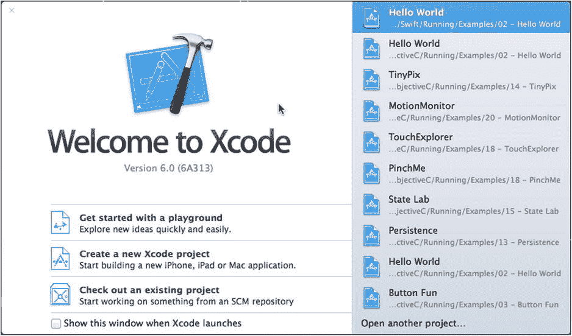

图 2-1. Xcode 欢迎窗口

**注意** 如果你有 iPhone、iPad 或 iPod touch 连接到机器上，首次启动 `Xcode` 时可能会看到一条消息，询问你是否要使用该设备进行开发。现在，请点击 **Ignore** 按钮。如果你选择加入付费的 iOS 开发者计划，你将获得一个程序门户的访问权限，该门户会告诉你如何使用 iOS 设备进行开发和测试。后几章中的一些示例需要使用真实设备，因为它们使用了 iOS 模拟器上不可用的功能。你需要加入 iOS 开发者计划才能尝试这些示例。

通过从 **File** 菜单中选择 **New  Project…** （或按 `N`）来创建一个新项目。将会打开一个新项目窗口，显示项目模板选择表单（参见 图 2-2）。在此表单中，你将选择一个项目模板作为构建应用程序的起点。表单左侧的窗格分为两个主要部分：**iOS** 和 **OS X**。由于我们正在构建 iOS 应用程序，请选择 **iOS** 部分中的 **Application** 以显示 iOS 应用程序模板。

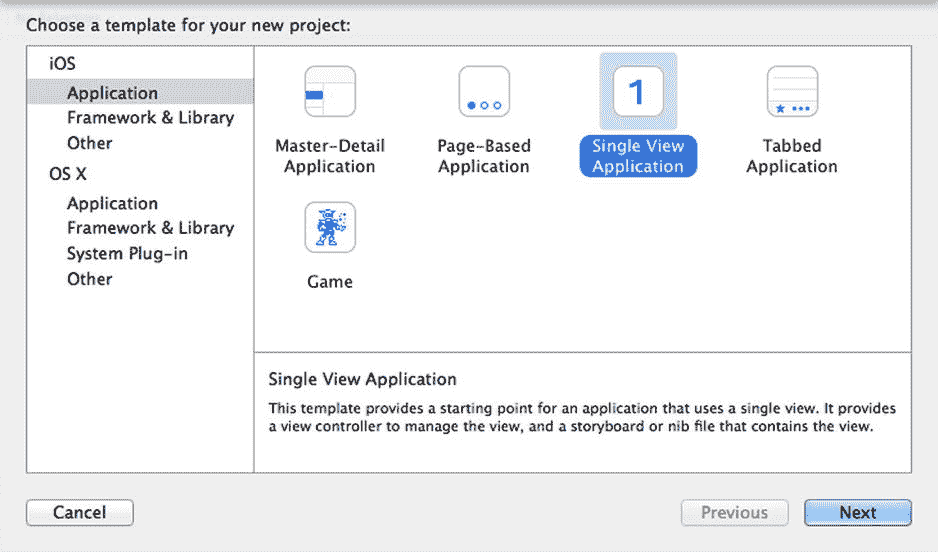

图 2-2. 项目模板选择表单让你在创建新项目时从各种模板中进行选择

图 2-2 右上角窗格中显示的每个图标都代表一个单独的项目模板，可用作 iOS 应用程序的起点。标有 **Single View Application** 的图标是最简单的模板，也是我们前几章将使用的模板。其他模板提供了创建常见 iPhone 和 iPad 应用程序界面所需的额外代码和/或资源，你将在后面的章节中看到。


点击 **Single View Application** 图标（参见图 2-2），然后点击 **Next** 按钮。你将看到项目选项面板，其外观应如图 2-3 所示。在此面板中，你需要为项目指定 **Product Name** 和 **Company Identifier**。Xcode 会将这两项内容组合起来，为你的应用生成一个唯一的`bundle identifier`。你还会看到一个字段，用于输入 **Organization Name**，Xcode 将使用它在你创建的每一个源代码文件中自动插入版权声明。将你的产品命名为`Hello World`，将组织命名为`Apress`，然后在 **Company Identifier** 字段中输入`com.apress`，如图 2-3 所示。稍后，在你注册了开发者项目并了解了配置文件之后，你应该使用自己的公司标识符。

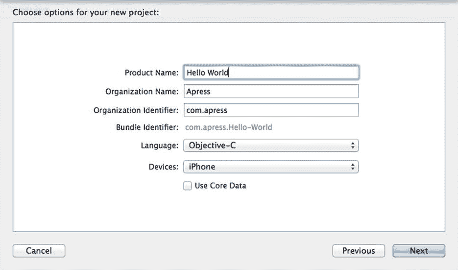

图 2-3：为项目选择产品名称和公司标识符。目前请使用这些设置。

**Language** 字段允许你选择要使用的编程语言。你可以在 Objective-C 和 Swift 之间进行选择。由于你正在阅读本书的 Objective-C 版本，这里合适的选择当然是 Objective-C。

我们还需要指定 **Devices**。换句话说，Xcode 想知道我们是为 iPhone 和 iPod touch 构建应用，还是为 iPad 构建应用，亦或是构建一个能在所有 iOS 设备上运行的**通用（universal）**应用。如果 **Devices** 未选择，请选择 **iPhone**。这告诉 Xcode，我们将专门针对屏幕尺寸和外形因素大致相同的 iPhone 和 iPod touch 开发此应用。在本书的前几章中，我们将使用 iPhone 设备，但别担心——我们也会涵盖 iPad。

保持 **Core Data** 复选框未选中状态——我们将在第 13 章中使用它。再次点击 **Next**，你将通过一个标准的保存面板被询问保存新项目的位置（参见图 2-4）。如果尚未完成，请切换到`Finder`，为这些书籍项目创建一个新的主目录，然后返回 Xcode 并导航到该目录。在点击 **Create** 按钮之前，请注意 **Source Control** 复选框。本书不会讨论 Git，但 Xcode 包含对使用 Git 和其他源代码管理（SCM）工具的一些支持。如果你熟悉 Git 并想使用它，请启用此复选框；否则，可以随意关闭它。

**注意** 源代码管理（SCM）是一种在应用程序构建过程中跟踪其源代码和资源所做更改的技术。它还通过提供在冲突出现时解决冲突的工具，促进多个开发者同时处理同一应用程序。Xcode 内置了对 Git（当今最流行的 SCM 系统之一）的支持。本书不涉及源代码控制问题，因此启用或禁用它由你决定。

在选择是否创建 Git 仓库之后，通过点击 **Create** 按钮来创建新项目。

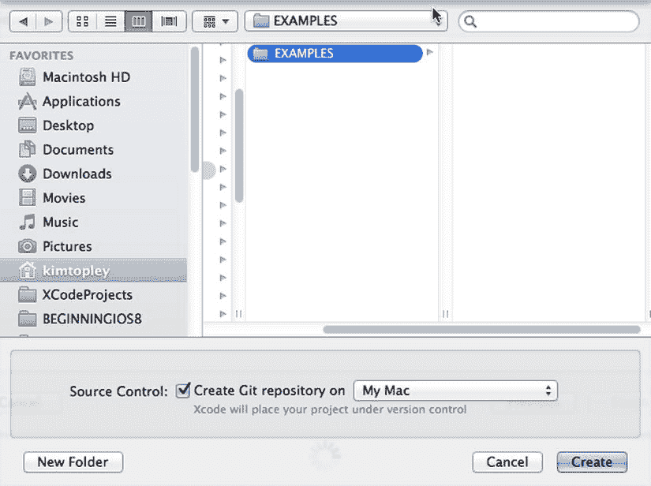

图 2-4：将项目保存在硬盘驱动器上的项目文件夹中。

## Xcode 项目窗口

关闭保存面板后，Xcode 将创建并打开你的项目。你将看到一个**项目窗口**（参见图 2-5）。这个窗口包含了大量信息，而这里将是你花费大部分 iOS 开发时间的地方。

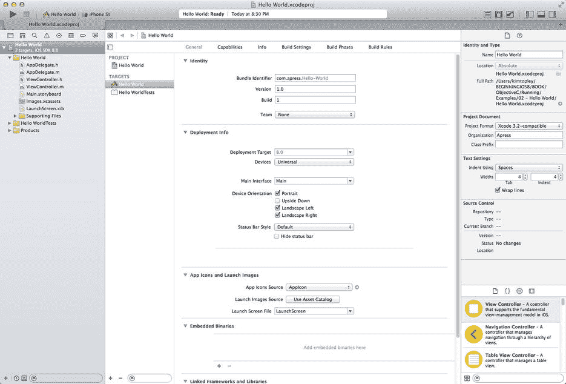

图 2-5：Xcode 中的 Hello World 项目

即使你是早期版本 Xcode 的老手，阅读本节内容仍然可能有所收获，因为苹果习惯于在版本发布之间重新安排事物并进行改进。下面让我们快速浏览一下。

### 工具栏

Xcode 项目窗口的顶部称为**工具栏**（参见图 2-6）。在工具栏的左侧，有用于开始和停止运行项目的控件，以及一个用于选择要运行的样式的弹出菜单。一个**样式（scheme）**将目标（target）和构建设置结合在在一起，而工具栏弹出菜单让你可以快速轻松地选择特定的设置。

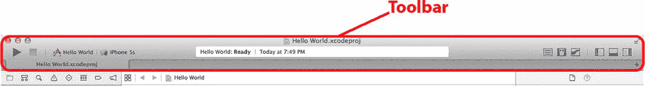

图 2-6：Xcode 工具栏

工具栏中间的大方框是**活动视图（Activity View）**。顾名思义，活动视图显示当前正在发生的任何操作或进程。例如，当你运行项目时，活动视图会实时显示构建应用程序所采取的各个步骤。如果遇到任何错误或警告，该信息也会在此显示。如果你点击警告或错误，你将直接进入**问题导航器（Issue Navigator）**，它提供了关于警告或错误的更多信息，如下一节所述。

在工具栏的右侧有两组按钮。左边的那组让你可以在三种不同的编辑器配置之间切换：

*   **编辑区域（Editor Area）**为你提供一个专用于编辑文件或项目特定配置值的单面板。
*   极其强大的**辅助编辑器（Assistant Editor）**将编辑区域分割为左右两个面板。右侧面板通常用于显示与左侧文件相关的文件，或者在编辑左侧文件时你可能需要参考的文件。你可以手动指定每个面板中显示的内容，或者让 Xcode 决定当前任务最合适的内容。例如，如果你正在编辑一个 Objective-C 类的实现文件（`.m`文件），Xcode 会自动在右侧面板中显示该类的头文件（`.h`文件）。如果你在左侧设计用户界面，Xcode 会在右侧显示用户界面可以与之交互的代码。你将在本书中看到辅助编辑器的实际应用。
*   **版本编辑器（Version Editor）**按钮将编辑器面板转换为一个类似时间机器的比较视图，可与 Subversion 和 Git 等版本控制系统配合使用。你可以比较当前版本的源文件与之前提交的版本，或者比较任意两个早期版本。

在编辑器按钮的右侧是一组开关按钮，用于显示和隐藏编辑器视图左侧和右侧的大面板，以及窗口底部的调试区域。分别点击这些按钮几次，看看这些面板的实际效果。你很快会学到更多关于它们如何使用的知识。

### 导航器

在项目窗口的左侧，工具栏的正下方是**导航器（Navigator）**。导航器提供了八个视图，显示项目的不同方面。点击导航器顶部的每个图标，可以按从左到右的顺序在以下导航器之间切换：


*   **项目导航器**：此视图包含项目中文件的列表（参见图 2-7）。你可以存储对各种资源的引用，从源代码文件到插图、数据模型、属性列表（或`*.plist*`文件）（本章稍后的“仔细查看我们的项目”部分将讨论），甚至其他项目文件。通过将多个项目存储在单个工作区中，这些项目可以轻松共享资源。如果你在导航器视图中点击任何文件，该文件将显示在编辑器区域中。除了查看文件，你还可以编辑它（如果它是`Xcode`知道如何编辑的文件）。

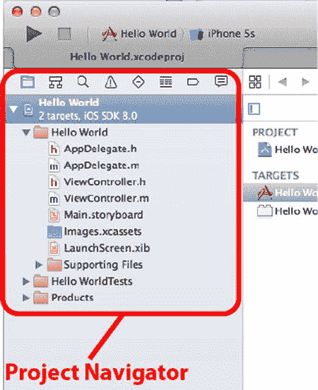

图 2-7. Xcode 项目导航器。点击视图顶部的八个图标之一可切换导航器

*   **符号导航器**：顾名思义，此导航器专注于工作区中定义的**符号**（参见图 2-8）。符号基本上是编译器识别的项目，例如类、枚举、`struct`和全局变量。

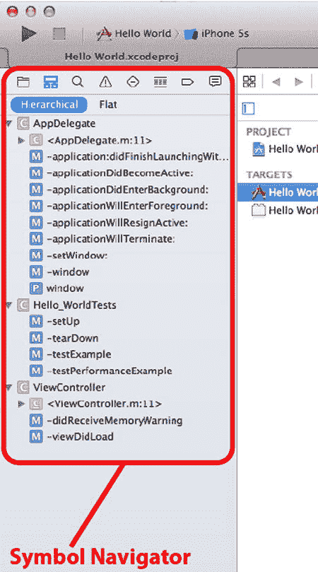

图 2-8. Xcode 符号导航器。打开展开三角形以探索每个组内定义的类、方法和其他符号

*   **查找导航器**：你将使用此导航器对工作区中的所有文件执行搜索（参见图 2-9）。此窗格顶部是一个多级弹出控件，可让你选择**替换**而不是**查找**，以及用于将搜索条件应用于输入文本的其他选项。在文本字段下方，其他控件允许你选择在整个项目或仅部分项目中搜索，并指定搜索是否应区分大小写。

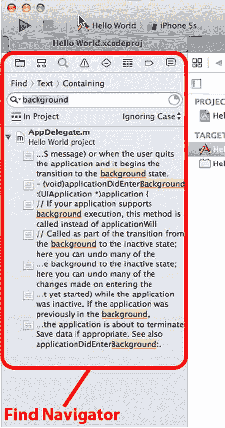

图 2-9. Xcode 查找导航器。请务必查看隐藏在单词“查找”下方以及搜索字段下方按钮下方的弹出菜单

*   **问题导航器**：当你构建项目时，任何错误或警告都会出现在此导航器中，并且详细说明错误数量的消息将出现在窗口顶部的活动视图中（参见图 2-10）。当你在问题导航器中点击一个错误时，你将跳转到编辑器中相应的代码行。

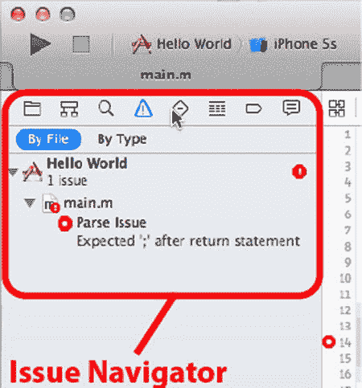

图 2-10. Xcode 问题导航器。这是你找到编译器错误和警告的地方

*   **测试导航器**：如果你使用`Xcode`集成的单元测试功能（很遗憾，本书无法涵盖这个主题），你将在这里看到单元测试的结果（参见图 2-11）。

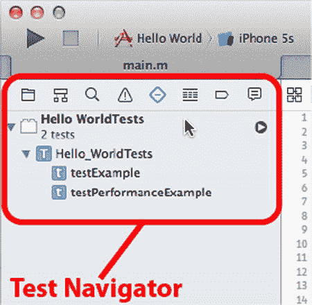

图 2-11. Xcode 测试导航器。你的单元测试输出将出现在这里

*   **调试导航器**：此导航器是你进入调试过程的主要视图（参见图 2-12）。如果你是调试新手，可以查看*Xcode 概述*的这部分内容（`http://developer.apple.com/library/ios/documentation/ToolsLanguages/Conceptual/Xcode_Overview/DebugYourApp/DebugYourApp.html`）。调试导航器列出每个活动线程的堆栈帧。**堆栈帧**是先前调用过的函数或方法的列表，按调用顺序排列。点击一个方法，关联的代码就会出现在编辑器窗格中。在编辑器中，将出现第二个窗格，允许你控制调试过程、显示和修改数据值以及访问底层调试器。调试导航器底部的一个按钮允许你控制哪些堆栈帧可见，另一个按钮允许你选择是显示所有线程还是仅显示已崩溃或停在断点上的线程。

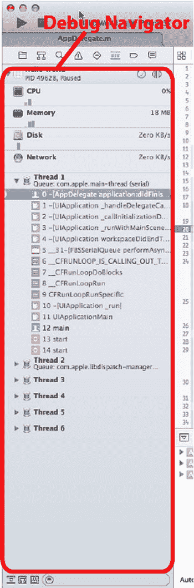

图 2-12. Xcode 调试导航器。导航器底部的控件允许你控制想要看到的详细程度

*   **断点导航器**：断点导航器允许你查看所有已设置的断点（参见图 2-13）。顾名思义，断点是代码中应用程序将停止运行（或称**中断**）的点，以便你可以查看变量中的值并执行调试应用程序所需的其他任务。此导航器中的断点列表按文件组织。点击列表中的断点，该行将出现在编辑器窗格中。请务必查看在断点导航器中项目窗口左下角的加号（`+`）按钮。此按钮会打开一个弹出菜单，允许你添加四种不同类型的断点，包括符号断点，这是你最常使用的一种。

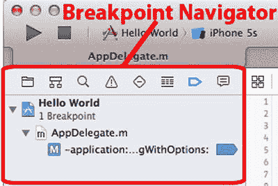

图 2-13. Xcode 断点导航器。断点列表按文件组织

*   **报告导航器**：此导航器保留了你最近的构建结果和运行日志的历史记录（参见图 2-14）。点击特定日志，构建命令和任何构建问题都会显示在编辑窗格中。

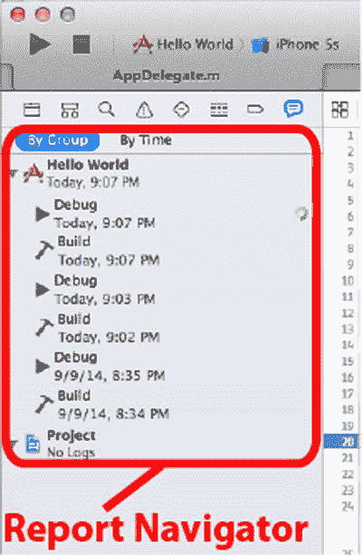

图 2-14. Xcode 报告导航器。报告导航器显示构建列表，与选定视图关联的详细信息显示在编辑器窗格中

跳转栏

在编辑器顶部，你会找到一个名为**跳转栏**的特殊控件。只需单击一次，跳转栏就可以让你跳转到当前导航层次结构中的特定元素。例如，图 2-15 显示了一个正在编辑窗格中编辑的源文件。跳转栏就在源代码上方。它的结构分解如下：


## Xcode 界面与功能详解

跳转栏左端那个看起来很有趣的图标实际上是一个弹出菜单，它会显示子菜单，列出最近的文件、对应文件、超类、子类、同级文件、分类、包含文件等等！这里显示的子菜单可以带你跳转到与当前编辑器中所打开代码相关的几乎所有其他代码。

在 *über* 菜单的右侧，有左右箭头，分别用于返回上一个文件和前进到下一个文件。

跳转栏包含一个分段弹出菜单，显示在项目中到达所选文件的层级路径。你可以点击任何显示组名或文件名的分段，查看位于层级结构中同一位置的所有其他文件和组。最后一个分段显示所选文件内项目的列表。在图 2-15 中，你会看到跳转栏的末端是一个弹出菜单，显示当前所选文件中包含的方法和其他符号。跳转栏显示文件 `AppDelegate.m`，并带有一个子菜单，列出该文件中定义的符号。

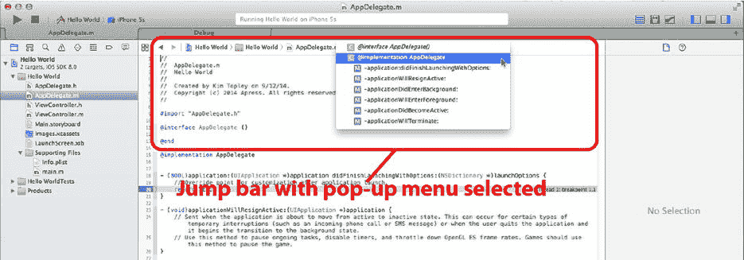

图 2-15. Xcode 编辑器窗格，显示了跳转栏，并选中了一个源代码文件。子菜单显示了所选文件中的方法列表。

跳转栏非常强大。在你熟悉构成 Xcode 的各种界面元素时，可以留意它的存在。

**提示** 与大多数 Apple 的 OS X 应用程序一样，Xcode 完全支持全屏模式。只需点击项目窗口右上角的全屏按钮，即可体验无干扰的全屏编码！

### Xcode 键盘快捷键

如果你更喜欢使用键盘快捷键而不是鼠标点击屏幕控件，那么你会喜欢 Xcode 提供的功能。你在 Xcode 中经常执行的大多数操作都分配了键盘快捷键，例如  `B` 用于构建应用程序，或  `N` 用于创建新文件。

你可以在 Xcode 的偏好设置中，在 **Key Bindings** 选项卡下更改所有 Xcode 的键盘快捷键，并为尚未分配快捷键的命令添加快捷键。

一个非常方便的键盘快捷键是  `O`，这是 Xcode 的 **Open Quickly** 功能。按下此快捷键后，开始输入文件、设置或符号的名称，Xcode 会显示一个选项列表。当你将列表缩小到所需文件时，按下 **Return** 键即可在编辑窗格中打开它，让你只需几次按键就能切换文件。

### 实用工具区

如前所述，Xcode 工具栏右侧倒数第二个按钮用于打开和关闭实用工具区。实用工具区的上半部分是一个上下文相关的检查器面板，其内容会根据编辑器窗格中显示的内容而变化。实用工具区的下半部分包含几种不同类型的资源，你可以将它们拖拽到项目中。你会在本书中看到相关示例。

### 界面生成器

早期版本的 Xcode 包含一个独立的界面设计应用程序，称为 **Interface Builder**，用于构建和自定义项目的用户界面。后续版本引入的重大变化之一是将 Interface Builder 集成到工作区本身。Interface Builder 不再是一个独立的应用程序，这意味着你不必在代码和界面演变时在 Xcode 和 Interface Builder 之间来回切换。这一转变已经过去几年了，但我们这些还记得独立版 Interface Builder 日子的人，现在对于 Interface Builder 直接集成到 Xcode 中的效果感到非常满意。

我们将在本书中大量使用 Xcode 的界面构建功能，深入探索其各个角落。事实上，我们将在本章稍后进行第一次界面构建。

### 新编译器和调试器

Xcode 4 带来的最重要的变化之一隐藏在底层：一个全新的编译器和一个低级调试器。两者都比其前身更快、更智能，并且之后的每个版本都进行了改进。

多年来，Apple 一直使用 GCC（GNU 编译器集合）作为其编译器技术的基础。但在过去几年中，它已完全转向 LLVM（低级虚拟机）编译器。LLVM 生成的代码远比传统 GCC 生成的代码快得多。除了生成更快的代码之外，LLVM 还更了解你的代码，因此它可以生成更智能、更精确的错误消息和警告。

Xcode 还与 LLVM 紧密集成，这赋予了它一些新的超级能力。Xcode 可以提供更精确的代码补全，并且在产生警告时，它可以对一段代码的实际意图进行有根据的猜测，并提供一个可能的修复弹出菜单。这使得拼写错误的符号名称、不匹配的括号和缺失的分号等错误变得容易发现和修复。

LLVM 还引入了复杂的 **静态分析器**，可以扫描你的代码以发现各种潜在问题，包括 Objective-C 内存管理问题。实际上，LLVM 对此非常智能，只要你编写代码时遵守一些简单的规则，它就能为你处理大部分内存管理任务。我们将在下一章开始研究名为 **自动引用计数**（ARC）的精彩新特性。

### 深入了解我们的项目

现在我们已经探索了 Xcode 项目窗口，让我们来看看构成新 Hello World 项目的文件。通过点击工作区左侧八个导航器图标中最左边的一个（如本章前面“导航器”部分所述）或按下  `1`，切换到项目导航器。

**提示** 八个导航器配置可以使用键盘快捷键  `1` 到  `8` 访问。这些数字对应从左到右的图标，因此  `1` 是项目导航器， `2` 是符号导航器，依此类推，直到  `8`，它会带你进入报告导航器。

项目导航器列表中的第一项与你的项目同名——在本例中为 *Hello World*。此项代表你的整个项目，并且也是进行项目特定配置的地方。如果你单击它，就可以在 Xcode 的编辑器中编辑许多项目配置设置。不过，你现在无需担心这些项目特定的设置。目前，默认值就能正常工作。

请翻回图 2-7。注意 *Hello World* 左侧的展开三角形是打开的，显示了多个子文件夹（在 Xcode 中称为**组**）：


## 项目结构与界面构建器

### 项目导航器文件夹

**Hello World**：第一个文件夹始终以你的项目命名，你将在此投入大部分时间。你编写的大部分代码以及构成应用程序用户界面的文件都会放在这里。你可以自由地在 `Hello World` 文件夹下创建子文件夹来组织代码，如果你更喜欢不同的组织方式，甚至可以使用其他分组。虽然我们直到下一章才会涉及此文件夹中的大部分文件，但有一个文件我们将在下一节使用界面构建器时进行探索：

- `Main.storyboard` 包含特定于项目主视图控制器的用户界面元素。

- **Supporting Files**：此文件夹位于 `Hello World` 文件夹内，包含非 Objective-C 类但项目所需的源代码文件和资源。通常，你不需要花费大量时间在 `Supporting Files` 文件夹上。当你创建一个新的 iOS 应用程序项目时，此文件夹包含两个文件：
    - `Info.plist` 是一个属性列表，包含应用程序的相关信息，例如其名称、在运行的设备上是否需要任何特定功能等。
    - `main.m` 包含应用程序的 `main()` 方法。通常你无需编辑或更改此文件。事实上，如果你不清楚自己在做什么，最好不要碰它。

- **Hello WorldTests**：此文件夹包含如果你想为应用程序代码编写一些单元测试所需的初始文件。我们不会在本书中讨论单元测试，但 Xcode 能在你创建的每个新项目中为你设置这些内容，这一点很不错。与 `Hello World` 文件夹一样，此文件夹也包含自己的 `Supporting Files` 文件夹和 `Info.plist` 文件。

- **Products**：此文件夹包含项目构建后生成的应用程序。展开 `Products`，你会看到一个名为 `Hello World.app` 的项，即这个特定项目创建的应用程序。它还包含一个名为 `Hello WorldTests.xctest` 的项，代表测试代码。这两项都称为“构建目标”。由于我们从未构建过它们，两者都呈红色，这是 Xcode 用来告诉你文件引用指向不存在内容的方式。

**注意**：导航器区域中的“文件夹”不一定对应你 Mac 文件系统中的文件夹。这些是 Xcode 内部的逻辑分组，旨在帮助你保持一切井井有条，并在开发应用程序时更快、更轻松地找到所需内容。通常，这些项目文件夹中包含的项目直接存储在项目目录中，但你可以将它们存储在任何地方——甚至根据你的需要存储在项目文件夹之外。Xcode 内部的层次结构与文件系统层次结构完全独立，因此，例如在 Xcode 中将文件移出 `Supporting Files` 文件夹并不会改变该文件在硬盘上的位置。

可以使用实用工具面板将分组配置为使用特定的文件系统目录。然而，默认情况下，添加到项目中的新分组与文件系统完全独立，其内容可以存放在任何位置。

### 介绍 Xcode 的界面构建器

在项目窗口的项目导航器中，展开 `Hello World` 分组（如果尚未展开），然后选择 `Main.storyboard` 文件。完成后，文件将在编辑器窗格中打开，如图 2-16 所示。你应该会看到一个类似全白 iOS 设备居中于纯白色背景上的画面，这为编辑界面提供了一个很好的背景。这就是 Xcode 的界面构建器（有时称为 IB），你将在此设计应用程序的用户界面。

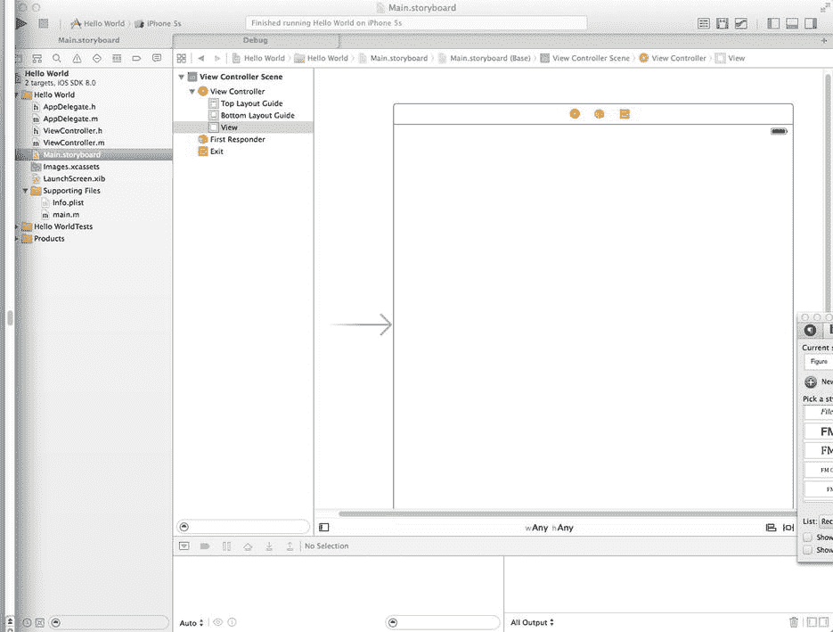

图 2-16。我们在项目导航器中选中 `Main.storyboard`。这将在界面构建器中打开该文件。它看起来是这样的

界面构建器历史悠久。它自 1988 年就已存在，并已用于为 NeXTSTEP、OpenStep、OS X 以及现在的 iOS 设备（如 iPhone 和 iPad）开发应用程序。正如我们之前提到的，界面构建器过去是与 Xcode 一起安装并与其协同工作的独立应用程序。现在，界面构建器已经完全集成到 Xcode 中。

### 文件格式

界面构建器支持几种不同的文件类型。最古老的是使用 `.nib` 扩展名的二进制格式，其较新版本是使用 `.xib` 扩展名的基于 XML 的格式。这两种格式包含的文档类型完全相同，但 `.xib` 版本作为基于文本的格式具有许多优势，尤其是当你使用任何类型的 SCM 时。在界面构建器诞生后的前 20 年里，其所有文件都使用 `.nib` 扩展名。因此，大多数开发者习惯将界面构建器文件称为“nib 文件”。无论文件实际使用的扩展名是 `.xib` 还是 `.nib`，界面构建器文件通常都被称为 nib 文件。事实上，Apple 在其文档中仍使用术语 `nib` 和 `nib file`。

每个 nib 文件可以包含任意数量的对象，但在开发 iOS 项目时，每个 nib 文件通常只包含一个视图（通常是全屏视图）以及与之关联的控制器或其他对象。这使我们能够将应用程序模块化，只在需要显示视图时才加载其 nib 文件。最终结果是：当我们的应用程序在内存受限的 iOS 设备上运行时，可以节省内存。一个新创建的 iOS 项目包含一个名为 `LaunchScreen.xib` 的 nib 文件，其中包含应用程序启动时默认显示的屏幕布局。我们将在本章末尾详细讨论此文件。

界面构建器在过去几年中支持的另一文件格式是“storyboard”。你可以将 storyboard 视为一种“元 nib 文件”，因为它可以包含多个视图控制器，以及关于它们在应用程序运行时如何相互连接的信息。与 nib 文件一次性加载所有内容不同，storyboard 不能包含独立视图，也从不一次性加载所有内容。相反，你在需要时请求加载特定的控制器。Xcode 6 中的 iOS 项目模板都使用 storyboard，因此本书中的所有示例都将从 storyboard 开始。现在让我们回到界面构建器和 Hello World 应用程序的 `Main.storyboard` 文件（图 2-16）。

### Storyboard

你现在看到的是用于为 iOS 应用程序构建用户界面的主要工具。现在，假设你想创建一个按钮实例。你可以通过编写代码来创建按钮，但通过从库中拖出按钮并指定其属性来创建界面对象要简单得多，并且在运行时会产生完全相同的结果。

我们当前正在查看的 `Main.storyboard` 文件会在应用程序启动时自动加载（目前无需担心如何加载），因此它是添加构成应用程序用户界面对象的正确位置。当你在界面构建器中创建对象时，它们会在加载该 storyboard 或 nib 文件时在你的程序中被实例化。在本书中，你将看到许多此过程的示例。

每个 storyboard 都被模块化为一对或多对视图和控制器。视图是你可以直观地看到并在界面构建器中编辑的部分，而控制器是你将编写的应用程序代码，用于在用户与你的应用程序交互时执行操作。控制器是应用程序真正运作的地方。


在 IB 中，你经常看到一个由正方形表示的视图，当前的例子也不例外。这个正方形代表 iOS 设备的屏幕（实际上，它代表一个视图控制器——你将在下一章了解这个概念，但这个特定的视图控制器覆盖了设备的整个屏幕，所以它们几乎是一回事）。为什么屏幕是正方形？毕竟，这是一个 iPhone 项目，而 iPhone 看起来根本不像那样！在 iOS 早期，只有 iPhone 和 iPod touch。支持 iOS 开发的早期版本 Interface Builder 展示了一个 iPhone 形状的设计区域，而现在你看到的是一个正方形。当 iPad 出现时，Interface Builder 得到了增强，允许你设计 iPhone 形状和 iPad 形状的用户界面。为了构建能在两种设备上运行的应用程序（通用应用程序），你需要为 iPhone 和 iPad 分别构建一个故事板（或 nib 文件）。当处理 iPad 故事板时，Interface Builder 会为你提供一个 iPad 形状的轮廓来进行设计。在 Xcode 6 和 iOS 8 中，情况发生了变化。现在，Apple 希望鼓励你构建能够在任意尺寸屏幕上尽可能良好运行的应用程序。不再需要两个故事板，而应该只有一个。当你的应用程序在设备上启动时，它应该根据所遇到的屏幕形状进行自适应（实际上，Apple 将这样设计的应用称为**自适应**应用）。所以现在，Interface Builder 为你呈现一个正方形设计区域，以鼓励你不要考虑特定设备的屏幕尺寸。在本书前半部分，你将学习如何设计自适应应用程序，但我们需要先学会走再跑，我们最初的几个示例将针对 iPhone 和 iPod touch 尺寸的屏幕进行构建。

回到我们的故事板，点击正方形轮廓内的任意位置，你将在其顶部看到一行三个图标，如图 Figure 2-16 所示。将鼠标悬停在每个图标上，你会看到弹出提示显示它们的名称：`View Controller`、`First Responder` 和 `Exit`。暂时忽略 `Exit`，专注于另外两个真正重要的图标。

*   **`View Controller`** 代表一个控制器对象，它与关联的视图一起从文件存储中加载。视图控制器的任务是管理用户在屏幕上看到的内容。一个典型的应用程序有多个视图控制器，每个屏幕一个。编写只有一个屏幕（因此只有一个视图控制器）的应用程序是完全可能的，本书中的许多示例也只有一个视图控制器。
*   **`First Responder`** 简单来说，是用户当前正在交互的对象。例如，如果用户当前正在文本字段中输入数据，那么该字段就是当前的 `First Responder`。`First Responder` 会随着用户与用户界面的交互而改变，而 **`First Responder`** 图标为你提供了一种便捷方式来与当前 `First Responder` 的任何控件或其他对象通信，而无需编写代码来确定是哪个控件或视图。

从下一章开始，我们将更详细地讨论这些对象，所以如果你现在对何时使用 `First Responder` 或 `View Controller` 如何加载感到有点模糊，不用担心。

除了这些图标外，你在编辑区域看到的其余部分是可以放置图形对象的空间。但在此之前，关于 IB 的编辑器区域还有一件事你应该了解：它的层级视图——或者更准确地说，**`Document Outline`**。`Document Outline` 如图 Figure 2-17 所示。

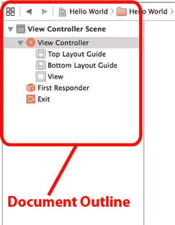

Figure 2-17. `Document Outline` 包含了故事板中所有内容的有用层级表示

点击编辑区域左下角的小按钮，你会看到 `Document Outline` 从左侧滑入。这显示了故事板的所有内容，分为包含相关内容的**场景**。在我们的例子中，只有一个场景，名为 **`View Controller Scene`**。你会看到它包含一个名为 `View Controller` 的项，而该项又包含一个名为 **`View`** 的项（以及你稍后将了解的其他一些内容）。这是概览内容的非常便捷的方式。你在主编辑区域看到的所有内容都在这里镜像显示。

**`View`** 图标代表 `UIView` 类的一个实例。`UIView` 对象是用户可以看到和与之交互的区域。在这个应用程序中，我们当前只有一个视图，所以这个图标代表用户在我们的应用程序中可以看到的所有内容。稍后，我们将构建具有多个视图的更复杂的应用程序。现在，只需将这个视图视为用户使用你的应用程序时可以看到的一个对象。

如果你点击 **`View`** 图标，Xcode 会自动高亮我们之前讨论过的正方形屏幕轮廓。这就是你可以以图形方式设计用户界面的地方。

### The Library

实用工具视图占据了工作区的右侧，分为两个部分（参见 Figure 2-18）。如果你当前没有看到实用工具视图，请点击工具栏中最右侧的三个 **`View`** 按钮之一，选择 **`View`  `Utilities`  `Show Utilities`**，或按下  **`0`**（`Option-Command-Zero`）。

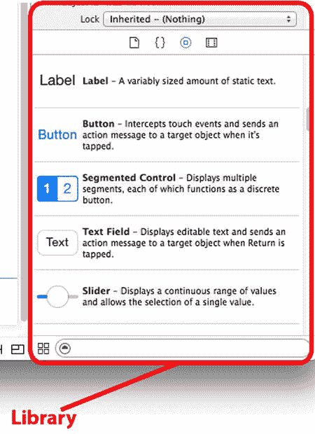

Figure 2-18. 库是你找到 UIKit 中可用于 Interface Builder 的现成对象的地方。库上方但位于工具栏下方的所有内容统称为检查器

实用工具视图的下半部分被称为 **`Library Pane`**，或简称为 **`Library`**。`Library` 是可以在你自己的程序中使用的可重用项目的集合。库窗格顶部栏中的四个图标将其分为四个部分：

*   **`File Template Library`**：此部分包含一组文件模板，当需要向项目添加新文件时可以使用。例如，如果要向项目添加新文件，一种方法是从 `File Template Library` 中拖入所需类型的文件。
*   **`Code Snippet Library`**：此部分包含一组代码片段，你可以将其拖入源代码文件中。记不住 Objective-C 快速枚举的语法？没关系——只需将该特定片段从库中拖出，你就不需要去查了。你是否编写了一些你认为以后可能会再次使用的内容？在文本编辑器中选中它，然后将其拖到 `Code Snippet Library` 中。
*   **`Object Library`**：此部分充满了可重用对象，例如文本字段、标签、滑块、按钮以及设计 iOS 界面所需的几乎所有对象。在本书中，我们将大量使用 `Object Library` 来构建示例程序的界面。
*   **`Media Library`**：顾名思义，此部分用于所有媒体文件，包括图片、声音和电影。

**注意** `Object Library` 中的项目主要来自 iOS UIKit，这是一个用于创建应用用户界面的对象框架。`UIKit` 在 Cocoa Touch 中的作用与 `AppKit` 在 Cocoa 中的作用相同。这两个框架在概念上相似；然而，由于平台的差异，它们之间显然存在许多不同之处。另一方面，Foundation 框架类，如 `NSString` 和 `NSArray`，在 Cocoa 和 Cocoa Touch 中是共享的。


## 排版后的内容

请注意库底部的搜索字段。想找一个按钮吗？在搜索字段中输入`button`，当前库将仅显示名称中包含“button”的条目。完成搜索后，别忘了清除搜索字段。

### 向视图中添加标签

让我们尝试一下 Interface Builder。点击库顶部的**对象库**图标（看起来像一个中心有正方形的圆形——你可以在图 2-18 中看到它），打开对象库。纯粹为了好玩，滚动库找到**表格视图**。没错——继续滚动，你就会找到它。或者等等！有更好的方法：只需在搜索字段中输入`Table View`。是不是简单多了？

**提示** 这里有一个便捷的快捷键：按下`^``3`即可跳转到搜索字段并高亮其内容。接下来，你只需输入要搜索的内容即可。

现在在库中找到一个**标签**。接着，将标签拖到我们之前看到的视图上。（如果你在编辑器窗格中没有看到该视图，请点击 Interface Builder 文档大纲中的**视图**图标。）当你的光标移动到视图上时，它会变成你在 Finder 中熟悉的、标准的“我正在复制东西”绿色加号。将标签拖到视图中央。当标签居中时，会显示一对蓝色参考线——一条垂直，一条水平。标签是否居中并不重要，但知道有这些参考线是件好事。图 2-19 显示了我们在松开拖拽前的工作区样子。

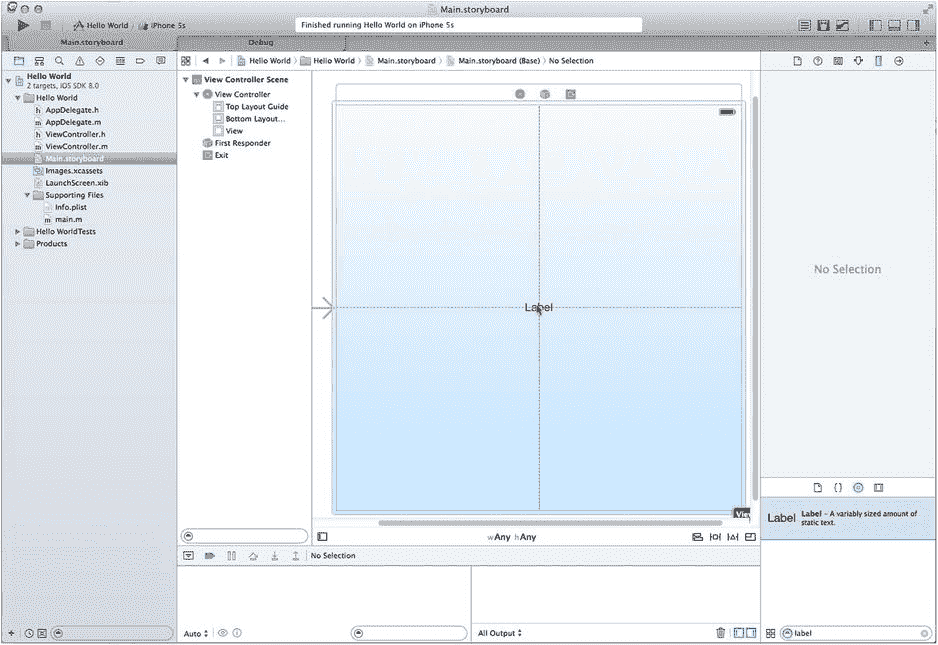

图 2-19。我们从库中找到一个标签并将其拖到了视图上。请注意，我们在库搜索字段中输入了`Label`，以将对象列表限制为包含`Label`一词的那些元素。

用户界面项按层次结构存储。大多数视图可以包含**子视图**；然而，有些视图（如按钮和大多数其他控件）不能包含子视图。Interface Builder 是智能的。如果一个对象不接受子视图，你将无法将其他对象拖到它上面。

通过直接将标签拖到我们正在编辑的视图上，我们将其添加为该主视图（名为**视图**的视图）的子视图，这将在该视图显示给用户时自动显示。将库中的标签拖到名为**视图**的视图上，会添加一个`UILabel`实例作为我们应用程序主视图的子视图。

让我们编辑标签，使其显示一些有意义的内容。双击你刚刚创建的标签，然后输入文本**Hello, World!**。接下来，点击标签外部，然后重新选中它并拖动标签，使其重新居中或将其放置到你希望它在屏幕上出现的任意位置。

猜猜看？一旦保存，我们就完成了。选择**文件**`保存`，或按下`S`。现在查看 Xcode 项目窗口左上角的弹出菜单。这实际上是一个多段弹出控件。左侧让你选择不同的编译目标并执行一些其他操作，但我们感兴趣的是右侧，它让你选择要在哪个设备上运行。点击右侧，你会看到一个可用设备列表。在顶部，如果你插入了任何 iOS 设备并准备就绪，你会看到它列出。否则，你只会看到一个通用的**iOS 设备**条目。在该条目下方，你会看到一个由**iOS 模拟器**引领的完整部分，列出了所有可以与 iOS 模拟器一起使用的设备类型。从该下部区域中，选择**iPhone 5s**，这样我们的应用程序将在模拟器中运行，配置成如同 iPhone 5s 一样。如果你已是苹果付费的 iOS 开发者计划成员，你可以尝试在自己的设备上运行应用程序。在本书中，我们将尽可能使用模拟器，因为在模拟器中运行不需要任何付费会员资格。

准备好运行了吗？选择**产品**`运行`或按下`R`。Xcode 将编译你的应用程序并在 iOS 模拟器中启动它（参见图 2-20）。

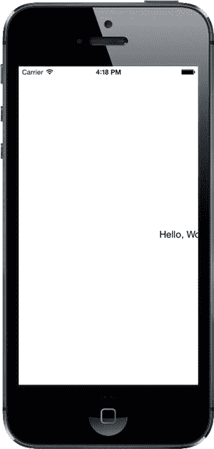

图 2-20。这就是在全屏 iPhone 中显示的 Hello World 程序！但似乎有些不对劲……

**注意** 如果在构建和运行时你的 iOS 设备已连接到 Mac，情况可能不会完全按计划进行。简而言之，为了能够在你的 iPhone、iPad 或 iPod touch 上构建和运行应用程序，你必须注册并付费加入苹果的 iOS 开发者计划之一，然后经历正确配置 Xcode 的过程。加入计划后，苹果会向你发送完成此操作所需的信息。同时，本书中的大部分程序都可以使用 iPhone 或 iPad 模拟器正常运行。

嗯，这不太对。标签在 Interface Builder 中是居中的，但在模拟器上，它却远远偏右。哪里出错了？当你放置一个视图时，除非你另有说明，Interface Builder 会假定你将其定位在相对于你放置它的视图的左上角。问题在于我们放置标签的视图比运行应用程序的模拟 iPhone 屏幕更宽。当我们在 Interface Builder 中居中标签时，我们并没有在我们用于测试应用程序的屏幕上居中它。这是一个你会一直面临的问题——你的应用程序最终运行的设备屏幕可能与你在 Interface Builder 中使用的设计界面尺寸不同。正如我们之前所说，这是有意为之——苹果希望你尽可能在抽象的方形视图上进行设计，并让你的屏幕布局适应它们在运行时遇到的屏幕。

那么如何解决这个问题呢？早在 iOS 6 中，苹果就添加了一项名为**自动布局**的技术，它允许你为设计中的视图添加**约束**，这些约束表达了视图应如何改变位置和/或大小，以适应屏幕上实际可用的空间。你将从下一章开始看到如何使用 Interface Builder 配置自动布局约束，但眼下，让我们采取一个更简单的方法——我们将更改作为设计基础的方形视图，使其看起来更像我们实际运行应用程序的 iPhone 模拟器。为此，在项目导航器中选中`Main.storyboard`，然后点击工具区顶部的检查器选择窗格中的**文件检查器**图标，如图 2-21 所示。

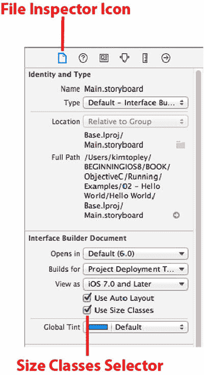


图 2-21 为 iPhone 重新配置故事板

在“文件检查器”面板的底部附近，你会看到两个复选框，分别标有 `使用自动布局` 和 `使用尺寸类别`，这两个复选框都处于选中状态。点击 `使用尺寸类别` 复选框取消选择。执行此操作时，Xcode 会提示你确认，并询问是否要保留 iPhone 或 iPad 的尺寸类别数据。选择保留 iPhone 的尺寸类别数据，然后点击 `禁用尺寸类别`。随即，编辑器区域中的屏幕轮廓会调整大小，看起来像一部 iPhone（参见图 2-22），并且你可以清楚地看到为什么你的标签没有出现在正确的位置。

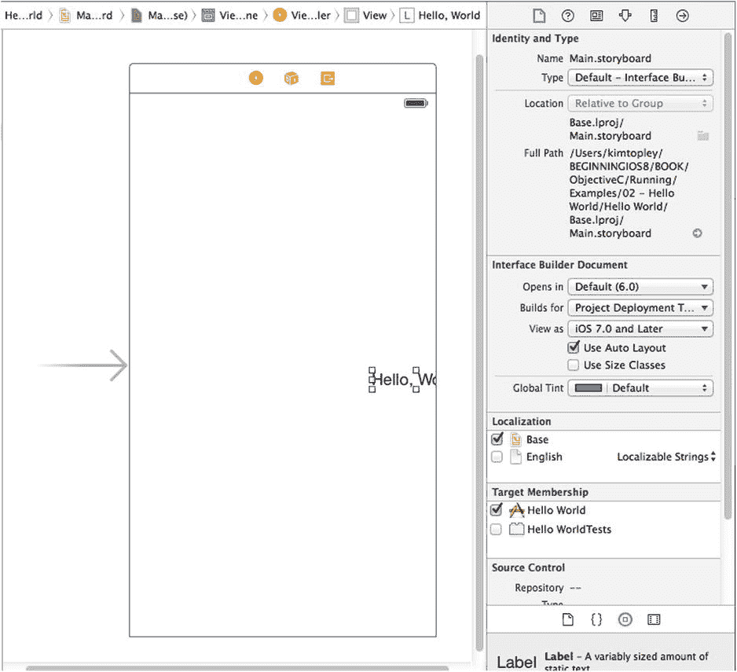

图 2-22 禁用尺寸类别并为 iPhone 配置的故事板编辑器

现在将标签拖回中心位置，再次运行应用程序——这一次，标签应该出现在你期望的位置（图 2-23）。

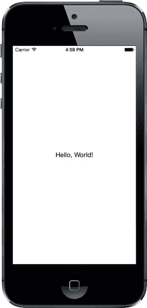

图 2-23 按计划运行的 Hello World 应用程序

欣赏完你的作品后，可以返回 Xcode。Xcode 和模拟器是独立的应用程序。等等，就这样吗？但我们没有编写任何代码。没错。

挺不错的，对吧？

那么，如果我们想更改标签的一些属性，比如文本大小或颜色呢？我们需要编写代码来实现，对吧？不用。让我们来看看修改起来有多简单。

### 更改属性

返回 Xcode，单击 `Hello World` 标签以将其选中。现在将注意力转向库面板上方的区域。实用工具面板的这一部分称为 `检查器`。正如你在图 2-21 中看到的，检查器面板顶部有一系列图标，每个图标都会将检查器更改为查看特定类型的数据。要更改标签的属性，我们需要左起第四个图标，它会调出属性检查器（参见图 2-24）。

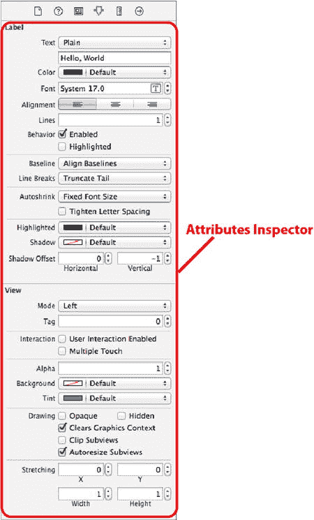

图 2-24 显示标签属性的对象属性检查器

**提示**  `检查器` 与项目导航器一样，其每个图标都有对应的键盘快捷键。检查器的键盘快捷键从左起第一个图标开始是 `1`，下一个图标是 `2`，以此类推。与项目导航器不同，检查器中图标的数量是上下文相关的，会随着导航器和/或编辑器中选中的对象而变化。

现在，随心所欲地更改标签的外观吧。可以自由尝试调整文本的字体、大小和颜色。请注意，如果增大字号，可能需要调整标签本身的大小，以便为更大的文本腾出空间。调整完毕后，保存文件并再次点击 `运行`。你所做的更改应该会显示在应用程序中，而且同样无需编写任何代码。

**注意**  不必过于担心属性检查器中所有字段的含义，也不必因无法实现某些更改而烦恼。随着你深入学习本书，你将了解属性检查器以及其中大多数字段的用途。

通过让你以图形方式设计界面，Interface Builder 使你能够将时间花在编写特定于应用程序的代码上，而不是编写构建用户界面的繁琐代码。

大多数现代应用程序开发环境都提供一些允许你以图形方式构建用户界面的工具。Interface Builder 与许多其他工具的一个区别在于，Interface Builder 不会生成任何需要维护的代码。相反，Interface Builder 会创建 Objective-C 对象，就像你在自己的代码中一样，然后将这些对象序列化到故事板或 nib 文件中，以便在运行时直接加载到内存中。这避免了与代码生成相关的许多问题，并且总体而言是一种更强大的方法。

### 给 iPhone 应用抛光：最后的润色

现在，让我们给应用程序做最后的润色，让它感觉更像一个真正的 iPhone 应用程序。首先，再次运行你的项目。当模拟器窗口出现时，按下 `H`。这将带您返回 iPhone 主屏幕（参见图 2-25）。有没有觉得它有点……单调？

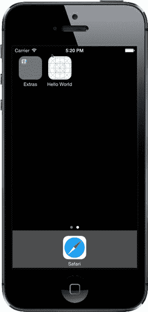

图 2-25 主屏幕上的 Hello World 应用程序

看看屏幕顶部的 `Hello World` 图标。是的，那个图标肯定不行，对吧？要修复它，你需要创建一个图标并将其保存为便携式网络图形（`*.png`）文件。实际上，为了获得最佳效果，你应该创建五个图标，尺寸分别为 180 x 180 像素、120 x 120 像素、87 x 87 像素、80 x 80 像素和 58 x 58 像素。为什么需要这么多图标？这些图标用于 iPhone 主屏幕、“设置”应用以及“聚焦搜索”的结果列表中。这占用了其中三个，但这还不是全部——屏幕更大的 iPhone 6 Plus 需要更高分辨率的图标，又增加了三个。幸运的是，其中一个图标与另一组中的某个图标尺寸相同，所以你实际上只需要创建五个版本的应用程序图标。如果你不提供一些较小的图标，较大的图标会被适当缩小；但为了获得最佳效果，你（或团队中的图形设计师）最好提前进行缩放。

**注意**  图标尺寸的问题甚至比这更复杂。在 iOS 7 之前，所有现代 iPhone 图标的边长是 114 × 114 像素。但如果你仍想支持较旧的非 Retina 屏幕 iPhone，则需要包含一个分辨率减半的图标，即 57 × 57。还有 iPad 的问题，它还有其他图标尺寸，包括 Retina 和非 Retina，针对 iOS 8 及更早版本的 iOS！现在，我们暂时不深入这个兔子洞，只提供运行 iOS 8 的 iPhone 的图标。

创建图标时，不要试图匹配手机上已有按钮的样式；你的 iPhone 会自动圆角化边缘。只需创建普通的方形图像即可。我们在项目归档文件的 `02 - Hello World - icons` 文件夹中提供了一套图标图像。这些图像名为 `icon-180.png`、`icon-120.png`、`icon-87.png`、`icon-80.png` 和 `icon-58.png`；如果你不想自己创建，可以随意使用它们。

**注意**  对于应用程序的图标，你必须使用 `*.png` 图像；事实上，在 iOS 项目中，所有图像都应使用该格式。Xcode 会在构建时自动优化 `*.png` 图像，使其成为 iOS 应用中使用最快、最高效的图像类型。尽管大多数常见的图像格式都能正确显示，但你应该使用 `*.png` 文件，除非你有充分的理由使用其他格式。


好的，作为高级文档工程师和翻译员，我将根据您提供的注意事项和示例，将给定的英文文本翻译成中文，并严格遵循格式要求。


按下`1`打开 Project Navigator，并在 Hello World 组中查找名为 `Images.xcassets` 的项。这是一个称为 **asset catalog**（资源目录）的东西。默认情况下，每个新的 Xcode 项目都会创建一个资源目录，用于存放您的应用图标和其他图片。选中 `Images.xcassets` 并将注意力转向编辑面板。

在编辑面板的左侧，您会看到一个白色列，其中有一个名为 `AppIcon` 的条目。确保选中 `AppIcon` 项。在该列的右侧，您会看到一个白色区域，左上角显示“AppIcon”文本，以及我们刚才提到的五个图标的虚线正方形框（参见图 2-26）。这就是我们要拖放应用图标的地方。

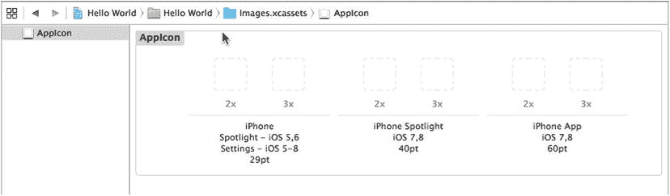

图 2-26 项目资源目录中的 `AppIcon` 框。您可以在此处设置应用程序的图标

您会看到每个图标下方都有一段文字，说明该图标版本将在何处使用，并告知图标应有的尺寸。但这里有个棘手之处：Xcode 以 **points**（点）而非像素显示尺寸。在此上下文中，一个点代表屏幕上的一个特定尺寸。在最早期的 iPhone（iPhone 4 之前的所有设备）以及 iPad 1、iPad 2 和 iPad Mini 上，一个点就是一个像素的大小。在大多数后来的 Retina 显示屏设备上，一个点实际上是 2×2 像素的正方形。但 iPhone 6 Plus 是个例外，其一个点是 3×3 像素的正方形。资源目录中显示的项通过其 `2x` 和 `3x` 标签暗示了这一点，但这些只是标签。要确定某个项实际期望的尺寸，请选中其中一个，然后按下`4`打开窗口右侧的 Attributes Inspector。这将显示尺寸（同样以点为单位）和缩放比例（对于这些图标来说，缩放比例是 `2x` 或 `3x`）。将尺寸乘以缩放比例，即可得到所需的实际像素尺寸。依次选中 `AppIcon` 框中的每个项，Inspector 会提供详细信息。它们应该与我们之前描述的一致，但您永远不知道 Apple 有什么新花样。从本书付印到您阅读本书期间，Apple 可能已推出需要更多图标的新设备！

从 Finder 中将 `icon-120.png` 拖到标有“iPhone App 2x”的项上，将 `icon-180.png` 拖到“iPhone App 3x”上——这些应该是右侧的那些项。这会将那些图标复制到您的项目中，并设置为应用程序的图标。接下来，从 Finder 中将 `icon-80.png` 拖到“iPhone Spotlight 2x”，再将 `icon-120.png`（再次）拖到“iPhone Spotlight 3x”（中间的那组，而非左侧那组），这会将它们设置为应用程序的 **Spotlight** 图标。最后，将 `icon-58.png` 拖到“iPhone Settings 2x”，将 `icon-87.png` 拖到“iPhone Settings 3x”，设置用于 Settings 的图标。

现在编译并运行您的应用程序。当模拟器启动完毕后，按下带有白色方块的按钮返回主屏幕，然后查看您漂亮的新图标。我们的图标如图 2-27 所示。要查看其中一个较小图标的使用情况，请在主屏幕内向下滑动以调出 Spotlight 搜索字段，并开始输入单词 `Hello`——您将立即看到新应用的图标出现。

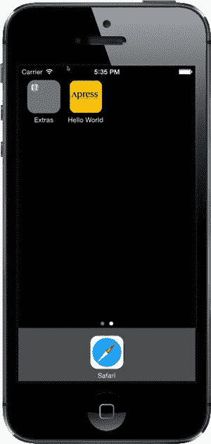

图 2-27 您的应用程序现在有了一个漂亮的图标！

**注意**：在阅读本书的过程中，模拟器的主屏幕将会因我们运行示例应用程序的图标而变得杂乱。如果您想从主屏幕清除旧应用程序，可以从 iOS 模拟器的应用程序菜单中选择 **iOS Simulator → Reset Content and Settings…**。

### 启动屏幕

在继续之前，我们还需要讨论一件事。当您启动应用程序时，您可能注意到了在应用程序加载过程中出现的以白色为主的启动屏幕。iOS 应用程序一直都有启动屏幕。由于将应用程序加载到内存需要时间（应用程序越大，所需时间越长），该屏幕的目的是让用户尽可能快地看到正在发生的事情。在 iOS 8 之前，您可以提供一张图片（实际上可以是多张不同尺寸的图片）作为应用程序的启动屏幕。iOS 会加载正确的图片并立即显示，然后再加载应用程序的其余部分。在 iOS 8 中，您仍然有此选项，但 Apple 现在建议使用 **launch file**（启动文件）而非启动图片，或者如果您的应用程序仍需要支持早期版本，则同时使用启动文件。

什么是启动文件？它是一个包含启动屏幕用户界面的 nib 文件或 storyboard。在运行 iOS 8 的设备上，如果找到了启动文件，则优先使用它而不是启动图片。在 Project Navigator 中查看，您会发现项目中已经有一个启动文件——它叫做 `LaunchScreen.xib`。如果您在 Interface Builder 中打开它，您会看到它包含的内容并不多（参见图 2-28）。

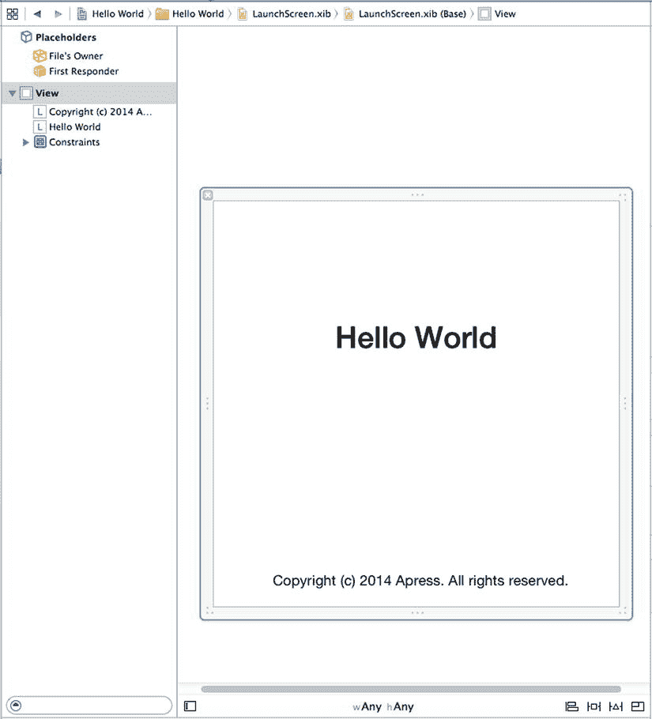

图 2-28 我们应用程序的默认启动文件

默认启动文件包含两个标签，Xcode 会根据您在项目模板选择表中输入的项目和组织名称自动创建它们（参见图 2-3）。Apple 建议不要试图创建复杂或视觉上令人印象深刻的启动屏幕，因此我们也不打算在此尝试。相反，仅为了说明其工作原理，我们将更改其背景颜色。为此，请在 Document Outline 中选择 View 图标，然后打开 Attributes Inspector。找到标有 **Background** 的控件，并选择您喜欢的任何颜色——由于这是 Apress 的书，我选择了黄色。现在只需再次运行应用程序，即可在应用程序本身出现之前看到一闪而过的结果。

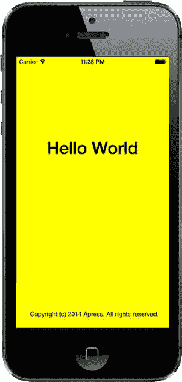

图 2-29\. Hello, World 应用程序的黄色启动屏幕

您可以在 Apple 的 *Human Interface Guidelines* 文档中阅读更多关于启动文件、启动图片和应用图标的信息，该文档位于 `https://developer.apple.com/library/ios/documentation/UserExperience/Conceptual/MobileHIG/IconMatrix.html`。

### 尾声

拍拍自己的肩膀吧。尽管本章中您可能觉得自己并没有完成太多事情，但实际上我们涵盖了很多内容。您了解了 iOS 项目模板，创建了一个应用程序，学到了大量关于 Xcode 6 的知识，开始使用 Interface Builder，并学会了如何设置应用程序图标。

然而，Hello World 程序是一个严格意义上的单向应用程序。我们向用户展示了一些信息，但从未从他们那里获得任何输入。当您准备好了解如何从 iOS 设备用户获取输入并根据该输入采取行动时，请深吸一口气，然后翻到下一页。

第 3 章

处理基本交互


## 我们的 Hello World 应用

我们的 Hello World 应用是使用 Cocoa Touch 进行 iOS 开发的一个良好入门，但它缺少一个关键能力——与用户交互的能力。没有这一能力，我们的应用在功能上会受到严重限制。

在本章中，我们将编写一个稍微复杂一些的应用——它将包含两个按钮和一个标签（见图 3-1）。当用户点击任一按钮时，标签的文本会发生变化。这看起来可能是一个相当简单的例子，但它展示了创建交互式 iOS 应用所涉及的关键概念。为了增加趣味性，我们还将向你介绍 `NSAttributedString` 类，它允许你在许多 Cocoa Touch GUI 元素中使用样式文本。

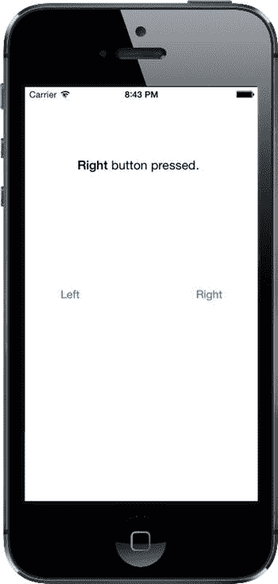

图 3-1. 我们将在本章中构建的简单双按钮应用

### 模型-视图-控制器范式

在深入之前，我们先来了解一些理论。Cocoa Touch 的设计者遵循了一个名为**模型-视图-控制器**（MVC）的概念，这是一种将构成 GUI 应用的代码进行逻辑划分的方法。如今，几乎所有面向对象的框架都在一定程度上借鉴了 MVC，但很少有框架能像 Cocoa Touch 那样忠实于 MVC 模型。

MVC 模式将所有功能分为三个不同的类别：

*   **模型**：持有应用数据的类。
*   **视图**：由窗口、控件和其他用户可以看到并与之交互的元素组成。
*   **控制器**：将模型和视图结合起来的代码。它包含决定如何处理用户输入的应用逻辑。

MVC 的目标是尽可能让实现这三类代码的对象彼此区分开。你创建的任何对象都应能轻易识别为属于三个类别之一，并且很少或没有可归类为其他两个类别的功能。例如，实现按钮的对象不应包含处理该按钮点击时数据的代码，而银行账户的实现也不应包含绘制表格以显示其交易记录的代码。

MVC 有助于确保最大的可重用性。实现通用按钮的类可以在任何应用中使用。而实现一个点击时执行特定计算的按钮的类，则只能在其最初编写的应用中使用。

当你编写 Cocoa Touch 应用时，你将主要使用 Interface Builder 创建视图组件，尽管你也会通过代码修改，甚至有时创建用户界面。

你的模型将通过编写 Objective-C 类来持有应用数据，或使用名为 Core Data 的工具构建数据模型来创建，你将在第 13 章中了解这一点。在本章的应用中，我们不会创建任何模型对象，因为我们不需要存储或保留数据。不过，在后续章节中，随着应用变得越来越复杂，我们将引入模型对象。

你的控制器组件通常由你创建且特定于应用的自定义类组成。控制器可以是完全自定义的类（`NSObject` 的子类），但更多时候，它们会是 UIKit 框架中几个现有通用控制器类的子类，例如 `UIViewController`（你很快就会看到）。通过继承这些现有类之一，你可以免费获得大量功能，而不必浪费时间重新发明轮子。

随着我们深入 Cocoa Touch，你会很快看到 UIKit 框架的类是如何遵循 MVC 原则的。如果在开发过程中牢记这一概念，你将最终创建出更干净、更易于维护的代码。

### 创建我们的项目

现在是时候创建我们的下一个 Xcode 项目了。我们将使用与上一章相同的模板：单视图应用。通过再次从这个简单模板开始，你将更容易理解视图和控制器对象如何在 iOS 应用中协同工作。我们将在后续章节中使用其他一些模板。

启动 Xcode 并选择 **File**  **New**  **Project...** 或按下 **N**。选择 **Single View Application** 模板，然后点击 **Next**。

你将看到与上一章相同的选项表。在 **Product Name** 字段中，输入我们新应用的名称 **Button Fun**。**Organization Name**、**Company Identifier** 和 **Language** 字段应仍保留上一章使用的值（*Apress*、*com.apress* 和 *Objective-C*），因此你可以保持它们不变。在本章中，我们将使用 Auto Layout 创建一个可在所有 iOS 设备上运行的应用，因此在 **Devices** 字段中选择 **Universal**。图 3-2 显示了完成后的选项表。

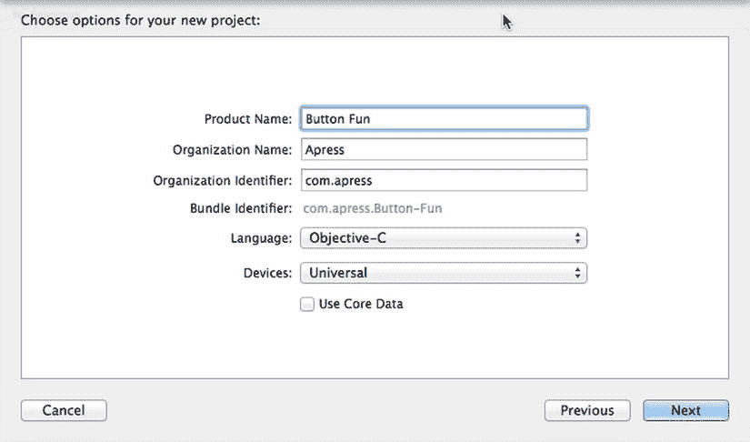

图 3-2. 命名项目并选择选项

点击 **Next**，系统会提示你选择项目的位置。你可以根据需要选中或取消选中 **Create Git repository** 复选框。按 **Create** 并将项目与其他本书项目保存在一起。

### 查看视图控制器

在本章稍后的部分，我们将像上一章一样使用 Interface Builder 为我们的应用设计一个视图（或用户界面）。在此之前，我们将查看并对为我们创建的源代码文件进行一些修改。没错，在本章中我们真的会编写一些代码。

在进行任何修改之前，让我们看看为我们创建的文件。在项目导航器中，**Button Fun** 组应该已经展开；但如果没有，请点击其旁边的展开三角形（见图 3-3）。

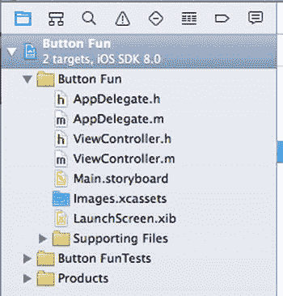

图 3-3. 项目导航器显示项目模板为我们创建的类文件

**Button Fun** 文件夹应包含四个源代码文件（以 `.h` 或 `.m` 结尾的文件），以及一个故事板文件、一个启动屏幕文件和一个用于存放应用所需任何图片的资源目录。这四个源代码文件实现了我们的应用所需的两个类：应用委托和视图控制器（用于应用唯一的视图）。

我们将在本章稍后部分查看应用委托。首先，我们将处理为我们创建的视图控制器类。

名为 `ViewController` 的控制器类负责管理我们应用的视图。这个名称表明该类是一个视图控制器。在项目导航器中点击 `ViewController.h`，查看该类头文件的内容：

```
#import <UIKit/UIKit.h>

@interface ViewController : UIViewController

@end
```

内容不多，对吧？`ViewController` 是 `UIViewController` 的子类，后者是我们之前提到的通用控制器类之一。它是 UIKit 框架的一部分，通过继承这个类，我们可以免费获得大量功能。Xcode 不知道我们的应用特定功能是什么，但它知道我们会有一些，因此它创建了这个类供我们编写这些应用特定功能。

### 理解输出口和动作


在 Chapter 2 中，您使用 Xcode 的 Interface Builder 设计了一个简单的用户界面。刚才，您看到了一个视图控制器类的框架。这个视图控制器类中的代码必须以某种方式与故事板中的对象进行交互，对吗？

当然可以！控制器类可以通过一种称为**出口**的特殊属性来引用故事板或 nib 文件中的对象。可以将出口视为指向用户界面中某个对象的指针。例如，假设您在 Interface Builder 中创建了一个文本标签（正如我们在 Chapter 2 中所做的那样），并希望从代码中更改该标签的文本。通过声明一个出口并将该出口连接到标签对象，您就可以在代码中使用该出口来更改标签显示的文本。您将在本章中了解如何实现这一点。

相反方向，故事板或 nib 文件中的界面对象可以设置为触发控制器类中的特殊方法。这些特殊方法称为**动作方法**（或简称**动作**）。例如，您可以告诉 Interface Builder，当用户点击按钮时，应调用代码中的特定动作方法。您甚至可以告诉 Interface Builder，当用户首次触摸按钮时，调用一个动作方法；然后，当手指从按钮上抬起时，调用另一个不同的动作方法。

Xcode 支持多种创建出口和动作的方式。一种方式是在源代码中指定它们，然后再使用 Interface Builder 将它们与代码连接。Xcode 的助理视图提供了一种更快、更直观的方法，让您可以在一步中创建并连接出口和动作，我们稍后将探讨这一过程。但在开始建立连接之前，让我们更详细地讨论一下出口和动作。出口和动作是您创建 iOS 应用时最基础的两个构建块，因此理解它们是什么以及如何工作非常重要。

#### 出口

出口是使用关键字`IBOutlet`声明的特殊 Objective-C 类属性。声明出口可以在控制器的类头文件中进行，也可以在控制器实现文件的一个特殊部分（称为**类扩展**）中进行。它可能看起来像这样：

```
@property (weak, nonatomic) IBOutlet UIButton *myButton;
```

这个例子是一个名为`myButton`的出口，它可以被设置为指向用户界面中的任何按钮。

`IBOutlet`关键字并非 Objective-C 语言的内置部分。它是系统头文件中的一个简单 C 预处理器定义，看起来像这样：

```
#ifndef IBOutlet
#define IBOutlet
#endif
```

感到困惑吗？`IBOutlet`对编译器而言绝对不做任何事。它的唯一目的是作为一个提示，告诉 Xcode 这是一个我们想要连接到故事板或 nib 文件中对象的属性。您创建并希望连接到故事板或 nib 文件中对象的任何属性，都必须以`IBOutlet`关键字开头。幸运的是，Xcode 现在会自动为我们创建出口。

##### 出口的变更

随着时间的推移，Apple 改变了出口的声明和使用方式。由于您可能在某时遇到旧代码，让我们看看出口是如何变化的。

在本书的第一版中，我们为出口同时声明了属性及其底层实例变量。那时，属性是 Objective-C 语言中的一个新结构，它们要求您声明一个对应的实例变量：

```
@interface MyViewController : UIViewController
{
    UIButton *myButton;
}
@property (weak, nonatomic) UIButton *myButton;
@end
```

当时，我们将`IBOutlet`关键字放在实例变量声明之前：

```
IBOutlet UIButton *myButton;
```

这是当时 Apple 示例代码的写法。这也是`IBOutlet`关键字在 Cocoa 和 NeXTSTEP 中的传统用法。

到了我们编写本书第二版时，Apple 已经不再将`IBOutlet`关键字放在实例变量之前，而是标准做法是将其放在属性声明中：

```
@property (weak, nonatomic) IBOutlet UIButton *myButton;
```

尽管这两种方法仍然有效（并且现在仍然有效），但我们遵循了 Apple 的指导，修改了书中的代码，使`IBOutlet`关键字位于属性声明而非实例变量声明中。

当 Apple 最近将默认编译器从 GNU C 编译器（GCC）切换到低级虚拟机（LLVM）时，为属性声明实例变量变得不再必要。如果 LLVM 发现一个没有匹配实例变量的属性，它会自动创建一个。因此，在本书的这个版本中，我们完全停止为出口声明实例变量。

所有这些方法都做完全相同的事情，即告诉 Interface Builder 出口的存在。将`IBOutlet`关键字放在属性声明上是 Apple 当前的推荐做法，因此我们将使用这种方式。但我们希望让您了解这段历史，以防您遇到旧代码在实例变量上放置`IBOutlet`关键字的情况。

您可以在 Scott Knaster、Waqar Malik 和 Mark Dalrymple 所著的*Learn Objective-C on the Mac*（Apress，2012）以及 Apple 开发者网站上的文档*Introduction to the Objective-C Programming Language*（位于`http://developer.apple.com/library/ios/#documentation/Cocoa/Conceptual/ProgrammingWithObjectiveC`）中了解更多关于 Objective-C 属性的信息。

#### 动作

简而言之，动作是使用特殊返回类型`IBAction`声明的方法，它告诉 Interface Builder 此方法可以由故事板或 nib 文件中的控件触发。动作方法的声明通常如下所示：

```
- (IBAction)doSomething:(id)sender;
```

它也可能看起来像这样：

```
- (IBAction)doSomething;
```

方法的具体名称可以是任何内容，但返回类型必须为`IBAction`，这与声明返回类型为`void`是一样的。`void`返回类型用于指定方法不返回值。此外，该方法要么不接收参数，要么接收一个参数，通常称为`sender`。当动作方法被调用时，`sender`将包含调用它的对象的指针。例如，如果该动作方法是在用户点击按钮时触发的，那么`sender`将指向被点击的按钮。`sender`参数的存在使您能够使用单个动作方法响应多个控件。它为您提供了一种识别哪个控件调用了该动作方法的方式。

**提示** 实际上还有第三种不太常用的`IBAction`声明类型，如下所示：

```
- (IBAction)doSomething:(id)sender
                   forEvent:(UIEvent *)event;
```

我们将在下一章开始讨论控件事件。

如果您用`sender`参数声明一个动作方法然后忽略它，这并不会造成任何问题。您很可能会看到大量代码正是这样做的。Cocoa 和 NeXTSTEP 中的动作方法无论是否使用`sender`，都需要接受它，因此很多 iOS 代码，尤其是早期的 iOS 代码，都是这样编写的。

现在您已经理解了动作和出口是什么，您将在设计用户界面时看到它们如何工作。然而，在开始设计之前，我们还有一项快速的内务处理要做，以保持一切整洁有序。

### 清理视图控制器


好的，作为一名高级文档工程师和翻译员，我将严格按照您提供的注意事项和示例，将给定的英文文本翻译成中文。

译文如下：


在 Project Navigator 中单击 `ViewController.m` 即可打开实现文件。如你所见，里面包含少量样板代码，即项目模板提供的 `viewDidLoad` 和 `didReceiveMemoryWarning` 方法。这些方法在 `UIViewController` 子类中很常用，因此 Xcode 为我们生成了它们的存根实现。如果需要使用这些方法，我们只需在其中添加自己的代码即可。但在这个项目中，我们不需要这两个存根实现，它们只会占用空间并增加代码阅读难度。我们将为自己未来的开发工作着想，清除不需要的方法，所以请继续删除这些方法。

在文件顶部，你还会看到一个可供使用的空类扩展。类扩展是一种特殊的 Objective-C 类别声明，允许你在同一文件中声明仅可在类的主实现块内使用的方法和属性。我们将使用类扩展来存放视图控制器的 Outlet。这是 iOS 应用中常见的模式。我们将 Outlet 放在类扩展中，是因为它们不需要对视图控制器之外的代码可见。相比之下，需要被其他类使用的属性和方法应声明在 `ViewController.h` 中。完成后，你的实现文件应如下所示：

```
#import "ViewController.h"

@interface ViewController ()

@end

@implementation ViewController

@end
```

这样简洁多了，对吧？不必担心刚才删除的那些方法，你将在本书后续部分了解它们的作用及用法。

### 设计用户界面

确保保存了刚才的更改，然后单击 `Main.storyboard` 以在 Xcode 的 Interface Builder 中打开应用的视图（见图 3-4）。如上一章所述，编辑器中显示的白**色窗口**代表应用的唯一视图。回顾图 3-1，可以看到我们需要向此视图添加两个按钮和一个标签。

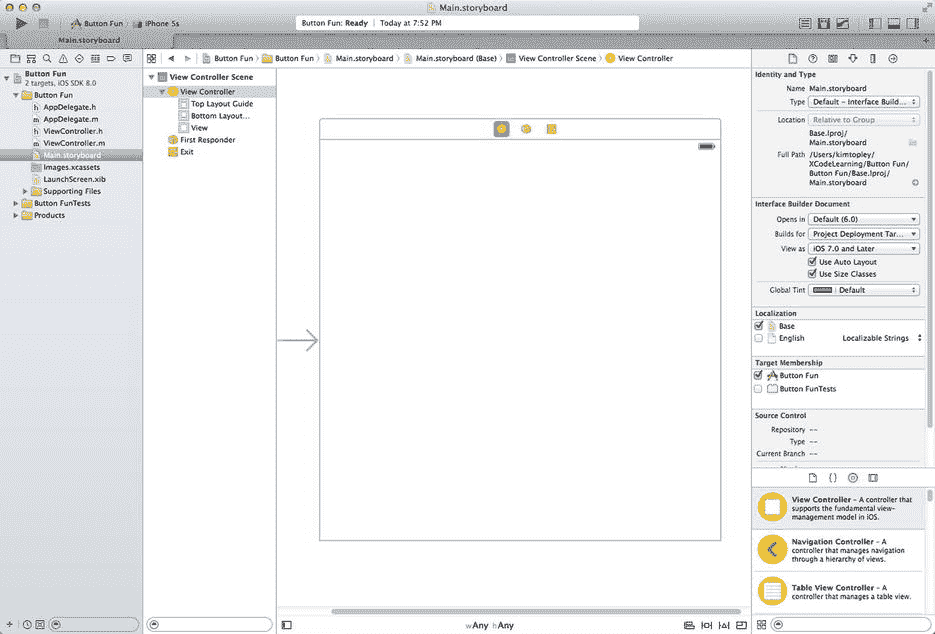

图 3-4. 在 Xcode 的 Interface Builder 中打开 `Main.storyboard` 进行编辑

让我们花点时间思考一下应用的设计。我们将向用户界面添加两个按钮和一个标签，这个过程与上一章非常相似。不过，我们还需要 Outlet 和 Action 来使应用具有交互性。

每个按钮都需要触发控制器上的一个 Action 方法。我们可以让每个按钮调用不同的 Action 方法；但由于它们执行的任务本质相同（更新标签的文本），因此我们将调用同一个 Action 方法。我们将使用之前讨论过的 `sender` 参数来区分这两个按钮。除了 Action 方法之外，我们还需要一个连接到标签的 Outlet，以便更改标签显示的文本。

我们先添加按钮，再放置标签。在设计界面时，我们将创建相应的 Action 和 Outlet。当然，我们也可以手动声明 Action 和 Outlet，然后将用户界面元素连接到它们，但当 Xcode 能替我们完成时，何必多此一举呢？

#### 添加按钮和 Action 方法

我们的首要任务是向用户界面添加两个按钮。然后我们将让 Xcode 为我们创建一个空的 Action 方法，并将两个按钮都连接到该方法。当用户点击按钮时，该方法中的任何代码都将被执行。

选择 **View** → **Utilities** → **Show Object Library**，或按 **⌃⌘3** 以打开对象库。在对象库的搜索框中输入 **UIButton**（实际上只需输入前四个字符 **uibu** 即可缩小列表范围——并且你可以全部使用小写字母，省去按 Shift 键的麻烦）。输入完成后，对象库中应只显示一个项目：Button（按钮）（见图 3-5）。

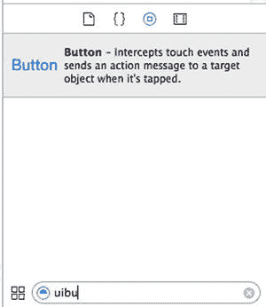

图 3-5. 对象库中显示的 Button

将 Button 从库中拖出并放到编辑区内的白色窗口上，这将向应用的视图中添加一个按钮。使用出现的蓝色参考线将按钮放置在视图左侧，与左边缘保持适当距离。对于垂直位置，使用蓝色参考线将按钮放置在视图中间位置。如有需要，可以参考图 3-1 作为放置指南。

**注意**：在 Interface Builder 中移动对象时出现的小蓝线，是为了帮助你遵循《iOS 人机界面指南》（通常称为 **HIG**）。Apple 为 iPhone 和 iPad 应用的设计者提供了 HIG。HIG 告诉你应该如何（以及不应该如何）设计用户界面。你真的应该阅读它，因为它包含每个 iOS 开发者都需要了解的宝贵信息。你可以在 `http://developer.apple.com/library/ios/documentation/UserExperience/Conceptual/MobileHIG/` 找到它。

双击刚刚添加的按钮，以便编辑按钮的标题。将此按钮的标题设置为“Left”。

现在，是时候施展 Xcode 的魔法了。选择 **View** → **Assistant Editor** → **Show Assistant Editor**，或按 **⌥⌘** 以打开 Assistant Editor。你也可以通过点击项目窗口右上角七个按钮组中间的编辑器按钮（见图 3-6）来显示或隐藏 Assistant Editor。

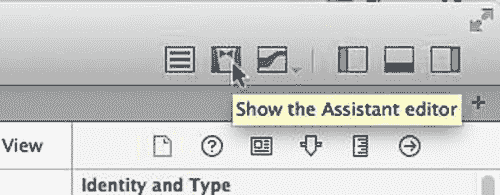

图 3-6. 显示 Assistant Editor 的切换按钮

Assistant Editor 将出现在编辑窗格的右侧。左侧将继续显示 Interface Builder，而右侧将显示 `ViewController.h` 或 `ViewController.m`，即“拥有”你当前查看视图的视图控制器的头文件和实现文件。

**提示**：打开 Assistant Editor 后，你可能需要调整窗口大小以获得足够的操作空间。如果你使用的是较小屏幕（例如 MacBook Air 的屏幕），可能需要关闭工具区（Utility View）和/或项目导航器（Project Navigator），以便为有效使用 Assistant Editor 腾出空间。你可以通过项目窗口右上角的三个视图按钮（见图 3-6）轻松完成此操作。


Xcode 知道我们的视图控制器类负责在 storyboard 中显示视图，因此助理编辑器会自动显示该视图控制器类的实现文件——这是我们最可能需要连接操作和插座变量的地方。不过，如果它没有显示你想要查看的文件，你可以使用助理编辑器顶部的跳转栏进行调整。首先，找到跳转栏中标有**自动**的段落并点击它。在弹出的菜单中选择**手动**  **按钮乐趣**  **按钮乐趣**  **ViewController.m**。现在你应该看到正确的文件了。

正如之前所见，`ViewController` 类中其实没有太多内容。它只是一个空的 `UIViewController` 子类。但它很快就会不再是空的子类了！

现在，我们将让 Xcode 自动为我们创建一个新的操作方法，并将该操作与我们刚刚创建的按钮关联起来。我们要将这些定义添加到视图控制器的类扩展中。为此，首先点击你在 storyboard 中添加的按钮，使其处于选中状态。然后，按住键盘上的 **Control** 键，从按钮上点击并拖拽到助理编辑器中的源代码处。你应该会看到一条从按钮延伸到光标的蓝线（参见图 3-7）。这条蓝线就是我们如何将 IB 中的对象连接到代码或其他对象的方法。

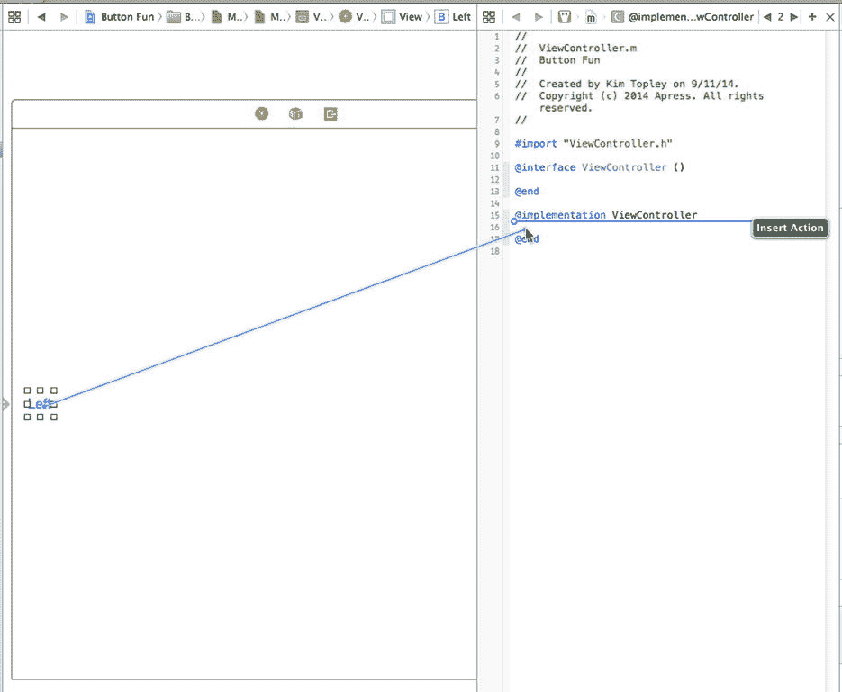

图 3-7. 按住 Control 键拖拽到源代码，将提供创建操作的选项

如果你将光标移动到类实现中（即 `@implementation` 和 `@end` 关键字之间——参见图 3-7），会出现一个灰色弹出窗口，提示你释放鼠标按钮将为你插入一个操作。

**注意** 我们在本章中使用操作和插座变量，并在本书后续章节中使用插座集合。插座集合允许你将多个同类型对象连接到一个 `NSArray` 属性上，而无需为每个对象创建单独的属性。

要完成这个连接，请松开鼠标按钮，这时会出现一个浮动弹出窗口，如图 图 3-8 所示。这个窗口允许你自定义新的操作。

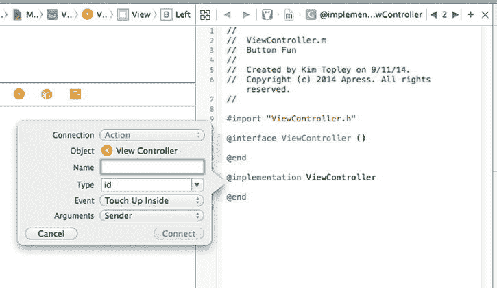

图 3-8. 按住 Control 键拖拽到源代码后出现的浮动弹出窗口

在 **名称** 字段中，输入 **buttonPressed**。完成后，*不要*按 **Return** 键。按 **Return** 会确认我们的插座变量，但我们还没准备好那样做。相反，请按 **Tab** 键移动到 **类型** 字段，并输入 **UIButton**，替换默认的 `id` 值。

**注意** 你可能还记得，*id* 是一个通用指针，可以指向任何 Objective-C 对象。我们可以保留 `id`，它也能正常工作；但如果我们将它改为我们预期调用该方法的类，那么当我们尝试从错误类型的对象调用时，编译器会发出警告。有时你可能需要灵活性，以便从不同类型的控件调用同一个操作方法，在这些情况下，你应将其保留为 `id`。在我们的例子中，我们只打算从按钮调用这个方法，所以我们让 Xcode 和编译器知道这一点。这样，如果我们无意中尝试连接其他东西，它们会警告我们。

**类型** 下方还有两个字段，我们将保留它们的默认值。**事件** 字段让你指定方法被调用的时机。默认值 **Touch Up Inside** 在用户从屏幕上抬起手指时触发——当且仅当手指仍然在按钮上时。这是按钮的标准事件。这给了用户重新考虑的机会。如果用户在抬起手指前将手指移出按钮，该方法将不会被触发。

**参数** 字段让你在可用于操作方法的三种不同方法签名之间进行选择。我们需要 `sender` 参数，以便分辨是哪个按钮调用了该方法。这是默认设置，所以我们保持原样。此时，弹出窗口应该与图 3-9 中的一样。

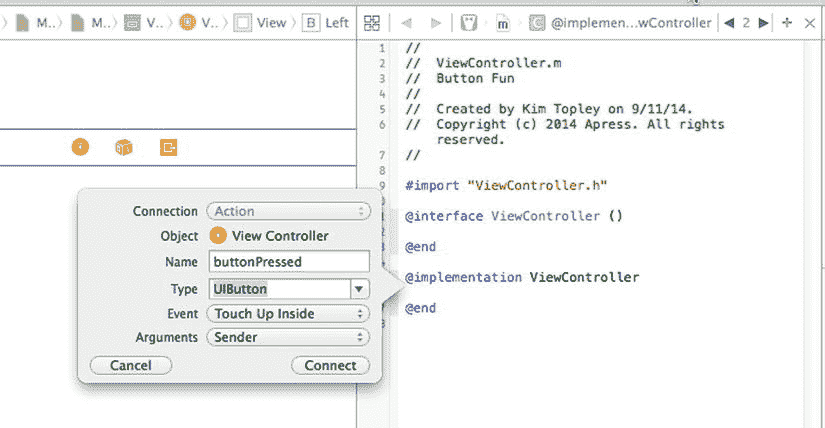

图 3-9. 完成的操作弹出窗口

按 **Return** 键或点击 **连接** 按钮，Xcode 将为你插入操作方法。`ViewController.m` 文件现在应该看起来像这样：

```
@interface ViewController ()

@end

@implementation ViewController

- (IBAction)buttonPressed:(UIButton *)sender {
}

@end
```

稍后，我们将回到这里编写用户点击任一按钮时需要运行的代码。

除了创建方法存根，Xcode 还将该按钮连接到了该方法，并将该信息存储在了 storyboard 中。这意味着我们无需再做任何其他操作，就能让该按钮在应用程序运行时调用此方法。

回到 `Main.storyboard`，拖出另一个按钮，这次将按钮放置在屏幕的右侧。蓝色参考线会出现，帮助你将其与右边界对齐，就像你之前看到的那样，同时它们还会帮助你与另一个按钮垂直对齐。放置按钮后，双击它并将其名称改为 *Right*。

**提示** 除了从库中拖出新对象，你也可以按住 `` 键（**Option** 键）并拖出原始对象（本例中是 **Left** 按钮）的副本。按住 `` 键会告诉 Interface Builder 复制你拖动的对象。

这次，我们不想创建新的操作方法。相反，我们希望将这个按钮连接到 Xcode 刚才为我们创建的现有操作方法上。怎么做呢？操作方法基本上和第一个按钮一样。

更改按钮名称后，按住 Control 键点击它，并向助理编辑器中的代码拖拽。拖向 `buttonPressed:` 方法的声明处。这次，当你的光标靠近 `buttonPressed:` 时，该方法应该会高亮显示，并且你会看到一个灰色的弹出窗口，上面写着 **Connect Action**（参见图 3-10）。看到这个弹出窗口时，松开鼠标按钮，Xcode 就会将该按钮连接到操作方法上。这将导致该按钮在被点击时触发与另一个按钮相同的操作方法。

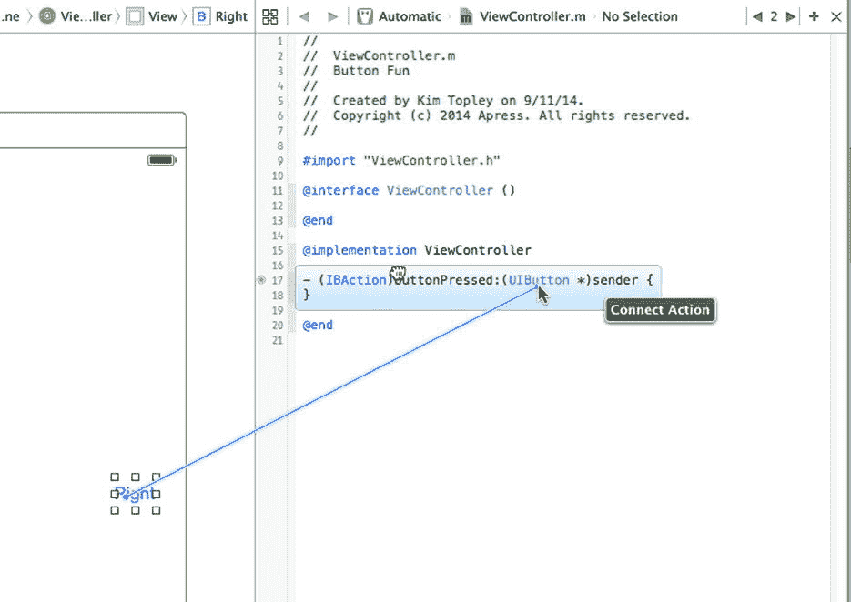

图 3-10. 拖拽到现有操作会将按钮连接到现有操作

#### 添加标签和插座变量

在对象库中，在搜索字段中输入 *Label* 以找到 *Label* 用户界面项（*参见* 图 3-11）。将 *Label* 拖拽到你的用户界面中，位于之前放置的两个按钮上方某处。放置后，使用调整大小手柄将标签从左边界拉伸到右边界。这样应该能为我们将要向用户显示的文本留出足够的空间。

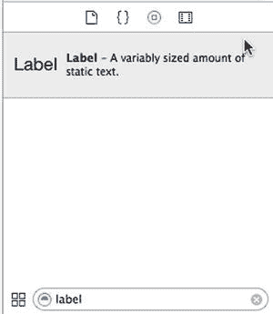

图 3-11. 标签在对象库中的显示效果


```markdown

标签中的文本默认是左对齐的，但我们希望此标签中的文本居中。选择 **视图**  **实用工具**  **显示属性检查器**（或按 ******4**）以打开属性检查器（参见图 3-12）。确保标签处于选中状态，然后在属性检查器中找到**对齐**按钮。选择中间的**对齐**按钮以使标签文本居中。

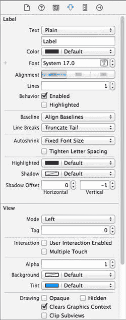

图 3-12 标签的属性检查器

在用户点击按钮之前，我们不希望标签显示任何内容，因此双击标签（使文本处于选中状态），然后按键盘上的 **Delete** 按钮。这将删除当前分配给标签的文本。按 **Return** 确认更改。即使未选中时看不到标签，也无需担心——它仍然存在。

**提示** 如果您有不可见的用户界面元素（如空标签）并且希望能够看到它们的位置，请从 **编辑器** 菜单中选择 **画布**。然后，从弹出的子菜单中，打开 **显示边界矩形**。

剩下的工作就是为标签创建一个出口。我们完全按照之前创建和连接操作的方法来进行。确保助理编辑器已打开并显示 `ViewController.m`。如果需要切换文件，请使用助理编辑器上方跳转栏中的弹出菜单。

接下来，在 Interface Builder 中选择标签，然后按住 Control 键从标签拖拽到头文件。一直拖到光标位于现有操作方法的正上方。当看到类似图 3-13 的内容时，松开鼠标按钮，您将看到一个弹出窗口，提供创建 Outlet 或 Outlet Collection 的选项。

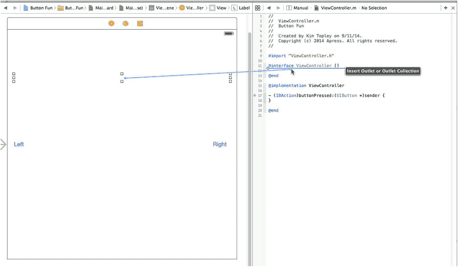

图 3-13 按住 Control 键拖拽以创建出口

我们要创建一个出口，因此将**连接**保留为默认类型**Outlet**。我们希望为此出口选择一个描述性名称，以便在编写代码时记住其用途。在**名称**字段中输入`statusLabel`。将**类型**字段保留为`UILabel`。最后一个字段**存储**可以保留默认值。

按 **Return** 确认更改，Xcode 会将出口属性插入到您的代码中。您的类扩展现在应如下所示：

```
@interface ViewController ()

@property (weak, nonatomic) IBOutlet UILabel *statusLabel;

@end
```

现在我们有了一个出口，并且 Xcode 已自动将该标签连接到我们的出口。这意味着，如果我们在代码中对 `statusLabel` 进行任何更改，这些更改将影响用户界面上的标签。例如，如果我们设置 `statusLabel` 的 `text` 属性，它将更改显示给用户的文本。

**自动引用计数 (ARC)**

如果您已经熟悉 Objective-C，或者阅读过本书的早期版本，您可能会注意到我们没有 `dealloc` 方法。我们并没有释放我们的实例变量！

警告！警告！危险，威尔·罗宾逊！

实际上，威尔，您可以放心。我们完全没问题。完全没有危险——真的。

不再需要手动释放对象。嗯，这并不完全正确。释放对象仍然是必要的，但 Apple 随 Xcode 提供的 LLVM 编译器非常智能，它会使用一个名为**自动引用计数**（简称 ARC）的新功能为我们释放对象。这意味着 `dealloc` 方法的使用频率降低，并且不再需要担心调用 `release` 或 `autorelease`。ARC 是一个巨大的改进，我们在本书的所有示例中都使用了它。ARC 在过去几年中一直是 Xcode 的一个选项，但现在对于您创建的每个新项目，它都是默认启用的。

ARC 仅适用于 Objective-C 对象，不适用于 Core Foundation 对象或使用 `malloc()` 等分配的内存，并且有一些注意事项和陷阱可能会让您出错。但大多数情况下，担心内存管理已经成为过去式。

要了解更多关于 ARC 的信息，请查看此 URL 上的 ARC 发行说明：

```
http://developer.apple.com/library/ios/#releasenotes/ObjectiveC/RN-TransitioningToARC/
```

ARC 非常酷，但它不是魔法。您仍然需要理解 Objective-C 中内存管理的基本规则，以避免在使用 ARC 时遇到麻烦。要复习 Objective-C 内存管理契约，请阅读此 URL 上的 Apple *Memory Management Programming Guide*：

```
http://developer.apple.com/library/ios/#documentation/Cocoa/Conceptual/MemoryMgmt/
```

#### 编写操作方法

到目前为止，我们已经设计了用户界面并连接了出口和操作。剩下的工作就是使用这些操作和出口在按下按钮时设置标签的文本。在项目导航器中单击 `ViewController.m` 以在编辑器中打开它，并找到 Xcode 之前为我们创建的空 `buttonPressed:` 方法。

为了区分两个按钮，我们将使用 `sender` 参数。我们将使用 `sender` 检索被按下按钮的标题，然后基于该标题创建一个新字符串，并将其指定为标签的文本。将以下粗体代码添加到您的空方法中：

```
- (IBAction)buttonPressed:(UIButton *)sender {
    NSString *title = [sender titleForState:UIControlStateNormal];
    NSString *plainText = [NSString stringWithFormat:@"%@ button pressed.", title];
    _statusLabel.text = plainText;
}
```

这非常简单。第一行使用 `sender` 检索被点击按钮的标题。由于按钮可以根据其当前状态（尽管在此示例中并非如此）具有不同的标题，因此我们使用 `UIControlStateNormal` 参数来指定我们希望获取按钮处于正常、未点击状态时的标题。这是您通常希望在向控件（按钮是一种控件）请求其标题时指定的状态。我们将在第 4 章中更详细地讨论控件状态。

下一行通过将文本附加到我们在上一行检索到的标题“button pressed.”来创建一个新字符串。因此，如果标题为 *Left* 的左侧按钮被点击，此行将创建一个字符串，内容为“Left button pressed.”。最后一行将新字符串赋值给标签的 `text` 属性，这就是我们更改标签显示文本的方式。

**消息嵌套**

Objective-C 消息通常是嵌套的。您可能会在旅途中遇到如下代码：

```
NSString *plainText = [NSString stringWithFormat:@"%@ button
    pressed.",
    [sender titleForState:UIControlStateNormal]];
```

这一行（逻辑上的）代码的功能与 `buttonPressed:` 方法的前两行完全相同。这是因为 Objective-C 方法可以嵌套，这本质上是用嵌套方法调用的返回值进行替换。

为了清晰起见，本书中的代码示例通常不会嵌套 Objective-C 消息，但 `alloc` 和 `init` 的调用除外，根据长期以来的惯例，这两个调用几乎总是嵌套的。

#### 试一试

```


猜猜看？我们快完成了。准备好试用我们的应用了吗？现在就开始吧！

选择**产品**  **运行**。如果遇到任何编译或链接错误，请返回并对比你的代码更改与本教程中显示的修改。一旦代码成功构建，Xcode 将启动 iOS 模拟器并运行你的应用程序。如果使用 iPhone 模拟器运行并点击**左**按钮，你将看到类似图 3-14 的效果。

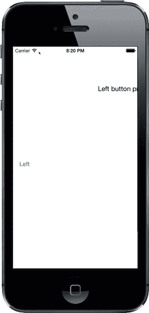

图 3-14. 运行应用程序——布局需要修复

左按钮位置正确，但标签和另一个按钮位置不对。在第 2 章中，我们通过关闭故事板中的**尺寸类别**修复了 Hello World 标签的类似问题，这使设计区域呈现 iPhone 的形状，然后我们重新定位了标签并再次尝试。如果只想在屏幕尺寸与故事板中相同的 iPhone 上运行应用，这个解决方案是可行的。但如果要同时支持 iPhone 和 iPad，它就行不通了——甚至无法在所有 iPhone 上正常工作。幸运的是，有更好的方法来解决这个问题。我们无需更改布局来适应 Interface Builder 中显示的屏幕尺寸，而是通过使用 Auto Layout 让布局适应应用运行的屏幕。Auto Layout 的核心思想是使用约束来指定控件的放置方式。在本例中，我们需要实现以下效果：

*   **左**按钮应垂直居中并靠近屏幕左侧边缘。
*   **右**按钮应垂直居中并靠近屏幕右侧边缘。
*   标签应水平居中，并距屏幕顶部一定间距。

上述每项描述都包含两个约束——一个是水平约束，另一个是垂直约束。如果将这些约束应用于我们的三个视图，Auto Layout 将负责确保它们在任意屏幕上都能正确定位。那么如何实现呢？

你可以在代码中通过创建 `NSLayoutConstraint` 类的实例来向视图添加 Auto Layout 约束。在某些情况下，这是创建正确布局的唯一方法，但在这个案例中（以及大多数情况下），你可以通过 Interface Builder 获得所需的布局。Interface Builder 允许你通过拖拽和点击来直观地添加约束。让我们看看如何操作。

首先，我们来定位标签。在项目导航器中选择 `Main.storyboard`，打开文档大纲以显示视图层次结构。找到标记为**视图**的图标。这代表视图控制器的主视图，我们需要相对于它来定位其他视图。如果**视图**图标尚未展开，点击其展开三角形以显示两个按钮（标记为“左”和“右”）以及标签。按住 **Control** 键，将鼠标从标签拖拽到其父视图，如图 3-15 左侧所示。

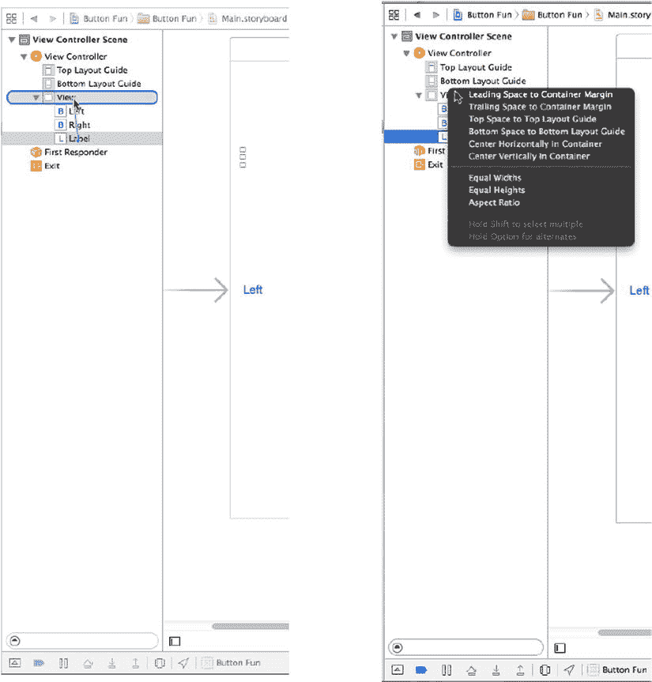

图 3-15. 使用 Auto Layout 约束定位标签

通过从一个视图拖拽到另一个视图，你是在告诉 Interface Builder 你想要在它们之间应用一个 Auto Layout 约束。松开鼠标后，会出现一个包含多种选项的灰色弹出框，如图 3-15 右侧所示。弹出框中的每个选项都是一个单独的约束。点击其中任何一个都会应用该约束，但我们需要为标签应用两个约束，而这两个约束都在弹出框中可用。要同时应用多个约束，你需要在选择它们时按住 **Shift** 键。因此，按住 **Shift** 键，点击**水平居中于容器**和**距顶部布局指南顶部间距**。要实际应用这些约束，请在弹出框外的任意位置点击鼠标。完成此操作后，你创建的约束会出现在文档大纲的**约束**标题下，并会直观地显示在故事板中，如图 3-16 所示。

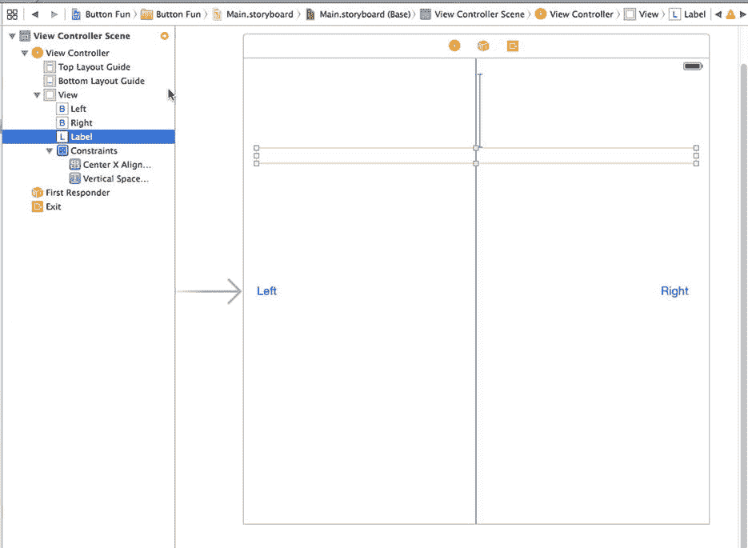

图 3-16. 两个 Auto Layout 约束已应用于标签

**提示** 如果在添加约束时出错，可以通过点击文档大纲或故事板中的约束表示，然后按 **Delete** 键来移除它。

两条垂直的蓝线代表你添加的约束——较长的那条是保持标签水平居中的约束，较短的那条则表示它将放置在距视图顶部固定距离的位置。

**提示** 要查看任何约束的详细信息，请在故事板或文档大纲中选择它，然后打开属性检查器。

你可能还会看到标签有一个橙色轮廓。Interface Builder 使用橙色来指示 Auto Layout 的问题。Interface Builder 以这种方式突出显示三种典型问题：

*   没有足够的约束来完全确定视图的位置或大小。
*   视图具有模糊的约束——也就是说，它们无法唯一确定其大小或位置。
*   约束正确，但运行时视图的位置和/或大小将与 Interface Builder 中的不同。

你可以通过点击活动视图中的黄色警告三角，在问题导航器中查看解释，从而了解问题的更多信息。如果这样做，你会看到提示“'Label' 的框架在运行时将有所不同”——这属于上述列出的第三种问题。你可以通过让 Interface Builder 将标签移动到其正确的运行时位置并赋予其配置的大小来消除此警告。为此，请查看故事板编辑器的右下角。你会看到四个按钮，如图 3-17 所示。

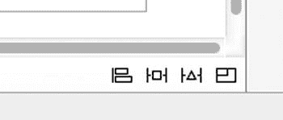

图 3-17. 故事板编辑器右下角的 Auto Layout 按钮

将鼠标悬停在按钮上可查看每个按钮的功能。从左到右，它们的功能如下：


*   `Align`按钮可让您将所选视图相对于另一视图对齐。如果现在单击此按钮，将看到一个包含多种对齐选项的弹出窗口。其中之一是`Horizontal Center in Container`，这是您已从文档大纲应用于标签的约束。在 Interface Builder 中，通常有多种方式完成大多数 Auto Layout 相关操作。随着本书的深入学习，您将看到执行最常见 Auto Layout 任务的其他方法。
*   `Pin`按钮的弹出窗口包含多个控件，可让您设置视图相对于其他视图的位置并应用尺寸约束。例如，您可以设置一个约束，将一个视图的高度约束为与另一个视图相同。
*   `Resolve Auto Layout Issues`按钮可让您纠正布局问题。您可以使用其弹出菜单中的菜单项，让 Interface Builder 移除某个视图（或整个故事板）的所有约束，猜测可能缺失的约束并添加它们，以及调整一个或多个视图的框架至运行时的状态。
*   最后，`Resizing Behavior`按钮可让您控制视图大小调整对现有约束的影响。

您可以通过在文档大纲或故事板中选择标签并单击`Resolve Auto Layout Issues`按钮来修复标签的框架。此按钮的弹出窗口包含两组完全相同的操作——参见图 3-18。

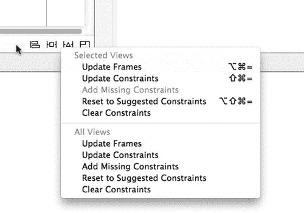

图 3-18. `Resolve Auto Layout Issues`按钮的弹出窗口

如果您从顶部组选择一项操作，它仅应用于当前选中的视图，而底部组的操作则应用于视图控制器中的所有视图。在本例中，我们只需修复一个标签的框架，因此单击弹出窗口顶部的`Update Frames`。执行此操作后，橙色轮廓和活动视图中的警告三角形都会消失，因为标签现在拥有了运行时将具有的位置和大小。实际上，标签已缩小到零宽度，并在故事板中显示为一个小空方块，如图 3-19 所示。

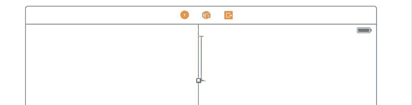

图 3-19. 修复框架后，标签已缩小到零尺寸

这正确吗？嗯，事实证明这是*正确*的。UIKit 提供的许多视图，包括`UILabel`，都能够让 Auto Layout 根据其实际内容设置其大小。它们通过计算其**自然**或**固有内容大小**来实现这一点。在其固有大小下，标签的宽度和高度刚好能完全包围其包含的文本。目前，此标签没有内容，因此其固有内容大小在两个轴向上确实应为零。当我们运行应用程序并单击其中一个按钮时，标签的文本将被设置，其固有内容大小将会改变。发生这种情况时，Auto Layout 会自动调整标签大小，以便您能看到所有文本。很酷，对吧？

**提示** 您可以通过在 Xcode 菜单中选择**Editor**  **Size to Fit Content**，确保 Auto Layout 为视图提供其固有内容大小。

我们已经处理了标签，现在来修复两个按钮的位置。您可以使用相同的技术，通过按住 Control 键从按钮拖拽到其父视图，并在释放鼠标时从弹出的菜单中应用约束，但我想借此机会向您展示另一种方法。在故事板上选择**Left**按钮，然后单击故事板编辑器右下角的`Align`按钮（图 3-17 中最左侧的按钮）。我们希望按钮垂直居中，因此在弹出窗口中选择`Vertical Center in Container`，然后单击`Add 1 Constraint`（参见图 3-20）。

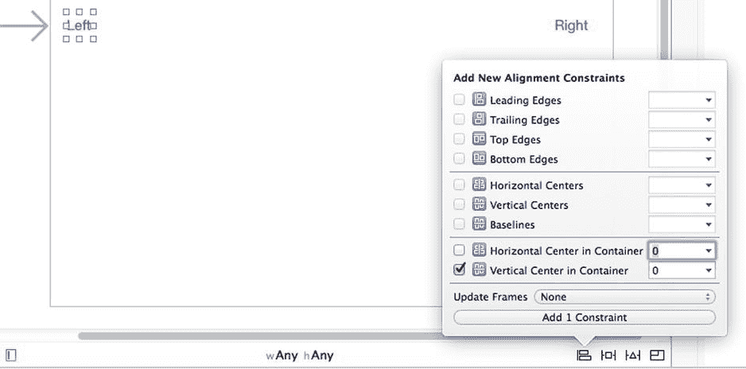

图 3-20. 使用`Align`弹出窗口垂直居中视图

我们需要对**Right**按钮应用相同的约束，因此选择它并重复该过程。在您执行此操作时，Interface Builder 发现了几个新问题，由故事板中的橙色轮廓和活动视图中的警告三角形表示。单击三角形以在问题导航器中查看警告原因，如图 3-21 所示。

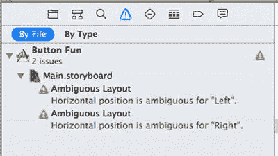

图 3-21. 针对缺失约束的 Interface Builder 警告

Interface Builder 警告您两个按钮的水平位置存在歧义。实际上，您尚未设置任何约束来控制按钮的水平位置，因此这并不奇怪。

**注意** 在设置 Auto Layout 约束时，出现此类警告是正常的，您应利用它们来帮助您设置完整的约束集。完成布局过程后，您不应有任何警告。本书中的大多数示例都包含设置布局约束的说明。在添加这些约束时，您通常会遇到警告，但不必担心，除非您完成所有步骤后仍有警告。如果出现这种情况，要么是您遗漏了某个步骤，要么是您执行步骤有误，或者书中存在错误！如果是后一种情况，请通过书籍页面`http://apress.com`提交勘误告知我们。

让我们修复这些警告。我们希望**Left**按钮与其父视图左侧保持固定距离，而**Right**按钮与其父视图右侧保持相同距离。我们可以从`Pin`按钮（图 3-17 中`Align`按钮旁边的那个）的弹出窗口设置这些约束。选择**Left**按钮并单击`Pin`按钮以打开其弹出窗口。在弹出窗口的顶部，您会找到四个输入字段，通过橙色虚线连接到一个小方块，如图 3-22 左侧所示。

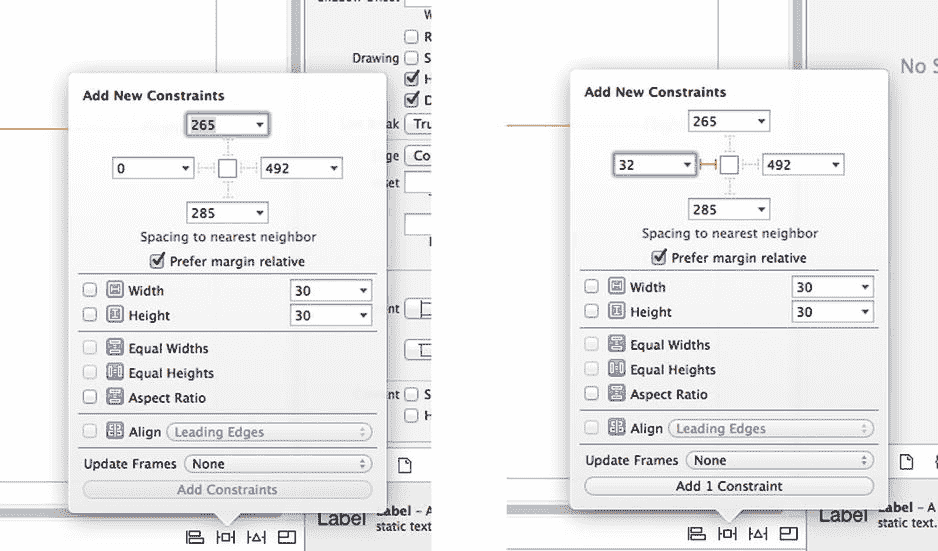

图 3-22. 使用`Pin`弹出窗口设置视图的水平位置

小方块代表我们正在约束的按钮。四个输入字段允许您设置按钮与其上方、下方、左侧和右侧最近邻居之间的距离。虚线表示尚不存在约束。对于**Left**按钮，我们想要设置它与父视图左侧之间的固定距离，因此单击方块左侧的橙色虚线。执行此操作后，它变为橙色实线，表示现在有一个要应用的约束。接下来，在左侧输入字段中输入**32**，以设置**Left**按钮到其父视图的距离。此时弹出窗口应如图 3-22 右侧所示。按`Add 1 Constraint`将约束应用于该按钮。


为了固定**Right**按钮的位置，选中它，点击**Pin**按钮，点击方块右侧的橙色虚线（因为我们将此按钮固定在其父视图的右侧），在输入字段中输入`32`，然后点击**Add 1 Constraint**。

现在我们已经应用了所有需要的约束，但 Activity View 中可能仍然存在警告。如果你检查一下，会发现这些警告是因为按钮不在其正确的运行时位置。为了解决这个问题，我们将再次使用**Resolve Auto Layout Issues**按钮。点击该按钮以打开其弹出菜单，然后点击底部选项组中的**Update Frames**。我们使用底部选项组中的选项，因为需要调整视图控制器中所有视图的框架。

**提示**：你可能会发现弹出菜单中没有任何选项可用。如果出现这种情况，请在文档大纲中选择**View Controller**图标，然后重试。

警告现在应该消失了，我们的布局终于完成了。在 iPhone 模拟器上运行该应用程序，你会看到结果与本章节开头的图 3-1 几乎一致。当你点击右侧按钮时，应显示文本：“Right button pressed.”。如果你随后点击左侧按钮，标签将更改为显示：“Left button pressed.”。到目前为止，一切顺利。但如果你回过头看图 3-1，会发现还缺少一样东西。我们展示的最终结果截图中，所选按钮的名称以粗体显示；然而，我们目前实现的只是显示普通字符串。我们稍后将使用`NSAttributedString`类来实现粗体效果。首先，让我们借此机会看看 Xcode 的另一个有用功能——布局预览。

#### 预览布局

返回 Xcode，选择`Main.storyboard`，然后打开助理编辑器（如果尚未显示，请参阅图 3-6 以了解如何操作）。在助理编辑器顶部跳转栏的左侧，你会看到当前选择是**Automatic**（除非你已将其更改为**Manual**以选择助理编辑器要显示的文件）。点击打开跳转栏此段的弹出菜单，你会看到几个选项，最后一个是**Preview**。当鼠标悬停在**Preview**上时，会出现一个包含应用程序故事板名称的菜单。点击它以在*预览编辑器*中打开故事板。

当预览编辑器打开时，你将看到应用程序在 iPhone 竖屏模式下的外观。这只是一个预览，因此它不会响应按钮点击，结果是你不会看到标签。将鼠标移动到预览下方写着**iPhone 4-inch**的区域，会出现一个控件，让你可以将手机旋转到横屏模式。你可以在图 3-23 左侧看到该控件，右侧是点击它旋转手机后的结果。

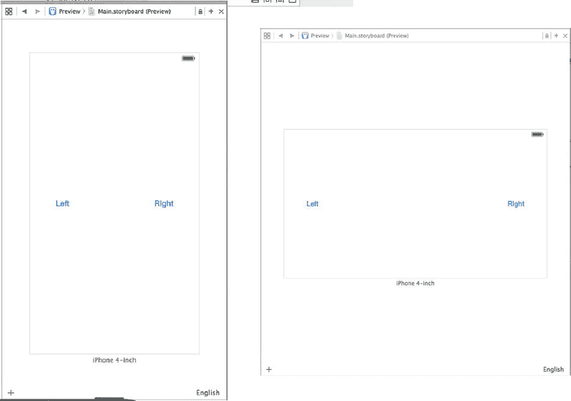

*图 3-23*：在 iPhone 竖屏模式（左）和横屏模式（右）下预览布局

得益于自动布局，当手机旋转时，按钮会移动，使它们保持垂直居中，并且与设备两侧的距离与竖屏模式时相同。如果标签可见，你会发现它也处于正确的位置。

我们还可以使用预览助理来查看在不同设备上运行应用程序时的效果。在预览助理的左下角（以及图 3-23 中），你会看到一个**+**图标。点击此图标打开设备列表，然后选择**iPad**，将 iPad 预览添加到预览助理中。iPad 预览占用了大量空间，因此你可能需要关闭文档大纲和实用工具视图，为同时查看 iPhone 和 iPad 腾出足够的空间。如果你仍然无法看到整个 iPad 屏幕，可以通过几种不同的方式缩放预览助理。最简单的方法是双击预览助理窗格——这会在全尺寸视图和更小的视图之间切换。如果你希望更精确地控制缩放级别，可以在触控板上使用捏合手势（不幸的是，Magic Mouse 不支持此功能，至少在本手册编写时如此）。图 3-24 显示了 iPhone 和 iPad 的预览，已缩小以适应当前屏幕上的可用空间。自动布局再次确保了按钮位于正确位置。旋转 iPad 预览，查看布局在 iPad 横屏模式下是否也能正常工作。

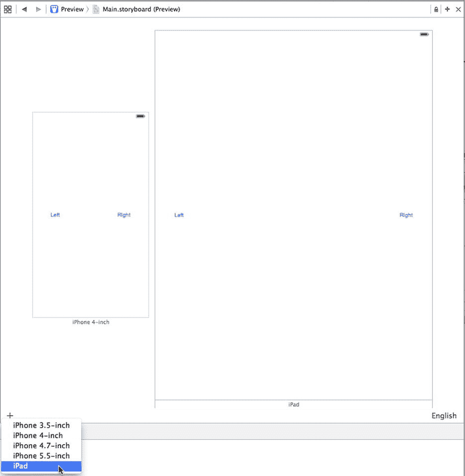

*图 3-24*：同时在 iPhone 和 iPad 上预览布局

在构建和调试布局时，使用预览助理可以节省大量时间。你可以查看布局在多个设备以及两种方向上的工作效果。实际上，你可以再添加一对 iPhone 和 iPad 预览，并将它们旋转到横屏模式，如果你想同时在两种设备上查看两种方向下的布局。最重要的是，预览是实时的——如果你对布局进行更改，预览也会随之更新！

要查看这一点，请返回故事板编辑器，选择其中一个按钮，将其拖向另一个按钮，然后松开。现在确保文档大纲中已选中你拖动的按钮，打开**Resolve Auto Layout Issues**弹出菜单，然后点击**Update Constraints**。这会告诉 Interface Builder 更改自动布局约束，使你刚才对按钮所做的调整成为永久性的。当你这样做时，你会看到按钮立即跳转到预览助理中两种设备上的新位置。很棒，对吧？

我们继续为标签文本添加粗体效果。不过在此之前，我们需要把那个按钮放回原位。你可以将其拖回原位并再次调整其约束，但有一个更快捷的方法——只需按**Z**两次来撤销你刚才的更改，一切就会恢复正常。

#### 添加一些样式

`NSAttributedString`类允许你将格式信息（如字体和段落对齐）附加到字符串上。此元数据可以应用于整个字符串，也可以将不同的属性应用于字符串的不同部分。如果你考虑一下文字处理器中格式如何应用于文本片段，那基本上就是`NSAttributedString`的工作模型。

然而，直到最近，Apple 提供的 UIKit 类中没有一个能够处理属性字符串。如果你想要呈现一个同时包含粗体文本和正常文本的标签，你只能使用两个标签，或者自己将文本直接绘制到视图中。这些方法并非不可逾越的障碍，但它们足够棘手，大多数开发者都不愿频繁使用。对于想要显示样式文本的人来说，iOS 6 带来了许多改进，因为大多数主要的 UIKit 控件现在都允许你使用属性字符串。对于像我们这里的`UILabel`来说，这就像创建一个属性字符串，然后通过其`attributedText`属性将其传递给标签一样简单。


所以，选择 `ViewController.m`，通过删除划掉的代码行并添加代码片段中加粗的行，来更新 `buttonPressed:` 方法：

```
- (IBAction)buttonPressed:(UIButton *)sender {
    NSString *title =  [sender titleForState:UIControlStateNormal];
    NSString *plainText =  [NSString stringWithFormat:@"%@ button pressed.", title];
    _statusLabel.text =  plainText;

NSMutableAttributedString *styledText =  [[NSMutableAttributedString alloc]
                                             initWithString:plainText];
    NSDictionary *attributes =
    @{
      NSFontAttributeName :  [UIFont boldSystemFontOfSize:_statusLabel.font.pointSize]
     };

NSRange nameRange =  [plainText rangeOfString:title];

[styledText setAttributes:attributes range:nameRange];
    _statusLabel.attributedText =  styledText;
}
```

这段新代码所做的第一件事，是基于我们将要显示的字符串创建一个属性字符串——具体来说，是一个 `NSMutableAttributedString` 实例。这里我们需要一个可变属性字符串，因为我们想修改其属性。

接下来，我们创建一个字典来存放要应用于字符串的属性。实际上，目前我们只有一个属性，所以这个字典只包含一个键值对。键 `NSFontAttributeName` 允许你为属性字符串的一部分指定一种字体。我们传入的值是所谓的粗体系统字体，其大小被指定为与标签当前使用的字体大小相同。从长远来看，以这种方式指定字体比通过名称指定字体更灵活，因为我们知道系统总是能合理地知道应该使用什么作为粗体字体。

**提示** 如果你使用 Objective-C 已有一段时间，可能对这种新的字典语法不太熟悉——但它其实相当简单。Xcode 附带的 LLVM 版本提供了一种简写形式，无需显式调用 `NSDictionary` 的类方法，使用起来更方便。它的基本形式如下：

`@{`     `key1 : value1,`     `key2 : value2`    `}`

除了省去每次创建字典时都要输入冗长的类名和方法名之外，它还把键和值按照“正确的顺序”排列——至少对于任何使用过内置字典的语言（如 Ruby、Python、Perl 或 JavaScript）的人来说是这样。

这种新的字典语法与数组和数字的类似语法一并于 2012 年引入。本书将通篇使用这些新语法。

接着，我们让 `plainText` 字符串给出包含标题的子字符串的范围（由起始索引和长度组成）。我们使用该范围将属性应用于属性字符串中对应标题的部分，然后将其传递给标签。

现在，点击 **Run** 按钮，你会看到应用程序以粗体文本显示被点击按钮的名称，如图 3-1 所示。

#### 查看应用程序委托

嗯，真酷！你的应用跑起来了！在我们进入下一个主题之前，花点时间看看我们尚未检查的两个源代码文件：`AppDelegate.h` 和 `AppDelegate.m`。这些文件实现了我们的应用程序委托。

Cocoa Touch 广泛使用委托，即负责代表另一个对象执行特定任务的对象。应用程序委托让我们能在某些预定义的时间代表 `UIApplication` 类执行操作。每个 iOS 应用程序都只有一个 `UIApplication` 实例，它负责应用程序的运行循环并处理应用程序级别的功能，例如将输入路由到适当的控制器类。`UIApplication` 是 UIKit 的标准组成部分，其工作大部分在后台进行，因此你通常无需担心它。

在应用程序执行的某些明确定义的时间点，如果委托存在并且实现了该方法，`UIApplication` 会调用其委托上的特定方法。例如，如果你需要在程序即将退出前执行代码，你可以在应用程序委托中实现 `applicationWillTerminate:` 方法，并将终止代码放在那里。这种委托方式允许你的应用程序实现常见的全局行为，而无需继承 `UIApplication`，实际上也无需了解 `UIApplication` 的内部工作原理。所有 Xcode 模板都会为你创建一个应用程序委托，并安排在应用程序启动时将其链接到 `UIApplication` 对象。

点击项目导航器中的 `AppDelegate.h` 查看应用程序委托的头文件。它应该看起来像这样：

```
#import <UIKit/UIKit.h>

@interface AppDelegate :  UIResponder <UIApplicationDelegate>

@property (strong, nonatomic) UIWindow *window;

@end
```

有一点值得指出的是这行代码：

```
@interface AppDelegate :  UIResponder <UIApplicationDelegate>
```

你看到尖括号之间的内容了吗？这表明这个类遵循一个名为 `UIApplicationDelegate` 的协议。按住 **** 键。你的光标应变为十字准线。移动光标，使其悬停在 `UIApplicationDelegate` 字样上。光标将变成一个问号，并且 `UIApplicationDelegate` 字样会高亮显示，就像浏览器中的链接一样（参见图 3-25）。

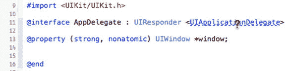

图 3-25。在 Xcode 中按住  键（Option 键）并指向代码中的一个符号时，该符号会高亮显示，光标会变为带问号的手指状指针

按住 **** 键的同时点击此链接。这将打开一个小的弹出窗口，显示 `UIApplicationDelegate` 协议的简要概述（参见图 3-26）。

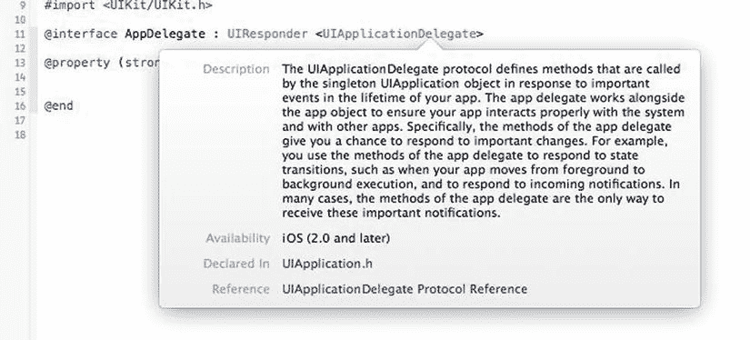

图 3-26。当我们在源代码中按住 Option 键并点击 `<UIApplicationDelegate>` 时，Xcode 会弹出这个名为“快速帮助”面板的窗口，其中描述了该协议

注意这个新的弹出文档窗口底部的两个链接（参见图 3-26）。点击 **Reference** 链接查看此符号的完整文档，或点击 **Declared In** 链接在头文件中查看符号的定义。同样的技巧也适用于类、协议和类别名称，以及编辑面板中显示的方法名称。只需按住 Option 键并点击一个单词，Xcode 就会在文档浏览器中搜索该单词。

知道如何快速查阅文档无疑很有价值，但查看此协议的定义可能更为重要。在这里，你可以找到应用程序委托可以实现的委托方法以及这些方法何时会被调用。花点时间通读这些方法的描述应该是值得的。

**备注** 如果你之前用过 Objective-C 但没用过 Objective-C 2.0，你应该知道协议现在可以指定可选方法。`UIApplicationDelegate` 包含许多可选方法。但是，除非你有理由这样做，否则无需在应用程序委托中实现任何可选方法。

回到项目导航器，点击 `AppDelegate.m` 查看应用程序委托的实现。它应该类似于这样：

```
#import "AppDelegate.h"

@interface AppDelegate ()

@end

@implementation AppDelegate
```


```objectivec
- (BOOL)application:(UIApplication *)application didFinishLaunchingWithOptions:(NSDictionary *)launchOptions {
    // 应用启动后的自定义初始化入口点。
    return YES;
}

- (void)applicationWillResignActive:(UIApplication *)application {
    // 当应用即将从活跃状态转为非活跃状态时发送。
    // 这种情况可能发生在某些类型的临时中断中
    // （如来电或短信），或当用户退出应用，
    // 应用开始过渡到后台状态时。
    // 使用此方法暂停正在进行的任务、禁用定时器、降低
    // OpenGL ES 帧率。游戏应使用此方法来暂停游戏。
}

- (void)applicationDidEnterBackground:(UIApplication *)application {
    // 使用此方法释放共享资源、保存用户数据、
    // 使定时器失效，并存储足够的应用状态信息，以便
    // 在应用稍后终止时恢复到当前状态。
    // 如果你的应用支持后台执行，当用户退出时，
    // 将调用此方法而不是 applicationWillTerminate:。
}

- (void)applicationWillEnterForeground:(UIApplication *)application {
    // 作为从后台到非活跃状态过渡的一部分调用；
    // 在此处可以撤销进入后台时所做的许多更改。
}

- (void)applicationDidBecomeActive:(UIApplication *)application {
    // 重新启动任何在应用非活跃时暂停（或尚未启动）的任务。
    // 如果应用之前在后台运行，
    // 可选择刷新用户界面。
}

- (void)applicationWillTerminate:(UIApplication *)application {
    // 当应用即将终止时调用。请适当保存数据。
    // 另请参阅 applicationDidEnterBackground:。
}

@end
```

在文件顶部，可以看到我们的应用委托实现了文档中介绍的协议方法之一，名为 `application:didFinishLaunchingWithOptions:`。你可能已经猜到，此方法会在应用完成所有设置工作并准备开始与用户交互时立即触发。它通常用于创建那些需要在应用整个运行生命周期内存在的任何对象。

在本书的后续内容中，你将看到更多相关内容，特别是在第 15 章中，我们将更深入地探讨委托在应用生命周期中的作用。在结束本章之前，我们只是想为你提供一些关于应用委托的背景信息，并展示这一切是如何联系在一起的。

#### 轻松入门

本章的简单应用向你介绍了 MVC、创建和连接输出口与动作、实现视图控制器以及使用应用委托。你学习了如何在点击按钮时触发动作方法，并看到了如何在运行时更改标签的文本。尽管我们构建了一个简单的应用，但我们使用的基本概念与 iOS 下所有控件（不仅仅是按钮）所依据的概念相同。事实上，我们在本章中使用按钮和标签的方式，基本上就是我们将在 iOS 下实现和与大多数标准控件交互的方式。

理解我们在本章中所做的一切及其原因至关重要。如果你不理解，请回去复习你不完全明白的部分。这非常重要！如果你现在不能确保理解所有内容，那么在本书后续章节中创建更复杂的界面时，你只会更加困惑。

在下一章中，我们将介绍一些其他标准的 iOS 控件。你还将学习如何使用警报来通知用户重要事件，以及如何使用操作表来指示用户需要在继续之前做出选择。当你准备好继续前进时，请为自己是一位如此出色的学生而拍拍肩膀，然后前往下一章。

## 第 4 章


