# 更多用户界面乐趣

在第 3 章中，我们讨论了 MVC 并基于它构建了一个应用程序。你学习了输出口和动作，并使用它们将一个按钮控件与文本标签关联起来。在本章中，我们将构建一个应用程序，它将把你对控件的了解提升到一个全新的水平。

我们将实现一个图像视图、一个滑块、两个不同的文本字段、一个分段控件、几个开关，以及一个外观与 iOS 7 之前的按钮相似的 iOS 按钮。你将了解如何设置和获取各种控件的值。你将学习如何使用操作表强制用户做出选择，以及如何使用警告框向用户提供重要的反馈。你还将学习控件状态以及如何使用可拉伸图像使按钮呈现出应有的外观。

由于本章的应用程序使用了如此多的不同用户界面元素，我们的工作方式将与前两章略有不同。我们将把应用程序分解成多个部分，一次实现一个部分。在 Xcode 和 iOS 模拟器之间来回切换，在进入下一部分之前测试每一部分。将构建复杂界面的过程分解成更小的块，不仅会使其不那么令人生畏，也更接近于你在构建自己的应用程序时实际经历的过程。这种“编码-编译-调试”循环占据了软件开发人员日常工作的大部分时间。

## 布满控件的屏幕

如前所述，我们将在本章中构建的应用程序比我们在第 3 章中创建的应用程序稍微复杂一些。我们仍将只使用单个视图和控制器；但正如你在图 4-1 中所见，这个视图中包含了更多内容。

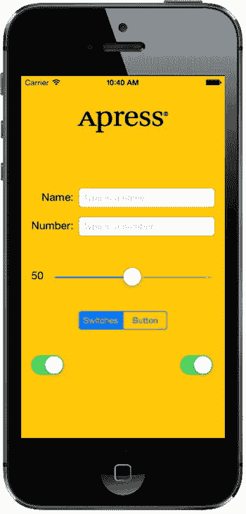

图 4-1. Control Fun 应用程序展示了文本字段、标签、滑块以及其他几个标准的 iPhone 控件

屏幕顶部的标志是一个**图像视图**。在这个应用程序中，它仅用于显示静态图像。标志下方是两个**文本字段**：一个允许输入字母数字文本，另一个只允许输入数字。文本字段下方是一个**滑块**。当用户移动滑块时，旁边标签的值会随之改变，始终反映滑块的当前值。

滑块下方是一个**分段控件**和两个**开关**。分段控件将在其下方的空间中切换显示两种不同类型的控件。当应用程序首次启动时，分段控件下方会显示两个开关。改变其中任何一个开关的值都会导致另一个开关的值随之变化。当然，在实际应用程序中你可能不会这样做，但它确实演示了如何以编程方式更改控件的值，以及 Cocoa Touch 如何让你无需进行任何操作即可实现某些动画效果。

图 4-2 显示了当用户点击分段控件时发生的情况。开关消失，并被一个按钮取代。当按下 **Do Something** 按钮时，会弹出一个操作表，询问用户是否真的想点击该按钮（参见图 4-3）。这是对可能具有危险性或可能产生重大影响的输入做出响应的标准方式，它让用户有机会阻止潜在的坏情况发生。如果选择 **Yes, I’m Sure!** ，应用程序将弹出一个警告框，告知用户一切正常（参见图 4-4）。

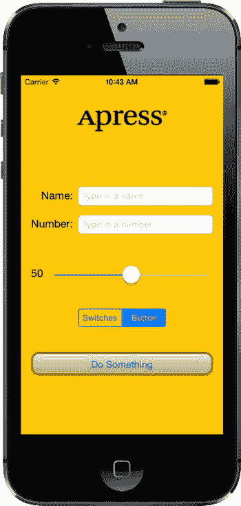

图 4-2. 点击左侧的分段控制器将显示一对开关。点击右侧则会显示一个按钮

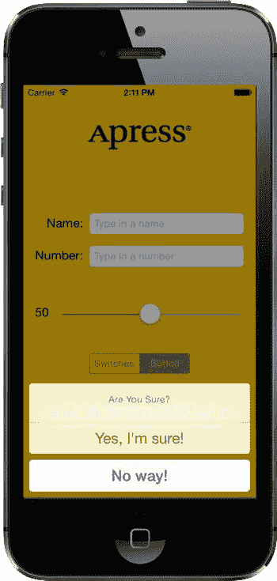

图 4-3. 我们的应用程序使用操作表来征求用户的响应

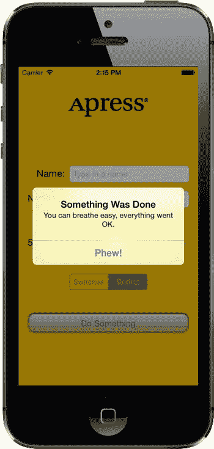

图 4-4. 当重要事件发生时，使用警告框通知用户。我们在这里使用警告框来确认一切正常

## 主动、静态和被动控件

界面控件以三种基本模式使用：主动、静态（或非活动）以及被动。我们在前一章中使用的按钮是主动控件的典型例子。你按下它们，就会发生某些事情——通常是你编写的一段代码被触发。

尽管你将使用的许多控件会直接触发操作方法，但并非所有控件都会这样。我们将在本章中实现的图像视图就是一个控件被静态使用的好例子。`UIImageView` 可以被配置为触发操作方法，但在我们的应用程序中，图像视图是被动的——用户无法对其执行任何操作。标签和图像控件经常以这种方式使用。

有些控件可以以被动模式工作，仅保存用户输入的值，直到你准备好使用时再取用。这些控件不会触发操作方法，但用户可以与它们交互并更改其值。被动控件的一个典型例子是网页上的文本字段。尽管有可能创建在用户跳出字段时触发的验证代码，但绝大多数网页文本字段仅仅是数据的容器，当用户点击提交按钮时，这些数据会被提交给服务器。文本字段本身通常不会触发任何代码，但当提交按钮被点击时，文本字段的数据会随之提交。

在 iOS 设备上，大多数可用的控件都可以在所有三种模式下使用，并且几乎所有控件都可以根据你的需要以多种模式工作。所有 iOS 控件都是 `UIControl` 的子类，这使得它们能够触发操作方法。许多控件可以被被动使用，并且所有控件都可以被设置为非活动或不可见状态。例如，使用一个控件可能会触发另一个非活动控件变为活动状态。然而，某些控件（如按钮）除非以主动方式用于触发代码，否则确实没有多大用处。

iOS 上的控件和 Mac 上的控件在行为上存在一些差异。以下是一些例子：

- 由于多点触控界面，所有 iOS 控件都可以根据触摸方式触发多个动作。用户用手指在控件上滑动与仅轻点一下，可能会触发不同的动作。
- 你可以让一个动作在用户按下按钮时触发，而另一个单独的动作在手指从按钮上抬起时触发。
- 你可以让单个控件在单个事件上调用多个操作方法。例如，当用户触摸按钮后抬起手指时，可以让两个不同的操作方法在 `Touch Up Inside` 事件上触发。

**注意**  尽管在 iOS 上控件可以触发多个方法，但在绝大多数情况下，实现一个能满足你对控件特定使用需求的操作方法可能是更好的选择。你通常不需要这种能力，但在 Interface Builder 中工作时，最好还是记住这一点。在 Interface Builder 中将事件连接到动作时，*不会*断开同一控件上先前连接的动作！这可能导致你的应用程序出现意外的错误行为，例如一个控件会触发多个操作方法。在 Interface Builder 中重新定位事件时，请保持警惕，确保在连接到新动作之前移除旧动作。


## 排版后的内容

iOS 与 Mac 之间的另一个主要区别源于这样一个事实：通常情况下，iOS 设备没有物理键盘。标准的 iOS 软件键盘实际上只是一个由一系列按钮控件组成的视图，这些控件由系统为你管理。你的代码很可能永远不会直接与 iOS 键盘交互。

## 创建应用程序

让我们开始吧。启动 `Xcode`（如果尚未打开），创建一个名为 `Control Fun` 的新项目。我们将再次使用“单视图应用程序”模板，因此请按照前两章的方法创建你的项目。

创建好项目后，让我们获取将在图像视图中使用的图像。该图像必须先导入 `Xcode`，才能在 `Interface Builder` 中使用，因此我们现在就导入它。在示例源代码存档文件夹中的 `04 - Logos` 文件夹中，你会找到三个文件，分别名为 `apress_logo.png`、`apress_logo@2x.png` 和 `apress_logo@3x.png`，它们是同一图像的标准版本和两个 Retina 版本。我们将把这三个文件全部添加到新项目的图像资源目录中，并让应用程序在运行时决定使用哪一个。如果你更愿意使用自己选择的一对图像，请确保它们是 `*.png` 格式，并且尺寸适合可用空间。小版本的高度应小于 100 像素，最大宽度为 300 像素，这样它才能在最窄的 iPhone 屏幕顶部舒适地放置而无需调整大小。较大的版本应分别是小版本尺寸的两倍和三倍。

在 `Xcode` 中，选择项目导航器中的 `Images.xcassets`，然后单击编辑器区域左下角的加号（`+`）按钮。这会弹出一个小的选项菜单，你应从中选择 **New Image Set**。这会创建一个用于添加实际图像文件的新位置。目前它只是被称为 `Image`，但我们想给它一个唯一的名称，以便可以在项目的其他地方引用它。选择 **Image** 项目，打开属性检查器（**`Cmd-4`**），并使用它将图像名称更改为 `apress_logo`。

现在，将图像本身添加到 `apress_logo` 图像项中，方法是将每个图像从访达拖到图像详细信息框中。将 `apress_logo.png` 拖到标有 `1x` 的位置，将 `apress_logo@2x.png` 拖到 `2x` 插槽，再将 `apress_logo@2x.png` 拖到 `3x` 插槽。

### 实现图像视图和文本字段

将图像添加到项目后，下一步是实现应用程序屏幕顶部的五个界面元素：图像视图、两个文本字段和两个标签（参见图 4-5）。

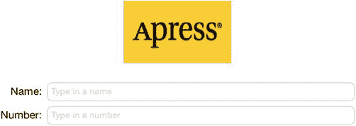

图 4-5. 我们将首先实现的图像视图、标签和文本字段

#### 添加图像视图

在项目导航器中，单击 `Main.storyboard` 以在 `Interface Builder` 中打开文件。你会看到熟悉的白色背景和一个方形视图，你可以在其中布置应用程序的界面。

如果对象库未打开，请选择 **View → Utilities → Show Object Library** 将其打开。滚动列表大约四分之一处，直到找到 **Image View**（参见图 4-6），或者直接在搜索字段中输入 `image`。请记住，对象库是库面板顶部的第三个图标。你不会在其他任何图标下找到 **Image View**。

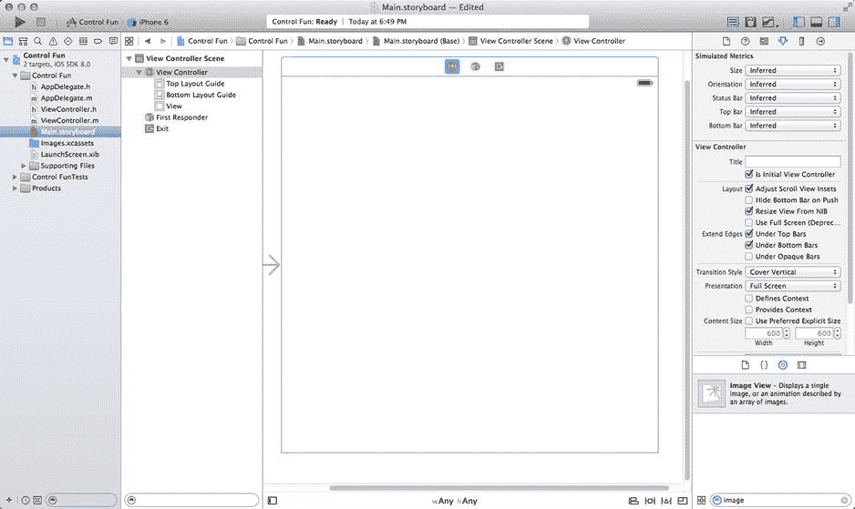

图 4-6. `Interface Builder` 库中的图像视图元素

将一个图像视图拖到故事板编辑器中的视图上。请注意，当你将图像视图拖出库时，它的大小会改变两次。当拖动移出库面板时，它会呈现为水平矩形的形状。然后，当拖动进入视图框架时，图像视图会调整大小以适应视图的大小，包括顶部的状态栏。这种表现是正常的。实际上，在很多情况下，这正好是你想要的，因为你在视图中放置的第一个图像通常是背景图像。在视图内部释放拖动，注意让新的 `UIImageView` 与周围视图的侧面和底部对齐。在这种特殊情况下，我们实际上不希望图像视图占据整个空间，因此我们使用拖动手柄将图像视图调整到与之前导入 `Xcode` 的图像大致相同的大小。暂时不必担心完全精确；我们将在下一节中处理好。图图 4-7 显示了我们调整大小后的 `UIImageView`。

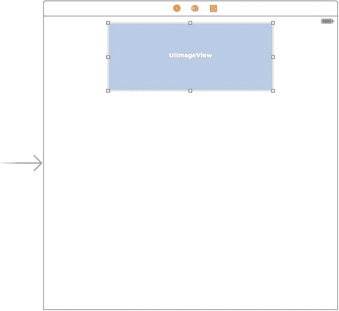

图 4-7. 我们调整大小后的 `UIImageView`，其大小已调整为接近于我们将放置在此处的图像尺寸

请记住，如果你在编辑区域选择某个项目时遇到困难，可以单击左下角的小矩形图标打开文档大纲。现在，单击文档大纲中你想要选择的项目，果然，该项目将在编辑器中被选中。

要访问嵌套在另一个对象内部的对象，请单击包围对象左侧的展开三角形以显示嵌套对象。在这种情况下，要选择图像视图，请首先单击视图左侧的展开三角形。然后，当图像视图出现在文档大纲中时，单击它，它将在编辑区域中被选中。

选中图像视图后，按 **`Cmd-4`** 打开对象属性检查器，你应该会看到 `UIImageView` 类的可编辑选项（参见图 4-8）。

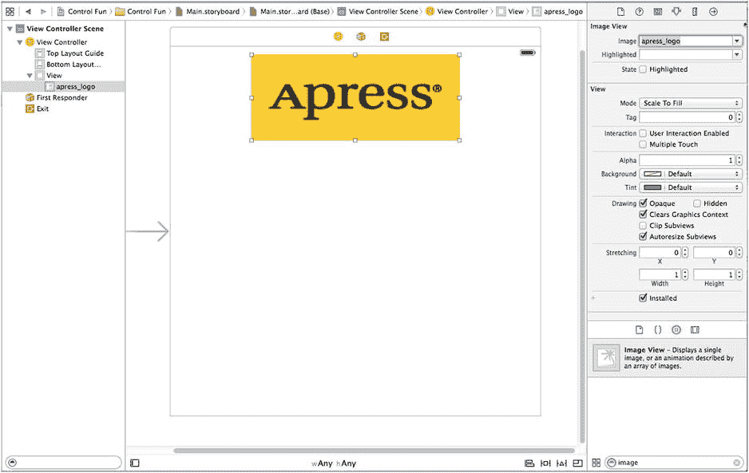

图 4-8. 图像视图属性检查器。我们从检查器顶部的 **Image** 弹出菜单中选择了我们的图像，这使图像视图填充了我们的图像

对于我们的图像视图来说，最重要的设置是检查器中标记为 **Image** 的最顶部项目。单击字段右侧的小箭头，查看列出可用图像的弹出菜单。此列表包含你添加到项目图像资源目录中的任何图像。选择你之前添加的 `apress_logo` 图像，它应该会出现在你的图像视图中。

#### 调整图像视图大小

事实证明，我们使用的图像比放置它的图像视图要小得多。如果你再看一下图 4-8，你会注意到我们使用的图像被缩放以完全填充图像视图。一个明显的线索是属性检查器中的 **Mode** 设置，它被设置为 **Scale To Fill**。

尽管我们可以保持应用程序这种状态，但通常最好在运行时之前进行任何图像缩放，因为图像缩放会耗费时间和处理器周期。让我们将图像视图调整到与图像完全相同的尺寸。

确保图像视图被选中，并且你可以看到调整大小手柄。现在再次选择图像视图。你应该会看到图像视图的轮廓被一个粗灰色边框取代。最后，按 **`Cmd-=`** 或选择 **Editor → Size to Fit Content**。这将调整图像视图的大小以匹配其内容的大小。如果按 **`Cmd-=`** 不起作用，或者 **Size to Fit Content** 是灰色的，请重新选择图像视图，将其向旁边拖动一点，然后重试。


现在图像视图已调整大小，让我们将它移回最终位置：选中它，然后选择 **Editor** → **Align** → **Horizontal Center in Container**。这会创建一个约束，使图像视图始终保持在容器视图的水平中心，即使该视图的大小发生变化。在第 3 章中，你通过编辑区底部的**Align**弹出菜单中的**Horizontal Center in Container**复选框完成了相同操作。你可能已经注意到，Interface Builder 会显示一些实线，从某个视图的边缘延伸到其父视图的边缘（不要与拖动时显示的蓝色虚线混淆）。这些实线代表直接在 Interface Builder 中构建的布局规则所对应的约束。当你单击刚添加的约束时，会看到它变成一条贯穿主视图整个高度的橙色实线（参见图 4-9）。这表示图像视图的中心将保持在其父视图的水平中心位置，即使父视图的几何形状发生变化（例如设备旋转时）。我们将在本书中进一步讨论约束。

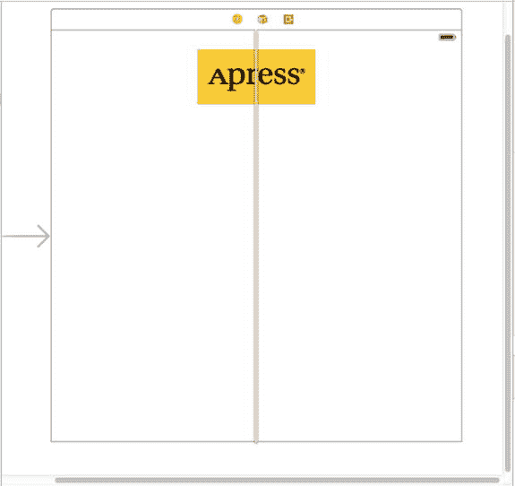

图 4-9 将图像视图调整到适合图像大小后，使用视图的蓝色参考线将其拖动到位，并创建一个约束使其保持居中。

**注意** 你可能已经注意到活动视图中出现了一个橙色警告指示器。如果单击它，会看到它提示“Image View 的垂直位置不明确”。Xcode 告诉我们，需要为该视图设置一个垂直约束。你可以现在使用第 3 章中的技术进行设置，也可以等到本章后面统一修复布局中的所有约束。

**提示** 在 Interface Builder 中拖动和调整视图大小可能比较棘手。别忘了使用文档大纲，你可以通过单击编辑区左下角的小矩形图标将其打开。在调整大小时，按住  键，Interface Builder 会在屏幕上绘制一些有用的红线，帮助您更直观地了解图像视图的尺寸。这个技巧不适用于拖动，因为按住  键会提示 Interface Builder 复制拖动的对象。但是，如果你选择 **Editor** → **Canvas** → **Show Bounds Rectangles**，Interface Builder 会在所有界面元素周围绘制边框，使其更易识别。再次选择 **Show Bounds Rectangles** 可以关闭这些边框线。

#### 设置视图属性

选中图像视图，然后将注意力切换回属性检查器。在检查器的 Image View 部分下方是 View 部分。你可能已经推断出，这里的模式是：选中对象的特定属性显示在顶部，随后是应用于所选对象父类的更通用属性。在本例中，`UIImageView` 的父类是 `UIView`，因此下一部分直接标记为 **View**，其中包含任何视图类都会拥有的属性。

##### Mode 属性

视图检查器中的第一个选项是标记为 **Mode** 的弹出菜单。**Mode** 菜单定义了视图如何显示其内容。它决定了图像在视图内部的对齐方式以及是否缩放以适配。你可以尝试各种选项，但默认值 *Scale To Fill* 目前可以正常工作，因为我们已经将图像视图调整为与其图像完全匹配的大小。

请记住，任何导致图像缩放的选项都可能增加运行时的处理开销，因此最好避免使用这些选项，并在导入图像之前正确调整其大小。如果你想以多种尺寸显示同一张图像，通常更好的做法是在项目中包含同一张图像的不同尺寸的多个副本，而不是强制 iOS 设备在运行时进行缩放。当然，有时在运行时进行缩放是合适的，甚至是不可避免的；这是一个指导原则，而非强制规则。

##### Tag

下一个项目 **Tag** 值得一提，尽管我们在本章中不会用到它。`UIView` 的所有子类，包括所有视图和控件，都有一个名为 `tag` 的属性，它只是一个数值，你可以在这里或在代码中设置它。这个标签是为您的使用而设计的——系统永远不会设置或更改其值。如果你为某个控件或视图分配了标签值，那么除非你更改它，否则可以确保该标签始终具有该值。

标签提供了一种简单且与语言无关的方式来标识界面中的对象。假设你有五个不同的按钮，每个都有不同的标签，并且你想使用一个操作方法处理所有五个按钮。在这种情况下，当你的操作方法被调用时，你可能需要某种方式来区分这些按钮。当然，你可以查看按钮的标题，但执行此类操作的代码在应用程序被翻译成斯瓦希里语或梵语时可能无法正常工作。与标签不同，标签永远不会改变，因此如果你在 Interface Builder 中设置了标签值，就可以将其作为快速可靠的方法，检查在 `sender` 参数中传递到操作方法的是哪个控件。

##### Interaction 复选框

Interaction 部分中的两个复选框与用户交互有关。第一个复选框 **User Interaction Enabled** 指定用户是否可以对对象执行任何操作。对于大多数控件，此框会被选中，因为如果不选中，控件将永远无法触发操作方法。然而，图像视图默认未选中，因为它们通常仅用于显示静态信息。由于我们只是将图片显示在屏幕上，因此无需启用此项。

第二个复选框是 **Multiple Touch**，它决定此控件是否能够接收多点触控事件。多点触控事件允许复杂的手势，例如许多 iOS 应用程序中用于缩放的捏合手势。我们将在第 18 章中进一步讨论手势和多点触控事件。由于此图像视图根本不接受用户交互，因此没有理由打开多点触控事件，所以保持此复选框未选中状态。

##### Alpha 值

检查器中的下一项是 **Alpha**。请谨慎使用此选项。**Alpha** 定义图像的透明度——其下方内容透过来的程度。它被定义为一个介于 0.0 和 1.0 之间的浮点数，其中 0.0 表示完全透明，1.0 表示完全不透明。如果你使用任何小于 1.0 的值，iOS 设备将以某种透明度绘制此视图，这样其后面的任何对象都会透出来。即使图像后面没有有趣的内容，使用小于 1.0 的值也会导致应用程序花费处理器周期将部分透明的视图合成到其背后的空白区域上。因此，除非你有非常充分的理由，否则不要将 **Alpha** 设置为 1.0 以外的任何值。

##### Background

下一项 **Background** 决定了视图背景的颜色。对于图像视图，这仅在图像未填满其视图并出现信箱效应，或图像部分透明时才有影响。由于我们已经将视图调整为与图像完美匹配，因此此设置不会产生可见效果，我们可以保持其不变。

##### Tint


### 下一个控件可让您为所选视图指定色调颜色

某些视图在绘制自身时会使用这种颜色。我们稍后将在本章中使用的分段控件会利用其色调颜色进行着色，但 `UIImageView` 不会。

### 绘制复选框

**色调**下方是一系列**绘制**复选框。第一个标记为**不透明**。默认情况下应勾选此项；如果未勾选，请点击选中它。这告诉 iOS，视图背后不需要绘制任何内容，并允许 iOS 的绘图方法进行一些优化以加快绘图速度。

您可能会想，既然我们已经将**透明度**的值设为 1.0 来表示不透明，为什么还需要勾选**不透明**复选框。透明度值适用于要绘制的图像部分；但如果图像未完全填满图像视图，或者由于 Alpha 通道导致图像中存在空洞，无论**透明度**中设置的值如何，其下方的对象仍然会透出来。通过勾选**不透明**，我们告诉 iOS，无论如何，该视图背后永远不需要绘制任何内容，因此无需浪费时间处理其背后对象的相关操作。我们可以安全地勾选**不透明**复选框，因为我们之前选择了**适合大小**，这使得图像视图与其包含的图像尺寸相匹配。

**隐藏**复选框的作用正如您所想。如果勾选，用户将看不到此对象。有时隐藏对象很有用，正如您稍后在本章中隐藏开关和按钮时所见；然而，绝大多数情况下——包括现在——您希望保持此选项为未选中状态。

下一个复选框**清除图形上下文**，很少需要勾选。当它被勾选时，iOS 在实际绘制对象之前，会用透明黑色绘制对象覆盖的整个区域。同样，出于性能考虑以及很少需要用到它，应将其关闭。请确保此复选框处于未选中状态（默认情况下可能已勾选）。

**裁剪子视图**是一个有趣的选项。如果您的视图包含子视图，并且这些子视图并未完全包含在其父视图的边界内，此复选框决定了子视图的绘制方式。如果勾选**裁剪子视图**，则仅绘制子视图位于父视图边界内的部分。如果未勾选**裁剪子视图**，则子视图将被完整绘制，即使它们位于父视图边界之外。

**裁剪子视图**默认未勾选。看起来默认行为似乎应该与实际相反，这样子视图就不会到处绘制。然而，从数学角度讲，计算裁剪区域并仅显示子视图的部分是一项成本较高的操作；大多数情况下，子视图不会超出其父视图的边界。如果您确实出于某种原因需要，可以打开**裁剪子视图**，但出于性能考虑，它默认是关闭的。

本节中的最后一个复选框**自动调整子视图大小**，告诉 iOS 如果此视图调整大小，则同时调整任何子视图的大小。请保持此选项为勾选状态（由于我们不调整视图大小，因此勾选与否实际上无关紧要）。

### 拉伸

接下来是一个简称为**拉伸**的区域。不过，您可以把瑜伽垫收进柜子里了，因为这里唯一的拉伸是以矩形视图在屏幕上调整大小时重新绘制的形式进行的。其理念是，不是让视图的整个内容统一拉伸，而是可以让视图的外边缘（例如按钮的斜边）在中心部分拉伸时保持外观不变。

此处设置的四个浮点值允许您通过指定视图左上角的点以及可拉伸区域的大小，来声明矩形中哪一部分是可拉伸的，所有数值均在 0.0 到 1.0 之间，表示占整体视图大小的比例。例如，如果您希望每条边缘的 10% 不可拉伸，则需将 `X` 和 `Y` 均设为 0.1，`宽度` 和 `高度` 均设为 0.8。在此例中，我们将保留默认值：`X` 和 `Y` 为 0.0，`宽度` 和 `高度` 为 1.0。大多数情况下，您不需要更改这些值。

### 添加文本字段

完成图像视图后，就该添加文本字段了。从对象库中选取一个文本字段，将其拖到视图中，放在图像视图下方。使用蓝色参考线将其与右边缘对齐，并使其紧贴图像视图下方（参见图 4-10）。

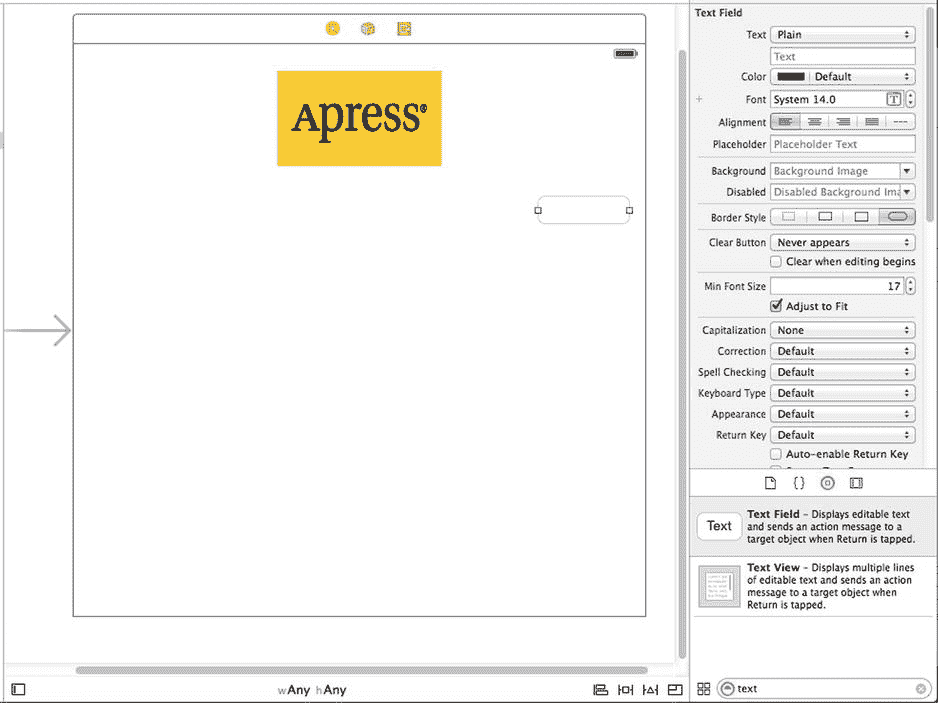

图 4-10。我们从库中拖出一个文本字段，将其放到视图上，紧贴图像视图下方，并触及右侧的蓝色参考线

当您将文本字段非常靠近图像视图底部时，其上方会出现一条水平蓝色参考线。该参考线表示您正在拖动的对象与相邻对象的距离已达到最小合理距离。您可以暂时将文本字段放在那里，但为了外观更平衡，可以考虑在将其移动到右边缘的参考线之前，稍微向下移动一点。请记住，您随时可以使用 Interface Builder 再次编辑 GUI，以更改界面元素的位置和大小——无需更改代码或重新建立连接。

放下文本字段后，从库中选取一个标签，然后将其拖到视图中，使其与视图的左边缘对齐，并在垂直方向上与您之前放置的文本字段对齐。请注意，当您移动标签时，会弹出多条蓝色参考线，方便您使用标签的顶部、底部或中部将标签与文本字段对齐。我们将使用基线来对齐标签和文本字段，当您在中间拖动这些参考线时，基线就会出现（参见图 4-11）。

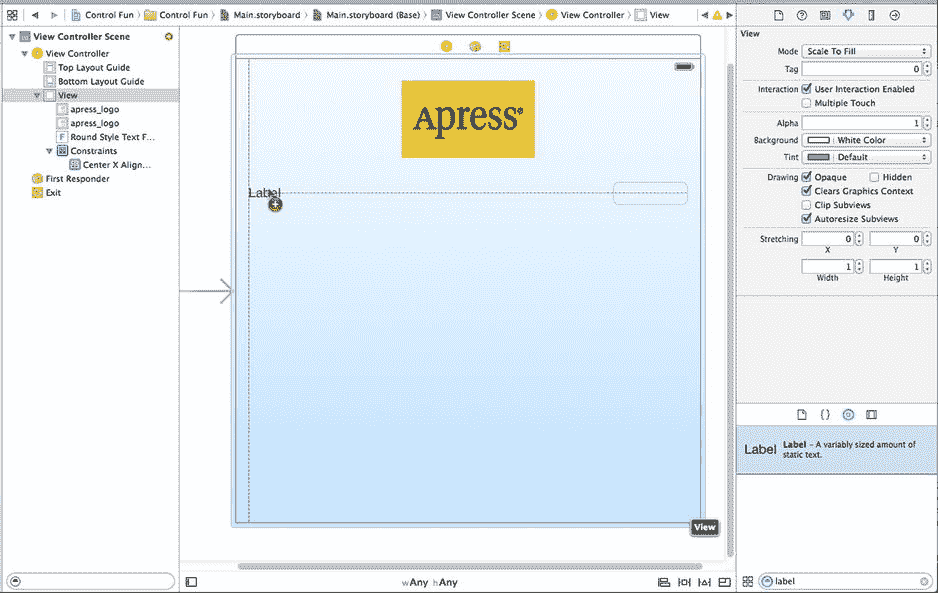

图 4-11。使用基线参考线对齐标签和文本字段

双击您刚放下的标签，将其文本从 *Label* 改为 *Name*：（请注意标签末尾的冒号字符），然后按 **Enter** 键确认更改。

接下来，从库中将另一个文本字段拖到视图中，并使用参考线将其放置在第一个文本字段下方（参见图 4-12）。

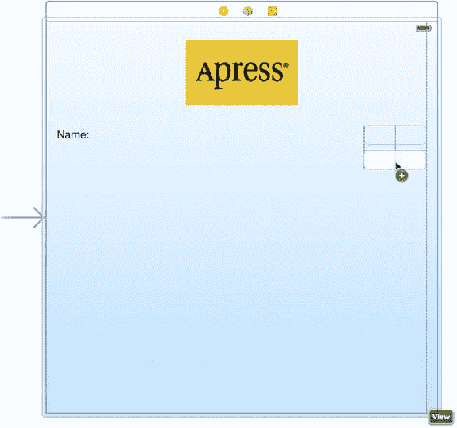

图 4-12。添加第二个文本字段

添加第二个文本字段后，从库中再选取一个标签，将其放置在左侧，位于现有标签下方。再次使用中间的蓝色参考线将新标签与第二个文本字段对齐。双击新标签，将其文本改为 *Number*：（同样，不要忘记冒号）。

现在，让我们将底部文本字段的尺寸向左扩展，使其紧贴标签的右侧。为什么从底部文本字段开始？我们希望这两个文本字段的大小相同，并且底部的标签更长。

单击底部文本字段，向左拖动左侧的调整大小圆点，直到出现蓝色参考线，提示您已到达与标签应有的最近距离（参见图 4-13）。这条特定的参考线有点微妙——它只有文本字段本身那么高，所以请睁大眼睛。

图 4-13。（图片描述缺失，原文中图片链接未提供实际图片内容，此处按格式保留引用）


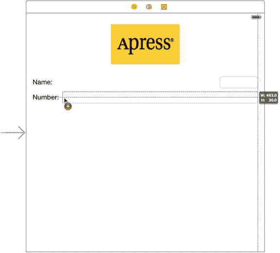

图 4-13. 扩展底部文本字段的大小

现在，以相同方式扩展顶部文本字段，使其大小与底部文本字段一致。同样，一条蓝色辅助线提供了帮助，且这条线一直延伸至另一个文本字段，使其更易于对齐。

这些文本字段基本已完成，仅剩一个小细节。请回顾图 4-5。你是否注意到**名称：**和**编号：**是右对齐的？目前，我们的这两个标签都紧贴左边缘。为了使两个标签的右侧对齐，请单击**名称：**标签，按住 `Shift` 键，再单击**编号：**标签，从而同时选中两个标签。接下来，按 `⌘4` 调出属性检查器，并确保**标签**部分已展开，以便查看标签专属属性。如果未展开，请点击标题右侧的**显示**按钮将其展开。现在，使用检查器中的**对齐**控件使这些标签的内容右对齐，然后通过选择 `编辑器 → 对齐 → 等宽` 来添加约束，确保这两个字段始终保持相同的宽度。

完成后，界面应该与图 4-5 所示非常相似。唯一的区别在于每个文本字段中的浅灰色文字。我们现在就来添加这些文字。

选择顶部文本字段（即紧邻**名称：**标签的那个），然后按 `⌘4` 调出属性检查器（参见图 4-14）。文本字段是 iOS 控件中最复杂的控件之一，也是最常用的控件之一。让我们逐一浏览这些设置，从检查器的顶部开始。

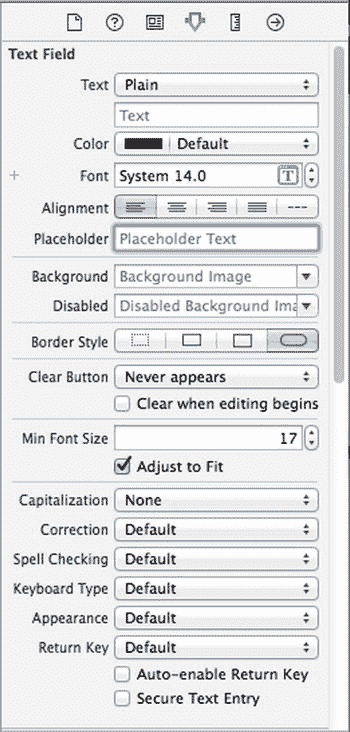

图 4-14. 显示默认值的文本字段检查器

### 文本字段检查器设置

在第一个部分中，**文本**标签指向两个控件，它们让你可以对文本字段中将要显示的文本进行一定程度的控制。上方是一个弹出按钮，用于在纯文本和富文本之间进行选择，富文本可以包含多种字体和其他属性。我们在第 3 章的示例中使用了富文本为部分文字添加了粗体效果。现在先将该弹出按钮设置为*纯文本*。紧接其下方，你可以为文本字段设置默认值。在此输入的任何内容都将在应用启动时显示在文本字段中，而不是显示为空白。

接下来是一系列控件，用于设置字体和字体颜色。我们将**颜色**保留为默认的黑色。请注意，**颜色**弹出按钮分为两部分。右侧允许你从一组预设颜色中选择，左侧则允许你访问调色板以更精确地指定颜色。

**字体**设置分为三部分。右侧是一个控件，允许你逐点增加或减小文本大小。左侧允许你手动编辑字体名称和大小。最后，点击“T 在方框中”图标可弹出一个窗口，让你设置各种字体属性。我们将**字体**保留为默认设置*System 14.0*。

在这些字段下方，有五个用于控制字段内文本对齐方式的按钮。我们将此设置保留为默认的左对齐（最左侧按钮）。

第一部分最后，**占位符**允许你指定一段文字，该文字仅在字段没有值时以灰色显示在文本字段中。如果空间有限，你可以使用占位符代替标签，或者用它来阐明用户应在此文本字段中输入什么内容。在占位符中输入文字**输入姓名**作为当前选中的文本字段的占位符，然后按 `Enter` 键提交更改。

接下来的两个字段**背景**和**禁用**，仅在你需要自定义文本字段外观时使用，这在绝大多数情况下完全没有必要，甚至是不明智的。用户期望文本字段呈现特定的外观。我们将跳过这些字段，保留其默认设置。

接下来是四个标记为**边框样式**的按钮。这些按钮允许你更改文本字段边缘的绘制方式。默认值（最右侧按钮）创建了 iOS 应用用户最熟悉的标准文本字段样式。你可以随意尝试所有四种样式。试验完成后，请将此设置恢复为最右侧的按钮。

边框设置下方是一个**清除按钮**弹出按钮，用于选择*清除按钮*何时显示。清除按钮是可能出现在文本字段右端的小 X。清除按钮通常用于搜索字段以及其他可能需要频繁更改值的字段。它们通常不包含在用于持久化数据的文本字段中，因此请保留默认设置*从不出现*。

**编辑时清除**复选框指定了用户触摸此字段时发生的情况。如果勾选此框，该字段之前存在的任何值都将被删除，用户将从空字段开始。如果未勾选，则之前的值将保留在字段中，用户可以对其进行编辑。请保持此复选框为未勾选状态。

下一个部分以一个控件开始，该控件允许你设置文本字段用于显示文本的最小字体大小。暂时保留其默认值。

**自动调整**复选框指定了当文本字段尺寸缩小时，文字大小是否应相应缩小。自动调整将使所有文字在视图中保持可见，即使正常情况下文字过大而无法容纳在指定空间中。此复选框与最小字体大小设置协同工作。无论字段大小如何，文字都不会被调整到小于该最小尺寸。指定最小尺寸可以确保文字不会变得太小而难以阅读。

下一个部分定义了使用此文本字段时键盘的外观和行为。由于我们期望输入姓名，让我们将**大写**弹出按钮更改为*单词首字母大写*。这将使每个单词的第一个字母自动大写，这正是姓名输入中的常见需求。

接下来的四个弹出按钮——**更正**、**拼写检查**、**键盘**和**外观**——可以保留其默认值。花点时间查看每个选项，以了解这些设置的功能。

接下来是**返回键**弹出按钮。**返回**键是虚拟键盘右下角的按键，其标签会根据你正在执行的操作而变化。例如，如果你在 Safari 的搜索字段中输入文本，它会显示*搜索*。在像我们这样的应用中，文本字段与其他控件共享屏幕，*完成*是合适的选择。在此处进行更改。

如果勾选了**自动启用返回键**复选框，则**返回**键在文本字段中输入至少一个字符之前处于禁用状态。请保持此复选框为未勾选状态，因为我们希望允许在用户不想输入任何内容时，文本字段保持为空。


**Secure**复选框指定正在键入的字符是否显示在文本字段中。如果文本字段被用作密码字段，则应选中此复选框。对于我们的应用，请保持其未选中状态。

下一部分（您可能需要向下滚动才能看到）允许您设置继承自`UIControl`的控件属性；但是，这些属性通常不适用于文本字段，并且除了**Enabled**复选框外，不会影响字段的外观。我们希望保持这些文本字段处于启用状态，以便用户能够与它们交互。请保留此部分的默认设置。

检查器中的最后一部分**View**应该看起来很熟悉。它与我们之前查看的图像视图检查器中同名的部分完全相同。这些是继承自`UIView`类的属性；由于所有控件都是`UIView`的子类，它们都共享这一部分属性。与之前对图像视图所做的一样，请选中**Opaque**复选框，并取消选中**Clears Graphics Context**和**Clip Subviews**——原因我们之前已经讨论过。

#### 为第二个文本字段设置属性

接下来，在视图窗口中单击下方的文本字段（即**Number:**标签旁边的那个），然后返回检查器。在**Placeholder**字段中，键入`Type in a number`，并确保**Clear When Editing Begins**未被选中。再往下一点，单击**Keyboard**弹出菜单。由于我们希望用户只输入数字，而不是字母，请选择**Number Pad**。在 iPhone 上，这将确保用户看到一个仅包含数字的键盘，这意味着他们将无法输入字母字符、符号或任何非数字内容。我们不需要为数字键盘设置**Return**键值，因为那种键盘样式没有**Return**键；因此，所有其他检查器设置都可以保留默认值。与之前一样，请选中**Opaque**复选框，并取消选中**Clears Graphics Context**和**Clip Subviews**。在 iPad 上，选择**Number Pad**的效果是，当用户激活文本字段时，会弹出一个全尺寸的虚拟键盘并处于数字模式，但用户可以切换回字母输入。这意味着在实际的应用中，当处理数字字段的内容时，您必须验证用户确实输入了有效的数字。

**提示**  如果您真的想阻止用户在文本字段中输入除数字以外的任何内容，可以通过创建一个类来实现`UITextViewDelegate`协议的`textView:shouldChangeTextInRange:replacementText:`方法，并将其设置为文本视图的代理来实现。具体细节不算太复杂，但超出了本书的讨论范围。

#### 添加约束

在我们继续之前，需要调整此布局的一些约束。当您在 Interface Builder 中将一个视图拖入另一个视图时（就像我们刚才所做的那样），Xcode 不会自动为其创建任何约束。布局系统需要一组完整的约束，因此在编译应用时，Xcode 会生成一组描述布局的默认约束。创建的约束取决于每个对象在其父视图中的位置。根据对象是更靠近左侧边缘还是右侧边缘，它将被固定到左侧或右侧。类似地，根据对象是更靠近顶部边缘还是底部边缘，它将被固定到顶部或底部。如果对象在任何方向上居中，它通常会获得一个将其固定到中心的约束。

更复杂的是，Xcode 还可能应用自动约束，将每个新对象固定到同一父视图中的一或多个“同级”对象。这种自动行为可能符合您的期望，也可能不符合，因此通常最好在编译应用之前，在 Interface Builder 中手动创建一组完整的约束。在最后两章中，您已经看到了一些相关示例。

让我们开始检查目前已有的约束。要查看特定视图的所有生效约束，请尝试选中它并打开尺寸检查器。如果您选中任何标签、文本字段或滑块，您会看到尺寸检查器显示一条消息，声称所选视图没有约束。实际上，我们一直构建的这个 GUI 只有一个我们之前应用过的约束，即绑定图像视图和容器视图水平中心的约束。单击容器视图或图像视图，即可在检查器中看到此约束。

我们真正想要的是拥有一组完整的约束，以精确地告诉布局系统如何处理我们所有的视图和控件，就像在编译时自动生成的那样。幸运的是，实现这一目标非常简单。通过从容器视图的左上角内部向右下角拖拽出一个选框，选中所有视图和控件。如果您开始拖拽后发现视图本身在移动，只需松开鼠标，将鼠标向视图内部再移动一点，然后重试。当所有项目都被选中后，使用菜单执行**Editor  Resolve Auto Layout Issues  Add Missing Constraints**命令。执行此操作后，您会看到我们所有的视图和控件现在都有一些蓝色的小棒将它们彼此连接起来，并连接到容器视图。这些蓝色小棒中的每一个都代表一个约束。现在创建这些约束，而不是让 Xcode 在编译时创建它们，最大的优势在于，如果需要，我们现在有机会修改每个约束。在本书中，我们将进一步探索如何使用约束实现更多功能。

**提示**  另一种为视图控制器拥有的所有视图应用约束的方法是，在文档大纲中选中视图控制器，然后使用**Editor  Resolve Auto Layout Issues  Add Missing Constraints**。

通常情况下，我们在此处创建的布局不需要对这些约束进行任何特定的修改，以确保其在所有设备上都能正常工作，但这并非总是如此。例如，如果您在我们已有的两个文本字段下方添加更多文本字段，直到触及视图底部，然后让 Xcode 添加约束，您会发现它会将整列文本字段绑定到视图的底部，而不是顶部。因此，当您在比 Interface Builder 中更高的屏幕上（例如，在 iPhone 6 Plus 上）运行应用时，所有文本字段都会相对于图像视图向下移动，而不会位于您期望的位置。

不过，对于我们当前的 GUI 来说，这不是问题。我们可以再次使用预览助理来验证。选择标有**Editor**的中间工具栏按钮，或通过单击**View  Assistant Editor  Show Assistant Editor**，打开助理编辑器，然后在跳转栏中选择**Preview**和`Main.storyboard`。当 4 英寸 iPhone 的预览出现后，再为 5.5 英寸 iPhone 添加一个预览，您会发现布局与在较小手机上完全相同，尽管文本字段由于屏幕宽度更大而变得稍宽一些。在本书的后续部分，我们将处理一些需要在此方面稍作调整的 GUI；并且在后续的大多数示例中，我们将创建显式约束，而不是让 Xcode 为我们完成工作，这样您将有充足的机会熟悉手动添加约束。


**Caution** 对于这个相对简单的示例，Xcode 完全可以创建出能够保留我们所需布局的约束，但情况并非总是如此。任何时候你使用 **Editor → Resolve Auto Layout Issues → Add Missing Constraints** 命令，都应仔细检查 Xcode 添加的约束。如果它们没有按预期工作，那么请删除它们，并使用你在第 2 章和第 3 章中学到的技术手动添加约束。

#### 创建并连接输出口

我们几乎准备好要对我们应用进行首次测试了。对于界面的第一部分，剩下的工作就是创建并连接我们的输出口。界面上的图像视图和标签不需要输出口，因为我们不需要在运行时更改它们。然而，这两个文本字段将持有我们代码中需要使用的数据，因此我们需要指向它们每一个的输出口。

你可能还记得上一章的内容，Xcode 允许我们使用助手编辑器同时创建并连接输出口，该编辑器应该已经打开了（但如果未打开，请按之前所述将其打开）。

确保项目导航器中选中了你的故事板文件。如果你的屏幕空间不够大，你可能还想在这一步中选择 **View → Utilities → Hide Utilities** 来隐藏工具面板。在助手编辑器的跳转栏中，选择 **Automatic**，你应该会看到 `ViewController.h` 或 `ViewController.m`（参见图 4-15）。

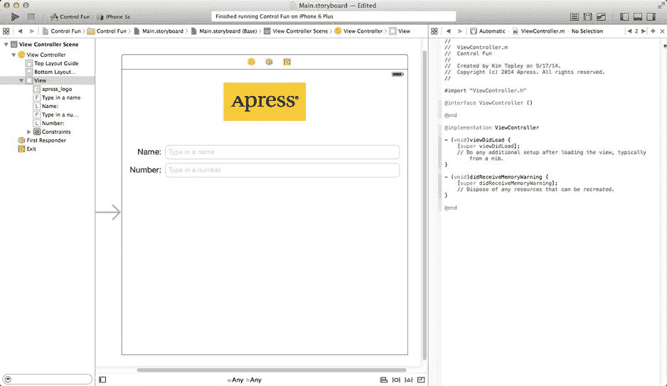

图 4-15. 打开了助手编辑器的故事板编辑区域。你可以在右侧看到助手编辑器，显示来自 `ViewController.m` 的代码

现在进入有趣的部分。确保助手编辑器中显示的是 `ViewController.m`（如有必要，使用跳转栏返回）。接下来，从视图中的顶部文本字段按住 Control 拖拽到 `ViewController.m` 文件中，正好在 `@interface` 行的下方。你将会看到一个灰色的弹出窗口，显示 **Insert Outlet, Action, or Outlet Collection**（参见图 4-16）。松开鼠标按钮，你将看到与上一章相同的弹出窗口。我们想要创建一个名为 `nameField` 的输出口，因此在 **Name** 字段中输入 **nameField**（快速说五遍！），然后按 **Return** 键或点击 **Connect** 按钮。

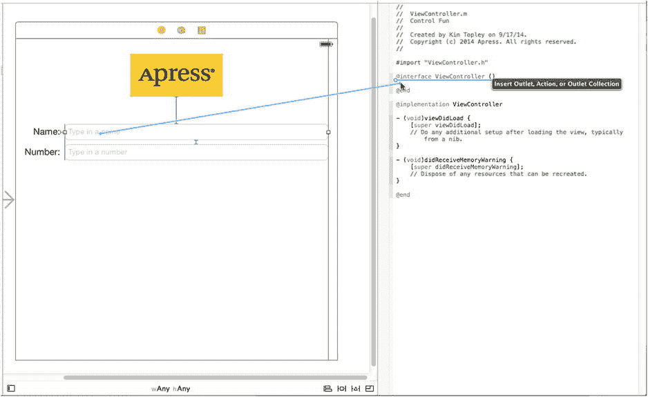

图 4-16. 在打开助手的情况下，我们按住 Control 拖拽到源代码上，以便同时创建 `nameField` 输出口并将其连接到相应的文本字段

你现在在 `ViewController` 中有了一个名为 `nameField` 的属性，并且它已连接到顶部文本字段。对第二个文本字段执行相同操作，创建并将其连接到一个名为 `numberField` 的属性。

#### 关闭键盘

让我们看看我们的应用运行得如何，好吗？选择 **Product → Run**。你的应用应该在 iOS 模拟器中启动。点击 **Name** 文本字段，传统的键盘就会出现。输入一个名字，然后点击 **Number** 字段。数字键盘应该会出现（参见图 4-17）。Cocoa Touch 仅通过向界面添加文本字段就免费提供了所有这些功能。

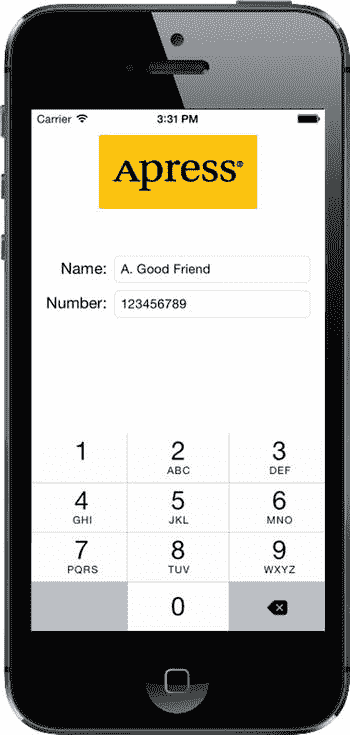

图 4-17. 当你触摸文本字段或数字字段时，键盘会自动弹出

呜呼！但有个小问题。你怎么才能让键盘消失呢？请尽管试试。我们在这里等着你。

**提示** 如果键盘在模拟器上没有显示，请尝试选择 **Hardware → Keyboard → Toggle Software Keyboard**。

##### 点击 Done 时关闭键盘

由于键盘是基于软件的而不是物理键盘，我们需要采取一些额外的步骤来确保用户使用完毕后键盘消失。当用户点击文本键盘上的 **Done** 按钮时，将生成一个 `Did End On Exit` 事件；此时，我们需要告诉文本字段放弃控制权，以便键盘消失。为此，我们需要向我们的控制器类添加一个操作方法。

在项目导航器中选择 `ViewController.m`，并在文件底部、`@end` 之前添加以下操作方法：

```
- (IBAction)textFieldDoneEditing:(id)sender {
    [sender resignFirstResponder];
}
```

正如你在第 2 章中学到的，第一响应者是用户当前正在交互的控件。在我们的新方法中，我们告诉我们的控件辞去第一响应者，将角色让给用户之前使用的控件。当文本字段让出第一响应者状态时，与其关联的键盘将消失。

保存你刚刚编辑的文件。让我们跳回故事板，并从我们的两个文本字段触发这个操作。

在项目导航器中选择 `Main.storyboard`，单击 **Name** 文本字段，然后按 **`⌃6`** 调出连接检查器。这次，我们不需要上一章中使用的 `Touch Up Inside` 事件。相反，我们需要 `Did End On Exit`，因为当用户点击文本键盘上的 **Done** 按钮时，该事件会触发。

从 **Did End On Exit** 旁边的圆圈拖拽到故事板中的黄色 **View Controller** 图标上（位于你一直在配置的视图正上方的栏中），然后松开鼠标。会出现一个小的弹出菜单，其中包含一个我们刚刚添加的操作的名称。点击 `textFieldDoneEditing:` 操作以选中它。你也可以通过拖拽到辅助视图中的 `textFieldDoneEditing:` 方法来做到这一点。对另一个文本字段重复此过程，保存你的更改，然后按 **`⌘R`** 再次运行应用。

当模拟器出现时，点击 **Name** 字段，输入一些内容，然后点击 **Done** 按钮。果然，键盘消失了，正如你所料。太棒了！但是 **Number** 字段呢？呃，那个键盘上的 **Done** 按钮在哪里（参见图 4-17）？

嗯，糟糕！并非所有键盘布局都有 **Done** 按钮。我们可以强制用户点击 **Name** 字段，然后点击 **Done**，但这不太用户友好，不是吗？我们当然希望我们的应用是用户友好的。让我们看看如何处理这种情况。

##### 触摸背景来关闭键盘

你还记得 Apple 的 iPhone 应用在这种情况下是如何处理的吗？嗯，在大多数带有文本字段的地方，点击视图中没有活动控件的任何位置都会使键盘消失。我们如何实现这一点？

答案可能会让你惊讶，因为它非常简单。我们的视图控制器有一个名为 `view` 的属性，它继承自 `UIViewController`。这个 `view` 属性对应于故事板中的 View。`view` 属性指向一个 `UIView` 的实例，该实例充当用户界面中所有项的容器。它有时被称为**容器视图**，因为它的主要目的是简单地容纳其他视图和控件。出于所有实际目的，容器视图就是我们用户界面的背景。


好的，作为一名高级文档工程师和翻译员，我将严格遵守您提供的注意事项和示例格式，将给定的英文文本翻译成中文。


使用`Interface Builder`，我们可以改变`view`指向的对象的类，使其底层类从`UIView`变为`UIControl`。由于`UIControl`是`UIView`的子类，将我们的`view`属性连接到`UIControl`实例是完全合适的。请记住，当一个类继承另一个类时，它只是那个类的一个更专业化的版本，所以`UIControl`*就是*一个`UIView`。如果我们简单地将由`UIView`创建的实例更改为`UIControl`，我们就获得了触发操作方法的能力。不过在此之前，我们需要创建一个在点击背景时会被调用的操作方法。

我们需要在控制器类中再添加一个操作方法。将以下方法添加到你的`ViewController.m`文件中，放在`@end`之前：

```
- (IBAction)backgroundTap:(id)sender {
    [self.nameField resignFirstResponder];
    [self.numberField resignFirstResponder];
}
```

这个方法只是告诉两个文本字段，如果它们拥有第一响应者状态，就放弃该状态。在一个不是第一响应者的控件上调用`resignFirstResponder`是完全安全的，因此我们可以在这两个文本字段上都调用它，而无需检查它们中任何一个是否为第一响应者。

保存此文件。现在，再次选择故事板。确保你的文档大纲已展开（点击编辑区域左下角的三角形图标可切换），然后单击**View**使其被选中。*不要*选择视图的子项；我们需要的是容器视图本身。

接下来，按**3**调出**身份检查器**（参见图 4-18）。在这里，你可以更改故事板中任何对象实例的底层类。

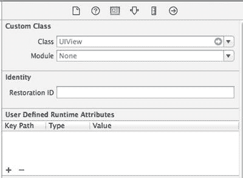

图 4-18。我们将`Interface Builder`切换为列表视图并选中了视图。然后切换到身份检查器，它允许我们更改故事板中任何对象实例的底层类

标记为**Class**的字段当前应显示为`UIView`。如果没有显示，你可能没有选中容器视图。现在，将该设置更改为`UIControl`并按**Return**键确认更改。所有能够触发操作方法的控件都是`UIControl`的子类；通过更改底层类，我们刚刚赋予了此视图触发操作方法的能力。你可以按**6**调出连线检查器来验证这一点。现在你应该看到所有之前章节中将按钮连接到操作时看到的那些事件。

将“按下”事件拖拽到**View Controller**图标（参见图 4-19），并选择`backgroundTap:`操作。现在，触摸视图中没有活动控件的任何地方都将触发我们新的操作方法，这将导致键盘收起。像这样连接到`View Controller`与在代码中连接到方法完全相同。在故事板内部，`View Controller`仅仅是视图控制器类的一个实例，因此这只是实现完全相同结果的一种略有不同的方式。

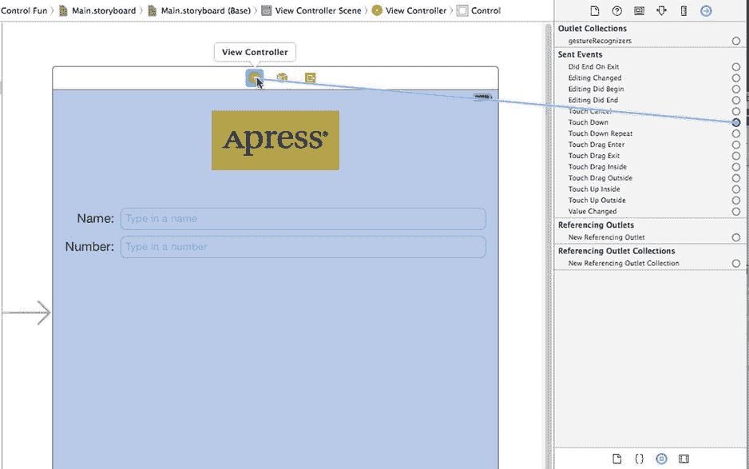

图 4-19。通过将视图的类从`UIView`更改为`UIControl`，我们获得了在任何标准事件上触发操作方法的能力。我们将视图的“按下”事件连接到`backgroundTap:`操作

**注意** 你可能想知道为什么我们选择了**Touch Down**而不是上一章中使用的**Touch Up Inside**。答案是背景不是一个按钮。在用户看来它不是一个控件，因此大多数用户不会想到要拖拽手指到某处来取消操作。

保存故事板，然后再次编译并运行你的应用程序。这一次，键盘不仅会在点击**Done**按钮时消失，而且在你点击任何非活动控件的地方时也会消失，这正是用户期望的行为。

很好！既然我们已经完美地处理了这一部分，你准备好进入下一组控件了吗？

### 添加滑块和标签

现在该添加滑块及其配套的标签了。请记住，标签中的值会随着滑块的使用而改变。在项目导航器中选择`Main.storyboard`，这样我们就可以向应用程序的用户界面添加更多项目。

在放置滑块之前，让我们为设计增加一点呼吸空间。我们用来确定顶部文本字段与其上方图像之间间距的蓝色引导线，实际上是关于最小间距的建议。换句话说，蓝色引导线告诉你“不要再靠近了”。将两个文本字段及其标签向下拖动一点，以图 4-1 为参考。现在让我们添加滑块。

从对象库中拖入一个滑块，并将其排列在**Number**文本字段下方，以右侧的蓝色引导线作为停止点，并在底部文本字段下方留出一点空间。我们的滑块最终位于视图的大约一半位置。单击新添加的滑块以选中它，然后按**4**返回属性检查器（如果它尚未可见，参见图 4-20）。

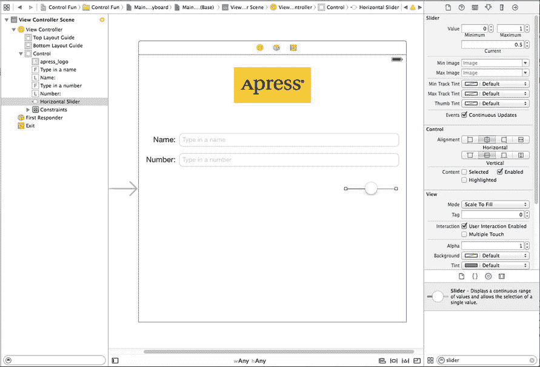

图 4-20。显示滑块默认属性的检查器

滑块允许你在给定范围内选择一个数字。使用检查器将**Minimum**值设置为`1`，**Maximum**值设置为`100`，**Current**值设置为`50`。保持**Events Continuous Update**复选框处于选中状态。这确保了当滑块值变化时，会持续产生事件流。这就是我们现在需要担心的全部内容。

拖入一个标签并将其放置在滑块旁边，使用蓝色引导线使其在垂直方向上与滑块对齐，并将其左边缘与视图的左边界对齐（参见图 4-21）。

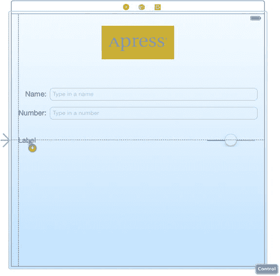

图 4-21。放置滑块的标签

双击新放置的标签，将其文本从`Label`更改为`100`。这是滑块可以容纳的最大值，我们可以用它来确定正确的滑块宽度。由于“100”比“Label”短，`Interface Builder`会自动为你缩小标签，就像你拖动了右中部的调整点一样。尽管有这种自动行为，你当然仍然可以自由地按需调整标签大小。如果你后来决定希望工具再次为你选择最佳尺寸，只需按**=**或选择**Editor  Size to Fit Content**。

接下来，调整滑块大小：单击滑块以选中它，然后将左侧调整点向左拖动，直到蓝色引导线指示你已靠近标签的右侧边缘。

### 添加更多约束


