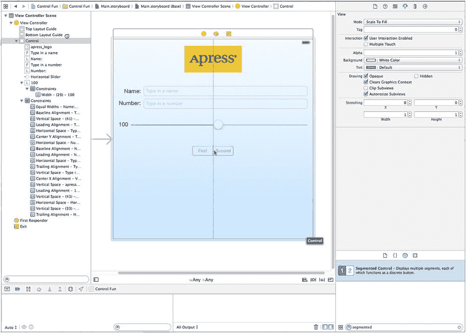
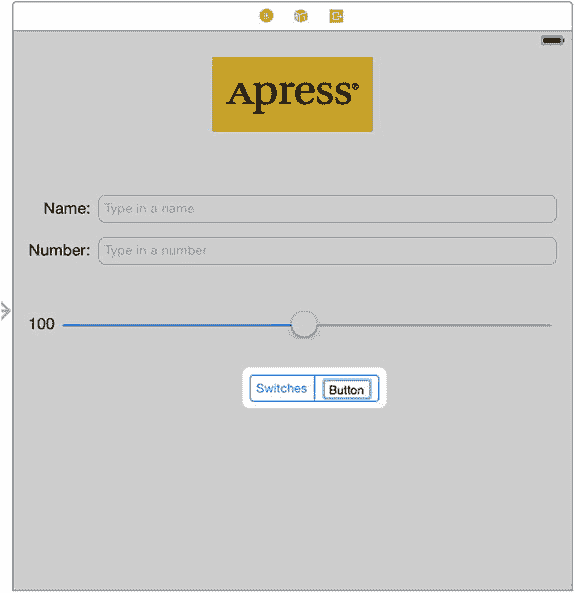
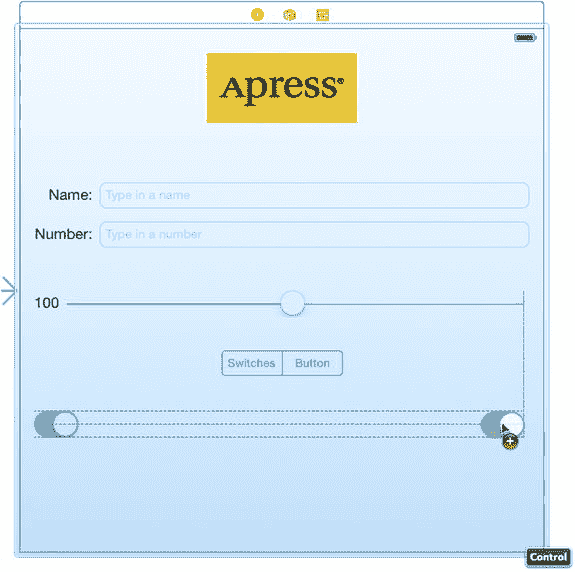
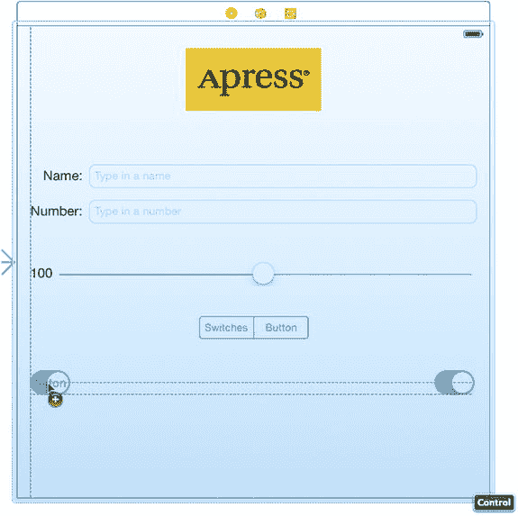
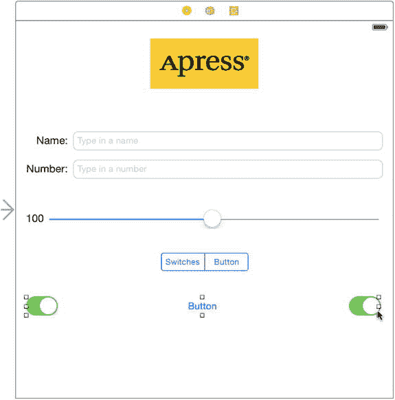
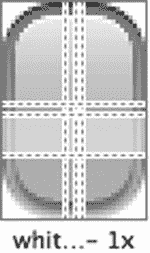
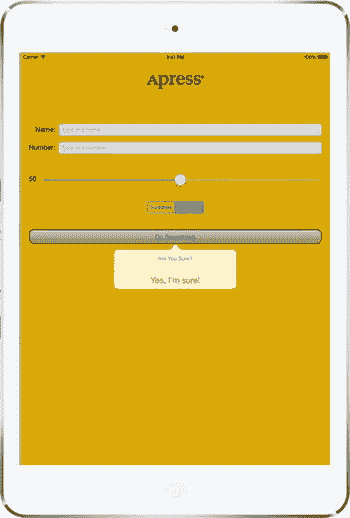

# 现在我们已经添加了两个新控件，接下来需要补充对应的 Auto Layout 约束。

这次我们依然用简单的方法来处理：只需在文档大纲中选择 `View Controller` 图标，然后点击 `Editor → Resolve Auto Layout Issues → Add Missing Constraints` 即可。不过还没完，由于我们为了调整间距将文本字段和标签向下移动了一些，因此需要更新它们的约束以匹配新位置。如果不这样做，你将在活动视图中看到警告，提示它们在运行时会出现位置偏差。要修复此问题，请再次在文档大纲中选择 `View Controller` 图标，然后选择 `Editor → Resolve Auto Layout Issues → Update Constraints`。Xcode 会调整约束，使其与屏幕上所有控件的位置匹配，活动视图中的警告也会消失。

### 创建并连接动作和输出口

对于这两个控件，剩下的工作就是连接输出口和动作。我们需要一个指向标签的输出口，以便在滑动滑块时更新标签的值。另外还需要为滑块创建一个动作方法，使其在变化时被调用。

请确保你正在使用助理编辑器并编辑 `ViewController.m`，然后按住 Control 键从滑块拖拽到助理编辑器中 `@end` 声明之上。在弹出的窗口中，`Connection` 字段会预设为 `Action`。在 `Name` 字段中输入 `sliderChanged`，并将 Type 设置为 `UISlider`，然后按 `Return` 键创建并连接动作。

接下来，按住 Control 键从新添加的标签（显示“100”的那个）拖拽到助理编辑器。这次拖拽到文件顶部 `@interface` 和 `@end` 之间最后一个属性声明下方。在弹出的窗口中，在 `Name` 文本字段中输入 `sliderLabel`，然后按 `Return` 键创建并连接输出口。

### 实现动作方法

虽然 Xcode 已经创建并连接了动作方法，但我们仍需自行编写动作方法的实际代码，使其完成应有的功能。将以下代码添加到 `sliderChanged:` 方法中：

```
- (IBAction)sliderChanged:(UISlider *)sender {
    int progress = (int)lroundf(sender.value);
    self.sliderLabel.text = [NSString stringWithFormat:@"%d", progress];
}
```

方法中的第一行获取滑块的当前值，将其四舍五入为最接近的整数，并赋值给一个整型变量。第二行代码创建包含该数字的字符串，并将其赋值给标签。

这样，控制器对滑块移动的响应就处理好了；但为了保持一致性，我们需要确保在用户触摸滑块之前，标签就已显示正确的滑块值。将以下代码添加到 `viewDidLoad` 方法中：

```
- (void)viewDidLoad {
    [super viewDidLoad];
    // 在从 nib 加载视图后进行任何额外的设置
    self.sliderLabel.text = @"50";
}
```

上述方法会在运行中的应用从故事板文件加载视图后、显示到屏幕前立即执行。我们添加的这行代码确保用户能立即看到正确的起始值。

保存文件。然后按 `⌘R` 键构建并在 iOS 模拟器中启动应用，尝试滑动滑块。当你移动滑块时，应该能看到标签文本实时变化。又一个环节落实到位。

但如果你将滑块向左拖拽（使值低于 10）或向右拖到底（将值设为 100），你会发现一个奇怪的现象。左边的标签在显示单个数字时会水平收缩，显示三个数字时则会水平扩展。虽然因为你看不到标签本身（除了其包含的文本），所以无法看到它大小的变化，但你会看到滑块实际随着标签一起改变大小——变小或变大。它保持着与标签的大小关系，确保两者之间的间距始终不变。

这并非我们主动要求的，对吧？确实不是。这仅仅是 Interface Builder 工作方式的一个副作用，它有助于帮助你创建响应式且流畅的图形用户界面。我们之前创建了一些默认约束，现在你正看到一个约束在起作用。Interface Builder 创建的其中一个约束保持了这些元素之间的水平间距恒定。

幸运的是，你可以通过创建自己的约束来覆盖这种行为。回到 Xcode，在故事板中选择标签，然后从菜单中选择 `Editor → Pin → Width`。这会创建一个新的高优先级约束，告诉布局系统：“不要改变这个标签的宽度。” 如果你现在按 `⌘R` 键再次构建并运行，你会看到标签不再随滑块左右拖拽而伸缩变化。

我们将在本书中看到更多约束及其用途的示例。但现在，让我们先来实现开关。

## 实现开关、按钮和分段控件

再次回到 Xcode。是不是有点晕了？这种来回切换可能看起来有些奇怪，但在开发过程中，在源代码、故事板和 nib 文件之间切换，并在 iOS 模拟器中测试应用，是相当常见的操作。

我们的应用将包含两个开关，它们是只有两种状态（开和关）的小型控件。我们还将添加一个分段控件来隐藏和显示这两个开关。配合这个控件，我们还会添加一个按钮，当点击分段控件的右侧时会显示该按钮。接下来实现这些功能。

回到故事板，从对象库中拖拽一个分段控件（参见图 4-22），将其放置到视图窗口中，位于滑块下方稍靠水平居中的位置。



图 4-22. 将分段控件从库拖拽到父视图左侧时的显示效果

**提示** 为了让你对我们希望的间距有概念，可以看一下带有 Apress 标志的图像视图。我们试图在图像视图上方和下方留出大致相同的空间。对于滑块我们也做了同样处理：尽量在滑块上方和下方留出大致相同的空间。

双击分段控件上的 `First` 字样，将标题从 `First` 改为 `Switches`。完成此操作后，对 `Second` 段重复此步骤，将其重命名为 `Button`（参见图 4-23），然后将控件拖回居中位置。



图 4-23. 重命名分段控件中的分段

### 添加两个带标签的开关

接下来，从库中选取一个开关，将其放置到视图上，位于分段控件下方并紧贴左边距。现在拖拽第二个开关，将其放置到紧贴右边距的位置，并与第一个开关垂直对齐（参见图 4-24）。



图 4-24. 向视图中添加开关


**提示** 在 Interface Builder 中按住 `` 键并拖动对象，将会创建该对象的一个副本。当需要创建多个相同对象的实例时，从库中仅拖出一个对象，然后按住 Option 键拖出所需数量的副本，效率会更高。

我们添加的三个新控件需要布局约束。这次我们将手动添加约束。首先，选中分段控件，然后从菜单中选择 **Editor `` Align `` Horizontal Center in Container**，将其固定在视图中央。接下来，用鼠标选中分段控件，然后向上方小幅 Control-拖动，直到主视图背景变为蓝色。松开鼠标，在弹出的菜单中选择 **Top Space to Top Layout Guide**，以固定分段控件到视图顶部的距离。

现在来处理开关。从左侧开关向左上方斜向 Control-拖动，朝向相对于开关的 10 点钟方向，然后松开鼠标。按住 **Shift** 键，从弹出菜单中选择 **Leading Space to Container Margin** 和 **Top Space to Top Layout Guide**，然后按下 **Return** 键或点击弹出菜单之外的任意位置以应用约束。对另一个开关执行类似操作，但这次向右上方（2 点钟方向）Control-拖动，并选择 **Trailing Space to Container Margin** 和 **Top Space to Top Layout Guide**。当通过拖动应用约束时，Xcode 会根据你拖动的方向提供不同的选项。如果横向拖动，你会得到将控件固定到其父视图左边距或右边距的选项；而纵向拖动时，Xcode 会假定你要设置控件相对于父视图顶部或底部的位置。这里，每个开关需要一个横向和一个纵向约束，所以我们斜向拖动以向 Xcode 表明意图，从而获得了横向和纵向两个选项。

### 连接与创建输出口和操作

在添加按钮之前，我们将为两个开关创建输出口并连接它们。接下来要添加的按钮实际上会位于开关之上，这使得从开关进行 Control-拖动或向开关进行 Control-拖动更加困难，因此我们希望在添加按钮之前处理好开关的连接。由于按钮和开关永远不会同时可见，将它们放在同一物理位置不会有问题。

使用辅助编辑器，从左侧开关 Control-拖动到 `ViewController.m` 中最后一个输出口的下方。当弹出窗口出现时，将输出口命名为 `leftSwitch`，然后按 **Return** 键。对另一个开关重复此过程，将其输出口命名为 `rightSwitch`。

现在，再次单击左侧开关将其选中。再次向辅助编辑器 Control-拖动。这次，拖动到 `@end` 声明正上方，然后松开。当弹出窗口出现时，将新的操作方法命名为 `switchChanged:`，并将其 `sender` 参数的类型设置为 `UISwitch`。接下来，按 **Return** 键创建新操作。现在对右侧开关重复此过程，但有一处更改：不要创建新操作，而是拖动到刚刚创建的 `switchChanged:` 操作并连接到它。就像我们在前一章中所做的那样，我们将使用单一方法来处理两个开关。

最后，从分段控件向辅助编辑器 Control-拖动，拖动到 `@end` 声明正上方。插入一个名为 `toggleControls:` 的新操作方法，就像之前所做的那样。这次，将其 `sender` 参数的类型设置为 `UISegmentedControl`。

### 实现开关操作

保存故事板，让我们向已经在辅助视图中打开的 `ViewController.m` 中添加更多代码。找到自动为你添加的 `switchChanged:` 方法，并向其中添加以下代码：

```
- (IBAction)switchChanged:(UISwitch *)sender {
    BOOL setting = sender.isOn;
    [self.leftSwitch setOn:setting animated:YES];
    [self.rightSwitch setOn:setting animated:YES];
}
```

`switchChanged:` 方法在两个开关中的任意一个被点击时调用。在该方法中，我们只需获取 `sender`（代表被按下的开关）的 `isOn` 值，并使用该值来设置两个开关。这里的思路是，设置一个开关的值会同时改变另一个开关，从而使它们始终同步。

现在，`sender` 始终是 `leftSwitch` 或 `rightSwitch`，所以你可能会想，为什么我们要同时设置它们。原因在于实用性。每次同时设置两个开关的值，比判断哪个开关调用了该方法并仅设置另一个开关要省事。无论哪个开关调用了该方法，它本身的值已经设置为正确的数值，再次将其设置为相同数值不会产生任何影响。

### 添加按钮

接下来，返回 Interface Builder，从库中拖出一个 Button 到你的视图。将此按钮直接添加到最左侧开关的顶部，使其与左边距对齐，并使其顶部边缘与两个开关的顶部边缘垂直对齐（参见图 4-25）。



图 4-25。在现有开关顶部添加一个按钮

现在，抓住右侧中间的大小调整手柄，一直向右拖动，直到到达指示右边距的蓝色辅助线。按钮应完全覆盖两个开关所占的空间，但由于默认按钮是透明的，你仍然会看到开关（参见图 4-26）。



图 4-26。圆角矩形按钮在放置并调整大小后，将填充两个开关所占的空间

双击新添加的按钮，将其标题设置为 *Do Something*。

该按钮需要 Auto Layout 约束。我们将把它固定到主视图的顶部以及两侧。从按钮向上 Control-拖动，直到视图背景变为蓝色，然后松开鼠标并选择 **Top Space to Top Layout Guide**。接着，水平 Control-拖动，直到主视图背景再次变为蓝色，并选择 **Leading Space to Container Margin**。只有当你向左拖动足够远时，才会看到此选项；因此如果没有看到，请重试并向左拖动，直到鼠标超出按钮边界。最后，向右 Control-拖动，直到主视图背景变为蓝色，然后选择 **Trailing Space to Container Margin**。现在运行应用程序，看看我们刚刚做了什么。

### 美化按钮

如果你将正在运行的应用程序与图 4-2 进行比较，可能会发现一个有趣的差异。你的 **Do Something** 按钮看起来与图中的按钮不同。这是因为，从 iOS 7 开始，默认按钮具有非常简洁的外观：它只是一段纯文本，没有轮廓、边框、背景颜色或其他装饰特征。这很好地符合了苹果针对 iOS 7 及更高版本的设计指南，但仍有需要使用自定义按钮的情况，因此我们将向你展示如何操作。

好的，作为一名高级文档工程师和翻译员，我将严格遵循您的注意事项，将给定的英文文本翻译成中文。


许多你在 iOS 设备上看到的按钮都使用图像绘制。我们在本书源代码归档的`04 – Button Images`文件夹中提供了你可以在本示例中使用的图像。在 Xcode 的项目导航器中，选择`Images.xcassets`（与我们之前为 Apress 标志添加图像时使用的同一资源目录），然后直接将`04 – Button Images`文件夹中的两个图像从 Finder 拖拽到 Xcode 窗口的编辑区域。这些图像会被添加到你的项目，并立即可用于你的应用。

#### 可拉伸图像

现在，查看我们刚刚添加的两个按钮图像，你可能会被它们的大小所震惊。它们非常小，似乎太窄了，无法填满你添加到故事板中的按钮。这是因为这些图形本应是可拉伸的。实际上，`UIKit`可以将图形拉伸，以完美地填充你想要的任何尺寸。可拉伸图像是一个有趣的概念。可拉伸图像是一种可调整大小的图像，知道如何智能地调整自身大小，从而保持正确的外观。对于这些按钮模板，我们不希望边缘与图像的其余部分均匀拉伸。**边缘插图**是图像中不应调整大小的部分（以像素为单位）。我们希望边缘周围的斜面保持不变，无论我们把按钮做成多大，因此我们需要指定每条边由多少不可拉伸空间构成。

在过去，这只能通过代码实现。你必须使用图形程序来测量图像的像素边界，然后在代码中使用这些数值来设置边缘插图。Xcode 6 通过让你以可视方式“切片”资源目录中的任何图像，消除了这一需求！这就是我们接下来要做的。

在 Xcode 中选择`Images.xcassets`资源目录，然后在其中选择`whiteButton`。在编辑区域的底部，你会看到一个标记为**Show Slicing**的按钮。点击它以启动切片过程，该过程首先会在你的图像正上方放置一个**Start Slicing**按钮。奇迹由此开始，所以点击它！你会看到三个新按钮，让你选择是否要垂直、水平或双向切片图像。选择中间的按钮进行双向切片。Xcode 会快速分析你的图像，然后找到边缘看似具有独特像素的部分，以及中间应可重复的垂直和水平切片。你将看到这些边界由虚线表示，如图 4-27 所示。如果你的图像比较复杂，可能需要调整这些边界（这很容易做到，只需用鼠标拖拽它们即可）；但对于这个图像，自动边缘插图效果很好。



图 4-27. 这是白色按钮的默认切片外观

接下来，选择`blueButton`并对其执行相同的自动切片操作。全部完成！现在该使用这些图形了。

回到你一直在处理的故事板，单击**Do Something**按钮。选中按钮后，按下**4**打开属性检查器。在检查器中，使用第一个弹出菜单将类型从*System*更改为*Custom*。你会在检查器中看到，可以为按钮指定一个图像（`Image`）和一个背景（`Background`）。我们将使用背景来显示可调整大小的图形，因此点击**Background**弹出菜单并选择`whiteButton`。你会看到按钮现在显示白色图形，完美拉伸覆盖整个按钮框架。太棒了！

现在，我们想使用蓝色按钮来定义此按钮高亮状态的外观，即按钮被按下时看到的状态。我们将在本章下一节中更详细地讨论控件状态；但现在，先看一下顶部第二个标记为**State Config**的弹出菜单。一个`UIButton`可以有多个状态，每个状态都有自己的文本和图像。目前我们一直在配置默认状态，因此将此弹出菜单切换到*Highlighted*，以便我们可以配置该状态。你会看到**Background**弹出菜单已被清空；点击它选择`blueButton`，就完成了！

这个新按钮外观只有一个问题：默认的`UIButton`尺寸不够高，无法正确显示我们导入的渐变按钮。实际上，活动视图（Activity View）中有一条警告，指示按钮在运行时将具有不同的框架。你可以通过选择按钮，然后点击菜单中的**Editor  Resolve Auto Layout Issues  Update Frames** 来解决此问题。

配置此按钮引入了两个新概念：**可拉伸图像**和**控件状态**。我们已经讨论过前者，现在让我们来解决后者。

#### 控件状态

每个 iOS 控件都有四种可能的控件状态，并且在任何给定时刻，始终处于其中一种且仅一种状态：

*   **Normal（正常）**：最常见的状态是正常控件状态，即默认状态。这是控件不处于任何其他状态时的状态。
*   **Highlighted（高亮）**：高亮状态是控件正在被使用时的状态。对于按钮，这指的是用户手指按在按钮上的状态。
*   **Disabled（禁用）**：当控件被关闭时，它处于禁用状态。可以通过取消选中 Interface Builder 中的**Enabled**复选框，或设置控件的`enabled`属性为`NO`来实现。
*   **Selected（选中）**：只有部分控件支持选中状态。它通常用于指示控件已打开或已被选中。Selected 与 Highlighted 类似，但即使用户不再直接使用该控件，它也可以继续保持选中状态。

某些 iOS 控件的属性可以根据其状态取不同的值。例如，通过为`UIControlStateNormal`指定一个图像，为`UIControlStateHighlighted`指定另一个图像，我们是在告诉 iOS，当用户手指按在按钮上时使用一个图像，而其他时间使用另一个图像。这基本上就是我们在故事板中为按钮配置两个不同背景状态时所做的事情。

#### 连接并创建按钮 Outlet 和 Action

从新按钮按住 Control 键拖拽到助理编辑器，放置在文件顶部部分中最后一个 Outlet 的正下方。当弹出窗口出现时，创建一个名为`doSomethingButton`的新 Outlet。完成此操作后，再次从按钮按住 Control 键拖拽到文件底部`@end`声明的正上方。在那里，创建一个名为`buttonPressed:`的 Action，并将类型设置为`UIButton`。

如果你保存工作并测试运行该应用程序，你会看到分段控件将处于活动状态，但它暂时还不会做任何特别有用的事情。我们需要添加一些逻辑，以使按钮和开关显示和隐藏。


我们还需要从一开始就将按钮标记为隐藏。之前我们没有这样做，是因为那会让连接插口和动作变得更加困难。不过，既然已经完成了连接，现在就来隐藏这个按钮。当用户点击分段控件的右侧时，我们会显示该按钮；但在应用启动时，我们希望按钮是隐藏的。在故事板中，选中该按钮，然后按下 **4** 调出属性检查器。向下滚动到 **View** 部分，勾选 **Hidden** 复选框。按钮在 Interface Builder 中仍然可见，但会显示为褪色和透明状态，以表示其隐藏状态。

### 实现分段控件动作

保存故事板，再次将注意力集中到 `ViewController.m` 上。找到 Xcode 为我们创建的 `toggleControls:` 方法，并将加粗的代码添加到其中：

```
- (IBAction)toggleControls:(UISegmentedControl *)sender {
    // 0 == switches 索引
    if (sender.selectedSegmentIndex == 0) {
        self.leftSwitch.hidden = NO;
        self.rightSwitch.hidden = NO;
        self.doSomethingButton.hidden = YES;
    } else {
        self.leftSwitch.hidden = YES;
        self.rightSwitch.hidden = YES;
        self.doSomethingButton.hidden = NO;
    }
}
```

这段代码检查了 `sender` 的 `selectedSegmentIndex` 属性，该属性告诉我们当前选中的是哪个分段。第一个分段名为 `switches`，其索引为 0。我们在注释中注明了这一点，这样以后再次查看代码时，就能明白发生了什么。根据选中的分段，我们相应地隐藏或显示对应的控件。

在运行应用之前，让我们做一个小的调整，让它看起来更好一些。随着 iOS 7 的推出，Apple 引入了一些新的 GUI 范式。其中之一是屏幕顶部的状态栏在 iOS 7 应用中是透明的，以便你的内容能够直接透过它显示出来。目前，那个黄色的 Apress 图标在我们应用的白色背景上显得格外突出，所以让我们将黄色扩展到覆盖整个视图。在 `Main.storyboard` 中，选择主内容视图，按下 **4** 调出属性检查器。点击标记为 **Background** 的颜色样品，打开标准的 OS X 颜色选择器。这个颜色选择器的一个功能是，它允许你选择屏幕上看到的任何颜色。打开颜色选择器后，点击故事板中的 Apress 图像视图以选中它。现在点击颜色选择器左上角的放大镜图标，然后再次点击 Apress 图像视图。你应该会在颜色选择器的顶部，放大镜旁边看到 Apress 图像的背景颜色。要将其设置为主内容视图的背景颜色，请在文档大纲中选择主视图（它被称为 **Control**，因为我们之前将其类更改为 `UIControl`），然后在颜色选择器中点击该颜色。完成后，关闭颜色选择器。

在你的屏幕上，你可能会发现背景和 Apress 图像的颜色略有不同，但在模拟器或设备上运行时，它们会是相同的。这些颜色在 Interface Builder 中看起来不同，是因为 OS X 会根据你使用的显示器自动适配颜色。在 iOS 设备和模拟器上，不会发生这种情况。

现在运行你的应用，你会看到黄色填充了整个屏幕，状态栏和应用内容之间没有可见的界限。如果你的应用没有全屏滚动内容，或者其他需要在屏幕顶部使用导航栏或其他控件的内容，这可以成为一种很好的方式，来显示不受状态栏过多干扰的全屏内容。

如果你正确地输入了所有代码，应该能够通过分段控件在按钮和两个开关之间进行切换。而且，如果你点击任何一个开关，另一个开关也会随之改变其值。然而，按钮仍然没有任何功能。在实现它之前，我们需要讨论一下操作表和警告框。

## 实现操作表和警告框

**操作表**和**警告框**都用于向用户提供反馈：

- 操作表用于强制用户在两个或多个选项之间做出选择。在 iPhone 上，操作表从屏幕底部弹出，并显示一系列按钮（参见图 4-3）。在 iPad 上，你需要指定操作表相对于另一个视图（通常是按钮）的位置。在用户点击其中一个按钮之前，他们无法继续使用应用。操作表通常用于确认潜在危险或不可逆的操作，例如删除对象。
- 警告框以屏幕中央的圆角矩形形式出现（参见图 4-4）。与操作表一样，警告框强制用户在继续使用应用之前做出响应。警告框通常用于通知用户发生了重要或异常事件。与操作表一样，警告框可以只显示一个按钮，但如果有多种合适的响应，你也可以选择显示多个按钮。

**注意** 强制用户在继续使用应用之前做出选择的视图，被称为模态视图。

### 显示操作表

让我们切换到 `ViewController.m` 并实现按钮的动作方法。首先找到 Xcode 为你创建的空 `buttonPressed:` 方法，然后将加粗的代码添加到该方法中，以创建并显示操作表：

```
- (IBAction)buttonPressed:(UIButton *)sender {
    UIAlertController *controller =
       [UIAlertController alertControllerWithTitle:@"你确定吗？"
          message:nil preferredStyle:UIAlertControllerStyleActionSheet];
    UIAlertAction *yesAction =
          [UIAlertAction actionWithTitle:@"是的，我确定！"
                style:UIAlertActionStyleDestructive
                handler:^(UIAlertAction *action){
        NSString *msg;
        if ([self.nameField.text length] > 0) {
            msg = [NSString stringWithFormat:
                   @"你可以放心，%@，一切顺利。",
                   self.nameField.text];
        } else {
            msg = @"你可以放心，一切顺利。";
        }
        UIAlertController *controller2 =
                [UIAlertController
                   alertControllerWithTitle:@"操作已完成"
                   message:msg
                   preferredStyle:UIAlertControllerStyleAlert];
        UIAlertAction *cancelAction =
                [UIAlertAction actionWithTitle:@"呼！"
                   style: UIAlertActionStyleCancel handler:nil];
        [controller2 addAction:cancelAction];
        [self presentViewController:controller2 animated:YES completion:nil];
    }];
    UIAlertAction *noAction = [UIAlertAction actionWithTitle:@"绝不！"
                     style:UIAlertActionStyleCancel handler:nil];
    [controller addAction:yesAction];
    [controller addAction:noAction];

UIPopoverPresentationController *ppc =
              controller.popoverPresentationController;
    if (ppc != nil) {
        ppc.sourceView = sender;
        ppc.sourceRect = sender.bounds;
    }
    [self presentViewController:controller animated:YES completion:nil];
}
```

我们到底做了什么？首先，在 `doSomething:` 动作方法中，我们分配并初始化了一个 `UIAlertController`，这是一个视图控制器子类，它可以显示操作表或警告框。


```objc
UIAlertController *controller =
   [UIAlertController alertControllerWithTitle:@"Are You Sure?"
      message:nil preferredStyle:UIAlertControllerStyleActionSheet];
```

初始化方法接受多个参数。让我们逐一分析这些参数。

第一个参数是要显示的标题。请参考图 4-3 了解我们提供的标题将如何显示在操作表顶部。第二个参数是紧接在标题下方、以较小字体显示的消息。在本例中，我们不使用消息，因此为此参数提供值 `nil`。最后一个参数指定控制器是显示警告（值 `UIAlertControllerStyleAlert`）还是操作表（`UIAlertControllerStyleActionSheet`）。由于我们需要操作表，因此在此处提供值 `UIAlertControllerStyleActionSheet`。

默认情况下，警告控制器不提供任何按钮——您必须为每个需要的按钮创建一个 `UIAlertAction` 对象，并将其添加到控制器中。以下是为操作表创建两个按钮的部分代码：

```objc
UIAlertAction *yesAction =
      [UIAlertAction actionWithTitle:@"Yes, I'm sure!"
            style:UIAlertActionStyleDestructive
            handler:^(UIAlertAction *action){
    // 代码已省略——请参见下文。
}];
UIAlertAction *noAction = [UIAlertAction actionWithTitle:@"No way!"
                 style:UIAlertActionStyleCancel handler:nil];
```

对于每个按钮，您需要指定标题、样式以及按钮按下时要调用的处理程序。有三种可选的样式：

- `UIAlertActionStyleDestructive` 应在按钮触发破坏性、危险或不可逆操作时使用，例如删除或覆盖文件。此样式按钮的标题将以粗体红色字体显示。
- 对于普通按钮（如确定按钮），当要触发的操作不是破坏性时，使用 `UIAlertActionStyleDefault`。标题以常规蓝色字体显示。
- `UIAlertStyleCancel` 用于取消按钮。标题以粗体蓝色字体显示。

最后，将按钮添加到控制器中：

```objc
[controller addAction:yesAction];
[controller addAction:noAction];
```

要使警告或操作表可见，您需要请求当前视图控制器*呈现*警告控制器。以下是呈现操作表的方法：

```objc
UIPopoverPresentationController *ppc =
          controller.popoverPresentationController;
if (ppc != nil) {
    ppc.sourceView = sender;
    ppc.sourceRect = sender.bounds;
}
[self presentViewController:controller animated:YES completion:nil];
```

前五行通过获取警告控制器的弹出式呈现控制器，并设置其 `sourceView` 和 `sourceRect` 属性，来配置操作表出现的位置。稍后我们将详细说明这些属性。最后，我们通过调用视图控制器的 `presentViewController:animated:completion:` 方法，并将警告控制器作为要呈现的控制器传递给它，从而使操作表可见。当视图控制器被呈现时，其视图会临时替换呈现它的视图控制器的视图。对于警告视图控制器，操作表或警告会部分覆盖呈现视图控制器的视图；视图的其余部分被深色半透明背景覆盖，让您可以看到底层视图，但明确表明在您取消呈现的视图控制器之前，无法与其交互。

现在让我们重新审视弹出式呈现控制器的配置。在 iPhone 上，操作表总是从屏幕底部弹出，如图 4-3 所示，但在 iPad 上，它显示在一个**弹出框**中——一个带有箭头的小圆角矩形，指向另一个视图，通常是导致其出现的视图。图 4-28 展示了我们的操作表在 iPad 模拟器上的样子。



图 4-28. iPad 上的操作表

如您所见，弹出框的箭头指向**Do Something**按钮。这是因为我们将警告控制器的弹出式呈现控制器的 `sourceView` 属性设置为指向该按钮，并将其 `sourceRect` 属性设置为该按钮的边界范围：

```objc
if (ppc != nil) {
        ppc.sourceView = sender;
        ppc.sourceRect = sender.bounds;
    }
```

注意 `ppc != nil` 检查——我们进行此检查是因为在 iPhone 上，警告控制器不会在弹出框中呈现操作表，因此其 `popoverPresentationController` 属性为 `nil`。严格来说，此检查并非必需，因为在 Objective-C 中向 `nil` 对象引用发送消息是完全合法的且不执行任何操作。然而，在代码中加入此检查可以清楚地表明，在某些情况下 `ppc` 可能为 `nil`，且不需要配置弹出式视图控制器。

在图 4-28 中，弹出框出现在源按钮下方，但如果您需要，可以通过设置弹出式呈现控制器的 `permittedArrowDirections` 属性来更改此行为，该属性是弹出框箭头允许方向的掩码。以下代码通过将此属性设置为 `UIPopoverArrowDirectionDown` 将弹出框移动到源按钮上方：

```objc
if (ppc != nil) {
    ppc.sourceView = sender;
    ppc.sourceRect = sender.bounds;
    ppc.permittedArrowDirections = UIPopoverArrowDirectionDown;
}
```

如果比较图 4-28 和图 4-3，您会发现在 iPad 上**No Way!**按钮不见了。警告控制器在 iPad 上不使用样式为 `UIAlertStyleCancel` 的按钮，因为用户习惯于通过点击弹出框外部的任何位置来取消弹出框而不执行任何操作。

### 显示警告

当用户按下**Yes, I'm Sure!**按钮时，我们希望弹出一个带有消息的警告。当按下添加到警告控制器的按钮时，操作表（或警告）会被解除，并且按钮的处理程序块会被调用，同时传入对创建该按钮的`UIAlertAction`的引用。按下**Yes, I'm Sure!**按钮时执行的代码以粗体显示：

```objc
UIAlertAction *yesAction =
      [UIAlertAction actionWithTitle:@"Yes, I'm sure!"
            style:UIAlertActionStyleDestructive
            handler:^(UIAlertAction *action){
    NSString *msg;
    if ([self.nameField.text length] > 0) {
        msg = [NSString stringWithFormat:
               @"You can breathe easy, %@, everything went OK.",
               self.nameField.text];
    } else {
        msg = @"You can breathe easy, everything went OK.";
    }
    UIAlertController *controller2 =
            [UIAlertController
               alertControllerWithTitle:@"Something Was Done"
               message:msg
               preferredStyle:UIAlertControllerStyleAlert];
    UIAlertAction *cancelAction =
            [UIAlertAction actionWithTitle:@"Phew!"
               style: UIAlertActionStyleCancel handler:nil];
    [controller2 addAction:cancelAction];
    [self presentViewController:controller2 animated:YES completion:nil];
}];
```


我们在 handler 代码块中要做的第一件事，就是创建一个将显示给用户的新字符串。在真实的应用程序中，你会在此时执行用户请求的任何处理。我们只是假装做了一些事情，并通过使用 alert 来通知用户。如果用户在顶部文本字段中输入了名字，我们会获取它，并将其用在 alert 中显示的消息里。否则，我们就只是构建一条通用消息来显示：

```
NSString *msg = nil;

if ([self.nameField.text length] > 0) {
    msg = [NSString stringWithFormat:
           @"You can breathe easy, %@, everything went OK.",
           self.nameField.text];
}
else {
    msg = @"You can breathe easy, everything went OK.";
}
```

接下来的几行代码看起来会有点熟悉。Alert 视图和操作表（action sheet）的创建和使用方式非常相似。我们总是从创建一个 `UIAlertController` 开始：

```
UIAlertController *controller2 =
        [UIAlertController
           alertControllerWithTitle:@"Something Was Done"
           message:msg
           preferredStyle:UIAlertControllerStyleAlert];
```

同样，我们传入一个要显示的标题。这次，我们还传入了一条更详细的消息，也就是我们刚刚创建的那个字符串。最后一个参数是样式，我们将其设置为 `UIAlertControllerStyleAlert`，因为我们想要的是一个 alert，而不是操作表。接下来，我们为 alert 的取消按钮创建一个 `UIAlertAction`，并将其添加到控制器中：

```
UIAlertAction *cancelAction =
        [UIAlertAction actionWithTitle:@"Phew!"
           style: UIAlertActionStyleCancel handler:nil];
[controller2 addAction:cancelAction];
```

最后，我们通过展示 alert 视图控制器来让 alert 出现：

```
[self presentViewController:controller2 animated:YES completion:nil];
```

你可以在图 4-4 中看到这段代码创建的 alert。你会注意到，我们的代码没有尝试获取和配置 alert 控制器的弹出展示控制器。这是因为 alert 在 iPhone 和 iPad 上都会显示在屏幕中央的一个小圆角视图中，所以没有需要配置的弹出展示控制器。

保存 `ViewController.m`，然后构建、运行，并尝试一下这个完整的应用程序。

## 跨越终点线

这一章内容很多。从概念上讲，我们没有向你灌输太多新东西，但是带你使用了大量控件，并向你展示了许多不同的实现细节。你在 Outlet 和 Action 方面得到了更多练习，看到了如何利用视图的层级结构，还进行了更多添加 Auto Layout 约束的练习。你了解了控件状态和可拉伸图片，也学会了如何使用操作表和 alert。

这个小应用程序里包含了很多内容。请随时返回去玩玩它。修改数值，通过添加和修改代码进行实验，看看 Interface Builder 中不同设置的效果。我们不可能带你了解 iOS 中每个控件的所有排列组合，但你刚刚完成的这个应用程序是一个很好的起点，涵盖了许多基础知识。

在下一章中，我们将探讨当用户将 iOS 设备从竖屏旋转到横屏，或者反过来旋转时会发生什么。你可能很清楚，许多应用程序会根据用户握持设备的方式改变显示内容，我们将向你展示如何在自己的应用程序中实现这一点。

