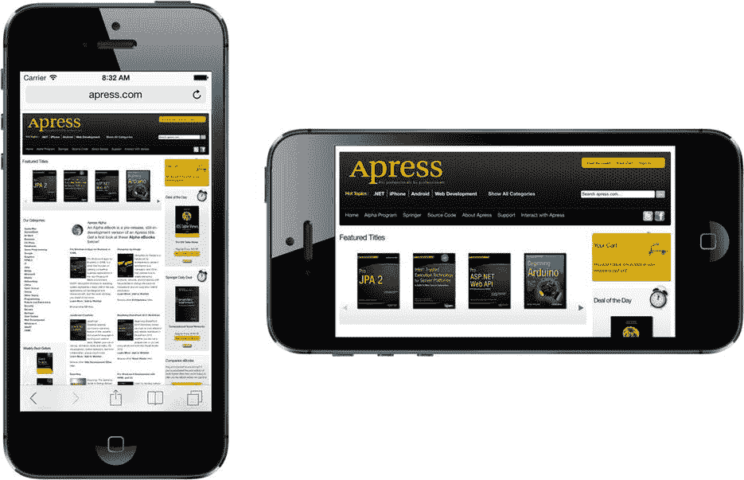

# 第 5 章：旋转与自适应布局

iPhone 和 iPad 是了不起的工程杰作。苹果工程师想出了各种办法，在非常小巧的机身中塞入最大化的功能。其中一个例子是，这些设备既可以在竖屏（高而窄）模式下使用，也可以在横屏（短而宽）模式下使用，并且这种方向可以在运行时通过简单地旋转设备来改变。你可以在 iOS 的网页浏览器 Mobile Safari 中看到这种行为（称为 `autorotation`）的示例（参见图 5-1）。在本章中，我们将详细介绍旋转。我们首先概述自动旋转的各种细节，然后讨论在应用中实现该功能的不同方法。

图 5-1。与许多 iOS 应用程序一样，Mobile Safari 会根据握持方式改变显示内容，以充分利用可用屏幕空间。

在 iOS 8 之前，如果你想设计一个能在 iPhone 和 iPad 上运行的应用程序，你必须创建一个包含 iPhone 布局的 storyboard，以及另一个包含 iPad 布局的 storyboard。在 iOS 8 中，这一切都改变了。苹果在 UIKit 和 Xcode 中添加了 API 和工具，使得仅用一个 storyboard 就能构建出能在任何设备上运行（或用他们的术语说，*适配*任何设备）的应用程序——甚至包括新款大屏 iPhone 6 Plus。你仍然需要针对每种设备的不同的外形尺寸进行精心设计，但现在你可以在一个地方完成所有工作。更好的是，使用我们在第 3 章中介绍的预览（Preview）功能，你无需启动模拟器就能立即看到你的应用程序在任何设备上的显示效果。我们将在本章的第二部分探讨如何构建自适应应用布局。

## 旋转的机制

在竖屏和横屏方向下运行的能力可能并非适用于每一个应用程序。苹果的几款 iPhone 应用程序（例如天气应用）只支持单一方向。然而，iPad 应用程序则不同。苹果建议大多数应用程序（除了那些本质上是围绕特定布局设计的沉浸式应用，如游戏）在 iPad 上运行时应该支持所有方向。

事实上，苹果自己的多数 iPad 应用在两种方向下都运行良好。许多应用会利用不同方向来展示数据的不同视图。例如，邮件和备忘录应用在横屏模式下会在左侧显示项目列表（文件夹、邮件或备忘录），右侧显示选中的项目。而在竖屏模式下，这些应用则让你专注于所选项目的详细信息。

对于 iPhone 应用，基本规则是：如果自动旋转能增强用户体验，你就应该将其添加到应用中。对于 iPad 应用，规则是：除非你有令人信服的理由不这样做，否则你应该添加自动旋转。幸运的是，苹果在 iOS 和 UIKit 中很好地隐藏了处理方向变化的复杂性，因此在你的 iOS 应用中实现这种行为实际上相当容易。

是否允许旋转用户界面是在视图控制器中指定的。如果用户旋转了设备，活动的视图控制器将被询问是否可以旋转到新的方向（你将在本章中看到如何操作）。如果视图控制器给予肯定回答，应用程序的窗口和视图将被旋转，并且窗口和视图的大小将被调整以适应新的方向。

