# 关于 iPhone 和 iPod touch

在 iPhone 和 iPod touch 上，以竖屏模式启动的视图，其高度会大于宽度——你可以通过参阅第 1 章中的表 1-1 的“软件尺寸”列，来了解任何特定设备的实际可用空间。但请注意，如果你的应用显示了`status bar`（状态栏），即屏幕顶部那条显示信号强度、时间、电池电量等信息的 20 点高的横条（参见图 5-1），那么应用可用的垂直屏幕空间将减少 20 点。

当设备旋转到横屏模式时，垂直和水平尺寸会互换。例如，在 iPhone 6 上运行的应用，竖屏时屏幕宽 375 点、高 667 点；横屏时则变为宽 667 点、高 375 点。同样地，在 iPad 上，如果你显示了状态栏（大多数应用都会显示），应用实际可用的垂直空间也会减少 20 点。而在 iPhone 上，自 iOS 8 起，状态栏在横屏方向下会被隐藏。

### 点、像素和 Retina 显示屏

你可能想知道我们为什么谈论“点”而不是像素。本书的早期版本确实是以像素而非点来表示屏幕尺寸的。做出这一改变的原因在于苹果推出了`Retina display`。

`Retina display`是苹果的市场术语，指的是从 iPhone 4 及之后版本的 iPod touch，以及更新的 iPad 型号所采用的高分辨率屏幕。再次回顾表 1-1 可以看到，它将大多数型号的硬件屏幕分辨率提高了一倍，对于 iPhone 6 Plus 则几乎提高了两倍。

幸运的是，在大多数情况下，你无需为此做任何额外处理。当我们处理屏幕上的元素时，我们用*点*（而非像素）来指定尺寸和距离。对于旧款 iPhone、iPad、iPad 2 和 iPad Mini 1，点和像素是等同的：1 点等于 1 像素。然而，在较新款的 iPhone、iPad 和 iPod touch 上，1 点对应一个 4 像素的正方形（宽 2 像素 × 高 2 像素）。例如，iPhone 5s 的屏幕看起来仍然是 320 点宽，尽管其实际宽度是 640 像素。在 iPhone 6 Plus 上，缩放因子是 3，因此每个点对应一个 9 像素的正方形。你可以将其视为一种“虚拟分辨率”，iOS 会自动将点映射到屏幕的物理像素上。我们将在第 16 章中进一步讨论这一点。

在典型的应用中，将像素实际移动到屏幕上的大部分工作都由 iOS 管理。你的应用在此过程中的主要任务是确保所有内容在调整大小后的窗口中都能完美适配并看起来合适。

### 处理旋转

要处理设备旋转，你需要为构成界面的所有对象指定正确的`constraints`（约束）。`约束`告诉 iOS 设备，当它们所在的视图调整大小时，你的控件应如何表现。这与设备旋转有何关系？当设备旋转时，屏幕的尺寸（或多或少）会互换——因此你的视图布局区域的大小会改变。如果你曾在 OS X 上使用过 Cocoa，你可能已经熟悉了这个基本过程，因为它与用于指定 Cocoa 控件在用户调整其所在窗口大小时如何表现的方法相同。

使用约束最简单的方法是在 Interface Builder (IB) 中配置它们。Interface Builder 允许你定义约束，这些约束描述了当父视图发生变化或其他视图移动时，你的 GUI 组件将如何重新定位和调整大小。你在第 4 章中已经做了一些这方面的工作，本章将进一步深入探讨这个主题。你可以将约束视为关于视图几何结构的方程式，而 iOS 视图系统本身则像一个“求解器”，会根据需要重新排列视图以使这些方程式成立。你也可以在代码中添加约束，但本书不会涉及这部分内容。

约束是在 iOS 6 中加入的，但在 Mac 上出现的时间稍长一些。在 iOS 和 OS X 上，约束可用于取代之前的旧版“弹簧和支柱”系统。约束能够完成旧技术所能做的一切，甚至更多。

我们开始吧，好吗？在深入探讨配置 GUI 以重新排列视图的不同方法之前，我们将首先展示如何指定你的应用允许哪些方向。

#### 选择你的视图方向

我们将创建一个简单的应用，向你展示如何选择你希望应用支持的方向。在 Xcode 中新建一个 Single View Application 项目，将其命名为 *Orientations*。从`设备`弹出菜单中选择 *Universal*，然后将其与其他项目一起保存。

在我们在故事板中布局 GUI 之前，需要告诉 iOS 我们的视图支持界面旋转。实际上有两种方法可以实现。你可以创建一个应用范围内的设置，作为所有视图控制器的默认设置，也可以为每个单独的视图控制器进一步调整细节。我们将从应用级别的设置开始，进行这两项操作。

##### 应用级别支持的方向

首先，我们需要指定我们的应用支持哪些方向。当你的新 Xcode 项目窗口出现时，它应该已经打开到了项目设置。如果没有，请单击项目导航器中的第一行（以你的项目名称命名的行），然后确保你位于`通用`标签页。在摘要的可用选项中，你应该会看到一个名为 *Deployment Info* 的部分，其中包含一个名为 *Device Orientation* 的部分（*参见* 图 5-2），里面有一列复选框。

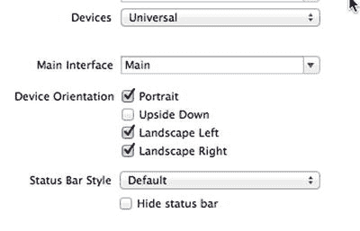

图 5-2. 我们项目的通用标签页展示了（除其他选项外）所支持的设备方向

这就是你标识应用支持哪些方向的方法。这并不一定意味着应用中的每个视图都会使用所有选中的方向；但如果你打算在应用的任何视图中支持某个方向，那么该方向必须在此处被选中。

你注意到 `Upside Down`（倒置）方向默认是关闭的吗？这是因为，如果电话在倒置状态下响起，接电话时电话很可能仍然是倒置的。

打开复选框上方的`设备`下拉菜单，你会看到你实际上可以为 iPhone 和 iPad 分别配置一组允许的方向。如果你选择`iPad`，你会看到所有四个复选框都被选中了，因为 iPad 旨在任何方向上使用。


**注意** 图 5-2 中显示的四个复选框实际上只是为应用程序的 `Info.plist` 文件添加和删除条目的一种快捷方式。如果你在项目导航器的 `Supporting Files` 文件夹中单击 `Info.plist`，你会看到两个条目，分别是 `Supported interface orientations` 和 `Supported interface orientations (iPad)`，其下还有当前所选方向的子条目。在项目摘要中选择或取消选择这些复选框，实际上就是在这两个数组中添加或删除条目。使用复选框更简单且不易出错，因此强烈推荐使用。但你应当了解它们的作用。

现在，选择 `Main.storyboard`。在对象库中找到标签并将其拖入视图，使其水平居中并靠近顶部位置，如图图 5-3 所示。选中该标签的文本并将其更改为 `This way up`。更改文本可能会移动标签的位置，因此请将其再次拖拽至水平居中。

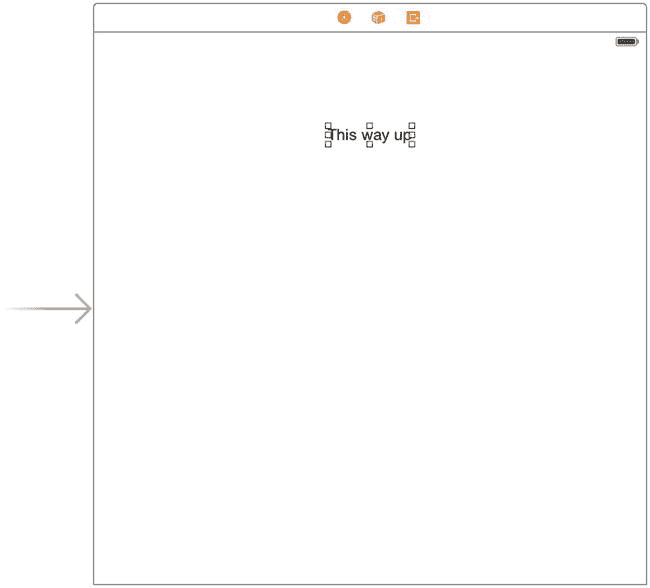

图 5-3。在你失去对重力感知时的实用提醒

在运行应用之前，我们需要添加 Auto Layout 约束来固定标签的位置。因此，按住 Control 键从标签向上拖拽，直到包含视图的背景变为蓝色，再松开鼠标。按住 **Shift** 键，在弹出的菜单中选择 **Top Space to Top Layout Guide** 和 **Center Horizontally in Container**，然后按 **Return** 键。现在，按下 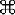**R** 键，在 iPhone 模拟器上构建并运行这个简单应用。当模拟器启动后，尝试通过按 **-Left-Arrow** 或 **-Right-Arrow** 键几次来旋转设备。你会发现整个视图（包括你添加的标签）会旋转到除倒置外的每个方向，正如我们配置的那样。在 iPad 模拟器上运行以确认它会旋转到所有四个可能的方向。

我们已经确定了应用将支持的方向，但这还不是全部。我们还可以为每个视图控制器指定一组可接受的方向，从而更精细地控制应用不同部分支持哪些方向。

#### 逐控制器旋转支持

现在，让我们配置视图控制器，使其允许一组不同且更小的可接受方向。应用的全局配置指定了一种允许方向的绝对上限。例如，如果全局配置不包含倒置方向，那么单个视图控制器就无法强制系统将显示旋转到倒置方向。在视图控制器中，我们所能做的只是进一步限制可接受的方向。

在项目导航器中，单击 `ViewController.m`。这里我们将实现一个在 `UIViewController` 超类中定义的方法，该方法允许我们指定哪些方向是可接受的：

```
- (NSUInteger)supportedInterfaceOrientations {
    return (UIInterfaceOrientationMaskPortrait |
            UIInterfaceOrientationMaskLandscapeLeft);
}
```

这个方法让我们返回一个 C 风格方向掩码。这是 iOS 询问视图控制器是否可以旋转到特定方向的方式。在本例中，我们返回的值表示接受两种方向：默认的竖屏方向以及将手机顺时针旋转 90° 后（手机左侧边缘朝上）的方向。我们使用布尔 OR 运算符（竖线符号）来组合这两个方向掩码，并返回组合后的值。

`UIApplication.h` 定义了以下方向掩码，你可以像前面讨论的那样，使用 OR 运算符以任意方式组合它们：

- `UIInterfaceOrientationMaskPortrait`
- `UIInterfaceOrientationMaskLandscapeLeft`
- `UIInterfaceOrientationMaskLandscapeRight`
- `UIInterfaceOrientationMaskPortraitUpsideDown`

此外，还有一些针对常见用例的预定义组合。它们在功能上等同于你自己将它们进行 OR 运算，但可以节省输入时间，并使代码更具可读性：

- `UIInterfaceOrientationMaskLandscape`
- `UIInterfaceOrientationMaskAll`
- `UIInterfaceOrientationMaskAllButUpsideDown`

当 iOS 设备改变方向时，当前活动的视图控制器上的 `supportedInterfaceOrientations` 方法会被调用。根据返回值是否包含新方向，应用决定是否应该旋转视图。因为每个视图控制器子类都可以以不同方式实现此功能，所以同一个应用可以支持某些视图旋转而其他视图不旋转，或者某个视图控制器在特定条件下支持某些方向。

### 代码补全实战

你是否注意到 iPhone 上定义的系统常量总是设计成以相同字母开头？像 `UIInterfaceOrientationMaskPortrait`、`UIInterfaceOrientationMaskPortraitUpsideDown`、`UIInterfaceOrientationMaskLandscapeLeft` 和 `UIInterfaceOrientationMaskLandscapeRight` 都以 `UIInterfaceOrientationMask` 开头的原因之一，就是为了让你利用 Xcode 的**代码补全**功能。

你可能已经注意到，在输入时，Xcode 经常会尝试补全你正在输入的单词。这就是代码补全在起作用。

开发者不可能记住系统中所有不同的定义常量，但你可以记住常用组别的共同前缀。当你需要指定方向时，只需输入 `UIInterfaceOrientationMask`（甚至只需输入 `UIInterf`），就会看到一个包含所有匹配项的列表弹出。（在 Xcode 的首选项中，你可以配置为仅当按下 **Esc** 键时列表才弹出。）你可以使用方向键浏览弹出的列表，并按 **Tab** 或 **Return** 键完成选择。这比在文档或头文件中查找值要快得多。

请随意尝试此方法，返回不同的方向掩码组合。你可以强制系统将视图显示限制为对应用有意义的方向，但不要忘记我们之前讨论的全局配置！请记住，例如，如果你没有在全局配置中启用倒置方向，那么无论视图怎么说，你的所有视图都不会以倒置状态显示。

**注意** iOS 实际上有两种不同类型的方向。我们这里讨论的是**界面方向**。还有一个独立但相关的概念是**设备方向**。设备方向指定设备当前的持握方式。界面方向则是指屏幕上的视图如何旋转。如果你将一个标准 iPhone 倒置，设备方向将是倒置的，但界面方向几乎总是其他三种方向之一，因为 iPhone 应用通常不支持竖屏倒置。

### 使用约束设计界面

在 Xcode 中，基于单视图应用模板再创建一个新项目，并将其命名为 `Layout`。选择 `Main.storyboard` 在 Interface Builder 中编辑界面文件。使用约束的好处之一是，它们可以用很少的代码实现很多功能。我们确实需要在代码中指定支持哪些方向（除非我们打算支持默认集合），但布局的细节是在 Interface Builder 中指定的。


为了了解其工作原理，从库中拖拽四个`Label`到你的视图中，并按图 5-4 所示放置它们。使用蓝色虚线辅助线帮助你将其分别对齐到靠近四个角的位置。在这个例子中，我们使用`UILabel`类的实例来展示如何通过约束控制 GUI 布局，但相同的规则适用于所有类型的 GUI 对象。

双击每个标签并为其分配一个标题，以便稍后区分它们。我们将左上角的标签命名为`UL`，右上角的标签命名为`UR`，左下角的标签命名为`LL`，右下角的标签命名为`LR`。设置好每个标签的文本后，将它们全部拖到合适的位置，使其相对于容器视图的角均匀对齐（参见图 5-4）。

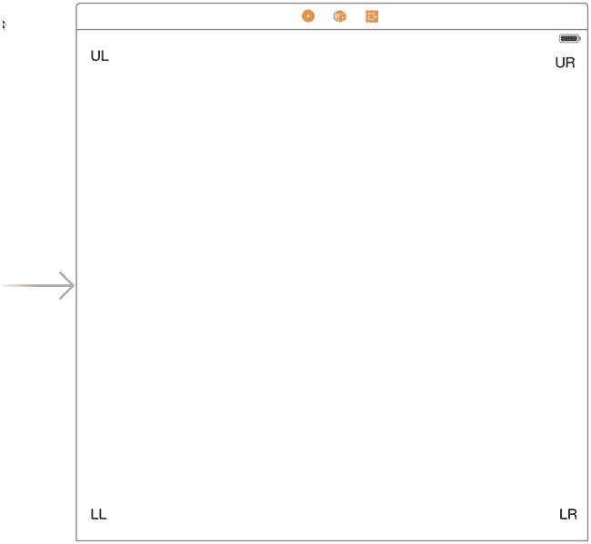

图 5-4. 向界面添加四个标签

现在让我们看看，如果我们没有设置任何 Auto Layout 约束，会发生什么。在 iPhone 5s 模拟器上构建并运行应用程序。一旦模拟器启动，你会发现你只能看到左上角的标签和左下角标签的一小部分——另外两个标签在屏幕右侧之外。此外，原本在左下角的标签也几乎不可见。选择**Hardware**  **Rotate Left**，这将模拟将 iPhone 旋转到横屏模式，你会发现现在可以看到左上角的标签和右上角标签的一部分，如图 5-5 所示。

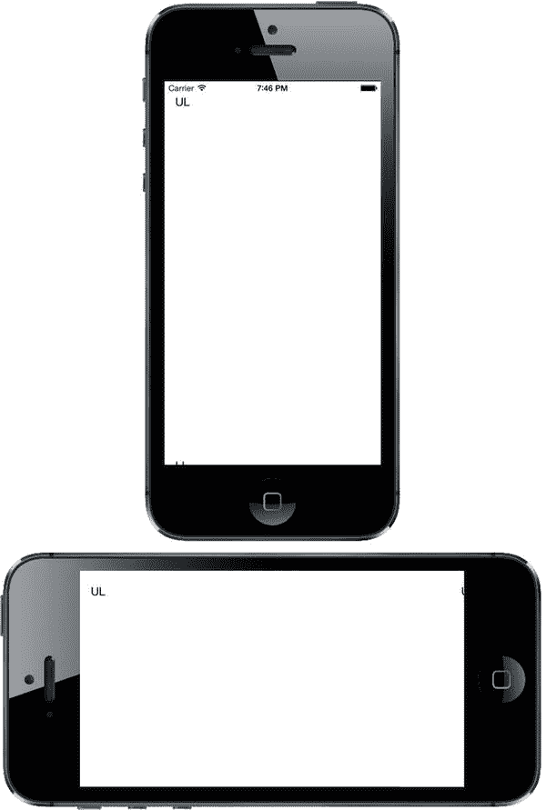

图 5-5. 到目前为止，情况并不理想。发生了什么？

如你所见，情况看起来不太妙。旋转后，左上角的标签位置正确，但其他所有标签都位置错误，有些甚至完全不可见！发生这种情况的原因是，每个对象都保持了相对于 storyboard 中视图左上角的距离。

我们真正想要的是，旋转后每个标签都能紧贴其最近的角。右侧的标签应水平移动以匹配视图的新宽度，底部的标签应垂直移动以匹配新高度，而不是消失在底部边缘之外。幸运的是，我们可以很容易地在 Interface Builder 中设置约束来实现这些变化。

事实上，正如你在前几章中所看到的，Interface Builder 足够智能，可以检查这组对象并创建一组默认约束，这些约束恰好能实现我们想要的效果。它运用一些经验法则来判断，如果对象靠近边缘，我们很可能希望将它们保留在那里。要应用这些规则，首先选中所有四个标签。你可以通过单击一个标签，然后按住**Shift**键或键的同时依次单击其他三个标签来完成此操作。选中所有标签后，从菜单中选择**Editor**  **Resolve Auto Layout Issues**  **Add Missing Constraints**（你会发现有两个同名的菜单项——在这种情况下，你可以使用其中任意一个）。接下来，只需按下**Run**按钮在模拟器中启动应用程序，然后验证其是否正常工作。

知道这样做有效是一回事，但要最有效地使用此类约束，了解其工作原理也非常重要。那么，让我们深入探讨一下。回到 Xcode，单击左上角的标签将其选中。你会注意到该标签上附有一些蓝色的实线。这些蓝色的实线与你在屏幕上拖动对象时看到的蓝色虚线辅助线不同（参见图 5-6）。

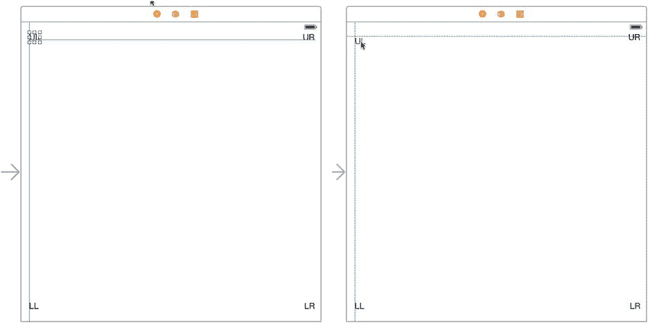

图 5-6. 右侧，蓝色虚线帮助你在拖动时对齐对象。左侧，蓝色实线显示为所选对象配置的约束

每条蓝色的实线代表一个约束。如果你现在按下**5**打开 Size Inspector，你会发现其中包含一个约束列表。图 5-7 显示了一组典型的约束，但 Xcode 创建的约束取决于你放置标签的具体位置，因此你可能会看到不同的内容。

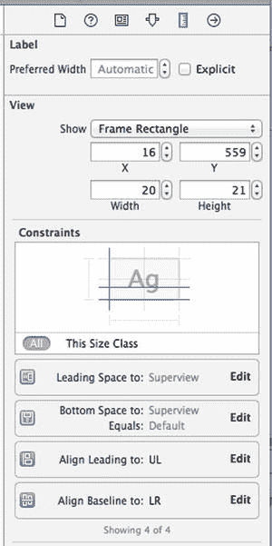

图 5-7. Xcode 生成的用于将标签固定在父视图中的四个约束

在这个例子中，其中两个约束处理该标签相对于其父视图（即容器视图）的位置：它指定了**leading space**（通常指左侧间距）和**bottom space**（即标签下方的间距）。当父视图大小发生变化时（例如设备旋转时），这些约束使得标签与其父视图底部和左侧边缘保持相同的距离。另外两个约束连接到另外两个标签，并负责使它们与该标签保持对齐。检查其他每个标签，看看它们有哪些约束，并确保你理解这些约束如何工作以确保四个标签保持在父视图的角落。

请注意，在文字从右向左书写和阅读的语言中，“leading space”在右侧，因此如果用户为其设备选择了如阿拉伯语等语言，leading 约束可能会导致 GUI 布局方向相反。现在，我们暂且假设“leading space”意味着“左侧间距”。

覆盖默认约束

从库中抓取另一个标签并将其拖到布局区域。这一次，不要移动到角落，而是将其拖到视图的左边缘，将该标签的左边缘与左侧其他标签的左边缘对齐，并在视图中垂直居中。将会出现虚线来帮助你。图 5-8 展示了这看起来的样子。

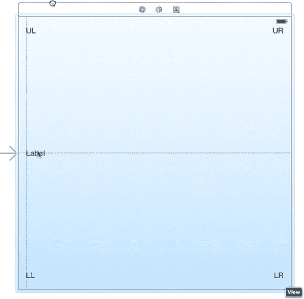

图 5-8. 放置左侧标签

放置好左侧标签后，给它一个标题，例如“Left”。按下**R**在模拟器中运行你的应用程序。将其旋转到横屏模式，你会看到左侧标签保持了与顶部的距离，使其位于中心下方很远的位置（参见图 5-9）。哎呀！

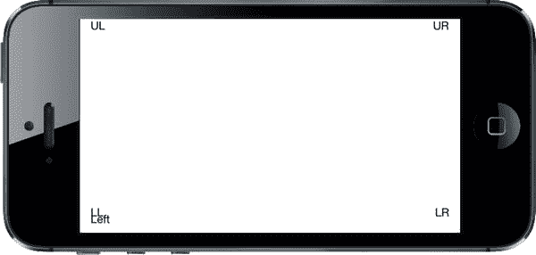

图 5-9. 左侧标签不在它应该在的位置！


我们需要创建一个新的约束来使其正常工作，所以回到 Xcode 并选择 storyboard 中的左侧标签。添加一个约束来强制此标签保持垂直居中非常简单——只需选择**Editor**  **Align**  **Vertical Center in Container**。执行此操作后，Xcode 会创建一个新约束，并立即在编辑器视图中选中该约束本身。这有点令人困惑，但别担心！只需再次点击该标签即可选中它。按**5**确保显示 Size 检查器，你会看到此标签现在有一个约束，将其中心 Y 值与父视图对齐。该标签还需要一个水平约束。确保选中该标签，然后选择**Editor**  **Resolve Auto Layout Issues**  **Add Missing Constraints** 即可添加此约束。按**R**再次运行应用。旋转一下，你会看到所有标签现在都能完美地移动到预期位置。不错！

现在，让我们通过拖出一个新标签到视图右侧，使其右边缘与其他右侧标签对齐，并与**Left**标签垂直对齐，来完成标签环的布局。将此标签的标题改为*Right*，然后稍微拖动它，确保其右边缘与其他两个标签的右边缘垂直对齐，以蓝色虚线作为参考。我们希望使用 Xcode 提供的自动约束，因此选择**Editor**  **Resolve Auto Layout Issues**  **Add Missing Constraints** 来生成它们。

构建并再次运行。再次旋转一下，你会看到所有标签都保持在屏幕上，并且彼此之间的位置正确（参见图 5-10）。如果旋转回来，它们应返回原始位置。这种技术对大多数应用都有效。

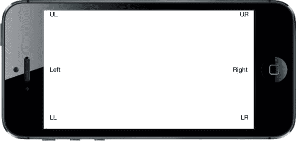

图 5-10. 旋转后标签在新位置

这些都没问题，但我们只需点击几下就能做更多事情！假设我们突然有了一个伟大的愿景，决定让最上面的两个标签（`UL`和`UR`）形成一个类似页眉的区域，填满整个屏幕宽度。通过一些尺寸调整和约束，我们很快就能搞定。

### 全宽标签

我们将创建一些约束，确保标签彼此保持相同的宽度，并且间距紧凑，这样即使在设备旋转时它们也能在视图顶部拉伸展开。图 5-11 显示了我们的目标。

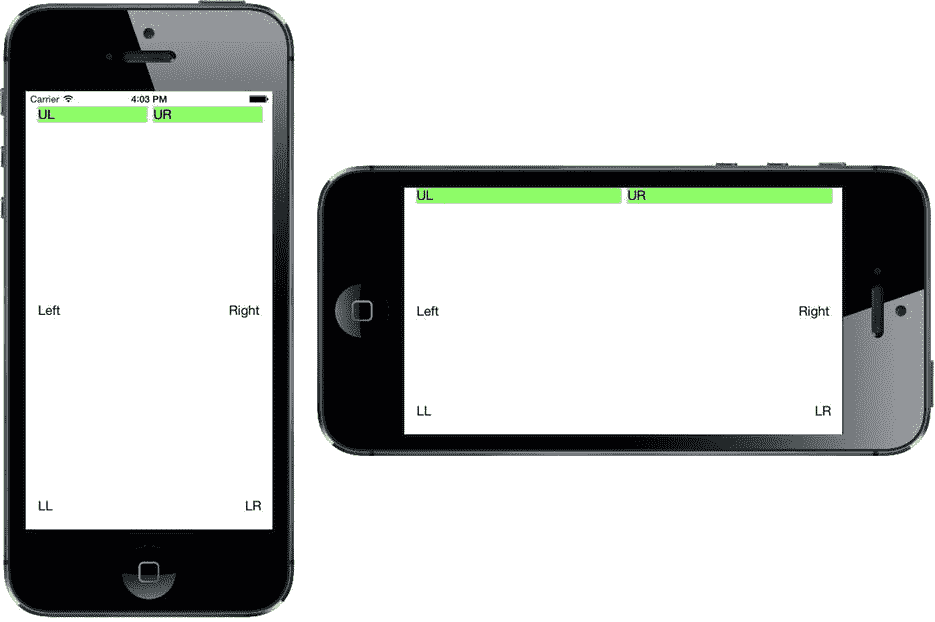

图 5-11. 顶部标签，在竖屏和横屏方向上都横跨显示器的整个宽度

最难的部分是能够直观地验证我们是否得到了想要的结果，即每个标签都精确地居中于其所占屏幕半区内。为了更容易判断是否正确，让我们暂时为标签设置一个背景色。在 storyboard 中，同时选择**UL**和**UR**标签，打开 Attributes 检查器，滚动到 View 部分。使用**Background**控件选择一个鲜艳明亮的颜色。你会看到每个标签的整个框架都填充了你选择的颜色。

现在，将注意力转向`UL`标签，拖动其右边缘的尺寸调整控件，将其拉至视图的水平中点附近。这里不必非常精确，原因很快就会明了。完成此操作后，通过将`UR`标签的左边缘调整控件向左拖动，直到出现蓝色虚线参考线（提示这是标签到其左侧的推荐宽度），来调整`UR`标签的大小。现在，我们将添加一个约束，使这些标签填满其父视图的整个宽度。同时选择**UL**和**UR**标签，然后从菜单中选择**Editor**  **Pin**  **Horizontal Spacing**。该约束告诉布局系统保持这两个标签彼此相邻，并保持当前的水平间距。构建并运行，看看会发生什么。你可能会看到类似图 5-12 的结果。

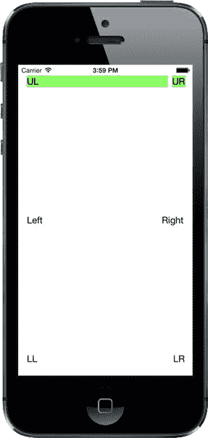

图 5-12. 标签虽然横跨了显示器，但分布不均匀

这已经很接近了，但并非我们真正想要的。那么还缺什么呢？我们已经定义了控制每个标签相对于其父视图位置的约束，以及两个标签之间允许的距离，但我们没有对标签的尺寸做任何规定。这使得布局系统可以随意地调整它们的大小（正如我们刚刚看到的，这可能会非常错误）。要解决这个问题，我们需要再添加一个约束。

确保选中**UL**标签，然后按住**Shift**键（）并点击**UR**标签。选中这两个标签后，你可以创建一个同时影响它们的约束。从菜单中选择**Editor**  **Pin**  **Widths Equally** 来创建新约束。你现在会看到一个新约束出现，并且像之前一样，它会被自动选中，如图 5-13 所示。你可能还会注意到，如果这两个标签在创建此约束之前宽度不完全相同，那么现在它们肯定相同了，因为新约束的存在迫使它们对齐。你还会注意到约束显示为橙色；这意味着 storyboard 中标签的当前位置与运行时看到的不匹配。要修复此问题，选择**Editor**  **Resolve Auto Layout Issues**  **Update Frames**。约束应会变为蓝色。

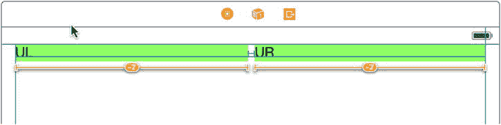

图 5-13. 顶部标签现在通过一个约束实现了等宽

如果此时再次运行，你应该会看到标签横跨整个屏幕，在竖屏和横屏方向上都是如此（参见图 5-11）。

在此示例中，我们所有的标签都可见，并且在多种方向上布局正确；然而，屏幕上还有很多未使用的空间。如果我们同时设置另外两行标签来填充视图宽度，或者允许标签的高度发生变化以减少界面上的空白区域，是否会更好？请随意尝试这六个标签的约束，甚至可以添加一些其他约束。除了我们目前介绍的内容之外，你还可以在**Editor**  **Pin**菜单中找到更多用于创建约束的操作。如果你最终创建了一个不符合预期的约束，可以通过选中它并按**Delete**键来删除，或者尝试在 Attributes 检查器中配置它。多练习，直到你对约束的基本工作原理感到得心应手。我们将在本书中持续使用它们；但如果你想了解完整的细节，只需在 Xcode 的文档窗口中搜索“Auto Layout”即可。


## 创建自适应布局

我们刚刚创建的简单示例在竖屏和横屏方向上都表现良好，并且在 iPhone 和 iPad 上也能正常运行，尽管这些设备的屏幕尺寸存在差异。事实上，如前所述，处理设备旋转和创建适用于不同屏幕尺寸设备的用户界面其实本质相同——从应用程序的角度来看，当设备旋转时，屏幕的有效尺寸确实发生了变化。在最简单的情况下，您可以通过分配 Auto Layout 约束来处理这两种情况，确保所有视图都被放置在您希望的位置并具有适当的大小。然而，这并非总是可行。某些布局在竖屏模式下效果良好，但旋转为横屏时却表现不佳；同样，有些设计适合 iPhone 但不适合 iPad。当遇到这种情况时，您别无选择，只能为每种情况创建单独的设计。在 iOS 8 之前，这意味着要么在代码中实现整个布局，要么使用多个故事板，或者两者结合。幸运的是，借助 iOS 8 和 Xcode 6，苹果让设计*自适应*应用程序成为可能，这些应用程序既能在两种方向下正常工作，也能在不同的设备上运行，同时仍然只使用单个故事板。让我们来看看这是如何实现的。

### 重构应用程序

为了设定场景，我们将设计一个在 iPhone 竖屏模式下表现良好的用户界面，但在手机旋转或在 iPad 上运行时则表现不佳。然后，我们将了解如何使用 Xcode 6 中的新工具来调整设计，使其在任何环境下都能良好运行。

首先，像之前一样创建一个新的“单视图”项目，并将其命名为 *Restructure*。我们将构建一个 GUI，该界面包含一个大型内容区域和一组用于执行各种（虚构）操作的小按钮。我们将按钮放置在屏幕底部，让内容区域占据剩余空间，如图 5-14 所示。

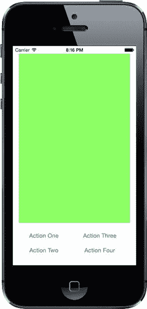

图 5-14. Restructure 应用的初始 GUI（在 iPhone 竖屏方向下）

选择 `Main.storyboard` 开始编辑 GUI。由于我们并没有真正想要显示的有趣内容视图，我们只需使用一个大的彩色矩形。从对象库中拖拽一个单独的 `UIView` 到您的容器视图中。您会注意到，在拖拽过程中它会完全展开以填满容器视图，这并非我们想要的。在它仍处于选中状态时，调整其大小，使其填充可用空间的上方约四分之三，并在其上方和两侧留出小边距，如图 5-15 所示。接下来，切换到属性检查器，使用**背景**弹出菜单选择其他背景色。您可以任意选择您喜欢的颜色，只要不是白色，以确保视图从背景中凸显出来。在示例源代码存档的故事板中，此视图为绿色，因此从现在起我们将称其为绿色视图。

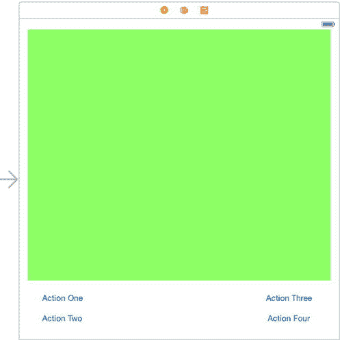

图 5-15. Restructure 视图的基本竖屏布局

从对象库拖拽一个按钮，将其放置在绿色视图下方空白区域的左下角。双击按钮标签选中文本，并将其更改为 *Action One*。现在按住 Option 键拖拽此按钮的两个副本，并将它们排成两列，如图 5-15 所示。您不需要将它们完美对齐，因为我们将使用约束来最终确定它们的位置，但您应尝试使这两个按钮组距离各自对应侧边的距离大致相等。将它们的标题分别更改为 *Action Two*、*Action Three* 和 *Action Four*。最后，将绿色视图的下边缘向下拖拽，直到它稍微高于按钮行的顶部。使用蓝色辅助线将所有元素对齐，如图 5-15 所示。

现在让我们设置 Auto Layout 约束。首先选中绿色视图。我们首先要将其固定到主视图的顶部、左侧和右侧。这仍然不足以完全约束它，因为其高度尚未指定；我们将在固定好按钮本身后，通过将其锚定到按钮顶部来解决这个问题。点击故事板编辑器右下角的 **Pin** 按钮。在弹出的顶部，您会看到熟悉的一组四个输入字段，围绕着一个小的正方形。保持选中**约束到边距**复选框。点击小正方形上方、左侧和右侧的红色虚线，将视图附加到其父视图的顶部、左侧和右侧。点击**添加 3 个约束**。

接下来，按住 **Shift** 键并点击，同时选中 **Action One** 和 **Action Two** 按钮。点击 **Align** 按钮，在弹出的菜单中选中**水平中心**，然后点击**添加 1 个约束**。这将固定这两个按钮在一列中。对 **Action Three** 和 **Action Four** 按钮重复此过程。

再次选中 **Action Two** 按钮，打开 **Pin** 弹出菜单。在**约束到边距**已选中的情况下，选择弹出菜单顶部正方形左侧、上方和下方的红色虚线，然后点击**添加 3 个约束**。这些约束将该按钮固定到主视图的左下角，并设置其与 **Action One** 按钮之间的垂直距离。现在，这两个按钮的位置已完全指定。现在对另一列按钮执行类似操作。保持**约束到边距**已选中，选择 **Action Four**，并打开 **Pin** 弹出菜单。选择正方形下方、上方和右侧的虚线，然后点击**添加 3 个约束**。

剩下的就是修正绿色视图底部相对于按钮的位置。为此，按住 Control 键从绿色视图拖拽到 **Action One** 按钮，然后松开鼠标。在弹出的菜单中，选择**垂直间距**。这就是我们需要的所有约束。如果活动视图中出现任何警告，在文档大纲中选择视图控制器，然后在菜单栏中选择**编辑器**  **解决 Auto Layout 问题**  **更新帧**。如果这不起作用，或者布局不符合预期，请返回前面的步骤，找出哪个约束是错误的或缺失的。

在 iPhone 模拟器中构建并运行应用程序。如果您所有的约束都设置正确，您应该会看到类似 图 5-14 的画面。现在向右旋转模拟器以查看布局的变化（参见 图 5-16）。

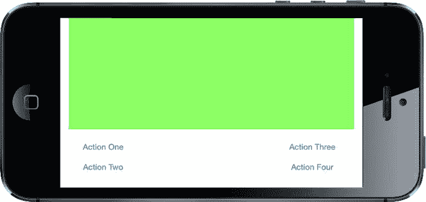

图 5-16. 将 Restructure 应用程序旋转到横屏方向。还不错，但可以更好


看起来还不算太糟——绿色视图已正确缩放，所有视图都显示出来了。这种布局或许可行，但我们还能做得更好。底部按钮周围存在大量空白区域。而且，如果绿色视图是一个`UIImageView`的话，这种细长形状可能不太理想——根据`UIImageView`的`mode`属性，图片要么被拉伸，要么会在视图中间显得不协调。iPad 上的效果如何？你可以亲自尝试一下（参见图 5-17）。

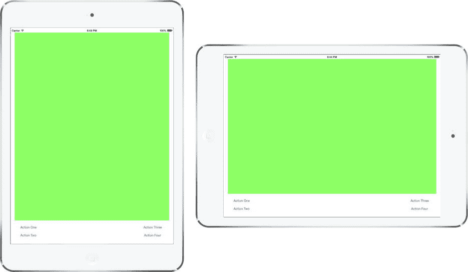

图 5-17. 在 iPad 上运行 Restructure 应用程序

同样，布局适配得非常好，但我们仍然面临按钮之间额外空白空间的问题。这是一个完美的例子，说明布局需要针对不同屏幕尺寸（从而也是不同方向）进行修改。实际上，我们将创建这个布局的另外两个变体——一个用于横屏方向的 iPhone，另一个用于 iPad。你可以在图 5-18 中看到我们的目标。

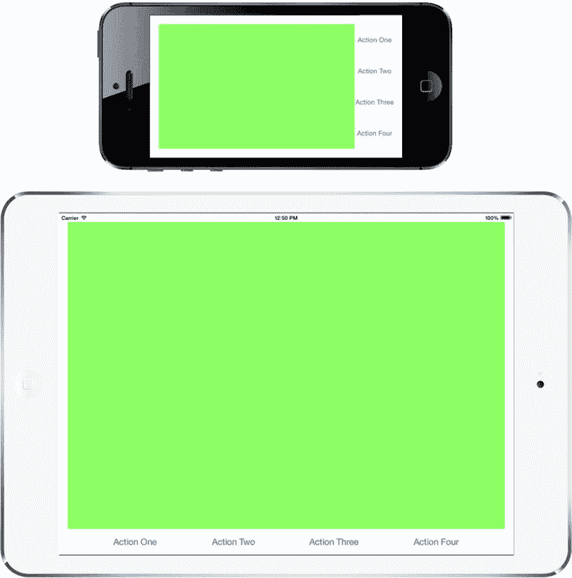

图 5-18. 为横屏方向的 iPhone 和 iPad 修改 Restructure 应用程序

要创建这两种不同的布局，我们需要另外两组约束。在只使用一个故事板的情况下也能做到这一点，这要归功于 iOS 8 中一项名为*Size Classes*的新特性。

### 尺寸类

看一下故事板编辑器的底部。在工具栏中，你会看到一个我们之前没有提到的控件。它被称为尺寸类控件，看起来像一个带有“w**Any** h**Any**”文本的标签。点击这个控件，会弹出一个包含九个格子的网格，如图 5-19 所示。我们将使用这个控件来帮助我们创建另外两组约束，但首先需要解释一下尺寸类到底是什么。

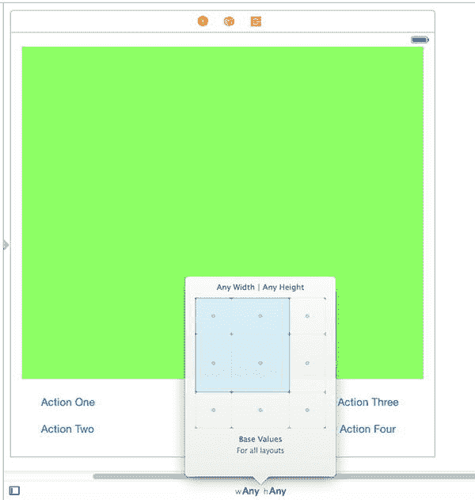

图 5-19. 尺寸类控件

网格中的格子对应水平（宽度）和垂直（高度）尺寸类的不同组合。尺寸类是对设备宽度或高度的一种粗略分类。有两个具体的尺寸类——紧凑和常规——用于描述真实设备，还有一个——任意——可以在设计器（和代码中）作为通配符使用，匹配紧凑或常规。表 5-1 显示了具体的水平和垂直尺寸类的四种可能组合如何映射到设备及其方向。

表 5-1. 尺寸类到设备和方向的映射

| 宽度 | 高度 | 设备和方向 |
| --- | --- | --- |
| 紧凑 | 紧凑 | 所有 iPhone（除 iPhone 6 Plus 外）的横屏方向。 |
| 紧凑 | 常规 | 所有 iPhone 的竖屏方向。 |
| 常规 | 紧凑 | iPhone 6 Plus 的横屏方向。 |
| 常规 | 常规 | 所有 iPad 的横竖屏方向。 |

一般来说，紧凑意味着比常规小一些，但有几个有趣的要点需要注意：

- 在竖屏方向下，iPhone 的宽度为紧凑、高度为常规，这很合理，因为在此方向上宽度小于高度。然而，当旋转到横屏方向时，两个维度的尺寸类都变成了紧凑，而你可能会期望宽度为常规、高度为紧凑。例外的是更大的 iPhone 6 Plus，它确实具有常规宽度和紧凑高度。这说明在制定布局决策时，需要考虑两种尺寸类。
- iPad 在横竖屏方向下都具有常规的宽度和高度尺寸类。这意味着不能仅依靠尺寸类来确定 iPad 的方向。但在很多情况下，这并不重要；因为 iPad 的屏幕相对较大，且比 iPhone 更接近正方形，所以通常可以在竖屏和横屏方向使用相同的布局。

图 5-20 以图形方式展示了表 5-1 中的信息，在我们修改 Restructure 应用程序时，你可能会发现参考它很有用。

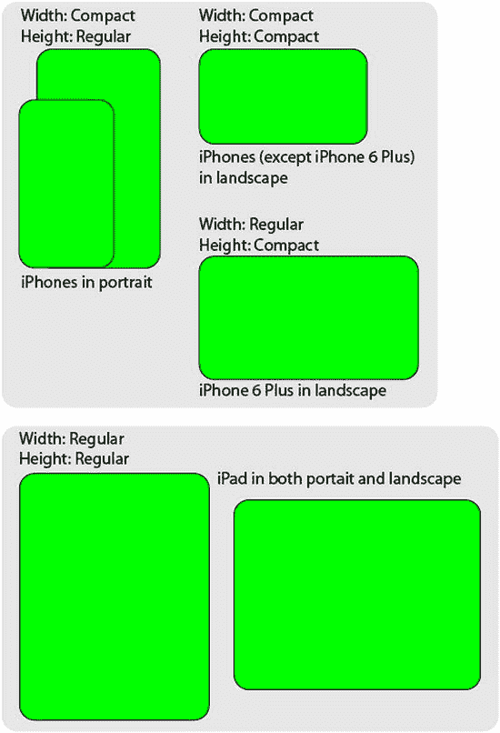

图 5-20. 尺寸类组合的图形表示

### 尺寸类与故事板

现在你已经了解了什么是尺寸类，让我们回到 Restructure 应用程序。再次查看故事板编辑器中的尺寸类控件。默认情况下，它设置为 w**Any** h**Any**。这意味着故事板编辑器中的设计适用于具有任何宽度和高度尺寸类的设备。我们将其称为基础设计。你应该始终从创建基础设计开始。完成之后，你可以通过修改基础设计来推导出任何其他所需的设计。你可以通过选择尺寸类控件中的特定组合来修改设计以适应特定的尺寸类组合，而不会影响基础设计。我们已经知道 Restructure 应用程序需要两个额外的设计——一个用于横屏方向的 iPhone，另一个用于 iPad。让我们先创建横屏 iPhone 的设计，如图 5-18 顶部所示。

首先要问的问题是：哪种尺寸类组合与我们即将设计的布局相对应？对于所有 iPhone（除 iPhone 6 Plus 外），这将是紧凑宽度、紧凑高度，即尺寸类控件设置为 w**Compact**、h**Compact**。然而，我们希望为 iPhone 6 Plus 使用相同的设计，而它对应的却是 w**Regular**、h**Compact**。将这两者结合起来，我们需要实现一个适用于任意宽度和紧凑高度的设计。我们可以通过使用宽度上的伪尺寸类 Any 来实现。点击**尺寸类**控件打开弹出窗口，然后将鼠标悬停在网格中的方块上。随着你的操作，蓝色矩形会改变形状，并且描述会发生变化，以指示相应的尺寸类组合以及匹配的设备和方向。我们需要选择 w**Any**、h**Compact**，这对应于网格顶行最左边的两个方块，如图 5-21 所示。弹出窗口底部的描述确认我们已正确选择。

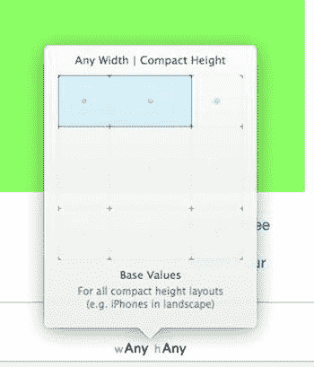

图 5-21. 在尺寸类控件中选择 wAny、hCompact

要进行实际选择，请点击网格中最右边的蓝色方块。你会看到尺寸类控件更新，并且工具栏颜色改变，表示你不再编辑基础设计。故事板中视图控制器区域的形状也发生变化，看起来更像一个横屏 iPhone，如图 5-22 所示。

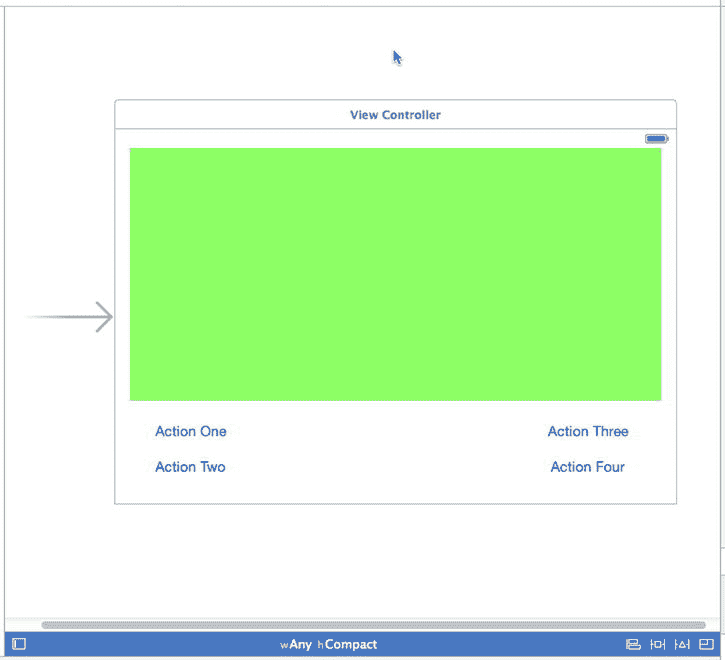


