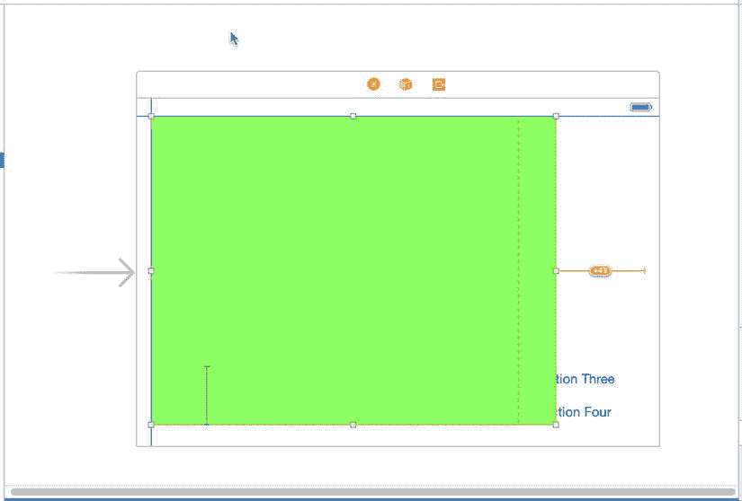
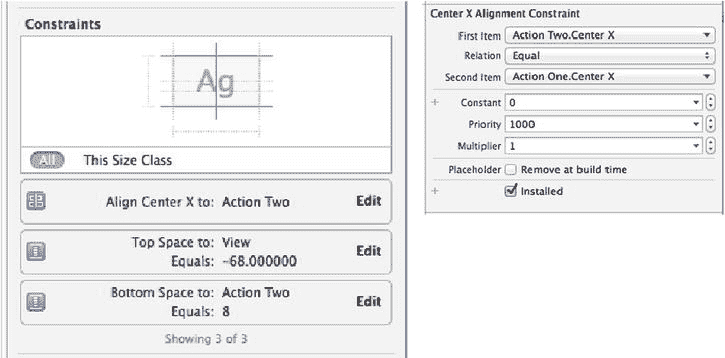
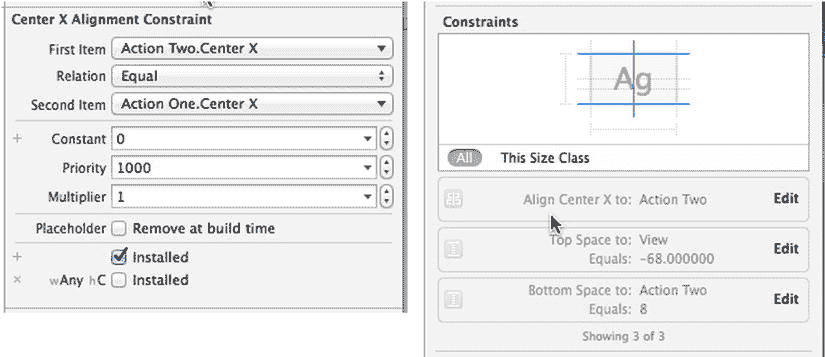
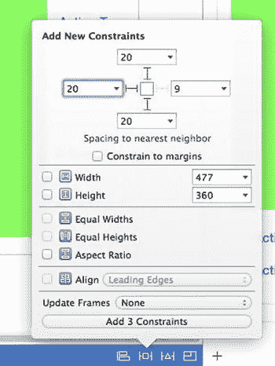
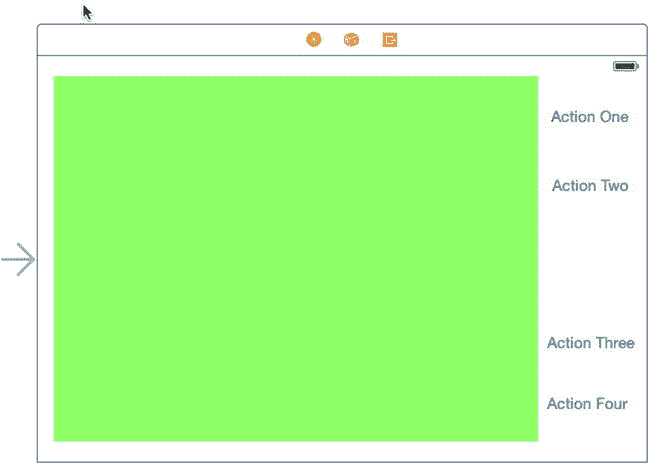
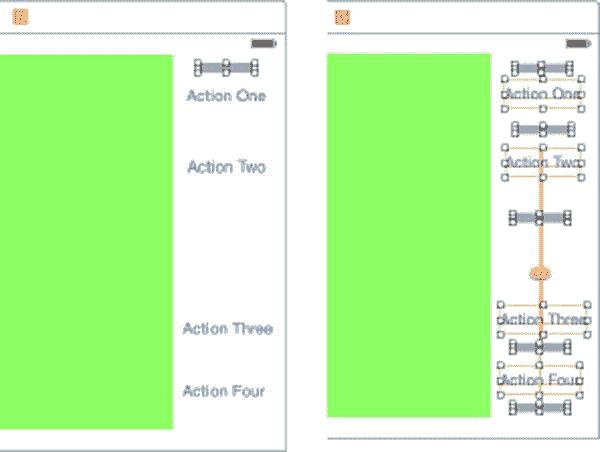
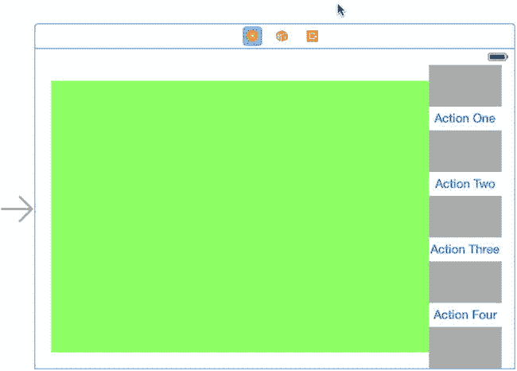

# 图 5-22. 已更新为支持 w**Any**、h**Compact** 尺寸类别组合的故事板编辑器

对于任意给定的尺寸类别组合，你可以通过以下三种方式修改设计。你所做的更改仅适用于映射到当前尺寸类别组合的设备及方向：

*   你可以添加、删除或修改约束。
*   你可以添加或移除视图。
*   你可以更改某些 `UIKit` 控件（在 iOS 8 中，`UILabel`、`UITextField`、`UITextView` 和 `UIButton` 均支持此功能）的字体。

我们当前的设计与基础设计差异很大，因此需要移除所有现有约束，因为所有视图的位置都需要改变。在进行任何更改之前，请先选择故事板，然后打开助理编辑器并在跳转栏中选择**预览**，接着打开故事板的预览，显示竖屏方向的 iPhone。我们将使用此预览来确保即将进行的更改不会影响基础设计。

### 创建 iPhone 横屏布局

现在开始进行更改。在故事板中，调整绿色视图的大小，使其位于主视图的左侧，为即将在右侧构建的一列四个按钮留出空间（参见图 5-23）。

图 5-23. 为横屏方向下的 iPhone 更改绿色视图的位置和大小

接下来，我们需要将四个按钮移动到正确位置。就目前情况而言，你可能会发现拖动左侧的两个按钮很困难，因为它们可能被绿色视图遮挡住了。那么，我们先暂时调整绿色视图的大小，把它移开。向上拖动绿色视图的底部，直到你能看到所有按钮，然后将 **Action One** 和 **Action Two** 按钮拖到右侧的空白区域，暂时不必过于担心精确的位置。完成此操作后，再次选中绿色视图，并将其拖回图 5-23 所示的位置。再次检查预览助理，确保竖屏设计未受影响。你应该养成每次进行更改时都执行此操作的习惯，以便能够快速修复任何问题。

**警告** 如果出现问题，不要试图通过进行更多更改来修复——相反，应使用 `Z`（`image: images/flower.jpg`）撤销必要的步骤，回到之前正确的布局版本，然后重试。

目前，绿色视图和按钮都有相互关联以及关联到主视图边缘的约束。我们需要用新约束替换所有这些约束。你可能会倾向于在文档大纲中选择它们并删除，但那将是一个错误——删除约束会将其从*所有*尺寸类别组合的设计中移除。你不能删除它们，而需要*卸载*正在编辑的尺寸类别组合的约束。

在故事板中选择 **Action One** 按钮，并打开尺寸检查器，你会在其中找到当前应用于此按钮的三个约束（参见图 5-24 左侧）。

图 5-24. 在尺寸检查器中查看约束

双击顶部约束以显示详细信息（参见图 5-24 右侧）。在底部，你会看到一个当前已勾选的**已安装**复选框。我们需要为此设计卸载该约束。为此，请点击复选框左侧的 **+** 按钮，然后在弹出的菜单中选择 **Any Width | Compact Height**。这将添加一个仅适用于 w**Any** h**Compact** 布局的新复选框。清除此复选框即可为此尺寸类别组合卸载该约束，同时使其在基础设计中保持已安装状态，如图 5-25 左侧所示。

图 5-25. 从 w**Any** h**Compact** 布局中卸载约束

回到故事板，你会注意到约束消失了，并且在文档大纲和尺寸检查器中它也被变灰了。对连接到四个按钮和绿色视图的所有约束重复此步骤。你可以通过选择每个按钮并在尺寸检查器中检查它们是否都已变灰（参见图 5-25 右侧）来确认已清除所有约束。

现在，让我们为新设计添加所需的约束，从绿色视图开始。我们需要将此视图固定到主视图的顶部、左侧、右侧和底部边缘。为此，请在文档大纲中选择绿色视图（它是与 Action 按钮处于相同嵌套级别的那个），然后点击**固定**按钮。在弹出的菜单中，取消勾选**约束到边距**，然后点击方形上方、下方和左侧的红色虚线（但不要点击右侧的线）。在方形上方、下方和左侧的输入框中，输入 `20`，然后点击**添加 3 个约束**（参见图 5-26）。

图 5-26. 在横屏模式下固定绿色视图的位置

要固定绿色视图的右侧，请按住 Control 键从其中间向右拖动，直到主视图的背景变为蓝色。松开鼠标，然后点击**尾部空间到容器边距**。

接下来，我们需要将四个按钮排列成一列，因此将它们拖动到我们所需的大致布局中（如有必要，请参考图 5-18）。此时，我们无法在故事板中让按钮精确对齐，因为我们还没有所有必需的约束，所以暂时继续忽略所有自动布局警告。你的布局现在应该看起来像图 5-27。

图 5-27. 绿色内容视图右侧的一列按钮

我们现在需要垂直和水平地定位这些按钮。我们希望按钮在它们的列中水平居中，并且在垂直方向上等距分布。通过使用 Interface Builder 对按钮应用约束，很难做到这一点，因为无法表达像“使这两个按钮之间的垂直间距与其他按钮之间的间距相同”这样的需求，而这正是我们真正需要的。不过，*可以*对视图进行约束，使它们具有相等的高度——这给了我们一个实现需求的方法。我们将要在按钮之间的空隙中添加隐藏的填充视图，并强制这些隐藏视图占据所有可用空间，且具有相等的高度。这与使所有空隙大小相同是等效的。我们也可以使用相同的隐藏视图来水平居中按钮。我们将让隐藏视图占据按钮列中的所有水平空间，然后使它们的中心与按钮的中心沿同一条垂直线对齐。如果你对这个方案还不太清楚，可以先偷看一眼图 5-28，其中填充视图以灰色显示。很巧妙，不是吗？

图 5-28. 向按钮列添加填充视图

我们开始吧。我建议你现在复制一份项目，这样如果在按照接下来几段的说明操作时出现问题，可以回退到这个版本。虽然我们要做的事情相当简单，但步骤很多，容易出错。

首先创建填充视图。从对象库中拖出一个`UIView`，放到绿色视图的顶部。调整它的大小，使其在水平和垂直方向上都能刚好放入按钮之间的空隙中。它的高度不应超过 10 像素。使用属性检查器给它设置一个灰色背景，这样我们更容易看到它。现在，拖动并调整此视图的大小，使其位于“Action One”按钮顶部和状态栏底部之间，如图 5-28 左侧所示。确保此视图的顶部在绿色视图顶部之下，并且底部在“Action One”按钮顶部之上。*绝对不能有任何重叠*。选择 **Action One** 按钮，以便你能看到它的轮廓来确认这一点。另一种检查方法是让每个视图的边界矩形都可见：选择 **Editor**  **Canvas**  **Show Bounds Rectangles**。此设置是一个开关，完成后再次选择它以将其关闭。

选中填充视图，按住 **Option** () 键并向下拖动以创建另一个副本。将其放在“Action One”和“Action Two”按钮之间，同样不能有重叠。重复此过程，直到每对按钮之间、以及底部按钮与主视图底部之间都各有一个填充视图，如图 5-28 右侧所示。与之前一样，确保每个填充视图与其上下按钮之间没有垂直重叠，依次选择每个按钮（或再次启用 **Editor**  **Canvas**  **Show Bounds Rectangles**）并检查其框架轮廓以确认。

**注意** 你刚刚添加的填充视图只会出现在横向模式的 iPhone 上，因为我们是在为 w**Any** h**Compact** 组合设计时添加它们的。

选择所有填充视图，点击 **Pin** 按钮。在弹出的窗口中，勾选 **Equal Widths** 和 **Equal Heights**，然后点击 **Add 8 Constraints**。这样，所有填充视图在运行时的高度和宽度都将相同。

接下来，让填充视图占据所有可用的水平空间。我们只需要让其中一个这样做，因为其他所有填充视图都被约束为具有相同的宽度。选择顶部的填充视图，点击 **Pin** 按钮。在弹出的窗口中，点击正方形左右两侧的红色虚线。在左右两个输入框中输入 **0**，然后点击 **Add 2 Constraints**。这些约束强制填充视图左侧与绿色视图连接，右侧与主视图的右边距连接，从而横跨整个列。

我们还需要将填充视图和按钮的中心对齐到一条垂直线上。这很容易：只需选择所有填充视图和所有按钮，按下 **Align** 按钮，勾选 **Horizontal Centers**，然后点击 **Add 8 Constraints**。

我们快完成了。最后一步是确保填充视图占据按钮之间、以及顶部和底部按钮与主视图之间的所有垂直空间。我们通过强制每对这类视图之间的垂直间距为零来实现这一点。

选择所有填充视图，点击 **Pin** 按钮。在弹出的窗口中，清除 **Constrain to margins** 复选框。点击正方形上方和下方的红色虚线。在正方形上方和下方的输入框中输入 **0**，然后点击 **Add 10 Constraints**。

现在，我们终于可以看到所有这些工作的成果了。在文档大纲中，点击视图控制器，然后选择 **Editor**  **Resolve Auto Layout Issues**  **Update Frames**。你应该会看到如图 5-29 所示的结果。如果结果不正确，请恢复到你之前保存的项目副本并重试。如果你看到填充视图垂直重叠，那可能是你没有将它们与按钮正确分离。

图 5-29. 包含填充视图的 iPhone 横向布局

要完成此布局，依次选择每个填充视图，并在属性检查器中勾选 **Hidden** 属性，然后在 iPhone 模拟器中运行示例，以验证布局在纵向和横向模式下都是正确的，并且也适用于 iPhone 6 Plus。你可以在图 5-18 中看到它应该是什么样子。

接下来，我们要添加 iPad 布局，但在开始之前，现在是制作另一个项目备份的好时机，以防在遵循下一组说明时需要回退。

### 添加 iPad 布局

要向故事板添加 iPad 布局，我们需要将编辑器切换到正确的大小类别组合。点击 **Size Classes** 控件，然后点击网格的右下角以选择 **Regular Width | Regular Height**。编辑区域中的视图控制器应切换为方形轮廓。在我们进行任何更改之前，在辅助编辑器中，使用跳转栏打开故事板的预览（如果尚未打开），并添加另一个 iPhone 4 英寸预览，这次是横向模式。我们将使用此预览以及现有的纵向预览，以确保为 iPad 所做的更改不会影响 iPhone 布局。

