# 新布局的约束条件继承自基本设计。正如我们在构建 iPhone 横屏布局时的情况，需要删除所有继承来的约束。这并非总是必要的——有时你可以保留基本设计中的部分甚至全部约束。但在这个案例中，移除约束更容易看清我们的操作。为此，请按之前的步骤操作：打开`Size Inspector`（大小检查器），然后在`Document Outline`（文档大纲）中依次选中每个已启用的约束。针对每个约束，在`Size Inspector`中为`Regular Width | Regular Height`（`wR` `hR`）新增一项，并将其标记为“未安装”。你无需对灰色显示的约束做任何更改，因为这些约束属于 iPhone 横屏设计，因此不适用于此布局。

接下来，我们将把绿色视图的上、左、右边距固定到正确位置。我们暂时不固定视图的底部，因为稍后要将其向下移动。选中绿色视图，点击`Pin`（固定）按钮。在弹出的菜单顶部，点击方块上方、左侧和右侧的红色虚线，然后点击`Add 3 Constraints`（添加 3 个约束）。

对于 iPad，我们将把四个按钮排列在绿色视图下方的一行中，并且由于可用空间更大，我们会将按钮文字放大。在开始移动元素之前，我们先执行此操作。

选中`Action One`按钮，打开`Attributes Inspector`（属性检查器），找到`Font`（字体）属性。你对字体所做的任何更改都将应用于所有尺寸等级，这不是我们想要的效果。要仅针对当前设计进行更改，请点击`Font`字段左侧的`+`按钮，然后从弹出菜单中选择`Regular Width | Regular Height`，以添加一个标注为`wR` `hR`的新`Font`字段（参见图 5-30）。点击`Font`字段中的`T`，将字体大小从`15`改为`20`。

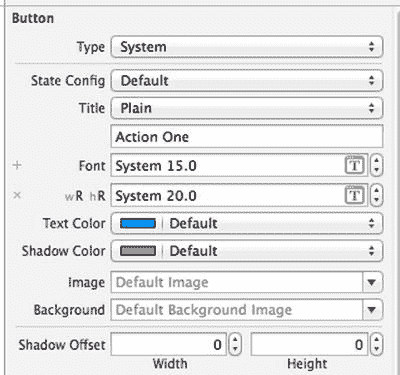

图 5-30. 仅针对 iPad 更改按钮字体

对其他三个按钮应用相同的更改。由于我们是在设计`wR` `hR`尺寸等级组合时进行的字体更改，因此它仅适用于 iPad。查看 iPhone 预览以确认情况确实如此。

接下来，将四个按钮拖动到主视图底部排成一行，使按钮的下边缘与底部蓝色布局参考线对齐，并重新调整每个按钮的大小，以便你能看到其所有文本。确保每个按钮左右两侧都有足够的空白空间。你无需做到非常精确，因为自动布局将在运行时确保按钮尺寸合适。完成此操作后，向下拖动绿色视图的底部，使其靠近按钮的顶部，如图 5-31 所示。

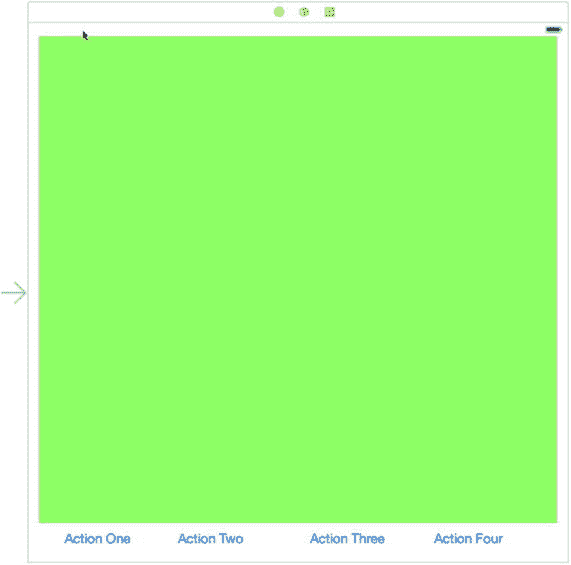

图 5-31. 按钮排列在视图底部的一行中

现在我们可以添加一个约束来固定绿色视图的底部。按住 Control 键从绿色视图向下拖动，直到主视图背景变为蓝色，然后松开鼠标并选择`Bottom Space to Bottom Layout Guide`（底部间距到底部布局参考线）。绿色视图现在已处于最终位置。

下一步是添加用于定位按钮的约束。这实际上与我们创建 iPhone 横屏布局时解决的问题相同——我们希望按钮在行内等间距分布。唯一的区别是方向。我们将再次使用相同的解决方案：创建填充视图并添加约束使它们大小相等。首先将一个`UIView`拖到绿色视图上。使用`Attributes Inspector`为其设置灰色背景，并将其重新调整为足够小以适合按钮之间的任何间隙，然后将其拖到视图左侧和`Action One`按钮之间，确保无重叠。选中填充视图，按住`Option`（）键并拖动以创建另外四个填充视图，每对按钮之间放置一个，最右侧按钮与主视图右侧之间放置一个，如图 5-32 所示。像之前一样，依次选中每个按钮，确保按钮框架（比文本占据的区域大）与填充视图之间存在重叠。

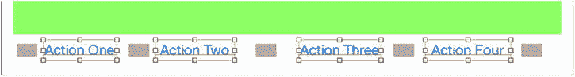

图 5-32. iPad 布局的填充视图。按钮已被选中，以确保填充视图与按钮之间无重叠

要使所有填充视图大小相同，请选中它们全部并点击`Pin`按钮。然后在弹出菜单中，点击`Equal Widths`（等宽）和`Equal Heights`（等高），接着点击`Add 8 Constraints`（添加 8 个约束）。为了使它们填满所有可用垂直空间，请选中任意一个填充视图并再次点击`Pin`按钮。在内容菜单顶部，点击方块上方的红色虚线。在顶部和底部的输入字段中输入`0`，然后点击`Add 2 Constraints`。由于填充视图高度相同，它们现在将填满绿色视图底部与主视图底部之间的所有垂直空间。

接下来，我们需要对齐填充视图和按钮的垂直中心。选中所有填充视图和所有按钮，然后点击`Align`（对齐）按钮。勾选`Vertical Centers`（垂直居中）和`Add 8 Constraints`。

要完成布局，我们需要让填充视图占据所有空闲水平空间。这次，选中所有填充视图并点击`Pin`按钮。在弹出菜单顶部，取消勾选`Constrain to margins`（约束到边距），然后点击方块左侧和右侧的红色虚线。在左右输入字段中输入`0`，然后点击`Add 10 Constraints`以应用约束。

添加完所有约束后，我们可以让 Xcode 更新布局中所有视图的位置，以便查看结果。在`Document Outline`中，点击视图控制器，然后选择`Editor`  `Resolve Auto Layout Issues`  `Update Frames`（编辑器 → 解决自动布局问题 → 更新框架）。你应该会看到如图 5-33 所示的结果。

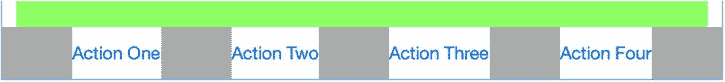

图 5-33. iPad 布局中绿色视图下方等间距分布的四个按钮

最后，再次选中所有填充视图，打开`Attributes Inspector`，确保`Hidden`（隐藏）属性已被勾选。在 iPad 模拟器上运行应用程序，验证在竖屏和横屏方向下是否都能获得正确结果（参见图 5-18）。在 iPhone 模拟器上重新运行应用程序，以检查这些布局是否仍然有效。

### 旋转出局

在本章中，你学习了如何在应用程序中支持旋转。你发现了如何使用约束来定义视图布局，也看到了如何通过在 storyboard 中创建多个布局来重构视图，以处理不同的屏幕尺寸和设备旋转。


在下一章中，我们将开始研究真正的多视图应用程序。到目前为止，我们编写的每个应用程序都只使用了一个视图控制器和一个内容视图。许多复杂的 iOS 应用程序（如“邮件”和“通讯录”）都依赖于多个视图和视图控制器的配合才能实现，我们将在第 6 章中详细探讨其工作原理。

## 第 6 章：多视图应用程序

到目前为止，我们编写的应用程序都只包含一个视图控制器。虽然单个视图确实能完成很多功能，但 iOS 平台的真正威力体现在能够根据用户输入切换不同的视图。多视图应用程序有多种不同的形式，但无论应用程序在屏幕上如何呈现，其底层机制都是相同的。

在本章中，我们将专注于多视图应用程序的结构，并通过从头构建自己的多视图应用程序来学习交换内容视图的基础知识。我们将编写一个自定义的控制器类，用于在两个不同的内容视图之间进行切换，从而为充分利用 Apple 提供的各种多视图控制器奠定坚实的基础。

但在开始构建应用程序之前，我们先来看看多视图应用程序能带来哪些好处。

## 多视图应用程序的常见类型

严格来说，我们在之前的应用程序中已经使用过多个视图，因为按钮、标签和其他控件都是 `UIView` 的子类，它们都可以放入视图层级结构中。但是，当 Apple 在文档中使用术语 `view` 时，通常指的是一个 `UIView` 或其某个子类，并且该视图对应有一个视图控制器。这类视图有时也被称为 `content views`（内容视图），因为它们是应用程序内容的主要容器。

多视图应用程序最简单的例子是`实用工具应用程序`。这类应用程序主要专注于单个视图，但同时提供第二个视图，用于配置应用程序或提供比主视图更详细的信息。iPhone 自带的“股票”应用程序就是一个很好的例子（见图 6-1）。点击右下角的按钮，视图就会切换到一个配置视图，你可以在其中配置应用程序所跟踪的股票列表。

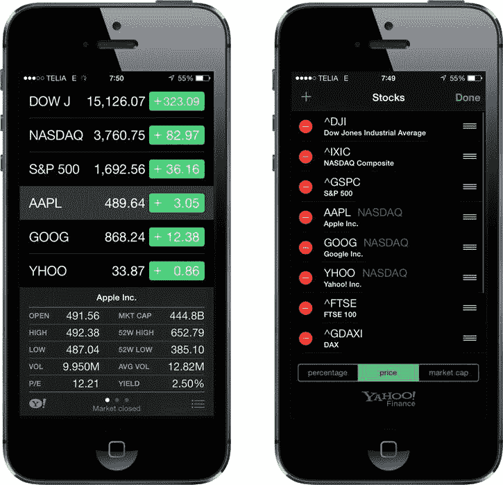

图 6-1. iPhone 自带的“股票”应用程序有两个视图：一个用于显示数据，另一个用于配置股票列表

iPhone 上还有几种`标签栏应用程序`，包括“电话”应用程序（见图 6-2）和“时钟”应用程序。标签栏应用程序是一种多视图应用程序，它在屏幕底部显示一排按钮，称为`标签栏`。点击其中一个按钮会激活一个新的视图控制器，并显示一个新的视图。例如，在“电话”应用程序中，点击`通讯录`显示的视图与点击`拨号键盘`时显示的视图不同。

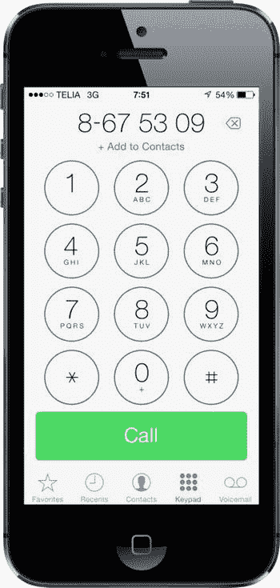

图 6-2. “电话”应用程序是使用标签栏的多视图应用程序的一个例子

另一种常见的 iPhone 多视图应用程序是`导航型应用程序`，其特点是使用一个带有`导航栏`的导航控制器来管理一系列层级化的视图。“设置”应用程序就是一个很好的例子。在“设置”中，你首先看到的是多行列表，每一行对应一组设置或一个特定的应用。点击其中一行，你会进入一个新视图，可以在其中自定义某一组特定的设置。有些视图会提供一个列表，让你可以进一步深入。导航控制器会记录你进入的层级深度，并提供一个控件让你能够返回到上一级视图。

例如，如果你选择`声音`偏好设置，你会看到一个包含声音相关选项列表的视图。该视图的顶部是一个导航栏，带有一个标记为`设置`的左箭头，点击它即可返回上一级视图。在声音选项中，有一行标记为`铃声`。点击`铃声`，你会进入一个新的视图，其中包含一个铃声列表和一个导航栏，点击导航栏可以返回主声音偏好设置视图（见图 6-3）。当你需要呈现层级化的视图时，导航型应用程序非常有用。

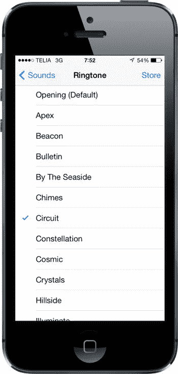

图 6-3. iPhone 的“设置”应用程序是使用导航栏的多视图应用程序的一个例子

在 iPad 上，大多数导航型应用程序（如“邮件”）都采用`拆分视图`实现，其中导航元素显示在屏幕左侧，而您选择查看或编辑的项目显示在右侧。您将在第 11 章中了解更多关于拆分视图的内容。

由于视图本身具有层级性，我们甚至可以在单个应用程序中组合使用不同的视图切换机制。例如，iPhone 的“音乐”应用程序使用一个标签栏来切换不同的音乐组织方式，并使用一个导航控制器及其关联的导航栏来让你根据所选方式浏览音乐。在图 6-4 中，标签栏位于屏幕底部，导航栏位于屏幕顶部。

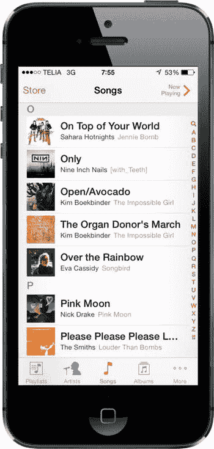

图 6-4. “音乐”应用程序同时使用了导航栏和标签栏

有些应用程序使用`工具栏`，它经常与标签栏混淆。标签栏用于从两个或多个选项中选择唯一的一个选项。工具栏可以包含按钮和某些其他控件，但这些项目并非互斥的。Safari 主视图底部的工具栏就是一个完美的例子（见图 6-5）。如果比较 Safari 视图底部的工具栏与“电话”或“音乐”应用程序底部的标签栏，你会发现它们很容易区分。标签栏有多个分段，其中正好有一个（选中的那个）会被一种色调高亮显示；而在工具栏上，通常所有启用的按钮都是高亮显示的。

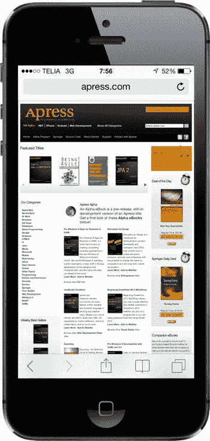

图 6-5. 移动版 Safari 在底部有一个工具栏。工具栏就像一个自由形态的栏，允许你包含各种控件

以上每种多视图应用程序类型都使用了 UIKit 中的特定控制器类。标签栏界面使用 `UITabBarController` 类实现，导航界面使用 `UINavigationController` 实现。我们将在接下来的几章中详细描述它们的用法。

## 多视图应用程序的架构


```markdown

本章将要构建的应用程序“View Switcher”外观相当简单；然而，就我们要编写的代码而言，它是迄今为止我们处理过的最复杂的应用程序。`View Switcher` 将包含三个不同的控制器、一个故事板和一个应用程序委托。

首次启动时，`View Switcher` 的外观将如图 6-6 所示，底部有一个包含单个按钮的工具栏。视图的其余部分将包含一个蓝色背景和一个等待被按下的按钮。

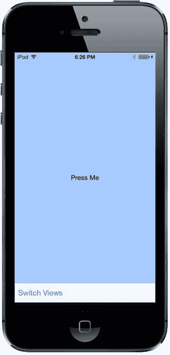

Figure 6-6. 首次启动 View Switcher 应用程序时，您将看到一个带有按钮的蓝色视图，以及一个带有其自身按钮的工具栏

当点击 **Switch Views** 按钮时，背景将变为黄色，并且按钮的标题将改变（见图 6-7）。

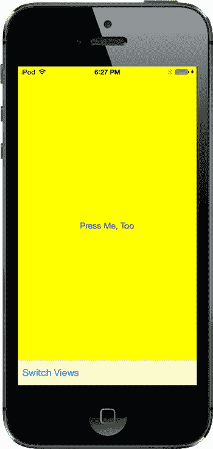

Figure 6-7. 当您点击 Switch Views 按钮时，蓝色视图会翻转并显示黄色视图

如果按下 **Press Me** 或 **Press Me, Too** 按钮，将弹出一个提示，指示哪个视图的按钮被按下（见图 6-8）。

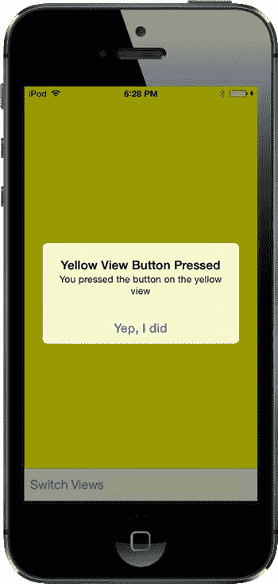

Figure 6-8. 当按下 Press Me 或 Press Me, Too 按钮时，会显示一个警告提示

尽管我们可以通过编写单个视图应用程序来实现相同的功能，但我们采用这种更复杂的方法是为了演示多视图应用程序的机制。这个简单的应用程序中实际上有三个视图控制器在交互：一个控制蓝色视图，一个控制黄色视图，以及第三个特殊控制器，它在按下 **Switch Views** 按钮时负责交换另外两个视图。

在开始构建应用程序之前，让我们先讨论一下 iPhone 多视图应用程序的构建方式。大多数多视图应用程序都使用相同的基本模式。

### 根控制器

故事板在此扮演关键角色，因为它将包含我们应用程序的所有视图和视图控制器。我们将创建一个故事板，其中包含一个控制器类的实例，该实例负责管理当前向用户显示哪个其他视图。我们称此控制器为**根控制器**（如“树之根”或“万恶之源”），因为它是用户看到的第一个控制器，也是在应用程序加载时加载的控制器。这个根控制器通常是`UINavigationController`或`UITabBarController`的实例，尽管它也可以是`UIViewController`的自定义子类。

在多视图应用程序中，根控制器的工作是根据用户的输入，获取两个或多个其他视图，并以适当的方式呈现给用户。例如，标签栏控制器会根据最后点击的标签栏项目来切换不同的视图和视图控制器。导航控制器会在用户深入或返回层级数据时执行相同的操作。

**注意**：根控制器是应用程序的主要视图控制器；因此，它是指定是否可以自动旋转到新方向的视图。然而，根控制器可以将此类任务的责任传递给当前活动的控制器。

在多视图应用程序中，屏幕的大部分区域将由内容视图占据，每个内容视图都有自己的视图控制器，并带有自己的输出口和操作。例如，在标签栏应用程序中，点击标签栏的操作会传递给标签栏控制器，但点击屏幕其他任何位置的操作则会传递给与当前显示的内容视图相对应的控制器。

### 内容视图的剖析

在多视图应用程序中，每个视图控制器控制一个内容视图，这些内容视图是构建应用程序用户界面的主要部分。这些配对中的每一个在故事板内都称为一个**场景**。每个场景由一个视图控制器和一个内容视图组成，内容视图可以是`UIView`或其子类的实例。除非您在做一些非常特殊的事情，否则您的内容视图通常会有一个关联的视图控制器，并且有时会继承`UIView`。尽管您可以在代码中创建界面，而不是使用 Interface Builder，但很少有人选择这种途径，因为这样做更耗时，并且代码难以维护。

在本项目中，我们将为每个内容视图创建一个新的控制器类。我们的根控制器控制一个内容视图，该视图包含一个占据屏幕底部的工具栏。然后，根控制器加载一个蓝色视图控制器，并将蓝色内容视图作为子视图放置到根控制器视图中。当根控制器的 **Switch Views** 按钮（位于工具栏中的按钮）被按下时，根控制器会交换出蓝色视图控制器，并换入一个黄色视图控制器，如果需要，还会实例化该控制器。有点困惑吗？如果是这样，请不要担心，因为当我们逐步讲解代码时，这会变得更加清晰。

## 构建 View Switcher

理论够多了！让我们开始构建我们的项目。选择 **File**  **New**  **Project…** 或者按 **N**。当模板选择表打开时，选择 **Single View Application**，然后点击 **Next**。在向导的下一页，将 **Product Name** 设置为 **View Switcher**，将 **Language** 设置为 *Objective-C*，并将 **Devices** 弹出按钮设置为 *Universal*。同时确保标有 **Use Core Data** 的复选框未被选中。一切设置正确后，点击 **Next** 继续。在下一个屏幕上，导航到您想要在磁盘上保存项目的位置，然后点击 **Create** 按钮以创建新的项目目录。

### 重命名视图控制器

正如您已经看到的，Single View Application 模板提供了一个应用程序委托、一个视图控制器和一个故事板。视图控制器类名为`ViewController`。在这个应用程序中，我们将处理三个视图控制器，但大部分逻辑将位于主视图控制器中。它的任务是切换显示，使得其他某个视图控制器的视图始终处于显示状态。为了明确主视图控制器的角色，我们希望给它一个更好的名称，例如`SwitchingViewController`。在项目中，有多个地方引用了视图控制器的类名。要更改其名称，我们需要更新所有这些地方。幸运的是，Xcode 提供了一个巧妙的功能来为我们完成此操作。在项目导航器中，选择`ViewController.h`，然后在编辑器区域中双击`@interface`后面的类名以选中它，并右键单击它。在出现的菜单中，选择 **Refactor**，然后选择 **Rename…**（见图 6-9）。

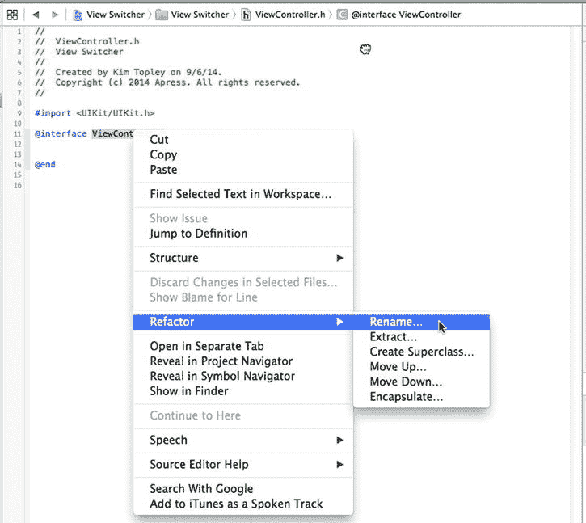

Figure 6-9. 使用 Refactor  Rename 菜单项来更改主视图控制器的名称

在出现的对话框中，确保勾选了 **Rename related files**，然后将视图控制器名称更改为`SwitchingViewController`，如图 6-10 所示。

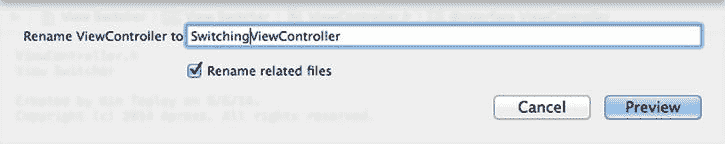

Figure 6-10. 重命名视图控制器

点击 **Preview**，Xcode 会打开一个新窗口，显示所有需要更改视图控制器名称的位置（见图 6-11）。

```


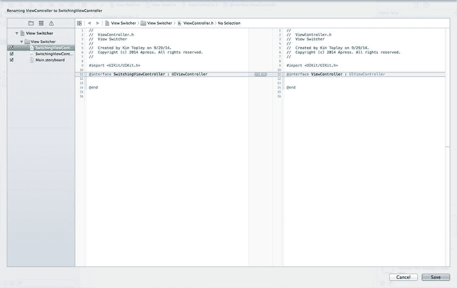

图 6-11. 预览 Xcode 将为修改视图控制器名称所进行的变更

按下 **保存** 以继续重命名操作。Xcode 会提示你启用自动快照。启用它是一个好主意，因为如果你之后决定不执行此更改，可以轻松地恢复回去。按下 **启用**，Xcode 将完成重命名。完成后，你应该会看到 Project Navigator 中视图控制器的名称已经更改，编辑器区域中的文件内容也已随之更改，如图 6-12 所示。

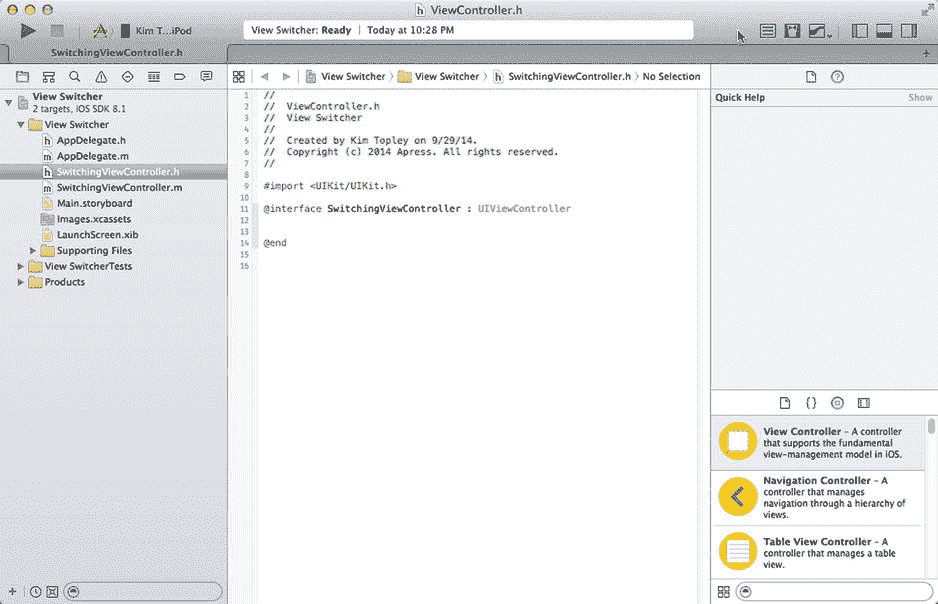

图 6-12. 重命名后，Xcode 显示新的视图控制器名称

**提示** 你可以随时通过 Xcode 的 **File** 菜单选择 **Create Snapshot…** 来创建快照。一旦你有了快照，就可以通过 **File  Restore Snapshot…** 恢复你的工作空间。Xcode 会显示一个快照列表，你可以从中选择要用于恢复的那个。

### 添加内容视图控制器

我们需要两个额外的视图控制器来显示内容视图。在 Project Navigator 中，右键单击 **View Switcher** 组，然后选择 **New File…**。在模板对话框中，从 **iOS Source** 部分选择 **Cocoa Touch Class**，然后点击 **Next**。将新类命名为 *BlueViewController*，使其成为 `UIViewController` 的子类，并确保 **Also create XIB file** 复选框未被选中，因为稍后我们将把这个控制器添加到 storyboard 中。点击 **Next**，然后点击 **Create** 以保存新视图控制器的文件。重复此过程来创建第二个内容视图控制器，将其命名为 `YellowViewController`。

### 修改 SwitchingViewController.m

`SwitchingViewController` 类将需要一个动作方法，用于在蓝色和黄色视图之间切换。我们不会创建任何 outlet，但我们需要两个其他指针：一个指向我们将要换入和换出的每个视图控制器。这些不需要是 outlet，因为我们将通过代码而不是在 storyboard 中创建它们。将以下代码添加到 *SwitchingViewController.m* 的上部：

```
#import "SwitchingViewController.h"

#import "YellowViewController.h"
#import "BlueViewController.h"

@interface SwitchingViewController ()

@property (strong, nonatomic) YellowViewController *yellowViewController;
@property (strong, nonatomic) BlueViewController *blueViewController;

@end
```

接下来，在文件末尾，紧挨着最后的 `@end` 行之前，添加以下空动作方法：

```
- (IBAction)switchViews:(id)sender {

}

@end
```

在过去，我们直接在 Interface Builder 中添加动作方法，但这里你会看到我们也可以反过来操作，因为 IB 能识别已在我们源代码中定义的 outlet 和动作。既然我们已经声明了所需的动作，就可以在我们的 storyboard 中为这个控制器设置最小的用户界面了。

### 使用工具栏构建视图

现在我们需要为 `SwitchingViewController` 设置视图。提醒一下，这个视图控制器将是我们的根视图控制器——即应用程序启动时处于活动状态的控制器。`SwitchingViewController` 的内容视图将包含一个占据屏幕底部的工具栏。它的任务是切换蓝色视图和黄色视图，因此它需要一种让用户更改视图的方式。为此，我们将使用一个带按钮的工具栏。现在让我们构建工具栏视图。

在 Project Navigator 中，选择 *Main.storyboard*。在 IB 编辑器视图中，你会看到我们的切换视图控制器。如图 6-13 所示，它目前是空的，而且相当乏味。这就是我们将开始构建 GUI 的地方。

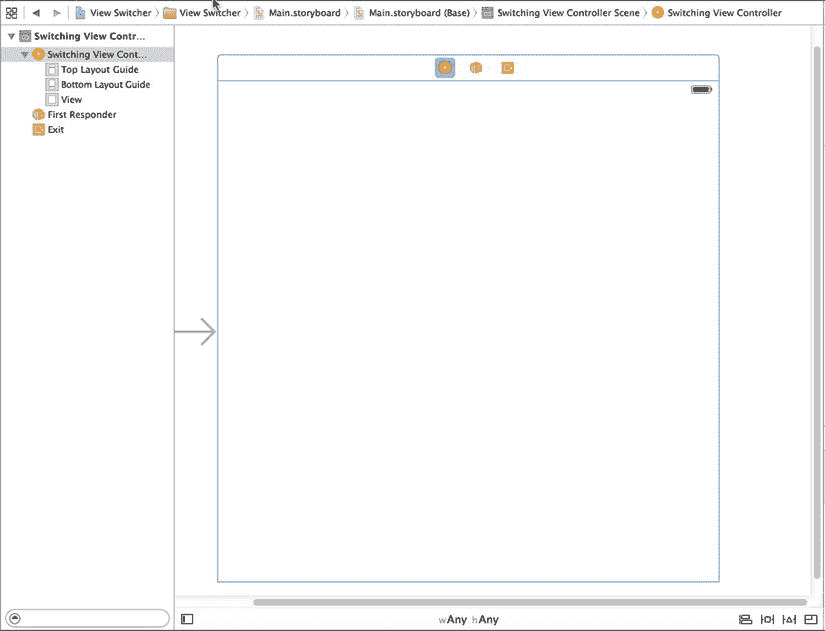

图 6-13. Storyboard 中空的视图，正等待被填充有趣的内容

现在，让我们在视图底部添加一个工具栏。从库中抓取一个 **Toolbar**，将其拖到你的视图上，并放置在底部，使其看起来像图 6-14 所示。

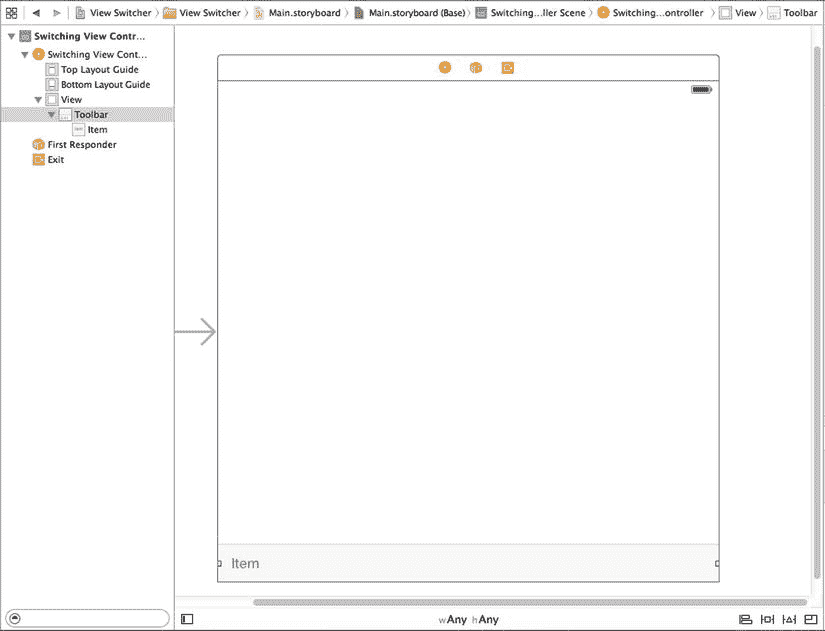

图 6-14. 我们将一个工具栏拖到了视图上。请注意，该工具栏有一个单独的按钮，标签为 Item

我们希望无论视图大小如何，这个工具栏都能保持在内容视图的底部并横向拉伸。为此，我们需要添加三个布局约束——一个将工具栏固定在视图底部，另外两个将其固定在视图的左右两侧。要做到这一点，在 Document Outline 中选择工具栏，点击 storyboard 下方工具栏上的 **Pin** 按钮，并更改弹出窗口中的值，如图 6-15 所示。

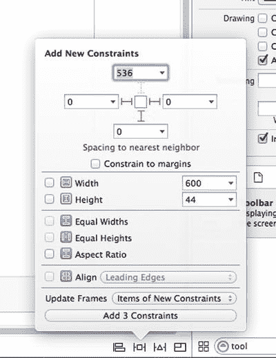

图 6-15. 将工具栏固定到内容视图的底部

首先，取消选中 **Constrain to margins** 复选框，因为我们希望相对于内容视图的边缘来定位工具栏，而不是其边缘附近的蓝色指引线。接下来，将到最近的左侧、右侧和底部邻居的距离设置为零（如果你已正确放置工具栏，它们应该已经为零）。在这种情况下，工具栏最近的邻居是内容视图。你可以通过单击某个距离框中的小箭头来看到这一点：它会打开一个弹出窗口，显示最近的邻居以及你可以相对于其放置工具栏的其他邻居——在此例中，没有其他邻居。为了指示这些距离约束应生效，请单击将距离框连接到中心小方块的三个虚线红线，使它们变成实线。最后，将 **Update Frames** 更改为 *Items of New Constraints*（这样 storyboard 中工具栏的表示就会移动到其新的约束位置），然后点击 **Add 3 Constraints**。

现在，为了确保你操作正确，点击 **Run** 按钮，让这个应用在 iOS 模拟器中启动。你应该会看到一个纯白色的应用启动，底部有一个浅灰色的工具栏，上面有一个单独的按钮。如果没有，请返回并重新检查你的步骤，看看遗漏了什么。旋转模拟器，验证工具栏是否固定在视图底部并横跨整个屏幕。如果情况不是这样，你需要修正刚刚应用到工具栏上的约束。

#### 将工具栏按钮连接到视图控制器

工具栏有一个单独的按钮。我们将使用这个按钮让用户在不同的内容视图之间切换。双击 storyboard 中的按钮，将其标题更改为 *Switch Views*。按下 **Return** 键确认更改。

现在我们可以将工具栏按钮连接到 `SwitchingViewController` 中的动作方法。不过，在此之前，你应该意识到工具栏按钮与其他 iOS 控件不同。它们只支持一个目标动作，并且只在某个明确定义的时刻触发该动作——这相当于其他 iOS 控件中的“touch up inside”事件。


在 Interface Builder 中选中工具栏按钮可能有些棘手。最简便的方法是展开文档大纲中的 `Switching View Controller` 图标，直到能看到当前标注为 `Switch Views` 的按钮，然后点击它。选中 `Switch Views` 按钮后，按住 Control 键从该按钮拖拽到场景顶部黄色的 `Switching View Controller` 图标处，如图 6-16 所示。松开鼠标，从弹出菜单中选择 `switchViews:` 操作。如果 `switchViews:` 操作没有出现，而是看到一个名为 `delegate` 的出口，这很可能是你从工具栏而非按钮拖拽所致。要修正此问题，请确保选中的是按钮而不是工具栏，然后重新执行 Control-拖拽操作。

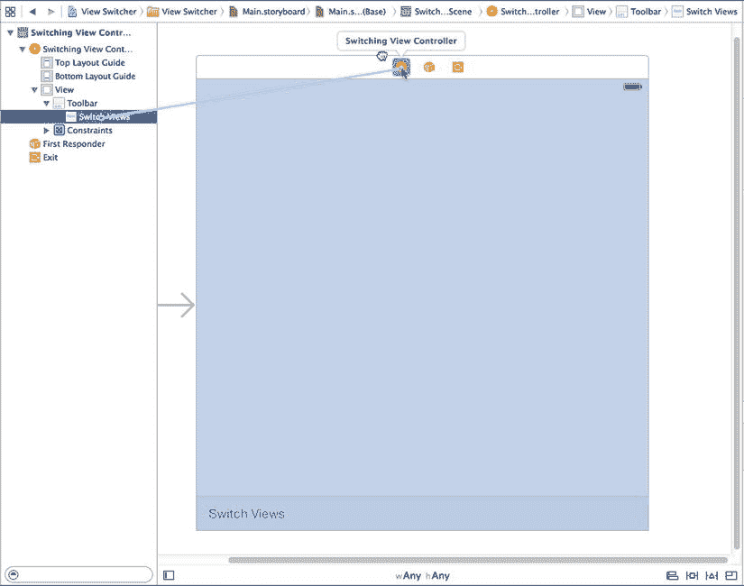

图 6-16. 将工具栏按钮连接到视图控制器类中的 `switchViews:` 方法

在这个场景中还有一点需要指出，即 `SwitchingViewController` 的`view`出口。该出口已连接到场景中的视图。`view`出口继承自父类 `UIViewController`，使得控制器能够访问它所控制的视图。当我们创建项目时，Xcode 同时创建了控制器及其视图，并为我们完成了连接。挺好的。

这就是我们需要在此做的全部工作，请保存你的成果。接下来，让我们开始实现 `SwitchingViewController`。

### 编写根视图控制器

现在轮到编写根视图控制器了。它的任务是在用户点击 `Switch Views` 按钮时切换蓝色视图和黄色视图。在项目导航器中，选中 `SwitchingViewController.m` 并修改 `viewDidLoad` 方法，通过添加以下以粗体显示的行来进行一些初始设置：

```
- (void)viewDidLoad {
    [super viewDidLoad];
    // 加载视图后的额外设置，通常来自 nib 文件

    self.blueViewController = [self.storyboard
                                   instantiateViewControllerWithIdentifier:
                                   @"Blue"];

    self.blueViewController.view.frame = self.view.frame;
    [self switchViewFromViewController:nil
            toViewController:self.blueViewController];

}
```

我们对 `viewDidLoad` 的实现重写了 `UIViewController` 中的一个方法，该方法在故事板加载时被调用。我们如何知道呢？按住  键（`Option` 键）并单击名为 `viewDidLoad` 的方法，会弹出一个文档窗口（参见图 6-17）。或者，你也可以选择 `View`  `Utilities`  `Show Quick Help Inspector` 在“快速帮助”面板中查看类似信息。`viewDidLoad` 定义在我们的超类 `UIViewController` 中，旨在供那些需要在视图加载完成时收到通知的类进行重写。

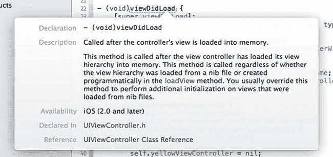

图 6-17. 当你按住 Option 键单击 `viewDidLoad` 方法名时，会出现此文档窗口

这个版本的 `viewDidLoad` 创建了一个 `BlueViewController` 实例。我们使用 `instantiateViewControllerWithIdentifier:` 方法从包含根视图控制器的同一个故事板中加载 `BlueViewController` 实例。要从故事板中访问特定的视图控制器，我们使用字符串作为标识符——在本例中是 `"Blue"`——稍后我们在进一步配置故事板时会设置好这个标识符。一旦 `BlueViewController` 被创建，我们就将这个新实例赋值给 `blueViewController` 属性：

```
self.blueViewController = [self.storyboard
           instantiateViewControllerWithIdentifier:
           @"Blue"];
```

接下来，我们将蓝色视图控制器的视图框架设置为与切换视图控制器的内容视图相同，然后切换到蓝色视图控制器，使其视图显示在屏幕上：

```
self.blueViewController.view.frame = self.view.frame;
[self switchViewFromViewController:nil
       toViewController:self.blueViewController];
```

由于我们需要在多个地方执行视图控制器的切换，相关代码被放在了辅助方法 `switchFromViewController:toViewController:` 中，稍后我们会看到。

那么，为什么我们不同时加载黄色视图控制器呢？我们迟早需要加载它，为什么不现在就做呢？问得好。答案是用户可能永远都不会点击 `Switch Views` 按钮。用户可能只使用应用程序启动时显示的视图，然后就退出了。在这种情况下，何必浪费资源去加载黄色视图及其控制器呢？

因此，我们只在首次实际需要时加载黄色视图。这被称为“**懒加载**”，是一种降低内存开销的标准方法。黄色视图的实际加载发生在 `switchViews:` 方法中。通过添加以粗体显示的代码，补全你之前创建的该方法的存根：

```
- (IBAction)switchViews:(id)sender {
    // 如果需要，创建新的视图控制器。
    if (!self.yellowViewController.view.superview) {
        if (!self.yellowViewController) {
            self.yellowViewController = [self.storyboard
               instantiateViewControllerWithIdentifier:@"Yellow"];
        }
    } else {
        if (!self.blueViewController) {
            self.blueViewController = [self.storyboard
               instantiateViewControllerWithIdentifier:@"Blue"];
        }
    }

    // 切换视图控制器。
    if (!self.yellowViewController.view.superview) {
        self.yellowViewController.view.frame = self.view.frame;
        [self switchViewFromViewController:self.blueViewController
                 toViewController:self.yellowViewController];
    } else {
        self.blueViewController.view.frame = self.view.frame;
        [self switchViewFromViewController:self.yellowViewController
                 toViewController:self.blueViewController];
    }
}
```

`switchViews:` 首先通过检查 `yellowViewController` 的`view`的父视图是否为 `nil`，来判断哪个视图正在被交换进来。如果以下两种情况之一成立，该表达式将为 `true`：

- 如果 `yellowViewController` 存在但其视图未显示给用户，则该视图不会有父视图，因为它当前不在视图层次结构中，表达式将计算为 `true`。
- 如果 `yellowViewController` 不存在（尚未创建或已从内存中清除），表达式也将返回 `true`。

然后我们检查 `yellowViewController` 是否存在：

```
if (!self.yellowViewController.view.superview) {
```

如果它是一个空指针，意味着没有 `yellowViewController` 的实例，我们需要创建一个。这种情况可能发生在第一次按下按钮，或者系统内存不足并将其清除时。在这种情况下，我们需要像在 `viewDidLoad` 方法中创建 `BlueViewController` 那样创建一个 `YellowViewController` 实例：

```
if (!self.yellowViewController) {
    self.yellowViewController = [self.storyboard
         instantiateViewControllerWithIdentifier:@"Yellow"];
}
```

如果我们正在切换蓝色控制器，则需要执行相同的检查，看它是否仍然存在（因为它可能已从内存中清除），如果不存在则创建它。这实际上是相同的代码，只是引用了蓝色控制器：

```
} else {
    if (!self.blueViewController) {
        self.blueViewController = [self.storyboard
            instantiateViewControllerWithIdentifier:@"Blue"];
    }
}
```


此时，我们知道已经拥有一个视图控制器实例，因为要么原本就存在，要么是刚刚创建的。接着将视图控制器的 frame 设置得与切换视图控制器的 content view 一致，然后使用 `switchFromViewController:toViewController:` 方法来实际执行切换操作：

```
// 切换视图控制器
if (!self.yellowViewController.view.superview) {
    self.yellowViewController.view.frame = self.view.frame;
    [self switchViewFromViewController:self.blueViewController
             toViewController:self.yellowViewController];
} else {
    self.blueViewController.view.frame = self.view.frame;
    [self switchViewFromViewController:self.yellowViewController
             toViewController:self.blueViewController];
}
```

如果是从蓝色视图控制器切换到黄色视图控制器，则执行 `if` 语句的第一个分支；反之，则执行 `else` 分支。

除了在从未点击**切换视图**按钮时不占用黄色视图和控制器的资源外，惰性加载还让我们可以释放当前未显示的视图，从而释放其内存。当内存低于系统设定的阈值时，iOS 会调用每个视图控制器继承自 `UIViewController` 的 `didReceiveMemoryWarning` 方法。

由于我们知道任一视图在下一次显示给用户时都会重新加载，因此可以安全地释放当前未显示的任一控制器。我们可以通过在现有的 `didReceiveMemoryWarning` 方法中添加几行代码来实现这一点：

```
- (void)didReceiveMemoryWarning {
    [super didReceiveMemoryWarning];

if (!self.blueViewController.view.superview) {
        self.blueViewController = nil;
    } else {
       self.yellowViewController = nil;
    }
}
```

这段新添加的代码会检查当前显示给用户的是哪个视图，并通过将另一个视图的属性设为 `nil` 来释放其控制器。这将导致该控制器及其控制的视图被释放，从而释放其内存。

**提示** 惰性加载是 iOS 资源管理的关键组成部分，应尽可能在代码中实现。在复杂的多视图应用中，负责任地释放内存中未使用的对象，可能决定一个应用是运行良好，还是因内存不足而定期崩溃。

最后的关键部分是 `switchFromViewController:toViewController:` 方法，它负责执行视图控制器的切换。切换视图控制器分两步：首先移除当前显示的控制器的视图，然后添加新视图控制器的视图。但这还不完全——还需要进行一些清理工作。按照以下代码添加该方法的实现：

```
- (void)switchViewFromViewController:(UIViewController *)fromVC
              toViewController:(UIViewController *)toVC {
    if (fromVC != nil) {
        [fromVC willMoveToParentViewController:nil];
        [fromVC.view removeFromSuperview];
        [fromVC removeFromParentViewController];
    }

if (toVC != nil) {
        [self addChildViewController:toVC];
        [self.view insertSubview:toVC.view atIndex:0];
        [toVC didMoveToParentViewController:self];
    }
}
```

第一段代码用于移除退出的视图控制器，但我们先来看第二段代码，它负责添加进入的视图控制器。该段代码的第一行是：

```
[self addChildViewController:toVC];
```

这行代码将进入的视图控制器设置为切换视图控制器的子控制器。管理其他视图控制器的视图控制器（如 `SwitchingViewController`）被称为容器视图控制器。标准类 `UITabBarController` 和 `UINavigationController` 都是容器视图控制器，它们内部执行的代码与 `switchFromViewController:toViewController:` 方法的功能类似。将新视图控制器设为 `SwitchingViewController` 的子控制器，可以确保在需要时，传递给根视图控制器的某些事件能正确传递给子控制器——例如，它能确保旋转事件被正确处理。

接下来，子视图控制器的视图会被添加到 `SwitchingViewController` 的视图中：

```
[self.view insertSubview:toVC.view atIndex:0];
```

注意，视图被插入到 `SwitchingViewController` 子视图列表的索引 0 处，这告诉 iOS 将该视图放置在其他所有视图的*后面*。将视图置于底层能确保我们刚才在 Interface Builder 中创建的工具栏始终显示在屏幕上，因为内容视图被插入到它后面。最后，通知进入的视图控制器它已成为另一个控制器的子控制器：

```
[toVC didMoveToParentViewController:self];
```

这是必要的，以防子视图控制器重写此方法，在成为另一个控制器的子控制器时执行某些操作。

了解了如何添加视图控制器后，移除父控制器的子控制器的代码就更容易理解了——我们只需反转添加时执行的每一步操作：

```
if (fromVC != nil) {
    [fromVC willMoveToParentViewController:nil];
    [fromVC.view removeFromSuperview];
    [fromVC removeFromParentViewController];
}
```

### 实现内容视图

至此，代码已完成，但我们还不能运行应用，因为故事板中还没有蓝色和黄色的内容控制器。这两个控制器非常简单，每个都包含一个由按钮触发的动作方法，并且都不需要任何输出口。两个视图也几乎相同。实际上，它们非常相似，完全可以用同一个类来表示。但我们选择创建两个独立的类，因为这是大多数多视图应用的构建方式。

我们要实现的两个动作方法仅仅是显示一个提示框（就像我们在第 4 章“Control Fun”应用中所做的那样），所以继续在 `BlueViewController.m` 中添加以下代码：

```
#import "BlueViewController.h"

@implementation BlueViewController

- (IBAction)blueButtonPressed {
    UIAlertController *alert = [UIAlertController
         alertControllerWithTitle:@"蓝色视图按钮被按下"
         message:@"你按下了蓝色视图上的按钮"
         preferredStyle:UIAlertControllerStyleAlert];
    UIAlertAction *action =
         [UIAlertAction actionWithTitle:@"是的，我按了"
             style:UIAlertActionStyleDefault handler:nil];
    [alert addAction:action];
    [self presentViewController:alert animated:YES completion:nil];
}
```

保存文件。接下来，切换到 `YellowViewController.m`，并将非常相似的代码添加到该文件中：

```
#import "YellowViewController.h"

@implementation YellowViewController

- (IBAction)yellowButtonPressed {
    UIAlertController *alert = [UIAlertController
         alertControllerWithTitle:@"黄色视图按钮被按下"
         message:@"你按下了黄色视图上的按钮"
         preferredStyle:UIAlertControllerStyleAlert];
    UIAlertAction *action =
         [UIAlertAction actionWithTitle:@"是的，我按了"
             style:UIAlertActionStyleDefault handler:nil];
    [alert addAction:action];
    [self presentViewController:alert animated:YES completion:nil];
}
```

也保存此文件。


接下来，选择 `Main.storyboard` 在界面生成器中打开，以便我们进行一些修改。首先，我们需要为 `BlueViewController` 添加一个新的场景。到目前为止，我们处理的每个故事板都只包含一个控制器-视图配对，但故事板还有更多功能，其中之一就是容纳多个场景。从对象库中拖出另一个视图控制器，将其放到编辑区中现有场景的旁边。现在，你的故事板有两个场景，每个场景都可以在应用程序运行时动态且独立地加载。在新场景顶部的图标行中，单击黄色的**视图控制器**图标，然后按下 `Command`+`Option`+`3` 调出身份检查器。在**自定义类**部分，**类**默认为 `UIViewController`；将其改为 `BlueViewController`。

我们还需要为这个新的视图控制器创建一个标识符，以便我们的代码能在故事板中找到它。在身份检查器的**自定义类**部分正下方，你会看到一个**故事板 ID** 字段。点击该字段并输入 `Blue`，以与我们代码中使用的名称匹配。

现在你有两个场景了。我们之前向你展示过如何配置应用程序在启动时加载这个故事板，但那里没有提及场景。应用程序如何知道要显示这两个视图中的哪一个呢？答案在于指向第一个场景的那个大箭头，如图 6-18 所示。该箭头指向故事板的默认场景，也就是应用程序启动时显示的内容。如果你想选择不同的默认场景，只需将箭头拖到你想要的场景即可。

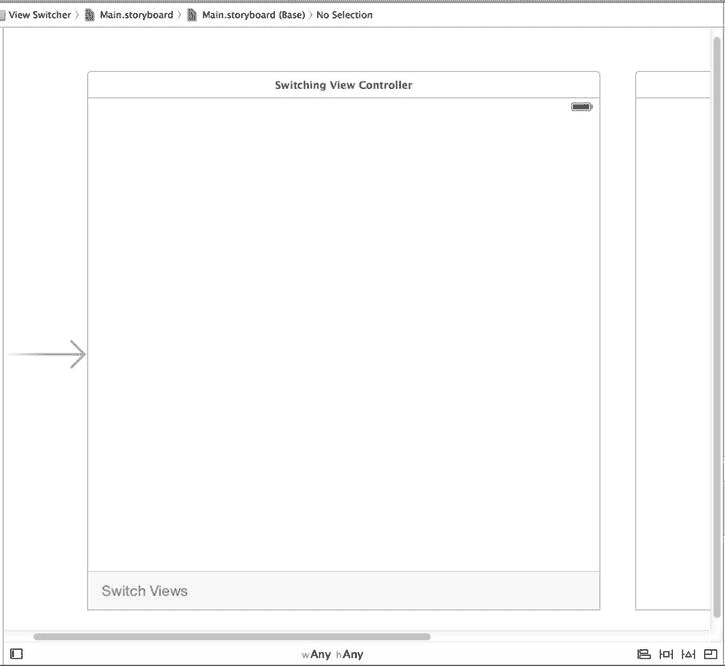

图 6-18。我们刚刚在故事板中添加了第二个场景。大箭头指向默认场景。

单击你刚刚添加的新场景中的大方块视图，然后按下 `Command`+`Option`+`4` 调出属性检查器。在检查器的**视图**部分，点击标记为**背景**的颜色控件，并使用弹出的颜色选择器将此视图的背景颜色改为一种好看的蓝色。当你对蓝色满意后，关闭颜色选择器。

从库中拖一个按钮到视图上，使用对齐参考线将按钮在视图中垂直和水平居中。我们希望确保按钮无论如何都能保持居中，因此为此设置两个约束。首先从菜单中选择**编辑器** → **对齐** → **在容器中水平居中**。然后再次点击新按钮，从菜单中选择**编辑器** → **对齐** → **在容器中垂直居中**。

双击按钮，将其标题改为 `Press Me`。接下来，在按钮仍处于选中状态时，切换到连接检查器（按下 `Command`+`Option`+`6`），从“触摸内部”事件拖到场景顶部的黄色**视图控制器**图标，并连接到 `blueButtonPressed` 操作方法。你会注意到按钮的文本默认是蓝色的。由于我们的背景也是蓝色，按钮文本很可能会难以看清！使用 `Command`+`Option`+`4` 切换到属性检查器，然后使用组合的颜色选择器/弹出按钮将**文本颜色**值改为其他颜色。根据你的背景颜色深浅，你可能想选择白色或黑色。

现在，是时候对 `YellowViewController` 执行大致相同的操作了。从对象库中再抓取一个视图控制器，拖到编辑区。不用担心场景会变得拥挤；你可以把这些场景堆叠在一起，没人会介意！在文档大纲中点击新场景的**视图控制器**图标，使用身份检查器将其类改为 `YellowViewController`，**故事板 ID** 改为 `Yellow`。

接下来，选择 `YellowViewController` 的视图，切换到属性检查器。在那里，点击**背景**颜色控件，选择一种亮黄色，然后关闭颜色选择器。

接着，从库中拖出一个按钮，使用对齐参考线将其在视图中居中。像上一个按钮一样，使用菜单操作创建约束，使其水平和垂直居中。现在将其标题改为 `Press Me, Too`。在按钮仍处于选中状态时，使用连接检查器从“触摸内部”事件拖到**视图控制器**图标，并连接到 `yellowButtonPressed` 操作方法。

完成后，保存故事板，准备让应用程序运行起来。在 Xcode 中点击**运行**按钮，你的应用应该会启动，并呈现一个全屏的蓝色界面。

当我们的应用程序启动时，它会显示我们构建的蓝色视图。当你点击**切换视图**按钮时，它会切换到我们构建的黄色视图。再次点击，它又会回到蓝色视图。如果你点击蓝色或黄色视图上居中的按钮，会弹出一个提示视图，显示哪个按钮被按下了。这个提示表明，对于当前显示的视图，正确的控制器类正在被调用。

不过，这两个视图之间的过渡有点突兀。天哪，要是有办法让过渡看起来更美观就好了。

当然，有办法让过渡更美观！我们可以为过渡添加动画效果，给用户提供视觉上的变化反馈。

### 动画过渡

`UIView` 有几个类方法可供调用，用于指示视图之间的过渡应带有动画效果，指示应使用的过渡类型，以及指定过渡所需的时间。

返回 `SwitchingViewController.m`，通过在 `switchViews:` 方法中添加以下以粗体显示的行来增强它：

```
- (IBAction)switchViews:(id)sender {
    // 如有必要，创建新的视图控制器。
    if (!self.yellowViewController.view.superview) {
        if (!self.yellowViewController) {
            self.yellowViewController = [self.storyboard
                instantiateViewControllerWithIdentifier:@"Yellow"];
        }
    } else {
        if (!self.blueViewController) {
            self.blueViewController = [self.storyboard
                instantiateViewControllerWithIdentifier:@"Blue"];
        }
    }

// 切换视图控制器。
    [UIView beginAnimations:@"View Flip" context:NULL];
    [UIView setAnimationDuration:0.4];
    [UIView setAnimationCurve:UIViewAnimationCurveEaseInOut];
    if (!self.yellowViewController.view.superview) {
        [UIView setAnimationTransition:
                     UIViewAnimationTransitionFlipFromRight
                forView:self.view cache:YES];
        self.yellowViewController.view.frame = self.view.frame;
        [self switchViewFromViewController:self.blueViewController
                  toViewController:self.yellowViewController];
    } else {
        [UIView setAnimationTransition:
                    UIViewAnimationTransitionFlipFromLeft
                forView:self.view cache:YES];
        self.blueViewController.view.frame = self.view.frame;
        [self switchViewFromViewController:self.yellowViewController
                  toViewController:self.blueViewController];
    }
    [UIView commitAnimations];
}
```


编译这个新版本并运行你的应用程序。当你点击 **切换视图** 按钮时，新视图不会直接闪现，而是旧视图会翻转，显示出新视图，如 图 6-19 所示。

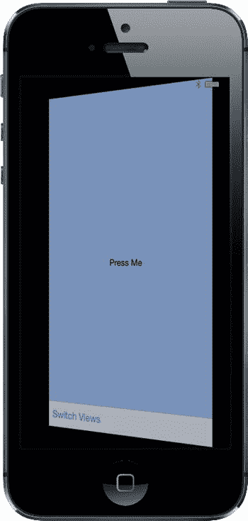

图 6-19 使用翻转动画风格进行视图切换

要告诉 `iOS` 我们想要动画化的变化，需要声明一个**动画块**，并指定动画应该持续多长时间。动画块通过使用 `UIView` 类的 `beginAnimations:context:` 方法来声明，如下所示：

```
[UIView beginAnimations:@"View Flip" context:NULL];
[UIView setAnimationDuration:0.4];
```

`beginAnimations:context:` 接受两个参数。第一个是动画块标题。此标题仅在你更直接地利用此动画背后的框架 `Core Animation` 时才会发挥作用。对于我们而言，我们本可以使用 `nil`。第二个参数是一个 `(void *)`，允许你指定一个对象（或任何其他 `C` 数据类型），你希望其指针与此动画块关联。我们在这里使用了 `NULL`，因为我们不需要这样做。我们还设置了动画的持续时间，它告诉 `UIView` 动画应该持续多长时间（以秒为单位）。

之后，我们设置**动画曲线**，它决定了动画的时间安排。默认是线性曲线，使动画以恒定速度发生。我们在这里设置的选项 `UIViewAnimationCurveEaseInOut` 指定动画应该开始慢，中间加速，然后在结束时再次减速。这使动画看起来更自然，更少机械感：

```
[UIView setAnimationCurve:UIViewAnimationCurveEaseInOut];
```

接下来，我们需要指定要使用的过渡效果。在撰写本文时，有五种 `iOS` 视图过渡可供使用：

*   `UIViewAnimationTransitionFlipFromLeft`
*   `UIViewAnimationTransitionFlipFromRight`
*   `UIViewAnimationTransitionCurlUp`
*   `UIViewAnimationTransitionCurlDown`
*   `UIViewAnimationTransitionNone`

我们选择使用两种不同的效果，具体取决于正在被交换的视图。对一个过渡使用向左翻转，对另一个过渡使用向右翻转，会使视图似乎来回翻转。值 `UIViewAnimationTransitionNone` 会导致从一个视图控制器到另一个的突然过渡。当然，如果你想要那种效果，根本就不会费心去创建动画块。

`cache` 选项通过在动画开始时获取视图的快照来加速绘制，并使用该图像，而不是在动画的每一步重新绘制视图。除非视图的外观在动画期间可能需要更改，否则你应该始终缓存动画：

```
[UIView setAnimationTransition:UIViewAnimationTransitionFlipFromRight
                   forView:self.view cache:YES];
```

当我们完成指定要动画化的更改后，我们在 `UIView` 上调用 `commitAnimations`。从动画块开始到调用 `commitAnimations` 之间的所有内容将一起进行动画化。

感谢 `Cocoa Touch` 在底层使用 `Core Animation`，我们能够仅用少量代码实现相当复杂的动画。

**切换结束**

哇！创建我们自己的多视图控制器工作量很大，不是吗？现在，你应该对多视图应用程序是如何组合在一起的有了很好的理解，因为你已经从零开始构建了一个。

尽管 `Xcode` 包含了最常见类型的多视图应用程序的项目模板，但你需要理解这些类型应用程序的整体结构，以便能够从头开始构建它们。标准的容器控制器（`UITabBarController`、`UINavigationController` 和 `UIPageViewController`）是难以置信的省时工具，你应该在可能时使用它们，但有时，它们根本无法满足你的需求。

在接下来的几章中，我们将继续构建多视图应用程序，以巩固本章的概念，并让你感受更复杂的应用程序是如何组合在一起的。在第 7 章中，我们将构建一个标签栏应用程序。让我们开始吧！

