# 第 7 章 标签栏与选择器

在上一章中，你构建了你的第一个多视图应用程序。在本章中，你将构建一个完整的包含五个不同标签和五个不同内容视图的标签栏应用程序。构建这个应用程序将巩固你在第 6 章中学到的很多东西。现在，你太聪明了，不会花整整一章来做你已经知道怎么做的事情，所以我们将使用这五个内容视图来演示一种我们尚未涵盖的 `iOS` 控件类型。这个控件称为**选择器视图**，或简称为**选择器**。

你可能对这个名字不熟悉，但如果你拥有 `iPhone` 或 `iPod touch` 超过 10 分钟，你几乎肯定使用过选择器。选择器是带有旋转拨盘的控件。你在日历应用程序中使用它们输入日期，或者在时钟应用程序中设置计时器（参见 图 7-1）。在 `iPad` 上，选择器视图并不那么常见，因为更大的显示屏允许你呈现其他从多个项目中选择的方式；但即使在那里，它也在日历应用程序中使用。

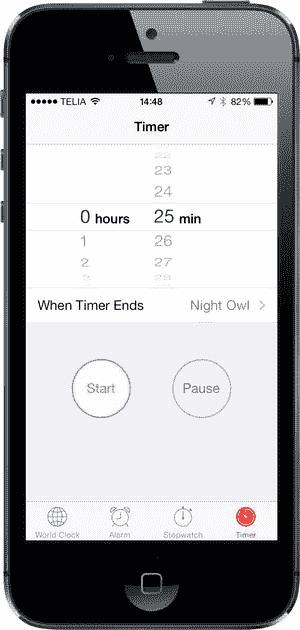

图 7-1 时钟应用程序中的选择器

选择器比你迄今看到的 `iOS` 控件稍微复杂一些；因此，它们值得多花一点注意。选择器可以配置为显示一个拨盘或多个。默认情况下，选择器显示文本列表，但它们也可以被设置为显示图像。

**选择器应用程序**

本章的应用程序 `Pickers`，将包含一个标签栏。在构建 `Pickers` 时，你将更改默认标签栏，使其有五个标签，为每个标签栏项添加图标，然后创建一系列内容视图，并将每个视图连接到一个标签。

应用程序的内容视图将包含五种不同的选择器：

*   **日期选择器：**我们将构建的第一个内容视图将包含一个日期选择器，这是最容易实现的选择器类型（参见 图 7-2）。该视图还将有一个按钮，点击时，将显示一个警报，显示所选的日期。

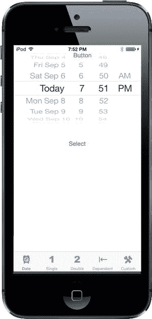

图 7-2 第一个标签将显示一个日期选择器

*   **单组件选择器：**第二个标签将包含一个带有单个值列表的选择器（参见 图 7-3）。这个选择器实现起来比日期选择器要多一些工作。你将学习如何通过使用委托和数据源来指定选择器中显示的值。

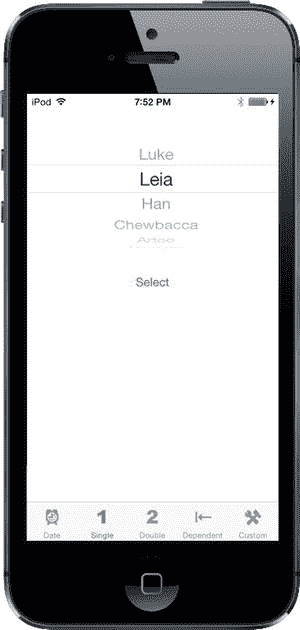

图 7-3 显示单个值列表的选择器

*   **多组件选择器：**在第三个标签中，我们将创建一个带有两个独立轮盘的选择器。这些轮盘的技术术语是**选择器组件**，因此这里我们正在创建一个具有两个组件的选择器。你将看到如何使用数据源和委托向选择器提供两个独立的数据列表（参见 图 7-4）。这个选择器的每个组件可以独立更改，而不会影响另一个。

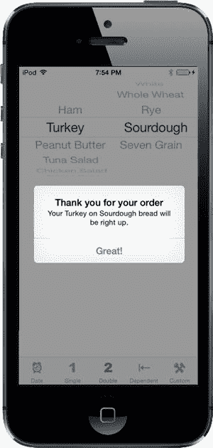

图 7-4 一个双组件选择器，显示反映我们选择的警报


*   **带有依赖组件的`Picker`（选择器）：** 在第四个内容视图中，我们将构建另一个带有两个组件的选择器。但这一次，右侧组件中显示的值将根据左侧组件中选择的值而变化。在我们的示例中，我们将在左侧组件中显示一个州列表，并在右侧组件中显示该州的邮政编码列表（参见图 7-5）。

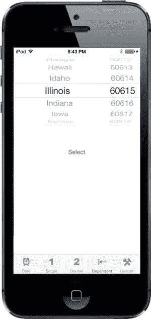

图 7-5. 在这个选择器中，一个组件依赖于另一个组件。当你在左侧组件中选择一个州时，右侧组件会变为该州的邮政编码列表。

*   **带有图像的自定义选择器：** 最后，但绝非最不重要的一点是，我们将在第五个内容视图中找点乐子。我们将演示如何向选择器添加图像数据，为此，我们将编写一个小游戏，该游戏使用一个包含五个组件的选择器。在苹果文档的多个地方，选择器的外观被描述为有点像老虎机。那么，还有什么比编写一个老虎机小游戏更合适的呢（参见图 7-6）？对于这个选择器，用户将无法手动更改组件的值，但可以选择**Spin**（旋转）按钮，让五个轮盘旋转到新的随机选定值。如果同一图像出现三个排成一排，用户就赢了。

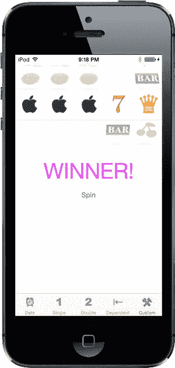

图 7-6. 我们的第五个组件选择器。请注意，我们不赞成将你的 iPhone 当作微型赌场使用。

## 委托与数据源

在我们深入并开始构建应用程序之前，让我们看看是什么让选择器比你迄今为止使用的其他控件更复杂。除了日期选择器之外，你无法仅仅通过从对象库中抓取一个选择器、将其拖放到内容视图上并配置它来使用它。你还需要为每个选择器提供一个选择器**委托**和一个选择器**数据源**。

至此，你应该已经熟悉委托的使用了。我们已经使用过应用程序委托，其基本思想在这里是相同的。选择器将几项工作委托给它的委托。其中最重要的是确定在每个组件的每一行中实际绘制什么内容的任务。选择器要求委托提供一个字符串或一个视图，该视图将在给定组件的给定位置绘制。选择器从委托那里获取其数据。

除了委托之外，选择器还需要有一个数据源。数据源告诉选择器它将有多少个组件，以及每个组件由多少行组成。数据源的工作方式与委托类似，其方法会在某些预定的时间被调用。没有数据源和委托，选择器就无法工作；实际上，它们甚至不会被绘制出来。

数据源和委托通常是同一个对象，并且该对象通常是选择器所在视图的视图控制器，这是我们在本应用程序中将采用的方法。我们应用程序的每个内容面板的视图控制器将充当其选择器的数据源和委托。

**注意** 这里有一个突击测验：选择器数据源是应用程序模型、视图还是控制器部分的一部分？这是一个陷阱问题。数据源听起来像是必须是模型的一部分，但它实际上是控制器的一部分。数据源通常不是一个设计用来保存数据的对象。在简单的应用程序中，数据源可能保存数据，但其真正的工作是从模型检索数据并将其传递给选择器。

让我们启动 Xcode 并开始吧。

## 创建选择器应用程序

虽然 Xcode 为标签栏应用程序提供了一个模板，但我们还是从头开始构建。这并不会增加太多工作量，而且是一个很好的练习。

创建一个新项目，再次选择**Single View Application**（单视图应用程序）模板，然后选择**Next**（下一步）进入下一个屏幕。在**Product Name**（产品名称）字段中，输入**Pickers**。确保名为**Use Core Data**（使用 Core Data）的复选框未被选中，并将**Language**（语言）设置为 *Objective-C*，将**Devices**（设备）弹出菜单设置为 *Universal*（通用）。然后再次选择**Next**（下一步）。Xcode 会让你选择保存项目的文件夹。

我们将引导你完成构建整个应用程序的过程；但在任何时候，如果你觉得自己可以先进一步、挑战自我，请随意。如果你遇到困难，随时可以回来。如果你不想跳过，那也没关系。我们很高兴有你陪伴。

### 创建视图控制器

在上一章中，我们创建了一个根视图控制器（简称“根控制器”）来管理交换应用程序其他视图的过程。这次我们也会这样做，但不需要创建我们自己的根视图控制器类。苹果提供了一个非常好的用于管理标签栏视图的类，因此我们将直接使用 `UITabBarController` 的一个实例作为我们的根控制器。

首先，我们需要在 Xcode 中创建五个新类：根控制器将交换进和交换出的五个视图控制器。

在项目导航器中展开 *Pickers* 文件夹。在那里，你将看到 Xcode 为启动项目而创建的源代码文件。单击 *Pickers* 文件夹，然后按下 **N** 键，或选择 **File**  **New**  **File. . .**。

在新建文件助手的左窗格中选择 **iOS**，然后选择 **Source**（源代码），接着选择 **Cocoa Touch Class** 图标，然后点击 **Next**（下一步）继续。下一个屏幕让你为新类命名。在 **Class**（类）字段中输入 **DatePickerViewController**。确保 **Subclass of**（子类化）字段包含 *UIViewController*。确保 **Also create XIB file**（同时创建 XIB 文件）复选框未被选中，将 **Language**（语言）设置为 *Objective-C*，然后点击 **Next**（下一步）。

你将看到一个文件夹选择窗口，让你选择类的保存位置。选择 *Pickers* 目录，该目录已经包含 `AppDelegate` 类和其他几个文件。同时确保 **Group**（组）弹出菜单已选中 *Pickers* 文件夹，并且 **Pickers** 的目标复选框已选中。

点击 **Create**（创建）按钮后，*Pickers* 文件夹中会出现两个新文件：*DatePickerViewController.h* 和 *DatePickerViewController.m*。

再重复这些步骤四次，分别使用名称 *SingleComponentPickerViewController*、*DoubleComponentPickerViewController*、*DependentComponentPickerViewController* 和 *CustomPickerViewController*。所有这些步骤完成后，*Pickers* 文件夹应包含所有新文件，整齐地组合在一起（参见图 7-7）。

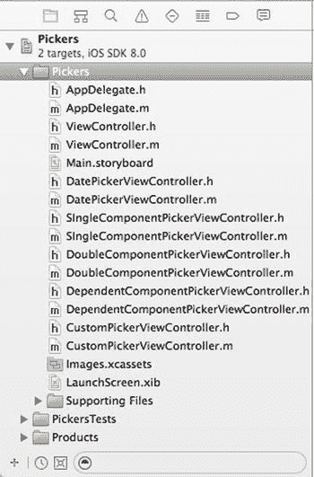

图 7-7. 创建五个视图控制器类后，项目导航器中应包含所有这些文件。

### 创建标签栏控制器

现在，让我们创建标签栏控制器。项目模板已经包含一个名为 `ViewController` 的视图控制器，它是 `UIViewController` 的子类。要将其转换为标签栏控制器，我们只需要更改其基类。打开 *ViewController.h* 并进行以下粗体所示的更改：

```
#import <UIKit/UIKit.h>

@interface ViewController : UITabBarController
```


接下来，我们需要在故事板中设置标签栏控制器，因此打开`Main.storyboard`。模板中已添加了一个初始视图控制器，我们需要将其替换，因此在文档大纲或编辑区域中选择它，然后按`Delete`键删除。在对象库中，找到`Tab Bar Controller`并将其拖拽到编辑区域（参见图 7-8）。

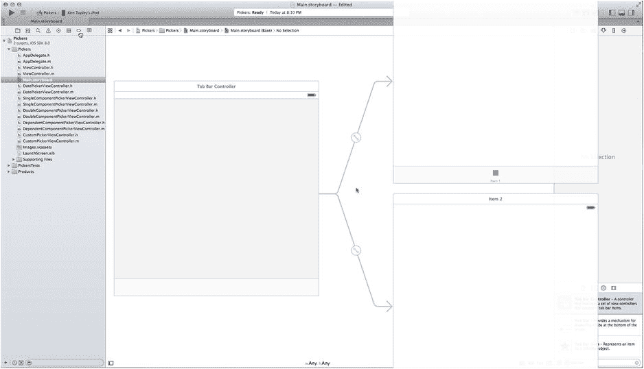

图 7-8. 将标签栏控制器从库中拖入编辑区域。你拖动的是一个相当大的东西。

在拖动时，你会发现，与之前要求从对象库中拖出的其他控制器不同，这个控制器一次性拉出了三个完整的视图控制器对，它们之间用曲线连接。这实际上不仅仅是一个标签栏控制器；它还包含两个子控制器，已经连接好并可以立即使用。

将标签栏控制器放入编辑区域后，故事板中就会添加三个新场景。如果展开左侧的文档视图，你会看到故事板中所有场景的清晰概览（参见图 7-9）。你还会看到连接标签栏控制器与其每个子控制器的曲线仍然存在。如果移动场景，这些曲线会自动调整以保持连接，你可以随时自由移动它们。故事板中每个场景在屏幕上的位置不会影响应用运行时的外观。

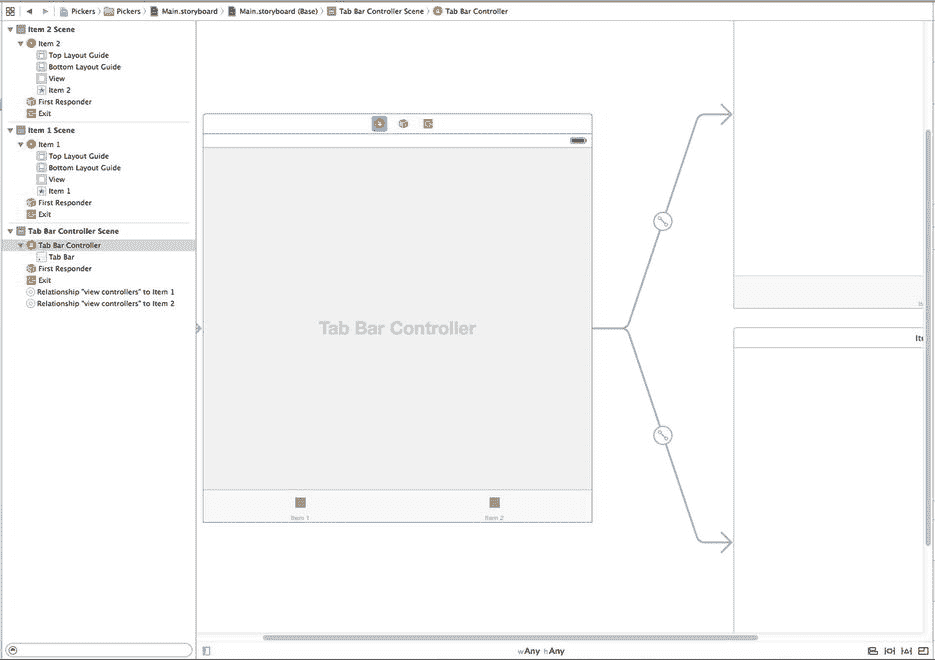

图 7-9. 标签栏控制器的场景及其两个子场景。注意视图底部的标签栏包含两个标签，以及连接到每个子视图控制器的曲线。

这个标签栏控制器将成为我们的根控制器。提醒一下，根控制器控制程序运行时用户首先看到的视图。它负责切换其他视图的显示与隐藏。由于我们将把每个视图连接到标签栏的某个标签上，因此标签栏控制器作为根控制器是合乎逻辑的选择。我们需要告诉 iOS，在应用程序启动时应从`Main.storyboard`加载这个标签栏控制器。为此，在文档大纲中选择`Tab Bar Controller`图标，打开属性检查器；然后在`View Controller`部分，勾选`Is Initial View Controller`复选框。在视图控制器仍处于选中状态时，切换到标识检查器，并将`Class`更改为`ViewController`。

标签栏可以使用图标来表示每个标签，因此我们应在编辑故事板之前添加要使用的图标。你可以在本书源代码归档的`07 - ImageSets`文件夹中找到一些合适的图标。`07 - ImageSets`的每个子文件夹都包含三张图片（一张用于标准显示屏设备，两张用于视网膜显示屏设备）。在 Xcode 项目导航器中，选择`Images.xcassets`，它已包含图标和启动图像的默认图形。接下来，将`07 - ImageSets`文件夹中的每个子文件夹拖到编辑区域左侧栏的 AppIcon 下方，将它们全部复制到项目中。

如果你想自己制作图标，可以参考以下创建指南。使用的图标应为 24 × 24 像素，并保存为`.png`格式。图标文件应具有透明背景。无需费力为图标着色以匹配标签栏的外观。与应用程序图标一样，iOS 会自动处理你的图像，使其看起来恰到好处。

**提示**：24 × 24 像素的图像大小实际上是针对标准显示屏的；对于 iPhone 4 及更高版本的视网膜显示屏以及新款 iPad，你需要提供双倍大小的图像，否则图像会出现像素化。对于 iPhone 6 Plus，你需要提供原始大小三倍的图像。这非常简单：对于任何图像`foo.png`，你还应提供一个名为`foo@2x.png`的双倍大小图像，以及另一个名为`foo@3x.png`的三倍大小图像。调用`[UIImage imageNamed:@"foo"]`会自动返回适合当前运行设备的标准大小图像或双倍大小图像。

回到故事板，你可以看到每个子视图控制器顶部显示类似“Item 1”的名称，并且其视图底部有一个栏按钮项，标签与标签栏中的内容匹配。我们最好从一开始就为这两个子控制器设置正确的名称，因此选择`Item 1`视图控制器，然后点击底部或文档大纲中的标签栏项。打开属性检查器，你会看到一个用于设置`Bar Item`的`Title`的文本字段，当前包含文本`Item 1`。将文本替换为`Date`，然后按`Enter`键。这会立即更改此视图控制器底部栏按钮项的文本，以及标签栏控制器中对应标签栏项的文本。仍在检查器中时，点击`Image`弹出菜单并选择`clockicon`来设置图标。这再简单不过了！

现在对第二个子视图控制器重复相同的步骤，但将其命名为`Single`，并使用`singleicon`图像作为其栏按钮项。

下一步是完善标签栏控制器，使其包含图 7-2 中所示的五个标签。这五个标签分别对应我们的五个选取器。实现方法很简单：在故事板中再添加三个视图控制器（除了随标签栏控制器一起添加的两个之外），然后将它们每个都连接到标签栏控制器，以便标签栏控制器可以激活它们。首先，从对象库中拖出一个普通的`View Controller`。接下来，按住`Control`键从标签栏控制器拖到新的视图控制器，松开鼠标按钮，然后在弹出的小窗口的`Relationship Segue`部分选择`view controllers`。这告诉标签栏控制器它有一个新的子控制器需要管理，因此标签栏会立即获得一个新项，并且新视图控制器的视图底部会出现一个栏按钮项，与已有的其他子控制器一样。现在按照前面概述的步骤，为这个最新视图控制器的栏按钮项设置标题`Double`和图像`doubleicon`。

现在进展顺利。再拖出两个视图控制器，并按前述方法将它们连接到标签栏控制器。逐个选择每个视图控制器的栏按钮项，将其中一个命名为`Dependent`，并使用`dependenticon`作为其图像；另一个命名为`Custom`，并使用`toolicon`作为其图像。

现在所有视图控制器都已就位，接下来需要为每个视图控制器设置正确的控制器类。这样我们就可以在每个视图中实现不同的功能。在文档大纲中，选择标记为`Item 1`的视图控制器，然后打开标识检查器。在检查器的`Custom Class`部分，将类更改为`DatePickerViewController`，然后按`Return`或`Tab`键确认设置。你会看到文档大纲中所选控制器的名称变为`Date`，这与之前所做的更改一致。


```markdown

现在，按照标签栏控制器底部出现的顺序，为接下来的四个视图控制器重复相同的操作。在各自的身份检查器中，分别使用类名`SingleComponentPickerViewController`、`DoubleComponentPickerViewController`、`DependentComponentPickerViewController`和`CustomPickerViewController`。

在继续编辑 GUI 之前，请保存你的故事板文件。

### 初始测试运行

此时，标签栏和内容视图应该都已连接并正常工作。编译并运行，应用程序应启动并显示一个功能正常的标签栏（参见图 7-10）。依次点击每个标签。每个标签都应可被选中。

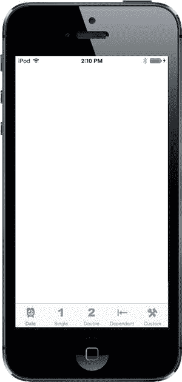

图 7-10 包含五个空白但可选中标签的应用程序

目前内容视图中没有任何内容，因此变化不会很明显。实际上，除了标签栏项目的突出显示之外，你不会看到任何差异。但如果一切顺利，多视图应用程序的基本框架现已搭建完成并可正常工作，接下来我们可以开始设计各个内容视图。

**提示**：如果模拟器在点击某个标签时发生崩溃，请不要惊慌！最有可能的情况是你漏掉了某个步骤或打错了字。请返回并确保连接正确，且类名均已正确设置。

如果想进一步确认一切正常，可以在每个内容视图中添加不同的标签或其他对象，然后重新启动应用程序。此时，当你选择不同的标签时，应该能看到不同视图的内容发生相应变化。

### 实现日期选择器

为了实现日期选择器，我们需要一个输出口和一个操作。输出口将用于获取日期选择器的值。操作将由按钮触发，并弹出一个警报来显示从选择器获取的日期值。我们将在界面生成器中编辑`Main.storyboard`文件时添加这两项，因此如果项目导航器中该文件不在最前面，请选中它。

我们首先需要在对象库中找到日期选择器，并将其拖拽到编辑区域的日期场景中。点击文档大纲中的**日期**图标，将相应的视图控制器置于前端，然后将日期选择器从对象库拖拽到视图中，并放置在视图顶部，紧贴显示区域的顶端。即使它覆盖了状态栏也没关系，因为这个控件顶部有足够多的内边距，没有人会注意到。

现在需要应用 Auto Layout 约束，以便日期选择器在任何设备上运行时都能正确放置。我们希望选择器水平居中并固定在视图顶部，因此需要两个约束。点击故事板下方的**对齐**按钮，勾选**水平居中于容器**复选框，然后点击**添加 1 个约束**。点击**固定**按钮（位于**对齐**按钮旁边）。使用弹出窗口顶部的四个距离框，将选择器与视图顶部边缘之间的距离设置为零（在顶部框中输入 0），然后点击下方的红色虚线，使其变为实线。在弹出窗口底部，将**更新帧**设置为*新约束的项目*，然后点击**添加 1 个约束**。日期选择器将调整大小并移动到正确位置，如图 7-11 所示。

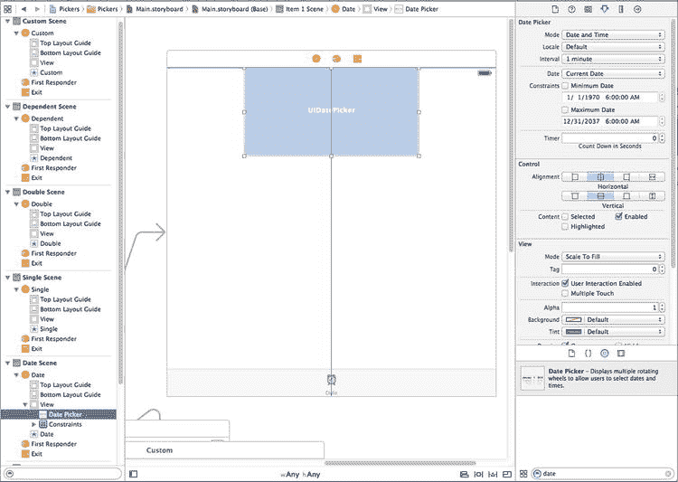

图 7-11 日期选择器位于其视图控制器视图的顶部

如果日期选择器尚未被选中，请单击选中它，然后返回属性检查器。如图 7-12 所示，可以配置日期选择器的许多属性。我们将保留大部分值的默认设置（但在完成后可以随意尝试这些选项，以查看其效果）。我们要做的唯一一件事是将选择器的范围限制在合理的日期内。寻找**约束**标题，勾选**最小日期**复选框。将值保留为默认的*1970/1/1*。同时勾选**最大日期**复选框，并将值设置为*2200/12/31*。

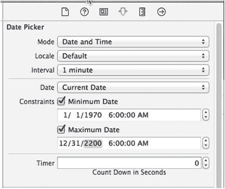

图 7-12 日期选择器的属性检查器。设置最大日期，其余设置保留默认值

现在，将此选择器连接到其控制器。按下 **回车键**打开助手编辑器，并确保助手编辑器顶部的跳转栏设置为**自动**。这样`DatePickerViewController.m`文件就会出现在那里。接下来，按住 Control 键从选择器拖拽到`DatePickerViewController.m`的类扩展部分，位于`@interface`和`@end`行之间，当**插入 Outlet、Action 或 Outlet Collection**工具提示出现时释放鼠标按钮。在释放鼠标后弹出的窗口中，确保**连接**设置为*Outlet*，在**名称**中输入`datePicker`，然后按下**回车键**创建输出口并将其连接到选择器。

接下来，从库中获取一个按钮，并将其放置在日期选择器下方一小段距离处。双击按钮，将其标题设置为*Select*。我们希望此按钮水平居中，并与日期选择器保持固定距离。选中按钮后，点击故事板底部的**对齐**按钮，勾选**水平居中于容器**复选框，然后点击**添加 1 个约束**。要固定它们之间的距离，请按住 Control 键从按钮拖拽到日期选择器，然后释放鼠标。在出现的弹出窗口中，选择**垂直间距**。最后，点击故事板底部的**解决 Auto Layout 问题**按钮，然后在弹出窗口的顶部部分点击**更新帧**。按钮应该会移动到正确位置，并且不再有任何 Auto Layout 警告。

现在，按住 Control 键从按钮拖拽到助手视图中的源代码，这次拖拽到接近底部的位置，紧挨着最终的`@end`行上方，直到看到**插入 Action**工具提示出现。将新操作命名为`buttonPressed`，然后按下**回车键**进行连接。这将创建一个名为`buttonPressed:`的空方法，现在你应该用以下粗体代码来补全它：

```objectivec
- (IBAction)buttonPressed:(id)sender {
    NSDate *date = self.datePicker.date;
    NSString *message = [[NSString alloc] initWithFormat:
                         @"The date and time you selected is %@", date];
    UIAlertController *alert =
            [UIAlertController alertControllerWithTitle:
                    @"Date and Time Selected"
                    message:message
                    preferredStyle:UIAlertControllerStyleAlert];
    UIAlertAction *action =
            [UIAlertAction actionWithTitle:@"That's so true!"
                    style:UIAlertActionStyleDefault handler:nil];
    [alert addAction:action];
    [self presentViewController:alert animated:YES completion:nil];
}
```

在这里，我们使用`datePicker`输出口从日期选择器获取当前日期值，然后基于该日期构造一个字符串，并用于显示一个警报。

接下来，向`viewDidLoad:`方法添加一些设置代码，以完成此控制器类：

```


- (void)viewDidLoad {
    [super viewDidLoad];
    // Do any additional setup after loading the view.
    NSDate *now = [NSDate date];
    [self.datePicker setDate:now animated:NO];
}

在`viewDidLoad`中，我们创建了一个新的`NSDate`对象。通过这种方式创建的`NSDate`对象会保存当前日期和时间。然后，我们设置`datePicker`的日期为该日期，这确保了每次从故事板加载此视图时，选择器都会重置为当前日期和时间。

继续构建并运行，以确认日期选择器正常工作。如果一切顺利，运行时的应用程序应如 Figure 7-2 所示。如果你点击**Select**按钮，将弹出一个警告，告诉你当前在日期选择器中选择的日期和时间。

**注意**：日期选择器不允许你指定秒数或时区。弹出的警告显示带有秒数且以格林威治标准时间（GMT）表示的时间。我们本可以添加一些代码来简化警告中显示的字符串，但这一章还不够长吗？如果你有兴趣自定义日期的格式，可以查看`NSDateFormatter`类。

## 实现单组件选择器

接下来这个选择器允许用户从值列表中进行选择。在这个示例中，我们将使用`NSArray`来保存我们想要在选择器中显示的值。

选择器本身并不持有数据。相反，它们会调用其数据源和代理的方法来获取需要显示的数据。选择器并不关心底层数据存储在哪里。它会在需要时请求数据，而数据源和代理（通常在实践中是同一个对象）协同工作来提供这些数据。因此，数据可以像我们本节要做的那样来自一个静态列表，也可以从文件或 URL 加载，甚至可以即时生成或计算。

为了让选择器类向其控制器请求数据，我们必须确保控制器实现了正确的方法。其中一部分工作是在控制器的接口中声明它将实现一些协议。在项目导航器中，单击`SingleComponentPickerViewController.h`。该控制器类将同时扮演选择器的数据源和代理，因此我们需要确保它遵守这两个角色的协议。添加以下代码：

```
#import <UIKit/UIKit.h>

@interface SingleComponentPickerViewController : UIViewController
  <UIPickerViewDelegate, UIPickerViewDataSource>

@end
```

### 构建视图

现在再次选择`Main.storyboard`，因为需要编辑标签栏中第二个标签的内容视图。在文档大纲中，点击**Single**图标，将视图控制器带到编辑器区域的前景。接下来，从库中拖拽一个 Picker View（参见 Figure 7-13）添加到视图中，将其紧贴视图顶部放置，就像你之前对日期选择器视图做的那样。

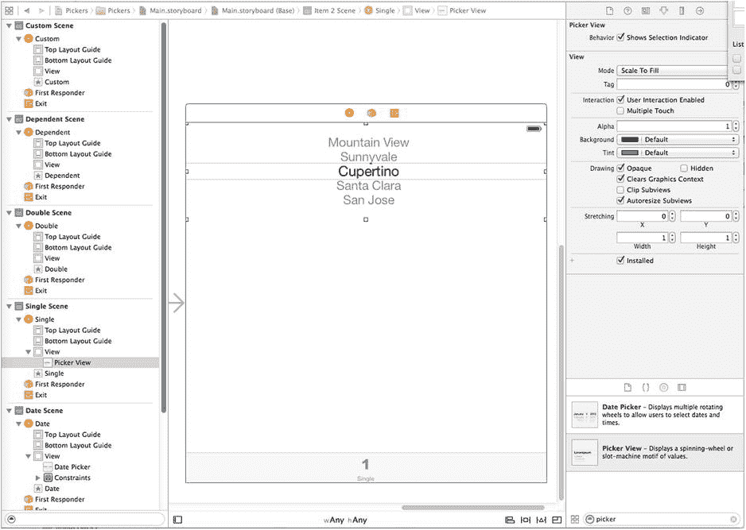

Figure 7-13. 从库中添加一个选择器视图到你的第二个视图

选择器需要水平居中并固定在场景的顶部。你可以通过向选择器添加与上一个示例中添加到日期选择器相同的 Auto Layout 约束来实现。如果你不记得如何操作，请参考“实现日期选择器”章节中的说明。在本章中我们将反复使用这些约束，因此记住如何创建它们，或将其记录下来是值得的。

现在，将这个选择器连接到它的控制器。这里的步骤与之前的日期选择器视图类似：打开助理编辑器，将跳转栏设置为显示`.m`文件，按住 Control 键从选择器拖拽到`SingleComponentPickerViewController.m`顶部的`@interface`部分，并创建一个名为`singlePicker`的出口。

接下来，选中选择器，按下**6**打开连接检查器。查看选择器视图的可用连接，你会看到前两个是**dataSource**和**delegate**。如果你没有看到这些出口，请确保你选中的是选择器本身，而不是包含它的`UIView`！从**dataSource**旁边的圆圈拖拽到故事板或文档大纲中场景顶部的**View Controller**图标，然后从**delegate**旁边的圆圈拖拽到**View Controller**图标。现在，这个选择器知道故事板中的`SingleComponentPickerViewController`类的实例是其数据源和代理，并且选择器会请求它提供要显示的数据。换句话说，当选择器需要获取它将要显示的数据信息时，它会向控制此视图的`SingleComponentPickerViewController`实例请求该信息。

将一个 Button 拖拽到视图，将其放置在选择器下方。双击按钮并将其标题设置为*Select*。按**Return**键确认修改。在连接检查器中，从 Touch Up Inside 旁边的圆圈拖拽到助理视图的代码中，在底部的`@end`上方释放，以创建一个新的动作方法。将此动作命名为`buttonPressed`，你会看到 Xcode 自动填入了一个空方法。

像往常一样，当我们向故事板添加视图时，需要设置其 Auto Layout 约束。对于按钮而言，这些约束需要使其水平居中，并保持其与选择器之间的距离固定不变。在向 Data Picker 场景添加类似按钮时你已经看到了如何做到这一点，所以直接应用相同的约束即可。现在，你已经完成了第二个标签的 GUI 构建。保存故事板，让我们继续编写代码。

### 将控制器实现为数据源和代理

为了使我们的控制器能够正确地作为选择器的数据源和代理工作，我们将从一些你熟悉的代码开始，然后添加几个你从未见过的方法。

在项目导航器中单击`SingleComponentPickerViewController.m`，并在顶部的`@interface`部分添加以下属性。这将允许我们保存一个指向包含几个知名电影角色名称的数组的指针：

```
@interface SingleComponentPickerViewController ()

@property (weak, nonatomic) IBOutlet UIPickerView *singlePicker;
@property (strong, nonatomic) NSArray *characterNames;

@end
```

接下来，在`viewDidLoad`方法中添加以下初始化代码，以设置角色名称数组的内容：

```
- (void)viewDidLoad {
    [super viewDidLoad];
    // Do any additional setup after loading the view.
    self.characterNames = @[@"Luke", @"Leia", @"Han", @"Chewbacca",
                            @"Artoo", @"Threepio", @"Lando"];
}
```

然后，在`buttonPressed:`方法中添加以下代码：

```
- (IBAction)buttonPressed:(id)sender {
    NSInteger row = [self.singlePicker selectedRowInComponent:0];
    NSString *selected = self.characterNames[row];
    NSString *title = [[NSString alloc] initWithFormat:
                       @"You selected %@!", selected];

UIAlertController *alert =
        [UIAlertController alertControllerWithTitle:title
             message:@"Thank you for choosing."
             preferredStyle:UIAlertControllerStyleAlert];
    UIAlertAction *action =
        [UIAlertAction actionWithTitle:@"You're welcome"
             style:UIAlertActionStyleDefault handler:nil];
    [alert addAction:action];
    [self presentViewController:alert animated:YES completion:nil];
}
```


这两个方法现在你应该已经熟悉了。`buttonPressed:`方法与我们在日期选择器中使用的方法几乎相同，但与日期选择器不同的是，常规选择器无法告诉我们它保存了什么数据，因为它不维护数据本身。它将这项工作委托给了代理和数据源。相反，`buttonPressed:`方法需要询问选择器当前选中了哪一行，然后从你的`pickerData`数组中获取相应的数据。下面是我们如何询问当前选中的行：

```
NSInteger row = [self.singlePicker selectedRowInComponent:0];
```

注意，我们需要指定想要了解的是哪个组件。这个选择器中只有一个组件，所以我们简单地传入`0`，这是第一个组件的索引。

**注意** 你是否注意到，在获取选中行的请求中，`NSInteger`和`row`之间没有星号？在 iOS SDK 的大部分地方，前缀`NS`通常表示来自 Foundation 框架的 Objective-C 类，但这里是这条通用规则的一个例外。`NSInteger`始终被定义为一个整数数据类型，要么是`int`，要么是`long`。我们使用`NSInteger`而不是`int`或`long`，因为使用`NSInteger`时，编译器会自动选择最适合当前编译平台的大小。在为 32 位处理器编译时，它会创建一个 32 位的`int`；在为 64 位架构编译时，则会创建一个更长的 64 位`long`。现在苹果已经开始发布 64 位 iOS 设备，使用这些类型非常有意义。你可能还会为 iOS 应用程序编写类，之后希望将它们重用在 OS X 的 Cocoa 应用程序中，而 OS X 已经在 32 位和 64 位机器上运行了多年。

在`viewDidLoad`中，我们为`characterNames`属性分配了一个包含多个对象的数组，以便为选择器提供数据。通常，你的数据会来自其他来源，比如项目*Resources*文件夹中的属性列表，或者 Web 服务查询。像我们这里这样，在代码中嵌入一个列表项，如果需要更新这个列表，或者希望将应用程序翻译成其他语言，就会给自己增加很多困难。但这种方法是为了演示目的而将数据放入数组的最快、最简单的方式。尽管你不会总是这样创建数组，但你几乎总是会在`viewDidLoad`方法中配置某种形式的应用模型对象访问，这样就不会每次选择器请求数据时都去读取磁盘或访问网络。

**提示** 如果你不应该像我们在`viewDidLoad`中那样从代码中的对象列表创建数组，那应该怎么做呢？将列表嵌入到属性列表文件中，并将这些文件添加到项目的*Resources*文件夹中。属性列表文件可以在不重新编译源代码的情况下进行更改，这意味着这样做时引入新错误的风险很小。你还可以为不同语言提供不同版本的列表，正如你将在第 22 章中看到的那样。属性列表可以直接在 Xcode 中创建，Xcode 在新文件助手的 Resource 部分提供了一个创建属性列表的模板，并支持在编辑器窗格中编辑属性列表。`NSArray`和`NSDictionary`都提供了一个名为`initWithContentsOfFile:`的方法，允许你从属性列表文件初始化实例，我们将在本章后面实现 Dependent 标签页时这样做。属性列表在第 13 章中有更详细的讨论。

最后，在文件末尾插入以下新代码：

```
#pragma mark -
#pragma mark Picker Data Source Methods
- (NSInteger)numberOfComponentsInPickerView:(UIPickerView *)pickerView {
    return 1;
}

- (NSInteger)pickerView:(UIPickerView *)pickerView
numberOfRowsInComponent:(NSInteger)component {
    return [self.characterNames count];
}
```


#### `#pragma mark 选择器委托方法`

```
- (NSString *)pickerView:(UIPickerView *)pickerView
             titleForRow:(NSInteger)row
            forComponent:(NSInteger)component {
    return self.characterNames[row];
}

@end
```

实现选择器需要这三个方法。前两个方法来自 `UIPickerViewDataSource` 协议，所有选择器（日期选择器除外）都必须实现它们。第一个方法如下：

```
- (NSInteger)numberOfComponentsInPickerView:(UIPickerView *)pickerView {
    return 1;
}
```

选择器可以包含多个转轮（即组件），该方法用于询问选择器应显示多少个组件。这次我们只需要显示一个列表，因此返回值为 `1`。注意，`UIPickerView` 作为参数传入，它指向正在询问我们的选择器视图，这使得同一个数据源可以控制多个选择器。在本例中，我们知道只有一个选择器，因此可以安全地忽略这个参数，因为我们已经知道是哪个选择器在调用我们。

第二个数据源方法用于选择器询问某个组件有多少行数据：

```
- (NSInteger)pickerView:(UIPickerView *)pickerView
        numberOfRowsInComponent:(NSInteger)component{
    return [self.characterNames count];
}
```

同样，我们会被告知是哪个选择器视图在询问，以及它询问的是哪个组件。由于我们知道只有一个选择器和一个组件，所以忽略这两个参数，直接返回单一数据数组中对象的数量。

#### `#PRAGMA 是什么？`

你注意到 `SingleComponentPickerViewController.m` 中的以下几行代码了吗？

```
#pragma mark -
#pragma mark Picker Data Source Methods
```

以 `#pragma` 开头的任何代码行在技术上都是编译器指令。更具体地说，`#pragma` 标记的是**实用**的或编译器特定的指令，这些指令不一定能与其他编译器或其他环境兼容。如果编译器无法识别该指令，则会忽略它（但可能会生成警告）。在这种情况下，`#pragma` 指令实际上是针对 IDE 而非编译器的，它们告诉 Xcode 编辑器在编辑器面板顶部的函数方法弹出菜单中插入分隔符。第一个 `#pragma` 在菜单中插入分隔符；第二个则创建一个文本条目，包含该行剩余的内容，可用于为源代码中的方法组添加描述性标题。

你的一些类（尤其是某些控制器类）可能会变得相当冗长，而方法弹出菜单能让你更轻松地浏览代码。合理地插入 `#pragma` 指令并组织代码逻辑，将使这个弹出菜单更高效。

在两个数据源方法之后，我们实现了一个委托方法。与数据源方法不同，所有委托方法都是可选的。**可选**这个术语有点误导性，因为你至少需要实现一个委托方法。通常我们会实现这里要展示的方法。但是，如果你想在选择器中显示文本以外的内容，则必须实现另一个不同的方法，正如在本章后面自定义选择器部分看到的那样：

```
#pragma mark Picker Delegate Methods
- (NSString *)pickerView:(UIPickerView *)pickerView
             titleForRow:(NSInteger)row
            forComponent:(NSInteger)component {
    return self.characterNames[row];
}
```

在这个方法中，选择器要求我们提供特定组件中特定行的数据。我们得到的是指向询问选择器的指针，以及它询问的组件和行号。由于我们的视图只有一个选择器和一个组件，因此除了 `row` 参数外，我们忽略所有其他参数，并使用它从数据数组中返回相应的条目。

继续编译并再次运行。当模拟器启动时，切换到第二个标签页（标记为 **Single** 的标签页），查看你新的自定义选择器，它应该类似于图 7-3。

在你回味完所有《星球大战》的记忆后，回到 Xcode，我们将向你展示如何实现包含两个组件的选择器。如果你觉得有挑战性，那么下一个内容视图实际上很适合你自行尝试。你已经看到了这个选择器所需的所有方法，所以放手试试吧。我们在这里等你。你可能最好先仔细看看图 7-4，以便回忆一下。完成后，继续往下读，看看我们是如何解决这个问题的。

## 实现多组件选择器

下一个标签页将包含一个带有两个组件（即转轮）的选择器，它们彼此独立。左侧转轮显示三明治馅料列表，右侧转轮显示面包类型选择。我们将编写与单组件选择器相同的数据源和委托方法，只是需要在某些方法中添加额外代码，以确保为每个组件返回正确的值和行数。

### 声明 Outlets 和 Actions

单击 `DoubleComponentPickerViewController.h`，并添加以下代码：

```
#import <UIKit/UIKit.h>

@interface DoubleComponentPickerViewController : UIViewController
<UIPickerViewDelegate, UIPickerViewDataSource>

@end
```

这里，我们只是让控制器类同时遵守委托和数据源协议。保存文件，并单击 `Main.storyboard` 来处理图形用户界面。

### 构建视图

在文档大纲中选择 **Double Scene**，并单击其 **View Controller** 图标，将视图控制器置于编辑器区域的前端。现在向视图中添加一个选择器视图和一个按钮，将按钮标签改为 **Select**，然后进行必要的连接。这次我们不再逐步引导你，但如果你需要分步指南，可以参考上一节，因为两个视图控制器在故事板中的连接相同。以下是需要完成的任务摘要：

1.  在 `DoubleComponentPickerViewController` 类的类扩展中创建一个名为 `doublePicker` 的 Outlet，用于将视图控制器连接到选择器。
2.  将选择器视图上的 `dataSource` 和 `delegate` 连接连接到视图控制器（使用连接检查器）。
3.  将按钮的 Touch Up Inside 事件连接到视图控制器上名为 `buttonPressed` 的新 Action（使用连接检查器）。
4.  为选择器和按钮添加 Auto Layout 约束，以固定其位置。

在返回代码之前，请确保保存了故事板。哦，请在这一页折个角（或者如果你喜欢，可以使用书签）。稍后你会用到它。

### 实现控制器

选择 `DoubleComponentPickerViewController.m`，并在文件顶部添加以下代码：

```
#import "DoubleComponentPickerViewController.h"

#define kFillingComponent 0
#define kBreadComponent   1

@interface DoubleComponentPickerViewController ()

@property (weak, nonatomic) IBOutlet UIPickerView *doublePicker;
@property (strong, nonatomic) NSArray *fillingTypes;
@property (strong, nonatomic) NSArray *breadTypes;

@end
```

如你所见，我们首先定义了两个常量来表示两个组件，这只是为了使代码更易读。选择器组件通过编号引用，最左侧的组件编号为 0，向右每移动一个组件增加 1。接下来，我们声明两个数组的属性，用于保存两个选择器组件的数据。

现在实现 `buttonPressed:` 方法，如下所示：


```objc
- (IBAction)buttonPressed:(id)sender {
    NSInteger fillingRow = [self.doublePicker selectedRowInComponent:
                            kFillingComponent];
    NSInteger breadRow = [self.doublePicker selectedRowInComponent:
                          kBreadComponent];

    NSString *filling = self.fillingTypes[fillingRow];
    NSString *bread = self.breadTypes[breadRow];

    NSString *message = [[NSString alloc] initWithFormat:
           @"您点的 %@ 搭配 %@ 面包马上就好。", filling, bread];

    UIAlertController *alert =
        [UIAlertController
               alertControllerWithTitle:@"感谢您的下单"
               message:message
               preferredStyle:UIAlertControllerStyleAlert];
    UIAlertAction *action = [UIAlertAction actionWithTitle:@"太棒了！"
               style:UIAlertActionStyleDefault handler:nil];
    [alert addAction:action];
    [self presentViewController:alert animated:YES completion:nil];
}
```

接下来，在 `viewDidLoad` 方法中添加以下几行代码：

```objc
- (void)viewDidLoad {
    [super viewDidLoad];
    // 视图加载完成后执行额外设置
    self.fillingTypes = @[@"火腿", @"火鸡", @"花生酱",
                          @"金枪鱼沙拉", @"鸡肉沙拉",
                          @"烤牛肉", @"维吉麦酱"];
    self.breadTypes = @[@"白面包", @"全麦面包", @"黑麦面包",
                        @"酸面团面包", @"七谷面包"];
}
```

另外，在最终的 `@end` 行之前，添加代理和数据源方法：

```objc
#pragma mark -
#pragma mark Picker 数据源方法
- (NSInteger)numberOfComponentsInPickerView:(UIPickerView *)pickerView {
    return 2;
}

- (NSInteger)pickerView:(UIPickerView *)pickerView
      numberOfRowsInComponent:(NSInteger)component {
    if (component == kBreadComponent) {
        return [self.breadTypes count];
    } else {
        return [self.fillingTypes count];
    }
}

#pragma mark Picker 代理方法
- (NSString *)pickerView:(UIPickerView *)pickerView
             titleForRow:(NSInteger)row
            forComponent:(NSInteger)component {
    if (component == kBreadComponent) {
        return self.breadTypes[row];
    } else {
        return self.fillingTypes[row];
    }
}

@end
```

这次的 `buttonPressed:` 方法稍微复杂一些，但其中对你来说几乎没有新内容。我们只需在使用之前定义的常量 `kBreadComponent` 和 `kFillingComponent` 请求所选行时，明确指定我们讨论的是哪个组件：

```objc
NSInteger fillingRow = [self.doublePicker selectedRowInComponent:
                        kFillingComponent];
NSInteger breadRow   = [self.doublePicker selectedRowInComponent:
                        kBreadComponent];
```

你可以看到，使用这两个常量而不是 `0` 和 `1` 使我们的代码更具可读性。从这个角度来看，`buttonPressed:` 方法与我们上次编写的基本相同。

`viewDidLoad` 也与之前为选择器编写的版本非常相似。唯一的区别是我们加载了两个数组的数据，而不是一个数组。同样，我们只是从一个硬编码的字符串列表中创建数组——这在你的实际应用中通常不会这么做。

当我们进入数据源方法时，情况开始有所变化。在第一个方法中，我们指定选择器应该有两个组件，而不是一个：

```objc
- (NSInteger)numberOfComponentsInPickerView:(UIPickerView *)pickerView {
    return 2;
}
```

这次，当被询问行数时，我们需要检查选择器询问的是哪个组件，并返回相应数组的正确行数：

```objc
- (NSInteger)pickerView:(UIPickerView *)pickerView
          numberOfRowsInComponent:(NSInteger)component {
    if (component == kBreadComponent) {
        return [self.breadTypes count];
    } else {
        return [self.fillingTypes count];
    }
}
```

接下来，在我们的代理方法中，我们做同样的操作。我们检查组件，并使用请求的组件对应的数组来获取并返回正确的值：

```objc
- (NSString *)pickerView:(UIPickerView *)pickerView
             titleForRow:(NSInteger)row
            forComponent:(NSInteger)component {
    if (component == kBreadComponent) {
        return self.breadTypes[row];
    } else {
        return self.fillingTypes[row];
    }
}
```

这并不难，对吧？编译并运行你的应用程序，确保**双组件**内容面板看起来像图 7-4。

注意，滚轮之间完全独立。转动一个对另一个没有影响。在这种情况下这是合适的，但有时一个组件会依赖于另一个组件。一个很好的例子是日期选择器。当你改变月份时，显示当月天数的转盘可能需要改变，因为并非所有月份都有相同的天数。一旦你知道如何实现，这并不难，但它并不是最容易自己总结出来的，所以接下来我们就来做这个。

## 实现依赖组件

我们现在进展迅速。对于下一节，在已覆盖的内容上我们不会手把手指导了。相反，我们将专注于新内容。我们的新选择器将在左侧组件显示美国州列表，在右侧组件显示对应的邮政编码列表。

我们需要为左侧组件中的每个项目准备一个单独的邮政编码值列表。我们将声明两个数组，每个组件一个，就像上次一样。我们还需要一个 `NSDictionary`。在字典中，我们将为每个州存储一个 `NSArray`（参见图 7-14）。稍后，我们将实现一个代理方法，当选择器的选择发生变化时通知我们。如果左侧的值发生变化，我们将从字典中取出正确的数组，并将其赋值给用于右侧组件的数组。如果你没有完全理解，不用着急；我们将在代码中进一步讨论。

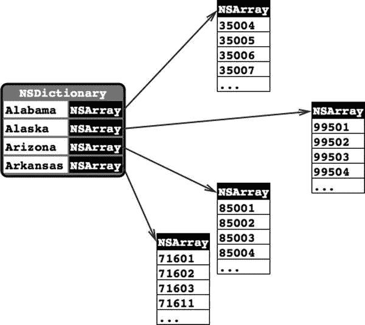

图 7-14。我们应用程序的数据。每个州在字典中都有一个条目，州名作为键。该键下存储的是一个包含该州所有邮政编码的 `NSArray` 实例

将以下代码添加到你的 `DependentComponentPickerViewController.h` 文件中：

```objc
#import <UIKit/UIKit.h>

@interface DependentComponentPickerViewController : UIViewController
<UIPickerViewDelegate, UIPickerViewDataSource>

@end
```

接着，将以下内容添加到 `DependentComponentPickerViewController.m` 中：

```objc
#import "DependentComponentPickerViewController.h"

#define kStateComponent 0
#define kZipComponent   1

@interface DependentComponentPickerViewController ()

@property (strong, nonatomic) NSDictionary *stateZips;
@property (strong, nonatomic) NSArray *states;
@property (strong, nonatomic) NSArray *zips;

@end
```

现在是时候构建内容视图了。这个过程与我们之前构建的两个组件视图几乎相同。如果你遇到困难，请翻回单组件选择器的“构建视图”部分，并按照分步说明操作。提示：首先打开 `Main.storyboard`，找到 `DependentComponentPickerViewController` 类的视图控制器，然后重复本章中所有其他内容视图的基本步骤。最后，你应该得到一个名为 `dependentPicker` 的出口属性，连接到选择器；一个空的 `buttonPressed:` 方法连接到按钮；以及选择器的 `delegate` 和 `dataSource` 属性都连接到视图控制器。别忘了为两个视图添加自动布局约束！完成后，保存故事板。

好的，这是根据您的要求排版后的 Markdown 文档。

好的，深呼吸一下。让我们来实现这个控制器类。这个实现起初看起来可能有点棘手。通过让一个组件依赖于另一个组件，我们为控制器类增加了一个全新的复杂性层级。尽管选择器一次只显示两个列表，但我们的控制器类必须了解并管理 51 个列表。我们这里将要使用的技术实际上简化了这一过程。数据源方法与我们在 `DoublePickerViewController` 中实现的方法看起来几乎相同。所有额外的复杂性都在别处处理，位于 `viewDidLoad` 和一个名为 `pickerView:didSelectRow:inComponent:` 的新委托方法之间。

在我们编写代码之前，我们需要一些要显示的数据。到目前为止，我们都是通过指定字符串列表在代码中创建数组。因为我们不想让你需要输入几千个值，并且因为我们认为应该向你展示正确的做法，所以我们打算从属性列表中加载数据。如前所述，`NSArray` 和 `NSDictionary` 对象都可以从属性列表创建。我们在项目归档的 *07 – Picker Data* 文件夹下，包含了一个名为 `statedictionary.plist` 的属性列表。

将该文件拖拽到 Xcode 项目的 *Pickers* 文件夹中。如果单击项目导航器中的 `.plist` 文件，你可以查看甚至编辑其包含的数据（参见图 7-15）。

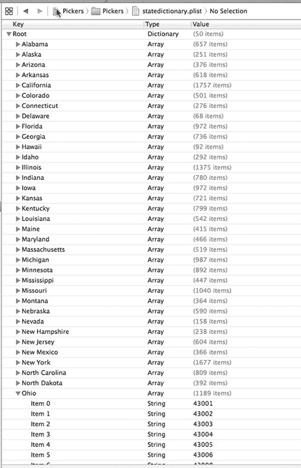

图 7-15. statedictionary.plist 文件，展示了我们的州列表。在俄亥俄州内，你可以看到邮政编码列表的开头

现在，让我们写一些代码。在 `DependentComponentPickerViewController.m` 中，我们首先向你展示一些需要实现的完整方法，然后我们会将其分解成更易于理解的部分。从实现 `buttonPressed:` 开始：

```
- (IBAction)buttonPressed:(id)sender {
    NSInteger stateRow =  [self.dependentPicker
                             selectedRowInComponent:kStateComponent];
    NSInteger zipRow =  [self.dependentPicker
                            selectedRowInComponent:kZipComponent];

    NSString *state =  self.states[stateRow];
    NSString *zip =  self.zips[zipRow];

    NSString *title =  [[NSString alloc] initWithFormat:
                           @"You selected zip code %@.", zip];
    NSString *message =  [[NSString alloc] initWithFormat:
                             @"%@ is in %@", zip, state];

    UIAlertController *alert =
        [UIAlertController alertControllerWithTitle:title
                       message:message
                       preferredStyle:UIAlertControllerStyleAlert];
    UIAlertAction *action = [UIAlertAction actionWithTitle:@"OK"
                           style:UIAlertActionStyleDefault handler:nil];
    [alert addAction:action];
    [self presentViewController:alert animated:YES completion:nil];
}
```

接下来，将以下代码添加到现有的 `viewDidLoad` 方法中：

```
- (void)viewDidLoad {
    [super viewDidLoad];
    // 从 nib 加载视图后进行任何额外的设置。
    NSBundle *bundle = [NSBundle mainBundle];
    NSURL *plistURL = [bundle URLForResource:@"statedictionary"
                               withExtension:@"plist"];

    self.stateZips = [NSDictionary
                          dictionaryWithContentsOfURL:plistURL];

    NSArray *allStates = [self.stateZips allKeys];
    NSArray *sortedStates = [allStates sortedArrayUsingSelector:
                           @selector(compare:)];
    self.states = sortedStates;

    NSString *selectedState = self.states[0];
    self.zips = self.stateZips[selectedState];
}
```

最后，在文件底部添加委托和数据源方法：

```
#pragma mark -
#pragma mark Picker 数据源方法
- (NSInteger)numberOfComponentsInPickerView:(UIPickerView *)pickerView {
    return 2;
}

- (NSInteger)pickerView:(UIPickerView *)pickerView
           numberOfRowsInComponent:(NSInteger)component {
    if (component == kStateComponent) {
        return [self.states count];
    } else {
        return [self.zips count];
    }
}

#pragma mark Picker 委托方法
- (NSString *)pickerView:(UIPickerView *)pickerView
             titleForRow:(NSInteger)row
            forComponent:(NSInteger)component {
    if (component == kStateComponent) {
        return self.states[row];
    } else {
        return self.zips[row];
    }
}

- (void)pickerView:(UIPickerView *)pickerView
      didSelectRow:(NSInteger)row
       inComponent:(NSInteger)component {
    if (component == kStateComponent) {
        NSString *selectedState = self.states[row];
        self.zips = self.stateZips[selectedState];
        [self.dependentPicker reloadComponent:kZipComponent];
        [self.dependentPicker selectRow:0
                            inComponent:kZipComponent
                               animated:YES];
    }
}

@end
```

没有必要讨论 `buttonPressed:` 方法，因为它与之前的方法基本相同。然而，我们*应该*讨论一下 `viewDidLoad` 方法。这里面有些东西你需要理解，所以搬把椅子，我们来聊聊。

在这个新的 `viewDidLoad` 方法中，我们做的第一件事是获取应用程序主 bundle 的引用：

```
NSBundle *bundle = [NSBundle mainBundle];
```

你问什么是 bundle？嗯，bundle 只是一种特殊类型的文件夹，其内容遵循特定的结构。应用程序和框架都是 bundle，这个调用返回一个代表我们应用程序的 bundle 对象。

`NSBundle` 的主要用途之一是访问你添加到项目 *Resources* 文件夹中的资源。当你构建应用程序时，这些文件会被复制到应用程序的 bundle 中。我们在项目中添加过像图片这样的资源；但到目前为止，我们只在 Interface Builder 中使用过它们。如果我们想在代码中访问这些资源，通常需要使用 `NSBundle`。我们使用 main bundle 来检索我们感兴趣的资源的 URL：

```
NSURL *plistURL = [bundle URLForResource:@"statedictionary"
                           withExtension:@"plist"];
```

这将返回一个包含 `statedictionary.plist` 文件位置的 URL。然后我们可以使用该 URL 创建一个 `NSDictionary` 对象。一旦我们这样做，属性列表的整个内容将被加载到新创建的 `NSDictionary` 对象中；也就是说，它被赋值给 `stateZips`：

```
self.stateZips = [NSDictionary
                  dictionaryWithContentsOfURL:plistURL];
```

我们刚刚加载的字典使用州名作为键，并将包含该州所有邮政编码的 `NSArray` 作为值。为了填充左侧组件（州选择器）的数组，我们从字典中获取所有键的列表，并将其分配给 `states` 数组。不过，在分配之前，我们按字母顺序对其进行了排序：

```
NSArray *allStates = [self.stateZips allKeys];
NSArray *sortedStates = [allStates sortedArrayUsingSelector:
                   @selector(compare:)];
self.states = sortedStates;
```

除非我们专门将选择设置为另一个值，否则选择器默认选中第一行（第 0 行）。为了获取对应于 `states` 数组第一行的 `zips` 数组，我们从 `states` 数组中获取索引为 0 的对象。这将返回启动时将选中的州名。然后我们使用该州名来获取该州的邮政编码数组，并将其赋值给 `zips` 数组，该数组将用于为右侧组件（邮编选择器）提供数据：

```
NSString *selectedState = self.states[0];
self.zips = self.stateZips[selectedState];
```


这两个数据源方法与前一个版本几乎完全相同，我们返回适当数组中的行数。我们实现的第一个委托方法也是如此。第二个委托方法是新增的，也是奇迹发生的地方：

```
- (void)pickerView:(UIPickerView *)pickerView
      didSelectRow:(NSInteger)row
      inComponent:(NSInteger)component {
    if (component == kStateComponent) {
        NSString *selectedState = self.states[row];
        self.zips = self.stateZips[selectedState];
        [self.dependentPicker reloadComponent:kZipComponent];
        [self.dependentPicker selectRow:0
                            inComponent:kZipComponent
                               animated:YES];
    }
}
```

在这个方法中（每当选择器的选择发生变化时都会调用），我们检查组件，看看左侧组件是否发生了变化。如果发生了变化，我们就获取与新选择对应的数组，并将其赋值给 `zips` 数组。接下来，我们将右侧组件重置为第一行，并告诉它重新加载自身。通过每当州改变时交换 `zips` 数组，其余代码与 `DoublePicker` 示例中的代码基本保持不变。

我们还没有完全完成。编译并运行你的应用程序，然后查看**依赖**选项卡（见图 7-16）。你看到什么不喜欢的地方了吗？

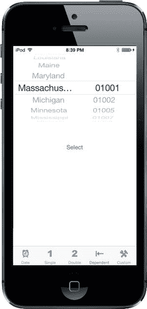

图 7-16。我们真的希望两个组件大小相等吗？注意长州名被截断的情况。

两个组件的大小相等。即使邮政编码永远不会超过五个字符，它也被赋予了与州同等的地位。由于像密西西比州和马萨诸塞州这样的州名在 iPhone 4s、iPhone 5 和 iPhone 5s 屏幕的一半选择器上无法完全显示，这似乎不太理想。幸运的是，我们可以实现另一个委托方法来指示每个组件的宽度。将以下方法添加到 `DependentComponentPickerViewController.m` 的委托部分：

```
- (CGFloat)pickerView:(UIPickerView *)pickerView
           widthForComponent:(NSInteger)component {
    CGFloat pickerWidth = pickerView.bounds.size.width;
    if (component == kZipComponent) {
        return pickerWidth/3;
    } else {
        return 2 * pickerWidth/3;
    }
}
```

在这个方法中，我们返回一个数字，表示每个组件应占多少像素宽度，选择器会尽力适应这个设置。我们选择将可用宽度的三分之二分配给州组件，其余部分给邮政编码组件。可以尝试使用其他值，看看修改这些值时组件之间空间分布如何变化。保存、编译并运行，**依赖**选项卡上的选择器将看起来更像图 7-5 中所示。

至此，你应该对选择器和选项卡栏应用程序感到相当得心应手了。我们还有一件事要向你展示关于选择器的内容，而且我们打算在这个过程中找点乐子。让我们创建一个简单的老虎机游戏。

## 使用自定义选择器创建简单游戏

接下来，我们将创建一个真正能工作的老虎机。好吧，它不会吐出银币，但看起来确实很酷。在继续之前，请回顾一下 图 7-6，这样你就知道我们在构建什么了。

### 编写控制器头文件

首先将以下代码添加到 `CustomPickerViewController.h`：

```
#import <UIKit/UIKit.h>

@interface CustomPickerViewController : UIViewController
<UIPickerViewDataSource, UIPickerViewDelegate>

@end
```

接下来，切换到 `CustomPickerViewController.m` 并在文件顶部附近的类扩展中添加以下属性：

```
#import "CustomPickerViewController.h"

@interface CustomPickerViewController ()
```


```objc
@property (strong, nonatomic) NSArray *images;

@end
```

至此，我们仅为该类添加了一个用于持有 `NSArray` 对象的属性，该数组将存放老虎机转轮符号对应的图片。其余部分稍后补充。

### 构建视图

尽管图 7-6 中的选择器看起来比我们之前构建的其他选择器花哨得多，但在 nib 文件的设计方式上其实差别很小。所有额外的工作都是在控制器的代理方法中完成的。

请确保已保存新编写的源代码，然后在项目导航器中选择 *Main.storyboard*，并选中 **Custom Scene** 以编辑图形用户界面。添加一个选择器视图（picker view）、其下方的一个标签（label）以及标签下方的一个按钮。将按钮的标题设置为 *Spin*。

选中标签后，调出属性检查器（Attributes Inspector）。将 **Alignment**（对齐方式）设为居中。然后点击 **Text Color**（文本颜色），将颜色设置为亮色。接着，让文本稍微变大一些。在检查器中找到 **Font**（字体）设置，点击其内部的图标（看起来像一个内含字母 T 的小方框）以弹出字体选择器。该控件允许你按需从设备的标准系统字体切换为其他字体，或仅更改字号。现在，将字号改为 *48*，并删除单词 *Label*，因为我们希望在用户首次获胜后才显示文本。

现在，添加自动布局（Auto Layout）约束，使标签和按钮在水平方向上居中，并固定它们之间以及标签与选择器之间的垂直间距。你可能会发现，在添加自动布局约束时，从文档大纲（Document Outline）中拖拽标签最为简便，因为故事板上的标签是空的，非常难以定位！

之后，建立所有到输出口（outlet）和操作（action）的连接。创建一个名为 `picker` 的新输出口，将视图控制器连接到选择器视图；再创建一个名为 `winLabel` 的输出口，将视图控制器连接到标签。再次提醒，使用文档大纲中的标签会比故事板上的标签更方便。接着，将按钮的“Touch Up Inside”事件连接到一个名为 `spin:` 的新操作方法。然后，确保连接选择器的 **delegate**（代理）和 **data source**（数据源）。

哦，还有一件额外的事情需要完成。选中选择器并调出属性检查器。你需要在 **View**（视图）设置中，取消勾选标记为 **User Interaction Enabled**（允许用户交互）的复选框，以防止用户手动更改转盘作弊。完成所有这些操作后，保存对故事板所做的更改。

### iOS 设备支持的字体

在 Interface Builder 中使用字体面板设计 iOS 界面时需谨慎。属性检查器的字体选择器允许你从多种字体中分配，但并非所有 iOS 设备都拥有相同的可用字体集。例如，在撰写本文时，有些字体在 iPad 上可用，但在 iPhone 或 iPod touch 上却没有。你应该将字体选择限制在目标 iOS 设备所支持的字体族之一。Jeff LaMarche 出色的 iOS 博客上的这篇文章展示了如何通过编程方式获取此列表：`http://iphonedevelopment.blogspot.com/2010/08/fonts-and-font-families.html`。

简而言之，创建一个基于视图的应用程序（view-based application），并在应用程序代理的 `application:didFinishLaunchingWithOptions:` 方法中添加以下代码：

```objc
for (NSString *family in [UIFont familyNames]) {
   NSLog(@"%@", family);
   for (NSString *font in [UIFont fontNamesForFamilyName:family]) {
       NSLog(@"\t%@", font);
   }
}
```

在相应的模拟器中运行该项目，字体将显示在项目的控制台日志中。

### 实现控制器

在此控制器的实现中，我们将涉及许多新内容。选择 *CustomPickerViewController.m* 文件，并开始填充 `spin:` 方法的内容：


```objc
- (IBAction)spin:(id)sender {
    BOOL win = NO;
    int numInRow = 1;
    int lastVal = -1;
    for (int i = 0; i < 5; i++) {
        int newValue = arc4random_uniform((uint)[self.images count]);

        if (newValue == lastVal) {
            numInRow++;
        } else {
            numInRow = 1;
        }
        lastVal = newValue;

        [self.picker selectRow:newValue inComponent:i animated:YES];
        [self.picker reloadComponent:i];
        if (numInRow >= 3) {
            win = YES;
        }
    }
    if (win) {
        self.winLabel.text = @"WINNER!";
    } else {
        self.winLabel.text = @" "; // 注意引号之间的空格
    }
}
```

接下来，将以下代码插入到 `viewDidLoad` 方法中：

```objc
- (void)viewDidLoad {
    [super viewDidLoad];
    // 视图加载后的其他设置
    self.images = @[[UIImage imageNamed:@"seven"],
                    [UIImage imageNamed:@"bar"],
                    [UIImage imageNamed:@"crown"],
                    [UIImage imageNamed:@"cherry"],
                    [UIImage imageNamed:@"lemon"],
                    [UIImage imageNamed:@"apple"]];
    self.winLabel.text = @" "; // 注意引号之间的空格
}
```

最后，在文件末尾的最终 `@end` 行之前添加以下代码：

```objc
#pragma mark -
#pragma mark Picker 数据源方法
- (NSInteger)numberOfComponentsInPickerView:(UIPickerView *)pickerView {
    return 5;
}

- (NSInteger)pickerView:(UIPickerView *)pickerView
       numberOfRowsInComponent:(NSInteger)component {
    return [self.images count];
}

#pragma mark Picker 代理方法
- (UIView *)pickerView:(UIPickerView *)pickerView
        viewForRow:(NSInteger)row
      forComponent:(NSInteger)component reusingView:(UIView *)view {
    UIImage *image = self.images[row];
    UIImageView *imageView = [[UIImageView alloc] initWithImage:image];
    return imageView;
}

- (CGFloat)pickerView:(UIPickerView *)pickerView
    rowHeightForComponent:(NSInteger)component {
    return 64;
}

@end
```

这里的内容真不少，对吧？让我们逐一分析新增的部分。

### spin 方法

当用户点击**Spin**按钮时，`spin`方法会被触发。首先，我们声明了一些变量来跟踪用户是否获胜。使用 `win` 来记录是否连续出现三个相同图案，设为 `YES` 表示获胜。使用 `numInRow` 来记录当前连续相同值的数量，并使用 `lastVal` 来跟踪上一个组件的值，以便将当前值与之前的值进行比较。我们将 `lastVal` 初始化为 `-1`，因为已知这个值不会与任何实际值匹配：

```objc
BOOL win = NO;
int numInRow = 1;
int lastVal = -1;
```

接着，我们循环遍历全部五个组件，并为每个组件设置一个随机生成的新行索引。通过 `images` 数组获取元素数量来完成此操作，这是一种快捷方式，因为我们知道五列都使用相同数量的图像：

```objc
for (int i = 0; i < 5; i++) {
    int newValue = arc4random_uniform((uint)[self.images count])
```

我们将新值与之前的值进行比较，如果匹配则递增 `numInRow`。如果值不匹配，则将 `numInRow` 重置为 `1`。然后将新值赋给 `lastVal`，以便在下一次循环中进行比较：

```objc
if (newValue == lastVal) {
    numInRow++;
} else {
    numInRow = 1;
}
lastVal = newValue;
```

之后，将对应的组件设置为新值，并启用动画效果，同时通知选择器重新加载该组件：

```objc
[self.picker selectRow:newValue inComponent:i animated:YES];
[self.picker reloadComponent:i];
```

每次循环最后，检查是否连续出现三个相同值，如果是则将 `win` 设为 `YES`：

```objc
if (numInRow >= 3) {
    win = YES;
}
```

循环结束后，设置标签以显示旋转结果是否获胜：

```objc
if (win) {
    self.winLabel.text = @"WINNER!";
} else {
    self.winLabel.text = @" "; // 注意引号之间的空格
}
```

### viewDidLoad 方法

回顾我们在此添加的内容，首先加载了六张不同的图片，它们是在本章开头添加到 *Images.xcassets* 中的。我们使用了 `UIImage` 类的 `imageNamed:` 便捷方法来完成加载：

```objc
self.images = @[[UIImage imageNamed:@"seven"],
[UIImage imageNamed:@"bar"], [UIImage imageNamed:@"crown"],
[UIImage imageNamed:@"cherry"], [UIImage imageNamed:@"lemon"],
[UIImage imageNamed:@"apple"]];
```

在该方法中最后要做的是确保标签中恰好包含一个空格。我们希望标签显示为空白，但如果真正设为空字符串，它会折叠成零高度。通过包含一个空格，可以确保标签以正确的高度显示：

```objc
self.winLabel.text = @" "; // 注意引号之间的空格
```

这很简单，对吧？但是，嗯，那六张图片要怎么用呢？如果你向下滚动刚才输入的代码，会看到两个数据源方法看起来和之前几乎一样；然而，进一步查看代理方法，会发现我们使用了一个完全不同的代理方法来向选择器提供数据。之前使用的方法返回的是 `NSString *`，而这次的方法返回的是 `UIView *`。

通过使用此方法，我们可以向选择器提供任何能绘制到 `UIView` 中的内容。当然，考虑到选择器的大小限制，在此类操作中存在一定限制，既要功能正常又要外观美观。但这种方法在我们显示的内容上提供了更多自由度，尽管需要多做一些工作：

```objc
- (UIView *)pickerView:(UIPickerView *)pickerView
        viewForRow:(NSInteger)row
      forComponent:(NSInteger)component reusingView:(UIView *)view {
    UIImage *image = self.images[row];
    UIImageView *imageView = [[UIImageView alloc] initWithImage:image];
    return imageView;
}
```

此方法返回一个 `UIImageView` 对象，该对象使用符号对应的图片之一进行初始化。为此，我们首先获取行对应的符号图片。然后，创建并返回一个使用该符号的图片视图。对于比单张图片更复杂的视图，最好先创建所有需要的视图（例如，在`viewDidLoad`中），然后在请求时将这些预创建的视图返回给选择器视图。但对我们这个简单的例子来说，即时创建所需的视图效果很好。

哇，深吸一口气。你已经完整地完成了所有内容，现在可以实际运行看看效果了。所以，构建并运行应用程序，享受其中的乐趣吧！

### 最终细节

我们的游戏相当有趣，尤其是考虑到构建它花费的精力很少。现在让我们通过一些微调来改进它。目前这个游戏有两个问题让我们很在意：

- 它实在太安静了。老虎机可不会这么安静！
- 在转盘完成旋转之前它就告诉我们获胜了，虽然是个小问题，但确实消除了期待的悬念。要看到这个效果，请再次运行你的应用程序。虽然很细微，但标签确实在转轮停止旋转前就出现了。

本书附带项目归档中的 *07 - Picker Sounds* 文件夹包含两个声音文件：*crunch.wav* 和 *win.wav*。将这两个文件拖到项目的 *Pickers* 文件夹中。当用户点击 **Spin** 按钮以及获胜时，我们将播放这些音效。

为了处理声音，我们需要访问 iOS 音频工具箱类。在 *CustomPickerViewController.m* 顶部现有的 `#import` 行上方插入以下加粗显示的行：

```objc
#import <AudioToolbox/AudioToolbox.h>
#import "CustomPickerViewController.h"
```


接下来，我们需要添加一个指向按钮的插座（`outlet`）。在转轮旋转期间，我们将隐藏该按钮。我们不希望用户在当前的旋转完成之前再次点击按钮。将以下加粗的代码行添加到`CustomPickerViewController.m`中：

```
@interface CustomPickerViewController ()

@property (strong, nonatomic) NSArray *images;
@property (weak, nonatomic) IBOutlet UIPickerView *picker;
@property (weak, nonatomic) IBOutlet UILabel *winLabel;
@property (weak, nonatomic) IBOutlet UIButton *button;

@end
```

输入并保存文件后，点击`Main.storyboard`来编辑图形用户界面。打开后，在文档大纲中，从**Custom Scene**下方的**Custom**图标按住 Control 键拖拽到**Spin**按钮，并将其连接到我们刚刚创建的`button`插座。保存故事板。

现在，我们需要在控制器类的实现中完成几件事。首先，需要一些实例变量来保存已加载音效的引用。打开`CustomPickerViewController.m`并添加以下新属性：

```
@interface CustomPickerViewController ()

@property (strong, nonatomic) NSArray *images;
@property (weak, nonatomic) IBOutlet UIPickerView *picker;
@property (weak, nonatomic) IBOutlet UILabel *winLabel;
@property (weak, nonatomic) IBOutlet UIButton *button;
@property (assign, nonatomic) SystemSoundID winSoundID;
@property (assign, nonatomic) SystemSoundID crunchSoundID;

@end
```

我们还需要向控制器类中添加几个方法。将以下两个方法添加到`CustomPickerViewController.m`中：

```
- (void)showButton {
    self.button.hidden = NO;
}

- (void)playWinSound {
    if (_winSoundID == 0) {
        NSURL *soundURL = [[NSBundle mainBundle] URLForResource:@"win"
                                                  withExtension:@"wav"];
        AudioServicesCreateSystemSoundID((__bridge CFURLRef)soundURL,
                                         &_winSoundID);
    }
    AudioServicesPlaySystemSound(_winSoundID);
    self.winLabel.text = @"WINNER!";
    [self performSelector:@selector(showButton)
               withObject:nil
               afterDelay:1.5];
}
```

第一个方法用于显示按钮。如前所述，当用户点击按钮时，我们会将其隐藏，因为如果转轮已经在旋转，就没有必要让用户再次旋转，直到旋转停止。

第二个方法将在用户获胜时被调用。首先，我们检查是否已经加载了获胜音效。属性初始化为零，而已加载音效的有效标识符不为零，因此我们可以通过比较标识符与零来检查音效是否已加载。要加载音效，我们首先向主包请求名为`win.wav`的音效路径，就像加载依赖选择器视图的属性列表时一样。获取到该资源的路径后，接下来的三行代码加载并播放音效文件。接着，我们将标签设置为`WINNER!`，并调用`showButton`方法；然而，我们是通过一个名为`performSelector:withObject:afterDelay:`的方法以特殊方式调用`showButton`。这是一个所有对象都能使用的非常便捷的方法。它允许你在未来的某个时刻调用方法——本例中是 1.5 秒之后，这将在告知用户结果之前，给转盘足够的时间旋转到最终位置。

**注意**：你可能注意到了我们调用`AudioServicesCreateSystemSoundID`函数的方式有些特别。该函数将 URL 作为其第一个参数，但它期望的并不是`NSURL`的实例，而是一个`CFURLRef`结构体。Apple 通过 Core Foundation 框架为许多常见组件（如 URL、数组、字符串等）提供了 C 语言接口。这使得即便是完全用 C 语言编写的应用程序，也能访问到我们通常从 Objective-C 中使用的功能。有趣的是，这些 C 组件与它们的 Objective-C 对应组件是“桥接”的，例如`CFURLRef`在功能上等同于`NSURL`指针。这意味着某些在 Objective-C 中创建的对象可以跨过桥接使用 C API，反之亦然。这通过在变量名前加上括号，并在括号中指定你希望变量被解释的类型来实现。从 iOS 5 开始，在使用 ARC 时，类型名本身必须加上关键字`__bridge`，这为 ARC 提供了关于该 Objective-C 对象传入 C API 调用时应如何处理的关键提示。

我们还需要对`spin:`方法进行一些修改。我们将编写代码来播放音效，并在玩家获胜时调用`playWinSound`方法。现在对`spin:`方法进行以下修改：

```
- (IBAction)spin:(id)sender {
    BOOL win = NO;
    int numInRow = 1;
    int lastVal = -1;
    for (int i = 0; i < 5; i++) {
        int newValue = random() % [self.images count];

if (newValue == lastVal) {
            numInRow++;
        } else {
            numInRow = 1;
        }
        lastVal = newValue;

[self.picker selectRow:newValue inComponent:i animated:YES];
        [self.picker reloadComponent:i];
        if (numInRow >=3) {
            win = YES;
        }
    }
    if (_crunchSoundID == 0) {
        NSString *path = [[NSBundle mainBundle] pathForResource:@"crunch"
                                                         ofType:@"wav"];
        NSURL *soundURL = [NSURL fileURLWithPath:path];
        AudioServicesCreateSystemSoundID((__bridge CFURLRef)soundURL,
                                         &_crunchSoundID);
    }
    AudioServicesPlaySystemSound(_crunchSoundID);

if (win) {
        [self performSelector:@selector(playWinSound)
                   withObject:nil
                   afterDelay:.5];
    } else {
        [self performSelector:@selector(showButton)
                   withObject:nil
                   afterDelay:.5];
    }
    self.button.hidden = YES;
    self.winLabel.text = @" ";  // 注意引号之间的空格

if (win) {
        self.winLabel.text = @"WINNER!";
    } else {
        self.winLabel.text = @"";
    }
}
```

首先，如果必要的话，我们加载嘎吱音效，就像之前处理获胜音效一样。然后播放嘎吱音效，让玩家知道转轮已经开始旋转。接下来，我们不再在知道用户获胜时立刻将标签设置为`WINNER!`，而是采用了一个巧妙的做法。我们调用刚刚创建的两个方法之一，但通过`performSelector:afterDelay:`延时执行。如果用户获胜，我们在半秒后调用`playWinSound`方法，这会给转盘旋转到位留出时间；否则，我们只需等待半秒，然后重新启用**Spin**按钮。在等待结果期间，我们隐藏按钮并清除标签的文本。

现在完成了！点击 Xcode 的**Run**按钮，然后点击最后一个标签页来查看和收听这个老虎机的运行效果。点击**Spin**按钮应会播放轻微的嘎吱声，而获胜则应播放获胜音效。太棒了！

最终旋转


到目前为止，你应该已经熟悉了选项卡栏应用和选择器的使用。在本章中，我们从零开始构建了一个包含五种不同内容视图的完整选项卡栏应用。你学习了如何以多种不同配置使用选择器，如何创建包含多个组件的选择器，甚至如何让一个组件中的值依赖于另一个组件中选择的值。你还看到了如何让选择器显示图片而不仅仅是文字。

在此过程中，你了解了选择器的委托和数据源，并学习了如何加载图片、播放声音以及从属性列表创建字典。这一章内容很多，恭喜你坚持了下来！当你准备好开始学习表视图时，请翻到下一页，我们将继续前进。

## 第 8 章：表视图入门

在接下来的几章中，我们将构建一些基于层级导航的应用，类似于 iOS 设备上自带的“邮件”应用。这类应用通常称为主从应用，允许用户深入查看嵌套的数据列表，并对这些数据进行编辑。但在构建这类应用之前，你需要掌握表视图的概念。而这正是本章的目标。

表视图是向用户展示数据列表最常用的机制。它们是高度可配置的对象，几乎可以按照你想要的任何方式呈现。“邮件”应用使用表视图来显示账户、文件夹和消息的列表；然而，表视图并不仅限于展示文本数据。设置、音乐和时钟应用也使用了表视图，尽管这些应用的外观截然不同（参见图 8-1）。

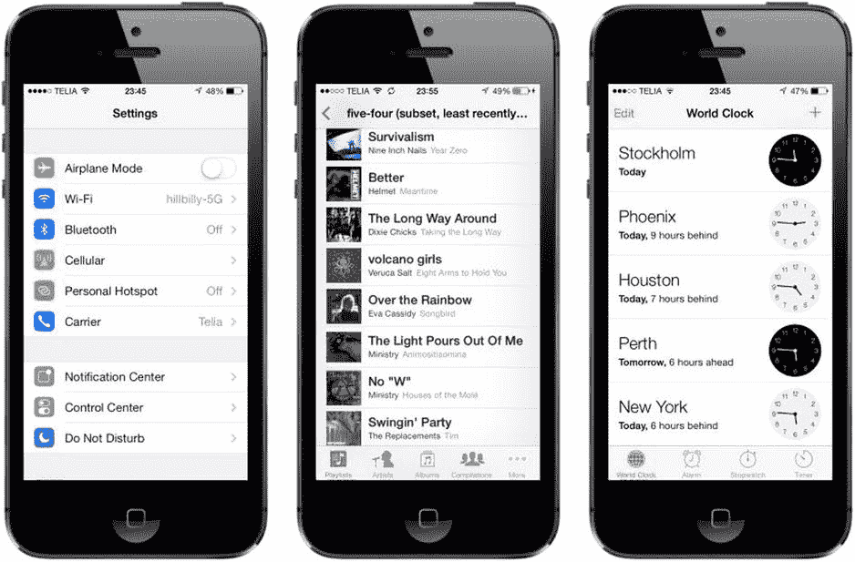

图 8-1。尽管外观不同，但设置、音乐和时钟应用都使用表视图来显示数据

## 表视图基础

表用于显示数据列表。表列表中的每一项都是一行。iOS 表可以有无限数量的行，仅受可用内存量的限制。iOS 表只能有一列宽。

### 表视图和表视图单元格

表视图是显示表数据的视图对象，是 `UITableView` 类的一个实例。表中的每一行可见行由 `UITableViewCell` 类的实例实现（参见图 8-2）。

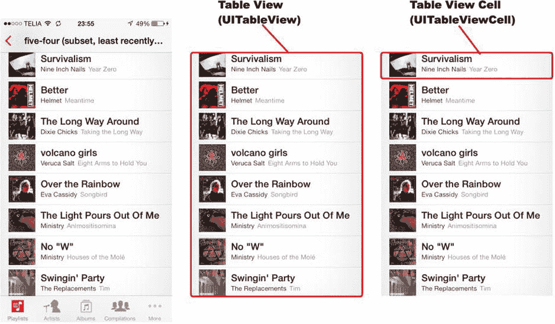

图 8-2。每个表视图是 `UITableView` 的实例，每个可见行是 `UITableViewCell` 的实例

表视图不负责存储表的数据。它们只存储足够绘制当前可见行的数据。表视图从符合 `UITableViewDelegate` 协议的对象获取其配置数据，并从符合 `UITableViewDataSource` 协议的对象获取其行数据。稍后在本章的示例程序中，你将看到这一切是如何工作的。

如前所述，所有表都实现为单列。图 8-1 右侧显示的时钟应用看似有两列，但实际上并非如此——表中的每一行都由一个 `UITableViewCell` 表示。默认情况下，`UITableViewCell` 对象可以配置为包含一张图片、一些文本和一个可选的附件图标（即右侧的小图标，我们将在下一章详细介绍附件图标）。

如果需要，你还可以通过向 `UITableViewCell` 添加子视图来在单元格中放入更多数据。这可以通过两种基本技术之一来实现：在创建单元格时通过编程方式添加子视图，或者从 storyboard 或 nib 文件加载它们。你可以以任何你喜欢的方式布局表视图单元格，并包含任何你想要的子视图。因此，单列的限制远没有听起来那么大。如果这让你感到困惑，别担心——我们会在本章中展示如何使用这两种技术。

### 分组表与平铺表

表视图有两种基本样式：

*   **分组**：分组表视图包含一个或多个行节。在每个节内，所有行紧密地排列在一起，形成一个漂亮的小组；但节与节之间有明显可见的间隙，如图 8-3 最左侧的图片所示。请注意，分组表可以只包含一个组。
*   **平铺**：平铺是默认样式。在这种样式中，节之间的间距稍小，并且每个节的标题可以选择自定义样式。当使用索引时，这种样式也称为索引表（参见图 8-3，右侧）。

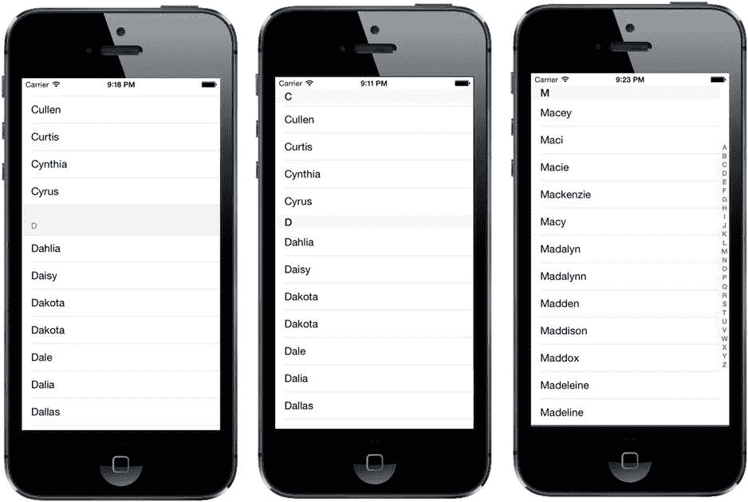

图 8-3。同一个表视图显示为分组表（左）；不带索引的平铺表（中）；带索引的平铺表，也称为索引表（右）

如果你的数据源提供了必要的信息，表视图将允许用户通过显示在右侧的索引来导航列表。

表中每个分区在数据源中被称为一个节。在分组表中，每个节在视觉上表现为一个组。在索引表中，每个按索引分组的数据就是一个节。例如，在图 8-3 所示的索引表中，所有以 *A* 开头的名称将构成一个节，以 *B* 开头的构成另一个节，以此类推。

**注意** 尽管在技术上可以为分组表创建索引，但你不应这样做。《iPhone 人机界面指南》明确说明，分组表不应提供索引。

## 实现一个简单的表

让我们来看一个最简单的表视图示例，以了解其工作原理。在这个示例中，我们将只展示一个文本值列表。

在 Xcode 中创建一个新项目。对于本章，我们将回到“Single View Application”模板，因此选择该模板。将你的项目命名为 *Simple Table*，将**语言**设置为 Objective-C，将**设备**字段设置为 *Universal*，并确保**使用 Core Data** 未被勾选。

### 设计视图

在项目导航器中，展开顶层的 *Simple Table* 项目和 *Simple Table* 文件夹。这个应用非常简单，我们不需要任何插座或动作。接着，选择 *Main.storyboard* 进行编辑。如果“View”窗口在布局区域中不可见，请在文档大纲中单击其图标以打开它。接下来，在对象库中找到表视图（参见图 8-4），并将其拖到“View”窗口上。

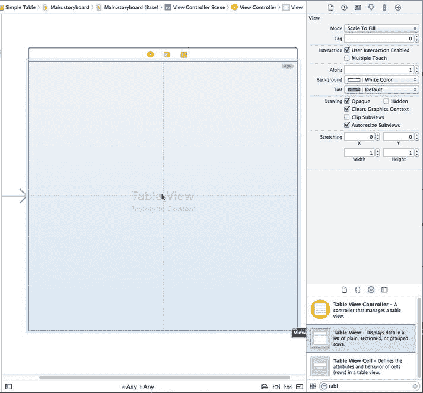

图 8-4。将表视图从库中拖拽到我们的主视图上。请注意，表视图会自动调整大小以填满整个视图


表格视图应自动根据视图的高度和宽度调整自身大小。这正是我们想要的效果。表格视图被设计为填充屏幕的整个宽度以及大部分高度——即除去应用导航栏、工具栏和标签栏后剩余的空间。将表格视图拖放到视图窗口（View window）中，并将其与父视图居中对齐。现在，我们来添加自动布局约束（Auto Layout constraints），以确保无论屏幕尺寸如何，表格视图都能正确定位和调整大小。在文档大纲（Document Outline）中选择该表格，然后点击故事板编辑器右下角的**固定**图标（见图 8-5）。

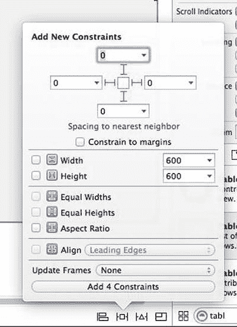

图 8-5。固定表格视图以使其适配屏幕

在弹出的窗口顶部，清除**约束到边距**复选框，点击所有四条虚线，并将四个输入框中的距离设置为零。这将使表格视图的四条边都固定到其父视图的对应边上。要应用这些约束，请将**更新框架**更改为*新约束的项目*，然后点击**添加 4 个约束**按钮。

再次在文档检查器（Document Inspector）中选择该表格视图，并按**6**打开连接检查器（Connections Inspector）。你会注意到，表格视图的前两个可用连接与我们上一章使用的选择器视图（picker views）的前两个连接相同：`dataSource` 和 `delegate`。从每个连接旁边的圆圈拖拽到文档大纲中的**视图控制器**图标或故事板编辑器中视图控制器上方。这使得我们的控制器类同时成为该表格的数据源和委托。

设置好连接后，保存你的故事板，准备深入编写一些 `UITableView` 代码。

### 编写控制器

下一步是控制器类的头文件。单击 `ViewController.m`，并在文件顶部添加以下代码：

```
#import "ViewController.h"

@interface ViewController () <UITableViewDataSource, UITableViewDelegate>

@property (copy, nonatomic) NSArray *dwarves;

@end

@implementation ViewController

- (void)viewDidLoad
{
    [super viewDidLoad];
    // 加载视图后执行任何额外设置，通常来自 nib 文件。
    self.dwarves = @[@"Sleepy", @"Sneezy", @"Bashful", @"Happy",
                     @"Doc", @"Grumpy", @"Dopey",
                     @"Thorin", @"Dorin", @"Nori", @"Ori",
                     @"Balin", @"Dwalin", @"Fili", @"Kili",
                     @"Oin", @"Gloin", @"Bifur", @"Bofur",
                     @"Bombur"];
}
```

接下来，在文件末尾添加以下代码：

```
- (NSInteger)tableView:(UITableView *)tableView
           numberOfRowsInSection:(NSInteger)section {
    return [self.dwarves count];
}

- (UITableViewCell *)tableView:(UITableView *)tableView
         cellForRowAtIndexPath:(NSIndexPath *)indexPath {
    static NSString *SimpleTableIdentifier = @"SimpleTableIdentifier";

UITableViewCell *cell = [tableView dequeueReusableCellWithIdentifier:
                                       SimpleTableIdentifier];
    if (cell == nil) {
        cell = [[UITableViewCell alloc]
                initWithStyle:UITableViewCellStyleDefault
                reuseIdentifier:SimpleTableIdentifier];
    }

cell.textLabel.text = self.dwarves[indexPath.row];
    return cell;
}

@end
```

首先，我们让类遵循了它作为表格视图委托和数据源所需的两个协议。然后，我们声明了一个数组，用于存放要显示的数据。最后，我们向控制器添加了三个方法。第一个方法 `viewDidLoad` 你应该很熟悉，因为我们之前做过类似的操作。我们只是简单地创建一个数据数组以在表格中显示。在实际应用中，这个数组可能来自其他来源，例如文本文件、属性列表或网络服务。

接着，我们添加了两个数据源方法。第一个方法 `tableView:numberOfRowsInSection: ` 被表格用来询问特定部分有多少行。正如你所料，默认的部分数量是 1，该方法会被调用来获取构成列表的这一部分的行数。我们只返回数组中的条目数量。

下一个方法可能需要一点解释，让我们更仔细地看一下：

```
- (UITableViewCell *)tableView:(UITableView *)tableView
       cellForRowAtIndexPath:(NSIndexPath *)indexPath
```

当表格视图需要绘制某一行时，会调用此方法。注意，该方法的第二个参数是一个 `NSIndexPath` 实例。`NSIndexPath` 是表格视图用来将部分（section）和行（row）索引封装到单个对象中的结构。要从 `NSIndexPath` 中获取行索引或部分索引，你只需访问其 `row` 属性或 `section` 属性，两者都返回一个整数值。

第一个参数 `tableView` 是对正在构建的表格的引用。这使我们能够创建可作为多个表格数据源的类。

接下来，我们声明了一个静态字符串实例：

```
static NSString *SimpleTableIdentifier = @"SimpleTableIdentifier";
```

这个字符串将作为键来表示我们表格单元格的类型。在这个例子中，表格只使用一种单元格类型，但在更复杂的表格中，你可能需要根据内容或位置格式化不同类型的单元格，在这种情况下，你会为每种不同的单元格类型使用一个单独的表格单元格标识符。

一个表格视图一次只能显示几行，但表格本身可能包含多得多的行。记住，表格中的每一行都由 `UITableViewCell` 的一个实例表示，`UITableViewCell` 是 `UIView` 的子类，这意味着每一行都可以包含子视图。对于一个大型表格，如果表格试图为每一行都保留一个表格视图单元格实例（无论该行当前是否正在显示），这可能会造成巨大的开销。幸运的是，表格并非如此工作。

相反，当表格视图单元格滚动出屏幕时，它们会被放入一个可重用的单元格队列中。如果系统内存不足，表格视图会丢弃队列中的单元格。但只要系统还有足够的内存来容纳这些单元格，它就会保留它们，以防你再次使用。

每当一个表格视图单元格滚动出屏幕时，很可能另一个单元格正好从另一边滚动到屏幕上。如果这个新行可以重用已经滚出屏幕的单元格，系统就能避免不断创建和释放这些视图所带来的开销。为了利用这个机制，我们将使用之前声明的 `NSString` 标识符，要求表格视图提供一个之前使用过的、指定类型的单元格。实际上，我们是在请求一个类型为 `SimpleTableIdentifier` 的可重用单元格：

```
UITableViewCell *cell = [tableView dequeueReusableCellWithIdentifier:
                                   SimpleTableIdentifier];
```


现在，表格视图完全有可能没有任何备用单元格（例如，在初始填充时），因此我们在调用后检查 `cell` 是否为 `nil`。如果是，我们手动使用该标识符字符串创建一个新的表格视图单元格。在某个时刻，我们不可避免地会重用这里创建的某个单元格，因此我们需要确保使用 `SimpleTableIdentifier` 来创建它：

```
if (cell == nil) {
    cell = [[UITableViewCell alloc]
            initWithStyle:UITableViewCellStyleDefault
            reuseIdentifier:SimpleTableIdentifier];
}
```

对 `UITableViewCellStyleDefault` 感到好奇？先别急。我们将在讨论表格视图单元格样式时介绍它。

现在我们有了一个表格视图单元格，可以返回给表格视图使用。所以，我们只需要将想要显示的信息放入这个单元格中。在表格行中显示文本是一项非常常见的任务，因此表格视图单元格提供了一个名为 `textLabel` 的 `UILabel` 属性，我们可以设置它来显示字符串。这只需要从我们的 `dwarves` 数组中获取正确的字符串，并用它来设置单元格的 `textLabel`。

然而，要获取正确的值，我们需要知道表格视图正在询问哪一行。我们可以从 `indexPath` 的 `row` 属性中获取该信息。我们使用表格的行号从数组中获取对应的字符串，将其赋值给单元格的 `textLabel.text` 属性，然后返回该单元格：

```
cell.textLabel.text = self.dwarves[indexPath.row];
return cell;
```

这并不难，对吧？

编译并运行你的应用程序，你应该会看到数组的值显示在表格视图中，如图 8-6 左侧所示。

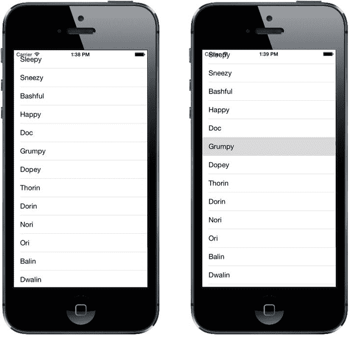

图 8-6。Simple Table 应用程序，尽显矮人风采

看起来不错，但有一个小问题——向上滚动表格一点，你会看到它的内容出现在状态栏后面，如图 8-6 右侧所示。这个问题是因为我们让表格视图填满了整个屏幕。有时这正是你想要的，但在这里，表格单元格中的文本与状态栏中的文本重叠，看起来很不美观，所以让我们修复它。我们只需更改将表格视图固定到屏幕顶部的约束，使其改为固定到状态栏底部。为此，在项目导航器中选择 `Main.storyboard`，并确保在文档大纲中选中了表格视图。抓住表格视图的顶部并向下拖动，直到看到状态栏下方出现一条蓝色参考线，如图 8-7 所示，然后松开。

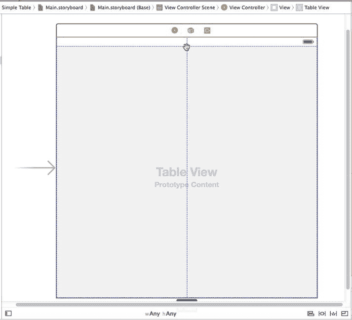

图 8-7。更改表格视图顶部的约束，使其不再延伸到状态栏后面

在仍选中表格视图的情况下，点击故事板编辑器右下角的**解决自动布局问题**按钮，然后点击**更新约束**，将顶部约束更改为与表格视图顶部的新位置匹配。现在再次运行应用程序，你会看到表格视图的内容不再滚动到状态栏下方。

### 添加图片

如果我们能为每一行添加一张图片，那就太好了。猜猜我们需要创建 `UITableViewCell` 的子类或添加子视图来实现？实际上，不，如果你能接受图片位于每行左侧，那么默认的表格视图单元格完全可以处理这种情况。让我们来看看。

将示例源代码存档中 `08 – Star Image` 文件夹中的 `star.png` 和 `star2.png` 文件拖到你的项目的 `Images.xcassets` 中。我们将安排这些图标出现在表格视图的每一行上。我们只需要为每个图标创建一个 `UIImage`，并在表格视图向其数据源请求每行的单元格时将其赋值给 `UITableViewCell`。为此，在文件 `ViewController.m` 中，将以下粗体代码添加到 `tableView:cellForRowAtIndexPath:` 方法中：

```
- (UITableViewCell *)tableView:(UITableView *)tableView
         cellForRowAtIndexPath:(NSIndexPath *)indexPath {
    static NSString *SimpleTableIdentifier = @"SimpleTableIdentifier";

    UITableViewCell *cell = [tableView dequeueReusableCellWithIdentifier:
                                       SimpleTableIdentifier];
    if (cell == nil) {
        cell = [[UITableViewCell alloc]
                initWithStyle:UITableViewCellStyleDefault
                reuseIdentifier:SimpleTableIdentifier];
    }

    UIImage *image = [UIImage imageNamed:@"star"];
    cell.imageView.image = image;
    UIImage *highlightedImage = [UIImage imageNamed:@"star2"];
    cell.imageView.highlightedImage = highlightedImage;

    cell.textLabel.text = self.dwarves[indexPath.row];
    return cell;
}
```

是的，就是这样。每个单元格都有一个 `imageView` 属性，类型为 `UIImage`，而它又具有名为 `image` 和 `highlightedImage` 的属性。`image` 属性提供的图片显示在单元格文本的左侧，如果提供了 `highlightedImage`，则在选中单元格时会被替换。你只需将单元格的 `imageView.image` 和 `imageView.highlightedImage` 属性设置为你想要显示的图片即可。

如果你现在编译并运行你的应用程序，你应该会得到一个列表，每行左侧都有一堆漂亮的蓝色小星星图标（参见图 8-8）。如果你选择任意一行，你会看到它的图标从蓝色变为绿色，这是 `star2.png` 文件中图片的颜色。当然，我们可以为表格中的每一行包含不同的图片，或者，只需很少的功夫，我们也可以为迪士尼先生的全部小矮人使用一个图标，而为托尔金先生的小矮人使用另一个不同的图标。

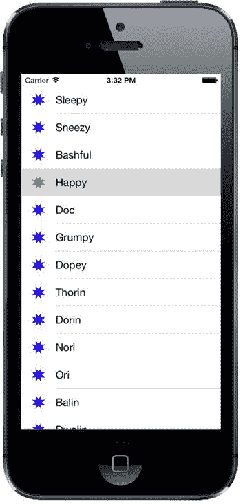

图 8-8。我们使用了单元格的 `imageView` 属性为表格视图的每个单元格添加了图片

**注意**：`UIImage` 使用基于文件名的缓存机制，因此每次调用 `imageNamed:` 时，它不会加载新的 `image` 属性。相反，它会使用已缓存的版本。

### 使用表格视图单元格样式

到目前为止，你在表格视图中所做的工作使用了默认的单元格样式，如图 8-8 所示，由常量 `UITableViewCellStyleDefault` 表示。但 `UITableViewCell` 类还包含其他几种预定义的单元格样式，让你可以轻松地为表格视图增加更多变化。这些单元格样式使用三种不同的单元格元素：

* **图片**：如果指定样式包含图片，则图片显示在单元格文本的左侧。
* **文本标签**：这是单元格的主要文本。在我们一直使用的 `UITableViewCellStyleDefault` 样式的情况下，文本标签是单元格中唯一显示的文本。
* **详细文本标签**：这是单元格的次要文本，通常用作说明性注释或标签。

为了看看这些新样式添加的效果，将以下代码添加到 `ViewController.m` 的 `tableView:cellForRowAtIndexPath:` 中：

```
- (UITableViewCell *)tableView:(UITableView *)tableView
         cellForRowAtIndexPath:(NSIndexPath *)indexPath
{
    static NSString *SimpleTableIdentifier = @"SimpleTableIdentifier";
```


```objc
UITableViewCell *cell = [tableView dequeueReusableCellWithIdentifier:SimpleTableIdentifier];
if (cell == nil) {
    cell = [[UITableViewCell alloc]
            initWithStyle:UITableViewCellStyleDefault
            reuseIdentifier:SimpleTableIdentifier];
}

UIImage *image = [UIImage imageNamed:@"star"];
cell.imageView.image = image;
UIImage *highlightedImage = [UIImage imageNamed:@"star2"];
cell.imageView.highlightedImage = highlightedImage;

cell.textLabel.text = self.dwarves[indexPath.row];

if (indexPath.row < 7) {
    cell.detailTextLabel.text = @"Mr. Disney";
} else {
    cell.detailTextLabel.text = @"Mr. Tolkien";
}
return cell;
```

我们在这里所做的只是设置了单元格的详细文本。对于前七行，我们使用字符串 `@"Mr. Disney"`，其余行则使用字符串 `@"Mr. Tolkien"`。当你运行这段代码时，每个单元格的外观将与此前完全相同（参见图 8-9）。这是因为我们使用的是 `UITableViewCellStyleDefault` 样式，该样式不使用详细文本。

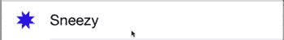

图 8-9. 默认单元格样式将图像和文本标签显示在一条直线上

现在，将 `UITableViewCellStyleDefault` 改为 `UITableViewCellStyleSubtitle`，如下所示：

```objc
if (cell == nil) {
    cell = [[UITableViewCell alloc]
            initWithStyle:UITableViewCellStyleSubtitle
            reuseIdentifier:SimpleTableIdentifier];
}
```

现在重新运行应用程序。使用副标题样式后，两个文本元素会上下堆叠显示（参见图 8-10）。

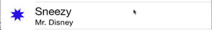

图 8-10. 副标题样式将详细文本以更小的灰色字体显示在文本标签下方

接下来，将 `UITableViewCellStyleSubtitle` 改为 `UITableViewCellStyleValue1`，然后构建并再次运行。此样式将文本标签和详细文本标签放在同一行，但位于单元格的两侧（参见图 8-11）。

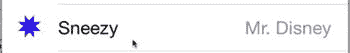

图 8-11. 样式 value 1 将文本标签以黑色字体放在左侧，详细文本以蓝色字体右对齐放在右侧

最后，将 `UITableViewCellStyleValue1` 改为 `UITableViewCellStyleValue2`。这种格式通常用于在显示信息的同时附带描述性标签。它不会显示单元格的图标，而是将详细文本标签放在文本标签的左侧（参见图 8-12）。在这种布局中，详细文本标签充当描述文本标签所持有数据类型的标签。

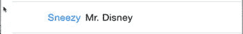

图 8-12. 样式 value 2 不显示图像，并将详细文本标签以蓝色字体放在文本标签左侧

现在你已经了解了可用的单元格样式，在继续之前，请将样式改回 `UITableViewCellStyleDefault`。在本章后面，你将学习如何创建自定义表格视图单元格。但在那之前，请务必考虑现有的单元格样式，看看其中是否有符合你需求的样式。

你可能已经注意到，我们将控制器同时设为了此表格视图的数据源和委托；但截至目前，我们实际上还没有实现 `UITableViewDelegate` 协议中的任何方法。与选择器视图不同，较简单的表格视图不需要使用委托来执行其功能。数据源提供了绘制表格所需的全部数据。委托的用途是配置表格视图的外观并处理特定的用户交互。现在，让我们来看几个配置选项。我们将在下一章中讨论更多内容。

#### 设置缩进级别

委托可用于指定某些行应缩进。在文件 `ViewController.m` 中，在 `@end` 声明之前添加以下方法：

```objc
- (NSInteger)tableView:(UITableView *)tableView
indentationLevelForRowAtIndexPath:(NSIndexPath *)indexPath {
    return indexPath.row % 4;
}
```

此方法根据行号设置每行的**缩进级别**；因此，第 0 行的缩进级别为 0，第 1 行的缩进级别为 1，以此类推。由于使用了 `%` 运算符，第 4 行将回到缩进级别 0，然后循环往复。缩进级别只是一个整数，它告诉表格视图将该行向右移动一点。数字越大，行向右缩进得越多。例如，你可以使用这种技术来指示某一行从属于另一行，就像邮件应用在表示子文件夹时那样。

再次运行应用程序时，你会看到行以四个为一组进行缩进，如图 8-13 所示。

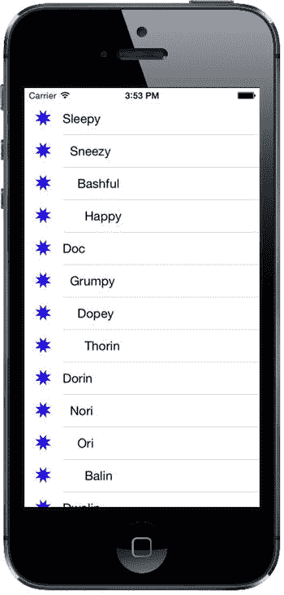

图 8-13. 缩进的表格行

#### 处理行选择

表格的委托有两个方法用于处理行选择。一个方法在行被选中之前调用，可用于阻止行被选中，甚至更改将要被选中的行。让我们实现该方法，并指定第一行不可选。在 `ViewController.m` 的末尾，`@end` 声明之前添加以下方法：

```objc
- (NSIndexPath *)tableView:(UITableView *)tableView
           willSelectRowAtIndexPath:(NSIndexPath *)indexPath {
    if (indexPath.row == 0) {
        return nil;
    } else {
        return indexPath;
    }
}
```

此方法接收一个表示即将被选中项的 `indexPath`。我们的代码检查即将选中的是哪一行，如果是第一行（始终为索引 0），则返回 `nil`，表示实际上不应选择任何行。否则，它返回未经修改的 `indexPath`，以此表示允许继续选择。

在编译和运行之前，让我们也实现行被选中后调用的委托方法，这通常是实际处理选择的地方。在下一章中，我们将使用此方法处理主从应用程序中的下钻操作，但在本章中，我们只会弹出一个警告来显示行已被选中。再次在 `ViewController.m` 的底部，`@end` 声明之前添加以下方法：

```objc
- (void)tableView:(UITableView *)tableView
        didSelectRowAtIndexPath:(NSIndexPath *)indexPath {
    NSString *rowValue = self.dwarves[indexPath.row];
    NSString *message = [[NSString alloc] initWithFormat:
                         @"You selected %@", rowValue];
```


```objectivec
UIAlertController *controller =
        [UIAlertController alertControllerWithTitle:@"行已选中！"
                        message:message
                        preferredStyle: UIAlertControllerStyleAlert];
    UIAlertAction *cancelAction =
             [UIAlertAction actionWithTitle:@"是的，我确认"
                            style: UIAlertActionStyleDefault
                            handler: nil];
    [controller addAction:cancelAction];
    [self presentViewController:controller animated:YES completion:nil];

[tableView deselectRowAtIndexPath:indexPath animated:YES];
}
```

添加完此方法后，编译并运行应用程序，然后测试一下效果。例如，检查你是否能选中第一行（你应该无法选中），然后选中其他行。被选中的行会高亮显示，同时弹出提示框告诉你选中的是哪一行，而被选中的行会在背景中逐渐淡出（参见图 8-14）。

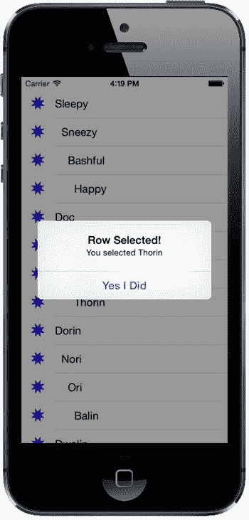

图 8-14. 在本例中，第一行不可选，当选中其他任意行时会显示一个提示框

请注意，你还可以在返回索引路径之前对其进行修改，这会导致选中不同的行和/或分区。你很少会这样做，因为更改用户的选择需要有非常充分的理由。在绝大多数使用`tableView:willSelectRowAtIndexPath:`方法的情况下，你要么直接返回未修改的`indexPath`以允许选中，要么返回`nil`来禁止选中。如果你确实想更改选中的行和/或分区，请使用`NSIndexPath indexPathForRow:inSection:`方法创建一个新的`NSIndexPath`对象并返回它。例如，以下代码将确保当你尝试选中一个偶数行时，实际上会选中该行的下一行：

```objectivec
- (NSIndexPath *)tableView:(UITableView *)tableView
        willSelectRowAtIndexPath:(NSIndexPath *)indexPath {
    if (indexPath.row == 0) {
        return nil;
    } else if (indexPath.row % 2 == 0) {
        return [NSIndexPath indexPathForRow:indexPath.row + 1
             inSection:indexPath.section];
    } else {
        return indexPath;
    }
}
```

#### 更改字体大小和行高

假设我们想要更改表格视图中使用的字体大小。在大多数情况下，你不应覆盖默认字体，因为这是用户期望看到的样式。但有时确实有更改字体的合理理由。在`tableView:cellForRowAtIndexPath:`方法中添加以下代码行：

```objectivec
- (UITableViewCell *)tableView:(UITableView *)tableView
         cellForRowAtIndexPath:(NSIndexPath *)indexPath {
    static NSString *SimpleTableIdentifier = @"SimpleTableIdentifier";

UITableViewCell *cell = [tableView dequeueReusableCellWithIdentifier:
                                       SimpleTableIdentifier];
    if (cell == nil) {
        cell = [[UITableViewCell alloc]
                initWithStyle:UITableViewCellStyleDefault
                reuseIdentifier:SimpleTableIdentifier];
    }

UIImage *image = [UIImage imageNamed:@"star"];
    cell.imageView.image = image;
    UIImage *highlightedImage = [UIImage imageNamed:@"star2"];
    cell.imageView.highlightedImage = highlightedImage;

cell.textLabel.text = self.dwarves[indexPath.row];
    cell.textLabel.font = [UIFont boldSystemFontOfSize:50];

if (indexPath.row < 7) {
        cell.detailTextLabel.text = @"迪士尼先生";
    } else {
        cell.detailTextLabel.text = @"托尔金先生";
    }
    return cell;
}
```

现在运行应用程序时，列表中的值会以非常大的字体显示，但它们并不能完全适合行高（参见图 8-15）。在 iOS 8 中，除非你另行指定，否则表格视图会根据内容自动调整每行的高度，但如你所见，在这种情况下，新的行高实际上比应有的高度要大。

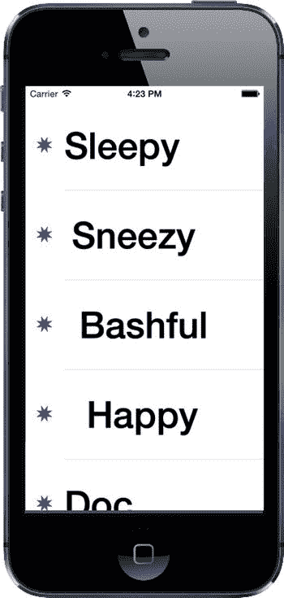

图 8-15. 更改用于绘制表格视图单元格的字体

有几种方法可以解决这个问题。首先，我们可以告诉表格其所有行都应具有给定的固定高度。为此，我们可以设置其`rowHeight`属性，如下所示：

```objectivec
tableView.rowHeight = 70;
```

如果你需要不同的行有不同的高度，可以实现`UITableViewDelegate`的`tableView:heightForRowAtIndexPath:`方法。继续将此方法添加到你的控制器类中，放在`@end`之前：

```objectivec
- (CGFloat)tableView:(UITableView *)tableView
            heightForRowAtIndexPath:(NSIndexPath *)indexPath {
    return indexPath.row == 0 ? 120 : 70;
}
```

我们刚刚告诉表格视图，将所有行的行高设置为 70 点，除了第一行，它会稍微大一些。编译并运行，现在表格的行应该更适合其内容了（参见图 8-16）。

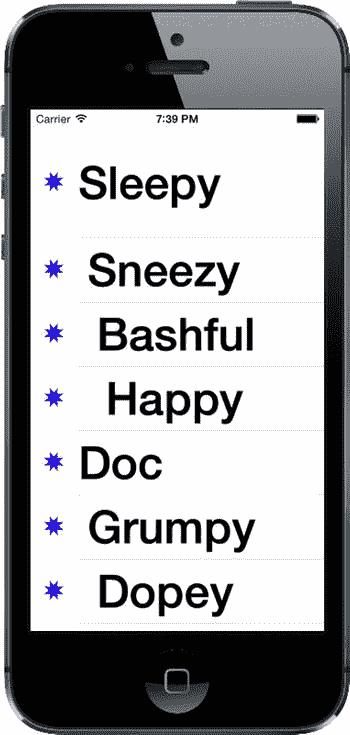

图 8-16. 使用委托更改行大小。注意第一行比其他行高得多

委托还可以处理更多任务，但大多数剩余任务在你开始处理分层数据时才会发挥作用，我们将在下一章中介绍。要了解更多信息，请使用文档浏览器查看`UITableViewDelegate`协议，并了解还有哪些其他可用方法。

## 自定义表格视图单元格

你可以在开箱即用的表格视图中实现很多功能；但通常，你希望以`UITableViewCell`直接不支持的方式来格式化每一行的数据。在这些情况下，有三种基本方法：一种是在创建单元格时以编程方式将子视图添加到`UITableViewCell`中；第二种是从 nib 文件加载单元格；第三种方法类似，但是从故事板加载单元格。我们将在本章中介绍前两种技术，并在第 9 章中看到一个从故事板创建单元格的示例。

### 向表格视图单元格添加子视图

为了演示如何使用自定义单元格，我们将创建一个带有另一个表格视图的新应用程序。在每一行中，我们将显示两行信息以及两个标签（参见图 8-17）。我们的应用程序将显示一系列可能熟悉的计算机型号的名称和颜色，我们通过向表格视图单元格添加子视图的方式，将这两部分信息显示在同一个表格单元格中。

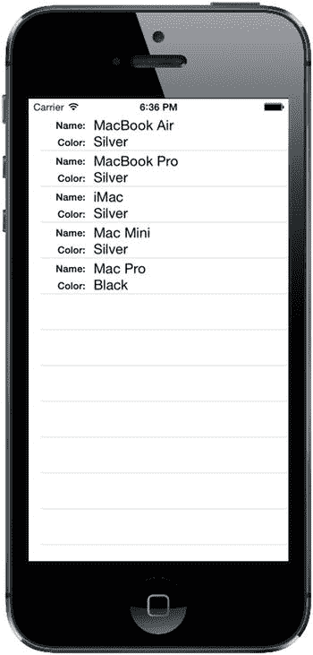

图 8-17. 向表格视图单元格添加子视图可以实现多行显示

使用单视图应用程序模板创建一个新的 Xcode 项目。将项目命名为*Table Cells*，并使用与上一个项目相同的设置。点击*Main.storyboard*在 Interface Builder 中编辑 GUI。


将 Table View 添加到主视图中，调整其大小使其填充整个视图，但 Table View 的顶部应与状态栏底部对齐，而非视图顶部。使用连接检查器将其 `data source` 设置为视图控制器，就像我们为 Simple Table 应用程序所做的那样。然后，使用窗口底部的 **Pin** 按钮创建 Table View 边缘与其父视图边缘以及状态栏之间的约束。实际上，你可以使用与 图 8-5 中相同的设置，因为你在弹出窗口顶部输入框中指定的值，默认情况下是 Table View 与其最近邻接对象在四个方向上的距离。上次，Table View 上方的最近邻接对象是主视图本身，但现在是状态栏，因此 Xcode 将创建约束，确保 Table View 的顶部正好在状态栏底部下方。最后，保存 storyboard。

### 创建 `UITableViewCell` 子类

在此之前，我们一直使用的标准 Table View 单元已经为我们处理了所有单元布局的细节。我们的控制器代码无需处理标签和图像放置的繁琐细节，只需将显示值传递给单元即可。这将表示逻辑从控制器中分离出来，这是一个非常好的设计原则。对于本项目，我们将创建一个新的 `UITableViewCell` 子类，由它负责处理新布局的细节，从而使我们的控制器尽可能简单。

### 添加新单元

在项目导航器中选择 *Table Cells* 文件夹，然后按 **N** 创建新文件。在弹出的辅助视图中，从 **iOS** 部分选择 **Cocoa Touch Class**，然后点击 **Next**。在下一个屏幕上，输入 **NameAndColorCell** 作为新类的名称，在 **Subclass of** 弹出列表中选择 `UITableViewCell`，再次点击 **Next**，然后在下一个屏幕上点击 **Create**。

现在，在项目导航器中选择 `NameAndColorCell.h`，并添加以下代码：

```objectivec
#import <UIKit/UIKit.h>

@interface NameAndColorCell : UITableViewCell

@property (copy, nonatomic) NSString *name;
@property (copy, nonatomic) NSString *color;

@end
```

在这里，我们为单元的接口添加了两个属性，控制器将使用它们将值传递给每个单元。请注意，我们没有使用 `strong` 语义声明 `NSString` 属性，而是使用了 `copy`。对 `NSString` 值这样做总是一个好主意，因为传递给属性设置器的字符串值可能是一个 `NSMutableString`，发送者以后可以修改它，从而导致问题。将传递给属性的每个字符串都复制一份，我们就能获得一个稳定、不可更改的字符串快照，反映了调用设置器时字符串的内容。

现在切换到 `NameAndColorCell.m` 并添加以下代码：

```objectivec
#import "NameAndColorCell.h"

@interface NameAndColorCell ()

@property (strong, nonatomic) UILabel *nameLabel;
@property (strong, nonatomic) UILabel *colorLabel;

@end
```

在这里，我们添加了一个类扩展，定义了两个属性，我们将使用它们来访问即将添加到单元中的一些子视图。我们的单元将包含四个子视图，其中两个是内容固定的标签，另外两个的内容会随每一行变化，因此需要建立输出口。

这些就是我们需要添加的所有属性，接下来让我们进入 `@implementation` 部分。我们将在 `initWithStyle:reuseIdentifier:` 方法中添加一些代码，以创建我们需要显示的视图：

```objectivec
- (id)initWithStyle:(UITableViewCellStyle)style
              reuseIdentifier:(NSString *)reuseIdentifier {
    self = [super initWithStyle:style reuseIdentifier:reuseIdentifier];
    if (self) {
        // Initialization code
        CGRect nameLabelRect = CGRectMake(0, 5, 70, 15);
        UILabel *nameMarker = [[UILabel alloc] initWithFrame:nameLabelRect];
        nameMarker.textAlignment = NSTextAlignmentRight;
        nameMarker.text = @"Name:";
        nameMarker.font = [UIFont boldSystemFontOfSize:12];
        [self.contentView addSubview:nameMarker];

        CGRect colorLabelRect = CGRectMake(0, 26, 70, 15);
        UILabel *colorMarker = [[UILabel alloc] initWithFrame:colorLabelRect];
        colorMarker.textAlignment = NSTextAlignmentRight;
        colorMarker.text = @"Color:";
        colorMarker.font = [UIFont boldSystemFontOfSize:12];
        [self.contentView addSubview:colorMarker];

        CGRect nameValueRect = CGRectMake(80, 5, 200, 15);
        self.nameLabel = [[UILabel alloc] initWithFrame:nameValueRect];
        [self.contentView addSubview:_nameLabel];

        CGRect colorValueRect = CGRectMake(80, 25, 200, 15);
        self.colorLabel = [[UILabel alloc] initWithFrame:colorValueRect];
        [self.contentView addSubview:_colorLabel];
    }
    return self;
}
```

这应该非常直观。我们创建了四个 `UILabel` 并将它们添加到 Table View 单元中。Table View 单元已经有一个名为 `contentView` 的 `UIView` 子视图，用于将它的所有子视图分组。因此，我们不是直接将标签作为子视图添加到 Table View 单元，而是添加到它的 `contentView` 中。

其中两个标签包含静态文本。标签 `nameMarker` 包含文本 *Name:*，标签 `colorMarker` 包含文本 *Color:*。这些是我们不会更改的标签。这两个标签都使用 `NSTextAlignmentRight` 将文本右对齐。

我们将使用另外两个标签来显示特定行的数据。请记住，我们以后需要某种方式来检索这些字段，因此我们在之前声明的属性中保留了对这两个标签的引用。

现在，让我们通过添加以下两个设置方法（在 `@end` 之前）来完成 `NameAndColorCell` 类的收尾工作：

```objectivec
- (void)setName:(NSString *)n {
    if (![n isEqualToString:_name]) {
        _name = [n copy];
        self.nameLabel.text = _name;
    }
}

- (void)setColor:(NSString *)c {
    if (![c isEqualToString:_color]) {
        _color = [c copy];
        self.colorLabel.text = _color;
    }
}
```

你已经知道，像我们在头文件中那样使用 `@property` 会隐式地为每个属性创建 getter 和 setter 方法。然而，这里我们却在为 `name` 和 `color` 定义自己的 setter！事实证明，这完全没有问题。只要一个类定义了它自己的 getter 或 setter，就会使用这些自定义方法，而不是默认方法。在这个类中，我们使用默认的合成 getter，但定义了自己的 setter。每当为 `name` 或 `color` 属性传递新值时，我们都会更新之前创建的标签。

### 实现控制器的代码

现在，让我们设置简单的控制器，以便在我们漂亮的新单元中显示值。首先选择 `ViewController.h`，并在其中添加以下代码：

```objectivec
#import <UIKit/UIKit.h>

@interface ViewController : UIViewController
    <UITableViewDataSource>

@end
```

在我们的控制器中，需要设置一些要使用的数据，然后实现 Table 数据源方法将这些数据提供给 Table。切换到 `ViewController.m`，并在文件开头添加以下代码：

```objectivec
#import "ViewController.h"
#import "NameAndColorCell.h"

static NSString *CellTableIdentifier = @"CellTableIdentifier";

@interface ViewController ()

@property (copy, nonatomic) NSArray *computers;
@property (weak, nonatomic) IBOutlet UITableView *tableView;

@end

@implementation ViewController
```


`- (void)viewDidLoad`
```
{
    [super viewDidLoad];
    // Do any additional setup after loading the view, typically from a nib.

    self.computers = @[@{@"Name" : @"MacBook Air", @"Color" : @"Silver"},
                       @{@"Name" : @"MacBook Pro", @"Color" : @"Silver"},
                       @{@"Name" : @"iMac", @"Color" : @"Silver"},
                       @{@"Name" : @"Mac Mini", @"Color" : @"Silver"},
                       @{@"Name" : @"Mac Pro", @"Color" : @"Black"}];

    [self.tableView registerClass:[NameAndColorCell class]
           forCellReuseIdentifier:CellTableIdentifier];
}
```

这个版本的 `viewDidLoad` 将一个字典数组赋值给 `computers` 属性。每个字典包含表格中一行的名称和颜色信息。该行的名称以键 `Name` 存储在字典中，颜色则以键 `Color` 存储。

**注意** 还记得 Mac 曾经有多种颜色可选，比如米色、铂金色、黑色和白色吗？更不用说最初的 iMac 和 iBook 系列那美丽的彩虹色系了。而现在，除了最新款 Mac Pro，只剩下一种颜色：银色。哼。好吧，至少我们现在可以用多彩的 iPhone 来安慰自己。

我们还为表格视图添加了一个输出口，因此需要在故事板中连接它。选择 `Main.storyboard` 文件。在文档大纲中，按住 Control 键从**视图控制器**图标拖到**表格视图**图标。松开鼠标，在弹出的菜单中选中 `tableView`，将表格视图连接到输出口。

现在，在 `ViewController.m` 的末尾，`@end` 声明之前添加以下代码：

```
- (NSInteger)tableView:(UITableView *)tableView
 numberOfRowsInSection:(NSInteger)section {
    return [self.computers count];
}

- (UITableViewCell *)tableView:(UITableView *)tableView
         cellForRowAtIndexPath:(NSIndexPath *)indexPath {
    NameAndColorCell *cell =
        [tableView dequeueReusableCellWithIdentifier:
                                   CellTableIdentifier
                   forIndexPath:indexPath];

    NSDictionary *rowData = self.computers[indexPath.row];
    cell.name = rowData[@"Name"];
    cell.color = rowData[@"Color"];

    return cell;
}

@end
```

你在之前的示例中已经见过这些方法——它们属于 `UITableViewDataSource` 协议。让我们聚焦于 `tableView:cellForRowWithIndexPath:`，因为这里才是我们真正接触新东西的地方。这里我们使用了一个有趣的特性：表格视图可以利用某种注册机制，在需要时创建新单元格。这意味着，只要我们为表格视图注册了所有将要使用的重用标识符，就总能获取到可用的单元格。在之前的示例中，我们使用了 `dequeueReusableCellWithIdentifier:` 方法。该方法也使用注册机制，但如果我们提供的标识符未注册，它会返回 `nil`。这个 `nil` 返回值被用作一个信号，表明我们需要创建并填充一个新的 `UITableViewCell` 对象。而我们这里使用的 `dequeueReusableCellWithIdentifier:forIndexPath:` 方法从不返回 `nil`，那么它是如何获取表格单元格对象的呢？它将我们传入的标识符作为键在注册表中查找，我们在 `viewDidLoad` 方法中向注册表添加了一个映射到表格单元格标识符的条目：

```
[tableView registerClass:[NameAndColorCell class]
  forCellReuseIdentifier:CellTableIdentifier];
```

如果我们传入一个未注册的标识符会发生什么？在这种情况下，`dequeueReusableCellWithIdentifier:forIndexPath:` 方法会崩溃。崩溃听起来很糟糕，但在这里，它会是开发过程中能立刻发现的 bug 所导致的结果。因此，我们不需要编写检查 `nil` 返回值的代码，因为这种情况永远不会发生。

一旦获得新单元格，我们就使用传入的 `indexPath` 参数来确定表格请求的是哪一行的单元格，然后利用该行值来获取请求行对应的字典。记住，字典包含两个键值对——一个对应 `name`，另一个对应 `color`：

```
NSDictionary *rowData = self.computers[indexPath.row];
```

现在，剩下要做的就是使用我们在子类中定义的属性，将选定行的数据填充到单元格中：

```
cell.name = rowData[@"Name"];
cell.color = rowData[@"Color"];
```

正如你之前所见，设置这些属性会将值复制到表格视图单元格的名称和颜色标签中。

编译并运行你的应用程序。你应该会看到一个包含多行的表格，每行显示两行数据，如图 Figure 8-17 所示。

能够向表格视图单元格添加视图，比单独使用标准表格视图单元格提供了更多的灵活性，但通过编程方式创建、定位和添加所有子视图可能会有些繁琐。天哪，要是能用 Xcode 的 GUI 编辑工具以图形化方式设计表格视图单元格就好了。嗯，我们很幸运。正如之前提到的，你可以使用 Interface Builder 来设计表格视图单元格，然后在创建新单元格时，直接从故事板或 nib 文件中加载这些视图。

## 从 Nib 加载 UITableViewCell

我们将利用 Xcode 在 Interface Builder 中提供的可视化布局能力，重新创建刚刚用代码实现的那个双行界面。为此，我们将创建一个新的 nib 文件，其中包含表格视图单元格，并使用 Interface Builder 来布局其视图。然后，当我们需要一个表格视图单元格来表示一行时，我们只需加载 nib 文件，并使用已定义的单元格类属性来设置名称和颜色。除了使用 Interface Builder 的可视化布局之外，我们还将简化其他几处的代码。在继续之前，你可能想复制一份 Table Cells 项目，以便在其中进行后续修改。或者，你也可以在示例源代码归档的 `Table Cells 2` 文件夹中找到当前状态的 Table Cells 项目副本，并以此作为起点。

首先，我们对 `NameAndColorCell.m` 中的 `NameAndColorCell` 类进行一些修改。第一步是将属性标记为输出口，以便在 Interface Builder 中使用它们。在靠近顶部的类扩展中进行如下修改：

```
@interface NameAndColorCell ()

@property (strong, nonatomic) IBOutlet UILabel *nameLabel;
@property (strong, nonatomic) IBOutlet UILabel *colorLabel;

@end
```

现在，还记得我们在 `initWithStyle:reuseIdentifier:` 中创建标签所做的设置吗？所有这些都可以删掉了。事实上，你应该直接删除整个方法，因为所有这些设置现在都将在 Interface Builder 中完成！

完成这些之后，你得到的单元格类比之前更简洁、更清爽。它现在唯一真正的功能就是将数据传输到标签中。接下来，我们需要在 Interface Builder 中重新创建单元格及其标签。

在 Xcode 中右键点击 `Table Cells` 文件夹，从上下文菜单中选择 **New File...**。在新的文件助手左侧窗格中，点击 **User Interface**（确保在 **iOS** 部分选择，而不是 **OS X** 部分）。在右上窗格中选择 **Empty**，然后点击 **Next**。在接下来的界面中，使用文件名 `NameAndColorCell.xib`。确保文件浏览器中选中了主项目目录，并且 **Group** 弹出菜单中选中了 `Table Cells` 组。点击 **Create** 创建新的 nib 文件。

### 在 Interface Builder 中设计表格视图单元格


接下来，在项目导航器中选中 `NameAndColorCell.xib` 以打开文件进行编辑。到目前为止，我们一直在故事板中进行全部 GUI 编辑，但现在改用 nib 文件。大多数操作是相似的，会让你感到非常熟悉，但也有一些不同之处。主要区别之一在于：故事板文件围绕视图控制器与视图的配对场景展开，而 nib 文件不存在这种强制配对关系。事实上，nib 文件通常根本不包含真实的控制器对象，只有一个名为 `File's Owner` 的代理。如果你打开文档大纲，就会看到它位于“第一响应者”上方。

在库中寻找一个表格视图单元格（参见图 8-18），并将其中一个拖拽到 GUI 布局区域。

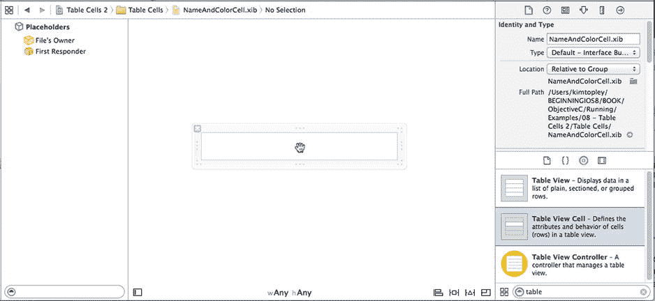

图 8-18。我们将一个表格视图单元格从库中拖拽到 nib 编辑器中

接下来，按下 `4` 进入属性检查器（参见图 8-19）。你首先会看到的字段之一是 `Identifier`。这正是我们在代码中一直使用的复用标识符。如果不记得了，请翻阅本章前面内容，找到 `CellTableIdentifier`。将 `Identifier` 值设置为 `CellTableIdentifier`。

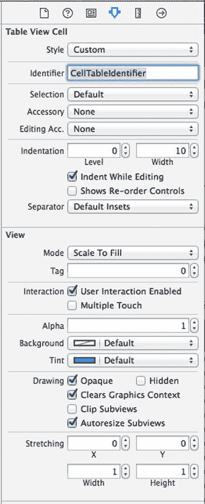

图 8-19。表格视图单元格的属性检查器

这里的思路是：当我们获取一个单元格以复用时（例如，由于滚动将新单元格移入视野），我们希望确保获取到正确的单元格类型。当这个特定单元格从 nib 文件实例化时，其复用标识符实例变量将预先填充你在属性检查器的 `Identifier` 字段中输入的名称——即 `CellTableIdentifier`。

设想一个场景：你创建了一个带表头以及一系列“中间”单元格的表格。如果将某个中间单元格滚动到视野中，重要的是你要取出一个中间单元格进行复用，而不是表头单元格。`Identifier` 字段让你能够恰当地标记单元格。

下一步是编辑表格单元格的内容视图。首先，在编辑区域选中表格单元格，向下拖拽其下边缘，使单元格变得稍高一些。持续拖拽，直到高度达到 `65`。进入库，拖出四个标签控件，并将它们放置在内容视图中，参考图 8-20 作为指引。这些标签可能会离顶部和底部太近，导致辅助线作用不大，但左侧辅助线和对齐辅助线应能发挥其作用。注意，你可以先拖出一个标签，然后按住 Option 键拖拽来创建副本，如果这种方法对你而言更方便的话。

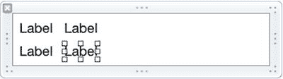

图 8-20。表格视图单元格的内容视图，其中拖入了四个标签

接下来，双击左上角的标签，将其改为 `Name:`，然后将左下角的标签改为 `Color:`。

现在，同时选中 `Name:` 和 `Color:` 标签，点击属性检查器中 `Font` 字段里的小 `T` 按钮。这将打开一个小面板，其中包含一个 `Font` 弹出按钮。点击该按钮，选择 `System Bold` 作为字体。如有需要，选中右侧两个未修改的标签字段，将它们稍微向右拖拽，为设计留出一些呼吸空间，然后调整另外两个标签的大小，以便能够看到你刚刚设置的文本。接着，调整右侧两个标签的大小，使它们一直延伸到右侧辅助线。图 8-21 应能让你了解最终的单元格内容视图效果。

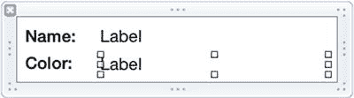

图 8-21。表格视图单元格的内容视图，左侧标签名称已更改并设为粗体，右侧标签进行了轻微移动和大小调整

与以往创建新布局时一样，我们需要添加自动布局约束。总体思路是将左侧标签固定到单元格的左侧，右侧标签固定到右侧。我们还将确保标签与单元格顶部和底部之间以及标签之间的垂直间距得以保留。我们将把每个左侧标签与其右侧的标签关联起来。具体步骤如下：

1. 点击 `Name:` 标签，按住 `Shift` 键，然后点击 `Color:` 标签。从菜单中选择 `Editor` `` `Pin` `` `Widths Equally`。执行此操作时，你会看到一些自动布局警告出现——不必担心，我们将在添加更多约束时修复它们。
2. 仍选中这两个标签，打开大小检查器，找到标有 `Content Hugging Priority` 的部分。如果看不到，请尝试取消选中并重新选中这两个标签。这些字段中的值决定了标签抵制扩展以占据多余空间的强度。我们不希望这些标签在水平方向上有任何扩展，因此将 `Horizontal` 字段的值从 `251` 改为 `500`。任何大于 251 的值都可以——我们只需要它大于右侧两个标签的 `Content Hugging Priority` 值，这样任何多余的水平空间都将分配给他们。
3. 按住 Control 键从 `Color:` 标签拖拽到 `Name:` 标签，从弹出菜单中选择 `Vertical Spacing`，然后按下 `Return`。
4. 按住 Control 键从 `Name:` 标签向左上角方向斜向拖拽到单元格的左上角，直到单元格背景完全变为蓝色。在弹出菜单中，按住 `Shift` 键，选择 `Leading Space to Container Margin` 和 `Top Space to Container Margin`，然后按下 `Return`。
5. 按住 Control 键从 `Color:` 标签向左下角方向斜向拖拽到单元格的左下角，直到其背景变为蓝色。在弹出菜单中，按住 `Shift` 键，选择 `Leading Space to Container Margin` 和 `Bottom Space to Container Margin`，然后按下 `Return`。
6. 按住 Control 键从 `Name:` 标签拖拽到它右侧的标签。在弹出菜单中，按住 `Shift` 键，选择 `Horizontal Spacing` 和 `Baseline`，然后按下 `Return`。按住 Control 键从右侧的顶部标签向单元格右边缘拖拽，直到单元格背景变为蓝色。在弹出菜单中，选择 `Trailing Space to Container Margin`。
7. 类似地，按住 Control 键从 `Color:` 标签拖拽到它右侧的标签。在弹出菜单中，按住 `Shift` 键，选择 `Horizontal Spacing` 和 `Baseline`，然后按下 `Return`。按住 Control 键从右侧的底部标签向单元格右边缘拖拽，直到单元格背景变为蓝色。在弹出菜单中，选择 `Trailing Space to Container Margin`。
8. 最后，在文档大纲中选择 `Content View` 图标，然后从菜单中选择 `Editor` `` `Resolve Auto Layout Issues` `` `Update Frames`（如果可用）。四个标签应移动到最终位置，如图 8-21 所示。如果看到不同的情况，请删除文档大纲中的所有约束并重试。

现在，我们需要让 Interface Builder 知道这个表格视图单元格不仅仅是一个普通单元格，而是我们特殊子类的一个实例。否则，我们将无法将输出口连接到相关标签。在文档大纲中点击 `CellTableIdentifier` 来选中表格视图单元格，按下 `3` 调出身份检查器，并从 `Class` 控件中选择 `NameAndColorCell`。


接下来，切换到**连接检查器**（`6`），你将看到 `colorLabel` 和 `nameLabel` 输出口。将 `nameLabel` 输出口拖到表格单元格右侧顶部的标签上，并将 `colorLabel` 输出口拖到右侧底部的标签上。

### 使用新的表格视图单元格

要使用我们设计的单元格，只需对 `ViewController.m` 中的 `viewDidLoad:` 方法做一些相当简单的修改：

```
- (void)viewDidLoad
{
    [super viewDidLoad];
    // Do any additional setup after loading the view, typically from a nib.

    self.computers = @[@{@"Name" : @"MacBook Air", @"Color" : @"Silver"},
                       @{@"Name" : @"MacBook Pro", @"Color" : @"Silver"},
                       @{@"Name" : @"iMac", @"Color" : @"Silver"},
                       @{@"Name" : @"Mac Mini", @"Color" : @"Silver"},
                       @{@"Name" : @"Mac Pro", @"Color" : @"Black"}];

    [self.tableView registerClass:[NameAndColorCell class]
            forCellReuseIdentifier:CellTableIdentifier];
    UINib *nib = [UINib nibWithNibName:@"NameAndColorCell" bundle:nil];
    [self.tableView registerNib:nib
            forCellReuseIdentifier:CellTableIdentifier];
}
```

正如表格视图可以将类与重用标识符关联（如之前的示例所示），它也能记录哪些 nib 文件应与特定的重用标识符关联。这允许你为每种行类型注册一次使用类或 nib 文件的单元格，而 `dequeueReusableCellWithIdentifier:forIndexPath:` 将始终提供一个可立即使用的单元格。

就是这样。构建并运行。现在，你的两行表格单元格基于你的 Interface Builder 设计技巧。

你可能已经注意到，我们并没有显式设置表格的行高，也没有实现 `UITableViewDelegate` 的 `tableView:heightForRowAtIndexPath:` 方法。尽管如此，所有行的高度都正确。以下是表格计算行高的方式：

- 如果实现了 `tableView:heightForRowAtIndexPath:` 方法，表格视图会通过调用它获取每一行的高度。
- 如果没有实现，表格视图则会使用其 `rowHeight` 属性。如果此属性的值为特殊的 `UITableViewAutomaticDimension`，*并且*表格单元格来自 nib 或故事板，*并且*其内容使用自动布局约束进行布局，则表格会根据单元格自身的自动布局约束获取该单元格的行高。如果 `rowHeight` 属性为其他任何值，该值将用作表格中每一行的高度。

在这个示例中，我们使用自动布局放置了单元格的所有内容，因此表格能够计算单元格所需的高度，省去了我们自己计算的麻烦。即使不同行的内容可能导致不同的行高，这种方法也同样有效。由于 `rowHeight` 属性的默认值是 `UITableViewAutomaticDimension`，只要你构建自定义单元格时使用自动布局约束，就能免费获得此行为。

那么，既然你已经了解了构建自定义单元格的几种方法，你觉得怎么样？许多深入研究 iOS 开发的人起初会对注重 Interface Builder 感到有些困惑，但正如你所见，它有很多优点。除了让你能以可视化方式设计图形用户界面这一显而易见的吸引力之外，这种方法还促进了 nib 文件的正确使用，有助于你遵循 MVC 架构模式。此外，它还能让你的应用程序代码更简单、更模块化，并且编写起来更轻松。正如我们的好朋友 Mark Dalrymple 所说：“没有代码就是最好的代码！”在第 9 章中，你将看到可以直接在故事板中设计表格单元格，这意味着你无需创建额外的 nib 文件。但这种方法仅在你不想在不同表格之间共享单元格设计时才有效。

## 分组和索引分区

我们的下一个项目将探讨表格的另一个基本方面。我们将继续使用单个表格视图——还没有层级结构——但会将数据分成多个分区。再次使用单视图应用程序模板创建一个新的 Xcode 项目，这次将其命名为 `Sections`。像往常一样，将**语言**设置为 `Objective-C`，**设备**设置为 `Universal`。

### 构建视图

打开 `Sections` 文件夹，点击 `Main.storyboard` 编辑文件。像之前一样，将一个表格视图拖到视图窗口中。将表格视图的顶部排列在状态栏下方，并添加与表格单元格示例中相同的自动布局约束。然后按下 `6`，并将 **dataSource** 连接连接到**视图控制器**图标上。

接下来，确保表格视图被选中，按下 `4` 调出属性检查器。将表格视图的**样式**从 `Plain` 更改为 `Grouped`（参见图 8-22）。保存故事板并继续。（我们在本章开头已经讨论过索引样式和分组样式的区别。）

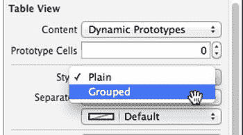

图 8-22。表格视图的属性检查器，显示已选中 Grouped 的样式弹出菜单

### 导入数据

这个项目需要相当数量的数据才能正常工作。为了节省你几小时的输入时间，我们提供了另一个属性列表供你愉快地使用表格。从本书示例源代码存档中的 `08 Sections Data` 子文件夹中获取名为 `sortednames.plist` 的文件，并将其拖入 Xcode 中项目的 `Sections` 文件夹。

将 `sortednames.plist` 添加到项目后，单击它以了解其大致内容（参见图 8-23）。这是一个包含字典的属性列表，字典中为字母表中的每个字母都有一条记录。每个字母下面是一个以该字母开头的名字列表。

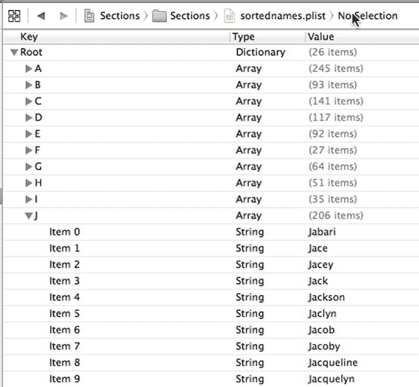

图 8-23。`sortednames.plist` 属性列表文件。字母 J 已展开，以便你了解其中一个字典的结构

我们将使用此属性列表中的数据来填充表格视图，为每个字母创建一个分区。

### 实现控制器

单击 `ViewController.h` 文件，通过添加以下粗体显示的代码，使该类遵循 `UITableViewDataSource` 协议：

```
#import <UIKit/UIKit.h>

@interface ViewController : UIViewController
    <UITableViewDataSource>

@end
```

现在，切换到 `ViewController.m`，并在文件开头添加以下代码：

```
#import "ViewController.h"

static NSString *SectionsTableIdentifier = @"SectionsTableIdentifier";

@interface ViewController ()

@property (copy, nonatomic) NSDictionary *names;
@property (copy, nonatomic) NSArray *keys;

@end
```

接下来，打开助理编辑器，并使用跳转栏选择 `ViewController.m`。在文档大纲中，选择 `Main.storyboard`，按住 Control 键从表格视图拖到助理编辑器中的类扩展，以在 `keys` 属性定义下方为表格创建一个输出口：

```
@interface ViewController ()

@property (copy, nonatomic) NSDictionary *names;
@property (copy, nonatomic) NSArray *keys;
@property (weak, nonatomic) IBOutlet UITableView *tableView;

@end
```

回到 `ViewController.m`，在 `viewDidLoad` 方法中添加以下粗体代码：

```
@implementation ViewController

- (void)viewDidLoad
{
    [super viewDidLoad];
    // Do any additional setup after loading the view, typically from a nib.

    [self.tableView registerClass:[UITableViewCell class]
            forCellReuseIdentifier:SectionsTableIdentifier];
```


```objectivec
NSString *path = [[NSBundle mainBundle] pathForResource:@"sortednames"
                                                 ofType:@"plist"];
    self.names = [NSDictionary dictionaryWithContentsOfFile:path];
    self.keys = [[self.names allKeys] sortedArrayUsingSelector:
                 @selector(compare:)];
}
```

这部分内容与你之前看到的相差不大。在顶部的类扩展中，我们为 `NSDictionary` 和 `NSArray` 添加了属性声明。字典将存储所有数据，而数组则按字母顺序保存排序后的分区。在 `viewDidLoad` 方法中，我们使用声明的标识符注册了每行应显示的默认表格视图单元格类。之后，我们从项目中添加的属性列表创建了一个 `NSDictionary` 实例，并将其赋值给 `names` 属性。接着，我们获取该字典的所有键，并对它们进行排序，得到一个有序的 `NSArray`，其中包含字典中所有键值，且按字母顺序排列。请记住，`NSDictionary` 使用字母作为键，因此该数组将包含 26 个字母，从 A 排到 Z，我们将利用这个数组来跟踪各个分区。

接下来，在文件末尾，`@end` 声明之前，添加以下代码：

```objectivec
#pragma mark -
#pragma mark Table View Data Source Methods
- (NSInteger)numberOfSectionsInTableView:(UITableView *)tableView {
    return [self.keys count];
}

- (NSInteger)tableView:(UITableView *)tableView
 numberOfRowsInSection:(NSInteger)section {
    NSString *key = self.keys[section];
    NSArray *nameSection = self.names[key];
    return [nameSection count];
}

- (NSString *)tableView:(UITableView *)tableView
titleForHeaderInSection:(NSInteger)section {
    return self.keys[section];
}

- (UITableViewCell *)tableView:(UITableView *)tableView
         cellForRowAtIndexPath:(NSIndexPath *)indexPath {
    UITableViewCell *cell =
    [tableView dequeueReusableCellWithIdentifier:SectionsTableIdentifier
                                    forIndexPath:indexPath];

    NSString *key = self.keys[indexPath.section];
    NSArray *nameSection = self.names[key];

    cell.textLabel.text = nameSection[indexPath.row];
    return cell;
}

@end
```

这些都是表格数据源方法。我们添加到类中的第一个方法指定了分区数量。在之前的示例中，我们没有实现这个方法，因为默认设置为 `1` 就满足需求了。这次，我们告诉表格视图，字典中的每个键对应一个分区：

```objectivec
- (NSInteger)numberOfSectionsInTableView:(UITableView *)tableView {
    return [self.keys count];
}
```

下一个方法计算特定分区中的行数。在之前的示例中，我们只有一个分区，所以直接返回数组中的行数。这次，我们需要按分区进行细分。可以通过检索与当前分区对应的数组，并返回该数组的计数来实现：

```objectivec
- (NSInteger)tableView:(UITableView *)tableView
     numberOfRowsInSection:(NSInteger)section {
    NSString *key = self.keys[section];
    NSArray *nameSection = self.names[key];
    return [nameSection count];
}
```

`tableView:titleForHeaderInSection:` 方法允许你为每个分区指定一个可选的标题值，我们只需返回该分组的字母，即该组的键：

```objectivec
- (NSString *)tableView:(UITableView *)tableView
    titleForHeaderInSection:(NSInteger)section {
    return self.keys[section];
}
```

在 `tableView:cellForRowAtIndexPath:` 方法中，我们需要使用索引路径中的 section 和 row 属性来提取分区键和名称数组，然后用它们来确定要使用的值。section 决定我们从 `names` 字典中取出哪个数组，而 row 则用于确定使用该数组中的哪个值。该方法中的其他部分基本与本章前面构建的 Table Cells 应用中的版本相同。

编译并运行项目，欣赏它的炫酷效果。请记住，我们将表格的样式改为了 Grouped（分组），因此最终得到了一个有 26 个分区的分组表格，结果应类似于图 8-24。

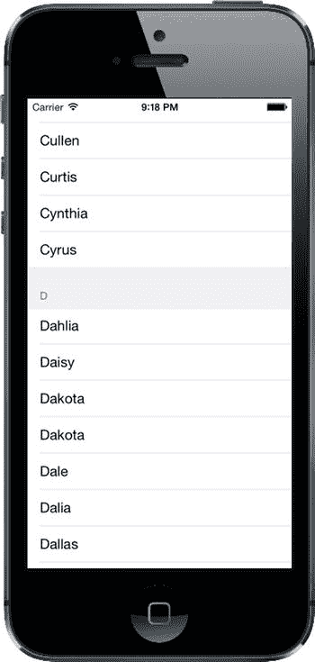

图 8-24. 包含多个分区的分组表格

作为对比，让我们把表格视图改回 Plain（普通）样式，看看多分区的普通表格视图是什么样子。再次选择 `Main.storyboard` 在 Interface Builder 中编辑文件。选中表格视图，使用属性检查器将其切换为 Plain 样式。保存项目，然后构建并运行——数据相同，但视觉效果不同（见图 8-25）。

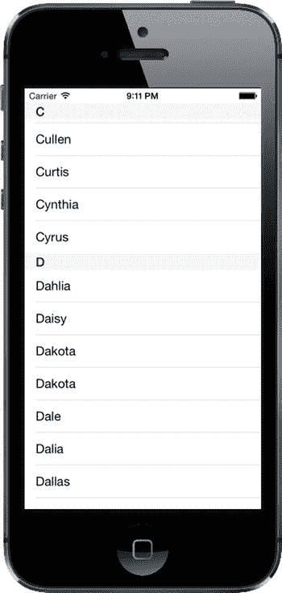

图 8-25. 包含分区但无索引的普通表格

## 添加索引

当前表格的一个问题是行数过多。这个列表中有 2000 个名字。要找到 Zachariah 或 Zayne，更不用说 Zoie，你的手指会非常疲劳。

解决这个问题的方法之一是在表格视图右侧添加一个索引。既然我们已经将表格视图样式改回 Plain，这一步相对容易。在 `ViewController.m` 底部，`@end` 之前添加以下方法：

```objectivec
- (NSArray *)sectionIndexTitlesForTableView:(UITableView *)tableView {
    return self.keys;
}
```

是的，就这么简单。在这个方法中，表格请求一个包含索引显示值的数组。要让索引生效，表格视图中必须有一个以上的分区，并且此数组中的条目必须与这些分区对应。返回的数组必须与分区数量相同，且值必须与相应的分区对应。换句话说，此数组中的第一个项目会将用户带到第一个分区，即 section 0。再次编译并运行应用，你就会看到一个漂亮的索引（见图 8-26）。

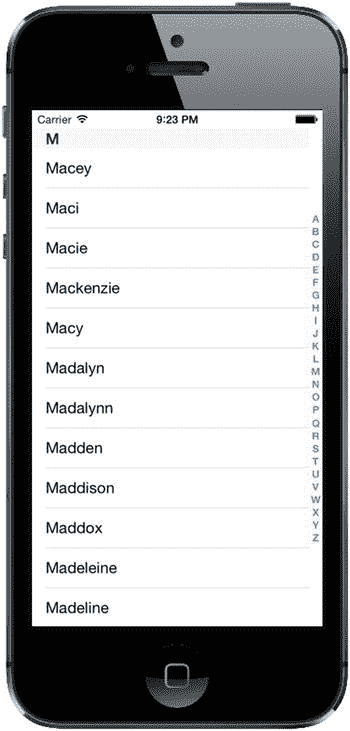

图 8-26. 带索引的表格视图

## 实现搜索栏

索引很有用，但即便如此，这里仍然有大量名字。例如，如果我们想查看名字 Arabella 是否在列表中，即使使用了索引，也需要滚动一段时间。如果能让用户通过指定搜索词来缩小列表范围，那该多好，不是吗？这将会非常用户友好。虽然需要额外做一些工作，但并非难事。我们将使用搜索控制器实现一个标准的 iOS 搜索栏，如图 8-27 左侧所示。

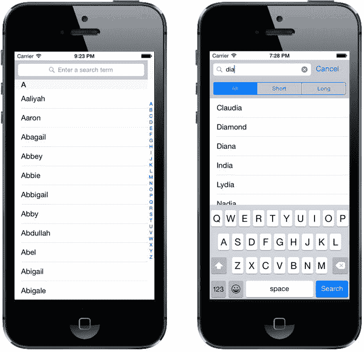

图 8-27. 表格中添加了搜索栏的应用


当用户在搜索栏中输入时，名字列表会缩减至仅包含那些将输入文本作为子串的名字。作为额外功能，搜索栏还允许您定义范围按钮，从而以某种方式限定搜索范围。我们将在搜索栏中添加三个范围按钮——**Short** 按钮会将搜索限制在长度少于六个字符的名字，**Long** 按钮只会考虑至少六个字符的名字，而 **All** 按钮则包含所有名字。范围按钮仅在用户向搜索栏中键入时出现；您可以在图 8-27 右侧看到它们的作用。

在 iOS 8 中，添加搜索功能相当简单。您只需要三样东西：

*   一些可供搜索的数据。在我们的例子中，就是名字列表。
*   一个用于显示搜索结果的视图控制器。这个视图控制器会临时替换提供数据的那个。它可以选择以任何方式显示结果，但通常源数据是通过表格呈现的，而结果视图控制器会使用另一个看起来非常相似的表格，从而营造出搜索仅仅是过滤原始表格的印象。不过，正如您将看到的，实际情况并非如此。
*   一个 `UISearchController`，它提供搜索栏并管理搜索结果在结果视图控制器中的显示。

让我们从创建结果视图控制器的骨架开始。我们将在一个表格中显示搜索结果，因此我们的结果视图控制器需要包含一个表格。我们可以像本章前面的示例那样，将一个视图控制器拖到故事板上并为其添加一个表格视图，但这次我们采用不同的方式。我们将使用一个 `UITableViewController`，它是一个嵌入了 `UITableView` 的视图控制器，并且已预先配置好作为其表格视图的数据源和委托。在项目导航器中，右键点击 **Sections** 组，然后从弹出菜单中选择 **New File . . .**。在文件模板选择器中，从 **iOS Source** 组中选择 **Cocoa Touch Class**，然后点击 **Next**。将您的新类命名为 `SearchResultsController`，并使其成为 `UITableViewController` 的子类。点击 **Next**，为新文件选择位置，然后让 Xcode 创建它们。

在项目导航器中选择 `SearchResultsController.h`，并对其进行以下修改：

```
#import <UIKit/UIKit.h>

@interface SearchResultsController : UITableViewController
                 <UISearchResultsUpdating>

- (instancetype)initWithNames:(NSDictionary *)names keys:(NSArray *)keys;

@end
```

我们将在这个视图控制器中实现搜索逻辑，因此我们使其遵循 `UISearchResultsUpdating` 协议，这允许我们将其分配为 `UISearchController` 类的委托。正如您稍后将看到的，当用户在搜索栏中键入时，会调用此协议定义的单个方法来更新搜索结果。

由于 `SearchResultsController` 将为我们执行搜索操作，它需要访问主视图控制器正在显示的名字列表，因此我们还添加了一个初始化方法，以便我们可以将名字字典和用于在主视图控制器中显示的键列表传递给它。让我们将此初始化方法添加到 `SearchResultsController.m` 中。如果您在编辑器中打开此文件，您会看到它已经包含了一些不完整的代码，这些代码提供了 `UITableViewDataSource` 协议的部分实现，以及一些 `UITableViewController` 子类经常需要实现的其他方法的注释掉的代码块。在本示例中，我们不会使用它们中的大部分，因此请随意删除所有注释掉的代码，然后在文件顶部进行以下更改：

```
#import "SearchResultsController.h"

static NSString *SectionsTableIdentifier = @"SectionsTableIdentifier";
```


```objc
@interface SearchResultsController ()

@property (strong, nonatomic) NSDictionary *names;
@property (strong, nonatomic) NSArray *keys;
@property (strong, nonatomic) NSMutableArray *filteredNames;

@end
```

我们在本视图控制器中添加了 `SectionsTableIdentifier` 变量，用于保存表格单元格的标识符。这里使用的标识符与主视图控制器中的相同，当然也可以使用任意名称。同时我们还添加了三个属性：两个分别用于保存名称字典和在搜索时使用的键列表，另一个用于保存指向搜索结果数组的引用。接下来，添加初始化方法的实现：

```objc
@implementation SearchResultsController

- (instancetype)initWithNames:(NSDictionary *)names keys:(NSArray *)keys {
    if (self = [super initWithStyle:UITableViewStylePlain]) {
        self.names = names;
        self.keys = keys;
        self.filteredNames = [[NSMutableArray alloc] init];
    }
    return self;
}
```

这段代码非常直观。首先调用 `UITableViewController` 类的某个初始化方法，将其内嵌表格视图的样式设置为普通样式。然后设置 `names` 和 `keys` 属性的值，并为搜索结果分配数组。需要注意的是，`names` 和 `keys` 属性均声明为 `(strong, nonatomic)`，这意味着它们只会持有来自主视图控制器数据的引用。这种方法比复制源数据更高效。

最后，在 `viewDidLoad` 方法中添加一行代码，向结果控制器的内嵌表格视图注册表格单元格标识符：

```objc
- (void)viewDidLoad {
    [super viewDidLoad];

    [self.tableView registerClass:[UITableViewCell class]
           forCellReuseIdentifier:SectionsTableIdentifier];
}
```

目前我们在结果视图控制器中需要做的就这些，接下来暂时回到主视图控制器，为其添加搜索栏。在项目导航器中选择 `ViewController.m`，按粗体所示修改文件顶部的代码：

```objc
#import "ViewController.h"
#import "SearchResultsController.h"

static NSString *SectionsTableIdentifier = @"SectionsTableIdentifier";

@interface ViewController ()

@property (copy, nonatomic) NSDictionary *names;
@property (copy, nonatomic) NSArray *keys;
@property (weak, nonatomic) IBOutlet UITableView *tableView;
@property (strong, nonatomic) UISearchController *searchController;

@end
```

我们首先导入了搜索结果控制器的头文件（稍后会用到），然后添加了一个属性来持有 `UISearchController` 实例的引用，在本示例中它将承担大部分繁重工作。

接下来，在 `viewDidLoad` 方法中添加创建搜索控制器的代码：

```objc
- (void)viewDidLoad {
    [super viewDidLoad];
    // 通常从 nib 加载后执行额外的设置

    [self.tableView registerClass:[UITableViewCell class]
            forCellReuseIdentifier:SectionsTableIdentifier];

    NSString *path = [[NSBundle mainBundle] pathForResource:@"sortednames"
                                                     ofType:@"plist"];
    self.names = [NSDictionary dictionaryWithContentsOfFile:path];
    self.keys = [[self.names allKeys] sortedArrayUsingSelector:
                 @selector(compare:)];

    SearchResultsController *resultsController =
          [[SearchResultsController alloc] initWithNames:self.names
                keys:self.keys];
    self.searchController = [[UISearchController alloc]
          initWithSearchResultsController:resultsController];

    UISearchBar *searchBar = self.searchController.searchBar;
    searchBar.scopeButtonTitles = @[@"所有", @"短名称", @"长名称"];
    searchBar.placeholder = @"输入搜索关键词";
    [searchBar sizeToFit];
    self.tableView.tableHeaderView = searchBar;
    self.searchController.searchResultsUpdater = resultsController;
}
```

首先使用刚刚在 `SearchResultsController.m` 文件中实现的初始化方法创建结果控制器。然后创建 `UISearchController`，并将结果控制器的引用传递给它——当有搜索结果要显示时，`UISearchController` 会呈现此视图控制器：

```objc
self.searchController = [[UISearchController alloc]
      initWithSearchResultsController:resultsController];
```

接下来的三行代码获取并配置 `UISearchBar`（该搜索栏由 `UISearchController` 创建，可通过其 `searchBar` 属性获取）：

```objc
UISearchBar *searchBar = self.searchController.searchBar;
searchBar.scopeButtonTitles = @[@"所有", @"短名称", @"长名称"];
searchBar.placeholder = @"输入搜索关键词";
```

搜索栏的 `scopeButtonTitles` 属性包含要分配给其范围按钮的名称。默认情况下没有范围按钮，但这里我们安装了本节前面讨论过的三个按钮的名称。我们还设置了一些占位文本，让用户了解搜索栏的用途。你可以在图 8-27 左侧看到占位文本。

到目前为止，我们已经创建了 `UISearchController`，但尚未将其连接到用户界面。为此，我们获取搜索栏并将其安装为主视图控制器中表格的页眉视图：

```objc
[searchBar sizeToFit];
self.tableView.tableHeaderView = searchBar;
```

表格的页眉视图由表格视图自动管理，它始终显示在第一个表格分区第一行之前。请注意，我们使用 `sizeToFit` 方法为搜索栏设置与其内容相匹配的尺寸。这样做是为了确保搜索栏获得正确的高度——该方法设置的宽度并不重要，因为表格视图会确保搜索栏拉伸到表格的完整宽度，并在表格尺寸变化时（通常是由于设备旋转）自动调整其大小。

对 `viewDidLoad` 的最后一项修改是为 `UISearchController` 的 `searchResultsUpdater` 属性赋值，该属性的类型为 `id<UISearchResultsUpdating>`：

```objc
self.searchController.searchResultsUpdater = resultsController;
```

每当用户在搜索栏中输入内容时，`UISearchController` 都会使用其 `searchResultsUpdater` 属性中存储的对象来更新搜索结果。如前所述，我们将在 `SearchResultsController` 类中处理搜索，因此需要使其遵循 `UISearchResultsUpdating` 协议。

信不信由你，在主视图控制器中添加搜索栏并显示搜索结果所需的工作就这些。接下来，我们需要回到 `SearchResultsController.m`，完成两项任务——添加实现搜索功能的代码，以及为内嵌表格视图添加 `UITableDataSource` 方法。

我们先从搜索代码开始。当用户在搜索栏中输入时，`UISearchController` 会调用其搜索结果更新器（即我们的 `SearchResultsController`）的 `updateSearchResultsForSearchController:` 方法。在这个方法中，我们需要从搜索栏获取搜索文本，并利用它在 `filteredNames` 数组中构建过滤后的名称列表。我们还将使用范围按钮来限制搜索中包含的名称。将以下代码添加到 `SearchResultsController.m`：

```objc
#pragma mark - UISearchResultsUpdating 协议实现

static const NSUInteger longNameSize = 6;
static const NSInteger shortNamesButtonIndex = 1;
static const NSInteger longNamesButtonIndex = 2;
```


```
- (void)updateSearchResultsForSearchController:
                  (UISearchController *)controller {
    NSString *searchString = controller.searchBar.text;
    NSInteger buttonIndex =
                   controller.searchBar.selectedScopeButtonIndex;
    [self.filteredNames removeAllObjects];
    if (searchString.length > 0) {
        NSPredicate *predicate =
          [NSPredicate
             predicateWithBlock:^BOOL(NSString *name, NSDictionary *b) {
               // 根据选中的范围按钮，过滤掉太长或太短的名称
               NSUInteger nameLength = name.length;
               if ((buttonIndex == shortNamesButtonIndex &
                           & nameLength >= longNameSize)
                   || (buttonIndex == longNamesButtonIndex
                           && nameLength < longNameSize)) {
                   return NO;
               }
               NSRange range = [name rangeOfString:searchString
                                         options:NSCaseInsensitiveSearch];
               return range.location != NSNotFound;
          }];
        for (NSString *key in self.keys) {
            NSArray *matches = [self.names[key]
                                filteredArrayUsingPredicate: predicate];
            [self.filteredNames addObjectsFromArray:matches];
        }
    }
    [self.tableView reloadData];
}
```

让我们逐段分析这段代码。首先，我们从搜索栏获取搜索字符串和已选中的范围按钮索引，然后清空过滤后的名称列表：

```
NSString *searchString = controller.searchBar.text;
NSInteger buttonIndex =
               controller.searchBar.selectedScopeButtonIndex;
[self.filteredNames removeAllObjects];
```

接着，我们检查搜索字符串是否为空——对于空搜索字符串，我们不显示任何匹配结果：

```
if (searchString.length > 0) {
```

现在，我们定义一个谓词，用于将名称与搜索字符串进行匹配。谓词是一个对象，用于测试输入值，若匹配则返回 `YES`，不匹配则返回 `NO`。该谓词将对 `names` 字典中的每个名称进行调用。我们首先检查名称长度是否与选中的范围按钮一致，如果不一致则返回 `NO`：

```
    NSPredicate *predicate =
      [NSPredicate
         predicateWithBlock:^BOOL(NSString *name, NSDictionary *b) {
           // 根据选中的范围按钮，过滤掉太长或太短的名称
           NSUInteger nameLength = name.length;
           if ((buttonIndex == shortNamesButtonIndex &
                       & nameLength >= longNameSize)
               || (buttonIndex == longNamesButtonIndex
                       && nameLength < longNameSize)) {
               return NO;
           }
```

如果名称通过此项测试，我们就在名称中查找搜索字符串。如果找到，则视为匹配：

```
           NSRange range = [name rangeOfString:searchString
                                     options:NSCaseInsensitiveSearch];
           return range.location != NSNotFound;
      }];
```

接下来，我们遍历 `names` 字典中的所有键，每个键对应一个名称数组（例如键 `A` 映射到以字母 `A` 开头的名称，以此类推）。对于每个键，我们获取其名称数组，并使用 `NSArray` 的 `filteredArrayUsingPredicate:` 方法对其应用谓词。这样我们就得到一个（可能为空的）匹配名称过滤数组，并将其添加到 `filteredNames` 数组中：

```
    for (NSString *key in self.keys) {
        NSArray *matches = [self.names[key]
                            filteredArrayUsingPredicate: predicate];
        [self.filteredNames addObjectsFromArray:matches];
    }
```

处理完所有名称数组后，`filteredNames` 数组就包含了完整的匹配名称集。接下来，我们只需安排它们显示在 `SearchResultsController` 的表格中。首先，我们通知表格需要重新显示其内容：

```
}
[self.tableView reloadData];
```

我们需要表格视图在每一行显示 `filteredNames` 数组中的一个名称。为此，我们在 `SearchResultsController` 类中实现 `UITableViewDataSource` 协议的方法。回想一下，`SearchResultsController` 是 `UITableViewController` 的子类，因此它会自动充当其表格的数据源。将以下代码添加到 `SearchResultsController.m` 中：

```
- (NSInteger)tableView:(UITableView *)tableView
            numberOfRowsInSection:(NSInteger)section {
    return [self.filteredNames count];
}

- (UITableViewCell *)tableView:(UITableView *)tableView
         cellForRowAtIndexPath:(NSIndexPath *)indexPath {
    UITableViewCell *cell =
    [tableView dequeueReusableCellWithIdentifier:SectionsTableIdentifier
                                    forIndexPath:indexPath];
    cell.textLabel.text = self.filteredNames[indexPath.row];
    return cell;
}
```

现在，你可以运行应用并尝试过滤名称列表，效果如图 图 8-28 所示。

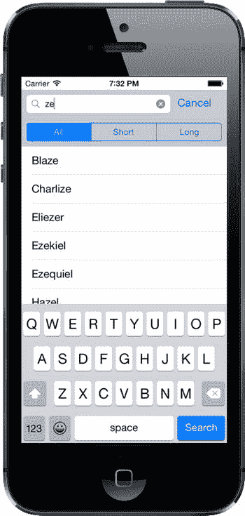

图 8-28. 添加了搜索栏的表格应用。请注意，在点击搜索栏之前，搜索栏在屏幕右侧显示为截断状态。

我们差不多完成了——但还有一件事需要修复。回顾 图 8-27 左侧，你会发现一个视觉“缺陷”：搜索栏似乎在靠近右边缘处被神秘地截断了。实际上，你看到的是右侧垂直分区索引栏的上端。我们的搜索栏是表格视图的一部分（因为我们将其设置为标题视图）。当表格视图显示分区索引时，它会自动将其所有其他视图从右侧挤压。由于默认的分区索引背景颜色是白色，它几乎与表格视图的行融为一体，导致其在搜索栏旁边格外显眼！

为了解决这个问题，我们为原始表格中的分区索引设置一些颜色。我们将使用对比色，使其在整个表格上下都显得醒目，这样用户就能更清晰地看到发生了什么。只需在 `ViewController.m` 的 `viewDidLoad` 方法末尾添加以下几行代码：

```
self.tableView.sectionIndexBackgroundColor =
               [UIColor blackColor];
self.tableView.sectionIndexTrackingBackgroundColor =
               [UIColor darkGrayColor];
self.tableView.sectionIndexColor = [UIColor whiteColor];
```

首先，我们设置分区索引的主要背景颜色，即用户未触摸时看到的颜色。然后，设置跟踪背景颜色，以便用户在触摸并沿边缘上下拖动时，整个列能稍微亮起。最后，设置索引项本身的文字颜色。图 8-29 展示了最终效果。

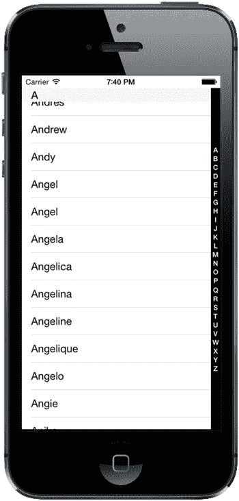

图 8-29. 通过更清晰的分区索引视觉效果，用户能更清楚地认识到这实际上是一个控件界面。

## 有多少个表格？：视图调试


`UISearchController`类在我们上一个例子中的两个表格之间切换得非常好——好到你几乎很难相信这里存在切换！除了你已经看到的所有代码之外，还有一些视觉线索：搜索表格是一个纯文本表格，因此你不会看到像主表格那样分组显示的名称，而且它也没有节索引。如果你想要更多证据，可以使用 Xcode 6 中一个名为 View Debugging 的便捷新功能来获取，该功能允许你截取正在运行的应用程序的视图层次结构快照，并在 Xcode 的编辑器区域中检查它们。此功能在模拟器和真实设备上都能工作，当你试图找出某个视图为何缺失或不在预期位置时，它可能在某个时候变得极其宝贵。

我们先来看看当应用程序显示完整名称列表时，View Debugging 会如何呈现。再次运行应用程序，在 Xcode 的菜单栏中，选择**Debug**  **View Debugging**  **Capture View Hierarchy**。Xcode 会从模拟器或设备中抓取视图层次结构，并像图 8-30 所示那样显示。

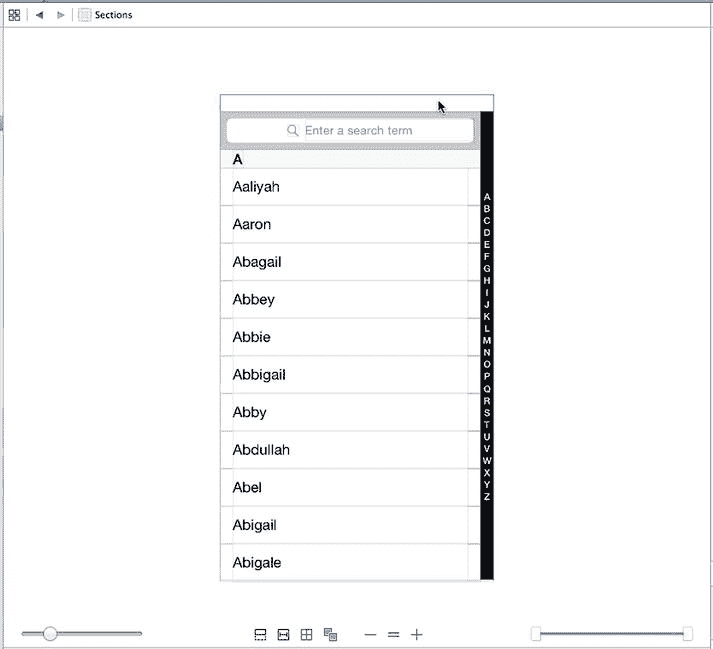

图 8-30. Sections 应用程序的视图层次结构

这看起来可能没什么用——我们实际上看不到比在模拟器中更多的东西。要揭示视图层次结构，你需要旋转应用程序的图像，以便能从“侧面”观察它。为此，请在编辑器区域中，在被捕获图像稍左的位置点击鼠标，然后向右拖动。随着你拖动，应用程序中的视图分层会显现出来。如果旋转约 45 度，你将看到类似图 8-31 的内容。

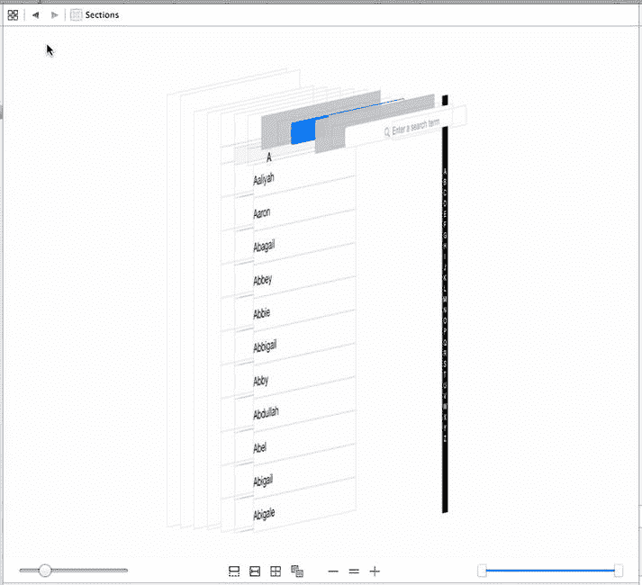

图 8-31. 检查应用程序的视图层次结构

如果你点击堆栈中的各个视图，你会看到顶部的跳转栏会发生变化，显示你点击的视图及其所有祖先视图的类名。从后向前点击每个视图，熟悉表格的构建方式。你应该能够找到视图控制器的主视图、表格视图本身、一些表格视图单元格、搜索栏、搜索栏索引，以及其他属于表格实现的各种视图。

现在让我们看看在搜索时视图层次结构是什么样子。Xcode 会暂停你的应用程序，以便你检查视图快照，因此首先通过点击**Debug**  **Continue**来恢复执行。然后开始在应用程序的搜索栏中输入内容，并使用**Debug**  **View Debugging**  **Capture View Hierarchy**再次捕获视图层次结构。当视图层次结构出现时，稍微旋转一下，你会看到类似图 8-32 的内容。

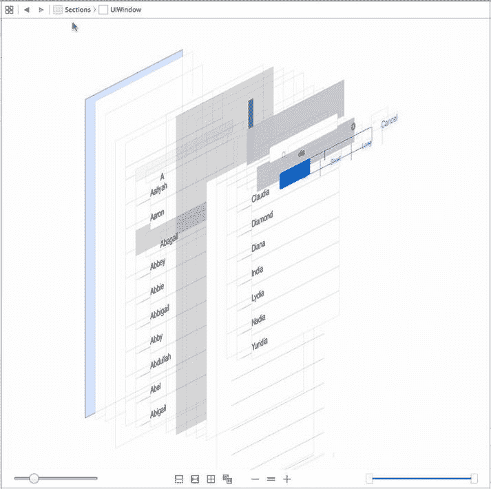

图 8-32. 使用搜索栏时的视图层次结构

现在很明显看出确实有两个表格在使用中。你可以在视图堆栈大约一半的位置看到原始表格，而在它上方（即右侧），你可以看到属于搜索结果视图控制器的表格视图。紧挨在它后面，有一层覆盖原始表格的半透明灰色视图——当你开始在搜索栏中输入时，这个视图会调暗原始表格。

可以尝试一下编辑器底部的按钮——你可以使用它们来打开或关闭 Auto Layout 约束的显示、将视图重置为图 8-30 所示的俯视图、以及放大和缩小。你也可以使用左侧的滑块来改变视图之间的间距，使用右侧的滑块来移除层次结构顶部或底部的图层，以便看到它们后面的内容。View Debugging 是一个非常强大的工具！

## 综合运用

嗯，你做得怎么样？这一章内容相当丰富，你学了很多东西！你现在应该对平面表格的工作原理有了非常扎实的理解。你应该知道如何自定义表格和表格视图单元格，以及如何配置表格视图。你还了解了如何实现搜索栏，这在任何呈现大量数据的 iOS 应用程序中都是一个至关重要的工具。最后，你认识了 View Debugging，这是 iOS 8 中一个崭新且极其有用的功能。请确保你理解了本章中我们做的一切，因为我们将在其基础上继续构建。

在下一章中，我们将继续使用表格视图。例如，你将学习如何使用它们来呈现分层数据。你还将看到如何创建允许用户编辑在表格视图中选择的数据的内容视图，以及如何在表格中呈现复选框、在表格行中嵌入控件和删除行。

