# 第 9 章 导航控制器与表格视图

在上一章中，你掌握了使用表格视图的基础知识。在本章中，你将获得更多的练习，因为我们将探索**导航控制器**。

表格视图和导航控制器紧密配合。严格来说，导航控制器并不需要表格视图来实现其功能。然而，在实际应用中，当你实现一个导航控制器时，几乎总是至少实现一个表格（通常是多个），因为导航控制器的优势在于它能够轻松处理复杂的分层数据。在 iPhone 的小屏幕上，分层数据最好通过连续的表格视图来呈现。

在本章中，我们将像在第 7 章中构建 Pickers 应用程序一样，逐步构建一个应用程序。我们将使导航控制器和根视图控制器工作起来，然后开始向层次结构中添加更多的控制器和层。我们创建的每个视图控制器都将强化表格使用或配置的某个方面：

*   如何从表格视图向下钻取到子表格视图
*   如何从表格视图向下钻取到内容视图，在那里可以查看甚至编辑详细数据
*   如何在表格视图中使用多个节
*   如何使用编辑模式允许从表格视图中删除行
*   如何使用编辑模式让用户重新排列表格视图中的行

内容很多，不是吗？好吧，让我们开始介绍导航控制器。

## 导航控制器基础

你将用于构建分层应用程序的主要工具是`UINavigationController`。`UINavigationController`与`UITabBarController`类似，因为它管理并交换多个内容视图。两者之间的主要区别在于，`UINavigationController`是作为堆栈实现的，这使其非常适合处理层次结构。

你已经了解了关于堆栈的一切吗？如果是这样，请快速浏览下一小节（或完全跳过），我们将在下一小节“一堆控制器”的开头等你。如果你不熟悉堆栈，请继续阅读。幸运的是，堆栈是一个相当容易理解的概念。

### 堆栈之美


`stack`（栈）是一种常用的数据结构，其工作原理遵循“后进先出”原则。信不信由你，Pez 糖果盒就是栈的一个绝佳示例。你试过装填它吗？根据每个 Pez 糖果盒附带的说明小纸条，操作很简单。首先，拆开 Pez 糖果的包装。第二步，将糖果盒的头向后仰，打开盒子。第三步，拿起糖果叠（注意我们巧妙地在这里插入了“堆叠”这个词！），用食指和拇指紧紧捏住，然后将整列糖果插入打开的盒子中。第四步，捡起所有散落一地的糖果碎块——因为这些说明从来就不管用。

好吧，到目前为止，这个例子并不是特别有用。但接下来发生的事情就有关了。当你一个一个地捡起糖果块，把它们塞进盒子里时，你就正在使用栈。记住我们说过栈是后进先出吗？这也意味着先进后出。你塞进盒子里的第一块 Pez 糖果，将是最后弹出来的那块。你最后塞进去的那块 Pez 糖果，将是第一个弹出来的。计算机的栈遵循同样的规则：

-   当你向栈中添加对象时，这称为压入。你将一个对象压入栈。
-   你压入栈的第一个对象称为栈底。
-   你最后压入栈的对象称为栈顶（至少在被下一个压入的对象取代之前是如此）。
-   当你从栈中移除对象时，这称为弹出。当你从栈中弹出一个对象时，它总是你最后压入栈的那个对象。反之，你第一个压入栈的对象将永远是你最后弹出栈的那个。

## 控制器堆栈

导航控制器维护着一个视图控制器的堆栈。当你设计导航控制器时，需要指定用户看到的第一个视图。正如我们在前几章讨论过的，该视图的控制器被称为`根视图控制器`，或简称`根控制器`，它是导航控制器视图控制器堆栈的基底。当用户选择要显示的下一个视图时，一个新的视图控制器会被压入堆栈，并且它所控制的视图就会显示出来。我们将这些新的视图控制器称为`子控制器`。正如你将看到的，本章的应用程序 Fonts，由一个导航控制器和几个子控制器组成。

看一下图 9-1。注意导航栏中居中的`标题`和导航栏左侧的`返回按钮`。导航栏的标题由导航控制器堆栈中顶部视图控制器的`title`属性填充，返回按钮的标题则由上一个视图控制器的标题填充。返回按钮的作用类似于网页浏览器的返回按钮。当用户点击该按钮时，当前视图控制器从堆栈中弹出，上一个视图成为当前视图。

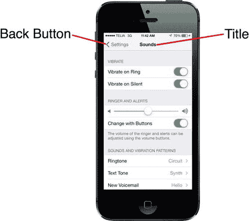

图 9-1。设置应用使用了导航控制器。左上角的返回按钮会将当前视图控制器从堆栈中弹出，将你带回层次结构中的上一层。同时还会显示当前内容视图控制器的标题

我们喜欢这种设计模式。它允许我们迭代式地构建复杂的层次化应用。我们不需要了解整个层次结构就能让一切运转起来。每个控制器只需要知道它的子控制器，这样当用户做出选择时，它就能将合适的新控制器对象压入堆栈。你可以通过这种方式，用许多小模块构建一个大型应用，这正是我们本章要做的事情。

导航控制器实际上是许多 iPhone 应用的核心与灵魂；然而，对于 iPad 应用来说，导航控制器扮演的角色则相对次要一些。一个典型的例子是 Mail 应用，它采用层次化的导航控制器，让用户可以在所有邮件服务器、文件夹和邮件之间导航。在 iPad 版的 Mail 中，导航控制器从不填满屏幕，而是显示为边栏或覆盖主视图一部分的临时视图。我们将在后面的第 11 章深入探讨这种用法。

## Fonts：一个简单的字体浏览器

我们将要构建的应用程序会向你展示如何完成与显示层次化数据相关的大多数常见任务。当应用程序启动时，你会看到一个所有包含在 iOS 中的`字体家族`列表，如图 9-2 所示。一个字体家族是一组紧密相关的字体，或者说是彼此风格变体的字体。例如，Helvetica、Helvetica-Bold、Helvetic-Oblique 以及其他变体都属于 Helvetica 字体家族。

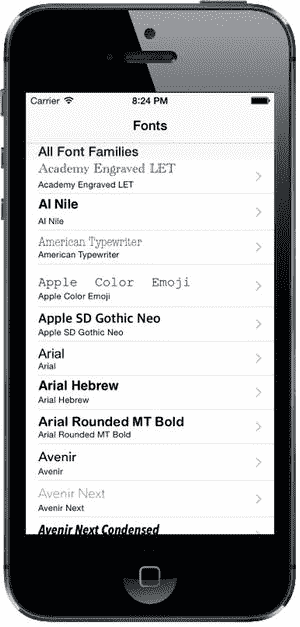

图 9-2。本章应用的根视图控制器。注意视图右侧的辅助图标。这种特定类型的辅助图标称为展开指示器。它告诉用户触摸该行会下钻到另一个表格视图

在此顶层视图中选择任何一行，都会将一个视图控制器压入导航控制器的堆栈。每一行右侧的图标被称为`辅助图标`。这个特定的辅助图标（灰色箭头）被称为`展开指示器`，它的存在让用户知道触摸该行会下钻到另一个表格视图。

## 认识子控制器

在我们开始构建 Fonts 应用程序之前，让我们快速浏览一下子控制器显示的每个视图。

### 字体列表控制器

触摸图 9-2 所示表格的任何一行，都会弹出图 9-3 所示的子视图。

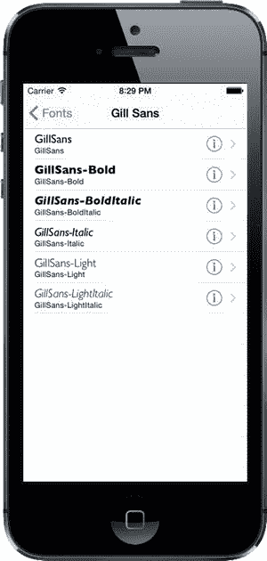

图 9-3。Fonts 应用的第一个子控制器实现了一个表格，其中每一行都包含一个详细展开按钮

图 9-3 中每一行右侧的辅助图标略有不同。这个辅助图标被称为`详细展开按钮`。与展开指示器不同，详细展开按钮不仅仅是一个图标——它是一个用户可以点击的控件。这意味着你可以为某一行提供两个不同的选项：当用户选择该行时触发一个操作，当用户点击该按钮时触发另一个操作。点击此辅助图标内的小信息按钮，应允许用户查看，或许还能编辑当前行更详细的信息。同时，右侧的箭头应指示用户，通过点击行中的其他位置可以找到更深层次的导航。

### 字体大小视图控制器

触摸图 9-3 所示表格的任何一行，都会弹出图 9-4 所示的子视图。

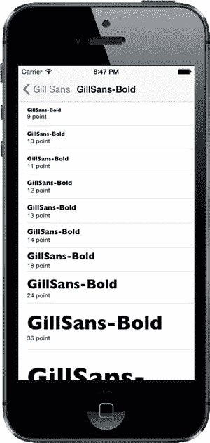

图 9-4。位于字体列表视图控制器下一层，字体大小视图控制器显示所选字体的多种大小，每行一种

以下是何时使用展开指示器和详细展开按钮的总结：


*   如果你只想为行点击提供单个选项，且行点击*仅*会导航到该行的更详细视图，请不要使用辅助图标。
*   如果行点击将导航到一个列出更多项（*不是*详情视图）的新视图，请使用披露指示器（右箭头）标记该行。
*   如果你需要为某行提供两个选项，请使用详细披露指示器或详细按钮标记该行。这样用户可以通过点击行进入新视图，或点击披露按钮查看更多详情。

## 字体信息视图控制器

我们最后的应用子控制器（也是唯一一个非表视图的控制器）如图 9-5 所示。该视图出现在你点击字体列表视图控制器（如图 9-2 所示）中任意行的信息图标时。

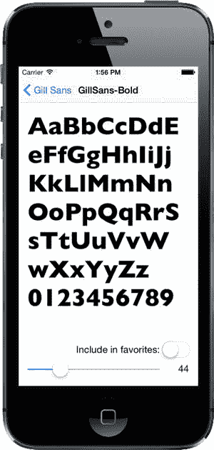

图 9-5. 字体应用中的最终视图控制器允许你以任意大小查看所选字体。

此视图允许用户拖拽滑块来调整显示字体的大小。它还包含一个开关，用户可通过它指定该字体是否应列入收藏列表。如果设置了任何收藏字体，它们会在根视图控制器中显示在一个单独的分组内。

## 字体应用框架

Xcode 提供了一个非常适合创建基于导航应用的模板，并且当你需要创建层级应用时，大多数情况下都会使用它。然而，今天我们不会使用那个模板。相反，我们将从头开始构建基于导航的应用，以便了解各部分是如何协同工作的。我们也会逐步分解讲解，这样应该很容易跟上进度。

在 Xcode 中，按 **N** 创建一个新项目。从 iOS 模板列表中选择 **Single View Application**，然后点击 **Next** 继续。将 **Product Name** 设置为 `Fonts`，**Language** 选择 `Objective-C`，**Devices** 选择 `Universal`。确保 **Use Core Data** 未被勾选，点击 **Next**，然后选择保存项目的路径。

### 设置导航控制器

现在我们需要为应用创建基本的导航结构。核心部分将是一个`UINavigationController`，它管理用户可以导航的视图控制器栈，以及一个显示顶层行列表的`UITableViewController`。事实证明，Interface Builder 使这变得非常容易。

选择`Main.storyboard`。模板已经为我们创建了一个基本的视图控制器，但我们需要使用`UINavigationController`，因此在编辑区域或文档大纲中选择该视图控制器并将其删除，使故事板为空。现在，使用对象库搜索`UINavigationController`，并将一个实例拖入编辑区域。你会看到实际上得到了两个场景而不是一个，这与你在第 7 章中创建标签视图控制器时看到的情况类似。左侧是`UINavigationController`本身。选择此控制器，打开属性检查器，并在 **View Controller** 部分勾选 **Is Initial View Controller**，使其成为应用启动时显示的控制器。

`UINavigationController`有一个连接到第二个场景的连线，该场景包含一个`UITableViewController`。你会看到表格的标题是 *Root View Controller*。点击该标题，打开属性检查器，然后将标题设置为 `Fonts`。

值得花点时间思考一下。通过将应用配置为从该故事板加载初始场景，我们具体得到了什么？首先，我们获得了由导航控制器创建的视图，这是一个组合视图，包含两个部分：屏幕顶部的导航栏（通常包含某种标题，并且左侧常有一个返回按钮）以及导航控制器当前视图控制器想要显示的内容。在我们的例子中，显示区域的下半部分将填充与导航控制器一起创建的表格视图。

随着我们的深入，你将学到更多关于如何控制导航控制器在导航栏中显示的内容。你还将理解导航控制器如何将焦点从一个下级视图控制器转移到另一个。现在，你已经打下了足够的基础，可以开始定义你的自定义视图控制器将执行什么操作了。

此时，应用框架基本完成。你会看到一个关于为原型表格单元设置复用标识符的警告，但我们可以暂时忽略它。保存所有文件，然后构建并运行应用。如果一切正常，应用应启动，并显示一个标题为 `Fonts` 的导航栏。目前尚未向表格视图提供任何显示内容的信息，因此此时不会显示任何行（参见图 9-6）。


图 9-6. 运行中的应用框架

### 跟踪收藏

在应用的多个地方，我们会让用户通过添加选择的字体、查看已收藏的完整列表以及从列表中移除字体来维护收藏字体列表。为了以一致的方式管理此列表，我们将创建一个新类，该类将持有一个收藏数组，并将其存储在用户的偏好设置中。你将在第 12 章中了解到更多关于用户偏好的内容，但这里我们只涉及一些基础。

首先，创建一个新类。在项目导航器中选择`Fonts`文件夹，然后按 **N** 打开新建文件助手。从 **iOS Source** 部分选择 **Cocoa Touch Class**，然后点击 **Next**。在接下来的屏幕上，将新类命名为`FavoritesList`，并在 **Subclass of** 字段中选择`NSObject`。创建完该类的文件后，选择`FavoritesList.h`并添加以下加粗显示的代码：

```objective-c
#import <Foundation/Foundation.h>

@interface FavoritesList : NSObject

+ (instancetype)sharedFavoritesList;

- (NSArray *)favorites;

- (void)addFavorite:(id)item;
- (void)removeFavorite:(id)item;

@end
```

在前面的代码片段中，我们声明了新类的 API。首先，我们声明了一个名为`sharedFavoritesList`的工厂方法，它返回该类的一个实例。无论此方法被调用多少次，都将始终返回同一个实例。其思想是`FavoritesList`应作为单例工作；我们将不在整个应用中使用多个实例，而是只使用一个实例。


**注**：`sharedFavoritesList`的声明使用了一个你可能不认识的返回类型：`instancetype`。这是 Objective-C 中较新的特性。现在建议所有原本使用`id`作为返回类型的工厂方法和`init`方法改用`instancetype`。使用`id`的问题在于缺乏类型安全性。过去，你很容易写出像`"NSString *s = [NSArray array];"`这样的错误代码，而编译器不会报错（尽管程序会在后续尝试将`NSString`的方法发送给创建的`NSArray`时崩溃）。使用`instancetype`可以在保持一定通用性的同时，告诉编译器返回值应限于消息接收者的类型（或其子类）。在 iOS 8 中，几乎所有 Apple 的公开 API 都使用`instancetype`替代了`id`。

接下来，我们定义了访问数组以及添加和删除元素的方法。

现在切换到`FavoritesList.m`开始实现。首先，在文件顶部创建一个类扩展并添加一个属性：

```objc
#import "FavoritesList.h"

@interface FavoritesList ()

@property (strong, nonatomic) NSMutableArray *favorites;

@end
```

注意，我们声明了一个类型为`NSMutableArray`的属性`favorites`。在头文件中，我们声明了一个返回`NSArray`的方法`favorites`。由于声明属性通常也会声明 getter 和 setter，这会导致冲突吗？幸运的是，不会。因为属性的类型是头文件中所用类型的子类，所以完全可以正常工作。这意味着在类内部，我们可以使用可变数组；但通过 API 暴露给外部的则是一个不可变的`NSArray`。该类的 API（定义于`FavoritesList.h`）应被所有代码使用者视为契约。如果其他代码深入探究，发现这个类实际返回的是`NSMutableArray`并直接使用，那么这种代码就破坏了契约，这不是我们的问题。

接下来，在`FavoritesList.m`中实现`sharedFavoritesList`工厂方法：

```objc
@implementation FavoritesList

+ (instancetype)sharedFavoritesList {
    static FavoritesList *shared = nil;
    static dispatch_once_t onceToken;
    dispatch_once(&onceToken, ^{
        shared = [[self alloc] init];
    });
    return shared;
}

@end
```

这段代码看起来复杂，但实际上只做了一件事：创建并返回类的新实例。创建部分被封装在传递给`dispatch_once()`函数的代码块中，这确保该代码块只执行一次。之后每次调用此方法时，实例已经创建，直接返回即可。

现在来实现`init`方法。在`@end`行之前添加以下代码：

```objc
- (instancetype)init {
    self = [super init];
    if (self) {
        NSUserDefaults *defaults = [NSUserDefaults standardUserDefaults];
        NSArray *storedFavorites = [defaults objectForKey:@"favorites"];
        if (storedFavorites) {
            self.favorites = [storedFavorites mutableCopy];
        } else {
            self.favorites = [NSMutableArray array];
        }
    }
    return self;
}
```

此方法使用`NSUserDefaults`类（详见第 12 章）检查偏好设置中是否存储了收藏项。如果有，则将其可变副本赋值给`favorites`属性；否则，创建一个新的空可变数组赋值。

最后，实现添加和移除收藏的方法，以及它们都会调用的即时保存更改方法。在`@end`行之前添加这两个方法：

```objc
- (void)addFavorite:(id)item {
    [_favorites insertObject:item atIndex:0];
    [self saveFavorites];
}

- (void)removeFavorite:(id)item {
    [_favorites removeObject:item];
    [self saveFavorites];
}

- (void)saveFavorites {
    NSUserDefaults *defaults = [NSUserDefaults standardUserDefaults];
    [defaults setObject:self.favorites forKey:@"favorites"];
    [defaults synchronize];
}
```

`addFavorite:`和`removeFavorite:`都非常直接。唯一值得注意的是，我们没有通过`self.favorites`（本书推荐的方式）访问数组，而是直接访问底层实例变量`_favorites`。原因很微妙：尽管我们在类扩展中将属性定义为`NSMutableArray`，但编译器在解析`self.favorites`时会使用头文件中`@interface`的声明，即不可变的`NSArray`！这种变通方式与常规风格不同，但可以正常工作。

这两个方法都调用了`saveFavorites`方法，该方法使用`NSUserDefaults`类将数组保存到用户偏好设置中。你将在第 12 章中了解更多工作原理；现在只需知道，我们使用的`NSUserDefaults`对象类似于一个持久化字典，存储其中的内容在下次请求时仍然可用，即使应用被停止并重启。

## 创建根视图控制器

现在准备开始开发第一个视图控制器。在上一章中，我们使用简单的字符串数组填充表格行。这里将做类似的事情，但这次使用`UIFont`类获取字体家族列表，并用这些字体家族的名称填充每一行。我们还将使用字体本身来显示字体名称，这样每一行都包含字体家族的预览。

是时候为这个应用创建第一个控制器类了。模板为我们创建了一个视图控制器，但名称`ViewController`用处不大，因为这个应用中有多个视图控制器。因此，首先在项目导航器中选择`ViewController.h`和`ViewController.m`，按**Delete**删除并移至废纸篓。接着，在项目导航器中选择`Fonts`文件夹，按**N**打开新建文件助手。从**iOS Source**部分选择**Cocoa Touch Class**，然后点击**Next**。在下一屏幕中，将新类命名为`RootViewController`，并将**Subclass of**设置为**UITableViewController**。点击**Next**，然后点击**Create**创建新类。在项目导航器中，选择`RootViewController.m`，在代码片段中添加粗体行，以导入收藏列表的头文件并添加几个属性：

```objc
#import "RootViewController.h"
#import "FavoritesList.h"

@interface RootViewController ()

@property (copy, nonatomic) NSArray *familyNames;
@property (assign, nonatomic) CGFloat cellPointSize;
@property (strong, nonatomic) FavoritesList *favoritesList;

@end
```

我们将在开始时为每个属性赋值，然后在类使用过程中的不同时刻使用它们。`familyNames`数组将包含所有要显示的字体家族列表；`cellPointSize`属性包含要在所有表格视图单元格中使用的字体大小；`favoritesList`包含指向`FavoritesList`单例的指针。

**注意**：你可能注意到`familyNames`属性使用了`copy`关键字而不是`strong`。这是为什么？为什么我们要随意复制数组？原因在于可变数组的可能性。


设想一下，如果我们使用 `strong` 声明了该属性，并且外部代码传入了一个 `NSMutableArray` 实例来设置 `familyNames` 属性的值。如果原始调用方稍后决定更改该数组的内容，那么 `RootViewController` 实例将陷入不一致的状态，导致 `familyNames` 的内容与屏幕显示的内容不再同步！使用 `copy` 可以消除此风险，因为对任何 `NSArray`（包括其可变子类）调用 `copy` 总是能返回一个不可变的副本。同时，我们也无需过分担心性能影响。实际上，对任何不可变对象发送 `copy` 消息并不会真正复制该对象。相反，它会在增加引用计数后返回同一个对象。实际上，对不可变对象调用 `copy` 与调用 `retain` 的效果相同——这正是 ARC 在你设置 `strong` 属性时可能在后台执行的操作。因此，这对每个人都非常合适，因为这个对象永远不会改变。

这种情况适用于所有基类不可变但存在可变子类的“值类”。这些值类包括 `NSArray`、`NSDictionary`、`NSSet`、`NSString`、`NSData` 等。任何时候，如果你希望将此类实例作为属性持有，都应该使用 `copy` 而非 `strong` 来声明属性的存储方式，以避免出现问题。

通过向 `viewDidLoad` 方法中添加以下粗体代码，来设置该类的所有属性：

```
- (void)viewDidLoad {
    [super viewDidLoad];

self.familyNames = [[UIFont familyNames]
                        sortedArrayUsingSelector:@selector(compare:)];
    UIFont *preferredTableViewFont = [UIFont preferredFontForTextStyle:
                                      UIFontTextStyleHeadline];
    self.cellPointSize = preferredTableViewFont.pointSize;
    self.favoritesList = [FavoritesList sharedFavoritesList];
}
```

在上面的代码片段中，我们通过向 `UIFont` 类请求所有已知的字体系列名称，并对结果数组进行排序，从而填充了 `familyNames`。接着，我们再次使用 `UIFont` 来获取标题首选的字体。这是通过 iOS 7 新增的一项功能实现的，该功能基于“设置”应用中可指定的字体大小设置。这种动态字体大小功能允许用户设置全局系统范围的字体缩放比例。这里，我们利用该字体的 `pointSize` 属性建立了一个基准字体大小，以便在此视图控制器的其他部分使用。最后，我们获取了单例的收藏列表对象。

在继续之前，让我们删除 `didReceiveMemoryWarning` 方法，以及任何被注释掉的表视图代理或数据源方法——在这个类中我们不会用到它们。

这个视图控制器的设计思路是展示两个分区。第一个分区列出所有可用的字体系列，每个系列都可以导航到该系列中的所有字体列表。第二个分区是“收藏”，其中只包含一个条目，用户点击后可以进入他们的收藏字体列表。但是，如果用户没有收藏（例如，应用首次启动时），我们最好完全不显示第二个分区，因为它只会将用户导向一个空列表。因此，我们将在本类的后续部分采取一些措施来应对这种情况。首先，我们需要实现以下方法，该方法会在根视图控制器的视图显示在屏幕之前被调用：

```
- (void)viewWillAppear:(BOOL)animated {
    [super viewWillAppear:animated];
    [self.tableView reloadData];
}
```

这样做的原因是，我们即将显示的内容集合可能会在不同显示时机之间发生变化。例如，用户起初可能没有收藏，但随后深入浏览，查看某个字体并将其设为收藏，然后返回根视图。此时，我们需要重新加载表视图，以便让第二个分区显示出来。

接下来，我们将实现一个在该类内部使用的工具方法。在通过数据源方法配置表视图的若干环节中，我们需要能够确定要在某个单元格中显示哪个字体。我们将此功能封装到一个独立的方法中：

```
- (UIFont *)fontForDisplayAtIndexPath:(NSIndexPath *)indexPath {
    if (indexPath.section == 0) {
        NSString *familyName = self.familyNames[indexPath.row];
        NSString *fontName = [[UIFont fontNamesForFamilyName:familyName]
                                             firstObject];
        return [UIFont fontWithName:fontName size:self.cellPointSize];
    } else {
        return nil;
    }
}
```

上述方法使用了 `UIFont` 类，首先查找给定字体系列名称下的所有字体名称，然后获取该系列中的第一个字体名称。我们无法确切知道该系列中第一个命名的字体是否是代表整个系列的最佳选择，但这至少是一个合理的猜测。

现在，让我们进入这个视图控制器的核心部分：表视图数据源方法。首先，看一下分区数量：

```
- (NSInteger)numberOfSectionsInTableView:(UITableView *)tableView {
#warning Potentially incomplete method implementation.
    // Return the number of sections.
    if ([self.favoritesList.favorites count] > 0) {
        return 2;
    } else {
        return 1;
    }
    return 0;
}
```

我们通过收藏列表来决定是否显示第二个分区。接下来，处理每个分区的行数：

```
- (NSInteger)tableView:(UITableView *)tableView
            numberOfRowsInSection:(NSInteger)section {
#warning Incomplete method implementation.
    // Return the number of rows in the section.
    if (section == 0) {
        return [self.familyNames count];
    } else {
        return 1;
    }
    return 0;
}
```

这个也很简单。我们仅通过分区编号来判断该分区是显示所有字体系列名称，还是显示一个链接到收藏列表的单元格。现在，我们来定义另一个方法，这是 `UITableViewDataSource` 协议中的一个可选方法，允许我们为每个分区指定标题：

```
- (NSString *)tableView:(UITableView *)tableView
               titleForHeaderInSection:(NSInteger)section {
    if (section == 0) {
        return @"All Font Families";
    } else {
        return @"My Favorite Fonts";
    }
}
```

这又是一个直截了当的方法。它通过分区编号来决定使用哪个分区标题。每个表视图数据源都必须实现的最后一个核心方法是配置每个单元格的方法，我们的实现如下：

```
- (UITableViewCell *)tableView:(UITableView *)tableView
         cellForRowAtIndexPath:(NSIndexPath *)indexPath {
    static NSString *FamilyNameCell = @"FamilyName";
    static NSString *FavoritesCell = @"Favorites";
    UITableViewCell *cell = nil;

// Configure the cell...
    if (indexPath.section == 0) {
        cell = [tableView dequeueReusableCellWithIdentifier:FamilyNameCell
                                               forIndexPath:indexPath];
        cell.textLabel.font = [self fontForDisplayAtIndexPath:indexPath];
        cell.textLabel.text = self.familyNames[indexPath.row];
        cell.detailTextLabel.text = self.familyNames[indexPath.row];
    } else {
        cell = [tableView dequeueReusableCellWithIdentifier:FavoritesCell
                                               forIndexPath:indexPath];
    }

return cell;
}
```


我们定义了两个不同的单元格标识符，用于从故事板加载两个不同的单元格原型（就像我们在第 8 章中从 nib 文件加载表格单元格一样）。我们还没有配置这些单元格原型，但很快就会配置！接下来，我们使用分区编号来确定要为当前`indexPath`显示哪个单元格。如果该单元格用于显示字体家族名称，则将家族名称放入其`label`和`detailLabel`中。我们还在文本标签中使用该家族中的一种字体（通过`fontForDisplayAtIndexPath:`方法获取），这样我们既能看到以该字体本身显示的字体家族名称，也能看到以标准系统字体显示的较小版本。

## 初始故事板设置

现在我们有了一个期望能显示内容的视图控制器，接下来配置故事板以实现功能。在项目导航器中选择`Main.storyboard`。你会看到我们之前添加的导航控制器和表格视图控制器。首先需要配置的是表格视图控制器。默认情况下，该控制器的类被设置为`UITableViewController`。我们需要将其改为我们的根视图控制器类。在文档大纲中，选择标有**Root View Controller**的黄色图标，然后使用标识检查器将视图控制器的**Class**改为`RootViewController`。

我们现在需要做的另一项配置是设置一对原型单元格，以匹配我们在代码中使用的单元格标识符。一开始，表格视图有一个原型单元格。选中它并按**D**键进行复制，你会看到现在有了两个单元格。选中第一个，然后使用属性检查器将其**Style**设置为`Subtitle`，**Identifier**设置为`FamilyName`，**Accessory**设置为`Disclosure Indicator`。接下来，选中第二个原型单元格，将其**Style**设置为`Basic`，**Identifier**设置为`Favorites`，**Accessory**设置为`Disclosure Indicator`。另外，双击单元格中显示的标题，将文本从`Title`改为`Favorites`。

**提示**  ：本示例中使用的原型单元格都是标准的表格视图单元格样式。如果你将**Style**设置为`Custom`，则可以直接在单元格原型中设计单元格布局，就像你在第 8 章中在 nib 文件中创建单元格一样。

现在，在设备或模拟器上构建并运行此应用，你应该会看到一个漂亮的字体列表。稍微滚动一下，你会发现并非所有字体的文本高度都相同。例如，滚动到最后，你会看到 Zapfino 字体的示例文本远大于其他所有字体，如图 9-7 所示。尽管如此，所有单元格都足够高以容纳其内容，尽管我们并没有做任何特殊处理来实现这一点。

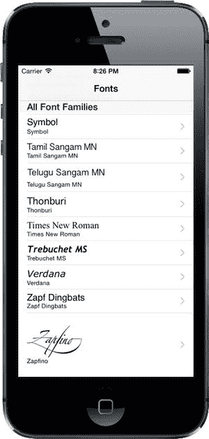

图 9-7。根视图控制器显示已安装的字体家族

正如你在第 8 章中所看到的，这是因为 iOS 8 中有一个新功能，可以为遵循特定规则的单元格计算正确的单元格高度。在这里，我们使用的是标准的表格视图单元格样式，它们开箱即用即遵循这些规则。在更早的 iOS 版本中，你需要实现`UITableViewDelegate`协议方法`tableView:heightForRowAtIndexPath:`才能达到同样的效果。

## 第一个子控制器：字体列表视图

我们的应用目前只显示字体家族列表，没有更多功能。我们希望添加用户触摸字体家族即可查看其包含的所有字体的功能。因此，让我们创建一个新的视图控制器来管理字体列表。使用 Xcode 的新建文件助手创建一个名为`FontListViewController`的新 Objective-C 类，作为`UITableViewController`的子类。创建该类后，选择其头文件并添加以下属性：

```
#import <UIKit/UIKit.h>

@interface FontListViewController : UITableViewController

@property (copy, nonatomic) NSArray *fontNames;
@property (assign, nonatomic) BOOL showsFavorites;

@end
```

`fontNames`属性用于告诉此视图控制器要显示什么。我们还创建了一个`showsFavorites`属性，用于让此视图控制器知道它是在显示收藏夹列表，还是仅显示一个家族中的字体列表，因为稍后这会很有用。

现在切换到`FontListController.m`，导入一个头文件并在文件顶部声明一个属性：

```
#import "FontListViewController.h"
#import "FavoritesList.h"

@interface FontListViewController ()

@property (assign, nonatomic) CGFloat cellPointSize;

@end
```

我们将使用`cellPointSize`属性来保存显示每种字体的首选显示大小，再次使用`UIFont`来找到首选大小。我们通过如下方式实现`viewDidLoad`：

```
- (void)viewDidLoad {
    [super viewDidLoad];

// Uncomment the following line to preserve selection between presentations.
    // self.clearsSelectionOnViewWillAppear = NO;

// Uncomment the following line to display an Edit button in the navigation
    // bar for this view controller.
    // self.navigationItem.rightBarButtonItem = self.editButtonItem;

UIFont *preferredTableViewFont = [UIFont preferredFontForTextStyle:
                                                              UIFontTextStyleHeadline];
    self.cellPointSize = preferredTableViewFont.pointSize;
}
```

接下来我们要创建一个小的实用方法，用于选择每行要显示的字体，类似于我们在`RootViewController`中的做法。不过这里略有不同。在此视图控制器中，我们持有的是字体名称列表，而不是字体家族列表。我们将使用`UIFont`类来获取每个命名的字体，如下所示：

```
- (UIFont *)fontForDisplayAtIndexPath:(NSIndexPath *)indexPath {
    NSString *fontName = self.fontNames[indexPath.row];
    return [UIFont fontWithName:fontName size:self.cellPointSize];
}
```

现在是时候以`viewWillAppear:`实现的形式添加一个小补充了。还记得在`RootViewController`中，我们实现了这个方法以防止收藏夹列表可能发生变化而需要刷新吗？同样的情况也适用于此。这个视图控制器可能正在显示收藏夹列表，用户可能切换到另一个视图控制器，更改了一个收藏项（我们稍后会讲到），然后返回此处。这时我们需要重新加载表格视图，而此方法正好处理了这一点：

```
- (void)viewWillAppear:(BOOL)animated {
    [super viewWillAppear:animated];
    if (self.showsFavorites) {
        self.fontNames = [FavoritesList sharedFavoritesList].favorites;
        [self.tableView reloadData];
    }
}
```

基本思路是，正常情况下，此视图控制器在显示之前会接收到一个字体名称列表，并且在视图控制器存在的整个期间，该列表保持不变。在一种特定情况下（稍后你会看到），此视图控制器需要重新加载其字体列表。

继续，我们完全删除`numberOfSectionsInTableView:`方法。这里我们只需要一个分区，跳过该方法相当于实现了它并返回`1`。接下来，我们实现另外两个主要的数据源方法，如下所示：


```objectivec
- (NSInteger)tableView:(UITableView *)tableView
          numberOfRowsInSection:(NSInteger)section {
#warning Incomplete method implementation.
    // 返回该分段中的行数
    return [self.fontNames count];
    return 0;
}

- (UITableViewCell *)tableView:(UITableView *)tableView
              cellForRowAtIndexPath:(NSIndexPath *)indexPath {
    static NSString *CellIdentifier = @"FontName";
    UITableViewCell *cell = [tableView
                             dequeueReusableCellWithIdentifier:CellIdentifier
                             forIndexPath:indexPath];

    // 配置单元格...
    cell.textLabel.font = [self fontForDisplayAtIndexPath:indexPath];
    cell.textLabel.text = self.fontNames[indexPath.row];
    cell.detailTextLabel.text = self.fontNames[indexPath.row];

    return cell;
}
```

这两个方法其实无需过多解释，因为它们与我们之前在 `RootViewController` 中使用的方法类似，甚至更为简单。

稍后我们将向该类添加更多内容，但首先让我们看看它的实际效果。为此，我们需要进一步配置故事板，然后对 `RootViewController` 进行一些修改。切换到 `Main.storyboard` 开始操作。

### 为字体列表设计故事板

当前故事板中包含一个表视图控制器，用于显示字体家族列表，该控制器嵌入在导航控制器中。我们需要增加一层新的深度，以纳入用于显示特定字体家族字体的视图控制器。在对象库中找到表视图控制器，将其拖拽到编辑区域中现有表视图控制器的右侧。选中新的表视图控制器，使用标识检查器将其类设置为 `FontListViewController`。选中表格中的原型单元格，打开属性检查器进行一些调整。将其**样式**更改为 `Subtitle`，**标识符**更改为 `FontName`，**辅助视图**更改为 `Detail Disclosure`。使用详细披露辅助视图将让此类型的行响应两种点击操作，从而使用户可以根据点击辅助视图还是行中的其他部分，触发两种不同的操作。

让一个视图控制器中的用户操作触发另一个视图控制器的实例化与显示，一种方法是创建连接两者的**segue**（转场）。对许多人来说，这可能是一个陌生的词汇，所以我们先解释清楚：segue 本质上意味着“过渡”，有时作家和电影制作人用它来描述从一个段落或场景平滑地过渡到下一个。苹果本可以更直接地将其称为“transition”（过渡）；但由于这个词在 UIKit API 的其他地方已经出现，或许苹果决定使用一个独特的术语来避免混淆。我们还应在此说明，“segue”这个词的发音与赛格威（Segway）个人交通工具产品完全相同（现在你知道赛格威为什么叫这个名字了）。

通常，转场完全是在 Interface Builder 中创建的。其理念是，一个场景中的操作可以触发一个转场，以加载并显示另一个场景。如果你在使用导航控制器，转场可以自动将下一个控制器推入导航栈。我们将从现在开始在应用中使用这一功能！

为了让根视图控制器中的单元格能够显示字体列表视图控制器，你需要创建几个连接两个场景的转场。只需按住 Control 键，从字体场景中两个原型单元格中的第一个拖拽到新场景即可；当你拖拽时，整个场景会高亮显示，表示已准备好连接，如图 Figure 9-8 所示。

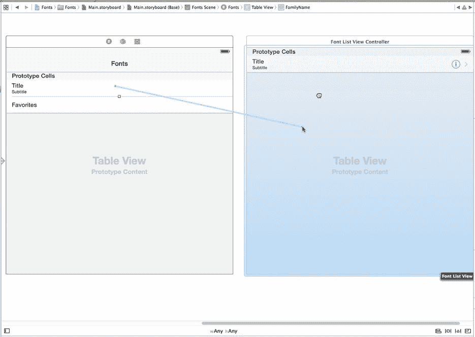

图 9-8. 从字体列表控制器到字体名称控制器创建显示转场


释放鼠标按钮，然后从弹出的菜单中选择**显示**（位于**选择转场**部分）。现在对另一个原型单元格执行相同操作。创建这些转场意味着一旦用户点击这些单元格中的任何一个，连接另一端的视图控制器将被分配并准备就绪。

#### 让根视图控制器为转场做准备

保存更改并切换回`RootViewController.m`。请注意，我们这里讨论的不是最新的类`FontListViewController`，而是它的“父”控制器。你需要在此处通过准备新的`FontListViewController`（由你刚刚创建的某个转场指定）进行显示，并传递其所需的值，来响应用户在根列表视图中的触摸操作。首先导入新类的头文件：

```objectivec
#import "RootViewController.h"
#import "FavoritesList.h"
#import "FontListViewController.h"
```

新视图控制器的实际准备工作是使用`prepareForSegue:sender:`方法完成的。按如下所示添加此方法的实现：

```objectivec
#pragma mark - Navigation

- (void)prepareForSegue:(UIStoryboardSegue *)segue sender:(id)sender {
    // 使用 [segue destinationViewController] 获取新的视图控制器。
    // 将选中的对象传递给新的视图控制器。
    NSIndexPath *indexPath = [self.tableView indexPathForCell:sender];
    FontListViewController *listVC = segue.destinationViewController;
    if (indexPath.section == 0) {
        NSString *familyName = self.familyNames[indexPath.row];
        listVC.fontNames = [[UIFont fontNamesForFamilyName:familyName]
                                sortedArrayUsingSelector:@selector(compare:)];
        listVC.navigationItem.title = familyName;
        listVC.showsFavorites = NO;
    } else {
        listVC.fontNames = self.favoritesList.favorites;
        listVC.navigationItem.title = @"Favorites";
        listVC.showsFavorites = YES;
    }
}
```

此方法使用`sender`（被点击的`UITableViewCell`）来确定点击了哪一行，并向`segue`询问其`destinationViewController`，即即将显示的`FontListViewController`实例。然后，根据用户点击的是字体族（分区 0）还是收藏单元格（分区 1），我们将一些值传递给新的视图控制器。除了设置目标视图控制器的自定义属性外，我们还访问控制器的`navigationItem`属性来设置`title`。`navigationItem`属性是`UINavigationItem`的一个实例，这是一个 UIKit 类，包含关于任何给定视图控制器在导航栏中应显示内容的信息。

现在运行应用。你会看到，点击任意字体族的名称，都会显示其包含的所有单个字体列表，如图 9-3 所示。此外，你可以点击字体列表导航控制器标题中的**字体**标签，返回其父控制器以选择其他字体。

#### 创建字体大小视图控制器

然而，你会注意到，应用目前不允许你继续深入。图 9-4 和 9-5 显示了允许你以多种方式查看所选字体的额外屏幕，我们尚未达到那一步。但很快我们就能做到了！让我们创建图 9-4 所示的视图，该视图同时显示多种字体大小。使用与创建`FontListViewController`相同的步骤，添加一个新的视图控制器，继承自`UITableViewController`，并将其命名为`FontSizesViewController`。这个类从其父控制器所需的唯一参数是一个字体，你应将其添加到`FontSizesViewController.h`中，如下所示：

```objectivec
#import <UIKit/UIKit.h>

@interface FontSizesViewController : UITableViewController

@property (strong, nonatomic) UIFont *font;

@end
```

现在切换到`FontSizesViewController.m`。这将是一个非常简单的表格视图控制器，仅实现一些标准的表格视图数据源方法，外加一些私有的内部方法。首先，继续删除`viewDidLoad`、`didReceiveMemoryWarning`和`numberOfSectionsInTableView:`方法，以及底部所有被注释掉的方法。同样，你不会需要这些。

你需要的是一些内部私有方法。一个方法将返回所选字体将显示的磅值列表。另一个方法将返回一个对应于索引路径的字体，类似于我们其他每个视图控制器中使用的方法：

```objectivec
- (NSArray *)pointSizes {
    static NSArray *pointSizes = nil;
    static dispatch_once_t onceToken;
    dispatch_once(&onceToken, ^{
        pointSizes = @[@9,
                       @10,
                       @11,
                       @12,
                       @13,
                       @14,
                       @18,
                       @24,
                       @36,
                       @48,
                       @64,
                       @72,
                       @96,
                       @144];
    });
    return pointSizes;
}

- (UIFont *)fontForDisplayAtIndexPath:(NSIndexPath *)indexPath {
    NSNumber *pointSize = self.pointSizes[indexPath.row];
    return [self.font fontWithSize:pointSize.floatValue];
}
```

请注意，`pointSizes`方法使用了我们之前用过的`dispatch_once()`函数，以确保一段代码只运行一次。在这里，它初始化一个数字列表，用于为表格中的每一行指定字体。

对于此视图控制器，我们将跳过指定要显示的分区数的方法，因为我们只使用默认数量（1）。然而，我们必须实现指定行数和每个单元格内容的方法。以下是这两个方法：

```objectivec
- (NSInteger)tableView:(UITableView *)tableView
                numberOfRowsInSection:(NSInteger)section {
#warning 方法实现不完整。
    // 返回分区中的行数。
    return [self.pointSizes count];
    return 0;
}

- (UITableViewCell *)tableView:(UITableView *)tableView
         cellForRowAtIndexPath:(NSIndexPath *)indexPath {
    static NSString *CellIdentifier = @"FontNameAndSize";
    UITableViewCell *cell = [tableView
                             dequeueReusableCellWithIdentifier:CellIdentifier
                             forIndexPath:indexPath];

// 配置单元格...
    cell.textLabel.font = [self fontForDisplayAtIndexPath:indexPath];
    cell.textLabel.text = self.font.fontName;
    cell.detailTextLabel.text = [NSString stringWithFormat:@"%@ point",
                                 self.pointSizes[indexPath.row]];

return cell;
}
```

这些方法中没有任何我们未见过的内容，所以让我们继续为此设置 GUI。

#### 为字体大小视图控制器绘制 Storyboard

返回`Main.storyboard`，将另一个表格视图控制器拖入编辑区域。使用身份检查器将其类设置为`FontSizesViewController`。你需要从它的父控制器`FontListViewController`建立转场连接。所以找到该控制器，按住 Control 键从其原型单元格拖到最新的视图控制器，然后从弹出的菜单中选择**显示**（位于**选择转场**部分）。接下来，选择你刚刚添加的新场景中的原型单元格，然后使用属性检查器将其**样式**设置为*副标题*，**标识符**设置为*FontNameAndSize*。

#### 让字体列表视图控制器为转场做准备


现在，就像之前扩展 storyboard 的导航层级时一样，我们需要跳转到父控制器，以便它能够配置其子控制器。这意味着需要进入`FontListViewController.m`，并导入新子控制器的头文件：

```objc
#import "FontListViewController.h"
#import "FavoritesList.h"
#import "FontSizesViewController.h"
```

接下来，在`@implementation`部分的底部，像这样实现`prepareForSegue:sender:`方法：

```objc
#pragma mark - Navigation

- (void)prepareForSegue:(UIStoryboardSegue *)segue sender:(id)sender {
    // Get the new view controller using [segue destinationViewController].
    // Pass the selected object to the new view controller.
    NSIndexPath *indexPath = [self.tableView indexPathForCell:sender];
    UIFont *font = [self fontForDisplayAtIndexPath:indexPath];
    [segue.destinationViewController navigationItem].title = font.fontName;

    FontSizesViewController *sizesVC = segue.destinationViewController;
    sizesVC.font = font;
}
```

这些代码现在看起来应该相当熟悉了，因此我们不再赘述。

运行应用，选择一个字体家族，然后选择一个字体（通过轻点行中除了右侧附件之外的任意位置），现在你将看到图 9-4 中所示的多尺寸列表。

## 创建字体信息视图控制器

我们要创建的最后一个视图控制器如图 9-5 所示。这个控制器并非基于表格视图，而是包含了一个大的文本标签、一个用于设置文本大小的滑块，以及一个用于切换是否将该字体加入收藏列表的开关。在你的项目中创建一个新的 Cocoa Touch 类，使用`UIViewController`作为父类，并将其命名为`FontInfoViewController`。与应用中的大多数其他控制器一样，这个控制器也需要由其父控制器传入几个参数。通过在`FontInfoViewController.h`中定义以下属性来实现这一点：

```objc
#import <UIKit/UIKit.h>

@interface FontInfoViewController : UIViewController

@property (strong, nonatomic) UIFont *font;
@property (assign, nonatomic) BOOL favorite;

@end
```

现在切换到`FontInfoViewController.m`，在顶部添加一个导入语句和几个`IBOutlet`属性：

```objc
#import "FontInfoViewController.h"
#import "FavoritesList.h"

@interface FontInfoViewController ()

@property (weak, nonatomic) IBOutlet UILabel *fontSampleLabel;
@property (weak, nonatomic) IBOutlet UISlider *fontSizeSlider;
@property (weak, nonatomic) IBOutlet UILabel *fontSizeLabel;
@property (weak, nonatomic) IBOutlet UISwitch *favoriteSwitch;

@end
```

接下来，实现`viewDidLoad`以及两个动作方法，它们将分别由滑块和开关触发：

```objc
- (void)viewDidLoad
{
    [super viewDidLoad];
    // Do any additional setup after loading the view.

    self.fontSampleLabel.font = self.font;
    self.fontSampleLabel.text = @"AaBbCcDdEeFfGgHhIiJjKkLlMmNnOoPpQqRrSsTtUuVv"
                                "WwXxYyZz 0123456789";
    self.fontSizeSlider.value = self.font.pointSize;
    self.fontSizeLabel.text = [NSString stringWithFormat:@"%.0f",
                               self.font.pointSize];
    self.favoriteSwitch.on = self.favorite;
}

- (IBAction)slideFontSize:(UISlider *)slider {
    float newSize = roundf(slider.value);
    self.fontSampleLabel.font = [self.font fontWithSize:newSize];
    self.fontSizeLabel.text = [NSString stringWithFormat:@"%.0f", newSize];
}

- (IBAction)toggleFavorite:(UISwitch *)sender {
    FavoritesList *favoritesList = [FavoritesList sharedFavoritesList];
    if (sender.on) {
        [favoritesList addFavorite:self.font.fontName];
    } else {
        [favoritesList removeFavorite:self.font.fontName];
    }
}
```

这些方法都非常直接明了。`viewDidLoad`方法根据所选字体设置显示内容；`slideFontSize:`根据滑块的值更改`fontSampleLabel`标签中字体的大小；`toggleFavorite:`则根据开关的值将当前字体添加到收藏列表或从中移除。

### 为字体信息视图控制器构建 Storyboard

现在返回`Main.storyboard`，为应用的最后一个视图控制器构建图形用户界面。使用对象库找到一个普通的视图控制器（View Controller），将其拖入编辑区域，并使用身份检查器（Identity Inspector）将其类设置为`FontInfoViewController`。接下来，再次使用对象库找到更多对象并拖入你的新场景中。你需要三个标签、一个开关和一个滑块。按照图 9-9 所示大致布局它们。

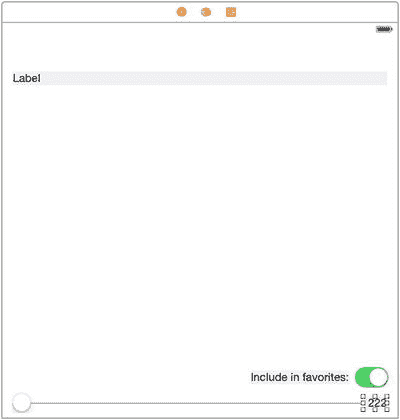

图 9-9. 此处的每个标签都设置了浅灰色背景，仅用于图示目的。你的标签应使用白色背景。

注意，我们在上方标签之上留出了一些空间，因为最终顶部会有一个导航栏。此外，我们希望上方标签能跨多行显示长文本，但默认情况下标签只显示一行。要更改此设置，请选中该标签，打开属性检查器（Attributes Inspector），将**Lines**字段中的数值设置为`0`。

图 9-8 也显示了下方两个标签中已更改的文本。请自行进行相同的更改。这里看不到的是，我们使用属性检查器将这两个标签设置为右对齐。你应该也这样做，因为它们的布局本质上都是与右边缘对齐。另外，选中底部的滑块，然后使用属性检查器将其**Minimum**设置为`1`，**Maximum**设置为`200`。

现在该连接此 GUI 的所有关联了。首先选中视图控制器并打开连接检查器（Connections Inspector）。当需要建立如此多的连接时，该检查器提供的概览视图非常方便。通过从`favoriteSwitch`、`fontSampleLabel`、`fontSizeLabel`和`fontSizeSlider`旁边的小圆圈拖拽到场景中相应的对象，为每个输出口建立连接。如果还不清楚，`fontSampleLabel`应连接到顶部的标签，`fontSizeLabel`应连接到底部右侧的标签，而`favoriteSwitch`和`fontSizeSlider`输出口则只能连接到唯一对应的控件。要连接控件与动作，你可以继续使用连接检查器。在视图控制器的连接检查器中，找到**Received Actions**部分，从**slideFontSize:**旁边的小圆圈拖拽到滑块上，松开鼠标按钮，然后从出现的上下文菜单中选择**Value Changed**。接下来，从**toggleFavorite:**旁边的小圆圈拖拽到开关上，同样选择**Value Changed**。

这里还需要做一件事：创建一个 segue，以便此视图能够被显示。请记住，当字体列表视图控制器（Font List View Controller）显示时，用户轻点详情附件（Detail Accessory，即蓝色小圆“i”）就会显示此视图。因此，找到该控制器，按住 Control 键从其原型单元格（prototype cell）拖拽到您正在处理的新的字体信息视图控制器上，并从出现的上下文菜单的**Accessory Action**区域中选择**show**。注意，我们说的是**Accessory Action**，而不是**Selection Segue**。附件动作是用户轻点详情附件时触发的 segue，而选择 segue 则是轻点行中其他位置时触发的 segue。我们之前已经将此单元格的选择 segue 设置为打开一个`FontSizesViewController`。


现在我们有两条不同的转场，可以通过点击行中不同部分来触发。由于它们将呈现不同的视图控制器，且带有不同的属性，我们需要一种方法来区分它们。幸运的是，代表转场的`UIStoryboardSegue`类提供了一种实现方式：我们可以使用标识符，就像对表格视图单元格所做的那样！

你需要做的就是在编辑区中选择一条转场，并使用属性检查器设置其标识符。你可能需要稍微调整场景布局，以便能够看到从字体列表视图控制器右侧蜿蜒而出的两条转场。选择指向字体大小视图控制器的转场，并将其标识符设置为`ShowFontSizes`，如图 Figure 9-10 所示。接下来，选择指向字体信息视图控制器的转场，并将其标识符设置为`ShowFontInfo`。

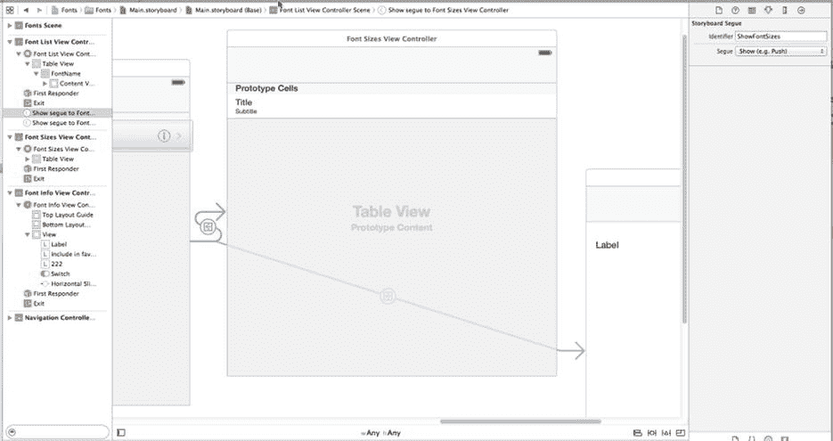

Figure 9-10. 配置来自字体列表视图控制器的转场

#### 设置约束

设置该转场可以让 Interface Builder 知道我们的新场景将像其他场景一样在导航控制器的上下文中使用，因此该场景会自动在顶部获得一个空白导航栏。现在视图的真实布局已经确定，是时候设置约束了。这是一个相当复杂的视图，包含多个子视图，尤其是在底部附近，因此我们不能完全依赖系统的自动约束来为我们做出正确的处理。我们将使用编辑区底部的**固定**按钮及其触发的弹出窗口来构建所需的大部分约束。

从最上面的标签开始。点击**固定**，然后在弹出窗口中，选择小方块上方、左侧和右侧的红色条——但不要选择下方的。现在点击底部的**添加 3 个约束**按钮。

接下来，选择底部的滑块并点击**固定**按钮。这次，选择小方块下方、左侧和右侧的红色条——但不要选择上方的。再次点击**添加 3 个约束**来放置它们。

对于剩下的两个标签和开关，请遵循以下步骤：选择对象，点击**固定**，选择小方块下方和右侧的红色条，打开**宽度**和**高度**复选框，最后点击**添加 4 个约束**。为这三个对象设置这些约束会将它们绑定到右下角。

还有最后一个约束需要设置。我们希望顶部标签可以扩展以容纳其文本，但绝不能扩展到与底部视图重叠。我们可以通过一个约束来实现这一点！按住 Control 键从上方标签拖拽到“添加到收藏夹”标签，释放鼠标按钮，然后从出现的上下文菜单中选择**垂直间距**。接下来，点击新约束以选中它（这是一条连接两个标签的蓝色垂直条），然后打开属性检查器，你会看到该约束的一些可配置属性。将**关系**下拉菜单更改为`Greater Than or Equal`，然后将**常量**值设置为`10`。这样可以确保扩展的上方标签不会超出底部其他视图。

### 为多个转场适配字体列表视图控制器

现在回到熟悉的`FontListViewController.m`文件。由于这个类现在能够触发到两个不同子视图控制器的转场，它需要导入最新视图控制器的头文件：

```objective-c
#import "FontListViewController.h"
#import "FavoritesList.h"
#import "FontSizesViewController.h"
#import "FontInfoViewController.h"
```

你还需要调整`prepareForSegue:sender:`方法，如下所示：

```objective-c
- (void)prepareForSegue:(UIStoryboardSegue *)segue sender:(id)sender {
    // 获取新的视图控制器 using [segue destinationViewController]。
    // 将选中的对象传递给新的视图控制器。
    NSIndexPath *indexPath = [self.tableView indexPathForCell:sender];
    UIFont *font = [self fontForDisplayAtIndexPath:indexPath];
    [segue.destinationViewController navigationItem].title = font.fontName;

    if ([segue.identifier isEqualToString:@"ShowFontSizes"]) {
        FontSizesViewController *sizesVC = segue.destinationViewController;
        sizesVC.font = font;
    } else if ([segue.identifier isEqualToString:@"ShowFontInfo"]) {
        FontInfoViewController *infoVC = segue.destinationViewController;
        infoVC.font = font;
        infoVC.favorite = [[FavoritesList sharedFavoritesList].favorites
                           containsObject:font.fontName];
    }
}
```

现在运行应用，看看我们的成果！选择一个包含多种字体的字体族（例如 Gill Sans），然后点击任何一行的中间位置。你会被带到之前看到的相同列表，其中以多种大小显示了该字体。按下左上角的导航按钮（标签为**Gill Sans**）返回，然后点击另一行；不过这次点击右侧显示详细附件的部分。这会调出最终的视图控制器，它显示该字体的样本，底部有一个滑块，可以让你选择任意大小。

此外，现在你可以使用**添加到收藏夹**开关将此字体标记为喜爱。执行此操作后，点击左上角的导航按钮几次，返回根控制器视图。

## 我最喜爱的字体

向下滚动到根视图控制器的底部，你会看到一些新内容：第二分段现在已经显示出来，如图 Figure 9-11 所示。

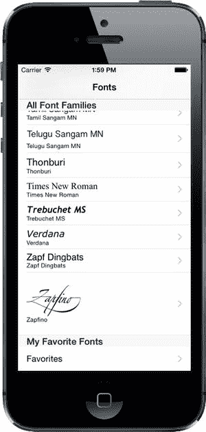

Figure 9-11. 现在我们至少选择了一个喜爱字体，可以通过点击根视图控制器底部出现的新行来查看它们

点击**收藏夹**行，你会看到所有已选择为喜爱的字体列表。在这里，你可以执行与其他字体列表相同的操作：点击一行查看多个字体大小的列表，或者点击详细附件查看可调整滑块的字体视图和收藏开关。你甚至可以尝试关闭该开关，然后点击返回按钮，你会看到刚刚查看的字体不再出现在列表中。

## 表格视图的便利功能

现在应用的基本功能已经完成。但在我们真正结束之前，还有几个功能应该实现。如果你使用 iOS 一段时间，可能会知道通常可以通过从右向左滑动来删除表格视图中的一行。例如，在邮件应用中，你可以使用这种技术删除邮件列表中的一条消息。执行这个手势会在表格视图行内部显示一个小型 GUI。这个 GUI 要求你确认删除，然后该行消失，剩余行向上滑动以填补空白。整个交互过程——包括处理滑动、显示确认 GUI 以及动画影响到的行——都由表格视图本身处理。你只需要在控制器中实现两个方法即可。

此外，表格视图还提供了简单功能，允许用户通过上下拖拽来重新排列表格视图中的行。与滑动删除一样，表格视图替我们处理了整个用户交互。我们只需要一行设置代码（创建一个激活重新排序 GUI 的按钮），然后实现一个在用户完成拖拽时调用的方法。表格视图免费提供了这么多功能，不加以利用简直是犯罪！

### 实现滑动删除


在应用中，`FontListViewController` 类是该功能应被使用的典型示例。每当应用显示收藏列表时，我们应允许用户通过滑动删除收藏项，省去他们点击详情附件然后关闭开关的步骤。在 Xcode 中选择 `FontListViewController.m` 文件开始操作。我们需要实现的两个方法默认已包含在每个视图控制器的源文件中，但被注释掉了。我们将取消注释并为其提供实际实现。

首先，添加 `tableView:canEditRowAtIndexPath:` 方法的实现：

```
- (BOOL)tableView:(UITableView *)tableView
        canEditRowAtIndexPath:(NSIndexPath *)indexPath {
    // 如果不想让指定项可编辑，则返回 NO
    return self.showsFavorites;
}
```

当显示收藏列表时，该方法返回 `YES`，否则返回 `NO`。这意味着允许删除行的编辑功能仅在显示收藏时启用。如果仅做此修改就尝试运行应用并删除行，您不会看到任何变化。表格视图不会处理滑动手势，因为它发现我们尚未实现完成删除所需的另一个方法。因此，我们也将该方法补充完整。按如下方式添加 `tableView:commitEditingStyle:forRowAtIndexPath:` 方法的实现：

```
- (void)tableView:(UITableView *)tableView
       commitEditingStyle:(UITableViewCellEditingStyle)editingStyle
       forRowAtIndexPath:(NSIndexPath *)indexPath {
       if (!self.showsFavorites) return;

if (editingStyle == UITableViewCellEditingStyleDelete) {
        // 从数据源中删除行
        NSString *favorite = self.fontNames[indexPath.row];
        [[FavoritesList sharedFavoritesList] removeFavorite:favorite];
        self.fontNames = [FavoritesList sharedFavoritesList].favorites;

[tableView deleteRowsAtIndexPaths:@[indexPath]
                         withRowAnimation:UITableViewRowAnimationFade];
    }
}
```

这个方法相当直接，但其中存在一些细微之处。我们首先检查是否正在显示收藏列表；如果不是，则直接退出。正常情况下，这种情况绝不会发生，因为我们在上一个方法中已指定只有收藏列表是可编辑的。不过，这里我们是在进行防御性编程。之后，我们检查编辑样式，确保即将完成的特定编辑操作确实是删除操作。表格视图中也可以执行插入编辑，但需要额外的设置（我们并未进行），因此我们无需担心其他情况。接下来，我们确定要删除哪个字体，将其从 `FavoritesList` 单例中移除，并更新本地的收藏列表副本。

最后，我们通知表格视图删除该行，并通过视觉淡出动画使其消失。理解通知表格视图删除行时会发生什么至关重要。直观上，您可能会认为调用该方法会删除某些数据，但事实并非如此。实际上，我们已经删除了数据！最终的方法调用其实是我们在告诉表格视图：“嘿，我已经做了更改，希望你用动画移除这一行。如果你还需要什么，就问我。” 此时，表格视图会开始将已删除行下方的行向上移动并播放动画，这意味着之前位于屏幕外的一些行现在可能会出现在屏幕上，届时它将通过常规方法向控制器请求单元格数据。因此，重要的是，我们在 `tableView:commitEditingStyle:forRowAtIndexPath:` 方法的实现中，必须在通知表格视图删除行之前对数据模型（本例中为 `FavoritesList` 单例）进行必要的更改。

现在再次运行应用，确保您已设置一些收藏字体，然后进入收藏列表，从右向左滑动以删除一行。该行会部分滑出屏幕，右侧会出现一个**删除**按钮（见图 9-12）。点击**删除**按钮，该行就会消失。

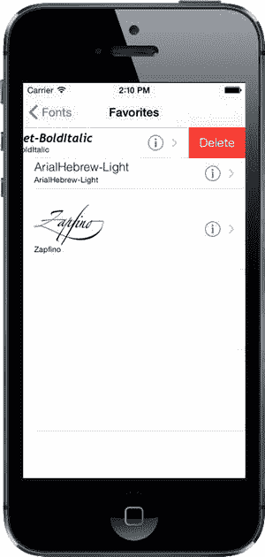

图 9-12。显示删除按钮的收藏字体行

### 实现拖拽重排

我们要为字体列表添加的最后一个功能，是让用户只需上下拖拽即可重新排列他们的收藏项。为此，我们将在 `FavoritesList` 类中添加一个方法，以便按需重排其项目。打开 `FavoritesList.h`，并在 `@interface` 部分添加以下声明：

```
- (void)moveItemAtIndex:(NSInteger)from toIndex:(NSInteger)to;
```

接下来，切换到 `FavoritesList.m`，并将此方法添加到 `@implementation` 部分：

```
- (void)moveItemAtIndex:(NSInteger)from toIndex:(NSInteger)to {
    id item = _favorites[from];
    [_favorites removeObjectAtIndex:from];
    [_favorites insertObject:item atIndex:to];
    [self saveFavorites];
}
```

这个新方法为我们即将进行的操作提供了基础。现在选择 `FontListViewController.m`，并在 `viewDidLoad` 方法的末尾添加以下代码行：

```
if (self.showsFavorites) {
    self.navigationItem.rightBarButtonItem = self.editButtonItem;
}
```

我们之前提到过导航项（navigation item）。它是一个对象，持有关于视图控制器导航栏应显示内容的信息。它有一个名为 `rightBarButtonItem` 的属性，可以持有 `UIBarButtonItem` 的实例，这是一种专用于导航栏和工具栏的特殊按钮。这里，我们将其指向 `editButtonItem`，这是 `UIViewController` 的一个属性，为我们提供了一个已预先配置好的特殊按钮项，用于激活表格视图的编辑/重排 GUI。

完成此设置后，尝试再次运行应用并进入收藏列表。您会看到右上角现在出现了一个**编辑**按钮。按下该按钮会切换表格视图的编辑 GUI，目前这意味着每一行左侧会显示一个删除按钮，同时其内容会向右稍微移动以腾出空间。这为用户提供了另一种删除行的方式，使用的是我们已经实现的方法。

但我们主要关注的是添加重排功能。为此，我们只需在 `FontListViewController.m` 中添加以下方法：

```
- (void)tableView:(UITableView *)tableView
               moveRowAtIndexPath:(NSIndexPath *)fromIndexPath
               toIndexPath:(NSIndexPath *)toIndexPath {
    [[FavoritesList sharedFavoritesList] moveItemAtIndex:fromIndexPath.row
                                                    toIndex:toIndexPath.row];
    self.fontNames = [FavoritesList sharedFavoritesList].favorites;
}
```

当用户完成拖拽行时，会立即调用此方法。我们在此所做的只是通知 `FavoritesList` 单例执行重排，然后刷新我们的字体名称列表，就像删除项目后所做的那样。要查看实际效果，请运行应用，进入收藏列表，然后点击**编辑**按钮。您会看到编辑模式现在在每行右侧包含了小的“拖拽”图标（见图 9-13），您可以使用拖拽器重新排列项目。

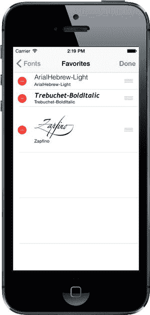

图 9-13。启用了重排控件的收藏字体列表

至此，我们的应用就完成了！至少，就本书而言已经完成了。如果您想到对这些字体还有其他更有用的操作，尽管动手尝试吧！

## 终章


