# 第十章  
## 集合视图  

本章内容量堪比一场马拉松。如果你还能坚持读到这里，请务必为自己感到自豪。深入理解这些神秘的表格视图和导航控制器对象至关重要，因为它们是众多 iOS 应用的基石；若未能透彻掌握其复杂性，必将陷入困境。  

在你开始构建自己的表格时，请反复参考本章及前一章的内容，也不要畏惧 Apple 的官方文档。表格视图异常复杂，不可能涵盖所有可能的排列组合；但你现在应该已经掌握了一套非常实用的表格视图构建模块，可以用于设计和构建自己的应用。一如既往，欢迎你在自己的应用中复用这些代码。这是作者赠予你的礼物，请尽情享用！  

在本章中，我们将探讨 `UIKit` 中一个相对较新的成员：`UICollectionView` 类。你将了解它与熟悉的 `UITableView` 有何关联、有何不同，以及如何扩展它以实现 `UITableView` 根本无法想象的功能。  

多年来，iOS 开发者一直使用 `UITableView` 组件创建各种界面。凭借其允许定义多种单元格类型、按需动态创建以及便捷垂直滚动的能力，`UITableView` 已成为成千上万应用的关键组件。Apple 多年以来也一直对表格视图类倾注大量 API 优化，在每次重大 iOS 版本更新中都新增了更好的内容供给方式。  

然而，它仍然不是处理所有大型数据集的终极方案。例如，若要呈现多列数据，你需要将每行数据的所有列合并到单个单元格中。此外，`UITableView` 也无法实现内容水平滚动。总的来说，`UITableView` 的强大功能伴随着特定的权衡：开发者无法控制表格视图的整体布局。你可以随心所欲定义每个单元格的外观，但最终这些单元格只会堆叠在一个庞大的滚动列表中！  

显然，Apple 也意识到了这一点。在 iOS 6 中，它引入了一个名为 `UICollectionView` 的新类来解决这些缺陷。与表格视图一样，这个类允许你显示一组数据“单元格”，并处理诸如将未使用的单元格排队以供后续使用等事宜。但与表格视图不同的是，`UICollectionView` 不会将这些单元格垂直堆叠。事实上，`UICollectionView` 根本不负责布局！相反，它使用一个辅助类来执行布局，你很快就会了解到这一点。  

## 创建 DialogViewer 项目  

为了展示 `UICollectionView` 的部分功能，我们将用它来布局一些文本段落。每个单词将放置在其自己的单元格中，每个段落的所有单元格将聚集在一个分区中。每个分区还将拥有自己的标题。考虑到 UIKit 已经包含其他完善的文本布局方式，这看起来可能并不令人兴奋。然而，这个过程仍然具有指导意义，因为你会真切感受到这个组件的灵活性。尝试用表格视图实现类似图 10-1 的效果，你绝对会寸步难行！  

  

图 10-1。每个单词都是一个独立的单元格，标题除外（它们本身就是标题）。所有内容仅通过一个 `UICollectionView` 进行布局，无需我们进行任何显式的几何计算。  

为了实现这一效果，我们将定义几个自定义单元格类，使用 `UICollectionViewFlowLayout`（目前 UIKit 中唯一包含的布局辅助类），并且像往常一样，使用视图控制器类将所有内容整合在一起。让我们开始吧！  

像之前多次操作那样，使用 Xcode 创建一个新的 Single View Application。将项目命名为 *DialogViewer*，并使用本书通用的标准设置（将 **Language** 设置为 *Objective-C*，**Devices** 选择 *Universal*）。  

### 修正视图控制器类  

在此应用中，我们无需对应用委托进行特殊处理，因此直接打开 `ViewController.h`，做一个简单的修改：将父类切换为 `UICollectionView`：  

```
@interface ViewController : UIViewController
@interface ViewController : UICollectionViewController
```

接下来，打开 `Main.storyboard`。我们需要配置视图控制器，使其与我们在头文件中指定的内容相匹配。在文档大纲中选择唯一的 **View Controller** 并删除，留下一个空白的故事板。然后使用对象库找到 *Collection View Controller* 并将其拖入编辑区域。选择你刚刚拖入的 **View Controller** 图标，使用身份检查器将其类改为 `ViewController`。在属性检查器中，确保勾选了 **Is Initial View Controller** 复选框。接着，在文档大纲中选择 **Collection View**，使用属性检查器将其背景改为白色。最后，你会看到文档大纲中的 **Collection View** 对象有一个名为 **Collection View Cell** 的子项。这是一个原型单元格，你可以在 Interface Builder 中用它来设计实际单元格的布局。本章中我们不会使用它，因此选择该单元格并删除。  

### 定义自定义单元格  

现在让我们定义一些单元格类。正如你在图 10-1 中看到的，我们显示两种基本类型的单元格：一种包含单词的“普通”单元格，另一种用作标题的单元格。任何你为 `UICollectionView` 创建的单元格都必须是系统提供的 `UICollectionViewCell` 的子类，它提供了与 `UITableViewCell` 类似的基本功能。这些功能包括 `backgroundView`、`contentView` 等。由于我们的两种单元格将共享一些功能，实际上我们会让一个成为另一个的子类，并使用子类覆盖部分功能。  

首先，在 Xcode 中创建一个新的 Cocoa Touch 类。将新类命名为 *ContentCell*，并使其成为 `UICollectionViewCell` 的子类。选择新类的头文件，添加三个属性和一个类方法的声明：  

```
#import <UIKit/UIKit.h>

@interface ContentCell : UICollectionViewCell

@property (strong, nonatomic) UILabel *label;
@property (copy, nonatomic) NSString *text;
@property (assign, nonatomic) CGFloat maxWidth;

+ (CGSize)sizeForContentString:(NSString *)s forMaxWidth:(CGFloat)maxWidth;

@end
```

`label` 属性将指向一个用于显示的 `UILabel`。我们将使用 `text` 属性告诉该单元格要显示什么内容，使用 `maxWidth` 属性控制单元格的最大宽度，并使用 `sizeForContentString:forMaxWidth:` 方法来询问显示给定字符串所需的单元格大小。这在创建和配置单元格类实例时非常有用。  

现在切换到 `ContentCell.m`，这里还有一些工作等着我们。首先添加一个 `initWithFrame:` 方法，如下所示：  

```
- (id)initWithFrame:(CGRect)frame {
    self = [super initWithFrame:frame];
    if (self) {
        // Initialization code
        self.label = [[UILabel alloc] initWithFrame:self.contentView.bounds];
        self.label.opaque = NO;
        self.label.backgroundColor = [UIColor colorWithRed:0.8
                                                     green:0.9
                                                      blue:1.0
                                                     alpha:1.0];
        self.label.textColor = [UIColor blackColor];
```


`self.label.textAlignment = NSTextAlignmentCenter;`  
`self.label.font = [[self class] defaultFont];`  
`[self.contentView addSubview:self.label];`  
    }  
    return self;  
}

这段代码相当简单。它只是创建了一个标签，设置了其显示属性，并将标签添加到单元格的 `contentView` 中。这里唯一神秘的地方是，它使用了 `defaultFont` 方法来获取字体，并以此设置标签的字体。其设计思路是，该类应定义用于显示内容的字体，同时允许任何子类通过重写 `defaultFont` 方法来声明自己的显示字体。不过我们还没有创建这个方法，现在就来创建它：

```objc
+ (UIFont *)defaultFont {
    return [UIFont preferredFontForTextStyle:UIFontTextStyleBody];
}
```

非常直观。这里使用了 `UIFont` 类的 `preferredFontForTextStyle:` 方法来获取用户偏好的正文字体。用户可以通过“设置”应用更改此字体的大小。通过使用此方法而非硬编码字体大小，我们让应用对用户更加友好。

为了完成这个类，让我们添加在头文件中提到的方法，即计算单元格合适尺寸的方法：

```objc
+ (CGSize)sizeForContentString:(NSString *)string forMaxWidth:(CGFloat)maxWidth {
    CGSize maxSize = CGSizeMake(maxWidth, 1000);
    NSStringDrawingOptions opts = NSStringDrawingUsesLineFragmentOrigin |
        NSStringDrawingUsesFontLeading;
    NSMutableParagraphStyle *style = [[NSMutableParagraphStyle alloc] init];
    [style setLineBreakMode:NSLineBreakByCharWrapping];
    NSDictionary *attributes = @{ NSFontAttributeName : [self defaultFont],
                                  NSParagraphStyleAttributeName : style };
    CGRect rect = [string boundingRectWithSize:maxSize
                                       options:opts
                                    attributes:attributes
                                       context:nil];
    return rect.size;
}
```

这个方法做了很多事情，因此值得逐步讲解。首先，我们声明一个最大尺寸，以确保任何单词的宽度都不会超过 `maxWidth` 参数的值，该值将根据 `UICollectionView` 的宽度来设置。接着，我们定义一些选项，用于帮助系统计算目标字符串的正确尺寸。我们还创建了一个允许字符换行的段落样式，这样如果字符串太大而无法适应给定的最大宽度时，它就会自动换到下一行。此外，我们创建了一个属性字典，其中包含我们为此类定义的默认字体以及刚刚创建的段落样式。最后，我们使用了 UIKit 提供的 `NSString` 功能来计算字符串尺寸。我们传入一个绝对最大尺寸以及设置好的其他选项和属性，然后获得一个尺寸。

这个类最后剩下的工作是对 `text` 属性进行一些特殊处理。我们不使用通常的隐式实例变量，而是定义一些方法，基于我们之前创建的 `UILabel` 来获取和设置值，本质上就是将 `UILabel` 作为显示值的存储空间。通过这样做，我们还可以在文本发生变化时，利用设置器重新计算单元格的几何布局。具体实现如下：

```objc
- (NSString *)text {
    return self.label.text;
}

- (void)setText:(NSString *)text {
    self.label.text = text;
    CGRect newLabelFrame = self.label.frame;
    CGRect newContentFrame = self.contentView.frame;
    CGSize textSize = [[self class] sizeForContentString:text forMaxWidth:_maxWidth];
    newLabelFrame.size = textSize;
    newContentFrame.size = textSize;
    self.label.frame = newLabelFrame;
    self.contentView.frame = newContentFrame;
}
```

获取器没什么特别；但设置器做了一些额外的工作。基本上，它根据显示当前字符串所需的尺寸，同时修改标签和内容视图的 frame。

这就是我们基础单元格类的全部内容。现在让我们创建一个用于标题的单元格类。使用 Xcode 再创建一个新的 Cocoa Touch 类，将其命名为 `HeaderCell`，并让它成为 `ContentCell` 的子类。我们不需要修改头文件，所以直接跳转到 `HeaderCell.m` 进行一些改动。在这个类中，我们只需重写 `ContentCell` 类中的几个方法，以更改单元格的外观，使其与普通内容单元格看起来不同：

```objc
- (id)initWithFrame:(CGRect)frame {
    self = [super initWithFrame:frame];
    if (self) {
        // 初始化代码
        self.label.backgroundColor = [UIColor colorWithRed:0.9
                                                     green:0.9
                                                      blue:0.8
                                                     alpha:1.0];
        self.label.textColor = [UIColor blackColor];
    }
    return self;
}

+ (UIFont *)defaultFont {
    return [UIFont preferredFontForTextStyle:UIFontTextStyleHeadline];
}
```

这些就是让标题单元格拥有独特外观所需的全部操作，包括其专属的颜色和字体。

## 配置视图控制器

现在让我们将注意力集中到视图控制器上。选择 `ViewController.m`，首先导入自定义单元格的头文件，并声明一个数组来存放要显示的内容：

```objc
#import "ViewController.h"
#import "ContentCell.h"
#import "HeaderCell.h"

@interface ViewController ()
@property (copy, nonatomic) NSArray *sections;
@end
```

接下来，我们将在 `viewDidLoad` 中创建这些数据。`sections` 数组将包含一个字典列表，每个字典都有两个键：`header` 和 `content`。我们将使用这些键对应的值来定义显示内容。实际使用的内容改编自一部著名的戏剧：

```objc
- (void)viewDidLoad
{
    [super viewDidLoad];
    // 加载视图后执行任何额外的设置，通常来自 nib 文件
    self.sections =
    @[
      @{ @"header" : @"第一个女巫",
         @"content" : @"嘿，我们三个稍后什么时候见面？" },
      @{ @"header" : @"第二个女巫",
         @"content" : @"等一切都理顺了的时候。" },
      @{ @"header" : @"第三个女巫",
         @"content" : @"那就在日落之前。" },
      @{ @"header" : @"第一个女巫",
         @"content" : @"在哪儿？" },
      @{ @"header" : @"第二个女巫",
         @"content" : @"那块泥地。" },
      @{ @"header" : @"第三个女巫",
         @"content" : @"我想我们会在那里见到麦克。" },
      ];
}
```

与 `UITableView` 非常相似，`UICollectionView` 允许我们基于一个标识符注册可复用单元格的类。这样做可以让我们在稍后提供单元格时调用出队方法。如果没有可用的单元格，集合视图会自动为我们创建一个——就像 `UITableView` 一样！将这一行代码添加到 `viewDidLoad` 的末尾来实现这一点：

```objc
[self.collectionView registerClass:[ContentCell class]
        forCellWithReuseIdentifier:@"CONTENT"];
```

我们只会对 `viewDidLoad` 再做一处修改。由于这个应用没有导航栏，主视图会与状态栏发生重叠。为了防止这种情况，请在 `viewDidLoad` 末尾添加以下代码行：

```objc
UIEdgeInsets contentInset = self.collectionView.contentInset;
contentInset.top = 20;
[self.collectionView setContentInset:contentInset];
```

至少目前来说，`viewDidLoad` 中的配置就足够了。在编写填充集合视图的代码之前，我们需要编写一个小的辅助方法。我们的所有内容都包含在较长的字符串中，但我们需要逐词处理它们，以便将每个单词放入一个单元格中。因此，让我们创建一个内部方法来分割这些字符串。该方法接收一个节号，从节数据中提取相关内容字符串，并将其分割成单词。


```objc
- (NSArray *)wordsInSection:(NSInteger)section {
    NSString *content = self.sections[section][@"content"];
    NSCharacterSet *space = [NSCharacterSet whitespaceAndNewlineCharacterSet];
    NSArray *words = [content componentsSeparatedByCharactersInSet:space];
    return words;
}
```

### 提供内容单元格

现在开始介绍一组实际填充集合视图的方法。接下来的这三个方法与 `UITableView` 中的对应方法非常相似。首先，我们需要一个方法来告知集合视图要显示多少个分区：

```objc
- (NSInteger)numberOfSectionsInCollectionView:(UICollectionView *)collectionView {
    return [self.sections count];
}
```

接下来，我们要用一个方法告诉集合视图每个分区应包含多少个项目。该方法使用了我们之前定义的 `wordsInSection:` 方法：

```objc
- (NSInteger)collectionView:(UICollectionView *)collectionView
    numberOfItemsInSection:(NSInteger)section {
    NSArray *words = [self wordsInSection:section];
    return [words count];
}
```

下面这个方法是实际返回单个已配置好单词的单元格的方法。它同样用到了 `wordsInSection:` 方法。如你所见，该方法使用了 `UICollectionView` 的出列方法，这与 `UITableView` 类似。由于我们已经为当前使用的标识符注册了单元格类，因此出列方法始终会返回一个实例：

```objc
- (UICollectionViewCell *)collectionView:(UICollectionView *)collectionView
                  cellForItemAtIndexPath:(NSIndexPath *)indexPath {
    NSArray *words = [self wordsInSection:indexPath.section];

    ContentCell *cell = [self.collectionView
                            dequeueReusableCellWithReuseIdentifier:@"CONTENT"
                            forIndexPath:indexPath];
    cell.maxWidth = collectionView.bounds.size.width;
    cell.text = words[indexPath.row];
    return cell;
}
```

根据 `UITableView` 的工作方式，你可能会认为此时我们已经能让应用至少以最基本的方式运行了。但构建并运行应用后，你会发现实际情况远未达到可用状态（参见图 10-2）。

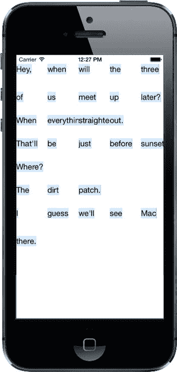

图 10-2。目前还不太实用

虽然能看到部分单词，但并没有形成“流式”布局。所有单元格大小相同，并且挤在一起。原因是还需要处理更多的委托职责才能让布局正常工作。

### 让布局流动起来

到目前为止，我们一直在处理 `UICollectionView`，但如前所述，这个类有一个负责实际布局的帮手。`UICollectionViewFlowLayout` 是 `UICollectionView` 的默认布局助手，它本身有一些委托方法，用于从我们这里获取更多信息。现在我们就来实现其中一个。布局对象会为每个单元格调用此方法，以确定其尺寸。这里我们再次使用 `wordsInSection:` 方法来获取对应的单词，然后利用 `ContentCell` 类中定义的方法来计算所需大小。将此方法添加到 `ViewController.m` 中。之所以能这样实现，是因为 `UICollectionViewController` 类默认将自己设为 `UICollectionViewFlowLayout` 的委托：

```objc
- (CGSize)collectionView:(UICollectionView *)collectionView
                  layout:(UICollectionViewLayout*)collectionViewLayout
  sizeForItemAtIndexPath:(NSIndexPath *)indexPath {
    NSArray *words = [self wordsInSection:indexPath.section];
    CGSize size = [ContentCell sizeForContentString:words[indexPath.row]
                                        forMaxWidth:collectionView.bounds.size.width];
    return size;
}
```

现在重新构建并运行应用，你会发现我们已经向前迈出了一大步（参见图 10-3）

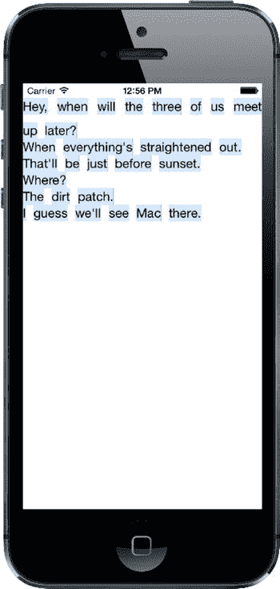

图 10-3。段落流式布局初具雏形

你可以看到单元格现在能够流动换行，文字变得可读，并且每个分区的开头略有下沉。但每个分区与前后分区之间仍然紧密贴合，并且紧贴两侧边缘，视觉效果不佳。让我们通过添加更多配置来解决这个问题。在 `viewDidLoad` 方法的末尾添加以下代码：

```objc
UICollectionViewLayout *layout = self.collectionView.collectionViewLayout;
UICollectionViewFlowLayout *flow = (UICollectionViewFlowLayout *)layout;
flow.sectionInset = UIEdgeInsetsMake(10, 20, 30, 20);
```

这里我们从集合视图中获取布局对象。首先将其赋值给一个临时的 `UICollectionViewLayout` 指针，主要是为了强调一点：`UICollectionView` 只知道这个通用布局类，但实际上它使用的是 `UICollectionViewFlowLayout` 的实例——后者是 `UICollectionViewLayout` 的子类。知道了布局对象的真实类型后，我们可以通过类型转换将其赋值给另一个变量，从而访问该子类特有的方法——在本例中，我们需要设置 `sectionInset` 属性的 setter 方法。

再次构建并运行，你会看到文本单元格终于获得了所需的空间（参见图 10-4）。

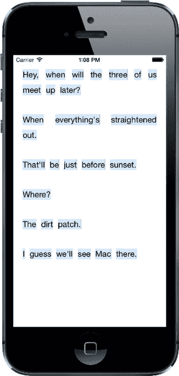

图 10-4。现在宽松多了

### 提供头部视图

目前唯一缺失的就是头部对象的显示，现在是时候解决这个问题了。回想一下，`UITableView` 有一套页眉和页脚视图系统，并且会为每个分区分别请求这些视图。`UICollectionView` 则对此概念进行了更通用的扩展，为布局提供了更大的灵活性。其工作方式是：在通过委托访问普通单元格的系统之外，还有一个并行的系统用于访问可作为页眉、页脚或其他用途的附加视图。在 `viewDidLoad` 末尾添加以下代码，让集合视图了解我们的头部单元格类：

```objc
[self.collectionView registerClass:[HeaderCell class]
        forSupplementaryViewOfKind:UICollectionElementKindSectionHeader
               withReuseIdentifier:@"HEADER"];
```

如你所见，这里我们不仅指定了单元格类和标识符，还指定了一个“种类”。其理念是：不同的布局可以定义不同种类的补充视图，并可能要求委托为它们提供视图。`UICollectionViewFlowLayout` 会为集合视图中的每个分区请求一个分区头部，我们将按如下方式应用它们：

```objc
- (UICollectionReusableView *)collectionView:(UICollectionView *)collectionView
           viewForSupplementaryElementOfKind:(NSString *)kind
                                 atIndexPath:(NSIndexPath *)indexPath {
    if ([kind isEqual:UICollectionElementKindSectionHeader]) {
        HeaderCell *cell = [self.collectionView
                               dequeueReusableSupplementaryViewOfKind:kind
                               withReuseIdentifier:@"HEADER"
                               forIndexPath:indexPath];

        cell.maxWidth = collectionView.bounds.size.width;
        cell.text = self.sections[indexPath.section][@"header"];
        return cell;
    }
    return nil;
}
```

构建并运行，你会看到……等等！头部视图去哪儿了？事实证明，`UICollectionViewFlowLayout` 不会为头部视图分配任何布局空间，除非我们明确指定它们的大小。所以回到 `viewDidLoad`，在末尾添加以下代码：

```objc
flow.headerReferenceSize = CGSizeMake(100, 25);
```


再次构建并运行，现在你会看到页眉已经就位，如前文图 10-1 所示，而图 10-5 再次展示了这一点。

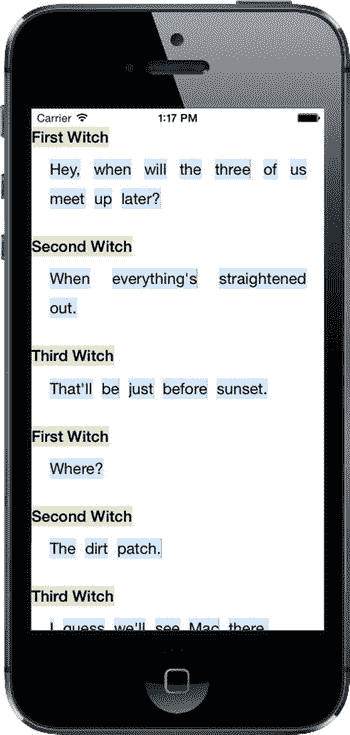

图 10-5 完成的 DialogViewer 应用

在本章中，我们实际上只是初步涉足了 `UICollectionView`，以及通过默认的 `UICollectionFlowLayout` 类可以实现的功能。你还可以通过定义自己的布局类来实现更炫酷的效果，但这已是另一本书的主题了。

现在你已经熟悉了所有主要的宏观组件，是时候看看如何创建像 iOS 邮件应用那样的主从应用了；所以，翻到下一页，让我们在第 11 章中开始学习。

## 第 11 章：使用分割视图和弹出框

在第 9 章中，你花费了大量时间处理基于表格视图选择的应用程序导航。每次选择都会导致占据整个屏幕的顶层视图向左滑动，并引入层级中的下一个视图（或者可能是另一个表格视图）。许多 iPhone 和 iPod touch 的应用都采用这种方式工作，其中包括一些苹果自家的应用。一个典型的例子是邮件应用，它让你逐层深入邮件账户和文件夹，直到最终找到某条消息。从技术上讲，这种方法在 iPad 上也可以工作，但这会导致用户交互问题。

在 iPhone 或 iPod touch 大小的屏幕上，让一个屏幕大小的视图滑开以显示另一个屏幕大小的视图效果很好。然而，在 iPad 大小的屏幕上，同样的交互会感觉有点不对劲、有点夸张，甚至有点让人不知所措。此外，在大多数情况下，用单个表格视图占用如此大的显示屏效率很低。因此，你会看到 iPad 内置应用实际上并不这样运行。相反，任何像邮件应用那样使用的逐层深入导航功能，都被限制在一个狭窄的列中。当用户深入或返回时，该列的内容会向左或向右滑动。当 iPad 处于横向模式时，导航列固定在左侧，而选中项的内容显示在右侧。这就是所谓的**分割视图**（见图 11-1），按此方式构建的应用称为**主从应用**。

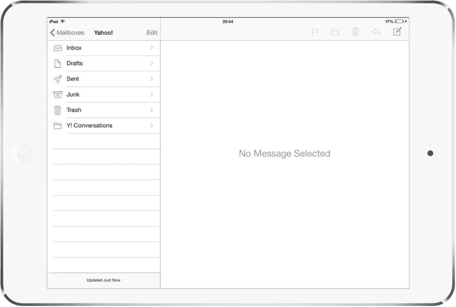

图 11-1 这台处于横向模式的 iPad 正在显示一个分割视图。导航列在左侧。点击导航列中的一项——此处是一个特定的邮件账户——该项的内容就会显示在右侧的区域中

分割视图非常适合开发像邮件应用这样的主从应用。在 iOS 8 之前，分割视图类（`UISplitViewController`）仅在 iPad 上可用，这意味着如果你想构建一个通用的主从应用，必须在 iPad 上用一种方式实现，在 iPhone 上用另一种方式。现在，`UISplitViewController` 也随处可见了，这意味着你不再需要编写特殊代码来处理 iPhone。

在 iPad 上使用时，分割视图左侧的默认宽度为 320 点，这与竖直放置的 iPhone 宽度相同。分割视图本身，其导航和内容并排显示，通常只在横向模式下出现。如果你将设备旋转为竖屏方向，分割视图仍然有效，但显示方式已不再相同。导航视图失去了其固定位置，只能通过从视图左侧滑动或按下工具栏按钮来激活，这会使其从左侧滑入，形成一个悬浮在屏幕上所有其他内容之上的视图（见图 11-2）。

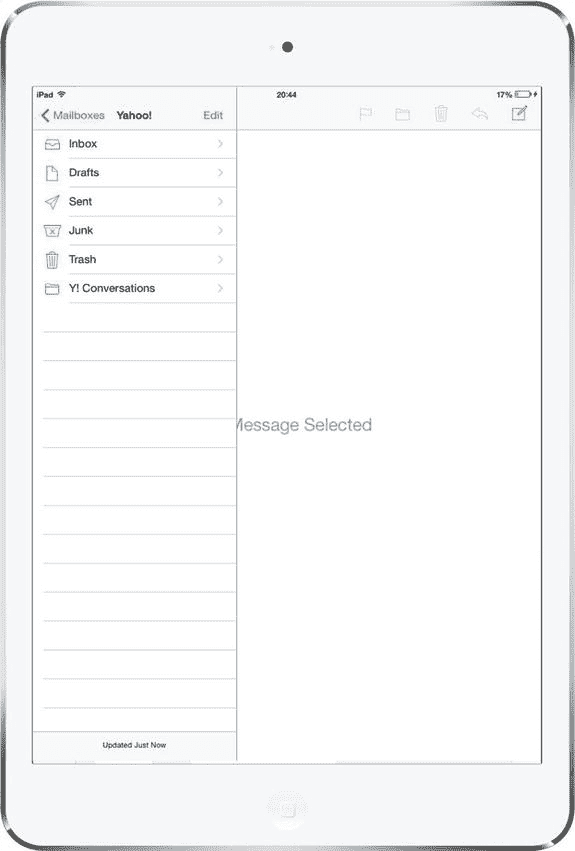

图 11-2 这台处于竖屏模式的 iPad 并未显示与横向模式相同的分割视图。相反，当用户从分割视图左侧滑动或点击工具栏按钮时，才会显示组成横向模式分割视图左侧的信息

不过，有些应用并没有严格遵循这条规则。例如，iPad 的设置应用使用了一个始终可见的分割视图，其左侧既不会消失，也不会覆盖右侧的内容视图。但在本章中，我们将遵循标准的使用模式。

在本章的示例项目中，你将看到如何创建一个使用分割视图控制器的主从应用。最初，我们将在 iPad 模拟器上测试该应用，但当它完成后，你会看到相同的代码在 iPhone 上也能运行，尽管外观上略有不同。你还将学习如何自定义分割视图的外观和行为，以及如何创建和显示一个弹出框，类似于我们在第 4 章讨论警报视图和操作表时看到的那个。与图 4-28 中包裹操作表的弹出框不同，这个弹出框将包含本例应用特有的内容——具体来说，是一个语言列表（见图 11-3）。

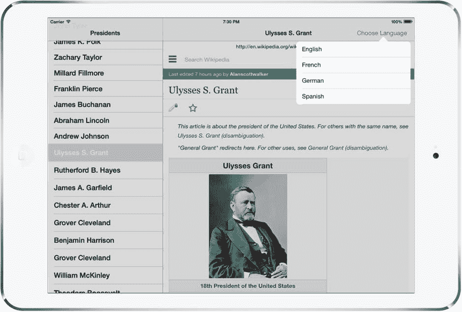

图 11-3 一个弹出框，视觉上仿佛是从触发其出现的按钮中生长出来的

## 使用 UISplitViewController 构建主从应用

我们将从一个简单的任务开始：利用 Xcode 预定义的模板之一来创建一个分割视图项目。我们将构建一个列出所有美国总统的应用，并显示你选择的任何一位总统的维基百科条目。

前往 Xcode，选择 **文件  新建  项目...**。从 **iOS 应用** 部分选择 **主从应用**，然后点击 **下一步**。在下一个屏幕上，将新项目命名为 *Presidents*，将 **语言** 设置为 *Objective-C*，**设备** 设置为 *通用*。确保 **使用 Core Data** 复选框未被勾选。点击 **下一步**，选择项目位置，然后点击 **创建**。Xcode 会执行其常规操作，为你创建若干类和一个故事板文件，然后显示项目。如果尚未打开，展开 *Presidents* 文件夹，查看其包含的内容。

从开始，项目就包含一个应用委托（像往常一样）、一个名为 `MasterViewController` 的类和一个名为 `DetailViewController` 的类。这两个视图控制器分别代表在横向模式下将出现在分割视图左侧和右侧的视图。`MasterViewController` 定义了导航结构的顶层，而 `DetailViewController` 定义了当选中导航元素时在较大区域中显示的内容。当应用启动时，这两者都包含在一个分割视图中，你可能还记得，当设备旋转时，这个分割视图会进行一些形态变化。


为了查看这个特定应用程序模板在功能方面提供了什么，构建该应用并在 iPad 模拟器中运行（该应用也可以在 iPhone 上运行，但其行为略有不同，因此我们将在本章后面讨论拆分视图控制器的这一方面）。如果应用以竖屏模式启动，您将只看到细节视图控制器，如图 11-4 左侧所示。点击工具栏上的`Master`按钮，或者从视图的左边缘向右滑动，即可滑入主视图控制器，覆盖在细节视图之上，如图 11-4 右侧所示。

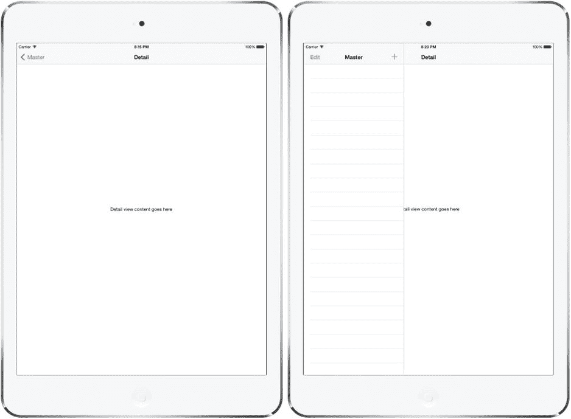

图 11-4。竖屏模式下的默认主-从应用。右侧的布局类似于图 11-2。

将模拟器（或设备）向左或向右旋转，进入横屏模式。在这种模式下，拆分视图会左侧显示导航视图，右侧显示细节视图（参见图 11-5）。

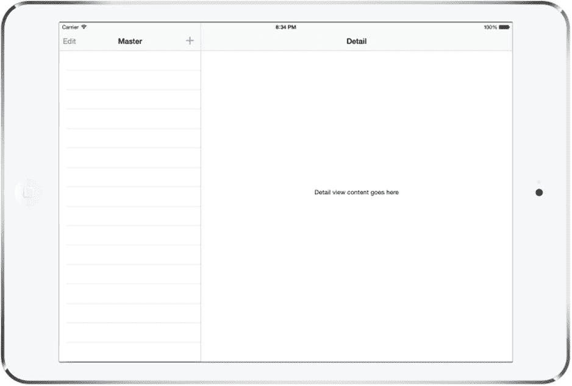

图 11-5。横屏模式下的默认主-从应用。请注意该图与图 11-1 中相似的布局。

我们将以此为基础构建总统演示应用，但首先让我们深入了解已有的内容。

### 故事板定义了结构

一开始，您就已经拥有了一组相当复杂的视图控制器：

*   一个包含所有元素的拆分视图控制器。
*   一个导航控制器，用于处理拆分视图左侧的内容。
*   导航控制器内部的一个主视图控制器（显示项目的主列表）。
*   右侧的一个细节视图控制器。
*   另一个作为右侧细节视图控制器容器的导航控制器。

在我们使用的默认主-从应用程序模板中，这些视图控制器主要是在主故事板文件中设置和互连的，而不是在代码中。除了进行 GUI 布局之外，Interface Builder 在让您无需编写大量代码即可连接不同组件方面，确实表现出色。让我们深入项目的故事板，看看事情是如何设置的。

选择`Main.storyboard`以在 Interface Builder 中打开它。这个故事板有很多内容。为了获得最佳效果，您肯定希望打开文档大纲（参见图 11-6）。缩小视图（通过右键单击故事板编辑器并从弹出菜单中选择放大级别）也可以帮助您了解整体结构。

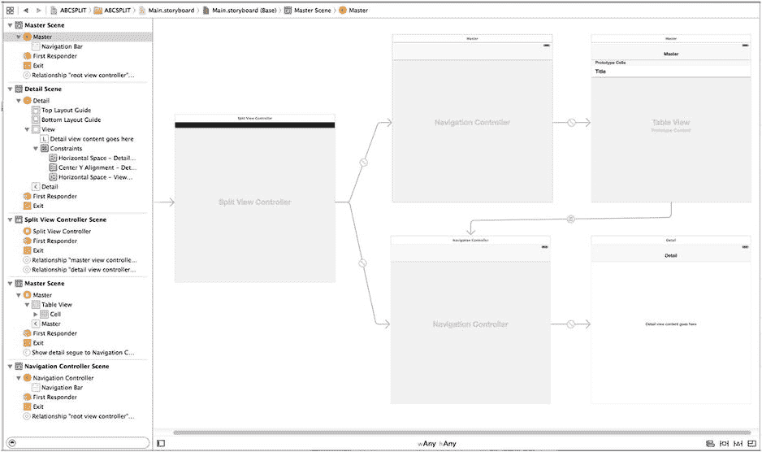

图 11-6。在 Interface Builder 中打开的`Main.storyboard`。这种复杂的对象层次结构最好在文档大纲中查看。

为了更好地理解这些控制器之间的关系，请打开连接检查器，然后花一些时间依次单击每个视图控制器。以下是您将发现的内容的快速摘要：

*   `UISplitViewController`通过名为`master view controller`和`detail view controller`的关系连线连接到两个`UINavigationController`。这些连线用于告诉`UISplitViewController`，它应该使用什么作为左侧显示的窄条（主视图控制器），以及使用什么作为较大的显示区域（细节视图控制器）。
*   通过`master view controller`连线连接的`UINavigationController`具有一个`root view controller relationship`，指向其自身的根视图控制器，即模板生成的`MasterViewController`类。主视图控制器是`UITableViewController`的子类，您应该对第 9 章中的此类很熟悉。
*   类似地，另一个`UINavigationController`具有一个`root view controller relationship`，指向细节视图控制器，即模板的`DetailVIewController`类。模板生成的细节视图控制器是一个普通的`UIViewController`子类，但您可以自由使用满足应用程序需求的任何视图控制器。
*   从主视图控制器中的单元格到细节视图控制器有一个类型为`showDetail`的故事板连线。该连线使得被点击单元格中的项会显示在细节视图中。稍后当我们更详细地查看主视图控制器时，将对此进行更多讨论。

此时，`Main.storyboard`的内容实际上是应用各个控制器如何相互连接的定义。正如大多数使用故事板的情况一样，这消除了大量代码，这通常是一件好事。如果您是那种喜欢在代码中完成所有此类配置的人，您可以自由地这样做；但在此示例中，我们将坚持使用 Xcode 提供的内容。

### 代码定义了功能

将视图控制器互连关系保留在故事板中的主要原因之一是，它们不会用无需存在的配置信息来弄乱您的源代码。剩下的只是定义实际功能的代码。

让我们看看我们有什么作为起点。Xcode 在创建项目时为我们定义了几个类，在我们开始进行任何更改之前，我们将逐一查看它们。

#### 应用委托

首先是`AppDelegate.h`，它看起来像这样：

```objc
#import <UIKit/UIKit.h>

@interface AppDelegate : UIResponder <UIApplicationDelegate>

@property (strong, nonatomic) UIWindow *window;

@end
```

这与您到目前为止在本书中看到的其他几个应用程序委托非常相似。现在切换到`AppDelegate.m`中的实现。该文件开头的代码如下所示（为简洁起见，此处已删除大多数注释和空方法）：

```objc
#import "AppDelegate.h"
#import "DetailViewController.h"

@interface AppDelegate () <UISplitViewControllerDelegate>

@end

@implementation AppDelegate

- (BOOL)application:(UIApplication *)application
                     didFinishLaunchingWithOptions:(NSDictionary *)launchOptions {
    UISplitViewController *splitViewController =
                        (UISplitViewController *)self.window.rootViewController;
    UINavigationController *navigationController =
                        [splitViewController.viewControllers lastObject];
    navigationController.topViewController.navigationItem.leftBarButtonItem =
                        splitViewController.displayModeButtonItem;
    splitViewController.delegate = self;
    return YES;
}
```

我们先来看这段代码的最后一部分：

```objc
splitViewController.delegate = self;
```


这一行设置了`UISplitViewController`的`delegate`属性，将其指向应用程序委托本身。在本章后面，当我们研究分割视图在 iPhone 上的行为时，就会明白为什么需要这个委托连接。但为什么要在代码中进行这个连接，而不是在故事板中直接连接呢？毕竟，就在几段之前，我们刚提到消除枯燥的代码（“把这里连接到那里”）是使用 nib 和故事板的主要好处之一。而且我们已经在 Interface Builder 中多次连接过委托，为什么这里就不行呢？

要理解为什么使用故事板进行连接在这里实际上行不通，你需要考虑故事板与 nib 文件的区别。nib 文件实际上是一个冻结的对象图。当你将 nib 加载到运行中的应用程序时，它包含的所有对象都会“解冻”并立即存在，包括文件中指定的所有相互连接。系统会逐个创建文件中每个对象的新实例，并连接对象间的所有出口和连接。

然而，故事板则不止于此。你可以说故事板中的每个场景大致对应一个 nib 文件。当你添加描述场景如何通过转场连接的元数据时，你就得到了一个故事板。但是，与单个 nib 不同，复杂的故事板通常不会一次性全部加载。相反，任何导致新场景被激活的活动，最终都会从故事板中加载该特定场景的冻结对象图。这意味着你在查看故事板时看到的对象不一定同时存在。

由于 Interface Builder 无法知道哪些场景会共存，它实际上禁止你从一个场景中的对象到另一个场景中的对象建立任何出口或目标/动作连接。实际上，它允许你在场景之间建立的唯一连接就是转场。

但不要只相信我们的话，自己试试看！首先，在故事板中选择**Split View Controller**（你可以在 Split View Controller Scene 的 dock 中找到它）。现在调出 Connections Inspector，尝试从`delegate`出口拖出一条连接到另一个视图控制器或对象。你可以在布局视图和列表视图中到处拖拽，但找不到任何会高亮显示（表示它已准备好接受拖放）的位置。进行这个连接的唯一方法就是在代码中。总而言之，考虑到使用故事板消除了大量其他代码，这点额外的代码只是很小的代价。

现在，让我们回过头来看看`application:didFinishLaunchingWithOptions:`方法的开头发生了什么：

```
UISplitViewController *splitViewController =
    (UISplitViewController *)self.window.rootViewController;
```

这行代码获取窗口的`rootViewController`，也就是故事板中自由浮动箭头所指的视图控制器。如果你回头看 Figure 11-6，会看到箭头指向我们的`UISplitViewController`实例。接下来是这段代码：

```
UINavigationController *navigationController =
    [splitViewController.viewControllers lastObject];
```

在这一行，我们深入到`UISplitViewController`的`viewControllers`数组中。当分割视图从故事板加载时，这个数组包含了对包裹着主视图控制器和详细视图控制器的导航控制器的引用。我们获取数组中的最后一个项目，它指向详细视图的`UINavigationController`。最后，我们看到了这个：

```
navigationController.topViewController.navigationItem.leftBarButtonItem =
           splitViewController.displayModeButtonItem;
```

这行代码将分割视图控制器的`displayModeButtonItem`赋值给详细视图控制器的导航栏。`displayModeButtonItem`是一个由分割视图本身创建和管理的栏按钮项。这段代码实际上是在添加你在 Figure 11-4 左侧导航栏上看到的**Master**按钮。在 iPad 上，当设备处于竖屏模式且主视图控制器不可见时，分割视图会显示这个按钮。当设备旋转到横屏方向，或者用户按下按钮使主视图控制器可见时，该按钮就会被隐藏。稍后你会看到，这个按钮在 iPhone 上也被用来允许用户手动显示和隐藏主视图控制器。

#### 主视图控制器

现在，让我们看看`MasterViewController`，它控制着包含应用程序导航的表格视图的设置。`MasterViewController.h`文件如下所示：

```
#import <UIKit/UIKit.h>

@class DetailViewController;

@interface MasterViewController : UITableViewController

@property (strong, nonatomic) DetailViewController *detailViewController;

@end
```

其对应的`MasterViewController.m`文件开头如下（我们先只看前几个方法，其余部分稍后处理）：

```
#import "MasterViewController.h"
#import "DetailViewController.h"

@interface MasterViewController ()

@property NSMutableArray *objects;
@end

@implementation MasterViewController

- (void)awakeFromNib {
    [super awakeFromNib];
    if ([[UIDevice currentDevice] userInterfaceIdiom] == UIUserInterfaceIdiomPad) {
        self.clearsSelectionOnViewWillAppear = NO;
        self.preferredContentSize = CGSizeMake(320.0, 600.0);
    }
}

- (void)viewDidLoad {
    [super viewDidLoad];
    // Do any additional setup after loading the view, typically from a nib.
    self.navigationItem.leftBarButtonItem = self.editButtonItem;

UIBarButtonItem *addButton = [[UIBarButtonItem alloc]
              initWithBarButtonSystemItem:UIBarButtonSystemItemAdd target:self
              action:@selector(insertNewObject:)];
    self.navigationItem.rightBarButtonItem = addButton;
    self.detailViewController = (DetailViewController *)
                 [[self.splitViewController.viewControllers lastObject] topViewController];
}
.
@end
```

这里进行了相当多的配置。幸运的是，Xcode 作为分割视图模板的一部分提供了所有这些代码。首先，`awakeFromNib`方法是这样开始的：

```
- (void)awakeFromNib {
    [super awakeFromNib];
    if ([[UIDevice currentDevice] userInterfaceIdiom] == UIUserInterfaceIdiomPad) {
        self.clearsSelectionOnViewWillAppear = NO;
```

`if`语句从代表应用程序运行设备的`UIDevice`对象获取用户界面风格，并测试是否为 iPad。如果是，则将视图控制器的`clearsSelectionOnViewWillAppear`属性设置为`NO`。此属性由`UITableViewController`类（它是`MasterViewController`的父类）定义，允许我们稍微调整控制器的行为。默认情况下，`UITableViewController`被设置为每次显示时取消选择所有行。这在 iPhone 应用程序中可能没问题，因为每个表格视图通常独立显示；然而，在具有分割视图的 iPad 应用程序中，你可能不希望该选择消失。再回顾一下我们之前的例子，想想 Mail 应用。用户在左侧选择一条消息，并期望该选择保持不变，即使消息列表消失（由于旋转 iPad 或关闭包含列表的弹出框）。这一行代码解决了这个问题。


接下来，`awakeFromNib`方法设置了视图的`preferredContentSize`属性。如果此视图控制器被用于为其他允许可变大小的视图控制器提供显示内容，该属性会设置视图的大小。在此场景中，它被设计用于主视图控制器以竖屏模式显示时。尽管这里设置了该属性，但在 iOS 8 中它似乎没有任何效果——你将在本章后续的“自定义分割视图”中看到在竖屏模式下控制主视图控制器宽度的正确方法。

这里最后一个值得关注的点是`viewDidLoad`方法。在之前的章节中，当你实现一个响应用户行选择的表格视图控制器时，你通常会通过创建一个新的视图控制器并将其推入导航控制器的栈中来响应用户的选中操作。然而，在此应用中，我们希望显示的视图控制器已经就位，并且每次用户在左侧做出选择时都会被重用。它就是故事板文件中包含的`DetailViewController`实例。在这里，我们获取了`DetailViewController`实例并将其保存在一个属性中，预期稍后会用到它。不过，该属性在模板代码的其余部分并未被使用。

`viewDidLoad`方法还向工具栏添加了一个按钮。这个**+**按钮位于主视图控制器导航栏的右侧，如图 11-4 和图 11-5 所示。模板应用程序使用此按钮在主视图控制器的表格视图中创建并添加新条目。由于我们的总统应用不需要此按钮，我们稍后将删除这段代码。

该类模板中还包含了几个其他方法，但暂时无需担心它们。我们将在绕行至详情视图控制器后，删除其中一些方法并重写其他方法。

#### 详情视图控制器

Xcode 为我们创建的最后一个类是`DetailViewController`，它负责实际显示用户在左侧主视图控制器表格中选择的项。以下是`DetailViewController.h`的内容：

```objc
#import <UIKit/UIKit.h>

@interface DetailViewController : UIViewController

@property (strong, nonatomic) id detailItem;
@property (weak, nonatomic) IBOutlet UILabel *detailDescriptionLabel;

@end
```

这非常直观——`detailItem`属性是视图控制器存储用户在左侧主视图控制器中选择对象的引用，而`detailDescriptionLabel`是一个连接到故事板中标签的插座变量。在模板应用中，该标签仅显示`detailItem`属性中对象的描述。

切换到`DetailViewController.m`，你将看到以下内容：

```objc
#import "DetailViewController.h"

@interface DetailViewController ()

@end

@implementation DetailViewController

#pragma mark - Managing the detail item

- (void)setDetailItem:(id)newDetailItem {
    if (_detailItem != newDetailItem) {
        _detailItem = newDetailItem;

        // Update the view.
        [self configureView];
    }
}

- (void)configureView {
    // Update the user interface for the detail item.
    if (self.detailItem) {
        self.detailDescriptionLabel.text = [self.detailItem description];
    }
}

- (void)viewDidLoad {
    [super viewDidLoad];
    // Do any additional setup after loading the view, typically from a nib.
    [self configureView];
}

- (void)didReceiveMemoryWarning {
    [super didReceiveMemoryWarning];
    // Dispose of any resources that can be recreated.
}

@end
```

该类中最重要的方法是这个：

```objc
- (void)setDetailItem:(id)newDetailItem {
    if (_detailItem != newDetailItem) {
        _detailItem = newDetailItem;

        // Update the view.
        [self configureView];
    }
}
```

`setDetailItem:`方法可能让你感到惊讶。毕竟，我们将`detailItem`定义为一个属性，编译器会自动为我们创建 getter 和 setter，为什么还要自己创建 setter 呢？因为在此情况下，我们需要能够在 setter 被调用时做出反应（我们将在本章后续的“主-从模板应用程序如何工作”部分看到具体如何发生），以便更新显示内容。自己实现 setter 是实现此目的的最简单方法。

方法的第一部分只是将新的属性值存储到编译器为我们创建的实例变量中。然后，调用`configureView`方法。这是另一个为我们生成的方法。它所做的仅仅是调用详情对象的`description`方法，然后使用结果来设置故事板中标签的`text`属性：

```objc
- (void)configureView {
    // Update the user interface for the detail item.
    if (self.detailItem) {
        self.detailDescriptionLabel.text = [self.detailItem description];
    }
}
```

`description`方法由`NSObject`的所有子类实现。如果你的类没有重写它，它会返回一个默认值，该值可能没什么用。然而，在此示例中，详情对象都是`NSDate`类的实例，而`NSDate`对`description`方法的实现会以通用格式返回日期和时间。

#### 主-从模板应用程序如何工作

现在你已经看到了模板应用程序的所有组成部分，但你可能仍然不太清楚它是如何工作的，所以我们运行它，看看它实际上做了什么。

在 iPad 模拟器上运行该应用，并将设备旋转至横屏模式，以便显示主视图控制器。你会看到详情视图控制器中的标签当前显示的是故事板中为其分配的默认文本。我们将在本节看到的是，在主视图控制器中选择一个项的操作如何导致该文本发生变化。主视图控制器中目前没有任何项。要解决这个问题，请多次点击其导航栏右上角的**+**按钮。每次点击，都会向控制器的表格视图添加一个新项，如图图 11-7 所示。

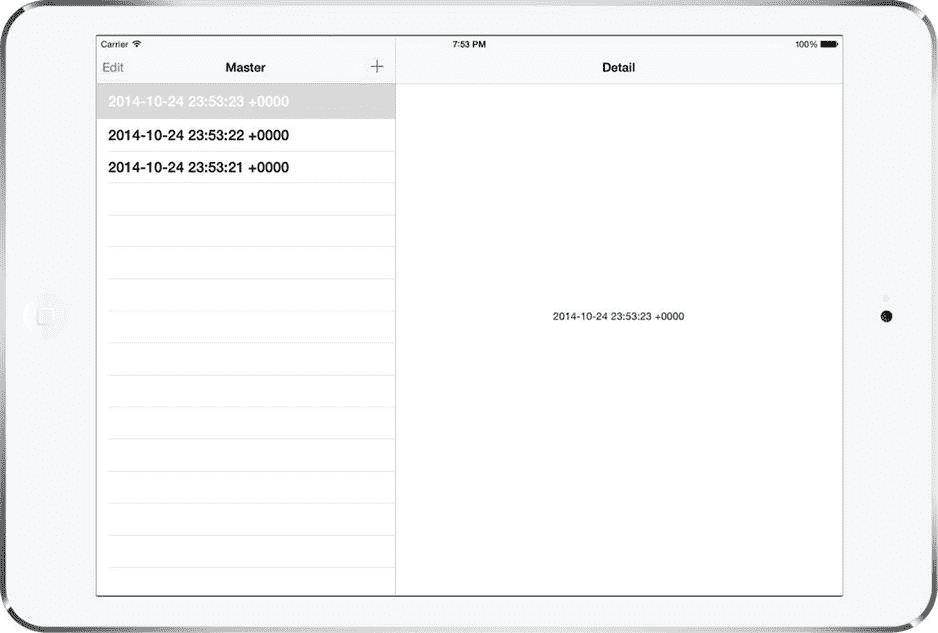

图 11-7. 模板应用，在主视图控制器中选中一项，并在详情视图控制器中显示

主视图控制器表格中的所有项都是日期。选择其中一项，详情视图中的标签就会更新显示相同的日期。你已经看到了执行此操作的代码——它是`DetailViewController.m`中的`configureView`方法，当详情视图控制器的`detailItem`属性被存入新值时调用。是什么导致了新属性值的设置？

回顾一下图 11-6 中的故事板。有一条 segue 将主视图控制器表格中的原型表格单元格链接到详情视图控制器。如果您点击此 segue 并打开属性检查器，您会看到这是一个**Show Detail** segue，其标识符为`showDetail`（参见图 11-8）。

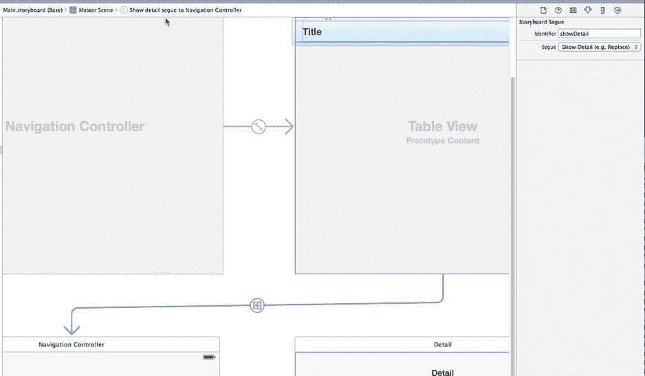

图 11-8. 连接主视图控制器和详情视图控制器的 Show Detail segue

正如你在第 9 章中看到的，链接到表格视图单元格的 segue 会在该单元格被选中时触发，因此当你在主视图控制器的表格视图中选择一行时，iOS 会执行 Show Detail segue，并将包装详情视图控制器的导航控制器作为 segue 的目标。这会导致两件事发生：


