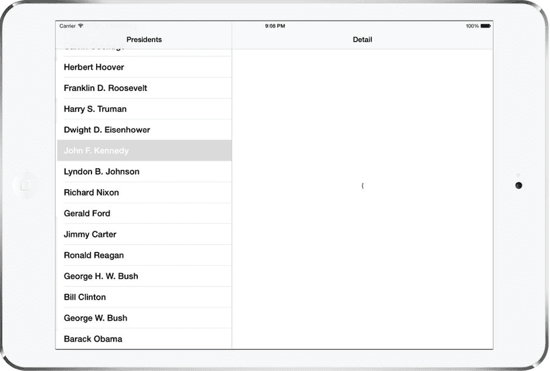
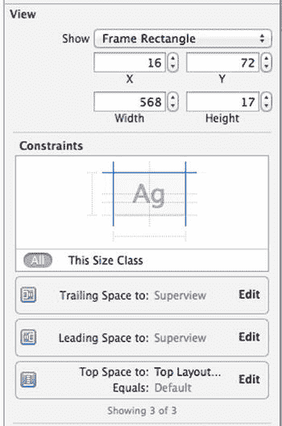
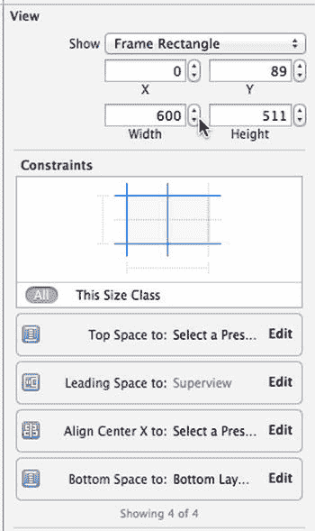
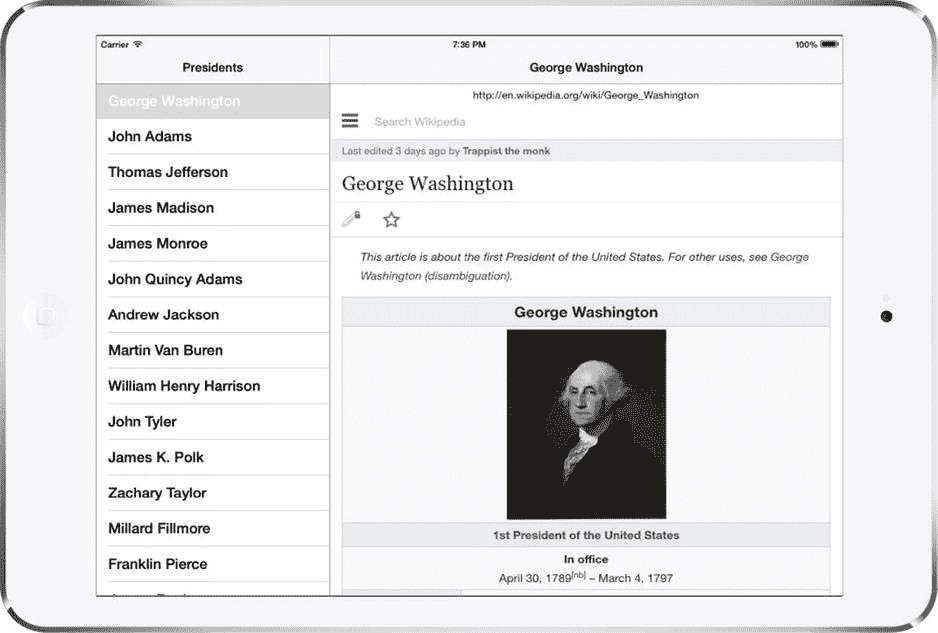
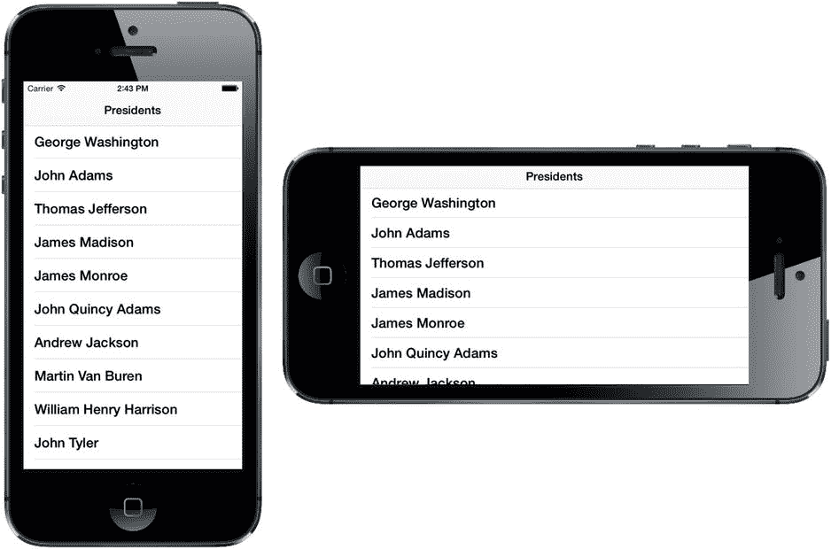
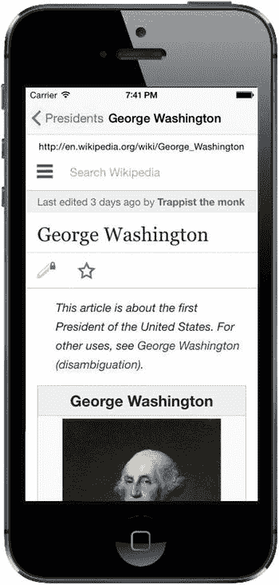
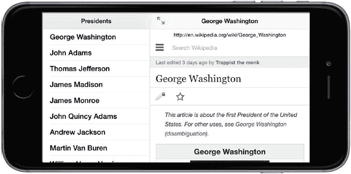
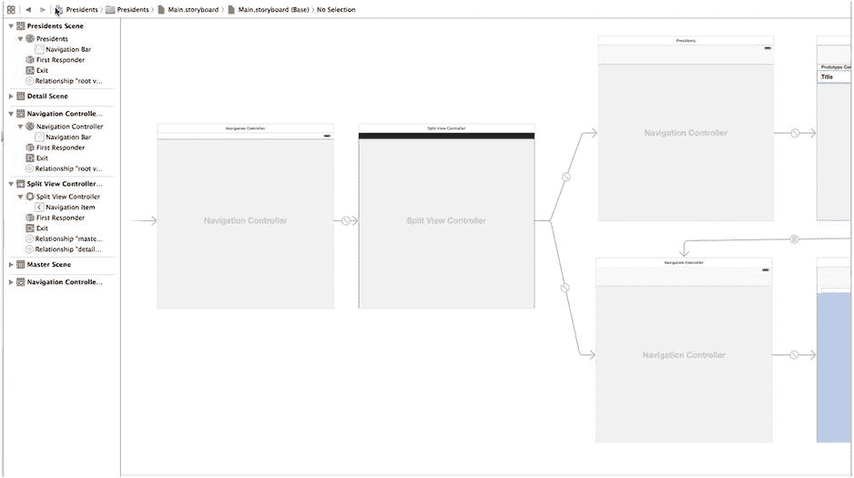
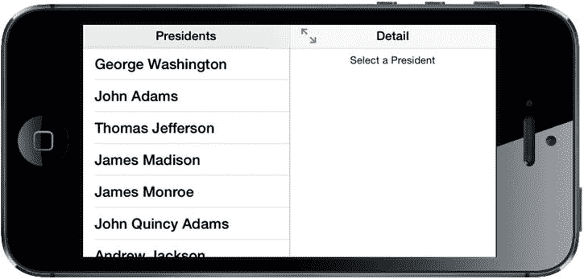

# 排版后内容

创建详细信息视图控制器的新实例，并将其视图添加到视图层次结构中。
主视图控制器中的 `prepareForSegue:sender:` 方法会被调用。

第一步负责确保详细信息视图控制器可见。在第二步中，你的主视图控制器需要以某种方式显示在主视图控制器中选中的对象。以下是 `MasterViewController.m` 中的模板代码如何处理此操作：

```
- (void)prepareForSegue:(UIStoryboardSegue *)segue sender:(id)sender {
    if ([[segue identifier] isEqualToString:@"showDetail"]) {
        NSIndexPath *indexPath = [self.tableView indexPathForSelectedRow];
        NSDate *object = self.objects[indexPath.row];
        DetailViewController *controller =
                   (DetailViewController *)[[segue destinationViewController] topViewController];
        [controller setDetailItem:object];
        controller.navigationItem.leftBarButtonItem = self.splitViewController.displayModeButtonItem;
        controller.navigationItem.leftItemsSupplementBackButton = YES;
    }
}
```

首先，检查 segue 标识符，确认它是预期的那个，并且获取视图控制器表格中选中对象对应的 `NSDate` 对象。接下来，主视图控制器从导致此方法被调用的 segue 的目标视图控制器的 `topViewController` 属性中，找到 `DetailViewController` 实例。现在，我们同时拥有了选中的对象和详细信息视图控制器，接下来要做的就是设置详细信息视图控制器的 `detailItem` 属性，以便更新详细信息视图。`prepareForSegue:sender:` 方法的最后两行将显示模式按钮添加到详细信息视图控制器的导航栏。当设备处于横屏模式时，这不会产生任何效果，因为显示模式按钮不可见；但如果你旋转到竖屏方向，就会看到该按钮（即“主视图”按钮）出现。

现在，你已经了解主视图控制器中选中的项目是如何在详细信息视图控制器中显示的了。虽然看起来这里并没有发生太多事情，但实际上，为了在 iPad 和 iPhone 上，无论是横屏还是竖屏方向都能正确工作，底层有大量操作正在进行。分割视图控制器的美妙之处在于，它处理了所有细节，让你可以专注于实现自定义的主视图控制器和详细信息视图控制器。

以上概括了 Xcode 的“主-从视图”应用程序模板所提供的内容。乍一看可能信息量很大，但理想情况下，通过逐步拆解介绍，已经帮助你理解所有部分是如何组合在一起的。

## 这里介绍的是总统

既然你已经了解了我们项目的基本布局，现在是时候填补空白，将模板应用变成你自己的应用了。首先查看本书的源代码归档文件，其中 `11 – Presidents Data` 文件夹包含一个名为 `PresidentList.plist` 的文件。将该文件拖入 Xcode 项目中的 `Presidents` 文件夹，以将其添加到项目中，确保选中告知 Xcode 复制文件本身的复选框。此 `.plist` 文件包含了迄今为止所有美国总统的信息，仅包括每位总统的姓名和维基百科条目 URL。

现在，让我们看看主视图控制器，并了解如何修改它以正确处理总统数据。这将是一件简单的事情：加载总统列表，在表格视图中呈现它们，并将 URL 传递给详细信息视图以供显示。在 `MasterViewController.m` 中，首先在类扩展中添加如下所示的粗体行，并删除划掉的行：

```
@interface MasterViewController ()

@property NSMutableArray *objects;
@property (copy, nonatomic) NSArray *presidents;

@end
```

我们不再使用 Xcode 创建的可变数组来保存总统列表，而是创建自己的、名称更有意义的不可变数组。

现在，将注意力转向 `viewDidLoad` 方法，其中的更改稍微复杂一些（但也不算太难）。你将添加几行代码来加载总统列表，然后删除其他几行用于在工具栏中设置编辑和插入按钮的代码：

```
- (void)viewDidLoad {
    [super viewDidLoad];
    // 在从 nib 加载视图后执行任何额外的设置。
    self.navigationItem.leftBarButtonItem = self.editButtonItem;

    NSString *path = [[NSBundle mainBundle] pathForResource:@"PresidentList"
                                                     ofType:@"plist"];
    NSDictionary *presidentInfo = [NSDictionary
                                   dictionaryWithContentsOfFile:path];
    self.presidents = [presidentInfo objectForKey:@"presidents"];

    UIBarButtonItem *addButton = [[UIBarButtonItem alloc]
                 initWithBarButtonSystemItem:UIBarButtonSystemItemAdd target:self
                action:@selector(insertNewObject:)];
    self.navigationItem.rightBarButtonItem = addButton;
    self.detailViewController = (DetailViewController *)
               [[self.splitViewController.viewControllers lastObject] topViewController];
}
```

这个模板生成的类还包含一个名为 `insertNewObject:` 的方法，用于向 `objects` 数组添加项目。我们不再有这个数组，因此删除整个方法：

```
- (void)insertNewObject:(id)sender {
    if (!_objects) {
        _objects = [[NSMutableArray alloc] init];
    }
    [_objects insertObject:[NSDate date] atIndex:0];
    NSIndexPath *indexPath = [NSIndexPath indexPathForRow:0 inSection:0];
    [self.tableView insertRowsAtIndexPaths:@[indexPath]
                         withRowAnimation:UITableViewRowAnimationAutomatic];
}
```

此外，我们还有一些处理允许用户编辑表格视图中行的数据源方法。在 this 应用中，我们不允许编辑任何行，所以在添加我们自己的代码之前，先删除这段代码：

```
- (BOOL)tableView:(UITableView *)tableView
                       canEditRowAtIndexPath:(NSIndexPath *)indexPath {
    // 如果不想让指定的项可编辑，则返回 NO。
    return YES;
}

- (void)tableView:(UITableView *)tableView
                    commitEditingStyle:(UITableViewCellEditingStyle)editingStyle
                    forRowAtIndexPath:(NSIndexPath *)indexPath {
    if (editingStyle == UITableViewCellEditingStyleDelete) {
        [self.objects removeObjectAtIndex:indexPath.row];
        [tableView deleteRowsAtIndexPaths:@[indexPath]
                         withRowAnimation:UITableViewRowAnimationFade];
    } else if (editingStyle == UITableViewCellEditingStyleInsert) {
        // 创建适当类的新实例，将其插入数组，
                   // 并向表格视图添加新行。
    }
}
```

现在是时候处理主要的表格视图数据源方法了，并根据我们的目的调整它们。让我们先编辑告诉表格视图显示多少行的方法：

```
- (NSInteger)tableView:(UITableView *)tableView
                        numberOfRowsInSection:(NSInteger)section {
    return self.objects.count;
    return [self.presidents count];
}
```

之后，编辑 `tableView:cellForRowAtIndexPath:` 方法，使每个单元格显示总统的名字：

```
- (UITableViewCell *)tableView:(UITableView *)tableView
                                cellForRowAtIndexPath:(NSIndexPath *)indexPath {
    UITableViewCell *cell =
             [tableView dequeueReusableCellWithIdentifier:@"Cell" forIndexPath:indexPath];

    NSDate *object = self.objects[indexPath.row];
    cell.textLabel.text = [object description];

    NSDictionary *president = self.presidents[indexPath.row];
    cell.textLabel.text = president[@"name"];

    return cell;
}
```


最后，编辑 `prepareForSegue:sender:` 方法，将所选总统的数据（一个 `NSDictionary`）传递给详情视图控制器，如下所示：

```
- (void)prepareForSegue:(UIStoryboardSegue *)segue sender:(id)sender {
    if ([[segue identifier] isEqualToString:@"showDetail"]) {
        NSIndexPath *indexPath = [self.tableView indexPathForSelectedRow];
        NSDate *object = self.objects[indexPath.row];
        DetailViewController *controller =
                 (DetailViewController *)[[segue destinationViewController] topViewController];
        [controller setDetailItem:object];
        NSDictionary *president = self.presidents[indexPath.row];
        controller .detailItem = president;

controller.navigationItem.leftBarButtonItem =
                         self.splitViewController.displayModeButtonItem;
        controller.navigationItem.leftItemsSupplementBackButton = YES;
    }
}
```

这就是在主视图控制器中需要做的全部工作。

接下来，选择 `Main.storyboard`，在文档大纲的 **Master Scene** 中点击 **Master** 图标以选中主视图控制器，然后双击其标题栏，将 *Master* 替换为 *Presidents*，并保存故事板。

此时，你可以构建并运行应用。切换到横屏模式，或点击左上角的 **Master** 按钮调出主视图控制器，即可显示总统列表（参见图 11-9）。点击某个总统的名字，详情视图中会显示一个没什么用处的字符串。



图 11-9. Presidents 应用的首次运行，主视图控制器中显示了总统列表，但详情视图中没有任何有用信息

让我们通过让详情视图对接收到的数据进行更有意义的处理来结束这个示例。首先从 `DetailViewContoller.h` 开始，我们将为 Web 视图添加一个插口，用于显示所选总统的维基百科页面。添加如下所示的粗体行：

```
@interface DetailViewController : UIViewController

@property (strong, nonatomic) id detailItem;
@property (weak, nonatomic) IBOutlet UILabel *detailDescriptionLabel;
@property (weak, nonatomic) IBOutlet UIWebView *webView;

@end
```

接下来，切换到 `DetailViewController.m`，这里需要做的工作稍多一些（但实际并不多）。滚动到 `configureView` 方法，并将其替换为以下代码：

```
- (void)configureView {
    // 更新详情项的用户界面。
    if (self.detailItem) {
        NSDictionary *dict = (NSDictionary *)self.detailItem;

NSString *urlString = dict[@"url"];
        self.detailDescriptionLabel.text = urlString;

NSURL *url = [NSURL URLWithString:urlString];
        NSURLRequest *request = [NSURLRequest requestWithURL:url];
        [self.webView loadRequest:request];

NSString *name = dict[@"name"];
        self.title = name;
    }
}
```

由主视图控制器设置的 `detailItem` 是一个包含两个键值对的 `NSDictionary`：一个键为 `name`，存储总统姓名；另一个键为 `url`，提供总统维基百科页面的 URL。我们使用该 URL 来设置详情描述标签的文本，并构建一个 `NSURLRequest`，供 `UIWebView` 加载页面。同时使用名称来设置详情视图控制器的标题。当视图控制器是 `UINavigationController` 中的容器时，其 `title` 属性的值会显示在导航控制器的导航栏中。这就是让 Web 视图加载所需页面的全部工作。

最后需要修改的地方在 `Main.storyboard` 中。打开它进行编辑，在右下角找到详情视图。首先处理 GUI 中的标签（其文本为 “Detail view content goes here”）。

从选中标签开始。你可能觉得在文档大纲中，在标记为 *Detail Scene* 的部分选中标签最为方便。选中标签后，将其拖到窗口顶部。标签应从左到右的蓝色参考线开始，并紧贴导航栏下方（调整其大小以确保这一点）。这个标签被重新用于显示当前 URL。但在应用启动时，用户选择总统之前，我们希望这个字段能给用户一个操作提示。

双击标签，将其更改为 *Select a President*。你还应使用 Size Inspector 确保标签的位置约束在其父视图的左右两侧以及顶部边缘（参见图 11-10）。如果需要调整这些约束，可以使用前面描述的方法进行设置。你可能只需选中标签，然后从菜单中选择 **Editor  Resolve Auto Layout Issues  Reset to Suggested Constraints**，就能几乎精确地达到想要的效果。



图 11-10. Size Inspector 显示了底部 “Select a President” 标签的约束设置

接下来，使用库找到 `UIWebView`，并将其拖入刚才移动的标签下方的空间。将 Web 视图放置好后，使用调整手柄使其填充标签下方视图的其余部分。让它从左边缘延伸到右边缘，并从标签底部下方的蓝色参考线一直延伸到窗口最底部。现在使用 Size Inspector 将 Web 视图约束到父视图的左边缘、底部边缘和右边缘，以及顶部边缘的标签（参见图 11-11）。同样，你可能只需从菜单中选择 **Editor  Resolve Auto Layout Issues  Reset to Suggested Constraints** 就能得到所需的结果。



图 11-11. Size Inspector 显示了 Web 视图的约束设置

现在，在文档大纲中选择 **Master** 视图控制器，并打开 Attributes Editor。在 **View Controller** 部分，将 **Title** 从 *Master* 改为 *Presidents*。这将使详情视图控制器顶部的导航按钮标题变得更加有用。

我们还有最后一步要完成。为了连接你创建的 Web 视图插口，按住 Control 键从 **Detail** 图标（在文档大纲的 Detail Scene 部分）拖拽到新的 Web 视图（在文档大纲中标签下方的同一部分，或在故事板中），并连接 `webView` 插口。保存你的修改，就完成了！

现在你可以构建并运行应用，它将允许你查看每位总统的维基百科条目（参见图 11-12）。在两个方向之间旋转显示，你会看到分割视图控制器如何在详情视图控制器的协助下为你处理一切。



图 11-12. Presidents 应用展示了乔治·华盛顿的维基百科页面

## 创建你自己的弹出视图


在第 4 章中，你已经看到可以在看起来像卡通对话气泡的界面中显示操作列表（见图 4-28）。这个对话气泡是**弹出控制器**（简称*popover*）的可视化表示。当操作列表由`UIPopoverPresentationController`呈现时，系统会自动为你创建操作列表附带的弹出视图，但你对此几乎没有控制权。不过，你可以使用`UIPopoverController`类创建自己的弹出视图，当你想要呈现自己的视图控制器时，这会非常有用。

为了了解其工作原理，我们将添加一个由永久工具栏项（不同于`UISplitView`中那种会显示和消失的项）触发的弹出视图。这个弹出视图将显示一个包含语言列表的表格视图。如果用户从列表中选择一种语言，网页视图将加载（以新语言显示）当前已显示的任何维基百科条目。这实现起来非常简单，因为在维基百科中切换语言只需更改 URL 中包含国家代码的一小部分即可。图 11-3 展示了我们期望的效果。但需要注意的是，`UIPopoverController`仅适用于 iPad，因此当此应用在 iPhone 上运行时，语言选择器将不可用。

**注意** 本例中使用弹出视图是为了展示`UITableView`，但不要被此误导——`UIPopoverController`可以用来处理任何你喜欢的视图控制器内容的显示！本例坚持使用表格视图，因为这是一个常见用例，用相对较少的代码就能轻松展示，而且你应该对此已经非常熟悉。

首先，在 Xcode 中右键点击*Presidents*文件夹，从弹出菜单中选择**New File...**。在出现的向导中选择**iOS Source**部分下的**Cocoa Touch Class**，然后点击**Next**。在下一页，将新类命名为*LanguageListController*，并从**Subclass of**字段中选择`UITableViewController`。点击**Next**，仔细检查文件保存位置，然后点击**Create**。

`LanguageListController`将是一个相当标准的表格视图控制器类。它将显示一个项目列表，并通过指向详细视图控制器的指针，在用户做出选择时通知详细视图控制器。编辑*LanguageListController.h*，添加以下以粗体显示的行：

```
#import <UIKit/UIKit.h>

@class DetailViewController;

@interface LanguageListController : UITableViewController

@property (weak, nonatomic) DetailViewController *detailViewController;
@property (copy, nonatomic) NSArray *languageNames;
@property (copy, nonatomic) NSArray *languageCodes;

@end
```

这些添加项定义了一个指向详细视图控制器的指针（我们将在即将显示语言列表时，在详细视图控制器本身的代码中进行设置），以及两个数组，分别用于存储将要显示的值（English、French 等）和用于根据所选语言构建 URL 的底层值（`en`、`fr`等）。请注意，我们声明这些数组时使用了`copy`存储语义而不是`strong`。这意味着，当有代码调用这些设置器之一时，参数会收到一条`copy`消息，而不仅仅是作为`strong`指针持有。这样做是为了防止其他类可能传入`NSMutableArray`而不是`NSArray`，然后在我们不知情的情况下修改数组。向`NSMutableArray`实例发送`copy`消息总是返回一个不可变的`NSArray`，因此我们知道所使用的数组不能被其他人更改。同时，向本身已是不可变的`NSArray`发送`copy`消息实际上并不会创建新副本，它只是返回一个指向`self`的`strong`指针，因此发送`copy`消息并不会造成任何浪费。

如果你是从本书的源代码存档（或电子书）中复制粘贴此代码到你的项目，或者自己输入时有些马虎，你可能没有注意到前面声明`detailViewController`属性时的一个重要区别。与大多数引用对象指针的属性不同，我们使用`weak`而不是`strong`来声明这个属性。这是我们必须做的，以避免出现**保留**循环。

什么是保留循环？这是一种情况，即一组两个或多个对象以循环方式相互引用。每个对象都阻止另一个对象的内存被释放。通过仔细考虑对象的创建方式，通常尝试判断哪个对象“拥有”哪个对象，可以避免大多数潜在的保留循环。从这个意义上说，`DetailViewController`的实例拥有`LanguageListController`的实例，因为正是`DetailViewController`创建了`LanguageListController`来完成某项工作。当你有一对需要相互引用的对象时，你通常希望拥有者对象保留另一个对象，而另一个对象则明确不保留其拥有者。由于我们使用了苹果在 Xcode 4.2 中引入的 ARC 功能，编译器为我们完成了大部分工作。我们无需关注释放和保留对象的细节，只需使用`weak`关键字（而不是`strong`）来声明指向我们不拥有的对象的属性即可。剩下的工作由 ARC 完成！

现在，切换到*LanguageListController.m*来实现以下更改。在文件顶部，首先导入`DetailViewController`的头文件：

```
#import "LanguageListController.h"
#import "DetailViewController.h"
.
.
.
```

接下来，向下滚动到`viewDidLoad`方法，并添加一些设置代码：

```
- (void)viewDidLoad {
    [super viewDidLoad];

    self.languageNames = @[@"English", @"French", @"German", @"Spanish"];
    self.languageCodes = @[@"en", @"fr", @"de", @"es"];
    self.clearsSelectionOnViewWillAppear = NO;
    self.preferredContentSize = CGSizeMake(320.0,
                                           [self.languageCodes count] * 44.0);

    [self.tableView registerClass:[UITableViewCell class]
           forCellReuseIdentifier:@"Cell"];
}
```

这段代码设置了语言数组，并定义了视图控制器的视图在弹出视图中显示时将使用的尺寸（我们知道，它确实会在弹出视图中显示）。如果不定义尺寸，弹出视图将会垂直拉伸以几乎填满整个屏幕，即使使用小得多的视图也能完整显示。最后，我们注册了一个默认的表格视图单元格类供使用，如第 8 章所述。


再往下，Xcode 模板生成的一些方法并不包含特别有用的代码——只是一条警告和占位文本。让我们用实际内容替换它们：

```
- (NSInteger)numberOfSectionsInTableView:(UITableView *)tableView {
#warning Potentially incomplete method implementation.
    return 0;
    return 1;
}

- (NSInteger)tableView:(UITableView *)tableView
    numberOfRowsInSection:(NSInteger)section {
#warning Incomplete method implementation.
    // Return the number of rows in the section.
    return 0;
    return [self.languageCodes count];
}
```

现在添加 `tableView:cellForRowAtIndexPath:` 方法来获取单元格对象并将语言名称放入单元格中：

```
- (UITableViewCell *)tableView:(UITableView *)tableView
                                 cellForRowAtIndexPath:(NSIndexPath *)indexPath {
    UITableViewCell *cell =
            [tableView dequeueReusableCellWithIdentifier:@"Cell" forIndexPath:indexPath];

// Configure the cell...
    cell.textLabel.text = self.languageNames[indexPath.row];

return cell;
}
```

接下来，实现 `tableView:didSelectRowAtIndexPath:` 以便能够响应用户的触摸操作，将所选语言传回给详情视图控制器：

```
- (void)tableView:(UITableView *)tableView
                  didSelectRowAtIndexPath:(NSIndexPath *)indexPath {
    self.detailViewController.languageString =
                  self.languageCodes[indexPath.row];
}
```

**注意**：`DetailViewController` 实际上还没有 `languageString` 属性，因此你会看到一个编译错误。我们很快就会处理这个问题。

现在该对 `DetailViewController` 进行必要修改，以处理弹出窗口，并在用户更改显示语言或选择不同总统时生成正确的 URL。首先在 `DetailViewController.h` 中进行以下更改：

```
#import <UIKit/UIKit.h>

@interface DetailViewController : UIViewController

@property (strong, nonatomic) id detailItem;
@property (weak, nonatomic) IBOutlet UILabel *detailDescriptionLabel;
@property (weak, nonatomic) IBOutlet UIWebView *webView;
@property (strong, nonatomic) UIBarButtonItem *languageButton;
@property (strong, nonatomic) UIPopoverController *languagePopoverController;
@property (copy, nonatomic) NSString *languageString;

@end
```

这里，我们添加了一些属性来跟踪弹出窗口所需的 GUI 组件以及用户选择的语言。接下来需要做的就是修复 `DetailViewController.m`，使其能够处理语言弹出窗口和 URL 构建。首先在顶部某处添加此导入，并使该类遵循 `UIPopoverControllerDelegate` 协议，以便它能够响应来自 `UIPopoverController` 的消息：

```
#import "DetailViewController.h"
#import "LanguageListController.h"

@interface DetailViewController () <UIPopoverControllerDelegate>

@end
```

接下来要添加的是一个函数，该函数接受一个指向维基百科页面的 URL 和一个两位字母的语言代码作为参数，然后返回一个合并两者的 URL。稍后我们会在控制器代码的适当位置使用它。你可以将这个函数放在任何位置，包括类的实现内部。编译器足够智能，总是将函数视为函数。将其放在 `setDetailItem:` 方法之后：

```
static NSString * modifyUrlForLanguage(NSString *url, NSString *lang) {
    if (!lang) {
        return url;
    }

// We're relying on a particular Wikipedia URL format here. This
    // is a bit fragile!
    // URL is like http://en.wikipedia...
    NSRange codeRange = NSMakeRange(7, 2);
    if ([[url substringWithRange:codeRange] isEqualToString:lang]) {
        return url;
    } else {
        NSString *newUrl = [url stringByReplacingCharactersInRange:codeRange
                                                        withString:lang];
        return newUrl;
    }
}
```

为什么将其做成函数而不是方法？有几个原因。首先，类中的实例方法通常用于涉及一个或多个实例变量的操作，或者通过 getter 和 setter 或直接实例变量访问来访问对象的内部状态。而此函数不使用任何实例变量，它只是对两个字符串执行操作并返回另一个字符串。我们本可以将其做成类方法，但这样做也有些不对劲，因为该方法的功能与控制器类并没有特别具体的关联。有时，函数正是你所需要的。

下一步是更新 `configureView:` 方法。此方法将使用我们刚刚定义的函数来合并传入的 URL 和选定的 `languageString`，以生成正确的 URL：

```
- (void)configureView {
    // Update the user interface for the detail item.
    if (self.detailItem) {
        NSDictionary *dict = (NSDictionary *)self.detailItem;

NSString *urlString = modifyUrlForLanguage(dict[@"url"], self.languageString);
        self.detailDescriptionLabel.text = urlString;

NSURL *url = [NSURL URLWithString:urlString];
        NSURLRequest *request = [NSURLRequest requestWithURL:url];
        [self.webView loadRequest:request];

NSString *name = dict[@"name"];
        self.title = name;
    }
}
```

现在让我们更新 `viewDidLoad` 方法。这里，我们将创建一个 `UIBarButtonItem` 并将其放入屏幕顶部的 `UINavigationItem` 中，但仅当我们在 iPad 上运行时才这样做：

```
- (void)viewDidLoad {
    [super viewDidLoad];

if (UI_USER_INTERFACE_IDIOM() == UIUserInterfaceIdiomPad) {
        self.languageButton =
         [[UIBarButtonItem alloc] initWithTitle:@"Choose Language"
                                      style:UIBarButtonItemStylePlain
                                     target:self
                                     action:@selector(toggleLanguagePopover)];
        self.navigationItem.rightBarButtonItem = self.languageButton;
    }
    [self configureView];
}
```

此处你会看到一个编译器警告，因为你刚刚添加的代码引用了一个名为 `toggleLanguagePopover` 的方法，但该方法不存在。我们稍后会修复这个问题。这里我们使用 `UI_USER_INTERFACE_IDIOM()` 来判断是在 iPad 还是 iPhone 上运行。我们只想在 iPad 上添加此按钮，因为 iPhone 不支持 `UIPopoverController`。

接下来，我们实现 `setLanguageString:`，当 `languageString` 属性的值发生变化时会调用此方法。此属性设置器方法会调用 `configureView`，以便立即重新生成 URL（并加载新页面），并且如果语言选择弹出窗口可见，则将其关闭。将此方法添加到文件底部，紧挨 `@end` 之前：

```
- (void)setLanguageString:(NSString *)newString {
    if (![newString isEqualToString:self.languageString]) {
        _languageString = [newString copy];
        [self configureView];
    }
    if (self.languagePopoverController != nil) {
        [self.languagePopoverController dismissPopoverAnimated:YES];
        self.languagePopoverController = nil;
    }
}
```

现在，让我们定义用户点击**选择语言**按钮时会发生什么。简单来说，我们创建一个 `LanguageListController`，将其包装在 `UIPopoverController` 中，然后显示它。将此方法放在 `viewDidLoad` 方法之后：


```objc
- (void)toggleLanguagePopover {
    if (self.languagePopoverController == nil) {
        LanguageListController *languageListController =
            [[LanguageListController alloc] init];
        languageListController.detailViewController = self;
        UIPopoverController *poc =
            [[UIPopoverController alloc]
                 initWithContentViewController:languageListController];
        [poc presentPopoverFromBarButtonItem:self.languageButton
                    permittedArrowDirections:UIPopoverArrowDirectionAny
                                    animated:YES];
        self.languagePopoverController = poc;
    } else {
        [self.languagePopoverController dismissPopoverAnimated:YES];
        self.languagePopoverController = nil;
    }
}
```

最后，我们需要再实现一个方法，来处理用户点击打开我们的 Languages 弹出框，然后点击弹出框外部使其消失的情况。在这种情况下，我们的 `toggleLanguagePopover` 方法不会被调用。不过，我们可以实现 `UIPopoverControllerDelegate` 协议中声明的一个方法，以便在发生这种情况时得到通知，然后移除 Languages 弹出框：

```objc
- (void)popoverControllerDidDismissPopovers:
    (UIPopoverController *)popoverController  {
    if (popoverController == self.languagePopoverController) {
        self.languagePopoverController = nil;
    }
}
```

就是这样！现在，你应该能够运行这个应用，全面展示其功能，并且在总统和语言之间随意切换。切换语言时，所选总统应始终保持不变。同样地，切换总统时，语言也应保持不变——但实际上，语言却变了。试试看：选择一位总统，将语言改为（比如）西班牙语，然后再选择另一位总统。不幸的是，语言不再是西班牙语了。

为什么会出现这种情况？如果你回到“主-从模板应用程序的工作原理”一节，就会发现问题的根源——Show Detail 转场每次执行时都会创建一个新的从视图控制器实例。这意味着，作为从视图控制器属性存储的语言设置，将在每次选择新总统时丢失。要修复这个问题，我们需要在主视图控制器中添加几行代码。打开 `MasterViewController.m`，对 `prepareForSegue:sender:` 方法进行以下修改：

```objc
- (void)prepareForSegue:(UIStoryboardSegue *)segue sender:(id)sender {
    if ([[segue identifier] isEqualToString:@"showDetail"]) {
        NSIndexPath *indexPath = [self.tableView indexPathForSelectedRow];

        DetailViewController *controller =
                   (DetailViewController *)[[segue destinationViewController] topViewController];
        controller.languageString = self.detailViewController.languageString;
        self.detailViewController = controller;

        NSDictionary *president = self.presidents[indexPath.row];
        controller.detailItem = president;

        controller.navigationItem.leftBarButtonItem = self.splitViewController.
                displayModeButtonItem;
        controller.navigationItem.leftItemsSupplementBackButton = YES;
    }
}
```

回想一下，我们在主视图控制器的 `viewDidLoad` 方法中将从视图控制器的引用保存到了 `detailViewController` 属性中。这里，在即将执行转场时，我们利用该引用从旧的从视图控制器实例中获取 `languageString` 属性的值，并将其复制到新实例中，而新实例已经替换了分割视图控制器视图层次结构中的旧实例。然后，我们更新 `detailViewController` 属性为新实例。这就是我们需要做的全部工作。现在，再次运行应用程序。你会发现，你可以在总统之间切换，而不会丢失所选择的语言。

## iPhone 上的分割视图

从 iOS 8 开始，分割视图控制器不仅适用于 iPad，也适用于 iPhone。然而，iPhone 较小的屏幕尺寸意味着分割视图控制器的工作方式与 iPad 略有不同。选择 iPhone 5s 模拟器，在竖屏模式下运行 Presidents 应用。你会立刻看到差异（参见图 11-13）：主视图控制器中的总统列表可见，但缺少从视图控制器。将设备旋转至横屏模式，你会发现仍然只能看到主视图控制器。



图 11-13。在 iPhone 5s 上运行的 Presidents 应用

要激活从视图控制器，只需选择一位总统。从视图控制器的视图从右侧滑入，**Presidents** 按钮出现在导航栏顶部，如图 11-14 所示。同时注意，**Choose Language** 按钮不见了，因为我们在 iPhone 上运行时没有创建它。如果你按下 **Back** 按钮，从视图控制器的视图会滑出到右侧，总统列表重新出现。



图 11-14。iPhone 上的 Presidents 应用从视图控制器

需要注意的是，我们无需更改任何代码即可让应用程序在 iPhone 上运行。分割视图控制器在 iPhone 受限的屏幕空间中会以不同的方式设置自身，初始时仅显示主视图控制器。在这种模式下，我们称分割视图控制器处于**折叠**状态。在折叠模式下，我们用来连接主视图控制器和从视图控制器的 Set Detail 转场行为会发生变化——分割视图不会在屏幕的专用空间中显示从视图控制器，而是将其推送到主视图控制器的 `UINavigationController` 的视图控制器堆栈上。当你按下 **Presidents** 按钮重新显示总统列表时，从视图控制器会从堆栈中弹出，露出其下方的表格视图控制器。

## iPhone 6 Plus 上的分割视图

你刚才看到的行为适用于所有 iPhone，但 iPhone 6 Plus 除外。在横屏模式下，iPhone 6 Plus 拥有足够大的屏幕，允许分割视图并排显示两个视图控制器，就像在 iPad 上一样，但仅限于横屏模式。在 iPhone 6 Plus 模拟器上运行该应用程序。初始时你只会看到主视图控制器，与通常情况一样。现在旋转到横屏模式，你会看到两个视图控制器（图 11-15）。



图 11-15。iPhone 6 Plus 横屏模式下的 Presidents 应用

这与 iPad 上的情况相似，但并不完全相同。如果你将图 11-15 与图 11-3 进行比较，你会发现 iPhone 版本在从视图控制器导航栏的左上角多了一个双向箭头按钮。这实际上是 **Presidents** 按钮（即从应用委托中的 `UISplitViewController` 的 `displayModeButtonItem` 属性获取的按钮），其绘制方式不同以反映其修改后的功能。如果你按下此按钮，主视图控制器会被移除，从视图控制器占据整个屏幕，此时按钮恢复为正常外观。再次按下该按钮，主视图控制器会重新显示。


iPhone 6 Plus 的行为差异是`UISplitViewController`免费提供的另一项功能。有多种方法可以自定义拆分视图的行为，通常是通过实现`UISplitViewDelegate`协议的各种方法。我们不打算在这里进一步讨论，除了指出一个细节，如果你重新启动应用程序并将模拟器旋转为纵向模式，你会注意到这个细节。此时，与往常一样，你将看到主视图控制器。如果你在纵向和横向模式之间切换，你将看到相同的控制器。现在，旋转到横向模式并选择一位总统，然后旋转回纵向模式。这次，详细视图控制器保持可见——拆分视图控制器并没有切换回主视图控制器。此行为是在`AppDelegate.m`中实现的`UISplitViewDelegate`方法的结果，也是应用程序启动时应用程序委托被注册为拆分视图委托的原因。该方法的实现如下：

```objc
- (BOOL)splitViewController:(UISplitViewController *)splitViewController
             collapseSecondaryViewController:(UIViewController *)secondaryViewController
             ontoPrimaryViewController:(UIViewController *)primaryViewController {
    if ([secondaryViewController isKindOfClass:[UINavigationController class]]
               && [[(UINavigationController *)secondaryViewController topViewController]
                                     isKindOfClass:[DetailViewController class]]
              && ([(DetailViewController *)
                            [(UINavigationController *)secondaryViewController topViewController]
                                      detailItem] == nil)) {
        // Return YES to indicate that we have handled the collapse by doing nothing; the secondary controller will be discarded.
        return YES;
    } else {
        return NO; 
    }
}
```

当拆分视图控制器在展开模式（两个视图控制器都激活）和折叠模式（只有一个视图控制器）之间切换时，会调用此方法。如果返回`YES`，详细视图控制器将被移除；但如果返回`NO`，详细视图控制器将保持在视图中。Xcode 模板生成的代码确保如果`detailItem`属性不为`nil`（即当前正在显示某些内容），则不会移除详细视图控制器。有趣的是，如果你将此方法存根化，使其始终返回`NO`，你会发现拆分视图控制器打开时显示的是详细视图控制器而不是主视图控制器。

## 在所有 iPhone 上获得 iPhone 6 Plus 的行为

可以让所有 iPhone 上的拆分视图表现得像 iPhone 6 Plus 一样。要了解这是如何实现的，你必须理解为什么拆分视图在 iPhone 6 Plus 的横向模式下会同时显示两个视图控制器，而在其他 iPhone 型号上则不会。关键在于第 5 章介绍的一个概念——尺寸类别。如果你查看 Figure 5-20，你会发现所有 iPhone 在所有方向上的水平尺寸类别都是`Compact`，除了 iPhone 6 Plus 在横向模式下具有`Regular`尺寸类别。拆分视图控制器在水平紧凑环境中以折叠模式运行，否则以展开模式运行。这就是为什么你可以在 iPhone 6 Plus 处于横向方向时同时看到两个视图控制器。事实证明，你可以利用这一点在所有 iPhone 上获得相同的行为。你需要做的就是让拆分视图控制器相信其水平尺寸类别是`Regular`。

尺寸类别信息是从父视图控制器（如果有）或窗口（如果是顶级视图控制器）传播给视图控制器的。当视图控制器的视图被显示以及设备旋转时（如果旋转会导致其水平或垂直尺寸类别发生变化），尺寸类别信息会作为**特征集合**的一部分传递，由`UITraitCollection`类表示。所有视图控制器都遵循`UITraitEnvironment`协议，这意味着它们拥有一个保存当前特征集的`traitCollection`属性，并且它们实现了以下方法，该方法在`traitCollection`属性值更改后被调用：

```objc
- (void)traitCollectionDidChange:(UITraitCollection *)previousTraitCollection
```

为了让拆分视图控制器相信它具有`Regular`水平尺寸类别，我们需要更改由其父视图控制器传递的`trait collection`。这就带来了一个问题：在 Master-Detail 应用程序模板创建的 storyboard 中（见 Figure 11-6），拆分视图控制器是其窗口的根视图控制器，因此它没有父视图控制器。要更改其特征集合，我们首先必须给它一个父视图控制器，那么我们就来这样做。

选择`Main.storyboard`，打开对象库，并将一个`UINavigationController`拖到 storyboard 上。我们将使该控制器成为拆分视图控制器的父控制器。它已经有一个`UITableViewController`子级，我们不需要它，所以选择它（在文档大纲中标记为**Root View Controller**的那个）并将其删除。接下来，按住 Control 键从导航控制器拖拽到拆分视图控制器，然后释放鼠标。在弹出的菜单中，从**Relationship Segue**部分选择**Root View Controller**，以使导航控制器成为`UISplitViewController`的父控制器。最后还有两个步骤需要完成。选择导航控制器并打开属性检查器。在**Navigation Controller**部分，取消选中**Shows Navigation Bar**（因为我们不需要导航功能），并在**View Controller**部分，选中**Is Initial View Controller**，使导航控制器成为应用程序窗口的根视图控制器。

**注意** 如果你想知道为什么我们使用`UINavigationController`而不是普通的`UIViewController`作为根视图控制器，原因是 Interface Builder 不允许你从普通的`UIViewController`拖拽来创建控制器连接，因为它没有`rootViewController`属性。你可以在代码中创建连接（正如我们在第 6 章中所做的那样），但使用`UINavigationController`并关闭导航栏会更简单。

此时，你的 storyboard 应该类似于 Figure 11-16。



Figure 11-16. 具有新根视图控制器的 Presidents 应用的 storyboard

现在我们已经为拆分视图提供了一个父视图控制器，我们需要重写其`traitCollectionDidChange:`方法。为此，我们需要用我们自己的`UINavigationController`子类替换 storyboard 中的那个。右键单击项目导航器中的`Presidents`文件夹，选择**New File. . .**，然后从新文件选择器的**iOS Source**部分选择**Cocoa Touch Class**并点击**Next**。将新类命名为`RootViewController`，使其成为`UINavigationController`的子类，然后创建它。在`Main.storyboard`中选择导航控制器，打开标识检查器，并将其**Class**设置为`RootViewController`。


现在我们的导航控制器子类是窗口的根视图控制器，我们几乎准备好要重写它的`traitCollectionDidChange:`方法了，但在那之前还有一件事需要修复。在`AppDelegate.m`中，模板生成的`application:didFinishLaunchingWithOptions:`代码假定分割视图控制器是根视图控制器。既然情况不再如此，我们需要做一个小改动。打开`AppDelegate.m`并进行以下加粗显示的更改：

```
- (BOOL)application:(UIApplication *)application
                               didFinishLaunchingWithOptions:(NSDictionary *)launchOptions {
    // Override point for customization after application launch.
    UISplitViewController *splitViewController =
                             (UISplitViewController *)self.window.rootViewController;
    UINavigationController *rootViewController =
                             (UINavigationController *)self.window.rootViewController;
    UISplitViewController *splitViewController =
                             (UISplitViewController *)rootViewController.viewControllers[0];
    UINavigationController *navigationController = [splitViewController.viewControllers lastObject];
    navigationController.topViewController.navigationItem.leftBarButtonItem =
                             splitViewController.displayModeButtonItem;
    splitViewController.delegate = self;
    return YES;
}
```

现在让我们来做我们计划要做的事。在编辑器中打开`RootViewController.m`并添加以下代码：

```
- (void)traitCollectionDidChange:(UITraitCollection *)previousTraitCollection {
    UIViewController *spltVC = self.viewControllers[0];
    UITraitCollection *newTraits = self.traitCollection;
    if (newTraits.horizontalSizeClass == UIUserInterfaceSizeClassCompact
            && newTraits.verticalSizeClass == UIUserInterfaceSizeClassCompact) {
        UITraitCollection *childTraits = [UITraitCollection
                    traitCollectionWithHorizontalSizeClass:UIUserInterfaceSizeClassRegular];
        [self setOverrideTraitCollection:childTraits forChildViewController:spltVC];
    } else {
        [self setOverrideTraitCollection:nil forChildViewController:spltVC];
    }
    [super traitCollectionDidChange:previousTraitCollection];
}
```

我们首先从根视图控制器的`traitCollection`属性获取新安装的特征集合。如果水平和垂直尺寸类都是 Compact，那么肯定是在一个已旋转到横屏的 iPhone 上运行。这种情况下，我们需要将分割视图将要看到的水平尺寸类从 Compact 改为 Regular。我们通过使用`UITraitCollection`的类方法创建一个用于常规尺寸类的特征来实现这一点：

```
UITraitCollection *childTraits = [UITraitCollection
            traitCollectionWithHorizontalSizeClass:UIUserInterfaceSizeClassRegular];
```

接下来，我们告诉根视图控制器用这个新特征覆盖其子视图控制器（即分割视图控制器）的特征：

```
[self setOverrideTraitCollection:childTraits forChildViewController:spltVC];
```

另一方面，如果遇到任何其他尺寸类组合，我们不需要更改它们，因此安装一个`nil`覆盖：

```
[self setOverrideTraitCollection:nil forChildViewController:spltVC];
```

现在构建并运行应用程序，然后在任意 iPhone 模拟器上运行。旋转到横屏，你就会看到两个视图控制器，就像在 iPhone 6 Plus 上一样。

顺便提一下，你甚至可以通过修改`traitCollectionDidChange:`方法，让它始终安装一个覆盖特征，来强制分割视图控制器在竖屏模式下显示两个视图控制器。尝试一下以确认它可行是值得的，但在大多数情况下，屏幕太窄，这种做法不太实用。

## 自定义分割视图

有几个分割视图控制器的自定义选项值得尝试，这些选项可在任何设备上使用。首先，你可以控制当两个视图控制器都可见时，主视图控制器所占区域的宽度。为此，你需要设置分割视图控制器的`preferredPrimaryColumnWidthFraction`和`maximumPrimaryColumnWidth`属性。前者将主视图控制器的宽度设置为总可用空间的一个分数，需要一个介于 0 和 1 之间的值。后者作为其宽度的上限，因此，如果需要主视图控制器比分割视图控制器计算的默认宽度更宽，你需要设置此属性。

要了解这是如何工作的，请在`AppDelegate.m`中对`application:didFinishLaunchingWithOptions:`进行以下更改：

```
- (BOOL)application:(UIApplication *)application
                didFinishLaunchingWithOptions:(NSDictionary *)launchOptions {
    // Override point for customization after application launch.
    UINavigationController *rootViewController =
                    (UINavigationController *)self.window.rootViewController;
    UISplitViewController *splitViewController =
                    (UISplitViewController *)rootViewController.viewControllers[0];
    UINavigationController *navigationController =
                    [splitViewController.viewControllers lastObject];
    navigationController.topViewController.navigationItem.leftBarButtonItem =
                    splitViewController.displayModeButtonItem;
    splitViewController.delegate = self;

    splitViewController.preferredPrimaryColumnWidthFraction = 0.5;
    splitViewController.maximumPrimaryColumnWidth = 600;

    return YES;
}
```

在任意模拟器上再次运行应用程序并旋转到横屏模式。你会看到主视图控制器现在占据了半个屏幕（参见图 11-17），因为我们把`preferredPrimaryColumnWidthFraction`设置为 0.5，并将`maximumPrimaryColumnWidth`增加到一个足够大的值，以至于在任何当前设备上都不会限制主视图控制器的宽度。



图 11-17. 在分割视图中增加主视图控制器的宽度

第二个自定义选项控制主视图控制器的管理方式。默认情况下，分割视图控制器决定该控制器何时可见以及它如何出现和消失。例如，在 iPad 竖屏模式下，主视图控制器最初不可见，从屏幕左侧滑入；而在横屏模式下，它最初可见且无法隐藏。此行为由分割视图控制器的`preferredDisplayMode`属性控制。默认情况下，它被设置为`UISplitViewControllerDisplayModeAutomatic`，但还有另外三种选择：

- `UISplitViewControllerDisplayModePrimaryOverlay`：将主视图控制器放置在左侧，覆盖在详细视图控制器之上。主视图控制器被关闭时，它会向左滑出。
- `UISplitViewControllerDisplayModePrimaryHidden`：与`UISplitViewControllerDisplayModePrimaryOverlay`相同，只是主视图控制器最初是隐藏的。
- `UISplitViewControllerDisplayModeAllVisible`：使两个视图控制器在屏幕上最初都可见。

实际行为取决于设备的类型。例如，在水平 Compact 模式下，此属性无效，因为两个视图控制器不会同时出现在屏幕上。

你可以通过在`application:didFinishLaunchingWithOptions:`方法中设置`preferredDisplayMode`属性来尝试每种模式。例如：


```
- (BOOL)application:(UIApplication *)application
                didFinishLaunchingWithOptions:(NSDictionary *)launchOptions {
    // Override point for customization after application launch.
    UINavigationController *rootViewController =
                    (UINavigationController *)self.window.rootViewController;
    UISplitViewController *splitViewController =
                    (UISplitViewController *)rootViewController.viewControllers[0];
    UINavigationController *navigationController =
                    [splitViewController.viewControllers lastObject];
    navigationController.topViewController.navigationItem.leftBarButtonItem =
                    splitViewController.displayModeButtonItem;
    splitViewController.delegate = self;

splitViewController.preferredPrimaryColumnWidthFraction = 0.5;
    splitViewController.maximumPrimaryColumnWidth = 600;

splitViewController.preferredDisplayMode = UISplitViewControllerDisplayModePrimaryOverlay;

return YES;
}
```

## 准备收尾与拆分

在本章中，你学习了拆分视图控制器及其在创建主从应用程序中的作用。你还了解到，一个包含多个相互连接的视图控制器的复杂应用程序，可以完全在 Interface Builder 中进行配置。尽管拆分视图现在可在所有设备上使用，但在 iPhone 6 Plus 和 iPad 较大的屏幕空间中，它们可能仍然最为实用。如果你想进一步深入了解 iPad 开发的细节，不妨阅读 David Mark、Jack Nutting 和 Dave Wooldridge 合著的 *《Beginning iPad Development for iPhone Developers》*（Apress，2010 年）。

接下来，我们将探讨应用程序设置和用户默认值。

## 第 12 章

