# 应用程序设置与用户默认值

如今，除了最简单的计算机程序外，几乎所有程序都设有一个偏好设置窗口，用户可在其中设置特定于应用程序的选项。在 Mac OS X 上，`Preferences...` 菜单项通常位于应用程序菜单中。点击后，会弹出一个窗口，用户可在其中输入和更改各种选项。iPhone 和其他 iOS 设备则有一个名为“设置”的专用应用程序，相信你已多次使用过。在本章中，我们将向你展示如何为你的应用程序在“设置”应用中添加设置项，以及如何从应用程序中访问这些设置。

## 了解你的设置捆绑包

“设置”应用允许用户为任何包含设置捆绑包的应用程序输入和更改偏好设置。**设置捆绑包** 是一组内置于应用程序中的文件，它告知“设置”应用该应用程序希望从用户那里收集哪些偏好设置。

拿起你的 iOS 设备，找到“设置”图标。点击该图标启动“设置”应用。我们的“设置”应用如图 12-1 所示。

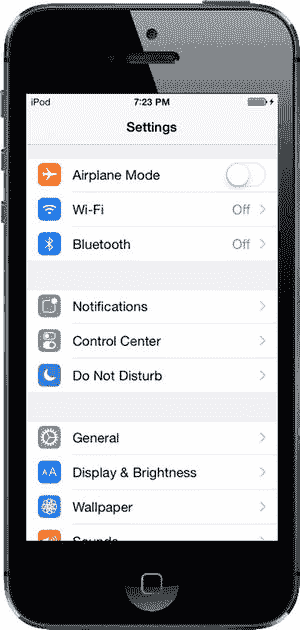

图 12-1。“设置”应用程序。

“设置”应用程序充当 iOS 用户默认值机制的通用用户界面。用户默认值是系统中用于存储和检索偏好设置的部分。

在 iOS 应用程序中，用户默认值由 `NSUserDefaults` 类实现。如果你在 Mac 上做过 Cocoa 编程，可能对 `NSUserDefaults` 已经很熟悉了，因为在 Mac 上存储和读取偏好设置使用的也是同一个类。你将让你的应用程序使用 `NSUserDefaults` 通过键值对来读取和存储偏好设置数据，就像从 `NSDictionary` 中访问键控数据一样。不同之处在于，`NSUserDefaults` 的数据会持久化到文件系统中，而不是存储在内存中的对象实例中。

在本章中，我们将创建一个应用程序，添加并配置一个设置捆绑包，然后从“设置”应用程序以及我们自己的应用程序中访问和编辑这些偏好设置。

“设置”应用程序的一个好处是它提供了一个现成的解决方案，因此你无需为偏好设置设计自己的用户界面。你只需创建一个描述应用程序可用设置的属性列表，“设置”应用程序就会为你生成相应的界面。

沉浸式应用程序（例如游戏）通常应提供自己的偏好设置视图，以便用户无需退出程序就能进行更改。即使是实用程序或生产力应用程序，有时也可能需要用户在不离开应用的情况下更改偏好设置。我们还将向你展示如何直接在应用程序中收集用户的偏好设置，并将其存储在 iOS 的用户默认值中。

另一个额外复杂情况是，用户实际上可以切换到“设置”应用程序，更改偏好设置，然后再切换回仍在运行中的你的应用程序。我们将在本章末尾向你展示如何处理这种情况。

## 舰桥控制应用程序

在本章中，我们将构建一个简单的应用程序，用于记录管理星际飞船舰桥的某些方面，我相信你会同意这是一项有用的任务。我们的第一步是创建一个设置捆绑包，这样当用户启动“设置”应用程序时，会看到我们应用程序“舰桥控制”的条目（参见 图 12-2）。

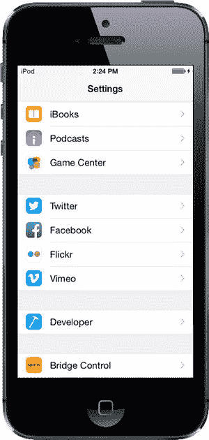

图 12-2。“设置”应用程序，在模拟器中显示了我们的“舰桥控制”应用程序条目

如果用户选择我们的应用程序，“设置”将下钻进入一个视图，显示与我们应用程序相关的偏好设置。正如你在 图 12-3 中所见，“设置”应用程序使用文本字段、安全文本字段、开关和滑块来引导我们勇敢的用户输入值。

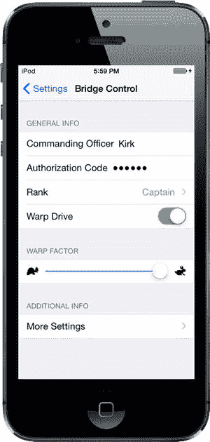

图 12-3。我们应用程序的主要设置视图

另外请注意视图中带有展开指示符的两个项目。第一个是 `Rank`（军衔），它会把用户带到另一个表格视图，显示该项目的可用选项。在该表格视图中，用户可以选择单个值（参见 图 12-4）。

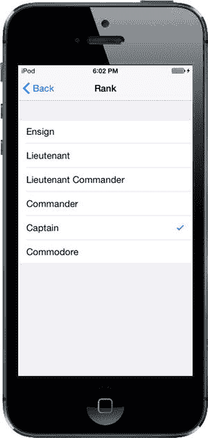

图 12-4。从列表中选择单个偏好设置项

“更多设置”的展开指示符允许用户下钻到另一组偏好设置中（参见 图 12-5）。这个子视图可以拥有与主设置视图相同类型的控件，甚至可以拥有自己的子视图。你可能已经注意到，“设置”应用程序使用了导航控制器，这是因为它支持构建分层结构的偏好设置视图。

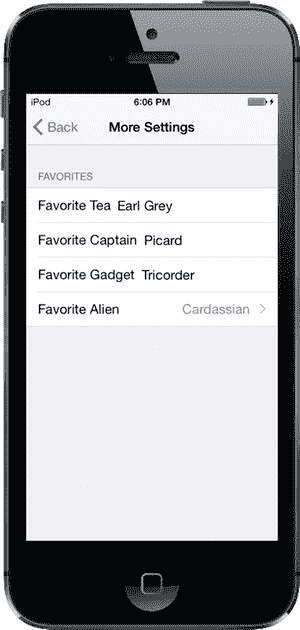

图 12-5。我们应用程序的子设置视图

当用户启动我们的应用程序时，他们将看到一个从“设置”应用程序中收集的偏好设置列表（参见 图 12-6）。

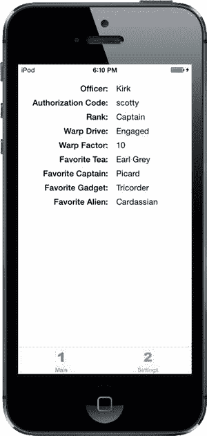

图 12-6。我们应用程序的主视图

为了演示如何从应用程序内部更新偏好设置，我们还提供了第二个视图，用户可以在其中直接在应用程序中更改额外的偏好设置（参见 图 12-7）。

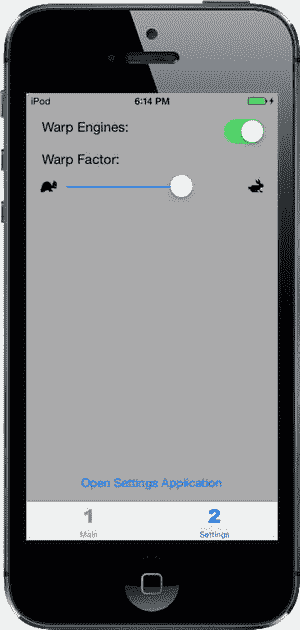

图 12-7。在应用程序内直接设置一些偏好设置

那么，让我们开始构建“舰桥控制”吧？

### 创建项目


在 Xcode 中，按下 `N` 或选择 **File**  **New**  **Project…**。当新项目助手弹出时，在左侧窗格中的 iOS 标题下选择 **Application**，单击 **Tabbed Application** 图标，然后单击 **Next**。在下一个屏幕上，将项目命名为 `Bridge Control`。将 Devices 设置为 `Universal`，然后单击 **Next** 按钮。最后，为项目选择一个位置，然后单击 **Create**。

`Bridge Control` 应用程序基于我们在第 7 章中使用的 `UITabBarController` 类。模板创建了两个标签，这正是我们所需的。每个标签都需要一个图标。你可以在示例源代码存档的 `12 – Images` 文件夹中找到这些图标。在 Xcode 中，选择 `Images.xcassets`，然后将 `singleicon.imageset` 和 `doubleicon.imageset` 文件夹从 `12 – Images` 拖动到编辑区域。

接下来，我们将为标签栏项目分配图标。选择 `Main.storyboard`，你将看到标签栏控制器及其两个子控制器（一个标记为 `First View`，另一个标记为 `Second View`）。选择第一个子控制器，然后单击其标签栏项目（当前显示一个圆形和标题 `First`）。在属性检查器的 Bar Item 部分，将标题更改为 `Main`，图像更改为 `singleicon`，如图 12-8 所示。现在选择第二个子控制器的标签栏项目，将标题从 `Second` 更改为 `Settings`，图像从 `second` 更改为 `doubleicon`。最后，再次选择 `Images.xcassets`，并删除模板创建的 `first` 和 `second` 图像集——我们不再需要它们了。关于应用程序本身的工作暂且足够了——在进一步操作之前，让我们先创建它的设置捆绑包。

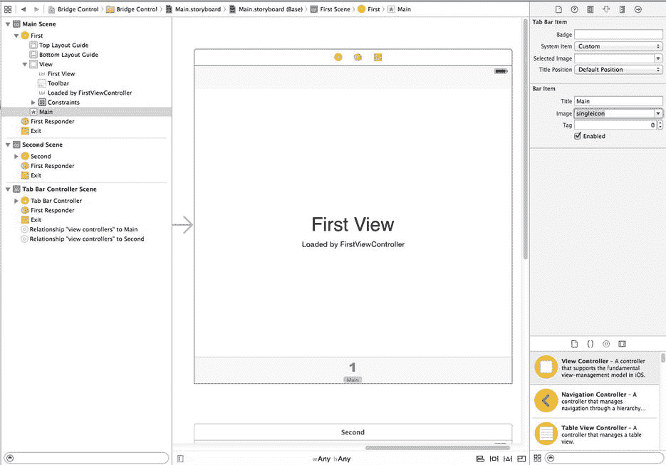

图 12-8. 设置第一个标签栏项目的图标

### 使用设置捆绑包

设置应用程序使用每个应用程序的设置捆绑包的内容来为该应用程序构建一个设置视图。如果某个应用程序没有设置捆绑包，那么设置应用程序不会为其显示任何内容。每个设置捆绑包必须包含一个名为 `Root.plist` 的属性列表，用于定义根级偏好设置视图。该属性列表必须遵循非常精确的格式，我们将在为应用程序的设置捆绑包设置属性列表时讨论这一点。

当设置应用程序启动时，它会检查每个应用程序是否有设置捆绑包，并为每个包含设置捆绑包的应用程序添加一个设置组。如果我们希望偏好设置包含任何子视图，我们需要向捆绑包中添加属性列表，并为每个子视图在 `Root.plist` 中添加一个条目。在本章中，你将看到如何执行此操作。

### 向项目添加设置捆绑包

在项目导航器中，单击 `Bridge Control` 文件夹，然后选择 **File**  **New**  **File…**，或按下 `N`。在左窗格中，选择 iOS 标题下的 **Resource**，然后选择 **Settings Bundle** 图标（参见图 12-9）。单击 **Next** 按钮，保留默认名称 `Settings.bundle`，然后单击 **Create**。

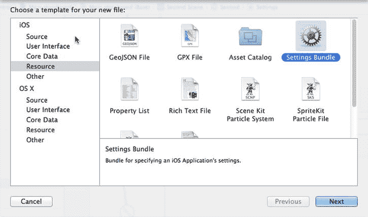

图 12-9. 在 Xcode 中创建设置捆绑包

现在，你应该在项目窗口中看到一个新项目 `Settings.bundle`。展开 `Settings.bundle` 项目，你应该会看到两个子项：一个名为 `en.lproj` 的文件夹（包含一个名为 `Root.strings` 的文件），以及另一个名为 `Root.plist` 的文件。我们将在第 22 章讨论将应用程序本地化为其他语言时，详细介绍 `en.lproj`。在这里，我们将集中讨论 `Root.plist`。


#### 设置属性列表

选择 `Root.plist` 并查看编辑器窗格。你现在看到的是 Xcode 的属性列表编辑器（参见图 12-10）。

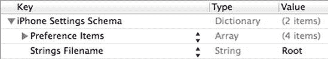

图 12-10. 属性列表编辑器窗格中的 `Root.plist`。如果你的编辑窗格看起来略有不同，请不要慌张。只需在编辑窗格中按住 Control 键并单击，然后从出现的上下文菜单中选择“显示原始键/值”即可。

请注意属性列表中项目的组织方式。属性列表本质上是字典，它存储项目类型和值，并使用键来检索它们，其工作方式与 `NSDictionary` 完全相同。

属性列表中可放入几种不同类型的节点。`Boolean`、`Data`、`Date`、`Number` 和 `String` 节点类型用于保存单个数据片段，但也有一些方法可以处理整个节点集合。除了允许存储其他字典的 `Dictionary` 节点类型外，还有 `Array` 节点，它存储一个有序的其他节点列表，类似于 `NSArray`。`Dictionary` 和 `Array` 类型是唯一可以包含其他节点的属性列表节点类型。

**注意**  尽管你可以使用大多数类型的对象作为 `NSDictionary` 中的键，但属性列表字典节点中的键必须是字符串。但是，对于值，你可以自由使用任何节点类型。

在创建设置属性列表时，需要遵循一种非常具体的格式。幸运的是，刚刚添加到项目中的设置 bundle 自带的属性列表 `Root.plist` 完全遵循这种格式。让我们来看一下。

在 `Root.plist` 编辑器窗格中，键的名称既可以以其真实的“原始”形式显示，也可以以更易于人类阅读的形式显示。我们非常倾向于尽可能看到事物的真实面貌，所以请在编辑器中的任意位置右键单击，并确保上下文菜单中的 `显示原始键/值` 选项处于选中状态（参见图 12-11）。我们接下来的讨论将使用所有键的真实名称，因此这一步非常重要。

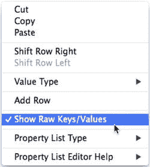

图 12-11. 在属性列表编辑窗格中的任意位置按住 Control 键并单击，确保选中 `显示原始键/值` 项。这将确保在属性列表编辑器中使用真实名称，从而使你的编辑体验更精确。

**警告**  在撰写本文时，离开属性列表（无论是通过编辑其他文件还是退出 Xcode）都会将 `显示原始键/值` 项重置为未选中状态。如果你的文本看起来有些不同，请再次检查该菜单项，并确保它已被选中。

字典中的一项是 `StringsTable`。字符串表用于将你的应用程序翻译成另一种语言。我们将在第 22 章讨论本地化时讨论字符串的翻译。本章不会用到它，但你可以放心地将其保留在项目中，因为它不会造成任何损害。

除了 `StringsTable`，属性列表还包含一个名为 `PreferenceSpecifiers` 的节点，这是一个数组。该数组节点旨在保存一组字典节点，其中每个节点要么代表一个用户可以修改的单个偏好项，要么代表一个用户可以深入查看的子视图。

点击 `PreferenceSpecifiers` 左侧的展开三角形以展开该节点。你会注意到 Xcode 的模板善意地为我们提供了四个子节点（参见图 12-12）。这些节点不太可能反映我们的实际偏好，因此删除 `Item 1`、`Item 2` 和 `Item 3`（依次选中每个节点并按 `Delete` 键），只保留 `Item 0` 在原位。

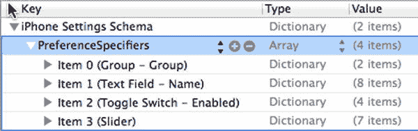

图 12-12. 编辑器窗格中的 `Root.plist`，这次已展开 `PreferenceSpecifiers`。

**注意**  要选中属性列表中的一项，最好单击“键”列的某一边，以避免调出“键”列的下拉菜单。

单击 `Item 0`（不要展开它）。Xcode 的属性列表编辑器允许你只需按下 `Return` 键即可添加行。当前的选中状态（包括选中了哪一行以及它是否已展开）决定了新行将被插入的位置。当选中一个未展开的数组或字典时，按下 `Return` 会在选中行之后添加一个同级节点。换句话说，它会在与当前选择相同的级别添加另一个节点。如果你按下 `Return`（但现在不要这样做），你将在 `Item 0` 之后立即获得一个名为 `Item 1` 的新行。图 12-13 展示了按下 `Return` 创建新行的示例。请注意出现的下拉菜单，它允许你指定此项代表的偏好设置说明符的类型——稍后会详细介绍。

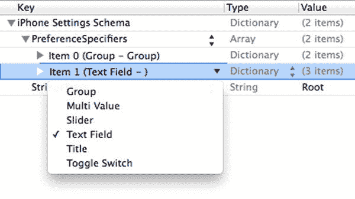

图 12-13. 我们选中了 `Item 0` 并按下了 `Return` 来创建一个新的同级行。注意出现的下拉菜单，允许我们指定此项代表的偏好设置说明符的类型。

现在展开 `Item 0` 并查看其内容（参见图 12-14）。编辑器现在已准备好向选中项添加子节点。如果你此时按下 `Return`（再次强调，现在不要实际按下），你将在 `Item 0` 内部获得一个新的第一个子行。

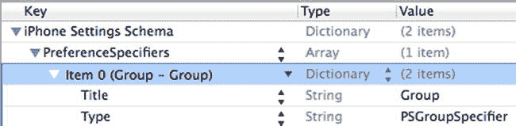

图 12-14. 当你展开 `Item 0` 时，你会找到一个键为 `Type` 的行和一个键为 `Title` 的行。这表示一个标题为“组”的组。

`Item 0` 中的一项的键为 `Type`。`PreferenceSpecifiers` 数组中的每个属性列表节点都必须有一个带有此键的条目。`Type` 键通常是第二个条目，但字典中的顺序无关紧要，因此 `Type` 键不必是第二个。`Type` 键告诉“设置”应用程序与此项关联的数据类型。

在 `Item 0` 中，`Type` 项的值为 `PSGroupSpecifier`。这表示此项代表一个新组的开始。后面的每个项都将是此组的一部分——直到遇到下一个 `Type` 为 `PSGroupSpecifier` 的项。

如果你回头看图 12-3，你会看到“设置”应用程序在分组表中呈现应用程序设置。设置 bundle 属性列表中 `PreferenceSpecifiers` 数组的 `Item 0` 应始终是 `PSGroupSpecifier`，这样设置就从一个新组开始。这一点很重要，因为每个“设置”表格中至少需要一个组。

`Item 0` 中唯一的另一个条目的键为 `Title`，它用于在正在开始的组上方设置一个可选的标题。

现在更仔细地看一下 `Item 0` 行本身，你会发现它实际上显示为 `Item 0 (Group – Group)`。括号中的值分别代表 `Type` 项的值（第一个 `Group`）和 `Title` 项的值（第二个 `Group`）。这是 Xcode 提供的一个很好的快捷方式，让你可以直观地浏览设置 bundle 的内容。


如图 12-3 所示，我们将第一个组命名为“General Info”。双击`Title`旁边的值，并将其从“Group”改为“General Info”（参见图 12-15）。输入新标题时，你可能会注意到`Item 0`略有变化，现在显示为“Item 0 (Group – General Info)”，以反映新标题。在“设置”应用中，标题会以大写字母显示，因此用户实际看到的是“GENERAL INFO”。你可以在图 12-3 中看到这一点。

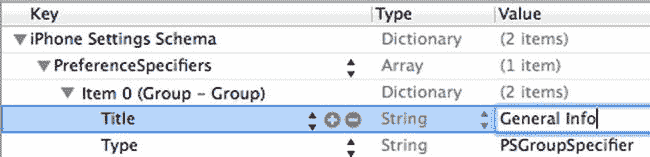

图 12-15. 我们将`Item 0`组的标题从`Group`改为`General Info`

#### 添加文本字段设置

我们现在需要在这个数组中添加第二个条目，它将代表第一个实际的偏好字段。我们将从一个简单的文本字段开始。

如果在编辑窗格中单击`PreferenceSpecifiers`行（请勿操作，继续阅读），然后按`Return`键添加一个子项，新行将插入到列表的开头，这不是我们想要的。我们希望在数组的末尾添加一行。

要添加行，请单击`Item 0`左侧的展开三角形将其折叠，然后选中`Item 0`并按`Return`键。这将在当前行之后创建一个新的同级行（参见图 12-16）。与往常一样，添加项目时，会显示一个下拉菜单，默认值为“Text Field”。

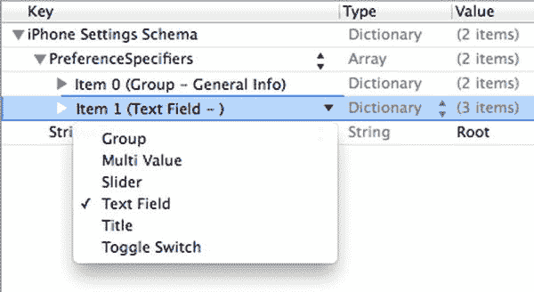

图 12-16. 为`Item 0`添加一个新的同级行

点击下拉菜单之外的任意位置使其消失，然后点击`Item 1`旁边的展开三角形将其展开。你将看到它包含一个类型行，设置为`PSTextFieldSpecifier`。该`Type`值用于告诉“设置”应用，我们希望用户通过文本字段编辑此项设置。它还包含两个空行，用于`Title`和`Key`（参见图 12-17）。

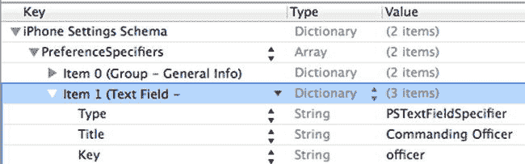

图 12-17. 我们的文本字段项，展开后显示类型、标题和键

选中`Title`行，然后在“Value”列的空白处双击。输入“Commanding Officer”来设置`Title`值。这将是在“设置”应用中显示的文本。

现在对`Key`行执行相同的操作（没错，这不是笔误，你确实看到的是一个名为`Key`的键）。对于值，输入“officer”（注意首字母小写）。请记住，用户默认设置的工作方式类似于`NSDictionary`。这个条目告诉“设置”应用，在存储此文本字段中输入的值时使用哪个键。

回想一下我们之前关于`NSUserDefaults`的介绍。它允许你使用键值对来存储值，类似于`NSDictionary`。实际上，“设置”应用会为你保存的每个偏好设置执行相同的操作。如果你给它的键值是`foo`，那么稍后在应用中，你可以请求`foo`对应的值，它将返回用户为该偏好设置输入的值。稍后，我们将使用相同的键值，从应用的用户默认设置中检索此设置。

**注意**  `Title`的值是“Commanding Officer”，而`Key`的值是“officer”。这种大写/小写的差异经常出现，在这里，我们甚至通过为显示的标题使用两个单词，而为键使用一个单词来加剧了这种差异。`Title`是屏幕上显示的内容；因此使用大写字母 C 和 O，并在单词之间加空格是合理的。`Key`是用于从用户默认设置中检索偏好设置的文本字符串，因此全部小写也是合理的。我们是否可以对`Title`使用全小写？当然可以。我们是否可以对`Key`使用全大写？当然也可以！只要在保存和检索时以相同的方式使用大写，偏好设置键采用什么约定都无关紧要。

现在选中`Item 1`的三个行中的最后一行（即`Key`值为`Key`的那一行），并按`Return`键向`Item 1`字典中添加另一个条目，将其键设置为`AutocapitalizationType`。请注意，一旦你开始输入“AutocapitalizationType”，Xcode 就会显示一个匹配选项列表，你可以直接从列表中选择，而无需输入完整名称。输入`AutocapitalizationType`后，按`Tab`键或点击“Value”列右侧的上下箭头图标，打开一个列表，从中选择可用选项。选择“Words”。这将指定文本字段自动将用户在此字段中输入的每个单词的首字母大写。

创建最后一个新行，将其键设置为`AutocorrectionType`，值设置为`No`。这将告诉“设置”应用，不要自动更正输入到此文本字段中的值。在任何你希望文本字段使用自动更正的情况下，可以将此行中的值设置为`Yes`。同样，当你开始输入“AutocorrectionType”时，Xcode 会显示一个匹配选项列表，并会在一个弹出窗口中显示有效选项。

完成后，你的属性列表应类似于图 12-18 中所示。

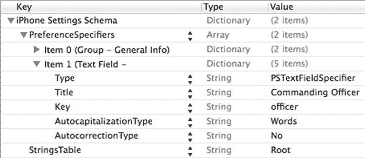

图 12-18. 在`Root.plist`中指定的已完成文本字段

#### 添加应用图标

在尝试我们的新设置之前，让我们向项目添加一个应用图标。你之前已经做过此操作。

保存你刚刚编辑的属性文件`Root.plist`。接下来，使用项目导航器选择`Images.xcassets`项目，然后选择其中包含的`AppIcon`项目。在那里，你将找到一个放置图标的拖放区域集。

在 Finder 中，首先导航到源代码存档，然后进入“12 – Images”文件夹。将文件`SettingsIcon.png`拖入 Xcode 中`Images.xcassets`编辑器的“iPad Settings 1x”槽位，并将`SettingsIcon@2x.png`拖入“iPhone Settings 2x”和“iPad Settings 2x”槽位。在此处，我们还为应用程序本身添加图标。将`AppIcon-iPhone@2x.png`拖入“iPhone App”槽位，`AppIcon-iPad.png`拖入“iPad App 1x”槽位，`AppIcon-iPad@2x.png`拖入“iPad App 2x”槽位。完成后，编辑器应类似于图 12-19 所示。

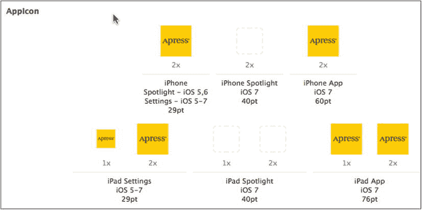

图 12-19. 为我们的应用程序添加设置和应用程序图标

就这样。现在，通过选择**Product**  **Run**来编译并运行应用程序。你还没有为应用构建任何 GUI，因此你将只看到标签栏控制器的第一个标签。按下**Home**按钮，然后点击“设置”应用图标。你将找到我们应用程序的条目，该条目使用之前添加的图标（参见图 12-2）。点击“Bridge Control”行，你将看到一个包含单个文本字段的简单设置视图，如图 12-20 所示。


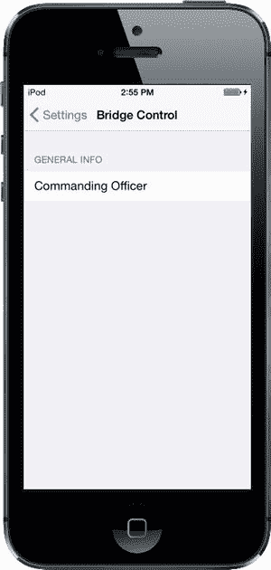

图 12-20. 在添加一个分组和一个文本字段后，“设置”应用中的根视图

退出模拟器，返回 Xcode。虽然我们还没完成，但你现在应该已经感受到为应用添加偏好设置是多么简单了。让我们为根设置视图添加其余字段。第一个要添加的是用于输入用户授权码的安全文本字段。

#### 添加安全文本字段设置

点击 `Root.plist` 返回设置说明符（别忘了打开**显示原始键/值**，假设 Xcode 的编辑区已重置此项）。折叠 `Item 0` 和 `Item 1`，然后选中 `Item 1`。按下 `C` 键复制到剪贴板，再按 `V` 键粘贴。这样会创建一个与 `Item 1` 完全相同的新 `Item 2`。展开新项，将 `Title` 改为 `授权码`，`Key` 改为 `authorizationCode`。请记住，`Title` 是在屏幕标签上显示的内容，而 `Key` 用于保存值。

接下来，为新项再添加一个子项。请注意，子项的顺序无关紧要，因此你可以将其直接放在刚编辑的 `Key` 项下方。操作方法是，选中 `Key/authorizationCode` 行，然后按下 **Return** 键。

为新项设置 `Key` 为 `IsSecure`（注意首字母 I 大写），然后按 **Tab** 键，你会看到 Xcode 自动将 `Type` 改为 `Boolean`。现在将其 `Value` 从 `NO` 改为 `YES`，这会告诉“设置”应用，此字段需要像密码字段一样隐藏用户输入，而不是像普通文本字段那样。最后，将 `AutocapitalizationType` 改为 `None`。我们完成的 `Item 2` 如图 12-21 所示。

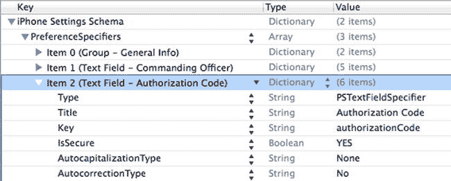

图 12-21. 我们完成的 `Item 2`，这是一个设计用于接收 `authorizationCode` 的文本字段

#### 添加多值字段

接下来要添加的项目是一个**多值字段**。此类字段会自动生成带有展开指示符的行。点击它，用户可深入查看另一个表格，从中选择多个行中的一项。

折叠 `Item 2`，选中该行，然后按 **Return** 键添加 `Item 3`。使用 Key 字段附带的弹出菜单选择 **Multi Value**，然后点击展开三角形展开 `Item 3`。

展开后的 `Item 3` 已包含几行。其中 `Type` 行已设置为 `PSMultiValueSpecifier`。找到 `Title` 行，将其值设为 `等级`。然后找到 `Key` 行，将其值设为 `rank`。下一步稍有难度，我们先做一下说明再操作。

我们要为 `Item 3` 再添加两个子项，但它们将是 `Array` 类型的节点，而非 `String` 类型，具体如下：

-   一个名为 `Titles` 的数组，用于存放用户可供选择的值列表。
-   另一个名为 `Values` 的数组，用于存放存储在用户默认设置中的值列表。

也就是说，如果用户选择了列表中的第一项（对应于 `Titles` 数组中的第一项），“设置”应用实际上会存储 `Values` 数组中的第一个值。这种 `Titles` 和 `Values` 的配对方式，让你可以向用户展示友好的文本，但实际存储的是其他内容，比如数字、日期或另一个字符串。

这两个数组都是必需的。如果你想使它们内容相同，可以创建一个数组，复制后粘贴回来，然后修改键名，这样你就有了两个内容相同但存储在不同键名下的数组。我们正是要这么做。

选中 `Item 3`（保持展开状态），按 **Return** 键添加一个子项。你会再次看到，Xcode 知道我们正在编辑的文件类型，甚至似乎能预判我们的下一步操作：新添加的子行已将其 `Key` 设为 `Titles`，并配置为 `Array` 类型，这正是我们想要的！按 **Return** 键结束 `Key` 字段的编辑，然后展开 `Titles` 行，按 **Return** 键添加一个子节点。重复此操作五次，使总共有六个子节点。所有六个节点都应为 `String` 类型，并分别赋予以下值：`少尉`、`中尉`、`少校`、`中校`、`上校`和`准将`。

创建完所有六个节点并输入值后，折叠 `Titles` 并选中它。接着，按 `C` 键复制，再按 `V` 键粘贴。这会创建一个键名为 `Titles - 2` 的新项。双击键名 `Titles - 2`，将其改为 `Values`。

我们的多值字段就快完成了。字典中还有最后一个必填项，那就是默认值。多值字段必须选中且仅选中一行。因此，我们需要指定一个默认值，用于尚未选择任何项的情况，且该值必须对应于 `Values` 数组（如果不同，则不是 `Titles` 数组）中的某个项目。Xcode 在我们创建此项时已经添加了一行 `DefaultValue`，现在我们只需要将其值设为 `少尉` 即可。请立即操作。图 12-22 展示了 `Item 3` 的最终版本。

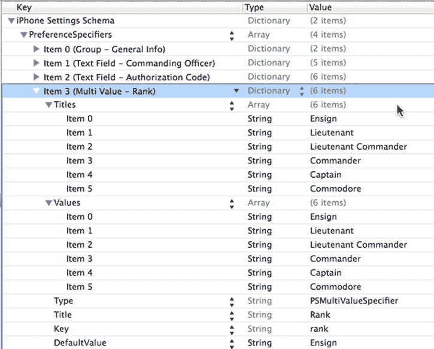

图 12-22. 我们完成的 `Item 3`，这是一个多值字段，设计用于让用户从五个可能的值中选择一个

让我们检查一下工作。保存属性列表，然后再次构建并运行应用。当你的应用启动后，按 **Home** 键并启动“设置”应用。选择 **Bridge Control** 后，你应该会在根级视图上看到三个字段（见图 12-23）。现在尽情测试你的作品吧，然后我们继续。

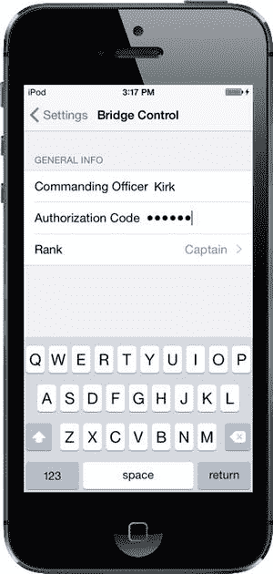

图 12-23. 已经完成了三个字段。还不错吧！

#### 添加开关设置

接下来需要从用户那里获取的是一个布尔值，用于指示我们的曲速引擎是否已开启。为了在偏好设置中捕获布尔值，我们将在 `PreferenceSpecifiers` 数组中添加另一个类型为 `PSToggleSwitchSpecifier` 的项目，以此告诉“设置”应用使用 `UISwitch`。

如果 `Item 3` 当前已展开，则将其折叠，然后单击选中它。按 **Return** 键创建 `Item 4`。使用下拉菜单选择 **Toggle Switch**，然后点击展开三角形展开 `Item 4`。你会看到已经存在一个 `Key` 为 `Type`、`Value` 为 `PSToggleSwitchSpecifier` 的子行。将空的 `Title` 行值设为 `曲速引擎`，并将 `Key` 行的值设为 `warp`。

这个字典中还有另一个必填项，即默认值。与多值设置类似，Xcode 已经为我们创建了一行 `DefaultValue`。我们通过将 `DefaultValue` 行的值设为 `YES` 来默认开启曲速引擎。图 12-24 展示了我们完成的 `Item 4`。

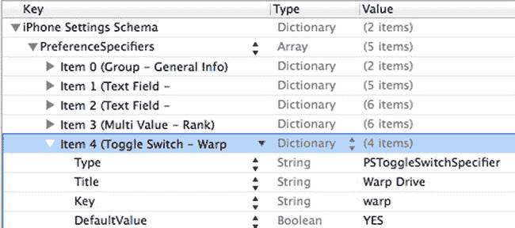

图 12-24. 我们完成的 `Item 4`，这是一个用于开启和关闭曲速引擎的开关。启动！

#### 添加滑块设置

接下来需要实现的项目是一个滑块。在“设置”应用中，滑块两端可以带有小图像，但不能显示标签。让我们将滑块放在一个带有标题的独立分组中，以便用户知道滑块的作用。


首先折叠 `Item 4`。现在单击选中 `Item 4`，按下 `Return` 键创建新行。使用弹出菜单将新条目转换为 `Group`，然后点击该条目的展开三角形将其展开。你会看到 `Type` 已经设置为 `PSGroupSpecifier`。这将告诉“设置”应用在此位置开始一个新分组。双击标有 `Title` 的行中的值，并将其更改为 `Warp Factor`。

折叠 `Item 5` 并选中它，然后按下 `Return` 键添加一个新的同级行。使用弹出菜单将新条目更改为 `Slider`，这表示“设置”应用应使用 `UISlider` 从用户处获取此信息。展开 `Item 6`，将 `Key` 行的值设置为 `warpFactor`，以便“设置”应用知道存储此值时使用哪个键。

我们将允许用户输入 1 到 10 之间的值，并将默认值设置为 `warp 5`。滑块需要设有最小值、最大值和起始（或默认）值；所有这些值在属性列表中都需存储为数字而非字符串。幸运的是，Xcode 已经为所有这些值创建了行。将 `DefaultValue` 行的值设为 `5`，将 `MinimumValue` 行的值设为 `1`，将 `MaximumValue` 行的值设为 `10`。

如果你想测试滑块，请随意，但请速去速回。我们还要再进行一些自定义设置。

如前所述，你可以在滑块的两端放置图像。让我们添加一些小图标，表明将滑块向左移动会减速，向右移动会加速。

#### 向设置束添加图标

在本随书附带的项目归档中的 `12 – Images` 文件夹中，你会找到名为 `rabbit.png` 和 `turtle.png` 的两个图标。我们需要将这两个图标都添加到我们的设置束中。由于这些图标需要被“设置”应用使用，我们不能简单地将它们放在 `Bridge Control` 文件夹中；我们必须将它们放入设置束内，这样“设置”应用才能访问它们。

为此，请在项目导航器中找到 `Settings.bundle`。我们需要在访达中打开此束。按住 Control 键并单击项目导航器中的 `Settings.bundle` 图标。当上下文菜单出现时，选择**在访达中显示**（见图 12-25），以在访达中显示该束。

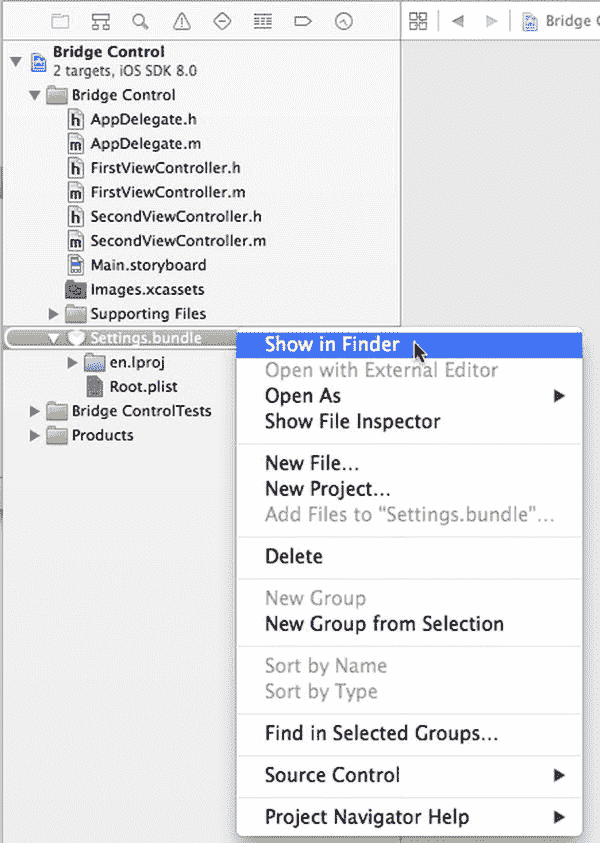

图 12-25. Settings.bundle 上下文菜单

请记住，束在访达中看起来像文件，但它们实际上是文件夹。当访达窗口打开显示 `Settings.bundle` 文件时，按住 Control 键单击该文件，并从出现的上下文菜单中选择**显示包内容**。这会在一个新访达窗口中打开设置束，你应该会看到与 Xcode 中 `Settings.bundle` 里相同的两个条目。将 `rabbit.png` 和 `turtle.png` 这两个图标文件从 `12 – Images` 文件夹复制到访达窗口中的 `Settings.bundle` 包内容中，放在 `en.proj` 和 `Root.plist` 旁边。

你可以让此窗口在访达中保持打开状态，因为我们很快还需要复制另一个文件。现在我们将返回 Xcode，告诉滑块使用这两个图像。

回到 Xcode，返回 `Root.plist`，在 `Item 6` 下添加两个子行。将其中一个的键设为 `MinimumValueImage`，值设为 `turtle`。将另一个的键设为 `MaximumValueImage`，值设为 `rabbit`。图 12-26 显示了完成后的 `Item 6`。

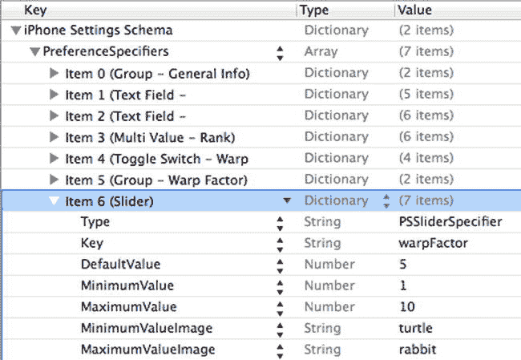

图 12-26. 我们完成的 Item 6：一个带有乌龟和兔子图标的滑块，分别代表慢和快

保存你的属性列表，然后构建并运行应用，确保一切仍然正常。你应该能够导航到“设置”应用，并发现滑块正等待着你，带有昏昏欲睡的乌龟和快乐的兔子分别在两端（见图 12-27）。

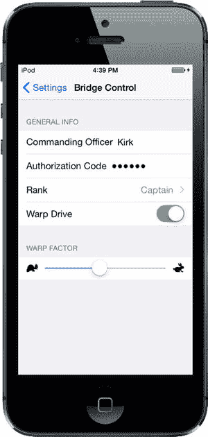

图 12-27. 我们有文本字段、多值字段、一个开关和一个滑块。快完成了

#### 添加子设置视图

我们将添加另一个偏好设置描述符，告诉“设置”应用我们希望它显示一个子设置视图。此描述符将呈现一个带有展开指示符的行，点击该行会将用户带到一个全新的、充满偏好设置的视图。我们开始吧。

因为我们不希望这个新的偏好设置与滑块归为一组，首先我们将复制 `Item 0` 中的分组描述符，并将其粘贴到 `PreferenceSpecifiers` 数组的末尾，为我们的子设置视图创建一个新分组。

在 `Root.plist` 中，折叠所有已展开的条目，然后单击选中 `Item 0`，按下 `C` 将其复制到剪贴板。接下来，选中 `Item 6`，然后按下 `V` 粘贴一个新的 `Item 7`。展开 `Item 7`，双击 `Title` 键旁边的 `Value` 列，将其从 `General Info` 更改为 `Additional Info`。

现在再次折叠 `Item 7`。选中它并按 `Return` 键添加 `Item 8`，这将是实际的子视图。点击展开三角形将其展开。找到 `Type` 行，将其值设为 `PSChildPaneSpecifier`，然后将 `Title` 行的值设为 `More Settings`。

我们需要向 `Item 8` 添加最后一行，它将告诉“设置”应用为 `More Settings` 视图加载哪个属性列表。添加另一个子行，将其键设为 `File`（为此，你可以将组中最后一行的键从 `Key` 改为 `File`），值设为 `More`（见图 12-28）。文件扩展名 `.plist` 是默认的，不能包含在内（如果包含了，“设置”应用将找不到 `.plist` 文件）。

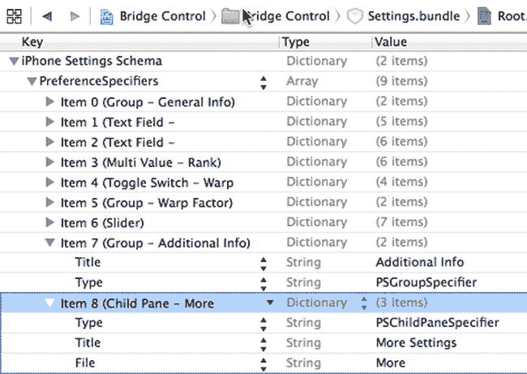

图 12-28. 我们完成的 Items 7 和 8，设置了新的 Additional Info 设置分组，并提供了指向文件 More.plist 的子窗格链接

我们正在向主偏好设置视图添加一个子视图。该子视图中的设置由 `More.plist` 文件指定。我们需要将 `More.plist` 复制到设置束中。我们无法在 Xcode 中向束添加新文件，而属性列表编辑器的“保存”对话框也不允许我们保存到束中。因此，我们需要创建一个新的属性列表，将其保存在其他位置，然后使用访达将其拖入 `Settings.bundle` 窗口。

现在你已经看到了可以在设置束 `.plist` 文件中使用的所有不同类型的偏好设置字段。为了省去一些打字工作，你可以从本书随附的项目归档中的 `12 – Images` 文件夹中获取 `More.plist`，然后将其拖入我们之前保持打开的 `Settings.bundle` 窗口中，放在 `Root.plist` 旁边。

**提示** 当你创建自己的子设置视图时，最简单的方法是复制一份 `Root.plist` 并为其指定一个新名称。接下来，删除除第一个之外的所有现有偏好设置描述符，然后为你需要的新文件添加所需的偏好设置描述符。

我们的设置束已经完成。请随意编译、运行并测试“设置”应用。你应该能够进入子视图并为所有其他字段设置值。继续尝试吧，如果你愿意，还可以对属性列表进行更改。


**提示** 我们几乎涵盖了所有可用的配置选项（至少在撰写本文时如此）。你可以在 iOS 开发中心的一份名为《设置应用程序架构参考》的文档中找到关于设置属性列表格式的完整文档。你可以从以下页面获取该文档，以及其他大量有用的参考文档：`http://developer.apple.com/library/ios/navigation/`。

继续之前，请在 Xcode 的项目导航器中选择 `Images.xcassets` 项，然后将项目归档中 `12 – Images` 文件夹中的 `rabbit.png` 和 `turtle.png` 图标复制到编辑器区域的左侧。这将把这些图标作为新的图片资源添加到项目中，供后续使用。我们将在应用程序中使用它们来显示当前设置的值。

你可能已经注意到，你刚刚添加的两个图标与之前添加到设置包中的图标完全相同，你可能会好奇为什么。请记住，iOS 应用程序无法读取其他应用程序沙盒中的文件。设置包不会成为我们应用程序沙盒的一部分——它会成为设置应用程序沙盒的一部分。由于我们还想在应用程序中使用这些图标，我们需要将它们单独添加到 `Bridge Control` 文件夹中，这样它们也会被复制到我们应用程序的沙盒中。

### 在应用程序中读取设置

现在，我们已经解决了一半的问题。用户可以使用设置应用程序来声明他们的偏好，但我们如何从应用程序内部获取这些偏好呢？实际上，这反而是简单的一步。

#### 获取用户设置

我们将使用一个名为 `NSUserDefaults` 的类来访问用户的设置。`NSUserDefaults` 以单例模式实现，这意味着在我们的应用程序中只有一个 `NSUserDefaults` 实例在运行。要获取该实例的访问权限，我们调用类方法 `standardUserDefaults`，如下所示：

```
NSUserDefaults *defaults = [NSUserDefaults standardUserDefaults];
```

一旦我们有了指向标准用户默认设置实例的指针，就可以像使用 `NSDictionary` 一样使用它。要从它获取值，我们可以调用 `objectForKey:`，该方法会返回一个 Objective-C 对象，例如 `NSString`、`NSDate` 或 `NSNumber`。如果我们想将值作为标量类型（如 `int`、`float` 或 `BOOL`）检索，则可以使用其他方法，例如 `intForKey:`、`floatForKey:` 或 `boolForKey:`。

当您为此应用程序创建属性列表时，您在一个 `.plist` 文件中添加了一个 `PreferenceSpecifiers` 数组。在设置应用程序中，其中一些 specifiers 被用于创建组，而另一些则被用于创建供用户交互的界面对象。这些才是我们真正感兴趣的 specifiers，因为它们包含真实设置数据的键。每个与用户设置绑定的 specifier 都有一个名为 `Key` 的键。请花点时间返回去检查一下。例如，我们滑块的 `Key` 值为 `warpFactor`。我们授权码字段的 `Key` 为 `authorizationCode`。我们将使用这些键来检索用户设置。

与其在方法中直接为每个键使用字符串，不如为这些值使用一些预编译的 `#define` 语句。这样，我们就可以在代码中使用这些临时常量，而不是内联字符串，从而避免了输入错误的风险。我们将把这些常量设置在一个头文件中，因为稍后我们会在不止一个类中使用其中的一些。因此，在 Xcode 中，按 `Cmd+N`，在文件创建窗口的 iOS 部分，选择 **Source**，然后选择 **Header File**。点击 **Next**，将头文件命名为 `Constants.h`，然后点击 **Create**。打开新创建的头文件，并添加以下粗体行：

```
#ifndef Bridge_Control_Constants_h
#define Bridge_Control_Constants_h

#define kOfficerKey                     @"officer"
#define kAuthorizationCodeKey           @"authorizationCode"
#define kRankKey                        @"rank"
#define kWarpDriveKey                   @"warp"
#define kWarpFactorKey                  @"warpFactor"
#define kFavoriteTeaKey                 @"favoriteTea"
#define kFavoriteCaptainKey             @"favoriteCaptain"
#define kFavoriteGadgetKey              @"favoriteGadget"
#define kFavoriteAlienKey               @"favoriteAlien"

#endif
```

这些常量是我们用于不同偏好字段的 `.plist` 文件中的键。现在我们有了一个显示设置的地方，让我们快速用一组标签来设置主视图。在进入 Interface Builder 之前，让我们为我们需要的所有标签创建输出口。单击 `FirstViewController.m`，并进行以下更改：

```
#import "FirstViewController.h"
#import "Constants.h"

@interface FirstViewController ()

@property (weak, nonatomic) IBOutlet UILabel *officerLabel;
@property (weak, nonatomic) IBOutlet UILabel *authorizationCodeLabel;
@property (weak, nonatomic) IBOutlet UILabel *rankLabel;
@property (weak, nonatomic) IBOutlet UILabel *warpDriveLabel;
@property (weak, nonatomic) IBOutlet UILabel *warpFactorLabel;
@property (weak, nonatomic) IBOutlet UILabel *favoriteTeaLabel;
@property (weak, nonatomic) IBOutlet UILabel *favoriteCaptainLabel;
@property (weak, nonatomic) IBOutlet UILabel *favoriteGadgetLabel;
@property (weak, nonatomic) IBOutlet UILabel *favoriteAlienLabel;

@end
```

这里没有任何新内容。我们导入 `Constants.h` 以便能够使用设置键，并声明了九个属性，所有这些属性都是标签，并带有 `IBOutlet` 关键字，以便它们可以在 Interface Builder 中进行连接。

保存您的更改。既然我们已经声明了输出口，那我们就前往故事板文件来创建图形用户界面。

#### 创建主视图

选择 `Main.storyboard` 以在 Interface Builder 中进行编辑。打开后，您会看到左侧的标签栏视图控制器，以及右侧上下排列的两个选项卡的视图控制器。上面的那个是第一个选项卡，对应于 `FirstViewController` 类，下面的那个是第二个选项卡，将在 `SecondViewController` 类中实现。

我们将开始向 `FirstViewController` 的 `View` 中添加一组标签，使其看起来像图 12-29 所示。我们总共需要 18 个标签。其中一半位于屏幕左侧，右对齐并使用粗体；另一半位于屏幕右侧，用于显示从用户默认设置中检索到的实际值，并且会有输出口指向它们。我们在此所做的所有更改都将针对第一个选项卡的视图控制器，即故事板右上方的那个。

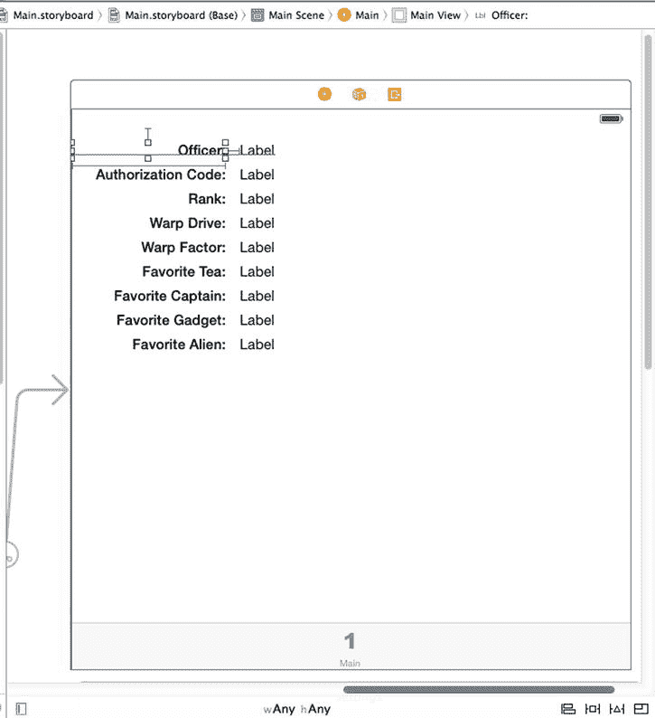

图 12-29. Interface Builder 中第一个选项卡的视图控制器，显示了我们添加的 18 个标签

首先展开文档大纲中的 Main Scene 节点，然后展开 `View` 项。您会发现已经存在三个子视图——将其全部删除。接下来，将 `View` 项重命名为 `Main View`。现在，从对象库中拖拽一个 **Label** 到视图的左上角附近。将其一直拖到窗口的左侧（或者至少拖到左侧的蓝色辅助线），然后通过将其右边缘向视图中心拖拽来加宽它，就像图 12-29 中的 Officer 标签一样。在属性检查器中，将文本设置为右对齐，并将字体更改为 `System Bold 15`。现在，按住 Option 键向下拖拽该标签以创建另外八个副本，并将它们整齐排列以形成左列。更改标签文本，使其与图 12-29 中的内容匹配。


构建右列稍微容易一些。将另一个标签拖到视图上，并将其放置在`Officer`标签的右侧，在它们之间留出一个小间隙。在属性检查器中，将字体设置为`System 15`。按住`Option`键向下拖动此标签，创建八个副本，每个副本与左列中对应的标签对齐。

现在我们需要设置自动布局约束。首先将顶部两个标签连接起来。按住`Control`键从`Officer`标签拖到它右侧的标签上。松开鼠标并按住`Shift`键。在弹出的菜单中，选择`Horizontal Spacing`和`Baseline`，然后点击弹出菜单外部。对其余八行执行相同操作，将每对标签连接在一起。

接下来，我们将相对于视图的左侧和顶部固定左列标签的位置。在文档大纲中，按住`Control`键从`Officer`标签拖到`Main View`。松开鼠标，按住`Shift`键，选择`Leading Space to Container Margin`和`Top Space to Top Layout Guide`，然后点击弹出菜单外部以应用约束。对左列中的其他八个标签执行相同操作。

最后，我们需要固定左列标签的宽度。选择`Officer`标签，点击故事板编辑器下方的`Pin`按钮。在弹出的窗口中，勾选`Width`复选框，然后点击`Add 1 Constraint`。对左列中的所有标签重复此过程。

现在所有标签都应该被正确约束了，因此在文档大纲中选择视图控制器`First`，然后点击故事板编辑器下方的`Resolve Auto Layout Issues`按钮，并选择`Update Frames`（如果此选项未启用，则表示所有标签在故事板中已处于正确位置）。如果一切顺利，标签将会移动到最终位置。

接下来我们需要做的是将右列中的标签连接到它们的`Outlet`。在助理编辑器中打开`FirstViewController.m`，按住`Control`键从右列顶部的标签拖到`officerLabel` `Outlet`以连接它们。按住`Control`键从右列的第二个标签拖到`authorizationLabel`，重复此操作，直到右列中的所有九个标签都连接到它们的`Outlet`。保存`Main.storyboard`文件。

**更新第一个视图控制器**

在 Xcode 中，选择`FirstViewController.m`，并将以下代码添加到类的`@implementation`部分：

```
@implementation FirstViewController

- (void)refreshFields {
    NSUserDefaults *defaults = [NSUserDefaults standardUserDefaults];
    self.officerLabel.text = [defaults objectForKey:kOfficerKey];
    self.authorizationCodeLabel.text = [defaults
                                        objectForKey:kAuthorizationCodeKey];
    self.rankLabel.text = [defaults objectForKey:kRankKey];
    self.warpDriveLabel.text = [defaults boolForKey:kWarpDriveKey]
                                ? @"Engaged" : @"Disabled";
    self.warpFactorLabel.text = [[defaults objectForKey:kWarpFactorKey]
                                 stringValue];
    self.favoriteTeaLabel.text = [defaults objectForKey:kFavoriteTeaKey];
    self.favoriteCaptainLabel.text = [defaults
                                      objectForKey:kFavoriteCaptainKey];
    self.favoriteGadgetLabel.text = [defaults objectForKey:kFavoriteGadgetKey];
    self.favoriteAlienLabel.text = [defaults objectForKey:kFavoriteAlienKey];
}

- (void)viewWillAppear:(BOOL)animated {
    [super viewWillAppear:animated];
    [self refreshFields];
}.
```

这里实际上没有什么会让你感到困惑的。`refreshFields`方法做了两件事。首先，它获取标准的用户默认值。其次，它使用我们放在`.plist`文件中的相同键值，将所有标签的`text`属性设置为用户默认值中的相应对象。请注意，对于`warpFactorLabel`，我们对其返回的对象调用了`stringValue`。我们的其他偏好设置大多是字符串，它们会以`NSString`对象的形式从用户默认值返回。然而，由滑块存储的偏好设置会以`NSNumber`的形式返回，但我们需要一个用于显示的字符串，因此我们对其调用`stringValue`来获取其持有值的字符串表示。

之后，我们重写了父类的`viewWillAppear:`方法，并在其中调用了我们的`refreshFields`方法。这会导致每当视图出现时——包括应用程序启动时以及用户从第二个标签页切换到第一个标签页时——用户看到的值都会被更新。

如果你此时运行应用程序，你应该会看到为第一个标签页构建的用户界面，但有些或所有字段将是空的。别担心，这不是一个错误。信不信由你，这是正确的行为。你将在接下来的“注册默认值”部分看到原因以及如何修复它。

**从我们的应用程序更改默认值**

现在我们已经让主视图运行起来了，让我们构建第二个标签页。正如你在图 12-30 中所看到的，第二个标签页具有我们的曲速引擎开关，以及曲速因子滑块。我们将使用设置应用程序为这两个项目所使用的相同控件：一个开关和一个滑块。除了声明我们的`Outlet`，我们还将声明一个名为`refreshFields`的方法，就像我们在`FirstViewController`中所做的那样，以及两个将由用户触摸控件触发的操作方法。

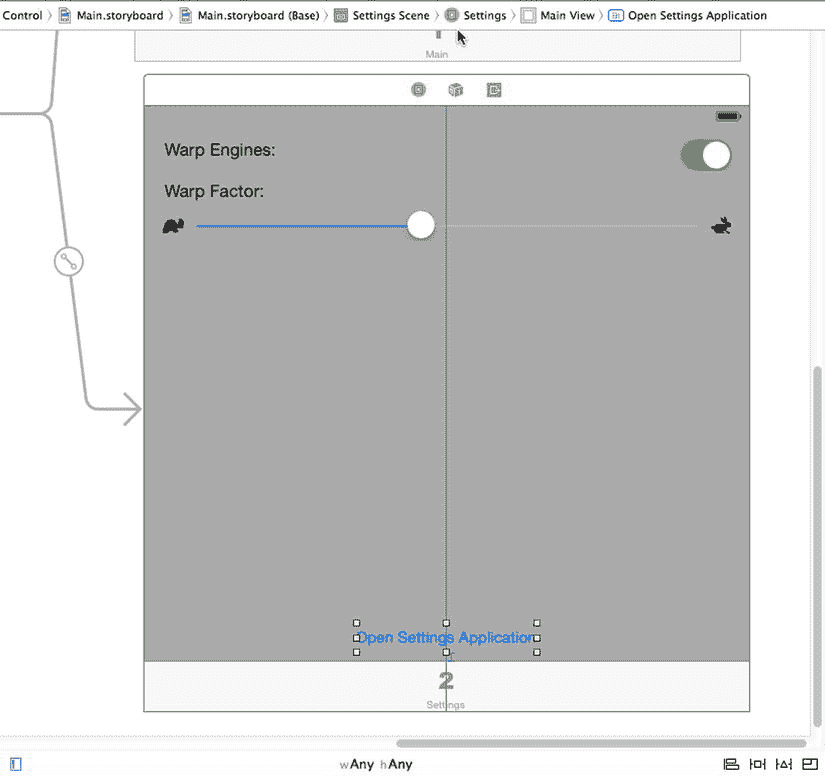

图 12-30. 在 Interface Builder 中设计第二个视图控制器

选择`SecondViewController.m`并进行以下更改：

```
@interface SecondViewController()

@property (weak, nonatomic) IBOutlet UISwitch *engineSwitch;
@property (weak, nonatomic) IBOutlet UISlider *warpFactorSlider;

@end
```

现在，保存你的更改并选择`Main.storyboard`来在 Interface Builder 中编辑 GUI，这次关注文档大纲中的“Settings Scene”。按住`Option`键并点击展开三角形以展开“Settings Scene”及其下的所有内容。将`View`项的名称更改为`Main View`，并删除其所有子节点。

接下来，在文档大纲中的“Settings Scene”中选择`Main View`，然后打开属性检查器。使用背景弹出菜单选择`Light Gray Color`来更改背景颜色。

接下来，从库中拖出两个标签，并将它们放置在故事板的“Main View”上。确保你将它们拖到“Settings Scene”控制器上，该控制器位于故事板的右下角。双击其中一个标签，将其文本改为`Warp Engines:`。双击另一个标签，将其文本改为`Warp Factor:`。将两个标签放置在左侧参考线处，一个在上，一个在下。你可以使用图 12-30 作为放置指南。

接下来，从库中拖出一个`Switch`，并将其放置在视图的右侧，与显示`Warp Engines`的标签相对。按住`Control`键从“Settings Scene”顶部的`View Controller`图标拖到新的开关上，并将其连接到`engineSwitch` `Outlet`。接下来，在助理编辑器中打开`SecondViewController`，按住`Control`键从开关拖到文件底部`@end`行上方的一点。松开鼠标，创建一个名为`engineSwitchTapped`的*动作*，保持弹出窗口中所有其他选择为默认值。


从库中拖拽一个`Slider`，将其放置在标有“Warp Factor:”的标签下方。调整滑块大小，使其从左侧边缘的蓝色参考线延伸到右侧的参考线。接着，按住 Control 键从“设置场景”顶部的`View Controller`图标拖拽到滑块上，然后将其连接到`warpFactorSlider`出口。接下来，按住 Control 键从滑块拖拽到`SecondViewController`类的末尾，创建一个名为`warpSliderTouched`的`Action`，其他弹出选项保持默认值。

如果滑块未被选中，单击选中它并打开属性检查器。将`Minimum`设置为`1.00`，`Maximum`设置为`10.00`，`Current`设置为`5.00`。接着，为`Min Image`选择`turtle`，为`Max Image`选择`rabbit`。如果这些选项没有出现在弹出按钮中，请确保已将图片拖入`Images.xcassets`资源目录。

为了完成用户界面，从对象库中拖拽一个按钮，将其放置在视图底部，并将其名称改为“Open Settings Application”。按住 Control 键从按钮拖拽到`SecondViewController`中的`warpSliderTouched`方法下方，创建一个名为`settingsButtonClicked`的`Action`。我们将在章节末尾使用这个按钮。

现在是添加自动布局约束的时候了。首先选中`Main.storyboard`。在文档大纲中，按住 Control 键从`Warp Engines`标签拖拽到`Main View`并释放鼠标。按住`Shift`键，选择`Leading Space to Container Margin`和`Top Space to Top Layout Guide`，然后在弹出框外部点击以应用约束。对“Warp Factor”标签重复此操作。

接下来，按住 Control 键从开关拖拽到`Main View`并释放鼠标。按住`Shift`键，选择`Trailing Space to Container Margin`和`Top Space to Top Layout Guide`，然后在弹出框外部点击。按住 Control 键从滑块拖拽到`Main View`并释放鼠标。按住`Shift`键，这次选择`Leading Space to Container Margin`、`Trailing Space to Container Margin`和`Top Space to Top Layout Guide`，然后在弹出框外部点击以应用约束。

最后，我们需要固定视图底部按钮的位置。按住 Control 键从按钮拖拽到`Main View`，释放鼠标，然后按住`Shift`键选择`Bottom Space to Bottom Layout Guide`和`Center Horizontally in Container`，然后在弹出框外部任意位置点击。这样自动布局约束就完成了。

现在，让我们完成设置视图控制器。选中`SecondViewController.m`，并在文件顶部添加以下导入：

```
#import "Constants.h"
```

接下来，在类的实现中进行以下更改：

```
- (void)viewWillAppear:(BOOL)animated {
    [super viewWillAppear:animated];
    [self refreshFields];
}

- (void)refreshFields {
    NSUserDefaults *defaults = [NSUserDefaults standardUserDefaults];
    self.engineSwitch.on = [defaults boolForKey:kWarpDriveKey];
    self.warpFactorSlider.value = [defaults floatForKey:kWarpFactorKey];
}

- (IBAction)engineSwitchTapped:(id)sender {
    NSUserDefaults *defaults = [NSUserDefaults standardUserDefaults];
    [defaults setBool:self.engineSwitch.on forKey:kWarpDriveKey];
}

- (IBAction)warpSliderTouched:(id)sender {
    NSUserDefaults *defaults = [NSUserDefaults standardUserDefaults];
    [defaults setFloat:self.warpFactorSlider.value forKey:kWarpFactorKey];
}
```

当视图控制器的视图出现时（例如，当选中该标签页时），我们调用`refreshFields`方法。该方法的三行代码获取标准用户默认设置（`NSUserDefaults`）的引用，然后使用开关和滑块的出口，使其显示存储在用户默认设置中的值。我们还实现了`engineSwitchTapped`和`warpSliderTouched`动作方法，以便在用户更改控件值时，将控件中的值存回用户默认设置。

现在，您应该能够运行应用，切换到第二个标签页，编辑显示的值，然后切换回第一个标签页时看到这些值被反映出来。

### 注册默认值

我们已经创建了一个设置捆绑包，其中包含几个值的默认设置，以便设置应用能够访问我们应用的偏好设置。我们还设置了自有应用来访问相同的信息，并提供了一个 GUI 让用户查看和编辑这些信息。然而，缺少了一个环节：我们的应用完全不知道设置捆绑包中指定的默认值。您可以通过从 iOS 模拟器或正在运行的设备上删除 Bridge Control 应用（从而删除为该应用存储的偏好设置），然后从 Xcode 再次运行它来验证这一点。在新启动时，应用将显示所有设置为空白值。即使是我们在设置捆绑包中定义的曲速驱动设置的默认值，也完全看不到。如果您随后切换到设置应用，您会看到默认值；但是，除非您在那里实际更改这些值，否则在 Bridge Control 应用中永远看不到它们！

我们的默认设置消失的原因在于，应用对其包含的设置捆绑包一无所知。因此，当它尝试从`NSUserDefaults`读取`warpFactor`的值，并且发现该键下没有保存任何内容时，它就无内容可显示。幸运的是，`NSUserDefaults`包含一个名为`registerDefaults:`的方法，允许我们指定在查找尚未设置的键/值时应找到的默认值。要使此功能在整个应用中生效，最好在应用启动早期调用它。选中`AppDelegate.m`，并在文件顶部某处包含以下头文件，以便访问我们之前定义的键名：

```
#import "Constants.h"
```

接下来，修改`application:didFinishLaunchingWithOptions:`方法：

```
- (BOOL)application:(UIApplication *)application
    didFinishLaunchingWithOptions:(NSDictionary *)launchOptions
{
    // Override point for customization after application launch.

    NSDictionary *defaults = @{kWarpDriveKey : @YES,
                               kWarpFactorKey : @5,
                               kFavoriteAlienKey : @"Vulcan"};
    [[NSUserDefaults standardUserDefaults] registerDefaults:defaults];
    return YES; 
}
```

我们首先创建了一个包含三个键/值对的字典，每个键对应设置中需要默认值的键。我们使用之前定义的相同键名，以减少键名拼写错误的风险。请注意，除了用于初始化字典的`@{}`快捷语法外，我们还使用了`@`*<数字值>*语法来创建包装了布尔值`YES`和整数`5`的`NSNumber`实例。

我们将整个字典传递给标准`NSUserDefaults`实例的`registerDefaults:`方法。从那时起，只要我们在应用或设置应用中尚未设置不同的值，`NSUserDefaults`将提供我们在此处指定的值。

这个类已经完成了。您应该能够编译并运行应用。它的外观将类似于图 12-6，当然，您看到的将是您在设置应用中输入的值。这再简单不过了，对吧？

### 保持真实

现在您应该能够运行应用，查看设置，然后按下**Home**按钮并打开设置应用来调整一些值。再次按下**Home**按钮，重新启动您的应用，您可能会感到惊讶。当您返回应用时，您将看不到设置的更改！它们将保持原样，显示旧的值。


好的，作为一名高级文档工程师和翻译员，我将严格遵循您的注意事项，将以下英文文本翻译成中文。


事情是这样的：在 iOS 中，当应用正在运行时点击**主屏幕**按钮，实际上并不会退出该应用。相反，操作系统会将应用挂起到后台，使其随时可以快速重新启动。这对于在应用之间来回切换非常棒，因为唤醒一个挂起的应用所需的时间远少于从头启动它所需的时间。然而，在我们的案例中，我们需要多做一点工作，以便当我们的应用被唤醒时，它能有效地“被扇一巴掌”，重新加载用户偏好设置，并重新显示其中包含的值。

你将在第 15 章中了解更多关于后台应用的知识，但我们会先让你预览一下如何让你的应用注意到自己已被重新激活的基础知识。为此，我们将让每个控制器类注册接收一个通知，该通知由应用在从挂起执行状态唤醒时发送。

**通知**是一种轻量级机制，对象可以用它来相互通信。任何对象都可以定义一个或多个通知，并将其发布到应用的**通知中心**，这是一个单例对象，其唯一存在的目的就是在对象之间传递这些通知。通知通常指示某个事件已发生，发布通知的对象会在其文档中包含一个通知列表。`UIApplication` 类会发布大量通知（你可以在 Xcode 文档查看器中找到它们，位于 *UIApplication* 页面的底部）。大多数通知的用途从其名称上通常就能一目了然，但如果你对某个特定通知的用途不清楚，文档中包含了更多信息。

我们的应用需要在即将进入前台时刷新其显示，因此我们对名为 `UIApplicationWillEnterForegroundNotification` 的通知感兴趣。我们将修改视图控制器的 `viewWillAppear:` 方法，以订阅该通知，并告诉通知中心在收到该通知时调用另一个方法。将以下代码添加到 *FirstViewController.m* 和 *SecondViewController.m* 中：

```
- (void)applicationWillEnterForeground:(NSNotification *)notification {
    NSUserDefaults *defaults = [NSUserDefaults standardUserDefaults];
    [defaults synchronize];
    [self refreshFields];
}
```

这个方法本身非常简单。首先，它获取一个对标准用户默认对象的引用，并调用其 `synchronize` 方法，这将强制“用户默认设置”系统保存任何未保存的更改，并从存储中重新加载任何未修改的偏好设置。实际上，我们是在强制它重新读取存储的偏好设置，以便我们能获取在“设置”应用中所做的更改。接下来，`applicationWillEnterForeground:` 方法调用 `refreshFields` 方法，每个类都使用该方法来更新其显示。

现在，我们需要让每个控制器订阅该通知。将以下加粗的代码添加到 *FirstViewController.m* 和 *SecondViewController.m* 的 `viewWillAppear:` 方法中：

```
- (void)viewWillAppear:(BOOL)animated {
    [super viewWillAppear:animated];
    [self refreshFields];

    UIApplication *app = [UIApplication sharedApplication];
    [[NSNotificationCenter defaultCenter] addObserver:self
              selector:@selector(applicationWillEnterForeground:)
              name:UIApplicationWillEnterForegroundNotification
              object:app];
}
```

我们首先获取一个对应用实例的引用，然后使用它来订阅 `UIApplicationWillEnterForegroundNotification`，方法是使用默认的 `NSNotificationCenter` 实例和一个名为 `addObserver:selector:name:object:` 的方法。然后，我们向此方法传递以下内容：

*   对于观察者 (`observer`)，我们传递 `self`，这意味着我们的控制器类（每个类单独注册，因为这段代码会被添加到两者之中）是需要被通知的对象。
*   对于选择器 (`selector`)，我们传递一个指向刚刚编写的 `applicationWillEnterForeground:` 方法的选择器，告诉通知中心在发布该通知时调用此方法。
*   第三个参数 `UIApplicationWillEnterForegroundNotification`，是我们感兴趣接收的通知的名称。
*   最后一个参数 `app`，是我们希望从中获取通知的对象。这里我们使用了一个指向我们自己应用的引用。如果我们改为传递 `nil` 给最后一个参数，那么任何应用发布了 `UIApplicationWillEnterForegroundNotification` 通知时，我们都会收到通知。

这样就解决了更新显示的问题，但我们还需要考虑当用户在应用中操作控件时，这些值被放入用户默认设置后会发生什么。我们需要确保在控制权转移到另一个应用之前，这些值已保存到存储中。最简单的方法是在设置被更改时立即调用 `synchronize`，方法是在 *SecondViewController.m* 中的每个新的操作方法中添加一行代码：

```
- (IBAction)engineSwitchTapped {
    NSUserDefaults *defaults = [NSUserDefaults standardUserDefaults];
    [defaults setBool:self.engineSwitch.on forKey:kWarpDriveKey];
    [defaults synchronize];
}

- (IBAction)warpSliderTouched {
    NSUserDefaults *defaults = [NSUserDefaults standardUserDefaults];
    [defaults setFloat:self.warpFactorSlider.value forKey:kWarpFactorKey];
    [defaults synchronize];
}
```

**注意** 调用 `synchronize` 方法可能是一项代价高昂的操作，因为必须将内存中用户默认设置的全部内容与存储中的内容进行比较。当你一次性处理大量用户默认设置并希望确保一切同步时，最好尽量减少对 `synchronize` 的调用，以避免这种整体比较反复进行。不过，像我们这里所做的那样，每次用户操作后仅调用一次 `synchronize`，不会引起任何明显的性能问题。

为了使这一切尽可能干净地运行，还有一件事需要处理。你已经知道，必须通过在不使用的属性不再需要时将其设置为 `nil` 以及执行其他清理任务来清理内存。通知系统是另一个需要清理的地方，你需要告诉默认的 `NSNotificationCenter`，你不再希望监听任何通知。在我们的案例中，我们在每个视图控制器的 `viewWillAppear:` 方法中注册了观察者来监听此通知，因此我们应该在对应的 `viewDidDisappear:` 方法中取消注册。所以，在 *FirstViewController.m* 和 *SecondViewController.m* 中，添加以下方法：

```
- (void)viewDidDisappear:(BOOL)animated {
    [super viewDidDisappear:(BOOL)animated];
    [[NSNotificationCenter defaultCenter] removeObserver:self];
}
```

请注意，可以使用 `removeObserver:name:object:` 方法通过传递与最初注册观察者时相同的值来取消注册特定的通知。无论如何，上面这行代码是一种便捷的方式，可以确保通知中心完全忘记我们的观察者，无论它注册了多少个通知。

完成这些之后，是时候构建并运行应用，看看在应用和“设置”应用之间切换时会发生什么。现在，当你在“设置”应用中进行更改后切换回你的应用时，这些更改应该会立即反映出来。

**切换到“设置”应用**


