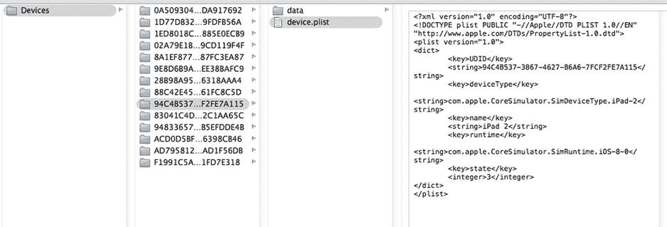
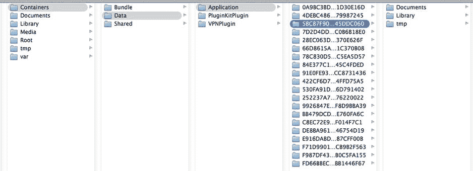
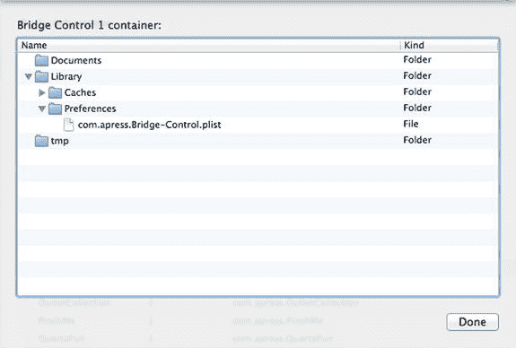
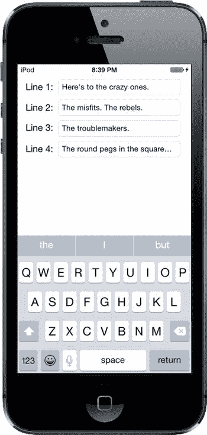
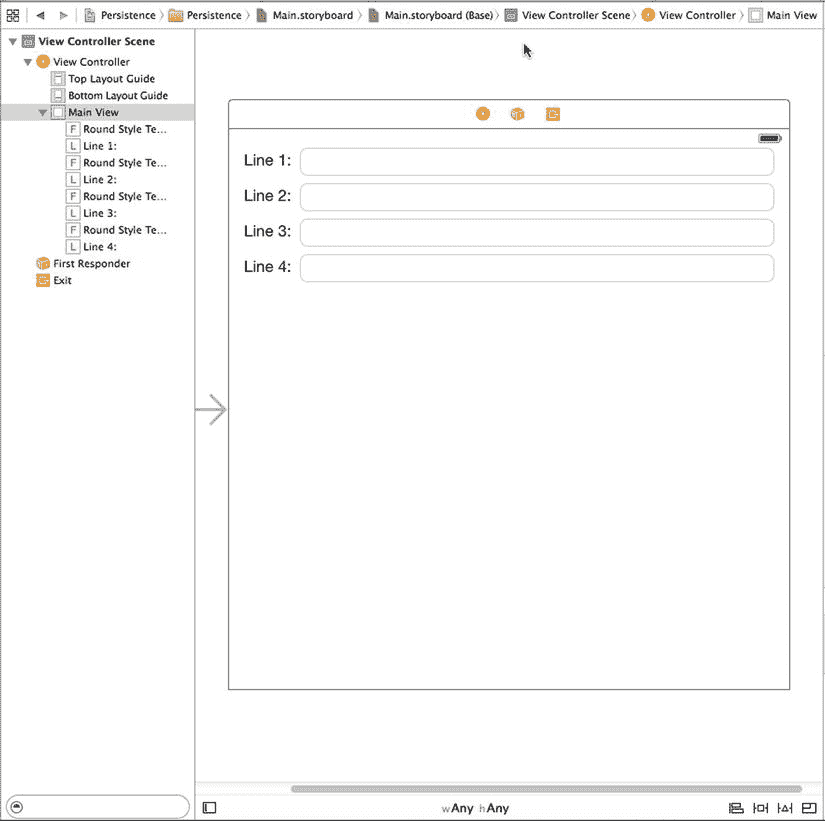
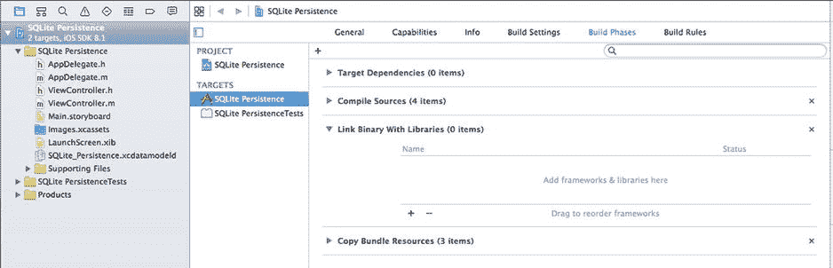

# 第 13 章 基本数据持久化

到目前为止，我们一直专注于 MVC 范式中的控制器和视图方面。虽然我们的几个应用从应用包中读取了数据，但没有一个将数据保存到任何形式的持久化存储中——即重启计算机或设备后仍能保留的非易失性存储。到目前为止，除了应用设置（在第 12 章中），每个示例应用要么不存储数据，要么使用易失性（即非持久化）存储。每次示例应用启动时，它显示的数据都与首次启动时完全相同。

这种方法到目前为止对我们来说是可行的。但在现实世界中，你的应用需要持久化数据。当用户进行更改时，他们通常希望在再次启动程序时看到这些更改。

在 iOS 设备上有多种不同的机制可用于持久化数据。如果你曾在 OS X 上使用 Cocoa 编程，你可能已经使用了其中一些或全部技术。

在本章中，我们将探讨四种不同的将数据持久化到 iOS 文件系统的机制：

*   属性列表（Property lists）
*   对象归档（Object archives 或 archiving）
*   SQLite3（iOS 的嵌入式关系数据库）
*   Core Data（Apple 提供的持久化工具）

我们将编写使用所有四种方法的示例应用。

**注意** 属性列表、对象归档、SQLite3 和 Core Data 并非在 iOS 上持久化数据的唯一方式；它们只是最常见和最简单的方式。你始终可以选择使用传统的 C I/O 调用（如`fopen()`）来读写数据。你也可以使用 Cocoa 的低级文件管理工具。在几乎每种情况下，这样做都会导致更多的编码工作，而且很少有必要，但如果你需要这些工具，它们就在那里。

## 应用的沙盒

本章中所有四种数据持久化机制共享一个重要的共同元素：你的应用的`/Documents`文件夹。每个应用都有自己的`/Documents`文件夹，并且应用被允许读写自己的`/Documents`目录。

为了给你提供一些背景，让我们通过检查 iPhone 模拟器使用的文件夹布局来了解 iOS 中应用的组织方式。要查看这一点，你需要查看主目录中的`Library`目录。在 OS X 10.6 及更早版本中，这没有问题；然而，从 OS X 10.7 开始，Apple 决定默认隐藏`Library`文件夹，所以需要一个小步骤来访问它。打开 Finder 窗口并导航到你的主目录。如果你能看到`Library`文件夹，那很好。如果没有，按住 **Alt** 键并选择 **Go**  **Library**。除非你按住 **Alt** 键，否则 **Library** 选项是隐藏的。

在`Library`文件夹中，深入进入`Developer/CoreSimulator/Devices/`。在该目录中，你会看到当前 Xcode 安装中每个模拟器的一个子目录。子目录名称是全局唯一标识符（GUID），由 Xcode 自动生成，因此仅通过查看无法知道哪个目录对应哪个模拟器。要找出答案，请在任何模拟器目录中查找名为`device.plist`的文件并打开它。你会找到一个映射到模拟设备名称的键。图 13-1 显示了 iPad 2 模拟器的`device.plist`文件。



图 13-1. 使用 device.plist 文件将目录映射到模拟器

选择一个设备并深入其`data`目录，直到到达子目录`data/Containers/Data/Application`。在这里，你又会看到名称是 GUID 的子目录。在这种情况下，每个子目录代表一个预装应用或者你曾在那个模拟器上运行过的应用。选择其中一个目录并打开它。你会看到类似图 13-2 的内容。



图 13-2. 模拟器上应用的沙盒

尽管这个列表代表的是模拟器，但文件结构与实际设备上的类似。要查看设备上应用的沙盒，请将其连接到你的 Mac 并打开 Xcode Devices 窗口（**Window**  **Devices**）。你应该在窗口侧边栏中看到你的设备。选择它，然后从 Installed Apps 表中选择一个应用。在表下方，有一个看起来像齿轮的图标。点击它并从弹出菜单中选择 **Show Container** 以查看应用沙盒的内容。你也可以将沙盒中的所有内容下载到你的 Mac。图 13-3 显示了我们在第 12 章中创建的 Bridge Control 应用的沙盒。



图 13-3. 真实设备上应用的沙盒

每个应用沙盒包含以下三个目录：


### 应用数据存储

#### 文档、资料库和临时目录

- **Documents**：你的应用可以将数据存储在`Documents`中。若为应用启用 iTunes 文件共享，用户就能在 iTunes 中看到此目录（以及应用创建的所有子目录）的内容，并可上传文件到此目录。

**提示** 要为应用启用文件共享，请打开其`Info.plist`文件，添加键`Application supports iTunes file sharing`，并将值设为`YES`。

- **Library**：这是应用另一个可用的数据存储位置，用于存放你不想与用户共享的文件。如有需要，可自行创建子目录。如图 13-3 所示，系统会创建名为`Cache`和`Preferences`的子目录。后者包含存储应用偏好的`.plist`文件，该文件通过`NSUserDefaults`类设置，我们在第 12 章中已讨论过。

- **tmp**：`tmp`目录为应用提供了临时文件存储位置。当 iOS 设备同步时，写入`tmp`的文件不会被 iTunes 备份；但为避免占满文件系统，应用一旦不再需要`tmp`中的文件，就应负责将其删除。

#### 获取 Documents 和 Library 目录路径

既然我们的应用位于一个看似随机命名的文件夹中，那么如何获取`Documents`目录的完整路径以便读写文件呢？其实非常简单。

C 函数`NSSearchPathForDirectoriesInDomain()`可为你定位各种目录。这是一个 Foundation 函数，与 OS X 的 Cocoa 共享。其许多可用选项专为 OS X 设计，在 iOS 上不会返回任何值，原因可能是这些位置在 iOS 上不存在（如`Downloads`文件夹），或者由于 iOS 的沙盒机制，你的应用无权访问该位置。

以下代码用于获取`Documents`目录的路径：

```
NSArray *paths = NSSearchPathForDirectoriesInDomains(NSDocumentDirectory,
    NSUserDomainMask, YES);
NSString *documentsDirectory = paths[0];
```

常量`NSDocumentDirectory`表示我们正在查找`Documents`目录的路径。第二个常量`NSUserDomainMask`表示我们希望将搜索范围限制在应用的沙盒内。在 OS X 中，这个相同的常量用于指示函数在用户的 home 目录中查找，这解释了它略显奇怪的命名。

虽然返回的是匹配路径的数组，但我们可以确信`Documents`目录位于数组的索引 0 处。为什么？因为我们知道只有一个目录符合指定的条件，每个应用只有一个`Documents`目录。

我们可以通过在刚获取的路径末尾附加另一个字符串来创建文件名。我们将使用一个名为`stringByAppendingPathComponent:`的`NSString`方法，它是为此目的而设计的：

```
NSString *filename = [documentsDirectory
    stringByAppendingPathComponent:@"theFile.txt"];
```

此调用之后，`filename`将包含应用`Documents`目录中名为`theFile.txt`的文件的完整路径，我们可以使用`filename`来创建、读取和写入该文件。

你可以使用同一个 C 函数，将第一个参数设为`NSLibraryDirectory`来定位`Library`目录：

```
NSArray *paths = NSSearchPathForDirectoriesInDomains(NSLibraryDirectory,
    NSUserDomainMask, YES);
NSString *libraryDirectory = paths[0];
```

#### 获取 tmp 目录

获取应用临时目录的引用甚至比获取`Documents`目录的引用更简单。名为`NSTemporaryDirectory()`的 Foundation 函数会返回一个包含应用临时目录完整路径的字符串。要为存储在临时目录中的文件创建文件名，首先找到临时目录：

```
NSString *tempPath = NSTemporaryDirectory();
```

接着，通过在此路径后附加文件名来创建该目录中的文件路径，如下所示：

```
NSString *tempFile = [tempPath
    stringByAppendingPathComponent:@"tempFile.txt"];
```

## 文件保存策略

本章将要探讨的所有四种方法都使用 iOS 文件系统。对于 SQLite3，你将创建一个单一的 SQLite3 数据库文件，让 SQLite3 负责存储和检索数据。在最简单的形式中，Core Data 为你处理所有文件系统管理。对于其他两种持久化机制——属性列表和归档——你需要考虑是将数据存储在单个文件中还是多个文件中。

### 单文件持久化

使用单个文件进行数据存储是最简单的方法；对于许多应用来说，这也是完全可以接受的。首先创建一个根对象，通常是`NSArray`或`NSDictionary`（使用归档时，根对象也可以基于自定义类）。然后，用所有需要持久化的程序数据填充根对象。每当需要保存时，你的代码会将根对象的全部内容重写入单个文件。应用启动时，它会将文件的全部内容读入内存；退出时，则写出全部内容。这就是本章将要采用的方法。

使用单文件的缺点是，你需要将所有应用数据加载到内存中，并且即使是最小的更改，也必须将所有数据写入文件系统。但如果你的应用不太可能管理超过几兆字节的数据，这种方法可能就足够了，其简单性无疑会让你的工作更轻松。

### 多文件持久化

使用多个文件进行持久化是另一种方法。例如，电子邮件应用可能会将每封邮件存储在自己的文件中。

这种方法有明显的优点。它允许应用仅加载用户请求的数据（另一种形式的懒加载）；当用户做出更改时，只需保存更改过的文件。这种方法还使你在收到内存不足通知时有机会释放内存。任何用于存储用户当前未查看数据的缓存都可以被清空，然后在下次需要时直接从文件系统重新加载。

多文件持久化的缺点是为应用增加了相当的复杂性。现在，我们坚持使用单文件持久化。

接下来，我们将深入探讨每种持久化方法的具体细节：属性列表、对象归档、SQLite3 和 Core Data。我们将依次探索每种方法，并构建一个应用，使用每种机制将一些数据保存到设备的文件系统中。我们将从属性列表开始。

## 使用属性列表

我们的几个示例应用都使用了属性列表，最近一次是在第 12 章中，我们使用属性列表来指定应用设置和偏好。属性列表很方便，可以使用 Xcode 或属性列表编辑器应用手动编辑。此外，只要字典或数组仅包含特定的可序列化对象，`NSDictionary`和`NSArray`实例都可以从属性列表写入和创建。

### 属性列表序列化

序列化对象是指已转换为字节流以便存储到文件或通过网络传输的对象。虽然任何对象都可以被序列化，但只有某些对象可以放入集合类（如`NSDictionary`或`NSArray`）中，然后使用集合类的`writeToFile:atomically:`或`writeToURL:atomically:`方法存储到属性列表。以下 Foundation 类可以通过这种方式序列化：


`NSArray`
`NSMutableArray`
`NSDictionary`
`NSMutableDictionary`
`NSData`
`NSMutableData`
`NSString`
`NSMutableString`
`NSNumber`
`NSDate`

如果您的数据模型仅由这些对象组成，便可以使用属性列表来保存和加载数据。

如果您计划使用属性列表持久化应用程序数据，则需要使用`NSArray`或`NSDictionary`来存储待持久化的数据。假设您放入`NSArray`或`NSDictionary`中的所有对象都属于上述可序列化对象列表，那么您可以通过在字典或数组实例上调用`writeToFile:atomically:`方法来写出属性列表，如下所示：

```
[myArray writeToFile:@"/some/file/location/output.plist" atomically:YES];
```

**注意**：如果你好奇的话，`atomically`参数会指示该方法将数据先写入一个辅助文件，而非直接写入指定位置。一旦成功写入，它就会将该辅助文件复制到第一个参数指定的位置。这是一种更安全的文件写入方式，因为如果应用程序在保存过程中崩溃，现有文件（如果存在）将不会损坏。这会带来一些开销，但在大多数情况下，这笔开销是值得的。

属性列表方法的一个问题是自定义对象无法序列化到属性列表中。同样，你也不能使用可可触控（Cocoa Touch）中未在可序列化对象类型列表中指定的其他类，这意味着像`NSURL`、`UIImage`和`UIColor`这样的类无法直接使用。

除了序列化问题之外，将所有模型数据以属性列表形式保存意味着你无法轻松创建派生或计算属性（例如，两个其他属性之和的属性），而且一些本应包含在模型类中的代码必须移到你的控制器类中。再次强调，这些限制对于简单的数据模型和应用程序来说是可以接受的。然而，大多数情况下，如果你创建专用的模型类，应用程序会更易于维护。

简单的属性列表在复杂应用程序中仍然很有用。它们是在应用程序中包含静态数据的好方法。例如，当你的应用程序有一个选择器（picker）时，提供其项目列表的最佳方式通常是创建一个`*.plist`文件，并将其放在项目的`Resources`文件夹中，这会导致它被编译到你的应用程序中。

让我们构建一个使用属性列表存储数据的简单应用程序。

## 持久化应用程序的第一个版本

我们将构建一个程序，允许你向四个文本字段输入数据，在应用程序退出时将数据保存到`*.plist`文件中，然后在下次应用程序启动时从该`*.plist`文件重新加载数据（参见图 13-4）。



图 13-4. 持久化应用程序

**注意**：在本章的应用程序中，我们不会像之前的示例那样花时间设置所有用户界面的细节。例如，轻点**Return**键既不会关闭键盘，也不会将你带到下一个字段。如果你想为应用程序添加这样的优化，这将是一个很好的练习，因此我们鼓励你自行完成。

### 创建持久化项目

在 Xcode 中，使用 Single View Application 模板创建一个新项目，并将其命名为`Persistence`。此项目包含构建应用程序所需的所有文件，因此我们可以直接开始。

在构建包含四个文本字段的视图之前，我们先创建所需的输出口（outlet）。在项目导航器中，单击`ViewController.m`文件并进行以下更改：

```
#import "ViewController.h"

@interface ViewController ()

@property (strong, nonatomic) IBOutletCollection(UITextField) NSArray *lineFields;

@end
```

现在选择`Main.storyboard`来编辑图形用户界面（GUI）。

### 设计持久化应用程序的视图

当 Xcode 切换到 Interface Builder 模式时，你会在编辑面板中看到 View Controller 场景。展开**View Controller**图标，并将 View 项的名称更改为`Main View`。从库中拖一个**Text Field**到窗口，并将其放置在顶部和右侧的蓝色参考线处。调出 Attributes Inspector（属性检查器），确保标有**Clear when editing begins**的复选框未被选中。

现在拖一个**Label**到窗口，并使用左侧蓝色参考线将其放置在文本字段的左侧，然后使用水平蓝色参考线将标签的垂直中心与文本字段的垂直中心对齐。双击标签，将其文本更改为`Line 1:`。最后，使用左侧调整手柄调整文本字段的大小，使其靠近标签。参考图 13-5 进行操作。



图 13-5. 设计持久化应用程序的视图

接下来，选中该标签和文本字段，按住**Option**键，向下拖拽以在第一组下方复制一份。使用蓝色参考线引导你的放置位置。现在选中两个标签和两个文本字段，再次按住**Option**键向下拖拽。你应该得到四个标签和四个文本字段。分别双击剩下的标签，将其名称更改为`Line 2:`、`Line 3:`和`Line 4:`。再次将你的结果与图 13-5 进行比较。

当你放置好所有四个文本字段和标签后，从**View Controller**图标按住 Control 键拖拽到每个文本字段。将它们全部连接到`lineFields`输出口集合（outlet collection），确保从上到下按顺序连接。保存对`Main.storyboard`所做的更改。

现在让我们添加自动布局（Auto Layout）约束，以确保设计在所有设备上都能正常工作。首先，从 Line 1 标签按住 Control 键拖拽到其右侧的文本字段，然后松开鼠标。按住**Shift**键并选择**Horizontal Spacing**和**Baseline**，然后点击弹出窗口外部。对另外三个标签和文本字段执行相同操作。

接下来，我们将固定文本字段的位置。在文档大纲（Document Outline）中，从顶部的文本字段按住 Control 键拖拽到 Main View，松开鼠标，按住**Shift**键并选择**Trailing Space to Container Margin**和**Top Space to Top Layout Guide**，然后点击弹出窗口外部。对另外三个文本字段执行相同操作。

我们需要固定标签的宽度，以便在用户在文本字段中输入超出其宽度的文本时，标签不会调整大小。选择顶部标签，点击故事板编辑器下方的**Pin**按钮。在弹出的窗口中，选中**Width**复选框，然后点击**Add 1 Constraint**。对所有标签执行相同操作。

最后，回到文档大纲，从 Line 1 标签按住 Control 键拖拽到 Main View，松开鼠标，选择**Leading Space to Container Margin**。对所有标签执行相同操作——这样所有必需的 Auto Layout 约束就设置好了。构建并运行应用程序，将结果与图 13-5 进行比较。

### 编辑持久化类

在项目导航器中，选择`ViewController.m`并将以下代码添加到类的`@implementation`部分：

```
@implementation ViewController

- (NSString *)dataFilePath
{
    NSArray *paths = NSSearchPathForDirectoriesInDomains(
                         NSDocumentDirectory, NSUserDomainMask, YES);
    NSString *documentsDirectory = [paths objectAtIndex:0];
    return [documentsDirectory stringByAppendingPathComponent:@"data.plist"];
}
```


`dataFilePath`方法会查找*Documents*目录，并在其后附加文件名，从而返回数据文件的完整路径。任何需要加载或保存数据的代码都会调用此方法。

找到`viewDidLoad`方法，将以下代码添加到其中，同时在其下方添加一个用于接收通知的新方法`applicationWillResignActive:`，如下所示：

```
- (void)viewDidLoad
{
    [super viewDidLoad];
    // Do any additional setup after loading the view, typically from a nib.
    NSString *filePath = [self dataFilePath];
    if ([[NSFileManager defaultManager] fileExistsAtPath:filePath]) {
        NSArray *array = [[NSArray alloc] initWithContentsOfFile:filePath];
        for (int i = 0; i < 4; i++) {
            UITextField *theField = self.lineFields[i];
            theField.text = array[i];
        }
    }

    UIApplication *app = [UIApplication sharedApplication];
    [[NSNotificationCenter defaultCenter]
     addObserver:self
        selector:@selector(applicationWillResignActive:)
            name:UIApplicationWillResignActiveNotification
          object:app];
}

- (void)applicationWillResignActive:(NSNotification *)notification {
    NSString *filePath = [self dataFilePath];
    NSArray *array = [self.lineFields valueForKey:@"text"];
    [array writeToFile:filePath atomically:YES];
}
```

在`viewDidLoad`方法中，我们额外做了几件事。首先，使用`NSFileManager`类检查数据文件是否已存在。如果不存在，则无需尝试加载。如果文件存在，则用该文件的内容实例化一个数组，然后将该数组中的对象复制到我们的四个文本字段中。由于数组是有序列表，我们按保存时的相同顺序复制它们（相关代码你尚未看到），以确保始终能在正确的字段中获得正确的值：

```
NSString *filePath = [self dataFilePath];
if ([[NSFileManager defaultManager] fileExistsAtPath:filePath]) {
    NSArray *array = [[NSArray alloc] initWithContentsOfFile:filePath];
    for (int i = 0; i < 4; i++) {
        UITextField *theField = self.lineFields[i];
        theField.text = array[i];
    }
}
```

从属性列表加载数据后，我们获取应用程序实例的引用，并使用默认的`NSNotificationCenter`实例和方法`addObserver:selector:name:object:`来订阅`UIApplicationWillResignActiveNotification`。我们将`self`作为第一个参数传递，指定`ViewController`实例为应接收通知的观察者。第二个参数传递的是指向`applicationWillResignActive:`方法的选择器，告知通知中心在发布该通知时调用此方法。第三个参数`UIApplicationWillResignActiveNotification`是我们感兴趣接收的通知名称，这是由`UIApplication`类定义的字符串常量。最后一个参数`app`是我们希望从中获取通知的对象：

```
UIApplication *app = [UIApplication sharedApplication];
[[NSNotificationCenter defaultCenter]
addObserver:self
    selector:@selector(applicationWillResignActive:)
        name:UIApplicationWillResignActiveNotification
      object:app];
```

最后一个新方法叫做`applicationWillResignActive:`。请注意它接受一个指向`NSNotification`的指针作为参数。你可能从第 12 章中认出了这种模式。`applicationWillResignActive:`是一个通知方法，所有通知都接受单个`NSNotification`实例作为参数。

我们的应用程序需要在被终止或发送到后台之前保存数据，因此我们关注名为`UIApplicationWillResignActiveNotification`的通知。当应用程序不再是用户正在交互的那个时，就会发布此通知。这种情况发生在用户按下**Home**按钮，或者应用程序因其他事件（如来电）被推入后台时。之前，在`viewDidLoad`方法中，我们使用通知中心订阅了该特定通知。当该通知发生时，会调用此方法：

```
- (void)applicationWillResignActive:(NSNotification *)notification {
    NSString *filePath = [self dataFilePath];
    NSArray *array = [self.lineFields valueForKey:@"text"];
    [array writeToFile:filePath atomically:YES];
}
```

这个方法虽然简短，但通过几个方法调用完成了很多工作。我们通过对`lineFields`数组中的每个文本字段调用`text`方法来构造一个字符串数组。为此，我们使用了一个巧妙的捷径：不是显式遍历文本字段数组、逐个询问其`text`值并将该值添加到新数组，而是简单地对数组调用`valueForKey:`，并传递`@"text"`作为参数。`NSArray`对`valueForKey:`的实现会为我们完成遍历，请求其包含的每个`UITextField`实例的`text`值，并返回包含所有值的新数组。之后，我们将该数组的内容写入我们的*.plist*文件。这就是使用属性列表保存数据所需的全部操作。

这并不太难，对吧？当主视图加载完成后，我们查找*.plist*文件。如果存在，则将数据从其中复制到文本字段。接下来，我们注册以在应用程序变为非活动状态时（通过退出或被推入后台）接收通知。当这种情况发生时，我们从四个文本字段收集值，将它们放入一个可变数组，并将该可变数组写入属性列表。

为什么不编译并运行应用程序呢？它应该能在模拟器中构建并启动。启动后，你应该能够在四个文本字段中的任何一个中输入内容。输入内容后，按下**Home**按钮（模拟器窗口底部带有圆角正方形的圆形按钮）。按下**Home**按钮非常重要。如果你直接退出模拟器，那相当于强制退出应用程序。在这种情况下，视图控制器永远不会收到应用程序即将变为非活动状态的通知，你的数据也不会被保存。按下**Home**按钮后，你可以退出模拟器，或从 Xcode 停止应用并再次运行。下次应用启动时，你的文本将被恢复。

**注意** 需要理解的是，按下**Home**按钮通常不会退出应用——至少一开始不会。应用会被置于后台状态，准备好在用户切换回时立即重新激活。我们将在第 15 章中深入探讨这些状态的细节及其对运行和退出应用的影响。同时，如果你想验证数据是否真的被保存，可以完全退出 iOS 模拟器，然后从 Xcode 重新启动应用。退出模拟器基本上相当于重启 iPhone。下次应用启动时，它将为用户提供全新的启动体验。

属性列表序列化非常酷且易于使用。然而，它有些局限，因为只有少数几种对象可以存储在属性列表中。我们来看一种更健壮的方法。

## 归档模型对象


在 Cocoa 世界中，术语**归档（archiving）**指的是序列化的另一种形式，但它是一种更通用的类型，任何对象都可以实现。任何专门为保存数据而编写的模型对象都应支持归档。对模型对象进行归档的技术，让你可以轻松地将复杂对象写入文件，然后再将其读回。

只要你在类中实现的每个属性要么是标量（例如`int`或`float`），要么是遵循`NSCoding`协议的类的实例，你就可以完整地归档你的对象。由于大多数能够存储数据的 Foundation 和 Cocoa Touch 类确实遵循`NSCoding`（尽管有一些值得注意的例外，例如`UIImage`），因此对于大多数类来说，归档相对容易实现。

虽然并非严格要求，但要使归档工作正常，除了`NSCoding`之外，还应该实现另一个协议：`NSCopying`协议，它允许你的对象被复制。在使用数据模型对象时，能够复制对象会为你提供更大的灵活性。

### 遵循 NSCoding

`NSCoding`协议声明了两个方法，这两个方法都是必需的。一个将你的对象编码到归档中；另一个通过解码归档来创建一个新对象。这两个方法都接收一个`NSCoder`实例，你使用它的方式与上一章介绍的`NSUserDefaults`非常相似。你可以使用键值编码来编码和解码对象以及原生数据类型，如`int`和`float`值。

编码对象的方法可能如下所示：

```
- (void)encodeWithCoder:(NSCoder *)encoder {
    [encoder encodeObject:foo forKey:kFooKey];
    [encoder encodeObject:bar forKey:kBarKey];
    [encoder encodeInt:someInt forKey:kSomeIntKey];
    [encoder encodeFloat:someFloat forKey:kSomeFloatKey]
}
```

为了在我们的对象中支持归档，我们需要使用适当的编码方法将每个实例变量编码到`encoder`中。如果你是子类化一个也遵循`NSCoding`的类，你需要确保调用父类的`encodeWithCoder:`，以保证父类也能编码其数据。因此，你的方法应该是这样的：

```
- (void)encodeWithCoder:(NSCoder *)encoder {
    [super encodeWithCoder:encoder];  // 让父类编码其状态
    [encoder encodeObject:foo forKey:kFooKey];
    [encoder encodeObject:bar forKey:kBarKey];
    [encoder encodeInt:someInt forKey:kSomeIntKey];
    [encoder encodeFloat:someFloat forKey:kSomeFloatKey]
}
```

我们还需要实现一个从`NSCoder`初始化对象的方法，这样我们就可以恢复之前归档的对象。实现`initWithCoder:`方法比实现`encodeWithCoder:`稍微复杂一些。如果你是直接子类化`NSObject`或其他不遵循`NSCoding`的类，你的方法看起来会像下面这样：

```
- (id)initWithCoder:(NSCoder *)decoder {
    if (self = [super init]) {
        foo = [decoder decodeObjectForKey:kFooKey];
        bar = [decoder decodeObjectForKey:kBarKey];
        someInt = [decoder decodeIntForKey:kSomeIntKey];
        someFloat = [decoder decodeFloatForKey:kAgeKey];
    }
    return self;
}
```

该方法使用`[super init]`初始化一个对象实例。如果初始化成功，它通过解码从传入的`NSCoder`实例中获取的值来设置其属性。当为一个父类也遵循`NSCoding`的类实现`NSCoding`时，`initWithCoder:`方法需要稍有不同。它不是调用父类的`init`，而是需要调用父类的`initWithCoder:`，如下所示：

```
- (id)initWithCoder:(NSCoder *)decoder {
    if (self = [super initWithCoder:decoder]) {
        foo = [decoder decodeObjectForKey:kFooKey];
        bar = [decoder decodeObjectForKey:kBarKey];
        someInt = [decoder decodeIntForKey:kSomeIntKey];
        someFloat = [decoder decodeFloatForKey:kAgeKey];
    }
    return self;
}
```

基本上就是这样。只要你实现了这两个方法来编码和解码对象的所有属性，你的对象就是可归档的，并且可以被写入归档和从归档中读取。

### 实现 NSCopying

如前所述，对于任何数据模型对象来说，遵循`NSCopying`都是一个非常好的主意。`NSCopying`有一个名为`copyWithZone:`的方法，它允许对象被复制。实现`NSCopying`类似于实现`initWithCoder:`。你只需要创建一个相同类的新实例，然后将该新实例的所有属性设置为此对象的相同属性值。下面是一个`copyWithZone:`方法可能的实现方式：

```
- (id)copyWithZone:(NSZone *)zone {
    MyClass *copy = [[[self class] allocWithZone:zone] init];
    copy.foo = [self.foo copyWithZone:zone];
    copy.bar = [self.bar copyWithZone:zone];
    copy.someInt = self.someInt;
    copy.someFloat = self.someFloat;
    return copy;
}
```

**注意**：不要太担心`NSZone`参数。这个指针指向一个`struct`，系统用它来管理内存。只有在极少数情况下，开发人员才需要担心`zone`或创建自己的`zone`，而如今，拥有多个`zone`几乎闻所未闻。调用对象的`copy`等同于使用默认`zone`调用`copyWithZone:`，这总是你想要的。事实上，在现代化的 iOS 上，`zone`被完全忽略了。`NSCopying`使用`zone`这一事实完全是出于向后兼容的历史原因。

### 归档和解档数据对象

从一个（或多个）遵循`NSCoding`的对象创建归档相对容易。首先，我们创建一个`NSMutableData`实例来保存编码后的数据，然后我们创建一个`NSKeyedArchiver`实例来将对象归档到该`NSMutableData`实例中：

```
NSMutableData *data = [[NSMutableData alloc] init];
NSKeyedArchiver *archiver = [[NSKeyedArchiver alloc]
    initForWritingWithMutableData:data];
```

创建这两者之后，我们使用键值编码来归档我们想要包含在归档中的任何对象，如下所示：

```
[archiver encodeObject:myObject forKey:@"keyValueString"];
```

一旦我们编码了所有想要包含的对象，我们只需告诉归档器我们已经完成，然后将`NSMutableData`实例写入文件系统：

```
[archiver finishEncoding];
BOOL success = [data writeToFile:@"/path/to/archive" atomically:YES];
```

如果在写入文件时发生任何错误，`success`将被设置为`NO`。如果`success`是`YES`，则数据已成功写入指定文件。从此归档中创建的任何对象都将是上次写入文件中的对象的精确副本。

有一种更快的方法可以达到同样的效果，即使用`NSKeyedArchiver archiveDataWithRootObject:`方法，该方法会分配一个`NSData`对象并将对象编码到其中，一步完成，然后返回`NSData`对象：

```
NSData *data = [NSKeyedArchiver archivedDataWithRootObject:object];
BOOL success = [data writeToFile:@"/path/to/archive" atomically:YES];
```

你还可以使用`archiveRootObject:toFile:`方法直接从对象写到文件：

```
BOOL success = [NSKeyedArchiver archiveRootObject:object
                    toFile:@"/path/to/archive"];
```

要从归档中重建对象，我们经历一个类似的过程。我们从归档文件创建一个`NSData`实例，并创建一个`NSKeyedUnarchiver`来解码数据：

```
NSData *data = [[NSData alloc] initWithContentsOfFile:@"/path/to/archive"];
NSKeyedUnarchiver *unarchiver = [[NSKeyedUnarchiver alloc]
    initForReadingWithData:data];
```

之后，我们使用归档对象时使用的相同键从解档器中读取我们的对象：

```
self.object = [unarchiver decodeObjectForKey:@"keyValueString"];
```

最后，我们告诉解档器我们已经完成：

```
[unarchiver finishDecoding];
```


与归档步骤类似，存在一些便捷方法，允许你直接从`NSData`对象或文件解档，而无需分配`NSKeyedUnarchiver`实例。

如果你对归档感到有些不知所措，别担心。它实际上相当直接。我们将重构`Persistence`应用程序以使用归档，这样你就能看到它的实际运用。一旦你做过几次，归档就会变得得心应手，因为实际上你做的只是通过键值编码来存储和检索对象的属性。

## 归档应用程序

让我们重做`Persistence`应用程序，使其使用归档而非属性列表。我们将对`Persistence`源代码进行一些相当重大的更改，因此在继续之前，你应该复制整个项目文件夹。

### 实现`FourLines`类

准备好继续，并在 Xcode 中打开了`Persistence`项目的副本后，按下`**N**`或选择**File** `` **New** `` **File…**。当新文件助手出现时，从 iOS 部分选择**Cocoa Touch Class**并点击**Next**。在下一屏幕中，将类命名为`FourLines`，并在**Subclass of**控件中选择**NSObject**。再次点击**Next**。现在选择`Persistence`文件夹来保存文件，然后点击**Create**。这个类将是我们的数据模型。它将保存我们当前在属性列表应用程序的字典中存储的数据。

单击`FourLines.h`并进行以下更改：

```objc
#import <Foundation/Foundation.h>

@interface FourLines : NSObject <NSCoding, NSCopying>

@property (copy, nonatomic) NSArray *lines;

@end
```

这是一个非常直接的数据模型类，包含一个由四个字符串组成的数组属性。注意，我们使该类遵循了`NSCoding`和`NSCopying`协议。现在切换到`FourLines.m`并添加以下代码：

```objc
#import "FourLines.h"

static NSString *const kLinesKey = @"kLinesKey";

@implementation FourLines

#pragma mark - Coding

- (id)initWithCoder:(NSCoder *)aDecoder {
    self = [super init];
    if (self) {
        self.lines = [aDecoder decodeObjectForKey:kLinesKey];
    }
    return self;
}

- (void)encodeWithCoder:(NSCoder *)aCoder; {
    [aCoder encodeObject:self.lines forKey:kLinesKey];
}

#pragma mark - Copying

- (id)copyWithZone:(NSZone *)zone; {
    FourLines *copy = [[[self class] allocWithZone:zone] init];
    NSMutableArray *linesCopy = [NSMutableArray array];
    for (id line in self.lines) {
        [linesCopy addObject:[line copyWithZone:zone]];
    }
    copy.lines = linesCopy;
    return copy;
}

@end
```

我们刚实现了遵循`NSCoding`和`NSCopying`所需的所有方法。我们在`encodeWithCoder:`中编码了`lines`属性，并在`initWithCoder:`中使用相同的键值对其解码。在`copyWithZone:`中，我们创建了一个新的`FourLines`对象，并将字符串数组复制给它。看到了吗？这并不难；只是如果你做了大量复制粘贴，请确保没有忘记更改任何内容。

### 实现`ViewController`类

现在我们有了一个可归档的数据对象，让我们用它来持久化应用程序数据。选择`ViewController.m`并进行以下更改：

```objc
#import "ViewController.h"
#import "FourLines.h"

static NSString *const kRootKey = @"kRootKey";

@interface ViewController ()

@property (strong, nonatomic) IBOutletCollection(UITextField) NSArray *lineFields;

@end

@implementation ViewController

- (void)viewDidLoad
{
    [super viewDidLoad];
    // Do any additional setup after loading the view, typically from a nib.
    NSString *filePath = [self dataFilePath];
    if ([[NSFileManager defaultManager] fileExistsAtPath:filePath]) {
        NSArray *array = [[NSArray alloc] initWithContentsOfFile:filePath];
        for (int i = 0; i < 4; i++) {
            UITextField *theField = self.lineFields[i];
            theField.text = array[i];
        }
        NSData *data = [[NSMutableData alloc] initWithContentsOfFile:filePath];
        NSKeyedUnarchiver *unarchiver = [[NSKeyedUnarchiver alloc] initForReadingWithData:data];
        FourLines *fourLines = [unarchiver decodeObjectForKey:kRootKey];
        [unarchiver finishDecoding];

        for (int i = 0; i < 4; i++) {
            UITextField *theField = self.lineFields[i];
            theField.text = fourLines.lines[i];
        }
    }

    UIApplication *app = [UIApplication sharedApplication];
    [[NSNotificationCenter defaultCenter]
     addObserver:self
        selector:@selector(applicationWillResignActive:)
            name:UIApplicationWillResignActiveNotification
          object:app];
}

- (void)applicationWillResignActive:(NSNotification *)notification
{
    NSString *filePath = [self dataFilePath];
    NSArray *array = [self.lineFields valueForKey:@"text"];
    [array writeToFile:filePath atomically:YES];

    FourLines *fourLines = [[FourLines alloc] init];
    fourLines.lines = [self.lineFields valueForKey:@"text"];
    NSMutableData *data = [[NSMutableData alloc] init];
    NSKeyedArchiver *archiver = [[NSKeyedArchiver alloc] initForWritingWithMutableData:data];
    [archiver encodeObject:fourLines forKey:kRootKey];
    [archiver finishEncoding];
    [data writeToFile:filePath atomically:YES];
}

- (NSString *)dataFilePath
{
    NSArray *paths = NSSearchPathForDirectoriesInDomains(NSDocumentDirectory, NSUserDomainMask, YES);
    NSString *documentsDirectory = [paths objectAtIndex:0];
    return [documentsDirectory stringByAppendingPathComponent:@"data.plist"];
    return [documentsDirectory stringByAppendingPathComponent:@"data.archive"];
}

@end
```

保存更改，并运行这个版本的`Persistence`。

变化实际上并不多。我们首先指定了一个新的文件名，这样程序就不会尝试将旧的属性列表作为归档加载。我们还定义了一个新的常量，它将是我们用来编码和解码对象的键值。接下来，我们通过使用`FourLines`来保存数据，并使用其`NSCoding`方法进行实际的加载和保存，从而重新定义了加载和保存操作。GUI 与前一版本完全相同。

这个新版本实现起来比属性列表序列化多了几行代码，所以你可能想知道使用归档是否真的比序列化属性列表有优势。对于这个应用程序，答案是简单的：不，实际上没有任何优势。但想象一下，我们有一个可归档对象的数组，比如我们刚构建的`FourLines`类，我们可以通过归档数组实例本身来归档整个数组。像`NSArray`这样的集合类在归档时，会归档它们包含的所有对象。只要你放入数组或字典的每个对象都遵循`NSCoding`，你就可以归档该数组或字典，并在恢复后，归档时其中的所有对象都将出现在恢复的数组或字典中。属性列表持久化则并非如此，它仅适用于一小部分 Foundation 对象类型——除非你编写额外的代码将这些类的实例与`NSDictionary`（每个对象属性对应一个键）相互转换，否则无法用它来持久化自定义类。


换句话说，`NSCoding`方法能够优雅地扩展（至少在代码规模上是这样）。无论你添加多少对象，将这些对象写入磁盘（假设你使用单文件持久化）的工作量是完全相同的。而使用属性列表，工作量会随着你添加的每个对象而增加。

## 使用 iOS 的内嵌 SQLite3

我们要讨论的第三个持久化选项是使用 iOS 的内嵌 SQL 数据库，名为 SQLite3。SQLite3 在存储和检索大量数据方面非常高效。它还能对数据进行复杂的聚合操作，其速度远快于使用对象执行相同操作。

考虑几个场景。如果你的应用需要计算所有对象中某个特定字段的总和怎么办？或者，你只需要从满足特定条件的对象中获取总和？SQLite3 允许你无需将每个对象加载到内存就能获取这些信息。从 SQLite3 获取聚合结果比将所有对象加载到内存中并计算它们的值要快几个数量级。作为一个功能完备的内嵌数据库，SQLite3 包含了一些工具，例如创建表索引来加速查询，从而使其更快。

**注意** 关于“SQL”和“SQLite”的发音，有几种不同的学派。大多数官方文档建议将“SQL”读作“Ess-Queue-Ell”，将“SQLite”读作“Ess-Queue-Ell-Light”。许多人分别将它们读作“Sequel”和“Sequel Light”。一小部分顽固的叛逆者更喜欢“Squeal”和“Squeal Light”。选择最适合你的读法（并准备好，如果你选择加入“Squeal”阵营，可能会被异教徒嘲笑和排斥）。

SQLite3 使用结构化查询语言（SQL），这是用于与关系数据库交互的标准语言。关于 SQL 语法（事实上数以百计）、以及 SQLite 本身，已有整本书的论述。因此，如果你还不了解 SQL，并希望在应用中使用 SQLite3，你还有一点工作要做。本章将向你展示如何从 iOS 应用中设置和与 SQLite 数据库交互，以及一些基本的语法。但要真正充分利用 SQLite3，你需要进行一些额外的研究和探索。一些很好的起点是“An Introduction to the SQLite3 C/C++ Interface”（`www.sqlite.org/cintro.html`）和“SQL As Understood by SQLite”（`www.sqlite.org/lang.html`）。

关系数据库（包括 SQLite3）和面向对象编程语言在存储和组织数据方面采用了根本不同的方法。这些方法差异很大，以至于已经开发出许多技术和大量库与工具用于两者之间的转换。这些不同的技术统称为**对象关系映射**（ORM）。目前有几种适用于 Cocoa Touch 的 ORM 工具。实际上，本章后面我们将介绍 Apple 提供的一个 ORM 解决方案，名为 Core Data。

但在此之前，我们将专注于 SQLite3 的基础知识，包括设置它、创建用于保存数据的表，以及在应用中使用该数据库。显然，在现实世界中，像我们正在开发的这样一个简单的应用，不值得投入 SQLite3。但这个应用的简单性恰恰使其成为一个很好的学习范例。

### 创建或打开数据库

在使用 SQLite3 之前，你必须先打开数据库。用于执行此操作的函数`sqlite3_open()`，会打开一个现有的数据库；或者，如果在指定位置没有数据库存在，该函数会创建一个新的。以下是打开数据库的代码示例：

```
sqlite3 *database;
int result = sqlite3_open("/path/to/database/file", &database);
```

如果`result`等于常量`SQLITE_OK`，则表示数据库成功打开。注意，数据库文件的路径必须以 C 字符串的形式传入，而不是`NSString`。SQLite3 是用可移植的 C 语言编写的，而不是 Objective-C，它不知道`NSString`是什么。幸运的是，有一个`NSString`方法可以从`NSString`实例生成 C 字符串：

```
const char *stringPath = [pathString UTF8String];
```

当你使用完 SQLite3 数据库后，关闭它：

```
sqlite3_close(database);
```

数据库将所有数据存储在表中。你可以通过编写 SQL `CREATE`语句，并使用函数`sqlite3_exec`将其传入打开的数据库来创建新表，如下所示：

```
char *errorMsg;
const char *createSQL = "CREATE TABLE IF NOT EXISTS PEOPLE"
    "(ID INTEGER PRIMARY KEY AUTOINCREMENT, FIELD_DATA TEXT)";
int result = sqlite3_exec(database, createSQL, NULL, NULL, &errorMsg);
```

**提示** 如果两个内联字符串仅由空白（包括换行符）分隔，它们将被连接成一个字符串。

和之前一样，你需要验证`result`是否等于`SQLITE_OK`以确保命令成功运行。如果不是，`errorMsg`将包含对出现问题的描述。

函数`sqlite3_exec`用于针对 SQLite3 运行任何不返回数据的命令，包括更新、插入和删除。从数据库中检索数据则稍微复杂一些。你首先需要通过提供 SQL `SELECT` 命令来准备语句：

```
NSString *query = @"SELECT ID, FIELD_DATA FROM FIELDS ORDER BY ROW";
sqlite3_stmt *statement;
int result = sqlite3_prepare_v2(database, [query UTF8String],
    -1, &statement, nil);
```

**注意** 所有接收字符串的 SQLite3 函数都需要旧式的 C 字符串。在示例中，我们创建并传递了一个 C 字符串。具体来说，我们创建了一个`NSString`，并通过使用`NSString`的方法`UTF8String`派生出一个 C 字符串。两种方法都是可接受的。如果你需要对字符串进行操作，使用`NSString`或`NSMutableString`会更方便；然而，从`NSString`转换为 C 字符串会带来一些额外的开销。

如果`result`等于`SQLITE_OK`，则语句已成功准备，你可以开始遍历结果集。以下是一个遍历结果集并从数据库检索`int`和`NSString`的示例：

```
while (sqlite3_step(statement) == SQLITE_ROW) {
    int rowNum = sqlite3_column_int(statement, 0);
    char *rowData = (char *)sqlite3_column_text(statement, 1);
    NSString *fieldValue = [[NSString alloc] initWithUTF8String:rowData];
    // Do something with the data here
}
sqlite3_finalize(statement);
```

### 使用绑定变量

虽然可以构造 SQL 字符串来插入值，但通常的做法是使用所谓的**绑定变量**来实现此目的。正确处理字符串——确保它们没有无效字符以及引号被正确插入——可能相当繁琐。使用绑定变量，这些问题为我们处理好了。

要使用绑定变量插入值，你像往常一样创建 SQL 语句，但在 SQL 字符串中放入一个问号（`?`）。每个问号代表一个必须在语句执行前绑定的变量。接下来，你准备 SQL 语句，为每个变量绑定一个值，然后执行命令。

以下是一个示例，它准备了一个带有两个绑定变量的 SQL 语句，将一个`int`绑定到第一个变量，将一个字符串绑定到第二个变量，然后执行并结束语句：

```
char *sql = "insert into foo values (?, ?);";
sqlite3_stmt *stmt;
if (sqlite3_prepare_v2(database, sql, -1, &stmt, nil) == SQLITE_OK) {
    sqlite3_bind_int(stmt, 1, 235);
    sqlite3_bind_text(stmt, 2, "Bar", -1, NULL);
}
if (sqlite3_step(stmt) != SQLITE_DONE)
    NSLog(@"This should be real error checking!");
sqlite3_finalize(stmt);
```


```markdown
根据您的要求，已对原文进行 Markdown 排版处理。以下是处理后的结果：

`sqlite3_bind_*()` 系列函数提供了多种绑定方式，具体取决于您要使用的数据类型。大多数绑定函数仅接受三个参数：

-   **第一个参数**：对于任何绑定函数，无论数据类型如何，都是一个指向 `sqlite3_stmt` 的指针，该指针之前在 `sqlite3_prepare_v2()` 调用中使用过。
-   **第二个参数**：是您要绑定的变量的索引。这是一个从 1 开始计数的值，这意味着 SQL 语句中的第一个问号索引为 1，后面的每个问号依次递增。
-   **第三个参数**：始终是应替换问号的值。

少数绑定函数（例如用于绑定文本和二进制数据的函数）有两个额外参数：

-   **第一个额外参数**：是第三个参数中传入的数据长度。对于 C 字符串，您可以传递 `-1` 来代替字符串长度，函数将使用整个字符串。在所有其他情况下，您需要告知它传入数据的长度。
-   **最后一个参数**：是一个可选的函数回调，用于在语句执行后执行任何内存清理。通常，这样的函数用于释放使用 `malloc()` 分配的内存。

跟在绑定语句后面的语法可能看起来有点奇怪，因为我们正在执行插入操作。当使用绑定变量时，查询和更新使用相同的语法。如果 SQL 字符串中包含的是 SQL 查询而不是更新，我们需要多次调用 `sqlite3_step()`，直到它返回 `SQLITE_DONE`。由于这是一个更新操作，我们只调用它一次。

## SQLite3 应用程序

在 Xcode 中，使用单视图应用程序模板创建一个新项目，并将其命名为 *SQLite Persistence*。此项目的初始设置与上一个项目完全相同，因此首先打开 *ViewController.m* 文件，然后进行以下更改：

```
#import "ViewController.h"

@interface ViewController ()

@property (strong, nonatomic) IBOutletCollection(UITextField) NSArray *lineFields;

@end
```

接下来，选择 *Main.storyboard*。按照本章前面“设计持久化应用程序视图”部分中的说明设计视图并连接输出集合。设计完成后，保存 storyboard 文件。

我们已经介绍了基础知识，下面来看看它在实践中如何工作。我们将再次改造我们的持久化应用程序，这次使用 SQLite3 存储数据。我们将使用一个表，并将字段值存储在该表的四个不同行中。我们还会为每一行分配一个与其字段对应的行号。例如，第一行的值将存储在行号为 0 的表中，下一行行号为 1，依此类推。让我们开始吧。

### 链接到 SQLite3 库

SQLite 3 通过一个过程化 API 访问，该 API 提供了多个 C 函数调用的接口。要使用此 API，我们需要将应用程序链接到一个名为 *libsqlite3.dylib* 的动态库。将动态库链接到项目的过程与链接框架的过程完全相同。

选择项目导航器（最左侧窗格）最顶部的 **SQLite Persistence** 项目，然后在主区域（参见图 13-6 的中间窗格）的 **TARGETS** 部分中选择 **SQLite Persistence**。（请确保您是从 **TARGETS** 部分中选择的 **SQLite Persistence**，而不是 **PROJECT** 部分。）



图 13-6. 在项目导航器中选择 SQLite Persistence 项目；选择 SQLite Persistence 目标；最后，选择 Build Phases 标签

选中 SQLite Persistence 目标后，单击最右侧窗格中的 **Build Phases** 标签。您将看到一个项目列表，这些项目最初都是折叠的，代表了 Xcode 构建应用程序所需的各种步骤。展开标有 **Link Binary With Libraries** 的项目。此部分包含 Xcode 与您的应用程序链接的库和框架。默认情况下它是空的，因为编译器会自动链接您的应用程序使用的任何 iOS 框架，但编译器对 SQLite3 库一无所知，所以我们需要在此处添加它。

单击链接框架列表底部的 **+** 按钮，此时会弹出一个工作表，列出所有可用的框架和库。在列表中找到 *libsqlite3.dylib*（或使用方便的搜索字段），然后单击 **Add** 按钮。请注意，该目录中可能还有其他几个以 *libsqlite3* 开头的条目。请确保您选择的是 *libsqlite3.dylib*。它是一个别名，始终指向最新版本的 SQLite3 库。

### 修改持久化视图控制器

现在我们可以编写更多代码。选择 *ViewController.m* 并进行以下更改：

```
#import "ViewController.h"
#import <sqlite3.h>

@interface ViewController ()

@property (strong, nonatomic) IBOutletCollection(UITextField) NSArray *lineFields;

@end

@implementation ViewController

- (NSString *)dataFilePath {
    NSArray *paths = NSSearchPathForDirectoriesInDomains(
                         NSDocumentDirectory, NSUserDomainMask, YES);
    NSString *documentsDirectory = [paths objectAtIndex:0];
    return [documentsDirectory stringByAppendingPathComponent:@"data.sqlite"];
}

- (void)viewDidLoad
{
    [super viewDidLoad];
    // 在加载视图后执行任何额外的设置，通常从 nib 文件加载。
    sqlite3 *database;
    if (sqlite3_open([[self dataFilePath] UTF8String], &database)
        != SQLITE_OK) {
        sqlite3_close(database);
        NSAssert(0, @"Failed to open database");
    }

// 有用的 C 语言小技巧：如果两个内联字符串仅由空白（包括换行符）分隔，它们将被连接成一个字符串：
    NSString *createSQL = @"CREATE TABLE IF NOT EXISTS FIELDS "
                           "(ROW INTEGER PRIMARY KEY, FIELD_DATA TEXT);";
    char *errorMsg;
    if (sqlite3_exec (database, [createSQL UTF8String],
                      NULL, NULL, &errorMsg) != SQLITE_OK) {
        sqlite3_close(database);
        NSAssert(0, @"Error creating table: %s", errorMsg);
    }

NSString *query = @"SELECT ROW, FIELD_DATA FROM FIELDS ORDER BY ROW";
    sqlite3_stmt *statement;
    if (sqlite3_prepare_v2(database, [query UTF8String],
                           -1, &statement, nil) == SQLITE_OK) {
        while (sqlite3_step(statement) == SQLITE_ROW) {
            int row = sqlite3_column_int(statement, 0);
            char *rowData = (char *)sqlite3_column_text(statement, 1);

NSString *fieldValue = [[NSString alloc]
                                    initWithUTF8String:rowData];
            UITextField *field = self.lineFields[row];
            field.text = fieldValue;
        }
        sqlite3_finalize(statement);
    }
    sqlite3_close(database);

UIApplication *app = [UIApplication sharedApplication];
    [[NSNotificationCenter defaultCenter]
     addObserver:self
        selector:@selector(applicationWillResignActive:)
            name:UIApplicationWillResignActiveNotification
         object:app];
}
```
```


```objc
- (void)applicationWillResignActive:(NSNotification *)notification
{
    sqlite3 *database;
    if (sqlite3_open([[self dataFilePath] UTF8String], &database)
        != SQLITE_OK) {
        sqlite3_close(database);
        NSAssert(0, @"打开数据库失败");
    }
    for (int i = 0; i < 4; i++) {
        UITextField *field = self.lineFields[i];
        // 再次使用内联字符串拼接来解决：
        char *update = "INSERT OR REPLACE INTO FIELDS (ROW, FIELD_DATA) "
                       "VALUES (?, ?);";
        char *errorMsg = NULL;
        sqlite3_stmt *stmt;
        if (sqlite3_prepare_v2(database, update, -1, &stmt, nil)
            == SQLITE_OK) {
            sqlite3_bind_int(stmt, 1, i);
            sqlite3_bind_text(stmt, 2, [field.text UTF8String], -1, NULL);
        }
        if (sqlite3_step(stmt) != SQLITE_DONE) {
            NSAssert(0, @"更新数据表时出错: %s", errorMsg);
        }
        sqlite3_finalize(stmt);
    }
    sqlite3_close(database);
}

- (void)didReceiveMemoryWarning
{
    [super didReceiveMemoryWarning];
    // 处理任何可以重新创建的资源
}

@end
```

首先需要关注的代码段位于 `viewDidLoad` 方法中。我们首先打开数据库。如果打开数据库时遇到问题，就关闭它并触发一个断言：

```sqlite3
sqlite3 *database;
if (sqlite3_open([[self dataFilePath] UTF8String], &database)
    != SQLITE_OK) {
    sqlite3_close(database);
    NSAssert(0, @"打开数据库失败");
}
```

接下来，我们需要确保有一个表来存放数据。我们可以使用 `SQL CREATE TABLE` 来完成。通过指定 `IF NOT EXISTS`，我们防止数据库覆盖已有数据。如果已经存在同名表，该命令会安静地完成而不会执行任何操作，因此每次启动应用时调用它都是安全的，无需显式检查表是否存在：

```sqlite3
NSString *createSQL = @"CREATE TABLE IF NOT EXISTS FIELDS "
                       "(ROW INTEGER PRIMARY KEY, FIELD_DATA TEXT);";
char *errorMsg;
if (sqlite3_exec (database, [createSQL UTF8String],
                  NULL, NULL, &errorMsg) != SQLITE_OK) {
    sqlite3_close(database);
    NSAssert(0, @"创建数据表时出错: %s", errorMsg);
}
```

数据库表的每一行包含一个整数和一个字符串。整数是数据来源在图形界面中的行号（从零开始），字符串是该行文本字段的内容。最后，我们需要加载数据。这一步通过 SQL `SELECT` 语句实现。在这个简单示例中，我们创建了一个 SQL `SELECT` 来请求数据库中的所有行，并请求 SQLite3 准备该 `SELECT` 语句。我们还告诉 SQLite3 按行号对行进行排序，这样总能按相同顺序获取数据。如果不这样做，SQLite3 会按照内部存储顺序返回行。

```sqlite3
NSString *query = @"SELECT ROW, FIELD_DATA FROM FIELDS ORDER BY ROW";
sqlite3_stmt *statement;
if (sqlite3_prepare_v2(database, [query UTF8String],
                       -1, &statement, nil) == SQLITE_OK) {
```

接着，我们遍历每一个返回的行：

```sqlite3
while (sqlite3_step(statement) == SQLITE_ROW) {
```

现在，我们获取行号并存储到一个 `int` 中，然后将字段数据作为 C 字符串获取：

```sqlite3
int row = sqlite3_column_int(statement, 0);
char *rowData = (char *)sqlite3_column_text(statement, 1);
```

接下来，我们将从数据库取出的值设置到对应的字段中：

```sqlite3
NSString *fieldValue = [[NSString alloc]
                        initWithUTF8String:rowData];
UITextField *field = self.lineFields[row];
field.text = fieldValue;
```

最后，关闭数据库连接，完成操作：

```sqlite3
    }
    sqlite3_finalize(statement);
}
sqlite3_close(database);
```

请注意，在创建数据表并加载其中包含的所有数据后，我们立即关闭了数据库连接，而不是在整个应用运行期间保持其开启状态。这是管理连接的最简单方式；在这个小应用中，我们只需要在需要时打开几次连接。在数据库密集型应用中，你可能希望始终保持连接开启。

我们做的其他修改在 `applicationWillResignActive:` 方法中，需要在其中保存应用数据。当数据库表存储数据时，我们的应用数据看起来类似于表 13-1。

表 13-1. *存储在数据库 FIELDS 表中的数据*

| ROW | FIELD_DATA |
| --- | --- |
| 0 | 致敬那些疯狂的人。 |
| 1 | 格格不入者。叛逆者。 |
| 2 | 麻烦制造者。 |
| 3 | 方孔里的圆钉。 |

`applicationWillResignActive:` 方法首先再次打开数据库。为了保存数据，我们遍历所有四个字段，并发出独立命令来更新数据库的每一行：

```sqlite3
for (int i = 0; i < 4; i++) {
    UITextField *field = self.lineFields[i];
```

我们构建了一个包含两个绑定变量的 `INSERT OR REPLACE` SQL 语句。第一个变量代表要存储的行号，第二个变量是要存储的实际字符串值。通过使用 `INSERT OR REPLACE` 而非更标准的 `INSERT`，我们无需担心该行是否已存在：

```sqlite3
char *update = "INSERT OR REPLACE INTO FIELDS (ROW, FIELD_DATA) "
               "VALUES (?, ?);";
```

接下来，我们声明一个指向语句的指针，用绑定变量准备语句，并为两个绑定变量绑定值：

```sqlite3
sqlite3_stmt *stmt;
if (sqlite3_prepare_v2(database, update, -1, &stmt, nil)
    == SQLITE_OK) {
    sqlite3_bind_int(stmt, 1, i);
    sqlite3_bind_text(stmt, 2, [field.text UTF8String], -1, NULL);
}
```

现在调用 `sqlite3_step` 来执行更新，检查是否成功，然后结束语句，从而结束循环：

```sqlite3
if (sqlite3_step(stmt) != SQLITE_DONE) {
   NSAssert(0, @"更新数据表时出错: %s", errorMsg);
}
sqlite3_finalize(stmt);
```

注意，这里我们使用了断言来检查错误条件。我们选择断言而非异常或手动错误检查，是因为这种情况通常只会在开发者犯错时发生。使用这个断言宏有助于调试代码，并且可以在最终应用中将其剥离。如果某个错误条件是用户可能合理遇到的，那么你应该考虑使用其他形式的错误检查。

**注意** 有一种可能导致上述 SQLite 代码出错的条件并非程序员错误。如果设备的存储空间已满，以至于 SQLite 无法将更改保存到数据库中，那么此处也会发生错误。不过，这种情况非常罕见，并且可能会给用户带来更深的系统级问题，这超出了我们应用数据的范畴。如果系统处于那种状态，我们的应用甚至可能无法成功启动。因此，我们完全避开这个问题。

循环结束后，我们关闭数据库：

```sqlite3
sqlite3_close(database);
```

你为什么不编译并运行这个应用呢？输入一些数据，然后按下 iPhone 模拟器的 **Home** 按钮。退出模拟器（以强制应用真正退出），然后重新启动 SQLite Persistence 应用。那些数据应该会完全保留在你上次离开的位置。对用户来说，这个应用的不同版本之间完全没有差别；然而，每个版本都使用了截然不同的持久化机制。

## 使用 Core Data


