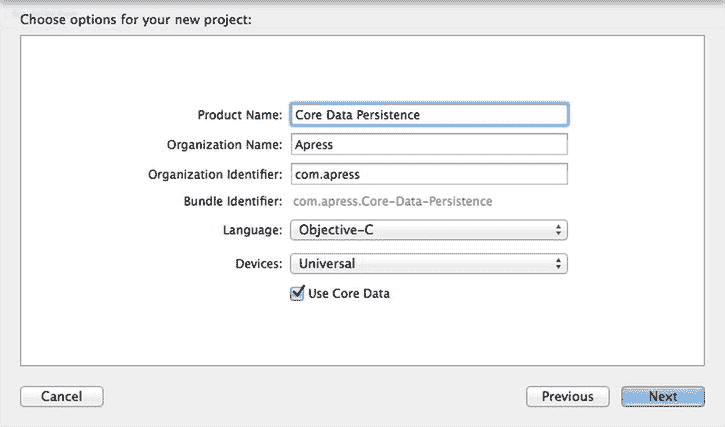
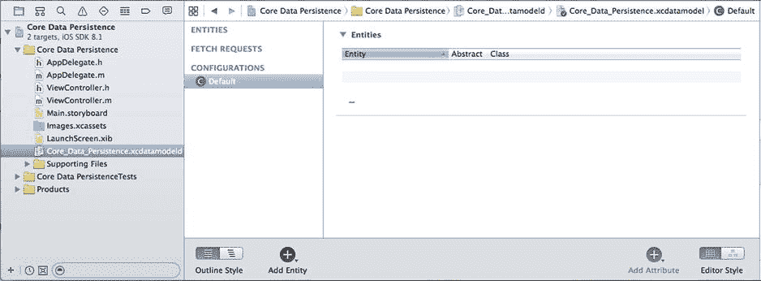
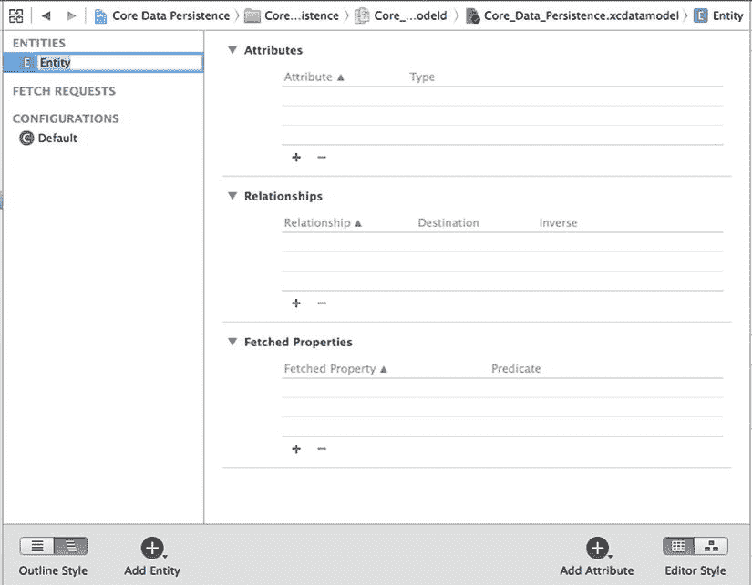
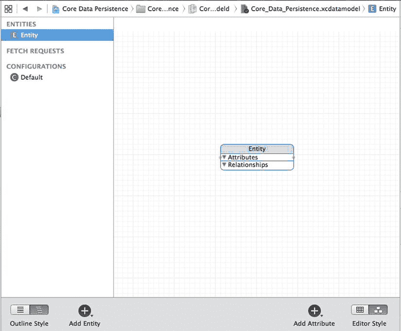
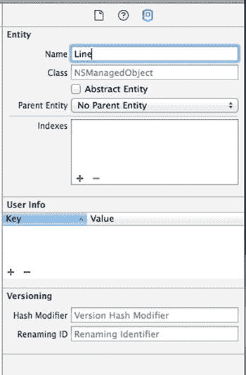
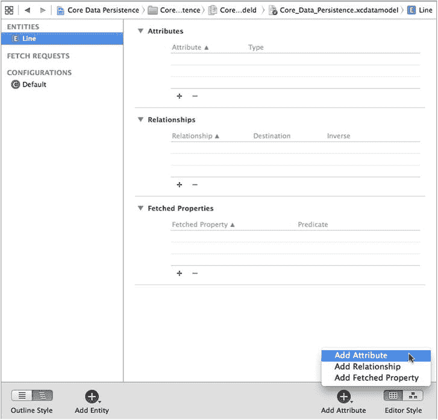

# 核心数据持久化

本章要演示的最后一项技术是如何使用苹果的 Core Data 框架实现持久化。Core Data 是一个健壮且功能完备的持久化工具。在这里，我们将向你展示如何使用 Core Data 重新创建你在我们的 Persistence 应用中所看到的相同持久化功能。

**注意** 如需更全面地了解 Core Data，请参考 Michael Privet 和 Robert Warner 所著的 *Pro iOS Persistence: Using Core Data*（Apress，2014 年）。

在 Xcode 中，创建一个新项目。从 **iOS** 部分选择 **Single View Application** 模板，然后点击 **Next**。将产品命名为 *Core Data Persistence*，并从 **Devices** 控件中选择 **Universal**；但先不要点击 **Next** 按钮。如果你仔细查看 **Devices** 控件下方，会看到一个标有 **Use Core Data** 的复选框。将 Core Data 添加到现有项目中涉及一定的复杂性，因此苹果贴心地为某些应用项目模板提供了一个选项，以帮你完成大部分工作。

勾选 **Use Core Data** 复选框（见图 13-7），然后点击 **Next** 按钮。当系统提示时，选择一个目录来存储你的项目，然后点击 **Create**。



图 13-7. 部分项目模板（包括 Single View Application）提供了使用 Core Data 进行持久化的选项

在继续编写代码之前，我们先来看一下项目窗口，其中包含一些新内容。如果 *Core Data Persistence* 文件夹是关闭的，请将其展开（见图 13-8）。



图 13-8. 我们的项目模板，包含了 Core Data 所需的文件。Core Data 模型已被选中，编辑窗格中显示的是数据模型编辑器

### 实体与托管对象

你在项目导航器中看到的大部分内容应该都很熟悉：应用代理和图片资源目录。此外，你还会找到一个名为 *Core_Data_Persistence.xcdatamodeld* 的文件，它包含了我们的数据模型。在 Xcode 中，Core Data 让我们无需编写代码就能可视地设计数据模型，并将该数据模型存储在 `*.xcdatamodeld*` 文件中。

现在单击 `*.xcdatamodeld*` 文件，你将看到 **数据模型编辑器**（参见图 13-8 的右侧）。根据项目窗口右下角 **Editor Style** 控件的设置，数据模型编辑器会提供两种不同的视图来查看你的数据模型。在表模式下（即图 13-8 所示的模式），构成数据模型的元素将显示在一系列可编辑的表格中。在图形模式下，你将看到相同元素的图形化展示。目前，两种视图都反映的是同一个空数据模型。

在 Core Data 出现之前，创建数据模型的传统方式是创建 `NSObject` 的子类，并使其遵循 `NSCoding` 和 `NSCopying` 协议，以便能够进行归档，就像我们在本章前面所做的那样。Core Data 采用了一种根本不同的方法。它不是使用类，而是首先在数据模型编辑器中创建 **实体**；然后，在你的代码中，你会基于这些实体创建 **托管对象**。

**注意** 术语 *实体* 和 *托管对象* 可能有些令人困惑，因为它们都指代数据模型对象。*实体* 指的是对象的描述。*托管对象* 指的是在运行时创建的实际具体实例。因此，在数据模型编辑器中，你创建的是实体；而在代码中，你创建和检索的是托管对象。实体和托管对象之间的区别类似于类与其实例之间的区别。

一个实体由属性（properties）组成。共有三种类型的属性：

*   **属性（Attributes）**：在 Core Data 实体中，属性的功能与 Objective-C 类中的实例变量相同。它们都用于保存数据。
*   **关系（Relationships）**：顾名思义，关系定义了实体之间的联系。例如，要创建一个 `Person` 实体，你可以先定义一些属性，比如 `hairColor`、`eyeColor`、`height` 和 `weight`。你也可以定义地址属性，比如 `state` 和 `zipCode`，或者将它们嵌入到一个单独的 `HomeAddress` 实体中。如果采用后一种方法，你还需要在 `Person` 和 `HomeAddress` 之间创建一个关系。关系可以是 **一对一** 或 **一对多**。`Person` 到 `HomeAddress` 的关系可能是一对一，因为大多数人只有一个家庭地址。而 `HomeAddress` 到 `Person` 的关系可能是一对多，因为同一个 `HomeAddress` 可能住着多个 `Person`。
*   **获取属性（Fetched properties）**：获取属性是关系的一种替代方案。获取属性允许你创建一个在获取时评估的查询，以确定哪些对象属于该关系。为了扩展我们之前的例子，一个 `Person` 对象可以有一个名为 `Neighbors` 的获取属性，该属性用于查找数据存储中所有与该 `Person` 自身的 `HomeAddress` 具有相同邮政编码的 `HomeAddress` 对象。由于获取属性的构建和使用方式，它们始终是单向关系。获取属性也是唯一一种允许你跨越多个数据存储进行遍历的关系类型。

通常，属性、关系和获取属性是使用 Xcode 的数据模型编辑器来定义的。在我们的 Core Data Persistence 应用中，我们将构建一个简单的实体，这样你就能了解这一切是如何协同工作的。

### 键值编码

在你的代码中，你将使用 **键值编码** 来设置属性或检索其现有值，而不是使用访问器和修改器。键值编码听起来可能有点吓人，但你在本书中已经大量使用过它了。例如，每次我们使用 `NSDictionary` 时，其实就是在使用一种键值编码形式，因为字典中的每个对象都存储在一个唯一的键值下。Core Data 使用的键值编码比 `NSDictionary` 使用的要复杂一些，但基本概念是相同的。

在处理托管对象时，用于设置或检索属性值的键就是你要设置的属性名称。因此，以下是从托管对象中检索名为 `name` 的属性值的方法：

```
NSString *name = [myManagedObject valueForKey:@"name"];
```

类似地，要设置托管对象属性的新值，可以这样做：

```
[myManagedObject setValue:@"Gregor Overlander" forKey:@"name"];
```

### 将所有内容置于上下文中

那么这些托管对象存在于何处呢？它们存在于所谓的 **持久化存储** 中，也称为 **后备存储**。持久化存储可以有多种不同的形式。默认情况下，Core Data 应用会将后备存储实现为应用 *Documents* 目录中的一个 SQLite 数据库。即使你的数据是通过 SQLite 存储的，Core Data 框架中的类也会负责加载和保存数据的所有相关工作。如果你使用 Core Data，就无需编写任何你在 SQLite Persistence 应用中看到的 SQL 语句。你只需处理对象，Core Data 会在幕后处理它需要做的事情。

SQLite 并不是 Core Data 存储的唯一选项。后备存储也可以实现为二进制平面文件，甚至以 XML 格式存储。另一种选择是创建内存存储，如果你正在编写缓存机制，可能会用到它；但它不会在本次会话结束后保存数据。在绝大多数情况下，你只需保留默认设置，使用 SQLite 作为你的持久化存储即可。


尽管大多数应用程序只有一个持久存储，但在同一个应用程序中也可以有多个持久存储。如果你对备份存储是如何创建和配置的感到好奇，可以查看 Xcode 项目中的`AppDelegate.m`文件。我们选择的 Xcode 项目模板提供了设置应用程序单个持久存储所需的所有代码。

除了创建持久存储（这已在应用程序委托中为你处理），你通常不会直接与持久存储交互。相反，你将使用一个称为**托管对象上下文**（通常简称为**上下文**）的东西。上下文管理对持久存储的访问，并维护自上次保存对象以来哪些属性已更改的信息。上下文还会向**撤销管理器**注册所有更改，这意味着你始终可以撤销单个更改，或一直回滚到最后一次保存数据的状态。

**注意**：你可以有多个上下文指向同一个持久存储，尽管大多数 iOS 应用程序只会使用一个。

许多 Core Data 方法调用需要`NSManagedObjectContext`作为参数，或者必须针对一个上下文执行。除了更复杂的、多线程的 iOS 应用程序外，你只需使用应用程序委托提供的`managedObjectContext`属性即可，这是一个为你自动创建的默认上下文，同样归功于 Xcode 项目模板。

你可能注意到，除了托管对象上下文和持久存储协调器之外，提供的应用程序委托还包含一个`NSManagedObjectModel`实例。该类负责在运行时加载和表示你将使用 Xcode 中的数据模型编辑器创建的数据模型。你通常不需要直接与这个类交互。它由其他 Core Data 类在幕后使用，以便它们能识别你在数据模型中定义了哪些实体和属性。只要你使用提供的文件创建数据模型，就完全不必担心这个类。

### 创建新的托管对象

创建托管对象的新实例相当容易，尽管不像使用`alloc`和`init`创建普通对象实例那样直接。相反，你使用`NSEntityDescription`类中的工厂方法`insertNewObjectForEntityForName:inManagedObjectContext:`。`NSEntityDescription`的工作是跟踪应用程序数据模型中定义的所有实体，并允许你创建这些实体的实例。此方法创建并返回一个内存中代表单个实体的实例。它返回一个`NSManagedObject`实例，该实例为该特定实体设置了正确的属性；或者，如果你已将实体配置为用`NSManagedObject`的特定子类实现，则返回该类的实例。请记住，实体就像类。实体是对对象的描述，并定义了特定实体具有哪些属性。

要创建新对象，请执行以下操作：

```
NSManagedObject *thing = [NSEntityDescription
                          insertNewObjectForEntityForName:@"Thing"
                                   inManagedObjectContext:context];
```

该方法被称为`insertNewObjectForEntityForName:inManagedObjectContext:`，因为除了创建对象之外，它还将新创建的对象插入到上下文中，然后返回该对象。在这次调用之后，对象存在于上下文中，但尚未成为持久存储的一部分。该对象将在下次调用托管对象上下文的`save:`方法时被添加到持久存储中。

### 检索托管对象

要从持久存储中检索托管对象，你将使用**获取请求**，这是 Core Data 处理预定义查询的方式。例如，你可能会说：“给我所有`eyeColor`为`blue`的`Person`。”

首先创建一个获取请求，然后为其提供一个`NSEntityDescription`，该描述指定了你希望检索的一个或多个对象的实体。以下是一个创建获取请求的示例：

```
NSFetchRequest *request = [[NSFetchRequest alloc] init];
NSEntityDescription *entityDescr = [NSEntityDescription
    entityForName:@"Thing" inManagedObjectContext:context];
[request setEntity:entityDescr];
```

可选地，你还可以使用`NSPredicate`类为获取请求指定条件。**谓词**类似于 SQL 的`WHERE`子句，允许你定义用于确定获取请求结果的条件。以下是一个谓词的简单示例：

```
NSPredicate *pred =
    [NSPredicate predicateWithFormat:@"(name = %@)", nameString];
[request setPredicate: pred];
```

第一行代码创建的谓词告诉获取请求，不要检索指定实体的所有托管对象，只需获取那些`name`属性设置为`nameString`变量中当前值的对象。因此，如果`nameString`是一个值为`@"Bob"`的`NSString`，我们就是在告诉获取请求只返回那些`name`属性设置为`"Bob"`的托管对象。这是一个简单的示例，但谓词可以非常复杂，并可以使用布尔逻辑来指定大多数情况下你可能需要的精确条件。

**注意**：*Learn Objective-C on the Mac,* 2nd Edition, by Scott Knaster, Waqar Maliq, and Mark Dalrymple (Apress, 2012) 有一整章专门介绍`NSPredicate`的使用。

创建好获取请求，为其提供实体描述，并可选地为其提供谓词后，你可以使用`NSManagedObjectContext`上的实例方法**执行**该获取请求：

```
NSError *error;
NSArray *objects = [context executeFetchRequest:request error:&error];
if (objects == nil) {
    // handle error
}
```

`executeFetchRequest:error:` 将从持久存储中加载指定的对象，并将它们返回到一个数组中。如果遇到错误，你将得到一个`nil`数组，并且你提供的错误指针将指向一个描述具体问题的`NSError`对象。如果没有发生错误，你将得到一个有效的数组，尽管它可能不包含任何对象，因为可能没有对象满足指定的条件。从此时起，你对返回数组中的托管对象所做的任何更改，都将由你执行请求的托管对象上下文跟踪，并在你向该上下文发送`save:`消息时保存。

### Core Data 应用程序

现在我们来实际操作一下 Core Data。首先，我们将注意力转回 Xcode 并创建我们的数据模型。

#### 设计数据模型

选择`Core_Data_Persistence.xcdatamodel`以打开 Xcode 的数据模型编辑器。数据模型编辑窗格显示了数据模型中包含的所有实体、获取请求和配置。

**注意**：Core Data 的**配置**概念允许你定义数据模型中包含的实体的一个或多个命名子集，这在某些情况下非常有用。例如，如果你想创建一套共享同一数据模型的应用程序，但某些应用程序不应访问所有内容（可能有一个面向普通用户的应用程序和另一个面向管理员的应用程序），这种方法可以实现这一点。你还可以在单个应用程序中使用多个配置，因为它在不同的操作模式之间切换。在本书中，我们不打算处理配置；但由于配置列表（包括包含模型中所有内容的单个默认配置）就摆在那里，在实体和获取请求下方，我们认为这里值得一提。


如图 13-8 所示，这些列表目前为空，因为我们尚未创建任何内容。点击编辑器窗格左下角标有**添加实体**的加号图标即可解决此问题。这将创建一个名为*Entity*的全新实体（见图 13-9）。



图 13-9。数据模型编辑器，显示我们新添加的实体

在构建数据模型时，你可能会发现自己经常使用编辑区域右下角的**编辑器样式**控制在表视图和图形视图之间切换。现在请切换到图形视图。图形视图会显示一个代表我们实体的小方框，其中包含展示实体属性和关系的区域，目前也是空的（见图 13-10）。当模型包含多个实体时，图形视图非常有用，因为它能以图形方式展示实体间的所有关系。



图 13-10。通过使用右下角的控制按钮，我们将数据模型编辑器切换到了图形模式。请注意，图形模式显示与表模式相同的实体，只是采用了图形形式。当存在多个相互关联的实体时，这种模式尤为有用。

**注意** 如果你偏好图形化操作，完全可以在图形视图中构建整个模型。不过本章我们将沿用表视图，因为这样更易于讲解。在创建自己的数据模型时，如果图形视图更适合你，请随意使用。

无论你使用表视图还是图形视图设计数据模型，几乎都需要调出 Core Data 数据模型检查器。该检查器允许你查看和编辑数据模型编辑器中选中项的相关细节——无论是实体、属性、关系还是其他内容。没有数据模型检查器也能浏览现有模型，但要真正处理模型，你必然需要用到这个检查器，就像编辑 nib 文件时频繁使用属性检查器一样。

按下 `Command+Option+3` 打开数据模型检查器。此时，检查器显示的是刚添加实体的信息。我们模型中的这个实体对应 GUI 上的一行数据，因此将其命名为 *Line*。将**名称**字段从 *Entity* 改为 *Line*（见图 13-11）。



图 13-11。使用数据模型检查器将实体名称更改为 Line

如果你当前处于图形视图，请使用**编辑器样式**控制切换到表视图。表视图能显示实体各部分更详细的信息，因此在创建新实体时通常比图形视图更实用。在表视图中，数据模型编辑器的大部分区域被展示实体属性、关系和已获取属性的表格占据。这正是我们设置实体的地方。

请注意，编辑区域右下角，在编辑器样式控制旁边，有一个标有**添加属性**的加号图标。选中实体后，按住鼠标按钮悬停在此控件上，会弹出一个菜单，允许你向实体添加属性、关系或已获取属性（见图 13-12）。



图 13-12。选定实体后，按住右侧的加号图标可向实体添加属性、关系或已获取属性

**注意**  请注意，添加属性时无需长按。直接点击加号图标即可获得相同效果。快捷键！

继续使用此方法向 Line 实体添加一个属性。表中属性的部分会新增一个名为*attribute*的属性，并自动选中。在表格中，你不仅能看到行被选中，属性的名称也被选中。这意味着点击加号后，无需再点击即可直接输入新属性的名称。

将新属性的名称从 *attribute* 改为 `lineNumber`，然后点击名称旁边的弹出菜单，将其类型从 *Undefined* 改为 *Integer 16*。这样做可以将此属性改为存储整数值。我们将使用此属性来标识托管对象的四个字段中哪个包含数据。由于只有四个选项，我们选择了可用的最小整数类型。

现在将注意力转向编辑区域右侧窗格中的数据模型检查器。在这里可以配置更多细节。右侧**名称**字段下方的**可选**复选框默认是选中的。点击取消勾选。我们不希望此属性是可选的——因为不对应界面标签的行是没有意义的。

勾选**瞬态**复选框可创建瞬态属性。此属性用于指定应用运行时托管对象持有的值，但永远不会保存到数据存储中。我们希望行号能够保存到数据存储中，因此保持**瞬态**复选框未选中。

勾选**已索引**复选框会在底层 SQL 数据库中为存储此属性数据的列创建索引。保持**已索引**复选框未选中。由于数据量很小，我们也不会为用户提供搜索功能，因此无需索引。

在其下方还有更多设置，允许我们通过指定整数的最小值和最大值、默认值等来进行简单的数据验证。在本示例中，我们不会使用任何这些设置。

现在确保 Line 实体被选中，点击**添加属性**控件来添加第二个属性。将新属性的名称改为 `lineText`，类型改为 *String*。此属性将存储文本字段中的实际数据。为此属性保持**可选**复选框的选中状态；用户完全可能不输入某个字段的值。

**注意**  将类型改为 *String* 后，你会注意到检查器显示了一组略有不同的选项，用于设置默认值或限制字符串长度。虽然在本应用中不会使用这些选项，但知晓它们的存在还是不错的。

猜猜看？你的数据模型已经完成了。就是这么简单。Core Data 让你通过点击就能创建应用数据模型。让我们完成应用的构建，这样你就能看到如何在代码中使用我们的数据模型。

#### 创建持久化视图

选择 `ViewController.m` 并进行以下修改：

```objectivec
#import "ViewController.h"

@interface ViewController ()

@property (strong, nonatomic) IBOutletCollection(UITextField) NSArray *lineFields;

@end
```

保存此文件。接下来，选择 `Main.storyboard` 在 Interface Builder 中编辑 GUI。按照本章前面“设计持久化应用视图”部分中的说明设计视图并连接输出口集合。也可以参考图 13-5。设计完成后，保存 storyboard 文件。

现在回到 `ViewController.m`，进行以下修改：

```objectivec
#import "ViewController.h"
#import "AppDelegate.h"
```


```objc
static NSString * const kLineEntityName = @"Line";
static NSString * const kLineNumberKey = @"lineNumber";
static NSString * const kLineTextKey = @"lineText";

@interface ViewController ()

@property (strong, nonatomic) IBOutletCollection(UITextField) NSArray *lineFields;

@end

@implementation ViewController

- (void)viewDidLoad {
    [super viewDidLoad];
    // 加载视图后执行任何额外设置，通常从 nib 文件加载。

    AppDelegate *appDelegate = [UIApplication sharedApplication].delegate;
    NSManagedObjectContext *context = [appDelegate managedObjectContext];
    NSFetchRequest *request = [[NSFetchRequest alloc] initWithEntityName:kLineEntityName];

    NSError *error;
    NSArray *objects = [context executeFetchRequest:request error:&error];
    if (objects == nil) {
        NSLog(@"出现错误！");
        // 执行适当的错误处理
    }

    for (NSManagedObject *oneObject in objects) {
        int lineNum = [[oneObject valueForKey:kLineNumberKey] intValue];
        NSString *lineText = [oneObject valueForKey:kLineTextKey];

        UITextField *theField = self.lineFields[lineNum];
        theField.text = lineText;
    }

    UIApplication *app = [UIApplication sharedApplication];
    [[NSNotificationCenter defaultCenter] addObserver:self
                                             selector:@selector(applicationWillResignActive:)
                                                 name:UIApplicationWillResignActiveNotification
                                               object:app];
}

- (void)applicationWillResignActive:(NSNotification *)notification {
    AppDelegate *appDelegate = [UIApplication sharedApplication].delegate;
    NSManagedObjectContext *context = [appDelegate managedObjectContext];
    NSError *error;
    for (int i = 0; i < 4; i++) {
        UITextField *theField = self.lineFields[i];

        NSFetchRequest *request = [[NSFetchRequest alloc] initWithEntityName:kLineEntityName];
        NSPredicate *pred = [NSPredicate predicateWithFormat:@"(%K = %d)", kLineNumberKey, i];
        [request setPredicate:pred];

        NSArray *objects = [context executeFetchRequest:request error:&error];
        if (objects == nil) {
            NSLog(@"出现错误！");
            // 执行适当的错误处理
        }

        NSManagedObject *theLine = nil;
        if ([objects count] > 0) {
            theLine = [objects objectAtIndex:0];
        } else {
            theLine = [NSEntityDescription insertNewObjectForEntityForName:kLineEntityName
                                                    inManagedObjectContext:context];
        }

        [theLine setValue:[NSNumber numberWithInt:i] forKey:kLineNumberKey];
        [theLine setValue:theField.text forKey:kLineTextKey];
    }
    [appDelegate saveContext];
}

- (void)didReceiveMemoryWarning {
    [super didReceiveMemoryWarning];
    // 处理可重新创建的资源。
}

@end
```

现在来看`viewDidLoad`方法，它需要检查持久化存储中是否已有现有数据。如果有，则应加载数据并用其填充文本字段。在该方法中，我们首先获取应用委托的引用，然后用它来获取为我们创建的托管对象上下文：

```objc
AppDelegate *appDelegate = [UIApplication sharedApplication].delegate;
NSManagedObjectContext *context = [appDelegate managedObjectContext];
```

接下来的任务是创建一个获取请求，并传入实体名称，以便它知道要检索哪种类型的对象：

```objc
NSFetchRequest *request = [[NSFetchRequest alloc] initWithEntityName:kLineEntityName];
```

由于我们要检索持久化存储中的所有`Line`对象，因此不创建谓词。通过执行不带谓词的请求，我们告诉上下文返回存储中的每一个`Line`对象。我们确保返回的是有效数组，如果未返回则记录日志：

```objc
NSError *error;
NSArray *objects = [context executeFetchRequest:request error:&error];
if (objects == nil) {
    NSLog(@"出现错误！");
    // 执行适当的错误处理
}
```

接下来，我们使用快速枚举遍历检索到的托管对象数组，从每个托管对象中提取`lineNum`和`lineText`值，并利用这些信息更新用户界面中的一个文本字段：

```objc
for (NSManagedObject *oneObject in objects) {
    int lineNum = [[oneObject valueForKey:kLineNumberKey] intValue];
    NSString *lineText = [oneObject valueForKey:kLineTextKey];

    UITextField *theField = self.lineFields[lineNum];
    theField.text = lineText;
}
```

然后，与本章所有其他应用一样，我们注册通知，以便在应用即将退出活动状态时（无论是被移至后台还是完全退出）接收通知，从而保存用户对数据所做的任何更改：

```objc
UIApplication *app = [UIApplication sharedApplication];
[[NSNotificationCenter defaultCenter] addObserver:self
                                         selector:@selector(applicationWillResignActive:)
                                             name:UIApplicationWillResignActiveNotification
                                           object:app];
```

接下来看`applicationWillResignActive:`。我们以与上一个方法相同的方式开始：获取应用委托的引用，并用它获取指向应用默认上下文的指针：

```objc
AppDelegate *appDelegate = [UIApplication sharedApplication].delegate;
NSManagedObjectContext *context = [appDelegate managedObjectContext];
```

之后，我们进入一个循环，该循环执行四次，每个文本字段一次，然后获取对正确字段的引用：

```objc
for (int i = 0; i < 4; i++) {
    UITextField *theField = self.lineFields[i];
```

接下来，我们为`Line`条目创建获取请求。我们需要判断持久化存储中是否已存在对应于该字段的托管对象，因此我们创建一个谓词，通过使用文本字段的索引作为记录键来标识该字段的正确对象：

```objc
NSFetchRequest *request = [[NSFetchRequest alloc] initWithEntityName:kLineEntityName];
NSPredicate *pred = [NSPredicate predicateWithFormat:@"(%K = %d)", kLineNumberKey, i];
[request setPredicate:pred];
```

现在，我们针对上下文执行获取请求，并检查`objects`是否不为`nil`。如果为`nil`，则表示出现错误，我们应该执行应用所需的任何错误检查。对于这个简单的应用，我们仅记录错误并继续：

```objc
NSArray *objects = [context executeFetchRequest:request error:&error];
if (objects == nil) {
    NSLog(@"出现错误！");
    // 执行适当的错误处理
}
```

之后，我们声明一个指向`NSManagedObject`的指针并将其设置为`nil`。我们这样做是因为我们尚不清楚是要从持久化存储中获取一个托管对象，还是要创建一个新的托管对象。为此，我们检查是否有匹配条件的对象被返回。如果有，则加载它；如果没有，则创建一个新的托管对象来保存该字段的文本：

```objc
NSManagedObject *theLine = nil;
if ([objects count] > 0) {
    theLine = [objects objectAtIndex:0];
} else {
    theLine = [NSEntityDescription insertNewObjectForEntityForName:kLineEntityName
                                            inManagedObjectContext:context];
}
```

接下来，我们使用键值编码为这个托管对象设置行号和文本：

```objc
[theLine setValue:[NSNumber numberWithInt:i] forKey:kLineNumberKey];
[theLine setValue:theField.text forKey:kLineTextKey];
```

最后，循环结束后，我们告诉上下文保存其更改：

```objc
[appDelegate saveContext];
```

就是这样！构建并运行应用，确保其正常工作。你应用的 Core Data 版本的行为应与之前版本完全相同。


