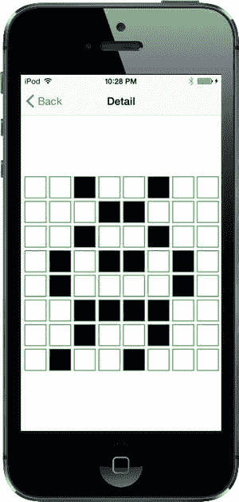
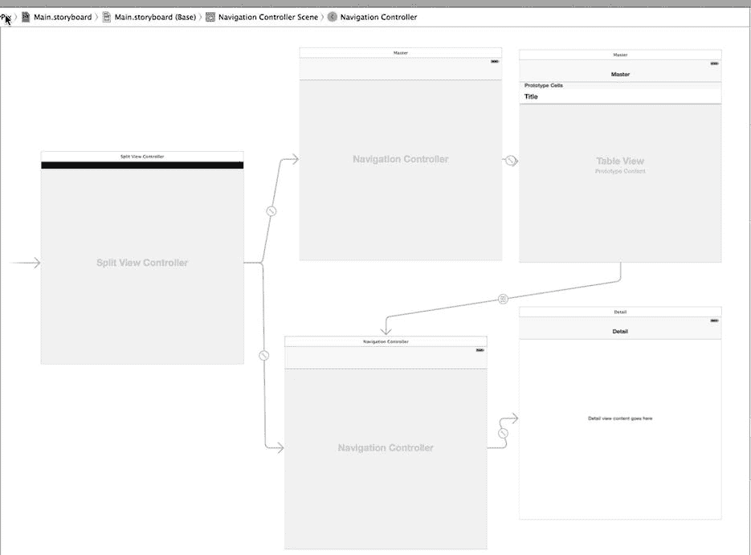
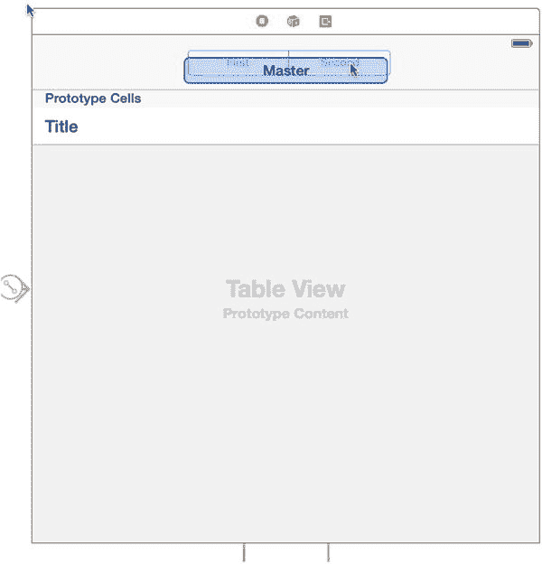
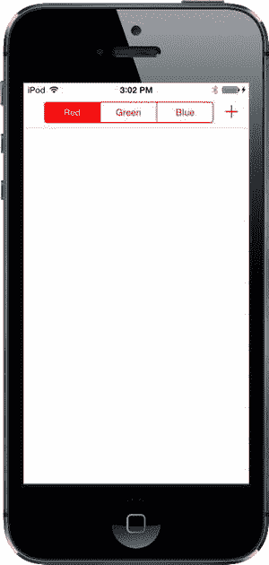

# 第 14 章：文档与 iCloud

过去几年中，iOS 新增的最大特色之一是苹果的 iCloud 服务，它为 iOS 设备以及运行 OS X 的电脑提供云存储服务。大多数 iOS 用户可能会在设置新设备或将旧设备升级到更新的 iOS 版本时，立即遇到 iCloud 设备备份选项。他们会很快发现无需使用电脑的自动备份的优势。

免电脑备份是一个很棒的功能，但这只是 iCloud 能力的冰山一角。iCloud 更重要的功能可能是，它为应用开发者提供了一种机制，可以用很少的工作量将数据透明地保存到苹果的云服务器。你可以让应用将数据保存到 iCloud，并让这些数据自动传输到登录同一 iCloud 用户的其他设备。用户可以在 iPad 上创建文档，随后在 iPhone 或 Mac 上查看同一文档，无需任何中间步骤；文档就这样出现了。

系统进程会负责确保用户拥有有效的 iCloud 登录并管理文件传输，因此你无需担心网络或身份验证问题。除了少量应用配置外，只需对保存文件和定位可用文件的方法稍作修改，就能让你的应用顺利支持 iCloud。

iCloud 文件系统的一个关键组件是 `UIDocument` 类。`UIDocument` 通过处理读写文件的一些常见方面，减轻了创建基于文档应用的部分工作。这样，你可以将更多时间专注于应用的独特功能，而不是为每个应用重复构建相同的基础框架。

无论你是否使用 iCloud，`UIDocument` 都为在 iOS 中管理文档文件提供了一些强大的工具。为了演示这些功能，本章的第一部分将专门创建 TinyPix，一个将文件保存到本地存储的简单文档应用。这种方法适用于各种基于 iOS 的应用。

在本章的后半部分，我们将向你展示如何让 TinyPix 支持 iCloud。为此，你需要准备一台或多台连接了 iCloud 的 iOS 设备。你还需要一个付费的 iOS 开发者账户，以便在设备上安装应用。这是因为在模拟器中运行的应用无法访问 iCloud 服务。

## 使用 UIDocument 管理文档存储

任何不仅在网页上冲浪、还使用过台式电脑的人，可能都接触过基于文档的应用。从 TextEdit 到 Microsoft Word，从 GarageBand 到 Xcode，任何允许你处理多个数据集合、并将每个集合保存到单独文件的软件，都可以被视为基于文档的应用。通常，屏幕上的窗口与其包含的文档之间存在一一对应的关系；然而，有时（例如 Xcode），单个窗口可以显示多个以某种方式相互关联的文档。

在 iOS 设备上，我们无法拥有多个窗口，但仍有大量应用可以从基于文档的方法中受益。现在，iOS 开发者有了一点助力——这要归功于 `UIDocument` 类，它处理了文档文件存储中最常见的方面。你无需直接处理文件（只需使用 URL），所有必要的读写操作都在后台线程中进行，因此即使在文件访问期间，你的应用也能保持响应。它还会定期以及在应用挂起时（例如设备关机、按下 `Home` 按钮等）自动保存已编辑的文档，因此无需任何保存按钮。所有这些都有助于让你的应用表现得像用户所期望的 iOS 应用那样。

## 构建 TinyPix

我们将构建一个名为 TinyPix 的应用，让你可以编辑简单的 8 × 8 图像，使用华丽的 1 位颜色（见图 14-1）！为了方便用户，每张图片都会被放大到全屏尺寸进行编辑。当然，我们将使用 `UIDocument` 来表示每张图像的数据。



图 14-1. 在 TinyPix 中编辑一个极低分辨率的图标

首先在 Xcode 中创建一个新项目。从 `iOS` `Application` 部分，选择 `Master-Detail Application` 模板，然后点击 `Next`。将这个新应用命名为 *TinyPix*，并将 `Devices` 弹出菜单设置为 `Universal`。确保 `Use Core Data` 复选框未选中。现在再次点击 `Next`，并选择保存项目的位置。

在 Xcode 的项目导航器中，你会看到项目包含 `AppDelegate`、`MasterViewController` 和 `DetailViewController` 的文件，以及 *Main.storyboard* 文件。我们将对这些文件进行修改，同时还会创建几个新类。

### 创建 TinyPixDocument

我们要创建的第一个新类是文档类，它将包含从文件存储中加载的每个 TinyPix 图像的数据。在 Xcode 中选择 *TinyPix* 文件夹，然后按 `N` 创建一个新文件。从 `iOS` 部分选择 `Cocoa Touch Class`，然后点击 `Next`。在 `Class` 字段中输入 `TinyPixDocument`，在 `Subclass of` 字段中输入 `UIDocument`，然后点击 `Next`。最后，点击 `Create` 创建文件。

在深入了解其实现细节之前，让我们先思考一下这个类的公共 API。这个类将表示一个 8 × 8 的像素网格，其中每个像素由单个开或关值组成。因此，让我们提供一个方法，该方法接受行和列索引对，并返回一个 `BOOL` 值。我们还要提供一个方法，用于在指定的行和列设置特定状态，并且为了方便，再提供一个方法，用于简单地切换特定位置的状态。

选择 *TinyPixDocument.h* 来编辑新类的头文件。添加以下粗体行：

```objc
#import <UIKit/UIKit.h>

@interface TinyPixDocument : UIDocument

// 行和列的范围为 0 到 7
- (BOOL)stateAtRow:(NSUInteger)row column:(NSUInteger)column;
- (void)setState:(BOOL)state atRow:(NSUInteger)row column:(NSUInteger)column;
- (void)toggleStateAtRow:(NSUInteger)row column:(NSUInteger)column;

@end
```


现在切换到`TinyPixDocument.m`，我们将在其中实现 8×8 网格的存储、公共 API 中定义的方法，以及加载和保存文档所需的`UIDocument`方法。

首先定义 8×8 位图数据的存储。我们将数据保存在`NSMutableData`实例中，这允许我们直接操作包含在对象内部的字节数据数组，这样在完成数据操作后，通常的 Cocoa 内存管理会负责释放内存。添加这个类扩展来实现：

```objective-c
#import "TinyPixDocument.h"

@interface TinyPixDocument ()

@property (strong, nonatomic) NSMutableData *bitmap;

@end

@implementation TinyPixDocument
```

`UIDocument`类有一个所有子类都应使用的指定初始化方法。我们将在这里创建初始位图。采用真正的位图风格，我们通过每个字节包含一行来最小化内存使用。字节中的每个位代表该行中某列的开关值。总共，我们的文档只包含 8 个字节。

**注意**：本节包含少量位运算，以及一些 C 指针和数组操作。对于 C 开发者来说这些很平常；但如果你 C 语言经验不足，可能会觉得困惑甚至难以理解。如果这样，请直接复制并使用提供的代码（它们工作得很好）。如果你真想理解原理，可能需要更深入学习 C 语言，比如在你的书架上添加 Dave Mark（Apress, 2009）的《在 Mac 上学习 C》这本书。

将这个方法添加到文档的实现中，放在文件底部`@end`的上方：

```objective-c
- (id)initWithFileURL:(NSURL *)url {
    self = [super initWithFileURL:url];
    if (self) {
        unsigned char startPattern[] = {
            0x01,
            0x02,
            0x04,
            0x08,
            0x10,
            0x20,
            0x40,
            0x80
        };
        self.bitmap = [NSMutableData dataWithBytes:startPattern length:8];
    }
    return self;
}
```

这将每个位图初始化为一个从一角延伸到另一角的简单对角线图案。

现在，实现我们在头文件中定义的公共 API 方法。首先处理读取单个位状态的方法。它从字节数组中获取相关字节，然后执行位移和`AND`操作来确定指定的位是否被设置，并相应地返回`YES`或`NO`。在`@end`上方添加这个方法：

```objective-c
- (BOOL)stateAtRow:(NSUInteger)row column:(NSUInteger)column {
    const char *bitmapBytes = [self.bitmap bytes];
    char rowByte = bitmapBytes[row];
    char result = (1 << column) & rowByte;
    if (result != 0) {
        return YES;
    } else {
        return NO;
    }
}
```

接下来是逆操作：一个设置指定行和列值的方法。这里，我们再次获取指定行的相关字节并进行位移。但这次，我们不使用位移后的位来检查行的内容，而是用它来设置或清除行中的位。在`@end`上方添加这个方法：

```objective-c
- (void)setState:(BOOL)state atRow:(NSUInteger)row column:(NSUInteger)column {
    char *bitmapBytes = [self.bitmap mutableBytes];
    char *rowByte = &bitmapBytes[row];
    if (state) {
        *rowByte = *rowByte | (1 << column);
    } else {
        *rowByte = *rowByte & ~(1 << column);
    }
}
```

现在，添加一个便捷方法，让外部代码可以简单地切换单个单元格：

```objective-c
- (void)toggleStateAtRow:(NSUInteger)row column:(NSUInteger)column {
    BOOL state = [self stateAtRow:row column:column];
    [self setState:!state atRow:row column:column];
}
```

我们的文档类需要最后两个部分才能融入基于文档的应用程序：读取和写入的方法。正如我们之前提到的，你不需要直接处理文件。你甚至不需要关心之前传递给`initWithFileURL:`方法的 URL。你需要做的只是实现一个将文档数据结构转换为`NSData`对象（准备保存）的方法，以及另一个从新加载的`NSData`对象中提取数据结构的方法。因为文档的内部结构已经包含在`NSMutableData`对象中（它是`NSData`的子类），这些实现非常简单。在`@end`上方添加这两个方法：

```objective-c
- (id)contentsForType:(NSString *)typeName error:(NSError **)outError {
    NSLog(@"saving document to URL %@", self.fileURL);
    return [self.bitmap copy];
}

- (BOOL)loadFromContents:(id)contents ofType:(NSString *)typeName
        error:(NSError **)outError {
    NSLog(@"loading document from URL %@", self.fileURL);
    self.bitmap = [contents mutableCopy];
    return true;
}
```

第一个方法`contentsForType:error:`在文档即将保存到存储时被调用。它只返回位图数据的不可变副本，系统稍后会负责存储。

第二个方法`loadFromContents:ofType:error:`在系统刚加载存储数据并希望将这些数据提供给文档类实例时被调用。这里，我们只是获取传入数据的可变副本。我们包含了一些日志语句，以便稍后可以在 Xcode 日志中看到发生了什么。

每个方法都允许你做一些我们在本应用中忽略的事情。它们都提供了一个`typeName`参数，你可以用它来区分文档可以加载或保存的不同数据类型。它们还有一个`outError`参数，你可以用它来指定在数据复制到或从文档的内存数据结构时发生的错误。但在我们的案例中，由于操作非常简单，这些都不是重要问题。

这就是文档类所需的全部内容。遵循 MVC 原则，我们的文档完全位于模型阵营，不关心如何显示。多亏了`UIDocument`父类，文档甚至屏蔽了大部分关于如何存储的细节。

**代码大师**

现在我们的文档类已经准备好，接下来要处理用户运行应用时看到的第一个视图：现有 TinyPix 文档的列表，这由`MasterViewController`类负责。我们需要让这个类知道如何获取可用文档列表，让用户选择现有文档进行查看或编辑，以及创建和命名新文档。当文档被创建或选择后，它会被传递给详情控制器进行显示。

首先选择`MasterViewController.m`。这个文件作为主-从应用程序模板的一部分生成，包含用于显示数组项的起始代码。我们不会使用这些代码，而是自己完成所有工作。因此，删除`@implementation`块中的所有方法以及顶部类扩展中的所有声明。完成后，你应该得到一个干净的起始点，看起来像这样：

```objective-c
#import "MasterViewController.h"
#import "DetailViewController.h"

@interface MasterViewController ()
@end

@implementation MasterViewController
@end
```


我们还将为 GUI 添加一个分段控件，允许用户选择一种色调颜色，该颜色将用作 TinyPix GUI 部分的突出显示颜色。虽然这本身不是一个特别有用的功能，但它将有助于演示 iCloud 机制，因为突出显示颜色设置会从您设置的设备传输到另一台运行相同应用的已连接设备。该应用的第一个版本会将颜色用作每个设备上的本地设置。在本章后面，我们将添加代码，使颜色设置通过 iCloud 传播到用户的其他设备。

为了实现颜色选择控件，我们还将向代码中添加一个插座（`outlet`）和一个动作（`action`）。我们还将添加属性来保存文档文件名列表和用户所选文档的指针。对 `MasterViewController.m` 进行以下更改：

```objective-c
#import "MasterViewController.h"
#import "DetailViewController.h"
#import "TinyPixDocument.h"

@interface MasterViewController ()

@property (weak, nonatomic) IBOutlet UISegmentedControl *colorControl;
@property (strong, nonatomic) NSArray *documentFilenames;
@property (strong, nonatomic) TinyPixDocument *chosenDocument;

@end
```

在实现我们需要处理的表视图方法和其他标准方法之前，我们将编写几个私有实用方法。第一个方法接收一个文件名，将其与应用 `Documents` 目录的文件路径组合，并返回指向该特定文件的 URL。正如你在第 13 章中所看到的，`Documents` 目录是 iOS 为每个安装在 iOS 设备上的应用预留的特殊位置。你可以用它来存储你的应用创建的文档，并且可以放心，当用户备份他们的 iOS 设备（无论是备份到 iTunes 还是 iCloud 时），这些文档都会被自动包含。

将此方法添加到实现中，直接放在文件底部 `@end` 的上方：

```objective-c
- (NSURL *)urlForFilename:(NSString *)filename {
    NSFileManager *fm = [NSFileManager defaultManager];
    NSArray *urls = [fm URLsForDirectory:NSDocumentDirectory
                               inDomains:NSUserDomainMask];
    NSURL *directoryURL = urls[0];
    NSURL *fileURL = [directoryURL URLByAppendingPathComponent:filename];
    return fileURL;
}
```

这里我们使用了 `NSFileManager` 类的一个方法来获取映射到应用 `Documents` 目录的 `URL`。此方法的工作原理与我们在第 13 章中使用的 `NSSearchPathForDirectoriesInDomains()` 函数类似，只是它返回一个 `NSURL` 对象数组而不是字符串，这对于本方法的目的来说更方便。

第二个私有方法稍长一些。它也使用 `Documents` 目录来搜索代表现有文档的文件。该方法会找到文件并按创建日期排序，以便用户看到按“博客风格”（最新的在前）排序的文档列表。文档文件名存储在 `documentFilenames` 属性中，然后重新加载表视图（虽然我们承认还没有处理它）。将此方法添加到 `@end` 上方：

```objective-c
- (void)reloadFiles {
    NSArray *paths = NSSearchPathForDirectoriesInDomains(NSDocumentDirectory,
        NSUserDomainMask, YES);
    NSString *path = paths[0];
    NSFileManager *fm = [NSFileManager defaultManager];

NSError *dirError;
    NSArray *files = [fm contentsOfDirectoryAtPath:path error:&dirError];
    if (!files) {
        NSLog(@"Error listing files in directory %@: %@",
              path, dirError);
    }
    NSLog(@"found files: %@", files);

files = [files sortedArrayUsingComparator:
             ^NSComparisonResult(id filename1, id filename2) {
        NSDictionary *attr1 = [fm attributesOfItemAtPath:
                               [path stringByAppendingPathComponent:filename1]
                                                   error:nil];
        NSDictionary *attr2 = [fm attributesOfItemAtPath:
                               [path stringByAppendingPathComponent:filename2]
                                                   error:nil];
        return [attr2[NSFileCreationDate] compare: attr1[NSFileCreationDate]];
    }];
    self.documentFilenames = files;
    [self.tableView reloadData];
}
```

现在，让我们处理我们的老朋友——表视图数据源方法。现在你应该对它们非常熟悉了。将以下三个方法添加到 `@end` 上方：

```objective-c
- (NSInteger)numberOfSectionsInTableView:(UITableView *)tableView {
    return 1;
}

- (NSInteger)tableView:(UITableView *)tableView
        numberOfRowsInSection:(NSInteger)section {
    return [self.documentFilenames count];
}

- (UITableViewCell *)tableView:(UITableView *)tableView
        cellForRowAtIndexPath:(NSIndexPath *)indexPath {
    UITableViewCell *cell = [tableView dequeueReusableCellWithIdentifier:
                             @"FileCell"];

NSString *path = self.documentFilenames[indexPath.row];
    cell.textLabel.text = path.lastPathComponent.stringByDeletingPathExtension;
    return cell;
}
```

这些方法基于存储在 `documentFilenames` 属性中的数组内容。`tableView:cellForForAtIndexPath:` 方法依赖于表视图中存在一个标识符设置为 `"FileCell"` 的单元格，因此我们必须确保稍后在故事板中进行设置。

如果不是因为我们还没有触及故事板，我们现在的代码几乎可以运行并看到效果；然而，由于没有预先存在的 TinyPix 文档，我们的表视图将没有任何内容可显示。而且到目前为止，我们也没有任何创建新文档的方法。此外，我们还没有处理将要添加的颜色选择控件。所以，让我们在尝试运行应用之前再做一点工作。

用户选择的突出显示颜色将立即用于设置分段控件的色调颜色。`UIView` 类有一个 `tintColor` 属性。当为任何视图设置该属性时，该值将应用于该视图，并会向下传播到其所有子视图。当我们设置分段控件的色调颜色时，我们也会将其存储在 `NSUserDefaults` 中以供以后检索。将这两个方法添加到 `@end` 上方：

```objective-c
- (IBAction)chooseColor:(id)sender {
    NSInteger selectedColorIndex = [(UISegmentedControl *)sender
                                    selectedSegmentIndex];
    [self setTintColorForIndex:selectedColorIndex];

NSUserDefaults *prefs = [NSUserDefaults standardUserDefaults];
    [prefs setInteger:selectedColorIndex forKey:@"selectedColorIndex"];
    [prefs synchronize];
}

- (void)setTintColorForIndex:(NSInteger)selectedColorIndex {
    self.colorControl.tintColor = [TinyPixUtils getTintColorForIndex:selectedColorIndex];
}
```

当用户在分段控件中更改选择时，会触发第一个方法。它将选中的索引保存到用户默认设置中，并将其传递给第二个方法，第二个方法将索引转换为颜色并将其应用到分段控件。在详情视图控制器中也需要将索引转换为颜色的代码，因此它是在一个单独的类中实现的。要创建该类，请按 **N** 打开新建文件对话框。从 **iOS** 部分，选择 **Cocoa Touch Class** 并点击 **Next**。在 **Class** 字段中输入 **TinyPixUtils**，在 **Subclass of** 字段中输入 **NSObject**，然后点击 **Next**。最后，点击 **Create** 来创建文件。


`TinyPixUtils`类将只有一个方法。编辑`TinyPixUtils.h`以添加该方法的声明：

```
#import <UIKit/UIKit.h>

@interface TinyPixUtils : NSObject

+ (UIColor *)getTintColorForIndex:(NSUInteger)index;

@end
```

现在切换到`TinyPixUtils.m`添加方法实现：

```
#import "TinyPixUtils.h"

@implementation TinyPixUtils

+ (UIColor *)getTintColorForIndex:(NSUInteger)index {
    UIColor *color = [UIColor redColor];
    switch (index) {
        case 0:
            color = [UIColor redColor];
            break;
        case 1:
            color =
            [UIColor colorWithRed:0 green:0.6 blue:0 alpha:1];
            break;
        case 2:
            color = [UIColor blueColor];
            break;
        default:
            break;
    }
    return color;
}

@end
```

我们意识到还没有在故事板中设置任何内容，但我们会做到的！首先，我们还需要在`MasterViewController.m`中做一些工作。首先添加对`TinyPixUtils.h`的导入：

```
#import "MasterViewController.h"
#import "DetailViewController.h"
#import "TinyPixDocument.h"
#import "TinyPixUtils.h"

@interface MasterViewController ()
```

现在我们来处理`viewDidLoad`方法。在调用父类的实现后，我们首先在导航栏右侧添加一个按钮。用户将按下此按钮来创建新的 TinyPix 文档。我们还将从用户默认设置中加载保存的色调颜色，并用它来设置分段控件的色调颜色。最后调用之前实现的`reloadFiles`方法。

添加以下代码以实现`viewDidLoad`：

```
- (void)viewDidLoad {
    [super viewDidLoad];

    UIBarButtonItem *addButton = [[UIBarButtonItem alloc]
        initWithBarButtonSystemItem:UIBarButtonSystemItemAdd
        target:self
        action:@selector(insertNewObject)];
    self.navigationItem.rightBarButtonItem = addButton;

    NSUserDefaults *prefs = [NSUserDefaults standardUserDefaults];
    NSInteger selectedColorIndex = [prefs integerForKey:@"selectedColorIndex"];
    [self setTintColorForIndex:selectedColorIndex];
    [self.colorControl setSelectedSegmentIndex:selectedColorIndex];

    [self reloadFiles];
}
```

当你首次运行应用时会看到，分段控件的色调颜色默认为红色。这是因为用户默认设置中还没有存储任何内容，所以`integerForKey:`方法返回 0，而`setTintColorForIndex:`方法将其解释为红色。

你可能已经注意到，创建`UIBarButtonItem`时，我们告诉它在按下时调用`insertNewObject`方法。我们还没有编写那个方法，现在就来完成它。在`@end`上方添加此方法：

```
- (void)insertNewObject {
    UIAlertController *alert =
         [UIAlertController alertControllerWithTitle:@"Choose File Name"
                 message:@"Enter a name for your new TinyPix document."
                 preferredStyle:UIAlertControllerStyleAlert];

    [alert addTextFieldWithConfigurationHandler:nil];
    UIAlertAction *cancelAction = [UIAlertAction actionWithTitle:@"Cancel"
           style:UIAlertActionStyleCancel handler:nil];
    UIAlertAction *createAction = [UIAlertAction actionWithTitle:@"Create"
           style:UIAlertActionStyleDefault handler:^(UIAlertAction *action) {
               UITextField *textField = (UITextField *)alert.textFields[0];
               [self createFileNamed:textField.text];
           }];
    [alert addAction:cancelAction];
    [alert addAction:createAction];

    [self presentViewController:alert animated:YES completion:nil];
}
```

此方法使用`UIAlertController`类显示一个包含文本输入字段、**Create**按钮和**Cancel**按钮的警告框。如果按下**Create**按钮，创建新项目的任务将转交给按钮处理程序块中调用的方法，我们接下来也将实现它。在`@end`上方添加此方法：

```
- (void)createFileNamed:(NSString *)fileName {
    NSString *trimmedFileName = [fileName
        stringByTrimmingCharactersInSet:[NSCharacterSet whitespaceCharacterSet]];
    if (trimmedFileName.length > 0) {
        NSString *targetName = [NSString stringWithFormat:@"%@.tinypix",
                                 trimmedFileName];
        NSURL *saveUrl = [self urlForFilename:targetName];
        self.chosenDocument =
             [[TinyPixDocument alloc] initWithFileURL:saveUrl];
        [self.chosenDocument saveToURL:saveUrl
                      forSaveOperation:UIDocumentSaveForCreating
                     completionHandler:^(BOOL success) {
                         if (success) {
                             NSLog(@"save OK");
                             [self reloadFiles];
                             [self performSegueWithIdentifier:@"masterToDetail"
                                                       sender:self];
                         } else {
                             NSLog(@"failed to save!");
                         }
                     }];
    }
}
```

这个方法一开始很简单。它从传入的名称中去除前导和尾随的空白字符。如果结果不为空，则根据用户输入创建文件名，基于该文件名创建 URL（使用之前编写的`urlForFilename:`方法），并使用该 URL 创建新的`TinyPixDocument`实例。

接下来要处理的内容稍微微妙一些。这里重要的是要理解，仅仅使用给定的 URL 创建一个文档并不会创建文件。实际上，在调用`initWithFileURL:`时，文档还不知道给定的 URL 是指向现有文件还是需要创建的新文件。我们需要告诉它该做什么。在本例中，我们使用以下代码告诉它在给定 URL 处保存一个新文件：

```
        [self.chosenDocument saveToURL:saveUrl
                      forSaveOperation:UIDocumentSaveForCreating
                     completionHandler:^(BOOL success) {
.
.
.
        }];
```

值得注意的是传入块参数的目的和用法。我们调用的方法`saveToURL:forSaveOperation:completionHandler:`没有返回值告诉我们操作结果如何。实际上，该方法在调用后立即返回，远在文件实际保存之前。相反，它启动文件保存工作，并在完成后调用我们传入的块，通过`success`参数告知是否成功。为了使一切尽可能顺畅，文件保存工作实际上在后台线程执行。然而，我们传入的块最初是在调用`saveToURL:forSaveOperation:completionHandler:`的线程上执行的。在这个特定情况下，这意味着该块在主线程上执行，因此我们可以安全地使用任何需要主线程的功能，如 UIKit。考虑到这一点，请再次查看块内部发生了什么：

```
if (success) {
    NSLog(@"save OK");
    [self reloadFiles];
    [self performSegueWithIdentifier:@"masterToDetail"
          sender:self];
} else {
    NSLog(@"failed to save!");
}
```

这是我们传入文件保存方法的块的内容，它会在文件操作完成后被调用。我们检查是否成功；如果成功，则立即重新加载文件，然后启动到另一个视图控制器的 segue。这是我们在第 9 章中没有介绍的 segue 方面，但它相当直接。


### 初始故事板设计

其思路是，故事板文件中的转场可以像表格视图单元格一样拥有标识符，你可以使用该标识符以编程方式触发转场。在本例中，我们只需记得在后续处理时，在故事板中配置好这个转场即可。但在那之前，我们先添加这个类所需的最后一个方法，用于处理该转场。在 `@end` 之前插入以下方法：

```
- (void)prepareForSegue:(UIStoryboardSegue *)segue sender:(id)sender {
    UINavigationController *destination =
                    (UINavigationController *)segue.destinationViewController;
    DetailViewController *detailVC =
                    (DetailViewController *)destination.topViewController;
    if (sender == self) {
        // 如果 sender == self，表示刚创建了一个新文档，
        // 并且 chosenDocument 已经设置好。
        detailVC.detailItem = self.chosenDocument;
    } else {
        // 从表格视图中找到选中的文档
        NSIndexPath *indexPath = [self.tableView indexPathForSelectedRow];
        NSString *filename = self.documentFilenames[indexPath.row];
        NSURL *docUrl = [self urlForFilename:filename];
        self.chosenDocument = [[TinyPixDocument alloc]
                               initWithFileURL:docUrl];
        [self.chosenDocument openWithCompletionHandler:^(BOOL success) {
            if (success) {
                NSLog(@"加载成功");
                detailVC.detailItem = self.chosenDocument;
            } else {
                NSLog(@"加载失败！");
            }
        }];
    }
}
```

该方法根据顶部的条件判断，有两条清晰的执行路径。回想一下我们在第 9 章关于故事板的讨论：每当某个视图控制器即将执行转场时，就会调用该视图控制器的这个方法。`sender` 参数指向发起转场的对象，我们利用它来确定此处该做什么。如果转场是由我们在警告视图委托方法中通过编程方式调用发起的，那么 `sender` 将等于 `self`，因为在 `createFileNamed:` 方法中调用 `performSegueWithIdentifier:sender:` 时，`sender` 参数的值正是 `self`。在这种情况下，我们知道 `chosenDocument` 属性已经设置好，只需将其值传递给目标视图控制器即可。

否则，我们知道这是响应用户触摸表格视图中的某一行，这时情况会稍微复杂一些。此时需要构造一个 URL（就像我们创建文档时那样），创建文档类的新实例，并尝试打开文件。你会看到，我们用来打开文件的方法 `openWithCompletionHandler:` 与我们之前使用的保存方法类似。我们向它传递一个代码块，该代码块会被保存下来供稍后执行。与文件保存方法一样，加载过程在后台进行，当加载完成时，这个代码块会在主线程上执行。此时，如果加载成功，我们会将文档传递给详细视图控制器。

请注意，这两种方法都使用了我们之前多次用到的键值编码技术，它允许我们设置转场目标控制器的 `detailItem` 属性，即使我们没有包含它的头文件。这对我来说完全可行，因为 `DetailViewController`——作为 Xcode 项目一部分创建的详细视图控制器类——恰好自带了一个名为 `detailItem` 的属性。

既然我们已经有了这么多代码，现在该配置故事板了，这样我们就可以运行应用并看到效果。保存代码，继续。

### 初始故事板设计

在 Xcode 项目导航器中选择 `Main.storyboard`，查看其中已有的内容。你会发现分栏视图控制器、两个导航控制器、主视图控制器和详细视图控制器的场景（参见图 14-2）。我们的所有工作都将在主视图控制器和详细视图控制器上进行。



图 14-2. TinyPix 故事板，显示了分栏视图控制器、导航控制器、主视图控制器和详细视图控制器

我们先处理主视图控制器场景。这里配置了显示所有 TinyPix 文档列表的表格视图。默认情况下，此场景的表格视图使用动态单元格而非静态单元格。我们希望表格视图从我们实现的数据源方法中获取内容，所以这个默认设置正是我们想要的。不过，我们确实需要配置单元格原型，因此选中它，并打开属性检查器。将单元格的**标识符**从 `Cell` 改为 `FileCell`。这将使我们之前编写的数据源代码能够访问这个表格视图单元格。

我们还需要创建代码中触发的转场。按住 Control 键，从主视图控制器的图标（场景顶部的黄色圆圈，或文档大纲中“主场景”下的**主**图标）拖拽到详细视图的导航控制器，然后从故事板转场菜单中选择**显示详细**。

现在你会看到两个似乎连接着两个场景的转场。通过选中它们，可以知道它们来自哪里。选中一个转场会高亮整个主场景；选中第二个转场则只会高亮表格视图单元格。选中高亮整个场景的那个转场（即你刚刚创建的转场），使用属性检查器设置其**标识符**（当前为空）为 `masterToDetail`。

主视图控制器场景的最后一个调整是允许用户选择在详细视图中用来表示“开启”点的颜色。我们不会实现某种复杂的颜色选择器，而是添加一个分段控件，让用户从一组预定义的颜色中进行选择。

在对象库中找到**分段控件**，将其拖拽出来，放置在主视图顶部的导航栏中（参见图 14-3）。



图 14-3. TinyPix 故事板，显示主视图控制器，一个分段控件正在被放置到控制器的导航栏上

确保选中分段控件，然后打开属性检查器。在检查器顶部的**分段控件**部分，使用步进器将分段数从 `2` 改为 `3`。接下来，依次双击每个分段的标题，分别改为 `红色`、`绿色` 和 `蓝色`。设置好这些标题后，点击分段控件的一个调整大小手柄，使其填充到合适的宽度。

接着，按住 Control 键，从分段控件拖拽到代表主控制器的图标（故事板中控制器上方标有 `主` 的黄色圆圈，或文档大纲中“主场景”下标有 `主` 的图标），并选择 `chooseColor:` 方法。然后按住 Control 键，从主控制器拖拽回分段控件，并选择 `colorControl` 出口。

我们终于到了可以运行应用并看到所有辛勤工作得以实现的时刻了！运行你的应用。你会看到它启动并显示一个空表格视图，顶部有一个分段控件，右上角有一个加号（+）按钮（参见图 14-4）。




