# 图 14-4：TinyPix 应用

TinyPix 应用首次启动时的界面。点击加号图标可添加新文档。系统会提示您为新的 TinyPix 文档命名。目前，详情视图所做的只是在标签中显示文档名称。

点击 **+** 按钮，应用会要求您为新文档命名。为其命名后，点击 **创建**，您会看到应用切换到详情显示界面，但目前该界面尚在构建中。详情视图控制器的默认实现只是在标签中显示其 `detailItem` 的描述。当然，在 Xcode 的控制台视图中还有更多信息。虽然不多，但总算有了进展！

点击 **返回** 按钮回到主列表，您会看到刚刚添加的项目。继续创建一两个项目，观察它们是否正确添加到列表中。最后，回到 Xcode，因为我们还有更多工作要做！

### 创建 `TinyPixView`

接下来的任务是创建一个视图类来显示我们的网格，并允许用户编辑它。在项目导航器中选择 *TinyPix* 文件夹，然后按 **N** 创建新文件。在 **iOS 源文件** 部分，选择 **Cocoa Touch Class** 并点击 **Next**。将新类命名为 `TinyPixView`，并在 **Subclass of** 弹出菜单中选择 **UIView**。点击 **Next**，确认保存位置无误，然后点击 **Create**。

**注意：** 我们的视图类实现包含一些我们尚未讲解的绘图和触摸处理。为了避免本章在这些主题上过度纠缠，我们将快速向您展示代码。有关使用 Core Graphics 绘图的详细信息，请参见第 16 章；有关响应触摸和拖拽的详细信息，请参见第 18 章。

选择 `TinyPixView.h` 并进行以下修改：

```
#import <UIKit/UIKit.h>

@class TinyPixDocument;

@interface TinyPixView : UIView

@property (strong, nonatomic) TinyPixDocument *document;

@end
```

我们在这里所做的只是添加一个属性，以便控制器能够传递文档。

现在切换到 `TinyPixView.m`，这里我们将有更实质性的工作。首先，在文件顶部添加这个类扩展：

```
#import "TinyPixView.h"
#import "TinyPixDocument.h"

typedef struct {
    NSUInteger row;
    NSUInteger column;
} GridIndex;

@interface TinyPixView ()

@property (assign, nonatomic) CGSize lastSize;
@property (assign, nonatomic) CGRect gridRect;
@property (assign, nonatomic) CGSize blockSize;
@property (assign, nonatomic) CGFloat gap;
@property (assign, nonatomic) GridIndex selectedBlockIndex;

@end

@implementation TinyPixView
.
.
.
```

在这里，我们定义了一个名为 `GridIndex` 的 C 语言结构体，用于便捷地处理行/列对。我们还定义了一个带有一些属性的类扩展，这些属性稍后将会用到。

`UIView` 子类通常通过调用其默认初始化方法 `initWithFrame:` 进行初始化。然而，由于此类将从故事板中加载，因此它将使用 `initWithCoder:` 方法进行初始化。我们将同时实现这两个方法，并使每个方法都调用第三个方法来初始化我们的属性。将以下代码添加到 `TinyPixView.m` 中：

```
- (id)initWithFrame:(CGRect)frame {
    self = [super initWithFrame:frame];
    if (self) {
        // 初始化代码
        [self commonInit];
    }
    return self;
}

- (id)initWithCoder:(NSCoder *)aDecoder {
    self = [super initWithCoder:aDecoder];
    if (self) {
        [self commonInit];
    }
    return self;
}

- (void)commonInit{
    [self calculateGridForSize:self.bounds.size];
    _selectedBlockIndex.row = NSNotFound;
    _selectedBlockIndex.column = NSNotFound;
}
```

`calculateGridForSize:` 方法根据 `TinyPixView` 的大小计算颜色网格中单元格应有多大。计算网格大小使我们能够在不同尺寸的屏幕上使用同一个应用程序，并且也能处理设备旋转时视图大小变化的情况。将 `calculateGridForSize:` 方法的实现添加到 `TinyPixView.m` 中：

```
- (void)calculateGridForSize:(CGSize)size {
    CGFloat space = MIN(size.width, size.height);
    _gap = space/57;
    CGFloat cellSide = 6 * _gap;
    _blockSize = CGSizeMake(cellSide, cellSide);
    _gridRect = CGRectMake((size.width - space)/2,
                           (size.height - space)/2, space, space);
}
```

这个方法的核心思想是让网格填满视图的宽度或高度中较小的那个维度，并在较长的维度上居中。为此，我们将视图较小维度除以 57 来计算每个单元格的大小以及单元格之间的间距。为什么是 57？嗯，我们需要为八个单元格留出空间，并且希望每个单元格的大小是单元格间距的六倍。考虑到每对单元格之间需要间距，再加上每行或每列的首尾也需要间距，这实际上意味着我们需要 (6 × 8) + 9 = 57 个间距的空间。一旦我们确定了间距大小，就可以得到每个单元格的大小（乘以 6）。我们利用这些信息来设置 `blockSize` 属性（表示每个单元格的大小）和 `gridRect` 属性（对应视图内实际绘制网格单元格的区域）。

现在让我们来看看绘图例程。我们重写标准的 `UIView drawRect:` 方法，用它来简单地遍历网格中的所有方块，然后调用另一个方法来绘制每个单元格方块。添加以下粗体代码，并记得移除 `drawRect:` 方法周围的注释标记：

```
/*
// 仅在你需要执行自定义绘图时重写 drawRect:。
// 空的实现会对动画性能产生不利影响。
- (void)drawRect:(CGRect)rect
{
    // 绘图代码
    if (!_document) return;

    CGSize size = self.bounds.size;
    if (!CGSizeEqualToSize(size, self.lastSize)) {
        self.lastSize = size;
        [self calculateGridForSize:size];
    }

    for (NSUInteger row = 0; row < 8; row++) {
        for (NSUInteger column = 0; column < 8; column++) {
            [self drawBlockAtRow:row column:column];
        }
    }
}
*/
```

在绘制单元格之前，我们将视图的当前大小与 `lastSize` 属性中的值进行比较，如果不同，则调用 `calculateGridForSize:`。这在视图首次绘制时以及大小发生任何变化时（最可能是在设备旋转时）都会发生。

现在添加绘制网格中每个单元格方块的代码：

```
- (void)drawBlockAtRow:(NSUInteger)row column:(NSUInteger)column {
    CGFloat startX = _gridRect.origin.x + _gap
                  + (_blockSize.width + _gap) * (7 - column) + 1;
    CGFloat startY = _gridRect.origin.y + _gap
                  + (_blockSize.height + _gap) * row + 1;
    CGRect blockFrame = CGRectMake(startX, startY,
                           _blockSize.width, _blockSize.height);
    UIColor *color = [_document stateAtRow:row column:column] ?
             [UIColor blackColor] : [UIColor whiteColor];
    [color setFill];
    [self.tintColor setStroke];
    UIBezierPath *path = [UIBezierPath bezierPathWithRect:blockFrame];
    [path fill];
    [path stroke];
}
```

这段代码使用由 `calculateGridForSize:` 方法设置的网格原点、单元格大小和间距值来计算每个单元格的位置，然后使用当前的着色颜色绘制轮廓，并根据单元格是否应被填充来决定使用黑色或白色作为内部填充色。用于绘制的这些方法将在第 16 章中解释。


最后，我们添加一组响应用户触摸事件的方法。`touchesBegan:withEvent:` 和 `touchesMoved:withEvent:` 都是每个 `UIView` 子类可以实现的**标准方法**，用于捕获视图范围内发生的触摸事件。我们将在第 19 章中详细讨论这些方法。我们对这两个方法的实现使用了在此处添加的另外两个方法，它们分别用于根据触摸位置计算网格索引，以及切换文档中的特定值。同样，这些方法使用由 `calculateGridForSize:` 方法设置的值来判断触摸点是否落在某个网格单元格内。将这四个方法添加到文件底部，紧邻 `@end` 之前：

```
- (GridIndex)touchedGridIndexFromTouches:(NSSet *)touches {
    GridIndex result;
    result.row = -1;
    result.column = -1;
    UITouch *touch = [touches anyObject];
    CGPoint location = [touch locationInView:self];
    if (CGRectContainsPoint(_gridRect, location)) {
        location.x -= _gridRect.origin.x;
        location.y -= _gridRect.origin.y;
        result.column = 8 - (location.x * 8.0 / _gridRect.size.width);
        result.row = location.y * 8.0 / _gridRect.size.height;
    }
    return result;
}

- (void)toggleSelectedBlock {
    if (_selectedBlockIndex.row != -1 && _selectedBlockIndex.column != -1) {
        [_document toggleStateAtRow:_selectedBlockIndex.row
                             column:_selectedBlockIndex.column];
        [[_document.undoManager prepareWithInvocationTarget:_document]
         toggleStateAtRow:_selectedBlockIndex.row column:_selectedBlockIndex.column];
        [self setNeedsDisplay];
    }
}

- (void)touchesBegan:(NSSet *)touches withEvent:(UIEvent *)event {
    self.selectedBlockIndex = [self touchedGridIndexFromTouches:touches];
    [self toggleSelectedBlock];
}

- (void)touchesMoved:(NSSet *)touches withEvent:(UIEvent *)event {
    GridIndex touched = [self touchedGridIndexFromTouches:touches];
    if (touched.row != _selectedBlockIndex.row
           || touched.column != _selectedBlockIndex.column) {
        _selectedBlockIndex = touched;
        [self toggleSelectedBlock];
    }
}
```

眼尖的读者可能已经注意到 `toggleSelectedBlock` 方法做了一些特别的事情。在调用文档的 `toggleStateAtRow:column:` 方法更改某个网格点的值之后，它还做了更多操作。让我们再看一次：

```
- (void)toggleSelectedBlock {
    if (_selectedBlockIndex.row != -1 && _selectedBlockIndex.column != -1) {
        [_document toggleStateAtRow:_selectedBlockIndex.row
                             column:_selectedBlockIndex.column];
        [[_document.undoManager prepareWithInvocationTarget:_document]
               toggleStateAtRow:_selectedBlockIndex.row
               column:_selectedBlockIndex.column];
        [self setNeedsDisplay];
    }
}
```

对 `_document.undoManager` 的调用返回了一个 `NSUndoManager` 实例。在本书的其他地方，我们没有直接处理过这个类，但 `NSUndoManager` 是 iOS 和 OS X 中撤销/重做功能的基础支撑结构。其思路是，每当用户在 GUI 中执行一个操作时，你就使用 `NSUndoManager` 通过“记录”一个方法调用来留下某种“面包屑”，以便撤销用户刚刚执行的操作。`NSUndoManager` 会将那个方法调用存储在一个特殊的撤销栈上，当用户激活系统的撤销功能时，就可以利用这个栈回溯文档的状态。

它的工作方式是：`prepareWithInvocationTarget:` 方法返回一个代理对象，你可以向该对象发送任何消息，这条消息会与目标对象一起被打包并推入撤销栈。所以，虽然看起来你连续调用了两次 `toggleStateAtRow:column:`，但实际上第二次并不是在调用它，而只是将其排入队列以备将来可能使用。这种惊人的动态行为是 Objective-C 与 C++ 等静态语言相比真正脱颖而出的领域。在静态语言中，诸如让一个对象充当另一个对象的代理，或者将方法调用打包以备后用之类的技术，缺乏语言支持，几乎不可能实现（因此，许多任务，例如构建撤销支持，可能会非常繁琐）。

那么，我们为什么要这样做呢？到目前为止，我们一直没有考虑撤销/重做的问题，为什么现在要开始考虑？原因是，向文档的 `NSUndoManager` 注册一个可撤销的操作会将文档标记为“脏”，并确保它会在接下来的几秒钟内自动保存。用户的操作同时支持撤销，这不过是锦上添花，至少在这个应用中是这样。在文档结构更复杂的应用中，提供文档级别的撤销支持可以带来巨大的好处。

保存你的更改。现在我们的视图类已经准备就绪，让我们回到故事板，为详情视图配置 GUI。

### 故事板详情

选择 `Main.storyboard`，找到详情场景，并查看当前的内容。

GUI 中只包含一个标签（“Detail view content goes here”），就是之前运行应用时包含文档描述的那个标签。这个标签没什么特别用处，因此在详情视图控制器中选择该标签，然后按下 **Delete** 键将其删除。

使用对象库找到一个 `UIView` 并将其拖入详情视图中。调整其位置和大小，使其填满标题栏下方的整个区域（参见图 14-5）。

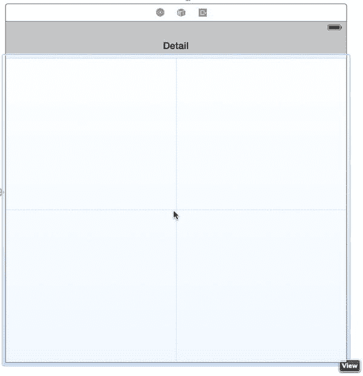

图 14-5. 我们将详情视图中的标签替换为另一个视图，居中显示在其容器视图中。拖动时该视图会变得有些透明，但这里可以看到，它部分覆盖了将视图拖到中央时出现的虚线

切换到标识检查器，以便将此 `UIView` 实例更改为我们自定义类的实例。在检查器顶部的 **Custom Class** 部分，选择 **Class** 弹出列表并选择 `TinyPixView`。然后打开属性检查器，将 **Mode** 设置更改为 *Redraw*。这会使 `TinyPixView` 在其大小改变时重新绘制自身。这是必要的，因为视图内网格的位置取决于视图本身的大小，而设备旋转时视图的大小会发生变化。此时，详情场景的视图层次结构应如图 14-6 所示。

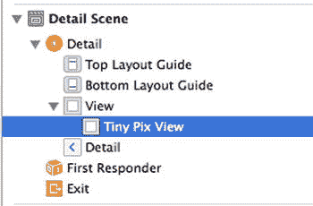

图 14-6. 详情视图场景的视图层次结构

在继续之前，我们需要调整新视图的自动布局约束。我们希望它能够填满详情视图中的可用区域。因此，在文档大纲中，按住 Control 键从 `TinyPixView` 拖拽到其父视图，然后松开鼠标。按住 **Shift** 键，在弹出的菜单中，选择 **Leading Space to Container Margin**、**Trailing Space to Container Margin**、**Top Space to Top Layout Guide** 和 **Bottom Space to Bottom Layout Guide**，然后点击弹出菜单外部以应用这些约束。

现在，我们需要将自定义视图连接到我们的详情视图控制器。我们还没有为自定义视图准备一个 outlet，但这没关系，因为 Xcode 的拖拽到代码功能会帮我们完成这项工作。


激活 Assistant Editor。一个文本编辑器应滑入 GUI 编辑器旁边，显示 `DetailViewController.m` 的内容。如果它显示的是其他内容，请使用文本编辑器顶部的跳转栏，使 `DetailViewController.m` 显示出来。

要建立连接，请从文档大纲中的 `TinyPixView` 图标按住 Control 键拖动到代码，在文件顶部的类扩展中释放拖拽。在出现的弹出窗口中，确保连接设置为 `Outlet`，将新输出口命名为 `pixView`，然后点击 **Connect** 按钮。

您应该会看到建立该连接后，在 `DetailViewController.m` 中添加了以下这一行：

```
@property (weak, nonatomic) IBOutlet TinyPixView *pixView;
```

然而，它没有将任何关于我们自定义视图类的知识添加到源代码中。让我们通过在 `DetailViewController.m` 顶部添加以下这一行来解决这个问题：

```
#import "DetailViewController.h"
#import "TinyPixView.h"

@interface DetailViewController ()
```

现在让我们修改 `configureView` 方法。这不是一个标准的 `UIViewController` 方法。它只是一个私有方法，项目模板将其包含在该类中，作为一个方便的位置来放置需要在任何更改后更新视图的代码。由于我们没有使用描述标签，因此删除设置该标签的行。接下来，我们添加一些代码，将选定的文档传递给我们的自定义视图，并通过调用 `setNeedsDisplay` 告诉它重新绘制自身：

```
- (void)configureView
{
    // Update the user interface for the detail item.

if (self.detailItem) {
        self.detailDescriptionLabel.text = [self.detailItem description];
            self.pixView.document = self.detailItem;
            [self.pixView setNeedsDisplay];
    }
}
```

接下来，我们需要安排将色调颜色应用到 `TinyPixView` 上。我们既需要在视图首次加载时执行此操作，也需要在色调颜色更改时执行此操作。我们知道可以从用户默认设置中获取初始色调颜色，因此让我们添加一个方法，该方法获取保存在那里的值，将其转换为 `UIColor`，并将其应用到 `TinyPixView`。该转换需要用到我们之前创建的 `TinyPixUtils` 类，因此首先在文件顶部为该类添加一个导入：

```
#import "DetailViewController.h"
#import "TinyPixView.h"
#import "TinyPixUtils.h"
```

接下来，在类主体中的某处添加此方法：

```
- (void)updateTintColor {
    NSUserDefaults *prefs = [NSUserDefaults standardUserDefaults];
    NSInteger selectedColorIndex = [prefs integerForKey:@"selectedColorIndex"];
    UIColor *tintColor = [TinyPixUtils getTintColorForIndex:selectedColorIndex];
    self.pixView .tintColor = tintColor;
    [self.pixView setNeedsDisplay];
}
```

我们需要在视图首次加载时调用此方法来设置初始色调颜色。我们还需要在色调更改时调用它。我们怎么知道它发生了变化？当色调颜色更改时，新值会保存在用户默认设置中。您可以通过在默认通知中心注册一个观察者来监听 `NSUserDefaultsDidChangeNotification` 通知，从而得知用户默认设置中的某些内容发生了变化。将以下代码添加到 `viewDidLoad` 方法中：

```
- (void)viewDidLoad {
    [super viewDidLoad];
    // Do any additional setup after loading the view, typically from a nib.
    [self configureView];
    [self updateTintColor];
    [[NSNotificationCenter defaultCenter] addObserver:self
        selector:@selector(onSettingsChanged:)
        name:NSUserDefaultsDidChangeNotification object:nil];
}
```

现在，当用户默认设置中的任何内容发生变化时，会调用 `onSettingsChanged:` 方法。发生这种情况时，我们需要设置新的色调颜色，以防它已更改。在类中的 `@end` 之前添加此方法的实现：

```
- (void)onSettingsChanged:(NSNotification *)notification {
    [self updateTintColor];
}
```

添加了通知观察者后，我们需要在类被释放之前移除它。我们可以通过重写视图的 `dealloc` 方法来做到这一点：

```
- (void)dealloc {
    [[NSNotificationCenter defaultCenter] removeObserver:self
              name:NSUserDefaultsDidChangeNotification object:nil];
}
```

我们即将完成这个类的工作，但还需要做一处修改。还记得我们提到过，当文档收到发生了某些编辑的通知时（通过注册一个可撤销的操作触发），会自动保存吗？保存通常会在编辑发生后的大约 10 秒内发生。与我们在本章前面描述的其他保存和加载过程一样，它发生在后台线程中，因此用户通常不会注意到。然而，这仅在文档仍然存在时有效。

在我们当前的设置下，存在一个风险：当用户点击 **Back** 按钮返回主列表时，文档实例可能会在没有执行任何保存操作的情况下被释放，导致用户最新的更改丢失。为了确保这种情况不会发生，我们需要在 `viewWillDisappear:` 方法中添加一些代码，以便在用户离开详情视图时立即关闭文档。关闭文档会导致其自动保存，而且再次强调，保存发生在后台线程中。在这种特定情况下，我们不需要在保存完成时做任何事情，因此我们传入 `nil` 而不是一个 block：

添加这个 `viewWillDisappear:` 方法：

```
- (void)viewWillDisappear:(BOOL)animated {
    [super viewWillDisappear:animated];
    UIDocument *doc = self.detailItem;
    [doc closeWithCompletionHandler:nil];
}
```

至此，这个我们第一个真正的基于文档的应用程序的此版本可以尝试运行了！启动它并尽情享受吧。您可以创建新文档、编辑它们、返回到列表，然后选择另一个文档（或同一个文档），一切都能正常工作。尝试更改色调颜色，并验证当您停止并重新启动应用程序时，它是否被正确保存和恢复。如果您在执行此操作时打开 Xcode 控制台，您会在每次加载或保存文档时看到一些输出。使用自动保存系统，您无法直接控制保存发生的时间（关闭文档时除外），但观察日志以了解它们何时发生可能会很有趣。

## 添加 iCloud 支持

您现在拥有一个完全可用的基于文档的应用程序，但我们不会止步于此。我们承诺在本章中会介绍 iCloud 支持，现在是实现它的时候了！

修改 `TinyPix` 以使其与 iCloud 协同工作是相当直接的。考虑到幕后发生的所有事情，这只需要数量惊人的少量更改。我们需要对加载可用文件列表的方法以及指定加载新文件 URL 的方法进行一些修改，但仅此而已。

除了代码更改之外，我们还需要处理一些额外的管理细节。仅当应用程序包含配置为允许使用 iCloud 的嵌入式配置文件时，Apple 才允许其保存到 iCloud。这意味着要为我们的应用程序添加 iCloud 支持，您必须拥有付费的 iOS 开发者会员资格并已安装开发者证书。它还仅适用于真实设备，而非模拟器，因此您需要至少有一个已注册 iCloud 的 iOS 设备来运行新的支持 iCloud 的 `TinyPix`。如果您有两台设备，乐趣会更多，因为您可以看到在一台设备上所做的更改如何传播到另一台设备。

### 创建配置文件


```markdown

首先，你需要为`TinyPix`创建一个启用了 iCloud 的描述文件。过去，这需要在 Apple 开发者网站上执行许多繁琐的步骤，但现在 `Xcode` 让这一切变得简单。在项目导航器中，选择顶部的`TinyPix`项，然后在编辑区域点击**Capabilities**标签。你应该会看到如 Figure 14-7 所示的内容。

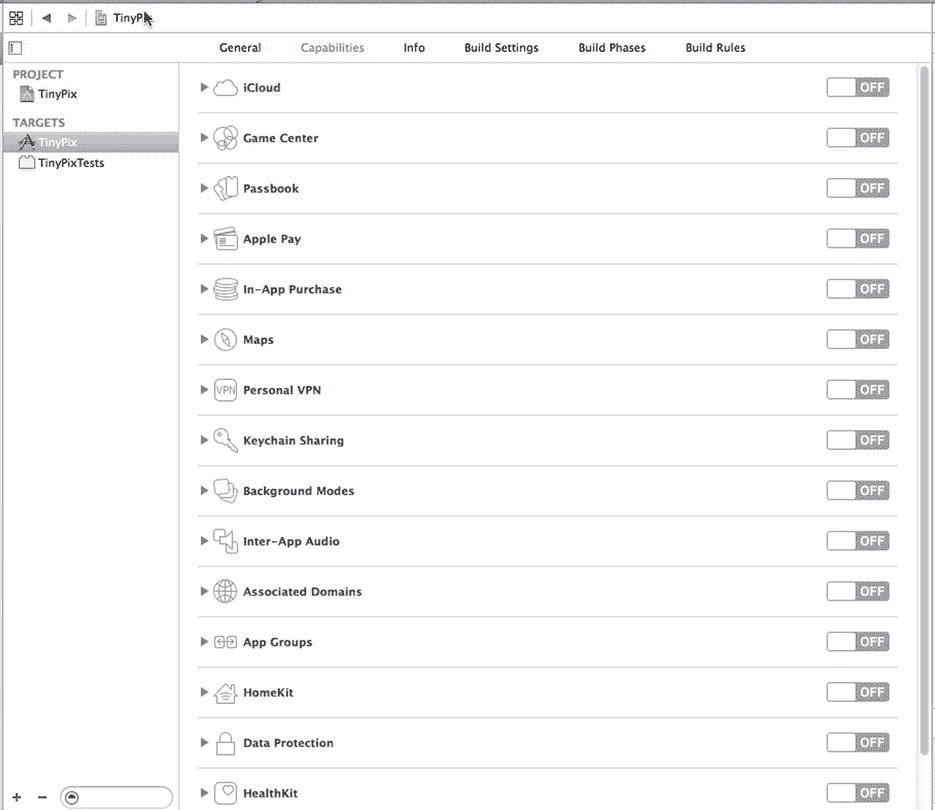

Figure 14-7. Xcode 展示的易于配置的应用技术与服务

Figure 14-7 中显示的功能列表都可以直接在 Xcode 中配置，无需访问网站、创建和下载描述文件等。在此之前，你需要为你的应用分配一个唯一的`App ID`。如果你使用了源代码下载中的项目版本，`App ID` 是`com.apress.BID`。这个`App ID`已被注册，因此你无法使用它。选择**General**标签，在**Bundle Identifier**字段中使用一个不同的前缀。例如，要将`App ID`更改为`com.myCo`，你可以像 Figure 14-8 所示那样设置`Bundle Identifier`。

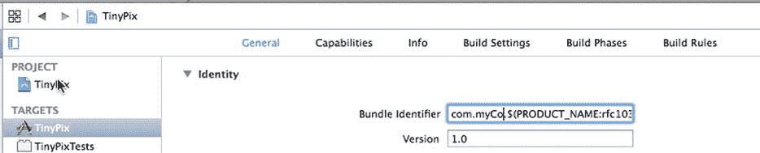

Figure 14-8. 更改应用的包标识符

当然，你应该使用一个对你来说是唯一的值，而不是`com.myCo`。现在切换回**Capabilities**标签。对于`TinyPix`，我们希望启用 iCloud，即列表中的第一个功能，因此点击云图标旁边的展开三角形。在这里，你会看到一些关于此功能用途的信息。点击右侧的开关将其打开。`Xcode` 随后将与 Apple 的服务器通信，为此应用配置描述文件。这将要求你使用你的 Apple ID 登录，并且显然要求你连接到互联网。启用后，点击打开**Key-value storage**和**iCloud Documents**复选框，如 Figure 14-9 所示。

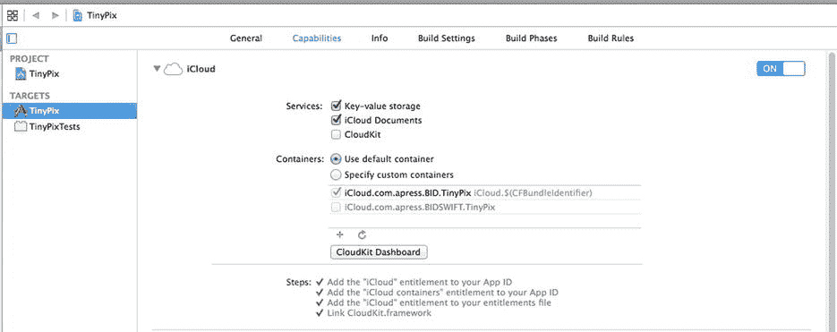

Figure 14-9. 应用现已配置为使用 iCloud。这个简单的配置让我们可以从本章中删除几页，这大概能拯救一两棵树。谢谢，Apple！

你完成了！你的应用现在拥有从代码中访问 iCloud 的必要权限。剩下的就是简单的编程工作。

### 如何进行查询

选择`MasterViewController.m`，以便我们可以开始为 iCloud 进行更改。最大的变化将是我们查找可用文档的方式。在第一个版本的`TinyPix`中，我们使用`NSFileManager`来查看本地文件系统上有什么可用内容。这次，我们将采用稍微不同的方法。在这里，我们将启动一种特殊的查询来查找文档。

首先，在类扩展中添加一对属性：一个用于持有进行中查询的指针，另一个用于持有查询找到的所有文档列表。

```
@interface MasterViewController ()

@property (weak, nonatomic) IBOutlet UISegmentedControl *colorControl;
@property (strong, nonatomic) NSArray *documentFilenames;
@property (strong, nonatomic) TinyPixDocument *chosenDocument;
@property (strong, nonatomic) NSMetadataQuery *query;
@property (strong, nonatomic) NSMutableArray *documentURLs;

@end
```

现在，让我们看看新的文件列表方法。删除整个`reloadFiles`方法，并将其替换为以下内容：

```
- (void)reloadFiles {
    NSFileManager *fileManager = [NSFileManager defaultManager];
    // passing nil is OK here, matches first entitlement
    NSURL *cloudURL = [fileManager URLForUbiquityContainerIdentifier:nil];
    NSLog(@"got cloudURL %@", cloudURL);  // returns nil in simulator
    if (cloudURL != nil) {
        self.query = [[NSMetadataQuery alloc] init];
        _query.predicate = [NSPredicate predicateWithFormat:@"%K like '*.tinypix'",
                            NSMetadataItemFSNameKey];
        _query.searchScopes = [NSArray arrayWithObject:
                               NSMetadataQueryUbiquitousDocumentsScope];
        [[NSNotificationCenter defaultCenter]
                addObserver:self
                selector:@selector(updateUbiquitousDocuments:)
                name:NSMetadataQueryDidFinishGatheringNotification
                object:nil];
        [[NSNotificationCenter defaultCenter]
                addObserver:self
                selector:@selector(updateUbiquitousDocuments:)
                name:NSMetadataQueryDidUpdateNotification
                object:nil];
        [_query startQuery];
    }
}
```

这里有一些新东西绝对值得一提。首先出现在这一行：

```
NSURL *cloudURL = [fileManager URLForUbiquityContainerIdentifier:nil];
```

这的确是个拗口的词。Ubiquity？我们在这里讨论什么？谈到 iCloud，Apple 在标识 iCloud 存储资源时使用的很多术语都包含像“ubiquity”和“ubiquitous”这样的词，来表示某物是无所不在的——可以从使用相同 iCloud 登录凭据的任何设备访问。

在这种情况下，我们请求文件管理器提供一个基础 URL，该 URL 允许我们访问与特定容器标识符关联的 iCloud 目录。容器标识符通常是一个字符串，包含你公司的唯一捆绑种子 ID 和应用标识符。容器标识符用于选择你的应用中包含的 iCloud 授权之一。这里传递`nil`是一个快捷方式，意思就是“给我列表中的第一个。”由于我们的应用在该列表中只包含一个已勾选的项目（你可以在 Figure 14-9 底部的“Containers”下看到），这个快捷方式完美地满足了我们的需求。

之后，我们创建并配置了一个`NSMetadataQuery`实例：

```
self.query = [[NSMetadataQuery alloc] init];
_query.predicate = [NSPredicate predicateWithFormat:@"%K like '*.tinypix'",
                    NSMetadataItemFSNameKey];
_query.searchScopes = [NSArray arrayWithObject:
                       NSMetadataQueryUbiquitousDocumentsScope];
```

`NSMetaDataQuery`类最初是为在 OS X 上使用 Spotlight 搜索功能而编写的，但现在它承担了额外职责，作为让 iOS 应用搜索 iCloud 目录的一种方式。我们给查询一个谓词，将其搜索结果限制为仅包含具有正确文件名的文件，并给它一个搜索范围，将其限制为仅搜索应用 iCloud 存储中的*Documents*文件夹。接下来，我们设置一些通知，以便在查询完成时得到通知，然后启动查询：

```
[[NSNotificationCenter defaultCenter]
        addObserver:self
        selector:@selector(updateUbiquitousDocuments:)
        name:NSMetadataQueryDidFinishGatheringNotification
        object:nil];
[[NSNotificationCenter defaultCenter]
        addObserver:self
        selector:@selector(updateUbiquitousDocuments:)
        name:NSMetadataQueryDidUpdateNotification
        object:nil];
[_query startQuery];
```

现在，我们需要实现查询完成时这些通知调用的方法。在`reloadFiles`方法下方添加此方法：

```
- (void)updateUbiquitousDocuments:(NSNotification *)notification {
    self.documentURLs = [NSMutableArray array];
    self.documentFilenames = [NSMutableArray array];

```


`NSLog(@"updateUbiquitousDocuments, results = %@", self.query.results);`
`NSArray *results = [self.query.results sortedArrayUsingComparator:^NSComparisonResult(id obj1, id obj2) {`
`NSMetadataItem *item1 = obj1;`
`NSMetadataItem *item2 = obj2;`
`return [[item2 valueForAttribute:NSMetadataItemFSCreationDateKey]`
`compare:`
`[item1 valueForAttribute:NSMetadataItemFSCreationDateKey]];`
`}];`

```
for (NSMetadataItem *item in results) {
    NSURL *url = [item valueForAttribute:NSMetadataItemURLKey];
    [self.documentURLs addObject:url];
    [(NSMutableArray *)_documentFilenames addObject:[url lastPathComponent]];
}

[self.tableView reloadData];
```

查询结果中包含一个`NSMetadataItem`对象列表，我们可以从中获取文件 URL 和创建日期等信息。我们利用这些信息按日期对项目进行排序，然后获取所有 URL 供后续使用。

### 保存在哪里？

下一个改动是在`urlForFilename:`方法中，该方法再次变得完全不同。这里我们使用一个通用 URL 来为给定的文件名创建完整的路径 URL。我们还在生成的路径中插入了`"Documents"`，以确保使用应用程序的*Documents*目录。删除旧方法，并用这个新方法替换：

```
- (NSURL *)urlForFilename:(NSString *)filename {
    // 确保在路径中插入 "Documents"
    NSURL *baseURL = [[NSFileManager defaultManager]
                      URLForUbiquityContainerIdentifier:nil];
    NSURL *pathURL = [baseURL URLByAppendingPathComponent:@"Documents"];
    NSURL *destinationURL = [pathURL URLByAppendingPathComponent:filename];
    return destinationURL;
}
```

现在，在实际的 iOS 设备（而非模拟器）上构建并运行你的应用。如果你之前在该设备上运行过旧版本的应用，你会发现之前创建的 TinyPix 杰作现在都找不到了。这个新版本忽略了应用的本地*Documents*目录，完全依赖于 iCloud。不过，你应该能够创建新文档，并在退出并重新启动应用后发现它们仍然存在。此外，你甚至可以完全从设备上删除 TinyPix 应用，然后从 Xcode 再次运行它，就会发现所有 iCloud 保存的文档都立即可用了。如果你还有另一台配置了相同 iCloud 用户的 iOS 设备，使用 Xcode 在那台设备上运行该应用，你会看到同样的文档也出现在那里！这相当不错。你还可以在 iOS 设备“设置”应用的 iCloud 部分找到这些文档（查看**存储****管理存储****TinyPix**），如果你运行的是 OS X 10.8 或更高版本，也可以在 Mac 系统偏好设置的 iCloud 部分找到它们。

### 在 iCloud 上存储偏好设置

我们只需付出一点努力，就可以将另一项功能“云化”。iOS 的 iCloud 支持包含一个名为`NSUbiquitousKeyValueStore`的类，它的工作方式很像`NSUserDefaults`；然而，它的键和值存储在云端。这对于应用偏好设置、登录令牌以及其他不属于文档但在用户所有设备之间共享时可能有用的数据来说非常棒。

在 TinyPix 中，我们将使用此功能来存储用户偏好的高亮颜色。这样一来，用户只需设置一次颜色，它就会在所有设备上出现，而无需在每个设备上进行配置。以下是行动计划：

*   每当用户更改色调颜色时，我们将把新值保存在`NSUserDefaults`中，同时也会保存在`NSUbiquitousKeyValueStore`中，这将使其可用于其他设备上的应用实例。
*   我们将注册以接收`NSUbiquitousKeyValueStore`中的更改通知。当我们收到更改通知时，将获取新的色调颜色值。此时，我们需要更新分段控件、主视图控制器使用的色调颜色以及详细视图控制器中的绘制颜色。我们不会直接执行此操作，而是将新的色调颜色保存在`NSUserDefaults`中。更改`NSUserDefaults`会生成一个通知。详细视图控制器已经在监听此通知，因此它会自动更新。我们还将对主视图控制器进行一些小的修改，使其执行相同的操作。

重要的是要意识到，对`NSUbiquitousKeyValueStore`的更新不会立即传播到其他设备，事实上，如果设备因任何原因未连接到 iCloud，它将不会看到更新，直到下次连接。因此，不要期望更改会立即被看到。

让我们从注册以接收来自 iCloud 键值存储的更改通知开始。打开`AppDelegate.m`并将以下代码添加到`application:didFinishLaunchingWithOptions:`方法中：

```
- (BOOL)application:(UIApplication *)application didFinishLaunchingWithOptions:(NSDictionary *)launchOptions {
    // 应用启动后的自定义覆盖点。
    UISplitViewController *splitViewController =
           (UISplitViewController *)self.window.rootViewController;
    UINavigationController *navigationController =
           [splitViewController.viewControllers lastObject];
    navigationController.topViewController.navigationItem.leftBarButtonItem =
           splitViewController.displayModeButtonItem;
    splitViewController.delegate = self;

    // 注册 iCloud 键值更改通知
    [[NSNotificationCenter defaultCenter] addObserver:self
           selector:@selector(iCloudKeysChanged:)
           name:NSUbiquitousKeyValueStoreDidChangeExternallyNotification
           object:nil];

    // 启动 iCloud 键值更新
    [[NSUbiquitousKeyValueStore defaultStore] synchronize];
    [self updateUserDefaultsFromICloud];

    return YES;
}
```

第一行新代码的作用是安排当发生`NSUbiquitousKeyValueStoreDidChangeExternallyNotification`时（即当 iCloud 通知应用任何键值对发生更改时），调用应用委托的`iCloudKeysChanged:`方法。`synchronize`方法会导致对`NSUbiquitousKeyValueStore`的本地更改在后台写入 iCloud，并开始接收远程更新的通知。`updateUserDefaultsFromICloud`方法（你很快就会看到）会从 iCloud 键值存储中获取选定色调颜色的当前状态（如果已设置），并将其存储在本地用户默认设置中，以便立即使用。

接下来，添加`iCloudKeysChanged:`和`updateUserDefaultsFromCloud`方法的实现：

```
- (void)iCloudKeysChanged:(NSNotification *)notification {
    [self updateUserDefaultsFromICloud];
}

- (void)updateUserDefaultsFromICloud {
    NSDictionary *values = [[NSUbiquitousKeyValueStore defaultStore] dictionaryRepresentation];
    if ([values valueForKey:@"selectedColorIndex"] != nil) {
        NSUInteger selectedColorIndex = (NSUInteger)[[NSUbiquitousKeyValueStore defaultStore] longLongForKey:@"selectedColorIndex"];
        NSUserDefaults *prefs = [NSUserDefaults standardUserDefaults];
        [prefs setInteger:selectedColorIndex forKey:@"selectedColorIndex"];
        [prefs synchronize];
    }
}
```


遇到通知时，我们使用`longLongForKey:`方法从键值存储中获取新的选中色调颜色索引。该 API 与`NSUserDefaults`的 API 非常相似，但没有存储整数值的方法，因此我们将色调颜色索引视为`long long`类型。获取值后，我们将其复制到`NSUserDefaults`并同步更改，从而生成通知。我们已经知道，详情视图控制器在收到此通知时会自行更新。接下来，我们需要修改主视图控制器以执行相同操作。回到`MasterViewController.m`，首先在`viewDidLoad`方法中注册控制器以接收`NSUserDefaults`更改的通知：

```
[self reloadFiles];

[[NSNotificationCenter defaultCenter] addObserver:self
       selector:@selector(onSettingsChanged:)
       name:NSUserDefaultsDidChangeNotification object:nil];
```

接着，添加`onSettingsChanged:`方法：

```
- (void)onSettingsChanged:(NSNotification *)notification {
    NSUserDefaults *prefs = [NSUserDefaults standardUserDefaults];
    NSInteger selectedColorIndex = [prefs integerForKey:@"selectedColorIndex"];
    [self setTintColorForIndex:selectedColorIndex];
    self.colorControl.selectedSegmentIndex = selectedColorIndex;
}
```

该方法使用与用户点击分段控件时相同的方法更新分段控件的色调颜色，但颜色索引来自`NSUserDefaults`而非控件本身。

最后，当用户更改色调颜色时，我们需要将新索引保存到 iCloud 键值存储中。请对`chooseColor:`方法进行以下修改以实现此功能：

```
- (IBAction)chooseColor:(id)sender {
    NSInteger selectedColorIndex = [(UISegmentedControl *)sender
                                    selectedSegmentIndex];
    [self setTintColorForIndex:selectedColorIndex];

NSUserDefaults *prefs = [NSUserDefaults standardUserDefaults];
    [prefs setInteger:selectedColorIndex forKey:@"selectedColorIndex"];
    [prefs synchronize];
    [[NSUbiquitousKeyValueStore defaultStore]
              setLongLong:selectedColorIndex
              forKey:@"selectedColorIndex"];
    [[NSUbiquitousKeyValueStore defaultStore] synchronize];
}
```

就是这样！现在你可以在多个配置了同一 iCloud 用户的设备上运行该应用，并且会看到在一台设备上设置颜色后，另一台设备上很快也会显示新颜色。小菜一碟！

## 我们未涉及的内容

我们现在已经掌握了一个支持 iCloud 的基于文档应用的基础知识并使其运行起来，但还有几个你可能需要考虑的问题。我们不会在本书中涵盖这些主题；但如果你认真想要打造一个优秀的基于 iCloud 的应用，你需要思考以下几个方面：

*   存储在 iCloud 中的文档容易发生冲突。如果你同时在多台设备上编辑同一个`TinyPix`文件，会发生什么？幸运的是，苹果已经考虑到了这一点，并提供了一些在应用中处理这些冲突的方法。你需要决定是忽略冲突、尝试自动修复冲突，还是让用户帮助解决冲突。有关完整详情，请搜索 Xcode 文档查看器中标题为“Resolving Document Version Conflicts”的文档。
*   苹果建议你设计应用使其在完全离线模式下也能正常工作，以防用户因某些原因未使用 iCloud。它还建议你提供一种让用户在 iCloud 存储和本地存储之间移动文件的方法。遗憾的是，苹果并未提供或建议任何标准的 GUI 来帮助用户管理这一点，而当前提供此功能的应用（如苹果的`iWork`应用）在处理方式上似乎并非特别用户友好。有关更多信息，请参阅 Xcode 文档中的“Managing the Life Cycle of a Document”部分。
*   苹果支持将 iCloud 用于 Core Data 存储，甚至提供了一个名为`UIManagedDocument`的类，如果你希望实现这一点，可以对其进行子类化。更多信息请参见`UIManagedDocument`类参考。该架构比普通的 iCloud 文档存储要复杂和麻烦得多。苹果在最近的 iOS 版本中已采取措施进行改进，但仍未完全顺畅，所以请三思而后行。

接下来是什么？在第 15 章中，我们将带你了解如何确保应用在多线程、多任务环境中正常工作。

# 第 15 章 Grand Central Dispatch、后台处理与你的应用

如果你曾在任何环境中尝试过多线程编程，你很可能会带着一种恐惧、惊骇或更糟的感觉离开。幸运的是，技术不断进步，苹果提出了一种使多线程编程变得更加容易的新方法。这种方法被称为**Grand Central Dispatch**，我们将在本章中带你开始使用它。我们还将深入探讨 iOS 的多任务能力，向你展示如何调整你的应用，使其在这个新世界中表现良好，甚至比以往更好。

## Grand Central Dispatch

如今开发者面临的最大挑战之一是编写能够执行复杂操作以响应用户输入，同时保持响应性的软件，使用户不会因为处理器在处理某些后台任务而一直等待。仔细想想，这个挑战一直伴随着我们；尽管计算技术的进步带来了更快的 CPU，但问题依然存在。如果你想找证据，只需看看你最近的电脑屏幕。很可能在你上次坐下来工作时，某个时候你的工作流程会被某种旋转的鼠标光标打断。

那么，鉴于系统架构的所有进步，为什么这个问题仍然困扰着我们？部分问题在于软件的典型编写方式：作为一系列按顺序执行的事件。此类软件可以随着 CPU 速度的提高而扩展，但只能达到一定程度。一旦程序因等待外部资源（如文件或网络连接）而被卡住，整个事件序列就会有效暂停。所有现代操作系统现在都允许在程序中使用多个执行线程，这样即使单个线程因等待特定事件而被卡住，其他线程也可以继续运行。即便如此，许多开发者仍将多线程编程视为某种黑魔法而避之不及。


# Grand Central Dispatch（GCD）

幸运的是，对于希望将代码分解为同时执行的多个块、却又不愿过多接触系统线程层的开发者，Apple 带来了一些好消息。这个好消息就是 Grand Central Dispatch（GCD）。它提供了一套全新的 API，可以将应用程序所需完成的工作拆分成更小的块，这些块能够分布在多个线程上，并且在合适的硬件支持下，还能分布在多个 CPU 上。

这套新 API 的大部分功能都是通过`blocks`（块）实现的，这是 Apple 的另一项创新，为 C 语言和 Objective-C 增加了匿名内联函数的能力。`Blocks`与 Ruby 和 Lisp 等语言中的类似特性有许多共同点，它们提供了一种有趣的新方式来构建不同对象之间的交互，同时让相关代码在你的方法中保持更紧密的聚集。

### 引入 SlowWorker

为了演示 GCD 的工作原理，我们将创建一个名为“SlowWorker”的应用程序。它的界面很简单，由一个按钮和一个文本视图驱动。点击按钮后，一个同步任务会立即启动，导致应用程序锁定大约十秒钟。任务完成后，文本视图中会显示一些内容（参见图 15-1）。

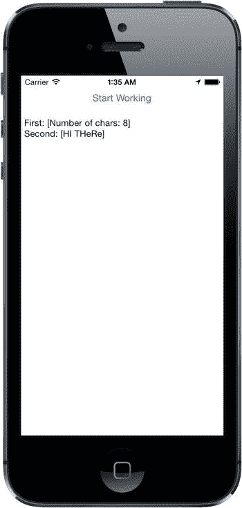

图 15-1. `SlowWorker`应用程序将其界面隐藏在一个按钮后面。点击按钮后，界面会挂起大约十秒钟，同时应用程序执行其工作

首先，像之前多次做过的那样，使用单视图应用程序模板在 Xcode 中创建一个新应用程序。将其命名为`SlowWorker`，将**设备**设置为**通用**，点击**下一步**以**保存**你的项目，依此类推。接下来，对`ViewController.m`进行如下添加：

```
#import "ViewController.h"

@interface ViewController ()

@property (weak, nonatomic) IBOutlet UIButton *startButton; 
@property (weak, nonatomic) IBOutlet UITextView *resultsTextView;

@end
```

这简单定义了两个输出口，分别连接到 GUI 中可见的两个对象。

现在继续，在`@implementation`部分中以粗体添加以下代码：

```
@implementation ViewController

- (NSString *)fetchSomethingFromServer
{
    [NSThread sleepForTimeInterval:1];
    return @"Hi there";
}

- (NSString *)processData:(NSString *)data
{
    [NSThread sleepForTimeInterval:2];
    return [data uppercaseString];
}

- (NSString *)calculateFirstResult:(NSString *)data
{
    [NSThread sleepForTimeInterval:3];
    return [NSString stringWithFormat:@"Number of chars: %lu",
            (unsigned long)[data length]];
}

- (NSString *)calculateSecondResult:(NSString *)data
{
    [NSThread sleepForTimeInterval:4];
    return [data stringByReplacingOccurrencesOfString:@"E"
                                           withString:@"e"];
}

- (IBAction)doWork:(id)sender
{
    self.resultsTextView.text = @"";
    NSDate *startTime = [NSDate date];
    NSString *fetchedData = [self fetchSomethingFromServer];
    NSString *processedData = [self processData:fetchedData];
    NSString *firstResult = [self calculateFirstResult:processedData];
    NSString *secondResult = [self calculateSecondResult:processedData];
    NSString *resultsSummary = [NSString stringWithFormat:
                                @"First: [%@]\nSecond: [%@]", firstResult,
                                secondResult];
    self.resultsTextView.text = resultsSummary;
    NSDate *endTime = [NSDate date]; 
    NSLog(@"Completed in %f seconds",
          [endTime timeIntervalSinceDate:startTime]);
}
.
.
.
```

如你所见，这个类的工作（暂且这么说）被拆分成了多个小段。这段代码只是为了模拟一些缓慢的操作，这些方法本身并没有真正耗时的操作。为了有点趣味，每个方法中都包含了对`NSThread`类方法`sleepForTimeInterval:`的调用，它会让程序（确切地说是调用该方法的线程）暂停指定秒数，什么也不做。`doWork:`方法还在开头和结尾加入了代码，用于计算完成所有工作所花费的时间。

现在打开`Main.storyboard`，将一个**按钮**和一个**文本视图**拖拽到空的视图窗口中，按照图 15-2 所示布局。要设置自动布局约束，首先选择 **开始工作** 按钮，然后在菜单栏中选择 **Editor**  **Align**  **Horizontal Center in Container**。接着，按住 Control 键从按钮拖拽到视图窗口顶部，释放鼠标并选择 **Top Space to Top Layout Guide**。为了完成该按钮的约束设置，按住 Control 键从按钮向下拖拽到文本视图，释放鼠标并选择 **Vertical Spacing**。要固定文本视图的位置和大小，按住 Control 键从它拖拽到视图窗口。释放鼠标，弹出菜单出现时，按住 **Shift** 键并选择 **Leading Space to Container Margin**、**Trailing Space to Container Margin** 和 **Bottom Space to Bottom Layout Guide**，然后点击 **弹出菜单外部以应用约束**。这样就完成了此应用程序的自动布局约束。

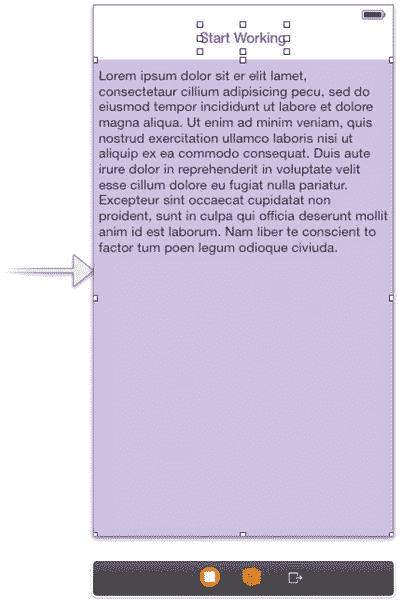

图 15-2. `SlowWorker`的界面由一个按钮和一个文本视图组成。确保取消选中文本视图的 **可编辑** 复选框，并删除其中的所有文本

按住 Control 键从 **文件所有者** 拖拽，将视图控制器的两个输出口（即 `startButton` 和 `resultsTextView` 实例变量）连接到按钮和文本视图。

接着，按住 Control 键从按钮拖拽到视图控制器的`doWork:`方法，以便按下按钮时调用它。最后，选中文本视图，使用属性检查器取消选中 **可编辑** 复选框（位于右上角），并删除文本视图中的默认文本。

保存你的工作，然后选择 **运行**。你的应用程序应该会启动，按下按钮后它会工作大约十秒钟（所有睡眠时间的总和），然后显示结果。在等待期间，你会看到 **开始工作** 按钮明显变暗，直到“工作”完成才会恢复正常的颜色。此外，在工作完成之前，应用程序的视图是无响应的。点击屏幕的任何地方都没有效果。事实上，在此期间你能与应用程序交互的唯一方式就是点击 home 键切换到其他应用。这正是我们要避免的状况！

在这个特定示例中，等待时间还不算太糟，因为应用程序看起来只挂起了几秒钟；但如果你经常让应用长时间挂起，使用体验会非常令人沮丧。在最坏的情况下，如果应用长时间无响应，操作系统甚至可能会强制关闭它。无论如何，你最终都会得到一些不满的用户——甚至可能失去一些用户！

### 线程基础

在开始实现解决方案之前，我们先回顾一些并发基础知识。这远远不是 iOS 中线程或一般线程的完整描述。我们只是想解释足够的内容，以便你理解本章将要进行的操作。


# 线程与线程安全

大多数现代操作系统（当然包括 iOS）都支持线程执行的概念。每个进程可以包含多个线程，这些线程同时并发运行。如果只有一个处理器核心，操作系统会在所有执行线程之间进行切换，就像它在所有执行进程之间切换一样。如果有多核可用，线程将像进程一样分布在多个核心上。

同一进程中的所有线程共享相同的可执行程序代码和相同的全局数据。每个线程也可以拥有一些专属数据。线程可以利用一种称为 `mutex`（*互斥锁* 的简称）或锁的特殊结构，它能确保某段特定代码不会被多个线程同时运行。当多个线程同时访问同一数据时，通过在一个线程更新值时锁定其他线程（位于代码的**临界区**内），这对于确保正确结果非常有用。

处理线程时的一个常见问题是代码是否为**线程安全**。有些软件库在设计时考虑到了线程并发，并使用 `mutex` 正确保护了所有临界区。而有些代码库则不是线程安全的。

例如，在 Cocoa Touch 中，Foundation 框架（包含适用于各类 Objective-C 编程的基本类，如 `NSString`、`NSArray` 等）通常被认为是线程安全的。然而，UIKit 框架（包含构建 GUI 应用所需的特定类，如 `UIApplication`、`UIView` 及其所有子类等）在很大程度上不是线程安全的。这意味着在运行中的 iOS 应用中，所有与 UIKit 对象相关的方法调用都应从同一个线程（即**主线程**）中执行。如果你从另一个线程访问 UIKit 对象，后果难以预料！你很可能会遇到看似无法解释的错误（或者更糟的是，你在开发时未遇到任何问题，但某些用户在你的应用发布后会受到影响）。

默认情况下，iOS 应用的所有操作都发生在主线程上（例如，处理由用户事件触发的操作）。因此，对于简单的应用，你无需担心这个问题。由用户触发的操作方法已经运行在主线程中。到本书为止，我们的代码一直仅在主线程上运行，但这种情况即将改变。

**提示** 关于线程安全已有大量著述，值得你花时间去深入了解并尽可能消化这些知识。一个很好的起点是 Apple 的官方文档。花几分钟时间阅读以下页面（这一定会对你有帮助）：`http://developer.apple.com/library/ios/documentation/Cocoa/Conceptual/Multithreading/ThreadSafetySummary/ThreadSafetySummary.html`

### 工作单元

前面描述的线程模型的问题在于，对于普通程序员来说，编写无错误的多线程代码几乎是不可能的。这并非是对我们行业或普通程序员能力的批评，而仅仅是一种观察。在跨多个线程同步数据和操作时，你必须在代码中处理复杂的交互，这对大多数人来说确实过于困难。想象一下，只有 5% 的人有能力编写软件，而这 5% 中只有一小部分真正能够胜任编写重度多线程应用的任务。即使是那些成功做到这一点的人，也常常会建议他人不要效仿他们的做法！

幸运的是，并非毫无希望。我们可以在不进行过多底层线程操作的情况下实现某种并发。正如我们能够在不直接向视频 RAM 写入位的情况下在屏幕上显示数据、在不直接与磁盘控制器交互的情况下从磁盘读取数据一样，我们也可以利用软件抽象，让我们在多个线程上运行代码，而无需直接与线程打交道太多。

Apple 鼓励我们使用的解决方案围绕以下思路展开：将长时间运行的任务拆分为工作单元，并将这些单元放入队列中执行。系统为我们管理这些队列，在多个线程上执行工作单元。我们无需直接启动和管理后台线程，从而免去了实现多线程应用时通常需要的大量记录工作；系统为我们处理了这一切。

### GCD：底层队列

这种将工作单元放入队列中、在后台执行，并由系统为你管理线程的想法非常强大，并极大地简化了许多需要并发的开发场景。GCD 在几年前首次出现在 OS X 上，提供了实现这一功能的基础设施。几年后，这项技术也进入了 iOS 平台。

GCD 将一些优秀的概念——工作单元、轻松的后台处理以及自动线程管理——整合到了一个 C 接口中，该接口不仅可用于 Objective-C，还可用于 C、C++ 以及当然还有 Swift。更棒的是，Apple 已将其 GCD 实现开源，因此它也可以移植到其他类 Unix 操作系统上。

GCD 的一个关键概念是`队列`。系统提供了许多预定义的队列，包括一个保证始终在主线程上执行工作的队列。这对于非线程安全的 UIKit 来说非常完美！你也可以创建自己的队列——想创建多少就创建多少。GCD 队列严格遵循先进先出（FIFO）原则。添加到 GCD 队列的工作单元将始终按照它们被放入队列的顺序启动。也就是说，它们可能不会以相同的顺序完成，因为一个 GCD 队列可能会在可能的情况下自动将其工作分配给多个线程。

GCD 可以访问一个线程池，这些线程在应用的整个生命周期内被重用，并且它会尝试维护一个适合机器架构的线程数。当有工作需要处理时，它会自动利用更强大的机器，从而使用更多的处理器核心。直到最近，iOS 设备都是单核的，所以这还不是什么大问题。但现在，过去几年发布的所有 iOS 设备都配备了多核处理器，GCD 正变得越来越有用。

#### 成为 Block 高手

与 GCD 一起，Apple 还为 C 语言本身（并由此扩展到 Objective-C 和 C++）添加了一些新语法，以实现一种称为**块**（在其他一些语言中也称为**闭包**或**lambda**）的语言特性，这对于充分发挥 GCD 的优势非常重要。块背后的想法是让特定的代码段可以像其他 C 语言类型一样被处理。一个块可以赋值给一个变量、作为参数传递给函数或方法，并且（与大多数其他类型不同）可以被执行。通过这种方式，块可以作为 Objective-C 中委托模式或 C 中回调函数的替代方案。

与方法或函数非常相似，块可以接受一个或多个参数并指定一个返回值。要声明一个块变量，你可以使用脱字符号（`^`）以及一些额外的括号来声明参数和返回类型。要定义块本身，操作方法大致相同，但在其后用花括号括起定义块的实际代码：

```
// 声明一个名为 "loggerBlock" 的块变量，无参数
// 且无返回值。
void (^loggerBlock)(void);
```


```objective-c
// 将代码块赋值给之前声明的变量。像这样没有参数且没有返回值的代码块，
// 不需要像前面的变量声明中使用 `void` 那样的“修饰”。
loggerBlock = ^{ NSLog(@"我真的很高兴他们没把它叫做 lambda"); };

// 执行代码块，就像调用函数一样。
loggerBlock();  // 这会在控制台输出一些内容
```

如果你做过很多 C 语言编程，可能会发现这与 C 语言中的函数指针概念类似。然而，两者之间存在一些关键差异。其中最大的差异——当你第一次看到时最引人注目的是——代码块可以直接在代码中内联定义。你可以在需要将代码块传递给另一个方法或函数的位置直接定义它。

另一个重大区别是，代码块可以访问其创建作用域内的所有变量。默认情况下，代码块会“捕获”你通过这种方式访问的任何变量。它会将值复制到一个同名的新变量中，保持原始变量不变。Objective-C 对象会自动收到一条 `retain` 消息（随后，当代码块执行完毕，会收到一条 `release`，从而在代码块内部为变量赋予强语义），而像 `int` 和 `float` 这样的标量值则会被简单复制。不过，你可以通过在外部变量的声明前添加存储限定符 `__block`，使其变为“可读/写”。注意，`block` 前面是两条下划线，而不是一条。或者，如果你想传入一个具有 `weak` 语义的对象指针，可以在其前面添加 `__weak`：

```objective-c
// 定义一个可由代码块修改的变量
__block int a = 0;

// 定义一个尝试修改其作用域内变量的代码块
void (^sillyBlock)(void) = ^{ a = 47; };

// 在调用代码块前检查变量的值
NSLog(@"a == %d", a); // 输出 "a == 0"

// 执行代码块
sillyBlock();

// 在调用代码块后再次检查变量的值
NSLog(@"a == %d", a); // 输出 "a == 47"
```

如前所述，代码块在与 GCD 一起使用时才能真正大放异彩，GCD 允许你一步操作就获取一个代码块并将其添加到队列中。当你直接在当时定义的代码块（而非存储在变量中的代码块）上执行此操作时，你还能获得额外的优势：可以直接在使用相关代码的上下文中看到它。

### 改进 SlowWorker

为了了解代码块的工作原理，让我们重新审视 SlowWorker 的 `doWork:` 方法。目前它看起来是这样的：

```objective-c
- (IBAction)doWork:(id)sender
{
    self.resultsTextView.text = @"";
    NSDate *startTime = [NSDate date];
    NSString *fetchedData = [self fetchSomethingFromServer];
    NSString *processedData = [self processData:fetchedData];
    NSString *firstResult = [self calculateFirstResult:processedData];
    NSString *secondResult = [self calculateSecondResult:processedData];
    NSString *resultsSummary = [NSString stringWithFormat:
                                @"First: [%@]\nSecond: [%@]", firstResult,
                                secondResult];
    self.resultsTextView.text = resultsSummary;
    NSDate *endTime = [NSDate date];
    NSLog(@"Completed in %f seconds",
          [endTime timeIntervalSinceDate:startTime]);
}
```

我们可以通过将所有代码包装在一个代码块中，并将其传递给一个名为 `dispatch_async` 的 GCD 函数，从而使此方法完全在后台运行。该函数接受两个参数：一个 GCD 队列和一个要分配给该队列的代码块。在你的 `doWork:` 副本中做这两处修改。请确保在方法末尾添加右大括号和右括号：

```objective-c
- (IBAction)doWork:(id)sender
{
    NSDate *startTime = [NSDate date];
    dispatch_queue_t queue =
        dispatch_get_global_queue(DISPATCH_QUEUE_PRIORITY_DEFAULT, 0);
    dispatch_async(queue, ^{
        NSString *fetchedData = [self fetchSomethingFromServer];
        NSString *processedData = [self processData:fetchedData];
        NSString *firstResult = [self calculateFirstResult:processedData];
        NSString *secondResult = [self calculateSecondResult:processedData];
        NSString *resultsSummary = [NSString stringWithFormat:
                                    @"First: [%@]\nSecond: [%@]", firstResult,
                                    secondResult];
        self.resultsTextView.text = resultsSummary;
        NSDate *endTime = [NSDate date];
        NSLog(@"Completed in %f seconds",
              [endTime timeIntervalSinceDate:startTime]);
    });
}
```

第一行使用 `dispatch_get_global_queue()` 函数获取一个始终可用的预先存在的全局队列。该函数接受两个参数：第一个参数允许你指定优先级，第二个参数目前未使用，应始终为 `0`。如果你在第一个参数中指定了不同的优先级，例如 `DISPATCH_QUEUE_PRIORITY_HIGH` 或 `DISPATCH_QUEUE_PRIORITY_LOW`，你实际上会得到一个不同的全局队列，系统会以不同的方式对其进行优先级排序。现在，我们将坚持使用默认的全局队列。

然后，该队列与紧随其后的代码块一起被传递给 `dispatch_async()` 函数。GCD 会获取整个代码块并将其放到队列上，然后它会被安排在后台线程上运行，并逐步执行，就像在主线程中运行时一样。

请注意，我们在创建代码块之前定义了一个名为 `startTime` 的变量，然后在代码块末尾使用了它的值。直觉上，这似乎说不通，因为当代码块执行时，`doWork:` 方法已经退出，所以 `startTime` 变量指向的 `NSDate` 实例应该已经被释放了！这是代码块使用的一个关键点：如果代码块在执行过程中访问了任何“外部”变量，那么在代码块创建时就会进行一些特殊设置，使得代码块能够访问这些变量。这些变量所包含的值要么被复制（如果它们是如 `int` 或 `float` 这样的普通 C 类型），要么被保留（如果它们是指向对象的指针），以便这些值可以在代码块内部使用。当在 `doWork:` 的第二行调用 `dispatch_async` 时，并且代码中显示的代码块被创建，`startTime` 实际上收到了一条 `retain` 消息，其返回值被赋值给代码块内部一个本质上具有相同名称（`startTime`）的新的不可变变量。

`startTime` 变量在代码块内部需要是不可变的，这样代码块内部的代码就不会意外地篡改在代码块外部定义的变量。如果一直允许这样做，只会让每个人都感到困惑。然而，有时你确实想让一个代码块写入一个外部定义的值，这时 `__block` 存储限定符（我们在前几页提到过）就派上用场了。如果使用 `__block` 定义一个变量，那么它可以直接被同一作用域内定义的所有代码块访问。一个有趣的副作用是，使用 `__block` 限定的变量在代码块内部使用时，不会被复制或保留。

### 别忘了主线程


回到手头的项目，这里有一个问题：UIKit 的线程安全性。请记住，从后台线程向任何 GUI 对象发送消息，包括我们的`resultsTextView`，都是不被允许的。事实上，如果你现在运行这个示例，大约十秒后，当 block 尝试更新文本视图时，你会收到一个异常。幸运的是，GCD 也提供了一种处理这个问题的方法。在 block 内部，我们可以调用另一个调度函数，将工作传回主线程！我们通过再次调用`dispatch_async()`来实现这一点，这次传入的是由`dispatch_get_main_queue()`函数返回的队列。这总是会给我们提供存在于主线程上的特殊队列，随时准备执行需要使用主线程的 block。对你的`doWork:`版本再做一次修改：

```objc
- (IBAction)doWork:(id)sender
{
    self.resultsTextView.text = @"";
    NSDate *startTime = [NSDate date];
    dispatch_queue_t queue =
        dispatch_get_global_queue(DISPATCH_QUEUE_PRIORITY_DEFAULT, 0);
    dispatch_async(queue, ^{
        NSString *fetchedData = [self fetchSomethingFromServer];
        NSString *processedData = [self processData:fetchedData];
        NSString *firstResult = [self calculateFirstResult:processedData];
        NSString *secondResult = [self calculateSecondResult:processedData];
        NSString *resultsSummary = [NSString stringWithFormat:
                                    @"First: [%@]\nSecond: [%@]", firstResult,
                                    secondResult];
        dispatch_async(dispatch_get_main_queue(), ^{
            self.resultsTextView.text = resultsSummary;
        });
        NSDate *endTime = [NSDate date];
        NSLog(@"Completed in %f seconds",
              [endTime timeIntervalSinceDate:startTime]);
    });
}
```

### 给予一些反馈

如果在此刻构建并运行你的应用，你会看到它现在似乎运行得更流畅一些了，至少在某种意义上如此。按钮在你触摸后不再卡在高亮位置，这或许会引导你再次点击，然后再次点击，依此类推。如果你查看 Xcode 的控制台日志，你会看到每次点击的结果，但只有最后一次点击的结果会显示在文本视图中。

我们真正想要做的是增强 GUI，以便用户在按下按钮后，显示能够立即更新，以表明正在执行某个操作。我们还希望在工作进行期间禁用该按钮。我们将通过在显示中添加一个`UIActivityIndicatorView`来实现这一点。这个类提供了在许多应用程序和网站中看到的那种旋转指示器。首先，在`ViewController.m`顶部的类扩展中声明它：

```objc
@interface ViewController ()

@property (weak, nonatomic) IBOutlet UIButton *startButton;
@property (weak, nonatomic) IBOutlet UITextView *resultsTextView;
@property (weak, nonatomic) IBOutlet UIActivityIndicatorView *spinner;

@end
```

接下来，打开*Main.Storyboard*，在库中找到**Activity Indicator**视图，并将其拖入我们的视图中，放置在按钮旁边（参见图 15-3）。你需要添加布局约束来固定活动指示器相对于按钮的位置。一种方法是按住 Control 键从按钮拖到活动指示器，然后从弹出菜单中选择**Horizontal Spacing**来固定它们之间的水平间距，然后再次按住 Control 键拖拽并选择**Center Y**，以确保它们的中心在垂直方向上对齐。

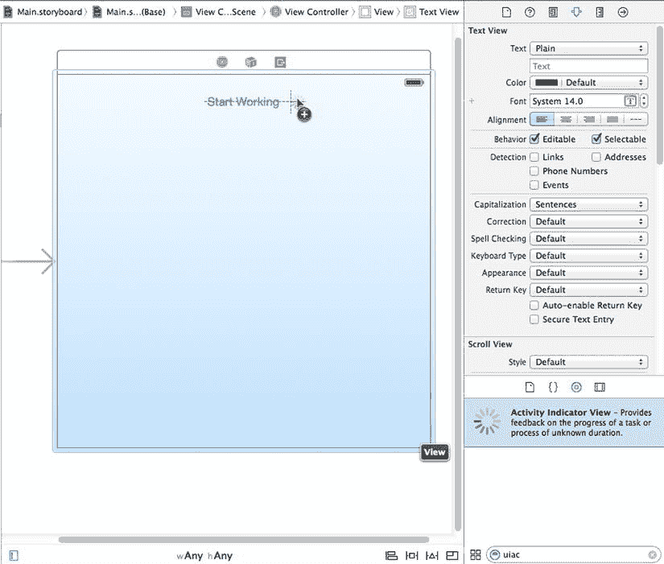

图 15-3. 在 Interface Builder 中将活动指示器视图拖入我们的主视图

选中活动指示器旋转控件后，使用 Attributes Inspector 勾选**Hides When Stopped**复选框，这样我们的旋转指示器只会在我们告诉它开始旋转时出现（没人希望 GUI 里出现一个不转的旋转指示器）。

接下来，按住 Control 键从**View Controller**图标拖到旋转指示器，并连接`spinner`输出口。保存你的更改。

现在打开`ViewController.m`。在这里，我们首先对`doWork:`方法做一些处理，添加几行代码来管理用户点击按钮时以及工作完成时按钮和旋转指示器的外观。我们首先将按钮的`enabled`属性设置为`NO`，这会阻止它注册任何点击，并通过使其文本变灰且略显透明来显示按钮已被禁用。接下来，我们通过调用`setAnimated:`方法来启动旋转指示器。在 block 的末尾，我们重新启用按钮并停止旋转指示器，这会导致它再次消失：

```objc
- (IBAction)doWork:(id)sender
{
    self.resultsTextView.text = @"";
    NSDate *startTime = [NSDate date];
    self.startButton.enabled = NO;

    [self.spinner startAnimating];
    dispatch_queue_t queue =
        dispatch_get_global_queue(DISPATCH_QUEUE_PRIORITY_DEFAULT, 0);
    dispatch_async(queue, ^{
        NSString *fetchedData = [self fetchSomethingFromServer];
        NSString *processedData = [self processData:fetchedData];
        NSString *firstResult = [self calculateFirstResult:processedData];
        NSString *secondResult = [self calculateSecondResult:processedData];
        NSString *resultsSummary = [NSString stringWithFormat:
                                    @"First: [%@]\nSecond: [%@]", firstResult,
                                    secondResult];
        dispatch_async(dispatch_get_main_queue(), ^{
            self.resultsTextView.text = resultsSummary;
            self.startButton.enabled = YES;
            [self.spinner stopAnimating];
        });
        NSDate *endTime = [NSDate date];
        NSLog(@"Completed in %f seconds",
              [endTime timeIntervalSinceDate:startTime]);
    });
}
```

构建并运行应用，然后按下按钮。这才像样，对吧？即使正在完成的工作需要几秒钟，用户也不至于被晾在一边。按钮被禁用并且外观上看起来也是禁用的。此外，动画旋转指示器让用户知道应用并没有真正挂起，并且可以预期会在某个时间点恢复正常。

### 并发 Block

到目前为止一切顺利，但我们还没有完成！你们当中目光敏锐的人会注意到，在完成这些步骤之后，我们实际上并没有真正改变算法（如果你能把这个简单的步骤列表称为算法的话）的基本顺序执行流程。我们所做的只是将这个方法的一个大块移动到后台线程，然后在主线程中完成收尾工作。Xcode 控制台输出证明了这一点：这项工作需要十秒才能运行完，就像开始时一样。房间里的大象是`calculateFirstResult:`和`calculateSecondResult:`不需要按顺序执行，并发执行它们可以为我们带来显著的加速。

幸运的是，GCD 有一种方法可以通过使用所谓的**调度组**来实现这一点。所有在组上下文内通过`dispatch_group_async()`函数异步调度的 block，都会尽可能快地执行，包括在可能的情况下被分配到多个线程并发执行。我们还可以使用`dispatch_group_notify()`来指定一个额外的 block，该 block 将在组中所有 block 运行完成后执行。

对你的`doWork:`副本进行以下更改。再次确保你正确添加了末尾的花括号和括号：


```objc
- (IBAction)doWork:(id)sender
{
    self.resultsTextView.text = @"";
    NSDate *startTime = [NSDate date];
    self.startButton.enabled = NO;
    self.startButton.alpha = 0.5f;
    [self.spinner startAnimating];
    dispatch_queue_t queue =
        dispatch_get_global_queue(DISPATCH_QUEUE_PRIORITY_DEFAULT, 0);
    dispatch_async(queue, ^{
        NSString *fetchedData = [self fetchSomethingFromServer];
        NSString *processedData = [self processData:fetchedData];
        NSString *firstResult = [self calculateFirstResult:processedData];
        NSString *secondResult = [self calculateSecondResult:processedData];
        __block NSString *firstResult;
        __block NSString *secondResult;
        dispatch_group_t group = dispatch_group_create();
        dispatch_group_async(group, queue, ^{
            firstResult = [self calculateFirstResult:processedData];
        });
        dispatch_group_async(group, queue, ^{
            secondResult = [self calculateSecondResult:processedData];
        });
        dispatch_group_notify(group, queue, ^{
            NSString *resultsSummary = [NSString stringWithFormat:
                                        @"First: [%@]\nSecond: [%@]",
                                        firstResult,
                                        secondResult];
            dispatch_async(dispatch_get_main_queue(), ^{
                self.resultsTextView.text = resultsSummary;
                self.startButton.enabled = YES;
                self.startButton.alpha = 1;
                [self.spinner stopAnimating];
            });
            NSDate *endTime = [NSDate date];
            NSLog(@"Completed in %f seconds",
                  [endTime timeIntervalSinceDate:startTime]);
        });
    });
}
```

这里的一个复杂之处在于，每个 `calculate` 方法都会返回一个我们希望捕获的值，因此我们必须先使用 `__block` 存储修饰符创建变量。这可以确保在 Block 内部设置的值对后续运行的代码可用。

完成这些之后，构建并再次运行应用程序。你会发现付出的努力得到了回报。由于我们同时运行了两次计算，原本需要十秒的操作现在仅需七秒。

显然，我们刻意设计的示例获得了最大效果，因为这两个“计算”实际上什么都没做，只是让它们所在的线程休眠。在实际应用中，加速效果取决于所执行的工作类型和可用的资源。只有存在多个 CPU 核心时，这种技术才有助于提升 CPU 密集型计算的性能，并且随着未来 iOS 设备增加更多核心，性能几乎会免费地进一步提升。其他用途，例如同时从多个网络连接获取数据，即使只有一个 CPU 也能看到速度提升。

如你所见，GCD 并非万能药。使用 GCD 并不会自动加速所有应用程序。但是，通过在应用程序中速度至关重要的位置，或者你发现应用程序对用户操作响应迟缓的地方，仔细应用这些技术，即使无法提升实际性能，也能轻松提供更好的用户体验。

### 后台处理

另一个处理并发的重要技术是后台处理。这允许你的应用程序在后台运行——在某些情况下，甚至在用户按下 Home 键之后。

不应将这一功能与现代桌面操作系统所具备的真正多任务处理相混淆，在现代桌面操作系统中，你启动的所有程序都会驻留在系统 RAM 中，直到你明确退出它们。iOS 设备的内存仍然太小，无法很好地实现这一点。相反，这种后台处理旨在允许需要特定系统功能的应用程序在后台时以受限的方式继续运行。例如，如果你有一个播放网络电台音频流的应用程序，即使用户切换到另一个应用，iOS 也会让该应用继续运行。除此之外，当你的应用播放音频时，它甚至会在 iOS 控制中心（从屏幕底部向上滑动时出现的半透明控制面板）提供标准的暂停和音量控制。

假设你正在创建一个执行以下某项操作的应用程序：即使用户正在运行其他应用也能播放音频、请求持续的位置更新、响应特定类型的推送请求以从服务器加载新数据，或者实现网络电话（VoIP）功能，让用户通过互联网发送和接听电话。在每种情况下，你都可以在应用的 `Info.plist` 文件中声明这种情况，系统就会以特殊方式对待你的应用。这种用法虽然有趣，但可能并非本书大多数读者会涉及的内容，因此我们不会在此深入探讨。

除了在后台运行应用之外，iOS 还支持在用户按下 Home 键后将应用置于挂起状态。这种挂起执行状态在概念上类似于将 Mac 置于睡眠模式。应用程序的整个工作内存都保存在 RAM 中，只是在挂起时不执行任何操作。因此，切换回此类应用的速度极快。这并不仅限于特殊的应用程序。事实上，这是你用 Xcode 构建的任何应用的默认行为（尽管可以通过 `Info.plist` 文件中的另一个设置禁用此功能）。要查看实际效果，请打开设备上的“邮件”应用，深入查看某封邮件。然后按下 Home 键，打开“备忘录”应用并选择一条笔记。接着双击 Home 键切换回“邮件”。你会发现没有明显的延迟；它会流畅地滑入位置，仿佛一直在运行。

对于大多数应用程序来说，这种自动挂起和恢复可能就是你所需要的全部功能。然而，在某些情况下，你的应用可能需要知道它即将被挂起以及刚刚被唤醒。系统通过 `UIApplication` 类提供了通知应用其执行状态变化的方法，该类为此提供了许多委托方法和通知。我们将在本章稍后部分向你展示如何使用它们。

当你的应用即将被挂起时，无论它是否属于特殊类型的后台应用，它都可以做一件事：请求在后台运行额外的少量时间。其目的是确保你的应用有足够的时间关闭所有打开的文件、网络资源等。我们稍后会给出一个示例。

## 应用生命周期

在深入探讨如何处理应用执行状态变化的具体细节之前，我们先来聊聊其生命周期中的各种状态：


# iOS 应用状态管理

### 应用状态

- **Not Running**: 这是设备刚重启后所有应用所处的状态。设备开机后曾经启动过的应用只有在特定条件下才会回到此状态：
    - 如果其`Info.plist`包含`UIApplicationExitsOnSuspend`键（且值设置为`YES`）
    - 如果之前处于 Suspended 状态，且系统需要清理内存
    - 如果在运行时崩溃
- **Active**: 这是应用显示在屏幕上时的正常运行状态。它可以接收用户输入并更新显示。
- **Background**: 在此状态下，应用有一定时间执行代码，但不能直接访问屏幕或获取用户输入。用户按下 Home 键时，所有应用都会短暂进入此状态；大多数应用会很快转入 Suspended 状态。需要进行后台处理的应用会保持此状态，直到再次变为 Active 状态。
- **Suspended**: 处于 Suspended 状态的应用被冻结。这是普通应用在短暂处于 Background 状态后的状态。应用在 Active 时使用的所有内存都被原样保留。如果用户将应用带回 Active 状态，它将从离开的地方继续运行。另一方面，如果系统需要为当前 Active 的应用腾出更多内存，任何 Suspended 应用都可能被终止（并回到 Not Running 状态），释放其内存供其他用途。
- **Inactive**: 应用仅在两个其他状态之间短暂停留时进入 Inactive 状态。应用能长时间保持 Inactive 的唯一情况是用户正在处理系统提示（如来电或短信提示），或用户锁定了屏幕。此状态基本上是一种中间状态。

### 状态变更通知

为了管理这些状态之间的切换，`UIApplication`定义了一系列可由其委托实现的方法。除了委托方法外，`UIApplication`还定义了一组匹配的通知名称（见表 15-1）。这使得应用委托之外的其他对象也能在应用状态变化时注册通知。

**表 15-1** 跟踪应用执行状态的委托方法及其对应的通知名称

| 委托方法 | 通知名称 |
| --- | --- |
| `application:didFinishLaunchingWithOptions:` | `UIApplicationDidFinishLaunchingNotification` |
| `applicationWillResignActive:` | `UIApplicationWillResignActiveNotification` |
| `applicationDidBecomeActive:` | `UIApplicationDidBecomeActiveNotification` |
| `applicationDidEnterBackground:` | `UIApplicationDidEnterBackgroundNotification` |
| `applicationWillEnterForeground:` | `UIApplicationWillEnterForegroundNotification` |
| `applicationWillTerminate:` | `UIApplicationWillTerminateNotification` |

请注意，这些方法中的每一个都直接与运行状态之一相关：Active、Inactive 和 Background。每个委托方法仅在这些状态之一中被调用（每个通知也仅在这些状态下发布）。最重要的状态转换是 Active 与其他状态之间的转换。有些转换，如从 Background 到 Suspended，是不经任何通知发生的。我们来逐一讲解这些方法及其使用方式。

第一个方法是`application:didFinishLaunchingWithOptions:`，你在本书中已经多次见过。这是应用启动后直接进行应用级编码的主要方式。还有一个类似的方法叫`application:willFinishLaunchingWithOptions:`，它会先被调用，适用于使用基于视图控制器的状态保存功能的应用。该方法未在此列出，因为它与状态变更无关。

接下来的两个方法`applicationWillResignActive:`和`applicationDidBecomeActive:`在多种情况下使用。如果用户按下 Home 键，会调用`applicationWillResignActive:`。如果用户稍后将应用带回前台，会调用`applicationDidBecomeActive:`。用户接听电话时也会发生相同的事件序列。此外，`applicationDidBecomeActive:`在应用首次启动时也会被调用！总的来说，这一对方法标记了应用从 Active 状态到 Inactive 状态的移动。它们是启用和禁用动画、应用内音频或其他与用户呈现相关项的好地方。由于`applicationDidBecomeActive:`在多种情况下被使用，你可能希望将部分应用初始化代码放在此处，而非`application:didFinishLaunchingWithOptions:`中。请注意，不要在`applicationWillResignActive:`中假设应用将进入后台；它可能只是暂时的变化，最终会回到 Active 状态。

在这些方法之后是`applicationDidEnterBackground:`和`applicationWillEnterForeground:`，它们的使用领域略有不同：处理确实被发送到后台的应用。`applicationDidEnterBackground:`是应用应释放所有可稍后重建的资源、保存所有用户数据、关闭网络连接等的地方。如果你需要，这也是请求更多后台运行时间的地方，我们稍后会演示。如果你在`applicationDidEnterBackground:`中花费了太多时间（超过大约五秒），系统会判定你的应用行为异常并终止它。你应该实现`applicationWillEnterForeground:`来重新创建在`applicationDidEnterBackground:`中销毁的内容，例如重新加载用户数据、重新建立网络连接等。请注意，当`applicationDidEnterBackground:`被调用时，你可以安全地假设`applicationWillResignActive:`最近也被调用过。同样，当`applicationWillEnterForeground:`被调用时，你可以假设`applicationDidBecomeActive:`也很快会被调用。

列表中的最后一个是`applicationWillTerminate:`，你可能很少（如果有的话）会用到它。只有当你的应用已经在后台，且系统因某种原因决定跳过挂起而直接终止应用时，才会调用它。

### 创建状态实验室

现在你已经对应用状态转换有了基本的理论理解，让我们通过一个简单的应用来测试这些知识。该应用所做的只是在每次调用这些方法时向 Xcode 的控制台日志写一条消息。然后，我们将像用户一样以多种方式操作运行中的应用，观察发生了哪些转换。要充分利用这个示例，你需要一台 iOS 设备。如果没有，你可以使用模拟器并跳过需要设备的部分。

在 Xcode 中，基于 Single View Application 模板创建一个新项目，并将其命名为`State Lab`。至少最初，这个应用除了默认的灰色屏幕外什么都不显示。稍后，我们会让它做更有趣的事情，但目前，它生成的所有输出都将进入 Xcode 控制台。`AppDelegate.m`文件已经包含了我们感兴趣的所有方法。我们只需要添加一些日志记录，如下所示（以粗体显示）。注意，为了简洁起见，我们还删除了这些方法中的注释：

```objc
#import "AppDelegate.h"
#import "ViewController.h"

@implementation AppDelegate

- (BOOL)application:(UIApplication *)application didFinishLaunchingWithOptions:(NSDictionary *)launchOptions
{
    NSLog(@"%@", NSStringFromSelector(_cmd));
    return YES;
}
```


```
- (void)applicationWillResignActive:(UIApplication *)application
{
    NSLog(@"%@", NSStringFromSelector(_cmd));
}

- (void)applicationDidEnterBackground:(UIApplication *)application
{
    NSLog(@"%@", NSStringFromSelector(_cmd));
}

- (void)applicationWillEnterForeground:(UIApplication *)application
{
    NSLog(@"%@", NSStringFromSelector(_cmd));
}

- (void)applicationDidBecomeActive:(UIApplication *)application
{
    NSLog(@"%@", NSStringFromSelector(_cmd));
}

- (void)applicationWillTerminate:(UIApplication *)application
{
    NSLog(@"%@", NSStringFromSelector(_cmd)); 
}

@end
```

你可能会好奇我们在所有这些方法中使用的那个`NSLog`调用。Objective-C 提供了一个便捷的内置变量 `_cmd`，它始终包含当前方法的 selector。**selector**，如果需要回顾一下，就是 Objective-C 中引用方法的方式。`NSStringFromSelector` 函数返回给定 selector 的 `NSString` 表示形式。我们在这里的使用方式，只是提供了一种快捷方式来输出当前方法名，而无需重新输入或复制粘贴它。

### 探索执行状态

现在构建并运行应用。模拟器会启动并运行我们的应用程序。切换回 Xcode 并查看控制台（**视图** → **调试区域** → **激活控制台**），你应该会看到类似这样的内容：

```
2014-06-26 19:12:36.953 State Lab[12751:70b] application:didFinishLaunchingWith
Options:
2014-06-26 19:12:36.957 State Lab[12751:70b] applicationDidBecomeActive:
```

在这里，你可以看到应用程序已成功启动并转移到了活跃状态。现在回到模拟器并按下 Home 按钮（你需要从模拟器的菜单中选择 **硬件** → **Home** 或按下键盘上的 ⌘**H** 来操作），你应该会在控制台中看到以下内容：

```
2014-06-26 19:13:10.378 State Lab[12751:70b] applicationWillResignActive:
2014-06-26 19:13:10.386 State Lab[12751:70b] applicationDidEnterBackground:
```

这两行显示了应用实际上在两个状态之间转换：它首先变为非活跃状态，然后进入后台状态。你在这里看不到的是，应用还会切换到第三个状态：挂起状态。请记住，你**不会**收到任何关于此事件的通知；这完全在你的控制之外。请注意，应用在某种程度上仍然是活动的，并且 Xcode 仍然与其连接，即使它实际上并未获得任何 CPU 时间。通过点击应用的图标重新启动它来验证这一点，这应该会产生如下输出：

```
2014-06-26 19:13:55.739 State Lab[12751:70b] applicationWillEnterForeground:
2014-06-26 19:13:55.739 State Lab[12751:70b] applicationDidBecomeActive:
```

你看，应用又恢复运行了。该应用之前处于挂起状态，被唤醒到非活跃状态，然后最终又变为活跃状态。那么，当应用真的被终止时会发生什么？再次点击 Home 按钮，你会看到：

```
2014-06-26 19:14:35.035 State Lab[12751:70b] applicationWillResignActive:
2014-06-26 19:14:35.036 State Lab[12751:70b] applicationDidEnterBackground:
```

现在双击 Home 按钮（即按下 ⌘**HH**——你需要按两次 **H** 键）。应该会出现应用横向滚动的屏幕。在 State Lab 的截图上按住并向上滑动，直到它飞出屏幕，从而杀死应用程序。会发生什么？你可能会惊讶地发现，我们所有的 `NSLog` 调用都没有向控制台打印任何内容。相反，程序在 `main.m` 中对 `UIMainApplication` 函数的调用处挂起，并显示错误消息“Thread 1: signal SIGKILL”。点击 Xcode 左上角的 **停止** 按钮，State Lab 就这样被真正且完全地终止了。

事实证明，当系统将应用从挂起状态转移到非运行状态时，`applicationWillTerminate:` 方法通常不会调用。当一个应用处于挂起状态时，无论系统是决定将其转储以回收内存，还是你手动强制退出它，应用都会直接消失，没有任何机会执行任何操作。`applicationWillTerminate:` 方法仅在**被终止的应用处于后台状态**时才会被调用。例如，如果你的应用在后台状态下积极运行，以预定义的方式之一（音频播放、GPS 使用等）使用系统资源，然后被用户或系统强制退出，就可能会发生这种情况。在我们刚刚用 State Lab 探索的场景中，该应用处于挂起状态，而非后台状态，因此被立即终止，没有任何通知。

**提示** 不要依赖调用 `applicationWillTerminate:` 方法来保存应用状态——而应在 `applicationDidEnterBackground:` 方法中执行此操作。

这里还有一个值得探讨的有趣交互。即当系统显示一个警示对话框时会发生什么，它会临时接管应用的输入流，并将其置于非活跃状态。这种状态只有在真机上运行时才能轻易触发（模拟器不行），方法是使用内置的“信息”应用。“信息”应用和许多其他应用一样，可以从外部接收消息，并通过多种方式显示它们。

要了解这些是如何设置的，请在设备上运行“设置”应用，从列表中选择“通知”，然后从应用列表中选择“信息”应用。早在 iOS 5 中就首次亮相的、火爆的“新”消息显示方式称为**横幅**。它的工作方式是在屏幕顶部显示一个覆盖的小横幅，这不需要中断当前正在运行的任何应用。我们想要展示的是古老且糟糕的“提醒”方法，它会在当前应用前面显示一个模态面板，需要用户进行操作。在**解锁时的提醒样式**标题下，选择**提醒**，这样信息应用就变回了一个 iOS 4 及更早版本的用户总是不得不面对的那种烦人的家伙。

现在回到你的电脑上。在 Xcode 中，使用左上角的下拉菜单从模拟器切换到你的设备，然后点击 **运行** 按钮在设备上构建并运行应用。现在你需要做的就是从外部给你的设备发送一条消息。如果你的设备是 iPhone，你可以从另一部手机发送一条短信。如果是 iPod touch 或 iPad，你只能使用 Apple 自家的 iMessage 通信，它在所有 iOS 设备以及 OS X 的信息应用中都能使用。找出适合你设置的方式，并通过短信或 iMessage 给你的设备发送一条消息。当你的设备显示包含传入消息的系统提醒时，Xcode 控制台中会出现：

```
2014-06-26 00:04:28.295 State Lab[16571:60b] applicationWillResignActive:
```

请注意，我们的应用并没有被发送到后台。它处于非活跃状态，并且仍然可以在系统提醒后面看到。如果这个应用是一个游戏，或者正在运行任何视频、音频或动画，我们可能需要在这个时机暂停它们。

点击提醒上的 **关闭** 按钮，你会得到：

```
2014-06-26 00:05:23.830 State Lab[16571:60b] applicationDidBecomeActive:
```

现在，让我们看看如果你决定回复这条消息会发生什么。再向你的设备发送一条消息，生成：

```
2013-11-18 00:05:55.487 State Lab[16571:60b] applicationWillResignActive:
```

这次，点击 **回复**，这会将你切换到信息应用，你应该会看到以下一系列活动：

```
2014-06-26 00:06:10.513 State Lab[16571:60b] applicationDidBecomeActive:
2014-06-26 00:06:11.137 State Lab[16571:60b] applicationWillResignActive:
2014-06-26 00:06:11.140 State Lab[16571:60b] applicationDidEnterBackground:
```


有趣！我们的应用快速进入`Active`状态，又变为`Inactive`状态，最后进入`Background`状态（然后悄无声息地进入`Suspended`状态）。

#### 利用执行状态变化

那么，我们该如何应对这一切呢？根据刚才演示的内容，在处理这些状态变化时，似乎遵循着一个明确的策略。

**Active**  **Inactive**

使用 `applicationWillResignActive:` / `UIApplicationWillResignActiveNotification` 来“暂停”应用的显示。如果你的应用是游戏，你可能已经有某种方式暂停游戏进程。对于其他类型的应用，确保没有正在进行的对用户输入有严格时间要求的操作，因为你的应用将在一段时间内无法接收任何用户输入。

**Inactive**  **Background**

使用 `applicationDidEnterBackground:` / `UIApplicationDidEnterBackgroundNotification` 来释放那些在应用进入后台后无需保留的资源（例如缓存的图片或其他易于重新加载的数据），或是那些在后台状态下无法维持的资源（例如活跃的网络连接）。在此处清除多余的内存占用，可以使你的应用最终的`Suspended`快照更小，从而降低应用被完全从 RAM 中清除的风险。你还应借此机会保存任何应用数据，以帮助用户在下次重新启动应用时从上次离开的地方继续。如果应用重新回到`Active`状态，这通常无关紧要；然而，如果应用被清除并需要重新启动，用户会很感激能从上一次的位置继续。

**Background**  **Inactive**

使用 `applicationWillEnterForeground:` / `UIApplicationWillEnterForeground` 来撤销你在从`Inactive`切换到`Background`时所做的任何操作。例如，在此处你可以重新建立持久的网络连接。

**Inactive**  **Active**

使用 `applicationDidBecomeActive:` / `UIApplicationDidBecomeActive` 来撤销你在从`Active`切换到`Inactive`时所做的任何操作。请注意，如果你的应用是游戏，这通常并不意味着直接从暂停状态跳回游戏；你应该让用户自行决定何时继续。还要记住，当应用刚启动时也会调用此方法和通知，因此你在此处所做的任何操作也必须在该上下文中正常工作。

对于 **Inactive**  **Background** 的转换有一个特殊考量。它不仅在上面的列表中有最长的描述，而且很可能也是应用中代码和时间最密集的转换，因为你可能希望应用进行大量的记录工作。当此转换正在进行时，系统不会给予你无限的时间来保存更改。它只给你大约五秒钟的时间。如果你的应用从委托方法返回（以及处理你注册的任何通知）所需时间超过此限制，那么你的应用将被立即从内存中清除并进入“未运行”状态！如果这看起来不公平，别担心，因为有补救措施。在处理该委托方法或通知时，你可以请求系统在后台队列中为你执行一些额外的工作，这可以为你争取一些额外时间。我们将在下一节演示该技术。

#### 处理 Inactive 状态

你的应用最可能遇到的状态变化是从`Active`到`Inactive`，然后再回到`Active`。你可能还记得，当你的 iPhone 在应用运行期间收到一条短信并显示给用户时，就会发生这种情况。在本节中，我们将让 State Lab 做一些视觉上有趣的事情，这样你就能看到如果你忽略该状态变化会发生什么。接下来，我们将向你展示如何修复它。

我们还将向显示界面添加一个`UILabel`，并使用 Core Animation 使其移动，这是一种在 iOS 中实现对象动画的非常好的方式。

首先，在`ViewController.m`中添加一个`UILabel`作为实例变量和属性：

```objc
#import "ViewController.h"

@interface ViewController ()

@property (strong, nonatomic) UILabel *label;

@end
```

现在，让我们在视图加载时设置标签。将此处显示的粗体行添加到`viewDidLoad`方法中：

```objc
- (void)viewDidLoad
{
    [super viewDidLoad];
    // Do any additional setup after loading the view, typically from a nib.
    CGRect bounds = self.view.bounds;
    CGRect labelFrame = CGRectMake(bounds.origin.x, CGRectGetMidY(bounds) - 50,
                                   bounds.size.width, 100);
    self.label = [[UILabel alloc] initWithFrame:labelFrame];
    self.label.font = [UIFont fontWithName:@"Helvetica" size:70];
    self.label.text = @"Bazinga!";
    self.label.textAlignment = NSTextAlignmentCenter;
    self.label.backgroundColor = [UIColor clearColor];
    [self.view addSubview:self.label];
}
```

是时候设置一些动画了。我们将定义两个方法：一个用于将标签旋转到倒置位置，另一个用于将其旋转回正常位置：

```objc
- (void)rotateLabelDown
{
    [UIView animateWithDuration:0.5
            animations:^{
                self.label.transform = CGAffineTransformMakeRotation(M_PI);
            }
            completion:^(BOOL finished){
                [self rotateLabelUp];
            }];
}

- (void)rotateLabelUp
{
    [UIView animateWithDuration:0.5
            animations:^{
                self.label.transform = CGAffineTransformMakeRotation(0);
            }
            completion:^(BOOL finished){ 
                [self rotateLabelDown];
            }];
}
```

这里需要稍作解释。`UIView`定义了一个名为`animateWithDuration:animations:completion:`的类方法，用于设置动画。我们在动画块中设置的任何可动画属性都不会立即对接收者产生效果。相反，Core Animation 会平滑地将该属性从其当前值过渡到我们指定的新值。这就是所谓的**隐式动画**，它是 Core Animation 的主要特性之一。最后的完成块让我们可以指定动画完成后会发生什么。请仔细注意这个块的语法：

```objc
completion:^(BOOL finished){
         [self rotateLabelDown];
}];
```

粗体代码是块的签名——它表明该块被调用时带有一个布尔参数，并且不返回任何内容。如果动画正常完成，参数值为`true`；如果动画被取消，则为`false`。在这个例子中，我们没有使用这个参数。

因此，每个方法都将标签的`transform`属性设置为特定的旋转角度（以弧度为单位），并使用完成块来调用另一个方法，这样文本就会永远来回动画。

最后，我们需要设置一种启动动画的方式。目前，我们通过在`viewDidLoad`末尾添加以下行来实现：

```objc
    [self rotateLabelDown];
```

现在，构建并运行应用。你应该会看到*Bazinga!*标签来回旋转（见图 15-4）。

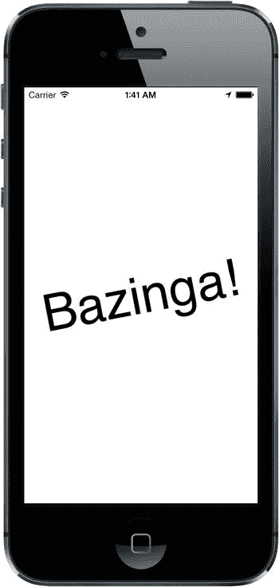

图 15-4. State Lab 应用展示其标签旋转魔法

要测试 **Active**  **Inactive** 的转换，你确实需要再次在实际的 iPhone 上运行此应用，并从其他地方向其发送一条短信。不幸的是，在苹果迄今为止发布的任何版本的 iOS 模拟器中都无法模拟这种行为。如果你还无法在设备上构建和安装，或者没有 iPhone，你将无法亲自尝试。在这种情况下，请尽可能跟上我们的讲解！


好的，作为一名高级文档工程师和翻译员，我将严格遵守您提供的注意事项和示例格式，将给定的英文文本翻译成中文。


在 iPhone 上构建并运行该应用，你会看到动画正在运行。现在向设备发送一条短信。当系统弹出提示显示消息时，你会看到动画仍在继续运行！这也许有点滑稽，但对用户来说可能很烦人。我们将使用应用状态转换通知来在这种情况下停止动画。

我们的控制器类需要一些内部状态来跟踪在任何给定时间是否应该执行动画。为此，我们在 `ViewController.m` 中添加一个 ivar。因为这个简单的 `BOOL` 不需要被任何外部类访问，所以我们跳过头文件，将其添加到 `@implementation` 部分：

```
@implementation ViewController {
    BOOL animate;
}
```

如你所见，应用状态的变化会通知给应用委托，但由于我们的类不是应用委托，我们不能仅仅实现委托方法并期望它们起作用。相反，我们注册以接收应用在其执行状态发生变化时的通知。通过在 `ViewController.m` 的 `viewDidLoad` 方法末尾添加以下代码来实现：

```
  NSNotificationCenter *center = [NSNotificationCenter defaultCenter];
  [center addObserver:self
          selector:@selector(applicationWillResignActive)
              name:UIApplicationWillResignActiveNotification
            object:nil];
  [center addObserver:self
          selector:@selector(applicationDidBecomeActive)
              name:UIApplicationDidBecomeActiveNotification
            object:nil];
```

这设置好了这两个通知，因此每个通知都将在适当的时候调用我们类中的一个方法。在 `@implementation` 块内任意位置定义这些方法：

```
- (void)applicationWillResignActive
{
    NSLog(@"VC: %@", NSStringFromSelector(_cmd));
    animate = NO;
}

- (void)applicationDidBecomeActive
{
    NSLog(@"VC: %@", NSStringFromSelector(_cmd));
    animate = YES;
    [self rotateLabelDown];
}
```

这段代码包含了和之前一样的方法日志记录，这样你就可以在 Xcode 控制台中看到这些方法发生的位置。我们添加了前缀 `"VC: "` 以区分此调用与委托中的 `NSLog()` 调用（`VC` 代表视图控制器）。第一个方法只是关闭 `animate` 标志。第二个方法重新打开该标志，然后实际再次启动动画。为了让第一个方法生效，我们需要添加一些代码来检查 `animate` 标志，并且仅当其启用时才继续执行动画：

```
- (void)rotateLabelUp
{
    [UIView animateWithDuration:0.5
            animations:^{
                self.label.transform = CGAffineTransformMakeRotation(0);
            }
            completion:^(BOOL finished){
                if (animate) {
                    [self rotateLabelDown];
                }
            }];
}
```

我们将其添加到 `rotateLabelUp` 的完成块（且仅在此处），这样只有当文本朝上时，动画才会停止。

最后，既然我们现在在应用变为活跃状态时（这发生在启动后立即）启动动画，我们不再需要在 `viewDidLoad` 中调用 `rotateLabelDown`，所以删除它：

```
- (void)viewDidLoad {
    [self rotateLabelDown];

NSNotificationCenter *center = [NSNotificationCenter defaultCenter];
}
```

现在再次构建并运行该应用，你会看到它像以前一样执行动画。再次向你的 iPhone 发送一条短信。这次，当系统提示出现时，你会看到背景中的动画在文本朝上时立即停止。点击**关闭**按钮，动画重新开始。

现在你已经了解了在从活跃状态切换到非活跃状态再切换回来的简单情况下该怎么做。更大的任务，或许也是更重要的任务，是处理切换到后台然后再切换回前台的情况。

### 处理后台状态

如前所述，切换到后台状态对于确保最佳用户体验非常重要。这是你需要释放任何可以轻松重新获取（或者当你的应用静默时无论如何都会丢失的）资源，并保存有关应用当前状态信息的地方，同时所有这些操作都不能占用主线程超过五秒钟。

为了演示这些行为中的一部分，我们将以几种方式扩展 State Lab。首先，我们将在显示中添加一张图片，以便稍后展示如何移除内存中的图片。然后，我们将展示如何保存应用状态的一些信息，以便之后可以轻松恢复。最后，我们将展示如何通过将所有工作放入后台队列来确保这些活动不会占用太多主线程时间。

#### 进入后台时移除资源

首先，将书籍源码归档中的 `15 – Image` 文件夹中的 `smiley.png` 添加到你的项目的 `State Lab` 文件夹中。确保选中告知 Xcode 将文件复制到项目目录的复选框。不要将其添加到 `Images.xcassets` 资源目录中，因为那将提供自动缓存，这会干扰我们将要实现的具体资源管理。

现在，让我们在 `ViewController.m` 中为图片和图片视图添加属性：

```
@interface ViewController ()

@property (strong, nonatomic) UILabel *label;
@property (strong, nonatomic) UIImage *smiley;
@property (strong, nonatomic) UIImageView *smileyView;

@end
```

接下来，设置图片视图并将其放置在屏幕上，修改 `viewDidLoad` 方法，如下所示：

```
- (void)viewDidLoad
{
    [super viewDidLoad];
    // 从 nib 加载视图后进行任何额外的设置。
    CGRect bounds = self.view.bounds;
    CGRect labelFrame = CGRectMake(bounds.origin.x, CGRectGetMidY(bounds) - 50,
                                   bounds.size.width, 100);
    self.label = [[UILabel alloc] initWithFrame:labelFrame];
    self.label.font = [UIFont fontWithName:@"Helvetica" size:70];
    self.label.text = @"Bazinga!";
    self.label.textAlignment = NSTextAlignmentCenter;
    self.label.backgroundColor = [UIColor clearColor];

// smiley.png 尺寸为 84 x 84
    CGRect smileyFrame = CGRectMake(CGRectGetMidX(bounds) - 42,
                                    CGRectGetMidY(bounds)/2 - 42,
                                    84, 84);
    self.smileyView = [[UIImageView alloc] initWithFrame:smileyFrame];
    self.smileyView.contentMode = UIViewContentModeCenter;
    NSString *smileyPath = [[NSBundle mainBundle] pathForResource:@"smiley"
                                                           ofType:@"png"];
    self.smiley = [UIImage imageWithContentsOfFile:smileyPath];
    self.smileyView.image = self.smiley;

[self.view addSubview:self.smileyView];

[self.view addSubview:self.label];

NSNotificationCenter *center = [NSNotificationCenter defaultCenter];
    [center addObserver:self
               selector:@selector(applicationWillResignActive)
                   name:UIApplicationWillResignActiveNotification
                 object:nil];
    [center addObserver:self
               selector:@selector(applicationDidBecomeActive)
                   name:UIApplicationDidBecomeActiveNotification
                 object:nil];
}
```

构建并运行该应用，你将在屏幕顶部看到一个看起来非常开心的笑脸（请参见图 15-5）。

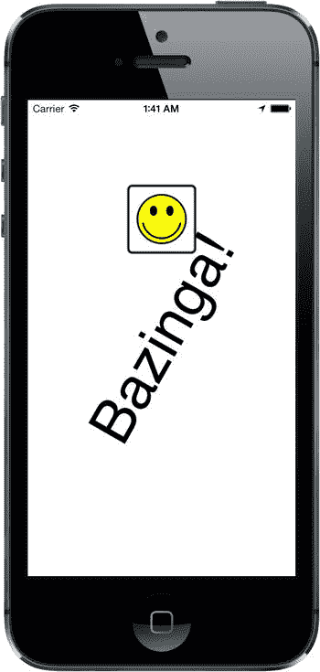

图 15-5. State Lab 应用在标签旋转动画的基础上添加了笑脸图标


接下来，按下主屏幕按钮将应用切换到后台，然后点击它的图标重新启动。你会看到当应用恢复时，标签会像预期一样重新开始旋转。一切看似正常，但实际上，我们还没有尽可能优化系统资源的使用。

请记住，在应用处于挂起状态时，我们使用的资源越少，iOS 完全终止应用的风险就越低。通过适时清除内存中易于重新创建的资源，我们增加了应用留存的可能性，从而使其能极快地重新启动。

我们来考虑一下那个笑脸表情的处理。我们希望在进入后台状态时释放该图像，并在从后台状态返回时重新创建它。为此，我们需要在 `viewDidLoad:` 中添加另外两个通知注册：

```
[center addObserver:self
           selector:@selector(applicationDidEnterBackground)
               name:UIApplicationDidEnterBackgroundNotification
             object:nil];
[center addObserver:self
           selector:@selector(applicationWillEnterForeground)
               name:UIApplicationWillEnterForegroundNotification
             object:nil];
```

并且我们需要实现这两个新方法：

```
- (void)applicationDidEnterBackground
{
    NSLog(@"VC: %@", NSStringFromSelector(_cmd));
    self.smiley = nil;
    self.smileyView.image = nil;
}

- (void)applicationWillEnterForeground
{
    NSLog(@"VC: %@", NSStringFromSelector(_cmd));
    NSString *smileyPath = [[NSBundle mainBundle] pathForResource:@"smiley"
                                                           ofType:@"png"];
    self.smiley = [UIImage imageWithContentsOfFile:smileyPath];
    self.smileyView.image = self.smiley;
}
```

构建并运行应用，重复将应用置于后台再切换回来的步骤。你应该会看到，从用户的角度来看，行为几乎没有变化。如果你想亲自验证这确实在发生，可以将 `applicationWillEnterForeground` 方法的内容注释掉，然后再次构建并运行应用。你会看到图像确实消失了。

#### 进入后台时保存状态

现在你已经看到了一个在进入后台状态时释放某些资源的例子，是时候考虑保存状态了。请记住，思路是保存与用户当前操作相关的信息，这样如果你的应用后来被从内存中清除，用户下次返回时仍然可以从他们离开的地方继续。

我们这里讨论的状态实际上是应用级别的，而不是视图级别的。不要将其与保存和恢复视图位置或用户最后一次活跃时正在查看的哪个应用屏幕混淆——对于后者，iOS 提供了状态保存和恢复机制，你可以在苹果网站上的 *iOS App Programming Guide*（*[`developer.apple.com/library/ios/documentation/iphone/conceptual/iphoneosprogrammingguide/StatePreservation/StatePreservation.html`](https://developer.apple.com/library/ios/documentation/iphone/conceptual/iphoneosprogrammingguide/StatePreservation/StatePreservation.html)*）中阅读相关内容。在这里，我们考虑的是那些你不想为其实现单独设置包的应用中的用户偏好。使用我们在第 12 章中介绍的相同 `NSUserDefaults` API，你可以快速轻松地从应用内部保存偏好设置，并在稍后读取它们。当然，如果你的应用在视觉上不复杂，或者你不想使用状态保存和恢复机制，你也可以将允许你在用户偏好中恢复其视觉状态的信息保存下来。

State Lab 示例过于简单，没有真实的用户偏好，所以让我们走个捷径，在其唯一的视图控制器中添加一些应用特定状态。在 *ViewController.m* 中添加一个名为 `index` 的属性，以及一个分段控件：

```
#import "ViewController.h"

@interface ViewController ()

@property (strong, nonatomic) UILabel *label;
@property (strong, nonatomic) UIImage *smiley;
@property (strong, nonatomic) UIImageView *smileyView;
@property (assign, nonatomic) NSInteger index;
@property (strong, nonatomic) UISegmentedControl *segmentedControl;

@end
```

我们将允许用户通过分段控件设置此属性的值，并将其保存到用户默认设置中。然后我们将终止并重新启动应用，以演示我们可以恢复该属性的值。

接下来，转到 `viewDidLoad` 方法的中间部分，在这里创建分段控件，并将其添加到视图中：

```
.
.
.
    self.smileyView.image = self.smiley;

self.segmentedControl = [[UISegmentedControl alloc] initWithItems:
                             [NSArray arrayWithObjects: @"One", @"Two", @"Three", @"Four", nil]] ;
    self.segmentedControl.frame = CGRectMake(bounds.origin.x + 20,
                                              50, bounds.size.width - 40, 30);
        [self.segmentedControl addTarget:self action:@selector(selectionChanged:) forControlEvents:UIControlEventValueChanged];

[self.view addSubview:self.segmentedControl];
    [self.view addSubview:self.smileyView];
    [self.view addSubview:self.label];
.
```

我们还使用了 `addTarget:action:forControlEvents:` 方法将分段控件连接到 `selectionChanged:` 方法，当所选分段发生变化时需要调用该方法。在 *ViewController.m* 文件的任意位置添加此方法的实现：

```
- (void)selectionChanged:(UISegmentedControl *)sender {
    self.index = sender.selectedSegmentIndex;
}
```

现在，每当用户更改所选分段时，`index` 属性的值都会更新。

构建并运行应用。你应该能看到分段控件，并且可以点击其分段逐个选中它们。当你这样做时，`index` 属性的值会发生变化，尽管你实际上看不到这一过程。再次点击主屏幕按钮将应用置于后台，调出任务栏（双击主屏幕按钮）并终止应用，然后重新启动它。当应用重新启动时，`index` 属性的值将再次为 0，并且将没有选中的分段。这就是我们接下来需要修复的问题。

保存 `index` 属性的值非常简单；我们只需要在 *ViewController.m* 的 `applicationDidEnterBackground` 方法末尾添加一行代码即可：

```
- (void)applicationDidEnterBackground
{
    NSLog(@"VC: %@", NSStringFromSelector(_cmd));
    self.smiley = nil;
    self.smileyView.image = nil;
    [[NSUserDefaults standardUserDefaults] setInteger:self.index forKey:@"index"];
}
```

但是我们应该在哪里恢复属性值并用它来配置分段控件呢？这个方法的逆方法 `applicationWillEnterForeground` 并不是我们想要的。当该方法被调用时，应用已经运行，设置仍然完好。相反，我们需要在新启动后进行设置时访问此值，这让我们回到了 `viewDidLoad` 方法。将此处显示的粗体行添加到该方法中：

```
.
    [self.view addSubview:self.label];

self.index = [[NSUserDefaults standardUserDefaults] integerForKey:@"index"];
    self.segmentedControl.selectedSegmentIndex = self.index;
.
```


当应用程序首次启动时，用户默认设置中不会保存任何值。在这种情况下，`integerForKey:` 方法返回值零，而这恰好是 `index` 属性的正确初始值。如果您想使用不同的初始值，可以通过将其注册为 `index` 键的默认值来实现，如第 12 章中的“注册默认值”所述。

现在构建并运行应用程序。您会立即注意到一个差异——分段控件中的第一个分段被预选中，因为其选中分段索引已在 `viewDidLoad` 方法中设置。然后触摸一个分段，接着执行完整的后台杀死-重启操作。您会发现——索引值已恢复，因此分段控件中的正确分段现在被选中！

显然，我们在此展示的内容非常基础，但这一概念可以扩展到各种应用程序状态。由您决定将这个概念应用到何种程度，以便为用户维持一种假象——您的应用始终存在，只等他们回来！

#### 请求更多后台时间

之前，我们提到如果进入后台状态花费过多时间，应用可能会从内存中被转储。例如，您的应用可能正在进行文件传输，中途中断确实可惜；然而，试图劫持 `applicationDidEnterBackground` 方法，让它在应用真正进入后台之前完成工作，并非明智之举。相反，您应该将 `applicationDidEnterBackground` 用作一个平台，告诉系统您有一些额外工作要做，然后启动一个代码块来实际执行。假设系统有足够的可用 RAM 在用户执行其他操作时保持应用在内存中，系统会满足您的要求，让您的应用继续运行一段时间。

我们将通过一个简单的 `sleep` 调用来演示这一点，而非实际文件传输。再次，我们将使用新认识的 GCD 和块，使 `applicationDidEnterBackground` 方法的内容在独立队列中运行。

在 `ViewController.m` 中，修改 `applicationDidEnterBackground` 方法如下：

```objc
- (void)applicationDidEnterBackground
{
    NSLog(@"VC: %@", NSStringFromSelector(_cmd));
    self.smiley = nil;
    self.smileyView.image = nil;
    [[NSUserDefaults standardUserDefaults] setInteger:self.index forKey:@"index"];
    UIApplication *app = [UIApplication sharedApplication];

    __block UIBackgroundTaskIdentifier taskId = [app beginBackgroundTaskWithExpirationHandler:^{
        NSLog(@"Background task ran out of time and was terminated.");
        [app endBackgroundTask:taskId];
    }];

    if (taskId == UIBackgroundTaskInvalid) {
        NSLog(@"Failed to start background task!");
        return;
    }

    dispatch_async(dispatch_get_global_queue(DISPATCH_QUEUE_PRIORITY_DEFAULT, 0),
    ^{
        NSLog(@"Starting background task with %f seconds remaining",
              app.backgroundTimeRemaining);
        self.smiley = nil;
        self.smileyView.image = nil;

        // simulate a lengthy (25 seconds) procedure
        [NSThread sleepForTimeInterval:25];

        NSLog(@"Finishing background task with %f seconds remaining",
              app.backgroundTimeRemaining);
        [app endBackgroundTask:taskId];
    });
}
```

让我们逐段分析这段代码。首先，我们获取共享的 `UIApplication` 实例，因为我们将在此方法中多次使用它。接下来是这段代码：

```objc
UIBackgroundTaskIdentifier taskId
       = [app beginBackgroundTaskWithExpirationHandler:^{
    NSLog(@"Background task ran out of time and was terminated.");
    [app endBackgroundTask:taskId];
}];
```

通过调用 `beginBackgroundTaskWithExpirationHandler:`，我们基本上是在告诉系统我们需要更多时间来完成某些事情，并承诺在完成时通知它。如果系统认为我们运行时间过长并决定停止后台任务，我们作为参数提供的块可能会被调用。`beginBackgroundTaskWithExpirationHandler:` 的调用返回一个标识符，我们将其保存在局部变量 `taskId` 中以供后续使用。该变量使用了 `__block` 限定符，以便其当前值可以从在此代码中创建的两个块中读取。如果没有此限定符，变量的值将在创建块时被过期处理程序（第一个代码块）捕获。这发生在调用 `beginBackgroundTaskWithExpirationHandler:` 方法时，而此时其返回值尚未被赋值给 `taskId`！这意味着如果过期处理程序被调用，它将向 `endBackgroundTask:` 方法传递一个未定义的值。

注意我们提供的块以调用 `endBackgroundTask:` 结束，并传递了 `taskId`。这告诉系统我们已完成之前请求额外时间的工作。平衡每次对 `beginBackgroundTaskWithExpirationHandler:` 的调用与对 `endBackgroundTask:` 的匹配调用非常重要，以便系统知道我们何时完成了工作。

**注意** 根据您的计算背景，这里使用“任务”一词可能会让人联想到通常所说的“进程”，即一个正在运行的程序可能包含多个线程等。在这种情况下，请尝试抛开这种联想。此处“任务”实际上仅表示“需要完成的事情”。您在此创建的任何任务都在仍在执行的应用中运行。

接下来，我们这样做：

```objc
if (taskId == UIBackgroundTaskInvalid) {
    NSLog(@"Failed to start background task!");
    return;
}
```

如果之前对 `beginBackgroundTaskWithExpirationHandler:` 的调用返回了特殊值 `UIBackgroundTaskInvalid`，这意味着系统拒绝授予我们额外时间。在这种情况下，您可以尝试执行需要完成的工作中最快的部分，并希望它能足够快地完成，以便您的应用在完成前不会被终止。这在运行不支持多任务处理的旧设备（如 iPhone 3G）上更可能成为问题。但在本例中，我们只是跳过处理。

接下来是有趣的部分——实际完成工作：

```objc
dispatch_async(dispatch_get_global_queue(DISPATCH_QUEUE_PRIORITY_DEFAULT, 0),
^{
    NSLog(@"Starting background task with %f seconds remaining",
          app.backgroundTimeRemaining);
    self.smiley = nil;
    self.smileyView.image = nil;

    // simulate a lengthy (25 seconds) procedure
    [NSThread sleepForTimeInterval:25];

    NSLog(@"Finishing background task with %f seconds remaining",
          app.backgroundTimeRemaining);
    [app endBackgroundTask:taskId];
});
```

所有这些操作只是将方法原先执行的工作放入后台队列。但请注意，使用 `NSUserDefaults` 保存状态的代码没有被移入块中。这是因为无论 iOS 是否授予应用进入后台时的额外运行时间，保存状态都很重要。在块结束时，我们调用 `endBackgroundTask:` 来让系统知道我们已经完成。


完成上述设置后，构建并运行应用程序，然后按主页按钮将其置于后台。观察 Xcode 控制台以及 Xcode 窗口底部的状态栏。你会发现，这次应用保持运行状态（状态栏中不会显示 “Debugging terminated” 信息），并且 25 秒后，你会在输出中看到最终日志。至此，应用的完整运行过程应输出类似以下内容的控制台信息：

```
2014-06-27 01:30:08.194 State Lab[12158:70b] application:didFinishLaunchingWith
Options:
2014-06-27 01:30:08.209 State Lab[12158:70b] applicationDidBecomeActive:
2014-06-27 01:30:08.210 State Lab[12158:70b] VC: applicationDidBecomeActive
2014-06-27 01:30:17.010 State Lab[12158:70b] applicationWillResignActive:
2014-06-27 01:30:17.011 State Lab[12158:70b] VC: applicationWillResignActive
2014-06-27 01:30:17.018 State Lab[12158:70b] applicationDidEnterBackground:
2014-06-27 01:30:17.019 State Lab[12158:70b] VC: applicationDidEnterBackground
2014-06-27 01:30:17.021 State Lab[12158:3a03] Starting background task with
179.988868 seconds remaining
2014-06-27 01:30:42.027 State Lab[12158:3a03] Finishing background task with
154.986797 seconds remaining
```

如你所见，系统在后台执行任务时，给予的时间比在主线程中要宽裕得多。如果你有任何待处理的任务需要完成，遵循这一流程确实能帮上大忙。

请注意，我们只使用了一个后台任务标识符；但在实际应用中，你可以根据需要任意使用多个。例如，如果在后台时有多个网络传输任务需要完成，你可以为每个任务创建一个后台任务，并让它们在后台队列中继续运行。这样一来，你就可以在可用时间内轻松让多个操作并行执行。另外需要注意的是，每个后台任务的任务标识符是一个普通的 C 语言值（而非对象）。除了存储在局部 `__block` 变量中，如果更符合你的类设计，也可以将其存储为实例变量。

## Grand Central Dispatch，到此结束

这一章节内容相当厚重，向你抛出了许多新概念。你不仅学到了苹果为 C 语言添加的一套全新特性集合，还发现了一种处理并发问题而无需担心线程的新概念范式。我们还演示了一些确保你的应用在 iOS 多任务环境下良好运行的技巧。既然我们已经解决了这些繁重的内容，让我们继续进入下一章，专注于绘图。拿出铅笔，开始画画吧！

# 第 16 章：使用 Core Graphics 绘图

到目前为止，我们构建的每个应用都是由 UIKit 框架中的视图和控件构成的。你可以用 UIKit 做很多事情，而且大量应用仅使用其预定义对象就能构建完成。然而，有些视觉元素如果不超越 UIKit 标准组件的功能，是无法完全实现的。

例如，有时应用需要能够进行自定义绘图。幸运的是，iOS 包含了 Core Graphics 框架，它允许我们完成大量的绘图任务。在本章中，我们将探索这个强大的图形环境。我们还将构建示例应用，展示 Core Graphics 的关键特性，并解释其主要概念。

## 绘制世界

Core Graphics 的主要组件之一是一组名为 **Quartz 2D** 的 API。这是一组函数、数据类型和对象的集合，旨在让你直接在视图或内存中的图像上进行绘制。Quartz 2D 将正在绘制的视图或图像视为一个虚拟画布。它遵循所谓的**画家模型**，这只是一个花哨的说法，用来描述绘图命令的应用方式与油漆涂在画布上的方式非常相似。

如果画家将整块画布涂成红色，然后将画布的下半部分涂成蓝色，那么画布将变成一半红色、一半蓝色或紫色（如果油漆不透明则为蓝色；如果油漆半透明则为紫色）。Quartz 2D 的虚拟画布也是同样的工作原理。如果你将整个视图涂成红色，然后将视图的下半部分涂成蓝色，你将得到一个一半红色、一半蓝色或紫色的视图，具体颜色取决于第二次绘图操作是完全不透明还是部分透明。每次绘图操作都会应用在画布上所有先前绘图操作之上。

Quartz 2D 提供了多种线条、形状和图像绘制函数。虽然易于使用，但 Quartz 2D 仅限于二维绘图。

现在你已经对 Quartz 2D 有了大致的了解，让我们来试一试。我们将从 Quartz 2D 的基本工作原理开始，然后用它构建一个简单的绘图应用。

### Quartz 2D 的绘图方法

使用 Quartz 2D（简称 Quartz）时，你通常会将绘图代码添加到执行绘图的视图中。例如，你可以创建一个 `UIView` 的子类，并在该类的 `drawRect:` 方法中添加 Quartz 函数调用。`drawRect:` 方法是 `UIView` 类定义的一部分，每当视图需要重绘自身时就会被调用。如果你将 Quartz 代码插入到 `drawRect:` 中，这些代码就会被执行，然后视图会重绘自身。

### Quartz 2D 的图形上下文

在 Quartz 中，与 Core Graphics 的其他部分一样，绘图发生在**图形上下文**中，通常简称为**上下文**。每个视图都有一个关联的上下文。你获取当前上下文，使用该上下文进行各种 Quartz 绘图调用，然后让上下文负责将你的图形渲染到视图上。你可以将这个上下文想象成一种画布。系统为你提供了一个默认上下文，其中的内容将显示在屏幕上。但是，你也可以创建自己的上下文，用于执行不希望立即显示、而是留待以后使用或用于其他目的的绘图。我们主要关注默认上下文，你可以通过这行代码获取它：

```
CGContextRef context = UIGraphicsGetCurrentContext();
```

**注意：** Core Graphics 是一个 C 语言 API，因此你将在本章的代码示例中看到大量 C 语法。

一旦定义了图形上下文，你就可以通过将该上下文传递给各种 Core Graphics 绘图函数来在其中绘图。例如，以下序列将创建一个描述简单线条的**路径**，然后绘制该路径：

```
CGContextSetLineWidth(context, 4.0);
CGContextSetStrokeColorWithColor(context, [UIColor redColor].CGColor);
CGContextMoveToPoint(context, 10.0, 10.0);
CGContextAddLineToPoint(context, 20.0, 20.0);
CGContextStrokePath(context);
```

第一个调用指定任何后续创建当前路径的绘图命令都应使用宽度为 4 点的画笔。可以将其视为选择即将使用的画笔大小。在再次调用此函数并传入不同数值之前，所有线条绘制时的宽度都将为 4 点。然后，你指定描边颜色应为红色。在 Core Graphics 中，有两种颜色与绘图操作相关联：

- **描边颜色**用于绘制线条和形状的轮廓。
- **填充颜色**用于填充形状内部。


上下文有一个与之关联的隐形笔，用于绘制线条。当绘制命令被执行时，这支笔的移动会形成一个路径。当你调用`CGContextMoveToPoint()`时，你会抬起这支虚拟笔，并将其移动到指定的位置，而实际上不会绘制任何内容。无论接下来的操作是什么，它都将相对于你移动笔的那个点进行绘制。例如，在前面的例子中，我们首先将笔移动到了`(10, 10)`。紧接着的函数调用从当前笔的位置`(10, 10)`画了一条线到指定位置`(20, 20)`，而`(20, 20)`成为了新的笔位置。

在 Core Graphics 中绘图时，你不会立即画出任何实际可见的东西——至少不是立刻。你是在创建一个路径，它可以是一个形状、一条线或其他对象；然而，它不包含任何颜色或其他使其可见的特征。这就像在用隐形墨水写字。除非你做了某些操作使其可见，否则你的路径是不可见的。因此，下一步是调用`CGContextStrokePath()`函数，它告诉 Quartz 绘制你已构建好的路径。该函数会使用我们之前设置的线宽和描边颜色来实际着色（或“绘制”）路径，使其可见。

### 坐标系

在前面的代码片段中，我们向`CGContextMoveToPoint()`和`CGContextLineToPoint()`传递了一对浮点数作为参数。这些数字代表了 Core Graphics 坐标系中的位置。该坐标系中的位置由其`x`和`y`坐标表示，我们通常表示为`(x, y)`。上下文的左上角是`(0, 0)`。向下移动时，`y`增大。向右移动时，`x`增大。

在前面的代码片段中，我们从`(10, 10)`到`(20, 20)`画了一条对角线，看起来会像图 16-1 所示。

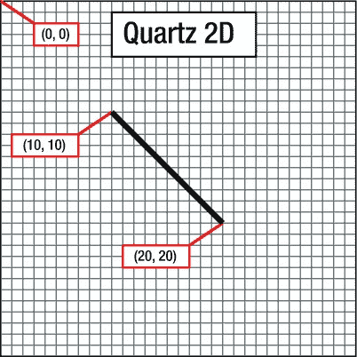

图 16-1. 使用 Quartz 2D 的坐标系统绘制一条线

坐标系是在 iOS 上使用 Quartz 绘图的难点之一，因为其垂直分量与许多图形库以及传统的笛卡尔坐标系（由勒内·笛卡尔在 17 世纪提出）是相反的。在其它系统中，例如 OpenGL，甚至 OS X 版本的 Quartz，`(0, 0)`位于左下角；随着`y`坐标增加，你朝着上下文或视图的顶部移动，如图图 16-2 所示。

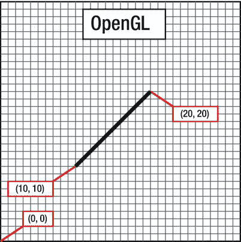

图 16-2. 在许多图形库（包括 OpenGL）中，从`(10, 10)`绘制到`(20, 20)`产生的线看起来应该是这样的，而不是图 16-1 中的那条线

为了指定坐标系中的一个点，一些 Quartz 函数需要两个浮点数作为参数。另一些 Quartz 函数则要求将点嵌入到一个`CGPoint`中，`CGPoint`是一个包含两个浮点值`x`和`y`的结构体。为了描述一个视图或其他对象的大小，Quartz 使用`CGSize`，这是一个也包含两个浮点值`width`和`height`的结构体。Quartz 还声明了一个名为`CGRect`的数据类型，用于在坐标系中定义一个矩形。一个`CGRect`包含两个元素：一个名为`origin`的`CGPoint`，其`x`和`y`值标识矩形的左上角；以及一个名为`size`的`CGSize`，标识矩形的`width`和`height`。

### 指定颜色

绘图的一个重要部分是颜色，因此理解颜色在 iOS 上的工作方式至关重要。UIKit 提供了一个代表颜色的 Objective-C 类：`UIColor`。你不能在 Core Graphic 调用中直接使用`UIColor`对象。然而，`UIColor`只是`CGColor`（Core Graphic 函数所需的类型）的一个封装类，你可以通过使用其`CGColor`属性从`UIColor`实例中检索到`CGColor`引用，正如我们之前在代码片段中演示的：

```
CGContextSetStrokeColorWithColor(context, [UIColor redColor].CGColor);
```

我们使用了一个名为`redColor`的便捷方法创建了一个`UIColor`实例，然后检索了其`CGColor`属性并将其传递给了该函数。

#### 针对你 iOS 设备屏幕的一点色彩理论

在现代计算机图形学中，屏幕上显示的任何颜色的数据都以某种方式基于所谓的**色彩模型**进行存储。色彩模型（有时称为**色彩空间**）仅仅是一种将现实世界中的颜色表示为计算机可以使用的数字值的方法。一种常见的表示颜色的方式是使用四个分量：红色、绿色、蓝色和透明度。在 Quartz 中，这些值中的每一个都被表示为`CGFloat`（在 32 位系统上是一个 4 字节的浮点值，在 64 位系统上是一个 8 字节的值）。这些值应始终包含 0.0 到 1.0 之间的值。

**注意** 期望值在 0.0 到 1.0 范围内的浮点值通常被称为**钳位浮点变量**，或者有时简称为**钳位**。

红色、绿色和蓝色分量相当容易理解，因为它们代表了**加色三原色**，或**RGB 色彩模型**（参见图 16-3）。如果你将这两种颜色的光等比例相加，其结果在人眼看来将是白色或灰色，具体取决于所混合光的强度。以不同比例组合这三种加色原色，可以得到一系列不同的颜色，称为**色域**。

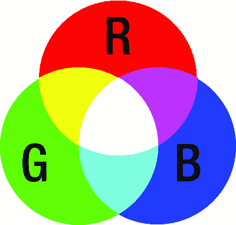

图 16-3. 组成 RGB 色彩模型的加色三原色的简单表示

在上小学时，你可能学过三原色是红、黄、蓝。这些被称为**历史减色原色**或**RYB 色彩模型**的原色，在现代色彩理论中应用很少，几乎从未在计算机图形学中使用过。RYB 色彩模型的色域比 RGB 色彩模型受限得多，并且也不容易进行数学定义。尽管我们很不情愿告诉你三年级那位出色的美术老师 Smedlee 夫人是错的——嗯，在计算机图形学的语境下，她确实是错的。就我们的目的而言，三原色是红、绿、蓝，而不是红、黄、蓝。

除了红、绿、蓝之外，Quartz 还使用了另一种颜色分量，称为**透明度**，它表示一种颜色的透明程度。当在另一种颜色之上绘制一种颜色时，透明度被用来确定最终绘制的颜色。当透明度为`1.0`时，绘制的颜色是 100% 不透明的，会遮挡其下方的任何颜色。当值小于`1.0`时，下方的颜色会透出来并与上方的颜色混合。如果透明度为`0.0`，那么这种颜色将完全不可见，其背后的任何东西都会完全透出来。当使用透明度分量时，颜色模型有时被称为**RGBA 色彩模型**，但严格来说，透明度并不是颜色的一部分；它只是定义了颜色在绘制时如何与其他颜色交互。

## 其他色彩模型

尽管 RGB 模型在计算机图形学中最常用，但它并不是唯一的色彩模型。还有其他几种色彩模型在使用，包括以下几种：


```markdown

