# 色彩模型

-   色相、饱和度、明度（HSV）
-   色相、饱和度、亮度（HSL）
-   青、品红、黄、黑（CMYK），用于四色胶印
-   灰度

更令人困惑的是，其中一些模型存在不同版本，包括`RGB`色彩空间的几种变体。

幸运的是，对于大多数操作来说，我们无需担心正在使用的色彩模型。只需对`UIColor`对象调用`CGColor`即可，大多数情况下，Core Graphics 会处理所有必要的转换。

### 颜色便捷方法

`UIColor`提供了大量便捷方法，这些方法返回初始化为特定颜色的`UIColor`对象。在之前的代码示例中，我们使用了`redColor`方法将颜色初始化为红色。

幸运的是，大多数便捷方法创建的`UIColor`实例都使用`RGBA`色彩模型。唯一的例外是表示灰度值的预定义`UIColor`——例如`blackColor`、`whiteColor`和`darkGrayColor`——它们仅根据白色级别和`alpha`定义。在本文示例中，我们未使用这些颜色，因此目前可以假设为`RGBA`。

如果需要对颜色进行更多控制，可以不使用基于颜色名称的便捷方法，而是通过指定所有四个分量来创建颜色。示例如下：

```
UIColor *red = [UIColor colorWithRed:1.0 green:0.0 blue:0.0 alpha:1.0];
```

### 在上下文中绘制图像

`Quartz`允许您将图像直接绘制到上下文中。这是另一个`Objective-C`类（`UIImage`）的示例，您可以将其用作`Core Graphics`数据结构（`CGImage`）的替代方案。`UIImage`类包含将自身图像绘制到当前上下文中的方法。需要使用以下任一技术来标识图像在上下文中的位置：

-   指定`CGPoint`以标识图像左上角
-   指定`CGRect`以框架化图像，必要时调整图像大小以适合框架

可以像这样将`UIImage`绘制到当前上下文中：

```
UIImage *image; // 假设此变量存在并指向一个 UIImage 实例
CGPoint drawPoint = CGPointMake(100.0, 100.0);
[image drawAtPoint:drawPoint];
```

### 绘制形状：多边形、线条和曲线

`Quartz`提供了许多函数来简化复杂形状的创建。要绘制矩形或多边形，无需计算角度、绘制线条或进行任何数学运算。只需调用`Quartz`函数即可完成工作。例如，要绘制椭圆，只需定义椭圆需要适配的矩形，让`Core Graphics`完成绘制：

```
CGRect theRect = CGRectMake(0, 0, 100, 100);
CGContextAddEllipseInRect(context, theRect);
CGContextDrawPath(context, kCGPathFillStroke);
```

类似的方法也可用于矩形。`Quartz`还提供了创建更复杂形状（如弧线和贝塞尔路径）的方法。

**注意**：在本章的示例中，我们不会处理复杂形状。要了解`Quartz`中弧线和贝塞尔路径的更多信息，请查看 iOS 开发中心的*Quartz 2D Programming Guide*，访问地址`http://developer.apple.com/documentation/GraphicsImaging/Conceptual/drawingwithquartz2d/`或 Xcode 的在线文档。

## Quartz 2D 工具示例：图案、渐变和虚线图案

`Quartz`提供了相当令人印象深刻的一系列工具。例如，`Quartz`不仅支持用纯色填充多边形，还支持用渐变填充。除了绘制实线外，它还可以使用各种虚线图案。请查看 Figure 16-4 中的截图，这些截图来自 Apple 的`QuartzDemo`示例代码，了解`Quartz`为您提供的功能示例。

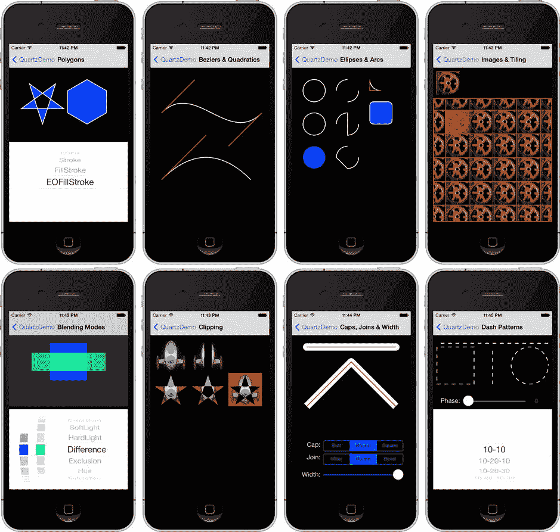

Figure 16-4。来自 Apple 提供的`QuartzDemo`示例项目的`Quartz 2D`功能示例

现在您已经对`Quartz`的工作原理及其功能有了基本了解，让我们来尝试一下。

## QuartzFun 应用程序

我们的下一个应用程序是一个简单的绘图程序（参见 Figure 16-5）。我们将使用`Quartz`构建此应用程序，让您真正感受我们描述的概念如何整合在一起。

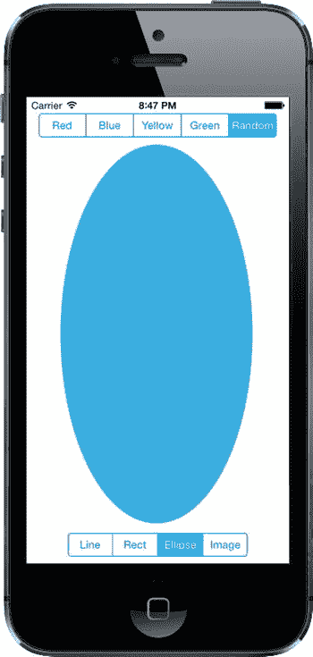

Figure 16-5。本章正在运行中的简单绘图应用程序

应用程序顶部和底部各有一个带有分段控件的栏。顶部的控件用于更改绘图颜色，底部的控件用于更改要绘制的形状。触摸并拖动时，将使用选定的颜色绘制选定的形状。为了最大程度地降低应用程序的复杂性，一次只绘制一个形状。

### 设置 QuartzFun 应用程序

在 Xcode 中，使用单视图应用程序模板创建一个新项目，并将其命名为`QuartzFun`。模板已为我们提供了应用程序委托和视图控制器。我们将在自定义视图中执行自定义绘图，因此还需要创建一个`UIView`的子类，通过重写`drawRect:`方法在其中进行绘制。

选择`QuartzFun`文件夹（当前包含应用程序委托和视图控制器文件的文件夹），按**N**调出新文件助手，然后从 iOS 部分选择 Cocoa Touch Class。将新类命名为`QuartzFunView`，并使其成为`UIView`的子类。

我们将像之前项目中一样定义一些常量；但这一次，多个类都需要这些常量。我们将创建一个仅包含常量的头文件。

再次选择`QuartzFun`组，按**N**调出新文件助手。从 iOS 部分选择 Header File 模板，并将文件命名为`Constants.h`。

还有两个文件需要创建。查看 Figure 16-5，可以看到我们提供了一个选择随机颜色的选项。`UIColor`没有返回随机颜色的方法，因此我们需要编写代码来实现。我们可以将该代码放入控制器类中，但作为精明的 Objective-C 程序员，我们将其放入`UIColor`的分类中。

再次选择`QuartzFun`文件夹，按**N**调出新文件助手。从 iOS 标题下选择 Objective-C File，点击 Next。提示时，将文件命名为`Random`，将文件类型设置为 Category，类设置为`UIColor`，然后点击 Next 并将文件保存到项目文件夹中。

### 创建随机颜色

首先处理分类。将以下几行添加到`UIColor+Random.h`中，替换文件中当前所有内容：

```
#import <UIKit/UIKit.h>

@interface UIColor (Random)
+ (UIColor *)randomColor;
@end
```

现在，切换到`UIColor+Random.m`并添加以下代码：

```
#import <Foundation/Foundation.h>
#import "UIColor+Random.h"

@implementation UIColor (Random)

+ (UIColor *)randomColor {
    CGFloat red = (CGFloat)(arc4random() % 256)/255;
    CGFloat blue = (CGFloat)(arc4random() % 256)/255;
    CGFloat green = (CGFloat)(arc4random() % 256)/255;
    return [UIColor colorWithRed:red green:green blue:blue alpha:1.0f];
}

@end
```

```


这非常简单。对于每个颜色分量，我们使用 `arc4random()` 函数生成一个随机浮点数。颜色的每个分量必须在 0.0 到 1.0 之间，因此我们将随机值除以 256 后取余数，得到 0 到 255 之间的数字，然后再除以 255。为什么是 255？iOS 上的 Quartz 2D 为每个颜色分量支持 256 种不同的强度，因此使用 255 这个数字可以确保我们有机会随机选择其中任何一种。最后，我们使用这三个随机分量创建一种新颜色。我们将 alpha 值设为 1.0，以确保所有生成的颜色都是不透明的。

### 定义应用程序常量

接下来，我们将为用户可以使用分段控件选择的每个选项定义常量。单击 `Constants.h`，并将文件中的所有内容替换为以下代码：

```
typedef NS_ENUM(NSInteger, ShapeType) {
  kLineShape = 0,
  kRectShape,
  kEllipseShape,
  kImageShape
};

typedef NS_ENUM(NSInteger, ColorTabIndex) {
  kRedColorTab = 0,
  kBlueColorTab,
  kYellowColorTab,
  kGreenColorTab,
  kRandomColorTab
};
```

为了使代码更具可读性，我们使用 `typedef` 和 `NS_ENUM` 宏声明了两种枚举类型。一种将表示我们的应用程序中可用的形状选项；另一种将表示可用的各种颜色选项。这些常量所保存的值对应于我们将在应用程序中创建的两个分段控件的分段。

### 实现 QuartzFunView 骨架

由于我们将在 `UIView` 的子类中进行绘制，让我们先设置好这个类所需的一切，除了实际的绘图代码（我们稍后会添加）。单击 `QuartzFunView.h`，并在顶部添加以下代码：

```
#import <UIKit/UIKit.h>
#import "Constants.h"

@interface QuartzFunView : UIView

@property (assign, nonatomic) ShapeType shapeType;
@property (assign, nonatomic) BOOL useRandomColor;
@property (strong, nonatomic) UIColor *currentColor;

@end
```

首先，我们导入刚刚创建的 `Constants.h` 头文件，以便使用我们的枚举值。然后我们声明三个属性——一个 `ShapeType` 属性用于跟踪用户想要绘制的形状，一个布尔值用于跟踪用户是否请求随机颜色，以及一个 `UIColor` 属性用于跟踪当前选择的颜色。

切换到 `QuartzFunView.m`；我们需要对这个文件进行几项修改。首先，导入 `UIColor+Random.h` 头文件，以便我们能够生成随机颜色，在顶部附近添加这行代码，位于其他 `import` 语句下方：

```
#import "UIColor+Random.h"
```

接下来，我们需要创建类扩展并为其添加另外三个属性：

```
#import "UIColor+Random.h"

@interface QuartzFunView ()

@property (assign, nonatomic) CGPoint firstTouchLocation;
@property (assign, nonatomic) CGPoint lastTouchLocation;
@property (strong, nonatomic) UIImage *image;

@end
```

前两个属性将用于跟踪用户手指在屏幕上拖动时的位置。我们将用户首次触摸屏幕的位置存储在 `firstTouchLocation` 中，并将用户手指拖动期间以及拖动结束时的位置存储在 `lastTouchLocation` 中。我们的绘图代码将使用这两个变量来确定在何处绘制请求的形状。`image` 属性保存当用户选择底部工具栏上最右侧的工具栏项时要在屏幕上绘制的图像（参见 图 16-6）。这些属性位于类扩展中，而不是 `QuartzFunView.h` 文件中，因为它们仅供内部使用，不属于视图公共 API 的一部分。

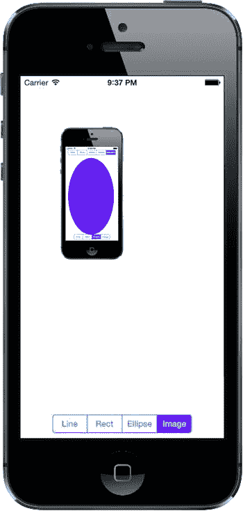

图 16-6. 使用 QuartzFun 绘制 UIImage

现在进入实现本身。模板提供了一个名为 `initWithFrame:` 的方法，但我们不会使用它。请记住，nib 和 storyboard 中的对象实例是作为归档对象存储的，这与我们在第 13 章中归档对象所使用的机制相同。因此，当从 nib 或 storyboard 加载对象实例时，既不会调用 `init`，也不会调用 `initWithFrame:`。相反，会使用 `initWithCoder:`，因此这是我们添加任何初始化代码的地方。在我们的例子中，我们将初始颜色值设置为红色，将 `useRandomColor` 初始化为 `NO`，并加载本章稍后将要绘制的图像文件。删除 `initWithFrame:` 现有的存根实现，并将其替换为以下方法：

```
- (id)initWithCoder:(NSCoder*)coder {
    if (self = [super initWithCoder:coder]) {
        _currentColor = [UIColor redColor];
        _useRandomColor = NO;
        _image = [UIImage imageNamed:@"iphone"] ;
    }
    return self;
}
```

在 `initWithCoder:` 之后，我们需要添加一些额外的方法来响应用户的触摸。在 `initWithCoder:` 之后，插入以下三个方法：

```
#pragma mark - Touch Handling

- (void)touchesBegan:(NSSet *)touches withEvent:(UIEvent *)event {
    if (self.useRandomColor) {
        self.currentColor = [UIColor randomColor];
    }
    UITouch *touch = [touches anyObject];
    self.firstTouchLocation = [touch locationInView:self];
    self.lastTouchLocation = [touch locationInView:self];
    [self setNeedsDisplay];
}

- (void)touchesEnded:(NSSet *)touches withEvent:(UIEvent *)event {
    UITouch *touch = [touches anyObject];
    self.lastTouchLocation = [touch locationInView:self];

[self setNeedsDisplay];
}

- (void)touchesMoved:(NSSet *)touches withEvent:(UIEvent *)event {
    UITouch *touch = [touches anyObject];
    self.lastTouchLocation = [touch locationInView:self];

[self setNeedsDisplay];
}
```

这三个方法继承自 `UIView`，而 `UIView` 又继承自其父类 `UIResponder`。它们可以被重写，以找出用户触摸屏幕的位置。它们的工作原理如下：

*   当用户的手指首次触摸屏幕时，会调用 `touchesBegan:withEvent:`。在该方法中，如果用户使用我们之前为 `UIColor` 添加的新 `randomColor` 方法选择了随机颜色，我们就更改颜色。之后，我们存储当前位置，以便知道用户首次触摸屏幕的位置，并通过在 `self` 上调用 `setNeedsDisplay` 来指示我们的视图需要重绘。
*   当用户在屏幕上拖动手指时，会持续调用 `touchesMoved:withEvent:`。这里我们只做一件事：将新位置存储在 `lastTouchLocation` 中，并指示屏幕需要重绘。
*   当用户将手指从屏幕上抬起时，会调用 `touchesEnded:withEvent:`。与 `touchesMoved:withEvent:` 方法一样，我们只做一件事：将最终位置存储在 `lastTouchLocation` 变量中，并指示视图需要重绘。

如果你不能完全理解这里的其余代码，请不要担心。我们将在第 18 章中详细讨论触摸处理以及 `touchesBegan:withEvent:`、`touchesMoved:withEvent:` 和 `touchesEnded:withEvent:` 方法的具体细节。

一旦我们的应用程序骨架启动并运行，我们将回到这个类。目前被注释掉的 `drawRect:` 方法是我们将在此应用程序中完成实际工作的地方，而我们还没有编写它。让我们在添加绘图代码之前，先完成应用程序的设置。

### 创建并连接 Outlets 和 Actions

在开始绘制之前，我们需要将分段控件添加到 GUI 中，然后连接操作和输出口。单击 `Main.storyboard` 来进行设置。


首先，将视图的类更改。在文档大纲中，展开场景及其包含的视图控制器项，然后单击**View**项。按``**3**打开身份检查器，并将类从`*UIView*`更改为`QuartzFunView`。

现在，使用对象库找到分段控件，并将其拖到视图顶部，状态栏下方。将其放置在靠近中心的位置，如 Figure 16-7 所示。您无需非常精确，因为我们稍后将添加一个布局约束使其居中。

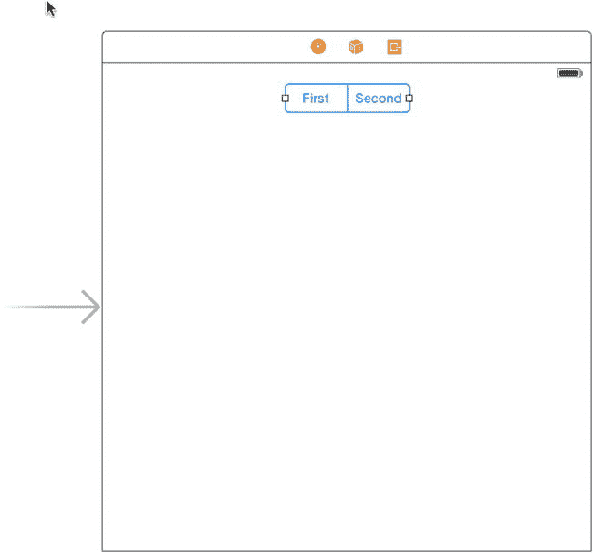

Figure 16-7. 添加用于颜色选择的分段控件

选中分段控件，打开属性检查器，将分段数量从`*2*`更改为`*5*`。依次双击每个分段，将其标签从左到右更改为`*Red*`、`*Blue*`、`*Yellow*`、`*Green*`和`*Random*`。现在来应用布局约束。在文档大纲中，从分段控件项按住 Control 键拖到**Quartz Fun View**项上，松开鼠标，选择**Top Space to Top Layout Guide**。重复 Control 拖拽操作，这次选择**Center Horizontally in Container**。到目前为止，我们已经将分段控件水平和垂直固定——剩下的就是设置其大小。点击编辑区域底部的**Pin**按钮，选中**Width**复选框并输入`**290**`，如 Figure 16-8 所示。点击**Add 1 constraint**。在文档大纲中，选择**View Controller**图标，然后在故事板编辑器中点击**Resolve Auto Layout Issues**按钮（位于 Pin 按钮右侧），并选择**Update Frames**。分段控件现在应该已正确调整大小和位置。

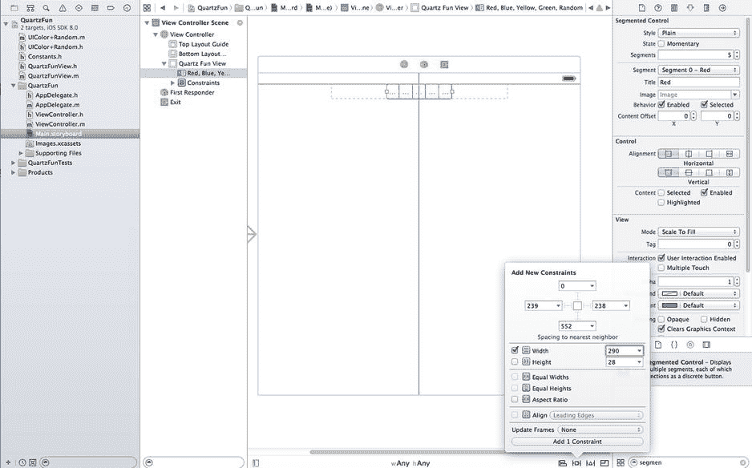

Figure 16-8. 设置颜色选择分段控件的大小

如果助理编辑器未打开，请将其打开，并从跳转栏中选择`*ViewController.m*`。现在，从文档大纲中的分段控件按住 Control 键拖到右侧的`*ViewController.m*`文件中，拖到`@interface`和`@end`行之间靠近顶部用于界定类扩展的区域。当光标位于`@interface`和`@end`声明之间时，松开鼠标以创建一个新的输出口。将新输出口命名为`*colorControl*`，并将所有其他选项保留为默认值。

接下来，添加一个动作。在助理编辑器中`*ViewController.m*`仍打开的情况下，再次选择`*Main.storyboard*`，并从分段控件按住 Control 键拖到视图控制器文件中，直接放到底部`@end`声明之上。这次，将连接类型更改为`*Action*`，名称改为`*changeColor*`。弹出窗口应默认为使用**Value Changed**事件，这正是我们需要的。您还应该将类型设置为`*UISegmentedControl*`。

现在添加第二个分段控件。这个将用于选择要绘制的形状。从库中拖出一个分段控件，并将其放在视图底部附近。在文档大纲中选择该分段控件，打开属性检查器，将分段数量从`*2*`更改为`*4*`。现在依次双击每个分段，将四个分段的标题依次更改为`*Line*`、`*Rect*`、`*Ellipse*`和`*Image*`。现在我们需要添加布局约束来固定控件的大小和位置，就像我们对颜色选择控件所做的那样。以下是您需要执行的步骤序列：

1.  在文档大纲中，从新的分段控件项按住 Control 键拖到**Quartz Fun View**项上，松开鼠标，选择**Bottom Space to Bottom Layout Guide**。
2.  再次按住 Control 拖拽，选择**Center Horizontally in Container**。
3.  点击编辑区域底部的**Pin**按钮，然后选中**Width**复选框并输入`**220**`。点击**Add 1 constraint**。
4.  在文档大纲中，选择**View Controller**图标，然后在编辑器中点击**Resolve Auto Layout Issues**按钮并选择**Update Frames**。

完成上述操作后，再次在助理编辑器中打开`*ViewController.m*`，然后从新的分段控件按住 Control 键拖到`*ViewController.m*`中`@end`行的正上方，以创建一个动作。将连接类型更改为`*Action*`，命名该动作为`*changeShape*`，并将类型更改为`*UISegmentedControl*`。

故事板现在应该像 Figure 16-9 所示。我们的下一个任务是实现动作方法。

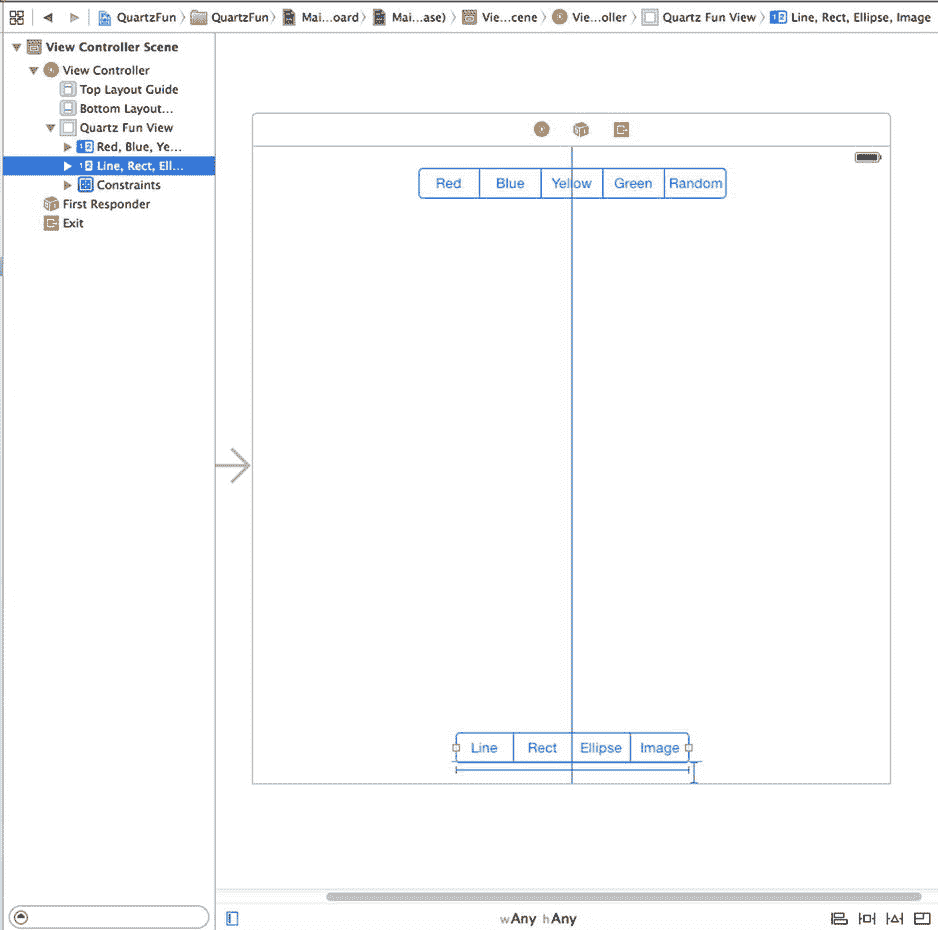

Figure 16-9. 两个分段控件都已就位

### 实现动作方法

保存故事板，并随意关闭助理编辑器。现在选择`*ViewController.m*`。我们需要做的第一件事是导入常量文件，以便访问枚举值。我们还将与自定义视图交互，因此也需要导入其头文件。在文件顶部，紧靠现有`import`语句下方，添加以下代码行：

```
#import "Constants.h"
#import "QuartzFunView.h"
```

接下来，找到 Xcode 为您创建的`changeColor:`的桩实现，并向其中添加以下代码：

```
- (IBAction)changeColor:(UISegmentedControl *)sender {
    QuartzFunView *funView = (QuartzFunView *)self.view;
    ColorTabIndex index = [sender selectedSegmentIndex];
    switch (index) {
        case kRedColorTab:
            funView.currentColor = [UIColor redColor];
            funView.useRandomColor = NO;
            break;
        case kBlueColorTab:
            funView.currentColor = [UIColor blueColor];
            funView.useRandomColor = NO;
            break;
        case kYellowColorTab:
            funView.currentColor = [UIColor yellowColor];
            funView.useRandomColor = NO;
            break;
        case kGreenColorTab:
            funView.currentColor = [UIColor greenColor];
            funView.useRandomColor = NO;
            break;
        case kRandomColorTab:
            funView.useRandomColor = YES;
            break;
        default:
            break;
    }
}
```

这相当直接。我们只需查看选择了哪个分段，并根据该选择创建一个新颜色作为当前绘图颜色。之后，我们设置`currentColor`属性，以便类知道绘制时使用哪种颜色，除非已选择随机颜色。在这种情况下，我们将`useRandomColor`属性设置为`YES`，并且每次用户开始新的绘制操作时都会选择新颜色（您将在`touchesBegan:withEvent:`方法中找到此代码，我们几页前添加的。由于所有绘图代码都将在视图本身中，因此我们无需在此方法中执行其他操作。

接下来，找到`changeShape:`的现有实现，并向其中添加以下代码：

```
- (IBAction)changeShape:(UISegmentedControl *)sender {
  [(QuartzFunView *)self.view setShapeType:[sender
                            selectedSegmentIndex]];
  self.colorControl.hidden = [sender selectedSegmentIndex] == kImageShape;
}
```


# 方法实现与绘图代码解析

在此方法中，我们仅根据控件中选中的分段来设置形状类型。你还记得`ShapeType`枚举吗？该枚举的四个元素对应应用程序视图底部的四个工具栏分段。我们将形状设置为与当前选中分段相同，并根据是否选中图像分段来隐藏或显示颜色选择控件。

通过编译并运行应用来确保一切正常。虽然你还无法在屏幕上绘制形状，但分段控件应该能正常工作；当你在底部控件中点击图像分段时，颜色控件应该会消失。

现在一切就绪，让我们开始绘制图形。

### 添加 Quartz 2D 绘图代码

我们准备添加执行绘图的代码。我们将绘制一条线、一些形状和一张图像。我们将采用渐进式工作方式：每次添加少量代码，然后运行应用查看效果。

#### 绘制线条

首先实现最简单的绘图选项：绘制一条线。选择`QuartzFunView.m`，将注释掉的`drawRect:`方法替换为以下代码：

```objc
- (void)drawRect:(CGRect)rect {
    CGContextRef context = UIGraphicsGetCurrentContext();
    CGContextSetLineWidth(context, 2.0);
    CGContextSetStrokeColorWithColor(context, self.currentColor.CGColor);

    switch (self.shapeType) {
        case kLineShape:
            CGContextMoveToPoint(context,
                                 self.firstTouchLocation.x,
                                 self.firstTouchLocation.y);
            CGContextAddLineToPoint(context,
                                    self.lastTouchLocation.x,
                                    self.lastTouchLocation.y);
            CGContextStrokePath(context);
            break;
        case kRectShape:
            break;
        case kEllipseShape:
            break;
        case kImageShape:
            break;
        default:
            break;
    }
}
```

我们首先获取当前上下文的引用，以便知道绘制的位置：

```objc
CGContextRef context = UIGraphicsGetCurrentContext();
```

接下来，将线宽设置为 2.0，这意味着我们绘制的任何线条宽度均为 2 点：

```objc
CGContextSetLineWidth(context, 2.0);
```

然后，设置用于描边的颜色。由于`UIColor`具有`CGColor`属性（正是此函数所需的类型），我们使用`currentColor`属性的该属性将正确的颜色传递给此函数。

```objc
CGContextSetStrokeColorWithColor(context, self.currentColor.CGColor);
```

我们使用`switch`语句跳转到每个形状类型对应的代码。如前所述，首先处理`kLineShape`的代码，确保其正常工作，然后在后续示例中依次为每个形状添加代码：

```objc
switch (self.shapeType) {
    case kLineShape:
```

要绘制线条，我们告诉图形上下文从用户首次触摸的位置开始创建路径。请记住，我们在`touchesBegan:withEvents:`方法中存储了该值，因此它始终反映最近触摸或拖动的起始点：

```objc
CGContextMoveToPoint(context,
                     self.firstTouchLocation.x,
                     self.firstTouchLocation.y);
```

接着，从该点绘制一条线到用户最后触摸的位置。如果用户的手指仍与屏幕接触，`lastTouchLocation`包含手指的当前位置；如果用户已离开屏幕，`lastTouchLocation`包含手指抬起时的位置：

```objc
CGContextAddLineToPoint(context,
                        self.lastTouchLocation.x,
                        self.lastTouchLocation.y);
```

此函数实际上并不绘制线条——它只是将线条添加到上下文的当前路径中。要使线条显示在屏幕上，我们需要描边路径。此函数将使用之前设置的颜色和宽度来描边我们刚刚绘制的线条：

```objc
CGContextStrokePath(context);
```

之后，我们完成`switch`语句：

```objc
    break;
case kRectShape:
    break;
case kEllipseShape:
    break;
case kImageShape:
    break;
default:
    break;
}
```

目前就这些。此时，你可以再次编译并运行应用。矩形、椭圆和形状选项尚不可用，但你应该能够使用任意颜色选项正常绘制线条（参见图 16-10）。

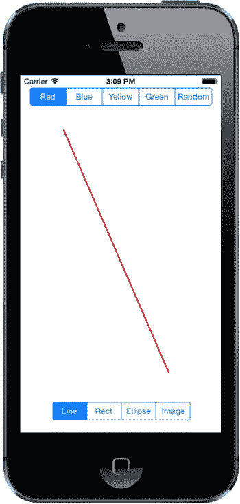

图 16-10. 应用程序的线条绘制部分现已完成。这里我们使用红色进行绘制

#### 绘制矩形和椭圆

由于 Quartz 以基本相同的方式实现这两种对象，我们同时编写绘制矩形和椭圆的代码。将以下粗体代码添加到现有的`drawRect:`方法中：

```objc
- (void)drawRect:(CGRect)rect {
    CGContextRef context = UIGraphicsGetCurrentContext();

    CGContextSetLineWidth(context, 2.0);
    CGContextSetStrokeColorWithColor(context, self.currentColor.CGColor);

    CGContextSetFillColorWithColor(context, self.currentColor.CGColor);
    CGRect currentRect = CGRectMake(self.firstTouchLocation.x,
                                    self.firstTouchLocation.y,
                                    self.lastTouchLocation.x -
                                    self.firstTouchLocation.x,
                                    self.lastTouchLocation.y -
                                    self.firstTouchLocation.y);

    switch (self.shapeType) {
        case kLineShape:
            CGContextMoveToPoint(context,
                                 self.firstTouchLocation.x,
                                 self.firstTouchLocation.y);
            CGContextAddLineToPoint(context,
                                    self.lastTouchLocation.x,
                                    self.lastTouchLocation.y);
            CGContextStrokePath(context);
            break;
        case kRectShape:
            CGContextAddRect(context, currentRect);
            CGContextDrawPath(context, kCGPathFillStroke);
            break;
        case kEllipseShape:
            CGContextAddEllipseInRect(context, currentRect);
            CGContextDrawPath(context, kCGPathFillStroke);
            break;
        case kImageShape:
            break;
        default:
            break;
    }
}
```

因为我们希望同时绘制椭圆和矩形的轮廓并填充其内部，所以添加一个调用，使用`currentColor`设置填充颜色：

```objc
CGContextSetFillColorWithColor(context, self.currentColor.CGColor);
```

接下来，声明一个`CGRect`变量。之所以在此处声明，是因为矩形和椭圆都基于一个矩形进行绘制。我们将使用`currentRect`来保存用户拖动所描述的矩形。请记住，`CGRect`有两个成员：`size`和`origin`。名为`CGRectMake()`的函数允许我们通过指定`x`、`y`、`width`和`height`值来创建一个`CGRect`，因此我们用它来创建矩形。

创建矩形的代码相当直观。我们使用存储在`firstTouchLocation`中的点来创建原点。接着，通过计算两个`x`值和两个`y`值之间的差值来得出尺寸。请注意，根据拖动方向的不同，其中一个或两个尺寸值可能为负数，但这没关系。具有负尺寸的`CGRect`只会朝其原点相反的方向渲染（负宽度向左；负高度向上）。


```objectivec
CGRect currentRect = CGRectMake(self.firstTouchLocation.x,
                                self.firstTouchLocation.y,
                                self.lastTouchLocation.x -
                                self.firstTouchLocation.x,
                                self.lastTouchLocation.y -
                                self.firstTouchLocation.y);
```

一旦我们定义好这个矩形，绘制矩形或椭圆就像调用两个函数一样简单：一个用于在我们定义的 `CGRect` 中绘制矩形或椭圆，另一个用于描边和填充：

```objectivec
case kRectShape:
    CGContextAddRect(context, currentRect);
    CGContextDrawPath(context, kCGPathFillStroke);
    break;
case kEllipseShape:
    CGContextAddEllipseInRect(context, currentRect);
    CGContextDrawPath(context, kCGPathFillStroke);
    break;
```

编译并运行你的应用程序。尝试使用矩形和椭圆工具，看看它们的表现如何。别忘了切换颜色，包括使用随机颜色。

### 绘制图像

作为最后一项技巧，我们来绘制一张图像。*16 – Image* 文件夹中包含两张名为 *iphone.png* 和 *iphone@2x.png* 的图像，你可以将它们添加到项目的 *Images.xcassets* 项中——创建一个名为 `iphone` 的图像集，并将这两张图像拖入其中。现在，将以下代码添加到你的 `drawRect:` 方法中：

```objectivec
- (void)drawRect:(CGRect)rect {
    CGContextRef context = UIGraphicsGetCurrentContext();

    CGContextSetLineWidth(context, 2.0);
    CGContextSetStrokeColorWithColor(context, self.currentColor.CGColor);

    CGContextSetFillColorWithColor(context, _currentColor.CGColor);
    CGRect currentRect = CGRectMake(self.firstTouchLocation.x,
                                    self.firstTouchLocation.y,
                                    self.lastTouchLocation.x -
                                    self.firstTouchLocation.x,
                                    self.lastTouchLocation.y -
                                    self.firstTouchLocation.y);

    switch (self.shapeType) {
        case kLineShape:
            CGContextMoveToPoint(context,
                                 self.firstTouchLocation.x,
                                 self.firstTouchLocation.y);
            CGContextAddLineToPoint(context,
                                    self.lastTouchLocation.x,
                                    self.lastTouchLocation.y);
            CGContextStrokePath(context);
            break;
        case kRectShape:
            CGContextAddRect(context, currentRect);
            CGContextDrawPath(context, kCGPathFillStroke);
            break;
        case kEllipseShape:
            CGContextAddEllipseInRect(context, currentRect);
            CGContextDrawPath(context, kCGPathFillStroke);
            break;
        case kImageShape: {
            CGFloat horizontalOffset = self.image.size.width / 2;
            CGFloat verticalOffset = self.image.size.height / 2;
            CGPoint drawPoint = CGPointMake(self.lastTouchLocation.x -
                                horizontalOffset,
                                self.lastTouchLocation.y -
                                verticalOffset);
            [self.image drawAtPoint:drawPoint];
            break;
        }
        default:
            break;
    }
}
```

**注意** 请注意，在 `switch` 语句中，我们在 `case kImageShape:` 后面的代码周围添加了大括号。这是因为编译器对于 `case` 语句后第一行声明的变量会有问题。这些大括号是我们告诉编译器停止报错的方式。我们也可以在 `switch` 语句之前声明 `horizontalOffset`，但我们选择的方法将相关代码保持了内聚性。

首先，我们计算图像的中心点，因为我们希望图像以用户最后触摸的点为中心绘制。如果不进行此调整，图像会以左上角位于用户手指位置的方式绘制，这同样是一个有效的选项。然后，我们通过从 `lastTouchLocation` 的 `x` 和 `y` 值中减去这些偏移量来创建一个新的 `CGPoint`：

```objectivec
CGFloat horizontalOffset = self.image.size.width / 2;
CGFloat verticalOffset = self.image.size.height / 2;
CGPoint drawPoint = CGPointMake(self.lastTouchLocation.x -
                                horizontalOffset,
                                self.lastTouchLocation.y -
                                verticalOffset);
```

现在，我们让图像自行绘制。下面这行代码就能实现这个目的：

```objectivec
[self.image drawAtPoint:drawPoint];
```

构建并运行应用程序，从分段控件中选择“Image”，并确认你能在绘图画布上放置一张图像。

### 优化 QuartzFun 应用程序

我们的应用已经实现了所需功能，但我们应该考虑一些优化。在我们的这个小应用中，你不会注意到速度变慢；然而，在一个运行在较慢处理器上的更复杂应用中，你可能会看到一些延迟。

问题出现在 *QuartzFunView.m* 中的 `touchesMoved:withEvent:` 和 `touchesEnded:withEvent:` 方法中。这两个方法都包含这行代码：

```objectivec
[self setNeedsDisplay];
```

显然，这是我们告诉视图某些内容已更改并且需要重绘自身的方式。这段代码可以工作，但它会导致整个视图被擦除并重绘，即使只发生了一点点变化。当我们准备拖拽出一个新形状时，我们确实想要擦除屏幕，但在拖拽形状的过程中，我们并不想每秒多次清除屏幕。

与其在拖拽过程中强制整个视图多次重绘，我们可以改用 `setNeedsDisplayInRect:` 方法。`setNeedsDisplayInRect:` 是一个 `UIView` 方法，它将视图区域的某个矩形部分标记为需要重新显示。通过使用此方法，我们可以只标记受到当前绘制操作影响的视图部分需要重绘，从而提高效率。

我们需要重绘的不仅仅是 `firstTouchLocation` 和 `lastTouchLocation` 之间的矩形，还包括当前拖拽所涉及到的屏幕的任何部分。如果用户触摸屏幕然后到处乱画，但我们只重绘 `firstTouchLocation` 和 `lastTouchLocation` 之间的部分，那么屏幕上就会留下之前重绘时画出的许多我们不想保留的内容。

解决方案是跟踪特定拖拽所影响的整个区域，并将其存储在一个 `CGRect` 实例变量中。在 `touchesBegan:withEvent:` 中，我们将该实例变量重置为用户触摸的点。然后，在 `touchesMoved:withEvent:` 和 `touchesEnded:withEvent:` 中，我们使用 Core Graphics 函数获取当前矩形和已存储矩形的并集，并存储生成的矩形。我们还用它来指定视图的哪部分需要重绘。这种方法为我们提供了当前拖拽所影响区域的累计总和。

目前，我们在 `drawRect:` 方法中计算当前矩形，用于绘制椭圆和矩形形状。我们将把这个计算移到新方法中，以便可以在所有三个地方使用它，而无需重复代码。准备好了吗？让我们开始吧。

在 *QuartzFunView.m* 的顶部进行以下更改：

```objectivec
@interface QuartzFunView ()

@property (assign, nonatomic) CGPoint firstTouchLocation;
@property (assign, nonatomic) CGPoint lastTouchLocation;
@property (strong, nonatomic) UIImage *image;
@property (readonly, nonatomic) CGRect currentRect;
@property (assign, nonatomic) CGRect redrawRect;

@end
```


我们声明了一个名为 `redrawRect` 的 `CGRect` 变量，用于跟踪需要重绘的区域。此外，我们还声明了一个名为 `currentRect` 的只读属性，该属性将返回我们在 `drawRect:` 中之前计算的矩形。在文件末尾，为 `currentRect` 属性添加访问器方法：

```
- (CGRect)currentRect {
    return CGRectMake (self.firstTouchLocation.x,
                       self.firstTouchLocation.y,
                       self.lastTouchLocation.x - self.firstTouchLocation.x,
                       self.lastTouchLocation.y - self.firstTouchLocation.y);
}
```

现在，在 `drawRect:` 方法中，将所有对 `currentRect` 的引用改为 `self.currentRect`，以便代码使用我们刚创建的新访问器。接下来，删除我们计算 `currentRect` 的代码行：

```
- (void)drawRect:(CGRect)rect {
    CGContextRef context = UIGraphicsGetCurrentContext();

    CGContextSetLineWidth(context, 2.0);
    CGContextSetStrokeColorWithColor(context, self.currentColor.CGColor);

    CGContextSetFillColorWithColor(context, self.currentColor.CGColor);

    CGRect currentRect = CGRectMake(self.firstTouchLocation.x,
                                        self.firstTouchLocation.y,
                                        self.lastTouchLocation.x -
                                        self.firstTouchLocation.x,
                                        self.lastTouchLocation.y -
                                        self.firstTouchLocation.y);

    switch (self.shapeType) {
        case kLineShape:
            CGContextMoveToPoint(context,
                                 self.firstTouchLocation.x,
                                 self.firstTouchLocation.y);
            CGContextAddLineToPoint(context,
                                    self.lastTouchLocation.x,
                                    self.lastTouchLocation.y);
            CGContextStrokePath(context);
            break;
        case kRectShape:
            CGContextAddRect(context, self.currentRect);
            CGContextDrawPath(context, kCGPathFillStroke);
            break;
        case kEllipseShape:
            CGContextAddEllipseInRect(context, self.currentRect);
            CGContextDrawPath(context, kCGPathFillStroke);
            break;
        case kImageShape: {
            CGFloat horizontalOffset = self.image.size.width / 2;
            CGFloat verticalOffset = self.image.size.height / 2;
            CGPoint drawPoint = CGPointMake(self.lastTouchLocation.x -
                                                horizontalOffset,
                                            self.lastTouchLocation.y -
                                                verticalOffset);
            [self.image drawAtPoint:drawPoint];
            break;
        }
        default:
            break;
    }
}
```

我们还需要对 `touchesEnded:withEvent:` 和 `touchesMoved:withEvent:` 做一些修改。我们将重新计算当前操作影响的空间，并用它来指示只需要重绘视图的一部分。用以下新版本替换现有的 `touchesEnded:withEvent:` 和 `touchesMoved:withEvent:` 方法：

```
- (void)touchesEnded:(NSSet *)touches withEvent:(UIEvent *)event {
    UITouch *touch = [touches anyObject];
    self.lastTouchLocation = [touch locationInView:self];

    if (self.shapeType == kImageShape) {
        CGFloat horizontalOffset = self.image.size.width / 2;
        CGFloat verticalOffset = self.image.size.height / 2;
        self.redrawRect = CGRectUnion(self.redrawRect,
                                      CGRectMake(self.lastTouchLocation.x -
                                                 horizontalOffset,
                                                 self.lastTouchLocation.y -
                                                 verticalOffset,
                                                 self.image.size.width,
                                                 self.image.size.height));
    } else {
        self.redrawRect = CGRectUnion(self.redrawRect, self.currentRect);
    }
    self.redrawRect = CGRectInset(self.redrawRect, -2.0, -2.0);
    [self setNeedsDisplayInRect:self.redrawRect];
}

- (void)touchesMoved:(NSSet *)touches withEvent:(UIEvent *)event {
    UITouch *touch = [touches anyObject];
    self.lastTouchLocation = [touch locationInView:self];

    if (self.shapeType == kImageShape) {
        CGFloat horizontalOffset = self.image.size.width / 2;
        CGFloat verticalOffset = self.image.size.height / 2;
        self.redrawRect = CGRectUnion(self.redrawRect,
                                      CGRectMake(self.lastTouchLocation.x -
                                                 horizontalOffset,
                                                 self.lastTouchLocation.y -
                                                 verticalOffset,
                                                 self.image.size.width,
                                                 self.image.size.height));
    } else {
        self.redrawRect = CGRectUnion(_redrawRect, self.currentRect);
    }
    [self setNeedsDisplayInRect:self.redrawRect];
}
```

另外，在 `touchesBegan:withEvent:` 方法中添加以下代码行：

```
- (void)touchesBegan:(NSSet *)touches withEvent:(UIEvent *)event {
    if (self.useRandomColor) {
        self.currentColor = [UIColor randomColor];
    }
    UITouch *touch = [touches anyObject];
    self.firstTouchLocation = [touch locationInView:self];
    self.lastTouchLocation = [touch locationInView:self];
    self.redrawRect = CGRectZero;
    [self setNeedsDisplay];
}
```

再次构建并运行应用程序以查看最终结果。你可能看不出任何区别，但通过添加少量代码行，我们减少了重绘视图所需的工作量，因为不再需要擦除和重绘当前拖动未影响的任何视图部分。像这样善待 iOS 设备宝贵的处理器周期，会对应用程序的性能产生显著影响，尤其是在应用变得复杂时。

**注意** 如果你对 Quartz 2D 主题有更深入的探索兴趣，不妨阅读 Jack Nutting、Dave Wooldridge 和 David Mark 合著的 *Beginning iPad Development for iPhone Developers: Mastering the iPad SDK*（Apress，2010 年）。这本书涵盖了许多 Quartz 2D 绘图内容。该书中的所有绘图代码和解释同样适用于 iPhone 和 iPad。

## 绘图小结

在本章中，我们实际上只是浅尝了 iOS 内置绘图功能的表面。现在你应该对 Quartz 2D 相当熟悉了；偶尔参考 Apple 的文档后，你大概能处理大多数遇到的绘图需求。

现在是时候进一步提升你的图形技能了！第 17 章将向你介绍 iOS 7 中引入的 Sprite Kit 框架，它能让你实现极速位图渲染，从而创建游戏或其他快速移动、交互性强的动态内容。

## 第 17 章 — Sprite Kit 入门


# Sprite Kit 入门

在 iOS 7 中，Apple 引入了`Sprite Kit`，这是一个用于高性能 2D 图形渲染的框架。这听起来有点像`Core Graphics`和`Core Animation`，那么这里有什么新东西呢？与`Core Graphics`（专注于使用画家模型绘制图形）或`Core Animation`（专注于动画化 GUI 元素的属性）不同，`Sprite Kit`完全专注于一个不同的领域：视频游戏！`Sprite Kit`构建在`OpenGL`之上，`OpenGL`是一种存在于许多计算平台上的技术，它允许现代图形硬件以惊人的速度将图形位图写入视频缓冲区。使用`Sprite Kit`，您可以获得`OpenGL`的出色性能特性，而无需深入`OpenGL`编码的细节。

这是 Apple 在 iOS 时代首次涉足游戏编程的图形方面。它与 iOS 7 和 OS X 10.9（Mavericks）同时发布，并在两个平台上提供相同的 API，因此为一个平台编写的应用程序可以轻松移植到另一个平台。尽管 Apple 以前从未提供过像`Sprite Kit`这样的框架，但它与各种开源库（如`Cocos2D`）有明显相似之处。如果您过去使用过`Cocos2D`或类似的东西，您会感到非常熟悉。

`Sprite Kit`没有实现像`Core Graphics`那样的灵活、通用的绘图系统。没有用于绘制路径、渐变或用颜色填充空间的方法。相反，您得到的是一个**场景图**（类似于 UIKit 的视图层次结构）；能够变换每个图节点的位置、缩放和旋转；以及每个节点绘制自身的能力。大多数绘图发生在`SKSprite`类（或其子类之一）的实例中，该类表示一个准备放在屏幕上的单个图形图像。

在本章中，我们将使用`Sprite Kit`构建一个名为*TextShooter*的简单射击游戏。我们将使用文本块来构建游戏对象，而不是使用预制图形，使用专门为此目的而设计的`SKSprite`的子类。使用这种方法，您无需从项目库中提取图形或类似的东西。我们制作的应用程序外观简单，但易于修改和玩耍。

## 简单的开始

让我们开始吧。在 Xcode 中，按**N**或选择**File  New  File…**，然后从 iOS 部分选择**Game**模板。按**Next**，将项目命名为*TextShooter*，将 Devices 设置为*Universal*，将 Game Technology 设置为*SpriteKit*，然后创建项目。在这里，值得简要看看其他可用的技术选择。`OpenGL ES`和`Metal`（后者在 iOS 8 中是新的）是低级的图形 API，它们让您几乎完全控制图形硬件，但比`Sprite Kit`更难使用。`Sprite Kit`是一个 2D API，而`SceneKit`（也是在 iOS 8 中新增的）是一个工具包，您可以使用它来构建 3D 图形应用程序。在阅读完本章后，如果您对 3D 游戏编程感兴趣，值得查看一下`SceneKit`文档，地址为`https://developer.apple.com/library/prerelease/ios/documentation/SceneKit/Reference/SceneKit_Framework/index.html`。

如果您现在运行 TextShooter 项目，您将看到默认的`Sprite Kit`应用程序，如图 17-1 所示。最初，您只会看到“Hello, World”文本。为了让事情变得稍微（只是稍微）有趣一些，触摸屏幕以添加一些旋转的宇宙飞船。在本章的过程中，我们将替换此模板中的所有内容，并逐步构建我们自己的简单应用程序。

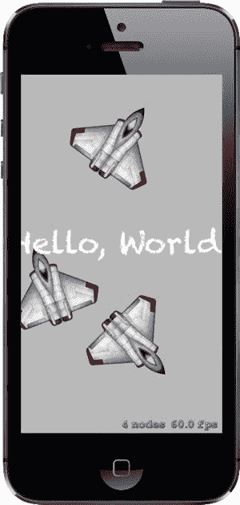

图 17-1。默认的 Sprite Kit 应用程序在运行中。一些文本显示在屏幕中央，每次点击屏幕都会在该位置放置一个旋转的喷气式战斗机图形。

现在让我们看一下 Xcode 创建的项目。您会看到它有一个相当标准的`AppDelegate`类和一个名为`GameViewController`的小视图控制器类，它对`SKView`对象进行一些初始配置。这个对象是从应用程序的故事板加载的，它将显示我们所有的`Sprite Kit`内容。以下是`GameViewController viewDidLoad`方法中初始化`SKView`的代码：

```
- (void)viewDidLoad
{
    [super viewDidLoad];

// Configure the view.
    SKView *skView = (SKView *)self.view;
    skView.showsFPS = YES;
    skView.showsNodeCount = YES;
    skView.ignoresSiblingOrder = YES;

// Create and configure the scene.
    GameScene *scene = [GameScene nodeWithFileNamed:@"GameScene"];
    scene.scaleMode = SKSceneScaleModeAspectFill;

// Present the scene.
    [skView presentScene:scene];
}
```

前几行从故事板获取`SKView`实例，并配置它在游戏运行时显示一些性能特征。`Sprite Kit`应用程序被构建为一组**场景**，由`SKScene`类表示。在使用`Sprite Kit`开发时，您可能会为应用程序的每个视觉上不同的部分创建一个新的`SKScene`子类。一个场景可以表示一个快节奏的游戏显示，屏幕上有数十个对象在动画，也可以像开始菜单一样简单。我们将在本章中看到`SKScene`的多种用法。模板生成了一个最初为空的场景，其形式是一个名为`GameScene`的类。

`SKView`和`SKScene`之间的关系与我们在本书中一直使用的`UIViewController`类有一些相似之处。`SKView`类的行为有点像`UINavigationController`，从某种意义上说，它就像一个空白石板，只是管理其他控制器对显示的访问。然而，在这一点上，事情开始出现分歧。与`UINavigationController`不同，由`SKView`管理的顶级对象不是`UIViewController`的子类。相反，它们是`SKScene`的子类，`SKScene`知道如何管理一个可以显示、被物理引擎作用等等的对象图。

`viewDidLoad`方法的下一部分创建了初始场景：

```
// Create and configure the scene.
GameScene *scene = [GameScene nodeWithFileNamed:@"GameScene"];
```

有两种方法创建场景——您可以手动分配和初始化一个实例，也可以从**Sprite Kit 场景文件**加载一个。Xcode 模板采用了后一种方法——它生成一个名为*GameScene.sks*的`Sprite Kit`场景文件，其中包含一个`SKScene`对象的归档副本。`SKScene`，像大多数其他`Sprite Kit`类一样，遵循我们在第 13 章中讨论的`NSCoder`协议。*GameScene.sks*文件只是一个标准归档文件，您可以使用`NSKeyedUnarchiver`和`NSKeyedArchiver`类读写它。不过，通常您会使用`SKScene nodeWithFileNamed:`方法，它会从归档文件中加载`SKScene`，并将其初始化为调用该方法的具体子类的实例——在这种情况下，归档的`SKScene`数据用于初始化`GameScene`对象。


您可能想知道，模板代码为何要费心从场景文件加载一个空场景对象，而不是直接创建一个。原因在于 Xcode **Sprite Kit 关卡设计器**，它允许你设计场景，就像在 Interface Builder 中构建用户界面一样。设计好场景后，将其保存到场景文件并再次运行应用程序。这次场景当然不会是空的，你应能看到在关卡设计器中创建的设计。加载初始场景后，你可以自由地通过编程向其中添加其他元素。本章中我们将大量进行此操作。或者，如果你觉得关卡设计器不实用，也可以完全通过代码构建所有场景。

如果在 Project Navigator 中选择`GameScene.sks`文件，Xcode 会在关卡设计器中打开它，如图 Figure 17-2 所示。

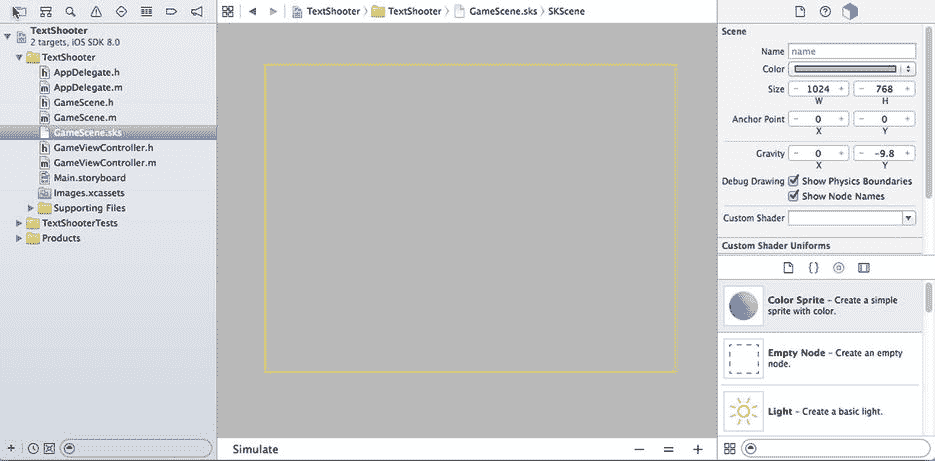

Figure 17-2. Xcode Sprite Kit 关卡设计器，显示最初空的`GameScene`

场景显示在编辑区域——目前，它只是一个灰色背景上的空黄色矩形。其右侧是 **SKNode Inspector**，可用于设置编辑器中选中的节点的属性。Sprite Kit 场景元素都是节点——`SKNode`类的实例。`SKScene`本身是`SKNode`的子类。此处选中了`SKScene`节点，因此 SKNode Inspector 显示其属性。检查器下方，右下角是通常的 Xcode Object Library，它自动过滤，仅显示可添加到 Sprite Kit 场景的对象类型。通过将对象从此处拖放到编辑器上来设计场景。

**提示** 你可能想知道，用于从场景文件加载场景的方法名为`nodeWithFileNamed:`而非`sceneWithFileNamed:`。尽管模板代码仅用此方法加载初始场景，但它实际上可以加载任何 Sprite Kit 节点，这意味着你可以将节点存档到文件，之后重新加载。事实上，你可以使用关卡设计器创建仅包含单个节点的场景，并将其保存，稍后加载到场景图中。这让你无需编写任何代码即可设计复杂节点。

现在让我们回到`viewDidLoad`方法的讨论上。

```
scene.scaleMode = SKSceneScaleModeAspectFill;

// Present the scene.
[skView presentScene:scene];
```

这两行代码设置了场景的缩放模式并使场景可见。让我们按相反顺序讨论这两件事。要使场景及其内容可见并处于活动状态，它必须由`SKView`呈现。要呈现场景，需调用`SKView`的`presentScene:`方法。一个`SKView`一次只能显示一个场景，因此当已有已呈现场景时调用此方法会导致新场景立即替换旧场景。如果要从一个场景切换到另一个场景，最好使用`presentScene:transition:`方法，该方法会为场景切换添加动画效果。本章后面你将看到示例。在本例中，由于我们正在使初始场景可见，没有之前的内容可过渡，因此使用`presentScene:`方法是可以接受的。

现在我们来讨论场景的`scaleMode`属性。回顾图 Figure 17-2，你会看到关卡设计器中的默认场景宽 1024 点，高 768 点——与 iPad 屏幕尺寸相同。如果你仅打算在 iPad 上以横向模式运行游戏，这没问题，但纵向模式或其他屏幕尺寸（如 iPhone）该怎么办？应如何使场景适应运行应用程序的屏幕尺寸？这个问题没有简单答案。当场景在`SKView`中呈现时，有四种不同方式调整其大小，对应`SKSceneScaleMode`枚举的四个值。要了解每种缩放模式的作用，让我们创建另一个 Sprite Kit 项目并进行实验。使用与之前相同的步骤，创建一个 Sprite Kit 项目，将其命名为`ResizeModes`，并在 Project Navigator 中选择`GameScene.sks`文件。此时，你的 Xcode 窗口应如图 Figure 17-2 所示。

在 Object Library 中，找到*Label*节点并将其拖到场景中央。在 SKNode Inspector 中，使用 **Text** 字段将标签文本改为*Center*。将另一个标签拖到场景左下角，小心放置，使其恰好位于场景角落。将其`text`属性改为*Bottom Left*。将第三个标签拖到场景右上角，将其文本改为*Top Right*。再拖几个标签到场景顶部和底部，分别命名为*Top*和*Bottom*。如有必要，可以更改与标签关联的颜色和字体，使文本更易见。完成后，场景应如图 Figure 17-3 所示。

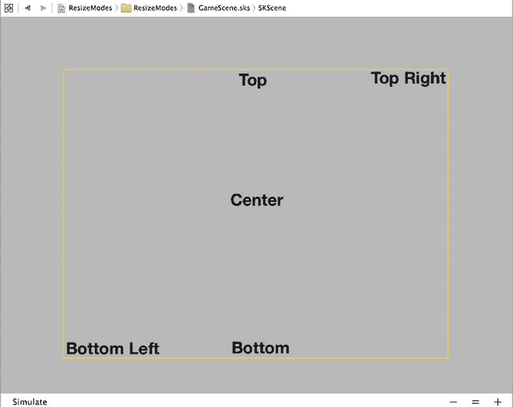

Figure 17-3. 使用 Sprite Kit 关卡设计器向场景添加节点

**提示** 如果在编辑区域看不到整个场景，可以使用编辑器右下角的 -/=/+ 按钮缩小视图，直到能看到足够多的场景以便操作。

在 Project Navigator 中选择`GameScene.m`并删除`didMoveToView:`方法。此方法包含向场景添加“Hello, World”标签的代码，我们不再需要。接下来，选择`GameViewController.m`并在`viewDidLoad`方法中找到设置`SKScene`对象的`scaleMode`的代码行。如你所见，它初始设置为`SKSceneScaleModeAspectFill`。使用此缩放模式在 iPhone 模拟器（或设备）上运行应用程序，然后编辑代码，分别使用`SKSceneScaleModeAspectFit`、`SKSceneScaleModeFill`和`SKSceneScaleModeResizeFill`值再运行三次。结果如图 Figure 17-4 所示。

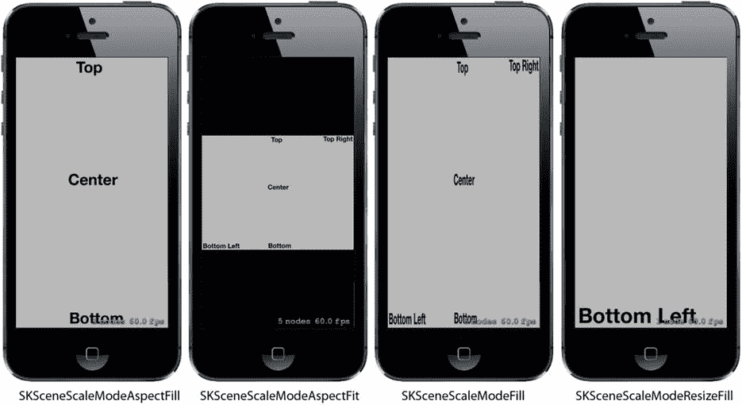

Figure 17-4. 比较四种场景重新缩放模式

这些模式的作用如下：


- `SKSceneScaleModeAspectFill` 会缩放场景，使其在保持宽高比的同时填满屏幕。如图 17-4 所示，此模式确保`SKView`的每个像素都被覆盖，但会丢失部分场景内容——在本例中，场景的左侧和右侧被裁剪。场景内容也会被缩放，因此文本比原始场景更小，但其相对于场景的位置保持不变。
- `SKSceneScaleModeAspectFit` 同样保持场景的宽高比，但确保整个场景可见。结果是出现信箱式视图，`SKView`的部分区域在场景内容的上方和下方可见。
- `SKSceneScaleModeFill` 会沿两个轴缩放场景，使其精确适配视图。这确保了场景中的所有内容都可见，但由于原始场景的宽高比未被保留，内容可能会出现不可接受的失真。此处可以看到文本被水平压缩。
- 最后，`SKSceneScaleModeResizeFill` 将场景的左下角放置在视图的左下角，并保持其原始大小。

哪种缩放模式最适合您，取决于应用程序的需求。如果这些模式都不适用，还有另外两种选择。首先，您可以支持一组固定的屏幕尺寸，为每种尺寸创建独立的设计，将其存储在各自的`*.sks`文件中，并在需要时从相应文件加载场景。其次，您可以直接在代码中创建场景，使其大小与呈现它的`SKView`相同，并通过编程方式向其中添加节点。这种方法仅在您的游戏不依赖于元素精确相对位置时才有效。为了说明这种方法如何运作，我们将在 TextShooter 应用程序中使用它。

## 初始场景定制

打开 TextShooter 项目，选择`GameScene`类。我们不需要 Xcode 模板生成的大部分代码，因此将其删除。首先，删除整个`didMoveToView:`方法。每当场景在`SKView`中呈现时，都会调用此方法，通常用于在场景可见之前对其进行最后的修改。接下来，移除`touchesBegan:withEvent:`方法的大部分内容，只保留其中的`for`循环及其包含的第一行代码。此时，您的`GameScene`类应如下所示（编译器会警告`location`是一个未使用的变量——无需担心，我们稍后会修复）：

```
@implementation GameScene

-(void)touchesBegan:(NSSet *)touches withEvent:(UIEvent *)event {
    /* Called when a touch begins */

for (UITouch *touch in touches) {
        CGPoint location = [touch locationInNode:self];
    }
}

-(void)update:(CFTimeInterval)currentTime {
    /* Called before each frame is rendered */
}

@end
```

由于我们不打算从`GameScene.sks`加载场景，我们需要一个方法来创建包含初始内容的场景。我们还需要为当前游戏关卡编号、玩家拥有的生命数以及一个指示关卡是否完成的标志添加属性。将以下粗体行添加到`GameScene.h`中：

```
@interface GameScene : SKScene

@property (assign, nonatomic) NSUInteger levelNumber;
@property (assign, nonatomic) NSUInteger playerLives;
@property (assign, nonatomic) BOOL finished;

+ (instancetype)sceneWithSize:(CGSize)size levelNumber:(NSUInteger)levelNumber;
- (instancetype)initWithSize:(CGSize)size levelNumber:(NSUInteger)levelNumber;

@end
```

现在切换到`GameScene.m`，我们将在其中实现刚刚声明的两个新方法。在文件的实现部分添加以下代码：

```
+ (instancetype)sceneWithSize:(CGSize)size levelNumber:(NSUInteger)levelNumber {
    return [[self alloc] initWithSize:size levelNumber:levelNumber];
}

- (instancetype)initWithSize:(CGSize)size {
    return [self initWithSize:size levelNumber:1];
}

- (instancetype)initWithSize:(CGSize)size levelNumber:(NSUInteger)levelNumber {
    if (self = [super initWithSize:size]) {
        _levelNumber = levelNumber;
        _playerLives = 5;

self.backgroundColor = [SKColor whiteColor];

SKLabelNode *lives = [SKLabelNode labelNodeWithFontNamed:@"Courier"];
        lives.fontSize = 16;
        lives.fontColor = [SKColor blackColor];
        lives.name = @"LivesLabel";
        lives.text = [NSString stringWithFormat:@"Lives: %lu",
                      (unsigned long)_playerLives];
        lives.verticalAlignmentMode = SKLabelVerticalAlignmentModeTop;
        lives.horizontalAlignmentMode = SKLabelHorizontalAlignmentModeRight;
        lives.position = CGPointMake(self.frame.size.width,
                                     self.frame.size.height);
        [self addChild:lives];

SKLabelNode *level = [SKLabelNode labelNodeWithFontNamed:@"Courier"];
        level.fontSize = 16;
        level.fontColor = [SKColor blackColor];
        level.name = @"LevelLabel";
        level.text = [NSString stringWithFormat:@"Level: %lu",
                      (unsigned long)_levelNumber];
        level.verticalAlignmentMode = SKLabelVerticalAlignmentModeTop;
        level.horizontalAlignmentMode = SKLabelHorizontalAlignmentModeLeft;
        level.position = CGPointMake(0, self.frame.size.height);
        [self addChild:level];
    }
    return self;
}
```

第一个方法`sceneWithSize:levelNumber:`为我们提供了一个工厂方法，它可作为同时创建关卡并设置其关卡编号的快捷方式。第二个方法`initWithSize:`覆盖了类的默认初始化器，将控制权传递给第三个方法（并传递关卡编号的默认值）。第三个方法随后调用其父类实现中的指定初始化器。这可能看起来有些迂回，但当您想为类添加新的初始化器，同时仍使用类的指定初始化器时，这是一种常见模式。

我们添加的第三个方法`initWithSize:levelNumber:`用于设置关卡场景的基本配置。首先，我们根据传入的参数设置几个实例变量的值。其次，我们设置场景的背景颜色。注意，这里我们使用的是名为`SKColor`的类，而不是`UIColor`。实际上，`SKColor`并非真正的类，而是一种别名，在 iOS 应用程序中可代替`UIColor`，在 OS X 应用程序中可代替`NSColor`。这使我们能够更轻松地在 iOS 和 OS X 之间移植游戏。

之后，我们创建了两个名为`SKLabelNode`的类的实例。这是一个方便的类，其工作方式类似于`UILabel`，允许我们向场景添加文本，并让我们选择字体、设置文本值以及指定某些对齐方式。我们创建了一个标签用于在屏幕右上角显示生命数，另一个标签用于在屏幕左上角显示关卡编号。请仔细查看我们用于定位这些标签的代码。以下是设置生命数标签位置的代码：

```
lives.position = CGPointMake(self.frame.size.width,
                             self.frame.size.height);
```


### 玩家移动

现在来添加一点交互性。我们将创建一个代表玩家的新类。该类将知道如何利用内部组件绘制自身，以及如何以精美的动画方式移动到新位置。接下来，我们将把该类的一个实例插入场景中，并编写一些代码，让玩家通过触摸屏幕来移动对象。

场景中的每个对象都必须是 `SKNode` 的子类。因此，你将使用 Xcode 的**文件**菜单创建一个名为 `PlayerNode` 的新 Cocoa Touch 类，该类是 `SKNode` 的子类。在创建后几乎为空的 *PlayerNode.m* 文件中，添加以下方法：

```
- (instancetype)init {
    if (self = [super init]) {
        self.name = [NSString stringWithFormat:@"Player %p", self];
        [self initNodeGraph];
    }
    return self;
}

- (void)initNodeGraph {
    SKLabelNode *label = [SKLabelNode labelNodeWithFontNamed:@"Courier"];
    label.fontColor = [SKColor darkGrayColor];
    label.fontSize = 40;
    label.text = @"v";
    label.zRotation = M_PI;
    label.name = @"label";

    [self addChild:label];
}
```

我们的 `PlayerNode` 本身并不显示任何内容，因为普通的 `SKNode` 无法自行绘制。相反，`init` 方法设置了一个子节点来执行实际的绘制工作。这个子节点是 `SKLabelNode` 的另一个实例，就像我们之前创建用于显示关卡号码和剩余生命数的标签一样。`SKLabelNode` 是 `SKNode` 的一个子类，它*确实*知道如何绘制自身。另一个这样的子类是 `SKSpriteNode`。我们没有为标签设置位置，这意味着它的位置是坐标 (0, 0)。与视图类似，每个 `SKNode` 存在于从其父对象继承的坐标系中。将此节点的位置设为零，意味着它将在屏幕上显示在 `PlayerNode` 实例所在的位置。任何非零值都将有效地成为相对于该点的偏移量。

我们还为标签设置了一个旋转值，以便它包含的小写字母“v”能够倒置显示。旋转属性的名称 `zRotation` 可能看起来有点令人意外；然而，它只是指 Sprite Kit 所使用的坐标空间中的 z 轴。你在屏幕上只能看到 x 轴和 y 轴，但 z 轴可用于排列显示顺序以及围绕其旋转物件。赋给 `zRotation` 的值需要是弧度而不是角度，因此我们赋值为 `M_PI`，它相当于数学值 *π*。由于 *π* 弧度等于 180°，这正是我们需要的。

### 将玩家添加到场景中

现在切换回 *GameScene.m*。在这里，我们将向场景中添加一个 `PlayerNode` 实例。首先导入新类的头文件，并在一个新的类扩展中添加一个属性：

```
#import "GameScene.h"
#import "PlayerNode.h"

@interface GameScene ()

@property (strong, nonatomic) PlayerNode *playerNode;

@end
```

继续，在 `initWithSize:levelNumber:` 方法的末尾附近添加以下粗体代码。确保将其放在 `return self` 之前以及其上方的右花括号之前：

```
[self addChild:level];
_playerNode = [PlayerNode node];
_playerNode.position = CGPointMake(CGRectGetMidX(self.frame),
                                   CGRectGetHeight(self.frame) * 0.1);

[self addChild:_playerNode];
    }
    return self;
}
```

如果你现在构建并运行应用程序，你应该会看到玩家出现在屏幕底部中间附近，如图 17-6 所示。


图 17-6。一个倒置的“v”来救场！

### 处理触摸：玩家移动

---

如果你思考一下我们传递给这个标签的位置坐标，你可能会惊讶地发现我们传入了场景的高度。在 UIKit 中，将任何内容定位在 `UIView` 的高度处，会将其放置在该视图的底部；但在 Scene Kit 中，y 轴是翻转的——坐标原点位于场景的左下角，y 轴指向上方。因此，场景高度的最大值对应的是屏幕顶部的位置。那么标签的 x 坐标呢？我们将其设置为视图的宽度。如果你对 `UIView` 这样做，该视图将会被放置在屏幕的右侧之外。但这里并非如此，因为我们还做了以下操作：

```
lives.horizontalAlignmentMode = SKLabelHorizontalAlignmentModeRight;
```

将 `SKLabelNode` 的 `horizontalAlignmentMode` 属性设置为 `SKLabelHorizontalAlignmentModeRight`，会将标签节点用于定位的点（实际上是一个名为 `position` 的属性）移动到文本的右侧。由于我们希望文本在屏幕上右对齐，因此需要将 `position` 属性的 x 坐标设置为场景的宽度。相比之下，`level` 标签中的文本是左对齐的，我们通过将其 x 坐标设为零来将其定位在场景的左边缘：

```
level.horizontalAlignmentMode = SKLabelHorizontalAlignmentModeLeft;
level.position = CGPointMake(0, self.frame.size.height);
```

你还会看到我们为每个标签指定了一个 `name`。这类似于 UIKit 其他部分中的标签或标识符，它将使我们以后能够通过名称来检索这些标签。

现在选择 *GameViewController.m*，并对 `viewDidLoad` 方法进行以下更改：

```
- (void)viewDidLoad
{
    [super viewDidLoad];

    // 配置视图。
    SKView *skView = (SKView *)self.view;
    skView.showsFPS = YES;
    skView.showsNodeCount = YES;
    skView.ignoresSiblingOrder = YES;

    // 创建并配置场景。
    GameScene *scene = [GameScene nodeWithFileNamed:@"GameScene"];
    scene.scaleMode = SKSceneScaleModeAspectFill;
    GameScene *scene = [GameScene sceneWithSize:self.view.frame.size
                                  levelNumber:1];

    // 呈现场景。
    [skView presentScene:scene];
}
```

我们没有从场景文件中加载场景，而是使用刚添加到 `GameScene` 中的 `sceneWithSize:levelNumber:` 方法来创建并初始化场景，并使其与 `SKView` 大小相同。由于视图和场景大小相同，不再需要设置场景的 `scaleMode` 属性，因此我们可以删除执行该操作的代码行。

在 *GameViewController.m* 的底部，你会看到模板为我们包含的以下方法：

```
- (BOOL)prefersStatusBarHidden {
    return YES;
}
```

从这个方法返回 `YES` 会让 iOS 状态栏在我们的游戏运行时消失，这通常是此类动作游戏所需要的。现在运行游戏，你会看到我们已经有了一些非常基础的结构，如图 17-5 所示。

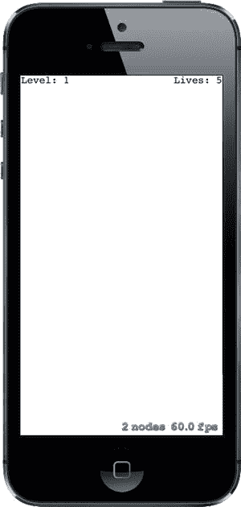

图 17-5。我们的游戏目前还没有太多乐趣，但至少它的帧率很高！

**提示** 场景右下角的节点数和帧率对于调试很有用，但在发布游戏时你不希望它们出现在那里！你可以通过在 `GameViewController` 的 `viewDidLoad` 方法中将 `SKView` 的 `showsFPS` 和 `showsNodeCount` 属性设置为 `NO` 来关闭它们。还有一些其他的 `SKView` 属性可以让你获取更多调试信息——详情请参考 API 文档。


接下来，我们要在之前几乎留空的 `touchesBegan:withEvent:` 方法中添加一些逻辑。请在 `GameScene.m` 中插入下面加粗的行（添加此代码时会出现编译错误——我们稍后会修复）：

```objectivec
- (void)touchesBegan:(NSSet *)touches withEvent:(UIEvent *)event {
    /* Called when a touch begins */

    for (UITouch *touch in touches) {
        CGPoint location = [touch locationInNode:self];
        if (location.y < CGRectGetHeight(self.frame) * 0.2 ) {
            CGPoint target = CGPointMake(location.x,
                                         self.playerNode.position.y);
            [self.playerNode moveToward:target];
        }
    }
}
```

上述代码片段使用屏幕下半部分中任意触摸位置作为新位置的基准，玩家节点将向此位置移动。它还指示玩家节点向该位置移动。之所以出现编译错误，是因为我们尚未定义玩家节点的 `moveToward:` 方法。因此，首先在 `PlayerNode.h` 中声明该方法，如下所示：

```objectivec
#import <SpriteKit/SpriteKit.h>

@interface PlayerNode : SKNode

// 返回未来移动的持续时间
- (void)moveToward:(CGPoint)location;

@end
```

接下来，切换到 `PlayerNode.m` 并添加以下实现：

```objectivec
- (void)moveToward:(CGPoint)location {
    [self removeActionForKey:@"movement"];

    CGFloat distance = PointDistance(self.position, location);
    CGFloat screenWidth = [UIScreen mainScreen].bounds.size.width;
    CGFloat duration = 2.0 * distance / screenWidth;

    [self runAction:[SKAction moveTo:location duration:duration]
            withKey:@"movement"];
}
```

我们暂时跳过第一行，稍后再回来解释。这个方法将新位置与当前位置进行比较，计算出距离和移动所需的像素数。接着，它利用一个数值常量来确定整体移动的速度，从而计算出移动所需的时间。最后，创建一个 `SKAction` 来执行移动。`SKAction` 是 Sprite Kit 的一部分，它能够随时间对节点进行修改，让你轻松地对节点的位置、大小、旋转、透明度等进行动画处理。在这里，我们告诉玩家节点在特定持续时间内运行一个简单的移动动作，然后将该动作分配给键 `@"movement"`。如你所见，这个键与该方法第一行中用于移除动作的键相同。我们以移除任何具有相同键的现有动作开始该方法，这样用户就可以快速连续点击多个位置，而不会产生大量试图以不同方式移动的竞争动作！

## 几何计算

现在你会注意到我们又引入了一个问题，因为 Xcode 找不到名为 `PointDistance()` 的函数。这是我们的应用将用来执行点、向量和浮点数计算的几个简单几何函数之一。我们现在就来实现它。使用 Xcode 创建一个新文件，这次是在 iOS 部分下选择 Header File。将其命名为 `Geometry.h`，并添加以下内容：

```c
#ifndef TextShooter_Geometry_h
#define TextShooter_Geometry_h

// 接受一个 CGVector 和一个 CGFloat。
// 返回一个新的 CGFloat，其中 v 的每个分量都乘以了 m。
static inline CGVector VectorMultiply(CGVector v, CGFloat m) {
    return CGVectorMake(v.dx * m, v.dy * m);
}

// 接受两个 CGPoint。
// 返回表示从 p1 到 p2 方向的 CGVector。
static inline CGVector VectorBetweenPoints(CGPoint p1, CGPoint p2) {
    return CGVectorMake(p2.x - p1.x, p2.y - p1.y);
}

// 接受一个 CGVector。
// 返回一个 CGFloat，包含向量的长度，使用勾股定理计算。
static inline CGFloat VectorLength(CGVector v) {
    return sqrtf(powf(v.dx, 2) + powf(v.dy, 2));
}

// 接受两个 CGPoint。返回一个 CGFloat，包含它们之间的距离，
// 使用勾股定理计算。
static inline CGFloat PointDistance(CGPoint p1, CGPoint p2) {
    return sqrtf(powf(p2.x - p1.x, 2) + powf(p2.y - p1.y, 2));
}

#endif
```

这些是一些常见操作的简单实现，在许多游戏中都很有用：向量乘法、创建从一个点到另一个点的向量，以及计算距离。为了让代码使用这些函数，只需在 `PlayerNode.m` 顶部附近添加以下导入：

```objectivec
#import "Geometry.h"
```

现在构建并运行应用程序。在玩家飞船出现后，点击屏幕底部的任意位置，即可看到飞船向左或向右滑动到你点击的点。你可以在飞船到达目的地之前再次点击，它会立即开始新的动画以移向新位置。这很好，但如果玩家飞船的动作更生动一些，岂不是更好？

## 摇摆部件

让我们通过添加另一个动画，让飞船在移动时产生一些摇摆。将加粗的行添加到 `PlayerNode` 的 `moveToward:` 方法中。

```objectivec
- (void)moveToward:(CGPoint)location {
    [self removeActionForKey:@"movement"];
    [self removeActionForKey:@"wobbling"];

    CGFloat distance = PointDistance(self.position, location);
    CGFloat pixels = [UIScreen mainScreen].bounds.size.width;
    CGFloat duration = 2.0 * distance / pixels;

    [self runAction:[SKAction moveTo:location duration:duration]
            withKey:@"movement"];

    CGFloat wobbleTime = 0.3;
    CGFloat halfWobbleTime = wobbleTime * 0.5;
    SKAction *wobbling = [SKAction
                sequence:@[[SKAction scaleXTo:0.2 duration:halfWobbleTime],
                           [SKAction scaleXTo:1.0
                                duration:halfWobbleTime]
                             ]];
    NSUInteger wobbleCount = duration / wobbleTime;

    [self runAction:[SKAction repeatAction:wobbling count:wobbleCount]
            withKey:@"wobbling"];
}
```

我们刚才所做的与之前创建的移动动作类似，但在一些重要方面有所不同。对于基本移动，我们只计算了移动持续时间，然后一步创建并运行移动动作。这次则稍微复杂一些。首先，我们定义单次“摇摆”的时间（飞船在移动过程中可能摇摆多次，但会以一致的速度进行）。摇摆本身包括首先将飞船沿 x 轴（即其宽度）缩放至正常大小的 2/10，然后再将其缩放回完整大小。每一步都是单个动作，它们被打包成另一种称为**序列**的动作，序列会依次执行其中包含的所有动作。接下来，我们计算出在飞船移动期间可以进行多少次摇摆，并将 `wobbling` 序列包装在重复动作中，告诉它应该执行多少个完整的摇摆周期。同时，和之前一样，我们通过取消任何之前的摇摆动作来开始该方法，因为我们不希望有竞争性的摇摆动作。

现在运行应用程序，你会看到飞船在来回移动时愉快地摇摆。看起来有点像在走路！

## 创建敌人

到目前为止还不错，但这款游戏需要一些敌人供玩家射击。使用 Xcode 创建一个新的 Cocoa Touch 类，命名为 `EnemyNode`，父类设置为 `SKNode`。我们暂时不会为敌人赋予任何实际行为，但会赋予它一个外观。我们将使用与玩家相同的方法，即使用文本来构建敌人的身体。毫无疑问，没有比字母 X 更具威慑力的字符了，所以我们的敌人将是一个字母 X…… 由小写 x 组成！当你将以下方法添加到 `EnemyNode.m` 中时，请尽量别被这个想法吓到：


```objectivec
- (instancetype)init {
    if (self = [super init]) {
        self.name = [NSString stringWithFormat:@"Enemy %p", self];
        [self initNodeGraph];
    }
    return self;
}

- (void)initNodeGraph {
    SKLabelNode *topRow = [SKLabelNode
                           labelNodeWithFontNamed:@"Courier-Bold"];
    topRow.fontColor = [SKColor brownColor];
    topRow.fontSize = 20;
    topRow.text = @"x x";
    topRow.position = CGPointMake(0, 15);
    [self addChild:topRow];

    SKLabelNode *middleRow = [SKLabelNode
                              labelNodeWithFontNamed:@"Courier-Bold"];
    middleRow.fontColor = [SKColor brownColor];
    middleRow.fontSize = 20;
    middleRow.text = @"x";
    [self addChild:middleRow];

    SKLabelNode *bottomRow = [SKLabelNode
                              labelNodeWithFontNamed:@"Courier-Bold"];
    bottomRow.fontColor = [SKColor brownColor];
    bottomRow.fontSize = 20;
    bottomRow.text = @"x x";
    bottomRow.position = CGPointMake(0, -15);
    [self addChild:bottomRow];
}
```

这里没什么新内容；我们只是通过调整每个文本行的 `y` 值，添加了多行文本。

## 将敌人放入场景

现在，让我们修改 `GameScene.m` 文件，让场景中出现一些敌人。首先，在文件顶部附近添加以下粗体显示的代码行：

```objectivec
#import "GameScene.h"
#import "PlayerNode.h"
#import "EnemyNode.h"

@interface GameScene ()

@property (strong, nonatomic) PlayerNode *playerNode;
@property (strong, nonatomic) SKNode *enemies;

@end
```

我们导入了新敌人类的头文件，并添加了一个新属性，用于存放将添加到关卡中的所有敌人。你可能会认为应该使用 `NSMutableArray`，但实际上，使用一个普通的 `SKNode` 就非常适合这项工作。`SKNode` 可以容纳任意数量的子节点。而且，既然我们需要将所有敌人添加到场景中，不如将它们全部保存在一个 `SKNode` 中，以便于访问。

下一步是创建 `spawnEnemies` 方法，如下所示：

```objectivec
- (void)spawnEnemies {
    NSUInteger count = log(self.levelNumber) + self.levelNumber;
    for (NSUInteger i = 0; i < count; i++) {
        EnemyNode *enemy = [EnemyNode node];
        CGSize size = self.frame.size;
        CGFloat x = arc4random_uniform(size.width * 0.8)
                    + (size.width * 0.1);
        CGFloat y = arc4random_uniform(size.height * 0.5)
                    + (size.height * 0.5);
        enemy.position = CGPointMake(x, y);
        [self.enemies addChild:enemy];
    }
}
```

最后，在 `initWithSize:levelNumber:` 方法末尾附近添加以下代码行，以创建一个空的 `enemies` 节点，然后调用 `spawnEnemies` 方法：

```objectivec
[self addChild:_playerNode];
_enemies = [SKNode node];
[self addChild:_enemies];
[self spawnEnemies];
```

由于我们将 `enemies` 节点添加到了场景中，因此我们添加到 `enemies` 节点中的任何敌人子节点也会出现在场景中。

现在运行应用程序，你会看到一个可怕的敌人随机出现在屏幕的上半部分（参见图 17-7）。你难道不想开枪打它吗？

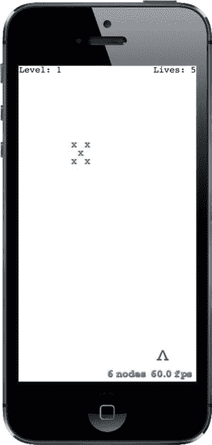

图 17-7。我相信你会同意，这个由 X 组成的 X 形敌人就该被射击

## 开始射击

是时候实现这个游戏开发的下一步逻辑了：让玩家攻击敌人。我们希望玩家能够点击屏幕上方 80% 的任意位置，向敌人发射子弹。我们将使用 Sprite Kit 内置的**物理引擎**来移动玩家的子弹，并检测子弹何时与敌人发生碰撞。

但首先，这个所谓的物理引擎是什么？简单来说，物理引擎是一个软件组件，它跟踪世界中多个物理对象（通常称为**刚体**）及其受到的作用力。它还能确保一切以现实的方式运动。它可以考虑重力、处理物体之间的碰撞（这样物体就不会同时占据同一空间），甚至模拟物理特性，如摩擦力和弹性。

重要的是要理解，物理引擎通常与图形引擎是分开的。苹果提供了方便的 API 让我们可以同时使用两者，但它们本质上是独立的。在你的显示中，有些对象，比如显示当前关卡编号和剩余生命数的标签，可能与物理引擎完全无关。而且，也有可能创建具有物理刚体但不显示任何内容的物体。

## 定义物理类别

Sprite Kit 物理引擎允许我们做的事情之一就是将对象分配为几个不同的**物理类别**。物理类别与 Objective-C 的类别无关。相反，物理类别是一种对相关对象进行分组的方式，以便物理引擎能够以不同的方式处理它们之间的碰撞。例如，在这个游戏中，我们将创建三个类别：一个用于敌人，一个用于玩家，一个用于玩家导弹。我们绝对希望物理引擎关注敌人和玩家导弹之间的碰撞，但可能希望它忽略玩家导弹与玩家本身的碰撞。使用物理类别可以轻松实现这一点。

那么，让我们创建所需的类别。按 **N** 键打开新建文件助手，从 iOS 部分选择 **Header File**，然后按 **Next**。将新的头文件命名为 `PhysicsCategories.h` 并保存，然后添加以下代码：

```objectivec
#ifndef TextShooter_PhysicsCategories_h
#define TextShooter_PhysicsCategories_h

typedef NS_OPTIONS(uint32_t, PhysicsCategory) {
    PlayerCategory        =  1 << 1,
    EnemyCategory         =  1 << 2,
    PlayerMissileCategory =  1 << 3
};

#endif
```

这里我们声明了三个类别常量。请注意，这些类别以位掩码的方式工作，因此每个都必须为 2 的幂。我们可以通过位运算轻松做到这一点。它们被设置为位掩码形式，是为了简化物理引擎的 API。使用位掩码，我们可以通过逻辑*或*运算将多个值组合在一起。这样，我们就能通过一次 API 调用来告诉物理引擎如何处理多个不同层之间的碰撞。我们很快就会看到它的实际应用。

## 创建 BulletNode 类

既然我们已经做好了准备工作，现在来创建一些子弹，这样我们就可以开始射击了。

创建一个名为 `BulletNode` 的新 Cocoa Touch 类，同样使用 `SKNode` 作为其父类。从头文件开始，将要声明该类具有的两个公共方法：

```objectivec
#import <SpriteKit/SpriteKit.h>

@interface BulletNode : SKNode

+ (instancetype)bulletFrom:(CGPoint)start toward:(CGPoint)destination;
- (void)applyRecurringForce;

@end
```

第一个方法是用于创建该类新实例的工厂方法。第二个方法需要你每帧从场景中调用，以控制子弹移动。现在切换到 `BulletNode.m` 文件开始实现这个类。

我们要做的第一步是导入专用几何函数和物理类别的头文件。第二步是添加一个类扩展，其中包含一个属性，用于存放这颗子弹的推力向量：

```objectivec
#import "BulletNode.h"
#import "PhysicsCategories.h"
#import "Geometry.h"

@interface BulletNode ()

@property (assign, nonatomic) CGVector thrust;

@end
```


# 排版后的文本

接下来，我们实现一个`init`方法。与本应用中其他的`init`方法一样，这里是我们为子弹创建对象图的地方。这将由一个单独的点组成。同时，我们通过创建并配置一个`SKPhysicsBody`实例并将其附加到`self`上，来为此类配置物理属性。在此过程中，我们告诉这个新的物理体它属于哪个类别，以及应该检查哪些类别以确定与该对象的碰撞。

```objc
@implementation BulletNode

- (instancetype)init {
    if (self = [super init]) {
        SKLabelNode *dot = [SKLabelNode labelNodeWithFontNamed:@"Courier"];
        dot.fontColor = [SKColor blackColor];
        dot.fontSize = 40;
        dot.text = @".";
        [self addChild:dot];

        SKPhysicsBody *body = [SKPhysicsBody bodyWithCircleOfRadius:1];
        body.dynamic = YES;
        body.categoryBitMask = PlayerMissileCategory;
        body.contactTestBitMask = EnemyCategory;
        body.collisionBitMask = EnemyCategory;
        body.mass = 0.01;

        self.physicsBody = body;
        self.name = [NSString stringWithFormat:@"Bullet %p", self];
    }
    return self;
}

@end
```

## 应用物理

接下来，我们将创建工厂方法，该方法创建一个新的子弹，并为其提供一个推力向量，物理引擎将使用该向量将子弹推向目标：

```objc
+ (instancetype)bulletFrom:(CGPoint)start toward:(CGPoint)destination {
    BulletNode *bullet = [[self alloc] init];

    bullet.position = start;

    CGVector movement = VectorBetweenPoints(start, destination);
    CGFloat magnitude = VectorLength(movement);
    if (magnitude == 0.0f) return nil;

    CGVector scaledMovement = VectorMultiply(movement, 1 / magnitude);

    CGFloat thrustMagnitude = 100.0;
    bullet.thrust = VectorMultiply(scaledMovement, thrustMagnitude);

    return bullet;
}
```

基本的计算非常简单。我们首先确定一个`movement`向量，它从起始位置指向目标位置，然后确定其`magnitude`（长度）。将`movement`向量除以其`magnitude`会得到一个归一化的单位向量，这是一个指向与原向量相同方向、但长度恰好为一个单位的向量（在这种情况下，一个单位与屏幕上的一个“点”相同——例如，在 Retina 设备上是两个像素，在旧设备上是一个像素）。创建单位向量非常有用，因为我们可以将其乘以一个固定大小（在本例中为 100），以确定一个统一强度的推力向量，无论用户点击屏幕的位置有多远。

我们需要为此类添加的最后一段代码是以下方法，它将推力应用到物理体上。我们将在每一帧中，从场景内部调用它：

```objc
- (void)applyRecurringForce {
    [self.physicsBody applyForce:self.thrust];
}
```

### 将子弹添加到场景中

现在切换到`GameScene.m`，将子弹添加到场景本身中。首先，在文件顶部附近导入新类的头文件。接下来，添加另一个属性，将所有子弹包含在单个`SKNode`中，就像之前为敌人所做的那样：

```objc
#import "GameScene.h"
#import "PlayerNode.h"
#import "EnemyNode.h"
#import "BulletNode.h"

@interface GameScene ()

@property (strong, nonatomic) PlayerNode *playerNode;
@property (strong, nonatomic) SKNode *enemies;
@property (strong, nonatomic) SKNode *playerBullets;

@end
```

找到`initWithSize:levelNumber:`方法中之前添加敌人的部分。那也是设置`playerBullets`节点的位置。

```objc
[self spawnEnemies];
_playerBullets = [SKNode node];
[self addChild:_playerBullets];
```

现在我们已经准备好编写实际的导弹发射代码。在`touchesBegan:withEvent:`方法中添加这个`else`子句，这样所有在屏幕上半部分的点击都会发射子弹，而不是移动飞船：

```objc
- (void)touchesBegan:(NSSet *)touches withEvent:(UIEvent *)event {
    for (UITouch *touch in touches) {
        CGPoint location = [touch locationInNode:self];
        if (location.y < CGRectGetHeight(self.frame) * 0.2 ) {
            CGPoint target = CGPointMake(location.x,
                                         self.playerNode.position.y);
            [self.playerNode moveToward:target];

        } else {
            BulletNode *bullet = [BulletNode
                                     bulletFrom:self.playerNode.position
                                     toward:location];
            [self.playerBullets addChild:bullet];
        }
    }
}
```

这样添加了子弹，但我们添加的子弹都不会实际移动，除非我们通过每帧施加推力来告诉它们移动。我们的场景已经包含了一个名为`update:`的空方法。这个方法每帧被调用一次，这是进行任何需要在每帧中发生的游戏逻辑的完美位置。然而，我们并不是直接在该方法中更新所有子弹，而是将代码放在一个单独的方法中，然后从`update:`方法中调用它：

```objc
- (void)update:(CFTimeInterval)currentTime {
    [self updateBullets];
}

- (void)updateBullets {
    NSMutableArray *bulletsToRemove = [NSMutableArray array];
    for (BulletNode *bullet in self.playerBullets.children) {
        // 移除任何移出屏幕的子弹
        if (!CGRectContainsPoint(self.frame, bullet.position)) {
            // 标记要移除的子弹
            [bulletsToRemove addObject:bullet];
            continue;
        }
        // 对剩余子弹施加推力
        [bullet applyRecurringForce];
    }
    [self.playerBullets removeChildrenInArray:bulletsToRemove];
}
```

在告诉每个子弹施加其循环力之前，我们还会检查每个子弹是否仍在屏幕上。任何移出屏幕的子弹都被放入一个临时数组中；然后在最后，这些子弹会从`playerBullets`节点中被移除。请注意，这个两步过程是必要的，因为此方法中的`for`循环正在遍历`playerBullets`节点中的所有子节点。在遍历集合时对其进行修改绝不是一个好主意，并且很容易导致崩溃。

现在构建并运行应用程序，你会看到，除了可以移动玩家的飞船之外，你还可以通过点击屏幕让它向上发射导弹（参见图 17-8）。很酷！

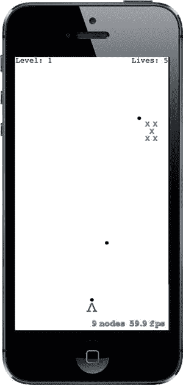

图 17-8. 射击风暴！

### 用物理攻击敌人

我们的游戏仍然缺少几个重要的游戏玩法元素。敌人从不攻击我们，而且我们还不能通过射击来消灭敌人。让我们现在来关注后者。我们将进行设置，使得射击敌人会产生将其从当前固定在屏幕上的位置移除的效果。此功能将使用物理引擎来完成所有繁重的工作，并且需要修改`PlayerNode`、`EnemyNode`和`GameScene`。

首先，让我们为那些还没有物理体的节点添加物理体。从`EnemyNode.m`开始，在文件顶部附近添加这个`#import`语句：

```objc
#import "PhysicsCategories.h"
```

接下来，在`init`方法中添加以下行：

```objc
- (instancetype)init {
    if (self = [super init]) {
        self.name = [NSString stringWithFormat:@"Enemy %p", self];
        [self initNodeGraph];
        [self initPhysicsBody];
    }
    return self;
}
```

现在添加实际设置物理体的代码。这与之前为`PlayerBullet`类所做的非常相似：


```objc
- (void)initPhysicsBody {
    SKPhysicsBody *body = [SKPhysicsBody bodyWithRectangleOfSize:
                           CGSizeMake(40, 40)];
    body.affectedByGravity = NO;
    body.categoryBitMask = EnemyCategory;
    body.contactTestBitMask = PlayerCategory|EnemyCategory;
    body.mass = 0.2;
    body.angularDamping = 0.0f;
    body.linearDamping = 0.0f;
    self.physicsBody = body;
}
```

然后选择 `PlayerNode.m`，你将在其中执行一系列类似的操作。首先，在靠近文件顶部的位置添加以下 `#import`：

```objc
#import "PhysicsCategories.h"
```

接着，将此处显示的加粗行添加到 `init` 方法中：

```objc
- (instancetype)init {
    if (self = [super init]) {
        self.name = [NSString stringWithFormat:@"Player %p", self];
        [self initNodeGraph];
        [self initPhysicsBody];
    }
    return self;
}
```

最后，添加新的 `initPhysicsBody` 方法：

```objc
- (void)initPhysicsBody {
    SKPhysicsBody *body = [SKPhysicsBody bodyWithRectangleOfSize:
                           CGSizeMake(20, 20)];
    body.affectedByGravity = NO;
    body.categoryBitMask = PlayerCategory;
    body.contactTestBitMask = EnemyCategory;
    body.collisionBitMask = 0;
    self.physicsBody = body;
}
```

至此，你可以运行应用，并看到你的子弹现在能够将敌人击飞到太空中。然而，你还会发现一个问题。当你开始游戏并将唯一的敌人击飞入太空后，你就会被卡住！现在或许是时候为游戏添加关卡管理功能了。

### 完成关卡

我们需要增强 `GameScene`，使其能够判断何时进入下一关。通过检查剩余敌人的数量，它就能简单判断。如果发现屏幕上没有敌人，则当前关卡结束，游戏应过渡到下一关。

### 追踪敌人

首先添加 `updateEnemies` 方法。它的工作方式与之前添加的 `updateBullets` 方法非常相似：

```objc
- (void)updateEnemies {
    NSMutableArray *enemiesToRemove = [NSMutableArray array];
    for (SKNode *node in self.enemies.children) {
        // 移除任何移出屏幕的敌人
        if (!CGRectContainsPoint(self.frame, node.position)) {
            // 标记敌人待移除
            [enemiesToRemove addObject:node];
            continue;
        }
    }
    if ([enemiesToRemove count] > 0) {
        [self.enemies removeChildrenInArray:enemiesToRemove];
    }
}
```

这样每当敌人移出屏幕时，它就会从关卡的 `enemies` 数组中移除。现在让我们修改 `update:` 方法，让它调用 `updateEnemies`，以及另一个我们尚未实现的新方法：

```objc
- (void)update:(CFTimeInterval)currentTime {
    /* 在每一帧渲染之前调用 */
    if (self.finished) return;
    [self updateBullets];
    [self updateEnemies];
    [self checkForNextLevel];
}
```

我们首先检查 `finished` 属性。由于即将添加用于正式结束关卡的代码，我们希望在关卡完成后不再进行额外的处理。然后，就像我们每帧检查是否有子弹或敌人移出屏幕一样，我们也会每帧调用 `checkForNextLevel` 来检查当前关卡是否完成。让我们添加这个方法：

```objc
- (void)checkForNextLevel {
    if ([self.enemies.children count] == 0) {
        [self goToNextLevel];
    }
}
```

### 过渡到下一关

`checkForNextLevel` 方法接着调用另一个尚未实现的方法。`goToNextLevel` 方法将当前关卡标记为已完成，在屏幕上显示一些文字告知玩家，然后启动下一关：

```objc
- (void)goToNextLevel {
    self.finished = YES;
    SKLabelNode *label = [SKLabelNode labelNodeWithFontNamed:@"Courier"];
    label.text = @"Level Complete!";
    label.fontColor = [SKColor blueColor];
    label.fontSize = 32;
    label.position = CGPointMake(self.frame.size.width * 0.5,
                                 self.frame.size.height * 0.5);
    [self addChild:label];
    GameScene *nextLevel = [[GameScene alloc]
                            initWithSize:self.frame.size
                            levelNumber:self.levelNumber + 1];
    nextLevel.playerLives = self.playerLives;
    [self.view presentScene:nextLevel
                transition:[SKTransition flipHorizontalWithDuration:1.0]];
}
```

`goToNextLevel` 方法的后半部分创建了一个新的 `GameScene` 实例，并为其赋予所有所需的初始值。然后它告诉视图呈现新场景，并使用过渡效果来平滑切换。`SKTransition` 类让我们可以从多种过渡样式中进行选择。运行应用并完成一个关卡，看看效果（参见图 17-9）。

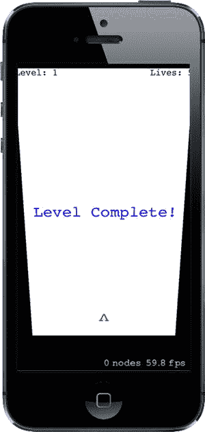

图 17-9. 此处为关卡结束时的屏幕翻转过渡截图

这里使用的过渡效果看起来像是在水平翻转一张卡片，但还有更多选择！查阅 `SKTransition` 的文档或头文件可以了解更多的可能性。本章后面我们还会使用其他几种变体。

### 自定义碰撞

现在我们拥有一个真正可玩的游戏了。你可以通过将敌人向上击飞出屏幕来一关接一关地通关。这还不错，但确实没什么挑战性！我们之前提到，敌人攻击玩家是缺失的游戏玩法之一，现在正是实现它的时候。我们将通过让敌人在被碰撞时下落来增加难度——无论是被子弹击中还是被另一个敌人碰到。同时，我们还希望被下落的敌人击中会让玩家失去一条命。你可能也注意到，子弹击中敌人后，会扭曲地绕过敌人并继续向上飞行的轨迹，这很奇怪。我们将通过在 `GameScene.m` 中实现一个碰撞处理程序来解决所有这些问题。

处理检测到的碰撞的方法是 `SKPhysicsWorld` 类的委托方法。我们的场景默认有一个物理世界，但在它告诉我们任何信息之前，需要先进行一些设置。首先，最好让编译器知道我们将要实现一个委托协议，因此在 `GameScene.m` 文件顶部附近的类扩展声明中添加这个声明：

```objc
@interface GameScene () <SKPhysicsContactDelegate>
```

我们还需要对物理世界进行一些配置（赋予它稍微不那么严酷的重力值），并告知它谁是其委托。为此，我们在 `initWithSize:levelNumber:` 方法末尾附近添加这些加粗的行：

```objc
self.physicsWorld.gravity = CGVectorMake(0, -1);
self.physicsWorld.contactDelegate = self;
```

现在我们已经将物理世界的 `contactDelegate` 设置为 `GameScene`，就可以实现相关的委托方法了。该方法的核心理念如下：

```objc
- (void)didBeginContact:(SKPhysicsContact *)contact {
    if (contact.bodyA.categoryBitMask == contact.bodyB.categoryBitMask) {
        // 两个物体属于同一类别
        SKNode *nodeA = contact.bodyA.node;
        SKNode *nodeB = contact.bodyB.node;
        // 我们如何处理这些节点？
    } else {
        SKNode *attacker = nil;
        SKNode *attackee = nil;
```


```objc
if (contact.bodyA.categoryBitMask > contact.bodyB.categoryBitMask) {
    // Body A 正在攻击 Body B
    attacker = contact.bodyA.node;
    attackee = contact.bodyB.node;
} else {
    // Body B 正在攻击 Body A
    attacker = contact.bodyB.node;
    attackee = contact.bodyA.node;
}
if ([attackee isKindOfClass:[PlayerNode class]]) {
    self.playerLives--;
}
// 如何处理攻击者和被攻击者？
```

继续添加这个方法，但如果你现在看看它，会发现它其实还没什么实际作用。事实上，这个方法唯一具体的成果就是每当一个落下的敌人击中玩家飞船时，减少玩家生命值。但敌人还没开始下落呢！

这个实现背后的思路是：查看两个碰撞物体，判断它们是否属于同一类别（如果是，则它们彼此是“友方”），还是属于不同类别。如果属于不同类别，我们必须确定谁在攻击谁。查看 `PhysicsCategories.h` 中声明的类别顺序，你会发现它们是按照“攻击性”递增的顺序指定的：`Player` 节点可以被 `Enemy` 节点攻击，而 `Enemy` 节点又可以被 `PlayerMissile` 节点攻击。这意味着我们可以使用一个简单的“大于”比较来判断在这个场景中谁是“攻击者”。

为了简单和模块化，我们并不想让场景来决定每个对象应如何对被敌人攻击或被其他物体碰撞做出反应。更好的方式是将这些细节构建到受影响的节点类本身中。但是，正如你在我们已有的方法中看到的，我们能确定的只有双方都有一个 `SKNode` 实例。与其编写一大串 `if`-`else` 语句来询问每个节点属于哪个 `SKNode` 子类，不如使用常规的多态性，让每个节点类以自己的方式处理事情。为了实现这一点，我们必须向 `SKNode` 添加方法，并提供默认的空实现，然后让我们的子类在适当的地方重写它们。这需要用到类别！这次不是 Sprite Kit 的物理类别，而是真正的 Objective-C `@category` 定义。

### 为 SKNode 添加类别

要为 `SKNode` 添加类别，请在 Xcode 的项目导航器中右键点击 `TextShooter` 文件夹，从弹出菜单中选择 **New File…**。在助手窗口的 iOS/Source 部分，选择 **Objective-C File**，然后点击 **Next**。将文件名设置为 `Extra`，将文件类型选择为 **Category**，并将类别所添加的类选择为 `SKNode`。再次点击 **Next** 创建文件。选中类别头文件 `SKNode+Extra.h`，并添加如下以粗体显示的方法声明：

```objc
#import <SpriteKit/SpriteKit.h>

@interface SKNode (Extra)

- (void)receiveAttacker:(SKNode *)attacker contact:(SKPhysicsContact *)contact;
- (void)friendlyBumpFrom:(SKNode *)node;

@end
```

切换到对应的 `.m` 文件，输入以下空定义：

```objc
#import "SKNode+Extra.h"

@implementation SKNode (Extra)

- (void)receiveAttacker:(SKNode *)attacker contact:(SKPhysicsContact *)contact {
    // 默认实现不做任何事情
}

- (void)friendlyBumpFrom:(SKNode *)node {
    // 默认实现不做任何事情
}

@end
```

现在回到 `GameScene.m`，完成它在碰撞处理中的部分。首先在文件顶部添加一个新的头文件导入：

```objc
#import "GameScene.h"
#import "PlayerNode.h"
#import "EnemyNode.h"
#import "BulletNode.h"
#import "SKNode+Extra.h"
```

接下来，回到 `didBeginContact:` 方法，添加实际执行工作的代码：

```objc
- (void)didBeginContact:(SKPhysicsContact *)contact {
    if (contact.bodyA.categoryBitMask == contact.bodyB.categoryBitMask) {
        // 两个物体属于同一类别
        SKNode *nodeA = contact.bodyA.node;
        SKNode *nodeB = contact.bodyB.node;

        // 如何处理这两个节点？
        [nodeA friendlyBumpFrom:nodeB];
        [nodeB friendlyBumpFrom:nodeA];
    } else {
        SKNode *attacker = nil;
        SKNode *attackee = nil;

        if (contact.bodyA.categoryBitMask > contact.bodyB.categoryBitMask) {
            // Body A 正在攻击 Body B
            attacker = contact.bodyA.node;
            attackee = contact.bodyB.node;
        } else {
            // Body B 正在攻击 Body A
            attacker = contact.bodyB.node;
            attackee = contact.bodyA.node;
        }
        if ([attackee isKindOfClass:[PlayerNode class]]) {
            self.playerLives--;
        }
        // 如何处理攻击者和被攻击者？
        [attackee receiveAttacker:attacker contact:contact];
        [self.playerBullets removeChildrenInArray:@[attacker]];
        [self.enemies removeChildrenInArray:@[attacker]];
    }
}
```

我们在这里只添加了几处对新方法的调用。如果碰撞是“友军误伤”，比如两个敌人相互碰撞，我们会告诉它们中的每一个，它收到了来自另一个的友好碰撞。否则，在确定谁攻击了谁之后，我们告诉被攻击者它受到了另一个物体的攻击。最后，我们从 `playerBullets` 或 `enemies` 节点中移除攻击者（无论它可能在哪个节点中）。我们告诉每个节点移除攻击者，尽管它只可能存在于其中之一，但这没问题。告诉一个节点移除它没有的子节点并不是错误——只是没有任何效果。

### 为敌人添加自定义碰撞行为

现在所有准备工作就绪，我们可以通过重写添加到 `SKNode` 的类别方法，为我们的节点实现一些特定的行为。

选择 `EnemyNode.m`。在文件顶部添加 `Geometry.h` 的导入：

```objc
#import "PhysicsCategories.h"
#import "Geometry.h"

@implementation EnemyNode
```

接下来添加以下两个方法：

```objc
- (void)friendlyBumpFrom:(SKNode *)node {
    self.physicsBody.affectedByGravity = YES;
}

- (void)receiveAttacker:(SKNode *)attacker contact:(SKPhysicsContact *)contact {
    self.physicsBody.affectedByGravity = YES;
    CGVector force = VectorMultiply(attacker.physicsBody.velocity,
                                       contact.collisionImpulse);
    CGPoint myContact = [self.scene convertPoint:contact.contactPoint
                                          toNode:self];
    [self.physicsBody applyForce:force
                         atPoint:myContact];
}
```

第一个方法 `friendlyBumpFrom:` 简单地开启受影响敌人的重力。所以，如果一个敌人在运动中撞到了另一个敌人，第二个敌人会突然受到重力影响并开始向下坠落。

`receiveAttacker:contact:` 方法在敌人被子弹击中时调用，它首先开启敌人的重力。然而，它还利用传入的碰撞数据来确定碰撞发生的位置，并对该点施加一个力，在子弹发射的方向上给敌人一个额外的推力。

### 显示准确的玩家生命值

运行游戏，你会发现你可以射击敌人，将它们击落。你还会看到任何被落下的敌人撞到的其他敌人也会随之坠落。


**注意** 在每个关卡开始时，世界物理模拟会执行一步操作，以确保物理实体之间不会发生重叠。这会在更高关卡产生一个有趣的副作用：随机放置的多个敌人占据重叠空间的可能性会越来越大。每当这种情况发生时，敌人会立即被移开以停止重叠，同时我们的碰撞处理代码会被触发，进而开启重力让它们坠落！这个行为并非我们最初设计游戏时计划好的，但它却成了一个意外的“惊喜”，让更高关卡逐渐变得更困难，因此我们决定让物理模拟自然进行下去！

如果你让敌人坠落时击中自己，玩家生命值会减少，但……等等，它一直显示为`5`！生命值显示是在关卡创建时设置的，但之后从未更新过。幸运的是，这很容易修复：在`GameScene.m`中实现`setPlayerLives:`设置方法，而不是使用自动合成的设置方法，如下所示：

```
- (void)setPlayerLives:(NSUInteger)playerLives  {
    _playerLives = playerLives;
    SKLabelNode *lives = (id)[self childNodeWithName:@"LivesLabel"];
    lives.text = [NSString stringWithFormat:@"Lives: %lu",
                  (unsigned long)_playerLives];
}
```

上述代码段使用我们之前与标签关联的名称（在`initWithSize:level:`方法中）重新找到标签并设置新文本值。再次运行游戏，你会发现，当敌人如雨点般击中你的玩家时，生命值会减少到零。但游戏并不会结束。在下次受到攻击后，你最终会得到非常多的生命值，正如你在图 17-10 中看到的那样。

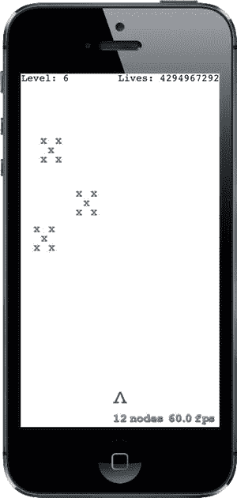

图 17-10. 这么多生命值

那么这是怎么回事呢？实际上，我们使用了一个无符号整数来存储生命值。当使用无符号整数且数值降到零以下时，它会绕过零边界，最终变成允许的最大无符号整数值！

这个问题的根源在于我们还没有编写任何检测游戏结束的代码；也就是说，当玩家生命值降到零的时刻。我们很快就会处理这个问题，但首先让我们让屏幕上的碰撞效果更刺激一些。

## 用粒子系统增添趣味

Sprite Kit 的一个优秀特性是内置了粒子系统。粒子系统在游戏中用于创建模拟烟雾、火焰、爆炸等视觉效果。目前，当我们的子弹击中敌人或敌人击中玩家时，攻击对象只是简单地闪烁消失。让我们创建几个粒子系统来改善这种情况！

首先按 **N** 调出“新建文件”助手。在左侧选择 **iOS/资源** 部分，然后在右侧选择 **SpriteKit 粒子文件**。点击 **下一步**，在接下来的屏幕上选择 **火花** 粒子模板。再次点击 **下一步**，并将此文件命名为 `MissileExplosion.sks`。

### 你的第一个粒子

你会看到 Xcode 创建了粒子文件，并向项目中添加了一个名为 `spark.png` 的新资源。同时，整个 Xcode 编辑区域会切换到新的粒子文件，显示出一个巨大的、动画爆炸效果。

我们不希望子弹击中敌人时出现如此夸张和巨大的效果，因此让我们重新配置一下。定义此粒子动画的所有属性都可以在 SKNode 检测器中找到，按 **Opt-Cmd-7** 即可调出。图 17-11 同时显示了巨大的爆炸效果和检测器。

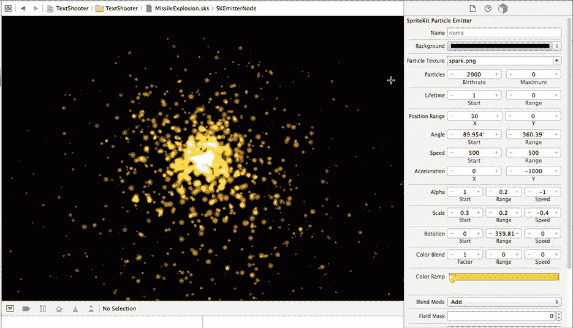

图 17-11. 爆炸城市！右侧显示的参数定义了默认粒子的外观

现在，对于子弹击中效果，让我们将其做成一个小得多的爆炸。它将有一组完全不同的参数，你可以在检测器中直接配置。首先，通过点击底部颜色渐变中的小色块并将其设置为黑色，来修复颜色以匹配我们的游戏外观。接下来，将背景色更改为白色，并将混合模式更改为 `Alpha`。现在你会看到火焰喷泉变成了墨黑色。

其余参数都是数字型的。请逐个修改它们，全部设置为图 17-12 中所示的值。每一步你都会看到粒子效果发生变化，直到最终达到目标外观。

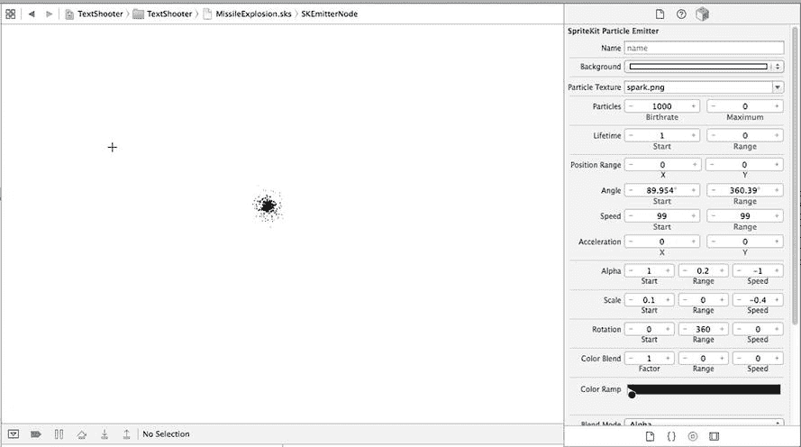

图 17-12. 这是我们想要的最终导弹爆炸粒子效果

现在创建另一个粒子系统，同样使用火花模板。将其命名为 `EnemyExplosion.sks`，并按照图 17-13 所示设置其参数。

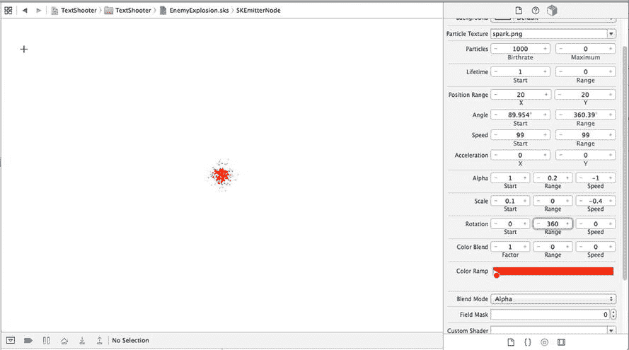

图 17-13. 这是我们想要创建的敌人爆炸效果。如果你看到的这本书是黑白的，我们在底部颜色渐变中选择的颜色是深红色

**注意** 添加第二个粒子文件后，你可能会在项目导航器中找到两个 `spark.png` 文件副本，并在活动视图中看到警告。通过右键单击其中一个文件并选择“删除”来修复此问题。

### 将粒子放入场景

现在让我们开始使用这些粒子。切换到 `EnemyNode.m`，并将以下粗体代码添加到 `receiveAttacker:contact:` 方法的末尾：

```
- (void)receiveAttacker:(SKNode *)attacker contact:(SKPhysicsContact *)contact {
    self.physicsBody.affectedByGravity = YES;
    CGVector force = VectorMultiply(attacker.physicsBody.velocity,
                                       contact.collisionImpulse);
    CGPoint myContact = [self.scene convertPoint:contact.contactPoint
                                          toNode:self];
    [self.physicsBody applyForce:force
                         atPoint:myContact];

NSString *path = [[NSBundle mainBundle] pathForResource:@"MissileExplosion"
                                                     ofType:@"sks"];
    SKEmitterNode *explosion = [NSKeyedUnarchiver unarchiveObjectWithFile:path];
    explosion.numParticlesToEmit = 20;
    explosion.position = contact.contactPoint;
    [self.scene addChild:explosion];
}
```

运行游戏，射击一些敌人，你会看到每个子弹击中敌人时都会产生一个漂亮的爆炸效果，如图 17-14 所示。

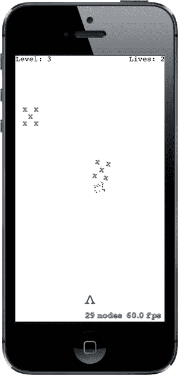

图 17-14. 子弹撞击后的完美爆炸效果

很好！现在让我们对敌人撞击玩家飞船的情况进行类似处理。选择 `PlayerNode.m` 并添加以下方法：

```
- (void)receiveAttacker:(SKNode *)attacker contact:(SKPhysicsContact *)contact {
    NSString *path = [[NSBundle mainBundle] pathForResource:@"EnemyExplosion"
                                                     ofType:@"sks"];
    SKEmitterNode *explosion =
           [NSKeyedUnarchiver unarchiveObjectWithFile:path];
    explosion.numParticlesToEmit = 50;
    explosion.position = contact.contactPoint;
    [self.scene addChild:explosion];
}
```

再次运行游戏，你会看到每次敌人撞击玩家时都会出现漂亮的红色爆炸效果，如图 17-15 所示。

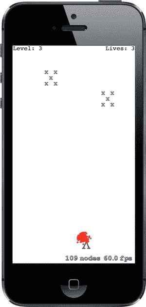

图 17-15. 好痛！


这些改动虽然非常简单，却能显著提升游戏的整体体验。现在当物体发生碰撞时，你能够看到视觉反馈，从而清楚地知道有事情发生了。

## 结束游戏

如前所述，目前游戏中存在一个小问题。当生命值归零时，我们需要结束游戏。我们的做法是创建一个新的场景类，用于在游戏结束时进行过渡。之前从某一关卡切换到下一关卡时，你已经见过我们如何进行场景过渡。这次的操作类似，但会使用一个新的类。

因此，请创建一个新的 iOS/Cocoa Touch 类。将父类设置为 `SKScene`，并将新类命名为 `GameOverScene`。

我们先实现一个非常简单的版本——它只显示“Game Over”文字，不做其他任何事情。为此，我们需要在 *GameOverScene.m* 的 `@implementation` 中添加以下代码：

```
- (instancetype)initWithSize:(CGSize)size {
    if (self = [super initWithSize:size]) {
        self.backgroundColor = [SKColor purpleColor];
        SKLabelNode *text = [SKLabelNode labelNodeWithFontNamed:@"Courier"];
        text.text = @"Game Over";
        text.fontColor = [SKColor whiteColor];
        text.fontSize = 50;
        text.position = CGPointMake(self.frame.size.width * 0.5,
                                    self.frame.size.height * 0.5);
        [self addChild:text];
    }
    return self;
}
```

现在让我们切换回 *GameScene.m*。我们需要在文件顶部导入新场景的头文件：

```
#import "GameScene.h"
#import "PlayerNode.h"
#import "EnemyNode.h"
#import "BulletNode.h"
#import "SKNode+Extra.h"
#import "GameOverScene.h"
```

游戏结束时需要执行的基本操作，由一个名为 `triggerGameOver` 的新方法定义。在这里，我们既展示一个额外的爆炸效果，又触发一个过渡到刚刚创建的新场景的动画：

```
- (void)triggerGameOver {
    self.finished = YES;

    NSString *path = [[NSBundle mainBundle] pathForResource:@"EnemyExplosion"
                                                     ofType:@"sks"];
    SKEmitterNode *explosion =
               [NSKeyedUnarchiver unarchiveObjectWithFile:path];
    explosion.numParticlesToEmit = 200;
    explosion.position = _playerNode.position;
    [self addChild:explosion];
    [_playerNode removeFromParent];

    SKTransition *transition =
               [SKTransition doorsOpenVerticalWithDuration:1.0];
    SKScene *gameOver = [[GameOverScene alloc] initWithSize:self.frame.size];
    [self.view presentScene:gameOver transition:transition];
}
```

接下来，创建这个用于检查游戏是否结束的新方法：如果游戏结束则调用 `triggerGameOver`，并返回 `YES` 表示游戏已结束；否则返回 `NO` 表示游戏仍在进行：

```
- (BOOL)checkForGameOver {
    if (self.playerLives == 0) {
        [self triggerGameOver];
        return YES;
    }
    return NO;
}
```

最后，在现有的 `update:` 方法中添加一项检查。它首先检查游戏结束状态，并且只有在游戏仍在进行时才检查是否可能进入下一关。否则，如果关卡中最后一个敌人刚好夺走玩家最后一条命，就有可能同时触发两次场景过渡！

```
- (void)update:(CFTimeInterval)currentTime {
    if (self.finished) return;

    [self updateBullets];
    [self updateEnemies];
    if (![self checkForGameOver]) {
        [self checkForNextLevel];
    }
}
```

现在再次运行游戏，让坠落的敌人对你的飞船造成五次伤害，你就会看到游戏结束画面，如图 Figure 17-16 所示。

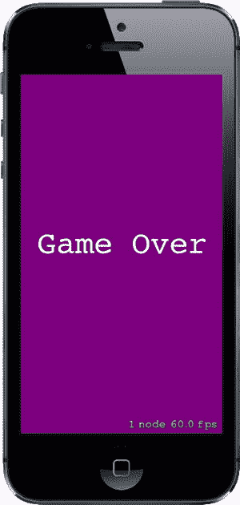

Figure 17-16。结束了，老兄。游戏结束，老兄——游戏结束了

## 最后，新开始：创建 StartScene

这就引出了另一个问题：游戏结束后我们该怎么办？我们可以让玩家通过点击来重新开始游戏；但在考虑这个问题的同时，我脑海中闪过一个念头。难道这个游戏不应该有一个开始画面吗？这样玩家在启动游戏时就不会立刻被投入到游戏中去。而且，游戏结束画面难道不应该带你回到开始画面吗？当然，这两个问题的答案都是肯定的！继续创建另一个新的 iOS/Cocoa Touch 类，依然使用 `SKScene` 作为父类，这次取名为 `StartScene`。

我们要制作一个极其简单的开始场景。它只需要显示一些文本，并在用户点击任意位置时开始游戏。将 *StartScene.m* 中所有加粗的代码添加进去，即可完成这个类：

```
#import "StartScene.h"
#import "GameScene.h"

@implementation StartScene

- (instancetype)initWithSize:(CGSize)size {
    if (self = [super initWithSize:size]) {
        self.backgroundColor = [SKColor greenColor];

        SKLabelNode *topLabel = [SKLabelNode labelNodeWithFontNamed:@"Courier"];
        topLabel.text = @"TextShooter";
        topLabel.fontColor = [SKColor blackColor];
        topLabel.fontSize = 48;
        topLabel.position = CGPointMake(self.frame.size.width * 0.5,
                                    self.frame.size.height * 0.7);
        [self addChild:topLabel];

        SKLabelNode *bottomLabel = [SKLabelNode labelNodeWithFontNamed:
                                            @"Courier"];
        bottomLabel.text = @"Touch anywhere to start";
        bottomLabel.fontColor = [SKColor blackColor];
        bottomLabel.fontSize = 20;
        bottomLabel.position = CGPointMake(self.frame.size.width * 0.5,
                                        self.frame.size.height * 0.3);
        [self addChild:bottomLabel];

    }
    return self;
}

- (void)touchesBegan:(NSSet *)touches withEvent:(UIEvent *)event {
    SKTransition *transition = [SKTransition doorwayWithDuration:1.0];
    SKScene *game = [[GameScene alloc] initWithSize:self.frame.size];
    [self.view presentScene:game transition:transition];
}

@end
```

现在回到 *GameOverScene.m*，让游戏结束场景过渡到开始场景。添加这个头文件导入：

```
#import "GameOverScene.h"
#import "StartScene.h"
```

然后添加以下代码：

```
- (void)didMoveToView:(SKView *)view {
    dispatch_after(
            dispatch_time(DISPATCH_TIME_NOW, (int64_t)(3.0 * NSEC_PER_SEC)),
            dispatch_get_main_queue(), ^{
        SKTransition *transition = [SKTransition flipVerticalWithDuration:1.0];
        SKScene *start = [[StartScene alloc] initWithSize:self.frame.size];
        [self.view presentScene:start transition:transition];
    });
}
```

如你之前所见，`didMoveToView:` 方法在场景被放置到视图上后会被调用。这里，我们简单地触发一个三秒的暂停，然后过渡回开始场景。

现在还差最后一块拼图，就能让我们的所有场景按预期相互过渡了。我们需要修改应用的启动流程，使其在启动时直接跳转到开始画面，而不是直接进入游戏。这需要回到 *GameViewController.m*，我们首先要导入开始场景的头文件：

```
#import "GameViewController.h"
#import "GameScene.h"
#import "StartScene.h"
```

然后，在 `viewDidLoad` 方法中，我们只需将创建某个场景类的代码替换为另一个：

```
// Create and configure the scene.
GameScene *scene =
     [GameScene sceneWithSize:self.view.frame.size levelNumber:1];
SKScene * scene = [StartScene sceneWithSize:skView.bounds.size];
```

现在试一试吧！启动应用，你会看到开始场景。点击屏幕，开始游戏，经历多次“死亡”，你就会进入游戏结束场景。等待几秒钟，你会回到开始画面，如图 Figure 17-17 所示。

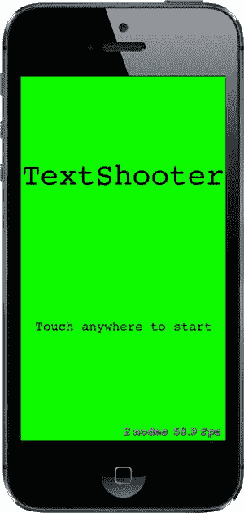


# 图 17-17：终于，我们到达了开始画面！

## 一音胜过千张图

我们一直在开发一款视频游戏，而电子游戏向来以嘈杂著称，但我们的游戏却完全静音！幸运的是，Sprite Kit 提供了极为易用的音频播放代码。在本章源代码的 *17 – Sound Effects* 文件夹中，你可以找到准备好的音频文件：*enemyHit.wav*、*gameOver.wav*、*gameStart.wav*、*playerHit.wav* 和 *shoot.wav*。将它们全部拖入 Xcode 的项目导航器中。

**注意** 这些音效是使用优秀的开源 CFXR 应用程序（可从 `https://github.com/nevyn/cfxr` 获取）创建的。如果你需要古怪的小音效，CFXR 是难以超越的选择！

现在，我们将为这些音效逐一添加简易的播放功能。首先打开 *BulletNode.m*，在 `bulletFrom:toward:` 方法的末尾、`return` 语句之前添加加粗显示的代码：

```
[bullet runAction:[SKAction playSoundFileNamed:@"shoot.wav"
                             waitForCompletion:NO]];
```

接下来，切换到 *EnemyNode.m*，在 `receiveAttacker:contact:` 方法的末尾添加以下代码：

```
[self runAction:[SKAction playSoundFileNamed:@"enemyHit.wav"
                           waitForCompletion:NO]];
```

现在在 *PlayerNode.m* 中执行极其相似的操作，在 `receiveAttacker:contact:` 方法的末尾添加这些代码：

```
[self runAction:[SKAction playSoundFileNamed:@"playerHit.wav"
                           waitForCompletion:NO]];
```

这些游戏内的音效暂时已经足够。现在运行游戏来试听一下效果。我想你会赞同，仅仅添加粒子效果和音效，游戏体验就大大提升了。

现在，让我们再为游戏开始和结束添加一些效果。在 *StartScene.m* 中，在 `touchesBegan:withEvent:` 方法的末尾添加这些代码：

```
[self runAction:[SKAction playSoundFileNamed:@"gameStart.wav"
                           waitForCompletion:NO]];
```

最后，在 *GameScene.m* 的 `triggerGameOver` 方法末尾添加这些代码：

```
[self runAction:[SKAction playSoundFileNamed:@"gameOver.wav"
                           waitForCompletion:NO]];
```

现在当你玩游戏时，各种悦耳的哔哔声和啵啵声将充斥耳畔，就像你小时候那样！或者也许是你父母小时候。甚至是你祖父母小时候！相信我，过去的游戏听起来差不多都是这样。

## 增加游戏难度：力场

iOS 8 中 Sprite Kit 新增的一个有趣功能是能够在场景中放置力场。力场具有类型、位置、生效区域以及多个指定其行为方式的属性。其原理是，当物体在力场区域内移动时，该场会扰动其运动。你可以直接使用多种标准力场，只需创建并配置一个实例，然后添加到场景中即可。如果你志向远大，甚至可以创建自定义力场。关于标准力场及其行为（包括重力场、电场、磁场和湍流）的列表，请查阅 `SKFieldNode` 类的 API 文档。

为了让游戏更具挑战性，我们将在场景中添加一些径向重力场。径向重力场的作用类似于集中在一点的大质量。当物体穿过径向重力场区域时，会被偏转向该点（或者如果按你的配置要求，也可以是偏离该点），这很像一颗距离地球足够近的流星飞过时被引力牵引。我们将安排这些重力场作用于导弹，这样你将无法总是直接瞄准敌人并确保击中。让我们开始吧。

首先，我们需要在 *PhysicsCategories.h* 中添加一个新类别。在该文件中进行以下修改，不要忘记在 `PlayerMissileCategory` 定义末尾添加逗号：

```
typedef NS_OPTIONS(uint32_t, PhysicsCategory) {
    PlayerCategory        =  1 << 1,
    EnemyCategory         =  1 << 2,
    PlayerMissileCategory =  1 << 3,
    GravityFieldCategory  =  1 << 4
};
```

如果节点物理体中的 `fieldBitMask` 与力场的 `categoryBitMask` 有任意共同类别，该力场就会对该节点起作用。默认情况下，物理体的 `fieldBitMask` 设置了所有类别。因为我们不希望敌人受重力场影响，所以需要在 *EnemyNode.m* 中通过添加以下代码来清除其 `fieldBitMask`：

```
- (void)initPhysicsBody {
    SKPhysicsBody *body = [SKPhysicsBody bodyWithRectangleOfSize:
                           CGSizeMake(40, 40)];
    body.affectedByGravity = NO;
    body.categoryBitMask = EnemyCategory;
    body.contactTestBitMask = PlayerCategory|EnemyCategory;
    body.mass = 0.2;
    body.angularDamping = 0.0f;
    body.linearDamping = 0.0f;
    body.fieldBitMask = 0;
    self.physicsBody = body;
}
```

在 *PlayerNode.m* 中进行类似的修改：

```
- (void)initPhysicsBody {
    SKPhysicsBody *body = [SKPhysicsBody bodyWithRectangleOfSize:
                           CGSizeMake(20, 20)];
    body.affectedByGravity = NO;
    body.categoryBitMask = PlayerCategory;
    body.contactTestBitMask = EnemyCategory;
    body.collisionBitMask = 0;
    body.fieldBitMask = 0;
    self.physicsBody = body;
}
```

导弹节点即使我们不施加操作也会响应重力场，因为其物理体默认设置了所有场类别，但为了更清晰，我们明确地进行设置，在 *BulletNode.m* 中做如下修改：

```
- (instancetype)init {
    if (self = [super init]) {
        SKLabelNode *dot = [SKLabelNode labelNodeWithFontNamed:@"Courier"];
        dot.fontColor = [SKColor blackColor];
        dot.fontSize = 40;
        dot.text = @".";
        [self addChild:dot];

        SKPhysicsBody *body = [SKPhysicsBody bodyWithCircleOfRadius:1];
        body.dynamic = YES;
        body.categoryBitMask = PlayerMissileCategory;
        body.contactTestBitMask = EnemyCategory;
        body.collisionBitMask = EnemyCategory;
        body.fieldBitMask = GravityFieldCategory;
        body.mass = 0.01;

        self.physicsBody = body;
        self.name = [NSString stringWithFormat:@"Bullet %p", self];
    }
    return self;
}
```

其余修改将在文件 *GameScene.m* 中进行。我们将添加三个重力场，其中心位于场景中心略下方的随机点。就像处理导弹和敌人一样，我们将力场节点添加到一个父节点，然后将该父节点添加到场景中。在 `GameScene` 的类扩展中添加父节点的定义：

```
@interface GameScene () <SKPhysicsContactDelegate>

@property (strong, nonatomic) PlayerNode *playerNode;
@property (strong, nonatomic) SKNode *enemies;
@property (strong, nonatomic) SKNode *playerBullets;
@property (strong, nonatomic) SKNode *forceFields;

@end
```

在 `initWithSize:level:` 方法的末尾，添加代码来分配 `forceFields` 节点、将其添加到场景并创建实际的力场节点：

```
_playerBullets = [SKNode node];
[self addChild:_playerBullets];

_forceFields = [SKNode node];
[self addChild:_forceFields];
[self createForceFields];

self.physicsWorld.gravity = CGVectorMake(0, -1);
self.physicsWorld.contactDelegate = self;
```

最后，添加 `createForceFields` 方法的实现：

```
- (void)createForceFields {
    static int fieldCount = 3;
    CGSize size = self.frame.size;
    float sectionWidth = size.width/fieldCount;
    for (NSUInteger i = 0; i < fieldCount; i++) {
        CGFloat x = i * sectionWidth + arc4random_uniform(sectionWidth);
        CGFloat y = arc4random_uniform(size.height * 0.25)
                       + (size.height * 0.25);
```


```objc
SKFieldNode *gravityField = [SKFieldNode radialGravityField];
gravityField.position = CGPointMake(x, y);
gravityField.categoryBitMask = GravityFieldCategory;
gravityField.strength = 4;
gravityField.falloff = 2;
gravityField.region = [[SKRegion alloc]
       initWithSize:CGSizeMake(size.width * 0.3, size.height * 0.1)];
[self.forceFields addChild:gravityField];

SKLabelNode *fieldLocationNode =
          [SKLabelNode labelNodeWithFontNamed:@"Courier"];
fieldLocationNode.fontSize = 16;
fieldLocationNode.fontColor = [SKColor redColor];
fieldLocationNode.name = @"GravityField";
fieldLocationNode.text = @"*";
fieldLocationNode.position = CGPointMake(x, y);
[self.forceFields addChild:fieldLocationNode];
```

所有力场都由 `SKFieldNode` 类的实例表示。对于每种类型的场，`SKFieldNode` 类都提供了一个工厂方法，用于创建该类型场的节点。这里，我们使用 `radialGravityFieldNode` 方法创建了三个径向重力场实例，并将它们放置在场景中心下方的一个带状区域中。`strength` 和 `falloff` 属性控制着重力场的强度，以及它随距离场节点远近而衰减的速度。`falloff` 值为 2 时，力的大小与场节点和受影响对象之间距离的平方成反比，这与现实世界中的规律一致。正值的力会使场节点吸引其他对象。你可以尝试不同的 `strength` 值，包括负值，来观察效果如何变化。我们还在与重力场相同的位置创建了三个 `SKLabelNode`，以便玩家可以看到它们的位置。这就是我们需要做的全部工作。构建并运行应用程序，观察当你的子弹飞近场景中某个红色星号时会发生什么！

## 游戏开始

尽管 TextShooter 在外观上可能很简单，但你在本章中学到的技术构成了使用 Sprite Kit 进行各种游戏开发的基础。你学会了如何在多个节点类之间组织代码，如何利用节点图将对象分组，以及更多技巧。你也初步体验了逐步添加功能来构建此类游戏的过程，并在这一过程中不断发现新知。当然，我们并没有展示我们在开发过程中犯下的所有错误——即便如此，这本书已经超过 700 页了——但即使算上这些错误，这款应用也完全是按照本章展示的大致顺序，在短短几个小时内从零开始构建的。

一旦上手，Sprite Kit 能让你在短时间内构建出大量的结构。正如你所见，如果没有现成的图片，你可以使用基于文本的精灵。如果之后想将它们替换为真正的图形，那也完全没问题。一位早期读者甚至指出了一条中间路线：“与其在源代码的字符串中使用普通的 ASCII 文本，你还可以通过 Apple 的字符查看器输入源插入表情符号字符。”实现这一点就留给读者作为练习了！

## 第 18 章：点击、触摸与手势

iPhone、iPod touch 和 iPad 的屏幕——清晰、明亮、触控灵敏——堪称艺术品和工程学的杰作。所有 iOS 设备共有的多点触控屏幕是该平台拥有极强易用性的关键因素之一。由于屏幕能够同时检测多个触摸点并独立追踪它们，应用程序可以检测到各种各样的手势，为用户提供超越传统界面的操作能力。

假设你在“邮件”应用中，正盯着一个需要删除的长长的垃圾邮件列表。你可以逐个点击每封邮件，点击垃圾箱图标将其删除，然后等待下一封邮件下载，依次删除每一封。如果你希望在删除前阅读每封邮件，这种方法是最好的。

或者，在邮件列表中，你可以点击右上角的 `编辑` 按钮，点击每一行邮件进行标记，然后点击 `垃圾箱` 按钮删除所有已标记的邮件。如果你不需要在删除前阅读每封邮件，这种方法是最好的。另一种方法是，在列表中从右向左滑动一封邮件。这个手势会为该邮件显示一个 `更多` 按钮和一个 `垃圾箱` 按钮。点击 `垃圾箱` 按钮，邮件即被删除。

这个例子只是多点触控显示屏所带来的无数手势中的一种。观看图片时，你可以双指捏合来缩小，或双指张开来放大。在主屏幕上，你可以长按一个图标来开启“晃动模式”，从而可以从 iOS 设备上删除应用程序。

在本章中，我们将探讨用于检测手势的底层架构。你将学习如何检测最常见的手势，以及如何创建和检测一个全新的手势。

### 多点触控术语

在深入探讨架构之前，我们先了解一些基本词汇。首先，**手势** 是指从你用一个或多个手指触摸屏幕开始，直到你将手指从屏幕上抬起为止所发生的任何事件序列。无论需要多长时间，只要有一个或多个手指保持在屏幕上，你就仍处在一个手势之中（除非被系统事件，如来电，打断）。请注意，Cocoa Touch 并没有暴露任何代表手势的类或结构体。从某种意义上说，手势是一个动词，正在运行的应用程序可以观察用户输入流，以判断是否有手势发生。

手势通过一系列 **事件** 在系统中传递。当你与设备的多点触控屏幕交互时，便会生成事件。这些事件包含了关于所发生的触摸行为的信息。

术语 **触摸** 指的是手指在屏幕上放下、在屏幕上拖动或从屏幕上抬起。一个手势中涉及的触摸数量等于同时放在屏幕上的手指数量。你实际上可以五个手指都放在屏幕上，只要它们彼此之间不太靠近，iOS 就能识别并追踪所有手指。现在，并没有太多有用的五指手势，但知道 iOS 在必要时可以处理这么多手指也挺好的。事实上，实验表明 iPad 最多可以处理 11 个同时触摸！这看起来可能有些过剩，但如果你正在开发一款多人游戏，多个玩家同时与屏幕交互，这就很有用了。

**点击** 发生在你用一根手指触摸屏幕，然后立即将手指抬起而不移动时。iOS 设备会记录点击次数，并能告诉你用户是双击、三击，甚至是 20 击。例如，它会处理所有必要的时序和其他工作，以区分两次单击和一次双击。

**手势识别器** 是一个对象，它知道如何观察用户生成的事件流，并在用户以匹配预定义手势的方式进行触摸和拖动时进行识别。`UIGestureRecognizer` 类及其各种子类可以帮助你在想要观察常见手势时省去大量工作。这个类很好地封装了查找手势的工作，并且可以轻松地应用于应用程序中的任何视图。

在本章的第一部分，你将看到当用户用一个或多个手指触摸屏幕时报告的事件，以及如何追踪手指在屏幕上的移动。你可以在自定义视图或应用程序委托中使用这些事件来处理手势。接下来，我们将介绍 iOS SDK 附带的一些手势识别器，最后，你将看到如何构建自己的手势识别器。

### 响应者链
```


由于手势通过系统事件传递，而事件通过响应者链传递，因此你需要了解响应者链的工作原理才能正确处理手势。如果你使用过 macOS 的 Cocoa 框架，可能对响应者链的概念已经熟悉，因为 Cocoa 和 Cocoa Touch 使用了相同的基本机制。如果这是一个全新的概念，不用担心，我们将解释它的工作原理。

## 响应事件

本书中多次提到**第一响应者**，它通常是用户当前正在交互的对象。第一响应者是响应者链的起点，但并非孤立的。链中始终存在其他响应者。在一个运行的应用程序中，响应者链是一组能够响应事件的动态对象集合。任何以 `UIResponder` 作为父类的类都是响应者。`UIView` 是 `UIResponder` 的子类，而 `UIControl` 是 `UIView` 的子类，因此所有视图和控件都是响应者。`UIViewController` 也是 `UIResponder` 的子类，这意味着它以及它的所有子类（如 `UINavigationController` 和 `UITabBarController`）都是响应者。响应者之所以得名，是因为它们能够响应系统生成的事件，例如屏幕触摸。

如果某个响应者不处理特定事件（如手势），它通常会将该事件沿响应者链向上传递。如果链中的下一个对象响应了该特定事件，它通常会消耗该事件，从而终止事件在响应者链中的传递。在某些情况下，如果响应者仅部分处理了事件，该响应者会执行某些操作并将事件转发给链中的下一个响应者。不过，这并非通常情况。通常情况下，当一个对象响应事件后，该事件的传递就到此为止。如果事件遍历整个响应者链后仍没有对象处理它，则该事件会被丢弃。

现在让我们更具体地了解响应者链。事件首先被传递给 `UIApplication` 对象，然后由它传递给应用程序的 `UIWindow`。`UIWindow` 通过选择初始响应者来处理事件。初始响应者的选择规则如下：

-   对于触摸事件，`UIWindow` 对象会确定用户触摸的视图，然后将事件提供给该视图或视图层级中更高视图上注册的任何手势识别器。如果某个手势识别器处理了该事件，则事件不会继续传递。否则，初始响应者就是被触摸的视图，事件将被传递给它。
-   对于用户摇晃设备（我们将在第 20 章中进一步讨论）或遥控设备生成的事件，事件会被传递给第一响应者。

如果初始响应者没有处理事件，它会将事件传递给其父视图（如果有），或者传递给视图控制器（如果该视图是视图控制器的视图）。如果视图控制器没有处理事件，事件会继续沿响应者链向上传递，通过其父视图控制器的视图层级（如果有的话）。

如果事件在视图层级中一直向上传递，但未被任何视图或控制器处理，则事件会被传递给应用程序的窗口。如果窗口没有处理事件，`UIApplication` 对象会将其传递给应用程序委托（前提是该委托是 `UIResponder` 的子类，如果你使用 Apple 的应用程序模板创建项目，通常如此）。最后，如果应用委托不是 `UIResponder` 的子类或没有处理事件，那么该事件就会悄然消失。

这一过程因多种原因而重要。首先，它控制了手势的处理方式。假设用户正在查看一个表格，并在表格的某一行上滑动手指。哪个对象会处理这个手势？

如果滑动发生在表格视图单元格的子视图或控件内，那么该视图或控件将有机会响应。如果它没有响应，表格视图单元格将获得机会。在类似 Mail 的应用程序中，滑动可用于删除消息，因此表格视图单元格可能需要检查该事件，以判断是否包含滑动手势。然而，大多数表格视图单元格并不响应手势。如果它们不响应，事件会向上传递到表格视图，然后继续沿响应者链向上传递，直到有对象响应它或到达终点。

## 转发事件：保持响应者链活跃

让我们回到 Mail 应用程序中的表格视图单元格。我们不知道 Apple Mail 应用程序的内部细节；但假设该表格视图单元格只处理删除滑动操作。那么该表格视图单元格必须实现与接收触摸事件相关的方法（稍后讨论），以便检查该事件是否能被解释为滑动手势的一部分。如果事件匹配表格视图正在寻找的滑动操作，表格视图单元格就会执行操作，事件到此为止，不再继续传递。

如果事件与表格视图单元格的滑动手势不匹配，表格视图单元格有责任手动将该事件转发给响应者链中的下一个对象。如果它没有完成转发工作，表格及其链上的其他对象将永远没有机会响应，并且应用程序可能无法按用户期望的方式运行。该表格视图单元格可能会阻止其他视图识别手势。

每当响应触摸事件时，你都需要记住，你的代码并非在真空中工作。如果某个对象拦截了它不处理的事件，它需要手动传递该事件。实现方法之一是在下一个响应者上调用相同的方法。以下是一段虚构代码：

```
- (void)respondToFictionalEvent:(UIEvent *)event {
    if ([self shouldHandleEvent:event]) {
        [self handleEvent:event];
    } else {
        [[self nextResponder] respondToFictionalEvent:event];
    }
}
```

注意，我们在下一个响应者上调用了相同的方法。这就是成为良好响应者链成员的做法。幸运的是，大多数情况下，响应事件的方法也会消耗该事件。然而，重要的是要知道，如果情况并非如此，你需要确保将事件传递给响应者链中的下一个环节。

## 多点触控架构

现在你对响应者链有了一定了解，让我们来看看处理手势的过程。正如我们指出的，手势被嵌入事件中，沿响应者链传递。这意味着处理多点触控屏幕任何交互的代码都需要包含在响应者链中的某个对象内。通常，这意味着我们可以选择将代码嵌入 `UIView` 的子类中，或者嵌入 `UIViewController` 中。

那么，这段代码应该放在视图中还是视图控制器中呢？

如果视图需要根据用户的触摸对自己执行某些操作，代码通常应放在定义该视图的类中。例如，许多控件类（如 `UISwitch` 和 `UISlider`）都会响应与触摸相关的事件。`UISwitch` 可能需要根据触摸来打开或关闭自身。创建 `UISwitch` 类的开发人员将手势处理代码嵌入到该类中，以便 `UISwitch` 能够响应触摸。


通常，当一个手势所处理的影响范围超出被触摸的对象本身时，手势代码应属于相关的视图控制器类。例如，如果用户在一个行上做出手势，指示应删除所有行，则该手势应由视图控制器中的代码处理。无论代码属于哪个类，你在两种情况下对触摸和手势的响应方式都是完全相同的。

### 四个触摸通知方法

有四个方法用于通知响应者关于触摸的信息。当用户首次触摸屏幕时，系统会查找一个实现了 `touchesBegan:withEvent:` 方法的响应者。要了解用户何时开始一个手势或轻点屏幕，请在你的视图或视图控制器中实现此方法。以下是该方法可能的样子示例：

```
- (void)touchesBegan:(NSSet *)touches withEvent:(UIEvent *)event  {
    NSUInteger numTaps = [[touches anyObject] tapCount];
    NSUInteger numTouches = [event.allTouches count];

// Do something here.
}
```

此方法（以及每个与触摸相关的方法）接收一个名为 `touches` 的 `NSSet` 实例，以及一个 `UIEvent` 实例，该实例有一个名为 `allTouches` 的属性，它是另一个触摸集合。以下是这两个触摸集合所包含内容的简单描述：

-   `allTouches` 属性包含每个当前按在屏幕上的手指的 `UITouch` 对象，无论该手指当前是否在移动。
-   作为 `touches` 参数传递的 `NSSet` 包含每个刚刚被添加或从屏幕移除，或刚刚移动或停止移动的手指的 `UITouch` 对象。换句话说，它告诉你从上次调用你的触摸通知方法到现在之间发生了什么变化。

每次手指首次触摸屏幕时，会分配一个新的 `UITouch` 对象来表示该手指，并将其添加到传递给每个 `UIEvent` 的 `allTouches` 属性的集合中。所有未来报告该手指活动的 `UIEvent` 都将在 `allTouches` 集合和 `touches` 参数中包含相同的 `UITouch` 实例（尽管在 `touches` 参数中，如果该手指没有任何活动需要报告，它将不会出现），直到该手指从屏幕上移除。因此，要跟踪任意特定手指的活动，你需要监控其 `UITouch` 对象。

你可以通过获取 `allTouches` 中对象的计数来确定当前按在屏幕上的手指数量。如果 `UIEvent` 报告了一次触摸，该触摸是某个手指一系列轻点的一部分，你可以从该手指的 `UITouch` 对象的 `tapCount` 属性获取轻点次数。如果只有一根手指触摸屏幕，或者你不关心询问哪根手指，你可以使用 `NSSet` 的 `anyObject` 方法快速获取一个 `UITouch` 对象进行查询。在前面的示例中，`numTaps` 值为 `2` 告诉你屏幕被至少一根手指快速连续轻点了两次。类似地，`numTouches` 值为 `2` 告诉你用户有两根手指在触摸屏幕。

并非 `touches` 或 `allTouches` 中的所有对象都与实现此方法的视图或视图控制器相关。例如，一个表格视图单元格可能不关心位于其他行或导航栏中的触摸。你可以从 `UIEvent` 中获取落在特定视图内的触摸：

```
NSSet *myTouches = [event touchesForView:self.view];
```

每个 `UITouch` 代表一根不同的手指，每根手指在屏幕上的位置都不同。你可以使用 `UITouch` 对象找出特定手指的位置。如果你要求它，它甚至可以将该点转换为视图的本地坐标系：

```
CGPoint point = [touch locationInView:self.view];
```

你可以通过实现 `touchesMoved:withEvent:` 在用户移动手指时收到通知。此方法在长拖动过程中会被多次调用，每次调用时，你都会收到另一组触摸和另一个 `UIEvent`。除了能够从 `UITouch` 对象中找到每根手指的当前位置外，你还可以发现该触摸的先前位置，即上次调用 `touchesMoved:withEvent:` 或 `touchesBegan:withEvent:` 时手指的位置。

当用户的任何手指从屏幕上移除时，会调用另一个方法 `touchesEnded:withEvent:`。当此方法被调用时，你就知道用户完成了一个手势。

还有一个与触摸相关的最终方法，响应者可以实现它。它被称为 `touchesCancelled:withEvent:`，当用户在做一个手势的过程中被某些事件中断时（如电话响铃），就会调用此方法。这是你可以进行必要清理的地方，以便可以重新开始一个新的手势。当此方法被调用时，当前手势的 `touchesEnded:withEvent:` 将不会被调用。

好了，理论够多了——让我们看看实际应用。

### TouchExplorer 应用程序

我们将构建一个小应用程序，它能让您更好地了解四个触摸相关的响应者方法何时被调用。在 Xcode 中，使用 `Single View Application` 模板创建一个新项目。将产品名称输入为 **TouchExplorer**，并从 `Devices` 弹出菜单中选择 **Universal**。

`TouchExplorer` 将在每次调用与触摸相关的方法时，向屏幕打印消息，指示触摸和轻点次数（参见 图 18-1）。

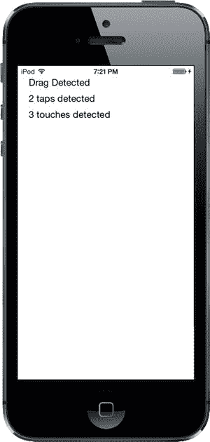

图 18-1. TouchExplorer 应用程序

**注意** 尽管本章中的应用程序可以在模拟器上运行，但除非你在真实的 iOS 设备上运行它们，否则你将无法看到所有可用的多点触控功能。如果你已付费加入 Apple 的 iOS 开发者计划，就可以在你选择的设备上运行你编写的程序。Apple 网站很好地引导你完成连接 Xcode 到设备所需的一切准备过程。

我们需要三个标签：一个用于指示最后调用了哪个方法，另一个用于报告当前的轻点次数，第三个用于报告触摸次数。单击 `ViewController.m`，并在文件顶部的类扩展中添加三个输出口：

```
#import "ViewController.h"

@interface ViewController ()

@property (weak, nonatomic) IBOutlet UILabel *messageLabel;
@property (weak, nonatomic) IBOutlet UILabel *tapsLabel;
@property (weak, nonatomic) IBOutlet UILabel *touchesLabel;

@end
```

现在选择 `Main.storyboard` 来编辑 GUI。你会看到所有此类新项目中常见的空视图。将一个标签拖到视图上，使用蓝色辅助线将标签放置在视图的左上角。按住 **Option** 键，从原始标签再拖出两个标签，将它们一个接一个地垂直排列。这样就得到了三个标签（参见 图 18-1）。如果你感觉有点像毕加索，可以随意调整字体和颜色。

现在我们需要为标签设置自动布局约束。在文档大纲中，按住 Control 键从第一个标签拖拽到主视图并释放鼠标。按住 **Shift** 键，选择 **Top Space to Top Layout Guide** 和 **Leading Space to Container Margin**，然后在弹出窗口外点击鼠标。对其余三个标签执行相同操作。


下一步是将标签连接到它们的插座。从`View Controller`图标按住 Control 键拖拽到三个标签上，将最上面的标签连接到`messageLabel`插座，中间的标签连接到`tapsLabel`插座，最后一个标签连接到`touchesLabel`插座。

最后，双击每个标签并按`Delete`键删除其文本。

接下来，单击你正在处理的视图背景或文档大纲中的`View`图标，然后调出属性检查器（参见图 18-2）。在检查器中，转到视图部分，确保`User Interaction Enabled`和`Multiple Touch`都已勾选。如果`Multiple Touch`未勾选，那么无论实际有多少根手指触摸手机屏幕，你的控制器类的触摸方法将始终只接收一次触摸。

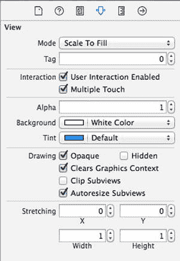

图 18-2。在视图属性中，确保同时勾选了用户交互已启用和多点触摸

完成后，切换回`ViewController.m`，并在类的`@implementation`部分添加以下代码：

```
@implementation ViewController

- (void)viewDidLoad
{
    [super viewDidLoad];
    // 加载视图后执行任何额外的设置，通常来自 nib 文件。
}

- (void)didReceiveMemoryWarning
{
    [super didReceiveMemoryWarning];
    // 处置任何可以重新创建的资源。
}

- (void)updateLabelsFromTouches:(NSSet *)touches {
    NSUInteger numTaps = [[touches anyObject] tapCount];
    NSString *tapsMessage = [[NSString alloc]
                             initWithFormat:@"检测到 %ld 次点击", (unsigned long)numTaps];
    self.tapsLabel.text = tapsMessage;

NSUInteger numTouches = [touches count];
    NSString *touchMsg = [[NSString alloc] initWithFormat:
                          @"检测到 %ld 次触摸", (unsigned long)numTouches];
    self.touchesLabel.text = touchMsg;
}

#pragma mark - 触摸事件方法
- (void)touchesBegan:(NSSet *)touches withEvent:(UIEvent *)event {
    self.messageLabel.text = @"触摸开始";
    [self updateLabelsFromTouches:event.allTouches];
}

- (void)touchesCancelled:(NSSet *)touches withEvent:(UIEvent *)event {
    self.messageLabel.text = @"触摸已取消";
    [self updateLabelsFromTouches: event.allTouches];
}

- (void)touchesEnded:(NSSet *)touches withEvent:(UIEvent *)event {
    self.messageLabel.text = @"触摸结束。";
    [self updateLabelsFromTouches: event.allTouches];
}

- (void)touchesMoved:(NSSet *)touches withEvent:(UIEvent *)event {
    self.messageLabel.text = @"检测到拖动";
    [self updateLabelsFromTouches: event.allTouches];
}

@end
```

在这个控制器类中，我们实现了之前讨论过的所有四个与触摸相关的方法。每个方法都设置`messageLabel`，以便用户可以看到每个方法被调用时的状态。接着，这四个方法都调用`updateLabelsFromTouches:`来更新另外两个标签。`updateLabelsFromTouches:`方法从其中一个触摸中获取点击次数，通过检查接收到的触摸集合的计数属性来确定触摸屏幕的手指数量，并用这些信息更新标签。

编译并运行应用程序。如果你在模拟器中运行，尝试反复点击屏幕来增加点击次数。你还应该尝试在视图中按住鼠标按钮并拖动，以模拟触摸并拖动操作。

在 iOS 模拟器中，你可以通过按住`Option`键同时用鼠标点击并拖拽来模拟双指捏合操作。你还可以模拟双指滑动：先按住`Option`键模拟捏合，移动鼠标使代表虚拟手指的两个点彼此相邻，然后按住`Shift`键（同时仍按住`Option`键）。按下`Shift`键会锁定两根手指的相对位置，使你能够进行滑动和其他双指手势。你无法进行需要三根或更多手指的手势，但通过`Option`和`Shift`键的组合，你可以在模拟器上完成大多数双指手势。

如果你能在设备上运行此程序，看看同一时间能注册多少次触摸。尝试用一根手指拖动，然后是两根手指，接着是三根。尝试双击和三击屏幕，看看能否通过用两根手指点击来增加点击次数。

动手实验 TouchExplorer 应用程序，直到你熟悉当前发生的事情以及四个触摸方法的工作方式为止。准备好后，继续学习如何检测最常见的手势之一：轻扫。

## 轻扫应用程序

我们即将构建的应用程序仅用于检测水平方向和垂直方向的轻扫。如果你用手指从左到右、从右到左、从上到下或从下到上划过屏幕，应用程序将在屏幕顶部显示一条信息，持续几秒钟，告知你检测到了轻扫（参见图 18-3）。

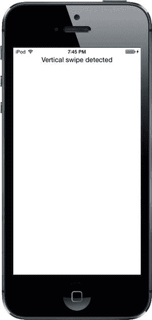

图 18-3。轻扫应用程序将检测垂直和水平方向的轻扫

### 使用触摸事件检测轻扫

检测轻扫相对简单。我们将定义一个最小手势长度（以像素为单位），即用户需要滑动多远才能算作一次轻扫。我们还会定义一个容差范围，即用户在偏离直线多远的情况下仍然可以被视为水平或垂直轻扫。对角线通常不算作轻扫，但稍微偏离水平或垂直方向的轻扫则算。

当用户触摸屏幕时，我们会将第一次触摸的位置保存在一个变量中。然后，当用户的手指在屏幕上移动时，我们会检查它是否达到了一个足够远且足够直的点，从而算作一次轻扫。实际上，有一个内置的手势识别器正是做这件事的，但我们将利用学到的触摸事件知识来自行创建一个。让我们开始构建。

在 Xcode 中使用单视图应用程序模板创建一个新项目，将设备设置为*通用*，并将项目命名为*Swipes*。

单击`ViewController.m`，并在靠近顶部的类扩展中添加以下代码：

```
#import "ViewController.h"

@interface ViewController ()

@property (weak, nonatomic) IBOutlet UILabel *label;
@property (nonatomic) CGPoint gestureStartPoint;

@end
```

这段代码声明了一个用于我们唯一标签的插座，以及一个用于保存用户首次触摸位置的变量。


选择`Main.storyboard`以打开它进行编辑。确保视图控制器的视图已设置为“User Interaction Enabled”和“Multiple Touch”在属性检查器中都被勾选，然后从库中拖出一个标签并放置到视图窗口的上半部分。将文本对齐设置为居中，并随意调整其他文本属性使标签更易读。在文档大纲中，按住 Control 键从标签拖拽到视图，释放鼠标，按住 Shift 键并选择“Top Space to Top Layout Guide”和“Center Horizontally in Container”，然后用鼠标点击弹出窗口外部。按住 Control 键从“View Controller”图标拖拽到标签，并将其连接到`label`插座变量。最后，双击标签并删除其文本。

然后切换到`ViewController.m`并添加这里以粗体显示的代码：

```
static CGFloat const kMinimumGestureLength = 25;
static CGFloat const kMaximumVariance      =  5;

@implementation ViewController

- (void)viewDidLoad
{
    [super viewDidLoad];
    // Do any additional setup after loading the view, typically from a nib.
}

- (void)didReceiveMemoryWarning
{
    [super didReceiveMemoryWarning];
    // Dispose of any resources that can be recreated.
}

#pragma mark - Touch Handling

- (void)touchesBegan:(NSSet *)touches withEvent:(UIEvent *)event {
    UITouch *touch = [touches anyObject];
    self.gestureStartPoint = [touch locationInView:self.view];
}

- (void)touchesMoved:(NSSet *)touches withEvent:(UIEvent *)event {
    UITouch *touch = [touches anyObject];
    CGPoint currentPosition = [touch locationInView:self.view];

CGFloat deltaX = fabsf(self.gestureStartPoint.x - currentPosition.x);
    CGFloat deltaY = fabsf(self.gestureStartPoint.y - currentPosition.y);

if (deltaX >= kMinimumGestureLength && deltaY <= kMaximumVariance) {
        self.label.text = @"Horizontal swipe detected";
        dispatch_after(dispatch_time(DISPATCH_TIME_NOW, 2 * NSEC_PER_SEC),
                       dispatch_get_main_queue(),
                       ^{ self.label.text = @""; });
    } else if (deltaY >= kMinimumGestureLength &&
               deltaX <= kMaximumVariance){
        self.label.text = @"Vertical swipe detected";
        dispatch_after(dispatch_time(DISPATCH_TIME_NOW, 2 * NSEC_PER_SEC),
                       dispatch_get_main_queue(),
                       ^{ self.label.text = @""; });
    }
}
@end
```

让我们从`touchesBegan:withEvent:`方法开始。我们在这里所做的只是从`touches`集合中获取任意触摸并存储其触摸点。我们现在主要关注单指滑动，因此不必担心触摸数量；只需获取其中一个：

```
UITouch *touch = [touches anyObject];
self.gestureStartPoint = [touch locationInView:self.view];
```

我们使用`touches`参数中的`UITouch`对象而不是`UIEvent`中的对象，因为我们感兴趣的是跟踪变化发生的过程，而不是所有活动触摸的整体状态。

在下一个方法`touchesMoved:withEvent:`中，我们进行实际工作。首先，获取用户手指的当前位置：

```
UITouch *touch = [touches anyObject];
CGPoint currentPosition = [touch locationInView:self.view];
```

之后，我们计算用户手指从起始位置在水平和垂直方向上移动了多远。`fabsf()`是标准 C 数学库中的一个函数，用于返回`float`的绝对值。这使我们能够将一个值减去另一个值，而无需担心哪个值更大：

```
CGFloat deltaX = fabsf(self.gestureStartPoint.x - currentPosition.x);
CGFloat deltaY = fabsf(self.gestureStartPoint.y - currentPosition.y);
```

一旦我们得到两个差值，我们检查用户是否在一个方向上移动得足够远，同时在另一个方向上没有移动得太远，从而构成一个滑动。如果条件为真，我们设置标签的文本以指示检测到水平滑动还是垂直滑动。我们还使用 GCD 的`dispatch_async()`函数在文本显示 2 秒后将其擦除。这样，用户可以练习多次滑动，而无需担心标签指的是之前的尝试还是最近的一次：

```
if (deltaX >= kMinimumGestureLength && deltaY <= kMaximumVariance) {
    self.label.text = @"Horizontal swipe detected";
    dispatch_after(dispatch_time(DISPATCH_TIME_NOW, 2 * NSEC_PER_SEC),
                   dispatch_get_main_queue(),
                   ^{ self.label.text = @""; });
} else if (deltaY >= kMinimumGestureLength &&
           deltaX <= kMaximumVariance){
    self.label.text = @"Vertical swipe detected";
    dispatch_after(dispatch_time(DISPATCH_TIME_NOW, 2 * NSEC_PER_SEC),
                   dispatch_get_main_queue(),
                   ^{ self.label.text = @""; });
}
```

继续编译并运行应用程序。如果你发现点击并拖动后没有明显结果，请耐心等待。垂直或水平地点击并拖动，直到你掌握滑动的技巧。

## 自动手势识别

我们刚刚用于检测滑动的方法还不错。所有复杂性都在`touchesMoved:withEvent:`方法中，而且即使那样也不是很复杂。但有一种更简单的方法来实现这一点。iOS 包含一个名为`UIGestureRecognizer`的类，它消除了观察所有事件以了解手指如何移动的需要。你不直接使用`UIGestureRecognizer`，而是创建其一个子类的实例，每个子类被设计用于查找特定类型的手势，例如滑动、捏合、双击、三击等等。

让我们看看如何修改 Swipes 应用以使用手势识别器，而不是我们手动实现的方法。和往常一样，你可能希望复制你的 Swipes 项目文件夹并从那里开始。

首先选择`ViewController.m`并删除`touchesBegan:withEvent:`和`touchesMoved:withEvent:`两个方法。没错，你将不再需要它们。接下来，添加几个新方法代替它们的位置：

```
- (void)reportHorizontalSwipe:(UIGestureRecognizer *)recognizer {
    self.label.text = @"Horizontal swipe detected";
    dispatch_after(dispatch_time(DISPATCH_TIME_NOW, 2 * NSEC_PER_SEC),
                            dispatch_get_main_queue(),
                           ^{ self.label.text = @""; });
}

- (void)reportVerticalSwipe:(UIGestureRecognizer *)recognizer {
    self.label.text = @"Vertical swipe detected";
    dispatch_after(dispatch_time(DISPATCH_TIME_NOW, 2 * NSEC_PER_SEC),
                            dispatch_get_main_queue(),
                            ^{ self.label.text = @""; });
}
```

这些方法实现了滑动手势所提供的实际“功能”（如果可以这样称呼的话），就像之前的`touchesMoved:withEvent:`所做的那样。现在将下面显示的新代码添加到`viewDidLoad`方法中：

```
- (void)viewDidLoad
{
    [super viewDidLoad];
    // Do any additional setup after loading the view, typically from a nib.
    UISwipeGestureRecognizer *vertical = [[UISwipeGestureRecognizer alloc]
                         initWithTarget:self action:@selector(reportVerticalSwipe:)];
    vertical.direction = UISwipeGestureRecognizerDirectionUp |
                         UISwipeGestureRecognizerDirectionDown;
    [self.view addGestureRecognizer:vertical];

UISwipeGestureRecognizer *horizontal = [[UISwipeGestureRecognizer alloc]
                           initWithTarget:self action:@selector(reportHorizontalSwipe:)];
    horizontal.direction = UISwipeGestureRecognizerDirectionLeft |
                           UISwipeGestureRecognizerDirectionRight;
    [self.view addGestureRecognizer:horizontal];
}
```


我们在这里所做的只是创建两个手势识别器——一个用于检测垂直移动，另一个用于检测水平移动。当其中一个识别出配置的手势时，它会调用`reportVerticalSwipe:`或`reportHorizontalSwipe:`方法，然后我们将相应地设置标签文本。大功告成！为了进一步清理代码，你还可以从`ViewController.m`中删除`gestureStartPoint`属性的声明以及两个常量值。现在，构建并运行应用程序，试试新的手势识别器吧！

从总代码行数来看，对于这样一个简单的例子，这两种方法之间没有太大区别。但使用手势识别器的代码显然更易于理解和编写。你完全不需要花费心思去计算手指随时间的移动，因为`UISwipeGestureRecognizer`已经为你做好了。更棒的是，Apple 的手势识别系统是可扩展的，这意味着如果你的应用程序需要 Apple 识别器未涵盖的非常复杂的手势，你可以创建自己的识别器，并将复杂代码（类似于我们之前看到的那些代码）隐藏在手势识别器类中，而不是污染你的视图控制器代码。我们将在本章后面构建一个这样的示例。同时，运行该应用程序，你会发现它的行为与之前的版本完全相同。

## 实现多种滑动手势

在“滑动手势”应用程序中，我们只关心单指滑动，因此我们只是从`touches`集合中取出任意对象来确定用户手指在滑动过程中的位置。如果你只对单指滑动（最常用的滑动类型）感兴趣，这种方法是可以的。

但是，如果你想处理双指或三指滑动呢？在本书的最早版本中，我们用了大约 50 行代码和大量的解释，通过跨多个触摸事件跟踪多个`UITouch`实例来实现这一点。现在，有了手势识别器，这个问题已经解决了。`UISwipeGestureRecognizer`可以配置为识别任意数量的同时触摸。默认情况下，每个实例期望单指触摸，但你可以将其配置为检测同时触摸屏幕的任意数量手指。每个实例只响应你指定的确切触摸次数，因此我们要做的是在循环中创建一大堆手势识别器。

复制一份`Swipes`项目文件夹。

编辑`ViewController.m`并修改`viewDidLoad`方法，将其替换为这里显示的方法：

```
- (void)viewDidLoad
{
    [super viewDidLoad];
    // Do any additional setup after loading the
    // view, typically from a nib.
    for (NSUInteger touchCount = 1; touchCount <= 5; touchCount++) {
        UISwipeGestureRecognizer *vertical;
        vertical = [[UISwipeGestureRecognizer alloc]
                    initWithTarget:self action:@selector(reportVerticalSwipe:)];
        vertical.direction = UISwipeGestureRecognizerDirectionUp |
                             UISwipeGestureRecognizerDirectionDown;
        vertical.numberOfTouchesRequired = touchCount;
        [self.view addGestureRecognizer:vertical];

UISwipeGestureRecognizer *horizontal;
        horizontal = [[UISwipeGestureRecognizer alloc]
                     initWithTarget:self action:@selector(reportHorizontalSwipe:)];
        horizontal.direction = UISwipeGestureRecognizerDirectionLeft |
                               UISwipeGestureRecognizerDirectionRight;
        horizontal.numberOfTouchesRequired = touchCount;
        [self.view addGestureRecognizer:horizontal];
    }
}
```

请注意，在实际应用程序中，你可能希望不同数量的手指在屏幕上滑动触发不同的行为。使用手势识别器可以轻松实现这一点，只需让每个识别器调用不同的操作方法即可。

现在我们需要做的只是通过添加一个方法来更改日志记录，该方法为我们提供触摸次数的便捷描述，然后在报告方法中使用它，如下所示。将此方法添加到`ViewController`类的底部，位于两个滑动报告方法之上：

```
- (NSString *)descriptionForTouchCount:(NSUInteger)touchCount {
    switch (touchCount) {
        case 1:
            return @"Single";
        case 2:
            return @"Double";
        case 3:
            return @"Triple";
        case 4:
            return @"Quadruple";
        case 5:
            return @"Quintuple";
        default:
            return @"";
    }
}
```

接下来，修改两个滑动报告方法，如下所示：

```
- (void)reportHorizontalSwipe:(UIGestureRecognizer *)recognizer {
    self.label.text = @"Horizontal swipe detected";
    self.label.text = [NSString stringWithFormat:@"%@ Horizontal swipe detected",
                      [self descriptionForTouchCount:[recognizer numberOfTouches]]];
    dispatch_after(dispatch_time(DISPATCH_TIME_NOW, 2 * NSEC_PER_SEC),
                   dispatch_get_main_queue(),
                   ^{ self.label.text = @""; });
}

- (void)reportVerticalSwipe:(UIGestureRecognizer *)recognizer {
    self.label.text = @"Vertical swipe detected";
    self.label.text = [NSString stringWithFormat:@"%@ Vertical swipe detected",
                      [self descriptionForTouchCount:[recognizer numberOfTouches]]];
    dispatch_after(dispatch_time(DISPATCH_TIME_NOW, 2 * NSEC_PER_SEC),
                   dispatch_get_main_queue(),
                   ^{ self.label.text = @""; });
}
```

编译并运行 App。你应该能够触发两个方向的双指和三指滑动，同时仍然能够触发单指滑动。如果你手指较小，甚至可能触发四指或五指滑动。

**提示** 在模拟器中，如果按住**Option**键，会出现一对点，代表两根手指。让它们靠得很近，然后按住**Shift**键。这将保持两个点彼此相对位置不变，让你可以移动这对手指在屏幕上移动。现在点击并向下拖动屏幕来模拟双指滑动。很酷吧！

对于多指滑动，需要注意的一点是，手指不要靠得太近。如果两根手指非常靠近，它们可能只被注册为一次触摸。因此，对于任何重要的手势，你不应依赖四指或五指滑动，因为许多人的手指太大，无法有效地完成这些滑动。此外，在 iPad 上，系统级默认开启了某些四指和五指手势，用于切换应用和回到主屏幕。这些手势可以在“设置”应用中关闭，但更好的做法可能是在你自己的应用中不要使用此类手势。

## 检测多次轻点

在`TouchExplorer`应用程序中，我们将轻点次数打印到屏幕上，因此你已经看到了检测多次轻点是多么容易。然而，这并非看起来那么简单直接，因为通常你会希望根据轻点次数执行不同的操作。如果用户三次轻点，你会被通知三次。你会依次收到一次轻点、两次轻点，最后是三次轻点的通知。如果你想对两次轻点执行某种操作，而对三次轻点执行完全不同的操作，那么三次单独的通知可能会引起问题，因为你会首先收到两次轻点的通知，然后才是三次轻点的通知。除非你编写巧妙的代码来处理这种情况，否则你最终会执行两个操作。


幸运的是，苹果公司的工程师们预见到了这种情况，并提供了一种机制，让多个手势识别器能够良好地协同工作，即使面对看似可以触发其中任何一个的模糊输入。其基本思想是，你对一个手势识别器施加一个限制，告知它只有在某个其他手势识别器未能触发其自身方法时，才能触发其关联的方法。

这听起来有点抽象，所以我们来把它具体化。轻拍手势由`UITapGestureRecognizer`类识别。一个轻拍识别器可以被配置为在发生特定次数的轻拍时执行其操作。想象一下，我们有一个视图，希望为它定义当用户单击或双击时触发的不同操作。你可能从类似下面的代码开始：

```
UITapGestureRecognizer *singleTap = [[UITapGestureRecognizer alloc]
                                      initWithTarget:self
                                      action:@selector(doSingleTap)];
singleTap.numberOfTapsRequired = 1;
[self.view addGestureRecognizer:singleTap];

UITapGestureRecognizer *doubleTap = [[UITapGestureRecognizer alloc]
                                      initWithTarget:self
                                      action:@selector(doDoubleTap)];
doubleTap.numberOfTapsRequired = 2;
[self.view addGestureRecognizer:doubleTap];
```

这段代码的问题在于，两个识别器相互不知道对方的存在，并且它们无法知道用户的操作可能更适合另一个识别器。如果用户在上面代码的视图中双击，`doDoubleTap`方法会被调用，但`doSingleMethod`也会被调用——两次！——每次轻拍调用一次。

解决这个问题的方法是创建一个失败依赖关系。我们告诉`singleTap`，只有当`doubleTap`没有识别并响应用户输入时，它才应该触发其动作，只需添加这一行：

```
[singleTap requireGestureRecognizerToFail:doubleTap];
```

这意味着，当用户轻拍一次时，`singleTap`不会立即执行其工作。相反，`singleTap`会一直等待，直到它知道`doubleTap`已经决定不再关注当前手势（也就是说，用户没有轻拍两次）。我们将在下一个项目中对此进行进一步的构建。

在 Xcode 中，使用“单视图应用”模板创建一个新项目。将这个新项目命名为 *TapTaps* ，并使用“设备”弹出菜单选择 **Universal**。

这个应用将有四个标签：每个标签分别告诉我们它何时检测到了单击、双击、三击和四击（见图 18-4）。

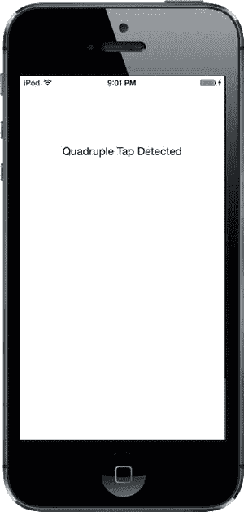

图 18-4. TapTaps 应用检测多达四次连续轻拍

我们需要这四个标签的输出口，并且还需要为每种轻拍场景设置单独的方法，以模拟我们在真实应用中会有的功能。我们还将包含一个清除文本字段的方法。打开 *ViewController.m* ，并在顶部附近的类接口中进行以下更改：

```
#import "ViewController.h"

@interface ViewController ()

@property (weak, nonatomic) IBOutlet UILabel *singleLabel;
@property (weak, nonatomic) IBOutlet UILabel *doubleLabel;
@property (weak, nonatomic) IBOutlet UILabel *tripleLabel;
@property (weak, nonatomic) IBOutlet UILabel *quadrupleLabel;

@end
```

保存文件，然后选择 *Main.storyboard* 来编辑图形用户界面。进入后，从库中向视图添加四个标签，并将它们一个接一个地排列。在属性检查器中，将每个标签的文本对齐方式设置为 *Center* 。在文档大纲中，从顶部标签按住 Control 键拖拽到其父视图并释放鼠标。按住 **Shift** 键并选择 **Top Space to Top Layout Guide** 和 **Center Horizontally in Container** ，然后在弹出窗口外单击鼠标。对另外三个标签执行相同的操作，以设置它们的自动布局约束。完成后，从 **View Controller** 图标按住 Control 键拖拽到每个标签，并分别将它们连接到 *singleLabel* 、*doubleLabel* 、*tripleLabel* 和 *quadrupleLabel* 。最后，确保双击每个标签并按下 **Delete** 键以删除任何文本。

现在选择 *ViewController.m* 并进行以下代码更改：

```
@implementation ViewController

- (void)viewDidLoad
{
    [super viewDidLoad];
    // Do any additional setup after loading the view, typically from a nib.
    UITapGestureRecognizer *singleTap =
              [[UITapGestureRecognizer alloc] initWithTarget:self
                                            action:@selector(singleTap)];
    singleTap.numberOfTapsRequired = 1;
    singleTap.numberOfTouchesRequired = 1;
    [self.view addGestureRecognizer:singleTap];

UITapGestureRecognizer *doubleTap =
              [[UITapGestureRecognizer alloc] initWithTarget:self
                                            action:@selector(doubleTap)];
    doubleTap.numberOfTapsRequired = 2;
    doubleTap.numberOfTouchesRequired = 1;
    [self.view addGestureRecognizer:doubleTap];
    [singleTap requireGestureRecognizerToFail:doubleTap];

UITapGestureRecognizer *tripleTap =
             [[UITapGestureRecognizer alloc] initWithTarget:self
                                            action:@selector(tripleTap)];
    tripleTap.numberOfTapsRequired = 3;
    tripleTap.numberOfTouchesRequired = 1;
    [self.view addGestureRecognizer:tripleTap];
    [doubleTap requireGestureRecognizerToFail:tripleTap];

UITapGestureRecognizer *quadrupleTap =
            [[UITapGestureRecognizer alloc] initWithTarget:self
                                            action:@selector(quadrupleTap)];
    quadrupleTap.numberOfTapsRequired = 4;
    quadrupleTap.numberOfTouchesRequired = 1;
    [self.view addGestureRecognizer:quadrupleTap];
    [tripleTap requireGestureRecognizerToFail:quadrupleTap];
}

- (void)didReceiveMemoryWarning
{
    [super didReceiveMemoryWarning];
    // Dispose of any resources that can be recreated.
}

- (void)singleTap {
    self.singleLabel.text = @"Single Tap Detected";
    dispatch_after(dispatch_time(DISPATCH_TIME_NOW, 2 * NSEC_PER_SEC),
                   dispatch_get_main_queue(),
                   ^{ self.singleLabel.text = @""; });
}

- (void)doubleTap {
    self.doubleLabel.text = @"Double Tap Detected";
    dispatch_after(dispatch_time(DISPATCH_TIME_NOW, 2 * NSEC_PER_SEC),
                   dispatch_get_main_queue(),
                   ^{ self.doubleLabel.text = @""; });
}

- (void)tripleTap {
    self.tripleLabel.text = @"Triple Tap Detected";
    dispatch_after(dispatch_time(DISPATCH_TIME_NOW, 2 * NSEC_PER_SEC),
                   dispatch_get_main_queue(),
                   ^{ self.tripleLabel.text = @""; });
}

- (void)quadrupleTap {
    self.quadrupleLabel.text = @"Quadruple Tap Detected";
    dispatch_after(dispatch_time(DISPATCH_TIME_NOW, 2 * NSEC_PER_SEC),
                   dispatch_get_main_queue(),
                   ^{ self.quadrupleLabel.text = @""; });
}

@end
```

在这个应用中，四个轻拍方法所做的无非是设置四个标签中的一个，然后使用`dispatch_async()`在 2 秒后清除同一个标签。

有趣的部分发生在`viewDidLoad`方法中。我们从一个非常简单的步骤开始：设置一个轻拍手势识别器并将其附加到我们的视图上：


```objc
UITapGestureRecognizer *singleTap =
        [[UITapGestureRecognizer alloc] initWithTarget:self
                                        action:@selector(singleTap)];
singleTap.numberOfTapsRequired = 1;
singleTap.numberOfTouchesRequired = 1;
[self.view addGestureRecognizer:singleTap];
```

注意，我们将触发动作所需的点击次数（在同一位置连续点击）和触摸点数（同时触摸屏幕的手指数量）都设置为`1`。之后，我们设置了另一个点击手势识别器来处理双击：

```objc
UITapGestureRecognizer *doubleTap =
         [[UITapGestureRecognizer alloc] initWithTarget:self
                                        action:@selector(doubleTap)];
doubleTap.numberOfTapsRequired = 2;
doubleTap.numberOfTouchesRequired = 1;
[self.view addGestureRecognizer:doubleTap];
[singleTap requireGestureRecognizerToFail:doubleTap];
```

这段代码与前一个非常相似，直到最后一行，我们为`singleTap`提供了一些额外的上下文。我们实际上是在告诉`singleTap`，只有在其他手势识别器——这里是`doubleTap`——判断当前用户输入不是它要找的内容时，它才应该触发其动作。

让我们思考一下这意味着什么。有了这两个点击手势识别器后，视图中的单次点击会立即让`singleTap`认为：“嘿，这看起来像是我要处理的。”同时，`doubleTap`会认为：“嘿，这*可能*是我要处理的，但我需要再等一次点击。”由于`singleTap`被设置为等待`doubleTap`的“失败”，它不会立即发送其动作方法；而是等待`doubleTap`的结果。

第一次点击后，如果立即发生另一次点击，`doubleTap`会说：“嘿，这次确实是我的了”，并触发其动作。此时，`singleTap`会意识到发生了什么并放弃该手势。另一方面，如果经过一段特定的时间（系统认为双击中两次点击之间的最大时间长度），`doubleTap`会放弃，`singleTap`会看到失败并最终触发其事件。

方法的剩余部分继续为三次和四次点击定义手势识别器，并且在每一点都配置一个手势依赖于下一个手势的失败：

```objc
UITapGestureRecognizer *tripleTap =
        [[UITapGestureRecognizer alloc] initWithTarget:self
                                        action:@selector(tripleTap)];
tripleTap.numberOfTapsRequired = 3;
tripleTap.numberOfTouchesRequired = 1;
[self.view addGestureRecognizer:tripleTap];
[doubleTap requireGestureRecognizerToFail:tripleTap];

UITapGestureRecognizer *quadrupleTap =
        [[UITapGestureRecognizer alloc] initWithTarget:self
                                        action:@selector(quadrupleTap)];
quadrupleTap.numberOfTapsRequired = 4;
quadrupleTap.numberOfTouchesRequired = 1;
[self.view addGestureRecognizer:quadrupleTap];
[tripleTap requireGestureRecognizerToFail:quadrupleTap];
```

注意，我们不需要显式地配置每个手势依赖于所有更高点击次数的手势的失败。这种多重依赖关系是通过代码中建立的失败链自然产生的。由于`singleTap`要求`doubleTap`失败，`doubleTap`要求`tripleTap`失败，`tripleTap`要求`quadrupleTap`失败。由此延伸，`singleTap`要求所有其他手势都失败。

编译并运行应用程序。无论你是单击、双击、三击还是四击，你应该只会在序列结束时看到显示一个标签。大约一秒半后，标签会自行清除，你可以再次尝试。

## 检测捏合和旋转

另一个常见的手势是双指捏合。它在许多应用程序（例如移动版 Safari、邮件和照片）中用于放大（两指分开）或缩小（两指合拢）。

得益于`UIPinchGestureRecognizer`，检测捏合非常容易。这被称为**连续手势识别器**，因为它在捏合过程中会反复调用其动作方法。手势进行时，识别器会经历多个状态。当手势被识别时，识别器处于`UIGestureRecognizerStateBegan`状态，其`scale`属性被设置为初始值`1.0`；在手势的其余部分，状态为`UIGestureRecognizerStateChanged`，并且`scale`值相对于用户手指从起始点移动的距离上下变化。我们将使用`scale`值来调整图像大小。最后，状态变为`UIGestureRecognizerStateEnded`。

另一个常见的手势是双指旋转。这也是一个连续手势识别器，名为`UIRotationGestureRecognizer`。它有一个`rotation`属性，手势开始时默认为`0.0`，然后随着用户旋转手指，从`0.0`变化到`2.0 * PI`。在下一个示例中，我们将同时使用捏合和旋转手势。

在 Xcode 中创建一个新项目，再次使用 Single View Application 模板，并将其命名为`PinchMe`。首先，将示例源代码存档中`18 - Image`文件夹里的漂亮图片`yosemite-meadows.png`（或你喜欢的其他照片）拖放到项目的`Images.xcassets`中。展开`PinchMe`文件夹，单击`ViewController.h`，并进行如下更改：

```objc
#import <UIKit/UIKit.h>

@interface ViewController : UIViewController <UIGestureRecognizerDelegate>

@end
```

这里的主要变化是让`ViewController`遵循`UIGestureRecognizerDelegate`协议，以允许多个手势识别器同时识别手势。

现在跳转到`ViewController.m`并进行如下更改：

```objc
#import "ViewController.h"

@interface ViewController ()

@property (strong, nonatomic) UIImageView *imageView;

@end

@implementation ViewController
CGFloat scale, previousScale;
CGFloat rotation, previousRotation;

- (void)viewDidLoad
{
    [super viewDidLoad];
    // Do any additional setup after loading the view, typically from a nib.
    previousScale = 1;

    UIImage *image = [UIImage imageNamed:@"yosemite-meadows"];
    self.imageView = [[UIImageView alloc] initWithImage:image];
    self.imageView.userInteractionEnabled = YES;
    self.imageView.center = self.view.center;
    [self.view addSubview:self.imageView];

    UIPinchGestureRecognizer *pinchGesture =
           [[UIPinchGestureRecognizer alloc]
                                    initWithTarget:self action:@selector(doPinch:)];
    pinchGesture.delegate = self;
    [self.imageView addGestureRecognizer:pinchGesture];

    UIRotationGestureRecognizer *rotationGesture =
           [[UIRotationGestureRecognizer alloc]
                                    initWithTarget:self action:@selector(doRotate:)];
    rotationGesture.delegate = self;
    [self.imageView addGestureRecognizer:rotationGesture];
}

- (BOOL)gestureRecognizer:(UIGestureRecognizer *)gestureRecognizer
                 shouldRecognizeSimultaneouslyWithGestureRecognizer:
                               (UIGestureRecognizer *)otherGestureRecognizer {
    return YES;
}

- (void)transformImageView {
    CGAffineTransform t = CGAffineTransformMakeScale(scale * previousScale,
                                                     scale * previousScale);
    t = CGAffineTransformRotate(t, rotation + previousRotation);
    self.imageView.transform = t;
}

- (void)doPinch:(UIPinchGestureRecognizer *)gesture {
    scale = gesture.scale;
    [self transformImageView];
    if (gesture.state == UIGestureRecognizerStateEnded) {
        previousScale = scale * previousScale;
        scale = 1;
    }
}
```


`- (void)doRotate:(UIRotationGestureRecognizer *)gesture {`
```
    rotation = gesture.rotation;
    [self transformImageView];
    if (gesture.state == UIGestureRecognizerStateEnded) {
        previousRotation = rotation + previousRotation;
        rotation = 0;
    }
}

- (void)didReceiveMemoryWarning
{
    [super didReceiveMemoryWarning];
    // 处置任何可重新创建的资源
}

@end
```

首先，我们为当前及先前的缩放和旋转定义了四个实例变量。先前的数值来自之前触发并结束的手势识别器；我们需要同时跟踪这些数值，因为用于缩放的 `UIPinchGestureRecognizer` 和用于旋转的 `UIRotationGestureRecognizer` 始终会从默认的 `1.0` 缩放和 `0.0` 旋转位置开始：

```
@implementation ViewController {
CGFloat scale, previousScale;
CGFloat rotation, previousRotation;
}
```

接下来，在 `viewDidLoad` 中，我们首先创建一个用于捏合和旋转的 `UIImageView`，将我们的优胜美地图片加载到其中，并将其在主视图中居中。我们必须记得在图像视图上启用用户交互，因为 `UIImageView` 是少数默认禁用用户交互的 `UIKit` 类之一。

```
UIImage *image = [UIImage imageNamed:@"yosemite-meadows"];
self.imageView = [[UIImageView alloc] initWithImage:image];
self.imageView.userInteractionEnabled = YES;
self.imageView.center = self.view.center;
[self.view addSubview:self.imageView];
```

接着，我们设置一个捏合手势识别器和一个旋转手势识别器，并分别告诉它们在手势被识别时通过 `doPinch:` 和 `doRotation:` 方法通知我们。我们指定两者都使用 `self` 作为它们的委托：

```
UIPinchGestureRecognizer *pinchGesture =
         [[UIPinchGestureRecognizer alloc]
                               initWithTarget:self action:@selector(doPinch:)];
pinchGesture.delegate = self;
[self.imageView addGestureRecognizer:pinchGesture];

UIRotationGestureRecognizer *rotationGesture =
         [[UIRotationGestureRecognizer alloc]
                              initWithTarget:self action:@selector(doRotate:)];
rotationGesture.delegate = self;
[self.imageView addGestureRecognizer:rotationGesture];
```

在 `gestureRecognizer:shouldRecognizeSimultaneoslyWithGestureRecognizer:` 方法中（这是我们需要实现的 `UIGestureRecognizerDelegate` 协议中唯一的方法），我们始终返回 `YES`，以允许我们的捏合和旋转手势协同工作；否则，先启动的手势识别器会始终阻止另一个：

```
- (BOOL)gestureRecognizer:(UIGestureRecognizer *)gestureRecognizer
          shouldRecognizeSimultaneouslyWithGestureRecognizer:
                  (UIGestureRecognizer *)otherGestureRecognizer {
    return YES;
}
```

接着，我们实现一个辅助方法，根据手势识别器提供的当前缩放和旋转值来变换图像视图。注意我们将当前缩放值与先前的缩放值相乘，也将旋转值与先前的旋转值相加。这样当新手势从默认 `1.0` 缩放和 `0.0` 旋转开始时，我们可以补偿之前已经完成的捏合和旋转操作。

```
- (void)transformImageView {
    CGAffineTransform t = CGAffineTransformMakeScale(scale * previousScale,
                                                     scale * previousScale);
    t = CGAffineTransformRotate(t, rotation + previousRotation);
    self.imageView.transform = t;
}
```

最后，我们实现动作方法，这些方法接收手势识别器的输入并更新图像视图的变换。在 `doPinch:` 和 `doRotate:` 中，我们首先提取新的 `scale` 或 `rotation` 值。接着，更新图像视图的变换。最后，如果手势识别器报告其手势已结束（`state` 等于 `UIGestureRecognizerStateEnded`），我们存储当前的正确缩放或旋转值，然后将当前的缩放或旋转值重置为默认的 `1.0` 缩放或 `0.0` 旋转：

```
- (void)doPinch:(UIPinchGestureRecognizer *)gesture {
    scale = gesture.scale;
    [self transformImageView];
    if (gesture.state == UIGestureRecognizerStateEnded) {
        previousScale = scale * previousScale;
        scale = 1;
    }
}

- (void)doRotate:(UIRotationGestureRecognizer *)gesture {
    rotation = gesture.rotation;
    [self transformImageView];
    if (gesture.state == UIGestureRecognizerStateEnded) {
        previousRotation = rotation + previousRotation;
        rotation = 0;
    }
}
```

捏合与旋转的检测就这些内容。编译并运行应用程序试一下。当你进行捏合和旋转操作时，你会看到图片相应地变化（参见图 18-5）。如果你使用的是模拟器，请记住你可以按住 **Option** 键并在模拟器窗口中用鼠标点击并拖拽来模拟捏合操作。

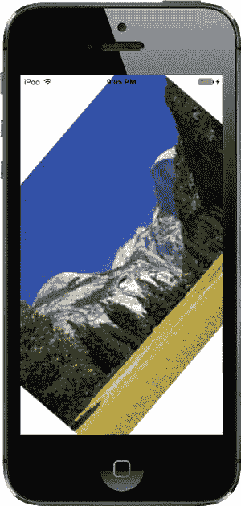

图 18-5. PinchMe 应用程序检测捏合和旋转手势

## 定义自定义手势

现在你已经了解了如何检测最常用的手势。当你开始定义自己的自定义手势时，真正的乐趣才刚开始！你已经学会如何使用几个 `UIGestureRecognizer` 的子类，现在是时候学习如何创建自己的手势了，这些手势可以轻松附加到任何你想要的视图上。

定义自定义手势比使用标准手势要复杂一些。你已经掌握了基本机制，这并不太难。棘手的部分在于定义手势的构成时要有足够的灵活性。

大多数人在使用手势时并不精确。还记得我们在实现滑动时使用的容差范围吗？这样即使滑动不是完全水平或垂直的仍然算数？这就是你需要在自己的手势定义中添加微妙细节的绝佳例子。如果你对手势定义过于严格，它将毫无用处。如果你定义得过于宽泛，会得到太多误判，这会让用户感到沮丧。从某种意义上说，定义自定义手势可能很困难，因为你必须精确地描述一种不精确的手势。如果你试图捕捉一种复杂的手势，比如画一个“8”字形，背后检测手势的数学运算也会变得相当复杂。

## CheckPlease 应用程序

在我们的示例中，我们将定义一个形状像对勾的手势（参见图 18-6）。

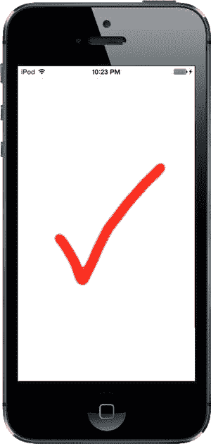

图 18-6. 对勾手势示意图

这个对勾手势的关键属性是什么？最主要的特征是两条线之间角度的剧烈变化。我们还需要确保用户的手指在形成那个锐角之前，已经沿直线移动了一段距离。在图 18-6 中，对勾的两条腿相交于一个锐角，略小于 90 度。一个要求恰好 85 度角的手势会极难准确完成，因此我们将定义一个可接受的角度范围。


## 排版后的内容

使用单视图应用模板在 Xcode 中创建一个新项目，并将其命名为 `CheckPlease`。在这个项目中，我们需要进行一些相当标准的解析几何计算，例如计算两点之间的距离和两条线之间的角度。如果你对几何知识记得不多也不用担心；我们已经为你提供了可以执行这些计算的函数。

请查看 `18 – CheckPlease Utils` 文件夹中的两个文件：`CGPointUtils.h` 和 `CGPointUtils.c`。将这两个文件拖到项目的 CheckPlease 分组中。你可以随意在自己的应用程序中使用这些文件中的实用函数。接下来，进入 `18 – Image` 文件夹，将图像文件 `CheckImage.png` 拖到项目中的 `Image.xcassets` 文件夹中。

在 Xcode 中，按下 `N` 调出新文件助手，在 iOS 部分选择 `Cocoa Touch Class`。将新类命名为 `CheckMarkRecognizer`，并使其成为 `UIGestureRecognizer` 的子类。现在，在项目导航器中选择 `CheckMarkRecognizer.m`，并进行以下修改：

```
#import "CheckMarkRecognizer.h"
#import "CGPointUtils.h"
#import <UIKit/UIGestureRecognizerSubclass.h>

static CGFloat const kMinimumCheckMarkAngle  =  50;
static CGFloat const kMaximumCheckMarkAngle  = 135;
static CGFloat const kMinimumCheckMarkLength =  10;

@implementation CheckMarkRecognizer {
    CGPoint lastPreviousPoint;
    CGPoint lastCurrentPoint;
    CGFloat lineLengthSoFar;
}

@end
```

在导入我们之前提到的 `CGPointUtils.h` 之后，我们导入了一个名为 `UIGestureRecognizerSubclass.h` 的特殊头文件，其中包含了仅供 `UIGestureRecognizer` 子类使用的声明。这样做的重要作用是将手势识别器的 `state` 属性变为可写。这是我们子类用来确认所监控的手势已成功完成的机制。

接下来，我们定义了一些参数，用于判断用户的手指划动是否符合我们对勾号的定义。可以看到，我们定义了一个最小角度 50 度和最大角度 135 度。这是一个相当宽的范围；根据你的需求，你可能会决定限制角度范围。我们对此进行了一些试验，发现我们练习的勾号手势落在一个相当宽的范围内，这就是为什么我们在这里选择了较大的容差。我们对手势的划动有些随意，因此我们预计至少部分用户也会如此。正如一位智者所说：“产出时要严谨，接受时要宽容。”

现在，我们声明了三个实例变量：`lastPreviousPoint`、`lastCurrentPoint` 和 `lineLengthSoFar`。每次收到触摸通知时，我们都会得到上一个触摸点和当前触摸点。这两个点定义了一条线段。下一次触摸会添加另一条线段。我们将上一次触摸的上一个点和当前点存储在 `lastPreviousPoint` 和 `lastCurrentPoint` 中，从而得到前一条线段。然后，我们可以将该线段与当前触摸的线段进行比较。比较这两条线段可以告诉我们，我们是在绘制一条单一线段，还是两条线段之间存在足够锐利的角度，以至于我们实际上是在绘制一个勾号。

请记住，每个 `UITouch` 对象都知道其在视图中的当前位置以及上一个位置。然而，为了比较角度，我们需要知道前两个点构成的线段，因此我们需要存储用户上次触摸屏幕时的当前点和上一个点。每次调用此方法时，我们都会使用这两个变量来存储这两个值，这样我们就能比较当前线段和上一条线段，并检查角度。

我们还声明了一个实例变量，用于持续记录用户手指拖动的距离。如果手指移动的距离至少达到 10 像素（由 `kMinimumCheckMarkLength` 定义的值），那么角度是否落在正确范围内才重要。如果没有这个距离要求，我们会收到很多误报。

## CheckPlease 触摸方法

接下来，添加这两个方法来处理发送给手势识别器的触摸事件：

```
- (void)touchesBegan:(NSSet *)touches withEvent:(UIEvent *)event {
    [super touchesBegan:touches withEvent:event];
    UITouch *touch = [touches anyObject];
    CGPoint point = [touch locationInView:self.view];
    lastPreviousPoint = point;
    lastCurrentPoint = point;
    lineLengthSoFar = 0.0;
}

- (void)touchesMoved:(NSSet *)touches withEvent:(UIEvent *)event {
    [super touchesMoved:touches withEvent:event];
    UITouch *touch = [touches anyObject];
    CGPoint previousPoint = [touch previousLocationInView:self.view];
    CGPoint currentPoint = [touch locationInView:self.view];
    CGFloat angle = angleBetweenLines(lastPreviousPoint,
                                      lastCurrentPoint,
                                      previousPoint,
                                      currentPoint);
    if (angle >= kMinimumCheckMarkAngle && angle <= kMaximumCheckMarkAngle
        && lineLengthSoFar > kMinimumCheckMarkLength) {
        self.state = UIGestureRecognizerStateRecognized;
    }
    lineLengthSoFar += distanceBetweenPoints(previousPoint, currentPoint);
    lastPreviousPoint = previousPoint;
    lastCurrentPoint = currentPoint;
}
```

你会注意到，每个方法都首先调用了父类的实现——这在之前的触摸方法中我们都没有做过。在 `UIGestureRecognizer` 子类中必须这样做，以便我们的父类能够像我们一样了解事件的信息。现在让我们继续看代码本身。

在 `touchesBegan:withEvent:` 中，我们确定用户当前触摸的点，并将该值存储在 `lastPreviousPoint` 和 `lastCurrentPoint` 中。由于此方法在手势开始时调用，我们知道没有上一个点需要担心，因此将当前点同时存储在这两个变量中。我们还将跟踪的线段长度重置为 0。

在 `touchesMoved:withEvent:` 中，我们计算当前触摸的上一个位置到当前位置所构成的线段，与存储在 `lastPreviousPoint` 和 `lastCurrentPoint` 实例变量中的两个点所构成的线段之间的角度。得到这个角度后，我们检查它是否落在我们可接受的角度范围内，并确保用户的手指在做出那个锐利转折之前已经移动了足够的距离。如果这两个条件都成立，我们将手势识别器的状态设置为 `UIGestureRecognizerStateRecognized`，以表明我们已经识别出一个勾号手势。接下来，我们计算触摸位置与其上一个位置之间的距离，将其加到 `lineLengthSoFar` 中，并将 `lastPreviousPoint` 和 `lastCurrentPoint` 中的值替换为当前触摸的两个点，以便下次执行此方法时使用。

现在我们有了一个可以尝试的手势识别器，是时候将其连接到一个视图上了，就像我们之前使用其他手势识别器一样。切换到 `ViewController.m`，并在文件顶部添加以下加粗的代码：

```
#import "ViewController.h"
#import "CheckMarkRecognizer.h"

@interface ViewController ()

@property (weak, nonatomic) IBOutlet UIImageView *imageView;

@end
```

在这里，我们只是导入了我们定义的手势识别器的头文件，然后为一个图像视图添加了一个出口，当我们检测到勾号手势时，将使用该图像视图通知用户。


选择 `Main.storyboard` 来编辑图形界面。从库中拖一个`Image View`到视图上，将其放置在靠近中心的位置，并调整大小使其覆盖整个视图。在文档大纲中，按住 Control 键从`Image View`拖拽到主视图，松开鼠标，按住`Shift`键并依次选择`Leading Space to Container Margin`（前导容器边距）、`Trailing Space to Container Margin`（尾随容器边距）、`Top Space to Top Layout Guide`（顶部到顶部布局参考线间距）和`Bottom Space to Bottom Layout Guide`（底部到底部布局参考线间距），然后用鼠标点击弹出菜单外部。在文档大纲中选择该 image view，并在属性检查器中将 Mode 属性设为`Center`，Image 属性设为`CheckImage`。最后，按住 Control 键从`View Controller`图标拖拽到 image view，将其连接到`imageView`输出口。

现在切换回`ViewController.m`，在`@implementation`部分添加以下代码：

```
@implementation ViewController

- (void)doCheck:(CheckMarkRecognizer *)check {
    self.imageView.hidden = NO;
    dispatch_after(dispatch_time(DISPATCH_TIME_NOW, 2 * NSEC_PER_SEC),
                   dispatch_get_main_queue(),
                   ^{ self.imageView.hidden = YES; });
}
```

这将为我们提供一个动作方法来连接手势识别器。当手势被识别时，image view 会变为可见，从而显示对勾标记。稍后，该图像会再次隐藏。

接下来，编辑`viewDidLoad`方法，添加以下几行代码。这些代码将新识别器的实例连接到视图，并确保 image view（以及其中的对勾标记）初始状态为隐藏：

```
- (void)viewDidLoad
{
    [super viewDidLoad];
      // 加载视图后的其他初始化设置，通常来自 nib 文件
    CheckMarkRecognizer *check = [[CheckMarkRecognizer alloc]
                                 initWithTarget:self
                                     action:@selector(doCheck:)];
    [self.view addGestureRecognizer:check];
    self.imageView.hidden = YES;
}
```

编译并运行应用，然后尝试这个手势。

在为自己的应用定义新手势时，务必进行彻底测试。如果可能，也请其他人帮你测试。你需要确保手势对用户来说易于操作，但又不至于轻易被意外触发。同时，你需要确保不会与应用中使用的其他手势发生冲突。例如，单次手势不应同时被识别为自定义手势和捏合手势。

服务员？结账，谢谢！

现在你应该了解了 iOS 用来告知应用触摸、轻点和手势的机制。你还学会了如何检测最常用的 iOS 手势，甚至初步掌握了如何定义自己的自定义手势。iOS 用户界面大量依赖手势来实现易用性，因此在大多数 iOS 开发中，你需要熟练掌握这些技巧。

准备好继续学习后，请翻到下一页，我们将介绍如何使用 Core Location 确定你的地理位置。

第 19 章

我在哪里？使用 Core Location 和 Map Kit 定位

每台 iOS 设备都能通过名为`Core Location`的框架来确定自己的地理位置。iOS 还包含一个名为`Map Kit`的框架，让你能够轻松创建实时交互式地图，显示任何你希望展示的位置——当然也包括用户的位置。本章将带你初步了解这两个框架的使用方法。

`Core Location`实际上可以利用三种技术来实现定位：GPS、蜂窝基站识别和 Wi-Fi 定位服务（WPS）。GPS 是这三种技术中精度最高的，但第一代 iPhone、iPod touch 或仅支持 Wi-Fi 的 iPad 不具备此功能。简而言之，任何具备 3G 数据连接的设备都包含 GPS 模块。GPS 通过读取多颗卫星的微波信号来确定当前位置。

**注意** 苹果使用的是名为`Assisted GPS`（辅助 GPS，简称 A-GPS）的 GPS 版本。A-GPS 利用网络资源来提升独立 GPS 的性能。基本思路是：电信运营商在其网络上部署服务，移动设备会自动发现并从中收集数据。这使得移动设备能够比仅依赖 GPS 卫星更快速地确定起始位置。

蜂窝基站识别定位会根据设备当前连接的蜂窝基站物理位置，粗略估算当前位置。由于每个基站覆盖范围可能相当大，因此这种定位方式存在较大误差。蜂窝基站识别定位需要蜂窝无线电连接，因此仅适用于 iPhone（包括初代在内的所有型号）以及任何具备 3G 数据连接的 iPad。

WPS 方式通过参考包含已知服务提供商及其服务区域的大型数据库，利用附近 Wi-Fi 接入点的媒体访问控制（MAC）地址来推测你的位置。WPS 的精度较低，误差可能达到数英里。

这三种方法都会明显消耗电池电量，因此在使用`Core Location`时务必注意这一点。除非绝对必要，否则应用不应过于频繁地轮询位置信息。使用`Core Location`时，你可以指定所需的精度。通过谨慎设定所需的最低精度，可以避免不必要的电量消耗。

`Core Location`所依赖的技术对应用是透明的。我们无需告诉`Core Location`使用 GPS、三角测量还是 WPS。我们只需指定所需的精度，`Core Location`会根据可用的技术自行判断哪种方式最适合满足我们的请求。

### 位置管理器

`Core Location` API 实际上相当易于使用。我们将用到的主要类是`CLLocationManager`，通常称为**位置管理器**。要与`Core Location`交互，你需要创建一个位置管理器的实例，如下所示：

```
CLLocationManager *locationManager = [[CLLocationManager alloc] init];
```

这会创建一个位置管理器的实例，但并不会立即开始轮询你的位置。你必须创建一个遵循`CLLocationManagerDelegate`协议的对象，并将其指定为位置管理器的委托。当位置信息可用或发生变化时，位置管理器会调用委托方法。确定位置的过程可能需要一些时间，甚至几秒钟。

#### 设置所需精度

设置委托后，还需要设置所需的精度。如前所述，指定的精度不要超过实际需求。如果你编写的应用只需知道手机位于哪个州或国家，就不要指定过高的精度级别。请记住，你对`Core Location`的精度要求越高，消耗的电量就越多。同时，请注意无法保证一定能够达到你请求的精度级别。

以下是设置委托并请求特定精度级别的示例：

```
locationManager.delegate = self;
locationManager.desiredAccuracy = kCLLocationAccuracyBest;
```


精度通过`CLLocationAccuracy`值设置，该类型被定义为`double`。该值以米为单位，因此如果您将`desiredAccuracy`指定为`10`，您就是在告诉 Core Location，您希望它尽可能在 10 米范围内确定当前位置。指定`kCLLocationAccuracyBest`（如我们之前所做）或指定`kCLLocationAccuracyBestForNavigation`（同时使用其他传感器数据）会告诉 Core Location 使用当前可用的最精确方法。此外，您还可以使用`kCLLocationAccuracyNearestTenMeters`、`kCLLocationAccuracyHundredMeters`、`kCLLocationAccuracyKilometer`和`kCLLocationAccuracyThreeKilometers`。

#### 设置距离过滤器

默认情况下，位置管理器会将检测到的设备位置的任何变化通知给委托。通过指定距离过滤器，您就是在告诉位置管理器不要通知您每一次变化，而是仅在位置变化超过一定量时才通知您。设置距离过滤器可以减少应用程序的轮询量。

距离过滤器也以米为单位设置。将距离过滤器指定为`1000`会告诉位置管理器，在 iPhone 从其先前报告的位置移动至少 1000 米之前，不要通知其委托。示例如下：

```
locationManager.distanceFilter = 1000.;
```

如果您想将位置管理器恢复为默认设置（即不应用任何过滤器），可以使用常量`kCLDistanceFilterNone`，如下所示：

```
locationManager.distanceFilter = kCLDistanceFilterNone;
```

与指定所需精度时一样，您应注意避免比实际需要更频繁地获取更新；否则会浪费电池电量。一个基于用户位置计算速度的测速应用，可能希望尽可能快地获得更新，但一个显示最近快餐店的应用则可以接受更少的更新。

#### 获取使用定位服务的权限

在您的应用程序可以使用定位服务之前，您需要获得用户的许可。Core Location 提供了几种不同的服务，其中一些甚至可以在您的应用程序处于后台时使用——事实上，您甚至可以请求在应用未运行时发生某些事件时启动您的应用程序。根据您的应用程序的功能，可能只需要请求在使用应用时访问定位服务的权限，或者可能需要始终能够使用该服务。在编写应用程序时，您需要决定需要哪种权限，并且需要在启动所需服务之前提出请求。您将在创建本章示例应用的过程中看到如何执行此操作。

#### 启动位置管理器

当您准备好开始轮询位置，并且在向用户请求访问定位服务的权限之后，您告诉位置管理器启动。它会自行运作，并在确定当前位置后调用委托方法。在您告诉它停止之前，每当它检测到超出当前距离过滤器的变化时，它会持续调用您的委托方法。

以下是启动位置管理器的方法：

```
[locationManager startUpdatingLocation];
```

#### 明智地使用位置管理器

如果您只需要确定当前位置并且不需要持续更新，那么您的位置委托应在获得应用所需信息后立即停止位置管理器。如果您需要轮询，请确保尽快停止轮询。请记住，只要您从位置管理器获取更新，就会消耗用户的电池电量。

要告诉位置管理器停止向其委托发送更新，请调用`stopUpdatingLocation`，如下所示：

```
[locationManager stopUpdatingLocation];
```

#### 位置管理器委托

位置管理器委托必须遵循`CLLocationManagerDelegate`协议，该协议定义了多个方法，所有方法都是可选的。其中一个方法在用户授权使用定位服务的可用性发生变化时由位置管理器调用，另一个方法在它确定当前位置或检测到位置变化时调用，还有一个方法在位置管理器遇到错误时调用。我们将在应用中实现所有这些委托方法。

#### 获取位置更新

当位置管理器想要将当前位置通知其委托时，它会调用`locationManager:didUpdateLocations:`方法。此方法接受两个参数：

*   第一个参数是调用该方法的`locationManager`。
*   第二个参数是一个`CLLocation`对象数组，用于描述设备的当前位置以及可能的一些先前位置。如果在短时间内发生多次位置更新，它们可能会通过单次调用此方法一次报告。在任何情况下，最近的位置始终是该数组中的最后一项。

#### 使用`CLLocation`获取纬度和经度

位置信息通过`CLLocation`类的实例从位置管理器传递。该类有六个可能对您的应用程序感兴趣的属性：

*   `coordinate`
*   `horizontalAccuracy`
*   `altitude`
*   `verticalAccuracy`
*   `floor`
*   `timestamp`

纬度和经度存储在名为`coordinate`的属性中。要以度数获取纬度和经度，请执行以下操作：

```
CLLocationDegrees latitude = theLocation.coordinate.latitude;
CLLocationDegrees longitude = theLocation.coordinate.longitude;
```

`CLLocation`对象还可以告诉您位置管理器对其纬度和经度计算有多大的信心。`horizontalAccuracy`属性描述了以`coordinate`为中心、半径（以米为单位，与所有 Core Location 测量值相同）的圆的范围。`horizontalAccuracy`的值越大，Core Location 对位置的确定性越低。非常小的半径表示对确定的位置有很高的置信度。

您可以在“地图”应用中看到`horizontalAccuracy`的图形表示（见图 19-1）。当“地图”应用检测到您的位置时，显示的圆圈使用`horizontalAccuracy`作为其半径。位置管理器认为您位于该圆圈的中心。如果不在，您也几乎肯定位于圆圈内的某个位置。`horizontalAccuracy`中的负值表示由于某种原因您不能依赖`coordinate`中的值。

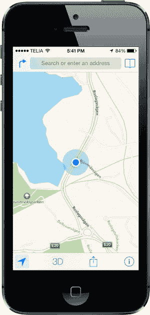

图 19-1。“地图”应用使用 Core Location 来确定您的当前位置。外圈是水平精度的直观表示。

`CLLocation`对象还有一个名为`altitude`的属性，可以告诉您海拔（或低于）海平面多少米：

```
CLLocationDistance altitude = theLocation.altitude;
```

每个`CLLocation`对象维护一个名为`verticalAccuracy`的属性，它表示 Core Location 对其确定的海拔高度有多大的信心。`altitude`的值可能偏差与`verticalAccuracy`的值相同的米数。如果`verticalAccuracy`值为负，Core Location 表示无法确定有效的海拔高度。

`floor`属性给出了用户所在建筑物内的楼层。此值仅在能够提供该信息的建筑物中有效，因此您不应依赖其可用性。

`CLLocation`对象还有一个`timestamp`，用于指示位置管理器进行位置确定的时间。


