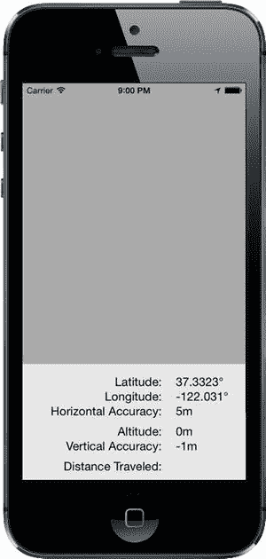
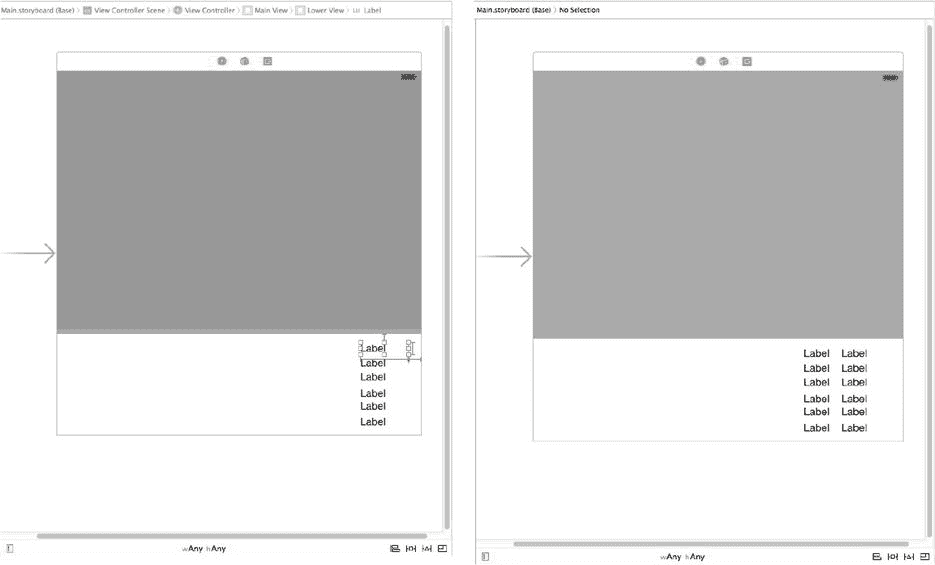
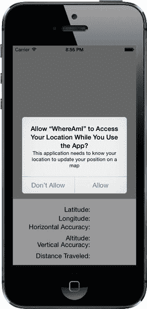
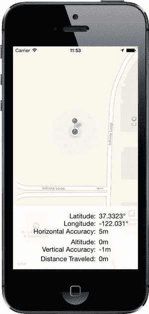
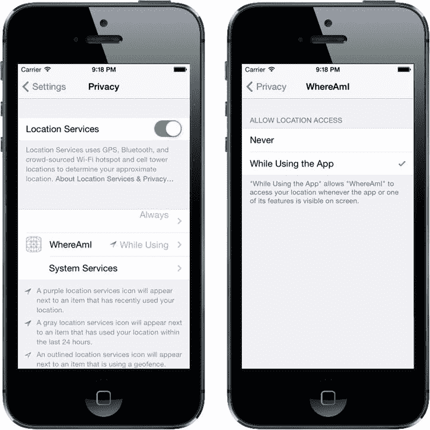

# Core Location 基础

除了这些属性外，`CLLocation` 还有一个有用的实例方法，可以让你确定两个 `CLLocation` 对象之间的距离。该方法名为 `distanceFromLocation:`，它返回一个 `CLLocationDistance` 类型的值，而 `CLLocationDistance` 实际上只是一个 `double`，因此你可以在算术计算中使用它，正如你即将创建的应用程序中所示。以下是使用该方法的方式：

```
CLLocationDistance distance = [fromLocation distanceFromLocation:toLocation];
```

上述代码行将返回两个 `CLLocation` 对象（`fromLocation` 和 `toLocation`）之间的距离。返回的 `distance` 值是大圆距离（great-circle distance）计算的结果，该计算忽略 `altitude` 属性，假设两个点都在海平面上进行距离计算。对于大多数用途来说，大圆计算已经足够；然而，如果你确实希望在计算距离时考虑海拔因素，则需要自己编写代码来实现。

**注意**：如果你不清楚大圆距离（great-circle distance）的含义，可能需要回想一下地理课上的大圆航线（great-circle route）概念。其核心思想是：地球表面任意两点之间的最短距离，将沿着一条路径找到，如果这条路径延伸下去，将环绕整个地球一周，即“大圆”。最显然的大圆也许就是你在地图上见过的：赤道和经线。然而，对于地球表面任意两点，都可以找到这样一个大圆。`CLLocation` 执行的计算，就是沿着这样一条路径确定两点之间的距离，同时考虑了地球的曲率。如果不考虑曲率，你将得到连接两点的直线长度，这没什么用，因为那条直线不可避免地会直接穿过地球内部的一部分！

### 错误通知

如果 Core Location 需要向你的应用程序报告错误，它会调用一个名为 `locationManager:didFailWithError:` 的委托方法。错误的可能原因之一是用户拒绝了位置服务访问权限，此时该方法会以错误码 `kCLErrorDenied` 被调用。位置管理器支持的另一个常见错误码是 `kCLErrorLocationUnknown`，它表示 Core Location 无法确定位置，但会继续尝试。虽然 `kCLErrorLocationUnknown` 错误表示的问题可能是暂时性的，但 `kCLErrorDenied` 及其他错误可能表明，在当前会话的剩余时间内，你的应用程序将无法访问 Core Location。

**注意**：模拟器无法确定你的当前位置，但你可以从模拟器的 Debug  Location 菜单中选取一个位置（例如默认的 Apple 总部）或设置自定义位置。

### 尝试 Core Location

让我们构建一个小型应用程序，用于检测你设备的当前位置以及程序运行期间移动的总距离。你可以在 Figure 19-2 中看到应用程序第一版的样子。



Figure 19-2. WhereAmI 应用程序运行中

在 Xcode 中，使用 Single View Application 模板创建一个新项目，并将其命名为 *WhereAmI*。当项目窗口打开时，选择 *ViewController.m* 并进行以下更改：

```
#import "ViewController.h"
#import <CoreLocation/CoreLocation.h>

@interface ViewController () <CLLocationManagerDelegate>

@property (strong, nonatomic) CLLocationManager *locationManager;
@property (strong, nonatomic) CLLocation *previousPoint;
@property (assign, nonatomic) CLLocationDistance totalMovementDistance;
@property (weak, nonatomic) IBOutlet UILabel *latitudeLabel;
@property (weak, nonatomic) IBOutlet UILabel *longitudeLabel;
@property (weak, nonatomic) IBOutlet UILabel *horizontalAccuracyLabel;
@property (weak, nonatomic) IBOutlet UILabel *altitudeLabel;
@property (weak, nonatomic) IBOutlet UILabel *verticalAccuracyLabel;
@property (weak, nonatomic) IBOutlet UILabel *distanceTraveledLabel;

@end
```

首先，注意我们已经包含了 Core Location 头文件。Core Location 既不是 UIKit 也不是 Foundation 的一部分，因此需要手动包含头文件。接下来，我们将此类遵循 `CLLocationManagerDelegate` 协议，以便能够从位置管理器接收位置信息。

然后，我们声明一个 `CLLocationManager` 指针，用于保存我们将要创建的 Core Location Manager 实例的指针。我们还声明了一个指向 `CLLocation` 的指针，该指针将设置为从位置管理器接收到的最后一次更新的位置。这样，每当用户移动足够远以触发更新时，我们就能将最新的移动距离累加到运行总距离中，该总距离保存在 `totalMovementDistance` 属性中。

其余属性是用于更新用户界面标签的插座变量。

现在选择 *Main.storyboard*，开始创建图形用户界面。首先，在文档大纲中展开视图控制器层级，选择视图项并将其名称改为 *Main View*，然后在属性检查器中将其背景颜色改为浅灰色。接着，从对象库中拖拽一个 `UIView`，放到现有视图上，然后调整其位置和大小，使其覆盖主视图的下半部分。确保该视图的底部、左侧和右侧与灰色视图完全对齐。目标是创建类似于 Figure 19-2 所示的布局，其中你刚刚拖放的视图是图中底部白色背景的那个。

在文档大纲中，选择你刚刚添加的视图并将其名称改为 *Lower View*。从 Lower View 按住 Control 键拖拽到 Main View 并释放鼠标。在弹出菜单中，按住 Shift 键并点击 Leading Space to Container Margin、Trailing Space to Container Margin 和 Bottom Space to Bottom Layout Guide。这将固定 Lower View 的位置，但尚未设置其高度。为了固定高度，在文档大纲中仍然选中 Lower View 的情况下，点击 Pin 按钮。在弹出窗口中，选中 Height 复选框并将高度设置为 **166**，将 Update Frames 设置为 Items of New Constraint，然后点击 Add 1 Constraint 来设置高度。这样就完成了。

接下来，我们将创建 Figure 19-2 所示的最右侧一列标签。从对象库中拖拽一个标签，放到 Lower View 顶部稍下方的位置。将其宽度调整为大约 80 点，并移动到靠近视图右侧边缘的位置。按住 Option 键向下拖拽该标签的副本五次，创建一叠标签，如图 Figure 19-2 所示。现在让我们修复标签相对于 Lower View 的大小和位置。


从文档大纲的最顶部标签开始，按住 Control 键并拖动该标签到 `Lower View`，然后松开鼠标。按住 `Shift` 键，选择 `Top Space to Container Margin` 和 `Trailing Space to Container Margin`，接着在界面任意位置点击鼠标以关闭弹出菜单。要设置标签的大小，点击 `Pin` 按钮打开**添加新约束**弹出菜单，勾选 `Width` 和 `Height` 复选框，将宽度设为 `80`，高度设为 `21`（如果尚未设置），然后点击 `Add 2 Constraints`。现在，你已经固定了顶部标签的大小和位置。如果在故事板编辑器中选中该标签，你应该能看到图 19-3 左侧所示的约束。对另外五个标签重复同样的操作。



图 19-3. 准备将显示位置信息的标签

接下来，我们将添加第二列标签。从对象库中拖出一个标签，将其放在最顶部标签的左侧，两者之间留出一点水平间距。将标签的左侧边缘拖动到与 `Lower View` 的左边缘几乎对齐的位置，然后在属性检查器中，将 `Alignment` 设置为文本右对齐。按住 Option 键向下拖动，复制此标签五次，并将每个复制的标签与右侧对应的标签对齐，从而创建图 19-3 右侧所示的左列。

选中左列的顶部标签，按住 Control 键从它的左侧边缘拖动到 `Lower View` 的左侧边缘。松开鼠标，在上下文菜单中选择 `Leading Space to Container Margin`。接下来，按住 Control 键从同一个标签拖动到右列中与之匹配的标签。松开鼠标打开上下文菜单，按住 `Shift` 键，选择 `Horizontal Spacing` 和 `Baseline`，然后在上下文菜单外点击鼠标。对左列中的另外五个标签重复这一操作。最后，选中文档大纲中的 `View Controller` 图标，点击 `Resolve Auto Layout Issues` 按钮，如果 `Update Frames` 可用，则选择它。所有橙色的警告指示应该会消失，屏幕的下半部分应如图 19-3 右侧所示。

我们快大功告成了！现在需要将右列中的标签连接到视图控制器中的输出口。在助理编辑器中打开 `ViewController.m`，按住 Control 键从右列的顶部标签拖动到视图控制器中名为 `latitudeLabel` 的输出口，松开鼠标完成连接。然后依次将第二个标签拖动到 `longitudeLabel`，第三个标签到 `horizontalAccuracyLabel`，第四个到 `altitudeLabel`，第五个到 `verticalAccuracyLabel`，最后一个标签到 `distanceTraveledLabel`。至此，六个输出口已全部连接。

最后，清空右列所有标签的文本，并将左列标签的文本改为图 19-2 所示的内容：顶部标签的文本应为 `Latitude:`，其下方依次为 `Longitude:`，以此类推。

现在，让我们编写代码，在这些标签中显示一些有用的信息。选中 `ViewController.m`，在 `viewDidLoad` 中插入以下代码行，以配置位置管理器：

```
- (void)viewDidLoad
{
    [super viewDidLoad];

self.locationManager = [[CLLocationManager alloc] init];
    self.locationManager.delegate = self;
    self.locationManager.desiredAccuracy = kCLLocationAccuracyBest;
    [self.locationManager requestWhenInUseAuthorization];
}
```

我们分配并初始化一个 `CLLocationManager` 实例，将控制器类指定为委托，将期望精度设置为最高可用精度，然后请求在用户使用应用程序时获取使用位置服务的权限。就本例的目的而言，这一授权已足够。若要使用超出本书范围的 Core Location 更高级功能，你可能需要调用 `requestAlwaysAuthorization` 方法来请求随时使用 Core Location 的权限。

**注意** 在这个简单的示例中，授权请求在应用程序启动时发出，但苹果建议，在实际应用中，应将请求延迟到真正需要使用位置服务时再发出。原因是：当用户基于所请求的操作明显能理解你为何需要访问设备位置时，相比一个（很可能是刚安装的）应用在启动时立即请求权限，用户更有可能同意。

此应用程序首次运行时，iOS 会显示一个警告，询问用户是否允许该应用使用其位置。你需要提供一段简短的文本，iOS 会将其包含在警告弹窗中，解释你的应用为何需要知道用户的位置。打开 `info.plist` 文件，在键 `NSLocationWhenInUseUsageDescription` 下添加你想要显示的文本（如果你需要请求在应用未活跃使用时也能使用位置服务的权限，则应将文本添加到键 `NSLocationAlwaysUsageDescription` 下）。就本例而言，可以使用类似“该应用需要知道您的位置，以便在地图上更新您的定位”这样的文字。

**注意** 在较早的 iOS 版本中，为权限请求提供说明文本是可选的。从 iOS 8 开始，这是强制性的。如果不提供任何文本，权限请求将不会发出。

现在运行应用程序，你会看到 iOS 在权限请求中使用了你提供的文本，如图 19-4 所示。



图 19-4. 提示用户授权使用位置服务

此提示在应用程序的整个生命周期中只会出现一次。无论用户是否允许你的应用程序使用位置服务，此请求都不会再被提出——无论应用程序运行多少次。当然，这并不意味着用户不能改变主意。我们将在接下来的“更改位置服务权限”部分详细讨论。就测试而言，从 Xcode 重新运行应用程序不会影响用户已保存的响应——要获得干净的测试状态，你必须从模拟器或设备中删除应用程序。如果这样做，当你重新安装并启动应用程序时，iOS 会再次提示授权。现在，对提示回复“允许”，然后继续编写我们的应用程序。

你可能已经注意到，`viewDidLoad` 方法在调用 `requestWhenInUseAuthorization` 后并没有立即调用位置管理器的 `startUpdatingLocation` 方法。事实上，这样做毫无意义，因为授权过程不会立即完成。在 `viewDidLoad` 返回后的某个时刻，位置管理器委托的 `locationManager:didChangeAuthorizationStatus:` 方法会被调用，并传入应用程序的授权状态。这可能是用户对权限请求弹窗的回复结果，也可能是应用程序上次执行时保存的授权状态。无论哪种情况，假设你已获得授权，此方法都是开始监听位置更新的理想位置。将以下此方法的实现添加到 `ViewController.m` 文件中：


```objc
- (void)locationManager:(CLLocationManager *)manager
        didChangeAuthorizationStatus:(CLAuthorizationStatus)status {
    NSLog(@"授权状态变更为 %d", status);
    switch (status) {
    case kCLAuthorizationStatusAuthorizedAlways:
    case kCLAuthorizationStatusAuthorizedWhenInUse:
        [self.locationManager startUpdatingLocation];
        break;

case kCLAuthorizationStatusNotDetermined:
    case kCLAuthorizationStatusRestricted:
    case kCLAuthorizationStatusDenied:
        [self.locationManager stopUpdatingLocation];
        break;
    }
}
```

这段代码在授权被授予时开始监听位置更新，并在未授权时停止监听。既然只有在获得授权后才开始监听，那么未获得权限时调用 `stopUpdatingLocation` 又有什么意义呢？这是个好问题。之所以需要这段代码，是因为用户可能先授予你的应用使用 Core Location 的权限，后来又撤销了它。在这种情况下，我们需要停止监听更新。更多信息请参阅本章后面的"更改位置服务权限"一节。

如果你的应用在未获得权限时尝试使用定位服务，或随时发生错误，位置管理器会调用其委托的 `locationManager:didFailWithError:` 方法。让我们在视图控制器中添加该方法的实现：

```objc
- (void)locationManager:(CLLocationManager *)manager
       didFailWithError:(NSError *)error {
    NSString *errorType = error.code == kCLErrorDenied ? @"访问被拒绝"
           : [NSString stringWithFormat:@"错误 %ld", (long)error.code, nil];
    UIAlertController *alertController =
      [UIAlertController alertControllerWithTitle:@"定位管理器错误"
                         message:errorType
                         preferredStyle:UIAlertControllerStyleAlert];
    UIAlertAction *okAction = [UIAlertAction actionWithTitle:@"确定"
                                style:UIAlertActionStyleCancel handler:nil];
    [alertController addAction:okAction];
    [self presentViewController:alertController animated:YES completion:nil];
}
```

在本示例中，当错误发生时，我们只是向用户弹出提示。在实际应用中，你应该使用更有意义的错误信息，并根据需要清理应用状态。

### 使用定位管理器更新

现在我们已经处理了获取用户位置权限的问题，接下来要用这些信息做点什么。在 `@implementation` 块的末尾插入委托的 `locationManager:didUpdateLocation:` 方法的实现：

```objc
- (void)locationManager:(CLLocationManager *)manager
               didUpdateLocations:(NSArray *)locations {
    CLLocation *newLocation = [locations lastObject];
    NSString *latitudeString = [NSString stringWithFormat:@"%g\u00B0",
                                newLocation.coordinate.latitude];
    self.latitudeLabel.text = latitudeString;

NSString *longitudeString = [NSString stringWithFormat:@"%g\u00B0",
                                 newLocation.coordinate.longitude];
    self.longitudeLabel.text = longitudeString;

NSString *horizontalAccuracyString = [NSString stringWithFormat:@"%gm",
                                          newLocation.horizontalAccuracy];
    self.horizontalAccuracyLabel.text = horizontalAccuracyString;

NSString *altitudeString = [NSString stringWithFormat:@"%gm",
                                newLocation.altitude];
    self.altitudeLabel.text = altitudeString;

NSString *verticalAccuracyString = [NSString stringWithFormat:@"%gm",
                                        newLocation.verticalAccuracy];
    self.verticalAccuracyLabel.text = verticalAccuracyString;

if (newLocation.verticalAccuracy < 0 ||
        newLocation.horizontalAccuracy < 0) {
        // 精度无效
        return;
    }

if (newLocation.horizontalAccuracy > 100 ||
        newLocation.verticalAccuracy > 50) {
        // 精度半径太大，我们不希望使用它
        return;
    }

if (self.previousPoint == nil) {
        self.totalMovementDistance = 0;
    } else {
        NSLog(@"移动距离: %f",
               [newLocation distanceFromLocation:self.previousPoint]);
        self.totalMovementDistance +=
               [newLocation distanceFromLocation:self.previousPoint];
    }
    self.previousPoint = newLocation;

NSString *distanceString = [NSString stringWithFormat:@"%gm",
                                self.totalMovementDistance];
    self.distanceTraveledLabel.text = distanceString;

}
```

我们在委托方法中做的第一件事，就是用传递给 `locations` 参数的 `CLLocation` 对象中的值，更新图 19-2 第二列的前五个标签。`locations` 数组可能包含多个位置更新，但我们使用最后一条记录，它始终代表最新的信息。

**注意**  经度和纬度都使用包含看起来神秘的 `\u00B0` 格式化字符串显示。这是度符号(°)的 Unicode 表示的十六进制值。在源代码文件中直接放置 ASCII 字符以外的任何内容都不是好主意，但在字符串中包含十六进制值则完全没问题，这也是我们在这里所做的。

接下来，我们检查位置管理器给出的值的准确性。高精度值表示位置管理器对位置不太确定，而负精度值表示位置实际上是无效的。然而，有些设备没有确定垂直位置所需的硬件。在这些设备和模拟器上，`verticalAccuracy` 属性将始终为 -1，因此我们不会排除具有此值的位置报告。

这些精度值以米为单位，表示从给定位置到某个圆的半径，这意味着真实位置可能在该圆内的任何地方。我们的代码检查这些值是否可接受；如果不可接受，则直接从此方法返回，而不是用垃圾数据做任何进一步的操作：

```objc
if (newLocation.horizontalAccuracy < 0) {
    // 精度无效
    return;
}

if (newLocation.horizontalAccuracy > 100 ||
    newLocation.verticalAccuracy > 50) {
    // 精度半径太大，我们不希望使用它
    return;
}
```

接下来，我们检查 `previousPoint` 是否为 `nil`。如果是，则说明这次更新是从位置管理器获得的第一个有效更新，因此我们将 `distanceFromStart` 属性归零。否则，我们将最新位置与上一个点之间的距离累加到总距离中。无论哪种情况，我们都将更新 `previousPoint` 为当前位置：

```objc
if (self.previousPoint == nil) {
    self.totalMovementDistance = 0;
} else {
    self.totalMovementDistance += [newLocation
                              distanceFromLocation:self.previousPoint];
}
self.previousPoint = newLocation;
```

之后，我们用从起点移动的总距离来填充最后一个标签。当此应用运行时，如果用户移动的距离足够让位置管理器检测到变化，"移动距离"字段将持续更新为用户从应用启动以来移动的距离：

```objc
NSString *distanceString = [NSString stringWithFormat:@"%gm",
                            self.totalMovementDistance];
self.distanceTraveledLabel.text = distanceString;
```

就是这样。Core Location 相当简单直接且易于使用。

编译并运行应用，然后尝试使用。如果你能在 iPhone 或 iPad 上运行此应用，尝试带着运行中的应用开车出门，观察你驾车时数值的变化。呃，实际上，最好让其他人来开车！


### 在地图上可视化你的运动轨迹

到目前为止，我们所做的功能已经很不错了，但如果能在地图上直观地看到我们的旅行轨迹，岂不是更好？幸运的是，iOS 提供了 Map Kit 框架来帮助我们实现这一点。Map Kit 使用的是与苹果地图应用相同的后端服务，这意味着它相当稳定且一直在改进。它包含一个用于呈现地图的视图类，并且能像你期望的任何现代地图应用一样响应用户手势。这个视图还允许我们为任何想要在地图上显示的位置添加标注，默认情况下标注会显示为可点击的“图钉”，点击后会显示更多信息。我们将在 WhereAmI 应用中扩展功能，让它在**地图上显示用户的起始位置和当前位置**。

选择 `*ViewController.m*` 并在文件顶部附近添加以下代码，以导入 Map Kit 框架的头文件：

```objc
#import <MapKit/MapKit.h>
```

现在在类扩展中为将显示用户位置的地图视图添加一个新的属性声明，放在其他属性之后：

```objc
@property (weak, nonatomic) IBOutlet MKMapView *mapView;
```

现在选择 `*Main.storyboard*` 来编辑视图。从对象库中拖拽一个地图视图到用户界面上。调整地图视图的大小，使其覆盖整个屏幕，包括下方的视图及其所有标签。然后选择 Editor  Arrange  Send to Back，将地图视图移到下方视图之后。在文档大纲中，按住 Control 键从地图视图拖拽到主视图，然后在上下文菜单中按住 Shift 键，选择 Leading Space to Container Margin、Trailing Space to Container Margin、Top Space to Top Layout Guide 和 Bottom Space to Bottom Layout Guide，最后用鼠标点击上下文菜单外部。

地图视图现在已经固定到位，但它的底部部分被遮挡了。我们可以通过让下方视图部分透明来解决这个问题。为此，在文档大纲中选择下方视图，打开属性检查器，点击背景颜色编辑器，在弹出的菜单中选择 Other... 打开颜色选择器。选择白色背景，并将不透明度滑块移到大约 70%。最后，按住 Control 键从地图视图拖拽到 `*ViewController.m*` 中的 `mapView` 属性，以连接输出口。

现在这些准备工作已经就绪，是时候编写一点代码让地图为我们工作了。在处理视图控制器所需的代码之前，我们需要建立一个模型类来表示起点。`*MKMapView*` 是作为 MVC（模型-视图-控制器）架构中的视图部分构建的，如果我们有独立的类来表示地图上的标记点，它会工作得最好。我们可以将模型对象传递给地图视图，它会通过 Map Kit 框架中定义的协议来查询这些对象的坐标、标题等信息。

按下 **N** 打开新建文件助手，在 iOS 部分选择 Cocoa Touch Class。将类命名为 `*Place*`，并使其成为 `NSObject` 的子类。选择 `*Place.h*` 并按下图所示进行修改。你需要导入 Map Kit 头文件，指定新类要遵循的协议，并添加一些属性：

```objc
#import <Foundation/Foundation.h>
#import <MapKit/MapKit.h>

@interface Place : NSObject <MKAnnotation>

@property (copy, nonatomic) NSString *title;
@property (copy, nonatomic) NSString *subtitle;
@property (assign, nonatomic) CLLocationCoordinate2D coordinate;

@end
```

这是一个相当“笨拙”的类，仅仅作为这些属性的容器。我们甚至不需要修改 `*.m*` 文件！在实际应用中，你可能会有需要作为标注显示在地图上的真实模型类，而 `MKAnnotation` 协议允许你为任何自定义类添加这种能力，同时不会破坏现有的类层次结构。

选择 `*ViewController.m*`，首先导入新类的头文件：

```objc
#import "Place.h"
```

现在在 `locationManager:didChangeAuthorizationStatus:` 方法中添加以下两行代码：

```objc
- (void)locationManager:(CLLocationManager *)manager
        didChangeAuthorizationStatus:(CLAuthorizationStatus)status {
    NSLog(@"Authorization status changed to %d", status);
    switch (status) {
    case kCLAuthorizationStatusAuthorizedAlways:
    case kCLAuthorizationStatusAuthorizedWhenInUse:
        [self.locationManager startUpdatingLocation];
         self.mapView.showsUserLocation = YES;
        break;

case kCLAuthorizationStatusNotDetermined:
    case kCLAuthorizationStatusRestricted:
    case kCLAuthorizationStatusDenied:
        [self.locationManager stopUpdatingLocation];
         self.mapView.showsUserLocation = NO;
        break;
    }
}
```

地图视图的 `showsUserLocation` 属性正如你想象的那样：它省去了我们手动随着用户移动而移动标记的麻烦，而是自动为我们绘制一个标记。它使用 Core Location 获取用户位置，并且仅在你的应用获得授权时才有效，因此我们在被告知有权使用 Core Location 时启用该属性，并在失去权限时禁用它。

现在让我们重新审视 `locationManager:didUpdateLocations:` 方法。我们已经有一些代码在其中，用于接收第一个有效的定位数据并建立起点。我们还将分配 `Place` 类的一个新实例。设置其属性，为其指定一个位置。同时添加我们希望在显示该位置的标记时出现的标题和副标题。最后，将这个对象传递给地图视图。

我们还创建了一个 `MKCoordinateRegion` 实例，这是 Map Kit 中包含的一个结构体，用于告诉地图视图我们想要显示地图的哪个部分。`MKCoordinateRegion` 使用新位置的坐标以及一对以米为单位的距离（100, 100）来指定显示的地图部分的宽度和高度。我们也将这个结构体传递给地图视图，并告诉它动画显示这个变化。所有这些操作都通过添加以下加粗显示的代码来完成：

```objc
if (self.previousPoint == nil) {
    self.totalMovementDistance = 0;

Place *start = [[Place alloc] init];
    start.coordinate = newLocation.coordinate;
    start.title = @"起点";
    start.subtitle = @"这是我们出发的地方！";

[self.mapView addAnnotation:start];
    MKCoordinateRegion region;
    region = MKCoordinateRegionMakeWithDistance(newLocation.coordinate,
                                                100, 100);
    [self.mapView setRegion:region animated:YES];
} else {
    self.totalMovementDistance += [newLocation
                              distanceFromLocation:self.previousPoint];
}
self.previousPoint = newLocation;
```

现在我们已经告诉地图视图，我们有一个标注（即可见的位置标记），希望用户看到它。但它应该如何显示呢？地图视图通过询问其委托来决定为每个标注显示什么类型的视图。在更复杂的应用中，这会为我们工作。但在本例中，我们没有将自己设置为委托，仅仅是因为对于我们的简单用例来说没有必要。与 `UITableView` 要求其数据源提供显示单元格不同，`MKMapView` 采用不同的策略：如果委托没有提供标注视图，它就会显示一个默认视图——地图上的红色“图钉”，点击后显示更多信息。真巧妙！


### 启用地图套件与使用定位服务

最后一步你需要做的是——让你的应用能够使用地图套件。为此，请在项目导航器中选择项目，然后选择 WhereAmI 目标。在编辑器区域顶部，选择"Capabilities"（功能），找到"Map"（地图）部分，将右侧的选择开关从"OFF"（关闭）拨到"ON"（开启）。现在构建并运行你的应用，你会看到地图视图加载出来。一旦它获取到有效的位置数据，就会滚动到正确位置，在你的起始点放置一个大头针，并用一个发光的蓝点标记你当前的位置（见图 19-5）。对于几十行代码来说，这效果已经很不错了！



图 19-5。红色大头针标记了我们的起始位置，蓝色圆点显示了我们走过的距离——在这个例子中，没有任何移动距离！

### 更改定位服务权限

当你的应用首次运行时，你希望用户能授予其使用定位服务的权限。无论你是否获得权限，你都不能假设一切都不会改变。用户可以通过"设置"应用授予或撤销定位权限。你可以在模拟器上对此进行测试。启动应用并授予自己使用 Core Location（核心定位）的权限（如果你之前拒绝了权限，需要先卸载并重新安装应用）。你应该在地图上看到你的位置。现在转到"设置"应用，选择"隐私""定位"。屏幕顶部有一个开关，用于打开或关闭定位服务。将开关拨到"关闭"，然后返回你的应用。你会发现地图不再显示你的位置。这是因为位置管理器调用了 `locationManager:didChangeAuthorizationStatus:` 方法，并传入了授权代码 `kCLAuthorizationStatusDenied`，作为响应，应用停止接收位置更新，并告知地图套件停止追踪用户位置。现在回到"设置"应用，重新启用 Core Location（核心定位），再返回你的应用；你会发现它又开始追踪你的位置了。

关闭定位服务并非用户改变应用使用 Core Location（核心定位）权限的唯一方式。回到"设置"应用。在启用定位服务的开关下方，你会看到所有使用定位服务的应用列表，包括 WhereAmI，如图 19-6 左侧所示。点击应用名称会进入另一个页面，你可以在其中允许或拒绝该应用的访问权限，如图 19-6 右侧所示。目前，该应用在用户使用期间可以使用定位服务。如果你点击"永不"（Never），该权限即被撤销，你可以通过再次返回应用来验证这一点。这表明，对应用进行编码使其能够检测并正确响应授权状态的变化非常重要。



图 19-6。更改 WhereAmI 应用的 Core Location（核心定位）访问权限

### 无论你去哪里，你就在这里

到此，我们对 Core Location（核心定位）和 Map Kit（地图套件）的介绍就结束了。关于这两个框架，还有相当多的内容有待探索。以下只是其中的一些亮点：

*   对于需要较低定位精度和/或较低更新频率的应用（例如天气应用），可以使用“重要位置更新”（Significant Location Updates）服务，而不是使用 `startUpdatingLocation` 方法密切追踪用户位置。只要可能，你应该使用此服务，因为它能显著降低功耗。
*   在带有磁力计的设备上，Core Location（核心定位）可以报告用户的朝向。如果设备还有 GPS，它还能报告用户的移动方向。
*   Core Location（核心定位）可以在用户进入或离开应用定义的地理区域（定义为具有给定半径和圆心的圆形区域）时，或者在应用位于 iBeacon 附近时进行报告。
*   你可以使用地理编码服务，在 Core Location（核心定位）报告的坐标与用户友好的地标对象之间进行转换，反之亦然。除此之外，Map Kit（地图套件）还包含一个 API，允许你按名称或地址搜索位置。
*   iOS 8 中的新功能，Core Location（核心定位）会监测用户的移动，并能判断用户何时在某个位置停留一段时间。发生这种情况时，系统会认为用户正在“访问”（visiting）该位置。当用户到达和离开某个访问位置时，你的应用可以接收到通知。

关于所有这些功能的最佳信息来源是 Apple 的《位置与地图编程指南》（*Location and Maps Programming Guide*）。

尽管底层技术相当复杂，但 Apple 提供了简单的接口，隐藏了大部分复杂性，使得在你的应用中添加位置相关和地图功能变得相当容易，这样你就可以知道用户在哪里，注意到他们何时移动，并在地图上标记他们的位置（以及任何其他位置）。

说到移动，当你准备好之后，请直接进入下一章，这样我们就可以玩转 iPhone 内置的加速计了。

