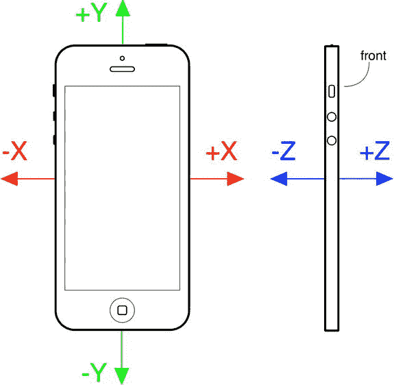
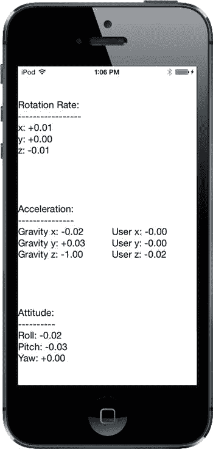
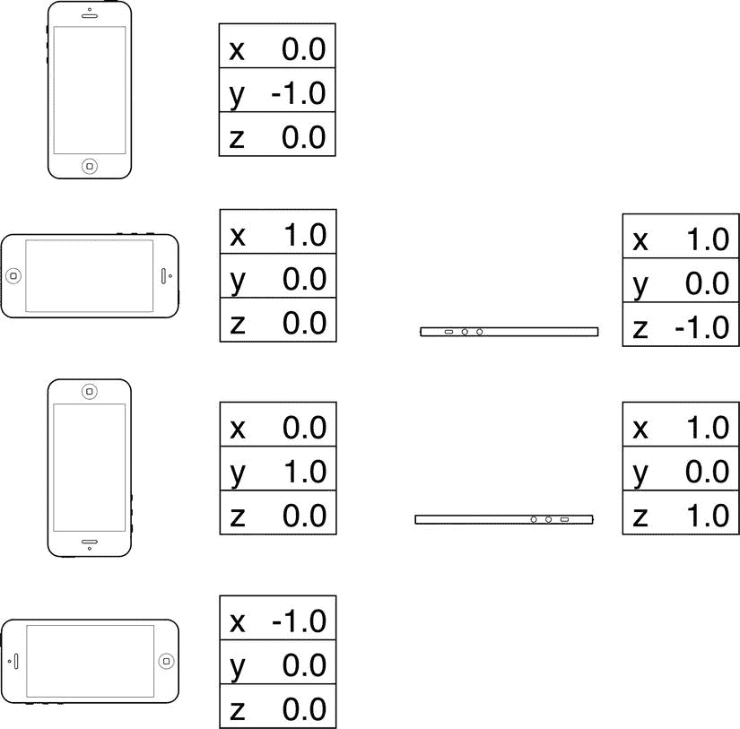
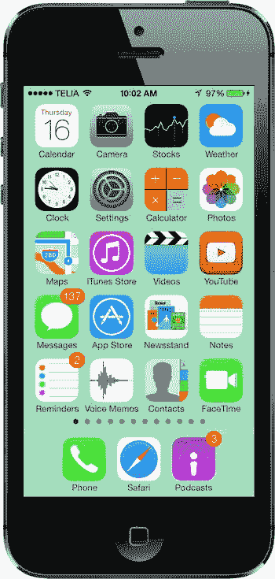
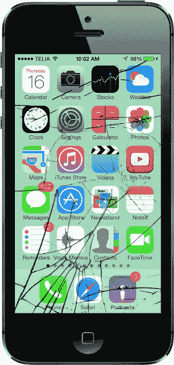
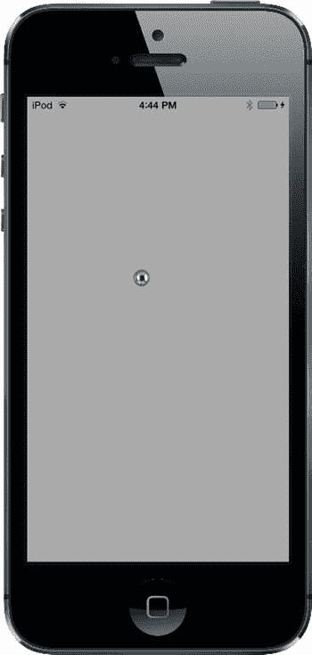

# 第 20 章：哇塞！陀螺仪与加速计！

iPhone、iPad 和 iPod touch 最酷的功能之一就是内置的加速计——这个微小的设备能让 iOS 知道设备是如何被握持的，以及它是否在移动。iOS 使用加速计来处理自动旋转，许多游戏也将其用作控制机制。加速计还可以用来检测摇晃和其他突发移动。iPhone 4 的推出进一步扩展了这一能力，它是第一款包含内置陀螺仪的 iPhone，让开发者能够确定设备围绕每个轴的角度。现在，陀螺仪和加速计已成为所有新款 iPad 和 iPod touch 的标准配置。在本章中，我们将向你介绍如何使用 Core Motion（核心运动）框架在应用中访问陀螺仪和加速计的值。

## 加速计物理原理

加速计通过感应给定方向上的惯性力来测量加速度和重力。你的 iOS 设备中的加速计是一个三轴加速计。这意味着它能够检测三维空间中的运动或重力拉力。换句话说，你不仅可以使用加速计来发现设备当前是如何被握持的（就像自动旋转那样），还能了解它是否平放在桌子上，甚至判断它是屏幕朝下还是屏幕朝上。

加速计以 g 力（*g* 代表重力）为单位进行测量，因此加速计返回的 1.0 值意味着在特定方向上感应到了 1 g 的力，示例如下：

*   如果设备静止不动，地球引力会对其施加大约 1 g 的力。
*   如果设备以竖屏方向被完美地垂直握持，它会检测到并报告大约 1 g 的力施加在其 y 轴上。
*   如果设备以一定角度被握持，这 1 g 的力会根据握持方式分布到不同的轴上。当以 45 度角握持时，这 1 g 的力将大致平均分配到两个轴上。


通过检测远大于 1 g 的加速度计值，可以判断设备的突然运动。在正常使用中，加速度计在任何轴向上都不会检测到显著超过 1 g 的值。如果你摇晃、掉落或抛掷设备，加速度计将会在一个或多个轴向上检测到更大的力。（请不要真的掉落或抛掷你自己的 iOS 设备来测试这一理论，除非你正想找个借口升级到最新款！）

图 20-1 展示了加速度计所使用的三个轴。请注意，加速度计使用了更标准的 y 坐标约定，即 y 值增加表示向上的力，这与 Quartz 2D 的坐标系（参见第 16 章）相反。当你在 Quartz 2D 中将加速度计用作控制机制时，需要转换 y 坐标。而当与 Sprite Kit 配合使用时（这在利用加速度计控制动画时更为常见），则无需进行转换。



图 20-1. iPhone 加速度计的三维轴。左侧的 iPhone 正面视图显示了 x 轴和 y 轴。右侧的侧视图显示了 z 轴。

**别忘记旋转**

我们之前提到，所有当前设备都包含一个陀螺仪传感器，允许你读取描述设备绕其轴旋转的值。

如果陀螺仪和加速度计之间的区别让你感到模糊，不妨想象一部 iPhone 平放在桌子上。当你开始旋转平放的手机时，加速度计的值不会发生变化。这是因为促使手机移动的力——在这种情况下，仅仅是沿 z 轴垂直向下的重力——没有改变。（实际上，情况比这更复杂一些，你手部撞击手机的动作肯定会触发小幅度的加速度计响应。）然而，在同样的旋转过程中，设备的旋转值会发生变化——特别是 z 轴旋转值。顺时针旋转设备会生成负值，逆时针旋转则生成正值。停止旋转后，z 轴旋转值将回到零。

陀螺仪并非记录绝对的旋转值，而是告诉你设备旋转的实时变化。你将在本章的第一个示例中了解其工作原理，稍后将会呈现。

**核心运动与运动管理器**

加速度计和陀螺仪的值通过 Core Motion 框架访问。该框架提供了`CMMotionManager`类，它充当了描述用户如何移动设备的所有值的网关。你的应用创建一个`CMMotionManager`实例，然后以两种模式之一使用它：

*  它可以在运动发生时为你执行一些代码。
*  它可以持有一个持续更新的结构，让你能够随时访问最新的值。

后一种方法非常适合游戏和其他高度交互的应用，这些应用需要在每个游戏循环周期中轮询设备的当前状态。我们将展示如何实现这两种方法。

请注意，`CMMotionManager`类实际上并非单例，但你的应用应将其视为单例。每个应用只应使用标准的`alloc`和`init`方法创建一个此类实例。因此，如果你需要从应用中的多个位置访问运动管理器，最好在应用委托中创建它，并从那里提供访问。

除了`CMMotionManager`类，Core Motion 还提供了其他一些类，例如`CMAccelerometerData`和`CMGyroData`，它们是简单的容器，你的应用可以通过它们访问原始的加速度计和陀螺仪信息；以及`CMDeviceMotion`类，它将加速度计和陀螺仪测量值与姿态信息相结合——即设备是平放、向上倾斜、向左倾斜等等。在本章的示例中，我们将使用`CMDeviceMotion`类。

**基于事件的运动**

我们提到过，运动管理器可以在一种模式下运行，即每次运动数据变化时为你执行一些代码。大多数其他 Cocoa Touch 类通过让你连接到委托，在时机到来时接收消息来提供这种功能，但 Core Motion 的做法略有不同。

`CMMotionManager`没有使用一组委托方法来通知我们发生的事件，而是允许你传入一个在运动发生时执行的 block。我们在本书中已经多次使用过 block，现在你将看到此技术的另一种应用。

使用 Xcode 创建一个名为`MotionMonitor`的新 Single View Application 项目。这将是一个简单的应用，它会读取加速度计数据、陀螺仪数据（如果可用）以及姿态信息，并在屏幕上显示这些信息。

**注意** 本章中的应用无法在模拟器上运行，因为模拟器没有加速度计。哎呀，真可惜。

现在选择`ViewController.m`文件，并进行以下更改：

```objectivec
#import "ViewController.h"

@interface ViewController ()

@property (weak, nonatomic) IBOutlet UILabel *gyroscopeLabel;
@property (weak, nonatomic) IBOutlet UILabel *accelerometerLabel;
@property (weak, nonatomic) IBOutlet UILabel *attitudeLabel;

@end
```

这为我们提供了三个标签的出口，我们将在其中显示信息。这里无需过多解释，只需保存你的更改即可。

接下来，在 Interface Builder 中打开`Main.storyboard`。在文档概览中，展开视图控制器并将其视图重命名为`Main View`。现在从库中拖出一个`Label`到视图中。调整标签大小，使其从屏幕左侧延伸到右侧，高度约为整个视图的三分之一，然后将标签顶部对齐到顶部蓝色参考线。现在打开属性检查器，将 Lines 字段从`1`改为`0`。Lines 属性用于指定标签中可能出现的文本行数，并提供了一个硬性上限。如果将其设置为 0，则不应用限制，标签可以包含任意多行文本。

接下来，从库中拖出第二个标签，直接放在第一个标签下方。将其顶部与第一个标签的底部对齐，左右两侧与屏幕的左右边缘对齐。将其大小调整为与第一个标签大致相同的高度。我们不需要对此过于精确，因为我们将使用自动布局来控制标签的最终高度。拖出第三个标签，将其顶部边缘与第二个标签的底部边缘对齐，然后调整其大小，使其底部边缘与屏幕底部边缘对齐，并将其左右两侧与屏幕的左右边缘对齐。将两个标签的 Lines 属性都设置为 0。


现在让我们修复这三个标签的位置和大小。在文档概览中，从顶部标签按住 Control 键拖拽到主视图然后释放鼠标。在上下文菜单中，按住`Shift`键并选择`Leading Space to Container Margin`、`Top Space to Top Layout Guide`和`Trailing Space to Container Margin`，然后用鼠标点击上下文菜单外部。从第二个标签按住 Control 键拖拽到主视图，在上下文菜单中按住`Shift`键并选择`Leading Space to Container Margin`和`Trailing Space to Container Margin`，然后用鼠标点击上下文菜单外部。从第三个标签按住 Control 键拖拽到主视图，这次按住`Shift`键选择`Leading Space to Container Margin`、`Bottom Space to Bottom Layout Guide`和`Trailing Space to Container Margin`。

现在所有三个标签都固定到了主视图的边缘，让我们将它们相互连接起来。从第二个标签按住 Control 键拖拽到第一个标签，并从弹出菜单中选择`Vertical Spacing`。从第二个标签按住 Control 键拖拽到第三个标签，执行相同操作。最后，我们需要确保这些标签具有相同的高度。为此，按住`Shift`键并点击所有三个标签使它们全部被选中。点击`Pin`按钮，在弹出的窗口中勾选`Equal Heights`复选框并按下`Add 2 Constraints`。点击`Resolve Auto Layout Issues`按钮，然后点击`Update All Frames in View Controller`。如果该选项不可用，请选择文档概览中的`View Controller`图标并重试。

布局完成；现在让我们将标签连接到它们的出口。在辅助编辑器中打开`ViewController.m`，然后从顶部标签按住 Control 键拖拽到`gyroscopeLabel`并连接出口。对第二个标签执行相同操作，将其连接到`accelerometerLabel`，第三个标签应连接到`attituteLabel`。最后，双击每个标签并删除现有文本。

这个简单的 GUI 就完成了，所以保存你的工作并准备开始编码。

接下来，选择`ViewController.m`。现在进入有趣的部分。添加以下内容：

```objectivec
#import "ViewController.h"
#import <CoreMotion/CoreMotion.h>

@interface ViewController ()

@property (weak, nonatomic) IBOutlet UILabel *gyroscopeLabel;
@property (weak, nonatomic) IBOutlet UILabel *accelerometerLabel;
@property (weak, nonatomic) IBOutlet UILabel *attitudeLabel;

@property (retain, nonatomic) CMMotionManager *motionManager;
@property (retain, nonatomic) NSOperationQueue *queue;

@end

@implementation ViewController

- (void)viewDidLoad
{
    [super viewDidLoad];
    // Do any additional setup after loading the view, typically from a nib.

    self.motionManager = [[CMMotionManager alloc] init];
    self.queue = [[NSOperationQueue alloc] init];
    if (self.motionManager.deviceMotionAvailable) {
        self.motionManager.deviceMotionUpdateInterval = 0.1;
        [self.motionManager startDeviceMotionUpdatesToQueue:self.queue
                                          withHandler:^(CMDeviceMotion *motion, NSError *error) {
            CMRotationRate rotationRate = motion.rotationRate;
            CMAcceleration gravity = motion.gravity;
            CMAcceleration userAcc = motion.userAcceleration;
            CMAttitude *attitude = motion.attitude;

            NSString *gyroscopeText = [NSString stringWithFormat:
                                      @"Rotation Rate:\n-----------------\n"
                                      "x: %+.2f\ny: %+.2f\nz: %+.2f\n",
                                      rotationRate.x, rotationRate.y, rotationRate.z];
            NSString *acceleratorText = [NSString stringWithFormat:
                                        @"Acceleration:\n---------------\n"
                                        "Gravity x: %+.2f\t\tUser x: %+.2f\n"
                                        "Gravity y: %+.2f\t\tUser y: %+.2f\n"
                                        "Gravity z: %+.2f\t\tUser z: %+.2f\n",
                                        gravity.x, userAcc.x, gravity.y,
                                        userAcc.y, gravity.z, userAcc.z];
            NSString *attitudeText = [NSString stringWithFormat:
                                     @"Attitude:\n----------\n"
                                     "Roll: %+.2f\nPitch: %+.2f\nYaw: %+.2f\n",
                                     attitude.roll, attitude.pitch, attitude.yaw];

            dispatch_async(dispatch_get_main_queue(), ^{
                self.gyroscopeLabel.text = gyroscopeText;
                self.accelerometerLabel.text = acceleratorText;
                self.attitudeLabel.text = attitudeText;
            });
        }];
    }
}

- (void)didReceiveMemoryWarning
{
    [super didReceiveMemoryWarning];
    // Dispose of any resources that can be recreated.
}

@end
```

首先，我们导入用于处理 Core Motion 框架的头文件，并向类扩展添加两个额外的属性：

```objectivec
@interface ViewController ()

@property (weak, nonatomic) IBOutlet UILabel *gyroscopeLabel;
@property (weak, nonatomic) IBOutlet UILabel *accelerometerLabel;
@property (weak, nonatomic) IBOutlet UILabel *attitudeLabel;

@property (strong, nonatomic) CMMotionManager *motionManager;
@property (strong, nonatomic) NSOperationQueue *queue;

@end
```

接下来，在`viewDidLoad`方法中，我们添加代码来请求设备运动更新，并在收到陀螺仪、加速度计和姿态读数时更新标签。

得益于 block 的强大功能，这一切都非常简单且连贯。你可以将行为定义在 block 中，从而在配置该行为的同一个方法中看到行为，而不是将部分功能放在代理方法中。让我们稍微解析一下。我们以这段代码开始：

```objectivec
self.motionManager = [[CMMotionManager alloc] init];
self.queue = [[NSOperationQueue alloc] init];
```

这段代码首先创建了一个`CMMotionManager`实例，我们将用它来监控运动事件。然后代码创建了一个操作队列，它只是一个需要完成的工作的容器。

**注意** 运动管理器需要一个队列，每次事件发生时，它会将要完成的工作（由你提供的 block 指定）放入该队列。使用系统的默认队列来实现此目的可能很诱人，但`CMMotionManager`的文档明确警告不要这样做！问题是默认队列最终可能被这些事件塞满，从而难以处理其他关键的系统事件。

下一步是开始请求设备运动更新。我们首先检查设备是否确实具备提供运动信息所需的硬件。迄今为止发布的所有手持 iOS 设备都具备此功能，但检查一下以防未来某些设备不具备是值得的。接下来，我们设置更新之间的时间间隔，以秒为单位。这里，我们要求十分之一秒。请注意，设置此值并不能保证我们以精确的速度接收更新。实际上，该设置是一个上限，指定了运动管理器允许提供的最佳速率。实际上，它的更新频率可能低于此值：

```objectivec
if (self.motionManager.deviceMotionAvailable) {
    self.motionManager.deviceMotionUpdateInterval = 0.1;
```


接下来，我们让运动管理器开始报告设备运动更新。我们传入一个块，定义每次更新发生时需要执行的工作，以及该块将入队执行的队列。请记住，块总是以脱字符号（`^`）开头，随后是由括号包裹的参数列表，这些参数是块在执行时预期接收的（本例中是一个包含最新运动数据的 `CMDeviceMotion` 对象和可能用于提醒我们出错的错误信息），最后以包含待执行代码的花括号部分结尾：

```
self.motionManager startDeviceMotionUpdatesToQueue:self.queue
    withHandler:^(CMDeviceMotion *motion, NSError *error) {
```

接下来是块的内容。它根据当前运动值创建字符串，并将其推送到标签中。我们不能直接在这里操作，因为像 `UILabel` 这样的 UIKit 类通常只在主线程访问时才能正常工作。由于这段代码的执行方式——位于一个 `NSOperationQueue` 中——我们根本不知道具体在哪个线程上执行。因此，我们使用 `dispatch_async()` 函数将控制权传递给主线程，然后再设置标签的 `text` 属性。

陀螺仪值通过传入块的 `CMDeviceMotion` 对象的 `rotationRate` 属性进行访问。`rotationRate` 属性的类型是 `CMRotationRate`，它是一个包含三个 `float` 值的简单 `struct`，分别表示围绕 x、y 和 z 轴的旋转速率。加速度计数据稍微复杂一些，因为 Core Motion 报告两个不同的值——重力加速度和用户施加力引起的额外加速度。你可以从 `gravity` 和 `userAcceleration` 属性获取这些值，这两个属性的类型都是 `CMAcceleration`。`CMAcceleration` 是另一个简单的 `struct`，包含沿 x、y 和 z 轴的加速度。最后，设备姿态在 `attitude` 属性中报告，其类型为 `CMAttitude`。我们将在运行应用程序时进一步讨论这个问题。

在尝试运行应用程序之前，还有一件事需要做。我们将以各种方式移动和旋转设备，观察 `CMDeviceMotion` 结构中的值如何与设备实际发生的变化相关联。在此过程中，我们不希望自动旋转被触发。为防止这种情况，请在项目导航器中选择项目，选择 *MotionMonitor* 目标，然后选择 *General* 选项卡。在 Deployment Info 部分的 Device Orientation 区域中，选择 *Portrait*，并确保其他三个方向未被选中。这样就将应用程序锁定为仅竖屏方向。

现在，在你拥有的任何 iOS 设备上构建并运行你的应用程序，然后尝试一下（参见[图 20-2）。



图 20-2。在 iPhone 上运行的 MotionMonitor。遗憾的是，如果你在模拟器中运行此应用，将不会获得任何有用信息

当你以不同方式倾斜设备时，你会看到旋转速率、加速度计和姿态值如何适应每个新位置，并且只要保持设备静止，这些值就会保持稳定。当设备静止不动时，无论处于哪种方向，旋转值都会接近零。当你旋转设备时，你会看到旋转值根据你绕不同轴旋转的方式而变化。当你停止移动设备时，这些值总会回到零。我们稍后将更仔细地审视所有结果。

## 主动运动访问

你已经了解了如何通过向 `CMMotionManager` 传递块，使其在运动发生时被调用来访问运动数据。这种事件驱动的运动处理方式对于普通的 Cocoa 应用来说已经足够，但有时它并不完全符合应用的特定需求。例如，交互式游戏通常有一个永不停歇的运行循环，用于处理用户输入、更新游戏状态和重绘屏幕。在这种情况下，事件驱动的方法并不太合适，因为你需要实现一个对象来等待运动事件，记住每个传感器报告的最新位置，并在需要时准备将数据返回给主游戏循环。

幸运的是，`CMMotionManager` 内置了一个解决方案。我们可以不传递块，而是直接告诉它使用 `startDeviceMotionUpdates` 方法激活传感器。一旦这样做，我们就可以随时直接从运动管理器读取这些值！

让我们修改 MotionMonitor 应用以使用这种方法，这样你就能看到它的工作原理。首先，复制你的 *MotionMonitor* 项目文件夹。

**注意** 在示例源代码的 *20 – MonitorMotion2* 文件夹中，你可以找到该项目的完整版本。

关闭打开的 Xcode 项目，转而打开新副本中的项目，直接进入 *ViewController.m*。第一步是删除队列属性，并添加一个新属性，一个指向 `NSTimer` 的指针，该定时器将触发所有显示更新：

```
#import "ViewController.h"
#import <CoreMotion/CoreMotion.h>

@interface ViewController ()

@property (weak, nonatomic) IBOutlet UILabel *gyroscopeLabel;
@property (weak, nonatomic) IBOutlet UILabel *accelerometerLabel;
@property (weak, nonatomic) IBOutlet UILabel *attitudeLabel;

@property (strong, nonatomic) CMMotionManager *motionManager;
@property (strong, nonatomic) NSOperationQueue *queue;
@property (strong, nonatomic) NSTimer *updateTimer;

@end
```

接下来，删除之前的大部分 `viewDidLoad` 方法，并用这个更简单的版本替换：

```
- (void)viewDidLoad
{
    [super viewDidLoad];
    // Do any additional setup after loading the view, typically from a nib.
    self.motionManager = [[CMMotionManager alloc] init];
}
```

我们将使用一个定时器，每十分之一秒直接从运动管理器收集运动数据，而不是将其传递给代码块。我们希望定时器——以及运动管理器本身——仅在视图实际显示的一个小时间窗口内保持活动。这样，我们就可以将主游戏循环的使用率降至最低。我们可以通过实现 `viewWillAppear:` 和 `viewDidDisappear:` 方法来实现这一点，如下所示：

```
- (void)viewWillAppear:(BOOL)animated {
    [super viewWillAppear:animated];
    if (self.motionManager.deviceMotionAvailable) {
        self.motionManager.deviceMotionUpdateInterval = 0.1;
        [self.motionManager startDeviceMotionUpdates];
        self.updateTimer = [NSTimer
                        scheduledTimerWithTimeInterval:0.1
                        target:self
                        selector:@selector(updateDisplay)
                        userInfo:nil
                        repeats:YES];
    }
}

- (void)viewDidDisappear:(BOOL)animated {
    [super viewDidDisappear:animated];
    if (self.motionManager.deviceMotionAvailable) {
        [self.motionManager stopDeviceMotionUpdates];
        [self.updateTimer invalidate];
        self.updateTimer = nil;
    }
}
```

`viewWillAppear:` 中的代码调用运动管理器的 `startDeviceMotionUpdates` 方法来启动设备运动信息的获取，然后创建一个新的定时器，并安排它每十分之一秒触发一次，调用我们尚未创建的 `updateDisplay` 方法。将此方法添加到 `viewDidDisappear` 下方：


```objc
- (void)updateDisplay {
    CMDeviceMotion *motion = self.motionManager.deviceMotion;
    if (motion != nil) {
        CMRotationRate rotationRate = motion.rotationRate;
        CMAcceleration gravity = motion.gravity;
        CMAcceleration userAcc = motion.userAcceleration;
        CMAttitude *attitude = motion.attitude;

        NSString *gyroscopeText = [NSString stringWithFormat:
                                   @"Rotation Rate:\n-----------------\n"
                                   "x: %+.2f\ny: %+.2f\nz: %+.2f\n",
                                   rotationRate.x, rotationRate.y, rotationRate.z];
        NSString *acceleratorText = [NSString stringWithFormat:
                                     @"Acceleration:\n---------------\n"
                                     "Gravity x: %+.2f\t\tUser x: %+.2f\n"
                                     "Gravity y: %+.2f\t\tUser y: %+.2f\n"
                                     "Gravity z: %+.2f\t\tUser z: %+.2f\n",
                                     gravity.x, userAcc.x, gravity.y,
                                     userAcc.y, gravity.z, userAcc.z];
        NSString *attitudeText = [NSString stringWithFormat:
                                  @"Attitude:\n----------\n"
                                  "Roll: %+.2f\nPitch: %+.2f\nYaw: %+.2f\n",
                                  attitude.roll, attitude.pitch, attitude.yaw];

        dispatch_async(dispatch_get_main_queue(), ^{
            self.gyroscopeLabel.text = gyroscopeText;
            self.accelerometerLabel.text = acceleratorText;
            self.attitudeLabel.text = attitudeText;
        });
    }
}
```

这段代码是此示例前一版本中闭包的复制，区别在于 `CMDeviceMotion` 对象直接通过运动管理器获取。请注意对 `nil` 的检查；这是必需的，因为定时器可能在运动管理器获取到第一个数据样本之前触发。

在您的设备上构建并运行该应用，您会发现其行为与第一个版本完全一致。现在您已经了解了访问运动数据的两种方法。请根据您的应用需求选择最合适的一种。

## 陀螺仪与姿态结果

陀螺仪测量设备绕 x、y、z 轴旋转的速率。请参考图 20-1 了解这些轴与设备机身的对应关系。首先，将设备平放在桌面上。当它静止不动时，所有三个旋转速率都将接近零，您会看到横滚角（roll）、俯仰角（pitch）和偏航角（yaw）的值也接近零。现在，轻轻顺时针旋转设备。在旋转过程中，您会发现绕 z 轴的旋转速率变为负值。旋转速度越快，旋转速率的绝对值就越大。当您停止旋转时，旋转速率会归零，但偏航角不会。偏航角表示设备从初始静止位置绕 z 轴旋转过的角度。如果您顺时针旋转设备，偏航角将沿负值方向增加，直到设备相对于静止位置旋转了 180°，此时其值约为 -3。如果继续顺时针旋转设备，偏航角会跳变为略大于 +3 的值，然后在您将其转回初始位置时减小到零。如果从逆时针旋转开始，情况类似，只是偏航角初始为正值。偏航角实际上以弧度为单位，而非角度。旋转 180° 相当于旋转 `π` 弧度，这就是为什么偏航角的最大值约为 3（因为 `π` 略大于 3.14）。

再次将设备平放在桌面上，握住顶部边缘并向上旋转，使底部留在桌面上。这是绕 x 轴的旋转，因此您会看到 x 轴旋转速率沿正值方向增加，直到您稳住设备，然后其值归零。现在观察俯仰角的值。它已经增加了，增加量取决于您抬起设备顶部边缘的角度。如果将设备完全抬至垂直位置，俯仰角的值将约为 1.5。与偏航角一样，俯仰角也以弧度为单位。因此，当设备垂直时，它旋转了 90°，即 `π/2` 弧度，略大于 1.5。如果再次将设备放平并重复上述操作——但这次抬起底部边缘，让顶部留在桌面上，您就是在进行绕 x 轴的逆时针旋转，会看到负的旋转速率和负的俯仰角。

最后，再次将设备平放于桌面，抬起其左侧边缘，让右侧边缘留在桌面上。这是绕 y 轴的旋转，您会看到这反映在 y 轴旋转速率上。您可以从横滚角的值中获知任意时刻的总旋转角度。当设备在其右侧边缘上直立时，该值约为 1.5（实际上是 `π/2`）弧度；如果您将设备翻转为屏幕朝下，该值会一直增加到 `π` 弧度；当然，您需要一个玻璃桌面才能观察到这一点。

总之，使用旋转速率来了解设备绕各轴旋转的快慢，使用偏航角、俯仰角和横滚角的值来获取设备从初始方向开始，绕这些轴当前的旋转总量。

## 加速度计结果

我们之前提到，iPhone 的加速度计检测沿三个轴的加速度，并通过两个 `CMAcceleration struct` 提供此信息。每个 `CMAcceleration` 都包含 `x`、`y` 和 `z` 三个字段，每个字段都保存一个浮点值。值为 `0` 表示加速度计检测到该特定轴没有运动。正值或负值表示作用于某个方向的力。例如，`y` 的负值表示检测到向下的拉力，这可能表明手机正以竖屏方向直立放置。`y` 的正值表示存在施加于相反方向的力，这可能意味着手机正在倒置，或者手机正在向下移动。`CMDeviceMotion` 对象分别报告了由于重力以及用户施加的任何额外力导致的沿各轴的加速度。例如，如果您将设备平放，会看到重力值沿 z 轴接近 -1，而用户加速度分量都接近零。现在，如果您快速提升设备并保持其水平，您会发现重力值基本保持不变，但沿 z 轴出现了正向的用户加速度。对于某些应用，区分重力值和用户加速度值很有用；而对于其他应用，您可能需要总加速度，可以通过将 `CMDeviceMotion` 对象的 `gravity` 和 `userAcceleration` 属性的分量相加得到。

铭记图 20-1 中的图示，让我们来看一些加速度计的结果（参见图 20-3）。该图显示了当设备处于给定姿态且静止不动时，报告的重力加速度。请注意，在现实生活中，您几乎永远无法获得如此精确的值，因为加速度计非常灵敏，足以感知到即使是非常微小的运动，并且您通常会在三个轴上至少检测到一些微小的力。这是现实世界的物理学，而不是高中物理。



图 20-3. 不同设备方向下的理想化重力加速度值


### 检测摇晃

加速度计在第三方应用中最常见的用途可能是作为游戏控制器。本章稍后我们将创建一个使用加速度计进行输入的程序，但首先来看看加速度计的另一个常见用途：检测摇晃。

如同手势一样，摇晃也可以作为向应用输入的一种形式。例如，绘画程序 `GLPaint`（苹果 iOS 示例代码项目之一）允许用户通过摇晃 iOS 设备来擦除图画，有点像画板。

检测摇晃相对简单。只需检查用户加速度在某个轴上的绝对值是否大于设定的阈值。在正常使用过程中，三个轴之一达到约 1.3 g 的值并不罕见，但要让数值远高于该值通常需要有意识地施加力。加速度计似乎无法记录高于约 2.3 g 的值（至少根据我们的经验），因此阈值不要设置得比这个更高。

要检测摇晃，你可以通过向 `MotionMonitor` 示例的运动管理器回调块中添加如下代码，来检查绝对值是否大于 1.5（轻微摇晃）或 2.0（剧烈摇晃）：

```
CMAcceleration userAcc = motion.userAcceleration;
if (fabsf(userAcc.x) > 2.0
       || fabsf(userAcc.y) > 2.0
       || fabsf(userAcc.z) > 2.0) {
    // 在此处执行某些操作...
}
```

这段代码会检测任何轴上超过 2 个 g 力的运动。

### 内置摇晃检测

实际上还有另一种更简单的检测摇晃的方法——该方法直接内置于响应者链中。还记得第 18 章中我们实现 `touchesBegan:withEvent:` 等方法来检测触摸吗？iOS 同样提供了三种类似的响应者方法来检测运动：

- 当运动开始时，`motionBegan:withEvent:` 方法会被发送到第一响应者，然后沿响应者链传递，如第 18 章所述。
- 当运动结束时，`motionEnded:withEvent:` 方法会被发送到第一响应者。
- 如果在摇晃过程中有电话响起或其他中断事件发生，`motionCancelled:withEvent:` 消息会被发送到第一响应者。

这些方法中的第一个参数是事件子类型，其中之一是 `UIEventSubtypeMotionShake`。这意味着你实际上无需直接使用 `CMMotionManager` 就能检测摇晃。你只需在视图或视图控制器中重写相应的运动检测方法，当用户摇晃手机时，这些方法会被自动调用。除非你特别需要更精细地控制摇晃手势，否则应使用内置的运动检测，而非前面描述的手动方法。不过，我们觉得还是应该向你展示手动方法的基本原理，以便在你确实需要更多控制时使用。

既然你已经了解了检测摇晃的基本概念，接下来我们要让你的手机“破碎”。

### 摇晃即破碎

好吧，我们并不是真的要弄坏你的手机，而是要编写一个用于检测摇晃的应用，然后让手机看起来、听起来像是因摇晃而破碎。

启动应用后，程序会显示一张类似 iPhone 主屏幕的图片（见图 20-4）。不过，只要足够用力地摇晃手机，你的可怜手机就会发出你永远不想从消费电子产品中听到的声音。更糟的是，你的屏幕会变得像图 20-5 所示那样。我们为什么要做这些坏事？别担心。只需触摸屏幕，就能将 iPhone 恢复到之前完好无损的状态。



图 20-4. `ShakeAndBreak` 应用看起来人畜无害……



图 20-5. ……但操作过于粗暴的话——哦不！

使用 Single View Application 模板在 Xcode 中创建一个新项目。确保设备类型设置为 *iPhone*——与本书中的大多数其他示例不同，此示例仅适用于 iPhone，因为图片尺寸适合 iPhone 5 屏幕。当然，如果你创建额外的图片，也很容易将此项目扩展到 iPad。将新项目命名为 *ShakeAndBreak*。在示例源代码的 *20 – Images and Sounds* 文件夹中，我们提供了本应用所需的两个图片文件和一个声音文件。在 `Images.xcassets` 中，创建一个名为 *home* 的图片集，并将 `home.png` 拖入其中；然后创建另一个名为 *homebroken* 的图片集，并将 `homebroken.png` 拖入其中。将 `glass.wav` 拖入项目。

现在开始创建视图控制器。我们需要创建一个指向图片视图的出口，以便能够更改显示的图片。单击 `ViewController.m`，在类扩展中添加以下属性声明：

```
#import "ViewController.h"

@interface ViewController ()

@property (weak, nonatomic) IBOutlet UIImageView *imageView;

@end
```

保存文件。现在选择 `Main.storyboard` 在 Interface Builder 中编辑文件，然后从库中拖入一个 *Image View* 到布局区域的视图上。图片视图应自动调整大小以占满整个窗口，因此只需将其完美放置在窗口内即可。在文档大纲中，按住 Control 键从 Image View 拖到其父视图，按住 *Shift* 键，在上下文菜单中选择 *Leading Space to Container Margin*、*Trailing Space to Container Margin*、*Top Space to Top Layout Guide* 和 *Bottom Space to Bottom Layout Guide*，然后点击上下文菜单外部以锁定图片视图的尺寸和位置。最后，按住 Control 键从 *View Controller* 图标拖到 *image view* 并选择 `imageView` 出口，然后保存 storyboard。

接下来，返回 `ViewController.m` 文件。我们将为要显示的两个图片添加一些额外的属性，以跟踪是否正在显示破碎图片。另外还要添加一个音频播放器对象，用于播放破碎玻璃的声音。以下粗体行位于文件顶部附近：

```
#import "ViewController.h"
#import <AVFoundation/AVFoundation.h>

@interface ViewController ()

@property (weak, nonatomic) IBOutlet UIImageView *imageView;
@property (strong, nonatomic) UIImage *fixed;
@property (strong, nonatomic) UIImage *broken;
@property (assign, nonatomic) BOOL brokenScreenShowing;
@property (strong, nonatomic) AVAudioPlayer *crashPlayer;

@end
```

将以下代码添加到 `viewDidLoad` 方法中：

```
@implementation ViewController

- (void)viewDidLoad
{
    [super viewDidLoad];
    // 加载视图后的额外设置（通常来自 nib 文件）

    NSURL *url = [[NSBundle mainBundle] URLForResource:@"glass"
                                         withExtension:@"wav"];

    NSError *error = nil;
    self.crashPlayer = [[AVAudioPlayer alloc] initWithContentsOfURL:url
                                                              error:&error];
    if (!self.crashPlayer) {
        NSLog(@"音频错误！%@", error.localizedDescription);
    }

    self.fixed = [UIImage imageNamed:@"home"];
    self.broken = [UIImage imageNamed:@"homebroken"];

    self.imageView.image = self.fixed;
}
```

至此，我们创建了一个指向声音文件的 `NSURL` 对象，并初始化了 `AVAudioPlayer` 实例——该类将简单播放声音。经过快速检查确保音频播放器设置正确后，我们加载了两个需要使用的图片，并将第一个图片放置到位。接下来，添加以下新方法：


```objc
- (void)motionEnded:(UIEventSubtype)motion withEvent:(UIEvent *)event {
    if (!self.brokenScreenShowing && motion == UIEventSubtypeMotionShake) {
        self.imageView.image = self.broken;
        [self.crashPlayer play];
        self.brokenScreenShowing = YES;
    }
}
```

每当发生摇动时，就会调用此方法。在确认碎屏效果尚未显示且当前事件确实是摇动事件后，该方法会显示碎裂图像并播放碎裂音效。

最后一个方法你应该已经熟悉了。当屏幕被触摸时会调用该方法。我们只需在该方法中将图像重置为未碎裂的屏幕，并将 `brokenScreenShowing` 设置为 `NO`：

```objc
- (void)touchesBegan:(NSSet *)touches withEvent:(UIEvent *)event {
    self.imageView.image = self.fixed;
    self.brokenScreenShowing = NO;
}
```

编译并运行应用程序，然后进行摇动测试。对于无法在 iOS 设备上运行此应用的用户，你仍然可以尝试。模拟器虽然不能模拟加速度计硬件，但包含一个模拟摇动事件的菜单项，因此该功能在模拟器上同样有效。

尽情体验吧。完成后请返回，你将学习如何将加速度计用作游戏及其他程序的控制器。

## 加速度计作为方向控制器

在游戏中，开发者通常不使用按钮控制角色或物体的移动，而是利用加速度计完成此任务。例如，在赛车游戏中，像转动方向盘一样扭转 iOS 设备可以控制转向，前倾设备可加速，后仰则可刹车。

将加速度计用作控制器的具体方式会因游戏机制的不同而有很大差异。在最简单的情况下，你可能只需获取某个轴的值，乘以一个系数，然后加到被控对象的某个坐标上。在物理模拟更逼真的复杂游戏中，则需要根据加速度计返回的值调整被控对象的速度。

将加速度计用作控制器的一个棘手之处在于：委托方法无法保证按照你指定的时间间隔回调。如果告诉运动管理器每秒读取加速度计 60 次，你能确定的只是它不会超过每秒 60 次更新，但不能保证每秒能获得 60 次均匀间隔的更新。因此，如果基于加速度计输入进行动画处理，必须记录两次更新之间的时间间隔，并将其纳入方程中，以确定物体的移动距离。

### 滚动弹珠

接下来这个例子中，我们将通过倾斜手机让精灵在 iPhone 屏幕上移动。这是一个使用加速度计接收输入的简单示例，我们将使用 Quartz 2D 处理动画。

**注意**：通常，在处理需要流畅动画的游戏或其他程序时，你可能会想使用 Sprite Kit 或 OpenGL ES。本例中使用 Quartz 2D 是为了简化代码，减少与加速度计使用无关的代码量。

在本应用中，当你倾斜 iPhone 时，弹珠会像在桌面上一样滚动（见图 20-6）。向左倾斜，弹珠会向左滚动；倾斜幅度越大，滚动速度越快；向后倾斜，弹珠会减速并开始向反方向移动。



图 20-6。Ball 应用让你在屏幕上滚动弹珠

在 Xcode 中，使用"单视图应用"模板创建一个新项目。将设备类型设为 *Universal*，项目命名为 *Ball*。在示例源码的 *20 – Images and Sounds* 文件夹中，你会找到一个名为 *ball.png* 的图片。在 *Images.xcassets* 中创建一个名为 *ball* 的图片集，并将 *ball.png* 拖入其中。

接下来，在项目导航器中选中 Ball 项目，然后选择 Ball 目标的 *General* 标签页。在部署信息部分的"设备方向"选项中，仅选中 *Portrait*，取消勾选其他所有复选框（与本章前面处理 MotionMonitor 应用时相同）。这会禁用默认的界面方向变化；我们希望让弹珠滚动，而不是在移动设备时改变界面方向。

现在，单击 *Ball* 文件夹，选择 *File*  *New*  *File*... 在 iOS 部分选择 *Cocoa Touch Class*，点击 *Next*。将新类设为 `UIView` 的子类，命名为 *BallView*，然后点击 *Create*。稍后我们会回来编辑这个类。

选择 *Main.storyboard* 在 Interface Builder 中编辑文件。单击 *View* 图标，使用标识检查器将视图的类从 *UIView* 改为 *BallView*。接着，切换到属性检查器，将视图的 *Background* 改为 *Light Gray Color*。最后，保存故事板。

现在开始编辑 *ViewController.m*。在文件顶部添加以下行：

```objc
#import "ViewController.h"
#import "BallView.h"
#import <CoreMotion/CoreMotion.h>

#define kUpdateInterval    (1.0f / 60.0f)

@interface ViewController ()
@property (strong, nonatomic) CMMotionManager *motionManager;
@property (strong, nonatomic) NSOperationQueue *queue;
@end

@implementation ViewController
```

接下来，用以下代码填充 `viewDidLoad`：

```objc
- (void)viewDidLoad
{
    [super viewDidLoad];
    // 加载视图后的其他设置（通常来自 nib 文件）
    self.motionManager = [[CMMotionManager alloc] init];
    self.queue = [[NSOperationQueue alloc] init];
    self.motionManager.deviceMotionUpdateInterval = kUpdateInterval;
    __weak ViewController *weakSelf = self;
    [self.motionManager startDeviceMotionUpdatesToQueue:self.queue
                      withHandler: ^(CMDeviceMotion *motionData, NSError *error) {
            BallView *ballView = (BallView *)weakSelf.view;
            [ballView setAcceleration:motionData.gravity];
            dispatch_async(dispatch_get_main_queue(), ^{
                [ballView update];
            });
     }];

}
```

**注意**：输入此代码后，由于 `BallView` 尚未完成，你会看到一个错误。我们的大部分工作将在 `BallView` 类中完成，接下来就轮到它了。

这里的 `viewDidLoad` 方法与本章前面的一些实现类似。主要区别在于我们使用了更高的更新间隔（每秒 60 次）。在告诉运动管理器在有加速度计更新时执行的 block 中，我们将加速度对象传递给视图，然后调用名为 `update` 的方法。该方法根据加速度和自上次更新以来经过的时间更新视图中弹珠的位置。由于该 block 可在任何线程上执行，而 UIKit 对象（包括 `UIView`）的方法只能安全地在主线程中使用，因此我们再次强制 `update` 方法在主线程中调用。

### 编写弹珠视图

选择 *BallView.h*。你需要在此导入 Core Motion 头文件，并添加一个属性（供控制器传递加速度值）和一个方法（用于更新弹珠位置）：

```objc
#import <UIKit/UIKit.h>
#import <CoreMotion/CoreMotion.h>

@interface BallView : UIView

@property (assign, nonatomic) CMAcceleration acceleration;

- (void)update;

@end
```

好的，这是根据您的要求翻译的中文版本：


切换到`BallView.m`，并在靠近顶部的位置添加一个带有如下代码的类扩展：

```objc
#import "BallView.h"

@interface BallView ()

@property (strong, nonatomic) UIImage *image;
@property (assign, nonatomic) CGPoint currentPoint;
@property (assign, nonatomic) CGPoint previousPoint;
@property (assign, nonatomic) CGFloat ballXVelocity;
@property (assign, nonatomic) CGFloat ballYVelocity;

@end
```

让我们来看看这些属性，并讨论一下每个属性的作用。第一个属性是一个`UIImage`对象，它将指向我们将在屏幕上移动的精灵图：

```objc
UIImage *image;
```

之后，我们跟踪两个`CGPoint`变量。`currentPoint`属性将保存球的当前位置。我们还会记录上一次绘制精灵图的位置。这样，我们就可以构建一个包含球新旧位置的更新矩形，从而在新位置绘制球并在旧位置擦除它：

```objc
CGPoint currentPoint;
CGPoint previousPoint;
```

我们还有两个变量来跟踪球在二维空间中的当前速度。虽然这不会是一个非常复杂的模拟，但我们希望球的运动方式能够像一个真实的球。我们将在下一节中计算球的运动。我们将从加速度计获取加速度，并通过这两个变量来跟踪两个轴上的速度。

```objc
CGFloat ballXVelocity;
CGFloat ballYVelocity;
```

现在，让我们编写代码来绘制球并使其在屏幕上移动。首先，在`BallView.m`的`@implementation`节的开头添加以下方法：

```objc
@implementation BallView

- (void)commonInit {
    self.image = [UIImage imageNamed:@"ball"];
    self.currentPoint = CGPointMake((self.bounds.size.width / 2.0f) +
                                    (self.image.size.width / 2.0f),
                                    (self.bounds.size.height / 2.0f) +
                                    (self.image.size.height / 2.0f));
}

- (id)initWithCoder:(NSCoder *)coder  {
    self = [super initWithCoder:coder];
    if (self) {
        [self commonInit];
    }
    return self;
}

- (id)initWithFrame:(CGRect)frame {
    self = [super initWithFrame:frame];
    if (self) {
        [self commonInit];
    }
    return self;
}
```

`initWithCoder:`和`initWithFrame:`方法都会调用我们的`commonInit`方法。在 storyboard 文件中创建的视图将通过`initWithCoder:`方法进行初始化。我们从两个初始化方法中都调用了`commonInit`方法，这样我们的视图类就可以安全地从代码和 nib 文件中创建。对于任何可能被重用的视图类（比如这个漂亮的球滚动视图）来说，这都是一件好事。

现在，取消注释被注释掉的`drawRect:`方法，并给出这个简单的实现：

```objc
- (void)drawRect:(CGRect)rect
{
    // Drawing code
    [self.image drawAtPoint:self.currentPoint];
}
```

接下来，将这些方法添加到类的末尾：

```objc
#pragma mark -

- (void)setCurrentPoint:(CGPoint)newPoint {
    self.previousPoint = self.currentPoint;
    _currentPoint = newPoint;

    if (self.currentPoint.x < 0) {
        _currentPoint.x = 0;
        self.ballXVelocity = 0;
    }
    if (self.currentPoint.y < 0){
        _currentPoint.y = 0;
        self.ballYVelocity = 0;
    }
    if (self.currentPoint.x > self.bounds.size.width - self.image.size.width) {
        _currentPoint.x = self.bounds.size.width - self.image.size.width;
        self.ballXVelocity = 0;
    }
    if (self.currentPoint.y >
        self.bounds.size.height - self.image.size.height) {
        _currentPoint.y = self.bounds.size.height - self.image.size.height;
        self.ballYVelocity = 0;
    }

    CGRect currentRect =
        CGRectMake(self.currentPoint.x, self.currentPoint.y,
                   self.currentPoint.x + self.image.size.width,
                   self.currentPoint.y + self.image.size.height);
    CGRect previousRect =
        CGRectMake(self.previousPoint.x, self.previousPoint.y,
                   self.previousPoint.x + self.image.size.width,
                   self.currentPoint.y + self.image.size.width);
    [self setNeedsDisplayInRect:CGRectUnion(currentRect, previousRect)];
}

- (void)update {
    static NSDate *lastUpdateTime = nil;

    if (lastUpdateTime != nil) {
        NSTimeInterval secondsSinceLastDraw =
            [[NSDate date] timeIntervalSinceDate:lastUpdateTime];

        self.ballYVelocity = self.ballYVelocity -
                             (self.acceleration.y * secondsSinceLastDraw);
        self.ballXVelocity = self.ballXVelocity +
                             (self.acceleration.x * secondsSinceLastDraw);

        CGFloat xAccel = secondsSinceLastDraw * self.ballXVelocity * 500;
        CGFloat yAccel = secondsSinceLastDraw * self.ballYVelocity * 500;

        self.currentPoint = CGPointMake(self.currentPoint.x + xAccel,
                                        self.currentPoint.y + yAccel);
    }
    // Update last time with current time
    lastUpdateTime = [[NSDate alloc] init];
}

@end
```

### 计算球的运动

我们的`drawRect:`方法不能再简单了。我们只需在`currentPoint`存储的位置处绘制在`commonInit:`中加载的图像。`currentPoint`访问器是一个标准的访问器方法。然而，`setCurrentPoint:`赋值器又是一个不同的故事。

在`setCurrentPoint:`中，我们首先做的是将旧的`currentPoint`值存储在`previousPoint`中，并将新值赋给`currentPoint`：

```objc
self.previousPoint = self.currentPoint;
self.currentPoint = newPoint;
```

接下来，我们进行边界检查。如果球的`x`或`y`位置小于`0`，或者大于屏幕的宽度或高度（考虑到图像的宽度和高度），那么该方向的加速度就会停止：

```objc
if (self.currentPoint.x < 0) {
    _currentPoint.x = 0;
    self.ballXVelocity = 0;
}
if (self.currentPoint.y < 0){
    _currentPoint.y = 0;
    self.ballYVelocity = 0;
}
if (self.currentPoint.x > self.bounds.size.width - self.image.size.width) {
    _currentPoint.x = self.bounds.size.width - self.image.size.width;
    self.ballXVelocity = 0;
}
if (self.currentPoint.y >
    self.bounds.size.height - self.image.size.height) {
    _currentPoint.y = self.bounds.size.height - self.image.size.height;
    self.ballYVelocity = 0;
}
```

**提示**：你想让球更自然地从墙壁上反弹，而不是仅仅停下来吗？这很容易做到。只需将`setCurrentPoint:`中当前读取为`self.ballXVelocity = 0;`的两行改为`self.ballXVelocity = - (self.ballXVelocity / 2.0);`。并将当前读取为`self.ballYVelocity = 0;`的两行改为`self.ballYVelocity = - (self.ballYVelocity / 2.0);`。通过这些更改，我们不再消除球的速度，而是将其减半并设为反向。现在，球以一半的速度向相反方向移动。

之后，我们根据图像的大小计算两个`CGRect`。一个矩形包含新图像将被绘制的区域，另一个矩形包含它上次被绘制的区域。我们将使用这两个矩形来确保在绘制新球的同时擦除旧球：

```objc
CGRect currentRect =
CGRectMake(self.currentPoint.x, self.currentPoint.y,
           self.currentPoint.x + self.image.size.width,
           self.currentPoint.y + self.image.size.height);
CGRect previousRect =
CGRectMake(self.previousPoint.x, self.previousPoint.y,
           self.previousPoint.x + self.image.size.width,
           self.currentPoint.y + self.image.size.width);
```


最后，我们创建一个新的矩形，它是我们刚刚计算的两个矩形的并集，并将其传递给`setNeedsDisplayInRect:`方法，以指示视图中需要重绘的部分：

```objc
[self setNeedsDisplayInRect:CGRectUnion(currentRect, previousRect)];
```

我们类中最后一个实质性方法是`update`，它用于计算球体正确的新位置。该方法在其控制器类的加速度计方法将新的加速度对象传递给视图后被调用。该方法首先声明一个静态的`NSDate`变量，用于跟踪自上次调用`update`方法以来经过的时间。第一次执行此方法时，`lastUpdateTime`为`nil`，我们不进行任何操作，因为没有参考点。由于更新大约每秒发生 60 次，没有人会注意到单次帧的丢失：

```objc
static NSDate *lastUpdateTime = nil;

if (lastUpdateTime != nil) {
```

在后续每次执行此方法时，我们计算自上次调用以来经过的时间。`[NSDate date]`返回的`NSDate`实例代表当前时间。通过询问它与`lastUpdateDate`之间的时间间隔，我们得到一个表示当前时间与`lastUpdateTime`之间秒数的数值：

```objc
NSTimeInterval secondsSinceLastDraw =
    [[NSDate date] timeIntervalSinceDate:lastUpdateTime];
```

接下来，我们通过将当前加速度加到当前速度上来计算两个方向上的新速度。我们将加速度乘以`secondsSinceLastDraw`，以确保加速度在不同时间保持一致。以相同角度倾斜手机，总会产生相同的加速度量：

```objc
self.ballYVelocity = self.ballYVelocity -
                     (self.acceleration.y * secondsSinceLastDraw);
self.ballXVelocity = self.ballXVelocity +
                     (self.acceleration.x * secondsSinceLastDraw);
```

之后，我们根据速度计算出上次调用方法以来实际的像素变化量。速度与经过时间的乘积再乘以 500，以产生自然的运动效果。如果不乘以某个值，加速度会异常缓慢，仿佛球陷在糖浆里：

```objc
CGFloat xDelta = secondsSinceLastDraw * self.ballXVelocity * 500;
CGFloat yDelta = secondsSinceLastDraw * self.ballYVelocity * 500;
```

一旦我们知道像素变化量，就将当前位置与计算出的加速度相加，创建一个新点，并赋值给`currentPoint`。通过使用`self.currentPoint`，我们调用之前编写的访问器方法，而不是直接将值赋给实例变量：

```objc
self.currentPoint = CGPointMake(self.currentPoint.x + xDelta,
                                self.currentPoint.y + yDelta);
```

计算到此结束，剩下的就是用当前时间更新`lastUpdateTime`：

```objc
lastUpdateTime = [[NSDate alloc] init];
```

在构建应用之前，使用前面提到的技术添加 Core Motion 框架。添加完成后，继续构建并运行应用。

如果一切顺利，应用将启动，你应该能够通过倾斜手机来控制球的移动。当球到达屏幕边缘时，它会停止。将手机向另一方向倾斜，球就会开始向另一方向滚动。哇！

继续滚动

好了，在这一章中，我们通过物理原理以及令人惊叹的 iOS 加速度计和陀螺仪获得了很多乐趣。我们创建了一个很棒的愚人节恶作剧，并且你了解了将加速度计作为控制设备的基础知识。使用加速度计和陀螺仪的应用的可能性几乎和宇宙一样无穷无尽。既然你已经掌握了基础知识，那就去创造一些酷炫的东西，给我们一个惊喜吧！

当你准备好之后，我们将开始使用另一项 iOS 硬件：内置摄像头。

