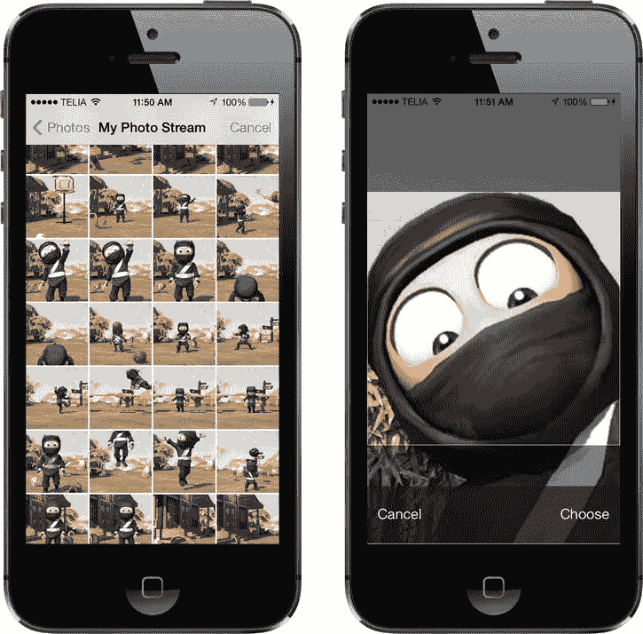
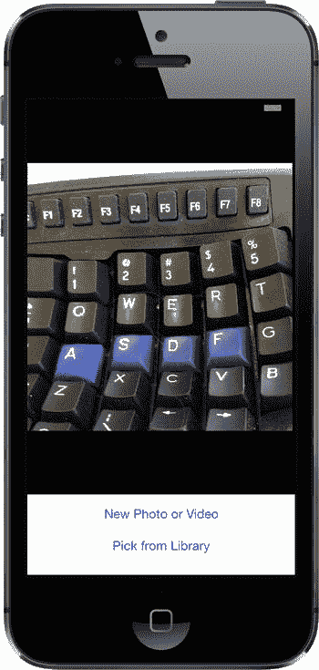
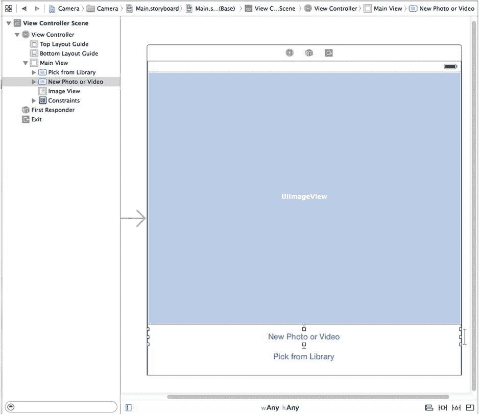
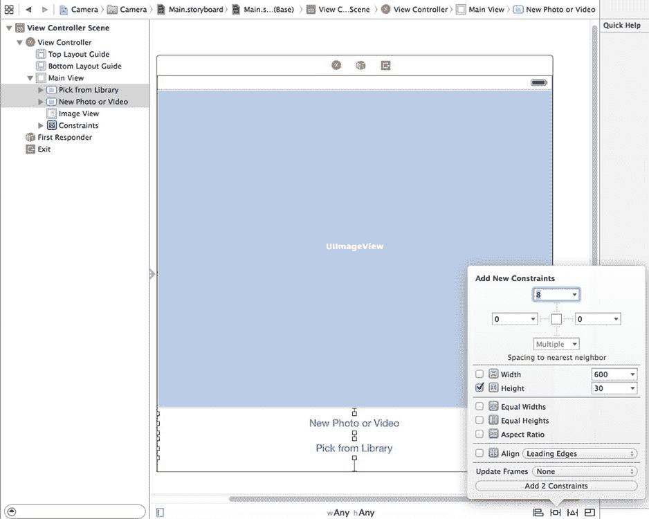

# 第 21 章 摄像头与照片库

到目前为止，你应该已经知道 iPhone、iPad 和 iPod touch 都配备了内置摄像头，以及一个名为“照片”的精美应用，用于管理你拍摄的所有精彩照片和视频。你可能不知道的是，你的程序也可以使用内置摄像头来拍照。你的应用还可以让用户从设备上已存储的媒体中选择和查看。在本章中，我们将探讨这两项功能。

## 使用图像选择器和 UIImagePickerController

由于 iOS 应用的沙箱机制，应用通常无法访问其自身沙箱之外的照片或其他数据。幸运的是，摄像头和媒体库都可以通过**图像选择器**供你的应用使用。

### 使用图像选择器控制器

顾名思义，图像选择器是一种允许你从指定源中选择图像的机制。当这个类首次在 iOS 中出现时，它只用于图像。如今，你也可以用它来捕捉视频。

通常，图像选择器会以图像和/或视频列表作为其源（参见图 21-1 的左侧）。然而，你可以指定选择器使用摄像头作为其源（参见图 21-1 的右侧）。



图 21-1. 一个运行中的图像选择器。用户会看到一个图像列表（左）。选择图像后，可以对其进行移动和缩放（右）。是的，有时候我的相机胶卷里全是 Clumsy Ninja 的照片。这要归咎于我的孩子们。

图像选择器接口通过一个名为`UIImagePickerController`的控制器类实现。你需要创建该类的实例，指定一个委托（好像你没想到似的），指定其图像源以及你希望用户选择图像还是视频，然后呈现它。图像选择器将控制设备，让用户从现有媒体库中选择图片或视频。或者，用户可以使用摄像头拍摄新的照片或视频。用户做出选择后，你可以让用户有机会进行一些基本的编辑，例如缩放或裁剪图像，或者修剪一段视频剪辑。所有这些行为都由`UIImagePickerController`实现，因此你在这里真的不需要做太多繁重的工作。

假设用户没有按“取消”，用户拍摄或从库中选择的图像或视频将传递给你的委托。无论用户是选择了媒体文件还是取消，你的委托都有责任关闭`UIImagePickerController`，以便用户返回你的应用。

创建`UIImagePickerController`非常简单。你只需像大多数类一样创建其实例。但有一个注意事项：并非所有 iOS 设备都有摄像头。早期的 iPod touch 是首批例子，第一代 iPad 是最新的例子。然而，未来可能会有更多此类设备从苹果的组装线上生产出来。在创建`UIImagePickerController`实例之前，你需要检查当前运行应用所在的设备是否支持你想要使用的图像源。例如，在让用户使用摄像头拍照之前，你应该确保程序运行在带有摄像头的设备上。你可以通过`UIImagePickerController`的类方法来检查，如下所示：

```objc
if ([UIImagePickerController isSourceTypeAvailable:
     UIImagePickerControllerSourceTypeCamera]) {
```


在这个例子中，我们传递`UIImagePickerControllerSourceTypeCamera`来指示想要让用户使用内置摄像头拍照或录像。方法`isSourceTypeAvailable:`在指定源当前可用时返回`YES`。除了`UIImagePickerControllerSourceTypeCamera`之外，还可以指定另外两个值：

- `UIImagePickerControllerSourceTypePhotoLibrary`指定用户应从现有媒体库中选择图像或视频。该图像将返回到你的委托。
- `UIImagePickerControllerSourceTypeSavedPhotosAlbum`指定用户将从现有照片库中选择图像，但选择范围将限制在相机胶卷内。此选项可在没有摄像头的设备上运行，尽管用处不大，但仍允许你选择已拍摄的任何屏幕截图。

在确认程序运行的设备支持你想要使用的图像源之后，启动图像选择器相对容易：

```objc
UIImagePickerController *picker = [[UIImagePickerController alloc] init];
picker.delegate = self;
picker.sourceType = UIImagePickerControllerSourceTypeCamera;
picker.cameraDevice = UIImagePickerControllerCameraDeviceFront;
[self presentViewController:picker animated:YES completion:nil];
```

**提示** 在拥有多个摄像头的设备上，你可以通过将`cameraDevice`属性设置为`UIImagePickerControllerCameraDeviceFront`或`UIImagePickerControllerCameraDeviceRear`来选择使用哪个摄像头。要确定前置或后置摄像头是否可用，请使用相同的常量配合`isCameraDeviceAvailable:`方法。

创建并配置好`UIImagePickerController`之后，我们使用类从`UIView`继承的方法`presentViewController:animated:completion:`来向用户呈现图像选择器。

### 实现图像选择器控制器委托

要了解用户何时完成使用图像选择器，你需要实现`UIImagePickerControllerDelegate`协议。该协议定义了两个方法：`imagePickerController:didFinishPickingMediaWithInfo:`和`imagePickerControllerDidCancel:`。

当用户成功拍摄照片或视频，或从媒体库中选择项目时，会调用`imagePickerController:didFinishPickingMediaWithInfo:`方法。第一个参数是指向你之前创建的`UIImagePickerController`的指针。第二个参数是`NSDictionary`实例，它将包含所选照片或所选视频的 URL，以及如果你在图像选择器控制器中启用了编辑（并且用户确实进行了编辑）时的可选编辑信息。该字典将包含存储在键`UIImagePickerControllerOriginalImage`下的原始未编辑图像。以下是检索原始图像的委托方法示例：

```objc
- (void)imagePickerController:(UIImagePickerController *)picker
didFinishPickingMediaWithInfo:(NSDictionary *)info {
    UIImage *selectedImage = info[UIImagePickerControllerEditedImage];
    UIImage *originalImage = info[UIImagePickerControllerOriginalImage];

    // 对 selectedImage 和 originalImage 进行处理

    [picker dismissViewControllerAnimated:YES completion:nil];
}
```

`editingInfo`字典还会通过存储在键`UIImagePickerControllerCropRect`下的`NSValue`对象，告知你在编辑过程中选择了整个图像的哪个部分。你可以像这样将`NSValue`实例转换为`CGRect`：

```objc
NSValue *cropValue = info[UIImagePickerControllerCropRect];
CGRect cropRect = [cropValue CGRectValue];
```

经过此转换后，`cropRect`将指定在编辑过程中选择的原始图像部分。如果你不需要此信息，可以忽略它。

**注意** 如果返回到委托的图像来自摄像头，该图像不会自动存储到照片库中。如有必要，保存图像是你应用程序的责任。

另一个委托方法`imagePickerControllerDidCancel:`在用户决定取消过程而不拍摄或选择任何媒体时被调用。当图像选择器调用此委托方法时，它只是通知你用户已完成选择器且未选择任何内容。

`UIImagePickerControllerDelegate`协议中的这两个方法都被标记为可选，但实际上它们并非如此，原因如下：必须告知模态视图（如图像选择器）自行关闭。因此，即使你在用户取消图像选择器时不需要执行任何特定于应用程序的操作，仍然需要关闭该选择器。至少，你的`imagePickerControllerDidCancel:`方法需要像这样，程序才能正常运行：

```objc
- (void)imagePickerControllerDidCancel:(UIImagePickerController *)picker {
    [picker dismissViewControllerAnimated:YES completion:NULL];
}
```

## 实地测试摄像头和图库

在本章中，我们将构建一个应用程序，允许用户使用摄像头拍照或录制视频。或者，用户可以从照片库中选择内容，然后在屏幕上显示所选内容（见图 21-2）。如果用户使用的设备没有摄像头，我们将隐藏“新照片或视频”按钮，并仅允许从照片库中选择。



**图 21-2.** 相机应用程序运行中

### 设计界面

在 Xcode 中使用“单视图应用程序”模板创建一个新项目，并将应用程序命名为`Camera`。首先要做的是向此应用程序的视图控制器添加几个输出口。我们需要一个指向图像视图的输出口，以便用图像选择器返回的图像更新它。我们还需要一个指向“新照片或视频”按钮的输出口，以便在设备没有摄像头时隐藏该按钮。

我们还需要两个操作方法：一个用于“新照片或视频”按钮，一个用于让用户从照片库中选择现有图片。

展开`Camera`文件夹，以便访问所有相关文件。选择`ViewController.m`，并将以下协议遵循声明和属性添加到类扩展中：

```objc
#import "ViewController.h"

@interface ViewController ()
<UIImagePickerControllerDelegate, UINavigationControllerDelegate>

@property (weak, nonatomic) IBOutlet UIImageView *imageView;
@property (weak, nonatomic) IBOutlet UIButton *takePictureButton;

@end
```

你可能首先注意到，我们实际上使类遵循了两个不同的协议：`UIImagePickerControllerDelegate`和`UINavigationControllerDelegate`。因为`UIImagePickerController`是`UINavigationController`的子类，所以我们必须使类遵循这两个协议。`UINavigationControllerDelegate`中的方法是可选的，我们不需要它们中的任何一个来使用图像选择器；然而，我们确实需要遵循该协议，否则编译器稍后会给出警告。


```markdown
你可能还会注意到，虽然我们将使用`UIImageView`实例来显示选中的图片，但显示选中的视频时却没有类似的东西。UIKit 不包含任何像`UIImageView`那样公开可用的、适用于显示视频内容的类，因此我们必须使用其他技术来展示视频。到那时，我们将使用`MPMoviePlayerController`的实例，获取其`view`属性并将其插入到视图层级中。这是一种非常不寻常的使用视图控制器的方式，但这实际上是苹果官方认可的在视图层级中显示视频的技术。

我们还将添加两个动作方法，用于连接按钮。目前，我们只需创建空的实现，以便 Interface Builder 能看到它们。稍后我们会填充实际代码：

```
- (IBAction)shootPictureOrVideo:(UIButton *)sender {
}

- (IBAction)selectExistingPictureOrVideo:( UIButton *)sender {
}
```

保存更改，然后选择`Main.storyboard`在 Interface Builder 中编辑图形用户界面。

我们将为该应用构建的布局非常简单——只有一个图像视图和两个按钮。完成的布局如图 21-3 所示。请以此作为工作时的参考。



图 21-3 相机应用的故事板布局

从库中拖两个`Button`到标记为`View`的窗口。将它们上下放置，使底部的按钮与底部蓝色参考线对齐。双击顶部按钮，将其标题设为`New Photo or Video`。然后双击底部按钮，将其标题设为`Pick from Library`。接着，从库中拖一个`Image View`并放在按钮上方。将图像视图展开，使其占据按钮上方视图的整个空间，如前面的图 21-2 所示。在属性检查器中，将图像视图的背景改为黑色，并将其`Mode`设置为`Aspect Fit`，这样它就会调整图片大小以适应其边界，同时保持原始宽高比。

现在，从`View Controller`图标 Control-拖动到图像视图，选择`imageView`出口。再次从`View Controller`拖动到`New Photo or Video`按钮，选择`takePictureButton`出口。

接下来，选中`New Photo or Video`按钮，打开连接检查器。从`Touch Up Inside`事件拖动到`View Controller`，选择`shootPictureOrVideo:`动作。然后点击`Pick from Library`按钮，从连接检查器的`Touch Up Inside`事件拖动到 View Controller，选择`selectExistingPictureOrVideo:`动作。

和往常一样，最后一步是添加自动布局约束。首先，在文档大纲中展开视图控制器，将其视图重命名为`Main View`，然后按如下方式添加约束：

1.  在文档大纲中，从`Pick from Library`按钮 Control-拖动到`Main View`，然后松开鼠标。当弹出菜单出现时，按住`Shift`键，选择`Leading Space to Container Margin`、`Trailing Space to Container Margin`和`Bottom Space to Bottom Layout Guide`。
2.  从`New Photo or Video`按钮 Control-拖动到`Pick from Library`按钮，松开鼠标，选择`Vertical Spacing`。
3.  从`New Photo or Video`按钮 Control-拖动到`Main View`，松开鼠标，按住`Shift`键，选择`Leading Space to Container Margin`和`Trailing Space to Container Margin`。
4.  从`New Photo or Video`Control-拖动到图像视图，选择`Vertical Spacing`。
5.  从图像视图 Control-拖动到`Main View`，按住`Shift`键选择`Leading Space to Container Margin`、`Trailing Space to Container Margin`和`Top Space to Top Layout Guide`。
6.  按住`Shift`键，点击`New Photo or Video button`和`Pick from Library`按钮以选中它们，然后点击故事板编辑器下方的`Pin`按钮。在弹出的菜单中，勾选`Width`复选框，点击`Add 2 Constraints`，如图 21-4 所示。



图 21-4 完成相机应用的自动布局约束

所有布局约束都已就位，现在保存更改。

### 实现相机视图控制器

选择`ViewController.m`，我们需要做一些进一步的修改。由于我们允许用户选择性地录制视频，因此需要一个`MPMoviePlayerController`实例的属性。另外两个属性用于跟踪最后选中的图片和视频，以及一个字符串用于确定最后选中的是视频还是图片。我们还需要导入一些额外的头文件来实现这一切。添加以下粗体行：

```
#import "ViewController.h"
#import <MediaPlayer/MediaPlayer.h>
#import <MobileCoreServices/UTCoreTypes.h>

@interface ViewController ()
<UIImagePickerControllerDelegate, UINavigationControllerDelegate>

@property (weak, nonatomic) IBOutlet UIImageView *imageView;
@property (weak, nonatomic) IBOutlet UIButton *takePictureButton;
@property (strong, nonatomic) MPMoviePlayerController *moviePlayerController;
@property (strong, nonatomic) UIImage *image;
@property (strong, nonatomic) NSURL *movieURL;
@property (copy, nonatomic) NSString *lastChosenMediaType;

@end
```

现在，我们来增强`viewDidLoad`方法：如果当前运行的设备没有摄像头，则隐藏`New Photo or Video`按钮。同时实现`viewDidAppear:`方法，使其调用`updateDisplay`方法（我们稍后将实现）。首先进行以下更改：

```
@implementation ViewController

- (void)viewDidLoad
{
    [super viewDidLoad];
    // Do any additional setup after loading the view, typically from a nib.
    if (![UIImagePickerController isSourceTypeAvailable:
          UIImagePickerControllerSourceTypeCamera]) {
        self.takePictureButton.hidden = YES;
    }
}

- (void)viewDidAppear:(BOOL)animated {
    [super viewDidAppear:animated];
    [self updateDisplay];
}

- (void)didReceiveMemoryWarning
{
    [super didReceiveMemoryWarning];
    // Dispose of any resources that can be recreated.
}
```

理解`viewDidLoad`和`viewDidAppear:`方法之间的区别非常重要。前者仅在视图刚加载到内存时调用。后者则在每次显示视图时调用，这既发生在启动时，也发生在从其他全屏视图（如图像选择器）返回到我们的控制器时。
```


接下来是三个实用方法，其中第一个是`updateDisplay`方法。它由`viewDidAppear:`方法调用，该方法在视图首次创建时以及用户在选取图像或视频并关闭图像选择器后都会被调用。由于这种双重用途，它需要进行一些检查以确定当前状态并相应地设置 GUI。将以下代码添加到文件底部：

```
- (void)updateDisplay {
    if ([self.lastChosenMediaType isEqual:(NSString *)kUTTypeImage]) {
        self.imageView.image = self.image;
        self.imageView.hidden = NO;
        self.moviePlayerController.view.hidden = YES;
    } else if ([self.lastChosenMediaType isEqual:(NSString *)kUTTypeMovie]) {
        if (self.moviePlayerController == nil) {
            self.moviePlayerController = [[MPMoviePlayerController alloc]
                                          initWithContentURL:self.movieURL];
            UIView *movieView = self.moviePlayerController.view;
            movieView.frame = self.imageView.frame;
            movieView.clipsToBounds = YES;
            [self.view addSubview:movieView];
            [self setMoviePlayerLayoutConstraints];
        } else {
            self.moviePlayerController.contentURL = self.movieURL;
        }
        self.imageView.hidden = YES;
        self.moviePlayerController.view.hidden = NO;
        [self.moviePlayerController play];
    }
}
```

该方法根据用户选择的媒体类型显示正确的视图——照片显示图像视图，电影显示电影播放器。图像视图始终存在，但电影播放器仅在用户首次选择电影时创建并添加到用户界面。在添加电影播放器时，需要确保它占据与图像视图相同的空间，并且需要添加布局约束，以确保即使设备旋转也能保持这种状态。以下是添加布局约束的代码：

```
- (void)setMoviePlayerLayoutConstraints {
    UIView *moviePlayerView = self.moviePlayerController.view;
    UIView *takePictureButton = self.takePictureButton;
    moviePlayerView.translatesAutoresizingMaskIntoConstraints = NO;
    NSDictionary *views =
         NSDictionaryOfVariableBindings(moviePlayerView, takePictureButton);
    [self.view addConstraints:[NSLayoutConstraint constraintsWithVisualFormat:
            @"H:|[moviePlayerView]|" options:0 metrics:nil views:views]];
    [self.view addConstraints:[NSLayoutConstraint constraintsWithVisualFormat:
            @"V:|[moviePlayerView]-0-[takePictureButton]" options:0 metrics:nil
            views:views]];
}
```

水平约束将电影播放器绑定到主视图的左右两侧，垂直约束将其链接到主视图的顶部和`New Photo or Video`按钮的顶部。

最后一个实用方法`pickMediaFromSource:`是我们的两个操作方法都会调用的方法。该方法非常简单，它只是创建并配置一个图像选择器，使用传入的`sourceType`来决定是调出相机还是媒体库。为此，将以下代码添加到文件底部：

```
- (void)pickMediaFromSource:(UIImagePickerControllerSourceType)sourceType {
    NSArray *mediaTypes = [UIImagePickerController
                           availableMediaTypesForSourceType:sourceType];
    if ([UIImagePickerController
         isSourceTypeAvailable:sourceType] && [mediaTypes count] > 0) {
        UIImagePickerController *picker =
                    [[UIImagePickerController alloc] init];
        picker.mediaTypes = mediaTypes;
        picker.delegate = self;
        picker.allowsEditing = YES;
        picker.sourceType = sourceType;
        [self presentViewController:picker animated:YES completion:NULL];
    } else {
        UIAlertController *alertController = [UIAlertController
                     alertControllerWithTitle:@"Error accessing media"
                               message:@"Unsupported media source."
                               preferredStyle:UIAlertControllerStyleAlert];
        UIAlertAction *okAction = [UIAlertAction actionWithTitle:@"OK"
                                   style:UIAlertActionStyleCancel handler:nil];
        [alertController addAction:okAction];
        [self presentViewController:alertController animated:YES
              completion:nil];
    }
}
```

接下来，实现在头文件中声明的以下操作方法：

```
- (IBAction)shootPictureOrVideo:(id)sender {
    [self pickMediaFromSource:UIImagePickerControllerSourceTypeCamera];
}

- (IBAction)selectExistingPictureOrVideo:(id)sender {
    [self pickMediaFromSource:UIImagePickerControllerSourceTypePhotoLibrary];
}
```

每个方法都只是调用`pickMediaFromSource:`方法，并传入由`UIImagePickerController`定义的常量，以指定图片或视频的来源。

现在，是时候实现选择器的委托方法了：

```
#pragma mark - Image Picker Controller delegate methods

- (void)imagePickerController:(UIImagePickerController *)picker
       didFinishPickingMediaWithInfo:(NSDictionary *)info {
    self.lastChosenMediaType = info[UIImagePickerControllerMediaType];
    if ([self.lastChosenMediaType isEqual:(NSString *)kUTTypeImage]) {
        self.image = info[UIImagePickerControllerEditedImage];
    } else if ([self.lastChosenMediaType isEqual:(NSString *)kUTTypeMovie]) {
        self.movieURL = info[UIImagePickerControllerMediaURL];
    }
    [picker dismissViewControllerAnimated:YES completion:NULL];
}

- (void)imagePickerControllerDidCancel:(UIImagePickerController *)picker {
    [picker dismissViewControllerAnimated:YES completion:NULL];
}
```

第一个委托方法检查用户选择了图片还是视频，记录选择内容，然后关闭模态图像选择器。如果图像大于屏幕可用空间，显示时图像视图会对其进行缩放，因为我们在创建图像视图时将其内容模式设置为`Aspect Fit`。第二个委托方法在用户取消图像选取过程时被调用，仅关闭图像选择器。

这就是你需要做的全部工作。编译并运行应用程序。如果在模拟器上运行，你将无法选择拍摄新照片，只能从照片库中选择——就好像模拟器的照片库中有照片一样！如果有机会在真实设备上运行应用程序，请尝试一下。你应该能够拍摄新照片或视频，并使用捏合手势放大和缩小照片。在 iOS 上，当应用首次需要访问用户照片时，系统会要求用户允许此访问；这是 iOS 6 中添加的一项隐私功能，以确保应用不会在未经用户同意的情况下偷偷获取照片。

选择或拍摄照片后，如果在点击`Use Photo`按钮之前进行缩放和平移，裁剪后的图像将通过委托方法返回给应用程序。

**大功告成！**


