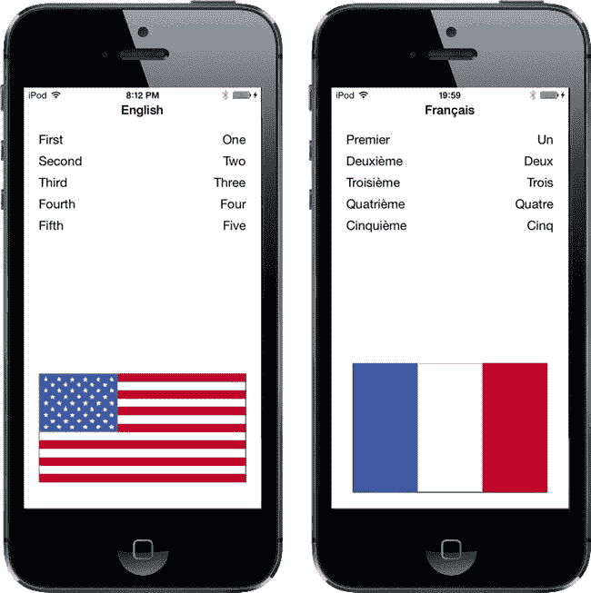
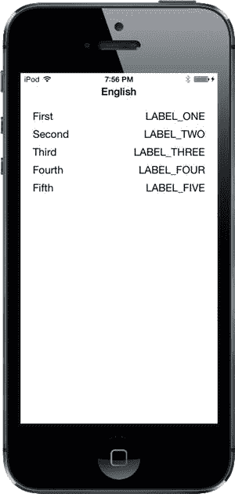
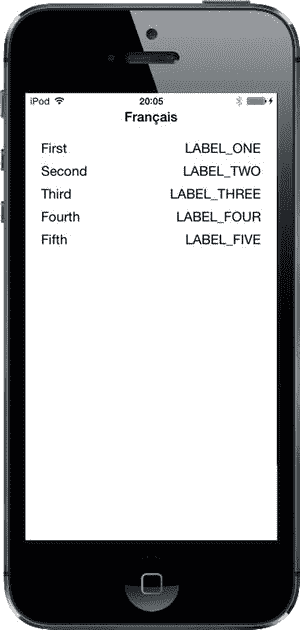
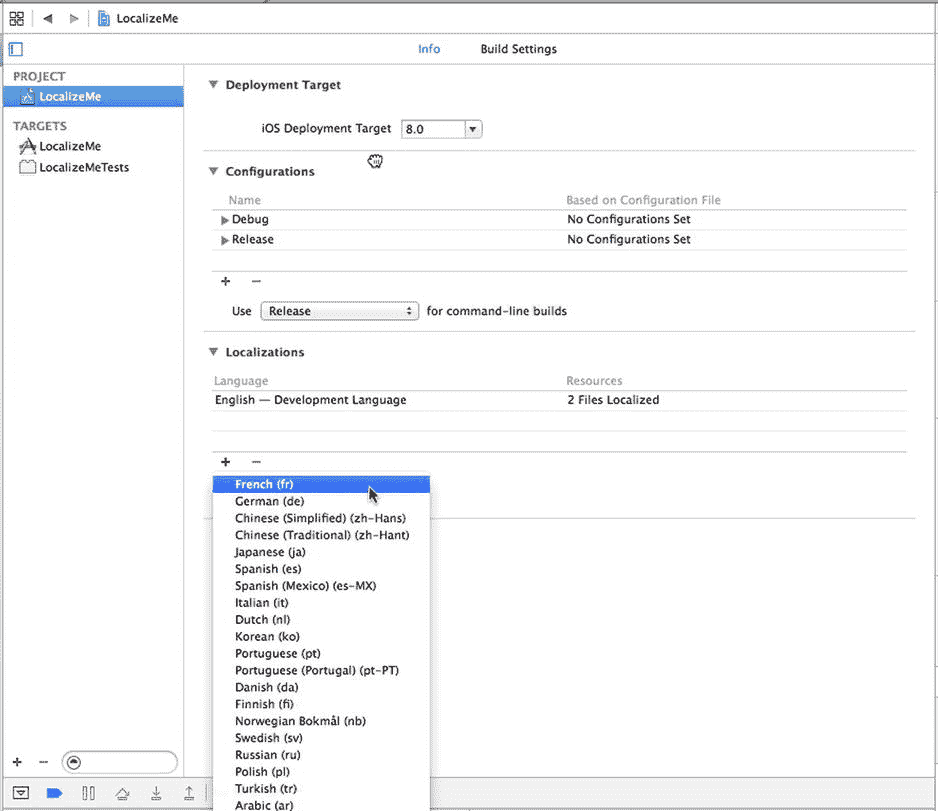
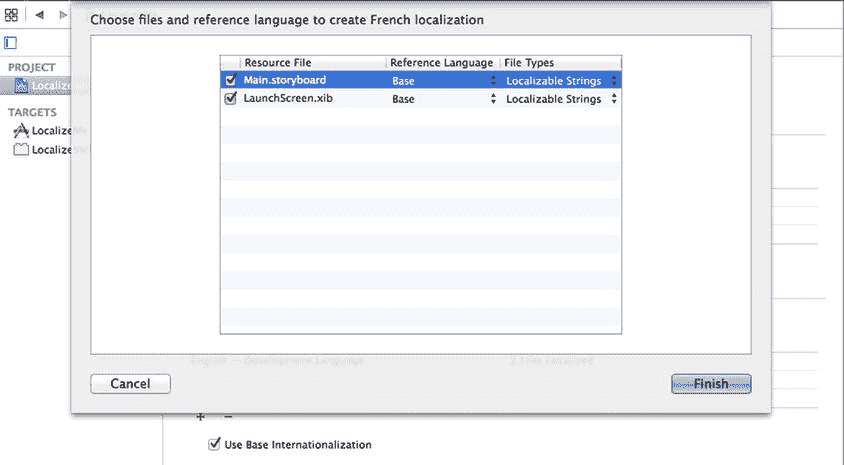
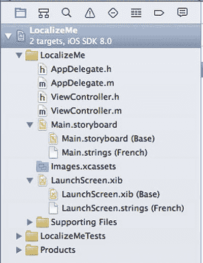
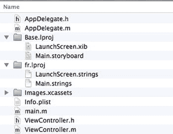
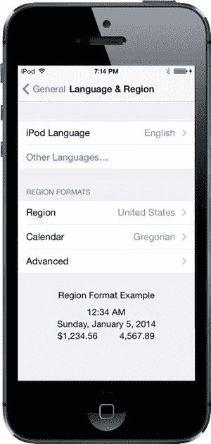
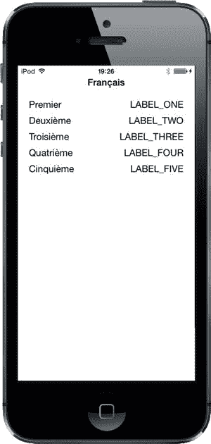
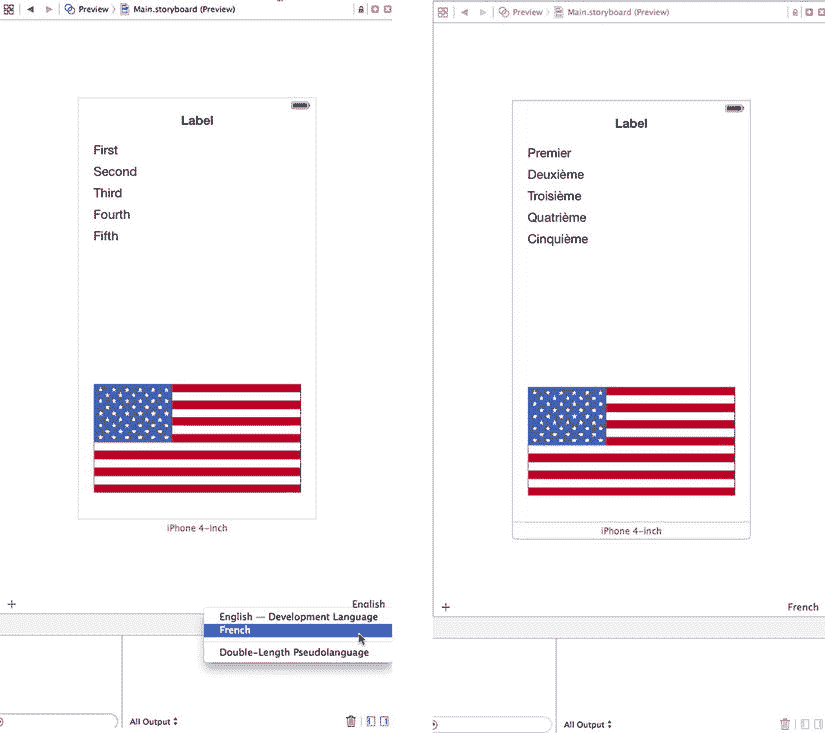

# 第 22 章：应用程序本地化

在撰写本书时，iOS 设备已在超过 90 个不同的国家/地区销售，而且这个数字还将继续增长。现在，除了南极洲，你可以在每个大洲购买并使用 iPhone。iPad 和 iPod touch 也在全球范围内销售，几乎和 iPhone 一样普及。

如果你计划通过 App Store 发布应用程序，你的潜在市场远不止本国讲母语的人群。幸运的是，iOS 拥有强大的**本地化**架构，让你能够轻松地将应用程序（或由他人翻译）翻译成多种语言，甚至是同一语言的不同方言。你是否想为英国英语使用者提供与美国英语使用者不同的术语？没问题。

也就是说，只要你正确编写了代码，本地化就没有问题。对现有应用程序进行改造以支持本地化，比从一开始就按此方式编写应用程序要困难得多。在本章中，我们将向你展示如何编写易于本地化的代码，然后我们将对一个示例应用程序进行本地化。

## 本地化架构

当运行一个未本地化的应用程序时，所有应用程序文本都将以开发者自己的语言显示，也称为**开发基础语言**。

当开发者决定本地化其应用程序时，他们会在应用程序包中为每种支持的语言创建一个子目录。每种语言的子目录都包含已翻译成该语言的部分应用程序资源。每个子目录称为一个**本地化项目**，或**本地化文件夹**。本地化文件夹名称始终以 `.lproj` 扩展名结尾。

在 iOS 的“设置”应用程序中，用户可以设置设备的首选语言和区域格式。例如，如果用户的语言是英语，可用区域可能包括美国、澳大利亚和香港——所有使用英语的地区。

当本地化后的应用程序需要加载资源——例如图像、属性列表或 nib 文件——时，应用程序会检查用户的语言和区域，然后查找与该设置匹配的本地化文件夹。如果找到，它将加载该资源的本地化版本，而不是基础版本。

对于选择法语作为 iOS 语言、瑞士作为区域的用户，应用程序将首先查找名为 `fr-CH.lproj` 的本地化文件夹。文件夹名称的前两个字母是代表法语的 ISO 国家代码。下划线后面的两个字母是代表瑞士的 ISO 代码。

如果应用程序找不到使用两个字母代码的匹配项，它将使用该语言的三字母 ISO 代码进行匹配。在我们的例子中，如果应用程序找不到名为 `fr-CH.lproj` 的文件夹，它将查找名为 `fre-CH` 或 `fra-CH` 的本地化文件夹。

所有语言至少有一个三字母代码。有些语言有两个三字母代码：一个用于语言的英文拼写，另一个用于本地拼写。有些语言只有两个字母的代码。当一种语言同时拥有两个字母代码和三个字母代码时，优先使用两个字母代码。

**注意** 你可以在 ISO 网站 (`www.iso.org/iso/country_codes.htm`) 上找到当前 ISO 国家代码的列表。两个字母和三个字母的代码都是 ISO 3166 标准的一部分。

如果应用程序找不到完全匹配的文件夹，它将在应用程序包中查找仅匹配语言代码（不含区域代码）的本地化文件夹。因此，继续我们来自法国的法语使用者的例子，应用程序接下来会查找名为 `fr.lproj` 的本地化文件夹。如果找不到该名称的语言文件夹，它将查找 `fre.lproj`，然后查找 `fra.lproj`。如果这些都找不到，它会检查 `French.lproj`。最后这种构造是为了支持旧版 Mac OS X 应用程序；一般来说，你应该避免使用它。

如果应用程序找不到匹配语言/区域组合或仅匹配语言的文件夹，它将使用开发基础语言中的资源。如果它确实找到了合适的本地化文件夹，那么对于任何需要的资源，它都会首先在该文件夹中查找。例如，如果你使用 `imageNamed:` 加载 `UIImage`，应用程序将首先在本地化文件夹中查找指定名称的图像。如果找到，它将使用该图像。如果没有找到，它将回退到基础语言资源。

如果应用程序有多个匹配的本地化文件夹——例如，一个名为 `fr-CH.lproj` 的文件夹和一个名为 `fr.lproj` 的文件夹——它将首先在更具体的匹配项中查找，如果用户选择了瑞士法语作为首选语言，那就是 `fr-CH.lproj`。如果在那里找不到资源，它将在 `fr.lproj` 中查找。这使你能够在一个语言文件夹中提供所有该语言使用者通用的资源，仅本地化那些受方言或地理区域差异影响的资源。

你应该只选择本地化那些受语言或国家影响的资源。例如，如果应用程序中的图像没有文字且含义具有普遍性，则无需本地化该图像。

## 字符串文件

源代码中的字符串字面量和字符串常量该如何处理？考虑来自第 19 章的这段源代码：

```
UIAlertController *alertController =
  [UIAlertController alertControllerWithTitle:@"Location Manager Error"
                     message:errorType
                     preferredStyle:UIAlertControllerStyleAlert];
UIAlertAction *okAction = [UIAlertAction actionWithTitle:@"OK"
                            style:UIAlertActionStyleCancel handler:nil];
[alertController addAction:okAction];
[self presentViewController:alertController animated:YES completion:nil];
```

如果你已经费心为特定用户群本地化了应用程序，你肯定不希望显示用开发基础语言编写的提示框。解决方法是将这些字符串存储在称为**字符串文件**的特殊文本文件中。

### 字符串文件中有什么？

字符串文件不过是包含一系列字符串对的 Unicode 文本文件，每个字符串对由一个注释标识。以下是你应用程序中字符串文件可能的样子：

```
/* 用于询问用户的第一个名字 */
"LABEL_FIRST_NAME" = "名";

/* 用于获取用户的姓氏 */
"LABEL_LAST_NAME" = "姓";

/* 用于询问用户的出生日期 */
"LABEL_BIRTHDAY" = "生日";
```

`/*` 和 `*/` 字符之间的值只是为翻译人员提供的注释。它们不在应用程序中使用，你可以选择不添加它们，尽管添加它们是个好主意。注释提供了上下文，展示了特定字符串在应用程序中的用法。


```markdown
你会注意到每一行有两部分，由等号分隔。等号左侧的字符串作为键，它始终包含相同的值，与语言无关。等号右侧的值是被翻译成当地语言的内容。因此，将上面的字符串文件本地化成法语后，可能看起来像这样：

```
/* 用于询问用户的名字 */
"LABEL_FIRST_NAME" = "Prénom";

/* 用于获取用户的姓氏 */
"LABEL_LAST_NAME" = "Nom de famille";

/* 用于询问用户的出生日期 */
"LABEL_BIRTHDAY" = "Anniversaire";
```

## 本地化字符串宏

你实际上不需要手动创建字符串文件。相反，你可以通过使用`NSLocalizedString`宏来获取所需的本地化字符串版本。一旦你的源代码最终确定并准备好进行本地化，Xcode 会搜索所有代码文件中该宏的出现，提取所有唯一的字符串，并将它们嵌入到一个文件中。你可以将该文件发送给翻译人员，或者自行添加翻译。完成后，你可以让 Xcode 导入更新后的文件，并使用其内容为已提供翻译的语言创建本地化字符串文件。

让我们看看这个过程的第一部分是如何工作的。首先，这是一个传统的字符串声明：

```
NSString *myString = @"First Name";
```

要使这个字符串可本地化，可以这样做：

```
NSString *myString = NSLocalizedString(@"LABEL_FIRST_NAME",
    @"Used to ask the user his/her first name");
```

`NSLocalizedString`宏接受两个参数：

*   第一个参数是一个键，用于查找本地化的字符串。如果没有包含该键文本的本地化内容，应用程序将使用该键作为本地化文本。
*   第二个参数用作注释，说明文本的使用方式。该注释将出现在发送给翻译人员的文件中，以及导入后的本地化字符串文件中。

`NSLocalizedString`在应用程序包中查找适当的本地化文件夹内名为`Localizable.strings`的字符串文件。如果找不到该文件，它会返回第一个参数，即所需文本对应的键。

如果`NSLocalizedString`找到了字符串文件，它会搜索文件中与第一个参数匹配的行。在上述示例中，`NSLocalizedString`会在字符串文件中搜索字符串`"LABEL_FIRST_NAME"`。如果在与用户语言设置匹配的本地化文件夹中没有找到匹配项，它会继续在基础语言的字符串文件中查找并使用那里的值。如果没有字符串文件，它将只使用你传递给`NSLocalizedString`宏的第一个参数。

你可以将基础语言文本用作`NSLocalizedString`宏的键，因为如果找不到匹配的本地化文本，它会返回该键。这将使前面的示例看起来像这样：

```
NSString *myString = NSLocalizedString(@"First Name",
    @"Used to ask the user his/her first name");
```

然而，这种方法不推荐使用，原因有两个。首先，你不太可能在第一次尝试时就为你的应用设计出完美的文本。回头去修改字符串文件中的所有键既繁琐又容易出错，这意味着你最终很可能会遇到键与应用中实际使用的内容不匹配的情况。第二个原因是，通过明确使用大写键，当你运行应用时，可以立即注意到是否有任何文本忘记本地化。

现在你已经对本地化架构和字符串文件的工作原理有了了解，让我们看看本地化的实际应用。

## 真实 iOS 示例：本地化你的应用程序

我们将创建一个显示用户当前**语言环境**的小应用程序。一个语言环境（`NSLocale`的实例）代表用户的语言和地区。系统用它来确定与用户交互时使用的语言，以及如何显示日期、货币和时间信息等。创建应用程序后，我们将把它本地化为其他语言。你将学习如何本地化故事板文件、字符串文件、图像，甚至应用程序的显示名称。

你可以看到我们的应用程序的外观，如图 22-1 所示。顶部的名称来自用户的语言环境。视图左侧的序数是静态标签，其值将通过本地化故事板文件来设置。右侧的单词以及屏幕底部的国旗图像，都将在我们的应用程序代码中根据用户的首选语言在运行时选择。



图 22-1. 使用两种不同语言设置显示的 LocalizeMe 应用程序

让我们直接开始吧。

### 设置 LocalizeMe

在 Xcode 中使用“Single View Application”模板创建一个新项目，并将其命名为`LocalizeMe`。

如果你在示例源代码的`22 – Images`文件夹中查看，会找到名为`flag_usa.png`和`flag_france.png`的一对图像。在 Xcode 中，选择`Images.xcassets`项，然后将`flag_usa.png`和`flag_france.png`拖入其中。

现在，让我们向项目的视图控制器添加一些标签输出口。我们需要为视图顶部蓝色标签创建一个输出口，为将显示国旗的图像视图创建一个输出口，并为右侧的所有单词创建一个输出口集合（请参见图 22-1）。选择`ViewController.m`并进行以下更改：

```
#import "ViewController.h"

@interface ViewController ()

@property (weak, nonatomic) IBOutlet UILabel *localeLabel;
@property (weak, nonatomic) IBOutlet UIImageView *flagImageView;
@property (strong, nonatomic) IBOutletCollection(UILabel) NSArray *labels;

@end
```

现在选择`Main.storyboard`，在 Interface Builder 中编辑 GUI。在文档大纲中，展开视图控制器并将其视图的名称更改为`Main View`。从库中拖拽一个**标签**，将其放在视图顶部，与顶部蓝色对齐线对齐。调整标签大小，使其占据视图的整个宽度，从一边到另一边。选中标签后，打开属性检查器。找到**字体**控件，点击其中包含的小**T**图标，调出一个小字体选择弹出窗口。点击**系统粗体**，使标题标签在视觉上更突出。接下来，使用属性检查器将文本对齐设置为居中。如果需要，也可以使用字体选择器将字号调大。只要在对象的属性检查器中将**自动收缩**设置为**最小字体大小**，当文本过长无法显示时，它会自动调整大小。

放置好标签后，从**视图控制器**图标按住 Control 键拖拽到新标签上，然后选择**localeLabel**输出口。

接下来，从库中再拖拽五个**标签**，使用蓝色对齐线将它们靠在左边缘，一个接一个地排列（同样，请参见图 22-1）。双击最上面的标签，将其文本从*Label*改为*First*。对其余四个标签重复此操作，将文本分别改为*Second*、*Third*、*Fourth*和*Fifth*。
```


从库中再拖入五个标签，这次将它们靠右边缘放置。使用**对象身份检查器**将文本对齐方式改为**右对齐**，然后增加标签的宽度，使其从右侧蓝色参考线伸展到视图的中间位置。按住 **Control** 键从 `View Controller` 分别拖拽到五个新标签，将每个标签连接到 `labels` 插座集合，确保按从上到下的正确顺序连接。

从库中拖拽一个 `Image View` 到视图底部，使其接触底部和左侧的蓝色参考线。在**身份检查器**中，为视图的 **Image** 属性选择 `flag_usa`，然后将图像水平调整到从蓝色参考线到蓝色参考线，垂直调整到用户界面高度的大约三分之一。在**身份检查器**中，将 **Mode** 属性从当前值改为 `Aspect Fit`。并非所有国旗都具有相同的宽高比，我们需要确保图像的本地化版本显示正确。选择此选项将使图像视图调整其显示的任意图像以适配，同时保持正确的宽高比（高度与宽度的比例）。现在按住 **Control** 键从视图控制器拖拽到此图像视图，并选择 `flagImageView` 插座。

为了完成用户界面，我们需要设置自动布局约束。从顶部的标签开始，按住 **Control** 键从它拖拽到文档大纲中的 **Main View**，按住 **Shift** 键，选择 **Leading Space to Container Margin**、**Trailing Space to Container Margin** 和 **Top Space to Top Layout Guide**，然后**用鼠标在弹出窗口外部点击**。

接下来，我们将固定五行标签的位置。按住 **Control** 键从文本为 *First* 的标签拖拽到文档大纲中的 **Main View**，选择 **Leading Space to Container Margin** 和 **Top Space to Top Layout Guide**，然后**用鼠标在弹出窗口外部点击**。按住 **Control** 键从该标签拖拽到同一行右侧的标签并选择 **Baseline**，然后按住 **Control** 键从右侧标签水平拖拽到文档大纲中的 **Main View**，并选择 **Trailing Space to Container Margin**。

现在你已经定位了顶行标签。对其他四行执行完全相同操作。最后，按住 **Shift** 键并单击鼠标选中右侧的所有五个标签，然后选择 **Editor**  **Size to Fit Content**。现在可以清除这些标签的文本，因为我们将通过编程进行设置。

为了固定国旗的位置和大小，按住 **Control** 键从国旗标签拖拽到文档大纲中的 **Main View**，选择 **Leading Space to Container Margin**、**Trailing Space to Container Margin** 和 **Bottom Space to Bottom Layout Guide**，然后**用鼠标在弹出窗口外部点击**。保持国旗标签选中状态，点击 **Pin** 按钮，在弹出窗口中勾选 **Height** 复选框，然后按 **Add 1 Constraint**。现在你已经添加了所需的所有自动布局约束。

保存你的故事板，然后切换到 `ViewController.m`，在 `viewDidLoad` 方法中添加以下代码：

```
- (void)viewDidLoad
{
    [super viewDidLoad];
    // Do any additional setup after loading the view, typically from a nib.
    NSLocale *locale = [NSLocale currentLocale];
    NSString *currentLangID = [[NSLocale preferredLanguages] objectAtIndex:0];
    NSString *displayLang = [locale displayNameForKey:NSLocaleLanguageCode
                                                value:currentLangID];
    NSString *capitalized = [displayLang capitalizedStringWithLocale:locale];
    self.localeLabel.text = capitalized;

    [self.labels[0] setText:NSLocalizedString(@"LABEL_ONE", @"The number 1")];
    [self.labels[1] setText:NSLocalizedString(@"LABEL_TWO", @"The number 2")];
    [self.labels[2] setText:NSLocalizedString(@"LABEL_THREE",
                                              @"The number 3")];
    [self.labels[3] setText:NSLocalizedString(@"LABEL_FOUR", @"The number 4")];
    [self.labels[4] setText:NSLocalizedString(@"LABEL_FIVE", @"The number 5")];

    NSString *flagFile = NSLocalizedString(@"FLAG_FILE", @"Name of the flag");
    self.flagImageView.image = [UIImage imageNamed:flagFile];
}
```

这段代码中我们首先获取一个 `NSLocale` 实例，它代表用户当前的语言区域。此实例告诉我们用户的语言和区域偏好，这些设置在设备的设置应用中：

```
NSLocale *locale = [NSLocale currentLocale];
```

接下来，我们获取用户偏好的语言。这会得到一个双字符代码，例如 `"en"` 或 `"fr"`，或者像 `"fr_CH"` 这样的区域语言变体字符串：

```
NSString *currentLangID = [[NSLocale preferredLanguages] objectAtIndex:0];
```

下一行代码可能需要一些解释。`NSLocale` 的工作方式类似于字典。它能够提供关于当前用户语言区域的许多信息，包括货币名称和预期的日期格式。你可以在 `NSLocale` API 参考中找到可检索信息的完整列表。

在这行代码中，我们使用了一个名为 `displayNameForKey:value:` 的方法来检索所选语言的实际名称，并翻译成当前语言区域本身的语言。此方法的目的是以特定语言返回所请求项目的值。

例如，法语语言显示名称在法语中是 *français*，但在英语中是 *French*。这个方法使你能够检索任何语言区域的数据，以便适当显示给所有用户。在这种情况下，我们希望以当前使用的语言显示用户偏好语言的显示名称，这就是为什么我们传递 `currentLangID` 作为第二个参数。这个字符串是一个双字母语言代码，类似于我们之前创建语言项目时使用的代码。对于英语使用者来说，它是 `en`；对于法语使用者来说，它是 `fr`：

```
NSString *displayLang = [locale displayNameForKey:NSLocaleLanguageCode
                                            value:currentLangID];
```

我们从此得到的结果名称会是类似"English"或"français"——并且仅当语言名称在用户偏好的语言中始终大写时才会大写。英语是这样，但法语并不如此。然而，我们希望名称大写以作为标题显示。幸运的是，`NSString` 有用于大写字符串的方法，其中包括一个能根据给定语言区域规则进行大写的函数！让我们用它来将"français"变成"Français"：

```
NSString *capitalized = [displayLang capitalizedStringWithLocale:locale];
```

一旦获得显示名称，我们就用它来设置视图中的顶部标签：

```
self.localeLabel.text = capitalized;
```

接下来，我们将其他五个标签设置为以我们开发的基础语言拼写出的数字 1 到 5。我们使用 `NSLocalizedString()` 宏来获取这些标签的文本，向它传递键和一个注释，指示每个单词的含义。如果单词含义显而易见，就像这里一样，你可以只传递一个空字符串；但是，在第二个参数中传递的任何字符串都会变成字符串文件中的注释，因此你可以使用此注释与进行翻译的人员沟通。


```[self.labels[0] setText:NSLocalizedString(@"LABEL_ONE", @"数字 1")];
[self.labels[1] setText:NSLocalizedString(@"LABEL_TWO", @"数字 2")];
[self.labels[2] setText:NSLocalizedString(@"LABEL_THREE",
                                          @"数字 3")];
[self.labels[3] setText:NSLocalizedString(@"LABEL_FOUR", @"数字 4")];
[self.labels[4] setText:NSLocalizedString(@"LABEL_FIVE", @"数字 5")];
```

最后，我们再进行一次字符串查找，找到要使用的旗帜图片名称，并用该图片填充图像视图：

```
NSString *flagFile = NSLocalizedString(@"FLAG_FILE", @"旗帜名称");
self.flagImageView.image = [UIImage imageNamed:flagFile];
```

现在让我们运行应用程序。

### 尝试使用 LocalizeMe

你可以使用模拟器或真机来测试 `LocalizeMe`。应用程序启动后，应显示为图 22-2 所示。



图 22-2. 在作者基础语言下运行的程序。应用程序已设置为可本地化，但尚未真正本地化

由于我们使用了 `NSLocalizedString` 宏而不是静态字符串，现在已准备好进行本地化。然而，从右列中大写标签以及底部缺少旗帜图片的情况可以明显看出，我们尚未完成本地化。如果你在模拟器或 iOS 设备的“设置”应用中将语言或区域切换为其他选项，结果除了视图顶部的标签之外，其余部分基本保持不变（参见图 22-3）。



图 22-3. 未本地化的应用程序在 iPhone 上运行，并设置为使用法语

## 本地化项目

现在让我们对项目进行本地化。在 Xcode 的 Project Navigator 中，单击 **LocalizeMe**，然后在编辑区域单击 **LocalizeMe** 项目（不是目标），接着选择项目的 **Info** 标签页。

在 **Info** 标签页中查找 Localizations 部分。你会看到它显示一个本地化项，即你的开发语言——在我的例子中是英语。这个本地化通常被称为**基础**本地化，在 Xcode 创建项目时会自动添加。我们想要添加法语，因此单击 Localizations 部分底部的加号（**+**）按钮，并从弹出的列表中选择 **French (fr)**（参见图 22-4）。



图 22-4. 项目信息设置显示了本地化及其他信息

接下来，系统会要求你选择所有需要本地化的现有可本地化文件，以及新法语本地化应从哪个现有本地化版本开始（参见图 22-5）。有时在添加新语言时，基于已有本地化的文件来创建新语言文件会更有优势；例如，在一个已经翻译成法语的项目中创建瑞士法语本地化（正如我们在本章后面将要做的），你很可能更倾向于使用现有的法语本地化作为起点，而不是基础语言。要实现这一点，在添加瑞士法语本地化时，将**法语**选为参考语言即可。不过目前，只需本地化两个文件，且只有一种起始语言选项（即基础语言），因此保持所有默认设置，单击 **Finish**。



图 22-5. 选择需要本地化的文件

现在你已经添加了法语本地化，查看 Project Navigator。注意 `Main.storyboard` 文件旁边出现了一个展开三角形，看起来像是组或文件夹。展开它并查看（参见图 22-6）。



图 22-6. 可本地化文件具有一个展开三角形，以及为每个添加的语言或区域对应的子项

在我们的项目中，`Main.storyboard` 现在显示为一个包含两个子项的组。第一个名为 `Main.Storyboard`，标记为 `Base`；第二个名为 `Main.strings`，标记为 `French`。Base 版本是在你创建项目时自动生成的，代表你的开发基础语言。`LaunchScreen.xib` 文件也是如此。

这些文件实际上位于两个不同的文件夹中：一个名为 `Base.lproj`，另一个名为 `fr.lproj`。前往 Finder 并打开 `LocalizeMe` 项目文件夹下的 `LocalizeMe` 文件夹。除了所有项目文件外，你应该会看到名为 `Base.lproj` 和 `fr.lproj` 的文件夹（参见图 22-7）。



图 22-7. 从一开始，我们的 Xcode 项目就包含一个基础语言项目文件夹（`Base.lproj`）。当我们选择使某个文件可本地化时，Xcode 会为我们选择的语言创建一个语言文件夹（`fr.lproj`）

请注意，`Base.lproj` 文件夹一直存在，其中包含 `Main.storyboard` 的副本。当 Xcode 发现某个资源只有一个本地化版本时，它会将其显示为单个项目。一旦文件有两个或更多本地化版本，Xcode 就会将它们显示为一个组。

当你要求 Xcode 创建法语本地化时，它会在你的项目中创建一个名为 `fr.lproj` 的新本地化文件夹，并在其中放入从 `Base.lproj/Main.storyboard` 和 `Base.lproj/LaunchScreen.xib` 中提取的值所生成的字符串文件。Xcode 并未复制这两个文件，而是从中提取所有文本字符串，并创建可供本地化的字符串文件。当应用程序编译并运行时，本地化字符串文件中的值会被引入，以替换故事板和启动屏幕中的对应值。

## 本地化故事板

在 Xcode 的 Project Navigator 中，选择 `Main.strings (French)` 以打开法文字符串文件，其内容将注入到面向法语用户的 storyboard 中。你会看到类似如下的文本：

```
/* Class = "IBUILabel"; text = "Second"; ObjectID = "4Cx-kj-ksN"; */
"4Cx-kj-ksN.text" = "Second";

/* Class = "IBUILabel"; text = "First"; ObjectID = "KBK-Xn-YPP"; */
"KBK-Xn-YPP.text" = "First";

/* Class = "IBUILabel"; text = "Label"; ObjectID = "VDB-gc-4Rh"; */
"VDB-gc-4Rh.text" = "Label";

/* Class = "IBUILabel"; text = "Third"; ObjectID = "ekY-67-m9W"; */
"ekY-67-m9W.text" = "Third";

/* Class = "IBUILabel"; text = "Fourth"; ObjectID = "fcA-Mg-z4f"; */
"fcA-Mg-z4f.text" = "Fourth";

/* Class = "IBUILabel"; text = "Fifth"; ObjectID = "zsr-qF-ry6"; */
"zsr-qF-ry6.text" = "Fifth";
```

每对行代表一个在 storyboard 中发现的字符串。注释告诉你包含该字符串的对象类、原始字符串本身以及每个对象的唯一标识符（在你的文件副本中可能不同）。注释后面的行是你实际需要更改右侧值的地方。你会看到其中一些是序数词，例如 *First*；这些词来自图 22-3 左侧的标签，这些标签在 storyboard 中都有名称。名为 *Label* 的条目是标题标签，我们是通过编程方式设置的，因此你无需对其进行本地化。


在 iOS 8 之前，通常的做法是通过直接编辑故事板文件来本地化它。在 iOS 8 中，你仍然可以这样做，但如果你计划使用专业翻译人员，让他们同时翻译故事板文本和代码中的字符串可能更方便。为此，Apple 使得可以将所有需要翻译的字符串收集到每种语言的一个文件中，以便发送给翻译人员。如果你计划采用这种方法，可以保留故事板字符串文件不变，然后继续下一步（下一节将描述）。不过，仍然可以修改故事板字符串文件，如果这样做，即使需要翻译人员修改或本地化额外文本，这些更改也不会丢失。所以，这次我们就用传统方式本地化故事板字符串。为此，找到标签 `*First*`、`*Second*`、`*Third*`、`*Fourth*` 和 `*Fifth*` 的文本，然后将等号右侧的字符串分别改为 `*Premier*`、`*Deuxième*`、`*Troisième*`、`*Quatrième*` 和 `*Cinquième*`。最后，保存文件。

你的故事板现在已本地化为法语。编译并运行程序。如果你已将自己的设置更改为法语，则应看到左侧的翻译标签。否则，进入“设置”应用，切换到法语，然后从 Xcode 再次启动应用。对于那些不确定如何进行这些更改的用户，我们将带你逐步操作。

在模拟器或设备上，进入“设置”应用，选择 `**General**` 行，然后选择标记为 `**Language and Region**` 的行。在这里，你可以更改语言偏好（参见图 22-8）。



图 22-8 更改语言

点击 `**iPhone Language**` 以显示 iOS 已本地化的语言列表，然后找到并选择法语条目（以法语显示为 `*Français*`）。按下 `**Done**`，然后确认你要更改设备语言。这将导致设备部分重启，耗时几秒钟。现在再次运行应用，你会看到左侧的标签显示本地化的法语文本（参见图 22-9）。然而，旗帜和右侧文本列仍然是错误的。我们将在下一节处理这些问题。



图 22-9 应用已部分翻译为法语

## 生成并本地化字符串文件

在图 22-9 中，视图右侧的单词仍然是 `SHOUT_ALL_CAPS` 样式，因为我们尚未翻译它们；你看到的是 `NSLocalizedString` 用于查找本地化文本的键。为了本地化这些内容，我们首先需要从代码中提取键和注释字符串。过去，必须手动完成，或使用名为 `genstrings` 的命令行工具扫描源代码。正如我之前提到的，在 iOS 8 中，Apple 使得从项目中提取需要本地化的文本并将其放入每种语言的一个文件中变得容易得多——让我们看看具体如何操作。

在项目导航器中，选择你的项目，然后在编辑器中选择项目或其一个目标。现在从菜单中选择 `**Editor**`  `**Export for Localization…**`。这将打开一个对话框，你可以在其中选择要本地化的语言以及每种语言文件的写入位置。为文件选择合适位置（例如，在项目的根目录中），确保选中 `**Existing Translations**` 和 `**French**` 复选框，然后按 `**Save**`。Xcode 将在你选择的位置创建一个名为 `fr.xliff` 的文件。如果你打算使用第三方服务来翻译应用文本，他们很可能可以处理 XLIFF 文件；你只需将此文件发送给他们，让他们用翻译后的字符串更新文件，然后重新导入 Xcode 即可。不过，现在我们打算自己进行翻译。

打开 `fr.xliff` 文件。你会发现它包含大量 XML。它分为三个不同部分，分别包含故事板中的字符串、Xcode 在源代码中找到的字符串，以及应用 `Info.plist` 文件中的一些可本地化值。我们将在本章稍后讨论为什么需要本地化 `Info.plist` 中的条目。现在，让我们翻译来自应用代码的文本。浏览文件，你会找到嵌入在类似如下 XML 中的文本：

```
<file original="LocalizeMe/Localizable.strings"
      source-language="en" datatype="plaintext"
      target-language="fr">
  <header>
    <tool tool-id="com.apple.dt.xcode" tool-name="Xcode"
          tool-version="6.1" build-num="6A1027"/>
  </header>
  <body>
    <trans-unit id="FLAG_FILE">
      <source>FLAG_FILE</source>
      <note>Name of the flag</note>
    </trans-unit>
    <trans-unit id="LABEL_FIVE">
      <source>LABEL_FIVE</source>
      <note>The number 5</note>
    </trans-unit>
    <trans-unit id="LABEL_FOUR">
      <source>LABEL_FOUR</source>
      <note>The number 4</note>
    </trans-unit>
    <trans-unit id="LABEL_ONE">
      <source>LABEL_ONE</source>
      <note>The number 1</note>
    </trans-unit>
    <trans-unit id="LABEL_THREE">
      <source>LABEL_THREE</source>
      <note>The number 3</note>
    </trans-unit>
    <trans-unit id="LABEL_TWO">
      <source>LABEL_TWO</source>
      <note>The number 2</note>
    </trans-unit>
  </body>
</file>
```

可以看到，每个需要翻译为法语的字符串都有一个 `<trans-unit>` 元素。每个元素包含一个带有原始文本的 `<source>` 元素，以及一个包含源代码中 `NSLocalizedString` 宏注释的 `<note>` 元素。专业翻译人员有软件工具可以展示此文件中的信息，并允许他们输入翻译。另一方面，我们将通过添加包含法语文本的 `<target>` 元素来手动完成，如下所示：


```
<file original="LocalizeMe/Localizable.strings"
         source-language="en" datatype="plaintext"
         target-language="fr">
  <header>
    <tool tool-id="com.apple.dt.xcode" tool-name="Xcode"
              tool-version="6.1" build-num="6A1027"/>
  </header>
  <body>
    <trans-unit id="FLAG_FILE">
      <source>FLAG_FILE</source>
      <note>国旗名称</note>
      <target>flag_france</target>
    </trans-unit>
    <trans-unit id="LABEL_FIVE">
      <source>LABEL_FIVE</source>
      <note>数字 5</note>
      <target>Cinq</target>
    </trans-unit>
    <trans-unit id="LABEL_FOUR">
      <source>LABEL_FOUR</source>
      <note>数字 4</note>
      <target>Quatre</target>
    </trans-unit>
    <trans-unit id="LABEL_ONE">
      <source>LABEL_ONE</source>
      <note>数字 1</note>
      <target>Un</target>
    </trans-unit>
    <trans-unit id="LABEL_THREE">
      <source>LABEL_THREE</source>
      <note>数字 3</note>
      <target>Trois</target>
    </trans-unit>
    <trans-unit id="LABEL_TWO">
      <source>LABEL_TWO</source>
      <note>数字 2</note>
      <target>Deux</target>
    </trans-unit>
  </body>
</file>
```

如果你还没有翻译故事板中的字符串，也可以一并处理。这些字符串位于一个独立的 `<trans-unit>` 元素块中，通过注释（其中包含指向来源标签的链接）可以轻松找到。另一方面，如果你已经完成了翻译，会发现 Xcode 已将它们包含在 XLIFF 文件中：

```
<trans-unit id="0RM-IQ-8n2.text">
    <source>Third</source>
    <target>Troisième</target>
    <note>Class = "IBUILabel"; text = "Third"; ObjectID = "0RM-IQ-8n2";</note>
</trans-unit>
<trans-unit id="48p-R8-5Ug.text">
    <source>Fourth</source>
    <target>Quatrième</target>
    <note>Class = "IBUILabel"; text = "Fourth"; ObjectID = "48p-R8-5Ug";</note>
</trans-unit>
```

保存你的翻译，现在让我们将结果导回 Xcode。在菜单中，选择 **Editor**  **Import Localizations**，导航到你的文件并打开。Xcode 会显示一个列表，列出你尚未提供翻译的键——这些键来自 *Info.plist* 文件，我们稍后再处理它们。现在，只需按 **Import** 即可完成导入过程。如果你在项目导航器中查看 Supporting Files 文件夹，会发现添加了两个文件——*InfoPlist.strings* 和 *Localizable.strings*。打开 *Localizable.strings*，你会看到它包含了 Xcode 从 *ViewController.m* 中提取的法语翻译：

```
/* 国旗名称 */
"FLAG_FILE" = "flag_france";

/* 数字 5 */
"LABEL_FIVE" = "Cinq";

/* 数字 4 */
"LABEL_FOUR" = "Quatre";

/* 数字 1 */
"LABEL_ONE" = "Un";

/* 数字 3 */
"LABEL_THREE" = "Trois";

/* 数字 2 */
"LABEL_TWO" = "Deux";
```

现在编译并运行应用。你应该看到右侧的标签已翻译为法语（见 图 22-1）；屏幕底部现在应该显示法国国旗，如 图 22-1 右侧所示。

那么我们就完成了吗？还不完全是。使用“设置”应用切换回英文，然后重新运行应用。你会看到 图 22-2 中显示的未本地化版本。要让应用支持英文，我们需要为其进行英文本地化。为此，从菜单中选择 **Editor**  **Export for Localization…**，但这次选择 **Development Language Only**，然后按 **Save**。这将创建一个名为 `en.xliff` 的文件，我们将在其中添加英文本地化内容。编辑该文件并进行以下更改：

```
<file original="LocalizeMe/Localizable.strings"
      source-language="en" datatype="plaintext">
  <header>
    <tool tool-id="com.apple.dt.xcode" tool-name="Xcode"
          tool-version="6.1" build-num="6A1027"/>
  </header>
  <body>
    <trans-unit id="FLAG_FILE">
      <source>FLAG_FILE</source>
      <note>国旗名称</note>
      <target>flag_usa</target>
    </trans-unit>
    <trans-unit id="LABEL_FIVE">
      <source>LABEL_FIVE</source>
      <note>数字 5</note>
      <target>Five</target>
    </trans-unit>
    <trans-unit id="LABEL_FOUR">
      <source>LABEL_FOUR</source>
      <note>数字 4</note>
      <target>Four</target>
    </trans-unit>
    <trans-unit id="LABEL_ONE">
      <source>LABEL_ONE</source>
      <note>数字 1</note>
      <target>One</target>
    </trans-unit>
    <trans-unit id="LABEL_THREE">
      <source>LABEL_THREE</source>
      <note>数字 3</note>
      <target>Three</target>
    </trans-unit>
    <trans-unit id="LABEL_TWO">
      <source>LABEL_TWO</source>
      <note>数字 2</note>
      <target>Two</target>
    </trans-unit>
  </body>
</file>
```

使用 **Editor**  **Import Localizations** 将这些更改导回 Xcode。Xcode 会创建一个名为 `en.lproj` 的文件夹，并向其中添加 `InfoPlist.strings`、`Localizable.strings` 和 `Main.strings` 文件，这些文件包含英文本地化内容。你添加的是国旗图像文件的引用及用于替换代码中 `NSLocalizedString()` 函数调用中所用键的文本。现在，如果你以英语作为选定语言运行应用，将看到正确的英文文本和美国国旗。

**注意** 你可能会发现 Xcode 无法导入开发语言本地化内容。此问题已提交为 bug，但截至撰稿时尚未修复。你可以通过编辑 `en.xliff` 文件临时解决此问题：找到每个 `<file>` 元素，为其添加一个值为 `en` 的 `target-language` 属性。总共有五个位置需要修改。以下是一个已修改元素的示例，修改部分以粗体显示：

`<file original="LocalizeMe/Info.plist" source-language="en" datatype="plaintext"**target-language="en"**>`

保存文件并导入——一切应该都会正常。

你还需要执行最后一步。将模拟器的语言切换为非法语或英语的语言——比如西班牙语——然后再次运行应用。你会得到和我们在添加英文本地化之前运行英语时看到的相同未本地化结果。这是因为当用户的语言与任何可用本地化都不匹配时，会使用基本本地化，但我们尚未提供在此情况下使用的文本字符串和国旗文件。有一个快速解决方案——我们可以使用英文本地化来创建基本本地化。在项目导航器中，选择包含英文版 `Localizable.strings` 的文件，然后在文件检查器中，在“本地化”部分点击 **Base** 复选框将其选中。Xcode 会为基本本地化创建一个 `Localizable.strings` 的副本。现在如果你以西班牙语作为活动语言运行应用，其显示将与英语完全相同，这比 图 22-2 中显示的不完整版本要好。

之所以需要为基本本地化提供国旗图像文件名和文本字符串，是因为我们选择不将本地化文本用作 `NSLocalizedString` 的键。如果我们这样做，对于任何没有本地化的语言，英文文本都会出现在用户界面中，即使我们没有提供基本本地化也是如此：


```objc
[self.labels[0] setText:NSLocalizedString(@"One", @"数字 1")];
[self.labels[1] setText:NSLocalizedString(@"Two", @"数字 2")];
[self.labels[2] setText:NSLocalizedString(@"Three", @"数字 3")];
[self.labels[3] setText:NSLocalizedString(@"Four", @"数字 4")];
[self.labels[4] setText:NSLocalizedString(@"Five", @"数字 5")];
NSString *flagFile = NSLocalizedString(@"flag_usa", @"国旗的名称");
```

虽然这种做法完全合法，但缺点是，如果你需要修改任何英文字符串，同时也会更改用于查找其他所有语言字符串的键值，因此你必须手动更新所有本地化的 `.strings` 文件，使其使用新的键值。

## 在 Xcode 中预览本地化效果

你现在可能已经意识到，在 iOS 设备或模拟器上切换语言非常耗时。好消息是，你其实不需要在每次修改代码或本地化字符串时都这样做，因为 Xcode 6 允许你在预览助手中预览应用的本地化效果！要了解其工作原理，请选择 `Main.storyboard`，然后在助理编辑器中，从顶部的跳转栏中选择**预览**，再选择你的故事板。你将看到应用的基础本地化版本。在预览助手的右下角，有一个按钮，可让你选择想要预览的本地化版本，如图 22-10 左侧所示。



图 22-10. 在 Xcode 中预览本地化效果

选择**法语**，你会看到应用在法语用户眼中的样子，而且无需离开 Xcode。嗯，几乎是这样。在这个例子中，右侧的标签没有填充内容，国旗也没有变化。这是因为这些元素是通过应用代码设置的，超出了 Xcode 的解析能力。不过，在大多数情况下，在设计和本地化应用时像这样预览，可能会为你节省大量时间。

## 本地化应用显示名称

我们想向你展示最后一个常用的本地化操作：本地化主屏幕及其他位置显示的应用名称。苹果对几个内置应用都采用了这种做法，你或许也想这样做。

用于显示的应用名称存储在你的应用 `Info.plist` 文件中，你可以在项目导航器的 Supporting Files 组中找到它。选择此文件进行编辑，你会看到其中包含的一个条目 `Bundle display name` 当前设置为 `${PRODUCT_NAME}`。

在 `Info.plist` 文件使用的语法中，任何以美元符号开头的内容都会进行变量替换。这意味着，当 Xcode 编译应用时，该条目的值将被替换为此 Xcode 项目中产品的名称，即应用本身的名称。这就是我们想要进行本地化的地方，将 `${PRODUCT_NAME}` 替换为每种语言的本地化名称。然而，事实证明，这并不像你想象的那么简单。

`Info.plist` 文件属于一种特殊情况，它并不适合直接本地化。相反，如果你想要本地化 `Info.plist` 的内容，你需要创建名为 `InfoPlist.strings` 文件的本地化版本。在此之前，你需要先创建该文件的基础版本。如果你按照上一节的步骤本地化了应用，那么你已经有了该文件的英文和法文版本（目前为空）。如果你没有这些文件，可以按如下步骤添加一个：

1.  选择**文件**  **新建**  **文件…**，然后在 iOS 部分，选择**资源**，接着选择**字符串文件**。点击**下一步**，将文件命名为 `InfoPlist.strings`，并将其分配给 LocalizeMe 项目中的 Supporting Files 组，然后创建。
2.  选择新文件，在文件检查器中点击**本地化**。在出现的对话框中，将该文件移动到英文本地化，然后返回文件检查器，在**本地化**下勾选**法语**的复选框。现在你会在项目导航器中看到该文件的法语和英语两个副本。

我们需要在每个本地化副本中添加一行代码，以定义应用的显示名称。在 `Info.plist` 文件中，我们看到的显示名称关联的字典键是 `Bundle display name`；但这并不是真正的键名！这只是 Xcode 为了提供更友好、更易读的名称而做的美化。真正的名称是 `CFBundleDisplayName`，你可以选择 `Info.plist`，在视图中任意位置右键单击，然后选择**显示原始键/值**来验证。这会向你显示所用键的真实名称。

因此，选择 `InfoPlist.strings` 的英文本地化版本，并添加或修改以下行：

```
"CFBundleDisplayName" = "Localize Me";
```

如果你之前按照英文本地化步骤操作过，这个键可能已经存在，因为它在导入 XLIFF 文件的过程中被插入。实际上，另一种本地化应用名称的方法是像处理其他需要翻译的文本一样，将翻译添加到 XLIFF 文件中——只需找到 `CFBundleDisplayName` 的条目，并添加一个包含翻译后名称的 `<trans>` 元素。同样地，选择 `InfoPlist.strings` 文件的法语本地化版本，并编辑它以赋予应用一个恰当的法语名称：

```
"CFBundleDisplayName" = "Localisez Moi";
```

构建并运行应用，然后按下**主屏幕**按钮返回启动屏幕。当然，如果当前设备或模拟器运行的是英文，请将其切换为法语。你应该会在应用图标下方看到本地化后的名称，但有时它可能不会立即显示。iOS 似乎在添加新应用时会缓存此信息，但在用新版本替换现有应用时，它不一定会更改——至少在 Xcode 进行替换时是如此。所以，如果你在法语环境下运行却没有看到新名称——别担心。只需从启动屏幕中删除该应用，返回 Xcode，然后再次构建并运行应用即可。

现在，我们的应用已经完成了法语和英语的完整本地化。

## 添加其他本地化

最后，我们将为应用添加另一种本地化。这次，我们将其本地化为瑞士法语，这是法语的一种地区变体，语言代码为 `fr-CH`。我选择这种语言的原因是，至少在撰写本文时，它还不是 iOS 具有特定本地化的语言之一。尽管如此，你仍然可以将应用本地化为瑞士法语，并在你的 iOS 设备上运行它。


基本流程与之前相同——事实上，既然你已经完成过一次，这次应该会快得多。首先在项目导航器中选择项目，然后在编辑器中选中项目本身，接着点击**信息**标签页。在“本地化”部分，点击**+**添加新语言。菜单中不会显示瑞士法语，因此请向下滚动并选择**其他**。此时会弹出一个子菜单，其中包含大量可供选择的语言——幸运的是，它们按字母顺序排列。继续向下滚动，你最终会找到**法语（瑞士）**，选中它。在弹出的对话框（如图 22-5 所示）中，将所有列出的文件的参考语言改为*法语*，然后点击**完成**。现在查看项目导航器，你会发现故事板、本地化字符串以及`InfoPlist.strings`文件都有了瑞士法语版本。为了证明这个本地化版本与法语版本不同，请打开`InfoPlist.strings`的瑞士法语版本，并将包名称改为：

```
"CFBundleDisplayName" = "Swiss Localisez Moi";
```

现在构建并运行应用程序。切换到“设置”应用，进入“语言与地区”。如我先前所说，在 iPhone 语言列表中找不到瑞士法语。相反，请点击**其他语言**并向下滚动（或搜索），直到找到**法语（瑞士）**，然后选中它并点击**完成**。此时会弹出一个操作列表，询问你更喜欢瑞士法语还是当前语言。选择**瑞士法语**并让 iOS 重新启动。现在你会看到我们的应用程序名为 *Swiss Localisez Moi*（实际上，你无法看到完整名称，因为它太长了，但你明白意思就好 ;-)）。

再见

如果你想最大化 iOS 应用的销量，很可能希望尽可能多地对其进行本地化。幸运的是，iOS 本地化架构使得在应用中支持多种语言，甚至同一种语言的不同方言变得非常容易。如本章所见，几乎任何添加到应用中的文件类型都可以被本地化。

即使你暂时不打算本地化应用，也应该养成使用 `NSLocalizedString` 的习惯，而不是在代码中直接使用静态字符串。借助 Xcode 的代码感知功能，输入时间的差异微乎其微。而且，一旦将来需要翻译应用，你的工作会轻松得多。在项目后期才回过头来查找所有需要本地化的文本字符串，是一个既枯燥又容易出错的过程，而提前付出一点努力就可以避免。

至此，我们共同的学习之旅已抵达终点，是时候说再见了。

我们在本书中使用的编程语言和框架是超过 25 年演进的最终成果。而苹果工程师们正夜以继日地狂热工作，思考着下一个酷炫的新事物。iOS 平台才刚刚开始绽放，未来还有更多精彩。

通过阅读本书，你已为自己打下了坚实的基础。你扎实地掌握了 Objective-C、Cocoa Touch，以及将这些技术整合起来，打造出令人惊叹的新款 iPhone、iPod touch 和 iPad 应用所需的工具。你理解了 iOS 软件架构——那些让 Cocoa Touch 如此出色的设计模式。简而言之，你已经准备好开辟自己的道路了。我们为你感到骄傲！

我们很高兴你能与我们同行。祝你一切顺利，希望你能像我们一样享受 iOS 编程的乐趣。

