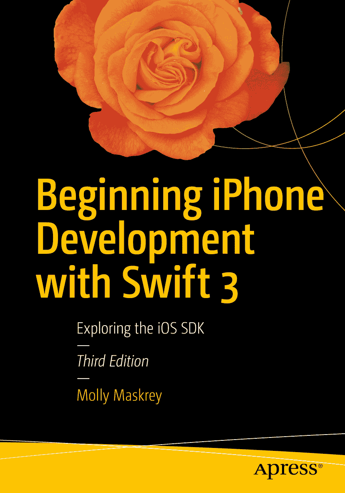

  
Molly Maskrey, Kim Topley, David Mark, Fredrik Olsson 和 Jeff Lamarche  
**Beginning iPhone Development with Swift 3**  
探索 iOS SDK 第 3 版

作者在本文中提及的任何源代码或其他补充材料，读者可在 [`www.apress.com`](http://www.apress.com) 获取。有关如何找到本书源代码的详细信息，请访问 [`www.apress.com/source-code/`](http://www.apress.com/source-code/)。  
ISBN 978-1-4842-2222-5  
电子版 ISBN 978-1-4842-2223-2  
DOI 10.1007/978-1-4842-2223-2  
美国国会图书馆控制号：2016959268  
© Molly Maskrey, Kim Topley, David Mark, Fredrik Olsson 和 Jeff Lamarche 2016  
本作品受版权保护。出版商保留所有权利，涉及材料的全部或部分内容，特别是翻译、重印、插图再利用、朗诵、广播、微缩胶片复制或任何其他物理形式的复制，以及信息存储与检索、电子改编、计算机软件，或现在已知或未来开发的类似或不同方法的传输权利。  
本书中可能出现商标名称、标识和图像。我们没有在每次出现商标名称、标识或图像时使用商标符号，而是仅以编辑方式使用这些名称、标识和图像，以维护商标所有者的利益，且无意侵犯商标权。本出版物中使用商品名称、商标、服务标志及类似术语，即使未明确标识，也不应被视为对其是否受专有权利保护的表达意见。  
尽管本书中的建议和信息在出版时被认为是真实和准确的，但作者、编辑和出版商均不对可能存在的任何错误或遗漏承担法律责任。出版商对本书所含内容不作任何明示或暗示的保证。  
印刷于无酸纸上  
本书通过 Springer Science+Business Media New York 在全球图书贸易中发行，地址：233 Spring Street, 6th Floor, New York, NY 10013。电话：1-800-SPRINGER，传真：(201) 348-4505，电子邮件：`orders-ny@springer-sbm.com`，或访问 `www.springer.com`。  
Apress Media, LLC 是加利福尼亚州的有限责任公司，其唯一股东（所有者）是 Springer Science + Business Media Finance Inc (SSBM Finance Inc)。SSBM Finance Inc 是特拉华州的一家公司。

能有机会撰写这一修订版，我感到无比幸运。多年前正是第一个版本引领我走上了 iOS 开发之路。为此，我要感谢我生命中那些特别的人，他们为这本书的完成功不可没。首先，感谢 Chana，她陪伴我度过了大约 95%的写作时光，一直鼓励我——尤其是在那些我觉得自己坚持不下去的日子里。她从我在“工作”中认识的人，变成了我生命中最亲密的朋友之一。每一天我都觉得她是上天赐予我、提升我生活质量的礼物。无论她何时需要我，我都会在她身边。  
感谢我近两年的闺蜜 Jessica（Goldi）。她曾作为我的伴娘支持我，她知道我何时需要她，并且总是为我守候，正如我一直以来以及未来也会为她所做的那样。我们一起喝酒、跳舞、混进公司派对、欢笑、哭泣……她不会让我敷衍了事，尤其不会让我自怨自艾。在她为期七周的南美葡萄酒之旅中，我们几乎每天联系。尽管我们相隔一个大陆，但这反而让我们更加亲密。  
Ashley，我答应过你会把你写进来。Ash 与我的关系与我其他朋友不同。作为一名技术极客，我们会坐在她家厨房的桌子旁，喝着酒，讨论重装电脑。她聪明、漂亮，是我认识的最可爱、最有趣的人之一。  
最后，感谢我的新婚妻子 Jennifer。她既是我的朋友、商业伙伴、老板、“偶尔”的舞伴，也是我入睡和醒来时陪伴在身边的人。她逐字阅读了本书，并确保其质量上乘。在过去几个月的个人挣扎中，这些朋友让我没有坠入一个可能永远无法回头的深渊。写作可能是一件孤独的事，而拥有像这些优秀、美好的女性组成的后援系统，是我这项努力成功的唯一原因。就在几周前，一位特别的朋友告诉我，有些朋友只在你生命中存在一季。我祈祷这些女性是我一生的朋友。  
——MM，2016 年 9 月

## 致谢

首先，我要感谢所有在我本可以轻易放弃时，给予我坚持写作、度过难关的支持的朋友们。感谢 Sam、Brittany、Amanda、Kristie、Pyper、Peter、Mikes、Kelly，以及丹佛 Galvanize-Platte 整个我所认识并喜爱的团队，谢谢你们。  
感谢科罗拉多儿童医院及其步态与运动分析中心，他们慷慨地让我参与了解他们为患有脑瘫及其他步态障碍的青少年所做工作的重要意义：我所获得的理解促使我集中精力帮助那些真正需要帮助的人。  
感谢 Global Tek Labs 的客户和朋友们，他们慷慨地允许我将他们的一些项目作为说明案例收入本书。感谢过去一年中参加我讲座的数百位听众，他们为本书内容提供了灵感，例如 John Haley 向我倾诉了他在 Xcode 中理解 Auto Layout 的苦恼。这些真实经历帮助我确定了书中所涵盖的主题。  
最后，我要感谢所有在我之前的作者们，他们为我的小小作品融入更广阔的天地奠定了基础。

