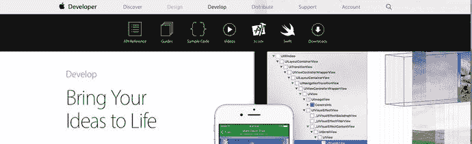
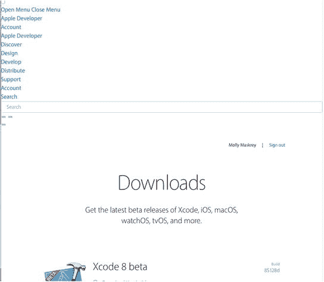
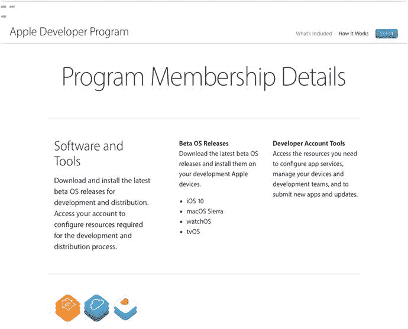

# 1. 初识 iOS 开发生态

电子补充材料 本章在线版本 (doi:[10.1007/978-1-4842-2223-2_1](http://dx.doi.org/10.1007/978-1-4842-2223-2_1)) 包含补充材料，仅供授权用户使用。

为苹果移动设备编程为开发者提供了一条回报丰厚且前景广阔的职业道路。你不仅可能通过自己的应用改变人们的生活（见图 1-1），还能与像你这样聪明且志同道合的男女一起度过美好时光。尽管在学习语言、工具和流程的过程中难免会遇到一些困难，但这些新伙伴不仅会帮助你穿越这个新世界的版图，还会激励你做到最好，并从平庸中脱颖而出。

图 1-1. 作为 iOS 开发者，最棒的感受之一就是看到别人在现实生活中使用你的作品

现在，请把我当作你在 iOS 探索之旅中的一位朋友。我非常自豪能够通过这个 iOS 开发世界的入门指南来帮助你，无论是针对 iPhone、iPod Touch 还是 iPad。iOS 提供了一个激动人心的平台，自 2007 年首次发布以来，它一直经历着爆炸式增长。移动设备的普及意味着人们无论走到哪里都在使用软件，无论是手机还是可穿戴设备，比如 Apple Watch。随着 iOS 10、Xcode 8、Swift 3 以及最新版 iOS 软件开发工具包 (SDK) 的发布，一切依然令人兴奋，并且对新开发者来说通常变得更加容易。

## 关于本书

本书将引导你走上创建自己 iOS 应用程序的道路。我希望帮你克服最初的困难，帮助你理解 iOS 应用程序的工作原理以及它们的构建方式。

当你阅读本书时，你将创建多个小型应用程序，每个应用都旨在突出特定的 iOS 功能，并向你展示如何控制或与这些功能交互。如果你将本书中获得的基础知识与自己的创造力和决心结合起来，再加上 Apple 提供的详尽且编写精良的文档，你将拥有构建自己专业 iPhone 和 iPad 应用所需的一切。

**注意：** 在本书的大部分内容中，我倾向于提及 iPhone 和 iPad，因为它们是我们最常用的设备。这绝不排除 iPod Touch；这只是为了行文方便。

**提示：** 本书先前版本的作者为本书设立了一个论坛。这是一个结识志同道合之人的好地方，你可以在这里提问并解答他人的问题。论坛地址为：[`http://forum.learncocoa.org`](http://forum.learncocoa.org)。一定要去看看！

## 你需要准备的事项

在你开始为 iOS 编写软件之前，你需要准备一些物品。首先，你需要一台基于 Intel 的 Macintosh 电脑，运行 Yosemite (OS X 10.10)、El Capitan (OS X 10.11)、Sierra (macOS 10.12) 或更高版本。任何近期的基于 Intel 的 Macintosh 电脑——笔记本电脑或台式机——都应该可以正常工作。当然，除了硬件，你还需要软件。只要你有 Apple ID，就可以学习如何开发 iOS 应用程序并获取所需的软件工具；如果你拥有 iPhone、iPad 或 iPod，那么你几乎肯定已经有了 Apple ID，但如果没有，请访问 [`https://appleid.apple.com/account`](https://appleid.apple.com/account) 创建一个。完成之后，导航至 [`https://developer.apple.com/develop`](https://developer.apple.com/develop)。这将带你进入一个类似图 1-2 所示的页面。

图 1-2. Apple 开发中心资源网站

点击顶部导航栏中的 Downloads，进入主资源页面（见图 1-3），查看当前的生产版本和（如果有的话）当前的 iOS 测试版。在这里，你将找到通往大量文档、视频、示例代码等的链接——所有这些都致力于教你 iOS 应用程序开发的精妙之处。请务必滚动到页面底部，查看网站文档和视频部分的链接。你还会找到 Apple Developer Forums 的链接，在那里你可以关注涵盖整个 iOS 平台以及 macOS、watchOS 和 tvOS 的各种主题的讨论。要在论坛发帖，你需要注册成为一名 Apple 开发者。

图 1-3. 你可以从 Downloads 页面下载开发工具的所有生产版本和测试版本。你需要使用你的 Apple ID 登录

**注意：** 在 2016 年 WWDC 2016 开发者大会上，Apple 将 OS X 的名称改回之前使用的 macOS，以使其与四个主要系统平台中使用的其他命名约定保持一致。

你开发 iOS 应用最重要的工具叫做 Xcode，这是 Apple 的集成开发环境 (IDE)。Xcode 包含用于创建和调试源代码、编译应用程序以及对你编写的应用进行性能调优的工具。

你可以按照图 1-3 所示的开发者下载页面中的 Xcode 链接，下载当前 Xcode 的测试版。如果你更喜欢使用最新的生产版本，可以在 Mac App Store 中找到它，你可以通过 Mac 的 Apple 菜单访问。

### SDK 版本与示例源代码

随着 SDK 和 Xcode 版本的演变，其下载机制在过去几年中也发生了变化。Apple 现在在 Mac App Store 上发布当前生产版本的 Xcode 和 iOS SDK，同时向开发者提供从其开发者网站下载即将发布版本的预览版的能力。总结一下：除非你真的想使用最新的开发工具和平台 SDK，否则你通常希望下载最新发布的（非测试版）Xcode 和 iOS SDK 版本，因此请使用 Mac App Store。

本书是为与最新版本的 Xcode 和 SDK 配合使用而编写的。某些地方介绍了 iOS 10 中引入的新函数或新方法，这些在早期版本的 SDK 中是不可用的。

请务必从本书在 [`www.apress.com`](http://www.apress.com) 的页面下载最新、最全的示例源代码压缩包。代码会随着 SDK 新版本的发布而更新，因此请定期查看该网站。

### 开发者的选择

免费下载的 `Xcode` 包含一个模拟器，可让您在 Mac 上构建和运行 iPhone 与 iPad 应用，为学习 iOS 编程提供了理想环境。然而，模拟器并不支持许多依赖硬件的功能，例如加速度计和摄像头。要测试使用这些功能的应用程序，你需要一部 iPhone、iPod touch 或 iPad。虽然大部分代码可以通过 iOS 模拟器测试，但并非所有程序都行。即便能在模拟器上运行的程序，在考虑向公众发布之前，也必须在真实设备上进行彻底测试。

旧版 `Xcode` 要求你注册 Apple Developer Program（非免费）才能将应用安装到真实的 iPhone 或其他设备上。幸运的是，这种情况已经改变。`Xcode 7` 开始允许开发者在无需购买 Apple Developer Program 会员资格的情况下，在实际硬件上测试应用，不过我们将随着进度介绍一些限制。这意味着你可以免费在 iPhone 或 iPad 上运行本书中的大部分示例！但免费选项不提供在 Apple App Store 分发应用的功能。如需这些功能，你需要注册其他付费选项：

- **标准计划**费用为 99 美元/年，提供一系列开发工具与资源、技术支持，以及通过 Apple 的 iOS 和 Mac App Store 分发应用的服务。会员资格允许你开发和分发适用于 iOS、watchOS、tvOS 和 macOS 的应用。
- **企业计划**费用为 299 美元/年，专为开发内部专用 iOS 应用的公司设计。

有关这些计划的更多详情，请访问 [`https://developer.apple.com/programs`](https://developer.apple.com/programs)（见图 1-4）。如果你是独立开发者，购买标准计划会员即可。你不必立即行动，直到你需要运行一个需要使用诸如 `iCloud` 等需要付费会员的功能的应用，或者想在 Apple 开发者论坛提问，或者准备将应用部署到 App Store 时再购买也不迟。

图 1-4 注册付费会员可访问 Beta 版和 OS 工具发布版

由于 iOS 支持始终连接的移动设备，且这些设备使用其他公司的无线基础设施，因此 Apple 对 iOS 开发者施加的限制远多于对 Mac 开发者（目前 Mac 开发者编写和分发程序完全无需 Apple 的监督或批准）。即使 iPod touch 和仅支持 Wi-Fi 的 iPad 不使用任何第三方基础设施，它们也仍需遵守同样的限制。

Apple 增加这些限制并非出于苛刻，而是为了尽量降低恶意或编写拙劣的程序被分发并降低共享网络性能的风险。为 iOS 开发看似需要跨越许多障碍，但 Apple 已付出巨大努力，尽可能简化流程。而且，99 美元的费用仍远低于购买例如 `Visual Studio`（微软的软件开发 IDE）的付费版本的价格。

### 你需要了解的基础

在本书中，我假定你已经具备一定的编程知识，特别是面向对象编程（例如，你了解类、对象、循环和变量是什么）。当然，我并不假设你已经熟悉 `Swift`。本书末尾有一个附录，向您介绍 `Swift` 和 `Xcode` 中的 `Playground` 功能，该功能可让你轻松尝试各种特性。如果你在阅读附录内容后想了解更多关于 `Swift` 的知识，最佳途径是直接阅读原始资料《The Swift Programming Language》，这是 Apple 自己的语言指南和参考手册。你可以从 iBooks 商店获取，或访问 iOS 开发者网站 [`https://developer.apple.com/library/ios/documentation/Swift/Conceptual/Swift_Programming_Language/index.html`](https://developer.apple.com/library/ios/documentation/Swift/Conceptual/Swift_Programming_Language/index.html)。

此外，你还需要作为用户熟悉 iOS 本身。就像你为任何平台编写应用程序一样，去了解 iPhone、iPad 或 iPod touch 的细微差别和独特性。花时间熟悉 iOS 界面，以及 Apple 的 iPhone 和/或 iPad 应用的外观和感觉。

由于不同术语起初可能令人困惑，表 1-1 显示了 IDE、API、语言与你正在开发的平台操作系统之间的关系。

表 1-1 平台、工具、语言关系

| 开发目标 | API | 语言 |
| --- | --- | --- |
| macOS | `Cocoa` | Objective-C, Swift |
| iOS | `Cocoa Touch` | Objective-C, Swift |

### iOS 开发的一些独特之处

如果你从未使用 `Cocoa` 为 Mac 编写程序，你可能会觉得 `Cocoa Touch`（你将用于编写 iOS 应用的应用程序框架）有些陌生。它与常见的应用程序框架（如构建 .NET 或 Java 应用时使用的框架）存在一些根本性差异。如果一开始感到迷茫，不必过于担心。只需坚持完成练习，一段时间后一切都会豁然开朗。

> **注**
> 你将在本书中看到大量对“框架”的引用。虽然这个术语有点模糊，并且根据上下文有几种不同的用法，但框架本质上是一个“东西”的集合，可能包含一个库或多个库、脚本、UI 元素以及任何其他内容。框架中的内容通常与某些特定功能相关联，例如使用 `CoreLocation` 框架的定位服务。

如果你曾使用 `Cocoa` 编写程序，你会发现 iOS SDK 中的许多内容都很熟悉。大量类与开发 macOS 时使用的版本完全相同。即使是那些不同的类，也往往遵循相同的基本原则和类似的设计模式。然而，`Cocoa` 和 `Cocoa Touch` 之间确实存在若干差异。

无论你背景如何，都需要牢记 iOS 开发与桌面应用开发之间的一些关键区别。这些区别将在以下各节中讨论。

#### iOS 通常一次仅支持一个应用程序

在 iOS 上，通常在任何给定时刻，屏幕上只能有一个应用处于活跃状态并显示。自 iOS 4 以来，应用在用户按下 Home 键后可以在后台运行；但即便如此，这也仅限于少数情况，并且你需要专门为此编写代码（你将在第 15 章中详细了解具体做法）。在 iOS 9 中，Apple 增加了两个应用在前台并共享屏幕的能力，但这需要用户拥有较新款的 iPad。我们将在第 11 章中讨论这一被称为“多任务处理”的功能。

当你的应用不处于活跃状态或不在后台运行时，它完全不会获得 CPU 的任何处理时间。iOS 允许后台处理，但要让你的应用在这种情境下良好运行，需要你付出一些努力。

#### 只有一个窗口

桌面和笔记本电脑操作系统允许同时运行多个程序，每个程序都能创建并控制多个窗口。然而，除非你连接了外接屏幕或使用`AirPlay`，并且你的应用程序已编程支持多屏幕处理，否则 iOS 只为你的应用程序提供一个“窗口”来操作。你的应用程序与用户的所有交互都发生在这个唯一的窗口中，其大小固定为屏幕尺寸，除非用户激活了分屏多任务功能，在这种情况下，你的应用程序可能需要将部分屏幕空间让给其他应用。

#### 为安全起见，设备资源的访问受到限制

在桌面或笔记本电脑上运行的程序，几乎可以访问启动它的用户所拥有的一切资源。但 iOS 会严格限制你的程序可以使用设备的哪些部分。

你只能从 iOS 文件系统中专门为你的应用程序创建的那部分区域读写文件。这个区域被称为应用程序的沙盒。你的沙盒是你的应用程序存储文档、偏好设置以及可能需要保留的其他所有类型数据的地方。

你的应用程序在其他方面也受到限制。例如，你无法访问 iOS 上的低编号网络端口，也无法执行任何在桌面电脑上通常需要 root 或管理员权限的操作。

#### 应用需要快速响应

由于其使用方式，iOS 需要保持灵敏，并且它也期望你的应用程序具备同样的特性。当你的程序启动时，你需要尽快——最好在几秒钟内——打开应用、加载偏好设置和数据、并在屏幕上显示主视图。你的应用应该具有低延迟。

**注意**

这里所说的延迟，并不是指速度。速度和延迟常被混用，但这并不准确。延迟指的是从采取动作到产生结果之间的时间。如果用户按下 Home 键，iOS 会返回到主屏幕，你必须在 iOS 将你的应用挂起到后台之前快速保存所有内容。如果你保存并交出控制权耗时超过五秒，你的应用程序进程将被终止，无论你是否保存完毕。有一个 API 允许你的应用在即将转入后台时请求额外的时间来工作，但你需要知道如何使用它。因此，一般来说，你需要快速完成任务，这可能意味着舍弃并丢失不必要的信息。

#### 有限的屏幕尺寸

iPhone 的屏幕非常出色。在首次推出时，它曾是手持消费设备中分辨率最高的屏幕，远超其他同类产品。但即使到了今天，iPhone 的显示屏也不算很大，因此，相比现代电脑，你可用的显示空间要小得多。最初几代 iPhone 的屏幕仅为 320 × 480，后来随着 iPhone 4 引入 Retina 显示屏，分辨率在两个维度上都翻倍，达到了 640 × 960。如今，最大尺寸的 iPhone（iPhone 6/6s Plus）屏幕分辨率为 1080 × 1920 像素。这听起来像素数量可观，但请记住，这些高密度显示屏（苹果称之为`Retina`）被塞进了非常小的外形尺寸中，这对你能在 iPhone 甚至 iPad 上提供的应用程序类型和交互方式产生了巨大影响。表 1-2 列出了在撰写本文时，所有当前常见的、受 iOS 10 支持的苹果设备的屏幕尺寸。

**表 1-2.** iOS 设备屏幕尺寸

| 设备 | 硬件尺寸 | 软件尺寸 | 缩放比例 |
| --- | --- | --- | --- |
| iPhone 5 和 5s | 640 x 1136 | 320 x 568 | 2x |
| iPhone 6/6s | 750 x 1334 | 375 x 667 | 2x |
| iPhone 6/6s Plus | 1080 x 1920 | 414 x 736 | 3x |
| iPhone SE | 640 x 1136 | 320 x 568 | 2x |
| iPad 2 和 iPad mini | 768 x 1024 | 768 x 1024 | 1x |
| iPad Air、iPad Air 2、iPad Retina 和 iPad mini Retina | 1536 x 2048 | 768 x 1024 | 2x |
| iPad Pro | 2732 × 2048 | 1366 × 1024 | 2x |

硬件尺寸是屏幕实际的物理像素尺寸。然而，在编写软件时，真正重要的是“软件尺寸”一列中的数值。如你所见，在大多数情况下，软件尺寸仅为实际硬件尺寸的一半。这种情况源于苹果推出第一款 Retina 设备时，该设备在每个方向上的像素数量都是前一代的两倍。如果苹果不采取任何特殊措施，所有现有应用程序在新 Retina 屏幕上都会以一半尺寸绘制，这将使其无法使用。因此，苹果选择在内部将所有应用程序绘制的内容缩放 2 倍，以便它们无需任何代码更改即可填满新屏幕。除了 iPhone 6/6s Plus 因其更高密度的屏幕需要 3 倍缩放因子外，这种内部 2 倍缩放适用于所有配备`Retina`显示屏的设备。不过，在大多数情况下，你无需过分担心应用程序被缩放的事实——你只需要在软件屏幕尺寸内工作，剩下的交给 iOS 处理即可。

这一规则唯一的例外是位图图像。由于位图图像本质上是固定尺寸的，为了获得最佳效果，你不能在`Retina`屏幕上使用与非`Retina`屏幕上相同的图像。如果尝试这样做，你会看到 iOS 会为具有`Retina`屏幕的设备放大你的图像，从而导致模糊。你可以通过为`2x`和`3x`的`Retina`屏幕各提供一份单独的图像副本来解决这个问题。iOS 会选择与你应用运行设备屏幕相匹配的那个版本。

**注意**

如果你回看表 1-1，会发现第四列的缩放比例似乎与硬件尺寸和软件尺寸的比率相同。例如，在 iPhone 6/6s 上，硬件宽度为 750，软件宽度为 375，比率为 2:1。但请仔细观察，你会发现 iPhone 6/6s Plus 有所不同。硬件宽度与软件宽度的比率是 1080/414，即 2.608:1，高度比率也是如此。因此，就硬件而言，iPhone 6/6s Plus 并不具备真正的`3x` `Retina`显示屏。然而，就软件而言，使用的是`3x`缩放，这意味着一个为使用 414 × 736 软件屏幕尺寸而编写的应用程序，首先会被逻辑映射到一个 1242 × 2208 的虚拟屏幕尺寸，然后结果会被略微缩小以匹配 1080 × 1920 的实际硬件尺寸。幸运的是，这不需要你做任何特殊处理，因为 iOS 会处理所有细节。

#### 有限的设备资源

十几年前的软件开发人员会嘲笑一台拥有至少 512MB RAM 和 16GB 存储空间的机器竟会被视为资源受限，但这却是事实。iOS 开发与试图在仅有 48KB 内存的机器上编写复杂电子表格应用不可同日而语。但考虑到 iOS 的图形化特性及其所能实现的功能，内存耗尽的情况时有发生。

目前可用的 iOS 设备要么配备 512MB 物理 RAM（iPhone 4S、iPad 2、初代 iPad mini、最新款 iPod touch），要么配备 1024MB 物理 RAM（iPhone 5c、iPhone 5s、iPhone 6/6s、iPhone 6/6s Plus、iPad Air、iPad Air 2、iPad mini Retina），不过这一容量未来很可能会增加。其中部分内存用于屏幕缓冲区和其他系统进程。通常，留给应用使用的内存不超过总量的一半，实际可用量可能更少，尤其是现在其他应用也能在后台运行。

虽然这听起来给这样一台小型计算机留下了相当可观的内存空间，但在考虑 iOS 内存问题时，还有一个因素需要留意。现代计算机操作系统（如 macOS）会将未被使用的内存块写入磁盘，形成所谓的交换文件。交换文件允许应用在请求的内存超出计算机实际可用容量时继续运行。然而，iOS 不会将易失性内存（如应用数据）写入交换文件。因此，你的应用可用的内存量受到 iOS 设备中未使用的物理内存量的限制。

Cocoa Touch 内置了通知应用内存不足的机制。当这种情况发生时，你的应用必须释放不需要的内存，否则将面临被强制退出的风险。

#### iOS 设备独有的特性

既然我们提到 Cocoa Touch 缺少 Cocoa 的某些功能，那么公平起见，也应当提及 iOS SDK 包含一些当前 Cocoa 不具备的功能——或者至少并非每台 Mac 都可用：

*   iOS SDK 提供了让应用通过 Core Location 获取 iOS 设备当前地理坐标的方法。
*   大多数 iOS 设备内置摄像头和照片库，SDK 提供了让应用访问这两者的机制。
*   iOS 设备内置运动传感器，可让你检测设备的持握方式和移动状态。

#### 用户输入与显示

由于 iOS 设备没有物理键盘或鼠标，你与用户的交互方式与为通用计算机编程时不同。幸运的是，大部分交互操作已为你处理妥当。例如，如果你在应用中添加了一个文本字段，iOS 会在用户触摸该字段时自动弹出键盘，无需你编写任何额外代码。

**注意：** 所有 iOS 设备都支持通过蓝牙或 Lightning 接口连接外接键盘，这能带来出色的键盘体验并节省屏幕空间。目前，iOS 不支持连接鼠标。

## 本书内容

当我最初开始为 iOS（当时称为 iPhone OS）编写应用程序时，我拿起了这本基于 Objective-C 的原版书。至少在我看来，我成为了一名有能力且高效的应用开发者，甚至通过自己的产品赚了一些钱。因此，我想通过提供最新、最完善的版本作为回报，帮助你取得同样的成功，甚至更大的成就。那么，接下来就是我即将涵盖的内容：

* 在第 2 章，你将学习如何使用 Xcode 的用户界面（UI）开发工具`Interface Builder`，创建简单的可视化结果，在屏幕上放置文本。
* 在第 3 章，我将向你展示如何开始与用户交互，构建一个基于用户按下的按钮动态更新显示文本的应用程序。
* 第 4 章延续第 3 章的内容，向你介绍更多 iOS 标准用户界面控件。我还将演示如何使用警示框（Alerts）和操作表（Action Sheets）来提示用户做出决定，或通知他们发生了异常情况。
* 在第 5 章，我们将探讨旋转处理与自动布局（Auto Layout），这是使 iOS 应用程序能够在竖屏和横屏模式下使用的机制。
* 在第 6 章，我将开始讨论更高级的用户界面，并探索创建支持多个视图的应用程序。我将向你展示如何在运行时改变向用户显示的视图，这将极大地增强应用程序的潜力。
* iOS 支持标签栏（Tab bars）和选择器（Pickers），它们属于标准 iOS 用户界面的一部分。在第 7 章，我们将探讨如何实现这些界面元素。
* 在第 8 章，我们将介绍表视图（Table Views），它是向用户提供数据列表的主要方式，也是基于层级导航的应用程序的基础。你还将了解如何让用户搜索应用程序的数据。
* 最常见的 iOS 应用程序界面之一——层级列表，允许你向下钻取以查看更多数据或详细信息。在第 9 章，你将学习实现这种标准界面类型所涉及的内容。
* 从一开始，iOS 应用程序就使用表视图来显示组件组成的动态、垂直滚动列表。几年前，Apple 引入了一个名为`UICollectionView`的新类，将这一概念向前推进了几步，为开发者在布局可视化组件方面提供了大量新的灵活性。第 10 章向你介绍集合视图（Collection Views）。
* 第 11 章展示了如何构建主从（Master-Detail）应用程序，呈现一个项目列表（如邮箱中的电子邮件），允许用户一次查看每个单独项目的详细信息。你还将使用支持这一概念的 iOS 控件，该概念最初为 iPad 开发，现在也可在 iPhone 上使用。
* 在第 12 章，我们将探讨实现应用程序设置，这是 iOS 允许用户设置其应用级偏好的机制。
* 第 13 章涵盖了 iOS 上的数据管理。我们将讨论创建用于保存应用程序数据的对象，并了解这些数据如何持久化到 iOS 的文件系统中。我将介绍使用`Core Data`的基础知识，使你能够轻松地保存和检索数据；然而，关于`Core Data`的深入讨论，建议查阅 Michael Privat 和 Robert Warner 合著的《Pro iOS Persistence Using Core Data》（Apress， 2014）。
* 在 iOS 5 中，Apple 推出了`iCloud`，允许你的文档在线存储数据并在应用程序的不同实例之间同步。第 14 章向你展示如何开始使用`iCloud`。
* iOS 开发者可以使用一个强大的库来简化多线程开发，这个库叫做`Grand Central Dispatch`，简称`GCD`。在第 15 章，我将向你介绍`Grand Central Dispatch`，并展示如何在特定条件下使用 iOS 功能让应用程序在后台运行。
* 每个人都喜欢绘图，因此我们将在第 16 章中探讨自定义绘图，届时我们将向你介绍 Core Graphics 系统。
* 在 iOS 7 中，Apple 引入了一个名为`Sprite Kit`的新框架，用于创建 2D 游戏。它包括物理引擎和动画系统，也适用于制作 macOS 游戏。你将在第 17 章中学习如何使用`Sprite Kit`制作一个简单的游戏。
* 所有 iOS 设备普遍配备的多点触控屏幕可以接受用户的各种手势输入。在第 18 章，你将全面学习如何检测基本手势，例如捏合和滑动。
* 得益于`Core Location`功能，你的 iPhone 可以轻松告知你当前位置的经纬度。在第 19 章，我们将编写一些代码，使用`Core Location`来确定你的当前位置。
* 在第 20 章，我们将探讨如何与 iOS 的加速计和陀螺仪进行交互，这是你的设备了解自身被握持的方向、移动速度和方向以及其在世界中所处位置的方式。
* 几乎所有 iOS 设备都包含摄像头和图片库，这两者都可以被你的应用程序访问。第 21 章讨论了摄像头的使用以及对照片库的访问。
* Apple 目前向超过 90 个国家销售 iOS 设备。在第 22 章，我将向你展示如何编写应用程序，使得所有部分都能轻松翻译成其他语言。这有助于扩大应用程序的潜在用户群。
* 最后，还有一个附录介绍了当前版本的 Swift 编程语言，并涵盖了理解本书示例代码所需的所有特性。

### 本次更新有哪些新内容？

在第一版本书上市后，iOS 开发社区以惊人的速度发展。SDK 不断演进，Apple 发布了一系列稳定的 SDK 更新。iOS 10 和 Xcode 8 包含了许多新增强功能。我一直致力于更新本书，以涵盖你为开始编写 iOS 应用程序而需要了解的新技术。

### Swift 与 Xcode 版本

虽然已经发布了两年多，但 Swift 仍然处于不断变化的状态，并且很可能在未来一段时间内继续如此。有趣的是，Apple 承诺现在编写的应用程序的编译二进制文件将在后续版本的 iOS 上运行，但不能保证这些应用程序的源代码能够继续编译。因此，本书出版时与当前版本的 Xcode 编译并运行的示例代码，在你阅读时可能已不再适用。Xcode 6.0 搭载了 Swift 1 版本，Xcode 6.3 搭载了 Swift 1.2 版本，Xcode 7 引入了 Swift 2。本书中的代码是为 Xcode 8 和 Swift 3 的 Beta 版编写并进行测试的。

如果你发现某些示例源代码在你使用的 Xcode 版本下无法编译，请访问本书页面[`www.apress.com`](http://www.apress.com)并下载最新版本。如果下载后你仍遇到问题，请通过在 Apress 网站上提交勘误表来引起我们的注意。

### 让我们开始吧

iOS 提供了一个令人惊叹的计算平台，也为你的开发职业生涯开辟了激动人心的新领域。你很可能发现，为 iOS 编程是一种全新的体验——与在其他任何平台上工作都截然不同。一切看似熟悉的事物，背后都会有陌生之处——但随着你阅读本书的代码，这些概念会逐渐融会贯通，变得易于理解。

请记住，本书中的示例并非一个简单的清单，完成它们并不能神奇地让你成为 iOS 开发专家。在进入下一个项目之前，请确保你理解了自己做了什么以及为什么这样做。不要害怕修改代码。通过观察实验的结果，你可以掌握在像 `Cocoa Touch` 这样的环境中进行编码的复杂性。

话虽如此，如果你已经下载并安装了 `Xcode`，那就翻开下一页，迈出成为真正 iOS 应用开发者的下一步吧。

